[TOC]


# Chapter 2 Fundamentals of Machine Learning

## 2.1 Understanding the essence of machine learning

Machine Learning (ML), as the name suggests, lets the machine learn. Here, the machine refers to the computer, which is the physical carrier of the algorithm. You can also think of the various algorithms as a machine with input and output. So what do you want the computer to learn? For a task and its performance measurement method, an algorithm is designed to enable the algorithm to extract the laws contained in the data. This is called machine learning. If the data entered into the machine is tagged, it is called supervised learning. If the data is unlabeled, it is unsupervised learning.

## 2.2 Various common algorithm icons

|Regression Algorithm|Clustering Algorithm|Regularization Method|
|:-:|:-:|:-:|
||||

| Decision Tree Learning | Bayesian Methods | Kernel-Based Algorithms |
|:-:|:-:|:-:|
||||

|Clustering Algorithm|Association Rule Learning|Artificial Neural Network|
|:-:|:-:|:-:|
||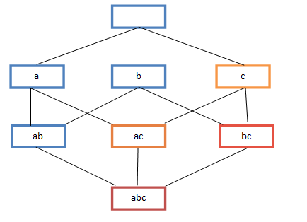||

|Deep Learning|Lower Dimensional Algorithm|Integrated Algorithm|
|:-:|:-:|:-:|
|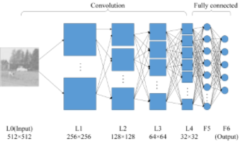||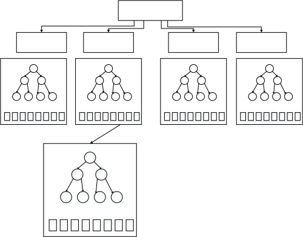|

## 2.3 Supervised learning, unsupervised learning, semi-supervised learning, weak supervision learning?
There are different ways to model a problem, depending on the type of data. According to different learning methods and input data, machine learning is mainly divided into the following four learning methods.

**Supervised learning**:
1. Supervised learning is the use of examples of known correct answers to train the network. A process in which data and its one-to-one correspondence are known, a prediction model is trained, and input data is mapped to a label.
2. Common application scenarios for supervised learning such as classification and regression.
3. Common supervised machine learning algorithms include Support Vector Machine (SVM), Naive Bayes, Logistic Regression, K-Nearest Neighborhood (KNN), Decision Tree (Decision Tree), Random Forest, AdaBoost, and Linear Discriminant Analysis (LDA). Deep Learning is also presented in the form of supervised learning.

**Unsupervised learning**:

1. In unsupervised learning, data is not specifically identified and applies to situations where you have a data set but no tags. The learning model is to infer some of the internal structure of the data.
2. Common application scenarios include learning of association rules and clustering.
3. Common algorithms include the Apriori algorithm and the k-Means algorithm.

**Semi-supervised learning**:

1. In this learning mode, the input data part is marked and some parts are not marked. This learning model can be used for prediction.
2. The application scenario includes classification and regression. The algorithm includes some extensions to commonly used supervised learning algorithms. By modeling the marked data, on the basis of this, the unlabeled data is predicted.
3. Common algorithms such as Graph Inference or Laplacian SVM.

**Weakly supervised learning**:

1. Weak supervised learning can be thought of as a collection of data with multiple tags, which can be empty sets, single elements, or multiple elements containing multiple cases (no tags, one tag, and multiple tags) .
2. The label of the data set is unreliable. The unreliable here can be incorrect mark, multiple marks, insufficient mark, local mark, etc.
3. A process in which known data and its one-to-one weak tags train an intelligent algorithm to map input data to a stronger set of tags. The strength of the label refers to the amount of information contained in the label. For example, the label of the classification is a weak label relative to the divided label.
4. For example, to give a picture containing a balloon, you need to get the position of the balloon in the picture and the dividing line of the balloon and the background. This is the problem that the weak tag is known to learn strong tags.

   In the context of enterprise data applications, the most common ones are the models of supervised learning and unsupervised learning. In the field of image recognition, semi-supervised learning is a hot topic due to the large amount of non-identified data and a small amount of identifiable data.

## 2.4 What steps are there to supervise learning?
Supervised learning is the use of examples of known correct answers to train the network, with a clear identification or result for each set of training data. Imagine we can train a network to recognize a photo of a balloon from a photo gallery (which contains a photo of a balloon). Here are the steps we will take in this hypothetical scenario.

**Step 1: Data set creation and classification**
First, browse through your photos (datasets), identify all the photos that contain balloons, and mark them. Then, divide all the photos into a training set and a verification set. The goal is to find a function in the deep network. This function input is any photo. When the photo contains a balloon, it outputs 1, otherwise it outputs 0.

**Step 2: Data Augmentation**
When the original data is collected and labeled, the data collected generally does not necessarily contain the information under the various disturbances. The quality of the data is critical to the predictive power of the machine learning model, so data enhancement is generally performed. For image data, data enhancement generally includes image rotation, translation, color transformation, cropping, affine transformation, and the like.

**Step 3: Feature Engineering**
In general, feature engineering includes feature extraction and feature selection. The common Hand-Crafted Feature includes Scale-Invariant Feature Transform (SIFT) and Histogram of Oriented Gradient (HOG). Since the manual features are heuristic, the starting point behind the algorithm design is different. When these features are combined, there may be conflicts, how to make the performance of the combined features play out, and the original data is discriminating in the feature space. To use, the method of feature selection is needed. After the success of the deep learning method, a large part of people no longer pay attention to the feature engineering itself. Because the most commonly used Convolutional Neural Networks (CNNs) are themselves an engine for feature extraction and selection. The different network structures, regularization, and normalization methods proposed by the researchers are actually feature engineering in the context of deep learning.

**Step 4: Building predictive models and losses**
After mapping the raw data to the feature space, it means that we have a reasonable input. The next step is to build a suitable predictive model to get the output of the corresponding input. How to ensure the consistency of the output of the model and the input label, it is necessary to construct the loss function between the model prediction and the label. The common loss function (Loss Function) has cross entropy and mean square error. The process of continuously iterating through the optimization method to change the model from the initial initialization state to the predictive model step by step is actually the learning process.

**Step 5: Training**
Select the appropriate model and hyperparameter for initialization, such as the kernel function in the support vector machine, the penalty weight of the error term, and so on. After the model initialization parameters are set, the prepared feature data is input into the model, and the gap between the output and the label is continuously reduced by a suitable optimization method. When the iterative process reaches the cutoff condition, the trained model can be obtained. The most common method of optimization is the gradient descent method and its variants. The premise of using the gradient descent method is that the optimization objective function is deducible for the model.

**Step 6: Verification and Model Selection**
After training the training set image, you need to test the model. Use validation sets to verify that the model can accurately pick out photos with balloons.
In this process, steps 2 and 3 are usually repeated by adjusting various things related to the model (hyperparameters), such as how many nodes are there, how many layers are there, and what kind of activation and loss functions are used. Actively and effectively train weights and so on to the stage of communication.

**Step 7: Testing and Application**
When you have an accurate model, you can deploy it to your application. You can publish the forecasting function as an API (Application Programming Interface) call, and you can call the API from the software to reason and give the corresponding results.

## 2.5 Multi-instance learning?
Multiple Instance Learning (MIL): A package that knows the data packets and data packets containing multiple data, trains intelligent algorithms, maps data packets to labels, and presents packages in some problems. The label for each data within.
For example, if a video consists of many images, if it is 10,000, then we need to determine whether the video contains an object, such as a balloon. It is too time-consuming to label a frame with a balloon. It is usually time to say whether there is a balloon in this video, and you get the data of multiple examples. Not every 10000 frame of data has a balloon. As long as there is a balloon in one frame, we think that the packet has a balloon. Only when all video frames have no balloons, there is no balloon. From which part of the video (10000 photos) to learn whether there is a balloon, it is a problem of multi-instance learning.

## 2.6 What is a neural network?
A neural network is a network that connects multiple neurons in accordance with certain rules. Different neural networks have different connection rules.
For example, Full Connected (FC) neural network, its rules include:

1. There are three layers: input layer, output layer, and hidden layer.
2. There is no connection between neurons in the same layer.
3. The meaning of fully connected: each neuron in the Nth layer is connected to all neurons in the N-1th layer, and the output of the N-1th layer neuron is the input to the Nth layer neuron.
4. Each connection has a weight.

    **Neural Network Architecture**
    The picture below is a neural network system, which consists of many layers. The input layer is responsible for receiving information, such as a picture of a cat. The output layer is the result of the computer's judgment on this input information, it is not a cat. The hidden layer is the transfer and processing of input information.
    

## 2.7 Understanding Local Optimization and Global Optimization

Laughing about local optimality and global optimality

> Plato one day asks the teacher Socrates what is love? Socrates told him to go to the wheat field once, picking the biggest wheat ear back, not to look back, only to pick it once. Plato started out empty. His reason was that he saw it well, but he didn't know if it was the best. Once and fortunately, when he came to the end, he found that it was not as good as the previous one, so he gave up. Socrates told him: "This is love." This story makes us understand a truth, because of some uncertainty in life, so the global optimal solution is difficult to find, or does not exist at all, we should Set some qualifications, and then find the optimal solution in this range, that is, the local optimal solution - some seizures are better than empty ones, even if this seizure is just an interesting experience.
> Plato asked one day what marriage is? Socrates told him to go to the woods once and choose the best tree to make a Christmas tree. He also refused to look back and only chose once. This time he was tired and dragged a sapling tree that looked straight, green, but a little sparse. His reason was that with the lessons of the last time, it was hard to see a seemingly good one and found time. Physical strength is not enough, and whether it is the best or not, I will get it back. Socrates told him: "This is marriage."

Optimization problems are generally divided into local optimization and global optimization.

1. Local optimization is to find the minimum value in a finite region of the function value space; and global optimization is to find the minimum value in the entire region of the function value space.
2. The local minimum point of a function is the point at which its function value is less than or equal to a nearby point. But there may be points that are larger than the distance.
3. The global minimum is the kind of feasible value whose function value is less than or equal to all.

## 2.8 Classification algorithm

Classification algorithms and regression algorithms are different ways of modeling the real world. The classification model considers that the output of the model is discrete. For example, nature's creatures are divided into different categories and are discrete. The output of the regression model is continuous. For example, the process of changing a person's height is a continuous process, not a discrete one.

Therefore, when using the classification model or the regression model in the actual modeling process, it depends on your analysis and understanding of the task (real world).

### 2.8.1 What are the advantages and disadvantages of common classification algorithms?

| Algorithm | Advantages | Disadvantages |
|:-|:-|:-|
|Bayes Bayesian Classification | 1) The estimated parameters required are small and insensitive to missing data. <br /> 2) has a solid mathematical foundation and stable classification efficiency. |1) It is necessary to assume that the attributes are independent of each other, which is often not true. (I like to eat tomatoes and eggs, but I don't like to eat tomato scrambled eggs). <br /> 2) Need to know the prior probability. <br /> 3) There is an error rate in the classification decision. |
|Decision Tree Decision Tree |1) No domain knowledge or parameter assumptions are required. <br /> 2) Suitable for high dimensional data. <br /> 3) Simple and easy to understand. <br /> 4) Processing a large amount of data in a short time, resulting in a feasible and effective result. <br /> 5) Ability to process both data type and regular attributes. |1) For inconsistent data for each category of samples, the information gain is biased towards those features with more values. <br /> 2) Easy to overfit. <br /> 3) Ignore the correlation between attributes. <br /> 4) Online learning is not supported. |
|SVM support vector machine | 1) can solve the problem of machine learning in small samples. <br /> 2) Improve generalization performance. <br /> 3) can solve high-dimensional, nonlinear problems. Ultra-high-dimensional text classifications are still popular. <br /> 4) Avoid neural network structure selection and local minimum problems. |1) Sensitive to missing data. <br /> 2) Memory consumption is large and difficult to explain. <br /> 3) Running and tuning is a bit annoying. |
|KNN K Neighbors|1) Simple thinking, mature theory, can be used for classification or regression; <br /> 2) can be used for nonlinear classification; <br /> 3) Training time complexity is O (n); <br /> 4) High accuracy, no assumptions about the data, not sensitive to the outlier; |1) The amount of calculation is too large. <br /> 2) For the problem of unbalanced sample classification, misjudgment will occur. <br /> 3) A lot of memory is needed. <br /> 4) The output is not very interpretable. |
|Logistic Regression Logistic Regression|1) Fast. <br /> 2) Simple and easy to understand, directly see the weight of each feature. <br /> 3) The model can be easily updated to absorb new data. <br /> 4) If you want a probability framework, dynamically adjust the classification threshold. |Feature processing is complicated. There is a need for normalization and more feature engineering. |
|Neural Network Neural Network|1) High classification accuracy. <br /> 2) Parallel processing capability. <br /> 3) Distributed storage and learning capabilities. <br /> 4) Strong robustness and not susceptible to noise. |1) A large number of parameters (network topology, threshold, threshold) are required. <br /> 2) The results are difficult to explain. <br /> 3) Training time is too long. |
|Adaboosting|1)adaboost is a classifier with very high precision. <br /> 2) Various methods can be used to construct the sub-classifier, and the Adaboost algorithm provides the framework. <br /> 3) When using a simple classifier, the calculated results are understandable. And the weak classifier is extremely simple to construct. <br /> 4) Simple, no need to do feature screening. <br /> 5) Don't worry about overfitting. |sensitive to outlier|


### 2.8.2 How to evaluate the classification algorithm?
- **Several common terms**
  Here are a few common model evaluation terms. Now suppose that our classification target has only two categories, which are considered positive and negative:
   1) True positives (TP): the number of positive cases that are correctly divided into positive examples, that is, the number of instances that are actually positive and are classified as positive by the classifier;
   2) False positives (FP): the number of positive examples that are incorrectly divided into positive examples, that is, the number of instances that are actually negative but are classified as positive by the classifier;
   3) False negatives (FN): the number of instances that are incorrectly divided into negative examples, that is, the number of instances that are actually positive but are classified as negative by the classifier;
   4) True negatives(TN): The number of negative cases that are correctly divided into negative examples, which are actually negative examples and are divided into negative examples by the classifier.


The figure above is the confusion matrix of these four terms, and the following is explained:
1) P = TP + FN represents the number of samples that are actually positive examples.
2) True, False describes whether the classifier is correct.
3) Positive and Negative are the classification results of the classifier. If the positive example is 1, the negative example is -1, ie positive=1, negative=-1. Use 1 for True, -1 for False, then the actual class label = TF\*PN, TF is true or false, and PN is positive or negative.
4) For example, the actual class of True positives (TP) = 1 * 1 = 1 is a positive example, the actual class of False positives (FP) = (-1) \ * 1 = -1 is a negative example, False negatives ( The actual class label of FN) = (-1) \ * (-1) = 1 is a positive example, and the actual class label of True negatives (TN) = 1 * * (-1) = -1 is a negative example.


- **Evaluation Indicators**
  1) Accuracy
  The correct rate is our most common evaluation index, accuracy = (TP+TN)/(P+N). The correct rate is the proportion of the number of samples that are paired in all samples. Generally speaking, the higher the correct rate The better the classifier.
  2) Error rate (error rate)
  The error rate is opposite to the correct rate, describing the proportion of the classifier's misclassification, error rate = (FP+FN)/(P+N). For an instance, the pairwise and the fault are mutually exclusive events, so Accuracy =1 - error rate.
  3) Sensitivity
  Sensitivity = TP/P, which is the ratio of the paired pairs in all positive cases, which measures the ability of the classifier to identify positive examples.
  4) Specificity
  Specificity = TN/N, which represents the proportion of pairs in all negative cases, which measures the ability of the classifier to identify negative examples.
  5) Precision (precision)
  Precision=TP/(TP+FP), precision is a measure of accuracy, representing the proportion of the positive example that is divided into positive examples.
  6) Recall rate (recall)
  The recall rate is a measure of coverage. There are several positive examples of the metric being divided into positive examples. Recate=TP/(TP+FN)=TP/P=sensitivity, it can be seen that the recall rate is the same as the sensitivity.
  7) Other evaluation indicators
  Calculation speed: the time required for classifier training and prediction;
  Robustness: The ability to handle missing values ​​and outliers;
  Scalability: The ability to handle large data sets;
  Interpretability: The comprehensibility of the classifier's prediction criteria, such as the rules generated by the decision tree, is easy to understand, and the neural network's parameters are not well understood, we have to think of it as a black box.
  8) Accuracy and recall rate reflect two aspects of classifier classification performance. If you comprehensively consider the precision and recall rate, you can get a new evaluation index F1-score, also known as the comprehensive classification rate: $F1=\frac{2 \times precision \times recall}{precision + recall} ​$.

In order to integrate the classification of multiple categories and evaluate the overall performance of the system, micro-average F1 (micro-averaging) and macro-averaging F1 (macro-averaging) are often used.

(1) The macro-average F1 and the micro-average F1 are global F1 indices obtained in two different averaging modes.

(2) Calculation method of macro average F1 First, F1 values ​​are separately calculated for each category, and the arithmetic mean of these F1 values ​​is taken as a global index.

(3) The calculation method of the micro-average F1 is to first calculate the values ​​of a, b, c, and d of each category, and then obtain the value of F1 from these values.

(4) It is easy to see from the calculation of the two average F1s that the macro average F1 treats each category equally, so its value is mainly affected by the rare category, and the micro-average F1 considers each document in the document set equally, so Its value is greatly affected by common categories.


- **ROC curve and PR curve**

The ROC curve is an abbreviation for (Receiver Operating Characteristic Curve), which is a performance evaluation curve with sensitivity (true positive rate) as the ordinate and 1-specific (false positive rate) as the abscissa. . The ROC curves of different models for the same data set can be plotted in the same Cartesian coordinate system. The closer the ROC curve is to the upper left corner, the more reliable the corresponding model is. The model can also be evaluated by the area under the ROC curve (Area Under Curve, AUC). The larger the AUC, the more reliable the model.


Figure 2.7.3 ROC curve

The PR curve is an abbreviation of Precision Recall Curve, which describes the relationship between precision and recall, with recall as the abscissa and precision as the ordinate. The corresponding area AUC of the curve is actually the average accuracy (Average Precision, AP) of the evaluation index commonly used in target detection. The higher the AP, the better the model performance.

### 2.8.3 Is the correct rate good for evaluating classification algorithms?

Different algorithms have different characteristics, and have different performance effects on different data sets, and different algorithms are selected according to specific tasks. How to evaluate the quality of the classification algorithm, to do specific analysis of specific tasks. For the decision tree, the evaluation is mainly based on the correct rate, but other algorithms can only be evaluated with the correct rate.
The answer is no.
The correct rate is indeed a very intuitive and very good evaluation indicator, but sometimes the correct rate is not enough to represent an algorithm. For example, earthquake prediction is performed on a certain area, and the seismic classification attribute is divided into 0: no earthquake occurs, and 1 earthquake occurs. We all know that the probability of not happening is very great. For the classifier, if the classifier does not think about it, the class of each test sample is divided into 0, achieving a correct rate of 99%, but the problem comes. If the earthquake is really undetected, the consequences will be enormous. Obviously, the 99% correct rate classifier is not what we want. The reason for this phenomenon is mainly because the data distribution is not balanced, the data with category 1 is too small, and the misclassification of category 1 but reaching a high accuracy rate ignores the situation that the researchers themselves are most concerned about.

### 2.8.4 What kind of classifier is the best?
For a task, it is not possible for a specific classifier to satisfy or improve all of the metrics described above.
If a classifier correctly pairs all instances, then the indicators are already optimal, but such classifiers often do not exist. For example, the earthquake prediction mentioned earlier, since it is impossible to predict the occurrence of an earthquake 100%, but the actual situation can tolerate a certain degree of false positives. Suppose that in 1000 predictions, there are 5 predictions of earthquakes. In the real situation, one earthquake occurred, and the other 4 were false positives. The correct rate dropped from 999/1000=99.9 to 996/1000=99.6. The recall rate increased from 0/1=0% to 1/1=100%. This is explained as, although the prediction error has been 4 times, but before the earthquake, the classifier can predict the right, did not miss, such a classifier is actually more significant, exactly what we want. In this case, the recall rate of the classifier is required to be as high as possible under the premise of a certain correct rate.

## 2.9 Logistic Regression

### 2.9.1 Regression division

In the generalized linear model family, depending on the dependent variable, it can be divided as follows:

1. If it is continuous, it is multiple linear regression.
2. If it is a binomial distribution, it is a logistic regression.
3. If it is a Poisson distribution, it is Poisson regression.
4. If it is a negative binomial distribution, it is a negative binomial regression.
5. The dependent variable of logistic regression can be either two-category or multi-category, but the two-category is more common and easier to explain. So the most common use in practice is the logical regression of the two classifications.

### 2.9.2 Logistic regression applicability

1. Used for probabilistic prediction. When used for probability prediction, the results obtained are comparable. For example, according to the model, it is predicted how much probability of a disease or a certain situation occurs under different independent variables.
2. For classification. In fact, it is somewhat similar to the prediction. It is also based on the model. It is a probability to judge whether a person belongs to a certain disease or belongs to a certain situation, that is, to see how likely this person is to belong to a certain disease. When classifying, it is only necessary to set a threshold. The probability is higher than the threshold is one type, and the lower than the threshold is another.
3. Look for risk factors. Look for risk factors for a disease, etc.
4. Can only be used for linear problems. Logistic regression can only be used when the goals and characteristics are linear. Pay attention to two points when applying logistic regression: First, when it is known that the model is nonlinear, logical regression is not applicable; second, when using logistic regression, attention should be paid to selecting features that are linear with the target.
5. Conditional independence assumptions need not be met between features, but the contributions of individual features are calculated independently.

### 2.9.3 What is the difference between logistic regression and naive Bayes?
1. Logistic regression is a discriminant model, Naive Bayes is a generation model, so all the differences between generation and discrimination are available.
2. Naive Bayes belongs to Bayesian, logistic regression is the maximum likelihood, and the difference between two probabilistic philosophies.
3. Naive Bayes requires a conditional independent hypothesis.
4. Logistic regression requires that the feature parameters be linear.

### 2.9.4 What is the difference between linear regression and logistic regression?

(Contributor: Huang Qinjian - South China University of Technology)

The output of a linear regression sample is a continuous value, $ y\in (-\infty , +\infty )$, and $y\in (0 in logistic regression)
, 1) $, can only take 0 and 1.

There are also fundamental differences in the fit function:

Linear regression: $f(x)=\theta ^{T}x=\theta _{1}x _{1}+\theta _{2}x _{2}+...+\theta _{n }x _{n}$

Logistic regression: $f(x)=P(y=1|x;\theta )=g(\theta ^{T}x)$, where $g(z)=\frac{1}{1+e ^{-z}}$


It can be seen that the fitted function of the linear regression is a fit to the output variable y of f(x), and the fitted function of the logistic regression is a fit to the probability of a class 1 sample.

So why do you fit with the probability of a type 1 sample, why can you fit it like this?

$\theta ^{T}x=0$ is equivalent to the decision boundary of class 1 and class 0:

When $\theta ^{T}x>0$, then y>0.5; if $\theta ^{T}x\rightarrow +\infty $, then $y \rightarrow 1 $, ie y is 1;


When $\theta ^{T}x<0 $, then y<0.5; if $\theta ^{T}x\rightarrow -\infty $, then $y \rightarrow 0 $, ie y is class 0 ;

At this time, the difference can be seen. In the linear regression, $\theta ^{T}x$ is the fitted function of the predicted value; in the logistic regression, $\theta ^{T}x $ is the decision boundary.

| | Linear Regression | Logistic Regression |
|:-------------:|:-------------:|:-----:|
| Purpose | Forecast | Classification |
| $y^{(i)}$ | Unknown | (0,1)|
| Function | Fitting function | Predictive function |
| Parameter Calculation | Least Squares | Maximum Likelihood Estimation |


Explain in detail below:

1. What is the relationship between the fitted function and the predictive function? Simply put, the fitting function is transformed into a logical function, which is converted to make $y^{(i)} \in (0,1)$;
2. Can the least squares and maximum likelihood estimates be substituted for each other? Of course, the answer is no good. Let's take a look at the principle of relying on both: the maximum likelihood estimate is the parameter that makes the most likely data appear, and the natural dependence is Probability. The least squares is the calculation error loss.

## 2.10 Cost function

### 2.10.1 Why do you need a cost function?

1. In order to obtain the parameters of the trained logistic regression model, a cost function is needed to obtain the parameters by training the cost function.
2. The purpose function used to find the optimal solution.

### 2.10.2 Principle of cost function
In the regression problem, the cost function is used to solve the optimal solution, and the square error cost function is commonly used. There are the following hypothetical functions:

$$
h(x) = A + Bx
$$

Suppose there are two parameters, $A$ and $B$, in the function. When the parameters change, it is assumed that the function state will also change.
As shown below:


To fit the discrete points in the graph, we need to find the best $A$ and $B$ as possible to make this line more representative of all the data. How to find the optimal solution, which needs to be solved using the cost function, taking the squared error cost function as an example, assuming the function is $h(x)=\theta_0x$.
The main idea of ​​the square error cost function is to make the difference between the value given by the actual data and the corresponding value of the fitted line, and find the difference between the fitted line and the actual line. In practical applications, in order to avoid the impact of individual extreme data, a similar variance is used to take one-half of the variance to reduce the impact of individual data. Therefore, the cost function is derived:
$$
J(\theta_0, \theta_1) = \frac{1}{m}\sum_{i=1}^m(h(x^{(i)})-y^{(i)})^2
$$

**The optimal solution is the minimum value of the cost function**$\min J(\theta_0, \theta_1) ​$. If it is a parameter, the cost function is generally visualized by a two-dimensional curve. If it is 2 parameters, the cost function can see the effect through the 3D image. The more parameters, the more complicated.
When the parameter is 2, the cost function is a three-dimensional image.


### 2.10.3 Why is the cost function non-negative?
There is a lower bound on the objective function. In the optimization process, if the optimization algorithm can reduce the objective function continuously, according to the monotonically bounded criterion, the optimization algorithm can prove that the convergence is effective.
As long as the objective function of the design has a lower bound, it is basically possible, and the cost function is non-negative.

### 2.10.4 Common cost function?
1. **quadratic cost**:

$$
J = \frac{1}{2n}\sum_x\Vert y(x)-a^L(x)\Vert^2
$$

Where $J$ represents the cost function, $x$ represents the sample, $y$ represents the actual value, $a$ represents the output value, and $n$ represents the total number of samples. Using a sample as an example, the secondary cost function is:
$$
J = \frac{(y-a)^2}{2}
$$
If Gradient descent is used to adjust the size of the weight parameter, the gradient of weight $w$ and offset $b$ is derived as follows:
$$
\frac{\partial J}{\partial b}=(a-y)\sigma'(z)
$$
Where $z ​$ represents the input of the neuron and $\sigma ​$ represents the activation function. The gradient of the weight $w ​$ and offset $b ​$ is proportional to the gradient of the activation function. The larger the gradient of the activation function, the faster the weights $w ​$ and offset $b ​$ are adjusted. The faster the training converges.

*Note*: The activation function commonly used in neural networks is the sigmoid function. The curve of this function is as follows:


Compare the two points of 0.88 and 0.98 as shown:
Assume that the target is to converge to 1.0. 0.88 is farther from the target 1.0, the gradient is larger, and the weight adjustment is larger. 0.98 is closer to the target 1.0, the gradient is smaller, and the weight adjustment is smaller. The adjustment plan is reasonable.
If the target is converged to 0. 0.88 is closer to the target 0, the gradient is larger, and the weight adjustment is larger. 0.98 is far from the target 0, the gradient is relatively small, and the weight adjustment is relatively small. The adjustment plan is unreasonable.
Cause: In the case of using the sigmoid function, the larger the initial cost (error), the slower the training.

2. **Cross-entropy cost function (cross-entropy)**:

$$
J = -\frac{1}{n}\sum_x[y\ln a + (1-y)\ln{(1-a)}]
$$

Where $J$ represents the cost function, $x$ represents the sample, $y$ represents the actual value, $a$ represents the output value, and $n$ represents the total number of samples.
The gradient of the weight $w$ and offset $b $ is derived as follows:
$$
\frac{\partial J}{\partial w_j}=\frac{1}{n}\sum_{x}x_j(\sigma{(z)}-y)\;,
\frac{\partial J}{\partial b}=\frac{1}{n}\sum_{x}(\sigma{(z)}-y)
$$

The larger the error, the larger the gradient, the faster the weights $w$ and offset $b$ are adjusted, and the faster the training.
**The quadratic cost function is suitable for the case where the output neuron is linear, and the cross entropy cost function is suitable for the case where the output neuron is a sigmoid function.**

3. **log-likelihood cost**:

Log-likelihood functions are commonly used as cost functions for softmax regression. The common practice in deep learning is to use softmax as the last layer. The commonly used cost function is the log-likelihood cost function.
The combination of log-likelihood cost function and softmax and the combination of cross-entropy and sigmoid function are very similar. The log-likelihood cost function can be reduced to the form of a cross-entropy cost function in the case of two classifications.
In tensorflow:
The cross entropy function used with sigmoid: `tf.nn.sigmoid_cross_entropy_with_logits()`.
The cross entropy function used with softmax: `tf.nn.softmax_cross_entropy_with_logits()`.
In pytorch:
           The cross entropy function used with sigmoid: `torch.nn.BCEWithLogitsLoss()`.
The cross entropy function used with softmax: `torch.nn.CrossEntropyLoss()`.

### 2.10.5 Why use cross entropy instead of quadratic cost function
1. **Why not use the quadratic cost function**

As you can see from the previous section, the partial derivative of the weight $w$ and the offset $b$ is $\frac{\partial J}{\partial w}=(ay)\sigma'(z)x$,$\frac {\partial J}{\partial b}=(ay)\sigma'(z)$, the partial derivative is affected by the derivative of the activation function, and the derivative of the sigmoid function is very small when the output is close to 0 and 1, which causes some instances to be Learning very slowly when starting training.

2. **Why use cross entropy**

The gradient of the cross entropy function weights $w$ and the offset $b$ is derived as:

$$
\frac{\partial J}{\partial w_j}=\frac{1}{n}\sum_{x}(\sigma{(a)}-y)\;,
\frac{\partial J}{\partial b}=\frac{1}{n}\sum_{x}(\sigma{(z)}-y)
$$

It can be seen from the above formula that the speed of weight learning is affected by $\sigma{(z)}-y$, and the larger error has faster learning speed, avoiding the quadratic cost function equation due to $\sigma'{ (z)}$ The slow learning situation.

## 2.11 Loss function

### 2.11.1 What is a loss function?

The Loss Function, also called the error function, is used to measure the operation of the algorithm. It is a non-negative real-valued function that measures the inconsistency between the predicted value of the model and the real value. Usually, $ is used.
L(Y, f(x))$ is used to indicate. The smaller the loss function, the better the robustness of the model. The loss function is the core part of the empirical risk function and an important part of the structural risk function.

### 2.11.2 Common loss function
Machine learning optimizes the objective function in the algorithm to get the final desired result. In classification and regression problems, a loss function or a cost function is usually used as the objective function.
The loss function is used to evaluate the extent to which the predicted value is not the same as the true value. Usually the better the loss function, the better the performance of the model.
The loss function can be divided into an empirical risk loss function and a structural risk loss function. The empirical risk loss function refers to the difference between the predicted result and the actual result. The structural risk loss function adds a regular term to the empirical risk loss function.
The following describes the commonly used loss function:

1. **0-1 loss function**
If the predicted value is equal to the target value, the value is 0. If they are not equal, the value is 1.

$$
L(Y, f(x)) =
\begin{cases}
1,& Y\ne f(x)\\
0, & Y = f(x)
\end{cases}
$$

Generally, in actual use, the equivalent conditions are too strict, and the conditions can be appropriately relaxed:

$$
L(Y, f(x)) =
\begin{cases}
1,& |Y-f(x)|\ge T\\
0,& |Y-f(x)|< T
\end{cases}
$$

2. **Absolute loss function**
Similar to the 0-1 loss function, the absolute value loss function is expressed as:

$$
L(Y, f(x)) = |Y-f(x)|
$$

3. **squared loss function**

$$
L(Y, f(x)) = \sum_N{(Y-f(x))}^2
$$

This can be understood from the perspective of least squares and Euclidean distance. The principle of the least squares method is that the best fit curve should minimize and minimize the distance from all points to the regression line.

4. **log logarithmic loss function**

$$
L(Y, P(Y|X)) = -\log{P(Y|X)}
$$

The common logistic regression uses the logarithmic loss function. Many people think that the loss of the functionalized square of the logistic regression is not. Logistic Regression It assumes that the sample obeys the Bernoulli distribution, and then finds the likelihood function that satisfies the distribution, and then takes the logarithm to find the extremum. The empirical risk function derived from logistic regression is to minimize the negative likelihood function. From the perspective of the loss function, it is the log loss function.

5. **Exponential loss function**
The standard form of the exponential loss function is:

$$
L(Y, f(x)) = \exp{-yf(x)}
$$

For example, AdaBoost uses the exponential loss function as a loss function.

6. **Hinge loss function**
The standard form of the Hinge loss function is as follows:

$$
L(Y) = \max{(0, 1-
Ty)}
$$

Where y is the predicted value, the range is (-1,1), and t is the target value, which is -1 or 1.

In linear support vector machines, the optimization problem can be equivalent to

$$
\underset{\min}{w,b}\sum_{i=1}^N (1-y_i(wx_i+b))+\lambda\Vert w^2\Vert
$$

The above formula is similar to the following

$$
\frac{1}{m}\sum_{i=1}^{N}l(wx_i+by_i) + \Vert w^2\Vert
$$

Where $l(wx_i+by_i)$ is the Hinge loss function and $\Vert w^2\Vert$ can be considered as a regularization.

### 2.11.3 Why does Logistic Regression use a logarithmic loss function?
Hypothetical logistic regression model
$$
P(y=1|x;\theta)=\frac{1}{1+e^{-\theta^{T}x}}
$$
Assume that the probability distribution of the logistic regression model is a Bernoulli distribution whose probability mass function is
$$
P(X=n)=
\begin{cases}
1-p, n=0\\
 p,n=1
\end{cases}
$$
Its likelihood function is
$$
L(\theta)=\prod_{i=1}^{m}
P(y=1|x_i)^{y_i}P(y=0|x_i)^{1-y_i}
$$
Log likelihood function
$$
\ln L(\theta)=\sum_{i=1}^{m}[y_i\ln{P(y=1|x_i)}+(1-y_i)\ln{P(y=0|x_i) }]\\
  =\sum_{i=1}^m[y_i\ln{P(y=1|x_i)}+(1-y_i)\ln(1-P(y=1|x_i))]
$$
The logarithmic function is defined on a single data point as
$$
Cost(y,p(y|x))=-y\ln{p(y|x)-(1-y)\ln(1-p(y|x))}
$$
Then the global sample loss function is:
$$
Cost(y,p(y|x)) = -\sum_{i=1}^m[y_i\ln p(y_i|x_i)-(1-y_i)\ln(1-p(y_i|x_i)) ]
$$
It can be seen that the log-like loss function and the log-likelihood function of the maximum likelihood estimation are essentially the same. So logistic regression directly uses the logarithmic loss function.

### 2.11.4 How does the logarithmic loss function measure loss?

Example:
In the Gaussian distribution, we need to determine the mean and standard deviation.
How to determine these two parameters? Maximum likelihood estimation is a more common method. The goal of maximum likelihood is to find some parameter values ​​whose distributions maximize the probability of observing the data.
Because it is necessary to calculate the full probability of all data observed, that is, the joint probability of all observed data points. Now consider the following simplification:

1. Assume that the probability of observing each data point is independent of the probability of other data points.
2. Take the natural logarithm.
     Suppose the probability of observing a single data point $x_i(i=1,2,...n) $ is:
$$
P(x_i;\mu,\sigma)=\frac{1}{\sigma \sqrt{2\pi}}\exp
\left( - \frac{(x_i-\mu)^2}{2\sigma^2} \right)
$$

3. Its joint probability is
     $$
     P(x_1,x_2,...,x_n;\mu,\sigma)=\frac{1}{\sigma \sqrt{2\pi}}\exp
     \left( - \frac{(x_1-\mu)^2}{2\sigma^2} \right) \\ \times
     \frac{1}{\sigma \sqrt{2\pi}}\exp
     \left( - \frac{(x_2-\mu)^2}{2\sigma^2} \right) \times ... \times
     \frac{1}{\sigma \sqrt{2\pi}}\exp
     \left( - \frac{(x_n-\mu)^2}{2\sigma^2} \right)
     $$
     

       Take the natural logarithm of the above formula, you can get:
     $$
     \ln(P(x_1,x_2,...x_n;\mu,\sigma))=
     \ln \left(\frac{1}{\sigma \sqrt{2\pi}} \right)
     - \frac{(x_1-\mu)^2}{2\sigma^2} \\ +
     \ln \left( \frac{1}{\sigma \sqrt{2\pi}} \right)
     - \frac{(x_2-\mu)^2}{2\sigma^2} +...+
     \ln \left( \frac{1}{\sigma \sqrt{2\pi}} \right)
     - \frac{(x_n-\mu)^2}{2\sigma^2}
     $$
       According to the law of logarithm, the above formula can be reduced to:
     $$
     \ln(P(x_1,x_2,...x_n;\mu,\sigma))=-n\ln(\sigma)-\frac{n}{2} \ln(2\pi)\\
     -\frac{1}{2\sigma^2}[(x_1-\mu)^2+(x_2-\mu)^2+...+(x_n-\mu)^2]
     $$
       Guide:
     $$
     \frac{\partial\ln(P(x_1,x_2,...,x_n;\mu,\sigma))}{\partial\mu}=
     \frac{1}{\sigma^2}[x_1+x_2+...+x_n]
     $$
       The left half of the above equation is a logarithmic loss function. The smaller the loss function, the better, so we have a logarithmic loss function of 0, which gives:
     $$
     \mu=\frac{x_1+x_2+...+x_n}{n}
     $$
       Similarly, $\sigma $ can be calculated.

## 2.12 Gradient descent

### 2.12.1 Why do gradients need to be dropped in machine learning?

1. Gradient descent is a type of iterative method that can be used to solve the least squares problem.
2. When solving the model parameters of the machine learning algorithm, that is, the unconstrained optimization problem, there are mainly Gradient Descent and Least Squares.
3. When solving the minimum value of the loss function, it can be solved step by step by the gradient descent method to obtain the minimized loss function and model parameter values.
4. If we need to solve the maximum value of the loss function, it can be iterated by the gradient ascent method. The gradient descent method and the gradient descent method are mutually convertible.
5. In machine learning, the gradient descent method mainly includes stochastic gradient descent method and batch gradient descent method.

### 2.12.2 What are the disadvantages of the gradient descent method?

1. Convergence slows down near the minimum value.
2. There may be some problems when searching in a straight line.
3. It may fall "zigzag".

Gradient concepts need to be noted:

1. A gradient is a vector, that is, it has a direction and a size;
2. The direction of the gradient is the direction of the maximum direction derivative;
3. The value of the gradient is the value of the maximum direction derivative.

### 2.12.3 Gradient descent method intuitive understanding?
Classical illustration of the gradient descent method:

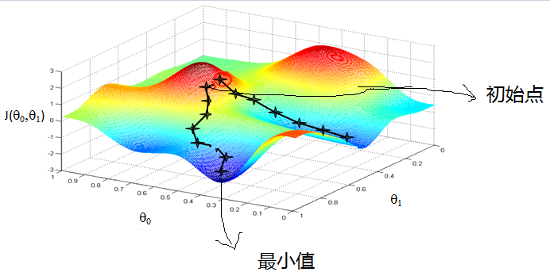

Visualization example:
> From the above picture, if at the beginning, we are somewhere on a mountain, because there are strangers everywhere, we don’t know the way down the mountain, so we can only explore the steps based on intuition, in the process, Every time you go to a position, it will solve the gradient of the current position, go down one step along the negative direction of the gradient, that is, the current steepest position, and then continue to solve the current position gradient, and the steepest position along this step. The easiest place to go down the mountain. Constantly cycle through the gradients, and so on, step by step, until we feel that we have reached the foot of the mountain. Of course, if we go on like this, it is possible that we cannot go to the foot of the mountain, but to the low point of a certain local peak.
Thus, as can be seen from the above explanation, the gradient descent does not necessarily find a global optimal solution, and may be a local optimal solution. Of course, if the loss function is a convex function, the solution obtained by the gradient descent method must be the global optimal solution.

**Introduction of core ideas**:

1. Initialize the parameters and randomly select any number within the range of values;
2. Iterative operation:
a) calculate the current gradient;
b) modify the new variable;
c) calculate one step towards the steepest downhill direction;
d) determine whether termination is required, if not, return a);
3. Get the global optimal solution or close to the global optimal solution.

### 2.12.4 Gradient descent algorithm description
1. Determine the hypothesis function and loss function of the optimization model.
    For example, for linear regression, the hypothesis function is:
$$
  H_\theta(x_1,x_2,...,x_n)=\theta_0+\theta_1x_1+...+\theta_nx_n
$$
  Where $\theta,x_i(i=1,2,...,n) $ are the model parameters and the eigenvalues ​​of each sample.
  For the hypothetical function, the loss function is:
$$
  J(\theta_0,\theta_1,...,\theta_n)=\frac{1}{2m}\sum^{m}_{j=0}(h_\theta (x^{(j)}_0)
  ,(x^{(j)}_1),...,(x^{(j)}_n)-y_j)^2
$$

2. Related parameters are initialized.
    Mainly initializes ${\theta}_i $, algorithm iteration step ${\alpha} $, and terminates distance ${\zeta} $. Initialization can be initialized empirically, ie ${\theta} $ is initialized to 0, and the step ${\alpha} $ is initialized to 1. The current step size is recorded as ${\varphi}_i $. Of course, it can also be randomly initialized.

3. Iterative calculations.

    1) Calculate the gradient of the loss function at the current position. For ${\theta}_i$, the gradient is expressed as:

$$
\frac{\partial}{\partial \theta_i}J({\theta}_0,{\theta}_1,...,{\theta}_n)
$$
2) Calculate the distance at which the current position drops.
$$
{\varphi}_i={\alpha} \frac{\partial}{\partial \theta_i}J({\theta}_0,{\theta}_1,...,{\theta}_n)
$$
3) Determine if it is terminated.
Determine if all ${\theta}_i$ gradients fall by ${\varphi}_i$ are less than the termination distance ${\zeta}$, if both are less than ${\zeta}$, the algorithm terminates, of course the value That is the final result, otherwise go to the next step.
4) Update all ${\theta}_i$, the updated expression is:
$$
{\theta}_i={\theta}_i-\alpha \frac{\partial}{\partial \theta_i}J({\theta}_0,{\theta}_1,...,{\theta}_n)
$$
5) After the update is completed, transfer to 1).

**Example**. Take linear regression as an example.
Suppose the sample is
$$
(x^{(0)}_1,x^{(0)}_2,...,x^{(0)}_n,y_0),(x^{(1)}_1,x^{(1 )}_2,...,x^{(1)}_n,y_1),...,
(x^{(m)}_1,x^{(m)}_2,...,x^{(m)}_n,y_m)
$$
The loss function is
$$
J(\theta_0,\theta_1,...,\theta_n)=\frac{1}{2m}\sum^{m}_{j=0}(h_\theta (x^{(j)}_0
,x^{(j)}_1,...,x^{(j)}_n)-y_j)^2
$$
In the calculation, the partial derivative of ${\theta}_i$ is calculated as follows:
$$
\frac{\partial}{\partial \theta_i}J({\theta}_0,{\theta}_1,...,{\theta}_n)=\frac{1}{m}\sum^{m }_{j=0}(h_\theta (x^{(j)}_0
,x^{(j)}_1,...,x^{(j)}_n)-y_j)x^{(j)}_i
$$
Let the above formula $x^{(j)}_0=1$. 4) The update expression for $\theta_i$ is:
$$
\theta_i=\theta_i - \alpha \frac{1}{m} \sum^{m}_{j=0}(h_\theta (x^{(j)}_0
,x^{(j)}_1,...,x^{(j)}_n)-y_j)x^{(j)}_i
$$


From this, you can see
Out, the gradient direction of the current position is determined by all samples. The purpose of $\frac{1}{m} $, $\alpha \frac{1}{m} $ is to make it easier to understand.

### 2.12.5 How to tune the gradient descent method?
When the gradient descent method is actually used, each parameter index can not reach the ideal state in one step, and the optimization of the gradient descent method is mainly reflected in the following aspects:
1. **Algorithm iteration step $\alpha$ selection.**
    When the algorithm parameters are initialized, the step size is sometimes initialized to 1 based on experience. The actual value depends on the data sample. You can take some values ​​from big to small, and run the algorithm to see the iterative effect. If the loss function is smaller, the value is valid. If the value is invalid, it means to increase the step size. However, the step size is too large, sometimes causing the iteration speed to be too fast and missing the optimal solution. The step size is too small, the iteration speed is slow, and the algorithm runs for a long time.
2. **The initial value selection of the parameter.**
    The initial values ​​are different, and the minimum values ​​obtained may also be different. It is possible to obtain a local minimum due to the gradient drop. If the loss function is a convex function, it must be the optimal solution. Due to the risk of local optimal solutions, it is necessary to run the algorithm with different initial values ​​multiple times, the minimum value of the key loss function, and the initial value of the loss function minimized.
3. **Standardization process.**
    Due to the different samples, the range of feature values ​​is different, resulting in slow iteration. In order to reduce the influence of feature values, the feature data can be normalized so that the new expectation is 0 and the new variance is 1, which can save the algorithm running time.

### 2.12.7 What is the difference between random gradients and batch gradients?
Stochastic gradient descent and batch gradient descent are two main gradient descent methods whose purpose is to increase certain limits to speed up the computational solution.
The following is a comparison of the two gradient descent methods.
Assume that the function is
$$
H_\theta (x_1,x_2,...,x_3) = \theta_0 + \theta_1 + ... + \theta_n x_n
$$
The loss function is
$$
J(\theta_0, \theta_1, ... , \theta_n) =
\frac{1}{2m} \sum^{m}_{j=0}(h_\theta (x^{(j)}_0
,x^{(j)}_1,...,x^{(j)}_n)-y_j)^2
$$
Among them, $m $ is the number of samples, and $j $ is the number of parameters.

1. **Batch gradient descent solution ideas are as follows:**

a) Get the gradient corresponding to each $\theta ​$:
$$
\frac{\partial}{\partial \theta_i}J({\theta}_0,{\theta}_1,...,{\theta}_n)=\frac{1}{m}\sum^{m }_{j=0}(h_\theta (x^{(j)}_0
,x^{(j)}_1,...,x^{(j)}_n)-y_j)x^{(j)}_i
$$
b) Since it is to minimize the risk function, update $ \theta_i $ in the negative direction of the gradient of each parameter $ \theta $ :
$$
\theta_i=\theta_i - \frac{1}{m} \sum^{m}_{j=0}(h_\theta (x^{(j)}_0
,x^{(j)}_1,...,x^{(j)}_n)-y_j)x^{(j)}_i
$$
c) It can be noticed from the above equation that although it is a global optimal solution, all data of the training set is used for each iteration. If the sample data is large, the iteration speed of this method is very slow.
In contrast, a random gradient drop can avoid this problem.

2. **The solution to the stochastic gradient descent is as follows:**
a) Compared to all training samples compared to the batch gradient drop, the loss function in the stochastic gradient descent method corresponds to the granularity of each sample in the training set.
The loss function can be written in the form of
$$
J(\theta_0, \theta_1, ... , \theta_n) =
\frac{1}{m} \sum^{m}_{j=0}(y_i - h_\theta (x^{(j)}_0
,x^{(j)}_1,...,x^{(j)}_n))^2 =
\frac{1}{m} \sum^{m}_{j=0} cost(\theta,(x^j,y^j))
$$
b) For each parameter $ \theta $ update the gradient direction $ \theta $:
$$
\theta_i = \theta_i + (y_j - h_\theta (x^{(j)}_0, x^{(j)}_1, ... , x^{(j)}_n))
$$
c) The random gradient descent is iteratively updated by each sample.
One problem associated with stochastic gradient descent is that the noise is much lower than the batch gradient, so that the stochastic gradient descent is not the direction of overall optimization for each iteration.

**Summary:**
The stochastic gradient descent method and the batch gradient descent method are relatively extreme, and the simple comparison is as follows:

| Method | Features |
| :----: | :------- |
| Batch gradient descent | a) Use all data to gradient down. b) The batch gradient descent method is slow in training when the sample size is large. |
| Stochastic Gradient Descent | a) Stochastic gradient descent with a sample to gradient down. b) Training is fast.
c) The stochastic gradient descent method uses only one sample to determine the direction of the gradient, which may result in a solution that is not optimal.
d) In terms of convergence speed, the stochastic gradient descent method iterates one sample at a time, resulting in a large change in the iteration direction and cannot converge to the local optimal solution very quickly. |

The following describes a small batch gradient descent method that combines the advantages of both methods.

3. **Small batch (mini-batch) gradient drop solution is as follows**
For data with a total of $m​$ samples, according to the sample data, select $n(1< n< m)​$ subsamples to iterate. Its parameter $\theta​$ updates the $\theta_i​$ formula in the gradient direction as follows:
$$
\theta_i = \theta_i - \alpha \sum^{t+n-1}_{j=t}
( h_\theta (x^{(j)}_{0}, x^{(j)}_{1}, ... , x^{(j)}_{n} ) - y_j ) x^ {j}_{i}
$$

### 2.12.8 Comparison of various gradient descent methods
The table below briefly compares the difference between stochastic gradient descent (SGD), batch gradient descent (BGD), small batch gradient descent (mini-batch GD), and online GD:

|| BGD | SGD | Mini-batch GD | Online GD |
|:--:|:----:|:---:|:-------------:|:---------:|
| training set | fixed | fixed | fixed | real-time update |
|Single iteration sample number | Whole training set | Single sample | Subset of training set | According to specific algorithm |
| Algorithm Complexity | High | Low | General | Low |
|Timeliness|Low|General|General|High|
|convergence|stability|unstable|stable|unstable|unstable|

BGD, SGD, Mini-batch GD, have been discussed before, here introduces Online GD.

The difference between Online GD and mini-batch GD/SGD is that all training data is used only once and then discarded. The advantage of this is that it predicts the changing trend of the final model.

Online GD is used more in the Internet field, such as the click rate (CTR) estimation model of search advertising, and the click behavior of netizens will change over time. Using the normal BGD algorithm (updated once a day) takes a long time (requires retraining of all historical data); on the other hand, it is unable to promptly feedback the user's click behavior migration. The Online GD algorithm can be migrated in real time according to the click behavior of netizens.

## 2.13 Calculating the derivative calculation diagram of the graph?
The computational graph derivative calculation is backpropagation, which is derived using chained rules and implicit functions.

Suppose $z = f(u,v)$ is contiguous at point $(u,v)$, $(u,v)$ is a function of $t$, which can be guided at $t$ $z$ is the derivative of the $t$ point.

According to the chain rule
$$
\frac{dz}{dt}=\frac{\partial z}{\partial u}.\frac{du}{dt}+\frac{\partial z}{\partial v}
.\frac{dv}{dt}
$$

For ease of understanding, the following examples are given.
Suppose $f(x) $ is a function of a, b, c. The chain derivation rule is as follows:
$$
\frac{dJ}{du}=\frac{dJ}{dv}\frac{dv}{du},\frac{dJ}{db}=\frac{dJ}{du}\frac{du}{db },\frac{dJ}{da}=\frac{dJ}{du}\frac{du}{da}
$$

The chain rule is described in words: "A composite function composed of two functions whose derivative is equal to the derivative of the value of the inner function substituted into the outer function, multiplied by the derivative of the inner function.

example:

$$
f(x)=x^2,g(x)=2x+1
$$

then

$$
{f[g(x)]}'=2[g(x)] \times g'(x)=2[2x+1] \times 2=8x+1
$$


## 2.14 Linear Discriminant Analysis (LDA)

### 2.14.1 Summary of LDA Thoughts

Linear Discriminant Analysis (LDA) is a classic dimensionality reduction method. Unlike PCA, which does not consider the unsupervised dimensionality reduction technique of sample category output, LDA is a dimensionality reduction technique for supervised learning, with each sample of the data set having a category output.

The LDA classification idea is briefly summarized as follows:
1. In multi-dimensional space, the data processing classification problem is more complicated. The LDA algorithm projects the data in the multi-dimensional space onto a straight line, and converts the d-dimensional data into one-dimensional data for processing.
2. For training data, try to project the multidimensional data onto a straight line. The projection points of the same kind of data are as close as possible, and the heterogeneous data points are as far as possible.
3. When classifying the data, project it onto the same line and determine the category of the sample based on the position of the projected point.
If you summarize the LDA idea in one sentence, that is, "the variance within the class after projection is the smallest, and the variance between classes is the largest".

### 2.14.2 Graphical LDA Core Ideas
Assume that there are two types of data, red and blue. These data features are two-dimensional, as shown in the following figure. Our goal is to project these data into one dimension, so that the projection points of each type of similar data are as close as possible, and the different types of data are as far as possible, that is, the distance between the red and blue data centers in the figure is as large as possible.


The left and right images are two different projections.

Left diagram: The projection method that allows the farthest points of different categories to be the farthest.

The idea on the right: Let the data of the same category get the closest projection.

As can be seen from the above figure, the red and blue data on the right are relatively concentrated in their respective regions. It can also be seen from the data distribution histogram, so the projection effect on the right is better than the one on the left. There is a clear intersection in the figure section.

The above example is based on the fact that the data is two-dimensional, and the classified projection is a straight line. If the original data is multidimensional, the projected classification surface is a low-dimensional hyperplane.

### 2.14.3 Principles of the second class LDA algorithm?
Input: data set $D=\{(x_1,y_1),(x_2,y_2),...,(x_m,y_m)\} $, where sample $x_i $ is an n-dimensional vector, $y_i \ Epsilon \{C_1, C_2, ..., C_k\} $, the dimension dimension $d $ after dimension reduction. definition

$N_j(j=0,1)$ is the number of samples of the $j$ class;

$X_j(j=0,1)$ is a collection of $j$ class samples;

$u_j(j=0,1) $ is the mean vector of the $j $ class sample;

$\sum_j(j=0,1)$ is the covariance matrix of the $j$ class sample.

among them
$$
U_j = \frac{1}{N_j} \sum_{x\epsilon X_j}x(j=0,1),
\sum_j = \sum_{x\epsilon X_j}(x-u_j)(x-u_j)^T(j=0,1)
$$
Suppose the projection line is the vector $w​$. For any sample $x_i​$, its projection on the line $w​$ is $w^tx_i​$, the center point of the two categories is $u_0​$, $u_1 ​$ is in the line $w ​$The projections of  are $w^Tu_0​$ and $w^Tu_1​$ respectively.

The goal of LDA is to maximize the distance between the two categories of data centers, $\| w^Tu_0 - w^Tu_1 \|^2_2$, and at the same time, hope that the covariance of the similar sample projection points is $w^T \sum_0 w$, $w^T \sum_1 w$ Try to be as small as possible, and minimize $w^T \sum_0 w - w^T \sum_1 w $ .
definition
Intraclass divergence matrix
$$
S_w = \sum_0 + \sum_1 =
\sum_{x\epsilon X_0}(x-u_0)(x-u_0)^T +
\sum_{x\epsilon X_1}(x-u_1)(x-u_1)^T
$$
Interclass divergence matrix $S_b = (u_0 - u_1)(u_0 - u_1)^T$

According to the analysis, the optimization goal is
$$
\arg \max J(w) = \frac{\| w^Tu_0 - w^Tu_1 \|^2_2}{w^T \sum_0w + w^T \sum_1w} =
\frac{w^T(u_0-u_1)(u_0-u_1)^Tw}{w^T(\sum_0 + \sum_1)w} =
\frac{w^TS_bw}{w^TS_ww}
$$
According to the nature of the generalized Rayleigh quotient, the maximum eigenvalue of the matrix $S^{-1}_{w} S_b$ is the maximum value of $j(w)$, and the matrix $S^{-1}_{w} $The feature vector corresponding to the largest eigenvalue of $S_b$ is $w $.

### 2.14.4 Summary of LDA algorithm flow?
The LDA algorithm dimension reduction process is as follows:

Input: Dataset $D = \{ (x_1,y_1), (x_2,y_2), ... ,(x_m,y_m) \}$, where the sample $x_i $ is an n-dimensional vector, $y_i\epsilon \{C_1, C_2, ..., C_k \} $, the dimension dimension $d​$ after dimension reduction.

Output: Divised data set $\overline{D} ​$ .

step:
1. Calculate the intra-class divergence matrix $S_w$.
2. Calculate the inter-class divergence matrix $S_b $ .
3. Calculate the matrix $S^{-1}_wS_b $ .
4. Calculate the largest d eigenvalues ​​for the matrix $S^{-1}_wS_b$.
5. Calculate d eigenvectors corresponding to d eigenvalues, and record the projection matrix as W .
6. Convert each sample of the sample set to get the new sample $P_i = W^Tx_i $ .
7. Output a new sample set $\overline{D} = \{ (p_1,y_1),(p_2,y_2),...,(p_m,y_m) \} $

### 2.14.5 What is the difference between LDA and PCA?

|similarities and differences | LDA | PCA |
|:-:|:-|:-|
|Same point|1. Both can reduce the dimension of the data;<br />2. Both use the idea of ​​matrix feature decomposition in dimension reduction;<br />3. Both assume that the data is Gaussian Distribution;||
|Different points |Supervised dimensionality reduction methods;|Unsupervised dimensionality reduction methods;|
||The dimension reduction is reduced to the k-1 dimension at most; |There is no limit on the dimension reduction;|
|| can be used for dimensionality reduction, and can also be used for classification; | only for dimensionality reduction;
||Select the best projection direction for classification performance;|Select the direction of the sample point projection with the largest variance;|
||More specific, more reflective of differences between samples; | purpose is more vague; |

### 2.14.6 What are the advantages and disadvantages of LDA?

| Advantages and Disadvantages | Brief Description |
|:-:|:-|
|Advantages|1. A priori knowledge of categories can be used;<br />2. Supervised dimensionality reduction method for measuring differences by label and category, with a clearer purpose than PCA's ambiguity, more reflecting the sample Difference;
|Disadvantages|1. LDA is not suitable for dimension reduction of non-Gaussian distribution samples; <br />2. LDA reduction is reduced to k-1 dimension at most; <br />3. LDA depends on variance in sample classification information instead of mean When the dimension reduction effect is not good; <br /> 4. LDA may overfit the data. |

## 2.15 Principal Component Analysis (PCA)

### 2.15.1 Summary of Principal Component Analysis (PCA) Thoughts

1. PCA is to project high-dimensional data into a low-dimensional space by linear transformation.
2. Projection Idea: Find the projection method that best represents the original data. Those dimensions that are dropped by the PCA can only be those that are noisy or redundant.
3. De-redundancy: Removes linear correlation vectors that can be represented by other vectors. This amount of information is redundant.
4. Denoising, removing the eigenvector corresponding to the smaller eigenvalue. The magnitude of the eigenvalue reflects the magnitude of the transformation in the direction of the eigenvector after the transformation. The larger the amplitude, the larger the difference in the element in this direction is to be preserved.
5. Diagonalization matrix, find the maximal linearly irrelevant group, retain larger eigenvalues, remove smaller eigenvalues, form a projection matrix, and project the original sample matrix to obtain a new sample matrix after dimension reduction.
6. The key to completing the PCA is the covariance matrix.
The covariance matrix can simultaneously represent the correlation between different dimensions and the variance in each dimension.
The covariance matrix measures the relationship between dimensions and dimensions, not between samples and samples.
7. The reason for diagonalization is that since the non-diagonal elements are all 0 after diagonalization, the purpose of denoising is achieved. The diagonalized covariance matrix, the smaller new variance on the diagonal corresponds to those dimensions that should be removed. So we only take those dimensions that contain larger energy (characteristic values), and the rest are rounded off, that is, redundant.

### 2.15.2 Graphical PCA Core Ideas
The PCA can solve the problem that there are too many data features or cumbersome features in the training data. The core idea is to map m-dimensional features to n-dimensional (n < m), which form the principal element, which is the orthogonal feature reconstructed to represent the original data.

Suppose the data set is m n-dimensional, $(x^{(1)}, x^{(2)}, \cdots, x^{(m)})$. If n=2, you need to reduce the dimension to $n'=1$. Now you want to find the data of a dimension that represents these two dimensions. The figure below has $u_1, u_2$ two vector directions, but which vector is what we want, can better represent the original data set?


As can be seen from the figure, $u_1$ is better than $u_2$, why? There are two main evaluation indicators:
1. The sample point is close enough to this line.
2. The projection of the sample points on this line can be separated as much as possible.

If the target dimension we need to reduce dimension is any other dimension, then:
1. The sample point is close enough to the hyperplane.
2. The projection of the sample points on this hyperplane can be separated as much as possible.

### 2.15.3 PCA algorithm reasoning
The following is based on the minimum projection distance as the evaluation index reasoning:

Suppose the data set is m n-dimensional, $(x^{(1)}, x^{(2)},...,x^{(m)})$, and the data is centered. After projection transformation, the new coordinates are ${w_1, w_2,...,w_n}$, where $w$ is the standard orthogonal basis, ie $\| w \|_2 = 1$, $w^T_iw_j = 0$ .

After dimension reduction, the new coordinates are $\{ w_1,2_2,...,w_n \}$, where $n'$ is the target dimension after dimension reduction. The projection of the sample point $x^{(i)}$ in the new coordinate system is $z^{(i)} = \left(z^{(i)}_1, z^{(i)}_2, . .., z^{(i)}_{n'} \right)$, where $z^{(i)}_j = w^T_j x^{(i)}$ is $x^{(i) } $ Coordinate of the jth dimension in the low dimensional coordinate system.

If $z^{(i)} $ is used to recover $x^{(i)} $ , the resulting recovery data is $\widehat{x}^{(i)} = \sum^{n'} _{j=1} x^{(i)}_j w_j = Wz^{(i)}$, where $W$ is a matrix of standard orthonormal basis.

Considering the entire sample set, the distance from the sample point to this hyperplane is close enough that the target becomes minimized. $\sum^m_{i=1} \| \hat{x}^{(i)} - x^{ (i)} \|^2_2$ . Reasoning about this formula, you can get:
$$
\sum^m_{i=1} \| \hat{x}^{(i)} - x^{(i)} \|^2_2 =
\sum^m_{i=1} \| Wz^{(i)} - x^{(i)} \|^2_2 \\
= \sum^m_{i=1} \left( Wz^{(i)} \right)^T \left( Wz^{(i)} \right)
- 2\sum^m_{i=1} \left( Wz^{(i)} \right)^T x^{(i)}
+ \sum^m_{i=1} \left( x^{(i)} \right)^T x^{(i)} \\
= \sum^m_{i=1} \left( z^{(i)} \right)^T \left( z^{(i)} \right)
- 2\sum^m_{i=1} \left( z^{(i)} \right)^T x^{(i)}
+ \sum^m_{i=1} \left( x^{(i)} \right)^T x^{(i)} \\
= - \sum^m_{i=1} \left( z^{(i)} \right)^T \left( z^{(i)} \right)
+ \sum^m_{i=1} \left( x^{(i)} \right)^T x^{(i)} \\
= -tr \left( W^T \left( \sum^m_{i=1} x^{(i)} \left( x^{(i)} \right)^T \right)W \right)
+ \sum^m_{i=1} \left( x^{(i)} \right)^T x^{(i)} \\
= -tr \left( W^TXX^TW \right)
+ \sum^m_{i=1} \left( x^{(i)} \right)^T x^{(i)}
$$

In the derivation process, $\overline{x}^{(i)} = Wz^{(i)}$ is used respectively, and the matrix transposition formula $(AB)^T = B^TA^T$,$ W^TW = I$, $z^{(i)} = W^Tx^{(i)}$ and the trace of the matrix. The last two steps are to convert the algebraic sum into a matrix form.
Since each vector $w_j$ of $W$ is a standard orthonormal basis, $\sum^m_{i=1} x^{(i)} \left( x^{(i)} \right)^T $ is the covariance matrix of the data set, $\sum^m_{i=1} \left( x^{(i)} \right)^T x^{(i)} $ is a constant. Minimize $\sum^m_{i=1} \| \hat{x}^{(i)} - x^{(i)} \|^2_2$ is equivalent to
$$
\underbrace{\arg \min}_W - tr \left( W^TXX^TW \right) s.t.W^TW = I
$$
Use the Lagrang function to get
$$
J(W) = -tr(W^TXX^TW) + \lambda(W^TW - I)
$$
For $W$, you can get $-XX^TW + \lambda W = 0 $ , which is $ XX^TW = \lambda W $ . $ XX^T $ is a matrix of $ n' $ eigenvectors, and $\lambda$ is the eigenvalue of $ XX^T $ . $W$ is the matrix we want.
For raw data, you only need $z^{(i)} = W^TX^{(i)}$ to reduce the original data set to the $n'$ dimension dataset of the minimum projection distance.

Based on the derivation of the maximum projection variance, we will not repeat them here. Interested colleagues can refer to the information themselves.

### 2.15.4 Summary of PCA algorithm flow
Input: $n $ dimension sample set $D = \left( x^{(1)},x^{(2)},...,x^{(m)} \right) $ , target drop The dimension of the dimension is $n' $ .

Output: New sample set after dimensionality reduction $D' = \left( z^{(1)}, z^{(2)},...,z^{(m)} \right)$ .

The main steps are as follows:
1. Center all the samples, $ x^{(i)} = x^{(i)} - \frac{1}{m} \sum^m_{j=1} x^{(j) } $ .
2. Calculate the covariance matrix of the sample $XX^T $ .
3. Perform eigenvalue decomposition on the covariance matrix $XX^T$.
4. Take the feature vector $\{ w_1,w_2,...,w_{n'} \}$ for the largest $n' $ eigenvalues.
5. Normalize the eigenvectors to get the eigenvector matrix $W$ .
6. Convert each sample in the sample set $z^{(i)} = W^T x^{(i)}$ .
7. Get the output matrix $D' = \left( z^{(1)},z^{(2)},...,z^{(n)} \right) $ .
*Note*: In dimension reduction, sometimes the target dimension is not specified, but the principal component weighting threshold value $kk (k \epsilon(0,1]) $ is specified. The assumed $n $ eigenvalues For $\lambda_1 \geq \lambda_2 \geq ... \geq \lambda_n $ , then $n' $ can be obtained from $\sum^{n'}_{i=1} \lambda_i \geq k \times \sum^n_{i=1} \lambda_i $.

### 2.15.5 Main advantages and disadvantages of PCA algorithm
| Advantages and Disadvantages | Brief Description |
|:-:|:-|
|Advantages|1. It is only necessary to measure the amount of information by variance, independent of factors outside the data set. 2. Orthogonality between the principal components can eliminate the interaction between the original data components. 3. The calculation method is simple, and the main operation is eigenvalue decomposition, which is easy to implement. |
|Disadvantages|1. The meaning of each feature dimension of the principal component has a certain ambiguity, which is not as strong as the original sample feature. 2. Non-principal components with small variances may also contain important information about sample differences, as dimensionality reduction may have an impact on subsequent data processing. |

### 2.15.6 Necessity and purpose of dimensionality reduction
**The need for dimensionality reduction**:
1. The multicollinearity and predictive variables are related to each other. Multiple collinearity can lead to instability in the solution space, which can lead to inconsistencies in the results.
2. The high dimensional space itself is sparse. The one-dimensional normal distribution has a value of 68% falling between positive and negative standard deviations, and only 0.02% in ten-dimensional space.
3. Excessive variables cause redundancy in the search rules.
4. Analysis at the variable level alone may ignore potential links between variables. For example, several predictors may fall into a group that reflects only one aspect of the data.

**The purpose of dimension reduction**:
1. Reduce the number of predictors.
2. Make sure these variables are independent of each other.
3. Provide a framework to explain the results. Close features, especially important features, can be clearly displayed in the data; if only two or three dimensions, it is easier to visualize.
4. Data is easier to handle and easier to use at lower dimensions.
5. Remove data noise.
6. Reduce the computational overhead of the algorithm.

### 2.15.7 What is the difference between KPCA and PCA?
The premise of applying the PCA algorithm is to assume that there is a linear hyperplane and then project. So what if the data is not linear? What should I do? At this time, KPCA is needed. The dataset is mapped from $n$ dimension to linearly separable high dimension $N > n$, and then reduced from $N$ dimension to a low dimension $n' (n'<n<N )$.

KPCA uses the idea of ​​kernel function, and principal component analysis using kernel function is generally called Kernelized PCA (KPCA).

Suppose that high-dimensional spatial data is generated by mapping $\phi $ from the $n $ dimensional space.

The feature of the $n$ dimension space is decomposed into:
$$
\sum^m_{i=1} x^{(i)} \left( x^{(i)} \right)^T W = \lambda W
$$


Its mapping to
$$
\sum^m_{i=1} \phi \left( x^{(i)} \right) \phi \left( x^{(i)} \right)^T W = \lambda W
$$


The eigenvalue decomposition of the covariance matrix is ​​performed in a high-dimensional space, and then the dimensionality reduction is performed in the same manner as the PCA. Since KPCA requires the operation of a kernel function, it is much more computationally intensive than PCA.

## 2.16 Model Evaluation
### 2.16.1 Common methods for model evaluation?
In general, a single scoring standard cannot fully evaluate a machine learning model. Using only good and bad to deviate from the real scene to evaluate a model is a poor way to evaluate. The following is a description of commonly used classification models and regression model evaluation methods.

**Classification method commonly used in classification models:**

|Indicators|Description|
|:-:|:-:|
|Precision|Precision|
|Recall|Recall rate|
|F1|F1 value|
|Confusion Matrix|Confusion Matrix|
|ROC|ROC Curve|
|AUC| Area under the ROC curve|
|precision|Property rate|
|recall|Check rate|
|P-R curve|The precision is the vertical axis, and the full rate is the horizontal axis.

**Regression model commonly used evaluation method: **

|Indicators|Description|
|:-:|:-:|
|Mean Square Error (MSE, RMSE)|Average Variance |
|Absolute Error (MAE, RAE)|Absolute Error |
|R-Squared|R-squared value|

### 2.16.2 What is the difference and connection between error, deviation and variance?

In machine learning, Bias (variation), Error (error), and Variance (variance) have the following differences and connections:

**For Error:**

- Error: In general, we refer to the difference between the actual predicted output of the learner and the true output of the sample as the "error".

- Error = Bias + Variance + Noise, Error reflects the accuracy of the entire model.

**For Noise:**

Noise: Describes the lower bound of the expected generalization error that any learning algorithm can achieve on the current task, ie, the difficulty of learning the problem itself.

**For Bias:**

- Bias measures the ability of the model to fit the training data (training data is not necessarily the entire training dataset, but only the part of the data that is used to train it, eg mini-batch), and Bias reflects the output of the model on the sample. The error between the true values, that is, the accuracy of the model itself.
- The smaller the Bias, the higher the fit (possibly overfitting); conversely, the lower the fit (possibly underfitting).
- The larger the deviation, the more deviation from the real data, as shown in the second line of the figure below.

**For Variance:**

- Variance formula: $S_{N}^{2}=\frac{1}{N}\sum_{i=1}^{N}(x_{i}-\bar{x})^{2}$

- Variance describes the range of variation of the predicted value, the degree of dispersion, that is, the distance from its expected value. The larger the variance, the more dispersed the data distribution and the worse the stability of the model.
- Variance reflects the error between each output of the model and the expected output of the model, ie the stability of the model.
- The smaller the Variance, the higher the generalization of the model; conversely, the lower the ability of the model to generalize.
- If the model has a good fitting effect on the training set, but the fitting effect on the test set is relatively poor, the variance is large, indicating that the stability of the model is poor. This phenomenon may be due to the model training set. Caused by the fit. As shown in the right column of the figure below.

> 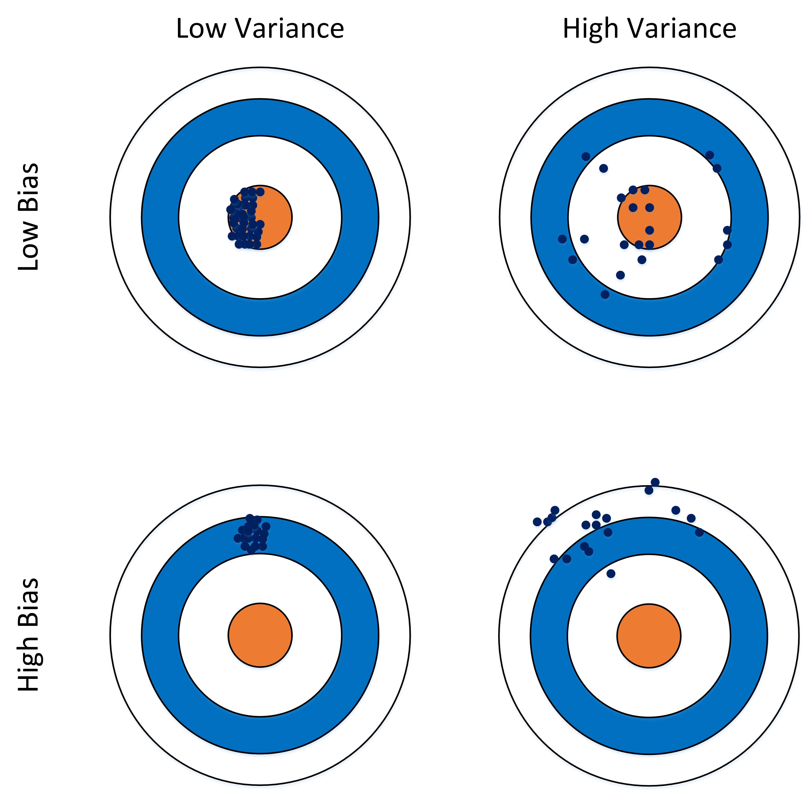
>

### 2.16.3 Empirical error and generalization error

Empirical error: also known as training error, the error of the model on the training set.

Generalization error: The error of the model on the new sample set (test set) is called the "generalization error."

### 2.16.4 Under-fitting, over-fitting
Under-fitting is different from over-fitting plots depending on the coordinate method.
1. **The horizontal axis is the number of training samples and the vertical axis is the error**


As shown in the figure above, we can visually see the difference between under-fitting and over-fitting:

Under-fitting of the model: there is a high error in both the training set and the test set, and the deviation of the model is large at this time;

Model overfitting: has a lower error on the training set and a higher error on the test set, where the variance of the model is larger.

The model is normal: there are relatively low deviations and variances on both the training set and the test set.

2. **The horizontal axis is the complexity of the model and the vertical axis is the error**


The red line is the Error on the test set, and the blue line is the Error on the training set.

Under-fitting of the model: At the point A, the model has a high error at both the training set and the test set. At this time, the deviation of the model is large.

Model overfitting: The model has a lower error on the training set at point C and a higher error on the test set. The variance of the model is larger.

The model is normal: the model complexity control is optimal at point B.

3. **The horizontal axis is the regular term coefficient and the vertical axis is the error**


The red line is the Error on the test set, and the blue line is the Error on the training set.

Under-fitting of the model: At the point C, the model has a high error at both the training set and the test set. At this time, the deviation of the model is large.

Model overfitting: The model has a lower error on the training set at point A and a higher error on the test set, and the variance of the model is larger. It usually happens when the model is too complicated, such as too many parameters, which will make the prediction performance of the model weaker and increase the volatility of the data. Although the effect of the model during training can be performed perfectly, basically remembering all the characteristics of the data, but the performance of this model in the unknown data will be greatly reduced, because the simple model generalization ability is usually very weak. of.

The model is normal: the model complexity control is optimal at point B.

### 2.16.5 How to solve over-fitting and under-fitting?
**How ​​to solve the under-fitting:**
1. Add additional feature items. Features such as combination, generalization, correlation, context features, and platform features are important means of feature addition. Sometimes insufficient feature items can lead to under-fitting of the model.
2. Add a polynomial feature. For example, adding a linear or cubic term to a linear model makes the model more generalizable. For example, the FM model and the FFM model are actually linear models, and second-order polynomials are added to ensure a certain degree of fitting of the model.
3. You can increase the complexity of the model.
4. Reduce the regularization coefficient. The purpose of regularization is to prevent overfitting, but now the model has an under-fitting, you need to reduce the regularization parameters.

**How ​​to solve overfitting:**
1. Re-clean the data, the data is not pure will lead to over-fitting, and such cases require re-cleaning of the data.
2. Increase the number of training samples.
3. Reduce the complexity of the model.
4. Increase the coefficient of the regular term.
5. Using the dropout method, the dropout method, in layman's terms, is to let the neurons not work with a certain probability during training.
6. early stoping.
7. Reduce the number of iterations.
8. Increase the learning rate.
9. Add noise data.
10. In the tree structure, the tree can be pruned.

Under-fitting and over-fitting these methods requires selection based on actual problems and actual models.

### 2.16.6 The main role of cross-validation
In order to obtain a more robust and reliable model, the generalization error of the model is evaluated, and an approximation of the model generalization error is obtained. When there are multiple models to choose from, we usually choose the model with the smallest "generalization error".

There are many ways to cross-validate, but the most common ones are: leave a cross-validation, k-fold cross-validation.

### 2.16.7 Understanding k-fold cross validation
1. Divide the data set containing N samples into K shares, each containing N/K samples. One of them was selected as the test set, and the other K-1 was used as the training set. There were K cases in the test set.
2. In each case, train the model with the training set and test the model with the test set to calculate the generalization error of the model.
3. Cross-validation is repeated K times, each verification is performed, the average K times results or other combination methods are used, and finally a single estimation is obtained, and the final generalization error of the model is obtained.
4. In the case of K, the generalization error of the model is averaged to obtain the final generalization error of the model.

**Note**:

1. Generally 2<=K<=10. The advantage of k-fold cross-validation is that it repeatedly uses randomly generated sub-samples for training and verification. Each time the results are verified once, 10-fold cross-validation is the most commonly used.
2. The number of samples in the training set should be sufficient, generally at least 50% of the total number of samples.
3. The training set and test set must be evenly sampled from the complete data set. The purpose of uniform sampling is to reduce the deviation between the training set, the test set, and the original data set. When the number of samples is sufficient, the effect of uniform sampling can be achieved by random sampling.

### 2.16.8 Confusion matrix
The first type of confusion matrix:

|The real situation T or F| prediction is positive example 1, P| prediction is negative example 0, N|
|:-:|:-|:-|
|The original label is marked as 1, the prediction result is true T, false is F|TP (predicted to be 1, actual is 1)|FN (predicted to be 0, actually 1)|
|The original label is 0, the prediction result is true T, false is F|FP (predicted to be 1, actual is 0)|TN (predicted to be 0, actually 0)|

The second type of confusion matrix:

|Predictive situation P or N|The actual label is 1, the predicted pair is T|the actual label is 0, and the predicted pair is T|
|:-:|:-|:-|
|Forecast is positive example 1, P|TP (predicted to be 1, actually 1)|FP (predicted to be 1, actually 0)|
|Predicted as negative example 0, N|FN (predicted to be 0, actually 1)|TN (predicted to be 0, actually 0)|

### 2.16.9 Error rate and accuracy
1. Error Rate: The ratio of the number of samples with the wrong classification to the total number of samples.
2. Accuracy: The proportion of the correct number of samples to the total number of samples.

### 2.16.10 Precision and recall rate
The results predicted by the algorithm are divided into four cases:
1. True Positive (TP): The prediction is true, the actual is true
2. True Negation (True NegatiVe, TN): the forecast is false, the actual is false
3. False Positive (FP): The prediction is true, the actual is false
4. False Negative (FN): The forecast is false, actually true

Then:

Precision = TP / (TP + FP)

**Understanding**: The correct number of samples predicted to be positive. Distinguish the accuracy rate (correctly predicted samples, including correct predictions as positive and negative, accounting for the proportion of total samples).
For example, in all of the patients we predicted to have malignant tumors, the percentage of patients who actually had malignant tumors was as high as possible.

Recall = TP / (TP + FN)

**Understanding**: The proportion of positively predicted positives as a percentage of positives in the total sample.
For example, in all patients with malignant tumors, the percentage of patients who successfully predicted malignant tumors was as high as possible.

### 2.16.11 ROC and AUC
The full name of the ROC is "Receiver Operating Characteristic".

The area of ​​the ROC curve is AUC (Area Under the Curve).

AUC is used to measure the performance of the "two-class problem" machine learning algorithm (generalization capability).

The ROC curve is calculated by setting a continuous variable to a plurality of different critical values, thereby calculating a series of true rates and false positive rates, and then plotting the curves with the false positive rate and the true rate as the ordinate, under the curve. The larger the area, the higher the diagnostic accuracy. On the ROC curve, the point closest to the upper left of the graph is the critical value of both the false positive rate and the true rate.

For classifiers, or classification algorithms, the evaluation indicators mainly include precision, recall, and F-score. The figure below is an example of a ROC curve.


The abscissa of the ROC curve is the false positive rate (FPR) and the ordinate is the true positive rate (TPR). among them
$$
TPR = \frac{TP}{TP+FN} , FPR = \frac{FP}{FP+TN},
$$

The following focuses on the four points and one line in the ROC graph.
The first point, (0,1), ie FPR=0, TPR=1, means that FN(false negative)=0, and FP(false positive)=0. This means that this is a perfect classifier that classifies all samples correctly.
The second point, (1,0), ie FPR=1, TPR=0, means that this is the worst classifier because it successfully avoided all the correct answers.
The third point, (0,0), that is, FPR=TPR=0, that is, FP (false positive)=TP(true positive)=0, it can be found that the classifier predicts that all samples are negative samples (negative). .
The fourth point, (1,1), ie FPR=TPR=1, the classifier actually predicts that all samples are positive samples.
After the above analysis, the closer the ROC curve is to the upper left corner, the better the performance of the classifier.

The area covered by the ROC curve is called AUC (Area Under Curve), which can more easily judge the performance of the learner. The larger the AUC, the better the performance.
### 2.16.12 How to draw ROC curve?
The following figure is an example. There are 20 test samples in the figure. The “Class” column indicates the true label of each test sample (p indicates positive samples, n indicates negative samples), and “Score” indicates that each test sample is positive. The probability of the sample.

step:
1. Assume that the probability that a series of samples are classified as positive classes has been derived, sorted by size.
2. From high to low, the “Score” value is used as the threshold threshold. When the probability that the test sample belongs to the positive sample is greater than or equal to the threshold, we consider it to be a positive sample, otherwise it is a negative sample. For example, for the fourth sample in the graph, the "Score" value is 0.6, then the samples 1, 2, 3, 4 are considered positive samples because their "Score" values ​​are greater than or equal to 0.6, while others The samples are considered to be negative samples.
3. Select a different threshold each time to get a set of FPR and TPR, which is a point on the ROC curve. In this way, a total of 20 sets of FPR and TPR values ​​were obtained. The FPR and TPR are briefly understood as follows:
4. Draw according to each coordinate point in 3).

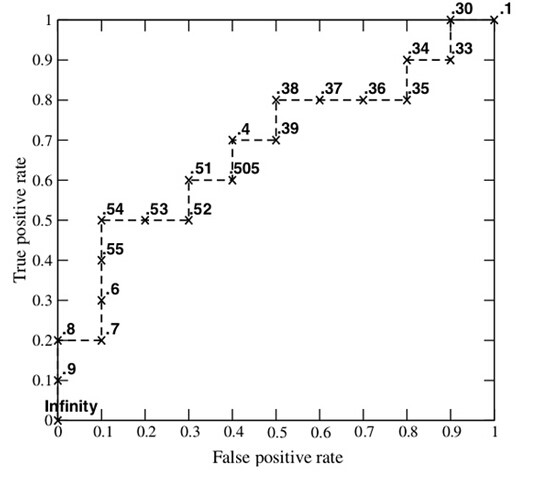

### 2.16.13 How to calculate TPR, FPR?
1. Analysis of data
Y_true = [0, 0, 1, 1]; scores = [0.1, 0.4, 0.35, 0.8];
2. The list

| Sample | Predict the probability of belonging to P (score) | Real Category |
| ---- | ---------------------- | -------- |
| y[0] | 0.1 | N |
| y[1] | 0.35 | P |
| y[2] | 0.4 | N |
| y[3] | 0.8 | P |

3. Take the cutoff point as the score value and calculate the TPR and FPR.
When the truncation point is 0.1:
Explain that as long as score>=0.1, its prediction category is a positive example. Since the scores of all four samples are greater than or equal to 0.1, the prediction category for all samples is P.
Scores = [0.1, 0.4, 0.35, 0.8]; y_true = [0, 0, 1, 1]; y_pred = [1, 1, 1, 1];
The positive and negative examples are as follows:

| Real value\predicted value | | |
| ------------- | ---- | ---- |
| | Positive example | Counterexample |
| Positive example | TP=2 | FN=0 |
| Counterexample | FP=2 | TN=0 |

Therefore:
TPR = TP / (TP + FN) = 1; FPR = FP / (TN + FP) = 1;

When the cutoff point is 0.35:
Scores = [0.1, 0.4, 0.35, 0.8]; y_true = [0, 0, 1, 1]; y_pred = [0, 1, 1, 1];
The positive and negative examples are as follows:

| Real value\predicted value | | |
| ------------- | ---- | ---- |
| | Positive example | Counterexample |
| Positive example | TP=2 | FN=0 |
| Counterexample | FP=1 | TN=1 |

Therefore:
TPR = TP / (TP + FN) = 1; FPR = FP / (TN + FP) = 0.5;

When the truncation point is 0.4:
Scores = [0.1, 0.4, 0.35, 0.8]; y_true = [0, 0, 1, 1]; y_pred = [0, 1, 0, 1];
The positive and negative examples are as follows:

| Real value\predicted value | | |
| ------------- | ---- | ---- |
| | Positive example | Counterexample |
| Positive example | TP=1 | FN=1 |
| Counterexample | FP=1 | TN=1 |

Therefore:
TPR = TP / (TP + FN) = 0.5; FPR = FP / (TN + FP) = 0.5;

When the cutoff point is 0.8:
Scores = [0.1, 0.4, 0.35, 0.8]; y_true = [0, 0, 1, 1]; y_pred = [0, 0, 0, 1];

The positive and negative examples are as follows:

| Real value\predicted value | | |
| ------------- | ---- | ---- |
| | Positive example | Counterexample |
| Positive example | TP=1 | FN=1 |
| Counterexample | FP=0 | TN=2 |

Therefore:
TPR = TP / (TP + FN) = 0.5; FPR = FP / (TN + FP) = 0;

4. According to the TPR and FPR values, the FPR is plotted on the horizontal axis and the TPR is plotted on the vertical axis.

### 2.16.14 How to calculate Auc?
- Sort the coordinate points by the horizontal FPR.
- Calculate the distance $dx$ between the $i$ coordinate point and the $i+1$ coordinate point.
- Get the ordinate y of the $i$ (or $i+1$) coordinate points.
- Calculate the area micro-element $ds=ydx$.
- Accumulate the area micro-elements to get the AUC.

### 2.16.15 Why use Roc and Auc to evaluate the classifier?
There are many evaluation methods for the model. Why use ROC and AUC?
Because the ROC curve has a very good property: when the distribution of positive and negative samples in the test set is transformed, the ROC curve can remain unchanged. In the actual data set, sample class imbalances often occur, that is, the ratio of positive and negative samples is large, and the positive and negative samples in the test data may also change with time.

### 2.16.17 Intuitive understanding of AUC
The figure below shows the values ​​of the three AUCs:

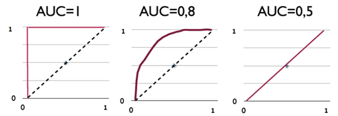

AUC is an evaluation index to measure the pros and cons of the two-category model, indicating the probability that the positive example is in front of the negative example. Other evaluation indicators have accuracy, accuracy, and recall rate, and AUC is more common than the three.
Generally, in the classification model, the prediction results are expressed in the form of probability. If the accuracy is to be calculated, a threshold is usually set manually to convert the corresponding probability into a category, which greatly affects the accuracy of the model. Rate calculation.
Example:

Now suppose that a trained two-classifier predicts 10 positive and negative samples (5 positive cases and 5 negative examples). The best prediction result obtained by sorting the scores in high to low is [1, 1, 1, 1, 1, 0, 0, 0, 0, 0], that is, 5 positive examples are ranked in front of 5 negative examples, and the positive example is 100% in front of the negative example. Then draw its ROC curve, since it is 10 samples, we need to draw 10 points in addition to the origin, as follows:


The method of traversing starts from left to right according to the score of the sample prediction result. Starting from the origin, every time you encounter 1, move the y-axis in the positive direction of the y-axis with a minimum step size of 1 unit, here is 1/5=0.2; every time you encounter 0, move to the x-axis positive direction, the x-axis minimum step size is 1 Unit, here is also 0.2. It is not difficult to see that the AUC of the above figure is equal to 1, which confirms that the probability that the positive example is in front of the negative example is indeed 100%.

Assume that the prediction result sequence is [1, 1, 1, 1, 0, 1, 0, 0, 0, 0].

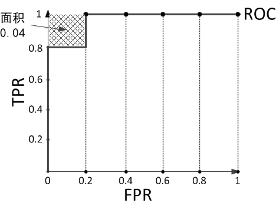

Calculate the AUC of the above figure is 0.96 and the probability of calculating the positive example is 0.8 × 1 + 0.2 × 0.8 = 0.96 in front of the negative example, and the area of ​​the shadow in the upper left corner is the probability that the negative example is in front of the positive example. × 0.2 = 0.04.

Assume that the prediction result sequence is [1, 1, 1, 0, 1, 0, 1, 0, 0, 0].


Calculate the AUC of the above figure is 0.88 and the probability of calculating the positive example and the front of the negative example is equal to 0.6 × 1 + 0.2 × 0.8 + 0.2 × 0.6 = 0.88. The area of ​​the shaded part in the upper left corner is the negative example in front of the positive example. The probability is 0.2 × 0.2 × 3 = 0.12.

### 2.16.18 Cost-sensitive error rate and cost curve

Different errors can come at different costs. Taking the dichotomy as an example, set the cost matrix as follows:


When the judgment is correct, the value is 0. When it is incorrect, it is $Cost_{01} $ and $Cost_{10} $ respectively.

$Cost_{10}$: indicates the cost of actually being a counterexample but predicting a positive case.

$Cost_{01}$: indicates the cost of being a positive example but predicting a counterexample.

**Cost Sensitive Error Rate**=The sum of the error value and the cost product obtained by the model in the sample / total sample.
Its mathematical expression is:
$$
E(f;D;cost)=\frac{1}{m}\left( \sum_{x_{i} \in D^{+}}({f(x_i)\neq y_i})\times Cost_{ 01}+ \sum_{x_{i} \in D^{-}}({f(x_i)\neq y_i})\times Cost_{10}\right)
$$
$D^{+}, D^{-} $ respectively represent samplesSet of positive and negative examples.

**cost curve**:
At an equal cost, the ROC curve does not directly reflect the expected overall cost of the model, and the cost curve can.
The cost of the positive example of the cost curve with the horizontal axis of [0,1]:
$$
P(+)Cost=\frac{p*Cost_{01}}{p*Cost_{01}+(1-p)*Cost_{10}}
$$
Where p is the probability that the sample is a positive example.

The normalized cost of the vertical axis dimension [0,1] of the cost curve:
$$
Cost_{norm}=\frac{FNR*p*Cost_{01}+FNR*(1-p)*Cost_{10}}{p*Cost_{01}+(1-p)*Cost_{10}}
$$

Among them, FPR is a false positive rate, and FNR=1-TPR is a false anti-interest rate.

Note: Each point of the ROC corresponds to a line on the cost plane.

For example, on the ROC (TPR, FPR), FNR=1-TPR is calculated, and a line segment from (0, FPR) to (1, FNR) is drawn on the cost plane, and the area is the expected overall cost under the condition. The area under the bounds of all segments, the expected overall cost of the learner under all conditions.

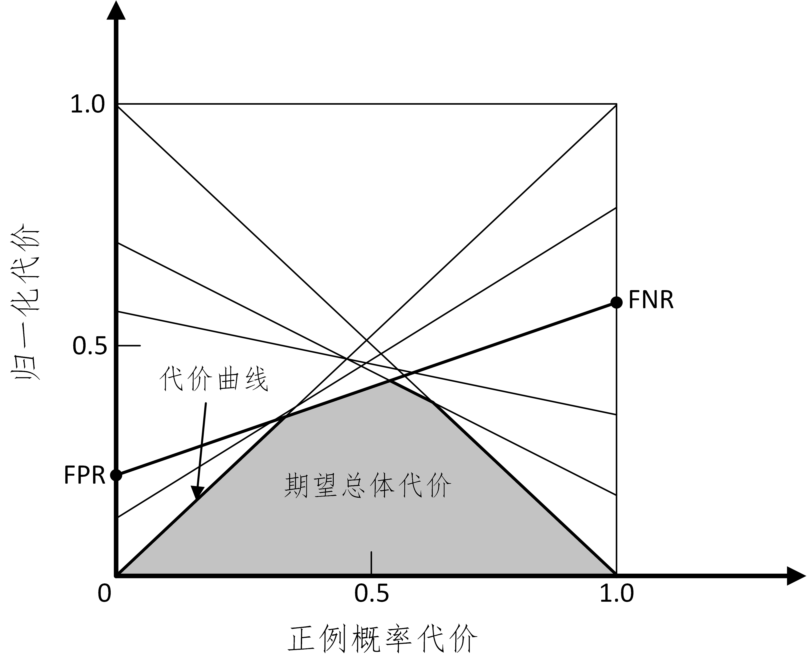

### 2.16.19 What are the comparison test methods for the model?
Correctness analysis: model stability analysis, robustness analysis, convergence analysis, trend analysis, extreme value analysis, etc.
Validity analysis: error analysis, parameter sensitivity analysis, model comparison test, etc.
Usefulness analysis: key data solving, extreme points, inflection points, trend analysis, and data validation dynamic simulation.
Efficient analysis: Time-space complexity analysis is compared with existing ones.

### 2.16.21 Why use standard deviation?

The variance formula is: $S^2_{N}=\frac{1}{N}\sum_{i=1}^{N}(x_{i}-\bar{x})^{2} $

The standard deviation formula is: $S_{N}=\sqrt{\frac{1}{N}\sum_{i=1}^{N}(x_{i}-\bar{x})^{2}} $

The sample standard deviation formula is: $S_{N}=\sqrt{\frac{1}{N-1}\sum_{i=1}^{N}(x_{i}-\bar{x})^{ 2}} $

There are three benefits to using standard deviation to represent the degree of dispersion of data points compared to variance:
1. The number indicating the degree of dispersion is consistent with the order of magnitude of the sample data points, which is more suitable for forming perceptual cognition of data samples.

2. The unit of digital representation of the degree of dispersion is consistent with the unit of sample data, making it easier to perform subsequent analysis operations.

3. In the case that the sample data generally conforms to the normal distribution, the standard deviation has the characteristics of convenient estimation: 66.7% of the data points fall within the range of 1 standard deviation before and after the average, and 95% of the data points fall before and after the average Within the range of 2 standard deviations, 99% of the data points will fall within the range of 3 standard deviations before and after the mean.

### 2.16.25 What causes the category imbalance?
Class-imbalance refers to the case where the number of training examples of different categories in a classification task varies greatly.

cause:

Classification learning algorithms usually assume that the number of training examples for different categories is basically the same. If the number of training examples in different categories is very different, it will affect the learning results and the test results will be worse. For example, there are 998 counterexamples in the two-category problem, and there are two positive cases. The learning method only needs to return a classifier that always predicts the new sample as a counterexample, which can achieve 99.8% accuracy; however, such a classifier has no value.
### 2.16.26 Common category imbalance problem solving method
To prevent the impact of category imbalance on learning, it is necessary to deal with the problem of classification imbalance before constructing the classification model. The main solutions are:

1. Expand the data set

Add data that contains small sample data, and more data can get more distribution information.

2. Undersampling large types of data

Reduce the number of large data samples so that they are close to the small sample size.
Disadvantages: If you discard a large class of samples randomly during an undersampling operation, you may lose important information.
Representative algorithm: EasyEnsemble. The idea is to use an integrated learning mechanism to divide the large class into several sets for use by different learners. This is equivalent to undersampling each learner, but it does not lose important information for the whole world.

3. Oversampling small class data

Oversampling: Sampling a small class of data samples to increase the number of data samples in a small class.

Representative algorithms: SMOTE and ADASYN.

SMOTE: Generate additional subclass sample data by interpolating the small class data in the training set.

A new minority class sample generation strategy: for each minority class sample a, randomly select a sample b in the nearest neighbor of a, and then randomly select a point on the line between a and b as a newly synthesized minority class. sample.
ADASYN: Uses a weighted distribution for different minority categories of samples based on the difficulty of learning, and produces more comprehensive data for a small number of samples that are difficult to learn. Data distribution is improved by reducing the bias introduced by class imbalance and adaptively transferring classification decision boundaries to difficult samples.

4. Use new evaluation indicators

If the current evaluation indicator does not apply, you should look for other convincing evaluation indicators. For example, the accuracy index is not applicable or even misleading in the classification task with unbalanced categories. Therefore, in the category unbalanced classification task, more convincing evaluation indicators are needed to evaluate the classifier.

5. Choose a new algorithm

Different algorithms are suitable for different tasks and data, and should be compared using different algorithms.

6. Data cost weighting

For example, when the classification task is to identify the small class, the weight of the small class sample data of the classifier can be added, and the weight of the large sample can be reduced, so that the classifier concentrates on the small sample.

7. The conversion problem thinking angle

For example, in the classification problem, the sample of the small class is used as the abnormal point, and the problem is transformed into the abnormal point detection or the change trend detection problem. Outlier detection is the identification of rare events. The change trend detection is distinguished from the abnormal point detection in that it is identified by detecting an unusual change trend.

8. The problem is refined and analyzed

Analyze and mine the problem, divide the problem into smaller problems, and see if these small problems are easier to solve.

## 2.17 Decision Tree

### 2.17.1 Basic Principles of Decision Trees
The Decision Tree is a divide-and-conquer decision-making process. A difficult prediction problem is divided into two or more simple subsets through the branch nodes of the tree, which are structurally divided into different sub-problems. The process of splitting data sets by rules is recursively partitioned (Recursive Partitioning). As the depth of the tree increases, the subset of branch nodes becomes smaller and smaller, and the number of problems that need to be raised is gradually simplified. When the depth of the branch node or the simplicity of the problem satisfies a certain Stopping Rule, the branch node stops splitting. This is the top-down Cutoff Threshold method; some decision trees are also used from below. And the Pruning method.

### 2.17.2 Three elements of the decision tree?
The generation process of a decision tree is mainly divided into the following three parts:

Feature selection: Select one feature from the many features in the training data as the split criterion of the current node. How to select features has many different quantitative evaluation criteria, and thus derive different decision tree algorithms.

Decision Tree Generation: The child nodes are recursively generated from top to bottom according to the selected feature evaluation criteria, and the decision tree stops growing until the data set is inseparable. In terms of tree structure, recursive structure is the easiest way to understand.

Pruning: Decision trees are easy to overfit, generally requiring pruning, reducing the size of the tree structure, and alleviating overfitting. The pruning technique has two types: pre-pruning and post-pruning.

### 2.17.3 Decision Tree Learning Basic Algorithm

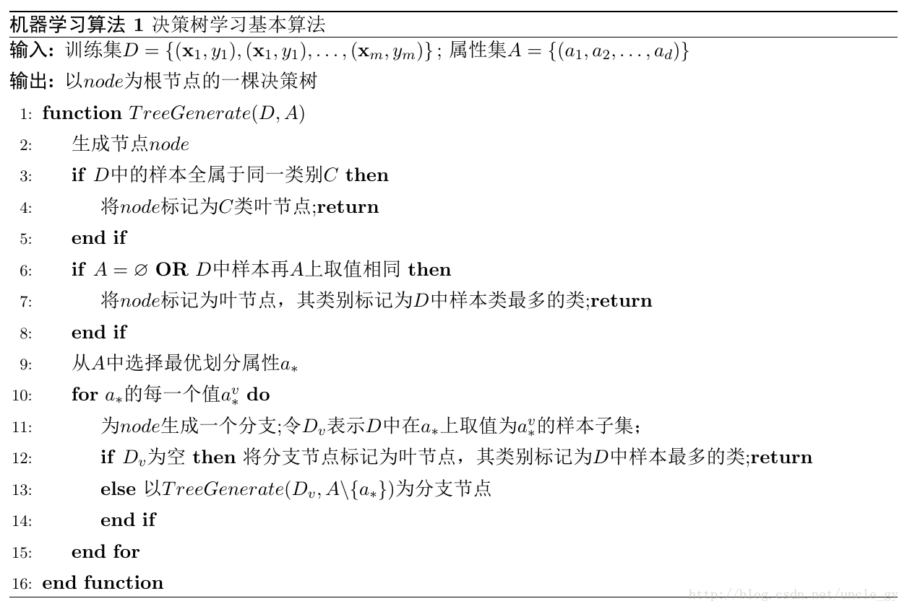

### 2.17.4 Advantages and disadvantages of decision tree algorithms

**The advantages of the decision tree algorithm**:

1. The decision tree algorithm is easy to understand and the mechanism is simple to explain.

2. The decision tree algorithm can be used for small data sets.

3. The time complexity of the decision tree algorithm is small, which is the logarithm of the data points used to train the decision tree.

4. The decision tree algorithm can handle numbers and data categories compared to other algorithms that intelligently analyze a type of variable.

5. able to handle the problem of multiple output.

6. Not sensitive to missing values.

7. can handle irrelevant feature data.

8. high efficiency, decision tree only needs to be constructed once, repeated use, the maximum number of calculations per prediction does not exceed the depth of the decision tree.

**The disadvantages of the decision tree algorithm**:

1. It is hard to predict the field of continuity.

2. easy to appear over-fitting.

3. When there are too many categories, the error may increase faster.

4. It is not very good when dealing with data with strong feature relevance.

5. For data with inconsistent sample sizes in each category, in the decision tree, the results of information gain are biased toward those with more values.

### 2.17.5 The concept of entropy and understanding

 Entropy: measures the uncertainty of a random variable.

Definition: Assume that the possible values ​​of the random variable X are $x_{1}, x_{2},...,x_{n}$, for each possible value $x_{i}$, the probability is $P(X=x_{i})=p_{i}, i=1, 2..., n$. The entropy of a random variable is:
$$
H(X)=-\sum_{i=1}^{n}p_{i}log_{2}p_{i}
$$
For the sample set, assume that the sample has k categories, and the probability of each category is $\frac{|C_{k}|}{|D|}$, where ${|C_{k}|}{|D| }$ is the number of samples with category k, and $|D| $ is the total number of samples. The entropy of the sample set D is:
$$
H(D)=-\sum_{k=1}^{k}\frac{|C_{k}|}{|D|}log_{2}\frac{|C_{k}|}{|D| }
$$

### 2.17.6 Understanding of Information Gain
Definition: The difference in entropy before and after the data set is divided by a feature.
Entropy can represent the uncertainty of the sample set. The larger the entropy, the greater the uncertainty of the sample. Therefore, the difference between the set entropy before and after the partition can be used to measure the effect of using the current feature on the partitioning of the sample set D.
It is assumed that the entropy of the sample set D before division is H(D). The data set D is divided by a certain feature A, and the entropy of the divided data subset is calculated as $H(D|A)$.

Then the information gain is:
$$
g(D,A)=H(D)-H(D|A)
$$
Note: In the process of building a decision tree, we always want the set to move toward the fastest-purchasing sub-sets. Therefore, we always choose the feature that maximizes the information gain to divide the current data set D.

Thought: Calculate all feature partition data sets D, obtain the information gain of multiple feature partition data sets D, and select the largest from these information gains, so the partition feature of the current node is the partition used to maximize the information gain. feature.

In addition, here is the information gain ratio related knowledge:

Information gain ratio = penalty parameter X information gain.

Information gain ratio essence: multiply a penalty parameter based on the information gain. When the number of features is large, the penalty parameter is small; when the number of features is small, the penalty parameter is large.

Penalty parameter: Data set D takes feature A as the reciprocal of the entropy of the random variable.

### 2.17.7 The role and strategy of pruning treatment?
Pruning is a method used by decision tree learning algorithms to solve overfitting.

In the decision tree algorithm, in order to classify the training samples as accurately as possible, the node partitioning process is repeated repeatedly, sometimes causing too many branches of the decision tree, so that the characteristics of the training sample set are regarded as generalized features, resulting in over-fitting . Therefore, pruning can be used to remove some branches to reduce the risk of overfitting.

The basic strategies for pruning are prepruning and postprunint.

Pre-pruning: In the decision tree generation process, the generalization performance of each node is estimated before each node is divided. If it cannot be upgraded, the division is stopped, and the current node is marked as a leaf node.

Post-pruning: After generating the decision tree, the non-leaf nodes are examined from the bottom up. If the node is marked as a leaf node, the generalization performance can be improved.

## 2.18 Support Vector Machine

### 2.18.1 What is a support vector machine?
Support Vector: During the process of solving, you will find that the classifier can be determined based only on part of the data. These data are called support vectors.

Support Vector Machine (SVM): The meaning is a classifier that supports vector operations.

In a two-dimensional environment, points R, S, G and other points near the middle black line can be seen as support vectors, which can determine the specific parameters of the classifier, black line.

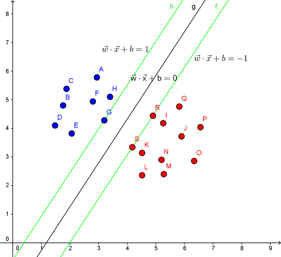

The support vector machine is a two-class model. Its purpose is to find a hyperplane to segment the sample. The principle of segmentation is to maximize the interval and finally transform it into a convex quadratic programming problem. The simple to complex models include:

When the training samples are linearly separable, learn a linear separable support vector machine by maximizing the hard interval;

When the training samples are approximately linearly separable, learn a linear support vector machine by maximizing the soft interval;

When the training samples are linearly inseparable, learn a nonlinear support vector machine by kernel techniques and soft interval maximization;

### 2.18.2 What problems can the support vector machine solve?

**Linear classification**

In the training data, each data has n attributes and a second class category flag, which we can think of in an n-dimensional space. Our goal is to find an n-1 dimensional hyperplane that divides the data into two parts, eachSome of the data belong to the same category.

There are many such hyperplanes, if we want to find the best one. At this point, a constraint is added: the distance from the hyperplane to the nearest data point on each side is required to be the largest, becoming the maximum interval hyperplane. This classifier is the maximum interval classifier.

**Nonlinear classification**

One advantage of SVM is its support for nonlinear classification. It combines the Lagrangian multiplier method with the KKT condition, and the kernel function can produce a nonlinear classifier.

### 2.18.3 Features of the nuclear function and its role?

The purpose of introducing the kernel function is to project the linearly inseparable data in the original coordinate system into another space with Kernel, and try to make the data linearly separable in the new space.

The wide application of the kernel function method is inseparable from its characteristics:

1) The introduction of the kernel function avoids the "dimensionality disaster" and greatly reduces the amount of calculation. The dimension n of the input space has no effect on the kernel function matrix. Therefore, the kernel function method can effectively handle high-dimensional input.

2) There is no need to know the form and parameters of the nonlinear transformation function Φ.

3) The change of the form and parameters of the kernel function implicitly changes the mapping from the input space to the feature space, which in turn affects the properties of the feature space, and ultimately changes the performance of various kernel function methods.

4) The kernel function method can be combined with different algorithms to form a variety of different kernel function-based methods, and the design of these two parts can be performed separately, and different kernel functions and algorithms can be selected for different applications.

### 2.18.4 Why does SVM introduce dual problems?

1. The dual problem turns the constraint in the original problem into the equality constraint in the dual problem. The dual problem is often easier to solve.

2. You can naturally refer to the kernel function (the Lagrangian expression has an inner product, and the kernel function is also mapped by the inner product).

3. In the optimization theory, the objective function f(x) can take many forms: if the objective function and the constraint are both linear functions of the variable x, the problem is called linear programming; if the objective function is a quadratic function, the constraint For a linear function, the optimization problem is called quadratic programming; if the objective function or the constraint is a nonlinear function, the optimization problem is called nonlinear programming. Each linear programming problem has a dual problem corresponding to it. The dual problem has very good properties. Here are a few:

a. The duality of the dual problem is the original problem;

b. Whether the original problem is convex or not, the dual problem is a convex optimization problem;

c. The dual problem can give a lower bound on the original problem;

d. When certain conditions are met, the original problem is completely equivalent to the solution to the dual problem.

### 2.18.5 How to understand the dual problem in SVM

In the hard-space support vector machine, the solution of the problem can be transformed into a convex quadratic programming problem.

Assume that the optimization goal is
$$
\begin{align}
&\min_{\boldsymbol w, b}\frac{1}{2}||\boldsymbol w||^2\\
&s.t. y_i(\boldsymbol w^T\boldsymbol x_i+b)\geq1, i=1,2,\cdots,m.\\
\end{align} \tag{1}
$$
**step 1**. Conversion issues:
$$
\min_{\boldsymbol w, b} \max_{\alpha_i \geq 0} \left\{\frac{1}{2}||\boldsymbol w||^2 + \sum_{i=1}^m\alpha_i( 1 - y_i(\boldsymbol w^T\boldsymbol x_i+b))\right\} \tag{2}
$$
The above formula is equivalent to the original problem, because if the inequality constraint in (1) is satisfied, then $\alpha_i(1 - y_i(\boldsymbol w^T\boldsymbol x_i+b))$ must be taken when (2) is used to find max 0, equivalent to (1); if the inequality constraint in (1) is not satisfied, the max in (2) will get infinity. Exchange min and max to get their dual problem:
$$
\max_{\alpha_i \geq 0} \min_{\boldsymbol w, b} \left\{\frac{1}{2}||\boldsymbol w||^2 + \sum_{i=1}^m\alpha_i( 1 - y_i(\boldsymbol w^T\boldsymbol x_i+b))\right\}
$$
The dual problem after the exchange is not equal to the original problem. The solution of the above formula is less than the solution of the original problem.

**step 2**. The question now is how to find the best lower bound for the optimal value of the problem (1)?
$$
{\frac 1 2}||\boldsymbol w||^2 < v\\
1 - y_i(\boldsymbol w^T\boldsymbol x_i+b) \leq 0\tag{3}
$$
If equation (3) has no solution, then v is a lower bound of question (1). If (3) has a solution, then
$$
\forall \boldsymbol \alpha > 0 , \ \min_{\boldsymbol w, b} \left\{\frac{1}{2}||\boldsymbol w||^2 + \sum_{i=1}^m\alpha_i (1 - y_i(\boldsymbol w^T\boldsymbol x_i+b))\right\} < v
$$
From the inverse of the proposition: if
$$
\exists \boldsymbol \alpha > 0 , \ \min_{\boldsymbol w, b} \left\{\frac{1}{2}||\boldsymbol w||^2 + \sum_{i=1}^m\alpha_i (1 - y_i(\boldsymbol w^T\boldsymbol x_i+b))\right\} \geq v
$$
Then (3) no solution.

Then v is the problem

A lower bound of (1).
 Ask for a good lower bound, take the maximum
$$
\max_{\alpha_i \geq 0} \min_{\boldsymbol w, b} \left\{\frac{1}{2}||\boldsymbol w||^2 + \sum_{i=1}^m\alpha_i( 1 - y_i(\boldsymbol w^T\boldsymbol x_i+b))\right\}
$$
**step 3**. Order
$$
L(\boldsymbol w, b,\boldsymbol a) = \frac{1}{2}||\boldsymbol w||^2 + \sum_{i=1}^m\alpha_i(1 - y_i(\boldsymbol w^T \boldsymbol x_i+b))
$$
$p^*$ is the minimum value of the original question, the corresponding $w, b$ are $w^*, b^*$, respectively, for any $a>0$:
$$
p^* = {\frac 1 2}||\boldsymbol w^*||^2 \geq L(\boldsymbol w^*, b,\boldsymbol a) \geq \min_{\boldsymbol w, b} L( \boldsymbol w, b,\boldsymbol a)
$$
Then $\min_{\boldsymbol w, b} L(\boldsymbol w, b,\boldsymbol a)$ is the next issue of question (1).

At this point, take the maximum value to find the lower bound, that is,
$$
\max_{\alpha_i \geq 0} \min_{\boldsymbol w, b} L(\boldsymbol w, b,\boldsymbol a)
$$

### 2.18.7 What are the common kernel functions?
| Kernel Functions | Expressions | Notes |
| ---------------- | ----------- | ----- |
| Linear Kernel Linear Kernel | $k(x,y)=xy$ | |
| Polynomial Kernel Polynomial Kernel | $k(x,y)=(ax^{t}y+c)^{d}$ | $d>=1$ is the number of polynomials |
| Exponential Kernel Exponent Kernel Function | $k(x,y)=exp(-\frac{\left \|x-y \right \|}{2\sigma ^{2}})$ | $\sigma>0$ |
| Gaussian Kernel Gaussian Kernel Function | $k(x,y)=exp(-\frac{\left \|xy \right \|^{2}}{2\sigma ^{2}})$ | $\sigma $ is the bandwidth of the Gaussian kernel, $\sigma>0$, |
| Laplacian Kernel Laplacian Kernel | $k(x,y)=exp(-\frac{\left \|x-y \right|}{\sigma})$ | $\sigma>0$ |
| ANOVA Kernel | $k(x,y)=exp(-\sigma(x^{k}-y^{k})^{2})^{d}$ | |
| Sigmoid Kernel | $k(x,y)=tanh(ax^{t}y+c)$ | $tanh$ is a hyperbolic tangent function, $a>0,c<0$ |

### 2.18.9 Main features of SVM?

Features:

(1) The theoretical basis of the SVM method is nonlinear mapping, and the SVM uses the inner product kernel function instead of the nonlinear mapping to the high dimensional space;

(2) The goal of SVM is to obtain the optimal hyperplane for feature space partitioning, and the core of SVM method is to maximize the classification margin;

(3) The support vector is the training result of the SVM. The support vector plays a decisive role in the SVM classification decision.

(4) SVM is a novel small sample learning method with solid theoretical foundation. It basically does not involve probability measures and laws of large numbers, but also simplifies the problems of general classification and regression.

(5) The final decision function of the SVM is determined by only a few support vectors. The computational complexity depends on the number of support vectors, not the dimension of the sample space, which avoids the “dimensionality disaster” in a sense.

(6) A few support vectors determine the final result, which not only helps us to grasp the key samples, “cull” a large number of redundant samples, but also destined that the method is not only simple, but also has good “robustness”. This "robustness" is mainly reflected in:

1. Adding or deleting non-support vector samples has no effect on the model;

2. Support vector sample sets have certain robustness;

3. In some successful applications, the SVM method is not sensitive to the selection of cores.

(7) The SVM learning problem can be expressed as a convex optimization problem, so the global minimum of the objective function can be found using a known effective algorithm. Other classification methods (such as rule-based classifiers and artificial neural networks) use a greedy learning-based strategy to search for hypothesis space. This method generally only obtains local optimal solutions.

(8) The SVM controls the capabilities of the model by maximizing the edges of the decision boundaries. However, the user must provide other parameters, such as the use of kernel function types and the introduction of slack variables.

(9) SVM can get much better results than other algorithms on small sample training sets. The SVM optimization goal is to minimize the risk of structuring, instead of minimizing the risk of learning, avoiding the problem of learning. Through the concept of margin, the structured description of the data distribution is obtained, which reduces the requirements on data size and data distribution. Ability.

(10) It is a convex optimization problem, so the local optimal solution must be the advantage of the global optimal solution.

### 2.18.9 SVMThe main disadvantage?

(1) SVM algorithm is difficult to implement for large-scale training samples

The space consumption of the SVM is mainly to store the training samples and the kernel matrix. Since the SVM solves the support vector by means of quadratic programming, the solution to the quadratic programming involves the calculation of the m-order matrix (m is the number of samples), when the number of m When large, the storage and calculation of the matrix will consume a lot of machine memory and computation time.

If the amount of data is large, SVM training time will be longer, such as spam classification detection, instead of using SVM classifier, but using a simple naive bayes classifier, or using logistic regression model classification.

(2) It is difficult to solve multi-classification problems with SVM

The classical support vector machine algorithm only gives the algorithm of the second class classification, but in practical applications, it is generally necessary to solve the classification problem of multiple classes. It can be solved by a combination of multiple second-class support vector machines. There are mainly one-to-many combination mode, one-to-one combination mode and SVM decision tree; and then it is solved by constructing a combination of multiple classifiers. The main principle is to overcome the inherent shortcomings of SVM, combined with the advantages of other algorithms, to solve the classification accuracy of many types of problems. For example, combined with the rough set theory, a combined classifier of multiple types of problems with complementary advantages is formed.

(3) sensitive to missing data, sensitive to the selection of parameters and kernel functions

The performance of support vector machine performance depends mainly on the selection of kernel function, so for a practical problem, how to choose the appropriate kernel function according to the actual data model to construct SVM algorithm. The more mature kernel function and its parameters The choices are all artificial, selected according to experience, with certain randomness. In different problem areas, the kernel function should have different forms and parameters, so the domain knowledge should be introduced when selecting, but there is no A good way to solve the problem of kernel function selection.

### 2.18.10 Similarities and differences between logistic regression and SVM

Same point:

- LR and SVM are both **classification** algorithms
- Both LR and SVM are **supervised learning** algorithms.
- Both LR and SVM are **discriminant models**.
- If the kernel function is not considered, both LR and SVM are **linear classification** algorithms, which means that their classification decision surfaces are linear.
   Note: LR can also use the kernel function. But LR usually does not use the kernel function method. (**The amount of calculation is too large**)

Differences:

**1. LR uses log loss, SVM uses hinge loss.**

Logistic regression loss function:
$$
J(\theta)=-\frac{1}{m}\left[\sum^m_{i=1}y^{(i)}logh_{\theta}(x^{(i)})+ ( 1-y^{(i)})log(1-h_{\theta}(x^{(i)}))\right]
$$
The objective function of the support vector machine:
$$
L(w,n,a)=\frac{1}{2}||w||^2-\sum^n_{i=1}\alpha_i \left(y_i(w^Tx_i+b)-1 \right)
$$
The logistic regression method is based on probability theory. The probability that the sample is 1 can be represented by the sigmoid function, and then the value of the parameter is estimated by the method of maximum likelihood estimation.

The support vector machine is based on the principle of geometric interval maximization，and it is considered that the classification plane with the largest geometric interval is the optimal classification plane.

**2. LR is sensitive to outliers and SVM is not sensitive to outliers**.

The support vector machine only considers points near the local boundary line, while logistic regression considers the global. The hyperplane found by the LR model tries to keep all points away from him, and the hyperplane that the SVM looks for is to keep only those points closest to the middle dividing line as far away as possible, that is, only those samples that support vectors.

Support vector machines to change non-support vector samples do not cause changes in the decision surface.

Changing any sample in a logistic regression can cause changes in the decision surface.

**3. the calculation complexity is different. For massive data, SVM is less efficient and LR efficiency is higher**

When the number of samples is small and the feature dimension is low, the running time of SVM and LR is relatively short, and the SVM is shorter. For accuracy, LR is significantly higher than SVM. When the sample is slightly increased, the SVM runtime begins to grow, but the accuracy has surpassed LR. Although the SVM time is long, it is within the receiving range. When the amount of data grows to 20,000, when the feature dimension increases to 200, the running time of the SVM increases dramatically, far exceeding the running time of the LR. But the accuracy rate is almost the same as LR. (The main reason for this is that a large number of non-support vectors participate in the calculation, resulting in secondary planning problems for SVM)

**4. Different ways of dealing with nonlinear problems**

LR mainly relies on feature structure, and must combine cross-characteristics and feature discretization. SVM can also be like this, but also through the kernel (because only the support vector participates in the core calculation, the computational complexity is not high). (Because the kernel function can be used, the SVM can be efficiently processed by the dual solution. LR is poor when the feature space dimension is high.)

**5. SVM loss function comes with regular**

1/2 ||w||^2 in the loss function, which is why SVM is the structural risk minimization algorithm! ! ! And LR must add a regular item to the loss function! ! !

6. SVM comes with **structural risk minimization**, LR is **empirical risk minimization**.

7. SVM will use the kernel function and LR generally does not use [nuclear function] (https://www.cnblogs.com/huangyc/p/9940487.html).

## 2.19 Bayesian classifier
### 2.19.1 Graphical Maximum Likelihood Estimation

The principle of maximum likelihood estimation is illustrated by a picture, as shown in the following figure:


Example: There are two boxes with the same shape. There are 99 white balls and 1 black ball in the 1st box. There are 1 white ball and 99 black balls in the 2nd box. In one experiment, the black ball was taken out. Which box was taken out from?

Generally, based on empirical thoughts, it is guessed that this black ball is most like being taken out from the No. 2 box. The "most like" described at this time has the meaning of "maximum likelihood". This idea is often called "maximum likelihood." principle".

### 2.19.2 Principle of Maximum Likelihood Estimation

To sum up, the purpose of the maximum likelihood estimation is to use the known sample results to reverse the most likely (maximum probability) parameter values ​​that lead to such results.

The maximum likelihood estimation is a statistical method based on the principle of maximum likelihood. The maximum likelihood estimation provides a method for estimating the model parameters given the observed data, namely: "The model has been determined and the parameters are unknown." Through several experiments, the results are observed. Using the test results to obtain a parameter value that maximizes the probability of occurrence of the sample is called maximum likelihood estimation.

Since the samples in the sample set are all independent and identical, the parameter vector θ can be estimated by considering only one type of sample set D. The known sample set is:
$$
D=x_{1}, x_{2},...,x_{n}
$$
Linkehood function: The joint probability density function $P(D|\theta )$ is called the likelihood of θ relative to $x_{1}, x_{2},...,x_{n}$ function.
$$
l(\theta )=p(D|\theta ) =p(x_{1},x_{2},...,x_{N}|\theta )=\prod_{i=1}^{N} p(x_{i}|\theta )
$$
If $\hat{\theta}$ is the value of θ in the parameter space that maximizes the likelihood function $l(\theta)$, then $\hat{\theta}$ should be the "most likely" parameter value, then $\hat{\theta} $ is the maximum likelihood estimator of θ. It is a function of the sample set and is written as:
$$
\hat{\theta}=d(x_{1},x_{2},...,x_{N})=d(D)
$$
$\hat{\theta}(x_{1}, x_{2},...,x_{N})$ is called the maximum likelihood function estimate.

### 2.19.3 Basic Principles of Bayesian Classifier

Https://www.cnblogs.com/hxyue/p/5873566.html

Https://www.cnblogs.com/super-zhang-828/p/8082500.html

Bayesian decision theory uses the **false positive loss** to select the optimal category classification by using the **correlation probability known**.

Suppose there are $N$ possible classification tags, denoted as $Y=\{c_1,c_2,...,c_N\}$, which category does it belong to for the sample $x$?

The calculation steps are as follows:

Step 1. Calculate the probability that the sample $x$ belongs to the $i$ class, ie $P(c_i|x) $;

Step 2. By comparing all $P(c_i|\boldsymbol{x})$, get the best category to which the sample $x$ belongs.

Step 3. Substituting the category $c_i$ and the sample $x$ into the Bayesian formula,
$$
P(c_i|\boldsymbol{x})=\frac{P(\boldsymbol{x}|c_i)P(c_i)}{P(\boldsymbol{x})}.
$$
In general, $P(c_i)$ is the prior probability, $P(\boldsymbol{x}|c_i)$ is the conditional probability, and $P(\boldsymbol{x})$ is the evidence factor for normalization. . For $P(c_i)$, you can estimate the proportion of the sample with the category $c_i$ in the training sample; in addition, since we only need to find the largest $P(\boldsymbol{x}|c_i)$, we It is not necessary to calculate $P(\boldsymbol{x})$.

In order to solve the conditional probability, different methods are proposed based on different hypotheses. The naive Bayes classifier and the semi-premise Bayes classifier are introduced below.

### 2.19.4 Naive Bayes Classifier

Suppose the sample $x$ contains $d$ attributes, ie $x=\{ x_1,x_2,...,x_d\}$. Then there is
$$
P(\boldsymbol{x}|c_i)=P(x_1,x_2,\cdots,x_d|c_i).
$$
This joint probability is difficult to estimate directly from a limited training sample. Thus, Naive Bayesian (NB) adopted the "attribute conditional independence hypothesis": for known categories, assume that all attributes are independent of each other. Then there is
$$
P(x_1,x_2,\cdots,x_d|c_i)=\prod_{j=1}^d P(x_j|c_i).
$$
In this case, we can easily introduce the corresponding criteria:
$$
H_{nb}(\boldsymbol{x})=\mathop{\arg \max}_{c_i\in Y} P(c_i)\prod_{j=1}^dP(x_j|c_i).
$$
**Solution of conditional probability $P(x_j|c_i) $**

If $x_j$ is a tag attribute, then we can estimate $P(x_j|c_i)$ by counting.
$$
P(x_j|c_i)=\frac{P(x_j,c_i)}{P(c_i)}\approx\frac{\#(x_j,c_i)}{\#(c_i)}.
$$
Where $\#(x_j,c_i)$ represents the number of times $x_j$ and common $c_{i}$ appear in the training sample.

If $x_j$ is a numeric attribute, we usually assume that the first $j$ property of all samples of $c_{i}$ in the category follows a normal distribution. We first estimate the mean of the distribution $μ$ and the variance $σ$, and then calculate the probability density $P(x_j|c_i)$ of $x_j$ in this distribution.

### 2.19.5 An example to understand the naive Bayes classifier

The training set is as follows:

Https://www.cnblogs.com/super-zhang-828/p/8082500.html

| Number | Color |        Roots       |  Knock |     Texture     |    Umbilical    |   Tactile   | Density | Sugar Content | Delicious |
| :----: | :---: | :----------------: | :----: | :-------------: | :-------------: | :---------: | :-----: | :-----------: | :-------: |
|    1   | Green | Rolled-up          | Turbid | Clear           | Sunken          | Hard slip   |   0.697 |         0.460 | True      |
|    2   | Black | Rolled-up          | Dull   | Clear           | Sunken          | Hard slip   |   0.774 |         0.376 | True      |
|    3   | Black | Rolled-up          | Turbid | Clear           | Sunken          | Hard slip   |   0.634 |         0.264 | True      |
|    4   | Green | Rolled-up          | Dull   | Clear           | Sunken          | Hard slip   |   0.608 |         0.318 | True      |
|    5   | White | Rolled-up          | Turbid | Clear           | Sunken          | Hard slip   |   0.556 |         0.215 | True      |
|    6   | Green | Slightly rolled-up | Turbid | Clear           | Slightly sunken | Soft sticky |   0.403 |         0.237 | True      |
|    7   | Black | Slightly rolled-up | Turbid | Slightly blurry | Slightly sunken | Soft sticky |   0.481 |         0.149 | True      |
|    8   | Black | Slightly rolled-up | Turbid | Clear           | Slightly sunken | Hard slip   |   0.437 |         0.211 | True      |
|    9   | Black | Slightly rolled-up | Dull   | Slightly blurry | Slightly sunken | Hard slip   |   0.666 |         0.091 | False     |
|   10   | Green | Firm               | Crisp  | Clear           | Flat            | Soft sticky |   0.243 |         0.267 | False     |
|   11   | White | Firm               | Crisp  | Blurry          | Flat            | Hard slip   |   0.245 |         0.057 | False     |
|   12   | White | Rolled-up          | Turbid | Blurry          | Flat            | Soft sticky |   0.343 |         0.099 | False     |
|   13   | Green | Slightly rolled-up | Turbid | Slightly blurry | Sunken          | Hard slip   |   0.639 |         0.161 | False     |
|   14   | White | Slightly rolled-up | Dull   | Slightly blurry | Sunken          | Hard slip   |   0.657 |         0.198 | False     |
|   15   | black | Slightly rolled-up | Turbid | Clear           | Slightly sunken | Soft sticky |   0.360 |         0.370 | False     |
|   16   | White | Rolled-up          | Turbid | Blurry          | Flat            | Hard slip   |   0.593 |         0.042 | False     |
|   17   | Green | Rolled-up          | Dull   | Slightly blurry | Slightly sunken | Hard slip   |   0.719 |         0.103 | False     |

The following test example "Measure 1" is classified:

| Number | Color |   Roots   |  Knock | Texture | Umbilical |  Tactile  | Density | Sugar Content | Delicious |
| :----: | :---: | :--------:| :----: | :-----: | :-------: | :-------: | :-----: | :-----------: | :-------: |
|   1    | Green | Rolled-up | Turbid | Clear   | Blurry    | Hard slip |   0.697 |         0.460 |     ?     |

First, estimate the class prior probability $P(c_j)$, there is
$$
\begin{align}
&P (good melon = yes) = \frac{8}{17}=0.471 \newline
&P (good melon = no) = \frac{9}{17}=0.529
\end{align}
$$
Then, estimate the conditional probability for each attribute (here, for continuous attributes, assume they follow a normal distribution)


Then there is
$$
\begin{align}
P(&好瓜=是)\times P_{青绿|是} \times P_{蜷缩|是} \times P_{ 浊响|是} \times P_{clear|yes} \times P_{sag|is}\ Newline
&\times P_{hard slip|yes} \times p_{density: 0.697|yes} \times p_{sugar:0.460|yes} \approx 0.063 \newline\newline
P(&good melon=no)\times P_{green=no} \times P_{collapse|no} \times P_{turbidity|no} \times P_{clear|no} \times P_{sag|no}\ Newline
&\times P_{hard slip|no} \times p_{density: 0.697|no} \times p_{sugar:0.460|no} \approx 6.80\times 10^{-5}
\end{align}
$$

```
`0.063>6.80\times 10^{-5}`
```

### 2.19.4 Naive Bayes Classifier

Naïve Bayes adopts the "attribute conditional independence hypothesis". The basic idea of ​​the semi-simple Bayesian classifier is to properly consider the interdependence information between some attributes. **One-Dependent Estimator (ODE)** is one of the most commonly used strategies for semi-simple Bayesian classifiers. As the name implies, the sole dependency assumes that each attribute depends on at most one other attribute outside the category, ie
$$
P(x|c_i)=\prod_{j=1}^d P(x_j|c_i,{\rm pa}_j).
$$
Where $pa_j$ is the property on which the attribute $x_i$ depends and becomes the parent of $x_i$. Assuming the parent attribute $pa_j$ is known, you can use the following formula to estimate $P(x_j|c_i,{\rm pa}_j)$
$$
P(x_j|c_i,{\rm pa}_j)=\frac{P(x_j,c_i,{\rm pa}_j)}{P(c_i,{\rm pa}_j)}.
$$

## 2.20 EM algorithm

### 2.20.1 The basic idea of ​​EM algorithm

The Expectation-Maximization algorithm (EM) is a kind of optimization algorithm that performs maximum likelihood estimation by iteration. It is usually used as an alternative to the Newton iteration method to parameterize the probability model containing hidden variables or missing data. estimate.

The basic idea of ​​the maximum expectation algorithm is to calculate it alternately in two steps:

The first step is to calculate the expectation (E), using the existing estimates of the hidden variables, to calculate its maximum likelihood estimate;

The second step is to maximize (M) and maximize the maximum likelihood value found on the E step to calculate the value of the parameter.

The parameter estimates found on step M are used in the next E-step calculation, which is alternated.

### 2.20.2 EM algorithm derivation

For the $m$ sample observation data $x=(x^{1}, x^{2},...,x^{m})$, now I want to find the model parameter $\theta$ of the sample, which The log-likelihood function of the maximized model distribution is:
$$
\theta = arg \max \limits_{\theta}\sum\limits_{i=1}^m logP(x^{(i)};\theta)
$$
If the obtained observation data has unobserved implicit data $z=(z^{(1)}, z^{(2)},...z^{(m)})$, maximization model The logarithm likelihood function of the distribution is:
$$
\theta = arg \max \limits_{\theta}\sum\limits_{i=1}^m logP(x^{(i)};\theta) = arg \max \limits_{\theta}\sum\limits_ {i=1}^m log\sum\limits_{z^{(i)}}P(x^{(i)}, z^{(i)};\theta) \tag{a}
$$
Since the above formula cannot directly find $\theta$, use the zooming technique:
$$
\begin{align} \sum\limits_{i=1}^m log\sum\limits_{z^{(i)}}P(x^{(i)}, z^{(i)};\theta ) & = \sum\limits_{i=1}^m log\sum\limits_{z^{(i)}}Q_i(z^{(i)})\frac{P(x^{(i)} , z^{(i)};\theta)}{Q_i(z^{(i)})} \\ & \geq \sum\limits_{i=1}^m \sum\limits_{z^{( i)}}Q_i(z^{(i)})log\frac{P(x^{(i)}, z^{(i)};\theta)}{Q_i(z^{(i)} )} \end{align} \tag{1}
$$
The above formula uses the Jensen inequality:
$$
Log\sum\limits_j\lambda_jy_j \geq \sum\limits_j\lambda_jlogy_j\;\;, \lambda_j \geq 0, \sum\limits_j\lambda_j =1
$$
And introduced an unknown new distribution $Q_i(z^{(i)})$.

At this point, if you need to meet the equal sign in Jensen's inequality, there are:
$$
\frac{P(x^{(i)}, z^{(i)};\theta)}{Q_i(z^{(i)})} =c, c is a constant
$$
Since $Q_i(z^{(i)})$ is a distribution, it is satisfied
$$
\sum\limits_{z}Q_i(z^{(i)}) =1
$$
In summary, you can get:
$$
Q_i(z^{(i)}) = \frac{P(x^{(i)}, z^{(i)};\theta)}{\sum\limits_{z}P(x^{( i)}, z^{(i)};\theta)} = \frac{P(x^{(i)}, z^{(i)};\theta)}{P(x^{(i )};\theta)} = P( z^{(i)}|x^{(i)};\theta))
$$
If $Q_i(z^{(i)}) = P( z^{(i)}|x^{(i)};\theta))$ , then equation (1) is our inclusion of hidden data. A lower bound of log likelihood. If we can maximize this lower bound, we are also trying to maximize our log likelihood. That is, we need to maximize the following:
$$
Arg \max \limits_{\theta} \sum\limits_{i=1}^m \sum\limits_{z^{(i)}}Q_i(z^{(i)})log\frac{P(x ^{(i)}, z^{(i)};\theta)}{Q_i(z^{(i)})}
$$
Simplified:
$$
Arg \max \limits_{\theta} \sum\limits_{i=1}^m \sum\limits_{z^{(i)}}Q_i(z^{(i)})log{P(x^{ (i)}, z^{(i)};\theta)}
$$
The above is the M step of the EM algorithm, $\sum\limits_{z^{(i)}}Q_i(z^{(i)})log{P(x^{(i)}, z^{(i )};\theta)} $ can be understood as $logP(x^{(i)}, z^{(i)};\theta) $ based on conditional probability distribution $Q_i(z^{(i)} ) $ expectation. The above is the specific mathematical meaning of the E step and the M step in the EM algorithm.

### 2.20.3 Graphical EM algorithm

Considering the formula (a) in the previous section, there are hidden variables in the expression. It is difficult to find the parameter estimation directly. The EM algorithm is used to iteratively solve the maximum value of the lower bound until convergence.


The purple part of the picture is our target model $p(x|\theta)$. The model is complex and difficult to find analytical solutions. In order to eliminate the influence of the hidden variable $z^{(i)}$, we can choose one not. The $r(x|\theta)$ model containing $z^{(i)}$ is such that it satisfies the condition $r(x|\theta) \leq p(x|\theta) $.

The solution steps are as follows:

(1) Select $\theta_1$ so that $r(x|\theta_1) = p(x|\theta_1)$, then take the maximum value for $r$ at this time and get the extreme point $\theta_2$, Implement parameter updates.

(2) Repeat the above process until convergence, and always satisfy $r \leq p $.

### 2.20.4 EM algorithm flow

Input: Observed data $x=(x^{(1)}, x^{(2)},...x^{(m)})$, joint distribution $p(x,z ;\theta)$ , conditional distribution $p(z|x; \theta)$, maximum iterations $J$

1) Randomly initialize the initial value of the model parameter $\theta$ $\theta^0$.

2) $for \ j \ from \ 1 \ to \ j$:

a) Step E. Calculate the conditional probability expectation of the joint distribution:
$$
Q_i(z^{(i)}) = P( z^{(i)}|x^{(i)},\theta^{j}))
$$

$$
L(\theta, \theta^{j}) = \sum\limits_{i=1}^m\sum\limits_{z^{(i)}}Q_i(z^{(i)})log{P (x^{(i)}, z^{(i)};\theta)}
$$

b) M steps. Maximize $L(\theta, \theta^{j})$ and get $\theta^{j+1}$:
$$
\theta^{j+1} = arg \max \limits_{\theta}L(\theta, \theta^{j})
$$
c) If $\theta^{j+1}$ converges, the algorithm ends. Otherwise continue back to step a) for an E step iteration.

Output: Model parameter $\theta $.

## 2.21 Dimensionality and clustering

### 2.21.1 Why does the diagram create a dimensional disaster?

Http://www.visiondummy.com/2014/04/curse-dimensionality-affect-classificatIon/

If the data set contains 10 photos, the photo contains both triangle and circle shapes. Now let's design a classifier for training, let this model classify other photos correctly (assuming the total number of triangles and circles is infinite), and simple, we use a feature to classify:


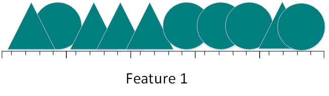

Figure 2.21.1.a

As can be seen from the above figure, if only one feature is classified, the triangle and the circle are almost evenly distributed on this line segment, and it is difficult to linearly classify 10 photos. So what happens when you add a feature:


Figure 2.21.1.b

After adding a feature, we found that we still couldn't find a straight line to separate the cat from the dog. So, consider adding another feature:


Figure 2.21.1.c


Figure 2.21.1.d

At this point, you can find a plane separating the triangle from the circle.

Now calculate that the different feature numbers are the density of the sample:

(1) For a feature, assuming a line segment of length 5 in the feature space, the sample density is 10/5=2.

(2) For two features, the feature space size is 5*5=25 and the sample density is 10/25=0.4.

(3) In the case of three features, the feature space size is 5*5\*5=125, and the sample density is 10/125=0.08.

By analogy, if you continue to increase the number of features, the sample density will become more and more sparse. At this time, it is easier to find a hyperplane to separate the training samples. As the number of features grows to infinity, the sample density becomes very sparse.

Let's look at what happens when you map the classification results of high-dimensional space to low-dimensional space.


Figure 2.21.1.e

The above figure is the result of mapping the 3D feature space to the 2D feature space. Although the training samples are linearly separable in the high dimensional feature space, the results are reversed after mapping to the low dimensional space. In fact, increasing the number of features makes the high-dimensional space linearly separable, which is equivalent to training a complex nonlinear classifier in a low-dimensional space. However, this nonlinear classifier is too "smart" to learn only a few special cases. If it is used to identify test samples that have not appeared in the training sample, the results are usually not ideal and can cause over-fitting problems.


Figure 2.21.1.f

The linear classifier with only two features shown in the above figure is divided into some training samples. The accuracy does not seem to be as high as in Figure 2.21.1.e. However, the generalization ability ratio of linear classifiers with two features is shown. A linear classifier with three features is stronger. Because the linear classifier with two features learns not only the special case, but an overall trend, which can be better distinguished for those samples that have never appeared before. In other words, by reducing the number of features, over-fitting problems can be avoided, thereby avoiding "dimensionality disasters."


From another perspective, the "dimensional disaster" is explained. Assuming that there is only one feature, the range of features is 0 to 1, and the eigenvalues ​​of each triangle and circle are unique. If we want the training sample to cover 20% of the eigenvalue range, then we need 20% of the total number of triangles and circles. After we add a feature, 45% (0.452 = 0.2) of the total number of triangles and circles is needed to continue covering 20% ​​of the eigenvalue range. After continuing to add a feature, 58% (0.583 = 0.2) of the total number of triangles and circles is required. As the number of features increases, more training samples are needed to cover 20% of the eigenvalue range. If there are not enough training samples, there may be over-fitting problems.

Through the above example, we can see that the more the number of features, the more sparse the training samples will be, the less accurate the parameter estimates of the classifier will be, and the over-fitting problem will be more likely to occur. Another effect of the "dimension disaster" is that the sparsity of the training samples is not evenly distributed. The training samples at the center are more sparse than the surrounding training samples.


Suppose there is a two-dimensional feature space, such as the rectangle shown in Figure 8, with an inscribed circle inside the rectangle. As the sample closer to the center of the circle is sparse, those samples located at the four corners of the rectangle are more difficult to classify than the samples within the circle. When the dimension becomes larger, the capacity of the feature hyperspace does not change, but the capacity of the unit circle tends to zero. In the high-dimensional space, most of the training data resides in the corner of the feature hyperspace. Data scattered in the corner is harder to classify than data in the center.

### 2.21.2 How to avoid dimension disaster

**To be improved!!!**

Solve the dimensional disaster problem:

Principal Component Analysis PCA, Linear Discrimination LDA

Singular value decomposition simplified data, Laplacian feature mapping

Lassio reduction factor method, wavelet analysis,

### 2.21.3 What is the difference and connection between clustering and dimension reduction?

Clustering is used to find the distribution structure inherent in data, either as a separate process, such as anomaly detection. It can also be used as a precursor to other learning tasks such as classification. Clustering is the standard unsupervised learning.

1) In some recommendation systems, the type of new user needs to be determined, but it is not easy to define the “user type”. In this case, the original user data can be clustered first, and each cluster is clustered according to the clustering result. Defined as a class, and then based on these classes to train the classification model to identify the type of new user.


2) Dimensionality reduction is an important method to alleviate the dimensionality disaster. It is to transform the original high-dimensional attribute space into a low-dimensional "subspace" through some mathematical transformation. It is based on the assumption that although the data samples that people usually observe are high-dimensional, what is actually related to the learning task is a low-dimensional distribution. Therefore, the description of the data can be realized through the most important feature dimensions, which is helpful for the subsequent classification. For example, the Titanic on Kaggle was still a problem. By giving a person a number of characteristics such as age, name, gender, fare, etc., to determine whether it can survive in a shipwreck. This requires first feature screening to identify the main features and make the learned models more generalizable.

Both clustering and dimensionality reduction can be used as preprocessing steps for classification and other issues.

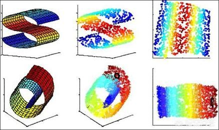

But although they can achieve the reduction of data. However, the two objects are different, the clustering is for data points, and the dimension reduction is for the characteristics of the data. In addition, they have a variety of implementation methods. K-means, hierarchical clustering, density-based clustering, etc. are commonly used in clustering; PCA, Isomap, LLE, etc. are commonly used in dimension reduction.


### 2.21.4 Comparison of four clustering methods

http://www.cnblogs.com/William_Fire/archive/2013/02/09/2909499.html


Clustering is to divide a data set into different classes or clusters according to a certain standard (such as distance criterion), so that the similarity of the data objects in the same cluster is as large as possible, and the data objects are not in the same cluster. The difference is also as large as possible. That is, after clustering, the same type of data is gathered together as much as possible, and different data is separated as much as possible.
The main clustering algorithms can be divided into the following categories: partitioning methods, hierarchical methods, density-based methods, grid-based methods, and model-based methods. The following is a comparison and analysis of the clustering effects of the k-means clustering algorithm, the condensed hierarchical clustering algorithm, the neural network clustering algorithm SOM, and the fuzzy clustering FCM algorithm through the universal test data set.

### 2.21.5 k-means clustering algorithm

K-means is one of the more classical clustering algorithms in the partitioning method. Because of its high efficiency, the algorithm is widely used in clustering large-scale data. At present, many algorithms are extended and improved around the algorithm.
The k-means algorithm uses k as a parameter to divide n objects into k clusters, so that the clusters have higher similarity and the similarity between clusters is lower. The processing of the k-means algorithm is as follows: First, k objects are randomly selected, each object initially representing the average or center of a cluster; for each remaining object, according to its distance from the center of each cluster, It is assigned to the nearest cluster; then the average of each cluster is recalculated. This process is repeated until the criterion function converges. Usually, the squared error criterion is used, which is defined as follows:

$E=\sum_{i=1}^{k}\sum_{p\subset C}|p-m_{i}|^{2} $

Here E is the sum of the squared errors of all objects in the database, p is the point in space, and mi is the average of cluster Ci [9]. The objective function makes the generated cluster as compact and independent as possible, and the distance metric used is the Euclidean distance, although other distance metrics can be used.

The algorithm flow of the k-means clustering algorithm is as follows:
Input: the number of databases and clusters containing n objects k;
Output: k clusters, which minimizes the squared error criterion.
Steps:
(1) arbitrarily select k objects as the initial cluster center;
(2) repeat;
(3) Assign each object (re) to the most similar cluster based on the average of the objects in the cluster;
(4) Update the average of the clusters, that is, calculate the average of the objects in each cluster;
(5) until no longer changes.

### 2.21.6 Hierarchical Clustering Algorithm

According to the order of hierarchical decomposition, whether it is bottom-up or top-down, the hierarchical clustering algorithm is divided into a condensed hierarchical clustering algorithm and a split hierarchical clustering algorithm.
The strategy of condensed hierarchical clustering is to first treat each object as a cluster, then merge the clusters into larger and larger clusters until all objects are in one cluster, or a certain termination condition is satisfied. Most hierarchical clusters belong to agglomerative hierarchical clustering, which differ only in the definition of similarity between clusters. The four widely used methods for measuring the distance between clusters are as follows:


Here is the flow of the condensed hierarchical clustering algorithm using the minimum distance:

(1) Treat each object as a class and calculate the minimum distance between the two;
(2) Combine the two classes with the smallest distance into one new class;
(3) Recalculate the distance between the new class and all classes;
(4) Repeat (2), (3) until all classes are finally merged into one class.

### 2.21.7 SOM clustering algorithm
The SOM neural network [11] was proposed by the Finnish neural network expert Professor Kohonen, which assumes that there are some topologies or sequences in the input object that can be implemented from the input space (n-dimensional) to the output plane (2-dimensional). Dimensional mapping, whose mapping has topological feature retention properties, has a strong theoretical connection with actual brain processing.

The SOM network consists of an input layer and an output layer. The input layer corresponds to a high-dimensional input vector, and the output layer consists of a series of ordered nodes organized on a 2-dimensional grid. The input node and the output node are connected by a weight vector. During the learning process, find the output layer unit with the shortest distance, that is, the winning unit, and update it. At the same time, the weights of the neighboring regions are updated so that the output node maintains the topological features of the input vector.

Algorithm flow:

(1) Network initialization, assigning an initial value to each node weight of the output layer;
(2) randomly select the input vector from the input sample to find the weight vector with the smallest distance from the input vector;
(3) Defining the winning unit, adjusting the weight in the vicinity of the winning unit to make it close to the input vector;
(4) Provide new samples and conduct training;
(5) Shrink the neighborhood radius, reduce the learning rate, and repeat until it is less than the allowable value, and output the clustering result.

### 2.21.8 FCM clustering algorithm

In 1965, Professor Zade of the University of California, Berkeley, first proposed the concept of 'collection'. After more than ten years of development, the fuzzy set theory has gradually been applied to various practical applications. In order to overcome the shortcomings of classification, the clustering analysis based on fuzzy set theory is presented. Cluster analysis using fuzzy mathematics is fuzzy cluster analysis [12].

The FCM algorithm is an algorithm that determines the degree to which each data point belongs to a certain cluster degree by membership degree. This clustering algorithm is an improvement of the traditional hard clustering algorithm.

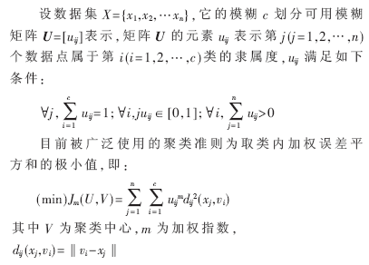

Algorithm flow:

(1) Standardized data matrix;
(2) Establish a fuzzy similarity matrix and initialize the membership matrix;
(3) The algorithm starts iterating until the objective function converges to a minimum value;
(4) According to the iterative result, the class to which the data belongs is determined by the last membership matrix, and the final clustering result is displayed.

3 four clustering algorithm experiments


3.1 Test data

In the experiment, IRIS [13] data set in the international UCI database dedicated to test classification and clustering algorithm was selected. The IRIS data set contains 150 sample data, which are taken from three different Iris plants, setosa. Versicolor and virginica flower samples, each data contains 4 attributes, namely the length of the bract, the width of the bract, the length of the petal, in cm. By performing different clustering algorithms on the dataset, clustering results with different precisions can be obtained.

3.2 Description of test results

Based on the previous algorithm principles and algorithm flow, the programming operation is performed by matlab, and the clustering results shown in Table 1 are obtained.


As shown in Table 1, for the four clustering algorithms, compare them in three aspects:

(1) The number of errors in the number of samples: the total number of samples of the error, that is, the sum of the number of samples in each category;

(2) Running time: that is, the whole clusteringThe time spent by the process, the unit is s;

(3) Average accuracy: Let the original data set have k classes, use ci to represent the i-th class, ni is the number of samples in ci, and mi is the correct number of clusters, then mi/ni is the i-th class. The accuracy of the average accuracy is:

$avg=\frac{1}{k}\sum_{i=1}^{k}\frac{m_{i}}{n_{i}} $

## 2.22 The difference between GBDT and random forest

The same point between GBDT and random forest:
1, are composed of multiple trees
2, the final result is determined by multiple trees together

Differences between GBDT and random forests:
1. The tree that constitutes a random forest can be a classification tree or a regression tree; and GBDT consists only of regression trees.
2. the trees that make up the random forest can be generated in parallel; and GBDT can only be serially generated
3. For the final output, random forests use majority voting, etc.; while GBDT accumulates all results, or weights up and accumulate
4. Random forest is not sensitive to outliers, GBDT is very sensitive to outliers
5. Random forests treat training sets equally, and GBDT is a weak classifier based on weights.
6. Random forests improve performance by reducing model variance, and GBDT improves performance by reducing model bias.

## 2.23 The relationship between big data and deep learning

**Big Data** is usually defined as a dataset that “beyond the capture, management, and processing capabilities of common software tools.”
**Machine Learning** The concern is how to build a computer program using experience to automatically improve.
**Data Mining** is the application of a specific algorithm for extracting patterns from data.
In data mining, the focus is on the application of the algorithm, not the algorithm itself.

**The relationship between machine learning and data mining** is as follows:
Data mining is a process in which machine learning algorithms are used as a tool to extract potentially valuable patterns in a data set.
The relationship between big data and deep learning is summarized as follows:

1. Deep learning is a behavior that mimics the brain. You can learn from many related aspects of the mechanism and behavior of the object you are learning, imitating type behavior and thinking.
2. Deep learning is helpful for the development of big data. Deep learning can help every stage of big data technology development, whether it is data analysis or mining or modeling, only deep learning, these work will be possible to achieve one by one.
3. Deep learning has transformed the thinking of problem solving. Many times when we find problems to solve problems, taking a step by step is not a major way to solve problems. On the basis of deep learning, we need to base ourselves on the goal from the beginning to the end, in order to optimize the ultimate goal. Go to process the data and put the data into the data application platform.
4. Deep learning of big data requires a framework. Deep learning in big data is based on a fundamental perspective. Deep learning requires a framework or a system. In general, turning your big data into reality through in-depth analysis is the most direct relationship between deep learning and big data.


## References
Machine Learning p74 Zhou Zhihua Decision Tree Pseudo Code
[Neural Networks and Deep Learning CHAPTER 3](http://neuralnetworksanddeeplearning.com/chap3.html) Introducing the cross-entropy cost function
