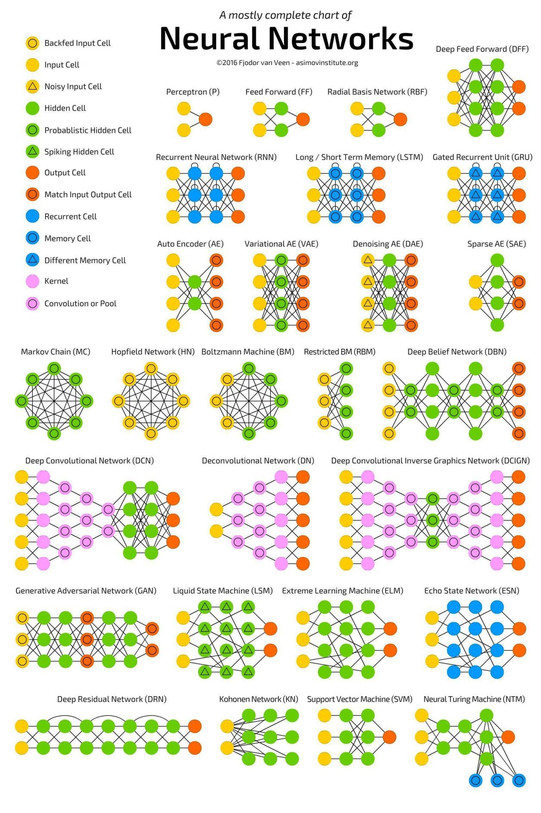
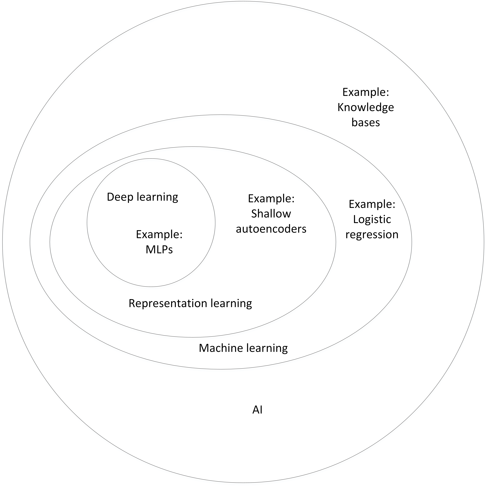
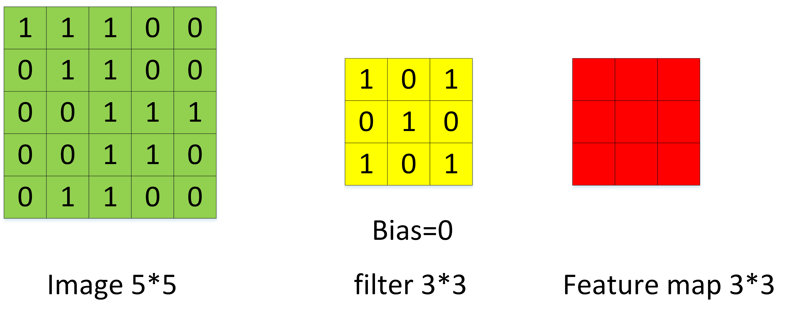
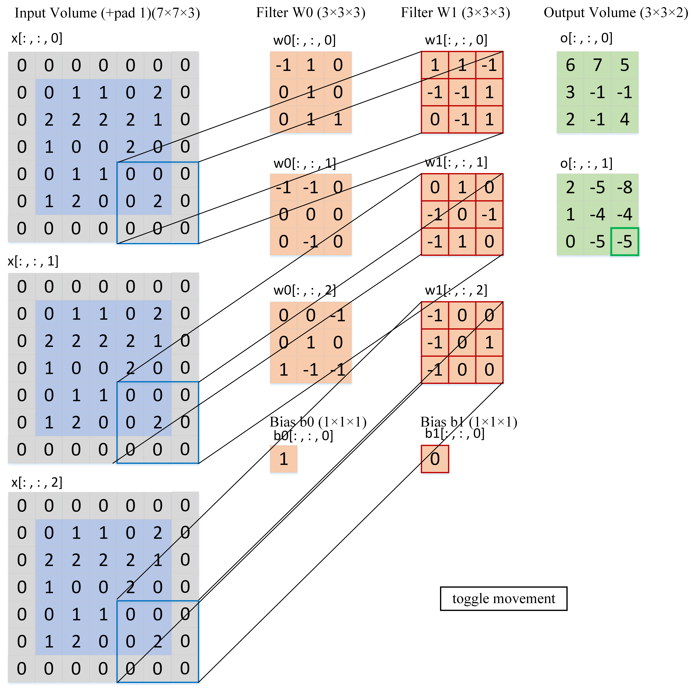
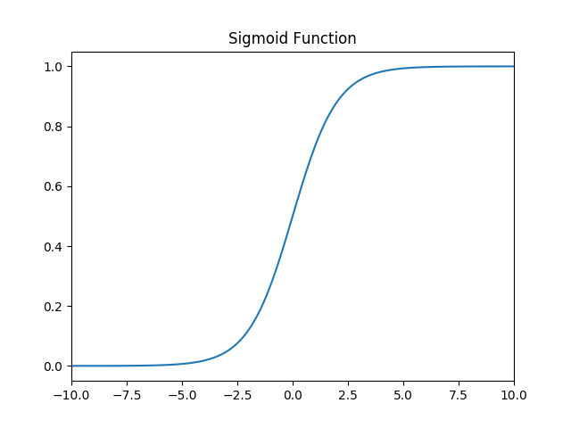
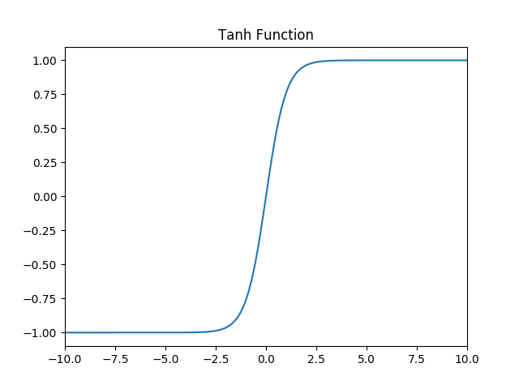
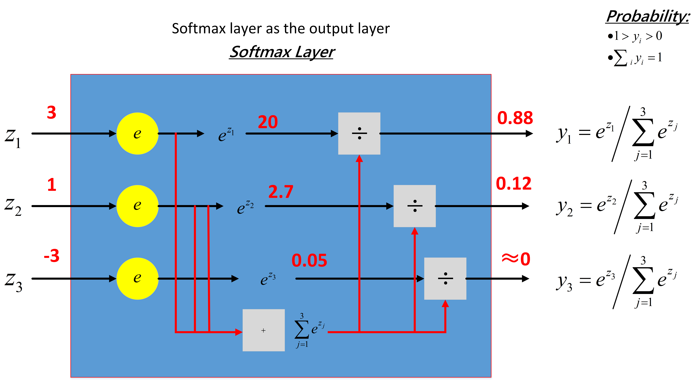
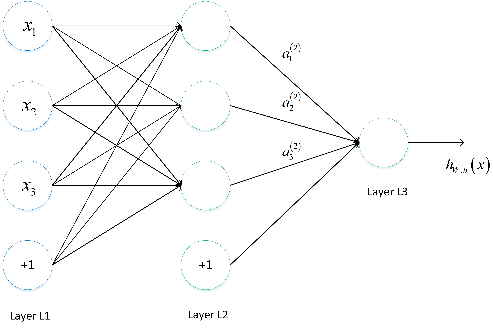
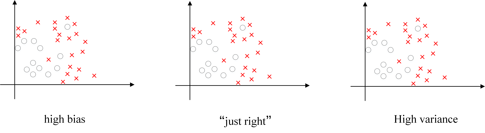
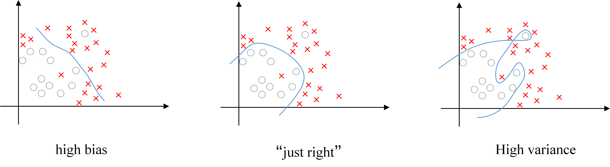

[TOC]

# Chapter 3 Foundation of Deep Learning

## 3.1 Basic Concepts

### 3.1.1 Neural network composition?

There are many types of neural networks, the most important of which is the multilayer perceptron. To describe the neural network in detail, let's start with the simplest neural network.

**Perceived machine**

The feature neuron model in the multi-layer perceptron is called the perceptron and was invented in 1957 by *Frank Rosenblatt*.

The simple perceptron is shown below:


Where $x_1$, $x_2$, $x_3$ is the input to the perceptron, and its output is:

$$
Output = \left\{
\begin{aligned}
0, \quad if \ \ \sum_i w_i x_i \leqslant threshold \\
1, \quad if \ \ \sum_i w_i x_i > threshold
\end{aligned}
\right.
$$

If the perceptron is imagined as a weighted voting mechanism, for example, three judges rate a singer with a score of $4 $, $1$, $-3 $, respectively, and the weight of the $3$ score is $1. 3, 2$, the singer will eventually score $4 * 1 + 1 * 3 + (-3) * 2 = 1$. According to the rules of the game, the selected $threshold$ is $3$, indicating that only the singer's overall score is greater than $3$. Against the perceptron, the player was eliminated because

$$
\sum_i w_i x_i < threshold=3, output = 0
$$

Replace $threshold$ with $-b$ and the output becomes:

$$
Output = \left\{
\begin{aligned}
0, \quad if \ \ w \cdot x + b \le threshold \\
1, \quad if \ \ w \cdot x + b > threshold
\end{aligned}
\right.
$$

Set the appropriate $x$ and $b$ , a simple perceptual unit's NAND gate is expressed as follows:


When the input is $0$, $1$, the perceptron output is $ 0 * (-2) + 1 * (-2) + 3 = 1$.

More complex perceptrons are composed of simple perceptron units:


**Multilayer Perceptron**

The multi-layer perceptron is promoted by the perceptron. The most important feature is that there are multiple neuron layers, so it is also called deep neural network. Each neuron in the $i$ layer of the multilayer perceptron is connected to each neuron in the $i-1$ layer compared to a separate perceptron.


The output layer can have more than $1$ neurons. The hidden layer can have only $1 $ layers, or it can have multiple layers. The output layer is a neural network of multiple neurons such as the following:


### 3.1.2 What are the common model structures of neural networks?

The figure below contains most of the commonly used models:



### 3.1.3 How to choose a deep learning development platform?

The existing deep learning open source platforms mainly include Caffe, PyTorch, MXNet, CNTK, Theano, TensorFlow, Keras, fastai and so on. So how to choose a platform that suits you? Here are some measures for reference.

**Reference 1: How easy is it to integrate with existing programming platforms and skills**

Mainly the development experience and resources accumulated in the early stage, such as programming language, pre-dataset storage format and so on.

**Reference 2: Closeness of ecological integration with related machine learning and data processing**

Deep learning research is inseparable from various software packages such as data processing, visualization, and statistical inference. Is there a convenient data preprocessing tool before considering modeling? After modeling, is there a convenient tool for visualization, statistical inference, and data analysis?

**Reference 3: Requirements and support for data volume and hardware**

Deep learning is not the same amount of data in different application scenarios, which leads us to consider the issues of distributed computing and multi-GPU computing. For example, people working on computer image processing often need to segment image files and computing tasks onto multiple computer nodes for execution. At present, each deep learning platform is developing rapidly, and each platform's support for distributed computing and other scenarios is also evolving.

**Reference 4: The maturity of the deep learning platform**

The maturity consideration is a more subjective consideration. These factors can include: the level of activity of the community; whether it is easy to communicate with developers; the momentum of current applications.

**Reference 5: Is the diversity of platform utilization? **

Some platforms are specifically developed for deep learning research and applications. Some platforms have powerful optimizations for distributed computing, GPU and other architectures. Can you use these platforms/software to do other things? For example, some deep learning software can be used to solve quadratic optimization; some deep learning platforms are easily extended and used in reinforcement learning applications.

### 3.1.4 Why use deep representation?

1. Deep neural network is a feature-oriented learning algorithm. Shallow neurons learn some low-level simple features, such as edges and textures, directly from the input data. The deep features continue to learn more advanced features based on the shallow features that have been learned, and learn deep semantic information from a computer perspective.
2. The number of hidden cells in the deep network is relatively small, and the number of hidden layers is large. If the shallow network wants to achieve the same calculation result, the number of cells requiring exponential growth can be achieved.

### 3.1.5 Why is deep neural network difficult to train?


1. Gradient Gradient
    The disappearance of the gradient means that the gradient will become smaller and smaller as seen from the back and the front through the hidden layer, indicating that the learning of the front layer will be significantly slower than the learning of the latter layer, so the learning will get stuck unless the gradient becomes larger.

    The reason for the disappearance of the gradient is affected by many factors, such as the size of the learning rate, the initialization of the network parameters, and the edge effect of the activation function. In the deep neural network, the gradient calculated by each neuron is passed to the previous layer, and the gradient received by the shallower neurons is affected by all previous layer gradients. If the calculated gradient value is very small, as the number of layers increases, the obtained gradient update information will decay exponentially, and the gradient disappears. The figure below shows the learning rate of different hidden layers:


2. Exploding Gradient
    In a network structure such as a deep network or a Recurrent Neural Network (RNN), gradients can accumulate in the process of network update, becoming a very large gradient, resulting in a large update of the network weight value, making the network unstable; In extreme cases, the weight value will even overflow and become a $NaN$ value, which cannot be updated anymore.

3. Degeneration of the weight matrix results in a reduction in the effective degrees of freedom of the model. The degradation rate of learning in the parameter space is slowed down, which leads to the reduction of the effective dimension of the model. The available degrees of freedom of the network contribute to the gradient norm in learning. As the number of multiplication matrices (ie, network depth) increases, The product of the matrix becomes more and more degraded. In nonlinear networks with hard saturated boundaries (such as ReLU networks), as the depth increases, the degradation process becomes faster and faster. The visualization of this degradation process is shown in a 2014 paper by Duvenaud et al:


As the depth increases, the input space (shown in the upper left corner) is twisted into thinner and thinner filaments at each point in the input space, and only one direction orthogonal to the filament affects the response of the network. In this direction, the network is actually very sensitive to change.

### 3.1.6 What is the difference between deep learning and machine learning?

Machine learning: use computer, probability theory, statistics and other knowledge to input data and let the computer learn new knowledge. The process of machine learning is to train the data to optimize the objective function.

Deep learning: It is a special machine learning with powerful capabilities and flexibility. It learns to represent the world as a nested hierarchy, each representation is associated with a simpler feature, and the abstract representation is used to compute a more abstract representation.

Traditional machine learning needs to define some manual features to purposefully extract target information, relying heavily on task specificity and expert experience in designing features. Deep learning can learn simple features from big data, and gradually learn from the deeper features of more complex abstraction, independent of artificial feature engineering, which is also a major reason for deep learning in the era of big data.





## 3.2 Network Operations and Calculations

### 3.2.1 Forward Propagation and Back Propagation?

There are two main types of neural network calculations: foward propagation (FP) acts on the input of each layer, and the output is obtained by layer-by-layer calculation; backward propagation (BP) acts on the output of the network. Calculate the gradient from deep to shallow to update the network parameters.

** Forward Propagation**


Suppose the upper node $ i, j, k, ... $ and so on are connected to the node $ w $ of this layer, so what is the value of the node $ w $? That is, the weighting operation is performed by the nodes of $i, j, k, ... $ above and the corresponding connection weights, and the final result is added with an offset term (for simplicity in the figure) Finally, through a non-linear function (ie activation function), such as $ReLu $, $ sigmoid $ and other functions, the final result is the output of this layer node $ w $.

Finally, through this method of layer by layer operation, the output layer results are obtained.

**Backpropagation**


Because of the final result of our forward propagation, taking the classification as an example, there is always an error in the end. How to reduce the error? One algorithm that is widely used at present is the gradient descent algorithm, but the gradient requires the partial derivative. The Chinese alphabet is used as an example to explain:

Let the final error be $ E $ and the activation function of the output layer be a linear activation function, for the output then $ E $ for the output node $ y_l $ the partial derivative is $ y_l - t_l $, where $ t_l $ is the real value, $ \ Frac{\partial y_l}{\partial z_l} $ refers to the activation function mentioned above, $ z_l $ is the weighted sum mentioned above, then the $ E $ for this layer has a partial derivative of $ z_l $ Frac{\partial E}{\partial z_l} = \frac{\partial E}{\partial y_l} \frac{\partial y_l}{\partial z_l} $. In the same way, the next level is calculated as well, except that the $\frac{\partial E}{\partial y_k} $ calculation method has been changed back to the input layer, and finally $ \frac{\partial E}{ \partial x_i} = \frac{\partial E}{\partial y_j} \frac{\partial y_j}{\partial z_j} $, and $ \frac{\partial z_j}{\partial x_i} = w_i j $ . Then adjust the weights in these processes, and then continue the process of forward propagation and back propagation, and finally get a better result.

### 3.2.2 How to calculate the output of the neural network?


As shown in the figure above, the input layer has three nodes, which we numbered as 1, 2, and 3; the four nodes of the hidden layer are numbered 4, 5, 6, and 7; the last two nodes of the output layer are numbered 8. 9. For example, node 4 of the hidden layer is connected to the three nodes 1, 2, and 3 of the input layer, and the weights on the connection are $ w_{41}, w_{42}, w_{43} $.

In order to calculate the output value of node 4, we must first get the output values ​​of all its upstream nodes (ie nodes 1, 2, 3). Nodes 1, 2, and 3 are nodes of the input layer, so their output value is the input vector itself. According to the corresponding relationship in the above picture, you can see that the output values ​​of nodes 1, 2, and 3 are $ x_1, x_2, x_3 $, respectively.

$$
A_4 = \sigma(w^T \cdot a) = \sigma(w_{41}x_4 + w_{42}x_2 + w_{43}a_3 + w_{4b})
$$

Where $ w_{4b} $ is the offset of node 4.

Similarly, we can continue to calculate the output values ​​of nodes 5, 6, and 7 $ a_5, a_6, a_7 $.

Calculate the output value of node 8 of the output layer $ y_1 $:

$$
Y_1 = \sigma(w^T \cdot a) = \sigma(w_{84}A_4 + w_{85}a_5 + w_{86}a_6 + w_{87}a_7 + w_{8b})
$$

Where $ w_{8b} $ is the offset of node 8.

For the same reason, we can also calculate $ y_2 $. So that the output values ​​of all the nodes in the output layer are calculated, we get the output vector $ y_1, y_2 $ of the neural network when the input vectors $ x_1, x_2, x_3, x_4 $. Here we also see that the output vector has the same number of dimensions as the output layer neurons.

### 3.2.3 How to calculate the output value of convolutional neural network?

Suppose there is a 5\*5 image, convolved with a 3\*3 filter, and I want a 3\*3 Feature Map, as shown below:



$ x_{i,j} $ represents the $ j $ column element of the $ i $ line of the image. $ w_{m,n} $ means filter $ m $ line $ n $ column weight. $ w_b $ represents the offset of $filter$. Table $a_i, _j$ shows the feature map $ i$ line $ j $ column element. $f$ represents the activation function, here the $ReLU$ function is used as an example.

The convolution calculation formula is as follows:

$$
A_{i,j} = f(\sum_{m=0}^2 \sum_{n=0}^2 w_{m,n} x_{i+m, j+n} + w_b )
$$

When the step size is $1$, the feature map element $ a_{0,0} $ is calculated as follows:

$$
A_{0,0} = f(\sum_{m=0}^2 \sum_{n=0}^2 w_{m,n} x_{0+m, 0+n} + w_b )


= relu(w_{0,0} x_{0,0} + w_{0,1} x_{0,1} + w_{0,2} x_{0,2} + w_{1,0} x_{ 1,0} + \\w_{1,1} x_{1,1} + w_{1,2} x_{1,2} + w_{2,0} x_{2,0} + w_{2, 1} x_{2,1} + w_{2,2} x_{2,2}) \\


= 1 + 0 + 1 + 0 + 1 + 0 + 0 + 0 + 1 \\

= 4
$$

The calculation process is illustrated as follows:


By analogy, all Feature Maps are calculated.


When the stride is 2, the Feature Map is calculated as follows


Note: Image size, stride, and the size of the Feature Map after convolution are related. They satisfy the following relationship:

$$
W_2 = (W_1 - F + 2P)/S + 1\\
H_2 = (H_1 - F + 2P)/S + 1
$$

Where $ W_2 $ is the width of the Feature Map after convolution; $ W_1 $ is the width of the image before convolution; $ F $ is the width of the filter; $ P $ is the number of Zero Padding, and Zero Padding is around the original image Make a few laps of $0$. If the value of $P$ is $1$, then make $1$ lap $0$; $S$ is the stride; $ H_2 $ is the height of the Feature Map after convolution; $ H_1 $ is the convolution The width of the image.

Example: Suppose the image width is $ W_1 = 5 $, filter width $ F=3 $, Zero Padding $ P=0 $, stride $ S=2 $, $ Z $

$$
W_2 = (W_1 - F + 2P)/S + 1

= (5-3+0)/2 + 1

= 2
$$

The Feature Map width is 2. Similarly, we can also calculate that the Feature Map height is also 2.

If the image depth before convolution is $ D $, then the corresponding filter depth must also be $ D $. Convolution calculation formula with depth greater than 1:

$$
A_{i,j} = f(\sum_{d=0}^{D-1} \sum_{m=0}^{F-1} \sum_{n=0}^{F-1} w_{ d,m,n} x_{d,i+m,j+n} + w_b)
$$

Where $D$ is the depth; $F$ is the size of the filter; $w_{d,m,n}$ represents the $d$$ layer of the filter, the $m$ line, the $n$ column Weight; $ a_{d,i,j} $ means the $d$ of the feature map, the $i$ line, the $j$ column, and the other symbols have the same meanings and are not described again.

There can be multiple filters per convolutional layer. After each filter is convolved with the original image, you get a Feature Map. The depth (number) of the Feature Map after convolution is the same as the number of filters in the convolutional layer. The following illustration shows the calculation of a convolutional layer with two filters. $7*7*3$ Input, after two convolutions of $3*3*3$ filter (step size is $2$), get the output of $3*3*2$. The Zero padding in the figure is $1$, which is a $0$ around the input element.



The above is the calculation method of the convolutional layer. This is a partial connection and weight sharing: each layer of neurons is only connected to the upper layer of neurons (convolution calculation rules), and the weight of the filter is the same for all neurons in the previous layer. For a convolutional layer containing two $3 * 3 * 3 $ fitlers, the number of parameters is only $ (3 * 3 * 3+1) * 2 = 56 $, and the number of parameters is the same as the previous one. The number of layers of neurons is irrelevant. Compared to a fully connected neural network, the number of parameters is greatly reduced.

### 3.2.4 How to calculate the output value of the Pooling layer output value?

The main role of the Pooling layer is to downsample, further reducing the number of parameters by removing unimportant samples from the Feature Map. There are many ways to pooling, the most common one is Max Pooling. Max Pooling actually takes the maximum value in the sample of n\*n as the sampled value after sampling. The figure below is 2\*2 max pooling:


In addition to Max Pooing, Average Pooling is also commonly used - taking the average of each sample.
For a Feature Map with a depth of $ D $ , each layer does Pooling independently, so the depth after Pooling is still $ D $.

### 3.2.5 Example Understanding Back Propagation

A typical three-layer neural network is as follows:


Where Layer $ L_1 $ is the input layer, Layer $ L_2 $ is the hidden layer, and Layer $ L_3 $ is the output layer.

Assuming the input dataset is $ D={x_1, x_2, ..., x_n} $, the output dataset is $ y_1, y_2, ..., y_n $.

If the input and output are the same, it is a self-encoding model. If the raw data is mapped, it will get an output different from the input.

Suppose you have the following network layer:


The input layer contains neurons $ i_1, i_2 $, offset $ b_1 $; the hidden layer contains neurons $ h_1, h_2 $, offset $ b_2 $, and the output layer is $ o_1, o_2 $, $ W_i $ is the weight of the connection between the layers, and the activation function is the $sigmoid $ function. Take the initial value of the above parameters, as shown below:


among them:

- Enter the data $ i1=0.05, i2 = 0.10 $
- Output data $ o1=0.01, o2=0.99 $;
- Initial weights $ w1=0.15, w2=0.20, w3=0.25, w4=0.30, w5=0.40, w6=0.45, w7=0.50, w8=0.55 $
- Target: Give the input data $ i1,i2 $ ( $0.05$ and $0.10$ ) so that the output is as close as possible to the original output $ o1,o2 $,( $0.01$ and $0.99$).

** Forward Propagation**

1. Input layer --> output layer

Calculate the input weighted sum of neurons $ h1 $:

$$
Net_{h1} = w_1 * i_1 + w_2 * i_2 + b_1 * 1\\

Net_{h1} = 0.15 * 0.05 + 0.2 * 0.1 + 0.35 * 1 = 0.3775
$$

The output of the neuron $ h1 $ $ o1 $ : (the activation function used here is the sigmoid function):

$$
Out_{h1} = \frac{1}{1 + e^{-net_{h1}}} = \frac{1}{1 + e^{-0.3775}} = 0.593269992
$$

Similarly, the output of neuron $ h2 $ can be calculated. $ o1 $:

$$
Out_{h2} = 0.596884378
$$


2. Implicit layer --> output layer:

Calculate the values ​​of the output layer neurons $ o1 $ and $ o2 $ :

$$
Net_{o1} = w_5 * out_{h1} + w_6 * out_{h2} + b_2 * 1
$$

$$
Net_{o1} = 0.4 * 0.593269992 + 0.45 * 0.596884378 + 0.6 * 1 = 1.105905967
$$

$$
Out_{o1} = \frac{1}{1 + e^{-net_{o1}}} = \frac{1}{1 + e^{1.105905967}} = 0.75136079
$$

The process of forward propagation is over. We get the output value of $ [0.75136079 , 0.772928465] $, which is far from the actual value of $ [0.01 , 0.99] $. Now we reverse the error and update the right. Value, recalculate the output.

**Backpropagation **

Calculate the total error

Total error: (Use Square Error here)

$$
E_{total} = \sum \frac{1}{2}(target - output)^2
$$

But there are two outputs, so calculate the error of $ o1 $ and $ o2 $ respectively, the total error is the sum of the two:

$E_{o1} = \frac{1}{2}(target_{o1} - out_{o1})^2
= \frac{1}{2}(0.01 - 0.75136507)^2 = 0.274811083$.

$E_{o2} = 0.023560026$.

$E_{total} = E_{o1} + E_{o2} = 0.274811083 + 0.023560026 = 0.298371109$.


2. Implicit layer --> Output layer weight update:

Taking the weight parameter $ w5 $ as an example, if we want to know how much influence $ w5 $ has on the overall error, we can use the overall error to find the partial derivative of $ w5 $: (chain rule)

$$
\frac{\partial E_{total}}{\partial w5} = \frac{\partial E_{total}}{\partial out_{o1}} * \frac{\partial out_{o1}}{\partial net_{ O1}} * \frac{\partial net_{o1}}{\partial w5}
$$

The following diagram can be more intuitive to see how the error propagates back:


### 3.2.6 What is the meaning of the neural network more "deep"?

Premise: within a certain range.

- In the case of the same number of neurons, the deep network structure has a larger capacity, and the layered combination brings an exponential expression space, which can be combined into more different types of substructures, which makes learning and representation easier. Various features.
- An increase in the hidden layer means that the number of nesting layers of the nonlinear transformation brought by the activation function is more, you can construct more complex mappings.

## 3.3 Hyperparameters

### 3.3.1 What is a hyperparameter?

**Super-parameter**: For example, the learning rate in the algorithm, the iterations of the gradient descent method, the hidden layers, the number of hidden layer units, and the activation function are all required. The actual situation is set, these numbers actually control the last parameter and the value, so they are called hyperparameters.

### 3.3.2 How to find the optimal value of the hyperparameter?

There are always some difficult parameters to adjust when using machine learning algorithms. For example, weight attenuation size, Gaussian kernel width, and so on. These parameters require manual settings, and the set values ​​have a large impact on the results. Common methods for setting hyperparameters are:

1. Guess and check: Select parameters based on experience or intuition, and iterate over.

2. Grid Search: Let the computer try to evenly distribute a set of values ​​within a certain range.

3. Random search: Let the computer randomly pick a set of values.

4. Bayesian optimization: Using Bayesian optimization of hyperparameters, it is difficult to meet the Bayesian optimization algorithm itself.

5. The MITIE method performs local optimization under the premise of good initial guessing. It uses the BOBYQA algorithm and has a carefully chosen starting point. Since BOBYQA only looks for the nearest local optimal solution, the success of this method depends largely on whether there is a good starting point. In the case of MITIE, we know a good starting point, but this is not a universal solution, because usually you won't know where the good starting point is. On the plus side, this approach is well suited to finding local optimal solutions. I will discuss this later.

6. The latest proposed global optimization method for LIPO. This method has no parameters and is proven to be better than a random search method.

### 3.3.3 Superparameter search general process?

The general process of hyperparameter search:
1. Divide the data set into a training set, a validation set, and a test set.
2. Optimize the model parameters based on the performance indicators of the model on the training set.
3. Search the model's hyperparameters based on the model's performance metrics on the validation set.
4. Steps 2 and 3 alternately iteratively, finalizing the parameters and hyperparameters of the model, and verifying the pros and cons of the evaluation model in the test set.

Among them, the search process requires a search algorithm, generally: grid search, random search, heuristic intelligent search, Bayesian search.

## 3.4 Activation function

### 3.4.1 Why do I need a nonlinear activation function?

**Why do I need to activate the function? **

1. The activation function plays an important role in model learning and understanding very complex and nonlinear functions.
2. The activation function can introduce nonlinear factors. If the activation function is not used, the output signal is only a simple linear function. The linear function is a first-order polynomial. The complexity of the linear equation is limited, and the ability to learn complex function mapping from the data is small. Without an activation function, the neural network will not be able to learn and simulate other complex types of data, such as images, video, audio, speech, and so on.
3. The activation function can convert the current feature space to another space through a certain linear mapping, so that the data can be better classified.

**Why does the activation function require a nonlinear function? **

1. If the network is all linear, the linear combination is linear, just like a single linear classifier. This makes it impossible to approximate arbitrary functions with nonlinearities.
2. Use a nonlinear activation function to make the network more powerful, increasing its ability to learn complex things, complex form data, and complex arbitrary function mappings that represent nonlinearities between input and output. A nonlinear activation function can be used to generate a nonlinear mapping from input to output.

### 3.4.2 Common activation functions and images

1. sigmoid activation function

   The function is defined as: $ f(x) = \frac{1}{1 + e^{-x}} $, whose value is $ (0,1) $.

   The function image is as follows:



2. tanh activation function

   The function is defined as: $ f(x) = tanh(x) = \frac{e^x - e^{-x}}{e^x + e^{-x}} $, the value range is $ (- 1,1) $.

   The function image is as follows:



3. Relu activation function

   The function is defined as: $ f(x) = max(0, x) $ , and the value field is $ [0,+∞) $;

   The function image is as follows:


4. Leak Relu activation function

   The function is defined as: $ f(x) = \left\{
   \begin{aligned}
   Ax, \quad x<0 \\
   x, \quad x>0
   \end{aligned}
   \right. $, the value field is $ (-∞, +∞) $.

   The image is as follows ($ a = 0.5 $):


5. SoftPlus activation function

   The function is defined as: $ f(x) = ln( 1 + e^x) $, and the value range is $ (0, +∞) $.

   The function image is as follows:


6. softmax function

   The function is defined as: $ \sigma(z)_j = \frac{e^{z_j}}{\sum_{k=1}^K e^{z_k}} $.

   Softmax is mostly used for multi-class neural network output.

### 3.4.3 Derivative calculation of common activation functions?

For common activation functions, the derivative is calculated as follows:


### 3.4.4 What are the properties of the activation function?

1. Nonlinearity: When the activation function is linear, a two-layer neural network can approximate all functions. But if the activation function is an identity activation function, ie $ f(x)=x $, this property is not satisfied, and if the MLP uses an identity activation function, then the entire network is waiting with the single layer neural network. Price
2. Differentiability: This property is reflected when the optimization method is based on gradients;
3. Monotonicity: When the activation function is monotonous, the single-layer network can guarantee a convex function;
4. $ f(x)≈x $: When the activation function satisfies this property, if the initialization of the parameter is a random, small value, the training of the neural network will be very efficient; if this property is not met, then Set the initial value in detail;
5. Range of output values: Gradient-based optimization methods are more stable when the output value of the activation function is finite, because the representation of the feature is more significantly affected by the finite weight; when the output of the activation function is infinite, the model Training will be more efficient, but in this case it is small and generally requires a smaller Learning Rate.

### 3.4.5 How to choose an activation function?

Choosing a suitable activation function is not easy. There are many factors to consider. Usually, if you are not sure which activation function works better, you can try them all and then evaluate them on the verification set or test set. Then see which one performs better, just use it.

The following are common choices:

1. If the output is a 0, 1 value (two-category problem), the output layer selects the sigmoid function, and then all other cells select the Relu function.
2. If you are not sure which activation function to use on the hidden layer, then the Relu activation function is usually used. Sometimes, the tanh activation function is also used, but one advantage of Relu is that the derivative is equal to 0 when it is negative.
3. sigmoid activation function: basically it will not be used except that the output layer is a two-class problem.
4. tanh activation function: tanh is very good, almost suitable for all occasions.
5. ReLu activation function: The most commonly used default function. If you are not sure which activation function to use, use ReLu or Leaky ReLu and try other activation functions.
6. If we encounter some dead neurons, we can use the Leaky ReLU function.

### 3.4.6 What are the advantages of using the ReLu activation function?

1. In the case where the interval varies greatly, the derivative of the ReLu activation function or the slope of the activation function will be much larger than 0. In the program implementation is an if-else statement, and the sigmoid function needs to perform floating-point arithmetic. In practice, Using ReLu to activate function neural networks is usually faster than using sigmoid or tanh activation functions.
2. The derivatives of the sigmoid and tanh functions will have a gradient close to 0 in the positive and negative saturation regions, which will cause the gradient to diffuse, while the Relu and Leaky ReLu functions are more constant than the 0 part, and will not produce gradient dispersion.
3. It should be noted that when Relu enters the negative half, the gradient is 0, and the neurons are not trained at this time, resulting in so-called sparsity, which Leaky ReLu does not cause.

### 3.4.7 When can I use the linear activation function?

1. The output layer mostly uses a linear activation function.
2. Some linear activation functions may be used at the hidden layer.
3. There are very few linear activation functions commonly used.

### 3.4.8 How to understand Relu (< 0) is a nonlinear activation function?

The Relu activation function image is as follows:


According to the image, it can be seen that it has the following characteristics:

Unilateral inhibition
2. A relatively broad excitement boundary;
3. Sparse activation;

From the image, the ReLU function is a piecewise linear function that changes all negative values ​​to 0, while the positive values ​​are unchanged, thus becoming a one-sided suppression.

Because of this unilateral inhibition, the neurons in the neural network also have sparse activation.

**Sparse activation**: From the signal point of view, the neurons only selectively respond to a small part of the input signal at the same time, a large number of signals are deliberately shielded, which can improve the learning accuracy and extract better and faster. Sparse features. When $ x<0 $, ReLU is hard saturated, and when $ x>0 $, there is no saturation problem. ReLU is able to keep the gradient from decaying when $ x>0 $, thus alleviating the gradient disappearance problem.

### 3.4.9 How does the Softmax function be applied to multiple classifications?

Softmax is used in the multi-classification process. It maps the output of multiple neurons to the $ (0,1) $ interval, which can be understood as a probability to be multi-classified!

Suppose we have an array, $ V_i $ represents the $ i $ element in $ V $ , then the softmax value of this element is

$$
S_i = \frac{e^{V_i}}{\sum_j e^{V_j}}
$$

From the following figure, the neural network contains the input layer, and then processed by two feature layers. Finally, the softmax analyzer can get the probability under different conditions. Here, it needs to be divided into three categories, and finally get $ y=0. , y=1, y=2 probability value of $.


Continuing with the picture below, the three inputs pass through softmax to get an array of $[0.05, 0.10, 0.85] $, which is the function of soft.


The more visual mapping process is shown below:



In the case of softmax, the original output is $3,1,-3$, which is mapped to the value of $(0,1)$ by the softmax function, and the sum of these values ​​is $1 $( Satisfy the nature of the probability), then we can understand it as a probability, when we finally select the output node, we can select the node with the highest probability (that is, the value corresponds to the largest) as our prediction target!

### 3.4.10 Cross entropy cost function definition and its derivative derivation

(**Contributors: Huang Qinjian - South China University of Technology**)


The output of the neuron is a = σ(z), where $z=\sum w_{j}i_{j}+b $ is the weighted sum of the inputs.

$C=-\frac{1}{n}\sum[ylna+(1-y)ln(1-a)]$

Where n is the total number of training data, summation is performed on all training inputs x, and y is the corresponding target output.

Whether the expression solves the problem of slow learning is not obvious. In fact, even seeing this definition as a cost function is not obvious! Before solving the slow learning, let's see why the cross entropy can be interpreted as a cost function.

There are two reasons for considering cross entropy as a cost function.

First, it is non-negative, C > 0. It can be seen that all independent terms in the summation in the expression are negative, because the domain of the logarithm function is (0,1), and there is a negative sign before the sum, so the result is non- negative.

Second, if the actual output of the neuron is close to the target value for all training inputs x, then the cross entropy will be close to zero.

Suppose in this example, y = 0 and a ≈ 0. This is the result we think of. We see that the first term in the formula is eliminated because y = 0 and the second is actually − ln(1 −a) ≈ 0. Conversely, y = 1 and a ≈ 1. So the smaller the difference between the actual output and the target output, the lower the value of the final cross entropy. (This assumes that the output is not 0, which is 1, the actual classification is also the same)

In summary, the cross entropy is non-negative and will approach zero when the neuron reaches a good rate of accuracy. These are actually the characteristics of the cost function we want. In fact, these characteristics are also available in the quadratic cost function. Therefore, cross entropy is a good choice. But the cross entropy cost function has a better feature than the quadratic cost function, which is that it avoids the problem of slow learning speed. In order to clarify this situation, we calculate the partial derivative of the cross entropy function with respect to the weight. We substitute $a={\varsigma}(z)$ into the formula and apply the two-chain rule to get:

$\begin{eqnarray}\frac{\partial C}{\partial w_{j}}&=&-\frac{1}{n}\sum \frac{\partial }{\partial w_{j}}[ Ylna+(1-y)ln(1-a)]\\&=&-\frac{1}{n}\sum \frac{\partial }{\partial a}[ylna+(1-y)ln(1 -a)]*\frac{\partial a}{\partial w_{j}}\\&=&-\frac{1}{n}\sum (\frac{y}{a}-\frac{1 -y}{1-a})*\frac{\partial a}{\partial w_{j}}\\&=&-\frac{1}{n}\sum (\frac{y}{\varsigma (z)}-\frac{1-y}{1-\varsigma(z)})\frac{\partial \varsigma(z)}{\partial w_{j}}\\&=&-\frac{ 1}{n}\sum (\frac{y}{\varsigma(z)}-\frac{1-y}{1-\varsigma(z)}){\varsigma}'(z)x_{j} \end{eqnarray}$

According to the definition of $\varsigma(z)=\frac{1}{1+e^{-z}}$, and some operations, we can get ${\varsigma}'(z)=\varsigma(z ) (1-\varsigma(z))$. After simplification, you can get:

$\frac{\partial C}{\partial w_{j}}=\frac{1}{n}\sum x_{j}({\varsigma}(z)-y)$

This is a beautiful formula. It tells us that the speed of weight learning is controlled by $\varsigma(z)-y$, which is the error in the output. Greater error and faster learning. This is the result of our intuitive expectation. In particular, this cost function also avoids the slow learning caused by ${\varsigma}'(z)$ in a similar equation in the quadratic cost function. When we use cross entropy, ${\varsigma}'(z)$ is dropped, so we no longer need to care if it gets small. This addition is the special effect of cross entropy. In fact, this is not a very miraculous thing. As we will see later, cross entropy is actually just a choice to satisfy this characteristic.

According to a similar approach, we can calculate the partial derivative of the bias. I will not give a detailed process here, you can easily verify:

$\frac{\partial C}{\partial b}=\frac{1}{n}\sum ({\varsigma}(z)-y) $


Again, this avoids slow learning caused by similar ${\varsigma}'(z)$ items in the quadratic cost function.

### 3.4.11 Why is Tanh faster than Sigmoid?

** (Contributor: Huang Qinjian - South China University of Technology)**

$tanh^{,}(x)=1-tanh(x)^{2}\in (0,1) $

$s^{,}(x)=s(x)*(1-s(x))\in (0,\frac{1}{4}]$

It can be seen from the above two formulas that the problem of disappearing the tanh(x) gradient is lighter than sigmoid, so Tanh converges faster than Sigmoid.

## 3.5 Batch_Size

### 3.5.1 Why do I need Batch_Size?

The choice of Batch, the first decision is the direction of the decline.

If the data set is small, it can take the form of a full data set. The benefits are:

1. The direction determined by the full data set better represents the sample population and is more accurately oriented in the direction of the extreme value.
2. Since the gradient values ​​of different weights are very different, it is difficult to select a global learning rate. Full Batch Learning can use Rprop to update each weight individually based on gradient symbols only.

For larger data sets, if you use a full data set, the downside is:
1. With the massive growth of data sets and memory limitations, it is becoming increasingly infeasible to load all of the data at once.
2. Iteratively in the Rprop manner, due to the sampling difference between the batches, the gradient correction values ​​cancel each other and cannot be corrected. This was followed by a compromise with RMSProp.

### 3.5.2 Selection of Batch_Size value

If only one sample is trained at a time, Batch_Size = 1. The error surface of a linear neuron in the mean square error cost function is a paraboloid with an ellipse in cross section. For multi-layered neurons and nonlinear networks, the local approximation is still a paraboloid. At this time, each correction direction is corrected by the gradient direction of each sample, and the traverse is directly inconsistent, and it is difficult to achieve convergence.

Since Batch_Size is a full data set or Batch_Size = 1 has its own shortcomings, can you choose a moderate Batch_Size value?

At this time, a batch-grading learning method (Mini-batches Learning) can be employed. Because if the data set is sufficient, then the gradient calculated using half (or even much less) data training is almost the same as the gradient trained with all the data.

### 3.5.3 What are the benefits of increasing Batch_Size within a reasonable range?

1. The memory utilization is improved, and the parallelization efficiency of large matrix multiplication is improved.
2. The number of iterations required to complete an epoch (full data set) is reduced, and the processing speed for the same amount of data is further accelerated.
3. Within a certain range, generally, the larger the Batch_Size, the more accurate the determined direction of decline, resulting in less training shock.

### 3.5.4 What is the disadvantage of blindly increasing Batch_Size?

1. Memory utilization has increased, but memory capacity may not hold up.
2. The number of iterations required to complete an epoch (full data set) is reduced. To achieve the same accuracy, the time it takes is greatly increased, and the correction of the parameters becomes slower.
3. Batch_Size is increased to a certain extent, and its determined downward direction has not changed substantially.

### 3.5.5 What is the effect of adjusting Batch_Size on the training effect?

1. Batch_Size is too small, and the model performs extremely badly (error is soaring).
2. As Batch_Size increases, the faster the same amount of data is processed.
3. As Batch_Size increases, the number of epochs required to achieve the same accuracy is increasing.
4. Due to the contradiction between the above two factors, Batch_Size is increased to a certain time, and the time is optimal.
5. Since the final convergence accuracy will fall into different local extrema, Batch_Size will increase to some point and achieve the best convergence accuracy.

## 3.6 Normalization

### 3.6.1 What is the meaning of normalization?

1. Inductive statistical distribution of unified samples. The normalized between $ 0-1 $ is the statistical probability distribution, normalized between $ -1--+1 $ is the statistical coordinate distribution.

2. Whether for modeling or calculation, the basic unit of measurement is the same, the neural network is trained (probability calculation) and prediction based on the statistical probability of the sample in the event, and the value of the sigmoid function is 0 to 1. Between, the output of the last node of the network is also the same, so it is often necessary to normalize the output of the sample.

3. Normalization is a statistical probability distribution unified between $ 0-1 $. When the input signals of all samples are positive, the weights connected to the first hidden layer neurons can only increase or decrease simultaneously. Small, which leads to slow learning.

4. In addition, singular sample data often exists in the data. The network training time caused by the existence of singular sample data increases, and may cause the network to fail to converge. In order to avoid this situation and the convenience of data processing and speed up the network learning speed, the input signal can be normalized so that the input signals of all samples have an average value close to 0 or small compared with their mean square error.

### 3.6.2 Why do you want to normalize?

1. For the convenience of subsequent data processing, normalization can avoid some unnecessary numerical problems.
2. The convergence speeds up for the program to run.
3. The same dimension. The evaluation criteria of the sample data are different, and it is necessary to standardize and standardize the evaluation criteria. This is an application level requirement.
4. Avoid neuron saturation. What do you mean? That is, when the activation of a neuron is saturated near 0 or 1, in these regions, the gradient is almost zero, so that during the backpropagation, the local gradient will approach 0, which effectively "kills" the gradient.
5. Ensure that the value in the output data is small and not swallowed.

### 3.6.3 Why can normalization improve the solution speed?


The above figure is the optimal solution finding process that represents whether the data is uniform (the circle can be understood as a contour). The left image shows the search process without normalization, and the right image shows the normalized search process.

When using the gradient descent method to find the optimal solution, it is very likely to take the "Zigzag" route (vertical contour line), which leads to the need to iterate many times to converge; the right picture normalizes the two original features. The corresponding contour line appears to be very round, and it can converge faster when the gradient is solved.

Therefore, if the machine learning model uses the gradient descent method to find the optimal solution, normalization is often necessary, otherwise it is difficult to converge or even converge.

### 3.6.4 3D illustration is not normalized

example:

Suppose $w1$ ranges in $[-10, 10]$, while $w2$ ranges in $[-100, 100]$, the gradient advances by 1 unit each time, then every time in the $w1$ direction Going forward for $1/20$, and on $w2$ is only equivalent to $1/200$! In a sense, the step forward on $ w2 $ is smaller, and $ w1 $ will "walk" faster than $ w2 $ during the search.

This will result in a more bias toward the direction of $ w1 $ during the search. Go out of the "L" shape, or become the "Zigzag" shape.


### 3.6.5 What types of normalization?

Linear normalization

$$
X^{\prime} = \frac{x-min(x)}{max(x) - min(x)}
$$

Scope of application: It is more suitable for the case where the numerical comparison is concentrated.

Disadvantages: If max and min are unstable, it is easy to make the normalization result unstable, which makes the subsequent use effect unstable.

2. Standard deviation standardization

$$
X^{\prime} = \frac{x-\mu}{\sigma}
$$

Meaning: The processed data conforms to the standard normal distribution, ie the mean is 0, the standard deviation is 1 where $ \mu $ is the mean of all sample data, and $ \sigma $ is the standard deviation of all sample data.

3. Nonlinear normalization

Scope of application: It is often used in scenes where data differentiation is relatively large. Some values ​​are large and some are small. The original values ​​are mapped by some mathematical function. The method includes $ log $, exponent, tangent, and so on.

### 3.6.6 Local response normalization

LRN is a technical method to improve the accuracy of deep learning. LRN is generally a method after activation and pooling functions.

In ALexNet, the LRN layer is proposed to create a competitive mechanism for the activity of local neurons, which makes the response larger and the value becomes relatively larger, and suppresses other neurons with less feedback, which enhances the generalization ability of the model.

### 3.6.7 Understanding local response normalization

The local response normalization principle is to mimic the inhibition phenomenon (side inhibition) of biologically active neurons on adjacent neurons. The formula is as follows:

$$
B_{x,y}^i = a_{x,y}^i / (k + \alpha \sum_{j=max(0, in/2)}^{min(N-1, i+n/2 )}(a_{x,y}^j)^2 )^\beta
$$

among them,
1) $ a $: indicates the output of the convolutional layer (including the convolution operation and the pooling operation), which is a four-dimensional array [batch, height, width, channel].

- batch: number of batches (one image per batch).
- height: the height of the image.
- width: the width of the image.
- channel: number of channels. Can be understood as a picture of a batch of pictures after the convolution operation and outputThe number of neurons, or the depth of the image after processing.

2) $ a_{x,y}^i $ means a position in the output structure $ [a,b,c,d] $, which can be understood as a certain height under a certain channel in a certain picture. The point at a certain width position, that is, the point under the $d$$ channel of the $a$$ map is the point where the b width is c.

3) $ N $: $ N $ in the paper formula indicates the number of channels.

4) $ a $, $ n/2 $, $ k $ respectively represent input, depth_radius, and bias in the function. The parameters $ k, n, \alpha, \beta $ are all hyperparameters, generally set $ k=2, n=5, \alpha=1*e-4, \beta=0.75 $

5) $ \sum $:$ \sum $ The direction of the overlay is along the channel direction, that is, the sum of the squares of each point value is along the 3rd dimension channel direction in $ a $, which is a Points in the same direction as the front of the $n/2$ channel (minimum for the $0$$ channel) and after the $n/2$ channel (maximum for the $d-1$ channel) Sum of squares (total $ n+1 $ points). The English annotation of the function also shows that input is treated as $ d $ 3 dimensional matrix. To put it plainly, the number of channels of input is regarded as the number of 3D matrix, and the direction of superposition is also in the channel direction.

A simple diagram is as follows:


### 3.6.8 What is Batch Normalization?

In the past, in neural network training, only the input layer data was normalized, but it was not normalized in the middle layer. Be aware that although we normalize the input data, after the input data is subjected to matrix multiplication such as $ \sigma(WX+b) $ and nonlinear operations, the data distribution is likely to be changed, and After the multi-layer operation of the deep network, the data distribution will change more and more. If we can also normalize in the middle of the network, is it possible to improve the training of the network? The answer is yes.

This method of normalizing the middle layer of the neural network to make the training effect better is batch normalization (BN).

### 3.6.9 Advantages of Batch Normalization (BN) Algorithm

Let us talk about the advantages of the BN algorithm:
1. Reduced artificial selection parameters. In some cases, you can cancel the dropout and L2 regular item parameters, or take a smaller L2 regular item constraint parameter;
2. Reduced the requirement for learning rate. Now we can use the initial large learning rate or choose a smaller learning rate, and the algorithm can also quickly train convergence;
3. Local response normalization can no longer be used. BN itself is a normalized network (local response normalization exists in the AlexNet network)
4. Destroy the original data distribution, to some extent alleviate the over-fitting (to prevent one sample in each batch of training from being frequently selected, the literature says this can improve the accuracy by 1%).
5. Reduce the disappearance of the gradient, speed up the convergence, and improve the training accuracy.

### 3.6.10 Batch normalization (BN) algorithm flow

The process of BN algorithm during training is given below.

Input: The output of the previous layer $ X = {x_1, x_2, ..., x_m} $, learning parameters $ \gamma, \beta $

Algorithm flow:

1. Calculate the mean of the output data of the previous layer

$$
\mu_{\beta} = \frac{1}{m} \sum_{i=1}^m(x_i)
$$

Where $ m $ is the size of the training sample batch.

2. Calculate the standard deviation of the output data of the previous layer

$$
\sigma_{\beta}^2 = \frac{1}{m} \sum_{i=1}^m (x_i - \mu_{\beta})^2
$$

3. Normalize and get

$$
\hat x_i = \frac{x_i + \mu_{\beta}}{\sqrt{\sigma_{\beta}^2} + \epsilon}
$$

Where $ \epsilon $ is a small value close to 0 added to avoid the denominator being 0

4. Refactoring, reconstructing the data obtained by the above normalization process,

$$
Y_i = \gamma \hat x_i + \beta
$$

Among them, $ \gamma, \beta $ is a learnable parameter.

Note: The above is the process of BN training, but when it is put into use, it is often just a sample, there is no so-called mean $ \mu_{\beta} $ and standard deviation $ \sigma_{\beta}^2 $. At this point, the mean $ \mu_{\beta} $ is calculated by averaging all the batch $ \mu_{\beta} $ values, and the standard deviation is $ \sigma_{\beta}^2 $ using each batch $ \sigma_{ The unbiased estimate of \beta}^2 $ is obtained.

### 3.6.11 Batch normalization and group normalization comparison

| Name | Features |
| ------------------------------------------------ | :------------------------------------------------- ---------- |
| Batch Normalization (BN) | allows various networks to be trained in parallel. However, normalization of batch dimensions can cause problems - inaccurate batch statistics estimates result in batches becoming smaller, and BN errors can increase rapidly. In training large networks and transferring features to computer vision tasks (including detection, segmentation, and video), memory consumption limits the use of small batches of BN. |
| Group Normalization ** Group Normalization (GN) | GN groups channels into groups and calculates normalized mean and variance within each group. GN calculations are independent of batch size and their accuracy is stable across a wide range of batch sizes. |
| Comparison | On ResNet-50 trained on ImageNet, the GN uses a batch size of 2 with an error rate that is 10.6% lower than the BN error rate; when using a typical batch, GN is comparable to BN and is superior to other targets. A variant. Moreover, GN can naturally migrate from pre-training to fine-tuning. In the target detection and segmentation in COCO and the video classification competition in Kinetics, GN can outperform its competitors, indicating that GN can effectively replace powerful BN in various tasks. |

### 3.6.12 Comparison of Weight Normalization and Batch Normalization

Both Weight Normalization and Batch Normalization are methods of parameter rewriting, but they are used in different ways.

Weight Normalization is a normalization of the network weight $ W $ , so it is also called Weight Normalization;

Batch Normalization is the normalization of input data to a layer of the network.

Weight Normalization has the following three advantages over Batch Normalization:

1. Weight Normalization accelerates the deep learning network parameter convergence by rewriting the weight of the deep learning network W, without introducing the dependency of minbatch, which is applicable to the RNN (LSTM) network (Batch Normalization cannot be directly used for RNN, normalization operation, reason It is: 1) the sequence processed by RNN is variable length; 2) RNN is calculated based on time step. If you use Batch Normalization directly, you need to save the mean and variance of mini btach under each time step, which is inefficient and takes up memory. .

2. Batch Normalization calculates the mean and variance based on a mini batch's data, rather than based on the entire training set, which is equivalent to introducing a gradient calculation to introduce noise. Therefore, Batch Normalization is not suitable for noise-sensitive reinforcement learning and generation models (Generative model: GAN, VAE). In contrast, Weight Normalization rewrites the weight $W$ by scalar $g$ and vector $v$, and the rewrite vector $v$ is fixed, so Normalization based on Weight Normalization can be seen as less introduction than Batch Normalization The noise.

3. No additional storage space is required to preserve the mean and variance of the mini batch. At the same time, when Weight Normalization is implemented, the additional computational overhead caused by the forward signal propagation and the inverse gradient calculation of the deep learning network is also small. Therefore, it is faster than normalization with Batch Normalization. However, Weight Normalization does not have Batch Normalization to fix the output Y of each layer of the network in a range of variation. Therefore, special attention should be paid to the initial value selection of parameters when using Normal Normalization.

### 3.6.13 When is Batch Normalization suitable?

** (Contributor: Huang Qinjian - South China University of Technology)**

In CNN, BN should act before nonlinear mapping. BN can be tried when the neural network training encounters a slow convergence rate, or a situation such as a gradient explosion that cannot be trained. In addition, in general use, BN can also be added to speed up the training and improve the accuracy of the model.

The applicable scenario of BN is: each mini-batch is relatively large, and the data distribution is relatively close. Before doing the training, you should do a good shuffle, otherwise the effect will be much worse. In addition, since BN needs to count the first-order statistics and second-order statistics of each mini-batch during operation, it is not applicable to dynamic network structures and RNN networks.


## 3.7 Pre-training and fine tuning

### 3.7.1 Why can unsupervised pre-training help deep learning?
There is a problem with the deep network:

1. The deeper the network, the more training samples are needed. If supervision is used, a large number of samples need to be labeled, otherwise small-scale samples are likely to cause over-fitting. There are many characteristics of deep network, and there are many multi-feature problems, such as multi-sample problem, regularization problem and feature selection problem.

2. Multi-layer neural network parameter optimization is a high-order non-convex optimization problem, and often obtains a local solution with poor convergence;

3. Gradient diffusion problem, the gradient calculated by the BP algorithm drops significantly with the depth forward, resulting in little contribution to the previous network parameters and slow update speed.

**Solution:**

Layer-by-layer greedy training, unsupervised pre-training is the first hidden layer of the training network, and then the second one is trained... Finally, these trained network parameter values ​​are used as the initial values ​​of the overall network parameters.

After pre-training, a better local optimal solution can be obtained.

### 3.7.2 What is the model fine tuning fine tuning

Training with other people's parameters, modified network and their own data, so that the parameters adapt to their own data, such a process, usually called fine tuning.

** Example of fine-tuning the model: **

We know that CNN has made great progress in the field of image recognition. If you want to apply CNN to our own dataset, you will usually face a problem: usually our dataset will not be particularly large, generally no more than 10,000, or even less, each type of image is only a few Ten or ten. At this time, the idea of ​​directly applying these data to train a network is not feasible, because a key factor in the success of deep learning is the training set consisting of a large number of tagged data. If we only use this data on hand, even if we use a very good network structure, we can't achieve high performance. At this time, the idea of ​​fine-tuning can solve our problem well: we pass the model trained on ImageNet (such as Caf).feNet, VGGNet, ResNet) Fine-tune and apply to our own dataset.

### 3.7.3 Is the network parameter updated when fine tuning?

Answer: Will be updated.

1. The process of finetune is equivalent to continuing training. The difference from direct training is when initialization.
2. Direct training is initiated in the manner specified by the network definition.
3. Finetune is initialized with the parameter file you already have.

### 3.7.4 Three states of the fine-tuning model

1. State 1: Only predict, not training.
Features: Relatively fast and simple, it is very efficient for projects that have been trained and now actually label unknown data;

2. State 2: Training, but only train the final classification layer.
Features: The final classification of the fine-tuning model and the requirements are met, and now only on their basis for category dimension reduction.

3. State 3: Full training, classification layer + previous convolution layer training
Features: The difference with state two is very small. Of course, state three is time-consuming and requires training of GPU resources, but it is very suitable for fine-tuning into the model that you want. The prediction accuracy is also improved compared with state two.

## 3.8 Weight Deviation Initialization

### 3.8.1 All initialized to 0

** Deviation Initialization Trap**: Both are initialized to 0.

**The reason for the trap**: Because we don't know the last value of each weight in the training neural network, but if we do the proper data normalization, we can reasonably think that half of the weight is positive, the other half It is negative. The weight of ownership is initialized to 0. If the output value calculated by the neural network is the same, the gradient value calculated by the neural network in the back propagation algorithm is the same, and the parameter update value is also the same. More generally, if the weights are initialized to the same value, the network is symmetric.

**Visualized understanding**: When considering the gradient drop in the neural network, imagine that you are climbing, but in a linear valley, the two sides are symmetrical peaks. Because of the symmetry, the gradient you are in can only follow the direction of the valley, not to the mountain; after you take a step, the situation remains the same. The result is that you can only converge to a maximum in the valley and not reach the mountain.

### 3.8.2 All initialized to the same value

Deviation Initialization Trap: Both are initialized to the same value.
Take a three-layer network as an example:
First look at the structure



Its expression is:

$$
A_1^{(2)} = f(W_{11}^{(1)} x_1 + W_{12}^{(1)} x_2 + W_{13}^{(1)} x_3 + b_1^{( 1)})
$$

$$
A_2^{(2)} = f(W_{21}^{(1)} x_1 + W_{22}^{(1)} x_2 + W_{23}^{(1)} x_3 + b_2^{( 1)})
$$

$$
A_3^{(2)} = f(W_{31}^{(1)} x_1 + W_{32}^{(1)} x_2 + W_{33}^{(1)} x_3 + b_3^{( 1)})
$$

$$
H_{W,b}(x) = a_1^{(3)} = f(W_{11}^{(2)} a_1^{(2)} + W_{12}^{(2)} a_2^ {(2)} + W_{13}^{(2)} a_3^{(2)} + b_1^{(2)})
$$

$$
Xa_1^{(2)} = f(W_{11}^{(1)} x_1 + W_{12}^{(1)} x_2 + W_{13}^{(1)} x_3 + b_1^{( 1)})a_2^{(2)} = f(W_{21}^{(1)} x_1 + W_{22}^{(1)} x_2 + W_{23}^{(1)} x_3 +
$$

If each weight is the same, then in a multi-layer network, starting from the second layer, the input values ​​of each layer are the same, that is, $ a1=a2=a3=.... $, since they are all the same, It is equivalent to an input, why? ?

If it is a reverse transfer algorithm (see the above connection if you don't understand it here), the iterative partial derivative of the bias term and the weight term is calculated as follows

$$
\frac{\partial}{\partial W_{ij}^{(l)}} J(W,b;x,y) = a_j^{(l)} \delta_i^{(l+1)}

\frac{\partial}{\partial b_{i}^{(l)}} J(W,b;x,y) = \delta_i^{(l+1)}
$$

Calculation formula for $ \delta $

$$
\delta_i^{(l)} = (\sum_{j=1}^{s_{t+1}} W_{ji}^{(l)} \delta_j^{(l+1)} ) f^{ \prime}(z_i^{(l)})
$$


If you are using the sigmoid function

$$
F^{\prime}(z_i^{(l)}) = a_i^{(l)}(1-a_i^{(l)})
$$

Substituting the latter two formulas, we can see that the obtained gradient descent method has the same partial derivatives, non-stop iterations, non-stopping the same, non-stop iterations, non-stop the same... and finally got The same value (weight and intercept).

### 3.8.3 Initializing to a small random number

Initializing the weights to very small numbers is a common solution to breaking network symmetry. The idea is that neurons are random and unique at first, so they calculate different updates and integrate themselves into the various parts of the network. An implementation of a weight matrix might look like $ W=0.01∗np.random.randn(D,H) $, where randn is sampled from a unit standard Gaussian distribution with a mean of 0. Through this formula (function), the weight vector of each neuron is initialized to a random vector sampled from the multidimensional Gaussian distribution, so the neuron points in the input direction in the input direction. It should mean that the input space has an effect on the random direction). In fact, it is also possible to randomly select decimals from a uniform distribution, but in practice it does not seem to have much effect on the final performance.

Note: Warning: Not the smaller the number, the better it will perform. For example, if the weight of a neural network layer is very small, then the backpropagation algorithm will calculate a small gradient (because the gradient gradient is proportional to the weight). The "gradient signal" will be greatly reduced during the continuous back propagation of the network, and may become a problem that needs to be paid attention to in the deep network.

### 3.8.4 Calibrating the variance with $ 1/\sqrt n $

One problem with the above suggestions is that the distribution of the output of the randomly initialized neuron has a variance that varies as the input increases. It turns out that we can normalize the variance of the output of each neuron to 1 by scaling its weight vector by the square root of its input (ie the number of inputs). That is to say, the recommended heuristic is to initialize the weight vector of each neuron as follows: $ w=np.random.randn(n)/\sqrt n $, where n is the number of inputs . This ensures that the initial output distribution of all neurons in the network is roughly the same and empirically increases the rate of convergence.

### 3.8.5 Sparse Initialization (Sparse Initialazation)

Another way to solve the uncalibrated variance problem is to set all weight matrices to zero, but to break the symmetry, each neuron is randomly connected (extracted from a small Gaussian distribution as described above) Weight) to a fixed number of neurons below it. The number of a typical neuron connection can be as small as ten.

### 3.8.6 Initialization deviation

It is possible to initialize the deviation to zero, which is also very common, because asymmetry damage is caused by small random numbers of weights. Because ReLU has non-linear characteristics, some people like to use to set all deviations to small constant values ​​such as 0.01, because this ensures that all ReLU units activate the fire at the very beginning and therefore can acquire and propagate some Gradient value. However, it is not clear whether this will provide continuous improvement (in fact some results indicate that doing so makes performance worse), so it is more common to simply initialize the deviation to 0.

## 3.9 Softmax

### 3.9.1 Softmax Definition and Function

Softmax is a function of the form:

$$
P(i) = \frac{exp(\theta_i^T x)}{\sum_{k=1}^{K} exp(\theta_i^T x)}
$$

Where $ \theta_i $ and $ x $ are the column vectors, $ \theta_i^T x $ may be replaced by the function $ $ $ $ $ $ $ $ $ $ $ $ $ $ $ $ $ $ $ $ $ $ $ $ $ $ $

With the softmax function, you can make $ P(i) $ range between $ [0,1] $. In regression and classification problems, usually $ \theta $ is a parameter to be sought by looking for $ \(ta) $ max $ $theta_i $ as the best parameter.

However, there are many ways to make the range between $ [0,1] $, in order to add the power function of $ e $ in front of it? Reference logistic function:

$$
P(i) = \frac{1}{1+exp(-\theta_i^T x)}
$$

The function of this function is to make $ P(i) $ tend to 0 in the interval from negative infinity to 0, and to 1 in the interval from 0 to positive infinity. Similarly, the softmax function adds the power function of $ e $ for the purpose of polarization: the result of the positive sample will approach 1 and the result of the negative sample will approach 0. This makes it convenient for multiple categories (you can think of $ P(i) $ as the probability that a sample belongs to a category). It can be said that the Softmax function is a generalization of the logistic function.

The softmax function can process its input, commonly referred to as logits or logit scores, between 0 and 1, and normalize the output to a sum of 1. This means that the softmax function is equivalent to the probability distribution of the classification. It is the best output activation function for network prediction of polyphenols.

### 3.9.2 Softmax Derivation

## 3.10 Understanding the principle and function of One Hot Encodeing?

The origin of the problem

In many **machine learning** tasks, features are not always continuous values, but may be categorical values.

For example, consider the three characteristics:

```
["male", "female"] ["from Europe", "from US", "from Asia"]
["uses Firefox", "uses Chrome", "uses Safari", "uses Internet Explorer"]
```

If the above features are represented by numbers, the efficiency will be much higher. E.g:

```
["male", "from US", "uses Internet Explorer"] is expressed as [0, 1, 3]
["female", "from Asia", "uses Chrome"] means [1, 2, 1]
```

However, even after converting to a digital representation, the above data cannot be directly used in our classifier. Because the classifier tends to default data data is continuous (can calculate distance?), and is ordered (and the above 0 is not said to be higher than 1). However, according to our above representation, the numbers are not ordered, but are randomly assigned.

**Individual heating code**

In order to solve the above problem, one possible solution is to use One-Hot Encoding. One-Hot encoding, also known as one-bit efficient encoding, uses an N-bit status register to encode N states, each state being independent of its register bits, and at any time, only One is valid.

E.g:

```
The natural status code is: 000,001,010,011,100,101
The unique heat code is: 000001,000010,000100, 001000, 010000, 100000
```

It can be understood that for each feature, if it has m possible values, it will become m binary features after being uniquely encoded (such as the score, the feature is good, the middle, the difference becomes one-hot 100, 010, 001). Also, these features are mutually exclusive, with only one activation at a time. Therefore, the data becomes sparse.

The main benefits of this are:

1. Solved the problem that the classifier is not good at processing attribute data;
2. To a certain extent, it also plays a role in expanding features.

## 3.11 What are the commonly used optimizers?

List separately

```
Optimizer:
tf.train.GradientDescentOptimizer
tf.train.AdadeltaOptimizer
tf.train.AdagradOptimizer
Tf.train.AdagradDAOptimizer
tf.train.MomentumOptimizer
tf.train.AdamOptimizer
tf.train.FtrlOptimizer
tf.train.ProximalGradientDescentOptimizer
tf.train.ProximalAdagradOptimizer
tf.train.RMSPropOptimizer
```

## 3.12 Dropout series questions

### 3.12.1 Why do you want to regularize?
1. Deep learning may have over-fitting problems - high variance, there are two solutions, one is regularization, the other is to prepare more data, this is a very reliable method, but you may not be able to prepare at all times The cost of training enough data or getting more data is high, but regularization often helps to avoid overfitting or reducing your network error.
2. If you suspect that the neural network over-fitting the data, that is, there is a high variance problem, the first method that comes to mind may be regularization. Another way to solve the high variance is to prepare more data, which is also a very reliable method. But you may not be able to prepare enough training data from time to time, or the cost of getting more data is high, but regularization helps to avoid overfitting or reduce network errors.

### 3.12.2 Why is regularization helpful in preventing overfitting?




The left picture is high deviation, the right picture is high variance, and the middle is Just Right, which we saw in the previous lesson.

### 3.12.3 Understanding dropout regularization
Dropout can randomly remove neural units from the network. Why can it play such a big role through regularization?

Intuitively understand: don't rely on any feature, because the input of the unit may be cleared at any time, so the unit propagates in this way and adds a little weight to the four inputs of the unit. By spreading the weight of ownership, dropout will generate The effect of the squared norm of the contraction weight is similar to the L2 regularization mentioned earlier; the result of implementing the dropout will compress the weight and complete some outer regularization to prevent overfitting; L2 has different attenuation for different weights. It depends on the size of the activation function multiplication.

### 3.12.4 Choice of dropout rate

1. After cross-validation, the implicit node dropout rate is equal to 0.5, which is the best, because the dropout randomly generates the most network structure at 0.5.
2. dropout can also be used as a way to add noise, directly on the input. The input layer is set to a number closer to 1. Make the input change not too big (0.8)
3. The max-normalization of the training of the parameter $ w $ is very useful for the training of dropout.
4. Spherical radius $ c $ is a parameter that needs to be adjusted, and the validation set can be used for parameter tuning.
5. dropout itself is very good, but dropout, max-normalization, large decaying learning rates and high momentum are better combined. For example, max-norm regularization can prevent the parameter blow up caused by large learning rate.
6. Use the pretraining method to also help dropout training parameters. When using dropout, multiply all parameters by $ 1/p $.

### 3.12.5 What are the disadvantages of dropout?

One of the major drawbacks of dropout is that the cost function J is no longer explicitly defined. Each iteration will randomly remove some nodes. If you repeatedly check the performance of the gradient descent, it is actually difficult to review. The well-defined cost function J will drop after each iteration, because the cost function J we optimized is not really defined, or it is difficult to calculate to some extent, so we lost the debugging tool to draw such a picture. . I usually turn off the dropout function, set the keep-prob value to 1, and run the code to make sure that the J function is monotonically decreasing. Then open the dropout function, I hope that the code does not introduce bugs during the dropout process. I think you can try other methods as well, although we don't have statistics on the performance of these methods, but you can use them with the dropout method.

## 3.13 Data Augmentation commonly used in deep learning?

**(Contributor: Huang Qinjian - South China University of Technology)**

- Color Jittering: Data enhancement for color: image brightness, saturation, contrast change (here the understanding of color jitter is not known);

- PCA Jittering: First calculate the mean and standard deviation according to the RGB three color channels, then calculate the covariance matrix on the entire training set, perform feature decomposition, and obtain the feature vector and eigenvalue for PCA Jittering;

- Random Scale: scale transformation;

- Random Crop: crops and scales the image using random image difference methods; including Scale Jittering method (used by VGG and ResNet models) or scale and aspect ratio enhancement transform;

- Horizontal/Vertical Flip: horizontal/vertical flip;

- Shift: translation transformation;

- Rotation/Reflection: rotation/affine transformation;

- Noise: Gaussian noise, fuzzy processing;

- Label Shuffle: an augmentation of category imbalance data;

## 3.14 How to understand Internal Covariate Shift?

**(Contributor: Huang Qinjian - South China University of Technology)**

Why is the training of deep neural network models difficult? One of the important reasons is that the deep neural network involves the superposition of many layers, and the parameter update of each layer will cause the distribution of the input data of the upper layer to change. By layer-by-layer superposition, the input distribution of the upper layer will change very sharply. This makes it necessary for the upper layers to constantly adapt to the underlying parameter updates. In order to train the model, we need to be very careful to set the learning rate, initialization weights, and the most detailed parameter update strategy.

Google summarizes this phenomenon as Internal Covariate Shift, referred to as ICS. What is ICS?

Everyone knows that a classic assumption in statistical machine learning is that "the data distribution of the source domain and the target domain is consistent." If they are inconsistent, then new machine learning problems arise, such as transfer learning / domain adaptation. Covariate shift is a branch problem under the assumption of inconsistent distribution. It means that the conditional probability of source space and target space is consistent, but its edge probability is different.

Everyone will find out, indeed, for the output of each layer of the neural network, because they have undergone intra-layer operation, the distribution is obviously different from the corresponding input signal distribution of each layer, and the difference will increase as the network depth increases. Large, but the sample labels they can "instruct" are still invariant, which is consistent with the definition of covariate shift. Because it is the analysis of the signal between layers, it is the reason of "internal".

**What problems does ICS cause? **

In short, the input data for each neuron is no longer "independently distributed."

First, the upper parameters need to constantly adapt to the new input data distribution and reduce the learning speed.

Second, the change in the input of the lower layer may tend to become larger or smaller, causing the upper layer to fall into the saturation region, so that the learning stops prematurely.

Third, the update of each layer will affect other layers, so the parameter update strategy of each layer needs to be as cautious as possible.

## 3.15 When do you use local-conv? When do you use full convolution?

**(Contributor: Liang Zhicheng - Meizu Technology)**

1. When the data set has a global local feature distribution, that is to say, there is a strong correlation between the local features, suitable for full convolution.

2. When there are different feature distributions in different areas, it is suitable to use local-Conv.
