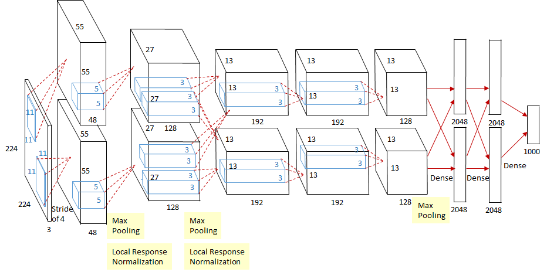
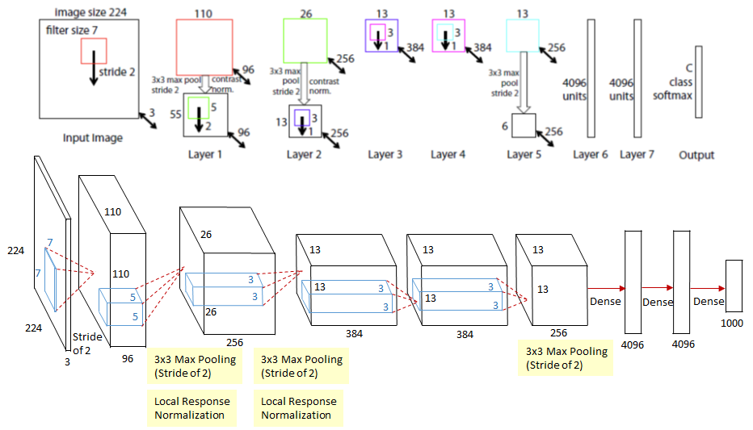
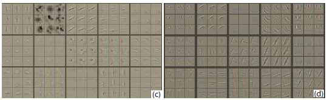

[TOC]

# Chapter 4 Classic Network
## 4.1 LeNet-5

### 4.1.1 Introduction to the model

LeNet-5 is a Convolutional Neural Network (CNN) $^{[1]}$ proposed by $LeCun$ for recognizing handwritten digits and machine-printed characters. The name is derived from the author $LeCun$ The name, 5 is the code name for its research, and LeNet-4 and LeNet-1 were little known before LeNet-5. LeNet-5 illustrates that the correlation between pixel features in an image can be extracted by a convolution operation shared by parameters, and a combination of convolution, downsampling (pooling), and nonlinear mapping is currently popular. The basis of most depth image recognition networks.

### 4.1.2 Model structure

Figure 4.1 LeNet-5 network structure

As shown in Figure 4.1, LeNet-5 consists of 7 layers (the input layer is not used as the network structure), which consists of 2 convolution layers, 2 downsampling layers and 3 connection layers. The parameter configuration of the network is shown in Table 4.1. The kernel size of the downsampling layer and the fully connected layer respectively represents the sampling range and the size of the connection matrix (eg, "5\times5\times1/1,6" in the convolution kernel size indicates that the kernel size is $5\times5 \times1$, convolution kernel with a step size of $1$ and a core number of 6.)

Table 4.1 LeNet-5 Network Parameter Configuration

| Network Layer | Input Size | Core Size | Output Size | Trainable Parameter Quantity |
| :-----------: | :--------: | :-------: | :---------: | :--------------------------: |
| Convolutional Layer $C_1$ | $32\times32\times1$ | $5\times5\times1/1,6$ | $28\times28\times6$ | $(5\times5\times1+1)\times6$ |
| Downsampling layer $S_2$ | $28\times28\times6$ | $2\times2/2$ | $14\times14\times6$ | $(1+1)\times6$ $^*$ |
| Convolutional Layer $C_3$ | $14\times14\times6$ | $5\times5\times6/1,16$ | $10\times10\times16$ | $1516^*$ |
| Downsampling layer $S_4$ | $10\times10\times16$ | $2\times2/2$ | $5\times5\times16$ | $(1+1)\times16$ |
| Convolutional Layer $C_5$$^*$ | $5\times5\times16$ | $5\times5\times16/1,120$ | $1\times1\times120$ | $(5\times5\times16+1)\times120$ |
| Full Connect Layer $F_6$ | $1\times1\times120$ | $120\times84$ | $1\times1\times84$ | $(120+1)\times84$ |
| Output Layer | $1\times1\times84$ | $84\times10$ | $1\times1\times10$ | $(84+1)\times10$ |

> $^*$ In LeNet, the downsampling operation is similar to the pooling operation, but after multiplying the sampled result by a coefficient and adding an offset term, the number of parameters sampled below is $(1+1) )\times6$ instead of zero.
>
> $^*$ $C_3$ Convolutional layer training parameters are not directly connected to all feature maps in $S_2$, but are connected using the sampling feature as shown in Figure 4.2 (sparse connection). The generated 16 channel feature maps are mapped according to the adjacent three feature maps, the adjacent four feature maps, the non-adjacent four feature maps, and all six feature maps. The calculated number of parameters is calculated as $6\ Times(25\times3+1)+6\times(25\times4+1)+3\times(25\times4+1)+1\times(25\times6+1)=1516$, explained in the original paper There are two reasons for using this sampling method: the number of connections is not too large (the computing power of the current year is weak); forcing the combination of different feature maps can make the mapped feature maps learn different feature patterns.

Figure 4.2 Sparse connection between feature maps between $S_2$ and $C_3$

> $^*$ $C_5$ The convolutional layer is shown in Figure 4.1 as a fully connected layer. The original paper explains that the convolution operation is actually used here, but the size is compressed to $1 just after the $5\times5$ convolution. Times1$, the output looks very similar to a full connection.

### 4.1.3 Model Features
- The convolutional network uses a three-layer sequence combination: convolution, downsampling (pooling), and non-linear mapping (the most important feature of LeNet-5, which forms the basis of the current deep convolutional network)
- Extract spatial features using convolution
- Downsampling using the mapped spatial mean
- Non-linear mapping using $tanh$ or $sigmoid$
- Multilayer Neural Network (MLP) as the final classifier
- Sparse connection matrix between layers to avoid huge computational overhead

## 4.2 AlexNet

### 4.2.1 Introduction to the model

AlexNet is the first deep convolutional neural network applied to image classification by $Alex$ $Krizhevsky $, which was 15.3% top-5 in the 2012 ILSVRC (ImageNet Large Scale Visual Recognition Competition) image classification competition. The test error rate won the first place $^{[2]}$. AlexNet uses GPU instead of CPU to make the model structure more complex in an acceptable time range. Its appearance proves the effectiveness of deep convolutional neural networks in complex models, making CNN popular in computer vision. Directly or indirectly triggered a wave of deep learning.

### 4.2.2 Model structure

Figure 4.3 AlexNet network structure

As shown in Figure 4.3, except for downsampling (pooling layer) and Local Responsible Normalization (LRN), AlexNet consists of 8 layers. The first 5 layers are composed of convolution layers, while the remaining 3 layers are all. Connection layer. The network structure is divided into upper and lower layers, corresponding to the operation process of the two GPUs, except for some layers in the middle ($C_3$ convolutional layer and $F_{6-8}$ full connection layer will have GPU interaction), other Layer two GPUs calculate the results separately. The output of the last layer of the fully connected layer is input as $softmax$, and the probability values ​​corresponding to 1000 image classification labels are obtained. Excluding the design of the GPU parallel structure, the AlexNet network structure is very similar to that of LeNet. The parameter configuration of the network is shown in Table 4.2.

Table 4.2 AlexNet Network Parameter Configuration

| Network Layer | Input Size | Core Size | Output Size | Trainable Parameter Quantity |
| :-----------: | :--------: | :-------: | :---------: | :--------------------------: |
| Convolutional Layer $C_1$ $^*$ | $224\times224\times3$ | $11\times11\times3/4,48(\times2_{GPU})$ | $55\times55\times48(\times2_{GPU})$ | $(11\times11\times3+1)\times48\times2$ |
| Downsampling layer $S_{max}$$^*$ | $55\times55\times48(\times2_{GPU})$ | $3\times3/2(\times2_{GPU})$ | $27\times27\times48(\ Times2_{GPU})$ | 0 |
| Convolutional Layer $C_2$ | $27\times27\times48(\times2_{GPU})$ | $5\times5\times48/1,128(\times2_{GPU})$ | $27\times27\times128(\times2_{GPU}) $ | $(5\times5\times48+1)\times128\times2$ |
| Downsampling layer $S_{max}$ | $27\times27\times128(\times2_{GPU})$ | $3\times3/2(\times2_{GPU})$ | $13\times13\times128(\times2_{GPU} )$ | 0 |
| Convolutional layer $C_3$ $^*$ | $13\times13\times128\times2_{GPU}$ | $3\times3\times256/1,192(\times2_{GPU})$ | $13\times13\times192(\times2_{GPU })$ | $(3\times3\times256+1)\times192\times2$ |
| Convolutional layer $C_4$ | $13\times13\times192(\times2_{GPU})$ | $3\times3\times192/1,192(\times2_{GPU})$ | $13\times13\times192(\times2_{GPU}) $ | $(3\times3\times192+1)\times192\times2$ |
| Convolutional layer $C_5$ | $13\times13\times192(\times2_{GPU})$ | $3\times3\times192/1,128(\times2_{GPU})$ | $13\times13\times128(\times2_{GPU}) $ | $(3\times3\times192+1)\timEs128\times2$ |
| Downsampling layer $S_{max}$ | $13\times13\times128(\times2_{GPU})$ | $3\times3/2(\times2_{GPU})$ | $6\times6\times128(\times2_{GPU} )$ | 0 |
| Fully connected layer $F_6$ $^*$ | $6\times6\times128\times2_{GPU}$ | $9216\times2048(\times2_{GPU})$ | $1\times1\times2048(\times2_{GPU})$ | $(9216+1)\times2048\times2$ |
| Fully connected layer $F_7$ | $1\times1\times2048\times2_{GPU}$ | $4096\times2048(\times2_{GPU})$ | $1\times1\times2048(\times2_{GPU})$ | $(4096+ 1)\times2048\times2$ |
| Full Connect Layer $F_8$ | $1\times1\times2048\times2_{GPU}$ | $4096\times1000$ | $1\times1\times1000$ | $(4096+1)\times1000\times2$ |

>Convolution layer $C_1$ input image data of $224\times224\times3$, respectively, after convolution convolution of $11\times11\times3$ and stride of 4 in two GPUs. Get two separate output data for $55\times55\times48$.
>
The downsampling layer $S_{max}$ is actually the largest pooling operation nested in the convolution, but is separately listed to distinguish the convolutional layers that do not have the largest pooling. After the pooling operation in the $C_{1-2}$ convolutional layer (before the ReLU activation operation), there is also an LRN operation for normalization of adjacent feature points.
>
The input of the convolutional layer $C_3$ is different from other convolutional layers. $13\times13\times192\times2_{GPU}$ means that the output of the upper layer network on the two GPUs is collected as input, so the convolution is performed. The convolution kernel dimension on the channel during operation is 384.
>
The input data size of the fully connected layer $F_{6-8}$ is similar to $C_3$, which is an input that combines the output of two GPU flows.

### 4.2.3 Model Features
- All convolutional layers use ReLU as a nonlinear mapping function to make the model converge faster
- Training of models on multiple GPUs not only improves the training speed of the model, but also increases the scale of data usage.
- Normalize the local features using LRN, and as a result the input to the ReLU activation function can effectively reduce the error rate
- Overlapping max pooling, ie the pooling range z has a relationship with the step size s $z>s$ (eg $S\{max}$ in the kernel scale is $3\times3/2$), avoiding average pooling Average effect of (average pooling)
- Use random dropout to selectively ignore individual neurons in training to avoid overfitting of the model

## 4.3 ZFNet
### 4.3.1 Introduction to the model

ZFNet is a large convolutional network based on AlexNet from $Matthew$ $D. Zeiler$ and $Rob$ $Fergus$. In the 2013 ILSVRC image classification competition, it won the championship with an error rate of 11.19% (actually the original ZFNet The team is not a real champion. The original ZFNet ranked 8th with a 13.51% error rate. The real champion is the $Clarifai$ team, and the CEO of a startup company corresponding to $Clarifai$ is $Zeiler$. And $Clarifai$ has a relatively small change to ZFNet, so it is generally considered that ZFNet won the championship) $^{[3-4]}$. ZFNet is actually fine-tuning AlexNet, and visualizes the output features of each layer by means of deconvolution, further explaining why convolution operations are significant in large networks.

### 4.3.2 Model structure

Figure 4.4 ZFNet network structure diagram (original structure diagram and AlexNet style structure diagram)

As shown in Figure 4.4, ZFNet is similar to AlexNet. It is a convolutional neural network consisting of 8 layers of networks, including 5 layers of convolutional layers and 3 layers of fully connected layers. The biggest difference between the two network architectures is that the ZFNet first-layer convolution replaces the convolution of the first-order convolution kernel $11\times11\times3/4$ in AlexNet with a convolution kernel of $7\times7\times3/2$. nuclear. In Figure 4.5, ZFNet contains more intermediate frequency information in the feature map of the first layer output than AlexNet, while the characteristic map of the first layer output of AlexNet is mostly low frequency or high frequency information, and the lack of intermediate frequency features leads to The characteristics of the subsequent network level as shown in Figure 4.5(c) are not detailed enough, and the root cause of this problem is that the convolution kernel and step size adopted by AlexNet in the first layer are too large.

Figure 4.5 (a) Characteristic map of the first layer output of ZFNet (b) Characteristic map of the first layer output of AlexNet (c) Characteristic map of the output of the second layer of AlexNet (d) Characteristic map of the output of the second layer of ZFNet

Table 4.3 ZFNet Network Parameter Configuration
| Network Layer | Input Size | Core Size | Output Size | Trainable Parameter Quantity |
| :-----------: | :--------: | :-------: | :---------: | :--------------------------: |
| Convolutional Layer $C_1$ $^*$ | $224\times224\times3$ | $7\times7\times3/2,96$ | $110\times110\times96$ | $(7\times7\times3+1)\times96$ |
| Downsampling layer $S_{max}$ | $110\times110\times96$ | $3\times3/2$ | $55\times55\times96$ | 0 |
| Convolutional Layer $C_2$ $^*$ | $55\times55\times96$ | $5\times5\times96/2,256$ | $26\times26\times256$ | $(5\times5\times96+1)\times256$ |
| Downsampling layer $S_{max}$ | $26\times26\times256$ | $3\times3/2$ | $13\times13\times256$ | 0 |
| Convolutional Layer $C_3$ | $13\times13\times256$ | $3\times3\times256/1,384$ | $13\times13\times384$ | $(3\times3\times256+1)\times384$ |
| Convolutional layer $C_4$ | $13\times13\times384$ | $3\times3\times384/1,384$ | $13\times13\times384$ | $(3\times3\times384+1)\times384$ |
| Convolutional layer $C_5$ | $13\times13\times384$ | $3\times3\times384/1,256$ | $13\times13\times256$ | $(3\times3\times384+1)\times256$ |
| Downsampling layer $S_{max}$ | $13\times13\times256$ | $3\times3/2$ | $6\times6\times256$ | 0 |
| Full Connect Layer $F_6$ | $6\times6\times256$ | $9216\times4096$ | $1\times1\times4096$ | $(9216+1)\times4096$ |
| Full Connect Layer $F_7$ | $1\times1\times4096$ | $4096\times4096$ | $1\times1\times4096$ | $(4096+1)\times4096$ |
| Full Connect Layer $F_8$ | $1\times1\times4096$ | $4096\times1000$ | $1\times1\times1000$ | $(4096+1)\times1000$ |
> Convolutional layer $C_1$ is different from $C_1$ in AlexNet, using $7\times7\times3/2$ convolution kernel instead of $11\times11\times3/4 $ to make the first layer convolution output The result can include more medium frequency features, providing more choices for a diverse set of features in subsequent network layers, facilitating the capture of more detailed features.
>
> The convolutional layer $C_2$ uses a convolution kernel of step size 2, which is different from the convolution kernel step size of $C_2$ in AlexNet, so the output dimensions are different.

### 4.3.3 Model Features

ZFNet and AlexNet are almost identical in structure. Although this part belongs to the model characteristics, it should be accurately the contribution of visualization technology in the original ZFNet paper.

- Visualization techniques reveal individual feature maps for each layer in the excitation model.
- Visualization techniques allow observation of the evolution of features during the training phase and the diagnosis of potential problems with the model.
- Visualization technology uses a multi-layer deconvolution network that returns to the input pixel space by feature activation.
- Visualization techniques perform sensitivity analysis of the classifier output by revealing that part of the input image reveals which part is important for classification.
- The visualization technique provides a non-parametric invariance to show which piece of the training set activates which feature map, not only the cropped input image, but also a top-down projection to expose a feature map from each block.
- Visualization techniques rely on deconvolution operations, the inverse of convolution operations, to map features onto pixels.

## 4.4 Network in Network

### 4.4.1 Introduction to the model
NetwThe ork In Network (NIN) was proposed by $Min Lin$ et al. to achieve the best level at the time of the CIFAR-10 and CIFAR-100 classification tasks, as its network structure was made up of three multi-layered perceptron stacks. NIN$^{[5]}$. NIN examines the convolution kernel design in convolutional neural networks from a new perspective, and replaces the linear mapping part in pure convolution by introducing subnetwork structures. This form of network structure stimulates more complex convolutional neural networks. The structural design of GoogLeNet's Inception structure introduced in the next section is derived from this idea.

### 4.4.2 Model Structure

Figure 4.6 NIN network structure

NIN consists of three layers of multi-layer perceptual convolutional layer (MLPConv Layer). Each layer of multi-layer perceptual convolutional layer is composed of several layers of local fully connected layers and nonlinear activation functions instead of traditional convolutional layers. Linear convolution kernel used. In network inference, the multi-layer perceptron calculates the local features of the input feature map, and the weights of the products corresponding to the local feature maps of each window are shared. The convolution operation is completely consistent, the biggest difference is that the multilayer perceptron performs a nonlinear mapping of local features, while the traditional convolution method is linear. NIN's network parameter configuration table 4.4 is shown (the original paper does not give the network parameters, the parameters in the table are the compiler combined network structure diagram and CIFAR-100 data set with $3\times3$ convolution as an example).

Table 4.4 NIN network parameter configuration (combined with the original paper NIN structure and CIFAR-100 data)

| Network Layer | Input Size | Core Size | Output Size | Number of Parameters |
|:------:|:-------:|:------:|:--------:|:-------:|
| Local Fully Connected Layer $L_{11}$ $^*$ | $32\times32\times3$ | $(3\times3)\times16/1$ | $30\times30\times16$ | $(3\times3\times3+ 1)\times16$ |
| Fully connected layer $L_{12}$ $^*$ | $30\times30\times16$ | $16\times16$ | $30\times30\times16$ | $((16+1)\times16)$ |
| Local Full Connection Layer $L_{21}$ | $30\times30\times16$ | $(3\times3)\times64/1$ | $28\times28\times64$ | $(3\times3\times16+1)\times64 $ |
| Fully connected layer $L_{22}$ | $28\times28\times64$ | $64\times64$ | $28\times28\times64$ | $((64+1)\times64)$ |
| Local Full Connection Layer $L_{31}$ | $28\times28\times64$ | $(3\times3)\times100/1$ | $26\times26\times100$ | $(3\times3\times64+1)\times100 $ |
| Fully connected layer $L_{32}$ | $26\times26\times100$ | $100\times100$ | $26\times26\times100$ | $((100+1)\times100)$ |
| Global Average Sampling $GAP$ $^*$ | $26\times26\times100$ | $26\times26\times100/1$ | $1\times1\times100$ | $0$ |
> The local fully connected layer $L_{11}$ is actually a windowed full join operation on the original input image, so the windowed output feature size is $30\times30$($\frac{32-3_k+1 }{1_{stride}}=30$)
> The fully connected layer $L_{12}$ is a fully connected operation immediately following $L_{11}$. The input feature is the activated local response feature after windowing, so only need to connect $L_{11}$ and The node of $L_{12}$ is sufficient, and each partial fully connected layer and the immediately connected fully connected layer constitute a multilayer perceptual convolutional layer (MLPConv) instead of a convolution operation.
> The global average sampling layer or the global average pooling layer $GAP$(Global Average Pooling) performs a global average pooling operation on each feature map output by $L_{32}$, directly obtaining the final number of categories, which can effectively Reduce the amount of parameters.

### 4.4.3 Model Features

- The use of a multi-layer perceptron structure instead of convolution filtering operation not only effectively reduces the problem of excessive parameterization caused by excessive convolution kernels, but also improves the abstraction ability of the model by introducing nonlinear mapping.
- Using global average pooling instead of the last fully connected layer, can effectively reduce the amount of parameters (no trainable parameters), while pooling uses the information of the entire feature map, which is more robust to the transformation of spatial information, and finally obtained The output can be directly used as a confidence level for the corresponding category.

## 4.5 VGGNet

### 4.5.1 Introduction to the model

VGGNet is a deep convolutional network structure proposed by the Visual Geometry Group (VGG) of Oxford University. They won the runner-up of the 2014 ILSVRC classification task with a 7.32% error rate (the champion was 6.65% by GoogLeNet). The error rate was won) and the error rate of 25.32% won the first place in the Localization (GoogLeNet error rate was 26.44%) $^{[5]}$, and the network name VGGNet was taken from the group name abbreviation. VGGNet was the first to reduce the error rate of image classification to less than 10%, and the idea of ​​the $3\times3$ convolution kernel used in the network was the basis of many later models published at the 2015 International Conference on Learning Representation ( International Conference On Learning Representations (ICLR) has been cited more than 14,000 times since.

### 4.5.2 Model structure

Figure 4.7 VGG16 network structure

In the original paper, VGGNet contains six versions of evolution, corresponding to VGG11, VGG11-LRN, VGG13, VGG16-1, VGG16-3 and VGG19, respectively. Different suffix values ​​indicate different network layers (VGG11-LRN is represented in In the first layer, VGG11 of LRN is used. VGG16-1 indicates that the convolution kernel size of the last three convolutional blocks is $1\times1$, and the corresponding VGG16-3 indicates that the convolution kernel size is $3\. Times3$), the VGG16 introduced in this section is VGG16-3. The VGG16 in Figure 4.7 embodies the core idea of ​​VGGNet, using the convolution combination of $3\times3$ instead of the large convolution (2 $3\times3 convolutions can have the same perception field as the $$5\times5$ convolution ), network parameter settings are shown in Table 4.5.

Table 4.5 VGG16 network parameter configuration

| Network Layer | Input Size | Core Size | Output Size | Number of Parameters |
| :-----------: | :--------: | :-------: | :---------: | :------------------: |
| Convolutional Layer $C_{11}$ | $224\times224\times3$ | $3\times3\times64/1$ | $224\times224\times64$ | $(3\times3\times3+1)\times64$ |
| Convolutional Layer $C_{12}$ | $224\times224\times64$ | $3\times3\times64/1$ | $224\times224\times64$ | $(3\times3\times64+1)\times64$ |
| Downsampling layer $S_{max1}$ | $224\times224\times64$ | $2\times2/2$ | $112\times112\times64$ | $0$ |
| Convolutional layer $C_{21}$ | $112\times112\times64$ | $3\times3\times128/1$ | $112\times112\times128$ | $(3\times3\times64+1)\times128$ |
| Convolutional Layer $C_{22}$ | $112\times112\times128$ | $3\times3\times128/1$ | $112\times112\times128$ | $(3\times3\times128+1)\times128$ |
| Downsampling layer $S_{max2}$ | $112\times112\times128$ | $2\times2/2$ | $56\times56\times128$ | $0$ |
| Convolutional layer $C_{31}$ | $56\times56\times128$ | $3\times3\times256/1$ | $56\times56\times256$ | $(3\times3\times128+1)\times256$ |
| Convolutional layer $C_{32}$ | $56\times56\times256$ | $3\times3\times256/1$ | $56\times56\times256$ | $(3\times3\times256+1)\times256$ |
| Convolutional layer $C_{33}$ | $56\times56\times256$ | $26\times26\times256/1$ | $56\times56\times256$ | $(3\times3\times256+1)\times256$ |
| Downsampling layer $S_{max3}$ | $56\times56\times256$ | $2\times2/2$ | $28\times28\times256$ | $0$ |
| Convolutional Layer $C_{41}$ | $28\times28\times256$ | $3\times3\times512/1$ | $28\times28\times512$ | $(3\times3\times256+1)\times512$ |
| Convolutional Layer $C_{42}$ | $28\times28\times512$ | $3\times3\times512/1$ | $28\times28\times512$ | $(3\times3\times512+1)\times512$ |
| Convolutional Layer $C_{43}$ | $28\times28\times512$ | $3\times3\times512/1$ | $28\times28\times512$ | $(3\times3\times512+1)\times512$ |
| Downsampling layer $S_{max4}$ | $28\times28\times512$ | $2\times2/2$ | $14\times14\times512$ | $0$ |
| Convolutional Layer $C_{51}$ | $14\times14\times512$ | $3\times3\times512/1$ | $14\times14\times512$ | $(3\times3\times512+1)\times512$ |
| Convolutional Layer $C_{52}$ | $14\times14\times512$ | $3\times3\times512/1$ | $14\times14\times512$ | $(3\times3\times512+1)\times512$ || Convolutional Layer $C_{53}$ | $14\times14\times512$ | $3\times3\times512/1$ | $14\times14\times512$ | $(3\times3\times512+1)\times512$ |
| Downsampling layer $S_{max5}$ | $14\times14\times512$ | $2\times2/2$ | $7\times7\times512$ | $0$ |
| Fully connected layer $FC_{1}$ | $7\times7\times512$ | $(7\times7\times512)\times4096$ | $1\times4096$ | $(7\times7\times512+1)\times4096$ |
| Fully connected layer $FC_{2}$ | $1\times4096$ | $4096\times4096$ | $1\times4096$ | $(4096+1)\times4096$ |
| Fully connected layer $FC_{3}$ | $1\times4096$ | $4096\times1000$ | $1\times1000$ | $(4096+1)\times1000$ |

### 4.5.3 Model Features

- The entire network uses the same size convolution kernel size $3\times3$ and the maximum pooled size $2\times2$.
- The meaning of $1\times1$convolution is mainly linear transformation, while the number of input channels and the number of output channels are unchanged, and no dimensionality reduction occurs.
- Two convolutional layers of $3\times3$ are concatenated as a convolutional layer of $5\times5$ with a receptive field size of $5\times5$. Similarly, the concatenation of three $3\times3$ convolutions is equivalent to a convolutional layer of $7\times7$. This type of connection makes the network parameters smaller, and the multi-layer activation function makes the network more capable of learning features.
- VGGNet has a trick in training. It first trains the shallow simple network VGG11, and then reuses the weight of VGG11 to initialize VGG13. This training and initialization VGG19 can make the convergence faster during training.
- Use multi-scale transformations in the training process to enhance the data of the original data, making the model difficult to overfit.

## 4.6 GoogLeNet
### 4.6.1 Introduction to the model

As the winner of the ILSVRC classification task in 2014, GoogLeNet pressured VGGNet and other models with an error rate of 6.65%. Compared with the previous two championships ZFNet and AlexNet, the accuracy of the classification is greatly improved. From the name **GoogLe**Net, you can know that this is a network structure designed by Google engineers, and the name Goog**LeNet** is a tribute to LeNet$^{[0]}$. The core part of GoogLeNet is its internal subnet structure, Inception, which is inspired by NIN and has undergone four iterations (Inception$_{v1-4}$).

Figure 4.8 Inception performance comparison chart

### 4.6.2 Model Structure

Figure 4.9 GoogLeNet network structure
As shown in Figure 4.9, GoogLeNet extends the width of the network in addition to the depth of the previous convolutional neural network structure. The entire network is composed of a number of block subnetworks. This subnet constitutes the Inception structure. Figure 4.9 shows four versions of Inception: $Inception_{v1}$ uses different convolution kernels in the same layer and merges the convolution results; $Inception_{v2}$ combines the stacking of different convolution kernels, and The convolution results are merged; $Inception_{v3}$ is a deep combination attempt on the basis of $v_2$; the $Inception_{v4} $ structure is more complex than the previous version, nested in the subnet The internet.

Figure 4.10 Inception$_{v1-4}$ structure diagram

Table 4.6 Inception$_{v1}$ Network Parameter Configuration in GoogLeNet

| Network Layer | Input Size | Core Size | Output Size | Number of Parameters |
| :-----------: | :--------: | :-------: | :---------: | :------------------: |
| Convolutional layer $C_{11}$ | $H\times{W}\times{C_1}$ | $1\times1\times{C_2}/2$ | $\frac{H}{2}\times\frac {W}{2}\times{C_2}$ | $(1\times1\times{C_1}+1)\times{C_2}$ |
| Convolutional layer $C_{21}$ | $H\times{W}\times{C_2}$ | $1\times1\times{C_2}/2$ | $\frac{H}{2}\times\frac {W}{2}\times{C_2}$ | $(1\times1\times{C_2}+1)\times{C_2}$ |
| Convolutional Layer $C_{22}$ | $H\times{W}\times{C_2}$ | $3\times3\times{C_2}/1$ | $H\times{W}\times{C_2}/ 1$ | $(3\times3\times{C_2}+1)\times{C_2}$ |
| Convolutional layer $C_{31}$ | $H\times{W}\times{C_1}$ | $1\times1\times{C_2}/2$ | $\frac{H}{2}\times\frac {W}{2}\times{C_2}$ | $(1\times1\times{C_1}+1)\times{C_2}$ |
| Convolutional Layer $C_{32}$ | $H\times{W}\times{C_2}$ | $5\times5\times{C_2}/1$ | $H\times{W}\times{C_2}/ 1$ | $(5\times5\times{C_2}+1)\times{C_2}$ |
| Downsampling layer $S_{41}$ | $H\times{W}\times{C_1}$ | $3\times3/2$ | $\frac{H}{2}\times\frac{W}{2 }\times{C_2}$ | $0$ |
| Convolutional Layer $C_{42}$ | $\frac{H}{2}\times\frac{W}{2}\times{C_2}$ | $1\times1\times{C_2}/1$ | $ \frac{H}{2}\times\frac{W}{2}\times{C_2}$ | $(3\times3\times{C_2}+1)\times{C_2}$ |
| Merge layer $M$ | $\frac{H}{2}\times\frac{W}{2}\times{C_2}(\times4)$ | Stitching | $\frac{H}{2}\times \frac{W}{2}\times({C_2}\times4)$ | $0$ |

### 4.6.3 Model Features

- The use of convolution kernels of different sizes means different sizes of receptive fields, and the final splicing means the fusion of different scale features;
- The reason why the convolution kernel size is 1, 3 and 5 is mainly for the convenience of alignment. After setting the convolution step stride=1, as long as pad=0, 1, 2 are set respectively, the features of the same dimension can be obtained after convolution, and then these features can be directly stitched together;
- The more the network goes to the end, the more abstract the features are, and the more susceptible fields are involved in each feature. As the number of layers increases, the proportion of 3x3 and 5x5 convolutions also increases. However, using a 5x5 convolution kernel still has a huge amount of computation. To this end, the article draws on NIN2 and uses a 1x1 convolution kernel for dimensionality reduction.

## 4.7 Why are the current CNN models adjusted on GoogleNet, VGGNet or AlexNet?

- Evaluation comparison: In order to make your results more convincing, when you publish your own results, you will compare them with a standard baseline and improve on the baseline. Common problems such as detection and segmentation will be based on VGG or Resnet101. Basic network.
- Limited time and effort: In research pressure and work stress, time and energy only allow you to explore in a limited range.
- Model innovation is difficult: Improving the basic model requires a lot of experimentation and experimentation, and requires a lot of experiment accumulation and strong inspiration. It is very likely that the input-output ratio is relatively small.
- Resource limitations: Creating a new model requires a lot of time and computing resources, often not feasible in schools and small business teams.
- In actual application scenarios, there are actually a large number of non-standard model configurations.

## Related Literature

[1] Y. LeCun, L. Bottou, Y. Bengio, and P. Haffner. Gradient-based learning applied to document recognition. *Proceedings of the IEEE*, november 1998.

[2] A. Krizhevsky, I. Sutskever and G. E. Hinton. ImageNet Classification with Deep Convolutional Neural Networks. *Advances in Neural Information Processing Systems 25*. Curran Associates, Inc. 1097–1105.

[3] LSVRC-2013. http://www.image-net.org/challenges/LSVRC/2013/results.php

[4] M. D. Zeiler and R. Fergus. Visualizing and Understanding Convolutional Networks. *European Conference on Computer Vision*.

[5] M. Lin, Q. Chen, and S. Yan. Network in network. *Computing Research Repository*, abs/1312.4400, 2013.

[6] K. Simonyan and A. Zisserman. Very Deep Convolutional Networks for Large-Scale Image Recognition. *International Conference on Machine Learning*, 2015.

[7] Bharath Raj. [a-simple-guide-to-the-versions-of-the-inception-network] (https://towardsdatascience.com/a-simple-guide-to-the-versions-of- The-inception-network-7fc52b863202), 2018.

[8] Christian Szegedy, Sergey Ioffe, Vincent Vanhoucke, Alex Alemi. [Inception-v4, Inception-ResNet and
the Impact of Residual Connections on Learning](https://arxiv.org/pdf/1602.07261.pdf), 2016.

[9] Sik-Ho Tsang. [review-inception-v4-evolved-from-googlenet-merged-with-resnet-idea-image-classification](https://towardsdatascience.com/review-inception-v4-evolved-from-googlenet-merged-with-resnet-idea-image-classification-5e8c339d18bc), 2018.

[10] Zbigniew Wojna, Christian Szegedy, Vincent Vanhoucke, Sergey Ioffe, Jonathon Shlens. [Rethinking the Inception Architecture for Computer Vision](https://arxiv.org/pdf/1512.00567v3.pdf), 2015.

[11] Christian Szegedy, Wei Liu, Yangqing Jia, Pierre Sermanet, Scott Reed, Dragomir Anguelov, Dumitru Erhan, Vincent Vanhoucke, Andrew Rabinovich. [Going deeper with convolutions](https://arxiv.org/pdf/1409.4842v1.pdf), 2014.
