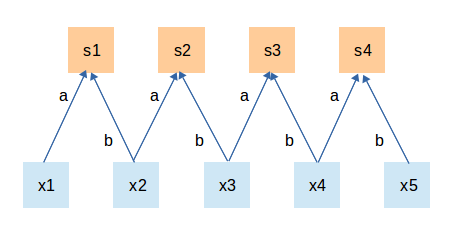

[TOC]

# Chapter 5 Convolutional Neural Network (CNN) (Contributor: PrudhviVajja-Indiana University)

 Convolutional neural network is a computing network structure used to deal with local and global correlations. It is used in image recognition, natural language processing and even speech recognition, because image data has a significant local and global relationship. The application in the field of recognition has achieved great success.

## 5.1 Convolutional neural network components

 Take the image classification task as an example. In the convolutional neural network shown in Table 5.1, there are generally five types of network hierarchy:

 Table 5.1 Composition of Convolutional Neural Network

| CNN hierarchy | Output size | Function |
| :---------: | :-------------------------------: | :-- -------------------------------------------------- ------- |
| Input layer | $W_1\times H_1\times 3$ | The original input of the convolutional network, which can be the original or preprocessed pixel matrix |
| Convolutional layer | $W_1\times H_1\times K$ | Parameter sharing, local connection, using translation invariance to extract local features from the global feature map |
| Activation layer | $W_1\times H_1\times K$ | Non-linear mapping of the output result of the convolutional layer |
| Pooling layer | $W_2\times H_2\times K$ | Further filtering features can effectively reduce the amount of parameters required for subsequent network levels |
| Fully connected layer | $(W_2 \cdot H_2 \cdot K)\times C$ | Flatten the multi-dimensional features into 2-dimensional features, usually low-dimensional features correspond to the learning goals (categories or regression values) of the task |

> $W_1\times H_1\times 3$ corresponds to the original image or preprocessed pixel value matrix, 3 corresponds to the channel of the RGB image; $K$ represents the number of convolution kernels (filters) in the convolution layer; $W_2 \times H_2$ is the scale of the feature map after pooling. In the global pooling, the scale corresponds to $1\times 1$; $(W_2 \cdot H_2 \cdot K)$ is the size after compressing multi-dimensional features to one dimension, $ C$ corresponds to the number of image categories.

### 5.1.1 Input layer

 The Input Layer is usually the raw data or pre-processed data of the input convolutional neural network. It can be the original three-dimensional colorful image in the field of image recognition, or the two-dimensional waveform that has been Fourier transformed in the field of audio recognition Data, even a one-dimensional sentence vector in natural language processing. Taking the image classification task as an example, the image input by the input layer generally contains three channels of RGB, which is a 3-dimensional pixel value matrix $H\times W \times 3$ composed of length and width respectively $H$ and $W$, The convolutional network will pass the data of the input layer to a series of operations such as convolution and pooling for feature extraction and transformation, and finally the fully connected layer will summarize the features and output the results. According to the difference of computing power, storage size and model structure, the number of images that can be batch processed by convolutional neural network each time is not the same. If the number of images received by the specified input layer is $N$, the output data of the input layer It is $N\times H\times W\times 3$.

### 5.1.2 Convolutional layer

 Convolution layer (Convolution Layer) is usually used for feature extraction of the input data of the input layer, and an abstraction of the implicit correlation in the original data through the convolution kernel matrix. In principle, the convolution operation is actually a mathematical operation of point multiplication and summation of two pixel matrices, one of which is the input data matrix, and the other is the convolution kernel (filter or feature matrix), and the result is obtained Expressed as a specific local feature extracted from the original image. Figure 5.1 shows the different filling strategies in the convolution operation. The upper half uses zero padding, and the lower half uses effective convolution (discard the edge parts that cannot be completely calculated).
​ 
​ Figure 5.1 Schematic diagram of convolution operation

### 5.1.3 Activation layer

 The Activation Layer is responsible for activating the features extracted by the convolutional layer. Since the convolution operation is a linear change relationship between the input matrix and the convolution kernel matrix, the activation layer is required to perform nonlinear mapping on it. The activation layer is mainly composed of an activation function, that is, a nonlinear function is nested on the basis of the output result of the convolutional layer, so that the output feature map has a nonlinear relationship. In convolutional networks, ReLU is usually used as the activation function (including tanh and sigmoid, etc.). The functional form of ReLU is shown in formula (5-1), which can limit the value less than 0 to 0, while the value greater than or equal to 0 remains unchanged. change.
$$
f(x)=\begin{cases}
0 &\text{if} x<0 \\
x &\text{if} x\ge 0
\end{cases}
\tag{5-1}
$$

### 5.1.4 Pooling layer
 The pooling layer is also called the downsampling layer. Its function is to filter the features in the receptive field and extract the most representative features in the area, which can effectively reduce the output feature scale, thereby reducing the parameters required by the model the amount. According to the type of operation, it is usually divided into Max Pooling, Average Pooling and Sum Pooling. They extract the maximum, average and sum feature values ​​in the receptive domain as output, the most commonly used Is the maximum pooling.

### 5.1.5 Fully connected layer
 The Full Connected Layer is responsible for summarizing the features extracted by the convolutional neural network, and mapping the multi-dimensional feature input to the two-dimensional feature output. The high-dimensional represents the sample batch, and the low-level often corresponds to the task goal.

## 5.2 What is the intuitive role of convolution in images

 In convolutional neural networks, convolution is often used to extract image features, but the types of features extracted by different levels of convolution operations are different. The rough classification of feature types is shown in Table 5.2.
​ Table 5.2 Feature types extracted by convolution

| Convolution level | Feature type |
| :------: | :------: |
| Shallow Convolution | Edge Features |
| Middle Convolution | Local Features |
| Deep Convolution | Global Features |

The convolution of the image with different convolution kernels can be used to perform operations such as edge detection, sharpening and blurring. Table 5.3 shows various convolution images after applying different types of convolution kernels (filters).
​ Table 5.3 The role of some common convolution kernels

| Convolution | Convolution Kernel | Image after Convolution |
| :----------------------: | :----------------------- -----------------------------------: | :------------ -----------------------------------: |
| Output original image | $\begin{bmatrix} 0 & 0 & 0 \\ 0 & 1 & 0 \\ 0 & 0 & 0 \end{bmatrix}$ |  |
| Edge detection (highlighting edge differences) | $\begin{bmatrix} 1 & 0 & -1 \\ 0 & 0 & 0 \\ -1 & 0 & 1 \end{bmatrix}$ |  |
| Edge detection (highlighting the middle value) | $\begin{bmatrix} -1 & -1 & -1 \\ -1 & 8 & -1 \\ -1 & -1 & -1 \end{bmatrix}$ | |
| Image sharpening | $\begin{bmatrix} 0 & -1 & 0 \\ -1 & 5 & -1 \\ 0 & -1 & 0 \end{bmatrix}$ |  |
| Box blur | $\begin{bmatrix} 1 & 1 & 1 \\ 1 & 1 & 1 \\ 1 & 1 & 1 \end{bmatrix} \times \frac{1}{9}$ |  |
| Gaussian Blur | $\begin{bmatrix} 1 & 2 & 1 \\ 2 & 4 & 2 \\ 1 & 2 & 1 \end{bmatrix} \times \frac{1}{16}$ |  |

## 5.3 What are the basic parameters of the convolutional layer?

 The convolution layer needs to use the convolution kernel (filter or feature detector) and the image feature matrix to perform dot multiplication. When using the convolution kernel and the corresponding feature receptive field to perform windowing operations, you need to set the convolution The corresponding size, step length, number and filling method of the core are shown in Table 5.4.

 Table 5.4 Basic parameters of the convolutional layer

| Parameter name | Function | Common settings |
| :-----------------------: | :---------------------- ------------------------------------- | :----------- ------------------------------------------------ |
| Kernel Size | The size of the convolution kernel defines the receptive field of the convolution To achieve a larger perception domain |In the past, it was permanently set to 5, such as LeNet-5; now it is mostly set to 3. By stacking the convolution kernel of $3\times3$ to achieve a larger receptive field|
| Convolution Kernel Stride | Defines the step length of the convolution kernel in the convolution process | Commonly set to 1, which means that the sliding window distance is 1, which can cover the combination of all adjacent position features; when set to more Large values ​​are equivalent to downsampling the feature combination |
| Padding | A certain padding strategy is required when the size of the convolution kernel cannot perfectly match the input image matrix | Set to'SAME' to indicate some padding (usually zero padding) at the boundary position that is not enough ) In order to ensure that the convolution output dimension is consistent with the input dimension; when set to'VALID', the part that is less than the convolution size is discarded, and the output dimension cannot be guaranteed to be consistent with the input dimension |
| Number of Input Channels (In Channels) | Specify the depth of the convolution kernel during convolution operation | The default is the same as the number of channels (depth) of the input feature matrix; in some compression models, channel separation convolution methods are used |
| Number of output channels (Out Channels) | Specify the number of convolution kernels | If set to the same size as the number of input channels, the consistency of the input and output dimensions can be maintained; if a value smaller than the number of input channels is used, then Can reduce the number of parameters of the overall network |

> Convolution operation dimension transformation formula:
>
> $O_d =\begin{cases} \lceil \frac{(I_d-k_{size})+ 1)}{s}\rceil ,& \text{padding=VALID}\\ \lceil \frac{I_d}{ s}\rceil,&\text{padding=SAME} \end{cases}$
>
> Among them, $I_d$ is the input dimension, $O_d$ is the output dimension, $k_{size}$ is the size of the convolution kernel, and $s$ is the step size

## 5.4 What types of convolution kernels are there?

 Common convolution is mainly composed of continuous and tight convolution kernels to perform sliding window type point multiplication and summation operations on the input image features. In addition, there are other types of convolution kernels that will be used in different tasks. The classification is shown in Table 5.5.
​ Table 5.5 Convolution kernel classification

| Convolution category | Diagram | Function |
| :----------------------------: | :----------------- ----------: | :------------------------------------- ---------------------- |
| Standard convolution |  | The most commonly used convolution kernel, continuous and compact matrix form can extract the relationship between adjacent pixels in the image area, $3\times3$ The convolution kernel can get the perception field of view in the pixel range of $3\times3$ |
| Dilation convolution (convolution with holes or convolution with holes) |  | Introduce a parameter called Dilation Rate, so that the convolution kernel of the same size can To obtain a larger view of perception, correspondingly, fewer parameters are used than ordinary convolution under the premise of the same view of perception. The same is the size of the convolution kernel of $3\times3$. Expanded convolution can extract regional features in the range of $5\times5$, which is widely used in the field of real-time image segmentation |
| Transposed convolution |  | First fill the original feature matrix to expand its dimension to fit the convolution target output dimension, and then perform a process of ordinary convolution operation , The dimensional transformation relationship of its input to output is just the opposite of the transformation relationship of ordinary convolution, but this transformation is not a real inverse transformation operation, usually called transpose convolution instead of deconvolution. Transposed convolution is commonly used in the detection of small targets in the field of target detection and in the field of image segmentation to restore the input image scale. |
| Separable convolution |  | The standard convolution operation is the convolution operation in the three directions of the original image $H\times W\times C$ at the same time, assuming there is $ K$ convolution kernels of the same size, the parameters needed for such a convolution operation are $H\times W\times C\times K$; if the length, width and depth direction convolution operations are separated into $H\times W$ and $C$ two-step convolution operation, the same number of convolution kernels $K$, only $(H\times W + C)\times K$ parameters, you can get The same output scale. Seperable Convolution (Seperable Convolution) is usually used in model compression or some lightweight convolutional neural networks, such as MobileNet$^{[1]}$, Xception$^{[2]}$, etc. |

## 5.5 What is the difference between 2D convolution and 3D convolution?

-**Two-dimensional convolution**
The two-dimensional convolution operation is shown in Figure 5.3. For a more intuitive explanation, the convolution operation on a single channel output is shown in a single channel and a multi-channel input. In the case of single-channel input, if the size of the input convolution kernel is $(k_h, k_w, 1)$, the convolution kernel performs a sliding window operation on the spatial dimension of the input image, and each sliding window sums $(k_h, k_w)$The value in the window is convolved to obtain a value in the output image. In the case of multi-channel input, assuming that the number of feature channels of the input image is 3, the size of the convolution kernel is $(k_h, k_w, 3)$, each sliding window and $(k_h, k_w) on 3 channels All values ​​in the $window are convolved to obtain a value in the output image.

-**3D Convolution**
As shown in the figure, the 3D convolution operation is also divided into single-channel and multi-channel, and it is assumed that only one convolution kernel is used, that is, the output image has only one channel. For single-channel input, the difference from 2D convolution is that the input image has an additional depth dimension, and the convolution kernel also has an additional $k_d$ dimension, so the size of the 3D convolution kernel is $(k_h, k_w, k_d)$, each sliding window and the value in the window $(k_h, k_w, k_d)$ are related operations to get a value in the output 3D image. For multi-channel input, the operation is the same as the 2D convolution. Each sliding window is related to all the values ​​in the $(k_h, k_w, k_d)$ window on the 3 channels to obtain one of the output 3D images value.

## 5.7 What are the pooling methods?

 The pooling operation is usually called Subsampling or Downsampling. When constructing a convolutional neural network, it is often used after the convolutional layer. Pooling is used to reduce the feature dimension of the convolutional layer output, which is effective While reducing network parameters, it can also prevent over-fitting. The reason that the pooling operation can reduce the dimensionality of the image is essentially because the image has a "static" attribute, which means that features that are useful in one image area are likely to be equally useful in another area. Therefore, in order to describe a large image, the intuitive idea is to aggregate statistics on the features of different locations. For example, you can calculate the average (or maximum) of the features of the image in a fixed area to represent the features of this area.
​ Table 5.6 Pooling classification

| Pooling Type | Diagram | Function |
| :-----------------------------------------: | :---- -------------------------------------------: | :---- -------------------------------------------------- ----- |
| General Pooling |  | Usually includes Max Pooling and Mean Pooling. Taking maximum pooling as an example, the pooling range $(2\times2)$ is the same as the sliding window step size $(stride=2)$, and only the normalized features of the same area are extracted once. |
| Overlapping Pooling |  | The same as the general pooling operation, but the pooling range $P_{size}$ is related to the sliding window step length $stride$ $P_{size}>stride$, the pixel features in the same area can participate in multiple sliding window extraction, and the obtained feature expression ability is stronger, but the calculation amount is larger. |
| Spatial Pyramid Pooling$^*$(Spatial Pyramid Pooling) |  | When training multi-scale targets, the convolutional layer allows the input image feature scale to be variable Yes, if the next pooling layer adopts a general pooling method, different input features will output features with corresponding varying scales, while the last fully connected layer in the convolutional neural network cannot perform operations on variable scales, so it needs Sample output features of different scales to the same output scale. |

> SPPNet$^{[3]}$ introduces a combination of spatial pooling, and uses different sliding window sizes and step sizes for different output scales to ensure the same output scale$(win_{size}=\lceil \frac{in }{out}\rceil; stride=\lfloor \frac{in}{out}\rfloor; )$, and at the same time use a combination of multiple pooling scales such as pyramid stacking to extract richer image features. It is often used for the extraction of the Region of Interest in the Region Proposal Network (Region Proposal Network) in multi-scale training and target detection

## 5.8 What does $1\times1$ convolution do?

 NIN(Network in Network)$^{[4]}$ is the first paper to explore the $1\times1$ convolution kernel. This paper replaces the traditional linear convolution kernel by using MLP in the convolution layer , So that the single-layer convolutional layer has the ability of non-linear mapping, also named NIN because of the nested MLP sub-network in its network structure. NIN integrates the features of different channels into the MLP self-network, so that the features of different channels can be interactively integrated, so that the information between the channels can circulate, and the MLP sub-network can be replaced by the convolution of $1\times1$.

 GoogLeNet$^{[5]}$ uses the $1\times1$ convolution kernel to reduce the amount of model parameters. In the original version of the Inception module, because each layer of the network uses more convolution kernels, the number of parameters of the model is greatly increased. At this time, the $1\times1$ convolution is introduced before the convolution layer of each larger convolution kernel, and the amount of model parameters can be reduced by separating the channel and the width and height convolution. Taking Figure 5.2 as an example, without considering the parameter offset, if the number of input and output channels is $C_1=16$, the parameters required by the left half of the network module are $(1\times1+3\ times3+5\times5+0)\times C_1\times C_1=8960$; assuming that the $1\times1$ convolution channel used by the right half of the network module is $C_2=8$$ (satisfies C_1>C_2)​ $, the required parameters for the right half of the network structure is $(1\times1\times (3C_1+C_2)+3\times3\times C_2 +5\times5\times C_2)\times C_1=5248$, yes Greatly reduce the amount of parameters used without changing the expressive ability of the model.

 Figure 5.2 Inception module

In summary, the function of $1\times 1$ convolution is mainly as follows:

- Realize cross-channel interaction and integration of information.
- Reduce and increase the number of convolution kernel channels to reduce the amount of parameters.

## 5.9 What is the difference between a convolutional layer and a pooling layer?

 The core pooling layer of the convolutional layer has a certain similarity in structure. It extracts the features in the receptive field, and obtains the output of different dimensions according to the step size setting, but its internal operation is essentially different, such as As shown in Table 5.7.

| | Convolutional layer | Pooling layer |
| :--------: | :------------------------------------: | :------------------------------: |
| **Structure** | When zero padding, the output dimension does not change, but the number of channels changes | Usually the feature dimension will decrease, and the number of channels does not change |
| **Stability** | When the input characteristics change slightly, the output result will change | The slight change in the receptive field does not affect the output result |
| **Function** | Extract local correlation features in the receptive field | Extract generalized features in the receptive field to reduce the dimensionality |
| **Parameter amount** | Related to the size of the convolution kernel and the number of convolution kernels | No additional parameters are introduced |

## 5.10 Is the larger the better the convolution kernel?

 In the early convolutional neural networks (such as LeNet-5, AlexNet), some larger convolution kernels ($11\times11$ and $5\times 5$) were used, which were limited by the computing power and model structure at the time The design of, the network cannot be superimposed very deeply, so the convolutional layer in the convolutional network needs to set a larger convolution kernel to obtain a larger receptive field. However, such a large convolution kernel will lead to a substantial increase in the amount of calculation, which is not conducive to training deeper models, and the corresponding calculation performance will also be reduced. Later convolutional neural networks (VGG, GoogLeNet, etc.) found that by stacking two $3\times 3$ convolution kernels, the same perception field as the $5\times 5$ convolution kernel can be obtained, and the amount of parameters will be less ($3 ×3×2+1$ <$5×5×1+1$), $3\times 3$ convolution kernel is widely used in many convolutional neural networks. Therefore, it can be considered that in most cases, stacking smaller convolution kernels is more effective than directly using a single larger convolution kernel.

 However, this does not mean that a larger convolution kernel is useless, and a larger convolution kernel can still be used when applying convolutional neural networks in certain fields. For example, in the field of natural language processing, because text content is not like image data, which can abstract features at a deep level, feature extraction in this field often requires only a shallower neural network. When convolutional neural networks are applied in the field of natural language processing, they are usually composed of relatively shallow convolutional layers, but text features sometimes require a wider receptive field so that the model can combine more features (such as phrases and Characters), at this time, it will be a better choice to directly use a larger convolution kernel.

 To sum up, the size of the convolution kernel does not have absolute advantages and disadvantages, it needs to be determined by the specific application scenario, but the very large and very small convolution kernels are not suitable. A single $1\times 1$ is extremely Small convolution kernels can only be used for separate convolution and cannot effectively combine the original features of the input. Very large convolution kernels usually combine too many meaningless features and waste a lot of computing resources.

## 5.11 Can only one size of convolution kernel be used for each layer of convolution?

 Classical neural networks generally belong to a layered network, each layer only uses a convolution kernel of one size, such as a large number of $3×3$ convolutional layers in the VGG structure. In fact, the same layer of feature maps can use multiple convolution kernels of different sizes to obtain features of different scales, and then combine these features to obtain features that are often better than using a single convolution kernel, such as GoogLeNet, Inception In the series of networks, each layer uses multiple convolution kernel structures. As shown in Figure 5.3, the input features go through three different sizes of convolution kernels of $1×1$, $3×3$ and $5×5$ in the same layer, and then integrate the respectively obtained features to obtain new features It can be regarded as the feature combination extracted from different receptive fields, which has stronger expressive ability than a single convolution kernel.

 Figure 5.3 Inception module structure

## 5.12 How can I reduce the amount of convolutional layer parameters?

The method of reducing the amount of convolutional layer parameters can be briefly classified as follows:

-Use stacked small convolution kernels instead of large convolution kernels: 2 $3\times 3$ convolution kernels in the VGG network can replace 1 $5\times 5$ convolution kernel
-Use separate convolution operation: Separate the original $K\times K\times C$ convolution operation into a two-part operation of $K\times K\times 1$ and $1\times1\times C$
-Add $1\times 1$ convolution operation: similar to separate convolution, but the number of channels is variable. Add a $1\times1\times C_2$ convolution kernel before $K\times K\times C_1$ convolution ( Meet $C_2 <C_1$)
-Use pooling operation before the convolutional layer: Pooling can reduce the input feature dimension of the convolutional layer

## 5.13 When performing convolution operation, must the channel and area be considered at the same time?

 In standard convolution, the operation of simultaneous processing of regions and channels is used, as shown in the following figure:

 This can simplify the internal structure of the convolutional layer, and each output feature pixel is extracted from the same region of all channels.

 However, this method lacks flexibility and makes the calculation relatively inefficient in the deep network structure. A more flexible way is to separate the convolution of the region and the channel. The channel separation (depth separation) convolution network is This was born. As shown in the figure below, Xception network can solve the above problems.

 We first perform its own convolution operation on each channel. There are as many filters as there are channels. After the new channel feature matrix is ​​obtained, the standard $1×1$ cross-channel convolution operation is performed on this batch of new channel features.

## 5.14 What are the benefits of using wide convolution?

 Wide convolution corresponds to narrow convolution. It is not actually a type of convolution operation. It refers to the filling method in the convolution process. It corresponds to'SAME' filling and'VALID' filling. 'SAME' padding usually uses zero padding to complete the input features of the convolution kernel that do not meet the divisibility condition, so that the output dimension of the convolutional layer remains consistent with the input feature dimension; the “VALID” padding method is the opposite. No padding is performed. If the edge position of the input feature is not sufficient for convolution operation, the edge information is discarded. Therefore, when the step size is 1, the output feature dimension of the convolution layer of this padding method may be slightly smaller than the input The dimension of the feature. In addition, since the former method uses zero padding to perform a complete convolution operation, the original input feature information can be effectively retained.

 For example, the left part of the figure below is narrow convolution. Note that the more the position of the edge, the less the number of convolutions. Wide convolution can be seen as supplementing with 0 at the edge before convolution. There are two common situations, one is full complement, as shown in the right part of the figure below, so that the output is larger than the input dimension. Another commonly used method is to add a part of 0 values ​​to make the output and input dimensions consistent.

## 5.15 Understanding Transposed Convolution and Checkerboard Effect

### 5.15.1 Standard Convolution
Before understanding transposed convolution, you need to understand the operation of standard convolution.

First give an input and output result

How is that calculated?

When convolution, the convolution kernel needs to be rotated by 180, and the center of the convolution kernel is aligned with the image pixel to be calculated. The output structure is a new pixel value of the center-aligned pixel. The calculation example is as follows:

In this way, the convolved pixel value of the pixel in the upper left corner (ie, the first row and first column) is calculated.

To give a more intuitive example, looking from left to right, the original pixel changes from 1 to -8 after convolution.

By sliding the convolution kernel, the convolution result of the whole picture can be obtained.

### 5.15.2 Transposed Convolution

The image deconvolution process is as follows:

Input: 2x2, Convolution kernel: 4x4, Sliding step size: 3, Output: 7x7

The process is as follows:

1. Perform a full convolution for each pixel of the input image. According to the full convolution size calculation, you can know that the convolution size of each pixel is 1+4-1=4, that is, a 4x4 feature map, and the input has 4 pixels So 4 4x4 feature maps

2. Add 4 feature maps with a step length of 3; the output position is the same as the input position. The step size of 3 means that every 3 pixels are added, and the overlapping part is added, that is, the first row and the fourth column of the output are composed of the first row and fourth column of the red special matrix map and the first row of the green feature map. The first column of the row is added together, and so on.

It can be seen that the size of the flip convolution is determined by the size of the convolution kernel and the sliding step. in is the input size, k is the convolution kernel size, s is the sliding step, and out is the output size. Out = (in-1) * s + k The process in the figure above is (2-1) * 3 + 4 = 7.

### 5.15.3 Checkerboard effect

## 5.16 Parameter settings of convolutional neural network
 Common parameters in convolutional neural networks are similar in other types of neural networks, but the parameter setting must be combined with specific tasks to be set in a reasonable range. The specific parameter list is shown in Table XX.
​ Table XX Common parameters of convolutional neural networks

| Parameter name | Common settings | Parameter description |
| :----: | :-----: | :---- |
| Learning Rate (Learning Rate) | $0-1$ | The step size of updating the weight matrix in the backpropagation network. In some common networks, the learning rate will be exponentially decreased after a fixed number of iterations or the model no longer converges ( Such as $lr=lr\times 0.1$). When the learning rate is larger, the calculation error has a greater impact on the weight matrix, and it is easy to oscillate near a certain local optimal solution; the smaller the learning rate, the more precise the update of the network weights, but it takes more time to iterate |
| Batch Size | $1-N$ | The batch size specifies the number of data samples that flow into the model at one time. The actual value is determined according to the task and computing performance constraints. In some image tasks, it is often due to computing performance and storage Only a small value can be selected for the capacity limit. Under the premise of the same number of iterations, the larger the value, the more stable the model, the stronger the generalization ability, the smoother the loss value curve, and the faster the model converges, but each iteration takes more time |
| Data round (Epoch) | $1-N$ | Data round specifies the number of times that all training data is trained in the model, and will be set to different values ​​according to the size and distribution of the data set. When the model is relatively simple or the training data scale is small, usually the rounds should not be too high, otherwise the model is easy to overfit; when the model is more complex or the training data scale is large enough, the training rounds of the data can be appropriately increased. |
| Weight Decay Coefficient (Weight Decay) | $0-0.001$ | Weight decay value of back propagation weight update during model training |

## 5.17 Improve the generalization ability of convolutional neural networks
 Convolutional neural networks are similar to other types of neural networks. In the process of using backpropagation for training, they are more dependent on the input data distribution. When the data distribution is more extreme, it is easy to cause the model to underfit or overfit. XX records methods to improve the generalization ability of convolutional networks.
​ Table XX Methods to improve the ability of convolutional network

| Method | Description |
| :---: | :--- |
| Use more data | Under the premise of conditions, it is the most ideal way to obtain as much training data as possible. More data can make the model fully learn and it is easier to improve the generalization ability |
| Use larger batches | With the same number of iterations and learning rate, using more data in each batch will help the model learn the correct model better, and the model output will be more stable |
| Adjusting the data distribution | In most scenarios, the data distribution is not uniform. Excessive learning of a certain type of data by the model can easily cause its output to be biased toward this type of data. At this time, adjusting the input data distribution can improve the general Chemical ability |
| Adjust the objective function| In some cases, the choice of objective function will affect the generalization ability of the model. For example, the objective function $f(y,y')=|y-y'|$ has been identified more accurately in a certain type of sample Under the profile of other violations with large sample errors, the distance weights for different categories are the same when calculating the loss results. If the objective function is changed to $f(y,y')=(y-y')^2$ then The gradient of calculation loss for samples with small errors can be made smaller than those with large errors, thereby effectively balancing the effects of samples and improving the generalization ability of the model |
| Adjust the network structure | In shallow convolutional neural networks, fewer parameters often make the model's generalization ability insufficient and lead to under-fitting. At this time, superimposing convolutional layers can effectively increase network parameters and improve model expression ability ; In the deep convolutional network, if there is insufficient training data, it is easy to cause the model to overfit. At this time, reducing the number of convolutional layers by simplifying the network structure can improve the generalization ability of the model |
| Data enhancement | Data enhancement is also called data augmentation. Under the premise of limited data, training data is increased through a series of transformations such as translation, rotation, and noise. The expression of similar data has also become more diverse, which helps the model To improve the generalization ability, it should be noted that data changes should not destroy the main features of the metadata as much as possible (for example, the classification main target cannot be cut out of the boundary when the image is cropped in the image classification task). |
| Weight regularization | Weight regularization is regularization in the usual sense. Generally, a regular term of the weight matrix is ​​added to the loss function as a penalty term to punish the case where the network weight is too large when the loss value is small. At this time, it is often that the network weights overfit the data samples (such as $Loss=f(WX+b,y')+\frac{\lambda}{\eta}\sum{|W|}$). |
| Shielding network nodes | This method can be regarded as regularization of the network structure. By randomly shielding the output of some neurons to allow the remaining activated neurons to function, the model can be more fault-tolerant. |
> Same for most neural network models

## 5.18 Application of Convolutional Neural Networks in Different Fields
 The convolution operation in the convolutional neural network is its key component, and the convolution operation is just a mathematical operation. In fact, it is common for different types of numerical data, although these numerical values ​​may represent image pixel values , The audio of a single character in a text sequence or a single word in a speech segment. As long as the original data can be effectively numerically represented, the convolutional neural network can be applied in different fields. The focus is on how to better apply the characteristics of convolution in different fields, as shown in Table XX.
​ Table XX Convolutional neural network applications in different fields
| Application field | Input data icon | Description |
| :-----: | :----------: | :-- |
| Image processing |  | Convolutional neural networks are widely used in the field of image processing, because the local integrity of the image data itself is very |
| Natural Language Processing |  | |
| Voice processing |  | |

### 5.18.1 Contact

 Natural language processing is an operation on one-dimensional signals (word sequences).
​ Computer vision is to operate on two-dimensional (image) or three-dimensional (video stream) signals.

### 5.18.2 Difference

 The input data of natural language processing is usually discrete values ​​(for example, a word or letter is usually expressed as a one hot vector in a dictionary), and computer vision is a continuous value (for example, normalized to a gray scale between 0 and 1). Degree value). CNN has two main characteristics, location invariance and compositionality.

1. Regional invariance: The filter slides on the input vector (image) of each layer, detects local information, and then takes the maximum or average value through pooling. The pooling step integrates local features and loses the location information of each feature. This is very suitable for image-based tasks, such as judging whether there is a cat in a picture, you may not care about where the cat appears in the image. But in NLP, the position and order of words in a sentence or paragraph are all very important information.
2. Local combination: In CNN, each filter combines the local features of the lower layer to generate the more global features of the higher layer. This is well understood in CV. The pixels are combined into edges, the edges generate shapes, and finally various shapes are combined to obtain complex object expressions. In language, there are of course similar combinations, but they are far less direct than images. Moreover, in an image, adjacent pixels must be related, but adjacent words may not be related.

## 5.19 How do convolutional neural networks highlight commonalities?

### 5.19.1 Local connection

 We first understand a concept, the receptive field, that is, the area where each neuron is only connected to the input neuron.
In the image convolution operation, neurons are locally connected in the spatial dimension, but fully connected in depth. The idea of ​​local connection is inspired by the structure of the visual system in biology, and the neurons in the visual cortex only receive information locally. For two-dimensional images, the local pixels have a strong correlation. This local connection ensures that the trained filter can have the strongest response to the local features, so that the neural network can extract the local features of the data;
The figure below is a very classic illustration, with full connections on the left and partial connections on the right.

For an input image of 1000 × 1000, if the number of neurons in the next hidden layer is 10^6, there are 1000 × 1000 × 10^6 = 10^12 weight parameters when fully connected, which is so huge The amount of parameters is almost difficult to train; but with local connections, each neuron in the hidden layer is only connected to a 10 × 10 local image in the image, then the number of weight parameters at this time is 10 × 10 × 10^6 = 10^ 8. It will be directly reduced by 4 orders of magnitude.

### 5.19.2 Weight sharing

 Weight sharing, that is, the convolution kernel parameters used when calculating neurons of the same depth are shared. Weight sharing is meaningful to a certain extent, because in the neural network, the extracted bottom edge features have nothing to do with their position in the graph. But in other scenarios, it is unintentional, such as in face recognition tasks, we expect to learn different features in different positions.
It should be noted that the weights are only shared for neurons of the same depth slice. In the convolutional layer, multiple sets of convolution kernels are usually used to extract different features, that is, they correspond to the features of different depth slices, and the neuron weights of different depth slices are not shared. In contrast, the weight of bias is shared by all neurons in the same depth slice.
The benefit of weight sharing is that it greatly reduces the difficulty of network training. As shown in the figure below, assume that each neuron in the hidden layer in the local connection is connected to a 10 × 10 local image, so there are 10 × 10 weight parameters, and these 10 × 10 weight parameters are shared with the rest Neurons, that is to say, the 10^6 neurons in the hidden layer have the same weight parameters. At this time, regardless of the number of neurons in the hidden layer, the parameters that need to be trained are these 10 × 10 weight parameters (that is, The size of the convolution kernel).

Here is the wonder of the convolutional neural network, using a small number of parameters, but still can have very good performance. The above is only the process of extracting a feature of the image. If you want to extract more features, you can add multiple convolution kernels. Different convolution kernels can get the features of the image at different scales, which is called a feature map.

### 5.19.3 Pooling operation

The pooling operation and the multi-level structure realize data dimensionality reduction, combining low-level local features into higher-level features, thereby representing the entire picture. As shown below:

## 5.20 Full connection, local connection, full convolution and local convolution
 Most high-level neural networks usually use the Global Connected Layer (Global Connected Layer), which uses a many-to-many connection to summarize features globally, which can effectively extract global information. However, the fully connected method requires a large number of parameters and is one of the most resource-intensive parts of the neural network. Therefore, it needs to be locally connected (Local Connected Layer), which only generates neuron connections in a local area, which can effectively reduce parameters the amount. According to the scope of the convolution operation, it can be divided into full convolution (Global Convolution) and local convolution (Local Convolution). In fact, the full convolution mentioned here is the standard convolution, that is, the same convolution kernel parameters are used for the operation in the entire input feature dimension range, and the connection mode of the global shared parameters can greatly reduce the connection parameters between neurons; Local convolution is also called Tiled Convolution or Unshared Convolution, which is a compromise between local connection and full convolution. The comparison of the four is shown in Table XX.
​ Table XX Comparison of connection methods in convolutional networks

| Connection method | Diagram | Description |
| :------: | :---: | :--- |
| Full-connected|  | Interlayer neurons are fully connected, each output neuron can get the information of all input neurons, which is conducive to information aggregation, always set At the end of the network; independent parameters between connection and connection, a large number of connections greatly increase the parameter scale of the model. |
| Local-connected |  | Interlayer neurons only have connections within a local range. Within this range, a fully connected method is adopted. Neurons beyond this range are No connection; independent parameters between connection and connection, compared with full connection, reduces the connection outside the receptive domain, effectively reducing the parameter scale |
| Full convolution|  | Interlayer neurons only have connections in a local range. Within this range, a fully connected method is used. The parameters used for connection are in different receptive fields. Inter-sharing is conducive to extracting the characteristics of specific patterns; compared to local connections, sharing parameters between receptive fields can further reduce the amount of parameters. |
| Local convolution |  | Interlayer neurons have only local connections. The receptive fields are fully connected, and the intervals between receptive fields are local The connection method of connection and full convolution; compared with full convolution, it introduces additional parameters, but has stronger flexibility and expressive ability; compared with local connection, it can effectively control the amount of parameters |

## 5.21 Application of local convolution

Not all convolutions will share weights. In some specific tasks, convolutions without weight sharing will be used. Let's explain through the task of human face. When reading some papers on the face direction, you will find that many will add a Local Connected Conv at the end, which is a convolutional layer without weight sharing. In general, the function of this step is to use the 3D model to align the face, so that the CNN can exert its maximum effect.

Take a part of the pictures in the paper, after 3D alignment, the resulting images are all 152×152, which are input into the above-mentioned network structure. The parameters of this structure are as follows:

Conv: 32 convolution kernels of 11×11×3,

Max-pooling: 3×3, stride=2,

Conv: 16 9×9 convolution kernels,

Local-Conv: 16 9×9 convolution kernels,

Local-Conv: 16 7×7 convolution kernels,

Local-Conv: 16 5×5 convolution kernels,

Fully-connected: 4096 dimensions,

Softmax: 4030 dimensions.

The purpose of the first three layers is to extract low-level features, such as simple edges and textures. Among them, the Max-pooling layer makes the output of the convolution more robust to small offsets. But you cannot use more Max-pooling layers, because too many Max-pooling layers will cause the network to lose image information. The fully connected layer connects each unit of the upper layer with all the units of this layer, and is used to capture the correlation between different position features of the face image. Finally, the softmax layer is used for face classification.
The middle three layers all use convolution kernels that do not share parameters. The reasons for using non-sharing parameters are as follows:

(1) In an aligned face image, different regions will have different statistical features, so there is no local stability of features, so using the same convolution kernel will result in loss of information.

(2) The unshared convolution kernel does not increase the amount of calculation of features during inference, but only increases the amount of calculation during training.
With the unshared convolution kernel, the amount of parameters that need to be trained is greatly increased, so other methods are often needed to increase the amount of data.

## 5.22 NetVLAD Pooling (Contributor: Xiong Chuyuan-Renmin University of China)

NetVLAD is a local feature aggregation method proposed in the paper \[15\].

In traditional networks, such as VGG, the output of the last layer of convolutional layer is similar to Batchsize x 3 x 3 x 512, and then it will be aggregated by FC, or a Global Average Pooling (in NIN) The approach), or what to do, become a vector-type feature, and then perform Softmax or other Loss.

This method is simpler, that is, input a picture or structured data, and then obtain a fixed-length vector after feature extraction, and then use the measurement method to perform subsequent operations, such as classification, retrieval, and similarity. Contrast and so on.

Then NetVLAD mainly considers the features of the output of the last layer of convolutional layer. Here, we don’t want to directly undersampling or global mapping to get the features. For the output of the last layer of W x H x D, we design a new pooling to aggregate A "local feature", this is the role of NetVLAD.

One input of NetVLAD is a W x H x D image feature, for example, the final 3 x 3 x 512 matrix of VGG-Net, and a dimension of Batchsize needs to be added to the network.

NetVLAD also needs to input a scalar K to indicate the number of cluster centers of VLAD. It is mainly used to form a matrix C, which is the cluster center of each $W \times H$ feature calculated from the original data, and the shape of C That is, $C: K \times D$, and then based on three inputs, VLAD is the calculation of the following formula V:

$$V(j, k) = \sum_{i=1}^{N}{a_k(x_i)(x_i(j)-c_k(j))}$$

Where j represents the dimension, from 1 to D, you can see that the j of V corresponds to the input and c. For each category k, all x is calculated. If $x_i$ belongs to the current category k, $a_k =1$, otherwise $a_k=0$, calculate the residuals of each x and its cluster center, and then add the residuals together, that is, the result of each category k, and finally pull it into a long vector after L2 regularization Then L2 regularization, regularization is very important, because in this way, the values ​​calculated by all clusters can be unified, and the purpose of residual sum is to reduce the uneven distribution on different clusters. The two work together to get the final normal Output.

The input and output are shown in the figure below:

The K D-dimensional vectors obtained in the middle are the process of calculating the residual sum of the D x and the cluster center, and finally the K D-dimensional vectors are combined to get the final output $K \times D$ One-dimensional vector of length.

And VLAD itself is not differentiable, because the above a is either 0 or 1, which means that either the current description x is the current cluster, or it is not, it is discrete. NetVLAD is able to use back propagation in deep convolutional networks. Training, revised a.

Then the question is how to reconstruct a so that it can evaluate the current degree of association between this x and each cluster? Use softmax to get:

$$a_k = \frac{e^{W_k^T x_i + b_k}}{e^{W_{k'}^T x_i + b_{k'}}}$$

After replacing this with the above a, it is the formula of NetVLAD, and the parameters can be updated by back propagation.

So there are three trainable parameters, $W in the above formula a: K \times D$, $b in the above formula a: K \times 1$, cluster center $c: K \times D$, and The original VLAD has only one parameter c.

The output of the final pooling is a constant K x D one-dimensional vector (after L2 regularity). If the Batchsize is taken, the output is a two-dimensional matrix of Batchsize x (K x D).

NetVLAD is embedded in the CNN network as a pooling layer as shown in the figure below,

In the original paper, the traditional image retrieval method VLAD was improved and applied to the pooling part of CNN as an alternative local feature pooling, which achieved good results in scene retrieval.

Subsequent improvements such as ActionVLAD and ghostVLAD have been proposed.

## references

[1] Summary of Convolutional Neural Network Research [J]. Chinese Journal of Computers, 2017, 40(6):1229-1251.

[2] Chang Liang, Deng Xiaoming, Zhou Mingquan, etc. Convolutional Neural Network in Image Understanding[J]. Acta Automatica Sinica, 2016, 42(9): 1300-1312.

[3] Chua L O. CNN: A Paradigm for Complexity[M]// CNN a paradigm for complexity /. 1998.

[4] He K, Gkioxari G, Dollar P, et al. Mask R-CNN[J]. IEEE Transactions on Pattern Analysis & Machine Intelligence, 2017, PP(99):1-1.

[5] Hoochang S, Roth HR, Gao M, et al. Deep Convolutional Neural Networks for Computer-Aided Detection: CNN Architectures, Dataset Characteristics and Transfer Learning[J]. IEEE Transactions on Medical Imaging, 2016, 35(5): 1285-1298.

[6] Licensing. Research on the application of convolutional neural network in image recognition [D]. Zhejiang University, 2012.

[7] Chen Xianchang. Research on deep learning algorithm and application based on convolutional neural network [D]. Zhejiang Gongshang University, 2014.

[8] [CS231n Convolutional Neural Networks for Visual Recognition, Stanford](http://cs231n.github.io/convolutional-networks/)

[9] [Machine Learning is Fun! Part 3: Deep Learning and Convolutional Neural Networks](https://medium.com/@ageitgey/machine-learning-is-fun-part-3-deep-learning-and-convolutional -neural-networks-f40359318721#.2gfx5zcw3)

[10] cs231n dynamic convolution graph: <http://cs231n.github.io/assets/conv-demo/index.html>

[11] Krizhevsky A, Sutskever I, Hinton G E. Imagenet classification with deep convolutional neural networks[C]//Advances in neural information processing systems. 2012: 1097-1105.

[12] Sun Y, Wang X, Tang X. Deep learning face representation from predicting 10,000 classes[C]//Computer Vision and Pattern Recognition (CVPR), 2014 IEEE Conference on. IEEE, 2014: 1891-1898.

[13] Wei Xiushen. Analyzing Deep Learning-Convolutional Neural Network Principle and Vision Practice [M]. Publishing House of Electronics Industry, 2018

[14] Jianxin W U, Gao B B, Wei X S, et al. Resource-constrained deep learning: challenges and practices[J]. Scientia Sinica(Informationis), 2018.

[15] Arandjelovic R, Gronat P, Torii A, et al. [IEEE 2016 IEEE Conference on Computer Vision and Pattern Recognition (CVPR)-Las Vegas, NV, USA (2016.6.27-2016.6.30)] 2016 IEEE Conference on Computer Vision and Pattern Recognition (CVPR)-NetVLAD: CNN Architecture for Weakly Supervised Place Recognition[C]// 2016:5297-5307.

