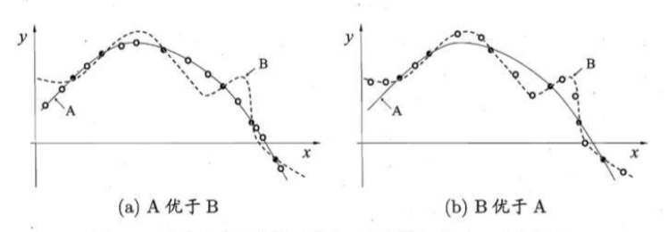
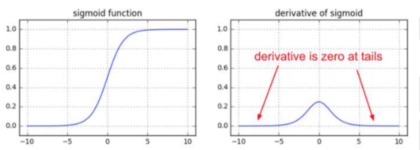
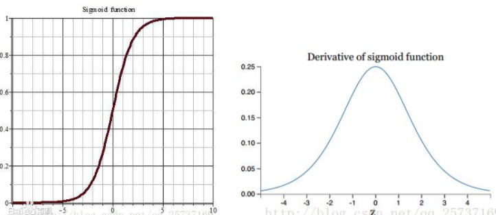
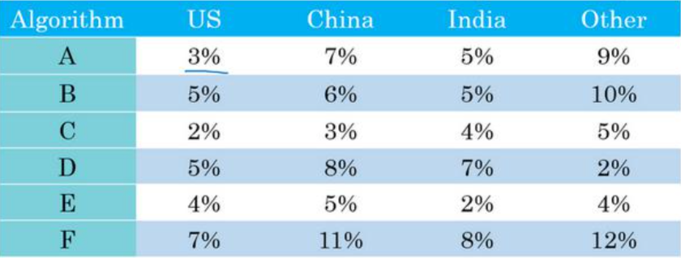
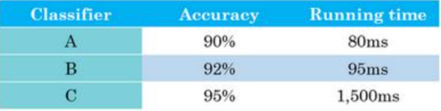
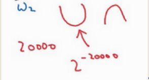
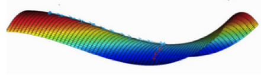

# 第一十三章 优化算法

## 13.1 CPU 和 GPU 的区别?

&emsp;&emsp;
**概念：**  
&emsp;&emsp;
CPU 全称是 central processing unit，CPU 是一块超大规模的集成电路，是一台计算机的运 算和控制核心，它的主要功能是解释计算机指令和处理计算机软件中的数据。  

&emsp;&emsp;
GPU 全称是 graphics processing unit，GPU 是将计算机系统，所需要的显示信息进行转换 的驱动，并向显示器提供扫描信号，控制显示器的正确显示，是连接显示器和个人电脑主板的 重要元件，是人机对话的重要设备之一。

&emsp;&emsp;
**缓存：**  
&emsp;&emsp;
CPU 有大量的缓存结构，目前主流的 CPU 芯片上都有四级缓存，这些缓存结构消耗了大 量的晶体管，在运行的时候需要大量的电力。反观 GPU 的缓存就很简单，目前主流的 GPU 芯 片最多有两层缓存。CPU 消耗在晶体管上的空间和能耗，GPU 都可以用来做成 ALU 单元，也 因此 GPU 比 CPU 的效率要高一些。

&emsp;&emsp;
**响应方式：**  
&emsp;&emsp;
对 CPU 来说，要求的是实时响应，对单任务的速度要求很高，所以就要用很多层缓存的 办法来保证单任务的速度。对 GPU 来说大家不关心第一个像素什么时候计算完成，而是都关 心最后一个像素什么时候计算出来，所以 GPU 就把所有的任务都排好，然后再批处理，这样 对缓存的要求就很低了。举个不恰当的例子，在点击 10 次鼠标的时候，CPU 要每一次点击都 要及时响应，而 GPU 会等第 10 次点击后，再一次性批处理响应。

&emsp;&emsp;
**浮点运算：**  
&emsp;&emsp;
CPU 除了负责浮点整形运算外，还有很多其他的指令集的负载，比如像多媒体解码，硬 件解码等，所以 CPU 是个多才多艺的东西，而 GPU 基本上就是只做浮点运算的，也正是因为 只做浮点运算，所以设计结构简单，也就可以做的更快。另外显卡的 GPU 和单纯为了跑浮点 高性能运算的 GPU 还是不太一样，显卡的 GPU 还要考虑配合图形输出显示等方面，而有些专 用 GPU 设备，就是一个 PCI 卡上面有一个性能很强的浮点运算 GPU，没有显示输出的，这样 的 GPU 就是为了加快某些程序的浮点计算能力。CPU 注重的是单线程的性能，也就是延迟， 对于 CPU 来说，要保证指令流不中断，所以 CPU 需要消耗更多的晶体管和能耗用在控制部分， 于是CPU分配在浮点计算的功耗就会变少。GPU注重的是吞吐量，单指令能驱动更多的计算， 所以相比较而言 GPU 消耗在控制部分的能耗就比较少，因此也就可以把电省下来的资源给浮 点计算使用。

&emsp;&emsp;
**应用方向：**  
&emsp;&emsp;
像操作系统这一类应用，需要快速响应实时信息，需要针对延迟优化，所以晶体管数量和能耗都需要用在分支预测，乱序执行上，低延迟缓存等控制部分，而这都是 CPU 的所擅长的。 对于像矩阵一类的运算，具有极高的可预测性和大量相似运算的，这种高延迟，高吞吐的架构 运算，就非常适合 GPU。

&emsp;&emsp;
**浅显解释：**  
&emsp;&emsp;
一块 CPU 相当于一个数学教授，一块 GPU 相当于 100 个小学生。  
&emsp;&emsp;
第一回合，四则运算，一百个题。教授拿到卷子一道道计算。100 个小学生各拿一道题。 教授刚开始计算到第二题的时候，小学生就集体交卷了。  
&emsp;&emsp;
第二回合，高等函数，一百个题。当教授搞定后。一百个小学生可能还不知道该做些什么。
&emsp;&emsp;
这两个回合就是 CPU 和 GPU 的区别了。

## 13.2 如何解决训练样本少的问题

&emsp;&emsp;
要训练一个好的 CNN 模型，通常需要很多训练数据，尤其是模型结构比较复杂的时候， 比如 ImageNet 数据集上训练的模型。虽然深度学习在 ImageNet 上取得了巨大成功，但是一个 现实的问题是，很多应用的训练集是较小的，如何在这种情况下应用深度学习呢?有三种方法 可供读者参考。  

&emsp;&emsp;
（1）可以将 ImageNet 上训练得到的模型做为起点，利用目标训练集和反向传播对其进 行继续训练，将模型适应到特定的应用。ImageNet 起到预训练的作用。  
&emsp;&emsp;
（2）如果目标训练集不够大，也可以将低层的网络参数固定，沿用 ImageNet 上的训练集 结果，只对上层进行更新。这是因为底层的网络参数是最难更新的，而从 ImageNet 学习得到 的底层滤波器往往描述了各种不同的局部边缘和纹理信息，而这些滤波器对一般的图像有较好 的普适性。  
&emsp;&emsp;
（3）直接采用 ImageNet 上训练得到的模型，把最高的隐含层的输出作为特征表达，代 替常用的手工设计的特征。

## 13.3 什么样的样本集不适合用深度学习?

&emsp;&emsp;
（1）数据集太小，数据样本不足时，深度学习相对其它机器学习算法，没有明显优势。  
&emsp;&emsp;
（2）数据集没有局部相关特性，目前深度学习表现比较好的领域主要是图像/语音 /自然语言处理等领域，这些领域的一个共性是局部相关性。图像中像素组成物体，语音 信号中音位组合成单词，文本数据中单词组合成句子，这些特征元素的组合一旦被打乱， 表示的含义同时也被改变。对于没有这样的局部相关性的数据集，不适于使用深度学习算 法进行处理。举个例子:预测一个人的健康状况，相关的参数会有年龄、职业、收入、家 庭状况等各种元素，将这些元素打乱，并不会影响相关的结果。

## 13.4 有没有可能找到比已知算法更好的算法?

&emsp;&emsp;
没有免费的午餐定理:  

图 13.4 没有免费的午餐（黑点：训练样本；白点：测试样本）

&emsp;&emsp;
对于训练样本（黑点），不同的算法 A/B 在不同的测试样本（白点）中有不同的表现，这表示:对于一个学习算法A，若它在某些问题上比学习算法B更好，则必然存在一些问题， 在那里B比A好。   
&emsp;&emsp;
也就是说:对于所有问题，无论学习算法 A 多聪明，学习算法 B 多笨拙，它们的期望性 能相同。  
&emsp;&emsp;
但是:没有免费午餐定力假设所有问题出现几率相同，实际应用中，不同的场景，会有不 同的问题分布，所以，在优化算法时，针对具体问题进行分析，是算法优化的核心所在。

## 13.5 何为共线性, 跟过拟合有啥关联?

&emsp;&emsp;
共线性:多变量线性回归中，变量之间由于存在高度相关关系而使回归估计不准确。  
&emsp;&emsp;
产生问题:共线性会造成冗余，导致过拟合。  
&emsp;&emsp;
解决方法:排除变量的相关性、加入权重正则。

## 13.6 广义线性模型是怎被应用在深度学习中?

&emsp;&emsp;
深度学习从统计学角度，可以看做递归的广义线性模型。  
&emsp;&emsp;
广义线性模型相对于经典的线性模型$(y=wx+b)$，核心在于引入了连接函数 $g(\cdot)$，形式变为: $y=g-1(wx+b)$。    
&emsp;&emsp;
深度学习时递归的广义线性模型，神经元的激活函数，即为广义线性模型的链接函数。逻 辑回归(广义线性模型的一种)的 Logistic 函数即为神经元激活函数中的 Sigmoid 函数，很多 类似的方法在统计学和神经网络中的名称不一样，容易引起困惑。

## 13.7 造成梯度消失的原因?

&emsp;&emsp;
神经网络的训练中，通过改变神经元的权重，使网络的输出值尽可能逼近标签以降低误差 值，训练普遍使用 BP 算法，核心思想是，计算出输出与标签间的损失函数值，然后计算其相 对于每个神经元的梯度，进行权值的迭代。  
&emsp;&emsp;
梯度消失会造成权值更新缓慢，模型训练难度增加。造成梯度消失的一个原因是，许多激 活函数将输出值挤压在很小的区间内，在激活函数两端较大范围的定义域内梯度为 $0$。造成学 习停止。  

图 13.7 sigmoid 函数的梯度消失

## 13.8 权值初始化方法有哪些？

&emsp;&emsp;
权值初始化的方法主要有:常量初始化(constant)、高斯分布初始化(gaussian)、 positive_unitball 初始化、均匀分布初始化(uniform)、xavier 初始化、msra 初始化、双线性初 始化(bilinear)。  

&emsp;&emsp;
**1. 常量初始化(constant)**  
&emsp;&emsp;
把权值或者偏置初始化为一个常数，具体是什么常数，可以自己定义。  

&emsp;&emsp;
**2. 高斯分布初始化(gaussian)**  
&emsp;&emsp;
需要给定高斯函数的均值与标准差。  

&emsp;&emsp;
**3. positive_unitball 初始化**  
&emsp;&emsp;
让每一个神经元的输入的权值和为 $1$，例如:一个神经元有 $100$ 个输入，让这 $100$ 个输入
的权值和为 $1$. 首先给这 $100$ 个权值赋值为在$(0,1)$之间的均匀分布，然后，每一个权值再 除以它们的和就可以啦。这么做，可以有助于防止权值初始化过大，从而防止激活函数(sigmoid 函数)进入饱和区。所以，它应该比较适合 simgmoid 形的激活函数。  

&emsp;&emsp;
**4. 均匀分布初始化(uniform)**  
&emsp;&emsp;
将权值与偏置进行均匀分布的初始化，用 min 与 max 控制它们的的上下限，默认为$(0,1)$。  

&emsp;&emsp;
**5. xavier 初始化**  
&emsp;&emsp;
对于权值的分布:均值为 $0$，方差为($1$ / 输入的个数)的均匀分布。如果我们更注重前
向传播的话，我们可以选择 fan_in，即正向传播的输入个数;如果更注重后向传播的话，我们选择 fan_out, 因为在反向传播的时候，fan_out 就是神经元的输入个数;如果两者都考虑的话， 就选 average = (fan_in + fan_out) /$2$。对于 ReLU 激活函数来说，XavierFiller 初始化也是很适合。关于该初始化方法，具体可以参考文章1、文章2，该方法假定激活函数是线性的。  

&emsp;&emsp;
**6. msra 初始化**  
&emsp;&emsp;
对于权值的分布:基于均值为 $0$，方差为( $2$/输入的个数)的高斯分布;它特别适合 ReLU 激活函数，该方法主要是基于 Relu 函数提出的，推导过程类似于 xavier。  

&emsp;&emsp;
**7. 双线性初始化（bilinear）**  
&emsp;&emsp;
常用在反卷积神经网络里的权值初始化。

## 13.9 启发式优化算法中，如何避免陷入局部最优解?

&emsp;&emsp;
启发式算法中，局部最优值的陷入无法避免。启发式，本质上是一种贪心策略，这也在客 观上决定了不符合贪心规则的更好(或者最优)解会错过。  
&emsp;&emsp;
简单来说，避免陷入局部最优就是两个字:随机。  
&emsp;&emsp;
具体实现手段上，可以根据所采用的启发式框架来灵活地加入随机性。比如遗传里面，可 以在交叉变异时，可以在控制人口策略中，也可以在选择父本母本样本时;禁忌里面，可以在 禁忌表的长度上体现，也可以在解禁策略中使用，等等。这些都要结合具体问题特定的算例集， 需要反复尝试摸索才行。参数的敏感性是一个问题，建议不要超过 $3$ 个参数，参数越不敏感越好。不同算例集用不同种子运行多次($100$ 次左右才有统计意义)，统计平均性能即可。需注 意全局的随机重启通常来说不是一个好办法，因为等于主动放弃之前搜索结果，万不得已不要 用，或者就是不用。

&emsp;&emsp;
**三个原则应该把握:越随机越好;越不随机越好;二者平衡最好。**

&emsp;&emsp;
**1. 越随机越好**  
&emsp;&emsp;
没有随机性，一定会陷入局部最优。为了获得更大的找到最优解的期望，算法中一定要有
足够的随机性。具体体现为鲁棒性较好，搜索时多样性较好。算法的每一步选择都可以考虑加入随机性，但要控制好概率。比如，某个贪心策略下，是以概率 $1 $做某一动作，可以考虑将其 改为以概率 $0.999$ 做之前的操作，以剩余概率做其他操作。具体参数设置需调试。

&emsp;&emsp;
**2. 越不随机越好**   
&emsp;&emsp;
随机性往往是对问题内在规律的一种妥协。即没有找到其内在规律，又不知道如何是好， 为了获得更好的多样性，逼不得已加入随机。因此，对给定问题的深入研究才是根本:分辨出 哪些时候，某个动作就是客观上能严格保证最优的——这点至关重要，直接决定了算法性能。 最好的算法一定是和问题结构紧密相连的，范范地套用某个启发式的框架不会有出色的性能。 当然，如果不是追求性能至上，而是考虑到开发效率实现成本这些额外因素，则另当别论。

&emsp;&emsp;
**3. 二者平衡最好**  
&emsp;&emsp;
通常情况下，做好第一点，可以略微改善算法性能;做好第二点，有希望给算法带来质的提高。而二者调和后的平衡则会带来质的飞跃。

&emsp;&emsp;
贪心是“自强不息”的精进，不放过任何改进算法的机会;多样性的随机是“厚德载物”的一分包 容，给那些目前看似不那么好的解一些机会。调和好二者，不偏颇任何一方才能使算法有出色 的性能。要把握这种平衡，非一朝一夕之功，只能在反复试验反思中去细细品味。  
&emsp;&emsp;
要结合具体问题而言，范范空谈无太大用。

## 13.10 凸优化中如何改进 GD 方法以防止陷入局部最优解?

&emsp;&emsp;
在对函数进行凸优化时，如果使用导数的方法(如:梯度下降法/GD，牛顿法等)来寻找最优解，有可能陷入到局部最优解而非全局最优解。  
&emsp;&emsp;
为了防止得到局部最优，可以对梯度下降法进行一些改进，防止陷入局部最优。  
&emsp;&emsp;
但是请注意，这些方法只能保证以最大的可能找到全局最优，无法保证 $100\%$得到全局最优。

&emsp;&emsp;
**（1）incremental GD/stochastic GD**  
&emsp;&emsp;
在 GD 中，是需要遍历所有的点之后才计算 $w$ 的变化的;但是，在 stochastic GD 中，每输入一个点，就根据该点计算下一步的 $w$，这样，不仅可以从 batch training 变成 online training 方法，而且每次是按照单点的最优方向而不是整体的最优方向前进，从而相当于在朝目标前进的路上多拐了好多弯，有可能逃出局部最优。

&emsp;&emsp;
**（2）momentum 方法**  
&emsp;&emsp;
momentum 相当与记忆住上一次的更新。在每次的更新中，都要加一个 $k$ 倍的上一次更新 量。这样，也不再是按照标准路线前进，每次的步骤都容易受到上一次的影响，从而可能会逃 出局部最优。另外，也会加大步长，从而加快收敛。

## 13.11 常见的损失函数?

&emsp;&emsp;
机器学习通过对算法中的目标函数进行不断求解优化，得到最终想要的结果。分类和回归 问题中，通常使用损失函数或代价函数作为目标函数。  
&emsp;&emsp;
损失函数用来评价预测值和真实值不一样的程度。通常损失函数越好，模型的性能也越好。  
&emsp;&emsp;
损失函数可分为经验风险损失函数和结构风险损失函数。经验风险损失函数指预测结果和 实际结果的差别，结构风险损失函数是在经验风险损失函数上加上正则项。  

&emsp;&emsp;
下面介绍常用的损失函数:

&emsp;&emsp;
**1）$0-1$ 损失函数**  
&emsp;&emsp;
如果预测值和目标值相等，值为 $0$，如果不相等，值为 $1$：
$$
L(Y,f(x))=
\left\{
\begin{array}{}
1\;\;\;,\;\;Y\ne f(x), \\
0\;\;\;,\;\;Y=f(x).
\end{array}
\right.
$$

&emsp;&emsp;
一般的在实际使用中，相等的条件过于严格，可适当放宽条件：
$$
L(Y,f(x))=
\left\{
\begin{array}{}
1\;\;\;,\;\;|Y - f(x)| \ge T, \\
0\;\;\;,\;\;|Y-f(x)| < T.
\end{array}
\right.
$$

&emsp;&emsp;
**2）绝对值损失函数**  
&emsp;&emsp;
和 $0-1$ 损失函数相似，绝对值损失函数表示为：
$$
L(Y,f(x))=|Y-f(x)|.
$$

&emsp;&emsp;
**3）平方损失函数**  
$$
L(Y|f(x))=\sum_{N}(Y-f(x))^2.
$$

&emsp;&emsp;
这点可从最小二乘法和欧几里得距离角度理解。最小二乘法的原理是，最优拟合曲线应该 使所有点到回归直线的距离和最小。

&emsp;&emsp;
**4）$log$ 对数损失函数**  
$$
L(Y,P(Y|X))=-logP(Y|X).
$$

&emsp;&emsp;
常见的逻辑回归使用的就是对数损失函数，有很多人认为逻辑回归的损失函数式平方损失， 其实不然。逻辑回归它假设样本服从伯努利分布，进而求得满足该分布的似然函数，接着取对 数求极值等。逻辑回归推导出的经验风险函数是最小化负的似然函数，从损失函数的角度看， 就是 $log$ 损失函数。

&emsp;&emsp;
**5）指数损失函数**  
&emsp;&emsp;
指数损失函数的标准形式为：
$$
L(Y|f(x))=exp[-yf(x)].
$$

&emsp;&emsp;
例如 AdaBoost 就是以指数损失函数为损失函数。

&emsp;&emsp;
**6）Hinge 损失函数**  
&emsp;&emsp;
Hinge 损失函数的标准形式如下：
$$
L(y)=max(0, 1-ty).
$$

&emsp;&emsp;
其中 $y$ 是预测值，范围为$(-1,1)$, $t$ 为目标值，其为$-1$ 或 $1$。  
&emsp;&emsp;
在线性支持向量机中，最优化问题可等价于：
$$
\underset{w,b}{min}\sum_{i=1}^{N}(1-y_i(wx_i+b))+\lambda \lVert w^2 \rVert
$$

&emsp;&emsp;
$$
\frac{1}{m}\sum_{i=1}^{N}l(wx_i+by_i))+\lVert w^2 \rVert
$$

&emsp;&emsp;
其中$l(wx_i+by_i))$是Hinge损失函数，$\lVert w^2 \rVert$可看做为正则化项。

## 13.14 如何进行特征选择(feature selection)?

### 13.14.1 如何考虑特征选择

&emsp;&emsp;
当数据预处理完成后，我们需要选择有意义的特征输入机器学习的算法和模型进行训练。通常来说，从两个方面考虑来选择特征:

&emsp;&emsp;
（1）特征是否发散:如果一个特征不发散，例如方差接近于 $0$，也就是说样本在这个特 征上基本上没有差异，这个特征对于样本的区分并没有什么用。  
&emsp;&emsp;
（2）特征与目标的相关性:这点比较显见，与目标相关性高的特征，应当优选选择。除移除低方差法外，本文介绍的其他方法均从相关性考虑。

### 13.14.2 特征选择方法分类

&emsp;&emsp;
根据特征选择的形式又可以将特征选择方法分为 $3$ 种:

&emsp;&emsp;
（1）Filter:过滤法，按照发散性或者相关性对各个特征进行评分，设定阈值或者待选择
阈值的个数，选择特征。  
&emsp;&emsp;
（2）Wrapper:包装法，根据目标函数(通常是预测效果评分)，每次选择若干特征，或
者排除若干特征。  
&emsp;&emsp;
（3）Embedded:嵌入法，先使用某些机器学习的算法和模型进行训练，得到各个特征的权值系数，根据系数从大到小选择特征。类似于 Filter 方法，但是是通过训练来确定特征的优劣。

### 13.14.3 特征选择目的

&emsp;&emsp;
（1）减少特征数量、降维，使模型泛化能力更强，减少过拟合;   
&emsp;&emsp;
（2）增强对特征和特征值之间的理解。拿到数据集，一个特征选择方法，往往很难同时完成这两个目的。通常情况下，选择一种自己最熟悉或者最方便的特征选择方法(往往目的是降维，而忽略了对特征和数据理解的目的)。 本文将结合 Scikit-learn 提供的例子介绍几种常用的特征选择方法，它们各自的优缺点和问题。

## 13.15 梯度消失/梯度爆炸原因，以及解决方法

### 13.15.1 为什么要使用梯度更新规则?

&emsp;&emsp;
在介绍梯度消失以及爆炸之前，先简单说一说梯度消失的根源—–深度神经网络和反向传 播。目前深度学习方法中，深度神经网络的发展造就了我们可以构建更深层的网络完成更复杂 的任务，深层网络比如深度卷积网络，LSTM 等等，而且最终结果表明，在处理复杂任务上， 深度网络比浅层的网络具有更好的效果。但是，目前优化神经网络的方法都是基于反向传播的 思想，即根据损失函数计算的误差通过梯度反向传播的方式，指导深度网络权值的更新优化。 这样做是有一定原因的，首先，深层网络由许多非线性层堆叠而来，每一层非线性层都可以视 为是一个非线性函数 $f(x)$（$f(x)$非线性来自于非线性激活函数），因此整个深度网络可以视为是一个复合的非线性多元函数：
$$F(x)=f_n(\cdots f_3(f_2(f_1(x)*\theta_1+b)*\theta_2+b)\cdots)$$

&emsp;&emsp;
我们最终的目的是希望这个多元函数可以很好的完成输入到输出之间的映射，假设不同的输入，输出的最优解是$g(x)$ ，那么，优化深度网络就是为了寻找到合适的权值，满足 $Loss=L(g(x),F(x))$取得极小值点，比如最简单的损失函数：
$$
Loss = \lVert g(x)-f(x) \rVert^2_2.
$$

&emsp;&emsp;
假设损失函数的数据空间是下图这样的，我们最优的权值就是为了寻找下图中的最小值点， 对于这种数学寻找最小值问题，采用梯度下降的方法再适合不过了。

图 13.15.1 

### 13.15.2 梯度消失、爆炸原因?

&emsp;&emsp;
梯度消失与梯度爆炸其实是一种情况，看接下来的文章就知道了。两种情况下梯度消失经 常出现，一是在深层网络中，二是采用了不合适的损失函数，比如 sigmoid。梯度爆炸一般出 现在深层网络和权值初始化值太大的情况下，下面分别从这两个角度分析梯度消失和爆炸的原因。

&emsp;&emsp;
（1）深层网络角度  
&emsp;&emsp;
对激活函数进行求导，如果此部分大于 $1$，那么层数增多的时候，最终的求出的梯度更新 将以指数形式增加，即发生**梯度爆炸**，如果此部分小于 $1$，那么随着层数增多，求出的梯度更 新信息将会以指数形式衰减，即发生了**梯度消失**。  
&emsp;&emsp;
从深层网络角度来讲，不同的层学习的速度差异很大，表现为网络中靠近输出的层学习的 情况很好，靠近输入的层学习的很慢，有时甚至训练了很久，前几层的权值和刚开始随机初始 化的值差不多。因此，梯度消失、爆炸，其根本原因在于反向传播训练法则，属于先天不足， 另外多说一句，Hinton 提出 capsule 的原因就是为了彻底抛弃反向传播，如果真能大范围普及， 那真是一个革命。  

&emsp;&emsp;
（2）激活函数角度  
&emsp;&emsp;
计算权值更新信息的时候需要计算前层偏导信息，因此如果激活函数选择不合适，比如使用 sigmoid，梯度消失就会很明显了，原因看下图，左图是sigmoid的损失函数图，右边是其倒数的图像，如果使用 sigmoid 作为损失函数，其梯度是不可能超过 $0.25$ 的，这样经过链式求导之后，很容易发生梯度消失。

图 13.15.2 sigmod函数与其导数

### 13.15.3 梯度消失、爆炸的解决方案

&emsp;&emsp;
**方案1-预训练加微调**  
&emsp;&emsp;
此方法来自Hinton在2006年发表的一篇论文，Hinton为了解决梯度的问题，提出采取无监督逐层训练方法，其基本思想是每次训练一层隐节点，训练时将上一层隐节点的输出作为输入，而本层隐节点的输出作为下一层隐节点的输入，此过程就是逐层“预训练”（pre-training）；在预训练完成后，再对整个网络进行“微调”（fine-tunning）。Hinton在训练深度信念网络（Deep Belief Networks中，使用了这个方法，在各层预训练完成后，再利用BP算法对整个网络进行训练。此思想相当于是先寻找局部最优，然后整合起来寻找全局最优，此方法有一定的好处，但是目前应用的不是很多了。

&emsp;&emsp;
**方案2-梯度剪切、正则**  
&emsp;&emsp;
梯度剪切这个方案主要是针对梯度爆炸提出的，其思想是设置一个梯度剪切阈值，然后更新梯度的时候，如果梯度超过这个阈值，那么就将其强制限制在这个范围之内。这可以防止梯度爆炸。  
&emsp;&emsp;
另外一种解决梯度爆炸的手段是采用权重正则化（weithts regularization）比较常见的是l1l1正则，和l2l2正则，在各个深度框架中都有相应的API可以使用正则化。

&emsp;&emsp;
**方案3-relu、leakrelu、elu等激活函数**  
&emsp;&emsp;
**Relu**  
&emsp;&emsp;
思想也很简单，如果激活函数的导数为1，那么就不存在梯度消失爆炸的问题了，每层的网络都可以得到相同的更新速度，relu就这样应运而生。  
&emsp;&emsp;
relu函数的导数在正数部分是恒等于1的，因此在深层网络中使用relu激活函数就不会导致梯度消失和爆炸的问题。
relu的主要贡献在于：  
&emsp;&emsp;
（1）解决了梯度消失、爆炸的问题  
&emsp;&emsp;
（2）计算方便，计算速度快  
&emsp;&emsp;
（3）加速了网络的训练  

&emsp;&emsp;
同时也存在一些缺点：  
&emsp;&emsp;
（1）由于负数部分恒为0，会导致一些神经元无法激活（可通过设置小学习率部分解决）；  
&emsp;&emsp;
（2）输出不是以0为中心的。  

&emsp;&emsp;
**leakrelu**   
&emsp;&emsp;
leakrelu就是为了解决relu的0区间带来的影响，其数学表达为：leakrelu$=max(k*x,0)$其中$k$是leak系数，一般选择$0.01$或者$0.02$，或者通过学习而来。

&emsp;&emsp;
**方案4-batchnorm**  
&emsp;&emsp;
Batchnorm是深度学习发展以来提出的最重要的成果之一了，目前已经被广泛的应用到了各大网络中，具有加速网络收敛速度，提升训练稳定性的效果，Batchnorm本质上是解决反向传播过程中的梯度问题。Batchnorm全名是Batch Normalization，简称BN，即批规范化，通过规范化操作将输出信号$x$规范化到均值为$0$，方差为$1$保证网络的稳定性。  

&emsp;&emsp;
**方案5-残差结构**   
&emsp;&emsp;
事实上，就是残差网络的出现导致了Imagenet比赛的终结，自从残差提出后，几乎所有的深度网络都离不开残差的身影，相比较之前的几层，几十层的深度网络，在残差网络面前都不值一提，残差可以很轻松的构建几百层，一千多层的网络而不用担心梯度消失过快的问题，原因就在于残差的捷径（shortcut）部分。

&emsp;&emsp;
**方案6-LSTM**  
&emsp;&emsp;
LSTM全称是长短期记忆网络（long-short term memory networks），是不那么容易发生梯度消失的，主要原因在于LSTM内部复杂的“门”(gates)。

## 13.16 深度学习为什么不用二阶优化

1. 二阶优化方法可以用到深度学习网络中，比如DistBelief，《Large-scale L-BFGS using MapReduce》.采用了数据并行的方法解决了海量数据下L-BFGS算法的可用性问题。
2. 二阶优化方法目前还不适用于深度学习训练中，主要存在问题是：  
（1）最重要的问题是二阶方法的计算量大，训练较慢。  
（2）求导不易，实现比SGD这类一阶方法复杂。  
（3）另外其优点在深度学习中无法展现出来，主要是二阶方法能够更快地求得更高精度的解，这在浅层模型是有益的，但是在神经网络这类深层模型中对参数的精度要求不高，相反 相对而言不高的精度对模型还有益处，能够提高模型的泛化能力。  
（4）稳定性。题主要明白的一点事，越简单的东西往往越robust，对于优化算法也是这样。梯度下降等一阶算法只要步长不选太大基本都不会出问题，但二阶方法遍地是坑，数值稳定性啊等等。

## 13.17 怎样优化你的深度学习系统？

&emsp;&emsp;
你可能有很多想法去改善你的系统，比如，你可能想我们去收集更多的训练数据吧。或者你会说，可能你的训练集的多样性还不够，你应该收集更多不同姿势的猫咪图片，或者更多样化的反例集。或者你想再用梯度下降训练算法，训练久一点。或者你想尝试用一个完全不同的优化算法，比如Adam优化算法。或者尝试使用规模更大或者更小的神经网络。或者你想试试dropout或者正则化。或者你想修改网络的架构，比如修改激活函数，改变隐藏单元的数目之类的方法。

&emsp;&emsp;
当你尝试优化一个深度学习系统时，你通常可以有很多想法可以去试，问题在于，如果你做出了错误的选择，你完全有可能白费6个月的时间，往错误的方向前进，在6个月之后才意识到这方法根本不管用。比如，我见过一些团队花了6个月时间收集更多数据，却在6个月之后发现，这些数据几乎没有改善他们系统的性能。所以，假设你的项目没有6个月的时间可以浪费，如果有快速有效的方法能够判断哪些想法是靠谱的，或者甚至提出新的想法，判断哪些是值得一试的想法，哪些是可以放心舍弃的。

&emsp;&emsp;
我希望在这门课程中，可以教给你们一些策略，一些分析机器学习问题的方法，可以指引你们朝着最有希望的方向前进。这门课中，我会和你们分享我在搭建和部署大量深度学习产品时学到的经验和教训，我想这些内容是这门课程独有的。比如说，很多大学深度学习课程很少提到这些策略。事实上，机器学习策略在深度学习的时代也在变化，因为现在对于深度学习算法来说能够做到的事情，比上一代机器学习算法大不一样。我希望这些策略能帮助你们提高效率，让你们的深度学习系统更快投入实用。

## 13.18 为什么要设置单一数字评估指标？

&emsp;&emsp;
无论你是调整超参数，或者是尝试不同的学习算法，或者在搭建机器学习系统时尝试不同手段，你会发现，如果你有一个单实数评估指标，你的进展会快得多，它可以快速告诉你，新尝试的手段比之前的手段好还是差。所以当团队开始进行机器学习项目时，我经常推荐他们为问题设置一个单实数评估指标。

&emsp;&emsp;
我发现很多机器学习团队就是这样，有一个定义明确的开发集用来测量查准率和查全率，再加上这样一个单一数值评估指标，有时我叫单实数评估指标，能让你快速判断分类器或者分类器更好。所以有这样一个开发集，加上单实数评估指标，你的迭代速度肯定会很快，它可以加速改进您的机器学习算法的迭代过程。

图 13.8.1 

## 13.19 满足和优化指标（Satisficing and optimizing metrics）

&emsp;&emsp;
要把你顾及到的所有事情组合成单实数评估指标有时并不容易，在那些情况里，我发现有时候设立满足和优化指标是很重要的，让我告诉你是什么意思吧。

图 13.9.1 

&emsp;&emsp;
假设你已经决定你很看重猫分类器的分类准确度，这可以是分数或者用其他衡量准确度的指标。但除了准确度之外，我们还需要考虑运行时间，就是需要多长时间来分类一张图。分类器需要$80$毫秒，需要$95$毫秒，C需要$1500$毫秒，就是说需要$1.5$秒来分类图像。  

&emsp;&emsp;
你可以这么做，将准确度和运行时间组合成一个整体评估指标。所以成本，比如说，总体成本是，这种组合方式可能太刻意，只用这样的公式来组合准确度和运行时间，两个数值的线性加权求和。   

&emsp;&emsp;
你还可以做其他事情，就是你可能选择一个分类器，能够最大限度提高准确度，但必须满足运行时间要求，就是对图像进行分类所需的时间必须小于等于$100$毫秒。所以在这种情况下，我们就说准确度是一个优化指标，因为你想要准确度最大化，你想做的尽可能准确，但是运行时间就是我们所说的满足指标，意思是它必须足够好，它只需要小于$100$毫秒，达到之后，你不在乎这指标有多好，或者至少你不会那么在乎。所以这是一个相当合理的权衡方式，或者说 将准确度和运行时间结合起来的方式。实际情况可能是，只要运行时间少于 100 毫秒，你的用 户就不会在乎运行时间是 100 毫秒还是 50 毫秒，甚至更快。  

&emsp;&emsp;
通过定义优化和满足指标，就可以给你提供一个明确的方式，去选择“最好的”分类器。在 这种情况下分类器 B 最好，因为在所有的运行时间都小于 100 毫秒的分类器中，它的准确度最好。  

&emsp;&emsp;
总结一下，如果你需要顾及多个指标，比如说，有一个优化指标，你想尽可能优化的，然 后还有一个或多个满足指标，需要满足的，需要达到一定的门槛。现在你就有一个全自动的方 法，在观察多个成本大小时，选出"最好的"那个。现在这些评估指标必须是在训练集或开发集 或测试集上计算或求出来的。所以你还需要做一件事，就是设立训练集、开发集，还有测试集。 在下一个视频里，我想和大家分享一些如何设置训练、开发和测试集的指导方针，我们下一个 视频继续。

## 13.20 怎样划分训练/开发/测试集

&emsp;&emsp;
设立训练集，开发集和测试集的方式大大影响了你或者你的团队在建立机器学习应用方面取得进展的速度。同样的团队，即使是大公司里的团队，在设立这些数据集的方式，真的会让团队的进展变慢而不是加快，我们看看应该如何设立这些数据集，让你的团队效率最大化。  

&emsp;&emsp;
我建议你们不要这样，而是让你的开发集和测试集来自同一分布。我的意思是这样，你们要记住，我想就是设立你的开发集加上一个单实数评估指标，这就是像是定下目标，然后告诉你的团队，那就是你要瞄准的靶心，因为你一旦建立了这样的开发集和指标，团队就可以快速迭代，尝试不同的想法，跑实验，可以很快地使用开发集和指标去评估不同分类器，然后尝试选出最好的那个。所以，机器学习团队一般都很擅长使用不同方法去逼近目标，然后不断迭代，不断逼近靶心。所以，针对开发集上的指标优化。  

&emsp;&emsp;
所以我建议你们在设立开发集和测试集时，要选择这样的开发集和测试集，能够反映你未来会得到的数据，认为很重要的数据，必须得到好结果的数据，特别是，这里的开发集和测试集可能来自同一个分布。所以不管你未来会得到什么样的数据，一旦你的算法效果不错，要尝试收集类似的数据，而且，不管那些数据是什么，都要随机分配到开发集和测试集上。因为这样，你才能将瞄准想要的目标，让你的团队高效迭代来逼近同一个目标，希望最好是同一个目标。  

&emsp;&emsp;
我们还没提到如何设立训练集，我们会在之后的视频里谈谈如何设立训练集，但这个视频的重点在于，设立开发集以及评估指标，真的就定义了你要瞄准的目标。我们希望通过在同一分布中设立开发集和测试集，你就可以瞄准你所希望的机器学习团队瞄准的目标。而设立训练集的方式则会影响你逼近那个目标有多快，但我们可以在另一个讲座里提到。我知道有一些机器学习团队，他们如果能遵循这个方针，就可以省下几个月的工作，所以我希望这些方针也能帮到你们。  

&emsp;&emsp;
接下来，实际上你的开发集和测试集的规模，如何选择它们的大小，在深度学习时代也在变化，我们会在下一个视频里提到这些内容。

## 13.21 如何划分开发/测试集大小

&emsp;&emsp;
你可能听说过一条经验法则，在机器学习中，把你取得的全部数据用$70/30$比例分成训练集和测试集。或者如果你必须设立训练集、开发集和测试集，你会这么分$60\%$训练集，$20\%$开发集，$20\%$测试集。在机器学习的早期，这样分是相当合理的，特别是以前的数据集大小要小得多。所以如果你总共有100个样本，这样$70/30$或者$60/20/20$分的经验法则是相当合理的。如果你有几千个样本或者有一万个样本，这些做法也还是合理的。  

&emsp;&emsp;
但在现代机器学习中，我们更习惯操作规模大得多的数据集，比如说你有$1$百万个训练样本，这样分可能更合理，$98\%$作为训练集，$1\%$开发集，$1\%$测试集，我们用和缩写来表示开发集和测试集。因为如果你有$1$百万个样本，那么$1\%$就是$10,000$个样本，这对于开发集和测试集来说可能已经够了。所以在现代深度学习时代，有时我们拥有大得多的数据集，所以使用小于$20\%$的比例或者小于$30\%$比例的数据作为开发集和测试集也是合理的。而且因为深度学习算法对数据的胃口很大，我们可以看到那些有海量数据集的问题，有更高比例的数据划分到训练集里，那么测试集呢？   

&emsp;&emsp;
总结一下，在大数据时代旧的经验规则，这个$70/30$不再适用了。现在流行的是把大量数据分到训练集，然后少量数据分到开发集和测试集，特别是当你有一个非常大的数据集时。以前的经验法则其实是为了确保开发集足够大，能够达到它的目的，就是帮你评估不同的想法，然后选出还是更好。测试集的目的是评估你最终的成本偏差，你只需要设立足够大的测试集，可以用来这么评估就行了，可能只需要远远小于总体数据量的$30\%$。  

&emsp;&emsp;
所以我希望本视频能给你们一点指导和建议，让你们知道如何在深度学习时代设立开发和测试集。接下来，有时候在研究机器学习的问题途中，你可能需要更改评估指标，或者改动你的开发集和测试集，我们会讲什么时候需要这样做。

## 13.22 什么时候该改变开发/测试集和指标？

&emsp;&emsp;
我们来看一个例子，假设你在构建一个猫分类器，试图找到很多猫的照片，向你的爱猫人士用户展示，你决定使用的指标是分类错误率。所以算法和分别有3％错误率和5％错误率，所以算法似乎做得更好。  

&emsp;&emsp;
但我们实际试一下这些算法，你观察一下这些算法，算法由于某些原因，把很多色情图像分类成猫了。如果你部署算法，那么用户就会看到更多猫图，因为它识别猫的错误率只有$3\%$，但它同时也会给用户推送一些色情图像，这是你的公司完全不能接受的，你的用户也完全不能接受。相比之下，算法有$5\%$的错误率，这样分类器就得到较少的图像，但它不会推送色情图像。所以从你们公司的角度来看，以及从用户接受的角度来看，算法实际上是一个更好的算法，因为它不让任何色情图像通过。  

&emsp;&emsp;
那么在这个例子中，发生的事情就是，算法A在评估指标上做得更好，它的错误率达到$3\%$，但实际上是个更糟糕的算法。在这种情况下，评估指标加上开发集它们都倾向于选择算法，因为它们会说，看算法A的错误率较低，这是你们自己定下来的指标评估出来的。但你和你的用户更倾向于使用算法，因为它不会将色情图像分类为猫。所以当这种情况发生时，当你的评估指标无法正确衡量算法之间的优劣排序时，在这种情况下，原来的指标错误地预测算法A是更好的算法这就发出了信号，你应该改变评估指标了，或者要改变开发集或测试集。在这种情况下，你用的分类错误率指标可以写成这样：  

&emsp;&emsp;
但粗略的结论是，如果你的评估指标无法正确评估好算法的排名，那么就需要花时间定义一个新的评估指标。这是定义评估指标的其中一种可能方式（上述加权法）。评估指标的意义在于，准确告诉你已知两个分类器，哪一个更适合你的应用。就这个视频的内容而言，我们不需要太注重新错误率指标是怎么定义的，关键在于，如果你对旧的错误率指标不满意，那就不要一直沿用你不满意的错误率指标，而应该尝试定义一个新的指标，能够更加符合你的偏好，定义出实际更适合的算法。  

&emsp;&emsp;
所以方针是，如果你在指标上表现很好，在当前开发集或者开发集和测试集分布中表现很好，但你的实际应用程序，你真正关注的地方表现不好，那么就需要修改指标或者你的开发测试集。换句话说，如果你发现你的开发测试集都是这些高质量图像，但在开发测试集上做的评估无法预测你的应用实际的表现。因为你的应用处理的是低质量图像，那么就应该改变你的开发测试集，让你的数据更能反映你实际需要处理好的数据。  

&emsp;&emsp;
但总体方针就是，如果你当前的指标和当前用来评估的数据和你真正关心必须做好的事情关系不大，那就应该更改你的指标或者你的开发测试集，让它们能更够好地反映你的算法需要处理好的数据。

## 13.23 设置评估指标的意义？

&emsp;&emsp;
评估指标的意义在于，准确告诉你已知两个分类器，哪一个更适合你的应用。就这个视频的内容而言，我们不需要太注重新错误率指标是怎么定义的，关键在于，如果你对旧的错误率指标不满意，那就不要一直沿用你不满意的错误率指标，而应该尝试定义一个新的指标，能够更加符合你的偏好，定义出实际更适合的算法。

## 13.24 什么是可避免偏差？

&emsp;&emsp;
[http://www.ai-start.com/dl2017/lesson3-week1.html](http://www.ai-start.com/dl2017/lesson3-week1.html
)

&emsp;&emsp;
所以要给这些概念命名一下，这不是广泛使用的术语，但我觉得这么说思考起来比较流畅。就是把这个差值，贝叶斯错误率或者对贝叶斯错误率的估计和训练错误率之间的差值称为可避免偏差，你可能希望一直提高训练集表现，直到你接近贝叶斯错误率，但实际上你也不希望做到比贝叶斯错误率更好，这理论上是不可能超过贝叶斯错误率的，除非过拟合。而这个训练错误率和开发错误率之前的差值，就大概说明你的算法在方差问题上还有多少改善空间。  

&emsp;&emsp;
可避免偏差这个词说明了有一些别的偏差，或者错误率有个无法超越的最低水平，那就是说如果贝叶斯错误率是$7.5\%$。你实际上并不想得到低于该级别的错误率，所以你不会说你的训练错误率是$8\%$，然后$8\%$就衡量了例子中的偏差大小。你应该说，可避免偏差可能在$0.5\%$左右，或者$0.5\%$是可避免偏差的指标。而这个$2\%$是方差的指标，所以要减少这个$2\%$比减少这个$0.5\%$空间要大得多。而在左边的例子中，这$7\%$衡量了可避免偏差大小，而$2\%$衡量了方差大小。所以在左边这个例子里，专注减少可避免偏差可能潜力更大。

## 13.25 什么是TOP5错误率？

&emsp;&emsp;
top1就是你预测的label取最后概率向量里面最大的那一个作为预测结果，你的预测结果中概率最大的那个类必须是正确类别才算预测正确。而top5就是最后概率向量最大的前五名中出现了正确概率即为预测正确。  

&emsp;&emsp;
ImageNet 项目是一个用于物体对象识别检索大型视觉数据库。截止$2016$年，ImageNet 已经对超过一千万个图像的url进行手动注释，标记图像的类别。在至少一百万张图像中还提供了边界框。自$2010$年以来，ImageNet 举办一年一度的软件竞赛，叫做 ImageNet 大尺度视觉识别挑战(ImageNet Large Scale Visual Recognition Challenge,ILSVRC)。主要内容是通过算法程序实现正确分类和探测识别物体与场景，评价标准就是Top-5 错误率。  

&emsp;&emsp;
Top-5 错误率  
&emsp;&emsp;
ILSRVRC（ImageNet 图像分类大赛） 比赛设置如下：$1000$类图像分类问题，训练数据集$126$万张图像，验证集$5$万张，测试集$10$万张（标注未公布）。评价标准采用 top-5 错误率——即对一张图像预测$5$个类别，只要有一个和人工标注类别相同就算对，否则算错。

## 13.26 什么是人类水平错误率？

&emsp;&emsp;
人类水平错误率的定义，就是如果你想要替代或估计贝叶斯错误率，那么一队经验丰富的医生讨论和辩论之后，可以达到$0.5\%$的错误率。我们知道贝叶斯错误率小于等于$0.5\%$，因为有些系统，这些医生团队可以达到$0.5\%$的错误率。所以根据定义，最优错误率必须在$0.5\%$以下。我们不知道多少更好，也许有一个更大的团队，更有经验的医生能做得更好，所以也许比$0.5\%$好一点。但是我们知道最优错误率不能高于$0.5\%$，那么在这个背景下，我就可以用$0.5\%$估计贝叶斯错误率。所以我将人类水平定义为$0.5\%$，至少如果你希望使用人类水平错误来分析偏差和方差的时候，就像上个视频那样。  

&emsp;&emsp;
现在，为了发表研究论文或者部署系统，也许人类水平错误率的定义可以不一样，你可以使用1%，只要你超越了一个普通医生的表现，如果能达到这种水平，那系统已经达到实用了。也许超过一名放射科医生，一名医生的表现，意味着系统在一些情况下可以有部署价值了。

## 13.27 可避免偏差、几大错误率之间的关系？

&emsp;&emsp;
要了解为什么这个很重要，我们来看一个错误率分析的例子。比方说，在医学图像诊断例子中，你的训练错误率是$5\%$，你的开发错误率是$6\%$。而在上一张幻灯片的例子中，我们的人类水平表现，我将它看成是贝叶斯错误率的替代品，取决于你是否将它定义成普通单个医生的表现，还是有经验的医生或医生团队的表现，你可能会用$1\%$或$0.7\%$或$0.5\%$。同时也回想一下，前面视频中的定义，贝叶斯错误率或者说贝叶斯错误率的估计和训练错误率直接的差值就衡量了所谓的可避免偏差，这（训练误差与开发误差之间的差值）可以衡量或者估计你的学习算法的方差问题有多严重。  

&emsp;&emsp;
所以在这个第一个例子中，无论你做出哪些选择，可避免偏差大概是$4\%$，这个值我想介于……，如果你取$1\%$就是$4\%$，如果你取$0.5\%$就是$4.5\%$，而这个差距（训练误差与开发误差之间的差值）是$1\%$。所以在这个例子中，我得说，不管你怎么定义人类水平错误率，使用单个普通医生的错误率定义，还是单个经验丰富医生的错误率定义或经验丰富的医生团队的错误率定义，这是$4\%$还是$4.5\%$，这明显比都比方差问题更大。所以在这种情况下，你应该专注于减少偏差的技术，例如培训更大的网络。

## 13.28 怎样选取可避免偏差及贝叶斯错误率?

&emsp;&emsp;
就是比如你的训练错误率是0.7%，所以你现在已经做得很好了，你的开发错误率是$0.8\%$。在这种情况下，你用$0.5\%$来估计贝叶斯错误率关系就很大。因为在这种情况下，你测量到的可避免偏差是$0.2\%$，这是你测量到的方差问题$0.1\%$的两倍，这表明也许偏差和方差都存在问题。但是，可避免偏差问题更严重。在这个例子中，我们在上一张幻灯片中讨论的是$0.5\%$，就是对贝叶斯错误率的最佳估计，因为一群人类医生可以实现这一目标。如果你用$0.7$代替贝叶斯错误率，你测得的可避免偏差基本上是$0\%$，那你就可能忽略可避免偏差了。实际上你应该试试能不能在训练集上做得更好。

## 13.29 怎样减少方差？

&emsp;&emsp;
如果你的算法方差较高，可以尝试下面的技巧：  

&emsp;&emsp;
（1）增加训练数据：只要你可以获得大量数据和足够的算力去处理数据，这就是一种解决高方差问题最简单，最可靠的方式。  
&emsp;&emsp;
（2）正则化（L2, L1, dropout）：这种技巧减少方差的同时，增加了偏差。  
&emsp;&emsp;
（3）提前停止（例如，根据开发集的错误率来提前停止梯度下降）：这种技巧减少方差的同时增加的偏差。提前停止技巧很像正则化方法，一些论文作者也叫他正则化技巧。  
&emsp;&emsp;
（4）特征选择来减少输入特征的数量或类型：这种技巧可能会处理好方差问题，但是同时会增大偏差。稍微减少特征数量（比如从1000个特征减少到900个特征）不太可能对偏差产生大的影响。大量减少特征数量（比如从$1000$减少到$100-$减少$10$倍）可能产生较大偏差，因为去掉了很多有用的特征。（注：可能会欠拟合）。在现代的深度学习中，数据量很大，人们对待特征选择的态度出现了转变，现在我们更加倾向于使用全部的特征，让算法自己选择合适的特征。但是当训练集比较小时，特征选择非常有用。  
&emsp;&emsp;
（5）缩小模型（例如减少网络层数和神经元数量）：谨慎使用。这种技巧可以减少方差，同时也可能增加偏差。然而，我并不推荐使用这种技巧来解决方差问题。添加正则化通常会获得更好的分类性能。缩小模型的优点在于减少计算成本，以更快的速度来训练模型。如果模型的训练速度非常重要，那么就想尽一切方法来缩小模型。但是如果目标是减少方差，不是那么在意计算成本，可以考虑添加正则化。

## 13.30 贝叶斯错误率的最佳估计

&emsp;&emsp;
对于这样的问题，更好的估计贝叶斯错误率很有必要，可以帮助你更好地估计可避免偏差和方差，这样你就能更好的做出决策，选择减少偏差的策略，还是减少方差的策略。

## 13.31 举机器学习超过单个人类表现几个例子？

&emsp;&emsp;
现在，机器学习有很多问题已经可以大大超越人类水平了。例如，我想网络广告，估计某个用户点击广告的可能性，可能学习算法做到的水平已经超越任何人类了。还有提出产品建议，向你推荐电影或书籍之类的任务。我想今天的网站做到的水平已经超越你最亲近的朋友了。还有物流预测，从到开车需要多久，或者预测快递车从开到需要多少时间。或者预测某人会不会偿还贷款，这样你就能判断是否批准这人的贷款。我想这些问题都是今天的机器学习远远超过了单个人类的表现。  

&emsp;&emsp;
除了这些问题，今天已经有语音识别系统超越人类水平了，还有一些计算机视觉任务，一些图像识别任务，计算机已经超越了人类水平。但是由于人类对这种自然感知任务非常擅长，我想计算机达到那种水平要难得多。还有一些医疗方面的任务，比如阅读ECG或诊断皮肤癌，或者某些特定领域的放射科读图任务，这些任务计算机做得非常好了，也许超越了单个人类的水平。

## 13.32如何改善你的模型？

&emsp;&emsp;
你们学过正交化，如何设立开发集和测试集，用人类水平错误率来估计贝叶斯错误率以及如何估计可避免偏差和方差。我们现在把它们全部组合起来写成一套指导方针，如何提高学习算法性能的指导方针。  

&emsp;&emsp;
首先，你的算法对训练集的拟合很好，这可以看成是你能做到可避免偏差很低。还有第二件事你可以做好的是，在训练集中做得很好，然后推广到开发集和测试集也很好，这就是说方差不是太大。  
1. 总结一下前几段视频我们见到的步骤，如果你想提升机器学习系统的性能，我建议你们看看训练错误率和贝叶斯错误率估计值之间的距离，让你知道可避免偏差有多大。换句话说，就是你觉得还能做多好，你对训练集的优化还有多少空间。

2. 然后看看你的开发错误率和训练错误率之间的距离，就知道你的方差问题有多大。换句话说，你应该做多少努力让你的算法表现能够从训练集推广到开发集，算法是没有在开发集上训练的。

3. 用尽一切办法减少可避免偏差

4. 比如使用规模更大的模型，这样算法在训练集上的表现会更好，或者训练更久。

5. 使用更好的优化算法，比如说加入momentum或者RMSprop，或者使用更好的算法，比如Adam。你还可以试试寻找更好的新神经网络架构，或者说更好的超参数。这些手段包罗万有，你可以改变激活函数，改变层数或者隐藏单位数，虽然你这么做可能会让模型规模变大。

6. 或者试用其他模型，其他架构，如循环神经网络和卷积神经网络。  

&emsp;&emsp;
在之后的课程里我们会详细介绍的，新的神经网络架构能否更好地拟合你的训练集，有时也很难预先判断，但有时换架构可能会得到好得多的结果。

## 13.33 理解误差分析

&emsp;&emsp;
如果你希望让学习算法能够胜任人类能做的任务，但你的学习算法还没有达到人类的表现，那么人工检查一下你的算法犯的错误也许可以让你了解接下来应该做什么。这个过程称为错误分析，我们从一个例子开始讲吧。  

&emsp;&emsp;
假设你正在调试猫分类器，然后你取得了$90\%$准确率，相当于$10\%$错误，，在你的开发集上做到这样，这离你希望的目标还有很远。也许你的队员看了一下算法分类出错的例子，注意到算法将一些狗分类为猫，你看看这两只狗，它们看起来是有点像猫，至少乍一看是。所以也许你的队友给你一个建议，如何针对狗的图片优化算法。试想一下，你可以针对狗，收集更多的狗图，或者设计一些只处理狗的算法功能之类的，为了让你的猫分类器在狗图上做的更好，让算法不再将狗分类成猫。所以问题在于，你是不是应该去开始做一个项目专门处理狗？这项目可能需要花费几个月的时间才能让算法在狗图片上犯更少的错误，这样做值得吗？或者与其花几个月做这个项目，有可能最后发现这样一点用都没有。这里有个错误分析流程，可以让你很快知道这个方向是否值得努力。  

&emsp;&emsp;
那这个简单的人工统计步骤，错误分析，可以节省大量时间，可以迅速决定什么是最重要的，或者最有希望的方向。实际上，如果你观察$100$个错误标记的开发集样本，也许只需要$5$到$10$分钟的时间，亲自看看这$100$个样本，并亲自统计一下有多少是狗。根据结果，看看有没有占到$5\%$、$50\%$或者其他东西。这个在$5$到$10$分钟之内就能给你估计这个方向有多少价值，并且可以帮助你做出更好的决定，是不是把未来几个月的时间投入到解决错误标记的狗图这个问题。  

&emsp;&emsp;
所以总结一下，进行错误分析，你应该找一组错误样本，可能在你的开发集里或者测试集里，观察错误标记的样本，看看假阳性（false positives）和假阴性（false negatives），统计属于不同错误类型的错误数量。在这个过程中，你可能会得到启发，归纳出新的错误类型，就像我们看到的那样。如果你过了一遍错误样本，然后说，天，有这么多Instagram滤镜或Snapchat滤镜，这些滤镜干扰了我的分类器，你就可以在途中新建一个错误类型。总之，通过统计不同错误标记类型占总数的百分比，可以帮你发现哪些问题需要优先解决，或者给你构思新优化方向的灵感。在做错误分析的时候，有时你会注意到开发集里有些样本被错误标记了，这时应该怎么做呢？我们下一个视频来讨论。

## 13.34 为什么值得花时间查看错误标记数据？

&emsp;&emsp;
最后我讲几个建议：  
&emsp;&emsp;
首先，深度学习研究人员有时会喜欢这样说：“我只是把数据提供给算法，我训练过了，效果拔群”。这话说出了很多深度学习错误的真相，更多时候，我们把数据喂给算法，然后训练它，并减少人工干预，减少使用人类的见解。但我认为，在构造实际系统时，通常需要更多的人工错误分析，更多的人类见解来架构这些系统，尽管深度学习的研究人员不愿意承认这点。  
&emsp;&emsp;
其次，不知道为什么，我看一些工程师和研究人员不愿意亲自去看这些样本，也许做这些事情很无聊，坐下来看100或几百个样本来统计错误数量，但我经常亲自这么做。当我带领一个机器学习团队时，我想知道它所犯的错误，我会亲自去看看这些数据，尝试和一部分错误作斗争。我想就因为花了这几分钟，或者几个小时去亲自统计数据，真的可以帮你找到需要优先处理的任务，我发现花时间亲自检查数据非常值得，所以我强烈建议你们这样做，如果你在搭建你的机器学习系统的话，然后你想确定应该优先尝试哪些想法，或者哪些方向。

## 13.35 快速搭建初始系统的意义？

&emsp;&emsp;
一般来说，对于几乎所有的机器学习程序可能会有$50$个不同的方向可以前进，并且每个方向都是相对合理的可以改善你的系统。但挑战在于，你如何选择一个方向集中精力处理。即使我已经在语音识别领域工作多年了，如果我要为一个新应用程序域构建新系统，我还是觉得很难不花时间去思考这个问题就直接选择方向。所以我建议你们，如果你想搭建全新的机器学习程序，就是快速搭好你的第一个系统，然后开始迭代。我的意思是我建议你快速设立开发集和测试集还有指标，这样就决定了你的目标所在，如果你的目标定错了，之后改也是可以的。但一定要设立某个目标，然后我建议你马上搭好一个机器学习系统原型，然后找到训练集，训练一下，看看效果，开始理解你的算法表现如何，在开发集测试集，你的评估指标上表现如何。当你建立第一个系统后，你就可以马上用到之前说的偏差方差分析，还有之前最后几个视频讨论的错误分析，来确定下一步优先做什么。特别是如果错误分析让你了解到大部分的错误的来源是说话人远离麦克风，这对语音识别构成特殊挑战，那么你就有很好的理由去集中精力研究这些技术，所谓远场语音识别的技术，这基本上就是处理说话人离麦克风很远的情况。

&emsp;&emsp;
建立这个初始系统的所有意义在于，它可以是一个快速和粗糙的实现（quick and dirty implementation），你知道的，别想太多。初始系统的全部意义在于，有一个学习过的系统，有一个训练过的系统，让你确定偏差方差的范围，就可以知道下一步应该优先做什么，让你能够进行错误分析，可以观察一些错误，然后想出所有能走的方向，哪些是实际上最有希望的方向。

## 13.36 为什么要在不同的划分上训练及测试？

&emsp;&emsp;
深度学习算法对训练数据的胃口很大，当你收集到足够多带标签的数据构成训练集时，算法效果最好，这导致很多团队用尽一切办法收集数据，然后把它们堆到训练集里，让训练的数据量更大，即使有些数据，甚至是大部分数据都来自和开发集、测试集不同的分布。在深度学习时代，越来越多的团队都用来自和开发集、测试集分布不同的数据来训练，这里有一些微妙的地方，一些最佳做法来处理训练集和测试集存在差异的情况，我们来看看。

图 13.36 Cat app example

&emsp;&emsp;
假设你在开发一个手机应用，用户会上传他们用手机拍摄的照片，你想识别用户从应用中上传的图片是不是猫。现在你有两个数据来源，一个是你真正关心的数据分布，来自应用上传的数据，比如右边的应用，这些照片一般更业余，取景不太好，有些甚至很模糊，因为它们都是业余用户拍的。另一个数据来源就是你可以用爬虫程序挖掘网页直接下载，就这个样本而言，可以下载很多取景专业、高分辨率、拍摄专业的猫图片。如果你的应用用户数还不多，也许你只收集到$10,000$张用户上传的照片，但通过爬虫挖掘网页，你可以下载到海量猫图，也许你从互联网上下载了超过$20$万张猫图。而你真正关心的算法表现是你的最终系统处理来自应用程序的这个图片分布时效果好不好，因为最后你的用户会上传类似右边这些图片，你的分类器必须在这个任务中表现良好。现在你就陷入困境了，因为你有一个相对小的数据集，只有$10,000$个样本来自那个分布，而你还有一个大得多的数据集来自另一个分布，图片的外观和你真正想要处理的并不一样。但你又不想直接用这$10,000$张图片，因为这样你的训练集就太小了，使用这$20$万张图片似乎有帮助。但是，困境在于，这$20$万张图片并不完全来自你想要的分布，那么你可以怎么做呢？

&emsp;&emsp;
这里有一种选择，你可以做的一件事是将两组数据合并在一起，这样你就有$21$万张照片，你可以把这$21$万张照片随机分配到训练、开发和测试集中。为了说明观点，我们假设你已经确定开发集和测试集各包含$2500$个样本，所以你的训练集有$205000$个样本。现在这么设立你的数据集有一些好处，也有坏处。好处在于，你的训练集、开发集和测试集都来自同一分布，这样更好管理。但坏处在于，这坏处还不小，就是如果你观察开发集，看看这$2500$个样本其中很多图片都来自网页下载的图片，那并不是你真正关心的数据分布，你真正要处理的是来自手机的图片。

&emsp;&emsp;
我建议你走另外一条路，就是这样，训练集，比如说还是$205,000$张图片，我们的训练集是来自网页下载的$200,000$张图片，然后如果需要的话，再加上$5000$张来自手机上传的图片。然后对于开发集和测试集，这数据集的大小是按比例画的，你的开发集和测试集都是手机图。而训练集包含了来自网页的$20$万张图片，还有$5000$张来自应用的图片，开发集就是$2500$张来自应用的图片，测试集也是$2500$张来自应用的图片。这样将数据分成训练集、开发集和测试集的好处在于，现在你瞄准的目标就是你想要处理的目标，你告诉你的团队，我的开发集包含的数据全部来自手机上传，这是你真正关心的图片分布。我们试试搭建一个学习系统，让系统在处理手机上传图片分布时效果良好。缺点在于，当然了，现在你的训练集分布和你的开发集、测试集分布并不一样。但事实证明，这样把数据分成训练、开发和测试集，在长期能给你带来更好的系统性能。我们以后会讨论一些特殊的技巧，可以处理 训练集的分布和开发集和测试集分布不一样的情况。

## 13.37 如何解决数据不匹配问题？

&emsp;&emsp;
如果您的训练集来自和开发测试集不同的分布，如果错误分析显示你有一个数据不匹配的问题该怎么办？这个问题没有完全系统的解决方案，但我们可以看看一些可以尝试的事情。如果我发现有严重的数据不匹配问题，我通常会亲自做错误分析，尝试了解训练集和开发测试集的具体差异。技术上，为了避免对测试集过拟合，要做错误分析，你应该人工去看开发集而不是测试集。

&emsp;&emsp;
但作为一个具体的例子，如果你正在开发一个语音激活的后视镜应用，你可能要看看……我想如果是语音的话，你可能要听一下来自开发集的样本，尝试弄清楚开发集和训练集到底有什么不同。所以，比如说你可能会发现很多开发集样本噪音很多，有很多汽车噪音，这是你的开发集和训练集差异之一。也许你还会发现其他错误，比如在你的车子里的语言激活后视镜，你发现它可能经常识别错误街道号码，因为那里有很多导航请求都有街道地址，所以得到正确的街道号码真的很重要。当你了解开发集误差的性质时，你就知道，开发集有可能跟训练集不同或者更难识别，那么你可以尝试把训练数据变得更像开发集一点，或者，你也可以收集更多类似你的开发集和测试集的数据。所以，比如说，如果你发现车辆背景噪音是主要的错误来源，那么你可以模拟车辆噪声数据，我会在下一张幻灯片里详细讨论这个问题。或者你发现很难识别街道号码，也许你可以有意识地收集更多人们说数字的音频数据，加到你的训练集里。

&emsp;&emsp;
现在我知道这张幻灯片只给出了粗略的指南，列出一些你可以做的尝试，这不是一个系统化的过程，我想，这不能保证你一定能取得进展。但我发现这种人工见解，我们可以一起尝试收集更多和真正重要的场合相似的数据，这通常有助于解决很多问题。所以，如果你的目标是让训练数据更接近你的开发集，那么你可以怎么做呢？

&emsp;&emsp;
你可以利用的其中一种技术是人工合成数据（artificial data synthesis），我们讨论一下。在解决汽车噪音问题的场合，所以要建立语音识别系统。也许实际上你没那么多实际在汽车背景噪音下录得的音频，或者在高速公路背景噪音下录得的音频。但我们发现，你可以合成。所以假设你录制了大量清晰的音频，不带车辆背景噪音的音频，“The quick brown fox jumps over the lazy dog”（音频播放），所以，这可能是你的训练集里的一段音频，顺便说一下，这个句子在AI测试中经常使用，因为这个短句包含了从a到z所有字母，所以你会经常见到这个句子。但是，有了这个“the quick brown fox jumps over the lazy dog”这段录音之后，你也可以收集一段这样的汽车噪音，（播放汽车噪音音频）这就是汽车内部的背景噪音，如果你一言不发开车的话，就是这种声音。如果你把两个音频片段放到一起，你就可以合成出"the quick brown fox jumps over the lazy dog"（带有汽车噪声），在汽车背景噪音中的效果，听起来像这样，所以这是一个相对简单的音频合成例子。在实践中，你可能会合成其他音频效果，比如混响，就是声音从汽车内壁上反弹叠加的效果。

&emsp;&emsp;
但是通过人工数据合成，你可以快速制造更多的训练数据，就像真的在车里录的那样，那就不需要花时间实际出去收集数据，比如说在实际行驶中的车子，录下上万小时的音频。所以，如果错误分析显示你应该尝试让你的数据听起来更像在车里录的，那么人工合成那种音频，然后喂给你的机器学习算法，这样做是合理的。

&emsp;&emsp;
现在我们要提醒一下，人工数据合成有一个潜在问题，比如说，你在安静的背景里录得$10,000$小时音频数据，然后，比如说，你只录了一小时车辆背景噪音，那么，你可以这么做，将这$1$小时汽车噪音回放$10,000$次，并叠加到在安静的背景下录得的$10,000$小时数据。如果你这么做了，人听起来这个音频没什么问题。但是有一个风险，有可能你的学习算法对这1小时汽车噪音过拟合。特别是，如果这组汽车里录的音频可能是你可以想象的所有汽车噪音背景的集合，如果你只录了一小时汽车噪音，那你可能只模拟了全部数据空间的一小部分，你可能只从汽车噪音的很小的子集来合成数据。

&emsp;&emsp;
所以，总而言之，如果你认为存在数据不匹配问题，我建议你做错误分析，或者看看训练集，或者看看开发集，试图找出，试图了解这两个数据分布到底有什么不同，然后看看是否有办法收集更多看起来像开发集的数据作训练。

&emsp;&emsp;
我们谈到其中一种办法是人工数据合成，人工数据合成确实有效。在语音识别中。我已经看到人工数据合成显著提升了已经非常好的语音识别系统的表现，所以这是可行的。但当你使用人工数据合成时，一定要谨慎，要记住你有可能从所有可能性的空间只选了很小一部分去模拟数据。

&emsp;&emsp;
所以这就是如何处理数据不匹配问题，接下来，我想和你分享一些想法就是如何从多种类型的数据同时学习。

## 13.38 梯度检验注意事项？

&emsp;&emsp;
首先，不要在训练中使用梯度检验，它只用于调试。我的意思是，计算所有值的是一个非常漫长的计算过程，为了实施梯度下降，你必须使用和 backprop来计算，并使用backprop来计算导数，只要调试的时候，你才会计算它，来确认数值是否接近。完成后，你会关闭梯度检验，梯度检验的每一个迭代过程都不执行它，因为它太慢了。

&emsp;&emsp;
第二点，如果算法的梯度检验失败，要检查所有项，检查每一项，并试着找出bug，也就是说，如果与$d\theta[i]$的值相差很大，我们要做的就是查找不同的$i$值，看看是哪个导致与的值相差这么多。举个例子，如果你发现，相对某些层或某层的或的值相差很大，但是的各项非常接近，注意的各项与和的各项都是一一对应的，这时，你可能会发现，在计算参数的导数的过程中存在bug。反过来也是一样，如果你发现它们的值相差很大，的值与的值相差很大，你会发现所有这些项目都来自于或某层的，可能帮你定位bug的位置，虽然未必能够帮你准确定位bug的位置，但它可以帮助你估测需要在哪些地方追踪bug。

&emsp;&emsp;
第三点，在实施梯度检验时，如果使用正则化，请注意正则项。如果代价函数，这就是代价函数J的定义，等于与相关的函数的梯度，包括这个正则项，记住一定要包括这个正则项。

&emsp;&emsp;
第四点，梯度检验不能与dropout同时使用，因为每次迭代过程中，dropout会随机消除隐藏层单元的不同子集，难以计算dropout在梯度下降上的代价函数J。因此dropout可作为优化代价函数的一种方法，但是代价函数J被定义为对所有指数极大的节点子集求和。而在任何迭代过程中，这些节点都有可能被消除，所以很难计算代价函数。你只是对成本函数做抽样，用dropout，每次随机消除不同的子集，所以很难用梯度检验来双重检验dropout的计算，所以我一般不同时使用梯度检验和dropout。如果你想这样做，可以把dropout中的keepprob设置为$1.0$，然后打开dropout，并寄希望于dropout的实施是正确的，你还可以做点别的，比如修改节点丢失模式确定梯度检验是正确的。实际上，我一般不这么做，我建议关闭dropout，用梯度检验进行双重检查，在没有dropout的情况下，你的算法至少是正确的，然后打开dropout。

&emsp;&emsp;
最后一点，也是比较微妙的一点，现实中几乎不会出现这种情况。当和接近0时，梯度下降的实施是正确的，在随机初始化过程中$……$，但是在运行梯度下降时，和变得更大。可能只有在和接近$0$时，backprop的实施才是正确的。但是当和变大时，它会变得越来越不准确。你需要做一件事，我不经常这么做，就是在随机初始化过程中，运行梯度检验，然后再训练网络，和会有一段时间远离$0$，如果随机初始化值比较小，反复训练网络之后，再重新运行梯度检验。

&emsp;&emsp;
这就是梯度检验，恭喜大家，这是本周最后一课了。回顾这一周，我们讲了如何配置训练集，验证集和测试集，如何分析偏差和方差，如何处理高偏差或高方差以及高偏差和高方差并存的问题，如何在神经网络中应用不同形式的正则化，如正则化和dropout，还有加快神经网络训练速度的技巧，最后是梯度检验。这一周我们学习了很多内容，你可以在本周编程作业中多多练习这些概念。祝你好运，期待下周再见。

## 13.39什么是随机梯度下降？

&emsp;&emsp;
随机梯度下降，简称SGD，是指梯度下降算法在训练集上，对每一个训练数据都计算误差并更新模型。
对每一个数据都进行模型更新意味着随机梯度下降是一种[在线机器学习算法](https://en.wikipedia.org/wiki/Online_machine_learning)。  

&emsp;&emsp;
优点:
* 频繁的更新可以给我们一个模型表现和效率提升的即时反馈。
* 这可能是最容易理解和实现的一种方式，尤其对于初学者。
* 较高的模型更新频率在一些问题上可以快速的学习。
* 这种伴有噪声的更新方式能让模型避免局部最优（比如过早收敛）。

&emsp;&emsp;
缺点:
* 这种方式相比其他来说，计算消耗更大，在大数据集上花费的训练时间更多。
* 频繁的更新产生的噪声可能导致模型参数和模型误差来回跳动（更大的方差）。
* 这种伴有噪声的更新方式也能让算法难以稳定的收敛于一点。

## 13.40什么是批量梯度下降？

&emsp;&emsp;
批量梯度下降对训练集上每一个数据都计算误差，但只在所有训练数据计算完成后才更新模型。  
&emsp;&emsp;
对训练集上的一次训练过程称为一代（epoch）。因此，批量梯度下降是在每一个训练epoch之后更新模型。  

&emsp;&emsp;
优点：
* 更少的模型更新意味着比SGD有更高的计算效率。
* 在一些问题上可以得到更稳定的误差梯度和更稳定的收敛点。
* 误差计算和模型更新过程的分离有利于并行算法的实现。

&emsp;&emsp;
缺点：
* 更稳定的误差梯度可能导致模型过早收敛于一个不是最优解的参数集。
* 每一次epoch之后才更新会增加一个累加所有训练数据误差的复杂计算。
* 通常来说，批量梯度下降算法需要把所有的训练数据都存放在内存中。
* 在大数据集上，训练速度会非常慢。

## 13.41什么是小批量梯度下降？

&emsp;&emsp;
小批量梯度下降把训练集划分为很多批，对每一批（batch）计算误差并更新参数。  
&emsp;&emsp;
可以选择对batch的梯度进行累加，或者取平均值。取平均值可以减少梯度的方差。  
&emsp;&emsp;
小批量梯度下降在随机梯度下降的鲁棒性和批量梯度下降的效率之间取得平衡。是如今深度学习领域最常见的实现方式。  

&emsp;&emsp;
优点：
* 比批量梯度下降更快的更新频率有利于更鲁棒的收敛，避免局部最优。
* 相比随机梯度下降更具计算效率。
* 不需要把所有数据放入内存中。

&emsp;&emsp;
缺点：
* 小批量梯度下降给算法增加了一个超参数batch size。
* 和批量梯度下降一样，每一个batch上的误差需要累加。

## 13.42怎么配置mini-batch梯度下降

&emsp;&emsp;
Mini-batch梯度下降对于深度学习大部分应用是最常用的方法。  
&emsp;&emsp;
Mini-batch sizes，简称为 “batch sizes”，是算法设计中需要调节的参数。比如对应于不同GPU或CPU硬件$(32,64,128,256,\cdots)$的内存要求。  
&emsp;&emsp;
batch size是学习过程中的“滑块”。  

&emsp;&emsp;
（1）较小的值让学习过程收敛更快，但是产生更多噪声。  
&emsp;&emsp;
（2）较大的值让学习过程收敛较慢，但是准确的估计误差梯度。

&emsp;&emsp;
**建议1：batch size的默认值最好是$32$**  
&emsp;&emsp;
batch size通常从1到几百之间选择，比如$32$是一个很好的默认值，超过$10$的值可以充分利用矩阵$*$矩阵相对于矩阵$*$向量的加速优势。
[——Practical recommendations for gradient-based training of deep architectures, 2012](https://arxiv.org/abs/1206.5533)

&emsp;&emsp;
**建议2：调节batch size时，最好观察模型在不同batch size下的训练时间和验证误差的学习曲线**  
&emsp;&emsp;
相比于其他超参数，它可以被单独优化。在其他超参数（除了学习率）确定之后，在对比训练曲线（训练误差和验证误差对应于训练时间）。 

&emsp;&emsp;
**建议3：调整其他所有超参数之后再调整batch size和学习率**
&emsp;&emsp;
batch size和学习率几乎不受其他超参数的影响，因此可以放到最后再优化。batch size确定之后，可以被视为固定值，从而去优化其他超参数（如果使用了动量超参数则例外）。

## 13.43 局部最优的问题

&emsp;&emsp;
在深度学习研究早期，人们总是担心优化算法会困在极差的局部最优，不过随着深度学习理论不断发展，我们对局部最优的理解也发生了改变。我向你展示一下现在我们怎么看待局部最优以及深度学习中的优化问题。

图 13.43.1 

&emsp;&emsp;
这是曾经人们在想到局部最优时脑海里会出现的图，也许你想优化一些参数，我们把它们称之为和，平面的高度
就是损失函数。在图中似乎各处都分布着局部最优。梯度下降法或者某个算法可能困在一个局部最优中，而不会抵达
全局最优。如果你要作图计算一个数字，比如说这两个维度，就容易出现有多个不同局部最优的图，而这些低维的图
曾经影响了我们的理解，但是这些理解并不正确。事实上，如果你要创建一个神经网络，通常梯度为零的点并不是这
个图中的局部最优点，实际上成本函数的零梯度点，通常是鞍点。

图 13.43.2 

&emsp;&emsp;
也就是在这个点，这里是和，高度即成本函数的值。

图 13.43.3 

&emsp;&emsp;
但是一个具有高维度空间的函数，如果梯度为$0$，那么在每个方向，它可能是凸函数，也可能是凹函数。如果你在$2$万维空间中，那么想要得到局部最优，所有的$2$万个方向都需要是这样，但发生的机率也许很小，也许是，你更有可能遇到有些方向的曲线会这样向上弯曲，另一些方向曲线向下弯，而不是所有的都向上弯曲，因此在高维度空间，你更可能碰到鞍点。

图 13.43.4 

&emsp;&emsp;
就像下面的这种：

图 13.43.5 

&emsp;&emsp;
而不会碰到局部最优。至于为什么会把一个曲面叫做鞍点，你想象一下，就像是放在马背上的马鞍一样，如果这是马，这是马的头，这就是马的眼睛，画得不好请多包涵，然后你就是骑马的人，要坐在马鞍上，因此这里的这个点，导数为$0$的点，这个点叫做鞍点。我想那确实是你坐在马鞍上的那个点，而这里导数为$0$。

图 13.43.6 

&emsp;&emsp;
所以我们从深度学习历史中学到的一课就是，我们对低维度空间的大部分直觉，比如你可以画出上面的图，并不能应用到高维度空间中。适用于其它算法，因为如果你有$2$万个参数，那么函数有$2$万个维度向量，你更可能遇到鞍点，而不是局部最优点。

&emsp;&emsp;
如果局部最优不是问题，那么问题是什么？结果是平稳段会减缓学习，平稳段是一块区域，其中导数长时间接近于$0$，如果你在此处，梯度会从曲面从从上向下下降，因为梯度等于或接近$0$，曲面很平坦，你得花上很长时间慢慢抵达平稳段的这个点，因为左边或右边的随机扰动，我换个笔墨颜色，大家看得清楚一些，然后你的算法能够走出平稳段（红色笔）。

图 13.43.7 

&emsp;&emsp;
我们可以沿着这段长坡走，直到这里，然后走出平稳段。

图 13.43.8 

&emsp;&emsp;
所以此次视频的要点是，首先，你不太可能困在极差的局部最优中，条件是你在训练较大的神经网络，存在大量参数，并且成本函数被定义在较高的维度空间。

&emsp;&emsp;
第二点，平稳段是一个问题，这样使得学习十分缓慢，这也是像Momentum或是RMSprop，Adam这样的算法，能够加速学习算法的地方。在这些情况下，更成熟的优化算法，如Adam算法，能够加快速度，让你尽早往下走出平稳段。

&emsp;&emsp;
因为你的网络要解决优化问题，说实话，要面临如此之高的维度空间，我觉得没有人有那么好的直觉，知道这些空间长什么样，而且我们对它们的理解还在不断发展，不过我希望这一点能够让你更好地理解优化算法所面临的问题。

## 13.44 提升算法性能思路

&emsp;&emsp;
这个列表里提到的思路并完全，但是一个好的开始。  
&emsp;&emsp;
我的目的是给出很多可以尝试的思路，希望其中的一或两个你之前没有想到。你经常只需要一个好的想法就能得到性能提升。  
&emsp;&emsp;
如果你能从其中一个思路中得到结果，请在评论区告诉我。我很高兴能得知这些好消息。  
&emsp;&emsp;
如果你有更多的想法，或者是所列思路的拓展，也请告诉我，我和其他读者都将受益！有时候仅仅是一个想法或许就能使他人得到突破。

1. 通过数据提升性能 
2. 通过算法提升性能 
3. 通过算法调参提升性能 
4. 通过嵌套模型提升性能

&emsp;&emsp;
通常来讲，随着列表自上而下，性能的提升也将变小。例如，对问题进行新的架构或者获取更多的数据，通常比调整最优算法的参数能带来更好的效果。虽然并不总是这样，但是通常来讲是的。

&emsp;&emsp;
我已经把相应的链接加入了博客的教程中，相应网站的问题中，以及经典的Neural Net FAQ中。  
&emsp;&emsp;
部分思路只适用于人工神经网络，但是大部分是通用的。通用到足够你用来配合其他技术来碰撞出提升模型性能的方法。
OK，现在让我们开始吧。

1. 通过数据提升性能 

&emsp;&emsp;
对你的训练数据和问题定义进行适当改变，你能得到很大的性能提升。或许是最大的性能提升。  

&emsp;&emsp;
以下是我将要提到的思路：  
&emsp;&emsp;
获取更多数据、创造更多数据、重放缩你的数据、转换你的数据、特征选取、重架构你的问题

&emsp;&emsp;
1）获取更多数据  
&emsp;&emsp;
你能获取更多训练数据吗？   
&emsp;&emsp;
你的模型的质量通常受到你的训练数据质量的限制。为了得到最好的模型，你首先应该想办法获得最好的数据。你也想尽可能多的获得那些最好的数据。  
&emsp;&emsp;
有更多的数据，深度学习和其他现代的非线性机器学习技术有更全的学习源，能学得更好，深度学习尤为如此。这也是机器学习对大家充满吸引力的很大一个原因（世界到处都是数据）。  

&emsp;&emsp;
2） 创造更多数据  
&emsp;&emsp;
上一小节说到了有了更多数据，深度学习算法通常会变的更好。有些时候你可能无法合理地获取更多数据，那你可以试试创造更多数据。  
&emsp;&emsp;
如果你的数据是数值型向量，可以随机构造已有向量的修改版本。  
&emsp;&emsp;
如果你的数据是图片，可以随机构造已有图片的修改版本(平移、截取、旋转等)。  
&emsp;&emsp;
如果你的数据是文本，类似的操作……  
&emsp;&emsp;
这通常被称作数据扩增（data augmentation）或者数据生成（data generation）。  
&emsp;&emsp;
你可以利用一个生成模型。你也可以用一些简单的技巧。例如，针对图片数据，你可以通过随机地平移或旋转已有图片获取性能的提升。如果新数据中包含了这种转换，则提升了模型的泛化能力。  
&emsp;&emsp;
这也与增加噪声是相关的，我们习惯称之为增加扰动。它起到了与正则化方法类似的作用，即抑制训练数据的过拟合。

&emsp;&emsp;
3）重缩放(rescale)你的数据  
&emsp;&emsp;
这是一个快速获得性能提升的方法。 当应用神经网络时，一个传统的经验法则是：重缩放(rescale)你的数据至激活函数的边界。  
&emsp;&emsp;
如果你在使用sigmoid激活函数，重缩放你的数据到0和1的区间里。如果你在使用双曲正切（tanh）激活函数，重缩放数据到－1和1的区间里。  
&emsp;&emsp;
这种方法可以被应用到输入数据（x）和输出数据（y）。例如，如果你在输出层使用sigmoid函数去预测二元分类的结果，应当标准化y值，使之成为二元的。如果你在使用softmax函数，你依旧可以通过标准化y值来获益。  
&emsp;&emsp;
这依旧是一个好的经验法则，但是我想更深入一点。我建议你可以参考下述方法来创造一些训练数据的不同的版本：  
&emsp;&emsp;
归一化到0和1的区间。  
&emsp;&emsp;
重放缩到－1和1的区间  
&emsp;&emsp;
标准化（译者注：标准化数据使之成为零均值，单位标准差）  
&emsp;&emsp;
然后对每一种方法，评估你的模型的性能，选取最好的进行使用。如果你改变了你的激活函数，重复这一过程。  
&emsp;&emsp;
在神经网络中，大的数值累积效应(叠加叠乘)并不是好事，除上述方法之外，还有其他的方法来控制你的神经网络中数据的数值大小，譬如归一化激活函数和权重，我们会在以后讨论这些技术。  

&emsp;&emsp;
4）数据变换  
&emsp;&emsp;
这里的数据变换与上述的重缩放方法类似，但需要更多工作。你必须非常熟悉你的数据。通过可视化来考察离群点。  
&emsp;&emsp;
猜测每一列数据的单变量分布。  
&emsp;&emsp;
列数据看起来像偏斜的高斯分布吗？考虑用Box-Cox变换调整偏态。  
&emsp;&emsp;
列数据看起来像指数分布吗？考虑用对数变换。  
&emsp;&emsp;
列数据看起来有一些特征，但是它们被一些明显的东西遮盖了，尝试取平方或者开平方根来转换数据  
&emsp;&emsp;
你能离散化一个特征或者以某种方式组合特征，来更好地突出一些特征吗？  
&emsp;&emsp;
依靠你的直觉，尝试以下方法。  
&emsp;&emsp;
你能利用类似PCA的投影方法来预处理数据吗？  
&emsp;&emsp;
你能综合多维特征至一个单一数值(特征)吗？  
&emsp;&emsp;
你能用一个新的布尔标签去发现问题中存在一些有趣的方面吗？  
&emsp;&emsp;
你能用其他方法探索出目前场景下的其他特殊结构吗？  
&emsp;&emsp;
神经网层擅长特征学习(feature engineering)。它(自己)可以做到这件事。但是如果你能更好的发现问题到网络中的结构，神经网层会学习地更快。你可以对你的数据就不同的转换方式进行抽样调查，或者尝试特定的性质，来看哪些有用，哪些没用。  

&emsp;&emsp;
5）特征选择  
&emsp;&emsp;
一般说来，神经网络对不相关的特征是具有鲁棒的(校对注：即不相关的特征不会很大影响神经网络的训练和效果)。它们会用近似于0的权重来弱化那些没有预测能力的特征的贡献。

&emsp;&emsp;
尽管如此，这些无关的数据特征，在训练周期依旧要耗费大量的资源。所以你能去除数据里的一些特征吗？  
&emsp;&emsp;
有许多特征选择的方法和特征重要性的方法，这些方法能够给你提供思路，哪些特征该保留，哪些特征该剔除。最简单的方式就是对比所有特征和部分特征的效果。同样的，如果你有时间，我建议在同一个网络中尝试选择不同的视角来看待你的问题，评估它们，来看看分别有怎样的性能。  
&emsp;&emsp;
或许你利用更少的特征就能达到同等甚至更好的性能。而且，这将使模型变得更快！  
&emsp;&emsp;
或许所有的特征选择方法都剔除了同样的特征子集。很好，这些方法在没用的特征上达成了一致。  
&emsp;&emsp;
或许筛选过后的特征子集，能带给特征工程的新思路。  
&emsp;&emsp;

&emsp;&emsp;
6）重新架构你的问题  
&emsp;&emsp;
有时候要试试从你当前定义的问题中跳出来，想想你所收集到的观察值是定义你问题的唯一方式吗？或许存在其他方法。或许其他构建问题的方式能够更好地揭示待学习问题的结构。  
&emsp;&emsp;
我真的很喜欢这个尝试，因为它迫使你打开自己的思路。这确实很难，尤其是当你已经对当前的方法投入了大量的时间和金钱时。  
&emsp;&emsp;
但是咱们这么想想，即使你列出了3-5个可供替代的建构方案，而且最终还是放弃了它们，但这至少说明你对当前的方案更加自信了。   
&emsp;&emsp;
看看能够在一个时间窗（时间周期）内对已有的特征/数据做一个合并。  
&emsp;&emsp;
或许你的分类问题可以成为一个回归问题(有时候是回归到分类)。  
&emsp;&emsp;
或许你的二元输出可以变成softmax输出？  
&emsp;&emsp;
或许你可以转而对子问题进行建模。  
&emsp;&emsp;
仔细思考你的问题，最好在你选定工具之前就考虑用不同方法构建你的问题，因为此时你对解决方案并没有花费太多的投入。除此之外，如果你在某个问题上卡住了，这样一个简单的尝试能释放更多新的想法。  

2. 通过算法提升性能  

&emsp;&emsp;
机器学习当然是用算法解决问题。  
&emsp;&emsp;
所有的理论和数学都是描绘了应用不同的方法从数据中学习一个决策过程（如果我们这里只讨论预测模型）。  
&emsp;&emsp;
你已经选择了深度学习来解释你的问题。但是这真的是最好的选择吗？在这一节中，我们会在深入到如何最大地发掘你所选择的深度学习方法之前，接触一些算法选择上的思路。  

下面是一个简要列表：
* 对算法进行抽样调查
* 借鉴已有文献
* 重采样方法

下面我解释下上面提到的几个方法:

&emsp;&emsp;
1）对算法进行抽样调查  
&emsp;&emsp;
其实你事先无法知道，针对你的问题哪个算法是最优的。如果你知道，你可能就不需要机器学习了。那有没有什么数据(办法)可以证明你选择的方法是正确的？  

&emsp;&emsp;
让我们来解决这个难题。当从所有可能的问题中平均来看各算法的性能时，没有哪个算法能够永远胜过其他算法。所有的算法都是平等的，下面是在no free lunch theorem中的一个总结。 

&emsp;&emsp;
或许你选择的算法不是针对你的问题最优的那个   
&emsp;&emsp;
我们不是在尝试解决所有问题，算法世界中有很多新热的方法，可是它们可能并不是针对你数据集的最优算法。  
&emsp;&emsp;
我的建议是收集(证据)数据指标。接受更好的算法或许存在这一观点，并且给予其他算法在解决你的问题上“公平竞争”的机会。  
&emsp;&emsp;
抽样调查一系列可行的方法，来看看哪些还不错，哪些不理想。  
&emsp;&emsp;
首先尝试评估一些线性方法，例如逻辑回归（logistic regression）和线性判别分析（linear discriminate analysis）。  
&emsp;&emsp;
评估一些树类模型，例如CART， 随机森林（Random Forest）和Gradient Boosting。  
&emsp;&emsp;
评估一些实例方法，例如支持向量机（SVM）和K-近邻（kNN）。  
&emsp;&emsp;
评估一些其他的神经网络方法，例如LVQ, MLP, CNN, LSTM, hybrids等  

&emsp;&emsp;
选取性能最好的算法，然后通过进一步的调参和数据准备来提升。尤其注意对比一下深度学习和其他常规机器学习方法，对上述结果进行排名，比较他们的优劣。

&emsp;&emsp;
很多时候你会发现在你的问题上可以不用深度学习，而是使用一些更简单，训练速度更快，甚至是更容易理解的算法。

&emsp;&emsp;
2）借鉴已有文献  
&emsp;&emsp;
方法选择的一个捷径是借鉴已有的文献资料。可能有人已经研究过与你的问题相关的问题，你可以看看他们用的什么方法。  
&emsp;&emsp;
你可以阅读论文，书籍，博客，问答网站，教程，以及任何能在谷歌搜索到的东西。  
&emsp;&emsp;
写下所有的想法，然后用你的方式把他们研究一遍。   
&emsp;&emsp;
这不是复制别人的研究，而是启发你想出新的想法，一些你从没想到但是却有可能带来性能提升的想法。  
&emsp;&emsp;
发表的研究通常都是非常赞的。世界上有非常多聪明的人，写了很多有趣的东西。你应当好好挖掘这个“图书馆”，找到你想要的东西。  

&emsp;&emsp;
3）重采样方法  
&emsp;&emsp;
你必须知道你的模型效果如何。你对模型性能的估计可靠吗？  
&emsp;&emsp;
深度学习模型在训练阶段非常缓慢。这通常意味着，我们无法用一些常用的方法，例如k层交叉验证，去估计模型的性能。

&emsp;&emsp;
或许你在使用一个简单的训练集／测试集分割，这是常规套路。如果是这样，你需要确保这种分割针对你的问题具有代表性。单变量统计和可视化是一个好的开始。

&emsp;&emsp;
或许你能利用硬件来加速估计的过程。例如，如果你有集群或者AWS云端服务（Amazon Web Services）账号，你可以并行地训练n个模型，然后获取结果的均值和标准差来得到更鲁棒的估计。

&emsp;&emsp;
或许你可以利用hold-out验证方法来了解模型在训练后的性能（这在早停法（early stopping）中很有用，后面会讲到）。

&emsp;&emsp;
或许你可以先隐藏一个完全没用过的验证集，等到你已经完成模型选择之后再使用它。  
&emsp;&emsp;
而有时候另外的方式，或许你能够让数据集变得更小，以及使用更强的重采样方法。  
&emsp;&emsp;
有些情况下你会发现在训练集的一部分样本上训练得到的模型的性能，和在整个数据集上训练得到的模型的性能有很强的相关性。也许你可以先在小数据集上完成模型选择和参数调优，然后再将最终的方法扩展到全部数据集上。

&emsp;&emsp;
或许你可以用某些方式限制数据集，只取一部分样本，然后用它进行全部的建模过程。

3. 通过算法调参提升性能

&emsp;&emsp;
这通常是工作的关键所在。你经常可以通过抽样调查快速地发现一个或两个性能优秀的算法。但是如果想得到最优的算法可能需要几天，几周，甚至几个月。

为了获得更优的模型，以下是对神经网络算法进行参数调优的几点思路：  

* 诊断（Diagnostics）  
* 权重初始化（Weight Initialization）  
* 学习速率（Learning Rate）  
* 激活函数  
* 网络拓扑（Network Topology）  
* 批次和周期（Batches and Epochs）  
* 正则化  
* 优化和损失  
* 早停法

&emsp;&emsp;
你可能需要训练一个给定“参数配置”的神经网络模型很多次（3-10次甚至更多），才能得到一个估计性能不错的参数配置。这一点几乎适用于这一节中你能够调参的所有方面。

&emsp;&emsp;
1）诊断  
&emsp;&emsp;
如果你能知道为什么你的模型性能不再提高了，你就能获得拥有更好性能的模型。   
&emsp;&emsp;
你的模型是过拟合还是欠拟合？永远牢记这个问题。永远。   
&emsp;&emsp;
模型总是会遇到过拟合或者欠拟合，只是程度不同罢了。一个快速了解模型学习行为的方法是，在每个周期，评估模型在训练集和验证集上的表现，并作出图表。

&emsp;&emsp;
如果训练集上的模型总是优于验证集上的模型，你可能遇到了过拟合，你可以使用诸如正则化的方法。

&emsp;&emsp;
如果训练集和验证集上的模型都很差，你可能遇到了欠拟合，你可以提升网络的容量，以及训练更多或者更久。

&emsp;&emsp;
如果有一个拐点存在，在那之后训练集上的模型开始优于验证集上的模型，你可能需要使用早停法。  
&emsp;&emsp;
经常画一画这些图表，学习它们来了解不同的方法，你能够提升模型的性能。这些图表可能是你能创造的最有价值的（模型状态）诊断信息。  
&emsp;&emsp;
另一个有用的诊断是网络模型判定对和判定错的观察值。  
&emsp;&emsp;
对于难以训练的样本，或许你需要更多的数据。  
&emsp;&emsp;
或许你应该剔除训练集中易于建模的多余的样本。  
&emsp;&emsp;
也许可以尝试对训练集划分不同的区域，在特定区域中用更专长的模型。

&emsp;&emsp;
2）权重初始化  
&emsp;&emsp;
经验法则通常是：用小的随机数进行初始化。  
&emsp;&emsp;
在实践中，这可能依旧效果不错，但是对于你的网络来说是最佳的吗？对于不同的激活函数也有一些启发式的初始化方法，但是在实践应用中并没有太多不同。  
&emsp;&emsp;
固定你的网络，然后尝试多种初始化方式。  
&emsp;&emsp;
记住，权重是你的模型真正的参数，你需要找到他们。有很多组权重都能有不错的性能表现，但我们要尽量找到最好的。  

&emsp;&emsp;
尝试所有不同的初始化方法，考察是否有一种方法在其他情况不变的情况下(效果)更优。

&emsp;&emsp;
尝试用无监督的方法，例如自动编码（autoencoder），来进行预先学习。

&emsp;&emsp;
尝试使用一个已经存在的模型，只是针对你的问题重新训练输入层和输出层（迁移学习（transfer learning））  
&emsp;&emsp;
需要提醒的一点是，改变权重初始化方法和激活函数，甚至优化函数/损失函数紧密相关。

&emsp;&emsp;
3）学习率  
&emsp;&emsp;
调整学习率很多时候也是行之有效的时段。  

以下是可供探索的一些想法：

&emsp;&emsp;
实验很大和很小的学习率

&emsp;&emsp;
格点搜索文献里常见的学习速率值，考察你能学习多深的网络。

&emsp;&emsp;
尝试随周期递减的学习率

&emsp;&emsp;
尝试经过固定周期数后按比例减小的学习率。

&emsp;&emsp;
尝试增加一个动量项（momentum term），然后对学习速率和动量同时进行格点搜索。 

&emsp;&emsp;
越大的网络需要越多的训练，反之亦然。如果你添加了太多的神经元和层数，适当提升你的学习速率。同时学习率需要和训练周期，batch size大小以及优化方法联系在一起考虑。  

&emsp;&emsp;
4）激活函数  
&emsp;&emsp;
你或许应该使用修正激活函数（rectifier activation functions）。他们也许能提供更好的性能。  
&emsp;&emsp;
在这之前，最早的激活函数是sigmoid和tanh，之后是softmax, 线性激活函数，或者输出层上的sigmoid函数。我不建议尝试更多的激活函数，除非你知道你自己在干什么。  
&emsp;&emsp;
尝试全部三种激活函数，并且重缩放你的数据以满足激活函数的边界。  
&emsp;&emsp;
显然，你想要为输出的形式选择正确的传递函数，但是可以考虑一下探索不同表示。例如，把在二元分类问题上使用的sigmoid函数切换到回归问题上使用的线性函数，然后后置处理你的输出。这可能需要改变损失函数使之更合适。详情参阅数据转换那一节。

&emsp;&emsp;
5）网络拓扑
&emsp;&emsp;
网络结构的改变能带来好处。  
&emsp;&emsp;
你需要多少层以及多少个神经元？抱歉没有人知道。不要问这种问题...  
&emsp;&emsp;
那怎么找到适用你的问题的配置呢？去实验吧。  

&emsp;&emsp;
尝试一个隐藏层和许多神经元（广度模型）。

&emsp;&emsp;
尝试一个深的网络，但是每层只有很少的神经元（深度模型）。

&emsp;&emsp;
尝试上述两种方法的组合。

&emsp;&emsp;
借鉴研究问题与你的类似的论文里面的结构。

&emsp;&emsp;
尝试拓扑模式（扇出（fan out）然后扇入（fan in））和书籍论文里的经验法则（下有链接）  

&emsp;&emsp;
选择总是很困难的。通常说来越大的网络有越强的代表能力，或许你需要它。越多的层数可以提供更强的从数据中学到的抽象特征的能力。或许需要它。  
&emsp;&emsp;
深层的神经网络需要更多的训练，无论是训练周期还是学习率，都应该相应地进行调整。

&emsp;&emsp;
6）Batches和周期  
&emsp;&emsp;
batch size大小会决定最后的梯度，以及更新权重的频度。一个周期(epoch)指的是神经网络看一遍全部训练数据的过程。  
&emsp;&emsp;
你是否已经试验了不同的批次batch size和周期数？ 之前，我们已经讨论了学习率，网络大小和周期之间的关系。  
&emsp;&emsp;
在很深的网络结构里你会经常看到：小的batch size配以大的训练周期。  
&emsp;&emsp;
下面这些或许能有助于你的问题，也或许不能。你要在自己的数据上尝试和观察。

&emsp;&emsp;
尝试选取与训练数据同大小的batch size，但注意一下内存（批次学习（batch learning））

&emsp;&emsp;
尝试选取1作为batch size（在线学习（online learning））

&emsp;&emsp;
尝试用格点搜索不同的小的batch size（8，16，32，…）

&emsp;&emsp;
分别尝试训练少量周期和大量周期。

&emsp;&emsp;
考虑一个接近无穷的周期值(持续训练)，去记录到目前为止能得到的最佳的模型。  
&emsp;&emsp;
一些网络结构对batch size更敏感。我知道多层感知器（Multilayer Perceptrons）通常对batch size是鲁棒的，而LSTM和CNNs比较敏感，但是这只是一个说法（仅供参考）。  

&emsp;&emsp;
7）正则化
正则化是一个避免模型在训练集上过拟合的好方法。  
&emsp;&emsp;
神经网络里最新最热的正则化技术是dropout方法，你是否试过？dropout方法在训练阶段随机地跳过一些神经元，驱动这一层其他的神经元去捕捉松弛。简单而有效。你可以从dropout方法开始。  

&emsp;&emsp;
格点搜索不同的丢失比例。

&emsp;&emsp;
分别在输入，隐藏层和输出层中试验dropout方法

&emsp;&emsp;
dropout方法也有一些拓展，比如你也可以尝试drop connect方法。

&emsp;&emsp;
也可以尝试其他更传统的神经网络正则化方法，例如：

&emsp;&emsp;
权重衰减（Weight decay）去惩罚大的权重

&emsp;&emsp;
激活约束（Activation constraint）去惩罚大的激活值

&emsp;&emsp;
你也可以试验惩罚不同的方面，或者使用不同种类的惩罚/正则化（L1, L2, 或者二者同时）

&emsp;&emsp;
8）优化和损失  
&emsp;&emsp;
最常见是应用随机梯度下降法（stochastic gradient descent），但是现在有非常多的优化器。你试验过不同的优化(方法)过程吗？随机梯度下降法是默认的选择。先好好利用它，配以不同的学习率和动量。  

&emsp;&emsp;
许多更高级的优化方法有更多的参数，更复杂，也有更快的收敛速度。 好与坏，是不是需要用，取决于你的问题。  

&emsp;&emsp;
为了更好的利用好一个给定的(优化)方法，你真的需要弄明白每个参数的意义，然后针对你的问题通过格点搜索不同的的取值。困难，消耗时间，但是值得。  

&emsp;&emsp;
我发现了一些更新更流行的方法，它们可以收敛的更快，并且针对一个给定网络的容量提供了一个快速了解的方式，例如：
* ADAM
* RMSprop

&emsp;&emsp;
你还可以探索其他优化算法，例如，更传统的（Levenberg-Marquardt）和不那么传统的（genetic algorithms）。其他方法能够为随机梯度下降法和其他类似方法提供好的出发点去改进。  

&emsp;&emsp;
要被优化的损失函数与你要解决的问题高度相关。然而，你通常还是有一些余地（可以做一些微调，例如回归问题中的均方误（MSE）和平均绝对误差（MAE）等），有时候变换损失函数还有可能获得小的性能提升，这取决于你输出数据的规模和使用的激活函数。  

&emsp;&emsp;
9）Early Stopping/早停法  
&emsp;&emsp;
一旦训练过程中出现(验证集)性能开始下降，你可以停止训练与学习。这可以节省很多时间，而且甚至可以让你使用更详尽的重采样方法来评估你的模型的性能。  

&emsp;&emsp;
早停法是一种用来避免模型在训练数据上的过拟合的正则化方式，它需要你监测模型在训练集以及验证集上每一轮的效果。一旦验证集上的模型性能开始下降，训练就可以停止。

&emsp;&emsp;
如果某个条件满足（衡量准确率的损失），你还可以设置检查点(Checkpointing)来储存模型，使得模型能够继续学习。检查点使你能够早停而非真正的停止训练，因此在最后，你将有一些模型可供选择。

4. 通过嵌套模型提升性能  

&emsp;&emsp;
你可以组合多个模型的预测能力。刚才提到了算法调参可以提高最后的性能，调参之后这是下一个可以提升的大领域。  
&emsp;&emsp;
事实上，你可以经常通过组合多个“足够好的”模型来得到优秀的预测能力，而不是通过组合多个高度调参的（脆弱的）模型。  

你可以考虑以下三个方面的嵌套方式：
* 组合模型
* 组合视角
* 堆叠（Stacking）

&emsp;&emsp;
1）组合模型  
&emsp;&emsp;
有时候我们干脆不做模型选择，而是直接组合它们。  
&emsp;&emsp;
如果你有多个不同的深度学习模型，在你的研究问题上每一个都表现的还不错，你可以通过取它们预测的平均值来进行组合。  
&emsp;&emsp;
模型差异越大，最终效果越好。例如，你可以应用非常不同的网络拓扑或者不同的技术。  
&emsp;&emsp;
如果每个模型都效果不错但是不同的方法/方式，嵌套后的预测能力将更加鲁棒。  
&emsp;&emsp;
每一次你训练网络，你初始化不同的权重，然后它会收敛到不同的最终权重。你可以多次重复这一过程去得到很多网络，然后把这些网络的预测值组合在一起。  
&emsp;&emsp;
它们的预测将会高度相关，但是在那些难以预测的特征上，它会给你一个意外的小提升。

&emsp;&emsp;
2）组合视角  
&emsp;&emsp;
同上述类似，但是从不同视角重构你的问题，训练你的模型。  
&emsp;&emsp;
同样，目标得到的是效果不错但是不同的模型（例如，不相关的预测）。得到不同的模型的方法，你可以依赖我们在数据那一小节中罗列的那些非常不同的放缩和转换方法。  
&emsp;&emsp;
你用来训练模型的转换方法越不同，你构建问题的方式越不同，你的结果被提升的程度就越高。  
&emsp;&emsp;
简单使用预测的均值将会是一个好的开始。

&emsp;&emsp;
3）stacking/堆叠  
&emsp;&emsp;
你还可以学习如何最佳地组合多个模型的预测。这称作堆叠泛化（stacked generalization），或者简短来说就叫堆叠。  
&emsp;&emsp;
通常上，你使用简单线性回归方法就可以得到比取预测平均更好的结果，像正则化的回归（regularized regression），就会学习如何给不同的预测模型赋权重。基线模型是通过取子模型的预测均值得到的，但是应用学习了权重的模型会提升性能。
