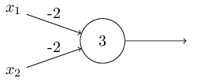
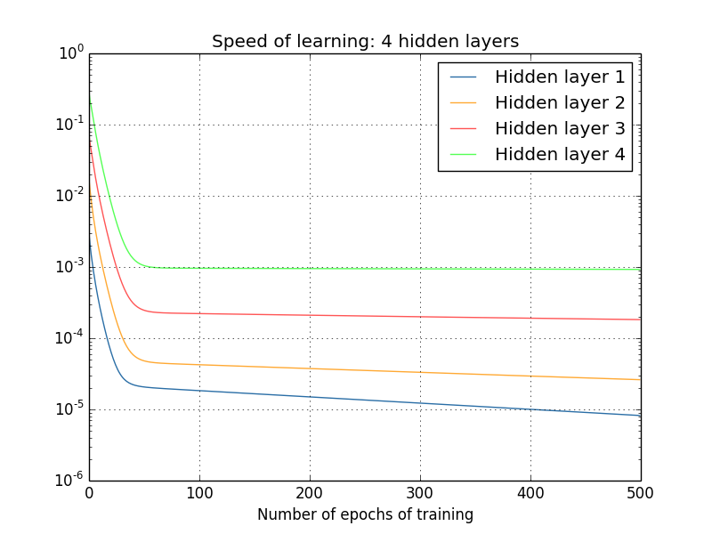
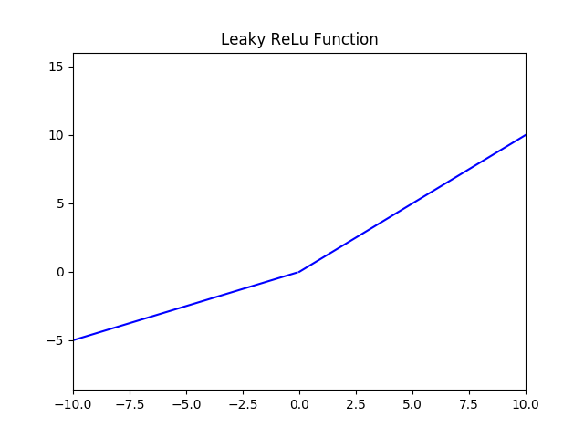
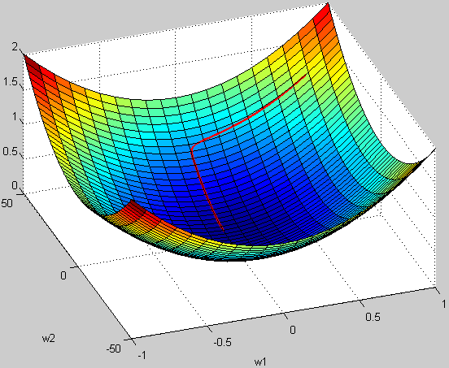

[TOC]

# 第三章 深度学习基础

## 3.1 基本概念

### 3.1.1 神经网络组成？

为了描述神经网络，我们先从最简单的神经网络说起。

**感知机**

简单的感知机如下图所示：


其输出为：

$$
output = \left\{
\begin{aligned}
0, \quad if \sum_i w_i x_i \le threshold \\
1, \quad if \sum_i w_i x_i > threshold
\end{aligned}
\right.
$$

假如把感知机想象成一个加权投票机制，比如 3 位评委给一个歌手打分，打分分别为 4 分、1 分、-3 分，这 3 位评分的权重分别是 1、3、2，则该歌手最终得分为  $ 4 * 1 + 1 * 3 + (-3) * 2 = 1 $。按照比赛规则，选取的 threshold 为 3，说明只有歌手的综合评分大于 3 时，才可顺利晋级。对照感知机，该选手被淘汰，因为

$$
\sum_i w_i x_i < threshold=3, output = 0
$$

用 $ -b $ 代替 threshold。输出变为：

$$
output = \left\{
\begin{aligned}
0, \quad if w \cdot x + b \le threshold \\
1, \quad if w \cdot x + b > threshold
\end{aligned}
\right.
$$

设置合适的 $ x $ 和 $ b $，一个简单的感知机单元的与非门表示如下：



当输入为 $ 0,1 $ 时，感知机输出为 $ 0 * (-2) + 1 * (-2) + 3 = 1 $。

复杂一些的感知机由简单的感知机单元组合而成：


**Sigmoid单元**

感知机单元的输出只有 0 和 1，实际情况中，更多的输出类别不止 0 和 1，而是 $ [0, 1] $ 上的概率值，这时候就需要 sigmoid 函数把任意实数映射到 $ [0, 1] $ 上。

神经元的输入

$$
z = \sum_i w_i x_i + b
$$

假设神经元的输出采用 sigmoid 激活函数

$$
\sigma(z) = \frac{1}{1+e^{-z}}
$$

sigmoid 激活函数图像如下图所示： 


全连接神经网络
即第 $ i $ 层的每个神经元和第 $ i-1 $ 层的每个神经元都有连接。


输出层可以不止有 1 个神经元。隐藏层可以只有 1 层，也可以有多层。输出层为多个神经元的神经网络例如下图：


### 3.1.2神经网络有哪些常用模型结构？

下表包含了大部分常用的模型(https://blog.csdn.net/nicholas_liu2017/article/details/73694666)


### 3.1.3如何选择深度学习开发平台？

现有的深度学习开源平台主要有 Caffe, Torch, MXNet, CNTK, Theano, TensorFlow, Keras 等。那如何选择一个适合自己的平台呢，下面列出一些衡量做参考。

**参考1：与现有编程平台、技能整合的难易程度**

主要是前期积累的开发经验和资源，比如编程语言，前期数据集存储格式等。

**参考2: 与相关机器学习、数据处理生态整合的紧密程度**

深度学习研究离不开各种数据处理、可视化、统计推断等软件包。考虑建模之前，是否具有方便的数据预处理工具？建模之后，是否具有方便的工具进行可视化、统计推断、数据分析？  

**参考3：对数据量及硬件的要求和支持**

深度学习在不同应用场景的数据量是不一样的，这也就导致我们可能需要考虑分布式计算、多 GPU 计算的问题。例如，对计算机图像处理研究的人员往往需要将图像文件和计算任务分部到多台计算机节点上进行执行。当下每个深度学习平台都在快速发展，每个平台对分布式计算等场景的支持也在不断演进。

**参考4：深度学习平台的成熟程度**

成熟程度的考量是一个比较主观的考量因素，这些因素可包括：社区的活跃程度；是否容易和开发人员进行交流；当前应用的势头。

**参考5：平台利用是否多样性？**

有些平台是专门为深度学习研究和应用进行开发的，有些平台对分布式计算、GPU 等构架都有强大的优化，能否用这些平台/软件做其他事情？比如有些深度学习软件是可以用来求解二次型优化；有些深度学习平台很容易被扩展，被运用在强化学习的应用中。

### 3.1.4为什么使用深层表示

1. 深度神经网络的多层隐藏层中，前几层能学习一些低层次的简单特征，后几层能把前面简单的特征结合起来，去学习更加复杂的东西。比如刚开始检测到的是边缘信息，而后检测更为细节的信息。

2. 深层的网络隐藏单元数量相对较少，隐藏层数目较多，如果浅层的网络想要达到同样的计算结果则需要指数级增长的单元数量才能达到。

### 3.1.5为什么深层神经网络难以训练？
https://blog.csdn.net/BinChasing/article/details/50300069
http://mini.eastday.com/mobile/180116023302833.html
《Why is it hard to train deep neural networks? Degeneracy, not vanishing gradients, is the key》

1. 梯度消失
    梯度消失是指通过隐藏层从后向前看，梯度会变的越来越小，说明前面层的学习会显著慢于后面层的学习，所以学习会卡住，除非梯度变大。下图是不同隐含层的学习速率；



2. 梯度爆炸；

3. 权重矩阵的退化导致模型的有效自由度减少。参数空间中学习的退化速度减慢，导致减少了模型的有效维数，网络的可用自由度对学习中梯度范数的贡献不均衡，随着相乘矩阵的数量（即网络深度）的增加，矩阵的乘积变得越来越退化；

在有硬饱和边界的非线性网络中（例如 ReLU 网络），随着深度增加，退化过程会变得越来越快。Duvenaud 等人 2014 年的论文里展示了关于该退化过程的可视化：


随着深度的增加，输入空间（左上角所示）会在输入空间中的每个点处被扭曲成越来越细的单丝，只有一个与细丝正交的方向影响网络的响应。沿着这个方向，网络实际上对变化变得非常敏感。

### 3.1.6 深度学习和机器学习有什么不同

机器学习：利用计算机、概率论、统计学等知识，输入数据，让计算机学会新知识。机器学习的过程，就是通过训练数据寻找目标函数。

深度学习是机器学习的一种，现在深度学习比较火爆。在传统机器学习中，手工设计特征对学习效果很重要，但是特征工程非常繁琐。而深度学习能够从大数据中自动学习特征，这也是深度学习在大数据时代受欢迎的一大原因。


## 3.2 网络操作与计算

### 3.2.1前向传播与反向传播？

https://blog.csdn.net/lhanchao/article/details/51419150

在神经网络的计算中，主要由前向传播(foward propagation，FP)和反向传播(backward propagation，BP)。

**前向传播**


假设上一层结点 $ i,j,k,... $ 等一些结点与本层的结点 $ w $ 有连接，那么结点 $ w $ 的值怎么算呢？就是通过上一层的 $ i,j,k,... $ 等结点以及对应的连接权值进行加权和运算，最终结果再加上一个偏置项（图中为了简单省略了），最后在通过一个非线性函数（即激活函数），如 ReLu，sigmoid 等函数，最后得到的结果就是本层结点 $ w $ 的输出。 

最终不断的通过这种方法一层层的运算，得到输出层结果。

**反向传播**


由于我们前向传播最终得到的结果，以分类为例，最终总是有误差的，那么怎么减少误差呢，当前应用广泛的一个算法就是梯度下降算法，但是求梯度就要求偏导数，下面以图中字母为例讲解一下：

设最终中误差为 $ E $，对于输出那么 $ E $ 对于输出节点 $ y_l $ 的偏导数是 $ y_l - t_l $，其中 $ t_l $ 是真实值，$ \frac{\partial y_l}{\partial z_l} $ 是指上面提到的激活函数，$ z_l $ 是上面提到的加权和，那么这一层的 $ E $ 对于 $ z_l $ 的偏导数为 $ \frac{\partial E}{\partial z_l} = \frac{\partial E}{\partial y_l} \frac{\partial y_l}{\partial z_l} $。同理，下一层也是这么计算，只不过 $ \frac{\partial E}{\partial y_k} $ 计算方法变了，一直反向传播到输入层，最后有 $ \frac{\partial E}{\partial x_i} = \frac{\partial E}{\partial y_j} \frac{\partial y_j}{\partial z_j} $，且 $ \frac{\partial z_j}{\partial x_i} = w_i j $。然后调整这些过程中的权值，再不断进行前向传播和反向传播的过程，最终得到一个比较好的结果；


### 3.2.2如何计算神经网络的输出？

原文地址：https://www.zybuluo.com/hanbingtao/note/476663


如上图，输入层有三个节点，我们将其依次编号为 1、2、3；隐藏层的 4 个节点，编号依次为 4、5、6、7；最后输出层的两个节点编号为 8、9。比如，隐藏层的节点 4，它和输入层的三个节点 1、2、3 之间都有连接，其连接上的权重分别为是 $ w_{41}, w_{42}, w_{43} $。

为了计算节点 4 的输出值，我们必须先得到其所有上游节点（也就是节点 1、2、3）的输出值。节点 1、2、3 是输入层的节点，所以，他们的输出值就是输入向量本身。按照上图画出的对应关系，可以看到节点 1、2、3 的输出值分别是 $ x_1, x_2, x_3 $。

$$
a_4 = \sigma(w^T \cdot a) = \sigma(w_{41}x_4 + w_{42}x_2 + w_{43}a_3 + w_{4b})
$$

其中 $ w_{4b} $ 是节点 4 的偏置项

同样，我们可以继续计算出节点 5、6、7 的输出值 $ a_5, a_6, a_7 $。

计算输出层的节点 8 的输出值 $ y_1 $：

$$
y_1 = \sigma(w^T \cdot a) = \sigma(w_{84}a_4 + w_{85}a_5 + w_{86}a_6 + w_{87}a_7 + w_{8b})
$$

其中 $ w_{8b} $ 是节点 8 的偏置项。

同理，我们还可以计算出 $ y_2 $。这样输出层所有节点的输出值计算完毕，我们就得到了在输入向量 $ x_1, x_2, x_3, x_4 $ 时，神经网络的输出向量 $ y_1, y_2 $， 。这里我们也看到，输出向量的维度和输出层神经元个数相同。


### 3.2.3如何计算卷积神经网络输出值？

https://www.zybuluo.com/hanbingtao/note/485480

假设有一个 5\*5 的图像，使用一个 3\*3 的 filter 进行卷积，想得到一个 3\*3 的 Feature Map，如下所示：


$ x_{i,j} $ 表示图像第  $ i $ 行第 $ j $ 列元素。$ w_{m,n} $ 表示 filter 第 $ m $ 行第 $ n $ 列权重。 $ w_b $ 表示 filter 的偏置项。 表示 feature map 第 $ i $ 行第 $ j $ 列元素。 $ f $ 表示激活函数，这里以 relu 函数为例。

卷积计算公式如下：

$$
a_{i,j} = f(\sum_{m=0}^2 \sum_{n=0}^2 w_{m,n} x_{i+m, j+n} + w_b )
$$

当步长为 1 时，计算 feature map 元素 $ a_{0,0} $ 如下：

$$
a_{0,0} = f(\sum_{m=0}^2 \sum_{n=0}^2 w_{m,n} x_{0+m, 0+n} + w_b )


= relu(w_{0,0} x_{0,0} + w_{0,1} x_{0,1} + w_{0,2} x_{0,2} + w_{1,0} x_{1,0} + w_{1,1} x_{1,1} + w_{1,2} x_{1,2} + w_{2,0} x_{2,0} + w_{2,1} x_{2,1} + w_{2,2} x_{2,2}) \\


= 1 + 0 + 1 + 0 + 1 + 0 + 0 + 0 + 1 \\


= 4
$$

结果如下：


其计算过程图示如下：


以此类推，计算出全部的 Feature Map。


当步幅为 2 时，Feature Map计算如下


注：图像大小、步幅和卷积后的 Feature Map 大小是有关系的。它们满足下面的关系：

$$
W_2 = (W_1 - F + 2P)/S + 1
H_2 = (H_1 - F + 2P)/S + 1
$$

其中 $ W_2 $， 是卷积后 Feature Map 的宽度；$ W_1 $ 是卷积前图像的宽度；$ F $ 是 filter 的宽度；$ P $ 是 Zero Padding 数量，Zero Padding 是指在原始图像周围补几圈 0，如果 P 的值是 1，那么就补 1 圈 0；S 是步幅；$ H_2 $ 卷积后 Feature Map 的高度；$ H_1 $ 是卷积前图像的宽度。

举例：假设图像宽度 $ W_1 = 5 $，filter 宽度 $ F=3 $，Zero Padding $ P=0 $，步幅 $ S=2 $，$ Z $ 则

$$
W_2 = (W_1 - F + 2P)/S + 1

= (5-3+0)/2 + 1

= 2
$$

说明 Feature Map 宽度是 2。同样，我们也可以计算出 Feature Map 高度也是 2。

如果卷积前的图像深度为 $ D $，那么相应的 filter 的深度也必须为 $ D $。深度大于 1 的卷积计算公式：

$$
a_{i,j} = f(\sum_{d=0}^{D-1} \sum_{m=0}^{F-1} \sum_{n=0}^{F-1} w_{d,m,n} x_{d,i+m,j+n} + w_b)
$$

其中，$ D $ 是深度；$ F $ 是 filter 的大小；$ w_{d,m,n} $ 表示 filter 的第 $ d $ 层第 $ m $ 行第 $ n $ 列权重；$ a_{d,i,j} $ 表示 feature map 的第 $ d $ 层第 $ i $ 行第 $ j $ 列像素；其它的符号含义前面相同，不再赘述。

每个卷积层可以有多个 filter。每个 filter 和原始图像进行卷积后，都可以得到一个 Feature Map。卷积后 Feature Map 的深度(个数)和卷积层的 filter 个数是相同的。下面的图示显示了包含两个 filter 的卷积层的计算。7\*7\*3 输入，经过两个 3\*3\*3 filter 的卷积(步幅为 2)，得到了 3\*3\*2 的输出。图中的 Zero padding 是 1，也就是在输入元素的周围补了一圈 0。Zero padding 对于图像边缘部分的特征提取是很有帮助的。


以上就是卷积层的计算方法。这里面体现了局部连接和权值共享：每层神经元只和上一层部分神经元相连(卷积计算规则)，且 filter 的权值对于上一层所有神经元都是一样的。对于包含两个 $ 3 * 3 * 3 $ 的 fitler 的卷积层来说，其参数数量仅有 $ (3 * 3 * 3+1) * 2 = 56 $ 个，且参数数量与上一层神经元个数无关。与全连接神经网络相比，其参数数量大大减少了。


### 3.2.4 如何计算 Pooling 层输出值输出值？

Pooling 层主要的作用是下采样，通过去掉 Feature Map 中不重要的样本，进一步减少参数数量。Pooling 的方法很多，最常用的是 Max Pooling。Max Pooling 实际上就是在 n\*n 的样本中取最大值，作为采样后的样本值。下图是 2\*2 max pooling：


除了 Max Pooing 之外，常用的还有 Mean Pooling ——取各样本的平均值。
对于深度为 $ D $ 的 Feature Map，各层独立做 Pooling，因此 Pooling 后的深度仍然为 $ D $。

### 3.2.5 实例理解反向传播

http://www.cnblogs.com/charlotte77/p/5629865.html

一个典型的三层神经网络如下所示：


其中 Layer $ L_1 $ 是输入层，Layer $ L_2 $ 是隐含层，Layer $ L_3 $ 是输出层。

假设输入数据集为 $ D={x_1, x_2, ..., x_n} $，输出数据集为 $ y_1, y_2, ..., y_n $。

如果输入和输出是一样，即为自编码模型。如果原始数据经过映射，会得到不同与输入的输出。

假设有如下的网络层：


输入层包含神经元 $ i_1, i_2 $，偏置 $ b_1 $；隐含层包含神经元 $ h_1, h_2 $，偏置 $ b_2 $，输出层为  $ o_1, o_2 $，$ w_i $ 为层与层之间连接的权重，激活函数为 sigmoid 函数。对以上参数取初始值，如下图所示：


其中：

- 输入数据 $ i1=0.05, i2 = 0.10 $
- 输出数据 $ o1=0.01, o2=0.99 $;
- 初始权重 $ w1=0.15, w2=0.20, w3=0.25,w4=0.30, w5=0.40, w6=0.45, w7=0.50, w8=0.55 $
- 目标：给出输入数据 $ i1,i2 $ (0.05和0.10)，使输出尽可能与原始输出 $ o1,o2 $，(0.01和0.99)接近。

**前向传播**

1. 输入层 --> 输出层

计算神经元 $ h1 $ 的输入加权和：

$$
net_{h1} = w_1 * i_1 + w_2 * i_2 + b_1 * 1

net_{h1} = 0.15 * 0.05 + 0.2 * 0.1 + 0.35 * 1 = 0.3775
$$

神经元 $ h1 $ 的输出 $ o1 $ ：（此处用到激活函数为 sigmoid 函数）：

$$
out_{h1} = \frac{1}{1 + e^{-net_{h1}}} = \frac{1}{1 + e^{-0.3775}} = 0.593269992
$$

同理，可计算出神经元 $ h2 $ 的输出 $ o1 $：

$$
out_{h2} = 0.596884378
$$


2. 隐含层-->输出层：  　　

计算输出层神经元 $ o1 $ 和 $ o2 $ 的值：

$$
net_{o1} = w_5 * out_{h1} + w_6 * out_{h2} + b_2 * 1

net_{o1} = 0.4 * 0.593269992 + 0.45 * 0.596884378 + 0.6 * 1 = 1.105905967

out_{o1} = \frac{1}{1 + e^{-net_{o1}}} = \frac{1}{1 + e^{1.105905967}} = 0.75136079
$$

这样前向传播的过程就结束了，我们得到输出值为 $ [0.75136079 , 0.772928465] $，与实际值 $ [0.01 , 0.99] $ 相差还很远，现在我们对误差进行反向传播，更新权值，重新计算输出。

**反向传播 **

1. 计算总误差

总误差：(square error)

$$
E_{total} = \sum \frac{1}{2}(target - output)^2
$$

但是有两个输出，所以分别计算 $ o1 $ 和 $ o2 $ 的误差，总误差为两者之和：

$$
E_{o1} = \frac{1}{2}(target_{o1} - out_{o1})^2 
= \frac{1}{2}(0.01 - 0.75136507)^2 = 0.274811083

E_{o2} = 0.023560026

E_{total} = E_{o1} + E_{o2} = 0.274811083 + 0.023560026 = 0.298371109
$$


2.	隐含层 --> 输出层的权值更新：

以权重参数 $ w5 $ 为例，如果我们想知道 $ w5 $ 对整体误差产生了多少影响，可以用整体误差对 $ w5 $ 求偏导求出：（链式法则）

$$
\frac{\partial E_{total}}{\partial w5} = \frac{\partial E_{total}}{\partial out_{o1}} * \frac{\partial out_{o1}}{\partial net_{o1}} * \frac{\partial net_{o1}}{\partial w5}
$$

下面的图可以更直观的看清楚误差是怎样反向传播的：


来源：[一文弄懂神经网络中的反向传播法——BackPropagation](http://www.cnblogs.com/charlotte77/p/5629865.html)

### 3.2.6 了解神经网络知识的读者可能会有一个疑问，具有一个隐藏层的人工神经网络已经非常强大了，理论上来说，只要神经元足够多，构成一个很“宽”的网络，它就可以拟合任意的函数，那为什么还要更“深”呢？（贡献者：黄钦建－华南理工大学）

原因在于：在神经元数量相同的情况下，深层网络结构具有更大的容量，分层组合带来的是指数级的表达空间，能够组合成更多不同类型的子结构，这样可以更容易地学习和表示各种特征。并且，隐藏层增加则意味着由激活函数带来的非线性变换的嵌套层数更多，就能构造更复杂的映射关系。


## 3.3 超参数

### 3.3.1 什么是超参数？

超参数:比如算法中的 learning rate （学习率）、iterations (梯度下降法循环的数量)、（隐藏层数目）、（隐藏层单元数目）、choice of activation function（激活函数的选择）都需要根据实际情况来设置，这些数字实际上控制了最后的参数和的值，所以它们被称作超参数。

### 3.3.2 如何寻找超参数的最优值？

在使用机器学习算法时，总有一些难搞的超参数。例如权重衰减大小，高斯核宽度等等。算法不会设置这些参数，而是需要你去设置它们的值。设置的值对结果产生较大影响。常见设置超参数的做法有：

1. 猜测和检查：根据经验或直觉，选择参数，一直迭代。
2. 网格搜索：让计算机尝试在一定范围内均匀分布的一组值。
3. 随机搜索：让计算机随机挑选一组值。
4. 贝叶斯优化：使用贝叶斯优化超参数，会遇到贝叶斯优化算法本身就需要很多的参数的困难。
5. 在良好初始猜测的前提下进行局部优化：这就是 MITIE 的方法，它使用 BOBYQA 算法，并有一个精心选择的起始点。由于 BOBYQA 只寻找最近的局部最优解，所以这个方法是否成功很大程度上取决于是否有一个好的起点。在 MITIE 的情况下，我们知道一个好的起点，但这不是一个普遍的解决方案，因为通常你不会知道好的起点在哪里。从好的方面来说，这种方法非常适合寻找局部最优解。稍后我会再讨论这一点。
6. 最新提出的 LIPO 的全局优化方法。这个方法没有参数，而且经验证比随机搜索方法好。

### 3.3.3 超参数搜索一般过程？

超参数搜索一般过程：
1. 将数据集划分成训练集、验证集及测试集。
2. 在训练集上根据模型的性能指标对模型参数进行优化。
3. 在验证集上根据模型的性能指标对模型的超参数进行搜索。
4. 步骤 2 和步骤 3 交替迭代，最终确定模型的参数和超参数，在测试集中验证评价模型的优劣。

其中，搜索过程需要搜索算法，一般有：网格搜索、随机搜过、启发式智能搜索、贝叶斯搜索。

## 3.4 激活函数

### 3.4.1 为什么需要非线性激活函数？

**为什么需要激活函数？**

1. 激活函数对模型学习、理解非常复杂和非线性的函数具有重要作用。
2. 激活函数可以引入非线性因素。如果不使用激活函数，则输出信号仅是一个简单的线性函数。线性函数一个一级多项式，线性方程的复杂度有限，从数据中学习复杂函数映射的能力很小。没有激活函数，神经网络将无法学习和模拟其他复杂类型的数据，例如图像、视频、音频、语音等。
3. 激活函数可以把当前特征空间通过一定的线性映射转换到另一个空间，让数据能够更好的被分类。

**为什么激活函数需要非线性函数？**

1. 假若网络中全部是线性部件，那么线性的组合还是线性，与单独一个线性分类器无异。这样就做不到用非线性来逼近任意函数。
2. 使用非线性激活函数 ，以便使网络更加强大，增加它的能力，使它可以学习复杂的事物，复杂的表单数据，以及表示输入输出之间非线性的复杂的任意函数映射。使用非线性激活函数，能够从输入输出之间生成非线性映射。

### 3.4.2 常见的激活函数及图像

1. sigmoid 激活函数

函数的定义为：$ f(x) = \frac{1}{1 + e^{-x}} $，其值域为 $ (0,1) $。

函数图像如下：


2. tanh激活函数

函数的定义为：$ f(x) = tanh(x) = \frac{e^x - e^{-x}}{e^x + e^{-x}} $，值域为 $ (-1,1) $。

函数图像如下：


3. Relu激活函数

函数的定义为：$ f(x) = max(0, x) $  ，值域为 $ [0,+∞) $；

函数图像如下：


4. Leak Relu 激活函数 

函数定义为： $ f(x) =  \left\{
\begin{aligned}
ax, \quad x<0 \\
x, \quad x>0
\end{aligned}
\right. $，值域为 $ (-∞,+∞) $。 

图像如下（$ a = 0.5 $）：



5. SoftPlus 激活函数

函数的定义为：$ f(x) = ln( 1 + e^x) $，值域为 $ (0,+∞) $。

函数图像如下:


6. softmax 函数

函数定义为： $ \sigma(z)_j = \frac{e^{z_j}}{\sum_{k=1}^K e^{z_k}} $。

Softmax 多用于多分类神经网络输出。

### 3.4.3 常见激活函数的导数计算？

对常见激活函数，导数计算如下：


### 3.4.4 激活函数有哪些性质？

1. 非线性： 当激活函数是线性的，一个两层的神经网络就可以基本上逼近所有的函数。但如果激活函数是恒等激活函数的时候，即 $ f(x)=x $，就不满足这个性质，而且如果 MLP 使用的是恒等激活函数，那么其实整个网络跟单层神经网络是等价的；
2. 可微性： 当优化方法是基于梯度的时候，就体现了该性质；
3. 单调性： 当激活函数是单调的时候，单层网络能够保证是凸函数；
4. $ f(x)≈x $： 当激活函数满足这个性质的时候，如果参数的初始化是随机的较小值，那么神经网络的训练将会很高效；如果不满足这个性质，那么就需要详细地去设置初始值；
5. 输出值的范围： 当激活函数输出值是有限的时候，基于梯度的优化方法会更加稳定，因为特征的表示受有限权值的影响更显著；当激活函数的输出是无限的时候，模型的训练会更加高效，不过在这种情况小，一般需要更小的 Learning Rate。

### 3.4.5 如何选择激活函数？

选择一个适合的激活函数并不容易，需要考虑很多因素，通常的做法是，如果不确定哪一个激活函数效果更好，可以把它们都试试，然后在验证集或者测试集上进行评价。然后看哪一种表现的更好，就去使用它。

以下是常见的选择情况：

1. 如果输出是 0、1 值（二分类问题），则输出层选择 sigmoid 函数，然后其它的所有单元都选择 Relu 函数。
2. 如果在隐藏层上不确定使用哪个激活函数，那么通常会使用 Relu 激活函数。有时，也会使用 tanh 激活函数，但 Relu 的一个优点是：当是负值的时候，导数等于 0。
3. sigmoid 激活函数：除了输出层是一个二分类问题基本不会用它。
4. tanh 激活函数：tanh 是非常优秀的，几乎适合所有场合。
5. ReLu 激活函数：最常用的默认函数，如果不确定用哪个激活函数，就使用 ReLu 或者 Leaky ReLu，再去尝试其他的激活函数。
6. 如果遇到了一些死的神经元，我们可以使用 Leaky ReLU 函数。

### 3.4.6 使用 ReLu 激活函数的优点？

1. 在区间变动很大的情况下，ReLu 激活函数的导数或者激活函数的斜率都会远大于 0，在程序实现就是一个 if-else 语句，而 sigmoid 函数需要进行浮点四则运算，在实践中，使用 ReLu 激活函数神经网络通常会比使用 sigmoid 或者 tanh 激活函数学习的更快。
2. sigmoid 和 tanh 函数的导数在正负饱和区的梯度都会接近于 0，这会造成梯度弥散，而 Relu 和Leaky ReLu 函数大于 0 部分都为常数，不会产生梯度弥散现象。
3. 需注意，Relu 进入负半区的时候，梯度为 0，神经元此时不会训练，产生所谓的稀疏性，而 Leaky ReLu 不会产生这个问题。

### 3.4.7什么时候可以用线性激活函数？

1. 输出层，大多使用线性激活函数。
2. 在隐含层可能会使用一些线性激活函数。
3. 一般用到的线性激活函数很少。

### 3.4.8 怎样理解 Relu（< 0 时）是非线性激活函数？

Relu 激活函数图像如下：


根据图像可看出具有如下特点：

1. 单侧抑制；
2. 相对宽阔的兴奋边界；
3. 稀疏激活性；

ReLU 函数从图像上看，是一个分段线性函数，把所有的负值都变为 0，而正值不变，这样就成为单侧抑制。

因为有了这单侧抑制，才使得神经网络中的神经元也具有了稀疏激活性。

**稀疏激活性**：从信号方面来看，即神经元同时只对输入信号的少部分选择性响应，大量信号被刻意的屏蔽了，这样可以提高学习的精度，更好更快地提取稀疏特征。当 $ x<0 $ 时，ReLU 硬饱和，而当 $ x>0 $ 时，则不存在饱和问题。ReLU 能够在 $ x>0 $ 时保持梯度不衰减，从而缓解梯度消失问题。

### 3.4.9 Softmax 函数如何应用于多分类？

softmax 用于多分类过程中，它将多个神经元的输出，映射到 $ (0,1) $ 区间内，可以看成概率来理解，从而来进行多分类！

假设我们有一个数组，$ V_i $ 表示 $ V $  中的第 $ i $ 个元素，那么这个元素的 softmax 值就是

$$
S_i = \frac{e^{V_i}}{\sum_j e^{V_j}}
$$

从下图看，神经网络中包含了输入层，然后通过两个特征层处理，最后通过 softmax 分析器就能得到不同条件下的概率，这里需要分成三个类别，最终会得到 $ y=0, y=1, y=2 $ 的概率值。


继续看下面的图，三个输入通过 softmax 后得到一个数组 $ [0.05 , 0.10 , 0.85] $，这就是 soft 的功能。


更形象的映射过程如下图所示：


softmax 直白来说就是将原来输出是 $ 3,1,-3 $ 通过 softmax 函数一作用，就映射成为 $ (0,1) $ 的值，而这些值的累和为 $ 1 $（满足概率的性质），那么我们就可以将它理解成概率，在最后选取输出结点的时候，我们就可以选取概率最大（也就是值对应最大的）结点，作为我们的预测目标！

### 3.4.10 交叉熵代价函数定义及其求导推导。（贡献者：黄钦建－华南理工大学）


神经元的输出就是 a = σ(z)，其中$z=\sum w_{j}i_{j}+b$是输⼊的带权和。

$C=-\frac{1}{n}\sum[ylna+(1-y)ln(1-a)]$

其中 n 是训练数据的总数，求和是在所有的训练输⼊ x 上进⾏的， y 是对应的⽬标输出。

表达式是否解决学习缓慢的问题并不明显。实际上，甚⾄将这个定义看做是代价函数也不是显⽽易⻅的！在解决学习缓慢前，我们来看看交叉熵为何能够解释成⼀个代价函数。

将交叉熵看做是代价函数有两点原因。

第⼀，它是⾮负的， C > 0。可以看出：式子中的求和中的所有独⽴的项都是负数的，因为对数函数的定义域是 (0，1)，并且求和前⾯有⼀个负号，所以结果是非负。

第⼆，如果对于所有的训练输⼊ x，神经元实际的输出接近⽬标值，那么交叉熵将接近 0。

假设在这个例⼦中， y = 0 ⽽ a ≈ 0。这是我们想到得到的结果。我们看到公式中第⼀个项就消去了，因为 y = 0，⽽第⼆项实际上就是 − ln(1 − a) ≈ 0。反之， y = 1 ⽽ a ≈ 1。所以在实际输出和⽬标输出之间的差距越⼩，最终的交叉熵的值就越低了。（这里假设输出结果不是0，就是1，实际分类也是这样的）

综上所述，交叉熵是⾮负的，在神经元达到很好的正确率的时候会接近 0。这些其实就是我们想要的代价函数的特性。其实这些特性也是⼆次代价函数具备的。所以，交叉熵就是很好的选择了。但是交叉熵代价函数有⼀个⽐⼆次代价函数更好的特性就是它避免了学习速度下降的问题。为了弄清楚这个情况，我们来算算交叉熵函数关于权重的偏导数。我们将$a={\varsigma}(z)$代⼊到 公式中应⽤两次链式法则，得到：

$\begin{eqnarray}\frac{\partial C}{\partial w_{j}}&=&-\frac{1}{n}\sum \frac{\partial }{\partial w_{j}}[ylna+(1-y)ln(1-a)]\\&=&-\frac{1}{n}\sum \frac{\partial }{\partial a}[ylna+(1-y)ln(1-a)]*\frac{\partial a}{\partial w_{j}}\\&=&-\frac{1}{n}\sum (\frac{y}{a}-\frac{1-y}{1-a})*\frac{\partial a}{\partial w_{j}}\\&=&-\frac{1}{n}\sum (\frac{y}{\varsigma(z)}-\frac{1-y}{1-\varsigma(z)})\frac{\partial \varsigma(z)}{\partial w_{j}}\\&=&-\frac{1}{n}\sum (\frac{y}{\varsigma(z)}-\frac{1-y}{1-\varsigma(z)}){\varsigma}'(z)x_{j}\end{eqnarray}$

根据$\varsigma(z)=\frac{1}{1+e^{-z}}$ 的定义，和⼀些运算，我们可以得到 ${\varsigma}'(z)=\varsigma(z)(1-\varsigma(z))$。化简后可得：

$\frac{\partial C}{\partial w_{j}}=\frac{1}{n}\sum x_{j}({\varsigma}(z)-y)$

这是⼀个优美的公式。它告诉我们权重学习的速度受到$\varsigma(z)-y$，也就是输出中的误差的控制。更⼤的误差，更快的学习速度。这是我们直觉上期待的结果。特别地，这个代价函数还避免了像在⼆次代价函数中类似⽅程中${\varsigma}'(z)$导致的学习缓慢。当我们使⽤交叉熵的时候，${\varsigma}'(z)$被约掉了，所以我们不再需要关⼼它是不是变得很⼩。这种约除就是交叉熵带来的特效。实际上，这也并不是⾮常奇迹的事情。我们在后⾯可以看到，交叉熵其实只是满⾜这种特性的⼀种选择罢了。

根据类似的⽅法，我们可以计算出关于偏置的偏导数。我这⾥不再给出详细的过程，你可以轻易验证得到：

$\frac{\partial C}{\partial b}=\frac{1}{n}\sum ({\varsigma}(z)-y)$


再⼀次, 这避免了⼆次代价函数中类似${\varsigma}'(z)$项导致的学习缓慢。

### 3.4.11 为什么Tanh收敛速度比Sigmoid快？（贡献者：黄钦建－华南理工大学）

`$tanh^{,}(x)=1-tanh(x)^{2}\in (0,1)$`

`$s^{,}(x)=s(x)*(1-s(x))\in (0,\frac{1}{4}]$`

由上面两个公式可知tanh(x)梯度消失的问题比sigmoid轻，所以Tanh收敛速度比Sigmoid快。

## 3.5 Batch_Size

### 3.5.1 为什么需要 Batch_Size？

Batch 的选择，首先决定的是下降的方向。

如果数据集比较小，可采用全数据集的形式，好处是：

1. 由全数据集确定的方向能够更好地代表样本总体，从而更准确地朝向极值所在的方向。
2. 由于不同权重的梯度值差别巨大，因此选取一个全局的学习率很困难。 Full Batch Learning 可以使用 Rprop 只基于梯度符号并且针对性单独更新各权值。

对于更大的数据集，采用全数据集的形式，坏处是：
1. 随着数据集的海量增长和内存限制，一次性载入所有的数据进来变得越来越不可行。
2. 以 Rprop 的方式迭代，会由于各个 Batch 之间的采样差异性，各次梯度修正值相互抵消，无法修正。这才有了后来 RMSProp 的妥协方案。 

### 3.5.2 Batch_Size 值的选择

假如每次只训练一个样本，即 Batch_Size = 1。线性神经元在均方误差代价函数的错误面是一个抛物面，横截面是椭圆。对于多层神经元、非线性网络，在局部依然近似是抛物面。此时，每次修正方向以各自样本的梯度方向修正，横冲直撞各自为政，难以达到收敛。

既然 Batch_Size 为全数据集或者 Batch_Size = 1 都有各自缺点，可不可以选择一个适中的 Batch_Size 值呢？

此时，可采用批梯度下降法（Mini-batches Learning）。因为如果数据集足够充分，那么用一半（甚至少得多）的数据训练算出来的梯度与用全部数据训练出来的梯度是几乎一样的。

### 3.5.3 在合理范围内，增大 Batch_Size 有何好处？

1. 内存利用率提高了，大矩阵乘法的并行化效率提高。
2. 跑完一次 epoch（全数据集）所需的迭代次数减少，对于相同数据量的处理速度进一步加快。
3. 在一定范围内，一般来说 Batch_Size 越大，其确定的下降方向越准，引起训练震荡越小。

### 3.5.4 盲目增大 Batch_Size 有何坏处？

1. 内存利用率提高了，但是内存容量可能撑不住了。
2. 跑完一次 epoch（全数据集）所需的迭代次数减少，要想达到相同的精度，其所花费的时间大大增加了，从而对参数的修正也就显得更加缓慢。
3. Batch_Size 增大到一定程度，其确定的下降方向已经基本不再变化。

### 3.5.5 调节 Batch_Size 对训练效果影响到底如何？

1. Batch_Size 太小，可能导致算法不收敛。
2. 随着 Batch_Size 增大，处理相同数据量的速度越快。
3. 随着 Batch_Size 增大，达到相同精度所需要的 epoch 数量越来越多。
4. 由于上述两种因素的矛盾， Batch_Size 增大到某个时候，达到时间上的最优。
5. 由于最终收敛精度会陷入不同的局部极值，因此 Batch_Size 增大到某些时候，达到最终收敛精度上的最优。 

## 3.6 归一化

### 3.6.1 归一化含义？

归一化的具体作用是归纳统一样本的统计分布性。归一化在 $ 0-1$ 之间是统计的概率分布，归一化在$ -1--+1$ 之间是统计的坐标分布。归一化有同一、统一和合一的意思。无论是为了建模还是为了计算，首先基本度量单位要同一，神经网络是以样本在事件中的统计分别几率来进行训练（概率计算）和预测的，且 sigmoid 函数的取值是 0 到 1 之间的，网络最后一个节点的输出也是如此，所以经常要对样本的输出归一化处理。归一化是统一在 $ 0-1 $ 之间的统计概率分布，当所有样本的输入信号都为正值时，与第一隐含层神经元相连的权值只能同时增加或减小，从而导致学习速度很慢。另外在数据中常存在奇异样本数据，奇异样本数据存在所引起的网络训练时间增加，并可能引起网络无法收敛。为了避免出现这种情况及后面数据处理的方便，加快网络学习速度，可以对输入信号进行归一化，使得所有样本的输入信号其均值接近于 0 或与其均方差相比很小。

### 3.6.2 为什么要归一化？

1. 为了后面数据处理的方便，归一化的确可以避免一些不必要的数值问题。
2. 为了程序运行时收敛加快。 下面图解。
3. 同一量纲。样本数据的评价标准不一样，需要对其量纲化，统一评价标准。这算是应用层面的需求。
4. 避免神经元饱和。啥意思？就是当神经元的激活在接近 0 或者 1 时会饱和，在这些区域，梯度几乎为 0，这样，在反向传播过程中，局部梯度就会接近 0，这会有效地“杀死”梯度。
5. 保证输出数据中数值小的不被吞食。 

### 3.6.3 为什么归一化能提高求解最优解速度？


上图是代表数据是否均一化的最优解寻解过程（圆圈可以理解为等高线）。左图表示未经归一化操作的寻解过程，右图表示经过归一化后的寻解过程。

当使用梯度下降法寻求最优解时，很有可能走“之字型”路线（垂直等高线走），从而导致需要迭代很多次才能收敛；而右图对两个原始特征进行了归一化，其对应的等高线显得很圆，在梯度下降进行求解时能较快的收敛。

因此如果机器学习模型使用梯度下降法求最优解时，归一化往往非常有必要，否则很难收敛甚至不能收敛。

### 3.6.4 3D 图解未归一化

例子：

假设 $ w1 $ 的范围在 $ [-10, 10] $，而 $ w2 $ 的范围在 $ [-100, 100] $，梯度每次都前进 1 单位，那么在 $ w1 $ 方向上每次相当于前进了 $ 1/20 $，而在 $ w2 $ 上只相当于 $ 1/200 $！某种意义上来说，在 $ w2 $ 上前进的步长更小一些,而 $ w1 $ 在搜索过程中会比 $ w2 $ “走”得更快。

这样会导致，在搜索过程中更偏向于 $ w1 $ 的方向。走出了“L”形状，或者成为“之”字形。



### 3.6.5 归一化有哪些类型？

1. 线性归一化

$$
x^{\prime} = \frac{x-min(x)}{max(x) - min(x)}
$$

适用范围：比较适用在数值比较集中的情况。

缺点：如果 max 和 min 不稳定，很容易使得归一化结果不稳定，使得后续使用效果也不稳定。

2. 标准差标准化

$$
x^{\prime} = \frac{x-\mu}{\sigma}
$$

含义：经过处理的数据符合标准正态分布，即均值为 0，标准差为 1 其中 $ \mu $ 为所有样本数据的均值，$ \sigma $ 为所有样本数据的标准差。

3. 非线性归一化

适用范围：经常用在数据分化比较大的场景，有些数值很大，有些很小。通过一些数学函数，将原始值进行映射。该方法包括 $ log $、指数，正切等。

### 3.6.6 局部响应归一化作用

LRN 是一种提高深度学习准确度的技术方法。LRN 一般是在激活、池化函数后的一种方法。

在 ALexNet 中，提出了 LRN 层，对局部神经元的活动创建竞争机制，使其中响应比较大对值变得相对更大，并抑制其他反馈较小的神经元，增强了模型的泛化能力。

### 3.6.7理解局部响应归一化公式

https://blog.csdn.net/yangdashi888/article/details/77918311

局部响应归一化原理是仿造生物学上活跃的神经元对相邻神经元的抑制现象（侧抑制），根据论文其公式如下：

$$
b_{x,y}^i = a_{x,y}^i / (k + \alpha \sum_{j=max(0, i-n/2)}^{min(N-1, i+n/2)}(a_{x,y}^j)^2 )^\beta
$$

其中，
1) $ a $：表示卷积层（包括卷积操作和池化操作）后的输出结果，是一个四维数组[batch,height,width,channel]。

- batch：批次数(每一批为一张图片)。
- height：图片高度。
- width：图片宽度。
- channel：通道数。可以理解成一批图片中的某一个图片经过卷积操作后输出的神经元个数，或理解为处理后的图片深度。

2) $ a_{x,y}^i $ 表示在这个输出结构中的一个位置 $ [a,b,c,d] $，可以理解成在某一张图中的某一个通道下的某个高度和某个宽度位置的点，即第 $ a $ 张图的第 $ d $ 个通道下的高度为b宽度为c的点。

3) $ N $：论文公式中的 $ N $ 表示通道数 (channel)。

4) $ a $，$ n/2 $， $ k $ 分别表示函数中的 input,depth_radius,bias。参数 $ k, n, \alpha, \beta $ 都是超参数，一般设置 $ k=2, n=5, \alpha=1*e-4, \beta=0.75 $

5) $ \sum $：$ \sum $ 叠加的方向是沿着通道方向的，即每个点值的平方和是沿着 $ a $ 中的第 3 维 channel 方向的，也就是一个点同方向的前面 $ n/2 $ 个通道（最小为第 $ 0 $ 个通道）和后 $ n/2 $ 个通道（最大为第 $ d-1 $ 个通道）的点的平方和(共 $ n+1 $ 个点)。而函数的英文注解中也说明了把 input 当成是 $ d $ 个 3 维的矩阵，说白了就是把 input 的通道数当作 3 维矩阵的个数，叠加的方向也是在通道方向。 

简单的示意图如下：


### 3.6.8 什么是批归一化（Batch Normalization）

以前在神经网络训练中，只是对输入层数据进行归一化处理，却没有在中间层进行归一化处理。要知道，虽然我们对输入数据进行了归一化处理，但是输入数据经过 $ \sigma(WX+b) $ 这样的矩阵乘法以及非线性运算之后，其数据分布很可能被改变，而随着深度网络的多层运算之后，数据分布的变化将越来越大。如果我们能在网络的中间也进行归一化处理，是否对网络的训练起到改进作用呢？答案是肯定的。 

这种在神经网络中间层也进行归一化处理，使训练效果更好的方法，就是批归一化Batch Normalization（BN）。

### 3.6.9 批归一化（BN）算法的优点

下面我们来说一下BN算法的优点： 
1. 减少了人为选择参数。在某些情况下可以取消 dropout 和 L2 正则项参数,或者采取更小的 L2 正则项约束参数； 
2. 减少了对学习率的要求。现在我们可以使用初始很大的学习率或者选择了较小的学习率，算法也能够快速训练收敛； 
3. 可以不再使用局部响应归一化。BN 本身就是归一化网络(局部响应归一化在 AlexNet 网络中存在) 
4. 破坏原来的数据分布，一定程度上缓解过拟合（防止每批训练中某一个样本经常被挑选到，文献说这个可以提高 1% 的精度）。 
5. 减少梯度消失，加快收敛速度，提高训练精度。

### 3.6.10 批归一化（BN）算法流程

下面给出 BN 算法在训练时的过程

输入：上一层输出结果 $ X = {x_1, x_2, ..., x_m} $，学习参数 $ \gamma, \beta $

算法流程：

1. 计算上一层输出数据的均值

$$
\mu_{\beta} = \frac{1}{m} \sum_{i=1}^m(x_i)
$$

其中，$ m $ 是此次训练样本 batch 的大小。

2. 计算上一层输出数据的标准差

$$
\sigma_{\beta}^2 = \frac{1}{m} \sum_{i=1}^m (x_i - \mu_{\beta})^2
$$

3. 归一化处理，得到

$$
\hat x_i = \frac{x_i + \mu_{\beta}}{\sqrt{\sigma_{\beta}^2} + \epsilon}
$$

其中 $ \epsilon $ 是为了避免分母为 0 而加进去的接近于 0 的很小值

4. 重构，对经过上面归一化处理得到的数据进行重构，得到

$$
y_i = \gamma \hat x_i + \beta
$$

其中，$ \gamma, \beta $ 为可学习参数。

注：上述是 BN 训练时的过程，但是当在投入使用时，往往只是输入一个样本，没有所谓的均值 $ \mu_{\beta} $ 和标准差 $ \sigma_{\beta}^2 $。此时，均值 $ \mu_{\beta} $ 是计算所有 batch $ \mu_{\beta} $ 值的平均值得到，标准差 $ \sigma_{\beta}^2 $ 采用每个batch $ \sigma_{\beta}^2 $  的无偏估计得到。

### 3.6.11 批归一化和群组归一化

批量归一化（Batch Normalization，以下简称 BN）是深度学习发展中的一项里程碑式技术，可让各种网络并行训练。但是，批量维度进行归一化会带来一些问题——批量统计估算不准确导致批量变小时，BN 的误差会迅速增加。在训练大型网络和将特征转移到计算机视觉任务中（包括检测、分割和视频），内存消耗限制了只能使用小批量的 BN。

何恺明团队http://tech.ifeng.com/a/20180324/44918599_0.shtml 提出群组归一化 Group Normalization (简称 GN) 作为 BN 的替代方案。

GN 将通道分成组，并在每组内计算归一化的均值和方差。GN 的计算与批量大小无关，并且其准确度在各种批量大小下都很稳定。在 ImageNet 上训练的 ResNet-50上，GN 使用批量大小为 2 时的错误率比 BN 的错误率低 10.6％ ;当使用典型的批量时，GN 与 BN 相当，并且优于其他标归一化变体。而且，GN 可以自然地从预训练迁移到微调。在进行 COCO 中的目标检测和分割以及 Kinetics 中的视频分类比赛中，GN 可以胜过其竞争对手，表明 GN 可以在各种任务中有效地取代强大的 BN。

### 3.6.12 Weight Normalization和Batch Normalization

https://www.zhihu.com/question/55132852/answer/171250929

Weight Normalization 和 Batch Normalization 都属于参数重写（Reparameterization）的方法，只是采用的方式不同，Weight Normalization 是对网络权值$  W $ 进行 normalization，因此也称为 Weight Normalization；Batch Normalization 是对网络某一层输入数据进行 normalization。Weight Normalization相比Batch Normalization有以下三点优势：

1. Weight Normalization 通过重写深度学习网络的权重W的方式来加速深度学习网络参数收敛，没有引入 minbatch 的依赖，适用于 RNN（LSTM）网络（Batch Normalization 不能直接用于RNN，进行 normalization 操作，原因在于：1) RNN 处理的 Sequence 是变长的；2) RNN 是基于 time step 计算，如果直接使用 Batch Normalization 处理，需要保存每个 time step 下，mini btach 的均值和方差，效率低且占内存）。

2. Batch Normalization 基于一个 mini batch 的数据计算均值和方差，而不是基于整个 Training set 来做，相当于进行梯度计算式引入噪声。因此，Batch Normalization 不适用于对噪声敏感的强化学习、生成模型（Generative model：GAN，VAE）使用。相反，Weight Normalization 对通过标量 $ g $ 和向量 $ v $ 对权重 $ W $ 进行重写，重写向量 $ v $ 是固定的，因此，基于 Weight Normalization 的 Normalization 可以看做比 Batch Normalization 引入更少的噪声。    

不需要额外的存储空间来保存 mini batch 的均值和方差，同时实现 Weight Normalization 时，对深度学习网络进行正向信号传播和反向梯度计算带来的额外计算开销也很小。因此，要比采用 Batch Normalization 进行 normalization 操作时，速度快。  但是 Weight Normalization 不具备 Batch Normalization 把网络每一层的输出 Y 固定在一个变化范围的作用。因此，采用 Weight Normalization 进行 Normalization 时需要特别注意参数初始值的选择。

### 3.6.13 Batch Normalization在什么时候用比较合适？（贡献者：黄钦建－华南理工大学）

在CNN中，BN应作用在非线性映射前。在神经网络训练时遇到收敛速度很慢，或梯度爆炸等无法训练的状况时可以尝试BN来解决。另外，在一般使用情况下也可以加入BN来加快训练速度，提高模型精度。

BN比较适用的场景是：每个mini-batch比较大，数据分布比较接近。在进行训练之前，要做好充分的shuffle，否则效果会差很多。另外，由于BN需要在运行过程中统计每个mini-batch的一阶统计量和二阶统计量，因此不适用于动态的网络结构和RNN网络。


## 3.7 预训练与微调(fine tuning)

### 3.7.1 为什么无监督预训练可以帮助深度学习？
http://blog.csdn.net/Richard_More/article/details/52334272?locationNum=3&fps=1

深度网络存在问题:

1. 网络越深，需要的训练样本数越多。若用监督则需大量标注样本，不然小规模样本容易造成过拟合。深层网络特征比较多，会出现的多特征问题主要有多样本问题、规则化问题、特征选择问题。

2. 多层神经网络参数优化是个高阶非凸优化问题，经常得到收敛较差的局部解；

3. 梯度扩散问题，BP算法计算出的梯度随着深度向前而显著下降，导致前面网络参数贡献很小，更新速度慢。

**解决方法：**

逐层贪婪训练，无监督预训练（unsupervised pre-training）即训练网络的第一个隐藏层，再训练第二个…最后用这些训练好的网络参数值作为整体网络参数的初始值。

经过预训练最终能得到比较好的局部最优解。

### 3.7.2 什么是模型微调f ine tuning

用别人的参数、修改后的网络和自己的数据进行训练，使得参数适应自己的数据，这样一个过程，通常称之为微调（fine tuning). 

**模型的微调举例说明：**

我们知道，CNN 在图像识别这一领域取得了巨大的进步。如果想将 CNN 应用到我们自己的数据集上，这时通常就会面临一个问题：通常我们的 dataset 都不会特别大，一般不会超过 1 万张，甚至更少，每一类图片只有几十或者十几张。这时候，直接应用这些数据训练一个网络的想法就不可行了，因为深度学习成功的一个关键性因素就是大量带标签数据组成的训练集。如果只利用手头上这点数据，即使我们利用非常好的网络结构，也达不到很高的 performance。这时候，fine-tuning 的思想就可以很好解决我们的问题：我们通过对 ImageNet 上训练出来的模型（如CaffeNet,VGGNet,ResNet) 进行微调，然后应用到我们自己的数据集上。

### 3.7.3 微调时候网络参数是否更新？

会更新。

1. finetune 的过程相当于继续训练，跟直接训练的区别是初始化的时候。 
2. 直接训练是按照网络定义指定的方式初始化。
3. finetune是用你已经有的参数文件来初始化。

### 3.7.4 fine-tuning 模型的三种状态

1. 状态一：只预测，不训练。
特点：相对快、简单，针对那些已经训练好，现在要实际对未知数据进行标注的项目，非常高效；

2. 状态二：训练，但只训练最后分类层。
特点：fine-tuning的模型最终的分类以及符合要求，现在只是在他们的基础上进行类别降维。

3. 状态三：完全训练，分类层+之前卷积层都训练
特点：跟状态二的差异很小，当然状态三比较耗时和需要训练GPU资源，不过非常适合fine-tuning到自己想要的模型里面，预测精度相比状态二也提高不少。

## 3.8 权重偏差初始化

### 3.8.1 全都初始化为 0

**偏差初始化陷阱**： 都初始化为 0。

**产生陷阱原因**：因为并不知道在训练神经网络中每一个权重最后的值，但是如果进行了恰当的数据归一化后，我们可以有理由认为有一半的权重是正的，另一半是负的。令所有权重都初始化为 0，如果神经网络计算出来的输出值是一样的，神经网络在进行反向传播算法计算出来的梯度值也一样，并且参数更新值也一样。更一般地说，如果权重初始化为同一个值，网络就是对称的。

**形象化理解**：在神经网络中考虑梯度下降的时候，设想你在爬山，但身处直线形的山谷中，两边是对称的山峰。由于对称性，你所在之处的梯度只能沿着山谷的方向，不会指向山峰；你走了一步之后，情况依然不变。结果就是你只能收敛到山谷中的一个极大值，而走不到山峰上去。

### 3.8.2 全都初始化为同样的值

https://www.sogou.com/link?url=DOb0bgH2eKh1ibpaMGjuy4w4Qi1IjSG_6RpEmkDiBkIm3Pojx-sH_HN0xCOfOYCza48YNThs5kk.

偏差初始化陷阱： 都初始化为一样的值。
以一个三层网络为例：
首先看下结构


它的表达式为： 

$$
a_1^{(2)} = f(W_{11}^{(1)} x_1 + W_{12}^{(1)} x_2 + W_{13}^{(1)} x_3 + b_1^{(1)})

a_2^{(2)} = f(W_{21}^{(1)} x_1 + W_{22}^{(1)} x_2 + W_{23}^{(1)} x_3 + b_2^{(1)})

a_3^{(2)} = f(W_{31}^{(1)} x_1 + W_{32}^{(1)} x_2 + W_{33}^{(1)} x_3 + b_3^{(1)})

h_{W,b}(x) = a_1^{(3)} = f(W_{11}^{(2)} a_1^{(2)} + W_{12}^{(2)} a_2^{(2)} + W_{13}^{(2)} a_3^{(2)} + b_1^{(2)})
$$

如果每个权重都一样，那么在多层网络中，从第二层开始，每一层的输入值都是相同的了也就是$ a1=a2=a3=.... $，既然都一样，就相当于一个输入了，为啥呢？？

如果是反向传递算法（如果这里不明白请看上面的连接），其中的偏置项和权重项的迭代的偏导数计算公式如下

$$
\frac{\partial}{\partial W_{ij}^{(l)}} J(W,b;x,y) = a_j^{(l)} \delta_i^{(l+1)}

\frac{\partial}{\partial b_{i}^{(l)}} J(W,b;x,y) = \delta_i^{(l+1)}
$$

$ \delta $ 的计算公式

$$
\delta_i^{(l)} = (\sum_{j=1}^{s_{t+1}} W_{ji}^{(l)} \delta_j^{(l+1)} ) f^{\prime}(z_i^{(l)})
$$


如果用的是 sigmoid 函数

$$
f^{\prime}(z_i^{(l)}) = a_i^{(l)}(1-a_i^{(l)})
$$

把后两个公式代入，可以看出所得到的梯度下降法的偏导相同，不停的迭代，不停的相同，不停的迭代，不停的相同......，最后就得到了相同的值（权重和截距）。

### 3.8.3 初始化为小的随机数

将权重初始化为很小的数字是一个普遍的打破网络对称性的解决办法。这个想法是，神经元在一开始都是随机的、独一无二的，所以它们会计算出不同的更新，并将自己整合到整个网络的各个部分。一个权重矩阵的实现可能看起来像 $ W=0.01∗np.random.randn(D,H) $，其中 randn 是从均值为 0 的单位标准高斯分布进行取样。通过这个公式(函数)，每个神经元的权重向量初始化为一个从多维高斯分布取样的随机向量，所以神经元在输入空间中指向随机的方向(so the neurons point in random direction in the input space). 应该是指输入空间对于随机方向有影响)。其实也可以从均匀分布中来随机选取小数，但是在实际操作中看起来似乎对最后的表现并没有太大的影响。

备注：警告：并不是数字越小就会表现的越好。比如，如果一个神经网络层的权重非常小，那么在反向传播算法就会计算出很小的梯度(因为梯度 gradient 是与权重成正比的)。在网络不断的反向传播过程中将极大地减少“梯度信号”，并可能成为深层网络的一个需要注意的问题。

### 3.8.4 用 $ 1/\sqrt n $ 校准方差

上述建议的一个问题是，随机初始化神经元的输出的分布有一个随输入量增加而变化的方差。结果证明，我们可以通过将其权重向量按其输入的平方根(即输入的数量)进行缩放，从而将每个神经元的输出的方差标准化到 1。也就是说推荐的启发式方法 (heuristic) 是将每个神经元的权重向量按下面的方法进行初始化: $ w=np.random.randn(n)/\sqrt n $，其中 n 表示输入的数量。这保证了网络中所有的神经元最初的输出分布大致相同，并在经验上提高了收敛速度。

### 3.8.5 稀疏初始化(Sparse Initialazation)

另一种解决未校准方差问题的方法是把所有的权重矩阵都设为零，但是为了打破对称性，每个神经元都是随机连接地(从如上面所介绍的一个小的高斯分布中抽取权重)到它下面的一个固定数量的神经元。一个典型的神经元连接的数目可能是小到 10 个。

### 3.8.6 初始化偏差

将偏差初始化为零是可能的，也是很常见的，因为非对称性破坏是由权重的小随机数导致的。因为 ReLU 具有非线性特点，所以有些人喜欢使用将所有的偏差设定为小的常数值如 0.01，因为这样可以确保所有的 ReLU 单元在最开始就激活触发(fire)并因此能够获得和传播一些梯度值。然而，这是否能够提供持续的改善还不太清楚(实际上一些结果表明这样做反而使得性能更加糟糕)，所以更通常的做法是简单地将偏差初始化为 0.

## 3.9 Softmax

### 3.9.1 Softmax 定义及作用

Softmax 是一种形如下式的函数：

$$
P(i) = \frac{exp(\theta_i^T x)}{\sum_{k=1}^{K} exp(\theta_i^T x)}
$$

其中，$ \theta_i $ 和 $ x $ 是列向量，$ \theta_i^T x $ 可能被换成函数关于 $ x $ 的函数 $ f_i(x) $

通过 softmax 函数，可以使得 $ P(i) $ 的范围在 $ [0,1] $ 之间。在回归和分类问题中，通常 $ \theta $ 是待求参数，通过寻找使得 $ P(i) $ 最大的 $ \theta_i $ 作为最佳参数。

但是，使得范围在 $ [0,1] $  之间的方法有很多，为啥要在前面加上以 $ e $ 的幂函数的形式呢？参考 logistic 函数：

$$
P(i) = \frac{1}{1+exp(-\theta_i^T x)}
$$

这个函数的作用就是使得 $ P(i) $ 在负无穷到 0 的区间趋向于 0， 在 0 到正无穷的区间趋向 1,。同样 softmax 函数加入了 $ e $ 的幂函数正是为了两极化：正样本的结果将趋近于 1，而负样本的结果趋近于 0。这样为多类别提供了方便（可以把 $ P(i) $ 看做是样本属于类别的概率）。可以说，Softmax 函数是 logistic 函数的一种泛化。

softmax 函数可以把它的输入，通常被称为 logits 或者 logit scores，处理成 0 到 1 之间，并且能够把输出归一化到和为 1。这意味着 softmax 函数与分类的概率分布等价。它是一个网络预测多酚类问题的最佳输出激活函数。

### 3.9.2 Softmax 推导

## 3.10 理解 One Hot Encodeing 原理及作用？

问题由来

在很多**机器学习**任务中，特征并不总是连续值，而有可能是分类值。

例如，考虑一下的三个特征：

```
["male", "female"] ["from Europe", "from US", "from Asia"]
["uses Firefox", "uses Chrome", "uses Safari", "uses Internet Explorer"]
```

如果将上述特征用数字表示，效率会高很多。例如：

```
["male", "from US", "uses Internet Explorer"] 表示为 [0, 1, 3]
["female", "from Asia", "uses Chrome"] 表示为 [1, 2, 1]
```

但是，即使转化为数字表示后，上述数据也不能直接用在我们的分类器中。因为，分类器往往默认数据数据是连续的（可以计算距离？），并且是有序的（而上面这个 0 并不是说比 1 要高级）。但是，按照我们上述的表示，数字并不是有序的，而是随机分配的。

**独热编码**

为了解决上述问题，其中一种可能的解决方法是采用独热编码（One-Hot Encoding）。独热编码即 One-Hot 编码，又称一位有效编码，其方法是使用N位状态寄存器来对 N 个状态进行编码，每个状态都由他独立的寄存器位，并且在任意时候，其中只有一位有效。

例如：

```
自然状态码为：000,001,010,011,100,101
独热编码为：000001,000010,000100,001000,010000,100000
```

可以这样理解，对于每一个特征，如果它有 m 个可能值，那么经过独热编码后，就变成了 m 个二元特征（如成绩这个特征有好，中，差变成 one-hot 就是 100, 010, 001）。并且，这些特征互斥，每次只有一个激活。因此，数据会变成稀疏的。

这样做的好处主要有：

1. 解决了分类器不好处理属性数据的问题；
2. 在一定程度上也起到了扩充特征的作用。

## 3.11 常用的优化器有哪些

分别列举

```
Optimizer：
tf.train.GradientDescentOptimizer
tf.train.AdadeltaOptimizer
tf.train.AdagradOptimizer
tf.train.AdagradDAOptimizer
tf.train.MomentumOptimizer
tf.train.AdamOptimizer
tf.train.FtrlOptimizer
tf.train.ProximalGradientDescentOptimizer
tf.train.ProximalAdagradOptimizer
tf.train.RMSPropOptimizer
```


## 3.12 Dropout 系列问题

### 3.12.1 dropout率的选择

1. 经过交叉验证，隐含节点 dropout 率等于 0.5 的时候效果最好，原因是 0.5 的时候 dropout 随机生成的网络结构最多。
2. dropout 也可以被用作一种添加噪声的方法，直接对 input 进行操作。输入层设为更接近 1 的数。使得输入变化不会太大（0.8） 
3. 对参数 $ w $ 的训练进行球形限制 (max-normalization)，对 dropout 的训练非常有用。
4. 球形半径 $ c $ 是一个需要调整的参数，可以使用验证集进行参数调优。
5. dropout 自己虽然也很牛，但是 dropout、max-normalization、large decaying learning rates and high momentum 组合起来效果更好，比如 max-norm regularization 就可以防止大的learning rate 导致的参数 blow up。
6. 使用 pretraining 方法也可以帮助 dropout 训练参数，在使用 dropout 时，要将所有参数都乘以 $ 1/p $。


## 3.13 深度学习中常用的数据增强方法（Data Augmentation）？（贡献者：黄钦建－华南理工大学）

- Color Jittering：对颜色的数据增强：图像亮度、饱和度、对比度变化（此处对色彩抖动的理解不知是否得当）；

- PCA  Jittering：首先按照RGB三个颜色通道计算均值和标准差，再在整个训练集上计算协方差矩阵，进行特征分解，得到特征向量和特征值，用来做PCA Jittering；

- Random Scale：尺度变换；

- Random Crop：采用随机图像差值方式，对图像进行裁剪、缩放；包括Scale Jittering方法（VGG及ResNet模型使用）或者尺度和长宽比增强变换；

- Horizontal/Vertical Flip：水平/垂直翻转；

- Shift：平移变换；

- Rotation/Reflection：旋转/仿射变换；

- Noise：高斯噪声、模糊处理；

- Label Shuffle：类别不平衡数据的增广；

## 3.14 请解释深度学习中的 Internal Covariate Shift的意思？（贡献者：黄钦建－华南理工大学）

深度神经网络模型的训练为什么会很困难？其中一个重要的原因是，深度神经网络涉及到很多层的叠加，而每一层的参数更新会导致上层的输入数据分布发生变化，通过层层叠加，高层的输入分布变化会非常剧烈，这就使得高层需要不断去重新适应底层的参数更新。为了训好模型，我们需要非常谨慎地去设定学习率、初始化权重、以及尽可能细致的参数更新策略。

Google 将这一现象总结为 Internal Covariate Shift，简称 ICS。 什么是 ICS 呢？

大家都知道在统计机器学习中的一个经典假设是“源空间（source domain）和目标空间（target domain）的数据分布（distribution）是一致的”。如果不一致，那么就出现了新的机器学习问题，如 transfer learning / domain adaptation 等。而 covariate shift 就是分布不一致假设之下的一个分支问题，它是指源空间和目标空间的条件概率是一致的，但是其边缘概率不同。

大家细想便会发现，的确，对于神经网络的各层输出，由于它们经过了层内操作作用，其分布显然与各层对应的输入信号分布不同，而且差异会随着网络深度增大而增大，可是它们所能“指示”的样本标记（label）仍然是不变的，这便符合了covariate shift的定义。由于是对层间信号的分析，也即是“internal”的来由。


**那么ICS会导致什么问题？**

简而言之，每个神经元的输入数据不再是“独立同分布”。

其一，上层参数需要不断适应新的输入数据分布，降低学习速度。

其二，下层输入的变化可能趋向于变大或者变小，导致上层落入饱和区，使得学习过早停止。

其三，每层的更新都会影响到其它层，因此每层的参数更新策略需要尽可能的谨慎。

## 3.27 Padding 系列问题

## 3.