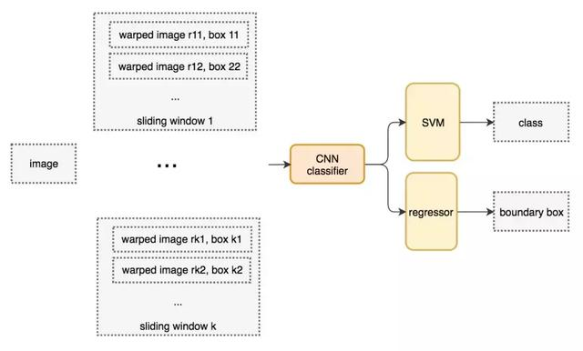

# 第八章  目标检测

## 8.1 基于候选区域的目标检测器

### 8.1.1滑动窗口检测器

    自从AlexNet获得ILSVRC 2012挑战赛的冠军之后，采用卷积神经网络（Convolutional Neural Network, CNN）进行分类任务就逐渐成为了主流研究方向。最常见的一种采用暴力方法进行目标检测的思路是在图片上从左向右、从上至下通过滑动窗口，利用分类思想进行目标识别。为了能够在不同的观察距离检测不同的目标类型，通常使用不同大小和宽高比的滑动窗口。
    

 图8.1.1 滑动窗口示意图（从右向左，从上至下）
 
    采用滑动窗口从图像中剪切相应的图像块。由于很多分类器只能采用固定大小的图像块，因此这些图像块大多是原始图像块经过变形转换得到的。尽管如此，这样的操作并不影响分类的准确率，因为分类器可以处理变形后的图像块。
    

    图8.1.2 将图像转换成固定尺寸的图像
    
    经过变形后的图像块被输入到CNN分类器中，用来提取出4096维特征。之后，使用SVM分类器识别该图像的类别，并且采用线性回归输出该图像的边界框。
 
    图8.1.3 滑动窗口检测器的系统工作流程图
    
### 8.1.2选择性搜索 

    除了暴力检测方法之外，选择性搜索也是一种常见的目标检测方法。采用候选区域方法（region proposal method）创建目标检测的感兴趣区域（ROI）。在选择性搜索（selective search，SS）中，假设现在图像上有n个预分割的区域,表示为R={R1, R2, ..., Rn},计算每个region与它相邻region(注意是相邻的区域)的相似度,这样会得到一个n*n的相似度矩阵(同一个区域之间和一个区域与不相邻区域之间的相似度可设为NaN),从矩阵中找出最大相似度值对应的两个区域,将这两个区域合二为一,这时候图像上还剩下n-1个区域;重复上面的过程(只需要计算新的区域与它相邻区域的新相似度,其他的不用重复计算),重复一次,区域的总数目就少1,知道最后所有的区域都合并称为了同一个区域(即此过程进行了n-1次,区域总数目最后变成了1).算法的流程图如下图所示:
 
    下图第一行展示了如何使区域增长，第二行中的蓝色矩形代表合并过程中所有可能的ROI。
 
    图8.1.4 选择性搜索
    
### 8.1.3 R-CNN 

    从2014年CNN就成为用于目标检测的极热门的工具，CNN可以很好地帮我们完成图像识别的任务，我们只需要添加一些额外的功能来完成目标的定位任务即可。使用一个高容量的卷积神经网络将region proposals自底而上的传播，用来定位目标是很好的选择，如果有标签的训练数据比较少，可以使用训练好的参数作为辅助，进行fine-tuning，能够得到非常好的定位效果提升。R-CNN利用候选区域方法创建了约2000个ROI。这些区域被转换为固定大小的图像，并分别馈送到卷积神经网络中。该网络结构后面会跟有几个全连接层，以实现目标分类并提炼出目标的边界框。
 
    图8.1.5 使用候选区域、CNN、仿射层来定位目标
    使用RCNN进行目标检测，主要分三个部分：（1）产生不依赖与特定类别的region proposals，这些region proposals定义了一个整个检测器可以获得的候选目标；（2）一个大的卷积神经网络，对每个region产生一个固定长度的特征向量；（3）一系列特定类别的线性SVM分类器。以下是R-CNN整个系统的流程图：
 
    图8.1.6 采用R-CNN进行目标检测的流程图
    通过使用更少且更高质量的ROI，采用R-CNN能够比采用滑动窗口方法更快速、更准确地进行目标检测。
    
### 8.1.4边界框回归器

    采用候选区域方法进行目标检测具有非常高的计算复杂度。为了加速这个过程，通常会使用计算量较少的候选区域选择方法构建ROI，并在后面使用线性回归器（使用全连接层）进一步提炼边界框。
 
    图8.1.6 使用回归方法将蓝色的原始边界框提炼为红色
    
### 8.1.5 Fast R-CNN

    R-CNN需要非常多的候选区域以提升目标检测的准确度，但其实有很多区域是彼此重叠的，因此使得R-CNN的训练和推断速度非常慢。如果我们有2000个候选区域，且每个候选区域都需要独立地馈送到CNN中，那么对于不同的ROI，我们需要重复提取2000次特征。此外，CNN中的特征图以一种密集的方式表征空间特征，是否能直接使用特征图代替原图来检测目标。
 
    图8.1.7 图像特征图

    图8.1.8 直接利用特征图计算ROI
    Fast R-CNN使用特征提取器（CNN）提取整个图像的特征，而不是从头开始对每个图像块提取多次。可以将创建候选区域的方法直接应用到提取到的特征图上。例如，Fast R-CNN选择VGG16中的卷积层Conv5来生成ROI，这些关注区域随后会结合对应的特征图以裁剪为特征图块，并用于目标检测任务中。我们使用ROI池化将特征图块转换为固定的大小，并馈送到全连接层进行分类和定位。因为Fast-RCNN不会重复提取特征，因此它能显著地减少处理时间。
 
    图8.1.9
    将候选区域直接应用于特征图，并使用ROI池化将其转化为固定大小的特征图块。以下是Fast R-CNN的流程图：
 
    图8.1.10 Fast R-CNN流程图
    Fast R-CNN最重要的一点就是包含特征提取器、分类器和边界框回归器在内的整个网络能通过多任务损失函数进行端到端的训练，这种多任务损失即结合了分类损失和定位损失的方法，大大提升了模型准确度。
    
### 8.1.6 ROI池化

    因为Fast R-CNN使用全连接层，所以应用ROI池化将不同大小的ROI转换为固定大小。为简洁起见，我们先将8×8特征图转换为预定义的2×2大小。下图左上角：特征图。右上角：将ROI（蓝色区域）与特征图重叠。左下角：将ROI拆分为目标维度。例如，对于2×2目标，我们将ROI分割为4个大小相似或相等的部分。右下角：找到每个部分的最大值，得到变换后的特征图。
 
    图7.1.11 ROI池化
    输入特征图（左上），输出特征图（右下），ROI(右上，蓝色框)。按上述步骤得到一个2×2的特征图块，可以馈送至分类器和边界框的回归器中。
    
### 8.1.7 Faster R-CNN  

    Fast R-CNN依赖于外部候选区域方法，如选择性搜索。但这些算法在CPU上运行且速度很慢。在测试中，Fast R-CNN需要2.3秒来进行预测，其中2秒用于生成2000个ROI。Faster R-CNN采用与Fast R-CNN相同的设计，只是它用内部深层网络代替了候选区域方法。新的候选区域网络（RPN）在生成ROI时效率更高，并且以每幅图像10毫秒的速度运行。
 
    图8.1.12 Faster R-CNN的流程图
    Faster R-CNN的流程图与Fast R-CNN相同，采用外部候选区域方法代替了内部深层网络。
 
    图8.1.13
    
### 8.1.8候选区域网络

    候选区域网络（RPN）将第一个卷积网络的输出特征图作为输入。它在特征图上滑动一个3×3的卷积核，以使用卷积网络（如下所示的ZF网络）构建与类别无关的候选区域。其他深度网络（如VGG或ResNet）可用于更全面的特征提取，但这需要以速度为代价。ZF网络最后会输出256个值，它们将馈送到两个独立的全连接层，以预测边界框和两个objectness分数，这两个objectness分数度量了边界框是否包含目标。我们其实可以使用回归器计算单个objectness分数，但为简洁起见，Faster R-CNN使用只有两个类别的分类器：即带有目标的类别和不带有目标的类别。
 
    图8.1.14
    对于特征图中的每一个位置，RPN会做k次预测。因此，RPN将输出4×k个坐标和每个位置上2×k个得分。下图展示了8×8的特征图，且有一个3×3的卷积核执行运算，它最后输出8×8×3个ROI（其中k=3）。下图（右）展示了单个位置的3个候选区域。
 
    图8.1.15
    假设最好涵盖不同的形状和大小。因此，Faster R-CNN不会创建随机边界框。相反，它会预测一些与左上角名为锚点的参考框相关的偏移量（如x, y）。我们限制这些偏移量的值，因此我们的猜想仍然类似于锚点。
 
    图8.1.16
    要对每个位置进行k个预测，我们需要以每个位置为中心的k个锚点。每个预测与特定锚点相关联，但不同位置共享相同形状的锚点。
 
    图8.1.17
    这些锚点是精心挑选的，因此它们是多样的，且覆盖具有不同比例和宽高比的现实目标。这使得我们可以用更好的猜想来指导初始训练，并允许每个预测专门用于特定的形状。该策略使早期训练更加稳定和简便。
 
    图8.1.18
    Faster R-CNN使用更多的锚点。它部署9个锚点框：3个不同宽高比的3个不同大小的锚点框。每一个位置使用9个锚点，每个位置会生成2×9个objectness分数和4×9个坐标。
    
### 8.1.9 R-CNN方法的性能 

    如下图所示，Faster R-CNN的速度要快得多。
 
    图8.1.19性能对比

    表8.1.1 性能对比
 
## 8.2 基于区域的全卷积神经网络（R-FCN）

    假设我们只有一个特征图用来检测右眼。那么我们可以使用它定位人脸吗？应该可以。因为右眼应该在人脸图像的左上角，所以我们可以利用这一点定位整个人脸。如果我们还有其他用来检测左眼、鼻子或嘴巴的特征图，那么我们可以将检测结果结合起来，更好地定位人脸。现在我们回顾一下所有问题。在Faster R-CNN中，检测器使用了多个全连接层进行预测。如果有2000个ROI，那么成本非常高。R-FCN通过减少每个ROI所需的工作量实现加速。上面基于区域的特征图与ROI是独立的，可以在每个ROI之外单独计算。剩下的工作就比较简单了，因此R-FCN的速度比Faster R-CNN快。

 
    图8.2.1 人脸检测
    现在我们来看一下5×5的特征图M，内部包含一个蓝色方块。我们将方块平均分成3×3个区域。现在，我们在M中创建了一个新的特征图，来检测方块的左上角（TL）。这个新的特征图如下图（右）所示。只有黄色的网格单元[2,2]处于激活状态。在左侧创建一个新的特征图，用于检测目标的左上角。
 
    图8.2.2 检测示例
    我们将方块分成9个部分，由此创建了9个特征图，每个用来检测对应的目标区域。这些特征图叫做位置敏感得分图（position-sensitive score map），因为每个图检测目标的子区域（计算其得分）。
 
    图8.2.3生成9个得分图
    下图中红色虚线矩形是建议的ROI。我们将其分割成3×3个区域，并询问每个区域包含目标对应部分的概率是多少。例如，左上角ROI区域包含左眼的概率。我们将结果存储成3×3 vote数组，如下图（右）所示。例如，vote_array[0][0]包含左上角区域是否包含目标对应部分的得分。
 
    图8.2.4
    将ROI应用到特征图上，输出一个3x3数组。将得分图和ROI映射到vote数组的过程叫做位置敏感ROI池化（position-sensitive ROI-pool）。该过程与前面讨论过的ROI池化非常接近。
 
    图8.2.5
将ROI的一部分叠加到对应的得分图上，计算V[i][j]。在计算出位置敏感ROI池化的所有值后，类别得分是其所有元素得分的平均值。
 
    图8.2.6 ROI池化
    假如我们有C个类别要检测。我们将其扩展为C+1个类别，这样就为背景（非目标）增加了一个新的类别。每个类别有3×3个得分图，因此一共有(C+1)×3×3个得分图。使用每个类别的得分图可以预测出该类别的类别得分。然后我们对这些得分应用 softmax 函数，计算出每个类别的概率。以下是数据流图，在本案例中，k=3。
 
    图8.2.7
    
## 8.3 单次目标检测器

    我们将对单次目标检测器（包括SSD、YOLO、YOLOv2、YOLOv3）进行综述。我们将分析FPN以理解多尺度特征图如何提高准确率，特别是小目标的检测，其在单次检测器中的检测效果通常很差。然后我们将分析Focal loss和RetinaNet，看看它们是如何解决训练过程中的类别不平衡问题的。
    
### 8.3.1单次检测器  

    Faster R-CNN中，在分类器之后有一个专用的候选区域网络。
 
    图8.3.1 Faster R-CNN工作流
    基于区域的检测器是很准确的，但需要付出代价。Faster R-CNN在PASCAL VOC 2007测试集上每秒处理7帧的图像（7FPS）。和R-FCN类似，研究者通过减少每个ROI的工作量来精简流程。
    作为替代，我们是否需要一个分离的候选区域步骤？我们可以直接在一个步骤内得到边界框和类别吗？
    
### 8.3.2滑动窗口进行预测 

    让我们再看一下滑动窗口检测器。我们可以通过在特征图上滑动窗口来检测目标。对于不同的目标类型，我们使用不同的窗口类型。以前的滑动窗口方法的致命错误在于使用窗口作为最终的边界框，这就需要非常多的形状来覆盖大部分目标。更有效的方法是将窗口当作初始猜想，这样我们就得到了从当前滑动窗口同时预测类别和边界框的检测器。
 
    图8.3.2
    基于滑动窗口进行预测这个概念和Faster R-CNN中的锚点很相似。然而，单次检测器会同时预测边界框和类别。例如，我们有一个8×8特征图，并在每个位置做出k个预测，即总共有8×8×k个预测结果。
 
    图8.3.3 64个位置
    在每个位置，我们有k个锚点（锚点是固定的初始边界框猜想），一个锚点对应一个特定位置。我们使用相同的锚点形状仔细地选择锚点和每个位置。
 
    图8.3.4 使用4个锚点在每个位置做出4个预测
    以下是4个锚点（绿色）和4个对应预测（蓝色），每个预测对应一个特定锚点。在Faster R-CNN中，我们使用卷积核来做5个参数的预测：4个参数对应某个锚点的预测边框，1个参数对应objectness置信度得分。因此3×3×D×5卷积核将特征图从8×8×D转换8×8×5。
 
    图8.3.5 4个预测，每个预测对应一个锚点
 
    图8.3.6 使用3×3卷积核计算预测
    在单次检测器中，卷积核还预测C个类别概率以执行分类（每个概率对应一个类别）。因此我们应用一个3×3×D×25卷积核将特征图从8×8×D转换为8×8×25（C=20）。
 
    图8.3.7 每个位置做出k个预测，每个预测有25个参数
    单次检测器通常需要在准确率和实时处理速度之间进行权衡。它们在检测太近距离或太小的目标时容易出现问题。
    
### 8.3.3 SSD  

    SSD是使用VGG19网络作为特征提取器（和Faster R-CNN中使用的CNN一样）的单次检测器。我们在该网络之后添加自定义卷积层（蓝色），并使用卷积核（绿色）执行预测。
 
    图8.3.8 同时对类别和位置执行单次预测
    然而，卷积层降低了空间维度和分辨率。因此上述模型仅可以检测较大的目标。为了解决该问题，我们从多个特征图上执行独立的目标检测。
 
    图8.3.9 使用多尺度特征图用于检测

md版本未编辑完
