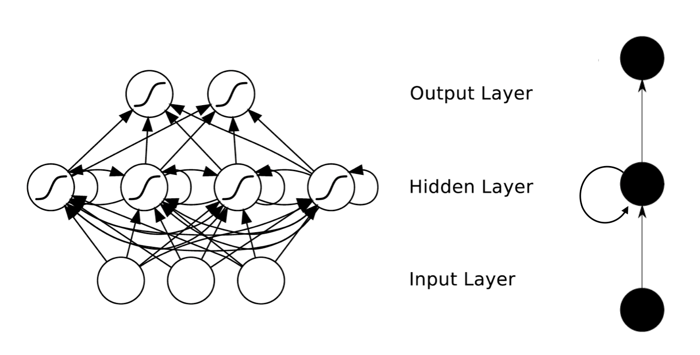
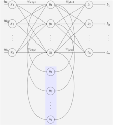
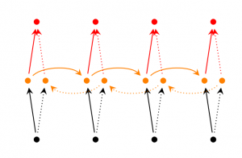
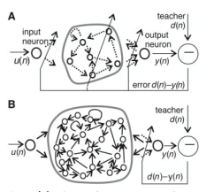
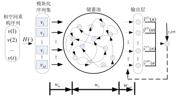
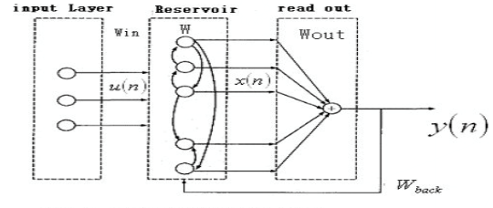
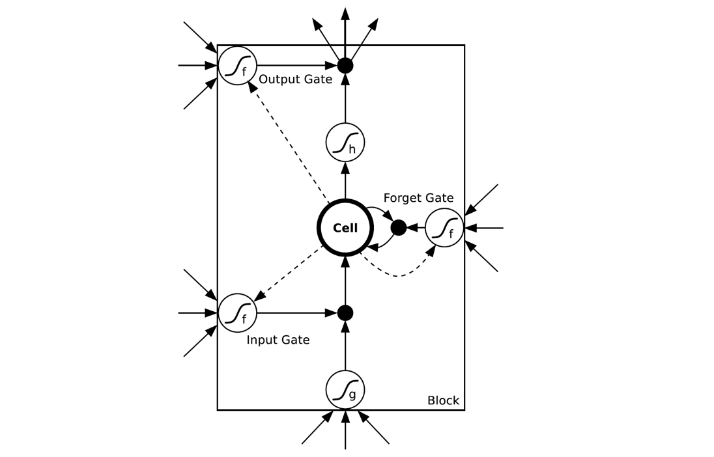
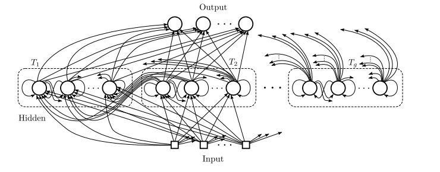

# 第六章 循环神经网络(RNN)

    Markdown Revision 1;
    Date: 2018/10/26
    Editor: 杨国峰-中国农业科学院
    Contact: tectalll@gmail.com

http://blog.csdn.net/heyongluoyao8/article/details/48636251

## 6.1 RNNs和FNNs有什么区别？

不同于传统的前馈神经网络(FNNs)，RNNs引入了定向循环，能够处理那些输入之间前后关联的问题。**定向循环结构如下图所示**：

## 6.2 RNNs典型特点？

RNNs的目的使用来处理序列数据。在传统的神经网络模型中，是从输入层到隐含层再到输出层，层与层之间是全连接的，每层之间的节点是无连接的。但是这种普通的神经网络对于很多问题却无能无力。例如，你要预测句子的下一个单词是什么，一般需要用到前面的单词，因为一个句子中前后单词并不是独立的。
RNNs之所以称为循环神经网路，即一个序列当前的输出与前面的输出也有关。具体的表现形式为网络会对前面的信息进行记忆并应用于当前输出的计算中，即隐藏层之间的节点不再无连接而是有连接的，并且隐藏层的输入不仅包括输入层的输出还包括上一时刻隐藏层的输出。理论上，RNNs能够对任何长度的序列数据进行处理。但是在实践中，为了降低复杂性往往假设当前的状态只与前面的几个状态相关，**下图便是一个典型的RNNs**：

输入单元(Input units)：输入集$\bigr\{x_0,x_1,...,x_t,x_{t+1},...\bigr\}$，

输出单元(Output units)：输出集$\bigr\{y_0,y_1,...,y_t,y_{y+1},...\bigr\}$，

隐藏单元(Hidden units)：输出集$\bigr\{s_0,s_1,...,s_t,s_{t+1},...\bigr\}$。

**图中信息传递特点：**

1. 有一条单向流动的信息流是从输入单元到达隐藏单元；
2. 与此同时，另一条单向流动的信息流从隐藏单元到达输出单元；
3. 在某些情况下，RNNs会打破后者的限制，引导信息从输出单元返回隐藏单元，这些被称为“Back Projections”；
4. 在某些情况下，隐藏层的输入还包括上一隐藏层的状态，即隐藏层内的节点可以自连也可以互连。 

## 6.3RNNs能干什么？

RNNs已经被在实践中证明对NLP是非常成功的。如词向量表达、语句合法性检查、词性标注等。在RNNs中，目前使用最广泛最成功的模型便是LSTMs(Long Short-Term Memory，长短时记忆模型)模型，该模型通常比 vanilla RNNs 能够更好地对长短时依赖进行表达，该模型相对于一般的RNNs，只是在隐藏层做了改变。

## 6.4 RNNs在NLP中典型应用？
**（1）语言模型与文本生成(Language Modeling and Generating Text)**

给一个单词序列，需要根据前面的单词预测每一个单词的可能性。语言模型能够一个语句正确的可能性，这是机器翻译的一部分，往往可能性越大，语句越正确。另一种应用便是使用生成模型预测下一个单词的概率，从而生成新的文本根据输出概率的采样。

**（2）机器翻译(Machine Translation)**

机器翻译是将一种源语言语句变成意思相同的另一种源语言语句，如将英语语句变成同样意思的中文语句。与语言模型关键的区别在于，需要将源语言语句序列输入后，才进行输出，即输出第一个单词时，便需要从完整的输入序列中进行获取。

**（3）语音识别(Speech Recognition)**

语音识别是指给一段声波的声音信号，预测该声波对应的某种指定源语言的语句以及该语句的概率值。 

**（4）图像描述生成 (Generating Image Descriptions)**

和卷积神经网络(convolutional Neural Networks, CNNs)一样，RNNs已经在对无标图像描述自动生成中得到应用。将CNNs与RNNs结合进行图像描述自动生成。

## 6.5 RNNs训练和传统ANN训练异同点？

**相同点**：同样使用BP误差反向传播算法。

**不同点**：

1. 如果将RNNs进行网络展开，那么参数W,U,V是共享的，而传统神经网络却不是的。
2. 在使用梯度下降算法中，每一步的输出不仅依赖当前步的网络，并且还以来前面若干步网络的状态。

## 6.6常见的RNNs扩展和改进模型

### 6.6.1Simple RNNs(SRNs)

SRNs是RNNs的一种特例，它是一个三层网络，并且在隐藏层增加了上下文单元，下图中的**y**便是隐藏层，**u**便是上下文单元。上下文单元节点与隐藏层中的节点的连接是固定(谁与谁连接)的，并且权值也是固定的(值是多少)，其实是一个上下文节点与隐藏层节点一一对应，并且值是确定的。在每一步中，使用标准的前向反馈进行传播，然后使用学习算法进行学习。上下文每一个节点保存其连接的隐藏层节点的上一步的输出，即保存上文，并作用于当前步对应的隐藏层节点的状态，即隐藏层的输入由输入层的输出与上一步的自己的状态所决定的。因此SRNs能够解决标准的多层感知机(MLP)无法解决的对序列数据进行预测的任务。 
**SRNs网络结构如下图所示**：

### 6.6.2Bidirectional RNNs

Bidirectional RNNs(双向网络)的改进之处便是，假设当前的输出(第t步的输出)不仅仅与前面的序列有关，并且还与后面的序列有关。例如：预测一个语句中缺失的词语那么就需要根据上下文来进行预测。Bidirectional RNNs是一个相对较简单的RNNs，是由两个RNNs上下叠加在一起组成的。输出由这两个RNNs的隐藏层的状态决定的。**如下图所示**：

### 6.6.3Deep(Bidirectional) RNNs

Deep(Bidirectional)RNNs与Bidirectional RNNs相似，只是对于每一步的输入有多层网络。这样，该网络便有更强大的表达与学习能力，但是复杂性也提高了，同时需要更多的训练数据。**Deep(Bidirectional)RNNs的结构如下图所示**：

### 6.6.4Echo State Networks（ESNs）
ESNs(回声状态网络)虽然也是一种RNNs，但是它与传统的RNNs相差很大。

**ESNs具有三个特点**：

（1）它的核心结构时一个随机生成、且保持不变的储备池(Reservoir)，储备池是大规模的、随机生成的、稀疏连接(SD通常保持1%～5%，SD表示储备池中互相连接的神经元占总的神经元个数N的比例)的循环结构；

（2）其储备池到输出层的权值矩阵是唯一需要调整的部分；

（3）简单的线性回归就可完成网络的训练。

从结构上讲，ESNs是一种特殊类型的循环神经网络，其基本思想是：使用大规模随机连接的循环网络取代经典神经网络中的中间层，从而简化网络的训练过程。因此ESNs的关键是中间的储备池。网络中的参数包括：W为储备池中节点的连接权值矩阵，Win为输入层到储备池之间的连接权值矩阵，表明储备池中的神经元之间是连接的，Wback为输出层到储备池之间的反馈连接权值矩阵，表明储备池会有输出层来的反馈，Wout为输入层、储备池、输出层到输出层的连接权值矩阵，表明输出层不仅与储备池连接，还与输入层和自己连接。Woutbias表示输出层的偏置项。 
对于ESNs，关键是储备池的四个参数，如储备池内部连接权谱半径SR(SR=λmax=max{|W的特征指|}，只有SR <1时，ESNs才能具有回声状态属性)、储备池规模N(即储备池中神经元的个数)、储备池输入单元尺度IS(IS为储备池的输入信号连接到储备池内部神经元之前需要相乘的一个尺度因子)、储备池稀疏程度SD(即为储备池中互相连接的神经元个数占储备池神经元总个数的比例)。对于IS，如果需要处理的任务的非线性越强，那么输入单元尺度越大。该原则的本质就是通过输入单元尺度IS，将输入变换到神经元激活函数相应的范围(神经元激活函数的不同输入范围，其非线性程度不同)。
**ESNs的结构如下图所示**：

### 6.6.5Gated Recurrent Unit Recurrent Neural Networks
GRUs也是一般的RNNs的改良版本，主要是从以下**两个方面**进行改进。

**一是**，序列中不同的位置处的单词(已单词举例)对当前的隐藏层的状态的影响不同，越前面的影响越小，即每个前面状态对当前的影响进行了距离加权，距离越远，权值越小。

**二是**，在产生误差error时，误差可能是由某一个或者几个单词而引发的，所以应当仅仅对对应的单词weight进行更新。GRUs的结构如下图所示。GRUs首先根据当前输入单词向量word vector已经前一个隐藏层的状态hidden state计算出update gate和reset gate。再根据reset gate、当前word vector以及前一个hidden state计算新的记忆单元内容(new memory content)。当reset gate为1的时候，new memory content忽略之前的所有memory content，最终的memory是之前的hidden state与new memory content的结合。

### 6.6.6LSTM Netwoorks
LSTMs与GRUs类似，目前非常流行。它与一般的RNNs结构本质上并没有什么不同，只是使用了不同的函数去去计算隐藏层的状态。在LSTMs中，i结构被称为cells，可以把cells看作是黑盒用以保存当前输入xt之前的保存的状态ht−1，这些cells更加一定的条件决定哪些cell抑制哪些cell兴奋。它们结合前面的状态、当前的记忆与当前的输入。已经证明，该网络结构在对长序列依赖问题中非常有效。**LSTMs的网络结构如下图所示**。

LSTMs与GRUs的区别如图所示：

从上图可以看出，它们之间非常相像，**不同在于**：

（1）new memory的计算方法都是根据之前的state及input进行计算，但是GRUs中有一个reset gate控制之前state的进入量，而在LSTMs里没有这个gate；

（2）产生新的state的方式不同，LSTMs有两个不同的gate，分别是forget gate (f gate)和input gate(i gate)，而GRUs只有一个update gate(z gate)；

（3）LSTMs对新产生的state又一个output gate(o gate)可以调节大小，而GRUs直接输出无任何调节。

### 6.6.7Clockwork RNNs(CW-RNNs)
CW-RNNs是较新的一种RNNs模型，其论文发表于2014年Beijing ICML。
CW-RNNs也是一个RNNs的改良版本，是一种使用时钟频率来驱动的RNNs。它将隐藏层分为几个块(组，Group/Module)，每一组按照自己规定的时钟频率对输入进行处理。并且为了降低标准的RNNs的复杂性，CW-RNNs减少了参数的数目，提高了网络性能，加速了网络的训练。CW-RNNs通过不同的隐藏层模块工作在不同的时钟频率下来解决长时间依赖问题。将时钟时间进行离散化，然后在不同的时间点，不同的隐藏层组在工作。因此，所有的隐藏层组在每一步不会都同时工作，这样便会加快网络的训练。并且，时钟周期小的组的神经元的不会连接到时钟周期大的组的神经元，只会周期大的连接到周期小的(认为组与组之间的连接是有向的就好了，代表信息的传递是有向的)，周期大的速度慢，周期小的速度快，那么便是速度慢的连速度快的，反之则不成立。现在还不明白不要紧，下面会进行讲解。

CW-RNNs与SRNs网络结构类似，也包括输入层(Input)、隐藏层(Hidden)、输出层(Output)，它们之间也有向前连接，输入层到隐藏层的连接，隐藏层到输出层的连接。但是与SRN不同的是，隐藏层中的神经元会被划分为若干个组，设为$g$，每一组中的神经元个数相同，设为$k$，并为每一个组分配一个时钟周期$T_i\epsilon\{T_1,T_2,...,T_g\}$，每一个组中的所有神经元都是全连接，但是组$j$到组$i$的循环连接则需要满足$T_j$大于$T_i$。如下图所示，将这些组按照时钟周期递增从左到右进行排序，即$T_1<T_2<...<T_g$，那么连接便是从右到左。例如：隐藏层共有256个节点，分为四组，周期分别是[1,2,4,8]，那么每个隐藏层组256/4=64个节点，第一组隐藏层与隐藏层的连接矩阵为64$\times$64的矩阵，第二层的矩阵则为64$\times$128矩阵，第三组为64$\times$(3$\times$64)=64$\times$192矩阵，第四组为64$\times$(4$\times$64)=64$\times$256矩阵。这就解释了上一段的后面部分，速度慢的组连到速度快的组，反之则不成立。

**CW-RNNs的网络结构如下图所示**： 

