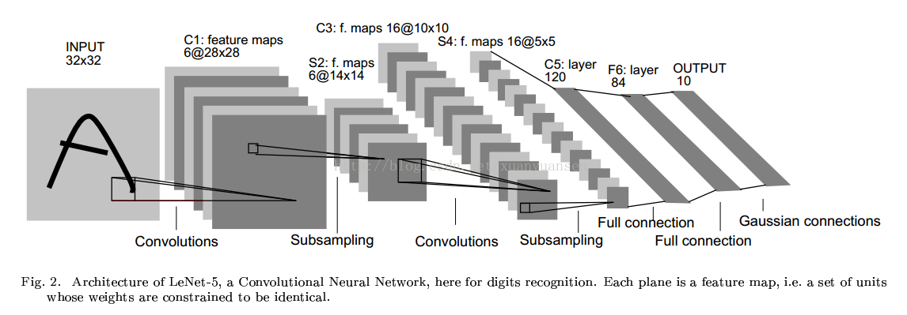
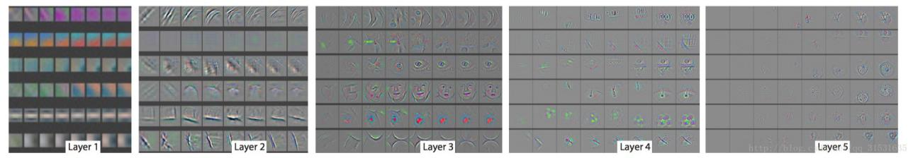
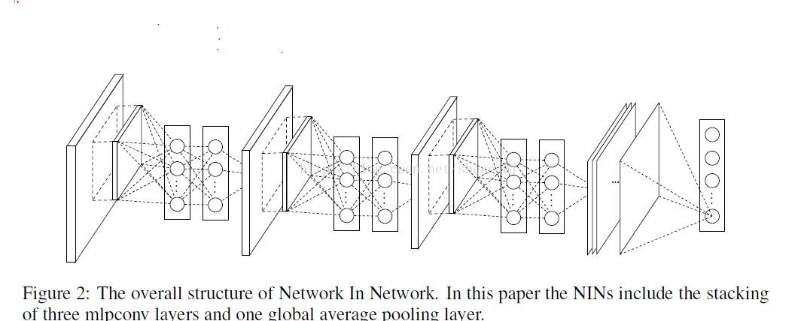
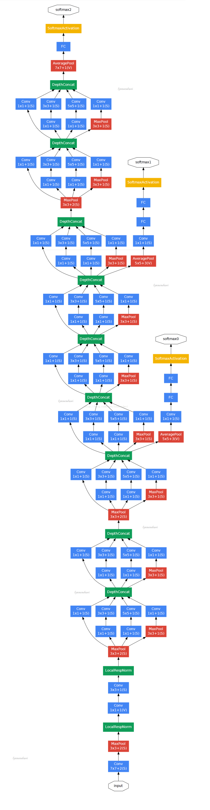
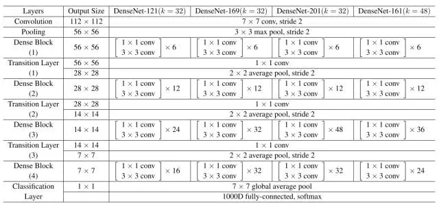

# 第四章 经典网络
## 4.1 LetNet5
一种典型的用来识别数字的卷积网络是LeNet-5。
## 4.1.1 模型结构

## 4.1.2 模型结构
LeNet-5共有7层，不包含输入，每层都包含可训练参数；每个层有多个Feature Map，每个FeatureMap通过一种卷积滤波器提取输入的一种特征，然后每个FeatureMap有多个神经元。  

1. C1层是一个卷积层  
输入图片：32 \* 32  
卷积核大小：5 \* 5 
卷积核种类：6  
输出featuremap大小：28 \* 28 （32-5+1）  
神经元数量：28 \* 28 \* 6  
可训练参数：（5 \* 5+1） \* 6（每个滤波器5 \* 5=25个unit参数和一个bias参数，一共6个滤波器）  
连接数：（5 \* 5+1） \* 6 \* 28 \* 28  

2. S2层是一个下采样层  
输入：28 \* 28  
采样区域：2 \* 2  
采样方式：4个输入相加，乘以一个可训练参数，再加上一个可训练偏置。结果通过sigmoid  
采样种类：6  
输出featureMap大小：14 \* 14（28/2）  
神经元数量：14 \* 14 \* 6  
可训练参数：2 \* 6（和的权+偏置）  
连接数：（2 \* 2+1） \* 6 \* 14 \* 14  
S2中每个特征图的大小是C1中特征图大小的1/4  

3. C3层也是一个卷积层  
输入：S2中所有6个或者几个特征map组合  
卷积核大小：5 \* 5  
卷积核种类：16  
输出featureMap大小：10 \* 10  
C3中的每个特征map是连接到S2中的所有6个或者几个特征map的，表示本层的特征map是上一层提取到的特征map的不同组合  
存在的一个方式是：C3的前6个特征图以S2中3个相邻的特征图子集为输入。接下来6个特征图以S2中4个相邻特征图子集为输入。然后的3个以不相邻的4个特征图子集为输入。最后一个将S2中所有特征图为输入。  则：可训练参数：6 \* （3 \* 25+1）+6 \* （4 \* 25+1）+3 \* （4 \* 25+1）+（25 \* 6+1）=1516  
连接数：10 \* 10 \* 1516=151600  

4. S4层是一个下采样层  
输入：10 \* 10  
采样区域：2 \* 2  
采样方式：4个输入相加，乘以一个可训练参数，再加上一个可训练偏置。结果通过sigmoid  
采样种类：16  
输出featureMap大小：5 \* 5（10/2）  
神经元数量：5 \* 5 \* 16=400  
可训练参数：2 \* 16=32（和的权+偏置）  
连接数：16 \* （2 \* 2+1） \* 5 \* 5=2000  
S4中每个特征图的大小是C3中特征图大小的1/4 

5. C5层是一个卷积层  
输入：S4层的全部16个单元特征map（与s4全相连）  
卷积核大小：5 \* 5 
卷积核种类：120  
输出featureMap大小：1 \* 1（5-5+1）  
可训练参数/连接：120 \* （16 \* 5 \* 5+1）=48120  

6. F6层全连接层  
输入：c5 120维向量  
计算方式：计算输入向量和权重向量之间的点积，再加上一个偏置，结果通过sigmoid函数  
可训练参数:84 \* (120+1)=10164
## 4.1.3 模型特性
- 卷积网络使用一个3层的序列：卷积、池化、非线性——这可能是自这篇论文以来面向图像的深度学习的关键特性！
- 使用卷积提取空间特征
- 使用映射的空间均值进行降采样
- tanh或sigmoids非线性
- 多层神经网络（MLP）作为最终的分类器
- 层间的稀疏连接矩阵以避免巨大的计算开销

# 4.2 AlexNet
## 4.2.1 模型结构

 
## 4.2.2 模型解读

1. conv1阶段DFD（data flow diagram）：

&nbsp;&nbsp;&nbsp;&nbsp; 
第一层输入数据为原始的227 \* 227 \* 3的图像，这个图像被11 \* 11 \* 3的卷积核进行卷积运算，卷积核对原始图像的每次卷积都生成一个新的像素。卷积核沿原始图像的x轴方向和y轴方向两个方向移动，移动的步长是4个像素。因此，卷积核在移动的过程中会生成(227-11)/4+1=55个像素(227个像素减去11，正好是54，即生成54个像素，再加上被减去的11也对应生成一个像素)，行和列的55 \* 55个像素形成对原始图像卷积之后的像素层。共有96个卷积核，会生成55 \* 55 \* 96个卷积后的像素层。96个卷积核分成2组，每组48个卷积核。对应生成2组55 \* 55 \* 48的卷积后的像素层数据。这些像素层经过relu1单元的处理，生成激活像素层，尺寸仍为2组55 \* 55 \* 48的像素层数据。  这些像素层经过pool运算(池化运算)的处理，池化运算的尺度为3 \* 3，运算的步长为2，则池化后图像的尺寸为(55-3)/2+1=27。 即池化后像素的规模为27 \* 27 \* 96；然后经过归一化处理，归一化运算的尺度为5 \* 5；第一卷积层运算结束后形成的像素层的规模为27 \* 27 \* 96。分别对应96个卷积核所运算形成。这96层像素层分为2组，每组48个像素层，每组在一个独立的GPU上进行运算。  反向传播时，每个卷积核对应一个偏差值。即第一层的96个卷积核对应上层输入的96个偏差值。

2. conv2阶段DFD（data flow diagram）：

 
&nbsp;&nbsp;&nbsp;&nbsp;
第二层输入数据为第一层输出的27 \* 27 \* 96的像素层，为便于后续处理，每幅像素层的左右两边和上下两边都要填充2个像素；27 \* 27 \* 96的像素数据分成27 \* 27 \* 48的两组像素数据，两组数据分别再两个不同的GPU中进行运算。每组像素数据被5 \* 5 \* 48的卷积核进行卷积运算，卷积核对每组数据的每次卷积都生成一个新的像素。卷积核沿原始图像的x轴方向和y轴方向两个方向移动，移动的步长是1个像素。因此，卷积核在移动的过程中会生成(27-5+2 \* 2)/1+1=27个像素。(27个像素减去5，正好是22，在加上上下、左右各填充的2个像素，即生成26个像素，再加上被减去的5也对应生成一个像素)，行和列的27 \* 27个像素形成对原始图像卷积之后的像素层。共有256个5 \* 5 \* 48卷积核；这256个卷积核分成两组，每组针对一个GPU中的27 \* 27 \* 48的像素进行卷积运算。会生成两组27 \* 27 \* 128个卷积后的像素层。这些像素层经过relu2单元的处理，生成激活像素层，尺寸仍为两组27 \* 27 \* 128的像素层。  
这些像素层经过pool运算(池化运算)的处理，池化运算的尺度为3 \* 3，运算的步长为2，则池化后图像的尺寸为(57-3)/2+1=13。 即池化后像素的规模为2组13 \* 13 \* 128的像素层；然后经过归一化处理，归一化运算的尺度为5 \* 5；第二卷积层运算结束后形成的像素层的规模为2组13 \* 13 \* 128的像素层。分别对应2组128个卷积核所运算形成。每组在一个GPU上进行运算。即共256个卷积核，共2个GPU进行运算。  
反向传播时，每个卷积核对应一个偏差值。即第一层的96个卷积核对应上层输入的256个偏差值。

3. conv3阶段DFD（data flow diagram）：

&nbsp;&nbsp;&nbsp;&nbsp;
第三层输入数据为第二层输出的2组13 \* 13 \* 128的像素层；为便于后续处理，每幅像素层的左右两边和上下两边都要填充1个像素；2组像素层数据都被送至2个不同的GPU中进行运算。每个GPU中都有192个卷积核，每个卷积核的尺寸是3 \* 3 \* 256。因此，每个GPU中的卷积核都能对2组13 \* 13 \* 128的像素层的所有数据进行卷积运算。卷积核对每组数据的每次卷积都生成一个新的像素。卷积核沿像素层数据的x轴方向和y轴方向两个方向移动，移动的步长是1个像素。因此，运算后的卷积核的尺寸为(13-3+1 \* 2)/1+1=13（13个像素减去3，正好是10，在加上上下、左右各填充的1个像素，即生成12个像素，再加上被减去的3也对应生成一个像素），每个GPU中共13 \* 13 \* 192个卷积核。2个GPU中共13 \* 13 \* 384个卷积后的像素层。这些像素层经过relu3单元的处理，生成激活像素层，尺寸仍为2组13 \* 13 \* 192像素层，共13 \* 13 \* 384个像素层。

4. conv4阶段DFD（data flow diagram）：

&nbsp;&nbsp;&nbsp;&nbsp; 
第四层输入数据为第三层输出的2组13 \* 13 \* 192的像素层；为便于后续处理，每幅像素层的左右两边和上下两边都要填充1个像素；2组像素层数据都被送至2个不同的GPU中进行运算。每个GPU中都有192个卷积核，每个卷积核的尺寸是3 \* 3 \* 192。因此，每个GPU中的卷积核能对1组13 \* 13 \* 192的像素层的数据进行卷积运算。卷积核对每组数据的每次卷积都生成一个新的像素。卷积核沿像素层数据的x轴方向和y轴方向两个方向移动，移动的步长是1个像素。因此，运算后的卷积核的尺寸为(13-3+1 \* 2)/1+1=13（13个像素减去3，正好是10，在加上上下、左右各填充的1个像素，即生成12个像素，再加上被减去的3也对应生成一个像素），每个GPU中共13 \* 13 \* 192个卷积核。2个GPU中共13 \* 13 \* 384个卷积后的像素层。这些像素层经过relu4单元的处理，生成激活像素层，尺寸仍为2组13 \* 13 \* 192像素层，共13 \* 13 \* 384个像素层。

 5. conv5阶段DFD（data flow diagram）：

 

&nbsp;&nbsp;&nbsp;&nbsp; 
第五层输入数据为第四层输出的2组13 \* 13 \* 192的像素层；为便于后续处理，每幅像素层的左右两边和上下两边都要填充1个像素；2组像素层数据都被送至2个不同的GPU中进行运算。每个GPU中都有128个卷积核，每个卷积核的尺寸是3 \* 3 \* 192。因此，每个GPU中的卷积核能对1组13 \* 13 \* 192的像素层的数据进行卷积运算。卷积核对每组数据的每次卷积都生成一个新的像素。卷积核沿像素层数据的x轴方向和y轴方向两个方向移动，移动的步长是1个像素。因此，运算后的卷积核的尺寸为(13-3+1 \* 2)/1+1=13（13个像素减去3，正好是10，在加上上下、左右各填充的1个像素，即生成12个像素，再加上被减去的3也对应生成一个像素），每个GPU中共13 \* 13 \* 128个卷积核。2个GPU中共13 \* 13 \* 256个卷积后的像素层。这些像素层经过relu5单元的处理，生成激活像素层，尺寸仍为2组13 \* 13 \* 128像素层，共13 \* 13 \* 256个像素层。

2组13 \* 13 \* 128像素层分别在2个不同GPU中进行池化(pool)运算处理。池化运算的尺度为3 \* 3，运算的步长为2，则池化后图像的尺寸为(13-3)/2+1=6。 即池化后像素的规模为两组6 \* 6 \* 128的像素层数据，共6 \* 6 \* 256规模的像素层数据。

6. fc6阶段DFD（data flow diagram）：

&nbsp;&nbsp;&nbsp;&nbsp;
第六层输入数据的尺寸是6 \* 6 \* 256，采用6 \* 6 \* 256尺寸的滤波器对第六层的输入数据进行卷积运算；每个6 \* 6 \* 256尺寸的滤波器对第六层的输入数据进行卷积运算生成一个运算结果，通过一个神经元输出这个运算结果；共有4096个6 \* 6 \* 256尺寸的滤波器对输入数据进行卷积运算，通过4096个神经元输出运算结果；这4096个运算结果通过relu激活函数生成4096个值；并通过drop运算后输出4096个本层的输出结果值。       由于第六层的运算过程中，采用的滤波器的尺寸(6 \* 6 \* 256)与待处理的feature map的尺寸(6 \* 6 \* 256)相同，即滤波器中的每个系数只与feature map中的一个像素值相乘；而其它卷积层中，每个滤波器的系数都会与多个feature map中像素值相乘；因此，将第六层称为全连接层。  第五层输出的6 \* 6 \* 256规模的像素层数据与第六层的4096个神经元进行全连接，然后经由relu6进行处理后生成4096个数据，再经过dropout6处理后输出4096个数据。

7. fc7阶段DFD（data flow diagram）：

&nbsp;&nbsp;&nbsp;&nbsp; 
第六层输出的4096个数据与第七层的4096个神经元进行全连接，然后经由relu7进行处理后生成4096个数据，再经过dropout7处理后输出4096个数据。

8. fc8阶段DFD（data flow diagram）：

 
&nbsp;&nbsp;&nbsp;&nbsp;
第七层输出的4096个数据与第八层的1000个神经元进行全连接，经过训练后输出被训练的数值。

## 4.2.3模型特性
- 使用ReLU作为非线性
- 使用dropout技术选择性地忽略训练中的单个神经元，避免模型的过拟合
- 重叠最大池化（overlapping max pooling），避免平均池化（average pooling）的平均效应
- 使用NVIDIA GTX 580 GPU减少训练时间
- 当时，GPU比CPU提供了更多的核心，可以将训练速度提升10倍，从而允许使用更大的数据集和更大的图像。

# 4.3 可视化ZFNet-解卷积
## 4.3.1 基本的思想及其过程

&nbsp;&nbsp;&nbsp;&nbsp;
可视化技术揭露了激发模型中每层单独的特征图，也允许观察在训练阶段特征的演变过程且诊断出模型的潜在问题。
 
&nbsp;&nbsp;&nbsp;&nbsp;
可视化技术用到了多层解卷积网络，即由特征激活返回到输入像素空间。 

&nbsp;&nbsp;&nbsp;&nbsp;同时进行了分类器输出的敏感性分析，即通过阻止部分输入图像来揭示那部分对于分类是重要的。 

&nbsp;&nbsp;&nbsp;&nbsp;这个可视化技术提供了一个非参数的不变性来展示来自训练集的哪一块激活哪个特征图，不仅需要裁剪输入图片，而且自上而下的投影来揭露来自每块的结构激活一个特征图。 

&nbsp;&nbsp;&nbsp;&nbsp;可视化技术依赖于解卷积操作，即卷积操作的逆过程，将特征映射到像素上。由于解卷积是一种非监督学习，因此只能作为已经训练过的卷积网的探究，不能用作任何学习用途。

## 4.3.2 卷积与解卷积

&nbsp;&nbsp;&nbsp;&nbsp;
下图为卷积过程 

    
    

&nbsp;&nbsp;&nbsp;&nbsp;
解卷积过程

    
    

 
&nbsp;&nbsp;&nbsp;&nbsp;
**非池化**：池化操作是非可逆的，但是我们可以用一组转换变量switch在每个池化区域中通过记录最大值的位置来获得一个近似逆。在解卷积网中，非池化操作使用这些转换来放置上述最大值的位置，保存激活的位置，其余位置都置0。

&nbsp;&nbsp;&nbsp;&nbsp;
**纠正**：卷积网中使用非线性的ReLU来修改特征图来确保特征图总是正值。为了获得在每层的有效（也应该是正值）的特征重建，也在解卷积网中利用了ReLU。

&nbsp;&nbsp;&nbsp;&nbsp;
**滤波**：解卷积网中利用卷积网中的相同的滤波器的转置应用到纠正过的特征图中，而不是上层的输出。也就是对滤波器进行水平方向和垂直方向的翻转。从高层向下投影使用转换变量switch，这个转化变量switch产生自向上的卷积网的最大池化操作。由于重建由一个单独的激活获得，因此也就只对应于原始输入图像的一小块。 

  
 
&nbsp;&nbsp;&nbsp;&nbsp;
上图左半部分是一个解卷积层，右半部分为一个卷积层。解卷积层将会重建一个来自下一层的卷积特征近似版本。图中使用switc来记录在卷积网中进行最大池化操作时每个池化区域的局部最大值的位置，经过非池化操作之后，原来的非最大值的位置都置为0。

## 4.3.3 卷积可视化
&nbsp;&nbsp;&nbsp;&nbsp;
预处理：网络对输入图片进行预处理，裁剪图片中间的256x256区域，并减去整个图像每个像素的均值，然后用10个不同的对256x256图像进行224x224的裁剪（中间区域加上四个角落，以及他们的水平翻转图像），对以128个图片分的块进行随机梯度下降法来更新参数。起始学习率为 ，动量为0.9，当验证集误差停滞时，手动调整学习率。在全连接网络中使用概率为0.5的dropout，并且所有权值都初始化为 ，偏置设为0。    在训练时第一层的可视化揭露了一些占主导的因素，为了了解这些，我们采用重新归一化每个卷积层的滤波器，这些滤波器的均方根值超过了一个固定半径的 。这是非常关键的，尤其是在模型中的第一层，因为输出图片大约在[-128,128]的范围内。   

&nbsp;&nbsp;&nbsp;&nbsp;
特征可视化：每个特征单独投影到像素空间揭露了不同的结构能刺激不同的一个给定的特征图，因此展示了它对于变形的输入内在的不变性。下图即在一个已经训练好的网络中可视化后的图。

  
 
&nbsp;&nbsp;&nbsp;&nbsp;
由上图可以看到第二层应对角落和其他边缘或者颜色的结合；第三层有更加复杂的不变性，捕捉到了相似的纹理；第四层显示了特定类间显著的差异性；第五层显示了有显著构成变化的整个物体。

&nbsp;&nbsp;&nbsp;&nbsp;
训练时的特征演变过程：外表突然的变化导致图像中的一个变换即产生了最强烈的激活。模型的底层在少数几个epoches就能收敛聚集，然而上层在一个相当多的epoches(40-50)之后才能有所变化，这显示了让模型完全训练到完全收敛的必要性。可以由下图看到颜色对比度都逐步增强。

  
 
&nbsp;&nbsp;&nbsp;&nbsp;
**特征不变性:** 一般来说，小的变化对于模型的第一层都有非常大的影响，但对于最高层的影响却几乎没有。对于图像的平移、尺度、旋转的变化来说，网络的输出对于平移和尺度变化都是稳定的，但却不具有旋转不变性，除非目标图像时旋转对称的。下图为分别对平移，尺度，旋转做的分析图。 

  
 
&nbsp;&nbsp;&nbsp;&nbsp;
上图按行顺序分别为对5类图像进行不同程度的垂直方向上的平移、尺度变换、旋转对输出结果影响的分析图。按列顺序分别为原始变换图像，第一层中原始图片和变换后的图片的欧氏距离，第7层中原始图片和变换后的图片的欧氏距离，变换后图片被正确分类的概率图。    

&nbsp;&nbsp;&nbsp;&nbsp;
可视化不仅能够看到一个训练完的模型的内部操作，而且还能帮助选择好的网络结构。   

## 4.3.4 ZFNe和AlexNet比较

&nbsp;&nbsp;&nbsp;&nbsp;
ZFNet的网络结构实际上与AlexNet没有什么很大的变化，差异表现在AlexNet用了两块GPU的稀疏连接结构，而ZFNet只用了一块GPU的稠密连接结构；同时，由于可视化可以用来选择好的网络结构，通过可视化发现AlexNet第一层中有大量的高频和低频信息的混合，却几乎没有覆盖到中间的频率信息；且第二层中由于第一层卷积用的步长为4太大了，导致了有非常多的混叠情况；因此改变了AlexNet的第一层即将滤波器的大小11x11变成7x7，并且将步长4变成了2，下图为AlexNet网络结构与ZFNet的比较。

 
 
# 4.4 VGG
## 4.4.1 模型结构

 
## 4.4.2 模型特点

1. 整个网络都使用了同样大小的卷积核尺寸（3 \* 3）和最大池化尺寸（2 \* 2）

2. 1 \* 1卷积的意义主要在于线性变换，而输入通道数和输出通道数不变，没有发生降维。

1. 两个3 \* 3的卷积层串联相当于1个5 \* 5的卷积层，即一个像素会跟周围5 \* 5的像素产生关联，可以说感受野大小为5 \* 5。而3个3 \* 3的卷积层串联的效果则相当于1个7 \* 7的卷积层。除此之外，3个串联的3 \* 3的卷积层，拥有比1个7 \* 7的卷积层更少的参数量，只有后者的(3 \* 3 \* 3)/(7 \* 7)=55%。最重要的是，3个3 \* 3的卷积层拥有比1个7 \* 7的卷积层更多的非线性变换（前者可以使用三次ReLU激活函数，而后者只有一次），使得CNN对特征的学习能力更强。

2. VGGNet在训练时有一个小技巧，先训练级别A的简单网络，再复用A网络的权重来初始化后面的几个复杂模型，这样训练收敛的速度更快。在预测时，VGG采用Multi-Scale的方法，将图像scale到一个尺寸Q，并将图片输入卷积网络计算。然后在最后一个卷积层使用滑窗的方式进行分类预测，将不同窗口的分类结果平均，再将不同尺寸Q的结果平均得到最后结果，这样可提高图片数据的利用率并提升预测准确率。在训练中，VGGNet还使用了Multi-Scale的方法做数据增强，将原始图像缩放到不同尺寸S，然后再随机裁切224´224的图片，这样能增加很多数据量，对于防止模型过拟合有很不错的效果。

# 4.5 Network in Network
## 4.5.1 模型结构

 
## 4.5.2 模型创新点

&nbsp;&nbsp;&nbsp;&nbsp;
论文的创新点：

1. 提出了抽象能力更高的Mlpconv层

2. 提出了Global Average Pooling（全局平均池化）层

- Mlpconv层  
    &nbsp;&nbsp;&nbsp;&nbsp;
    传统的卷积神经网络一般来说是由线性卷积层、池化层、全连接层堆叠起来的网络，卷积层通过线性滤波器进行线性卷积运算，然后在接个非线性激活函数最终生成特征图。而这种卷积滤波器是一种GLM:(Generalized linear model)广义线性模型。然而GLM的抽象能力是比较低水平的。 
    
    &nbsp;&nbsp;&nbsp;&nbsp;
    抽象：指得到对同一概念的不同变体保持不变的特征。

&nbsp;&nbsp;&nbsp;&nbsp;
一般用CNN进行特征提取时，其实就隐含地假设了特征是线性可分的，可实际问题往往是难以线性可分的。一般来说我们所要提取的特征一般是高度非线性的。在传统的CNN中，也许我们可以用超完备的滤波器，来提取各种潜在的特征。比如我们要提取某个特征，于是我就用了一大堆的滤波器，把所有可能的提取出来，这样就可以把我想要提取的特征也覆盖到，然而这样存在一个缺点，那就是网络太恐怖了，参数太多了。 

&nbsp;&nbsp;&nbsp;&nbsp;
我们知道CNN高层特征其实是低层特征通过某种运算的组合。所以论文就根据这个想法，提出在每个局部感受野中进行更加复杂的运算，提出了对卷积层的改进算法：MLP卷积层。（这里也不知道是否有道理，因为在后面的深层网络没有提出此种说法，还是按照传统的cnn方法使用多个滤波器去学习同一特征的不同变体）。MLP中的激活函数采用的是整流线性单元（即ReLU:max（wx+b,0)。 
MLP的优点： 

1. 非常有效的通用函数近似器 
2. 可用BP算法训练，可以完美地融合进CNN 
3. 其本身也是一种深度模型，可以特征再利用 

- 全局平均池化层 
    
    &nbsp;&nbsp;&nbsp;&nbsp;
    另一方面，传统的CNN最后一层都是全连接层，参数个数非常之多，容易引起过拟合（如Alexnet），一个CNN模型，大部分的参数都被全连接层给占用了，所以论文提出采用了全局均值池化替代全连接层。与传统的全连接层不同，我们对每个特征图一整张图片进行全局均值池化，这样每张特征图都可以得到一个输出。这样采用均值池化，连参数都省了，可以大大减小网络参数，避免过拟合，另一方面它有一个特点，每张特征图相当于一个输出特征，然后这个特征就表示了我们输出类的特征。
     
    全局平均池化的优势： 
    1. 通过加强特征图与类别的一致性，让卷积结构更简单 
    2. 不需要进行参数优化，所以这一层可以避免过拟合 
    3. 它对空间信息进行了求和，因而对输入的空间变换更具有稳定性

&nbsp;&nbsp;&nbsp;&nbsp;
在采用了微神经网络后，让局部模型有更强的抽象能力，从而让全局平均池化能具有特征图与类别之间的一致性，同时相比传统CNN采用的全连接层，不易过拟合（因为全局平均池化本身就是一种结构性的规则项）（PS:经典CNN容易过拟合，并严重依赖用dropout进行规则化）。

# 4.6 GoogleNet
## 4.6.1 模型结构

 
 
## 4.6.2 Inception 结构

 
对上图做以下说明：

1. 采用不同大小的卷积核意味着不同大小的感受野，最后拼接意味着不同尺度特征的融合； 
2. 之所以卷积核大小采用1. 3和5，主要是为了方便对齐。设定卷积步长stride=1之后，只要分别设定pad=0、1. 2，那么卷积之后便可以得到相同维度的特征，然后这些特征就可以直接拼接在一起了；
3. 文章说很多地方都表明pooling挺有效，所以Inception里面也嵌入了。 
4. 网络越到后面，特征越抽象，而且每个特征所涉及的感受野也更大了，因此随着层数的增加，3x3和5x5卷积的比例也要增加。

但是，使用5x5的卷积核仍然会带来巨大的计算量。 为此，文章借鉴NIN2，采用1x1卷积核来进行降维。

例如：上一层的输出为100x100x128，经过具有256个输出的5x5卷积层之后(stride=1，pad=2)，输出数据为100x100x256。其中，卷积层的参数为128x5x5x256。假如上一层输出先经过具有32个输出的1x1卷积层，再经过具有256个输出的5x5卷积层，那么最终的输出数据仍为为100x100x256，但卷积参数量已经减少为128x1x1x32 + 32x5x5x256，大约减少了4倍。

具体改进后的Inception Module如下图：

## 4.6.3 模型层次关系

&nbsp;&nbsp;&nbsp;&nbsp;
原始数据，输入为224 \* 224 \* 3  

&nbsp;&nbsp;&nbsp;&nbsp;
第一层卷积层 conv1 ，pad是3，64个特征，7 \* 7 步长为2，输出特征为 112 \* 112 \* 64，然后进行relu，经过pool1（红色的max pool） 进行pooling 3 \* 3的核，步长为2， [（112 - 3+1）/2]+1 = 56  特征为56 \* 56 \* 64 ， 然后进行norm   

&nbsp;&nbsp;&nbsp;&nbsp;
第二层卷积层 conv2， pad是1，3 \* 3，192个特征，输出为56 \* 56 \* 192，然后进行relu，进行norm，经过pool2进行pooling，3 \* 3的核，步长为2 输出为28 \* 28 \* 192 然后进行split 分成四个支线

&nbsp;&nbsp;&nbsp;&nbsp;
第三层开始时 inception module ，这个的思想受到使用不同尺度的Gabor过滤器来处理多尺度问题，inception module采用不同尺度的卷积核来处理问题。3a 包含 四个支线：

&nbsp;&nbsp;&nbsp;&nbsp;
1： 64个1 \* 1的卷积核（之后进行RULE计算） 变成28 \* 28 \* 64

&nbsp;&nbsp;&nbsp;&nbsp;
2： 96个1 \* 1的卷积核 作为3 \* 3卷积核之前的reduce，变成28 \* 28 \* 96，进行relu计算后，再进行128个3 \* 3的卷积，pad为1， 28 \* 28 \* 128

&nbsp;&nbsp;&nbsp;&nbsp;
3：16个1 \* 1的卷积核 作为5 \* 5卷积核之前的reduce，变成28 \* 28 \* 16， 进行relu计算后，再进行32个5 \* 5的卷积，pad为2，变成28 \* 28 \* 32

&nbsp;&nbsp;&nbsp;&nbsp;
4：pool层，3 \* 3的核，pad为1，输出还是28 \* 28 \* 192，然后进行32个1 \* 1的卷积，变成28 \* 28 \* 32。

&nbsp;&nbsp;&nbsp;&nbsp;
将四个结果进行连接，输出为28 \* 28 \* 256

 
然后将3a的结果又分成四条支线，开始建立3b的inception module

3b

1：128个1 \* 1的卷积核（之后进行RULE计算） 变成28 \* 28 \* 128

2：128个1 \* 1的卷积核 作为3 \* 3卷积核之前的reduce，变成28 \* 28 \* 128， 再进行192个3 \* 3的卷积，pad为1， 28 \* 28 \* 192，进行relu计算

3：32个1 \* 1的卷积核 作为5 \* 5卷积核之前的reduce，变成28 \* 28 \* 32， 进行relu计算后，再进行96个5 \* 5的卷积，pad为2，变成28 \* 28 \* 96

4：pool层，3 \* 3的核，pad为1，输出还是28 \* 28 \* 256，然后进行64个1 \* 1的卷积，变成28 \* 28 \* 64。

将四个结果进行连接，输出为28 \* 28 \* 480

同理依次推算，数据变化如下表：

# 4.7 Inception 系列
## 4.7.1 Inception v1

&nbsp;&nbsp;&nbsp;&nbsp;
相比于GoogLeNet之前的众多卷积神经网络而言，inception v1采用在同一层中提取不同的特征（使用不同尺寸的卷积核），并提出了卷积核的并行合并（也称为Bottleneck layer），如下图

 
这样的结构主要有以下改进：
1. 一层block就包含1x1卷积，3x3卷积，5x5卷积，3x3池化(使用这样的尺寸不是必需的，可以根据需要进行调整)。这样，网络中每一层都能学习到“稀疏”（3x3. 5x5）或“不稀疏”（1x1）的特征，既增加了网络的宽度，也增加了网络对尺度的适应性；
2. 通过deep concat在每个block后合成特征，获得非线性属性。

虽然这样提高了性能，但是网络的计算量实在是太大了，因此GoogLeNet借鉴了Network-in-Network的思想，使用1x1的卷积核实现降维操作，以此来减小网络的参数量(这里就不对两种结构的参数量进行定量比较了)，如图所示。

 

&nbsp;&nbsp;&nbsp;&nbsp;
最后实现的inception v1网络是上图结构的顺序连接，其中不同inception模块之间使用2x2的最大池化进行下采样，如表所示。

 
 
如表所示，实现的网络仍有一层全连接层，该层的设置是为了迁移学习的实现（下同）。
在之前的网络中，最后都有全连接层，经实验证明，全连接层并不是很必要的，因为可能会带来以下三点不便：
    - 网络的输入需要固定
    - 参数量多
    - 易发生过拟合
实验证明，将其替换为平均池化层（或者1x1卷积层）不仅不影响精度，还可以减少。

## 4.7.2 Inception v2

在V1的基础之上主要做了以下改进：
1. 使用BN层，将每一层的输出都规范化到一个N(0,1)的正态分布，这将有助于训练，因为下一层不必学习输入数据中的偏移，并且可以专注与如何更好地组合特征（也因为在v2里有较好的效果，BN层几乎是成了深度网络的必备）；

&nbsp;&nbsp;&nbsp;&nbsp;
（在Batch-normalized论文中只增加了BN层，而之后的Inception V3的论文提及到的inception v2还做了下面的优化）

2. 使用2个3x3的卷积代替梯度（特征图，下同）为35x35中的5x5的卷积，这样既可以获得相同的视野(经过2个3x3卷积得到的特征图大小等于1个5x5卷积得到的特征图)，还具有更少的参数，还间接增加了网络的深度，如下图。（基于原则3）

 
 
  
3. 3x3的卷积核表现的不错，那更小的卷积核是不是会更好呢？比如2x2。对此，v2在17x17的梯度中使用1 \* n和n \* 1这种非对称的卷积来代替n \* n的对称卷积，既降低网络的参数，又增加了网络的深度（实验证明，该结构放于网络中部，取n=7，准确率更高），如下。（基于原则3）

    
    

  
4. 在梯度为8x8时使用可以增加滤波器输出的模块（如下图），以此来产生高维的稀疏特征。（基于原则2）

 

5. 输入从224x224变为229x229。

最后实现的Inception v2的结构如下表。

 

&nbsp;&nbsp;&nbsp;&nbsp;
经过网络的改进，inception v2得到更低的识别误差率，与其他网络识别误差率对比如表所示。

 

&nbsp;&nbsp;&nbsp;&nbsp;
如表，inception v2相比inception v1在imagenet的数据集上，识别误差率由29%降为23.4%。

## 4.7.3 Inception v3

&nbsp;&nbsp;&nbsp;&nbsp;
inception模块之间特征图的缩小，主要有下面两种方式：

 

&nbsp;&nbsp;&nbsp;&nbsp;
右图是先进行inception操作，再进行池化来下采样，但是这样参数量明显多于左图(比较方式同前文的降维后inception模块)，因此v2采用的是左图的方式，即在不同的inception之间（35/17/8的梯度）采用池化来进行下采样。

&nbsp;&nbsp;&nbsp;&nbsp;
但是，左图这种操作会造成表达瓶颈问题，也就是说特征图的大小不应该出现急剧的衰减(只经过一层就骤降)。如果出现急剧缩减，将会丢失大量的信息，对模型的训练造成困难。（上文提到的原则1）

&nbsp;&nbsp;&nbsp;&nbsp;
因此，在2015年12月提出的Inception V3结构借鉴inception的结构设计了采用一种并行的降维结构，如下图：

 

&nbsp;&nbsp;&nbsp;&nbsp;具体来说，就是在35/17/8之间分别采用下面这两种方式来实现特征图尺寸的缩小，如下图：

 
 
figure 5'   35/17之间的特征图尺寸减小

 
 
figure 6' 17/8之间的特征图尺寸缩小

这样就得到Inception v3的网络结构，如表所示。

 
 
## 4.7.4 Inception V4

&nbsp;&nbsp;&nbsp;&nbsp;
其实，做到现在，inception模块感觉已经做的差不多了，再做下去准确率应该也不会有大的改变。但是谷歌这帮人还是不放弃，非要把一个东西做到极致，改变不了inception模块，就改变其他的。

&nbsp;&nbsp;&nbsp;&nbsp;
因此，作者Christian Szegedy设计了inception v4的网络，将原来卷积、池化的顺次连接（网络的前几层）替换为stem模块，来获得更深的网络结构。stem模块结构如下

 

stem模块

 
 
&nbsp;&nbsp;&nbsp;&nbsp;
inception v4 中的inception模块（分别为inception A inception B inception C

 

&nbsp;&nbsp;&nbsp;&nbsp;
inception v4中的reduction模块（分别为reduction A reduction B）

&nbsp;&nbsp;&nbsp;&nbsp;
最终得到的inception v4结构如下图。

## 4.7.5 Inception-ResNet-v2

&nbsp;&nbsp;&nbsp;&nbsp;
ResNet（该网络介绍见卷积神经网络结构简述（三）残差系列网络）的结构既可以加速训练，还可以提升性能（防止梯度弥散）；Inception模块可以在同一层上获得稀疏或非稀疏的特征。有没有可能将两者进行优势互补呢？

&nbsp;&nbsp;&nbsp;&nbsp;
Christian Szegedy等人将两个模块的优势进行了结合，设计出了Inception-ResNet网络。

&nbsp;&nbsp;&nbsp;&nbsp;
(inception-resnet有v1和v2两个版本，v2表现更好且更复杂，这里只介绍了v2)

&nbsp;&nbsp;&nbsp;&nbsp;
inception-resnet的成功，主要是它的inception-resnet模块。

&nbsp;&nbsp;&nbsp;&nbsp;
inception-resnet v2中的Inception-resnet模块如下图

 
 
&nbsp;&nbsp;&nbsp;&nbsp;
Inception-resnet模块（分别为inception-resnet-A inception-resnet-B inception-resnet-C）

&nbsp;&nbsp;&nbsp;&nbsp;
Inception-resnet模块之间特征图尺寸的减小如下图。（类似于inception v4）

 

&nbsp;&nbsp;&nbsp;&nbsp;
inception-resnet-v2中的reduction模块（分别为reduction A reduction B）

&nbsp;&nbsp;&nbsp;&nbsp;
最终得到的Inception-ResNet-v2网络结构如图(stem模块同inception v4)。

# 4.8 ResNet及其变体
&nbsp;&nbsp;&nbsp;&nbsp;
http://www.sohu.com/a/157818653_390227

&nbsp;&nbsp;&nbsp;&nbsp;
自从AlexNet在LSVRC2012分类比赛中取得胜利之后，深度残差网络（deep Residual Network）可以说成为过去几年中，在计算机视觉、深度学习社区领域中最具突破性的成果了。ResNet可以实现高达数百，甚至数千个层的训练，且仍能获得超赞的性能。

&nbsp;&nbsp;&nbsp;&nbsp;
得益于其强大的表征能力，许多计算机视觉应用在图像分类以外领域的性能得到了提升，如对象检测和人脸识别。

&nbsp;&nbsp;&nbsp;&nbsp;
自从2015年ResNet进入人们的视线，并引发人们思考之后，许多研究界人员已经开始研究其成功的秘诀，并在架构中纳入了许多新的改进。本文分为两部分，第一部分我将为那些不熟悉ResNet的人提供一些相关的背景知识，第二部分我将回顾一些我最近读过的关于ResNet架构的不同变体及其论文的相关阐述。
## 4.8.1 重新审视ResNet
&nbsp;&nbsp;&nbsp;&nbsp;
根据泛逼近性原理（universal approximation theorem），我们知道，如果给定足够的容量，一个具有单层的前馈网络足以表示任何函数。然而，该层可能是巨大的，且网络可能容易过度拟合数据。因此，研究界有一个共同的趋势，即我们的网络架构需要更深。

&nbsp;&nbsp;&nbsp;&nbsp;
自从AlexNet投入使用以来，最先进的卷积神经网络（CNN）架构越来越深。虽然AlexNet只有5层卷积层，但VGG网络和GoogleNet（代号也为Inception_v1）分别有19层和22层。

&nbsp;&nbsp;&nbsp;&nbsp;
但是，如果只是通过简单地将层叠加在一起，增加网络深度并不会起到什么作用。由于有着臭名昭著的梯度消失问题，深层网络是难以进行训练的，因为梯度反向传播到前层，重复乘法可能使梯度无穷小，而造成的结果就是，随着网络的深层，其性能趋于饱和，或者甚至开始迅速退化。

&nbsp;&nbsp;&nbsp;&nbsp; 
增加网络深度导致性能下降

&nbsp;&nbsp;&nbsp;&nbsp;
其实早在ResNet之前，已经有过好几种方法来处理梯度消失问题，例如，在中间层增加辅助损失作为额外的监督，但遗憾的是，似乎没有一个方法可以真正解决这个问题。

&nbsp;&nbsp;&nbsp;&nbsp;
ResNet的核心思想是引入所谓的“身份近路连接（identity shortcut connection）”，可以跳过一层或多层，如下图所示：

 
## 4.8.2 残差块
&nbsp;&nbsp;&nbsp;&nbsp;
《用于图像识别的深度残差学习》（arXiv:1512.03385,2015）的作者认为，堆积层不应该降低网络性能，因为我们可以简单地在当前网络上堆积身份映射（层不做任何事情），并且所得到的架构将执行相同的操作。这表明，较深的模型所产生的训练误差不应该比较浅的模型高。他们假设让堆积层适应残差映射比使它们直接适应所需的底层映射要容易得多。上图的残差块可以明确地使它做到这一点。

 
## 4.8.3 ResNet架构

&nbsp;&nbsp;&nbsp;&nbsp;
事实上，ResNet并不是第一个利用近路连接、Highway Networks引入门控近路连接的。这些参数化门控制允许多少信息流过近路（shortcut）。类似的想法可以在长短期记忆网络（LSTM）单元中找到，其中存在参数化的忘记门，其控制多少信息将流向下一个时间步。因此，ResNet可以被认为是Highway Networks的一种特殊情况。

&nbsp;&nbsp;&nbsp;&nbsp;
然而，实验表明，Highway Networks的性能并不如ResNet，因为Highway Networks的解决方案空间包含ResNet，因此它应该至少表现得像ResNet一样好。这就表明，保持这些“梯度公路”干净简洁比获取更大的解决方案空间更为重要。

&nbsp;&nbsp;&nbsp;&nbsp;
照着这种直觉，《用于图像识别的深度残差学习》的作者改进了残差块，并提出了一个残差块的预激活变体，其中梯度可以畅通无阻地通过快速连接到任何其他的前层。事实上，在《用于图像识别的深度残差学习》中表明，使用原始的残差块，训练1202层ResNet所展示的性能比其训练110层对等物要差得多。

 
## 4.8.4 残差块的变体

&nbsp;&nbsp;&nbsp;&nbsp;
《深度残差网络中的身份映射》的作者通过实验证明，他们现在可以训练一种1001层的深度ResNet，以超越其较浅层的对手。 由于其令人信服的结果，ResNet迅速成为各种计算机视觉任务中最流行的架构之一。

&nbsp;&nbsp;&nbsp;&nbsp;
ResNet的最新变体和阐述

&nbsp;&nbsp;&nbsp;&nbsp;
随着ResNet在研究界越来越受欢迎，其架构获得大量研究。在本节中，我将首先介绍几种基于ResNet的新架构，然后介绍一篇论文，阐述一下将ResNet作为许多小型网络的集合的缘由。

## 4.8.5 ResNeXt

&nbsp;&nbsp;&nbsp;&nbsp;
S. Xie，R. Girshick，P. Dollar，Z. Tu和 K. He在《深度神经网络的聚集残差变换》中提出了一个代号为ResNeXt的ResNet变体，它具有以下构建块：

 
&nbsp;&nbsp;&nbsp;&nbsp;
左：《用于图像识别的深度残差学习》中所提及的构建块，右图： ResNeXt构建块 基数=32

&nbsp;&nbsp;&nbsp;&nbsp;
这可能看起来很熟悉，因为它非常类似于《IEEE计算机视觉与模式识别会议论文集》中《Going deeper with convolutions》的Inception模块，它们都遵循“拆分-转换-合并”范式，除了在这个变体中，不同路径的输出通过将它们相加在一起而被合并，而在《Going deeper with convolutions》中它们是深度连接的。另一个区别是，在《Going deeper with convolutions》中，每个路径彼此互不相同（1x1,3x3和5x5卷积），而在此架构中，所有路径共享相同的拓扑。

&nbsp;&nbsp;&nbsp;&nbsp;
作者介绍了一个称为 “基数（cardinality）”的超参数——独立路径的数量，以提供调整模型容量的新方式。实验表明，可以通过增加基数，而不是深度或宽度，来更加有效地获得准确度。作者指出，与Inception相比，这种新颖的架构更容易适应新的数据集/任务，因为它具有一个简单的范式，且只有一个超参数被调整，而Inception却具有许多超参数（如每个路径中卷积层内核大小）待调整。

&nbsp;&nbsp;&nbsp;&nbsp;
这个新颖的构建块有如下三种等效形式：

 
实际上，“分割-变换-合并”通常是通过点分组卷积层来完成的，它将其输入分成特征映射组，并分别执行正常卷积，其输出被深度级联，然后馈送到1x1卷积层。

## 4.8.6 Densely Connected CNN

&nbsp;&nbsp;&nbsp;&nbsp;
Huang 等在《密集卷积网络》中提出了一种称为DenseNet的新型架构，进一步利用近路连接的效果—将所有层直接互连在一起。在这种新颖的架构中，每层的输入由所有较早层的特征映射组成，其输出传递给每个后续层。特征映射与深度级联聚合。

&nbsp;&nbsp;&nbsp;&nbsp;
《深度神经网络的聚集残差变换》的作者除了应对梯度消失问题外，还认为这种架构还鼓励特征重用，从而使得网络具有高度的参数效率。一个简单的解释是，在《用于图像识别的深度残差学习》和《深度残差网络中的身份映射》中，身份映射的输出被添加到下一个块，如果两层的特征映射具有非常不同的分布，这可能会阻碍信息流。因此，级联特征映射可以保留所有特征映射并增加输出的方差，从而鼓励特征重用。

&nbsp;&nbsp;&nbsp;&nbsp; 
遵循这个范式，我们知道第l层将具有k  \* （l-1）+ k_0个输入特征映射，其中k_0是输入图像中的通道数。作者使用一个称为增长率（k）的超参数，防止网络生长过宽，他们还使用1x1卷积瓶颈层，以减少昂贵的3x3卷积之前的特征映射的数量。整体结构如下表所示：

 
## 4.8.7 ResNet作为小型网络的组合

&nbsp;&nbsp;&nbsp;&nbsp;
《具有随机深度的深度网络》提出了一种反直觉的方式，训练一个非常深层的网络，通过在训练期间随机丢弃它的层，并在测试时间内使用完整的网络。Veit等人有一个更反直觉的发现：我们实际上可以删除一些已训练的ResNet的一些层，但仍然具有可比性能。这使得ResNet架构更加有趣，该论文亦降低了VGG网络的层，并大大降低了其性能。
该论文首先提供了ResNet的一个简单的视图，使事情更清晰。在我们展开网络架构之后，这是很显而易见的，具有i个残差块的ResNet架构具有2  \*  \*  i个不同的路径（因为每个残差块提供两个独立的路径）。

 
&nbsp;&nbsp;&nbsp;&nbsp;
鉴于上述发现，我们很容易发现为什么在ResNet架构中删除几层，对于其性能影响不大——架构具有许多独立的有效路径，在我们删除了几层之后，它们大部分保持不变。相反，VGG网络只有一条有效的路径，所以删除一层是唯一的途径。

&nbsp;&nbsp;&nbsp;&nbsp;
作者还进行了实验，表明ResNet中的路径集合具有集合行为。他们是通过在测试时间删除不同数量的层，然后查看网络的性能是否与已删除层的数量平滑相关，这样的方式做到的。结果表明，网络确实表现得像集合，如下图所示：

 
## 4.8.8 ResNet中路径的特点

&nbsp;&nbsp;&nbsp;&nbsp;
最后，作者研究了ResNet中路径的特点：

&nbsp;&nbsp;&nbsp;&nbsp;
很明显，所有可能的路径长度的分布都遵循二项式分布，如（a）所示。大多数路径经过19到35个残差块。

&nbsp;&nbsp;&nbsp;&nbsp; 
调查路径长度与经过其的梯度大小之间的关系，同时获得长度为k的路径的梯度幅度，作者首先将一批数据馈送给网络，随机抽取k个残差块。当反向传播梯度时，它们仅传播到采样残余块的权重层。（b）表明随着路径变长，梯度的大小迅速下降。

&nbsp;&nbsp;&nbsp;&nbsp;
我们现在可以将每个路径长度的频率与其预期的梯度大小相乘，以了解每个长度的路径对于训练有多少帮助，如（c）所示。令人惊讶的是，大多数贡献来自长度为9至18的路径，但它们仅占总路径的一小部分，如（a）所示。这是一个非常有趣的发现，因为它表明ResNet并没有解决长路径上的梯度消失问题，而是通过缩短其有效路径，ResNet实际上能够实现训练非常深度的网络。

&nbsp;&nbsp;&nbsp;&nbsp;
http://www.sohu.com/a/157818653_390227

# 4.9 为什么现在的CNN模型都是在GoogleNet、VGGNet或者AlexNet上调整的？

&nbsp;&nbsp;&nbsp;&nbsp;
https://www.zhihu.com/question/43370067?sort=created

&nbsp;&nbsp;&nbsp;&nbsp;
作者：知乎用户

链接：https://www.zhihu.com/question/43370067/answer/128904008
来源：知乎
著作权归作者所有。商业转载请联系作者获得授权，非商业转载请注明出处。

&nbsp;&nbsp;&nbsp;&nbsp;
1. 那是因为你看到的大部分是公开的论文，公开的论文需要一个标准的baseline及在baseline上改进的比较，因此大家会基于一个公认的baseline开始做实验大家才比较信服。常见的比如各种检测分割的问题都会基于VGG或者Resnet101这样的基础网络。而这类型paper很多，就会有种业内只有这几个模型的错觉

&nbsp;&nbsp;&nbsp;&nbsp;
2. 发表论文的同学多数是在校的phd同学，首先大家有强大的科研压力和ddl的压力，时间和精力只允许大家在有限的范围探索。因此基于vision问题的特性进行各种模型和算法方案的改进肯定是更有novelty（也是更符合发paper的思路），所以有限的精力就放在了另外的方面而继续沿用目前VGG/GoogleNet/AlexNet/Resnet这样的baseline

&nbsp;&nbsp;&nbsp;&nbsp;
3. 进行基本模型的改进需要大量的实验和尝试，很有可能投入产出比比较小。能做到Kaiming ResNet这样的工作真是需要大量的实验积累加强大的灵感，真是偶像。我们大部分人自己的实验过程，很多之前预想的可能会work的idea经过尝试可能提升有限（失望脸，没法毕业怎么办）。基于我们今年参与ImageNet的经历来讲，对于深度学习，很大部分可以提升性能的点在于一些对于细节的精确把握。因此你可以看到许多排名靠前的队伍最后讲的关键技术点似乎都是tricks。而这样精确细节的把握是需要大量的时间和计算资源的，往往在学校不可行。因此有大量计算资源的比如香港中文大学，我司商汤科技，公安三所，海康等成绩靠前。PS，我们之后会公布我们今年参加ImageNet Scene Parsing比赛拿到第一的技术方案（paper+code+model），实际构成是一些insights（可以写paper的技术点）加大量的tricks（好像不太容易写paper）。敬请期待。

&nbsp;&nbsp;&nbsp;&nbsp;
4. 如果所有人的目标都是ImageNet/VOC/Kitti/Cityscapes这种标准数据库拼性能的话，大家会慢慢收敛到比较大的网络，比如你提到的这些。但是实际上也有很多讨论不同模型结构和计算性能的文章，拿Kaiming偶像的其他文章举例（https://arxiv.org/abs/1412.1710，https://arxiv.org/abs/1411.4229），都是分析的很深入浅出的好的文章。但是由于不符合发paper一定要state-of-the-art且可比较的性能的基本法，因此之后follow在这样的网络结构上继续做的人就很有限。

&nbsp;&nbsp;&nbsp;&nbsp;
5. **在实际的应用场景中，其实是有大量的非标准模型的配置。** 比如我司在做的人脸关键点tracking可以在低端的android手机上达到5ms的运行速度（很差的手机和CPU速度差约50倍，CPU和GPU速度差约10-20倍？。。），基于的也是深度学习的网络；比如我们自己团队做的人像分割，也可以在PC CPU上达到接近800fps的速度。这些所有的深度学习的网络结构研究，基于的目标是能够在限制的环境中达到最优的性能，同时会兼顾各种平台不同的优化方案调整网络结构。其中的黑科技非常多，主要是对基础网络的结构改进，肯定不会是VGG/AlexNet/GoogleNet/ResNet152这种庞然大物。这些技术也是大家在玩FaceU，各种直播平台的贴纸和之后其他的酷炫产品时，已经不知不觉已经享用到的深度学习的成果。不过由于是正在赚钱的产品（也是因为大家非常忙懒的写paper）暂时没有对学术界公开这些技术背后的网络结构。不过欢迎大家来实习亲自参与和实现这些改变未来的技术～

作者：孔涛
链接：https://www.zhihu.com/question/43370067/answer/129040676
来源：知乎
著作权归作者所有。商业转载请联系作者获得授权，非商业转载请注明出处。

&nbsp;&nbsp;&nbsp;&nbsp;
1. **这些网络都是一些知名的研究机构设计出来的，为领域提供了一个baseline** 。做深度学习的相关研究，一个很重要的点在于将自己的方法和其他人的方法进行对比。对比的时候就要讲究公平性的问题。在ResNet出来之前，多数研究者在基于VGG做相关领域的研究，这样在相同的网络深度下，就检验自身提出的东西的有效性了。还有整个科研界对于VGG、AlexNet、ResNet这些网络有一个基本的认识，你提出的方法在这种baseline下能到什么样的效果大家心里有数，比如在目标检测这个任务中，基于VGG的网络在COCO上边最多能做到27%-28%的mAP，而ResNet就可以做到30以上，这样就便于对比和评价了。再比如一开始用于语义分割的FCN是基于VGG的，ResNet出来之后很容易的变成基于ResNet的，这也侧面说明了方法的有效性。

&nbsp;&nbsp;&nbsp;&nbsp;
2. 这个领域只有一小部分人是在研究分类的网络结构，**其他的应用的研究者** ，包括视觉、自然语言等**更专注于本领域的内部知识** ，在一个base网络的基础之上进行修改，以验证自己方法的有效性。而这些网络正好提供了这样的baseline，所以何乐而不为呢。自己设计的网络结构有可能也会达到很好的效果，但这就偏离了自己本身的研究点。当然如果一个人足够厉害，比如这篇文章(YOLO: Real-Time Object Detection)，作者完全是自己设计、训练的网络结构，这也是完全没有问题的。**研究来讲，最终的准确率只是追求的一个方面** 。更重要的，是提供解决问题的一个新途径、思路或者方法。如果大家都去拼准确率、拼机器、搞更深的模型，这个领域就不会发展到现在这个地步了。另外，很多高校，根本就没有这种条件来做这样的事情。

&nbsp;&nbsp;&nbsp;&nbsp;
3. **科研与工业应用的区别。** 科研界基本上都在这些现有的模型的基础之上做一些改进，而实际的应用中会遇到各种各样的问题（数据标注、计算资源、效率等）。据我所知，一些机构在实际场景中，都在训练适合于自己应用的模型，这些模型可以达到相当好的性能。而这些涉及到商业的东西并没有放出来供大家使用。

