[TOC]

# 第一章 数学基础

深度学习通常又需要哪些数学基础？深度学习里的数学到底难在哪里？通常初学者都会有这些问题，在网络推荐及书本推荐里，经常看到会列出一系列数学科目，比如微积分、线性代数、概率论、复变函数、数值计算、优化理论、信息论等等。这些数学知识有相关性，但实际上按照这样的知识范围来学习，学习成本会很久，而且会很枯燥，本章我们通过选举一些数学基础里容易混淆的一些概念做以介绍，帮助大家更好的理清这些易混淆概念之间的关系。

## 1.1 向量和矩阵

### 1.1.1 标量、向量、矩阵、张量之间的联系
**标量（scalar）**  
一个标量表示一个单独的数，它不同于线性代数中研究的其他大部分对象（通常是多个数的数组）。我们用斜体表示标量。标量通常被赋予小写的变量名称。 

**向量（vector）**  
​一个向量表示一组有序排列的数。通过次序中的索引，我们可以确定每个单独的数。通常我们赋予向量粗体的小写变量名称，比如xx。向量中的元素可以通过带脚标的斜体表示。向量$X$的第一个元素是$X_1$，第二个元素是$X_2$，以此类推。我们也会注明存储在向量中的元素的类型（实数、虚数等）。

**矩阵（matrix）**  
​矩阵是具有相同特征和纬度的对象的集合，表现为一张二维数据表。其意义是一个对象表示为矩阵中的一行，一个特征表示为矩阵中的一列，每个特征都有数值型的取值。通常会赋予矩阵粗体的大写变量名称，比如$A$。

**张量（tensor）**  
​在某些情况下，我们会讨论坐标超过两维的数组。一般地，一个数组中的元素分布在若干维坐标的规则网格中，我们将其称之为张量。使用 $A$ 来表示张量“A”。张量$A$中坐标为$(i,j,k)$的元素记作$A_{(i,j,k)}$。 

**四者之间关系**  

> 标量是0阶张量，向量是一阶张量。举例：  
> ​标量就是知道棍子的长度，但是你不会知道棍子指向哪儿。  
> ​向量就是不但知道棍子的长度，还知道棍子指向前面还是后面。  
> ​张量就是不但知道棍子的长度，也知道棍子指向前面还是后面，还能知道这棍子又向上/下和左/右偏转了多少。

### 1.1.2 张量与矩阵的区别

- 从代数角度讲， 矩阵它是向量的推广。向量可以看成一维的“表格”（即分量按照顺序排成一排）， 矩阵是二维的“表格”（分量按照纵横位置排列）， 那么$n$阶张量就是所谓的$n$维的“表格”。 张量的严格定义是利用线性映射来描述。
- 从几何角度讲， 矩阵是一个真正的几何量，也就是说，它是一个不随参照系的坐标变换而变化的东西。向量也具有这种特性。
- 张量可以用3×3矩阵形式来表达。 
- 表示标量的数和表示向量的三维数组也可分别看作1×1，1×3的矩阵。 

### 1.1.3 矩阵和向量相乘结果   

若使用爱因斯坦求和约定（Einstein summation convention），矩阵$A$, $B$相乘得到矩阵$C$可以用下式表示：
$$ a_{ik}*b_{kj}=c_{ij} \tag{1.3-1} $$ 
其中，$a_{ik}$, $b_{kj}$, $c_{ij}$分别表示矩阵$A, B, C$的元素，$k$出现两次，是一个哑变量（Dummy Variables）表示对该参数进行遍历求和。
而矩阵和向量相乘可以看成是矩阵相乘的一个特殊情况，例如：矩阵$B$是一个$n \times 1$的矩阵。

### 1.1.4 向量和矩阵的范数归纳  
**向量的范数(norm)**  
​   定义一个向量为：$\vec{a}=[-5, 6, 8, -10]$。任意一组向量设为$\vec{x}=(x_1,x_2,...,x_N)$。其不同范数求解如下：

- 向量的1范数：向量的各个元素的绝对值之和，上述向量$\vec{a}$的1范数结果就是：29。
  
$$
\Vert\vec{x}\Vert_1=\sum_{i=1}^N\vert{x_i}\vert
$$

- 向量的2范数：向量的每个元素的平方和再开平方根，上述$\vec{a}$的2范数结果就是：15。
  
$$
\Vert\vec{x}\Vert_2=\sqrt{\sum_{i=1}^N{\vert{x_i}\vert}^2}
$$

- 向量的负无穷范数：向量的所有元素的绝对值中最小的：上述向量$\vec{a}$的负无穷范数结果就是：5。  
  
$$
\Vert\vec{x}\Vert_{-\infty}=\min{|{x_i}|}
$$

- 向量的正无穷范数：向量的所有元素的绝对值中最大的：上述向量$\vec{a}$的正无穷范数结果就是：10。 
  
$$
\Vert\vec{x}\Vert_{+\infty}=\max{|{x_i}|}
$$

- 向量的p范数：
  
$$
L_p=\Vert\vec{x}\Vert_p=\sqrt[p]{\sum_{i=1}^{N}|{x_i}|^p}
$$

**矩阵的范数**  

定义一个矩阵$A=[-1, 2, -3; 4, -6, 6]$。 任意矩阵定义为：$A_{m\times n}$，其元素为 $a_{ij}$。

矩阵的范数定义为

$$
\Vert{A}\Vert_p :=\sup_{x\neq 0}\frac{\Vert{Ax}\Vert_p}{\Vert{x}\Vert_p}
$$

当向量取不同范数时, 相应得到了不同的矩阵范数。

- **矩阵的1范数（列范数）**：矩阵的每一列上的元

  

  素绝对值先求和，再从中取个最大的,（列和最大），上述矩阵$A$的1范数先得到$[5,8,9]$，再取最大的最终结果就是：9。
$$
\Vert A\Vert_1=\max_{1\le j\le n}\sum_{i=1}^m|{a_{ij}}|
$$

- **矩阵的2范数**：矩阵$A^TA$的最大特征值开平方根，上述矩阵$A$的2范数得到的最终结果是：10.0623。 
  
$$
\Vert A\Vert_2=\sqrt{\lambda_{max}(A^T A)}
$$

其中， $\lambda_{max}(A^T A)$ 为 $A^T A$ 的特征值绝对值的最大值。
- **矩阵的无穷范数（行范数）**：矩阵的每一行上的元素绝对值先求和，再从中取个最大的，（行和最大），上述矩阵$A$的行范数先得到$[6；16]$，再取最大的最终结果就是：16。 
$$
\Vert A\Vert_{\infty}=\max_{1\le i \le m}\sum_{j=1}^n |{a_{ij}}|
$$

- **矩阵的核范数**：矩阵的奇异值（将矩阵svd分解）之和，这个范数可以用来低秩表示（因为最小化核范数，相当于最小化矩阵的秩——低秩），上述矩阵A最终结果就是：10.9287。  

- **矩阵的L0范数**：矩阵的非0元素的个数，通常用它来表示稀疏，L0范数越小0元素越多，也就越稀疏，上述矩阵$A$最终结果就是：6。
- **矩阵的L1范数**：矩阵中的每个元素绝对值之和，它是L0范数的最优凸近似，因此它也可以表示稀疏，上述矩阵$A$最终结果就是：22。  
- **矩阵的F范数**：矩阵的各个元素平方之和再开平方根，它通常也叫做矩阵的L2范数，它的优点在于它是一个凸函数，可以求导求解，易于计算，上述矩阵A最终结果就是：10.0995。  
  
$$
\Vert A\Vert_F=\sqrt{(\sum_{i=1}^m\sum_{j=1}^n{| a_{ij}|}^2)}
$$

- **矩阵的L21范数**：矩阵先以每一列为单位，求每一列的F范数（也可认为是向量的2范数），然后再将得到的结果求L1范数（也可认为是向量的1范数），很容易看出它是介于L1和L2之间的一种范数，上述矩阵$A$最终结果就是：17.1559。 
- **矩阵的 p范数** 
  
$$
\Vert A\Vert_p=\sqrt[p]{(\sum_{i=1}^m\sum_{j=1}^n{| a_{ij}|}^p)}
$$

### 1.1.5 如何判断一个矩阵为正定

判定一个矩阵是否为正定，通常有以下几个方面：  

- 顺序主子式全大于0；  
- 存在可逆矩阵$C$使$C^TC$等于该矩阵；
- 正惯性指数等于$n$；
- 合同于单位矩阵$E$（即：规范形为$E$）
- 标准形中主对角元素全为正；
- 特征值全为正；
- 是某基的度量矩阵。

## 1.2 导数和偏导数

### 1.2.1 导数偏导计算

**导数定义**:

导数(derivative)代表了在自变量变化趋于无穷小的时候，函数值的变化与自变量的变化的比值。几何意义是这个点的切线。物理意义是该时刻的（瞬时）变化率。
​

*注意*：在一元函数中，只有一个自变量变动，也就是说只存在一个方向的变化率，这也就是为什么一元函数没有偏导数的原因。在物理学中有平均速度和瞬时速度之说。平均速度有

$$
v=\frac{s}{t}
$$

其中$v$表示平均速度，$s$表示路程，$t$表示时间。这个公式可以改写为

$$
\bar{v}=\frac{\Delta s}{\Delta t}=\frac{s(t_0+\Delta t)-s(t_0)}{\Delta t}
$$

其中$\Delta s$表示两点之间的距离，而$\Delta t$表示走过这段距离需要花费的时间。当$\Delta t$趋向于0（$\Delta t \to 0$）时，也就是时间变得很短时，平均速度也就变成了在$t_0$时刻的瞬时速度，表示成如下形式：

$$
v(t_0)=\lim_{\Delta t \to 0}{\bar{v}}=\lim_{\Delta t \to 0}{\frac{\Delta s}{\Delta t}}=\lim_{\Delta t \to 0}{\frac{s(t_0+\Delta t)-s(t_0)}{\Delta t}}
$$

实际上，上式表示的是路程$s$关于时间$t$的函数在$t=t_0$处的导数。一般的，这样定义导数：如果平均变化率的极限存在，即有

$$
\lim_{\Delta x \to 0}{\frac{\Delta y}{\Delta x}}=\lim_{\Delta x \to 0}{\frac{f(x_0+\Delta x)-f(x_0)}{\Delta x}}
$$

则称此极限为函数 $y=f(x)$ 在点 $x_0$ 处的导数。记作 $f'(x_0)$ 或 $y'\vert_{x=x_0}$ 或 $\frac{dy}{dx}\vert_{x=x_0}$ 或 $\frac{df(x)}{dx}\vert_{x=x_0}$。

通俗地说，导数就是曲线在某一点切线的斜率。

**偏导数**:

既然谈到偏导数(partial derivative)，那就至少涉及到两个自变量。以两个自变量为例，$z=f(x,y)$，从导数到偏导数，也就是从曲线来到了曲面。曲线上的一点，其切线只有一条。但是曲面上的一点，切线有无数条。而偏导数就是指多元函数沿着坐标轴的变化率。 

*注意*：直观地说，偏导数也就是函数在某一点上沿坐标轴正方向的的变化率。

设函数$z=f(x,y)$在点$(x_0,y_0)$的领域内有定义，当$y=y_0$时，$z$可以看作关于$x$的一元函数$f(x,y_0)$，若该一元函数在$x=x_0$处可导，即有

$$
\lim_{\Delta x \to 0}{\frac{f(x_0+\Delta x,y_0)-f(x_0,y_0)}{\Delta x}}=A
$$

函数的极限$A$存在。那么称$A$为函数$z=f(x,y)$在点$(x_0,y_0)$处关于自变量$x$的偏导数，记作$f_x(x_0,y_0)$或$\frac{\partial z}{\partial x}\vert_{y=y_0}^{x=x_0}$或$\frac{\partial f}{\partial x}\vert_{y=y_0}^{x=x_0}$或$z_x\vert_{y=y_0}^{x=x_0}$。

偏导数在求解时可以将另外一个变量看做常数，利用普通的求导方式求解，比如$z=3x^2+xy$关于$x$的偏导数就为$z_x=6x+y$，这个时候$y$相当于$x$的系数。

某点$(x_0,y_0)$处的偏导数的几何意义为曲面$z=f(x,y)$与面$x=x_0$或面$y=y_0$交线在$y=y_0$或$x=x_0$处切线的斜率。  

### 1.2.2 导数和偏导数有什么区别？  
导数和偏导没有本质区别，如果极限存在，都是当自变量的变化量趋于0时，函数值的变化量与自变量变化量比值的极限。  

> - 一元函数，一个$y$对应一个$x$，导数只有一个。  
> - 二元函数，一个$z$对应一个$x$和一个$y$，有两个导数：一个是$z$对$x$的导数，一个是$z$对$y$的导数，称之为偏导。  
> - 求偏导时要注意，对一个变量求导，则视另一个变量为常数，只对改变量求导，从而将偏导的求解转化成了一元函数的求导。

## 1.3 特征值和特征向量

### 1.3.1 特征值分解与特征向量  

- 特征值分解可以得到特征值(eigenvalues)与特征向量(eigenvectors)；

- 特征值表示的是这个特征到底有多重要，而特征向量表示这个特征是什么。  

  如果说一个向量$\vec{v}$是方阵$A$的特征向量，将一定可以表示成下面的形式：
  
$$
A\nu = \lambda \nu
$$

$\lambda$为特征向量$\vec{v}$对应的特征值。特征值分解是将一个矩阵分解为如下形式： 
    
$$
A=Q\sum Q^{-1}
$$

其中，$Q$是这个矩阵$A$的特征向量组成的矩阵，$\sum$是一个对角矩阵，每一个对角线元素就是一个特征值，里面的特征值是由大到小排列的，这些特征值所对应的特征向量就是描述这个矩阵变化方向（从主要的变化到次要的变化排列）。也就是说矩阵$A$的信息可以由其特征值和特征向量表示。

### 1.3.2 奇异值与特征值有什么关系
那么奇异值和特征值是怎么对应起来的呢？我们将一个矩阵$A$的转置乘以$A$，并对$A^TA$求特征值，则有下面的形式：

$$
(A^TA)V = \lambda V
$$

这里$V$就是上面的右奇异向量，另外还有：

$$
\sigma_i = \sqrt{\lambda_i}, u_i=\frac{1}{\sigma_i}A\mu_i
$$

这里的$\sigma$就是奇异值，$u$就是上面说的左奇异向量。【证明那个哥们也没给】
​奇异值$\sigma$跟特征值类似，在矩阵$\sum$中也是从大到小排列，而且$\sigma$的减少特别的快，在很多情况下，前10%甚至1%的奇异值的和就占了全部的奇异值之和的99%以上了。也就是说，我们也可以用前$r$（$r$远小于$m、n$）个的奇异值来近似描述矩阵，即部分奇异值分解：
$$
A_{m\times n}\approx U_{m \times r}\sum_{r\times r}V_{r \times n}^T
$$

右边的三个矩阵相乘的结果将会是一个接近于$A$的矩阵，在这儿，$r$越接近于$n$，则相乘的结果越接近于$A$。

## 1.4 概率分布与随机变量

### 1.4.1 机器学习为什么要使用概率

事件的概率是衡量该事件发生的可能性的量度。虽然在一次随机试验中某个事件的发生是带有偶然性的，但那些可在相同条件下大量重复的随机试验却往往呈现出明显的数量规律。  
​机器学习除了处理不确定量，也需处理随机量。不确定性和随机性可能来自多个方面，使用概率论来量化不确定性。  
​概率论在机器学习中扮演着一个核心角色，因为机器学习算法的设计通常依赖于对数据的概率假设。  

>​  例如在机器学习（Andrew Ng）的课中，会有一个朴素贝叶斯假设就是条件独立的一个例子。该学习算法对内容做出假设，用来分辨电子邮件是否为垃圾邮件。假设无论邮件是否为垃圾邮件，单词x出现在邮件中的概率条件独立于单词y。很明显这个假设不是不失一般性的，因为某些单词几乎总是同时出现。然而，最终结果是，这个简单的假设对结果的影响并不大，且无论如何都可以让我们快速判别垃圾邮件。

### 1.4.2 变量与随机变量有什么区别  
**随机变量**（random variable）

表示随机现象（在一定条件下，并不总是出现相同结果的现象称为随机现象）中各种结果的实值函数（一切可能的样本点）。例如某一时间内公共汽车站等车乘客人数，电话交换台在一定时间内收到的呼叫次数等，都是随机变量的实例。  
​随机变量与模糊变量的不确定性的本质差别在于，后者的测定结果仍具有不确定性，即模糊性。

**变量与随机变量的区别：**  
​当变量的取值的概率不是1时,变量就变成了随机变量；当随机变量取值的概率为1时,随机变量就变成了变量。

> 比如：  
> ​ 当变量$x$值为100的概率为1的话,那么$x=100$就是确定了的,不会再有变化,除非有进一步运算.
> ​ 当变量$x$的值为100的概率不为1,比如为50的概率是0.5,为100的概率是0.5,那么这个变量就是会随不同条件而变化的,是随机变量,取到50或者100的概率都是0.5,即50%。  

### 1.4.3 随机变量与概率分布的联系

一个随机变量仅仅表示一个可能取得的状态，还必须给定与之相伴的概率分布来制定每个状态的可能性。用来描述随机变量或一簇随机变量的每一个可能的状态的可能性大小的方法，就是 **概率分布(probability distribution)**.

随机变量可以分为离散型随机变量和连续型随机变量。

相应的描述其概率分布的函数是 

概率质量函数(Probability Mass Function, PMF):描述离散型随机变量的概率分布，通常用大写字母 $P$表示。

概率密度函数(Probability Density Function, PDF):描述连续型随机变量的概率分布，通常用小写字母$p$表示。

### 1.4.4 离散型随机变量和概率质量函数

PMF 将随机变量能够取得的每个状态映射到随机变量取得该状态的概率。

- 一般而言，$P(x)$ 表示时$X=x$的概率.
- 有时候为了防止混淆，要明确写出随机变量的名称$P($x$=x)$ 
- 有时候需要先定义一个随机变量，然后制定它遵循的概率分布x服从$P($x$)$ 

PMF 可以同时作用于多个随机变量，即联合概率分布(joint probability distribution) $P(X=x,Y=y)$*表示 $X=x$和$Y=y$同时发生的概率，也可以简写成 $P(x,y)$.

如果一个函数$P$是随机变量 $X$ 的 PMF， 那么它必须满足如下三个条件

- $P$的定义域必须是的所有可能状态的集合
- $∀x∈$x, $0 \leq P(x) \leq 1 $. 
- $∑_{x∈X} P(x)=1$. 我们把这一条性质称之为 归一化的(normalized)

### 1.4.5 连续型随机变量和概率密度函数

如果一个函数$p$是x的PDF，那么它必须满足如下几个条件

- $p$的定义域必须是 xx 的所有可能状态的集合。
- $∀x∈X,p(x)≥0$. 注意，我们并不要求$ p(x)≤1$，因为此处 $p(x)$不是表示的对应此状态具体的概率，而是概率的一个相对大小(密度)。具体的概率，需要积分去求。
- $∫p(x)dx=1$, 积分下来，总和还是1，概率之和还是1.

注：PDF$p(x)$并没有直接对特定的状态给出概率，给出的是密度，相对的，它给出了落在面积为 $δx$的无线小的区域内的概率为$ p(x)δx$. 由此，我们无法求得具体某个状态的概率，我们可以求得的是 某个状态 $x$ 落在 某个区间$[a,b]$内的概率为$ \int_{a}^{b}p(x)dx$.

### 1.4.6 举例理解条件概率  

条件概率公式如下：
$$
P(A|B) = P(A\cap B) / P(B)
$$
说明：在同一个样本空间$\Omega$中的事件或者子集$A$与$B$，如果随机从$\Omega$中选出的一个元素属于$B$，那么下一个随机选择的元素属于$A$ 的概率就定义为在$B$的前提下$A$的条件概率。条件概率文氏图示意如图1.1所示。  

    
  
图1.1 条件概率文氏图示意

根据文氏图，可以很清楚地看到在事件B发生的情况下，事件A发生的概率就是$P(A\bigcap B)$除以$P(B)$。  
​举例：一对夫妻有两个小孩，已知其中一个是女孩，则另一个是女孩子的概率是多少？（面试、笔试都碰到过）  
​**穷举法**：已知其中一个是女孩，那么样本空间为男女，女女，女男，则另外一个仍然是女生的概率就是1/3。  
​**条件概率法**：$P(女|女)=P(女女)/P(女)$,夫妻有两个小孩，那么它的样本空间为女女，男女，女男，男男，则$P(女女)$为1/4，$P（女）= 1-P(男男)=3/4$,所以最后$1/3$。  
这里大家可能会误解，男女和女男是同一种情况，但实际上类似姐弟和兄妹是不同情况。 

### 1.4.7 联合概率与边缘概率联系区别  

**区别：**  
​联合概率：联合概率指类似于$P(X=a,Y=b)$这样，包含多个条件，且所有条件同时成立的概率。联合概率是指在多元的概率分布中多个随机变量分别满足各自条件的概率。  
​边缘概率：边缘概率是某个事件发生的概率，而与其它事件无关。边缘概率指类似于$P(X=a)$，$P(Y=b)$这样，仅与单个随机变量有关的概率。

**联系：**  
​联合分布可求边缘分布，但若只知道边缘分布，无法求得联合分布。  

### 1.4.8 条件概率的链式法则  

由条件概率的定义，可直接得出下面的乘法公式：  
​乘法公式 设$A, B$是两个事件，并且$P(A) > 0$, 则有 
$$
P(AB) = P(B|A)P(A)
$$
推广 
$$
P(ABC)=P(C|AB)P(B|A)P(A)
$$
一般地，用归纳法可证：若$P(A_1A_2...A_n)>0$，则有
$$
P(A_1A_2...A_n)=P(A_n|A_1A_2...A_{n-1})P(A_{n-1}|A_1A_2...A_{n-2})...P(A_2|A_1)P(A_1)
=P(A_1)\prod_{i=2}^{n}P(A_i|A_1A_2...A_{i-1})
$$
任何多维随机变量联合概率分布，都可以分解成只有一个变量的条件概率相乘形式。 

### 1.4.9 独立性和条件独立性

**独立性**
​两个随机变量$x$和$y$，概率分布表示成两个因子乘积形式，一个因子只包含$x$，另一个因子只包含$y$，两个随机变量相互独立(independent)。  
​条件有时为不独立的事件之间带来独立，有时也会把本来独立的事件，因为此条件的存在，而失去独立性。  
​举例：$P(XY)=P(X)P(Y)$, 事件$X$和事件$Y$独立。此时给定$Z$，
$$
P(X,Y|Z) \not = P(X|Z)P(Y|Z)
$$
事件独立时，联合概率等于概率的乘积。这是一个非常好的数学性质，然而不幸的是，无条件的独立是十分稀少的，因为大部分情况下，事件之间都是互相影响的。 

**条件独立性**  
​给定$Z$的情况下,$X$和$Y$条件独立，当且仅当
$$
X\bot Y|Z \iff P(X,Y|Z) = P(X|Z)P(Y|Z)
$$
$X$和$Y$的关系依赖于$Z$，而不是直接产生。  

> **举例**定义如下事件：  
> $X$：明天下雨；  
> $Y$：今天的地面是湿的；  
> $Z$：今天是否下雨；  
> $Z$事件的成立，对$X$和$Y$均有影响，然而，在$Z$事件成立的前提下，今天的地面情况对明天是否下雨没有影响。 

## 1.5 常见概率分布

### 1.5.1 Bernoulli分布

**Bernoulli分布**是单个二值随机变量分布, 单参数$\phi$∈[0,1]控制,$\phi$给出随机变量等于1的概率. 主要性质有: 
$$
\begin{align*}
P(x=1) &= \phi \\
P(x=0) &= 1-\phi  \\
P(x=x) &= \phi^x(1-\phi)^{1-x} \\
\end{align*}
$$
其期望和方差为：
$$
\begin{align*}
E_x[x] &= \phi \\
Var_x(x) &= \phi{(1-\phi)}
\end{align*}
$$
**Multinoulli分布**也叫**范畴分布**, 是单个*k*值随机分布,经常用来表示**对象分类的分布**. 其中$k$是有限值.Multinoulli分布由向量$\vec{p}\in[0,1]^{k-1}$参数化,每个分量$p_i$表示第$i$个状态的概率, 且$p_k=1-1^Tp$.

**适用范围**: **伯努利分布**适合对**离散型**随机变量建模.

### 1.5.2 高斯分布

高斯也叫正态分布(Normal Distribution), 概率度函数如下:  
$$
N(x;\mu,\sigma^2) = \sqrt{\frac{1}{2\pi\sigma^2}}exp\left ( -\frac{1}{2\sigma^2}(x-\mu)^2 \right )
$$
其中, $\mu$和$\sigma$分别是均值和方差, 中心峰值x坐标由$\mu$给出, 峰的宽度受$\sigma$控制, 最大点在$x=\mu$处取得, 拐点为$x=\mu\pm\sigma$

正态分布中，±1$\sigma$、±2$\sigma$、±3$\sigma$下的概率分别是68.3%、95.5%、99.73%，这3个数最好记住。 

此外, 令$\mu=0,\sigma=1$高斯分布即简化为标准正态分布: 
$$
N(x;\mu,\sigma^2) = \sqrt{\frac{1}{2\pi}}exp\left ( -\frac{1}{2}x^2 \right )
$$
对概率密度函数高效求值: 
$$
N(x;\mu,\beta^{-1})=\sqrt{\frac{\beta}{2\pi}}exp\left(-\frac{1}{2}\beta(x-\mu)^2\right)
$$

其中，$\beta=\frac{1}{\sigma^2}$通过参数$\beta∈（0，\infty）$来控制分布精度。

### 1.5.3 何时采用正态分布

**问**: 何时采用正态分布? 
**答**: 缺乏实数上分布的先验知识, 不知选择何种形式时, 默认选择正态分布总是不会错的, 理由如下: 

1. 中心极限定理告诉我们, 很多独立随机变量均近似服从正态分布, 现实中很多复杂系统都可以被建模成正态分布的噪声, 即使该系统可以被结构化分解. 
2. 正态分布是具有相同方差的所有概率分布中, 不确定性最大的分布, 换句话说, 正态分布是对模型加入先验知识最少的分布.

**正态分布的推广**: 
正态分布可以推广到$R^n$空间, 此时称为**多位正态分布**, 其参数是一个正定对称矩阵$\Sigma$: 
$$
N(x;\vec\mu,\Sigma)=\sqrt{\frac{1}{(2\pi)^ndet(\Sigma)}}exp\left(-\frac{1}{2}(\vec{x}-\vec{\mu})^T\Sigma^{-1}(\vec{x}-\vec{\mu})\right)
$$
对多为正态分布概率密度高效求值: 
$$
N(x;\vec{\mu},\vec\beta^{-1}) = \sqrt{det(\vec\beta)}{(2\pi)^n}exp\left(-\frac{1}{2}(\vec{x}-\vec\mu)^T\beta(\vec{x}-\vec\mu)\right)
$$
此处，$\vec\beta$是一个精度矩阵。

### 1.5.4 指数分布

深度学习中, 指数分布用来描述在$x=0$点处取得边界点的分布, 指数分布定义如下:
$$
p(x;\lambda)=\lambda I_{x\geq 0}exp(-\lambda{x})
$$
指数分布用指示函数$I_{x\geq 0}$来使$x$取负值时的概率为零。

### 1.5.5 Laplace 分布

一个联系紧密的概率分布是 Laplace 分布（Laplace distribution），它允许我们在任意一点 $\mu$处设置概率质量的峰值
$$
Laplace(x;\mu;\gamma)=\frac{1}{2\gamma}exp\left(-\frac{|x-\mu|}{\gamma}\right)
$$

### 1.5.6 Dirac分布和经验分布

Dirac分布可保证概率分布中所有质量都集中在一个点上. Diract分布的狄拉克$\delta$函数(也称为**单位脉冲函数**)定义如下: 
$$
p(x)=\delta(x-\mu), x\neq \mu
$$

$$
\int_{a}^{b}\delta(x-\mu)dx = 1, a < \mu < b
$$

Dirac 分布经常作为 经验分布（empirical distribution）的一个组成部分出现
$$
\hat{p}(\vec{x})=\frac{1}{m}\sum_{i=1}^{m}\delta(\vec{x}-{\vec{x}}^{(i)})
$$
, 其中, m个点$x^{1},...,x^{m}$是给定的数据集, **经验分布**将概率密度$\frac{1}{m}$赋给了这些点.

当我们在训练集上训练模型时, 可以认为从这个训练集上得到的经验分布指明了**采样来源**.

**适用范围**: 狄拉克δ函数适合对**连续型**随机变量的经验分布.

## 1.6 期望、方差、协方差、相关系数
### 1.6.1 期望 

在概率论和统计学中，数学期望（或均值，亦简称期望）是试验中每次可能结果的概率乘以其结果的总和。它反映随机变量平均取值的大小。

- 线性运算： $E(ax+by+c) = aE(x)+bE(y)+c$  
- 推广形式： $E(\sum_{k=1}^{n}{a_ix_i+c}) = \sum_{k=1}^{n}{a_iE(x_i)+c}$ 
- 函数期望：设$f(x)$为$x$的函数，则$f(x)$的期望为
    - 离散函数： $E(f(x))=\sum_{k=1}^{n}{f(x_k)P(x_k)}$
    - 连续函数： $E(f(x))=\int_{-\infty}^{+\infty}{f(x)p(x)dx}$

> 注意：
>
> - 函数的期望大于等于期望的函数（Jensen不等式），即$E(f(x))\geqslant f(E(x))$  
> - 一般情况下，乘积的期望不等于期望的乘积。  
> - 如果$X$和$Y$相互独立，则$E(xy)=E(x)E(y)$。  

### 1.6.2 方差

概率论中方差用来度量随机变量和其数学期望（即均值）之间的偏离程度。方差是一种特殊的期望。定义为：

$$
Var(x) = E((x-E(x))^2)
$$

> 方差性质：  
>
> 1）$Var(x) = E(x^2) -E(x)^2$  
> 2）常数的方差为0;  
> 3）方差不满足线性性质;  
> 4）如果$X$和$Y$相互独立, $Var(ax+by)=a^2Var(x)+b^2Var(y)$   

### 1.6.3 协方差

协方差是衡量两个变量线性相关性强度及变量尺度。  两个随机变量的协方差定义为：
$$
Cov(x,y)=E((x-E(x))(y-E(y)))
$$

方差是一种特殊的协方差。当$X=Y$时，$Cov(x,y)=Var(x)=Var(y)$。

> 协方差性质：  
>
> 1）独立变量的协方差为0。  
> 2）协方差计算公式：

$$
Cov(\sum_{i=1}^{m}{a_ix_i}, \sum_{j=1}^{m}{b_jy_j}) = \sum_{i=1}^{m} \sum_{j=1}^{m}{a_ib_jCov(x_iy_i)}
$$

>
> 3）特殊情况：

$$
Cov(a+bx, c+dy) = bdCov(x, y)
$$

### 1.6.4 相关系数

相关系数是研究变量之间线性相关程度的量。两个随机变量的相关系数定义为：
$$
Corr(x,y) = \frac{Cov(x,y)}{\sqrt{Var(x)Var(y)}}
$$

> 相关系数的性质：  
> 1）有界性。相关系数的取值范围是 [-1,1]，可以看成无量纲的协方差。  
> 2）值越接近1，说明两个变量正相关性（线性）越强。越接近-1，说明负相关性越强，当为0时，表示两个变量没有相关性。  

## 参考文献

[1]Ian，Goodfellow，Yoshua，Bengio，Aaron...深度学习[M]，人民邮电出版，2017

[2]周志华.机器学习[M].清华大学出版社，2016.

[3]同济大学数学系.高等数学（第七版）[M]，高等教育出版社，2014.

[4]盛骤，试式千，潘承毅等编. 概率论与数理统计（第4版）[M]，高等教育出版社，2008

# 第二章 机器学习基础

​   机器学习起源于上世纪50年代，1959年在IBM工作的Arthur Samuel设计了一个下棋程序，这个程序具有学习的能力，它可以在不断的对弈中提高自己。由此提出了“机器学习”这个概念，它是一个结合了多个学科如概率论，优化理论，统计等，最终在计算机上实现自我获取新知识，学习改善自己的这样一个研究领域。机器学习是人工智能的一个子集，目前已经发展出许多有用的方法，比如支持向量机，回归，决策树，随机森林，强化方法，集成学习，深度学习等等，一定程度上可以帮助人们完成一些数据预测，自动化，自动决策，最优化等初步替代脑力的任务。本章我们主要介绍下机器学习的基本概念、监督学习、分类算法、逻辑回归、代价函数、损失函数、LDA、PCA、决策树、支持向量机、EM算法、聚类和降维以及模型评估有哪些方法、指标等等。

## 2.1 基本概念

### 2.1.1 大话理解机器学习本质

​   机器学习(Machine Learning, ML)，顾名思义，让机器去学习。这里，机器指的是计算机，是算法运行的物理载体，你也可以把各种算法本身当做一个有输入和输出的机器。那么到底让计算机去学习什么呢？对于一个任务及其表现的度量方法，设计一种算法，让算法能够提取中数据所蕴含的规律，这就叫机器学习。如果输入机器的数据是带有标签的，就称作有监督学习。如果数据是无标签的，就是无监督学习。

### 2.1.2 什么是神经网络

​   神经网络就是按照一定规则将多个神经元连接起来的网络。不同的神经网络，具有不同的连接规则。例如全连接(Full Connected, FC)神经网络，它的规则包括：

（1）有三种层：输入层，输出层，隐藏层。

（2）同一层的神经元之间没有连接。

（3）fully connected的含义：第 N 层的每个神经元和第 N-1 层的所有神经元相连，第 N-1 层神经元的输出就是第 N 层神经元的输入。

（4）每个连接都有一个权值。

**神经网络架构**
​   图2-1就是一个神经网络系统，它由很多层组成。输入层负责接收信息，比如一只猫的图片。输出层是计算机对这个输入信息的判断结果，它是不是猫。隐藏层就是对输入信息的传递和加工处理。

    
  
图2-1 神经网络系统

### 2.1.3 各种常见算法图示

​   日常使用机器学习的任务中，我们经常会遇见各种算法，图2-2是各种常见算法的图示。

|         回归算法         |         聚类算法         |        正则化方法        |
| :----------------------: | :----------------------: | :----------------------: |
|  |  |  |

|        决策树学习        |        贝叶斯方法        |       基于核的算法       |
| :----------------------: | :----------------------: | :----------------------: |
|  |  |  |

|         聚类算法         |       关联规则学习       |       人工神经网络        |
| :----------------------: | :----------------------: | :-----------------------: |
|  |  |  |

|         深度学习          |       降低维度算法        |         集成算法          |
| :-----------------------: | :-----------------------: | :-----------------------: |
|  | 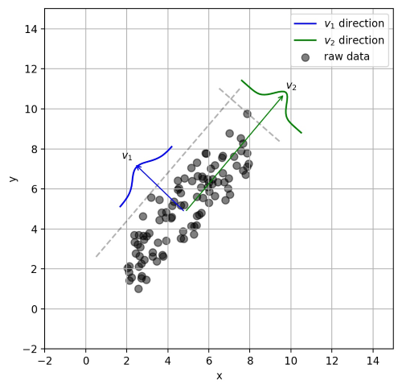 |  |

​                                       图2-2 各种常见算法图示

### 2.1.4 计算图的导数计算

​   计算图导数计算是反向传播，利用链式法则和隐式函数求导。

​   假设 $z = f(u,v)$ 在点 $(u,v)$ 处偏导连续，$(u,v)$是关于 $t$ 的函数，在 $t$ 点可导，求 $z$ 在 $t$ 点的导数。

根据链式法则有
$$
\frac{dz}{dt}=\frac{\partial z}{\partial u}.\frac{du}{dt}+\frac{\partial z}{\partial v}
                .\frac{dv}{dt}
$$
​   链式法则用文字描述:“由两个函数凑起来的复合函数，其导数等于里边函数代入外边函数的值之导数，乘以里边函数的导数。  
​   为了便于理解，下面举例说明：
$$
f(x)=x^2,g(x)=2x+1
$$
​   则:
$$
{f[g(x)]}'=2[g(x)] \times g'(x)=2[2x+1] \times 2=8x+4
$$

### 2.1.5 理解局部最优与全局最优

​   笑谈局部最优和全局最优

> ​ 柏拉图有一天问老师苏格拉底什么是爱情？苏格拉底叫他到麦田走一次，摘一颗最大的麦穗回来，不许回头，只可摘一次。柏拉图空着手出来了，他的理由是，看见不错的，却不知道是不是最好的，一次次侥幸，走到尽头时，才发现还不如前面的，于是放弃。苏格拉底告诉他：“这就是爱情。”这故事让我们明白了一个道理，因为生命的一些不确定性，所以全局最优解是很难寻找到的，或者说根本就不存在，我们应该设置一些限定条件，然后在这个范围内寻找最优解，也就是局部最优解——有所斩获总比空手而归强，哪怕这种斩获只是一次有趣的经历。
> ​ 柏拉图有一天又问什么是婚姻？苏格拉底叫他到树林走一次,选一棵最好的树做圣诞树，也是不许回头，只许选一次。这次他一身疲惫地拖了一棵看起来直挺、翠绿，却有点稀疏的杉树回来，他的理由是，有了上回的教训，好不容易看见一棵看似不错的，又发现时间、体力已经快不够用了，也不管是不是最好的，就拿回来了。苏格拉底告诉他：“这就是婚姻。”

​   优化问题一般分为局部最优和全局最优。其中，

（1）局部最优，就是在函数值空间的一个有限区域内寻找最小值；而全局最优，是在函数值空间整个区域寻找最小值问题。

（2）函数局部最小点是它的函数值小于或等于附近点的点，但是有可能大于较远距离的点。

（3）全局最小点是那种它的函数值小于或等于所有的可行点。

### 2.1.5 大数据与深度学习之间的关系

首先来看大数据、机器学习及数据挖掘三者简单的定义：

**大数据**通常被定义为“超出常用软件工具捕获，管理和处理能力”的数据集。 
**机器学习**关心的问题是如何构建计算机程序使用经验自动改进。
**数据挖掘**是从数据中提取模式的特定算法的应用，在数据挖掘中，重点在于算法的应用，而不是算法本身。

**机器学习和数据挖掘**之间的关系如下：
数据挖掘是一个过程，在此过程中机器学习算法被用作提取数据集中的潜在有价值模式的工具。
大数据与深度学习关系总结如下：

（1）深度学习是一种模拟大脑的行为。可以从所学习对象的机制以及行为等等很多相关联的方面进行学习，模仿类型行为以及思维。

（2）深度学习对于大数据的发展有帮助。深度学习对于大数据技术开发的每一个阶段均有帮助，不管是数据的分析还是挖掘还是建模，只有深度学习，这些工作才会有可能一一得到实现。

（3）深度学习转变了解决问题的思维。很多时候发现问题到解决问题，走一步看一步不是一个主要的解决问题的方式了，在深度学习的基础上，要求我们从开始到最后都要基于一个目标，为了需要优化的那个最终目标去进行处理数据以及将数据放入到数据应用平台上去，这就是端到端（End to End）。

（4）大数据的深度学习需要一个框架。在大数据方面的深度学习都是从基础的角度出发的，深度学习需要一个框架或者一个系统。总而言之，将你的大数据通过深度分析变为现实，这就是深度学习和大数据的最直接关系。

## 2.2 机器学习学习方式

​   根据数据类型的不同，对一个问题的建模有不同的方式。依据不同的学习方式和输入数据，机器学习主要分为以下四种学习方式。

### 2.2.1 监督学习

​   特点：监督学习是使用已知正确答案的示例来训练网络。已知数据和其一一对应的标签，训练一个预测模型，将输入数据映射到标签的过程。

​   常见应用场景：监督式学习的常见应用场景如分类问题和回归问题。

​   算法举例：常见的有监督机器学习算法包括支持向量机(Support Vector Machine, SVM)，朴素贝叶斯(Naive Bayes)，逻辑回归(Logistic Regression)，K近邻(K-Nearest Neighborhood, KNN)，决策树(Decision Tree)，随机森林(Random Forest)，AdaBoost以及线性判别分析(Linear Discriminant Analysis, LDA)等。深度学习(Deep Learning)也是大多数以监督学习的方式呈现。

### 2.2.2 非监督式学习

​   定义：在非监督式学习中，数据并不被特别标识，适用于你具有数据集但无标签的情况。学习模型是为了推断出数据的一些内在结构。

​   常见应用场景：常见的应用场景包括关联规则的学习以及聚类等。

​   算法举例：常见算法包括Apriori算法以及k-Means算法。

### 2.2.3 半监督式学习

​   特点：在此学习方式下，输入数据部分被标记，部分没有被标记，这种学习模型可以用来进行预测。

​   常见应用场景：应用场景包括分类和回归，算法包括一些对常用监督式学习算法的延伸，通过对已标记数据建模，在此基础上，对未标记数据进行预测。

​   算法举例：常见算法如图论推理算法（Graph Inference）或者拉普拉斯支持向量机（Laplacian SVM）等。

### 2.2.4 弱监督学习

​   特点：弱监督学习可以看做是有多个标记的数据集合，次集合可以是空集，单个元素，或包含多种情况（没有标记，有一个标记，和有多个标记）的多个元素。 数据集的标签是不可靠的，这里的不可靠可以是标记不正确，多种标记，标记不充分，局部标记等。已知数据和其一一对应的弱标签，训练一个智能算法，将输入数据映射到一组更强的标签的过程。标签的强弱指的是标签蕴含的信息量的多少，比如相对于分割的标签来说，分类的标签就是弱标签。

​   算法举例：举例，给出一张包含气球的图片，需要得出气球在图片中的位置及气球和背景的分割线，这就是已知弱标签学习强标签的问题。

​   在企业数据应用的场景下， 人们最常用的可能就是监督式学习和非监督式学习的模型。 在图像识别等领域，由于存在大量的非标识的数据和少量的可标识数据， 目前半监督式学习是一个很热的话题。

### 2.2.5 监督学习有哪些步骤
​   监督学习是使用已知正确答案的示例来训练网络，每组训练数据有一个明确的标识或结果。想象一下，我们可以训练一个网络，让其从照片库中（其中包含气球的照片）识别出气球的照片。以下就是我们在这个假设场景中所要采取的步骤。

**步骤1：数据集的创建和分类**
​   首先，浏览你的照片（数据集），确定所有包含气球的照片，并对其进行标注。然后，将所有照片分为训练集和验证集。目标就是在深度网络中找一函数，这个函数输入是任意一张照片，当照片中包含气球时，输出1，否则输出0。

**步骤2：数据增强（Data Augmentation）**
​   当原始数据搜集和标注完毕，一般搜集的数据并不一定包含目标在各种扰动下的信息。数据的好坏对于机器学习模型的预测能力至关重要，因此一般会进行数据增强。对于图像数据来说，数据增强一般包括，图像旋转，平移，颜色变换，裁剪，仿射变换等。

**步骤3：特征工程（Feature Engineering）**
​   一般来讲，特征工程包含特征提取和特征选择。常见的手工特征(Hand-Crafted Feature)有尺度不变特征变换(Scale-Invariant Feature Transform, SIFT)，方向梯度直方图(Histogram of Oriented Gradient, HOG)等。由于手工特征是启发式的，其算法设计背后的出发点不同，将这些特征组合在一起的时候有可能会产生冲突，如何将组合特征的效能发挥出来，使原始数据在特征空间中的判别性最大化，就需要用到特征选择的方法。在深度学习方法大获成功之后，人们很大一部分不再关注特征工程本身。因为，最常用到的卷积神经网络(Convolutional Neural Networks, CNNs)本身就是一种特征提取和选择的引擎。研究者提出的不同的网络结构、正则化、归一化方法实际上就是深度学习背景下的特征工程。

**步骤4：构建预测模型和损失**
​   将原始数据映射到特征空间之后，也就意味着我们得到了比较合理的输入。下一步就是构建合适的预测模型得到对应输入的输出。而如何保证模型的输出和输入标签的一致性，就需要构建模型预测和标签之间的损失函数，常见的损失函数(Loss Function)有交叉熵、均方差等。通过优化方法不断迭代，使模型从最初的初始化状态一步步变化为有预测能力的模型的过程，实际上就是学习的过程。

**步骤5：训练**
​   选择合适的模型和超参数进行初始化，其中超参数比如支持向量机中核函数、误差项惩罚权重等。当模型初始化参数设定好后，将制作好的特征数据输入到模型，通过合适的优化方法不断缩小输出与标签之间的差距，当迭代过程到了截止条件，就可以得到训练好的模型。优化方法最常见的就是梯度下降法及其变种，使用梯度下降法的前提是优化目标函数对于模型是可导的。

**步骤6：验证和模型选择**
​   训练完训练集图片后，需要进行模型测试。利用验证集来验证模型是否可以准确地挑选出含有气球在内的照片。
​   在此过程中，通常会通过调整和模型相关的各种事物（超参数）来重复步骤2和3，诸如里面有多少个节点，有多少层，使用怎样的激活函数和损失函数，如何在反向传播阶段积极有效地训练权值等等。

**步骤7：测试及应用**
​   当有了一个准确的模型，就可以将该模型部署到你的应用程序中。你可以将预测功能发布为API（Application Programming Interface, 应用程序编程接口）调用，并且你可以从软件中调用该API，从而进行推理并给出相应的结果。

## 2.8 分类算法

​   分类算法和回归算法是对真实世界不同建模的方法。分类模型是认为模型的输出是离散的，例如大自然的生物被划分为不同的种类，是离散的。回归模型的输出是连续的，例如人的身高变化过程是一个连续过程，而不是离散的。

​   因此，在实际建模过程时，采用分类模型还是回归模型，取决于你对任务（真实世界）的分析和理解。

### 2.8.1 常用分类算法的优缺点？
​   接下来我们介绍常用分类算法的优缺点，如表2-1所示。

​                                   表2-1 常用分类算法的优缺点
|算法|优点|缺点|
|:-|:-|:-|
|Bayes 贝叶斯分类法|1）所需估计的参数少，对于缺失数据不敏感。 2）有着坚实的数学基础，以及稳定的分类效率。|1）需要假设属性之间相互独立，这往往并不成立。（喜欢吃番茄、鸡蛋，却不喜欢吃番茄炒蛋）。 2）需要知道先验概率。 3）分类决策存在错误率。|
|Decision Tree决策树|1）不需要任何领域知识或参数假设。 2）适合高维数据。 3）简单易于理解。 4）短时间内处理大量数据，得到可行且效果较好的结果。 5）能够同时处理数据型和常规性属性。|1）对于各类别样本数量不一致数据，信息增益偏向于那些具有更多数值的特征。 2）易于过拟合。 3）忽略属性之间的相关性。 4）不支持在线学习。|
|SVM支持向量机|1）可以解决小样本下机器学习的问题。 2）提高泛化性能。 3）可以解决高维、非线性问题。超高维文本分类仍受欢迎。 4）避免神经网络结构选择和局部极小的问题。|1）对缺失数据敏感。 2）内存消耗大，难以解释。 3）运行和调参略烦人。|
|KNN K近邻|1）思想简单，理论成熟，既可以用来做分类也可以用来做回归；  2）可用于非线性分类；  3）训练时间复杂度为O(n)；  4）准确度高，对数据没有假设，对outlier不敏感；|1）计算量太大。 2）对于样本分类不均衡的问题，会产生误判。 3）需要大量的内存。 4）输出的可解释性不强。|
|Logistic Regression逻辑回归|1）速度快。 2）简单易于理解，直接看到各个特征的权重。 3）能容易地更新模型吸收新的数据。 4）如果想要一个概率框架，动态调整分类阀值。|特征处理复杂。需要归一化和较多的特征工程。|
|Neural Network 神经网络|1）分类准确率高。 2）并行处理能力强。 3）分布式存储和学习能力强。 4）鲁棒性较强，不易受噪声影响。|1）需要大量参数（网络拓扑、阀值、阈值）。 2）结果难以解释。 3）训练时间过长。|
|Adaboosting|1）adaboost是一种有很高精度的分类器。 2）可以使用各种方法构建子分类器，Adaboost算法提供的是框架。 3）当使用简单分类器时，计算出的结果是可以理解的。而且弱分类器构造极其简单。 4）简单，不用做特征筛选。 5）不用担心overfitting。|对outlier比较敏感|

### 2.8.2 分类算法的评估方法
​   分类评估方法主要功能是用来评估分类算法的好坏，而评估一个分类器算法的好坏又包括许多项指标。了解各种评估方法，在实际应用中选择正确的评估方法是十分重要的。
- **几个常用术语**
  ​ 这里首先介绍几个常见的模型评价术语，现在假设我们的分类目标只有两类，计为正例（positive）和负例（negative）分别是：
   1) True positives(TP):  被正确地划分为正例的个数，即实际为正例且被分类器划分为正例的实例数；
   2) False positives(FP): 被错误地划分为正例的个数，即实际为负例但被分类器划分为正例的实例数；
   3) False negatives(FN):被错误地划分为负例的个数，即实际为正例但被分类器划分为负例的实例数；
   4) True negatives(TN): 被正确地划分为负例的个数，即实际为负例且被分类器划分为负例的实例数。　

  ​                                 表2-2 四个术语的混淆矩阵

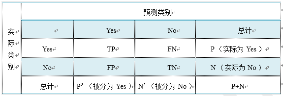

表2-2是这四个术语的混淆矩阵，做以下说明：
    1）P=TP+FN表示实际为正例的样本个数。
    2）True、False描述的是分类器是否判断正确。
    3）Positive、Negative是分类器的分类结果，如果正例计为1、负例计为-1，即positive=1、negative=-1。用1表示True，-1表示False，那么实际的类标=TF\*PN，TF为true或false，PN为positive或negative。
    4）例如True positives(TP)的实际类标=1\*1=1为正例，False positives(FP)的实际类标=(-1)\*1=-1为负例，False negatives(FN)的实际类标=(-1)\*(-1)=1为正例，True negatives(TN)的实际类标=1\*(-1)=-1为负例。

- **评价指标**
  1) 正确率（accuracy）
    正确率是我们最常见的评价指标，accuracy = (TP+TN)/(P+N)，正确率是被分对的样本数在所有样本数中的占比，通常来说，正确率越高，分类器越好。
  2) 错误率（error rate)
    错误率则与正确率相反，描述被分类器错分的比例，error rate = (FP+FN)/(P+N)，对某一个实例来说，分对与分错是互斥事件，所以accuracy =1 -  error rate。
  3) 灵敏度（sensitivity）
    sensitivity = TP/P，表示的是所有正例中被分对的比例，衡量了分类器对正例的识别能力。
  4) 特异性（specificity)
    specificity = TN/N，表示的是所有负例中被分对的比例，衡量了分类器对负例的识别能力。
  5) 精度（precision）
    precision=TP/(TP+FP)，精度是精确性的度量，表示被分为正例的示例中实际为正例的比例。
  6) 召回率（recall）
    召回率是覆盖面的度量，度量有多个正例被分为正例，recall=TP/(TP+FN)=TP/P=sensitivity，可以看到召回率与灵敏度是一样的。
  7) 其他评价指标
    计算速度：分类器训练和预测需要的时间；
    鲁棒性：处理缺失值和异常值的能力；
    可扩展性：处理大数据集的能力；
    可解释性：分类器的预测标准的可理解性，像决策树产生的规则就是很容易理解的，而神经网络的一堆参数就不好理解，我们只好把它看成一个黑盒子。
  8) 精度和召回率反映了分类器分类性能的两个方面。如果综合考虑查准率与查全率，可以得到新的评价指标F1-score，也称为综合分类率：$F1=\frac{2 \times precision \times recall}{precision + recall}$。

​   为了综合多个类别的分类情况，评测系统整体性能，经常采用的还有微平均F1（micro-averaging）和宏平均F1（macro-averaging ）两种指标。

​   （1）宏平均F1与微平均F1是以两种不同的平均方式求的全局F1指标。

​   （2）宏平均F1的计算方法先对每个类别单独计算F1值，再取这些F1值的算术平均值作为全局指标。

​   （3）微平均F1的计算方法是先累加计算各个类别的a、b、c、d的值，再由这些值求出F1值。

​   （4）由两种平均F1的计算方式不难看出，宏平均F1平等对待每一个类别，所以它的值主要受到稀有类别的影响，而微平均F1平等考虑文档集中的每一个文档，所以它的值受到常见类别的影响比较大。

- **ROC曲线和PR曲线**

​   如图2-3，ROC曲线是（Receiver Operating Characteristic Curve，受试者工作特征曲线）的简称，是以灵敏度（真阳性率）为纵坐标，以1减去特异性（假阳性率）为横坐标绘制的性能评价曲线。可以将不同模型对同一数据集的ROC曲线绘制在同一笛卡尔坐标系中，ROC曲线越靠近左上角，说明其对应模型越可靠。也可以通过ROC曲线下面的面积（Area Under Curve, AUC）来评价模型，AUC越大，模型越可靠。

​                                                                            图2-3 ROC曲线

​   PR曲线是Precision Recall Curve的简称，描述的是precision和recall之间的关系，以recall为横坐标，precision为纵坐标绘制的曲线。该曲线的所对应的面积AUC实际上是目标检测中常用的评价指标平均精度（Average Precision, AP）。AP越高，说明模型性能越好。

### 2.8.3 正确率能很好的评估分类算法吗

​   不同算法有不同特点，在不同数据集上有不同的表现效果，根据特定的任务选择不同的算法。如何评价分类算法的好坏，要做具体任务具体分析。对于决策树，主要用正确率去评估，但是其他算法，只用正确率能很好的评估吗？
​   答案是否定的。
​   正确率确实是一个很直观很好的评价指标，但是有时候正确率高并不能完全代表一个算法就好。比如对某个地区进行地震预测，地震分类属性分为0：不发生地震、1发生地震。我们都知道，不发生的概率是极大的，对于分类器而言，如果分类器不加思考，对每一个测试样例的类别都划分为0，达到99%的正确率，但是，问题来了，如果真的发生地震时，这个分类器毫无察觉，那带来的后果将是巨大的。很显然，99%正确率的分类器并不是我们想要的。出现这种现象的原因主要是数据分布不均衡，类别为1的数据太少，错分了类别1但达到了很高的正确率缺忽视了研究者本身最为关注的情况。

### 2.8.4 什么样的分类器是最好的
​   对某一个任务，某个具体的分类器不可能同时满足或提高所有上面介绍的指标。
​   如果一个分类器能正确分对所有的实例，那么各项指标都已经达到最优，但这样的分类器往往不存在。比如之前说的地震预测，既然不能百分百预测地震的发生，但实际情况中能容忍一定程度的误报。假设在1000次预测中，共有5次预测发生了地震，真实情况中有一次发生了地震，其他4次则为误报。正确率由原来的999/1000=99.9下降为996/1000=99.6。召回率由0/1=0%上升为1/1=100%。对此解释为，虽然预测失误了4次，但真的地震发生前，分类器能预测对，没有错过，这样的分类器实际意义更为重大，正是我们想要的。在这种情况下，在一定正确率前提下，要求分类器的召回率尽量高。

## 2.9 逻辑回归

### 2.9.1 回归划分

广义线性模型家族里，依据因变量不同，可以有如下划分：

（1）如果是连续的，就是多重线性回归。

（2）如果是二项分布，就是逻辑回归。

（3）如果是泊松（Poisson）分布，就是泊松回归。

（4）如果是负二项分布，就是负二项回归。

（5）逻辑回归的因变量可以是二分类的，也可以是多分类的，但是二分类的更为常用，也更加容易解释。所以实际中最常用的就是二分类的逻辑回归。

### 2.9.2 逻辑回归适用性

逻辑回归可用于以下几个方面：

（1）用于概率预测。用于可能性预测时，得到的结果有可比性。比如根据模型进而预测在不同的自变量情况下，发生某病或某种情况的概率有多大。

（2）用于分类。实际上跟预测有些类似，也是根据模型，判断某人属于某病或属于某种情况的概率有多大，也就是看一下这个人有多大的可能性是属于某病。进行分类时，仅需要设定一个阈值即可，可能性高于阈值是一类，低于阈值是另一类。

（3）寻找危险因素。寻找某一疾病的危险因素等。

（4）仅能用于线性问题。只有当目标和特征是线性关系时，才能用逻辑回归。在应用逻辑回归时注意两点：一是当知道模型是非线性时，不适用逻辑回归；二是当使用逻辑回归时，应注意选择和目标为线性关系的特征。

（5）各特征之间不需要满足条件独立假设，但各个特征的贡献独立计算。

### 2.9.3 逻辑回归与朴素贝叶斯有什么区别

逻辑回归与朴素贝叶斯区别有以下几个方面：

（1）逻辑回归是判别模型， 朴素贝叶斯是生成模型，所以生成和判别的所有区别它们都有。

（2）朴素贝叶斯属于贝叶斯，逻辑回归是最大似然，两种概率哲学间的区别。

（3）朴素贝叶斯需要条件独立假设。

（4）逻辑回归需要求特征参数间是线性的。

### 2.9.4 线性回归与逻辑回归的区别

线性回归与逻辑回归的区别如下描述：

（1）线性回归的样本的输出，都是连续值，$ y\in (-\infty ,+\infty )$，而逻辑回归中$y\in (0,1)$，只能取0和1。

（2）对于拟合函数也有本质上的差别： 

​   线性回归：$f(x)=\theta ^{T}x=\theta _{1}x _{1}+\theta _{2}x _{2}+...+\theta _{n}x _{n}$

​   逻辑回归：$f(x)=P(y=1|x;\theta )=g(\theta ^{T}x)$，其中，$g(z)=\frac{1}{1+e^{-z}}$

​   可以看出，线性回归的拟合函数，是对f(x)的输出变量y的拟合，而逻辑回归的拟合函数是对为1类样本的概率的拟合。

​   那么，为什么要以1类样本的概率进行拟合呢，为什么可以这样拟合呢？ 

​   $\theta ^{T}x=0$就相当于是1类和0类的决策边界： 

​   当$\theta ^{T}x>0$，则y>0.5；若$\theta ^{T}x\rightarrow +\infty $，则$y \rightarrow  1 $，即y为1类; 

​   当$\theta ^{T}x<0$，则y<0.5；若$\theta ^{T}x\rightarrow -\infty $，则$y \rightarrow  0 $，即y为0类; 

这个时候就能看出区别，在线性回归中$\theta ^{T}x$为预测值的拟合函数；而在逻辑回归中$\theta ^{T}x$为决策边界。下表2-3为线性回归和逻辑回归的区别。

​                                   表2-3 线性回归和逻辑回归的区别

|         | 线性回归         | 逻辑回归  |
|:-------------:|:-------------:|:-----:|
| 目的     | 预测 |分类 |
|  $y^{(i)}$   | 未知     |   （0,1）|
| 函数 | 拟合函数     |   预测函数 |
| 参数计算方式| 最小二乘法      |    极大似然估计 |

下面具体解释一下： 

1. 拟合函数和预测函数什么关系呢？简单来说就是将拟合函数做了一个逻辑函数的转换，转换后使得$y^{(i)} \in (0,1)$;
2. 最小二乘和最大似然估计可以相互替代吗？回答当然是不行了。我们来看看两者依仗的原理：最大似然估计是计算使得数据出现的可能性最大的参数，依仗的自然是Probability。而最小二乘是计算误差损失。

## 2.10 代价函数

### 2.10.1 为什么需要代价函数

1. 为了得到训练逻辑回归模型的参数，需要一个代价函数，通过训练代价函数来得到参数。
2. 用于找到最优解的目的函数。

### 2.10.2 代价函数作用原理 
​   在回归问题中，通过代价函数来求解最优解，常用的是平方误差代价函数。假设函数图像如图2-4所示，当参数发生变化时，假设函数状态也会随着变化。

​                                       图2-4  $h(x) = A + Bx$函数示意图

​   想要拟合图中的离散点，我们需要尽可能找到最优的$A$和$B$来使这条直线更能代表所有数据。如何找到最优解呢，这就需要使用代价函数来求解，以平方误差代价函数为例，假设函数为$h(x)=\theta_0x$。
​   **平方误差代价函数的主要思想**就是将实际数据给出的值与拟合出的线的对应值做差，求出拟合出的直线与实际的差距。在实际应用中，为了避免因个别极端数据产生的影响，采用类似方差再取二分之一的方式来减小个别数据的影响。因此，引出代价函数：
$$
J(\theta_0, \theta_1) = \frac{1}{m}\sum_{i=1}^m(h(x^{(i)})-y^{(i)})^2
$$

​   **最优解即为代价函数的最小值**$\min J(\theta_0, \theta_1)$。如果是1个参数，代价函数一般通过二维曲线便可直观看出。如果是2个参数，代价函数通过三维图像可看出效果，参数越多，越复杂。
当参数为2个时，代价函数是三维图像，如下图2-5所示。

​                                       图2-5  代价函数三维图像

### 2.10.3 为什么代价函数要非负

​   目标函数存在一个下界，在优化过程当中，如果优化算法能够使目标函数不断减小，根据单调有界准则，这个优化算法就能证明是收敛有效的。
​   只要设计的目标函数有下界，基本上都可以，代价函数非负更为方便。

### 2.10.4 常见代价函数
（1）**二次代价函数（quadratic cost）**：
$$
J = \frac{1}{2n}\sum_x\Vert y(x)-a^L(x)\Vert^2
$$

​   其中，$J$表示代价函数，$x$表示样本，$y$表示实际值，$a$表示输出值，$n$表示样本的总数。使用一个样本为例简单说明，此时二次代价函数为：
$$
J = \frac{(y-a)^2}{2}
$$
​   假如使用梯度下降法（Gradient descent）来调整权值参数的大小，权值$w$和偏置$b$的梯度推导如下：
$$
\frac{\partial J}{\partial b}=(a-y)\sigma'(z)
$$
其中，$z$表示神经元的输入，$\sigma$表示激活函数。权值$w$和偏置$b$的梯度跟激活函数的梯度成正比，激活函数的梯度越大，权值$w$和偏置$b$的大小调整得越快，训练收敛得就越快。

*注*：神经网络常用的激活函数为sigmoid函数，该函数的曲线如下图2-6所示：

​                                               图2-6 sigmoid函数曲线

如上图所示，对0.88和0.98两个点进行比较：
​   假设目标是收敛到1.0。0.88离目标1.0比较远，梯度比较大，权值调整比较大。0.98离目标1.0比较近，梯度比较小，权值调整比较小。调整方案合理。
​   假如目标是收敛到0。0.88离目标0比较近，梯度比较大，权值调整比较大。0.98离目标0比较远，梯度比较小，权值调整比较小。调整方案不合理。
​   原因：在使用sigmoid函数的情况下, 初始的代价（误差）越大，导致训练越慢。

（2）**交叉熵代价函数（cross-entropy）**：
$$
J = -\frac{1}{n}\sum_x[y\ln a + (1-y)\ln{(1-a)}]
$$

其中，$J$表示代价函数，$x$表示样本，$y$表示实际值，$a$表示输出值，$n$表示样本的总数。
    权值$w$和偏置$b$的梯度推导如下：
$$
\frac{\partial J}{\partial w_j}=\frac{1}{n}\sum_{x}x_j(\sigma{(z)}-y)\;，
\frac{\partial J}{\partial b}=\frac{1}{n}\sum_{x}(\sigma{(z)}-y)
$$

当误差越大时，梯度就越大，权值$w$和偏置$b$调整就越快，训练的速度也就越快。
**二次代价函数适合输出神经元是线性的情况，交叉熵代价函数适合输出神经元是S型函数的情况。**

（3）**对数似然代价函数（log-likelihood cost）**：
对数似然函数常用来作为softmax回归的代价函数。深度学习中普遍的做法是将softmax作为最后一层，此时常用的代价函数是对数似然代价函数。
    对数似然代价函数与softmax的组合和交叉熵与sigmoid函数的组合非常相似。对数似然代价函数在二分类时可以化简为交叉熵代价函数的形式。
在tensorflow中：
    与sigmoid搭配使用的交叉熵函数：`tf.nn.sigmoid_cross_entropy_with_logits()`。
    与softmax搭配使用的交叉熵函数：`tf.nn.softmax_cross_entropy_with_logits()`。
在pytorch中：
        与sigmoid搭配使用的交叉熵函数：`torch.nn.BCEWithLogitsLoss()`。
    与softmax搭配使用的交叉熵函数：`torch.nn.CrossEntropyLoss()`。

### 2.10.5 为什么用交叉熵代替二次代价函数
（1）**为什么不用二次方代价函数**
由上一节可知，权值$w$和偏置$b$的偏导数为$\frac{\partial J}{\partial w}=(a-y)\sigma'(z)x$，$\frac{\partial J}{\partial b}=(a-y)\sigma'(z)$， 偏导数受激活函数的导数影响，sigmoid函数导数在输出接近0和1时非常小，会导致一些实例在刚开始训练时学习得非常慢。

（2）**为什么要用交叉熵**
交叉熵函数权值$w$和偏置$b$的梯度推导为：
$$
\frac{\partial J}{\partial w_j}=\frac{1}{n}\sum_{x}x_j(\sigma{(z)}-y)\;，
\frac{\partial J}{\partial b}=\frac{1}{n}\sum_{x}(\sigma{(z)}-y)
$$

由以上公式可知，权重学习的速度受到$\sigma{(z)}-y$影响，更大的误差，就有更快的学习速度，避免了二次代价函数方程中因$\sigma'{(z)}$导致的学习缓慢的情况。

## 2.11 损失函数

### 2.11.1 什么是损失函数

​   损失函数（Loss Function）又叫做误差函数，用来衡量算法的运行情况，估量模型的预测值与真实值的不一致程度，是一个非负实值函数，通常使用$
L(Y, f(x))$来表示。损失函数越小，模型的鲁棒性就越好。损失函数是经验风险函数的核心部分，也是结构风险函数重要组成部分。

### 2.11.2 常见的损失函数
​   机器学习通过对算法中的目标函数进行不断求解优化，得到最终想要的结果。分类和回归问题中，通常使用损失函数或代价函数作为目标函数。
​   损失函数用来评价预测值和真实值不一样的程度。通常损失函数越好，模型的性能也越好。
​   损失函数可分为经验风险损失函数和结构风险损失函数。经验风险损失函数指预测结果和实际结果的差别，结构风险损失函数是在经验风险损失函数上加上正则项。
​   下面介绍常用的损失函数：

（1）**0-1损失函数**
如果预测值和目标值相等，值为0，如果不相等，值为1。
$$
L(Y, f(x)) =
\begin{cases}
1,& Y\ne f(x)\\
0,& Y = f(x)
\end{cases}
$$

一般的在实际使用中，相等的条件过于严格，可适当放宽条件：

$$
L(Y, f(x)) =
\begin{cases}
1,& |Y-f(x)|\geqslant T\\
0,& |Y-f(x)|< T
\end{cases}
$$

（2）**绝对值损失函数**
和0-1损失函数相似，绝对值损失函数表示为：
$$
L(Y, f(x)) = |Y-f(x)|​
$$

（3）**平方损失函数**
$$
L(Y, f(x)) = \sum_N{(Y-f(x))}^2
$$

这点可从最小二乘法和欧几里得距离角度理解。最小二乘法的原理是，最优拟合曲线应该使所有点到回归直线的距离和最小。

（4）**对数损失函数**
$$
L(Y, P(Y|X)) = -\log{P(Y|X)}
$$

​   常见的逻辑回归使用的就是对数损失函数，有很多人认为逻辑回归的损失函数是平方损失，其实不然。逻辑回归它假设样本服从伯努利分布（0-1分布），进而求得满足该分布的似然函数，接着取对数求极值等。逻辑回归推导出的经验风险函数是最小化负的似然函数，从损失函数的角度看，就是对数损失函数。

（6）**指数损失函数**
指数损失函数的标准形式为：
$$
L(Y, f(x)) = \exp(-Yf(x))
$$

例如AdaBoost就是以指数损失函数为损失函数。

（7）**Hinge损失函数**
Hinge损失函数的标准形式如下：
$$
L(y) = \max{(0, 1-ty)}
$$

统一的形式：
$$
L(Y, f(x)) = \max{(0, Yf(x))}
$$

其中y是预测值，范围为(-1,1)，t为目标值，其为-1或1。

在线性支持向量机中，最优化问题可等价于

$$
\underset{\min}{w,b}\sum_{i=1}^N (1-y_i(wx_i+b))+\lambda\Vert w\Vert ^2
$$

上式相似于下式

$$
\frac{1}{m}\sum_{i=1}^{N}l(wx_i+by_i) + \Vert w\Vert ^2
$$

其中$l(wx_i+by_i)$是Hinge损失函数，$\Vert w\Vert ^2$可看做为正则化项。

### 2.11.3 逻辑回归为什么使用对数损失函数
假设逻辑回归模型
$$
P(y=1|x;\theta)=\frac{1}{1+e^{-\theta^{T}x}}
$$
假设逻辑回归模型的概率分布是伯努利分布，其概率质量函数为：
$$
P(X=n)=
\begin{cases}
1-p, n=0\\
 p,n=1
\end{cases}
$$
其似然函数为：
$$
L(\theta)=\prod_{i=1}^{m}
P(y=1|x_i)^{y_i}P(y=0|x_i)^{1-y_i}
$$
对数似然函数为：
$$
\ln L(\theta)=\sum_{i=1}^{m}[y_i\ln{P(y=1|x_i)}+(1-y_i)\ln{P(y=0|x_i)}]\\
  =\sum_{i=1}^m[y_i\ln{P(y=1|x_i)}+(1-y_i)\ln(1-P(y=1|x_i))]
$$
对数函数在单个数据点上的定义为：
$$
cost(y,p(y|x))=-y\ln{p(y|x)-(1-y)\ln(1-p(y|x))}
$$
则全局样本损失函数为：
$$
cost(y,p(y|x)) = -\sum_{i=1}^m[y_i\ln p(y_i|x_i)+(1-y_i)\ln(1-p(y_i|x_i))]
$$
由此可看出，对数损失函数与极大似然估计的对数似然函数本质上是相同的。所以逻辑回归直接采用对数损失函数。

### 2.11.4 对数损失函数是如何度量损失的
​   例如，在高斯分布中，我们需要确定均值和标准差。
​   如何确定这两个参数？最大似然估计是比较常用的方法。最大似然的目标是找到一些参数值，这些参数值对应的分布可以最大化观测到数据的概率。
​   因为需要计算观测到所有数据的全概率，即所有观测到的数据点的联合概率。现考虑如下简化情况：

（1）假设观测到每个数据点的概率和其他数据点的概率是独立的。

（2）取自然对数。
假设观测到单个数据点$x_i(i=1,2,...n)$的概率为：
$$
P(x_i;\mu,\sigma)=\frac{1}{\sigma \sqrt{2\pi}}\exp 
        \left( - \frac{(x_i-\mu)^2}{2\sigma^2} \right)
$$

（3）其联合概率为：
$$
P(x_1,x_2,...,x_n;\mu,\sigma)=\frac{1}{\sigma \sqrt{2\pi}}\exp 
        \left( - \frac{(x_1-\mu)^2}{2\sigma^2} \right) \\ \times
         \frac{1}{\sigma \sqrt{2\pi}}\exp 
        \left( - \frac{(x_2-\mu)^2}{2\sigma^2} \right) \times ... \times
        \frac{1}{\sigma \sqrt{2\pi}}\exp 
        \left( - \frac{(x_n-\mu)^2}{2\sigma^2} \right)
$$
​   对上式取自然对数，可得：
$$
 \ln(P(x_1,x_2,...x_n;\mu,\sigma))=
        \ln \left(\frac{1}{\sigma \sqrt{2\pi}} \right) 
         - \frac{(x_1-\mu)^2}{2\sigma^2}  \\ +
         \ln \left( \frac{1}{\sigma \sqrt{2\pi}} \right) 
         - \frac{(x_2-\mu)^2}{2\sigma^2} +...+
         \ln \left( \frac{1}{\sigma \sqrt{2\pi}} \right) 
         - \frac{(x_n-\mu)^2}{2\sigma^2}
$$
根据对数定律，上式可以化简为：
$$
\ln(P(x_1,x_2,...x_n;\mu,\sigma))=-n\ln(\sigma)-\frac{n}{2} \ln(2\pi)\\
        -\frac{1}{2\sigma^2}[(x_1-\mu)^2+(x_2-\mu)^2+...+(x_n-\mu)^2]
$$
然后求导为：
$$
\frac{\partial\ln(P(x_1,x_2,...,x_n;\mu,\sigma))}{\partial\mu}=
                \frac{n}{\sigma^2}[\mu - (x_1+x_2+...+x_n)]
$$
​     上式左半部分为对数损失函数。损失函数越小越好，因此我们令等式左半的对数损失函数为0，可得：
$$
\mu=\frac{x_1+x_2+...+x_n}{n}
$$
同理，可计算$\sigma $。

## 2.12 梯度下降

### 2.12.1 机器学习中为什么需要梯度下降

梯度下降是机器学习中常见优化算法之一，梯度下降法有以下几个作用：

（1）梯度下降是迭代法的一种，可以用于求解最小二乘问题。

（2）在求解机器学习算法的模型参数，即无约束优化问题时，主要有梯度下降法（Gradient Descent）和最小二乘法。

（3）在求解损失函数的最小值时，可以通过梯度下降法来一步步的迭代求解，得到最小化的损失函数和模型参数值。

（4）如果我们需要求解损失函数的最大值，可通过梯度上升法来迭代。梯度下降法和梯度上升法可相互转换。

（5）在机器学习中，梯度下降法主要有随机梯度下降法和批量梯度下降法。

### 2.12.2 梯度下降法缺点

梯度下降法缺点有以下几点：

（1）靠近极小值时收敛速度减慢。

（2）直线搜索时可能会产生一些问题。

（3）可能会“之字形”地下降。

梯度概念也有需注意的地方：

（1）梯度是一个向量，即有方向有大小。 

（2）梯度的方向是最大方向导数的方向。 

（3）梯度的值是最大方向导数的值。

### 2.12.3 梯度下降法直观理解
梯度下降法经典图示如下图2.7所示：

​                                   图2.7 梯度下降法经典图示

​   形象化举例，由上图2.7所示，假如最开始，我们在一座大山上的某处位置，因为到处都是陌生的，不知道下山的路，所以只能摸索着根据直觉，走一步算一步，在此过程中，每走到一个位置的时候，都会求解当前位置的梯度，沿着梯度的负方向，也就是当前最陡峭的位置向下走一步，然后继续求解当前位置梯度，向这一步所在位置沿着最陡峭最易下山的位置走一步。不断循环求梯度，就这样一步步地走下去，一直走到我们觉得已经到了山脚。当然这样走下去，有可能我们不能走到山脚，而是到了某一个局部的山势低处。
​   由此，从上面的解释可以看出，梯度下降不一定能够找到全局的最优解，有可能是一个局部的最优解。当然，如果损失函数是凸函数，梯度下降法得到的解就一定是全局最优解。

**核心思想归纳**：

（1）初始化参数，随机选取取值范围内的任意数；

（2）迭代操作：
    a）计算当前梯度；
    b）修改新的变量；
    c）计算朝最陡的下坡方向走一步；
    d）判断是否需要终止，如否，返回a）；

（3）得到全局最优解或者接近全局最优解。

### 2.12.4 梯度下降法算法描述

梯度下降法算法步骤如下：

（1）确定优化模型的假设函数及损失函数。
​   举例，对于线性回归，假设函数为：
$$
  h_\theta(x_1,x_2,...,x_n)=\theta_0+\theta_1x_1+...+\theta_nx_n
$$
  其中，$\theta_i,x_i(i=0,1,2,...,n)$分别为模型参数、每个样本的特征值。
  对于假设函数，损失函数为：
$$
  J(\theta_0,\theta_1,...,\theta_n)=\frac{1}{2m}\sum^{m}_{j=0}(h_\theta (x^{(j)}_0
    ,x^{(j)}_1,...,x^{(j)}_n)-y_j)^2
$$

（2）相关参数初始化。
​   主要初始化${\theta}_i$、算法迭代步长${\alpha} $、终止距离${\zeta} $。初始化时可以根据经验初始化，即${\theta} $初始化为0，步长${\alpha} $初始化为1。当前步长记为${\varphi}_i $。当然，也可随机初始化。

（3）迭代计算。

​   1）计算当前位置时损失函数的梯度，对${\theta}_i $，其梯度表示为：
$$
\frac{\partial}{\partial \theta_i}J({\theta}_0,{\theta}_1,...,{\theta}_n)=\frac{1}{2m}\sum^{m}_{j=0}(h_\theta (x^{(j)}_0
    ,x^{(j)}_1,...,x^{(j)}_n)-y_j)^2
$$
​   2）计算当前位置下降的距离。
$$
{\varphi}_i={\alpha} \frac{\partial}{\partial \theta_i}J({\theta}_0,{\theta}_1,...,{\theta}_n)
$$
​   3）判断是否终止。
​   确定是否所有${\theta}_i$梯度下降的距离${\varphi}_i$都小于终止距离${\zeta}$，如果都小于${\zeta}$，则算法终止，当然的值即为最终结果，否则进入下一步。
​   4）更新所有的${\theta}_i$，更新后的表达式为：
$$
{\theta}_i={\theta}_i-\alpha \frac{\partial}{\partial \theta_i}J({\theta}_0,{\theta}_1,...,{\theta}_n)
$$
$$
\theta_i=\theta_i - \alpha \frac{1}{m} \sum^{m}_{j=0}(h_\theta (x^{(j)}_0
    ,x^{(j)}_1,...,x^{(j)}_n)-y_j)x^{(j)}_i
$$
​   5）令上式$x^{(j)}_0=1$，更新完毕后转入1)。
​   由此，可看出，当前位置的梯度方向由所有样本决定，上式中 $\frac{1}{m}$、$\alpha \frac{1}{m}$ 的目的是为了便于理解。

### 2.12.5 如何对梯度下降法进行调优
实际使用梯度下降法时，各项参数指标不能一步就达到理想状态，对梯度下降法调优主要体现在以下几个方面：

（1）**算法迭代步长$\alpha$选择。**
    在算法参数初始化时，有时根据经验将步长初始化为1。实际取值取决于数据样本。可以从大到小，多取一些值，分别运行算法看迭代效果，如果损失函数在变小，则取值有效。如果取值无效，说明要增大步长。但步长太大，有时会导致迭代速度过快，错过最优解。步长太小，迭代速度慢，算法运行时间长。

（2）**参数的初始值选择。**
    初始值不同，获得的最小值也有可能不同，梯度下降有可能得到的是局部最小值。如果损失函数是凸函数，则一定是最优解。由于有局部最优解的风险，需要多次用不同初始值运行算法，根据损失函数的最小值，选择损失函数最小化的初值。

（3）**标准化处理。**
    由于样本不同，特征取值范围也不同，导致迭代速度慢。为了减少特征取值的影响，可对特征数据标准化，使新期望为0，新方差为1，可节省算法运行时间。

### 2.12.6 随机梯度和批量梯度区别
​   随机梯度下降（SDG）和批量梯度下降（BDG）是两种主要梯度下降法，其目的是增加某些限制来加速运算求解。
下面通过介绍两种梯度下降法的求解思路，对其进行比较。
假设函数为：
$$
h_\theta (x_0,x_1,...,x_3) = \theta_0 x_0 + \theta_1 x_1 + ... + \theta_n x_n
$$
损失函数为：
$$
J(\theta_0, \theta_1, ... , \theta_n) = 
            \frac{1}{2m} \sum^{m}_{j=0}(h_\theta (x^{j}_0
    ,x^{j}_1,...,x^{j}_n)-y^j)^2
$$
其中，$m$为样本个数，$j$为参数个数。

1、 **批量梯度下降的求解思路如下：**
a) 得到每个$ \theta $对应的梯度：
$$
\frac{\partial}{\partial \theta_i}J({\theta}_0,{\theta}_1,...,{\theta}_n)=\frac{1}{m}\sum^{m}_{j=0}(h_\theta (x^{j}_0
    ,x^{j}_1,...,x^{j}_n)-y^j)x^{j}_i
$$
b) 由于是求最小化风险函数，所以按每个参数 $ \theta $ 的梯度负方向更新 $ \theta_i $ ：
$$
\theta_i=\theta_i - \frac{1}{m} \sum^{m}_{j=0}(h_\theta (x^{j}_0
    ,x^{j}_1,...,x^{j}_n)-y^j)x^{j}_i
$$
c) 从上式可以注意到，它得到的虽然是一个全局最优解，但每迭代一步，都要用到训练集所有的数据，如果样本数据很大，这种方法迭代速度就很慢。
相比而言，随机梯度下降可避免这种问题。

2、**随机梯度下降的求解思路如下：**
a) 相比批量梯度下降对应所有的训练样本，随机梯度下降法中损失函数对应的是训练集中每个样本的粒度。
损失函数可以写成如下这种形式，
$$
J(\theta_0, \theta_1, ... , \theta_n) = 
            \frac{1}{m} \sum^{m}_{j=0}(y^j - h_\theta (x^{j}_0
            ,x^{j}_1,...,x^{j}_n))^2 = 
            \frac{1}{m} \sum^{m}_{j=0} cost(\theta,(x^j,y^j))
$$
b）对每个参数 $ \theta$ 按梯度方向更新 $ \theta$：
$$
\theta_i = \theta_i + (y^j - h_\theta (x^{j}_0, x^{j}_1, ... ,x^{j}_n))
$$
c) 随机梯度下降是通过每个样本来迭代更新一次。
随机梯度下降伴随的一个问题是噪音较批量梯度下降要多，使得随机梯度下降并不是每次迭代都向着整体最优化方向。

**小结：**
随机梯度下降法、批量梯度下降法相对来说都比较极端，简单对比如下：

|     方法     | 特点                                                         |
| :----------: | :----------------------------------------------------------- |
| 批量梯度下降 | a）采用所有数据来梯度下降。 b）批量梯度下降法在样本量很大的时候，训练速度慢。 |
| 随机梯度下降 | a）随机梯度下降用一个样本来梯度下降。 b）训练速度很快。 c）随机梯度下降法仅仅用一个样本决定梯度方向，导致解有可能不是全局最优。 d）收敛速度来说，随机梯度下降法一次迭代一个样本，导致迭代方向变化很大，不能很快的收敛到局部最优解。 |

下面介绍能结合两种方法优点的小批量梯度下降法。

3、 **小批量（Mini-Batch）梯度下降的求解思路如下**
对于总数为$m$个样本的数据，根据样本的数据，选取其中的$n(1< n< m)$个子样本来迭代。其参数$\theta$按梯度方向更新$\theta_i$公式如下：
$$
\theta_i = \theta_i - \alpha \sum^{t+n-1}_{j=t}
        ( h_\theta (x^{j}_{0}, x^{j}_{1}, ... , x^{j}_{n} ) - y^j ) x^{j}_{i}
$$

### 2.12.7 各种梯度下降法性能比较
​   下表简单对比随机梯度下降（SGD）、批量梯度下降（BGD）、小批量梯度下降（Mini-batch GD）、和Online GD的区别：

||BGD|SGD|Mini-batch GD|Online GD|
|:-:|:-:|:-:|:-:|:-:|:-:|
|训练集|固定|固定|固定|实时更新|
|单次迭代样本数|整个训练集|单个样本|训练集的子集|根据具体算法定|
|算法复杂度|高|低|一般|低|
|时效性|低|一般|一般|高|
|收敛性|稳定|不稳定|较稳定|不稳定|

BGD、SGD、Mini-batch GD，前面均已讨论过，这里介绍一下Online GD。

​   Online GD于Mini-batch GD/SGD的区别在于，所有训练数据只用一次，然后丢弃。这样做的优点在于可预测最终模型的变化趋势。

​   Online GD在互联网领域用的较多，比如搜索广告的点击率（CTR）预估模型，网民的点击行为会随着时间改变。用普通的BGD算法（每天更新一次）一方面耗时较长（需要对所有历史数据重新训练）；另一方面，无法及时反馈用户的点击行为迁移。而Online GD算法可以实时的依据网民的点击行为进行迁移。

## 2.14 线性判别分析（LDA）

### 2.14.1 LDA思想总结

​   线性判别分析（Linear Discriminant Analysis，LDA）是一种经典的降维方法。和主成分分析PCA不考虑样本类别输出的无监督降维技术不同，LDA是一种监督学习的降维技术，数据集的每个样本有类别输出。  

LDA分类思想简单总结如下：  
1. 多维空间中，数据处理分类问题较为复杂，LDA算法将多维空间中的数据投影到一条直线上，将d维数据转化成1维数据进行处理。  
2. 对于训练数据，设法将多维数据投影到一条直线上，同类数据的投影点尽可能接近，异类数据点尽可能远离。  
3. 对数据进行分类时，将其投影到同样的这条直线上，再根据投影点的位置来确定样本的类别。  

如果用一句话概括LDA思想，即“投影后类内方差最小，类间方差最大”。

### 2.14.2 图解LDA核心思想
​   假设有红、蓝两类数据，这些数据特征均为二维，如下图所示。我们的目标是将这些数据投影到一维，让每一类相近的数据的投影点尽可能接近，不同类别数据尽可能远，即图中红色和蓝色数据中心之间的距离尽可能大。

左图和右图是两种不同的投影方式。

​   左图思路：让不同类别的平均点距离最远的投影方式。

​   右图思路：让同类别的数据挨得最近的投影方式。

​   从上图直观看出，右图红色数据和蓝色数据在各自的区域来说相对集中，根据数据分布直方图也可看出，所以右图的投影效果好于左图，左图中间直方图部分有明显交集。

​   以上例子是基于数据是二维的，分类后的投影是一条直线。如果原始数据是多维的，则投影后的分类面是一低维的超平面。

### 2.14.3 二类LDA算法原理
​   输入：数据集 $D=\{(\boldsymbol x_1,\boldsymbol y_1),(\boldsymbol x_2,\boldsymbol y_2),...,(\boldsymbol x_m,\boldsymbol y_m)\}$，其中样本 $\boldsymbol x_i $ 是n维向量，$\boldsymbol y_i  \epsilon \{0, 1\}$，降维后的目标维度 $d$。定义

​   $N_j(j=0,1)$ 为第 $j$ 类样本个数；

​   $X_j(j=0,1)$ 为第 $j$ 类样本的集合；

​   $u_j(j=0,1)$ 为第 $j$ 类样本的均值向量；

​   $\sum_j(j=0,1)$ 为第 $j$ 类样本的协方差矩阵。

​   其中
$$
u_j = \frac{1}{N_j} \sum_{\boldsymbol x\epsilon X_j}\boldsymbol x(j=0,1)， 
\sum_j = \sum_{\boldsymbol x\epsilon X_j}(\boldsymbol x-u_j)(\boldsymbol x-u_j)^T(j=0,1)
$$
​   假设投影直线是向量 $\boldsymbol w$，对任意样本 $\boldsymbol x_i$，它在直线 $w$上的投影为 $\boldsymbol w^Tx_i$，两个类别的中心点 $u_0$, $u_1 $在直线 $w$ 的投影分别为 $\boldsymbol w^Tu_0$ 、$\boldsymbol w^Tu_1$。

​   LDA的目标是让两类别的数据中心间的距离 $\| \boldsymbol w^Tu_0 - \boldsymbol w^Tu_1 \|^2_2$ 尽量大，与此同时，希望同类样本投影点的协方差$\boldsymbol w^T \sum_0 \boldsymbol w$、$\boldsymbol w^T \sum_1 \boldsymbol w$ 尽量小，最小化 $\boldsymbol w^T \sum_0 \boldsymbol w - \boldsymbol w^T \sum_1 \boldsymbol w$ 。
​   定义
​   类内散度矩阵
$$
S_w = \sum_0 + \sum_1 = 
    \sum_{\boldsymbol x\epsilon X_0}(\boldsymbol x-u_0)(\boldsymbol x-u_0)^T + 
    \sum_{\boldsymbol x\epsilon X_1}(\boldsymbol x-u_1)(\boldsymbol x-u_1)^T
$$
​   类间散度矩阵 $S_b = (u_0 - u_1)(u_0 - u_1)^T$

​   据上分析，优化目标为
$$
\mathop{\arg\max}_\boldsymbol w J(\boldsymbol w) = \frac{\| \boldsymbol w^Tu_0 - \boldsymbol w^Tu_1 \|^2_2}{\boldsymbol w^T \sum_0\boldsymbol w + \boldsymbol w^T \sum_1\boldsymbol w} = 
\frac{\boldsymbol w^T(u_0-u_1)(u_0-u_1)^T\boldsymbol w}{\boldsymbol w^T(\sum_0 + \sum_1)\boldsymbol w} =
\frac{\boldsymbol w^TS_b\boldsymbol w}{\boldsymbol w^TS_w\boldsymbol w}
$$
​   根据广义瑞利商的性质，矩阵 $S^{-1}_{w} S_b$ 的最大特征值为 $J(\boldsymbol w)$ 的最大值，矩阵 $S^{-1}_{w} S_b$ 的最大特征值对应的特征向量即为 $\boldsymbol w$。

### 2.14.4 LDA算法流程总结
LDA算法降维流程如下：

​   输入：数据集 $D = \{ (x_1,y_1),(x_2,y_2), ... ,(x_m,y_m) \}$，其中样本 $x_i $ 是n维向量，$y_i  \epsilon \{C_1, C_2, ..., C_k\}$，降维后的目标维度 $d$ 。

​   输出：降维后的数据集 $\overline{D} $ 。

步骤：
1. 计算类内散度矩阵 $S_w$。
2. 计算类间散度矩阵 $S_b$ 。
3. 计算矩阵 $S^{-1}_wS_b$ 。
4. 计算矩阵 $S^{-1}_wS_b$ 的最大的 d 个特征值。
5. 计算 d 个特征值对应的 d 个特征向量，记投影矩阵为 W 。
6. 转化样本集的每个样本，得到新样本 $P_i = W^Tx_i$ 。
7. 输出新样本集 $\overline{D} = \{ (p_1,y_1),(p_2,y_2),...,(p_m,y_m) \}$

### 2.14.5 LDA和PCA区别

|异同点|LDA|PCA|
|:-:|:-|:-|
|相同点|1. 两者均可以对数据进行降维； 2. 两者在降维时均使用了矩阵特征分解的思想； 3. 两者都假设数据符合高斯分布；||
|不同点|有监督的降维方法；|无监督的降维方法；|
||降维最多降到k-1维；|降维多少没有限制；|
||可以用于降维，还可以用于分类；|只用于降维；|
||选择分类性能最好的投影方向；|选择样本点投影具有最大方差的方向；|
||更明确，更能反映样本间差异；|目的较为模糊；|

### 2.14.6 LDA优缺点

|优缺点|简要说明|
|:-:|:-|
|优点|1. 可以使用类别的先验知识； 2. 以标签、类别衡量差异性的有监督降维方式，相对于PCA的模糊性，其目的更明确，更能反映样本间的差异；|
|缺点|1. LDA不适合对非高斯分布样本进行降维； 2. LDA降维最多降到分类数k-1维； 3. LDA在样本分类信息依赖方差而不是均值时，降维效果不好； 4. LDA可能过度拟合数据。|

## 2.15  主成分分析（PCA）

### 2.15.1 主成分分析（PCA）思想总结
1. PCA就是将高维的数据通过线性变换投影到低维空间上去。
2. 投影思想：找出最能够代表原始数据的投影方法。被PCA降掉的那些维度只能是那些噪声或是冗余的数据。
3. 去冗余：去除可以被其他向量代表的线性相关向量，这部分信息量是多余的。
4. 去噪声，去除较小特征值对应的特征向量，特征值的大小反映了变换后在特征向量方向上变换的幅度，幅度越大，说明这个方向上的元素差异也越大，要保留。
5. 对角化矩阵，寻找极大线性无关组，保留较大的特征值，去除较小特征值，组成一个投影矩阵，对原始样本矩阵进行投影，得到降维后的新样本矩阵。
6. 完成PCA的关键是——协方差矩阵。协方差矩阵，能同时表现不同维度间的相关性以及各个维度上的方差。协方差矩阵度量的是维度与维度之间的关系，而非样本与样本之间。
7. 之所以对角化，因为对角化之后非对角上的元素都是0，达到去噪声的目的。对角化后的协方差矩阵，对角线上较小的新方差对应的就是那些该去掉的维度。所以我们只取那些含有较大能量(特征值)的维度，其余的就舍掉，即去冗余。

### 2.15.2 图解PCA核心思想
​   PCA可解决训练数据中存在数据特征过多或特征累赘的问题。核心思想是将m维特征映射到n维（n < m），这n维形成主元，是重构出来最能代表原始数据的正交特征。

​   假设数据集是m个n维，$(\boldsymbol x^{(1)}, \boldsymbol x^{(2)}, \cdots, \boldsymbol x^{(m)})$。如果$n=2$，需要降维到$n'=1$，现在想找到某一维度方向代表这两个维度的数据。下图有$u_1, u_2$两个向量方向，但是哪个向量才是我们所想要的，可以更好代表原始数据集的呢？

从图可看出，$u_1$比$u_2$好，为什么呢？有以下两个主要评价指标：
1. 样本点到这个直线的距离足够近。
2. 样本点在这个直线上的投影能尽可能的分开。

如果我们需要降维的目标维数是其他任意维，则：
1. 样本点到这个超平面的距离足够近。
2. 样本点在这个超平面上的投影能尽可能的分开。

### 2.15.3 PCA算法推理
下面以基于最小投影距离为评价指标推理：

​   假设数据集是m个n维，$(x^{(1)}, x^{(2)},...,x^{(m)})$，且数据进行了中心化。经过投影变换得到新坐标为 ${w_1,w_2,...,w_n}$，其中 $w$ 是标准正交基，即 $\| w \|_2 = 1$，$w^T_iw_j = 0$。

​   经过降维后，新坐标为 $\{ w_1,w_2,...,w_n \}$，其中 $n'$ 是降维后的目标维数。样本点 $x^{(i)}$ 在新坐标系下的投影为 $z^{(i)} = \left(z^{(i)}_1, z^{(i)}_2, ..., z^{(i)}_{n'}   \right)$，其中 $z^{(i)}_j = w^T_j x^{(i)}$ 是 $x^{(i)} $ 在低维坐标系里第 j 维的坐标。

​   如果用 $z^{(i)} $ 去恢复 $x^{(i)} $ ，则得到的恢复数据为 $\widehat{x}^{(i)} = \sum^{n'}_{j=1} x^{(i)}_j w_j = Wz^{(i)}$，其中 $W$为标准正交基组成的矩阵。

​   考虑到整个样本集，样本点到这个超平面的距离足够近，目标变为最小化 $\sum^m_{i=1} \| \hat{x}^{(i)} - x^{(i)} \|^2_2$ 。对此式进行推理，可得：
$$
\sum^m_{i=1} \| \hat{x}^{(i)} - x^{(i)} \|^2_2 = 
    \sum^m_{i=1} \| Wz^{(i)} - x^{(i)} \|^2_2 \\
    = \sum^m_{i=1} \left( Wz^{(i)} \right)^T \left( Wz^{(i)} \right)
    - 2\sum^m_{i=1} \left( Wz^{(i)} \right)^T x^{(i)}
    + \sum^m_{i=1} \left( x^{(i)} \right)^T x^{(i)} \\
    = \sum^m_{i=1} \left( z^{(i)} \right)^T \left( z^{(i)} \right)
    - 2\sum^m_{i=1} \left( z^{(i)} \right)^T x^{(i)}
    + \sum^m_{i=1} \left( x^{(i)} \right)^T x^{(i)} \\
    = - \sum^m_{i=1} \left( z^{(i)} \right)^T \left( z^{(i)} \right)
    + \sum^m_{i=1} \left( x^{(i)} \right)^T x^{(i)} \\
    = -tr \left( W^T \left( \sum^m_{i=1} x^{(i)} \left( x^{(i)} \right)^T \right)W \right)
    + \sum^m_{i=1} \left( x^{(i)} \right)^T x^{(i)} \\
    = -tr \left( W^TXX^TW \right)
    + \sum^m_{i=1} \left( x^{(i)} \right)^T x^{(i)}
$$

​   在推导过程中，分别用到了 $\overline{x}^{(i)} = Wz^{(i)}$ ，矩阵转置公式 $(AB)^T = B^TA^T$，$W^TW = I$，$z^{(i)} = W^Tx^{(i)}$ 以及矩阵的迹，最后两步是将代数和转为矩阵形式。
​   由于 $W$ 的每一个向量 $w_j$ 是标准正交基，$\sum^m_{i=1} x^{(i)} \left(  x^{(i)} \right)^T$ 是数据集的协方差矩阵，$\sum^m_{i=1} \left(  x^{(i)} \right)^T x^{(i)} $ 是一个常量。最小化 $\sum^m_{i=1} \| \hat{x}^{(i)} - x^{(i)} \|^2_2$ 又可等价于
$$
\underbrace{\arg \min}_W - tr \left( W^TXX^TW \right) s.t.W^TW = I
$$
利用拉格朗日函数可得到
$$
J(W) = -tr(W^TXX^TW) + \lambda(W^TW - I)
$$
​   对 $W$ 求导，可得 $-XX^TW + \lambda W = 0 $ ，也即 $ XX^TW = \lambda W $ 。 $ XX^T $ 是 $ n' $ 个特征向量组成的矩阵，$\lambda$ 为$ XX^T $ 的特征值。$W$ 即为我们想要的矩阵。
​   对于原始数据，只需要 $z^{(i)} = W^TX^{(i)}$ ，就可把原始数据集降维到最小投影距离的 $n'$ 维数据集。

​   基于最大投影方差的推导，这里就不再赘述，有兴趣的同仁可自行查阅资料。

### 2.15.4 PCA算法流程总结
输入：$n$ 维样本集 $D = \left( x^{(1)},x^{(2)},...,x^{(m)} \right)$ ，目标降维的维数 $n'$ 。

输出：降维后的新样本集 $D'  = \left( z^{(1)},z^{(2)},...,z^{(m)} \right)$ 。

主要步骤如下：
1. 对所有的样本进行中心化，$ x^{(i)} = x^{(i)} - \frac{1}{m} \sum^m_{j=1} x^{(j)} $ 。
2. 计算样本的协方差矩阵 $XX^T$ 。
3. 对协方差矩阵 $XX^T$ 进行特征值分解。
4. 取出最大的 $n' $ 个特征值对应的特征向量 $\{ w_1,w_2,...,w_{n'} \}$ 。
5. 标准化特征向量，得到特征向量矩阵 $W$ 。
6. 转化样本集中的每个样本 $z^{(i)} = W^T x^{(i)}$ 。
7. 得到输出矩阵 $D' = \left( z^{(1)},z^{(2)},...,z^{(n)} \right)$ 。
*注*：在降维时，有时不明确目标维数，而是指定降维到的主成分比重阈值 $k(k \epsilon(0,1])$ 。假设 $n$ 个特征值为 $\lambda_1 \geqslant \lambda_2 \geqslant ... \geqslant \lambda_n$ ，则 $n'$ 可从 $\sum^{n'}_{i=1} \lambda_i \geqslant k \times \sum^n_{i=1} \lambda_i $ 得到。

### 2.15.5 PCA算法主要优缺点
|优缺点|简要说明|
|:-:|:-|
|优点|1. 仅仅需要以方差衡量信息量，不受数据集以外的因素影响。　2.各主成分之间正交，可消除原始数据成分间的相互影响的因素。3. 计算方法简单，主要运算是特征值分解，易于实现。|
|缺点|1.主成分各个特征维度的含义具有一定的模糊性，不如原始样本特征的解释性强。2. 方差小的非主成分也可能含有对样本差异的重要信息，因降维丢弃可能对后续数据处理有影响。|

### 2.15.6 降维的必要性及目的
**降维的必要性**：
1. 多重共线性和预测变量之间相互关联。多重共线性会导致解空间的不稳定，从而可能导致结果的不连贯。
2. 高维空间本身具有稀疏性。一维正态分布有68%的值落于正负标准差之间，而在十维空间上只有2%。
3. 过多的变量，对查找规律造成冗余麻烦。
4. 仅在变量层面上分析可能会忽略变量之间的潜在联系。例如几个预测变量可能落入仅反映数据某一方面特征的一个组内。

**降维的目的**：
1. 减少预测变量的个数。
2. 确保这些变量是相互独立的。
3. 提供一个框架来解释结果。相关特征，特别是重要特征更能在数据中明确的显示出来；如果只有两维或者三维的话，更便于可视化展示。
4. 数据在低维下更容易处理、更容易使用。
5. 去除数据噪声。
6. 降低算法运算开销。

### 2.15.7 KPCA与PCA的区别
​   应用PCA算法前提是假设存在一个线性超平面，进而投影。那如果数据不是线性的呢？该怎么办？这时候就需要KPCA，数据集从 $n$ 维映射到线性可分的高维 $N >n$，然后再从 $N$ 维降维到一个低维度 $n'(n'<n<N)$ 。

​   KPCA用到了核函数思想，使用了核函数的主成分分析一般称为核主成分分析(Kernelized PCA, 简称KPCA）。

假设高维空间数据由 $n$ 维空间的数据通过映射 $\phi$ 产生。

​   $n$ 维空间的特征分解为：
$$
\sum^m_{i=1} x^{(i)} \left( x^{(i)} \right)^T W = \lambda W
$$

​   其映射为
$$
\sum^m_{i=1} \phi \left( x^{(i)} \right) \phi \left( x^{(i)} \right)^T W = \lambda W
$$

​   通过在高维空间进行协方差矩阵的特征值分解，然后用和PCA一样的方法进行降维。由于KPCA需要核函数的运算，因此它的计算量要比PCA大很多。

## 2.16 模型评估
### 2.16.1 模型评估常用方法？
​   一般情况来说，单一评分标准无法完全评估一个机器学习模型。只用good和bad偏离真实场景去评估某个模型，都是一种欠妥的评估方式。下面介绍常用的分类模型和回归模型评估方法。

**分类模型常用评估方法：**

|指标|描述|
|:-:|:-:|
|Accuracy|准确率|
|Precision|精准度/查准率|
|Recall|召回率/查全率|
|P-R曲线|查准率为纵轴，查全率为横轴，作图|
|F1|F1值|
|Confusion Matrix|混淆矩阵|
|ROC|ROC曲线|
|AUC|ROC曲线下的面积|

**回归模型常用评估方法：**

|指标|描述|
|:-:|:-:|
|Mean Square Error (MSE, RMSE)|平均方差|
|Absolute Error (MAE, RAE)|绝对误差|
|R-Squared|R平方值|

### 2.16.2 误差、偏差和方差有什么区别和联系

在机器学习中，Bias(偏差)，Error(误差)，和Variance(方差)存在以下区别和联系：

**对于Error **：

- 误差（error）：一般地，我们把学习器的实际预测输出与样本的真是输出之间的差异称为“误差”。

- Error = Bias + Variance + Noise，Error反映的是整个模型的准确度。

**对于Noise:**

噪声：描述了在当前任务上任何学习算法所能达到的期望泛化误差的下界，即刻画了学习问题本身的难度。

**对于Bias：**

- Bias衡量模型拟合训练数据的能力（训练数据不一定是整个 training dataset，而是只用于训练它的那一部分数据，例如：mini-batch），Bias反映的是模型在样本上的输出与真实值之间的误差，即模型本身的精准度。
- Bias 越小，拟合能力越高（可能产生overfitting）；反之，拟合能力越低（可能产生underfitting）。
- 偏差越大，越偏离真实数据，如下图第二行所示。

**对于Variance：**

- 方差公式：$S_{N}^{2}=\frac{1}{N}\sum_{i=1}^{N}(x_{i}-\bar{x})^{2}$

- Variance描述的是预测值的变化范围，离散程度，也就是离其期望值的距离。方差越大，数据的分布越分散，模型的稳定程度越差。
- Variance反映的是模型每一次输出结果与模型输出期望之间的误差，即模型的稳定性。
- Variance越小，模型的泛化的能力越高；反之，模型的泛化的能力越低。
- 如果模型在训练集上拟合效果比较优秀，但是在测试集上拟合效果比较差劣，则方差较大，说明模型的稳定程度较差，出现这种现象可能是由于模型对训练集过拟合造成的。 如下图右列所示。

> 
>

###  2.16.3 经验误差与泛化误差

经验误差（empirical error）：也叫训练误差（training error），模型在训练集上的误差。 

泛化误差（generalization error）：模型在新样本集（测试集）上的误差称为“泛化误差”。

###  2.16.4 图解欠拟合、过拟合
根据不同的坐标方式，欠拟合与过拟合图解不同。
1. **横轴为训练样本数量，纵轴为误差**

如上图所示，我们可以直观看出欠拟合和过拟合的区别：

​   模型欠拟合：在训练集以及测试集上同时具有较高的误差，此时模型的偏差较大；

​   模型过拟合：在训练集上具有较低的误差，在测试集上具有较高的误差，此时模型的方差较大。

​   模型正常：在训练集以及测试集上，同时具有相对较低的偏差以及方差。

2. **横轴为模型复杂程度，纵轴为误差**

​                   红线为测试集上的Error,蓝线为训练集上的Error

​   模型欠拟合：模型在点A处，在训练集以及测试集上同时具有较高的误差，此时模型的偏差较大。

​   模型过拟合：模型在点C处，在训练集上具有较低的误差，在测试集上具有较高的误差，此时模型的方差较大。 

​   模型正常：模型复杂程度控制在点B处为最优。

3. **横轴为正则项系数，纵轴为误差**

​                                             红线为测试集上的Error,蓝线为训练集上的Error

​   模型欠拟合：模型在点C处，在训练集以及测试集上同时具有较高的误差，此时模型的偏差较大。

​   模型过拟合：模型在点A处，在训练集上具有较低的误差，在测试集上具有较高的误差，此时模型的方差较大。 它通常发生在模型过于复杂的情况下，如参数过多等，会使得模型的预测性能变弱，并且增加数据的波动性。虽然模型在训练时的效果可以表现的很完美，基本上记住了数据的全部特点，但这种模型在未知数据的表现能力会大减折扣，因为简单的模型泛化能力通常都是很弱的。

​   模型正常：模型复杂程度控制在点B处为最优。

### 2.16.5 如何解决过拟合与欠拟合
**如何解决欠拟合：**
1. 添加其他特征项。组合、泛化、相关性、上下文特征、平台特征等特征是特征添加的重要手段，有时候特征项不够会导致模型欠拟合。
2. 添加多项式特征。例如将线性模型添加二次项或三次项使模型泛化能力更强。例如，FM（Factorization Machine）模型、FFM（Field-aware Factorization Machine）模型，其实就是线性模型，增加了二阶多项式，保证了模型一定的拟合程度。
3. 可以增加模型的复杂程度。
4. 减小正则化系数。正则化的目的是用来防止过拟合的，但是现在模型出现了欠拟合，则需要减少正则化参数。

**如何解决过拟合：**
1. 重新清洗数据，数据不纯会导致过拟合，此类情况需要重新清洗数据。 
2. 增加训练样本数量。 
3. 降低模型复杂程度。 
4. 增大正则项系数。 
5. 采用dropout方法，dropout方法，通俗的讲就是在训练的时候让神经元以一定的概率不工作。 
6. early stopping。 
7. 减少迭代次数。 
8. 增大学习率。 
9. 添加噪声数据。 
10. 树结构中，可以对树进行剪枝。 
11. 减少特征项。

欠拟合和过拟合这些方法，需要根据实际问题，实际模型，进行选择。

### 2.16.6 交叉验证的主要作用
​   为了得到更为稳健可靠的模型，对模型的泛化误差进行评估，得到模型泛化误差的近似值。当有多个模型可以选择时，我们通常选择“泛化误差”最小的模型。 

​   交叉验证的方法有许多种，但是最常用的是：留一交叉验证、k折交叉验证。

### 2.16.7 理解k折交叉验证
1. 将含有N个样本的数据集，分成K份，每份含有N/K个样本。选择其中1份作为测试集，另外K-1份作为训练集，测试集就有K种情况。 
2. 在每种情况中，用训练集训练模型，用测试集测试模型，计算模型的泛化误差。 
3. 交叉验证重复K次，每份验证一次，平均K次的结果或者使用其它结合方式，最终得到一个单一估测，得到模型最终的泛化误差。 
4. 将K种情况下，模型的泛化误差取均值，得到模型最终的泛化误差。  
5. 一般$2\leqslant K \leqslant10$。 k折交叉验证的优势在于，同时重复运用随机产生的子样本进行训练和验证，每次的结果验证一次，10折交叉验证是最常用的。 
6. 训练集中样本数量要足够多，一般至少大于总样本数的50%。 
7. 训练集和测试集必须从完整的数据集中均匀取样。均匀取样的目的是希望减少训练集、测试集与原数据集之间的偏差。当样本数量足够多时，通过随机取样，便可以实现均匀取样的效果。 

### 2.16.8 混淆矩阵
第一种混淆矩阵:

|真实情况T or F|预测为正例1，P|预测为负例0，N|
|:-:|:-|:-|
|本来label标记为1，预测结果真为T、假为F|TP(预测为1，实际为1)|FN(预测为0，实际为1)|
|本来label标记为0，预测结果真为T、假为F|FP(预测为1，实际为0)|TN(预测为0，实际也为0)|

第二种混淆矩阵:

|预测情况P or N|实际label为1,预测对了为T|实际label为0,预测对了为T|
|:-:|:-|:-|
|预测为正例1，P|TP(预测为1，实际为1)|FP(预测为1，实际为0)|
|预测为负例0，N|FN(预测为0，实际为1)|TN(预测为0，实际也为0)|

### 2.16.9 错误率及精度
1. 错误率（Error Rate）：分类错误的样本数占样本总数的比例。
2. 精度（accuracy）：分类正确的样本数占样本总数的比例。

### 2.16.10 查准率与查全率
将算法预测的结果分成四种情况： 
1. 正确肯定（True Positive,TP）：预测为真，实际为真 
2. 正确否定（True Negative,TN）：预测为假，实际为假 
3. 错误肯定（False Positive,FP）：预测为真，实际为假 
4. 错误否定（False Negative,FN）：预测为假，实际为真

则： 

查准率（Precision）=TP/（TP+FP）

**理解**：预测出为阳性的样本中，正确的有多少。区别准确率（正确预测出的样本，包括正确预测为阳性、阴性，占总样本比例）。
例，在所有我们预测有恶性肿瘤的病人中，实际上有恶性肿瘤的病人的百分比，越高越好。 

查全率（Recall）=TP/（TP+FN）

**理解**：正确预测为阳性的数量占总样本中阳性数量的比例。
例，在所有实际上有恶性肿瘤的病人中，成功预测有恶性肿瘤的病人的百分比，越高越好。 

### 2.16.11 ROC与AUC
​   ROC全称是“受试者工作特征”（Receiver Operating Characteristic）。

​   ROC曲线的面积就是AUC（Area Under Curve）。

​   AUC用于衡量“二分类问题”机器学习算法性能（泛化能力）。

​   ROC曲线，通过将连续变量设定出多个不同的临界值，从而计算出一系列真正率和假正率，再以假正率为横坐标、真正率为纵坐标绘制成曲线，曲线下面积越大，推断准确性越高。在ROC曲线上，最靠近坐标图左上方的点为假正率和真正率均较高的临界值。 

​   对于分类器，或者说分类算法，评价指标主要有Precision，Recall，F-score。下图是一个ROC曲线的示例。

ROC曲线的横坐标为False Positive Rate（FPR），纵坐标为True Positive Rate（TPR）。其中
$$
TPR = \frac{TP}{TP+FN} ,FPR = \frac{FP}{FP+TN}
$$

​   下面着重介绍ROC曲线图中的四个点和一条线。
​   第一个点(0,1)，即FPR=0, TPR=1，这意味着FN（False Negative）=0，并且FP（False Positive）=0。意味着这是一个完美的分类器，它将所有的样本都正确分类。
​   第二个点(1,0)，即FPR=1，TPR=0，意味着这是一个最糟糕的分类器，因为它成功避开了所有的正确答案。
​   第三个点(0,0)，即FPR=TPR=0，即FP（False Positive）=TP（True Positive）=0，可以发现该分类器预测所有的样本都为负样本（Negative）。
​   第四个点(1,1)，即FPR=TPR=1，分类器实际上预测所有的样本都为正样本。
​   经过以上分析，ROC曲线越接近左上角，该分类器的性能越好。

​   ROC曲线所覆盖的面积称为AUC（Area Under Curve），可以更直观的判断学习器的性能，AUC越大则性能越好。  

### 2.16.12 如何画ROC曲线
​   下图是一个示例，图中共有20个测试样本，“Class”一栏表示每个测试样本真正的标签（p表示正样本，n表示负样本），“Score”表示每个测试样本属于正样本的概率。

步骤：
    1、假设已经得出一系列样本被划分为正类的概率，按照大小排序。
    2、从高到低，依次将“Score”值作为阈值threshold，当测试样本属于正样本的概率大于或等于这个threshold时，我们认为它为正样本，否则为负样本。举例来说，对于图中的第4个样本，其“Score”值为0.6，那么样本1，2，3，4都被认为是正样本，因为它们的“Score”值都大于等于0.6，而其他样本则都认为是负样本。
    3、每次选取一个不同的threshold，得到一组FPR和TPR，即ROC曲线上的一点。以此共得到20组FPR和TPR的值。
    4、根据3、中的每个坐标点，画图。

### 2.16.13 如何计算TPR，FPR
1、分析数据
y_true = [0, 0, 1, 1]；scores = [0.1, 0.4, 0.35, 0.8]；
2、列表

| 样本 | 预测属于P的概率(score) | 真实类别 |
| ---- | ---------------------- | -------- |
| y[0] | 0.1                    | N        |
| y[1] | 0.4                    | N        |
| y[2] | 0.35                   | P        |
| y[3] | 0.8                    | P        |

3、将截断点依次取为score值，计算TPR和FPR。
当截断点为0.1时：
说明只要score>=0.1，它的预测类别就是正例。 因为4个样本的score都大于等于0.1，所以，所有样本的预测类别都为P。
scores = [0.1, 0.4, 0.35, 0.8]；y_true = [0, 0, 1, 1]；y_pred = [1, 1, 1, 1]；
正例与反例信息如下：

|               | 正例 | 反例 |
| ------------- | ---- | ---- |
| **正例**      | TP=2 | FN=0 |
| **反例**      | FP=2 | TN=0 |

由此可得：
TPR = TP/(TP+FN) = 1； FPR = FP/(TN+FP) = 1；

当截断点为0.35时：
scores = [0.1, 0.4, 0.35, 0.8]；y_true = [0, 0, 1, 1]；y_pred = [0, 1, 1, 1];
正例与反例信息如下：

|               | 正例 | 反例 |
| ------------- | ---- | ---- |
| **正例**      | TP=2 | FN=0 |
| **反例**      | FP=1 | TN=1 |

由此可得：
TPR = TP/(TP+FN) = 1； FPR = FP/(TN+FP) = 0.5；

当截断点为0.4时：
scores = [0.1, 0.4, 0.35, 0.8]；y_true = [0, 0, 1, 1]；y_pred = [0, 1, 0, 1]；
正例与反例信息如下：

|               | 正例 | 反例 |
| ------------- | ---- | ---- |
| **正例**      | TP=1 | FN=1 |
| **反例**      | FP=1 | TN=1 |

由此可得：
TPR = TP/(TP+FN) = 0.5； FPR = FP/(TN+FP) = 0.5；

当截断点为0.8时：
scores = [0.1, 0.4, 0.35, 0.8]；y_true = [0, 0, 1, 1]；y_pred = [0, 0, 0, 1]；

正例与反例信息如下：

|               | 正例 | 反例 |
| ------------- | ---- | ---- |
| **正例**      | TP=1 | FN=1 |
| **反例**      | FP=0 | TN=2 |

由此可得：
TPR = TP/(TP+FN) = 0.5； FPR = FP/(TN+FP) = 0；

4、根据TPR、FPR值，以FPR为横轴，TPR为纵轴画图。

### 2.16.14 如何计算AUC
- 将坐标点按照横坐标FPR排序 。
- 计算第$i$个坐标点和第$i+1$个坐标点的间距$dx$ 。 
- 获取第$i$或者$i+1$个坐标点的纵坐标y。
- 计算面积微元$ds=ydx$。
- 对面积微元进行累加，得到AUC。

### 2.16.15 为什么使用Roc和Auc评价分类器
​   模型有很多评估方法，为什么还要使用ROC和AUC呢？
​   因为ROC曲线有个很好的特性：当测试集中的正负样本的分布变换的时候，ROC曲线能够保持不变。在实际的数据集中经常会出现样本类不平衡，即正负样本比例差距较大，而且测试数据中的正负样本也可能随着时间变化。

### 2.16.16 直观理解AUC
​   下图展现了三种AUC的值： 

​   AUC是衡量二分类模型优劣的一种评价指标，表示正例排在负例前面的概率。其他评价指标有精确度、准确率、召回率，而AUC比这三者更为常用。
​   一般在分类模型中，预测结果都是以概率的形式表现，如果要计算准确率，通常都会手动设置一个阈值来将对应的概率转化成类别，这个阈值也就很大程度上影响了模型准确率的计算。
​   举例：
​   现在假设有一个训练好的二分类器对10个正负样本（正例5个，负例5个）预测，得分按高到低排序得到的最好预测结果为[1, 1, 1, 1, 1, 0, 0, 0, 0, 0]，即5个正例均排在5个负例前面，正例排在负例前面的概率为100%。然后绘制其ROC曲线，由于是10个样本，除去原点我们需要描10个点，如下：

​   描点方式按照样本预测结果的得分高低从左至右开始遍历。从原点开始，每遇到1便向y轴正方向移动y轴最小步长1个单位，这里是1/5=0.2；每遇到0则向x轴正方向移动x轴最小步长1个单位，这里也是0.2。不难看出，上图的AUC等于1，印证了正例排在负例前面的概率的确为100%。

​   假设预测结果序列为[1, 1, 1, 1, 0, 1, 0, 0, 0, 0]。

​   计算上图的AUC为0.96与计算正例与排在负例前面的概率0.8 × 1 + 0.2 × 0.8 = 0.96相等，而左上角阴影部分的面积则是负例排在正例前面的概率0.2 × 0.2 = 0.04。

​   假设预测结果序列为[1, 1, 1, 0, 1, 0, 1, 0, 0, 0]。

​   计算上图的AUC为0.88与计算正例与排在负例前面的概率0.6 × 1 + 0.2 × 0.8 + 0.2 × 0.6 = 0.88相等，左上角阴影部分的面积是负例排在正例前面的概率0.2 × 0.2 × 3 = 0.12。

### 2.16.17 代价敏感错误率与代价曲线

不同的错误会产生不同代价。以二分法为例，设置代价矩阵如下：

当判断正确的时候，值为0，不正确的时候，分别为$Cost_{01}$和$Cost_{10}$ 。

$Cost_{10}$:表示实际为反例但预测成正例的代价。

$Cost_{01}$:表示实际为正例但是预测为反例的代价。

**代价敏感错误率**=样本中由模型得到的错误值与代价乘积之和 / 总样本。
其数学表达式为：
$$
E(f;D;cost)=\frac{1}{m}\left( \sum_{x_{i} \in D^{+}}({f(x_i)\neq y_i})\times Cost_{01}+ \sum_{x_{i} \in D^{-}}({f(x_i)\neq y_i})\times Cost_{10}\right)
$$
$D^{+}、D^{-}$分别代表样例集的正例子集和反例子集，x是预测值，y是真实值。

**代价曲线**：
    在均等代价时，ROC曲线不能直接反应出模型的期望总体代价，而代价曲线可以。
代价曲线横轴为[0,1]的正例函数代价：
$$
P(+)Cost=\frac{p*Cost_{01}}{p*Cost_{01}+(1-p)*Cost_{10}}
$$
其中p是样本为正例的概率。

代价曲线纵轴维[0,1]的归一化代价：
$$
Cost_{norm}=\frac{FNR*p*Cost_{01}+FNR*(1-p)*Cost_{10}}{p*Cost_{01}+(1-p)*Cost_{10}}
$$

其中FPR为假阳率，FNR=1-TPR为假阴率。

注：ROC每个点，对应代价平面上一条线。

例如，ROC上(TPR,FPR),计算出FNR=1-TPR，在代价平面上绘制一条从(0,FPR)到(1,FNR)的线段，面积则为该条件下期望的总体代价。所有线段下界面积，所有条件下学习器的期望总体代价。

### 2.16.18 模型有哪些比较检验方法
正确性分析：模型稳定性分析，稳健性分析，收敛性分析，变化趋势分析，极值分析等。
有效性分析：误差分析，参数敏感性分析，模型对比检验等。
有用性分析：关键数据求解，极值点，拐点，变化趋势分析，用数据验证动态模拟等。
高效性分析：时空复杂度分析与现有进行比较等。

### 2.16.19 为什么使用标准差 

方差公式为：$S^2_{N}=\frac{1}{N}\sum_{i=1}^{N}(x_{i}-\bar{x})^{2}$

标准差公式为：$S_{N}=\sqrt{\frac{1}{N}\sum_{i=1}^{N}(x_{i}-\bar{x})^{2}}$

样本标准差公式为：$S_{N}=\sqrt{\frac{1}{N-1}\sum_{i=1}^{N}(x_{i}-\bar{x})^{2}}$

与方差相比，使用标准差来表示数据点的离散程度有3个好处：
1、表示离散程度的数字与样本数据点的数量级一致，更适合对数据样本形成感性认知。

2、表示离散程度的数字单位与样本数据的单位一致，更方便做后续的分析运算。

3、在样本数据大致符合正态分布的情况下，标准差具有方便估算的特性：68%的数据点落在平均值前后1个标准差的范围内、95%的数据点落在平均值前后2个标准差的范围内，而99%的数据点将会落在平均值前后3个标准差的范围内。

### 2.16.20 类别不平衡产生原因
​   类别不平衡（class-imbalance）是指分类任务中不同类别的训练样例数目差别很大的情况。 

产生原因：

​   分类学习算法通常都会假设不同类别的训练样例数目基本相同。如果不同类别的训练样例数目差别很大，则会影响学习结果，测试结果变差。例如二分类问题中有998个反例，正例有2个，那学习方法只需返回一个永远将新样本预测为反例的分类器，就能达到99.8%的精度；然而这样的分类器没有价值。
### 2.16.21 常见的类别不平衡问题解决方法
  防止类别不平衡对学习造成的影响，在构建分类模型之前，需要对分类不平衡性问题进行处理。主要解决方法有：

1、扩大数据集

​   增加包含小类样本数据的数据，更多的数据能得到更多的分布信息。

2、对大类数据欠采样

​   减少大类数据样本个数，使与小样本个数接近。
​   缺点：欠采样操作时若随机丢弃大类样本，可能会丢失重要信息。 
​   代表算法：EasyEnsemble。其思想是利用集成学习机制，将大类划分为若干个集合供不同的学习器使用。相当于对每个学习器都进行欠采样，但对于全局则不会丢失重要信息。

3、对小类数据过采样

​   过采样：对小类的数据样本进行采样来增加小类的数据样本个数。 

​   代表算法：SMOTE和ADASYN。 

​   SMOTE：通过对训练集中的小类数据进行插值来产生额外的小类样本数据。

​   新的少数类样本产生的策略：对每个少数类样本a，在a的最近邻中随机选一个样本b，然后在a、b之间的连线上随机选一点作为新合成的少数类样本。    
​   ADASYN：根据学习难度的不同，对不同的少数类别的样本使用加权分布，对于难以学习的少数类的样本，产生更多的综合数据。 通过减少类不平衡引入的偏差和将分类决策边界自适应地转移到困难的样本两种手段，改善了数据分布。

4、使用新评价指标

​   如果当前评价指标不适用，则应寻找其他具有说服力的评价指标。比如准确度这个评价指标在类别不均衡的分类任务中并不适用，甚至进行误导。因此在类别不均衡分类任务中，需要使用更有说服力的评价指标来对分类器进行评价。

5、选择新算法

​   不同的算法适用于不同的任务与数据，应该使用不同的算法进行比较。

6、数据代价加权

​   例如当分类任务是识别小类，那么可以对分类器的小类样本数据增加权值，降低大类样本的权值，从而使得分类器将重点集中在小类样本身上。

7、转化问题思考角度

​   例如在分类问题时，把小类的样本作为异常点，将问题转化为异常点检测或变化趋势检测问题。 异常点检测即是对那些罕见事件进行识别。变化趋势检测区别于异常点检测在于其通过检测不寻常的变化趋势来识别。 

8、将问题细化分析

​   对问题进行分析与挖掘，将问题划分成多个更小的问题，看这些小问题是否更容易解决。 

## 2.17 决策树

### 2.17.1 决策树的基本原理

​   决策树（Decision Tree）是一种分而治之的决策过程。一个困难的预测问题，通过树的分支节点，被划分成两个或多个较为简单的子集，从结构上划分为不同的子问题。将依规则分割数据集的过程不断递归下去（Recursive Partitioning）。随着树的深度不断增加，分支节点的子集越来越小，所需要提的问题数也逐渐简化。当分支节点的深度或者问题的简单程度满足一定的停止规则（Stopping Rule）时, 该分支节点会停止分裂，此为自上而下的停止阈值（Cutoff Threshold）法；有些决策树也使用自下而上的剪枝（Pruning）法。

### 2.17.2 决策树的三要素？

​   一棵决策树的生成过程主要分为下3个部分：  

​   1、特征选择：从训练数据中众多的特征中选择一个特征作为当前节点的分裂标准，如何选择特征有着很多不同量化评估标准，从而衍生出不同的决策树算法。 

​   2、决策树生成：根据选择的特征评估标准，从上至下递归地生成子节点，直到数据集不可分则决策树停止生长。树结构来说，递归结构是最容易理解的方式。 

​   3、剪枝：决策树容易过拟合，一般来需要剪枝，缩小树结构规模、缓解过拟合。剪枝技术有预剪枝和后剪枝两种。

### 2.17.3 决策树学习基本算法

### 2.17.4 决策树算法优缺点

**决策树算法的优点**：  

1、决策树算法易理解，机理解释起来简单。 

2、决策树算法可以用于小数据集。

3、决策树算法的时间复杂度较小，为用于训练决策树的数据点的对数。

4、相比于其他算法智能分析一种类型变量，决策树算法可处理数字和数据的类别。

5、能够处理多输出的问题。 

6、对缺失值不敏感。

7、可以处理不相关特征数据。

8、效率高，决策树只需要一次构建，反复使用，每一次预测的最大计算次数不超过决策树的深度。

**决策树算法的缺点**： 

1、对连续性的字段比较难预测。

2、容易出现过拟合。

3、当类别太多时，错误可能就会增加的比较快。

4、在处理特征关联性比较强的数据时表现得不是太好。

5、对于各类别样本数量不一致的数据，在决策树当中，信息增益的结果偏向于那些具有更多数值的特征。

### 2.17.5 熵的概念以及理解

​   熵：度量随机变量的不确定性。  
​   定义：假设随机变量X的可能取值有$x_{1},x_{2},...,x_{n}$，对于每一个可能的取值$x_{i}$，其概率为$P(X=x_{i})=p_{i},i=1,2...,n$。随机变量的熵为：
$$
H(X)=-\sum_{i=1}^{n}p_{i}log_{2}p_{i}
$$
​       对于样本集合，假设样本有k个类别，每个类别的概率为$\frac{|C_{k}|}{|D|}$，其中 ${|C_{k}|}{|D|}$为类别为k的样本个数，$|D|$为样本总数。样本集合D的熵为：
$$
H(D)=-\sum_{k=1}^{k}\frac{|C_{k}|}{|D|}log_{2}\frac{|C_{k}|}{|D|}
$$

### 2.17.6 信息增益的理解

​   定义：以某特征划分数据集前后的熵的差值。 
​   熵可以表示样本集合的不确定性，熵越大，样本的不确定性就越大。因此可以使用划分前后集合熵的差值来衡量使用当前特征对于样本集合D划分效果的好坏。  ​   假设划分前样本集合D的熵为H(D)。使用某个特征A划分数据集D，计算划分后的数据子集的熵为H(D|A)。  
​   则信息增益为：
$$
g(D,A)=H(D)-H(D|A)
$$
​   *注：*在决策树构建的过程中我们总是希望集合往最快到达纯度更高的子集合方向发展，因此我们总是选择使得信息增益最大的特征来划分当前数据集D。  
​   思想：计算所有特征划分数据集D，得到多个特征划分数据集D的信息增益，从这些信息增益中选择最大的，因而当前结点的划分特征便是使信息增益最大的划分所使用的特征。  
​   另外这里提一下信息增益比相关知识：
​   $信息增益比=惩罚参数\times信息增益$  
​   信息增益比本质：在信息增益的基础之上乘上一个惩罚参数。特征个数较多时，惩罚参数较小；特征个数较少时，惩罚参数较大。  
​   惩罚参数：数据集D以特征A作为随机变量的熵的倒数。

### 2.17.7 剪枝处理的作用及策略
​   剪枝处理是决策树学习算法用来解决过拟合问题的一种办法。

​   在决策树算法中，为了尽可能正确分类训练样本， 节点划分过程不断重复， 有时候会造成决策树分支过多，以至于将训练样本集自身特点当作泛化特点， 而导致过拟合。 因此可以采用剪枝处理来去掉一些分支来降低过拟合的风险。 

​   剪枝的基本策略有预剪枝（pre-pruning）和后剪枝（post-pruning）。

​   预剪枝：在决策树生成过程中，在每个节点划分前先估计其划分后的泛化性能， 如果不能提升，则停止划分，将当前节点标记为叶结点。 

​   后剪枝：生成决策树以后，再自下而上对非叶结点进行考察， 若将此节点标记为叶结点可以带来泛化性能提升，则修改之。

## 2.18 支持向量机

### 2.18.1 什么是支持向量机
​   支持向量：在求解的过程中，会发现只根据部分数据就可以确定分类器，这些数据称为支持向量。

​   支持向量机（Support Vector Machine，SVM）：其含义是通过支持向量运算的分类器。

​   在一个二维环境中，其中点R，S，G点和其它靠近中间黑线的点可以看作为支持向量，它们可以决定分类器，即黑线的具体参数。

​   支持向量机是一种二分类模型，它的目的是寻找一个超平面来对样本进行分割，分割的原则是边界最大化，最终转化为一个凸二次规划问题来求解。由简至繁的模型包括：

​   当训练样本线性可分时，通过硬边界（hard margin）最大化，学习一个线性可分支持向量机；

​   当训练样本近似线性可分时，通过软边界（soft margin）最大化，学习一个线性支持向量机；

​   当训练样本线性不可分时，通过核技巧和软边界最大化，学习一个非线性支持向量机；

### 2.18.2 支持向量机能解决哪些问题

**线性分类**

​   在训练数据中，每个数据都有n个的属性和一个二分类类别标志，我们可以认为这些数据在一个n维空间里。我们的目标是找到一个n-1维的超平面，这个超平面可以将数据分成两部分，每部分数据都属于同一个类别。

​   这样的超平面有很多，假如我们要找到一个最佳的超平面。此时，增加一个约束条件：要求这个超平面到每边最近数据点的距离是最大的，成为最大边距超平面。这个分类器即为最大边距分类器。

**非线性分类**

​   SVM的一个优势是支持非线性分类。它结合使用拉格朗日乘子法（Lagrange Multiplier）和KKT（Karush Kuhn Tucker）条件，以及核函数可以生成非线性分类器。

### 2.18.3 核函数特点及其作用

​   引入核函数目的：把原坐标系里线性不可分的数据用核函数Kernel投影到另一个空间，尽量使得数据在新的空间里线性可分。  
​   核函数方法的广泛应用，与其特点是分不开的：  

1）核函数的引入避免了“维数灾难”，大大减小了计算量。而输入空间的维数n对核函数矩阵无影响。因此，核函数方法可以有效处理高维输入。

2）无需知道非线性变换函数Φ的形式和参数。

3）核函数的形式和参数的变化会隐式地改变从输入空间到特征空间的映射，进而对特征空间的性质产生影响，最终改变各种核函数方法的性能。

4）核函数方法可以和不同的算法相结合，形成多种不同的基于核函数技术的方法，且这两部分的设计可以单独进行，并可以为不同的应用选择不同的核函数和算法。

### 2.18.4 SVM为什么引入对偶问题

1，对偶问题将原始问题中的约束转为了对偶问题中的等式约束，对偶问题往往更加容易求解。

2，可以很自然的引用核函数（拉格朗日表达式里面有内积，而核函数也是通过内积进行映射的）。

3，在优化理论中，目标函数 f(x) 会有多种形式：如果目标函数和约束条件都为变量 x 的线性函数，称该问题为线性规划；如果目标函数为二次函数，约束条件为线性函数，称该最优化问题为二次规划；如果目标函数或者约束条件均为非线性函数，称该最优化问题为非线性规划。每个线性规划问题都有一个与之对应的对偶问题，对偶问题有非常良好的性质，以下列举几个：

​   a, 对偶问题的对偶是原问题；

​   b, 无论原始问题是否是凸的，对偶问题都是凸优化问题；

​   c, 对偶问题可以给出原始问题一个下界；

​   d, 当满足一定条件时，原始问题与对偶问题的解是完全等价的。

### 2.18.5 如何理解SVM中的对偶问题

在硬边界支持向量机中，问题的求解可以转化为凸二次规划问题。

​   假设优化目标为
$$
\begin{align}
&\min_{\boldsymbol w, b}\frac{1}{2}||\boldsymbol w||^2\\
&s.t. y_i(\boldsymbol w^T\boldsymbol x_i+b)\geqslant 1, i=1,2,\cdots,m.\\
\end{align}  \tag{1}
$$
**step 1**. 转化问题：
$$
\min_{\boldsymbol w, b} \max_{\alpha_i \geqslant 0}  \left\{\frac{1}{2}||\boldsymbol w||^2 + \sum_{i=1}^m\alpha_i(1 - y_i(\boldsymbol w^T\boldsymbol x_i+b))\right\}  \tag{2}
$$
上式等价于原问题，因为若满足(1)中不等式约束，则(2)式求max时,$\alpha_i(1 - y_i(\boldsymbol w^T\boldsymbol x_i+b))$必须取0，与(1)等价；若不满足(1)中不等式约束，(2)中求max会得到无穷大。 交换min和max获得其对偶问题:
$$
\max_{\alpha_i \geqslant 0} \min_{\boldsymbol w, b}  \left\{\frac{1}{2}||\boldsymbol w||^2 + \sum_{i=1}^m\alpha_i(1 - y_i(\boldsymbol w^T\boldsymbol x_i+b))\right\}
$$
交换之后的对偶问题和原问题并不相等，上式的解小于等于原问题的解。

**step 2**.现在的问题是如何找到问题(1) 的最优值的一个最好的下界? 
$$
\frac{1}{2}||\boldsymbol w||^2 < v\\
1 - y_i(\boldsymbol w^T\boldsymbol x_i+b) \leqslant 0\tag{3}
$$
若方程组(3)无解， 则v是问题(1)的一个下界。若(3)有解， 则 
$$
\forall \boldsymbol \alpha >  0 , \ \min_{\boldsymbol w, b}  \left\{\frac{1}{2}||\boldsymbol w||^2 + \sum_{i=1}^m\alpha_i(1 - y_i(\boldsymbol w^T\boldsymbol x_i+b))\right\} < v
$$
由逆否命题得：若 
$$
\exists \boldsymbol \alpha >  0 , \ \min_{\boldsymbol w, b}  \left\{\frac{1}{2}||\boldsymbol w||^2 + \sum_{i=1}^m\alpha_i(1 - y_i(\boldsymbol w^T\boldsymbol x_i+b))\right\} \geqslant v
$$
则(3)无解。

那么v是问题

(1)的一个下界。 
 要求得一个好的下界，取最大值即可 
$$
\max_{\alpha_i \geqslant 0}  \min_{\boldsymbol w, b} \left\{\frac{1}{2}||\boldsymbol w||^2 + \sum_{i=1}^m\alpha_i(1 - y_i(\boldsymbol w^T\boldsymbol x_i+b))\right\}
$$
**step 3**. 令
$$
L(\boldsymbol w, b,\boldsymbol a) =   \frac{1}{2}||\boldsymbol w||^2 + \sum_{i=1}^m\alpha_i(1 - y_i(\boldsymbol w^T\boldsymbol x_i+b))
$$
$p^*$为原问题的最小值，对应的$w,b$分别为$w^*,b^*$,则对于任意的$a>0$:
$$
p^* = \frac{1}{2}||\boldsymbol w^*||^2 \geqslant  L(\boldsymbol w^*, b,\boldsymbol a) \geqslant \min_{\boldsymbol w, b} L(\boldsymbol w, b,\boldsymbol a)
$$
则 $\min_{\boldsymbol w, b} L(\boldsymbol w, b,\boldsymbol a)$是问题（1）的一个下界。

此时，取最大值即可求得好的下界，即
$$
\max_{\alpha_i \geqslant 0} \min_{\boldsymbol w, b} L(\boldsymbol w, b,\boldsymbol a)
$$

### 2.18.7 常见的核函数有哪些
| 核函数                       | 表达式                                                       | 备注                                |
| ---------------------------- | ------------------------------------------------------------ | ----------------------------------- |
| Linear Kernel线性核          | $k(x,y)=x^{t}y+c$                                            |                                     |
| Polynomial Kernel多项式核    | $k(x,y)=(ax^{t}y+c)^{d}$                                     | $d\geqslant1$为多项式的次数                |
| Exponential Kernel指数核    | $k(x,y)=exp(-\frac{\left \|x-y \right \|}{2\sigma ^{2}})$    | $\sigma>0$                          |
| Gaussian Kernel高斯核       | $k(x,y)=exp(-\frac{\left \|x-y \right \|^{2}}{2\sigma ^{2}})$ | $\sigma$为高斯核的带宽，$\sigma>0$, |
| Laplacian Kernel拉普拉斯核   | $k(x,y)=exp(-\frac{\left \|x-y \right \|}{\sigma})$            | $\sigma>0$                          |
| ANOVA Kernel                 | $k(x,y)=exp(-\sigma(x^{k}-y^{k})^{2})^{d}$                   |                                     |
| Sigmoid Kernel               | $k(x,y)=tanh(ax^{t}y+c)$                                     | $tanh$为双曲正切函数，$a>0,c<0$     |

### 2.18.9 SVM主要特点

特点：

(1)  SVM方法的理论基础是非线性映射，SVM利用内积核函数代替向高维空间的非线性映射。  
(2)  SVM的目标是对特征空间划分得到最优超平面，SVM方法核心是最大化分类边界。  
(3)  支持向量是SVM的训练结果，在SVM分类决策中起决定作用的是支持向量。  
(4)  SVM是一种有坚实理论基础的新颖的适用小样本学习方法。它基本上不涉及概率测度及大数定律等，也简化了通常的分类和回归等问题。
(5)  SVM的最终决策函数只由少数的支持向量所确定，计算的复杂性取决于支持向量的数目，而不是样本空间的维数，这在某种意义上避免了“维数灾难”。  
(6)  少数支持向量决定了最终结果，这不但可以帮助我们抓住关键样本、“剔除”大量冗余样本,而且注定了该方法不但算法简单，而且具有较好的“鲁棒性”。这种鲁棒性主要体现在：
​        ①增、删非支持向量样本对模型没有影响;  
​        ②支持向量样本集具有一定的鲁棒性;  
​        ③有些成功的应用中，SVM方法对核的选取不敏感  
(7)  SVM学习问题可以表示为凸优化问题，因此可以利用已知的有效算法发现目标函数的全局最小值。而其他分类方法（如基于规则的分类器和人工神经网络）都采用一种基于贪心学习的策略来搜索假设空间，这种方法一般只能获得局部最优解。  
(8)  SVM通过最大化决策边界的边缘来控制模型的能力。尽管如此，用户必须提供其他参数，如使用核函数类型和引入松弛变量等。 
(9)  SVM在小样本训练集上能够得到比其它算法好很多的结果。SVM优化目标是结构化风险最小，而不是经验风险最小，避免了过拟合问题，通过margin的概念，得到对数据分布的结构化描述，减低了对数据规模和数据分布的要求，有优秀的泛化能力。  
(10)  它是一个凸优化问题，因此局部最优解一定是全局最优解的优点。  

### 2.18.10 SVM主要缺点

(1) SVM算法对大规模训练样本难以实施  
​        SVM的空间消耗主要是存储训练样本和核矩阵，由于SVM是借助二次规划来求解支持向量，而求解二次规划将涉及m阶矩阵的计算（m为样本的个数），当m数目很大时该矩阵的存储和计算将耗费大量的机器内存和运算时间。  
​        如果数据量很大，SVM的训练时间就会比较长，如垃圾邮件的分类检测，没有使用SVM分类器，而是使用简单的朴素贝叶斯分类器，或者是使用逻辑回归模型分类。

(2) 用SVM解决多分类问题存在困难

​        经典的支持向量机算法只给出了二类分类的算法，而在实际应用中，一般要解决多类的分类问题。可以通过多个二类支持向量机的组合来解决。主要有一对多组合模式、一对一组合模式和SVM决策树；再就是通过构造多个分类器的组合来解决。主要原理是克服SVM固有的缺点，结合其他算法的优势，解决多类问题的分类精度。如：与粗糙集理论结合，形成一种优势互补的多类问题的组合分类器。

(3) 对缺失数据敏感，对参数和核函数的选择敏感

​        支持向量机性能的优劣主要取决于核函数的选取，所以对于一个实际问题而言，如何根据实际的数据模型选择合适的核函数从而构造SVM算法。目前比较成熟的核函数及其参数的选择都是人为的，根据经验来选取的，带有一定的随意性。在不同的问题领域，核函数应当具有不同的形式和参数，所以在选取时候应该将领域知识引入进来，但是目前还没有好的方法来解决核函数的选取问题。

### 2.18.11 逻辑回归与SVM的异同

相同点：

- LR和SVM都是**分类**算法。
- LR和SVM都是**监督学习**算法。
- LR和SVM都是**判别模型**。
- 如果不考虑核函数，LR和SVM都是**线性分类**算法，也就是说他们的分类决策面都是线性的。
   说明：LR也是可以用核函数的.但LR通常不采用核函数的方法。（**计算量太大**）

不同点：

**1、LR采用log损失，SVM采用合页(hinge)损失。**
逻辑回归的损失函数：
$$
J(\theta)=-\frac{1}{m}\sum^m_{i=1}\left[y^{i}logh_{\theta}(x^{i})+ (1-y^{i})log(1-h_{\theta}(x^{i}))\right]
$$
支持向量机的目标函数:
$$
L(w,n,a)=\frac{1}{2}||w||^2-\sum^n_{i=1}\alpha_i \left( y_i(w^Tx_i+b)-1\right)
$$
​   逻辑回归方法基于概率理论，假设样本为1的概率可以用sigmoid函数来表示，然后通过**极大似然估计**的方法估计出参数的值。  
​   支持向量机基于几何**边界最大化**原理，认为存在最大几何边界的分类面为最优分类面。

2、**LR对异常值敏感，SVM对异常值不敏感**。

​   支持向量机只考虑局部的边界线附近的点，而逻辑回归考虑全局。LR模型找到的那个超平面，是尽量让所有点都远离他，而SVM寻找的那个超平面，是只让最靠近中间分割线的那些点尽量远离，即只用到那些支持向量的样本。  
​   支持向量机改变非支持向量样本并不会引起决策面的变化。  
​   逻辑回归中改变任何样本都会引起决策面的变化。  

3、**计算复杂度不同。对于海量数据，SVM的效率较低，LR效率比较高**

​   当样本较少，特征维数较低时，SVM和LR的运行时间均比较短，SVM较短一些。准确率的话，LR明显比SVM要高。当样本稍微增加些时，SVM运行时间开始增长，但是准确率赶超了LR。SVM时间虽长，但在可接受范围内。当数据量增长到20000时，特征维数增长到200时，SVM的运行时间剧烈增加，远远超过了LR的运行时间。但是准确率却和LR相差无几。(这其中主要原因是大量非支持向量参与计算，造成SVM的二次规划问题)

4、**对非线性问题的处理方式不同**

​   LR主要靠特征构造，必须组合交叉特征，特征离散化。SVM也可以这样，还可以通过核函数kernel（因为只有支持向量参与核计算，计算复杂度不高）。由于可以利用核函数，SVM则可以通过对偶求解高效处理。LR则在特征空间维度很高时，表现较差。

5、**SVM的损失函数就自带正则**。  
​   损失函数中的1/2||w||^2项，这就是为什么SVM是结构风险最小化算法的原因！！！而LR必须另外在损失函数上添加正则项！！！**

6、SVM自带**结构风险最小化**，LR则是**经验风险最小化**。

7、SVM会用核函数而LR一般不用核函数。

## 2.19 贝叶斯分类器
### 2.19.1 图解极大似然估计

极大似然估计的原理，用一张图片来说明，如下图所示：

​   例：有两个外形完全相同的箱子，1号箱有99只白球，1只黑球；2号箱有1只白球，99只黑球。在一次实验中，取出的是黑球，请问是从哪个箱子中取出的？

​   一般的根据经验想法，会猜测这只黑球最像是从2号箱取出，此时描述的“最像”就有“最大似然”的意思，这种想法常称为“最大似然原理”。

### 2.19.2 极大似然估计原理

​   总结起来，最大似然估计的目的就是：利用已知的样本结果，反推最有可能（最大概率）导致这样结果的参数值。

​   极大似然估计是建立在极大似然原理的基础上的一个统计方法。极大似然估计提供了一种给定观察数据来评估模型参数的方法，即：“模型已定，参数未知”。通过若干次试验，观察其结果，利用试验结果得到某个参数值能够使样本出现的概率为最大，则称为极大似然估计。

​   由于样本集中的样本都是独立同分布，可以只考虑一类样本集$D$，来估计参数向量$\vec\theta$。记已知的样本集为：
$$
D=\vec x_{1},\vec x_{2},...,\vec x_{n}
$$
似然函数（likelihood function）：联合概率密度函数$p(D|\vec\theta )$称为相对于$\vec x_{1},\vec x_{2},...,\vec x_{n}$的$\vec\theta$的似然函数。
$$
l(\vec\theta )=p(D|\vec\theta ) =p(\vec x_{1},\vec x_{2},...,\vec x_{n}|\vec\theta )=\prod_{i=1}^{n}p(\vec x_{i}|\vec \theta )
$$
如果$\hat{\vec\theta}$是参数空间中能使似然函数$l(\vec\theta)$最大的$\vec\theta$值，则$\hat{\vec\theta}$应该是“最可能”的参数值，那么$\hat{\vec\theta}$就是$\theta$的极大似然估计量。它是样本集的函数，记作：
$$
\hat{\vec\theta}=d(D)= \mathop {\arg \max}_{\vec\theta} l(\vec\theta )
$$
$\hat{\vec\theta}(\vec x_{1},\vec x_{2},...,\vec x_{n})$称为极大似然函数估计值。

### 2.19.3 贝叶斯分类器基本原理

​   贝叶斯决策论通过**相关概率已知**的情况下利用**误判损失**来选择最优的类别分类。  
假设有$N$种可能的分类标记，记为$Y=\{c_1,c_2,...,c_N\}$，那对于样本$\boldsymbol{x}$，它属于哪一类呢？

计算步骤如下：

step 1. 算出样本$\boldsymbol{x}$属于第i个类的概率，即$P(c_i|x)$；

step 2. 通过比较所有的$P(c_i|\boldsymbol{x})$，得到样本$\boldsymbol{x}$所属的最佳类别。

step 3. 将类别$c_i$和样本$\boldsymbol{x}$代入到贝叶斯公式中，得到：
$$
P(c_i|\boldsymbol{x})=\frac{P(\boldsymbol{x}|c_i)P(c_i)}{P(\boldsymbol{x})}.
$$
​   一般来说，$P(c_i)$为先验概率，$P(\boldsymbol{x}|c_i)$为条件概率，$P(\boldsymbol{x})$是用于归一化的证据因子。对于$P(c_i)$可以通过训练样本中类别为$c_i$的样本所占的比例进行估计；此外，由于只需要找出最大的$P(\boldsymbol{x}|c_i)$，因此我们并不需要计算$P(\boldsymbol{x})$。  
​   为了求解条件概率，基于不同假设提出了不同的方法，以下将介绍朴素贝叶斯分类器和半朴素贝叶斯分类器。

### 2.19.4 朴素贝叶斯分类器

​   假设样本$\boldsymbol{x}$包含$d$个属性，即$\boldsymbol{x}=\{ x_1,x_2,...,x_d\}$。于是有：
$$
P(\boldsymbol{x}|c_i)=P(x_1,x_2,\cdots,x_d|c_i)
$$
这个联合概率难以从有限的训练样本中直接估计得到。于是，朴素贝叶斯（Naive Bayesian，简称NB）采用了“属性条件独立性假设”：对已知类别，假设所有属性相互独立。于是有：
$$
P(x_1,x_2,\cdots,x_d|c_i)=\prod_{j=1}^d P(x_j|c_i)
$$
这样的话，我们就可以很容易地推出相应的判定准则了：
$$
h_{nb}(\boldsymbol{x})=\mathop{\arg \max}_{c_i\in Y} P(c_i)\prod_{j=1}^dP(x_j|c_i)
$$
**条件概率$P(x_j|c_i)$的求解**

如果$x_j$是标签属性，那么我们可以通过计数的方法估计$P(x_j|c_i)$
$$
P(x_j|c_i)=\frac{P(x_j,c_i)}{P(c_i)}\approx\frac{\#(x_j,c_i)}{\#(c_i)}
$$
其中，$\#(x_j,c_i)$表示在训练样本中$x_j$与$c_{i}$共同出现的次数。

如果$x_j$是数值属性，通常我们假设类别中$c_{i}$的所有样本第$j$个属性的值服从正态分布。我们首先估计这个分布的均值$μ$和方差$σ$，然后计算$x_j$在这个分布中的概率密度$P(x_j|c_i)$。

### 2.19.5 举例理解朴素贝叶斯分类器

使用经典的西瓜训练集如下：

| 编号 | 色泽 | 根蒂 | 敲声 | 纹理 | 脐部 | 触感 | 密度  | 含糖率 | 好瓜 |
| :--: | :--: | :--: | :--: | :--: | :--: | :--: | :---: | :----: | :--: |
|  1   | 青绿 | 蜷缩 | 浊响 | 清晰 | 凹陷 | 硬滑 | 0.697 | 0.460  |  是  |
|  2   | 乌黑 | 蜷缩 | 沉闷 | 清晰 | 凹陷 | 硬滑 | 0.774 | 0.376  |  是  |
|  3   | 乌黑 | 蜷缩 | 浊响 | 清晰 | 凹陷 | 硬滑 | 0.634 | 0.264  |  是  |
|  4   | 青绿 | 蜷缩 | 沉闷 | 清晰 | 凹陷 | 硬滑 | 0.608 | 0.318  |  是  |
|  5   | 浅白 | 蜷缩 | 浊响 | 清晰 | 凹陷 | 硬滑 | 0.556 | 0.215  |  是  |
|  6   | 青绿 | 稍蜷 | 浊响 | 清晰 | 稍凹 | 软粘 | 0.403 | 0.237  |  是  |
|  7   | 乌黑 | 稍蜷 | 浊响 | 稍糊 | 稍凹 | 软粘 | 0.481 | 0.149  |  是  |
|  8   | 乌黑 | 稍蜷 | 浊响 | 清晰 | 稍凹 | 硬滑 | 0.437 | 0.211  |  是  |
|  9   | 乌黑 | 稍蜷 | 沉闷 | 稍糊 | 稍凹 | 硬滑 | 0.666 | 0.091  |  否  |
|  10  | 青绿 | 硬挺 | 清脆 | 清晰 | 平坦 | 软粘 | 0.243 | 0.267  |  否  |
|  11  | 浅白 | 硬挺 | 清脆 | 模糊 | 平坦 | 硬滑 | 0.245 | 0.057  |  否  |
|  12  | 浅白 | 蜷缩 | 浊响 | 模糊 | 平坦 | 软粘 | 0.343 | 0.099  |  否  |
|  13  | 青绿 | 稍蜷 | 浊响 | 稍糊 | 凹陷 | 硬滑 | 0.639 | 0.161  |  否  |
|  14  | 浅白 | 稍蜷 | 沉闷 | 稍糊 | 凹陷 | 硬滑 | 0.657 | 0.198  |  否  |
|  15  | 乌黑 | 稍蜷 | 浊响 | 清晰 | 稍凹 | 软粘 | 0.360 | 0.370  |  否  |
|  16  | 浅白 | 蜷缩 | 浊响 | 模糊 | 平坦 | 硬滑 | 0.593 | 0.042  |  否  |
|  17  | 青绿 | 蜷缩 | 沉闷 | 稍糊 | 稍凹 | 硬滑 | 0.719 | 0.103  |  否  |

对下面的测试例“测1”进行 分类：

| 编号 | 色泽 | 根蒂 | 敲声 | 纹理 | 脐部 | 触感 | 密度  | 含糖率 | 好瓜 |
| :--: | :--: | :--: | :--: | :--: | :--: | :--: | :---: | :----: | :--: |
| 测1  | 青绿 | 蜷缩 | 浊响 | 清晰 | 凹陷 | 硬滑 | 0.697 | 0.460  |  ？  |

首先，估计类先验概率$P(c_j)$，有
$$
\begin{align} 
&P(好瓜=是)=\frac{8}{17}=0.471 \newline 
&P(好瓜=否)=\frac{9}{17}=0.529 
\end{align}
$$
然后，为每个属性估计条件概率（这里，对于连续属性，假定它们服从正态分布）
$$
P_{青绿|是}=P（色泽=青绿|好瓜=是）=\frac{3}{8}=0.375
$$

$$
P_{青绿|否}=P（色泽=青绿|好瓜=否）=\frac{3}{9}\approx0.333
$$

$$
P_{蜷缩|是}=P（根蒂=蜷缩|好瓜=是）=\frac{5}{8}=0.625
$$

$$
P_{蜷缩|否}=P（根蒂=蜷缩|好瓜=否）=\frac{3}{9}=0.333
$$

$$
P_{浊响|是}=P（敲声=浊响|好瓜=是）=\frac{6}{8}=0.750
$$

$$
P_{浊响|否}=P（敲声=浊响|好瓜=否）=\frac{4}{9}\approx 0.444
$$

$$
P_{清晰|是}=P（纹理=清晰|好瓜=是）=\frac{7}{8}= 0.875
$$

$$
P_{清晰|否}=P（纹理=清晰|好瓜=否）=\frac{2}{9}\approx 0.222
$$

$$
P_{凹陷|是}=P（脐部=凹陷|好瓜=是）=\frac{6}{8}= 0.750
$$

$$
P_{凹陷|否}=P（脐部=凹陷|好瓜=否）=\frac{2}{9} \approx 0.222
$$

$$
P_{硬滑|是}=P（触感=硬滑|好瓜=是）=\frac{6}{8}= 0.750
$$

$$
P_{硬滑|否}=P（触感=硬滑|好瓜=否）=\frac{6}{9} \approx 0.667
$$

$$
\begin{aligned}
\rho_{密度：0.697|是}&=\rho（密度=0.697|好瓜=是）\\&=\frac{1}{\sqrt{2 \pi}\times0.129}exp\left( -\frac{(0.697-0.574)^2}{2\times0.129^2}\right) \approx 1.959
\end{aligned}
$$

$$
\begin{aligned}
\rho_{密度：0.697|否}&=\rho（密度=0.697|好瓜=否）\\&=\frac{1}{\sqrt{2 \pi}\times0.195}exp\left( -\frac{(0.697-0.496)^2}{2\times0.195^2}\right) \approx 1.203
\end{aligned}
$$

$$
\begin{aligned}
\rho_{含糖：0.460|是}&=\rho（密度=0.460|好瓜=是）\\&=\frac{1}{\sqrt{2 \pi}\times0.101}exp\left( -\frac{(0.460-0.279)^2}{2\times0.101^2}\right) \approx 0.788
\end{aligned}
$$

$$
\begin{aligned}
\rho_{含糖：0.460|否}&=\rho（密度=0.460|好瓜=是）\\&=\frac{1}{\sqrt{2 \pi}\times0.108}exp\left( -\frac{(0.460-0.154)^2}{2\times0.108^2}\right) \approx 0.066
\end{aligned}
$$

于是有
$$
\begin{align} 
P(&好瓜=是)\times P_{青绿|是} \times P_{蜷缩|是} \times P_{浊响|是} \times P_{清晰|是} \times P_{凹陷|是}\newline 
&\times P_{硬滑|是} \times p_{密度：0.697|是} \times p_{含糖：0.460|是} \approx 0.063 \newline\newline 
P(&好瓜=否)\times P_{青绿|否} \times P_{蜷缩|否} \times P_{浊响|否} \times P_{清晰|否} \times P_{凹陷|否}\newline 
&\times P_{硬滑|否} \times p_{密度：0.697|否} \times p_{含糖：0.460|否} \approx 6.80\times 10^{-5} 
\end{align}
$$

由于$0.063>6.80\times 10^{-5}$，因此，朴素贝叶斯分类器将测试样本“测1”判别为“好瓜”。

### 2.19.6 半朴素贝叶斯分类器

​   朴素贝叶斯采用了“属性条件独立性假设”，半朴素贝叶斯分类器的基本想法是适当考虑一部分属性间的相互依赖信息。**独依赖估计**（One-Dependence Estimator，简称ODE）是半朴素贝叶斯分类器最常用的一种策略。顾名思义，独依赖是假设每个属性在类别之外最多依赖一个其他属性，即：
$$
P(\boldsymbol{x}|c_i)=\prod_{j=1}^d P(x_j|c_i,{\rm pa}_j)
$$
其中$pa_j$为属性$x_i$所依赖的属性，成为$x_i$的父属性。假设父属性$pa_j$已知，那么可以使用下面的公式估计$P(x_j|c_i,{\rm pa}_j)$
$$
P(x_j|c_i,{\rm pa}_j)=\frac{P(x_j,c_i,{\rm pa}_j)}{P(c_i,{\rm pa}_j)}
$$

## 2.20 EM算法

### 2.20.1 EM算法基本思想

​   最大期望算法（Expectation-Maximization algorithm, EM），是一类通过迭代进行极大似然估计的优化算法，通常作为牛顿迭代法的替代，用于对包含隐变量或缺失数据的概率模型进行参数估计。

​   最大期望算法基本思想是经过两个步骤交替进行计算：

​   第一步是计算期望（E），利用对隐藏变量的现有估计值，计算其最大似然估计值**；**

​   第二步是最大化（M），最大化在E步上求得的最大似然值来计算参数的值。

​   M步上找到的参数估计值被用于下一个E步计算中，这个过程不断交替进行。

### 2.20.2 EM算法推导

​   对于$m$个样本观察数据$x=(x^{1},x^{2},...,x^{m})$，现在想找出样本的模型参数$\theta$，其极大化模型分布的对数似然函数为：
$$
\theta = \mathop{\arg\max}_\theta\sum\limits_{i=1}^m logP(x^{(i)};\theta)
$$
如果得到的观察数据有未观察到的隐含数据$z=(z^{(1)},z^{(2)},...z^{(m)})$，极大化模型分布的对数似然函数则为：
$$
\theta =\mathop{\arg\max}_\theta\sum\limits_{i=1}^m logP(x^{(i)};\theta) = \mathop{\arg\max}_\theta\sum\limits_{i=1}^m log\sum\limits_{z^{(i)}}P(x^{(i)}, z^{(i)};\theta)  \tag{a}
$$
由于上式不能直接求出$\theta$，采用缩放技巧：
$$
\begin{align} \sum\limits_{i=1}^m log\sum\limits_{z^{(i)}}P(x^{(i)}, z^{(i)};\theta)   & = \sum\limits_{i=1}^m log\sum\limits_{z^{(i)}}Q_i(z^{(i)})\frac{P(x^{(i)}, z^{(i)};\theta)}{Q_i(z^{(i)})} \\ & \geqslant  \sum\limits_{i=1}^m \sum\limits_{z^{(i)}}Q_i(z^{(i)})log\frac{P(x^{(i)}, z^{(i)};\theta)}{Q_i(z^{(i)})} \end{align}   \tag{1}
$$
上式用到了Jensen不等式：
$$
log\sum\limits_j\lambda_jy_j \geqslant \sum\limits_j\lambda_jlogy_j\;\;,  \lambda_j \geqslant 0, \sum\limits_j\lambda_j =1
$$
并且引入了一个未知的新分布$Q_i(z^{(i)})$。

此时，如果需要满足Jensen不等式中的等号，所以有：
$$
\frac{P(x^{(i)}, z^{(i)};\theta)}{Q_i(z^{(i)})} =c, c为常数
$$
由于$Q_i(z^{(i)})$是一个分布，所以满足
$$
\sum\limits_{z}Q_i(z^{(i)}) =1
$$
综上，可得：
$$
Q_i(z^{(i)})  = \frac{P(x^{(i)}， z^{(i)};\theta)}{\sum\limits_{z}P(x^{(i)}, z^{(i)};\theta)} =  \frac{P(x^{(i)}, z^{(i)};\theta)}{P(x^{(i)};\theta)} = P( z^{(i)}|x^{(i)};\theta)
$$
如果$Q_i(z^{(i)}) = P( z^{(i)}|x^{(i)};\theta)$ ，则第(1)式是我们的包含隐藏数据的对数似然的一个下界。如果我们能极大化这个下界，则也在尝试极大化我们的对数似然。即我们需要最大化下式：
$$
\mathop{\arg\max}_\theta \sum\limits_{i=1}^m \sum\limits_{z^{(i)}}Q_i(z^{(i)})log\frac{P(x^{(i)}， z^{(i)};\theta)}{Q_i(z^{(i)})}
$$
简化得：
$$
\mathop{\arg\max}_\theta \sum\limits_{i=1}^m \sum\limits_{z^{(i)}}Q_i(z^{(i)})log{P(x^{(i)}, z^{(i)};\theta)}
$$
以上即为EM算法的M步，$\sum\limits_{z^{(i)}}Q_i(z^{(i)})log{P(x^{(i)}, z^{(i)};\theta)}$可理解为$logP(x^{(i)}, z^{(i)};\theta) $基于条件概率分布$Q_i(z^{(i)}) $的期望。以上即为EM算法中E步和M步的具体数学含义。

### 2.20.3 图解EM算法

​   考虑上一节中的（a）式，表达式中存在隐变量，直接找到参数估计比较困难，通过EM算法迭代求解下界的最大值到收敛为止。

​   图片中的紫色部分是我们的目标模型$p(x|\theta)$，该模型复杂，难以求解析解，为了消除隐变量$z^{(i)}$的影响，我们可以选择一个不包含$z^{(i)}$的模型$r(x|\theta)$，使其满足条件$r(x|\theta) \leqslant p(x|\theta) $。

求解步骤如下：

（1）选取$\theta_1$，使得$r(x|\theta_1) = p(x|\theta_1)$，然后对此时的$r$求取最大值，得到极值点$\theta_2$，实现参数的更新。

（2）重复以上过程到收敛为止，在更新过程中始终满足$r \leqslant p $.

### 2.20.4 EM算法流程

输入：观察数据$x=(x^{(1)},x^{(2)},...x^{(m)})$，联合分布$p(x,z ;\theta)$，条件分布$p(z|x; \theta)$，最大迭代次数$J$

1）随机初始化模型参数$\theta$的初值$\theta^0$。

2）$for \ j  \ from \ 1  \ to  \ j$：

​   a） E步。计算联合分布的条件概率期望：
$$
Q_i(z^{(i)}) = P( z^{(i)}|x^{(i)}, \theta^{j})
$$

$$
L(\theta, \theta^{j}) = \sum\limits_{i=1}^m\sum\limits_{z^{(i)}}P( z^{(i)}|x^{(i)}, \theta^{j})log{P(x^{(i)}, z^{(i)};\theta)}
$$

​   b） M步。极大化$L(\theta, \theta^{j})$，得到$\theta^{j+1}$:
$$
\theta^{j+1} = \mathop{\arg\max}_\theta L(\theta, \theta^{j})
$$
​   c） 如果$\theta^{j+1}$收敛，则算法结束。否则继续回到步骤a）进行E步迭代。

输出：模型参数$\theta$。

## 2.21 降维和聚类

### 2.21.1 图解为什么会产生维数灾难

​   假如数据集包含10张照片，照片中包含三角形和圆两种形状。现在来设计一个分类器进行训练，让这个分类器对其他的照片进行正确分类（假设三角形和圆的总数是无限大），简单的，我们用一个特征进行分类：

​                                           图2.21.1.a

​   从上图可看到，如果仅仅只有一个特征进行分类，三角形和圆几乎是均匀分布在这条线段上，很难将10张照片线性分类。那么，增加一个特征后的情况会怎么样：

​                                           图2.21.1.b

增加一个特征后，我们发现仍然无法找到一条直线将猫和狗分开。所以，考虑需要再增加一个特征：

​                                           图2.21.1.c

​                                           图2.21.1.d

​   此时，可以找到一个平面将三角形和圆分开。

​   现在计算一下不同特征数是样本的密度：

​   （1）一个特征时，假设特征空间时长度为5的线段，则样本密度为$10 \div 5 = 2$。

​   （2）两个特征时，特征空间大小为$ 5\times5 = 25$，样本密度为$10 \div 25 = 0.4$。

​   （3）三个特征时，特征空间大小是$ 5\times5\times5 = 125$，样本密度为$10 \div 125 = 0.08$。

​   以此类推，如果继续增加特征数量，样本密度会越来越稀疏，此时，更容易找到一个超平面将训练样本分开。当特征数量增长至无限大时，样本密度就变得非常稀疏。

​   下面看一下将高维空间的分类结果映射到低维空间时，会出现什么情况？

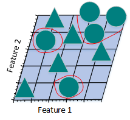

​                                       图2.21.1.e

​   上图是将三维特征空间映射到二维特征空间后的结果。尽管在高维特征空间时训练样本线性可分，但是映射到低维空间后，结果正好相反。事实上，增加特征数量使得高维空间线性可分，相当于在低维空间内训练一个复杂的非线性分类器。不过，这个非线性分类器太过“聪明”，仅仅学到了一些特例。如果将其用来辨别那些未曾出现在训练样本中的测试样本时，通常结果不太理想，会造成过拟合问题。

​                                       图2.21.1.f

​   上图所示的只采用2个特征的线性分类器分错了一些训练样本，准确率似乎没有图2.21.1.e的高，但是，采用2个特征的线性分类器的泛化能力比采用3个特征的线性分类器要强。因为，采用2个特征的线性分类器学习到的不只是特例，而是一个整体趋势，对于那些未曾出现过的样本也可以比较好地辨别开来。换句话说，通过减少特征数量，可以避免出现过拟合问题，从而避免“维数灾难”。

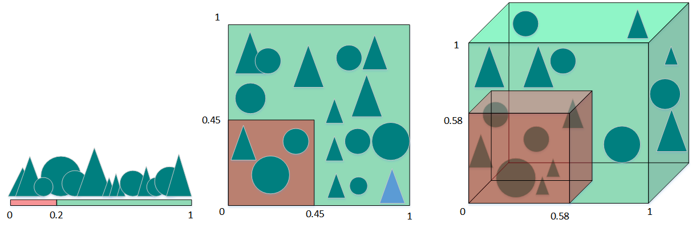

​   上图从另一个角度诠释了“维数灾难”。假设只有一个特征时，特征的值域是0到1，每一个三角形和圆的特征值都是唯一的。如果我们希望训练样本覆盖特征值值域的20%，那么就需要三角形和圆总数的20%。我们增加一个特征后，为了继续覆盖特征值值域的20%就需要三角形和圆总数的45%($0.452^2\approx0.2$)。继续增加一个特征后，需要三角形和圆总数的58%($0.583^3\approx0.2$)。随着特征数量的增加，为了覆盖特征值值域的20%，就需要更多的训练样本。如果没有足够的训练样本，就可能会出现过拟合问题。

​   通过上述例子，我们可以看到特征数量越多，训练样本就会越稀疏，分类器的参数估计就会越不准确，更加容易出现过拟合问题。“维数灾难”的另一个影响是训练样本的稀疏性并不是均匀分布的。处于中心位置的训练样本比四周的训练样本更加稀疏。

​   假设有一个二维特征空间，如上图所示的矩形，在矩形内部有一个内切的圆形。由于越接近圆心的样本越稀疏，因此，相比于圆形内的样本，那些位于矩形四角的样本更加难以分类。当维数变大时，特征超空间的容量不变，但单位圆的容量会趋于0，在高维空间中，大多数训练数据驻留在特征超空间的角落。散落在角落的数据要比处于中心的数据难于分类。

### 2.21.2 怎样避免维数灾难

**有待完善！！！**

解决维度灾难问题：

主成分分析法PCA，线性判别法LDA

奇异值分解简化数据、拉普拉斯特征映射

Lassio缩减系数法、小波分析法、

### 2.21.3 聚类和降维有什么区别与联系

​   聚类用于找寻数据内在的分布结构，既可以作为一个单独的过程，比如异常检测等等。也可作为分类等其他学习任务的前驱过程。聚类是标准的无监督学习。

​   1）在一些推荐系统中需确定新用户的类型，但定义“用户类型”却可能不太容易，此时往往可先对原有的用户数据进行聚类，根据聚类结果将每个簇定义为一个类,然后再基于这些类训练分类模型,用于判别新用户的类型。

​   2）而降维则是为了缓解维数灾难的一个重要方法，就是通过某种数学变换将原始高维属性空间转变为一个低维“子空间”。其基于的假设就是，虽然人们平时观测到的数据样本虽然是高维的，但是实际上真正与学习任务相关的是个低维度的分布。从而通过最主要的几个特征维度就可以实现对数据的描述，对于后续的分类很有帮助。比如对于Kaggle（数据分析竞赛平台之一）上的泰坦尼克号生还问题。通过给定一个乘客的许多特征如年龄、姓名、性别、票价等，来判断其是否能在海难中生还。这就需要首先进行特征筛选，从而能够找出主要的特征，让学习到的模型有更好的泛化性。

​   聚类和降维都可以作为分类等问题的预处理步骤。

​   但是他们虽然都能实现对数据的约减。但是二者适用的对象不同，聚类针对的是数据点，而降维则是对于数据的特征。另外它们有着很多种实现方法。聚类中常用的有K-means、层次聚类、基于密度的聚类等；降维中常用的则PCA、Isomap、LLE等。

### 2.21.4 有哪些聚类算法优劣衡量标准

不同聚类算法有不同的优劣和不同的适用条件。可从以下方面进行衡量判断：
    1、算法的处理能力：处理大的数据集的能力，即算法复杂度；处理数据噪声的能力；处理任意形状，包括有间隙的嵌套的数据的能力； 
    2、算法是否需要预设条件：是否需要预先知道聚类个数，是否需要用户给出领域知识； 

​    3、算法的数据输入属性：算法处理的结果与数据输入的顺序是否相关，也就是说算法是否独立于数据输入顺序；算法处理有很多属性数据的能力，也就是对数据维数是否敏感，对数据的类型有无要求。

### 2.21.5 聚类和分类有什么区别

**聚类（Clustering） **
    聚类，简单地说就是把相似的东西分到一组，聚类的时候，我们并不关心某一类是什么，我们需要实现的目标只是把相似的东西聚到一起。一个聚类算法通常只需要知道如何计算相似度就可以开始工作了，因此聚类通常并不需要使用训练数据进行学习，在机器学习中属于无监督学习。 

**分类（Classification） **

​     分类，对于一个分类器，通常需要你告诉它“这个东西被分为某某类”。一般情况下，一个分类器会从它得到的训练集中进行学习，从而具备对未知数据进行分类的能力，在机器学习中属于监督学习。

### 2.21.6 不同聚类算法特点性能比较

|   算法名称   | 可伸缩性 | 适合的数据类型 | 高维性 | 异常数据抗干扰性 | 聚类形状 | 算法效率 |
| :----------: | :------: | :------------: | :----: | :--------------: | :------: | :------: |
| WAVECLUSTER  |   很高   |     数值型     |  很高  |       较高       | 任意形状 |   很高   |
|     ROCK     |   很高   |     混合型     |  很高  |       很高       | 任意形状 |   一般   |
|    BIRCH     |   较高   |     数值型     |  较低  |       较低       |   球形   |   很高   |
|     CURE     |   较高   |     数值型     |  一般  |       很高       | 任意形状 |   较高   |
| K-PROTOTYPES |   一般   |     混合型     |  较低  |       较低       | 任意形状 |   一般   |
|   DENCLUE    |   较低   |     数值型     |  较高  |       一般       | 任意形状 |   较高   |
|   OPTIGRID   |   一般   |     数值型     |  较高  |       一般       | 任意形状 |   一般   |
|    CLIQUE    |   较高   |     数值型     |  较高  |       较高       | 任意形状 |   较低   |
|    DBSCAN    |   一般   |     数值型     |  较低  |       较高       | 任意形状 |   一般   |
|   CLARANS    |   较低   |     数值型     |  较低  |       较高       |   球形   |   较低   |

### 2.21.7 四种常用聚类方法之比较

​   聚类就是按照某个特定标准把一个数据集分割成不同的类或簇，使得同一个簇内的数据对象的相似性尽可能大，同时不在同一个簇中的数据对象的差异性也尽可能地大。即聚类后同一类的数据尽可能聚集到一起，不同类数据尽量分离。
​   主要的聚类算法可以划分为如下几类：划分方法、层次方法、基于密度的方法、基于网格的方法以及基于模型的方法。下面主要对k-means聚类算法、凝聚型层次聚类算法、神经网络聚类算法之SOM,以及模糊聚类的FCM算法通过通用测试数据集进行聚类效果的比较和分析。

### 2.21.8 k-means聚类算法

k-means是划分方法中较经典的聚类算法之一。由于该算法的效率高，所以在对大规模数据进行聚类时被广泛应用。目前，许多算法均围绕着该算法进行扩展和改进。
k-means算法以k为参数，把n个对象分成k个簇，使簇内具有较高的相似度，而簇间的相似度较低。k-means算法的处理过程如下：首先，随机地 选择k个对象，每个对象初始地代表了一个簇的平均值或中心;对剩余的每个对象，根据其与各簇中心的距离，将它赋给最近的簇;然后重新计算每个簇的平均值。 这个过程不断重复，直到准则函数收敛。通常，采用平方误差准则，其定义如下：
$$
E=\sum_{i=1}^{k}\sum_{p\in C_i}\left\|p-m_i\right\|^2
$$
　这里E是数据中所有对象的平方误差的总和，p是空间中的点，$m_i$是簇$C_i$的平均值[9]。该目标函数使生成的簇尽可能紧凑独立，使用的距离度量是欧几里得距离，当然也可以用其他距离度量。

**算法流程**：
​    输入：包含n个对象的数据和簇的数目k；
​    输出：n个对象到k个簇，使平方误差准则最小。
​    步骤：
　　(1) 任意选择k个对象作为初始的簇中心；
　　(2) 根据簇中对象的平均值，将每个对象(重新)赋予最类似的簇；
　　(3) 更新簇的平均值，即计算每个簇中对象的平均值；
　　(4) 重复步骤(2)、(3)直到簇中心不再变化；

### 2.21.9 层次聚类算法

​    根据层次分解的顺序是自底向上的还是自上向下的，层次聚类算法分为凝聚的层次聚类算法和分裂的层次聚类算法。
　凝聚型层次聚类的策略是先将每个对象作为一个簇，然后合并这些原子簇为越来越大的簇，直到所有对象都在一个簇中，或者某个终结条件被满足。绝大多数层次聚类属于凝聚型层次聚类，它们只是在簇间相似度的定义上有所不同。

**算法流程**：

注：以采用最小距离的凝聚层次聚类算法为例：

　(1) 将每个对象看作一类，计算两两之间的最小距离；
　(2) 将距离最小的两个类合并成一个新类；
　(3) 重新计算新类与所有类之间的距离；
　(4) 重复(2)、(3)，直到所有类最后合并成一类。

### 2.21.10 SOM聚类算法
​   SOM神经网络[11]是由芬兰神经网络专家Kohonen教授提出的，该算法假设在输入对象中存在一些拓扑结构或顺序，可以实现从输入空间(n维)到输出平面(2维)的降维映射，其映射具有拓扑特征保持性质,与实际的大脑处理有很强的理论联系。

​   SOM网络包含输入层和输出层。输入层对应一个高维的输入向量，输出层由一系列组织在2维网格上的有序节点构成，输入节点与输出节点通过权重向量连接。 学习过程中，找到与之距离最短的输出层单元，即获胜单元，对其更新。同时，将邻近区域的权值更新，使输出节点保持输入向量的拓扑特征。

**算法流程**：

​   (1) 网络初始化，对输出层每个节点权重赋初值；
​   (2) 从输入样本中随机选取输入向量并且归一化，找到与输入向量距离最小的权重向量；
​   (3) 定义获胜单元，在获胜单元的邻近区域调整权重使其向输入向量靠拢；
​   (4) 提供新样本、进行训练；
​   (5) 收缩邻域半径、减小学习率、重复，直到小于允许值，输出聚类结果。

### 2.21.11 FCM聚类算法

​   1965年美国加州大学柏克莱分校的扎德教授第一次提出了‘集合’的概念。经过十多年的发展，模糊集合理论渐渐被应用到各个实际应用方面。为克服非此即彼的分类缺点，出现了以模糊集合论为数学基础的聚类分析。用模糊数学的方法进行聚类分析，就是模糊聚类分析[12]。  
​   FCM算法是一种以隶属度来确定每个数据点属于某个聚类程度的算法。该聚类算法是传统硬聚类算法的一种改进。  
​   设数据集$X={x_1,x_2,...,x_n}$,它的模糊$c$划分可用模糊矩阵$U=[u_{ij}]$表示，矩阵$U$的元素$u_{ij}$表示第$j(j=1,2,...,n)$个数据点属于第$i(i=1,2,...,c)$类的隶属度，$u_{ij}$满足如下条件：  
$$
\begin{equation}
\left\{
\begin{array}{lr}
\sum_{i=1}^c u_{ij}=1 \quad\forall~j
\\u_{ij}\in[0,1] \quad\forall ~i,j
\\\sum_{j=1}^c u_{ij}>0 \quad\forall ~i
\end{array}
\right.
\end{equation}
$$
目前被广泛使用的聚类准则是取类内加权误差平方和的极小值。即：
$$
(min)J_m(U,V)=\sum^n_{j=1}\sum^c_{i=1}u^m_{ij}d^2_{ij}(x_j,v_i)
$$
其中$V$为聚类中心，$m$为加权指数，$d_{ij}(x_j,v_i)=||v_i-x_j||$。

**算法流程**：

　(1) 标准化数据矩阵；
　(2) 建立模糊相似矩阵，初始化隶属矩阵；
　(3) 算法开始迭代，直到目标函数收敛到极小值；
　(4) 根据迭代结果，由最后的隶属矩阵确定数据所属的类，显示最后的聚类结果。

### 2.21.12 四种聚类算法试验

​   选取专门用于测试分类、聚类算法的国际通用的UCI数据库中的IRIS数据集，IRIS数据集包含150个样本数据，分别取自三种不同 的莺尾属植物setosa、versicolor和virginica的花朵样本,每个数据含有4个属性，即萼片长度、萼片宽度、花瓣长度、花瓣宽度，单位为cm。 在数据集上执行不同的聚类算法，可以得到不同精度的聚类结果。基于前面描述的各算法原理及流程，可初步得如下聚类结果。

| 聚类方法 | 聚错样本数 | 运行时间/s | 平均准确率/（%） |
| -------- | ---------- | ---------- | ---------------- |
| K-means  | 17         | 0.146001   | 89               |
| 层次聚类 | 51         | 0.128744   | 66               |
| SOM      | 22         | 5.267283   | 86               |
| FCM      | 12         | 0.470417   | 92               |

**注**：

(1) 聚错样本数：总的聚错的样本数，即各类中聚错的样本数的和；  
(2) 运行时间：即聚类整个过程所耗费的时间，单位为s；  
(3) 平均准确度：设原数据集有k个类,用$c_i$表示第i类，$n_i$为$c_i$中样本的个数，$m_i$为聚类正确的个数,则$m_i/n_i$为 第i类中的精度，则平均精度为：$avg=\frac{1}{k}\sum_{i=1}^{k}\frac{m_{i}}{n_{i}}$。  

## 参考文献

[1]   Goodfellow I, Bengio Y, Courville A. Deep learning[M]. MIT press, 2016.  
[2]   周志华. 机器学习[M].清华大学出版社, 2016.  
[3]   Michael A. Nielsen. "Neural Networks and Deep Learning", Determination Press, 2015.  
[4]   Suryansh S. Gradient Descent: All You Need to Know, 2018.  
[5]   刘建平. 梯度下降小结,EM算法的推导, 2018  
[6]   杨小兵．聚类分析中若干关键技术的研究[D]． 杭州：浙江大学, 2005.  
[7]   XU Rui, Donald Wunsch 1 1． survey of clustering algorithm[J]．IEEE．Transactions on Neural Networks, 2005, 16(3)：645-67 8.  
[8]   YI Hong, SAM K． Learning assignment order of instances for the constrained k-means clustering algorithm[J]．IEEE Transactions on Systems, Man, and Cybernetics, Part B：Cybernetics,2009,39 (2)：568-574.  
[9]   贺玲, 吴玲达, 蔡益朝．数据挖掘中的聚类算法综述[J]．计算机应用研究, 2007, 24(1):10-13．  
[10]  孙吉贵, 刘杰, 赵连宇．聚类算法研究[J]．软件学报, 2008, 19(1)：48-61．  
[11]  孔英会, 苑津莎, 张铁峰等．基于数据流管理技术的配变负荷分类方法研究．中国国际供电会议, CICED2006．  
[12]  马晓艳, 唐雁．层次聚类算法研究[J]．计算机科学, 2008, 34(7)：34-36．  
[13]  FISHER R A． Iris Plants Database https://www.ics.uci.edu/vmlearn/MLRepository.html, Authorized license．  
[14]  Quinlan J R. Induction of decision trees[J]. Machine learning, 1986, 1(1): 81-106.  
[15]  Breiman L. Random forests[J]. Machine learning, 2001, 45(1): 5-32.  

# 第三章 深度学习基础

## 3.1 基本概念

### 3.1.1 神经网络组成？

神经网络类型众多，其中最为重要的是多层感知机。为了详细地描述神经网络，我们先从最简单的神经网络说起。

**感知机**

多层感知机中的特征神经元模型称为感知机，由*Frank Rosenblatt*于1957年发明。

简单的感知机如下图所示：

其中$x_1$，$x_2$，$x_3$为感知机的输入，其输出为：

$$
output = \left\{
\begin{aligned}
0, \quad if \ \ \sum_i w_i x_i \leqslant threshold \\
1, \quad if \ \ \sum_i w_i x_i > threshold
\end{aligned}
\right.
$$

假如把感知机想象成一个加权投票机制，比如 3 位评委给一个歌手打分，打分分别为$ 4 $分、$1$ 分、$-3 $分，这$ 3$ 位评分的权重分别是 $1、3、2$，则该歌手最终得分为 $4 \times 1 + 1 \times 3 + (-3) \times 2 = 1$ 。按照比赛规则，选取的 $threshold$ 为 $3$，说明只有歌手的综合评分大于$ 3$ 时，才可顺利晋级。对照感知机，该选手被淘汰，因为：

$$
\sum_i w_i x_i < threshold=3, output = 0
$$

用 $-b$  代替 $threshold$，输出变为：

$$
output = \left\{
\begin{aligned}
0, \quad if \ \ \boldsymbol{w} \cdot \boldsymbol{x} + b \leqslant 0 \\
1, \quad if \ \ \boldsymbol{w} \cdot \boldsymbol{x} + b > 0
\end{aligned}
\right.
$$

设置合适的  $\boldsymbol{x}$  和  $b$ ，一个简单的感知机单元的与非门表示如下：

当输入为 $0$，$1$ 时，感知机输出为 $ 0 \times (-2) + 1 \times (-2) + 3 = 1$。

复杂一些的感知机由简单的感知机单元组合而成：

**多层感知机**

多层感知机由感知机推广而来，最主要的特点是有多个神经元层，因此也叫深度神经网络。相比于单独的感知机，多层感知机的第 $ i $ 层的每个神经元和第 $ i-1 $ 层的每个神经元都有连接。

输出层可以不止有$ 1$ 个神经元。隐藏层可以只有$ 1$ 层，也可以有多层。输出层为多个神经元的神经网络例如下图所示：

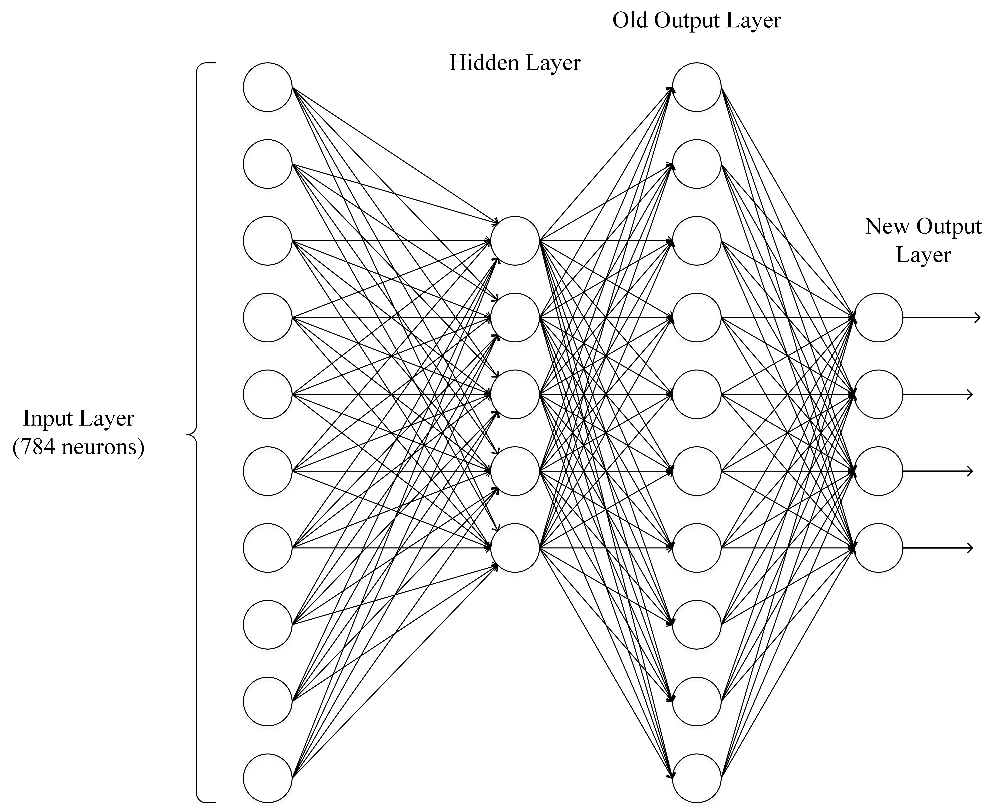

### 3.1.2 神经网络有哪些常用模型结构？

下图包含了大部分常用的模型：

### 3.1.3 如何选择深度学习开发平台？

​   现有的深度学习开源平台主要有 Caffe, PyTorch, MXNet, CNTK, Theano, TensorFlow, Keras, fastai等。那如何选择一个适合自己的平台呢，下面列出一些衡量做参考。

**参考1：与现有编程平台、技能整合的难易程度**

​   主要是前期积累的开发经验和资源，比如编程语言，前期数据集存储格式等。

**参考2: 与相关机器学习、数据处理生态整合的紧密程度**

​   深度学习研究离不开各种数据处理、可视化、统计推断等软件包。考虑建模之前，是否具有方便的数据预处理工具？建模之后，是否具有方便的工具进行可视化、统计推断、数据分析。  

**参考3：对数据量及硬件的要求和支持**

​   深度学习在不同应用场景的数据量是不一样的，这也就导致我们可能需要考虑分布式计算、多GPU计算的问题。例如，对计算机图像处理研究的人员往往需要将图像文件和计算任务分部到多台计算机节点上进行执行。当下每个深度学习平台都在快速发展，每个平台对分布式计算等场景的支持也在不断演进。

**参考4：深度学习平台的成熟程度**

​   成熟程度的考量是一个比较主观的考量因素，这些因素可包括：社区的活跃程度；是否容易和开发人员进行交流；当前应用的势头。

**参考5：平台利用是否多样性？**

​   有些平台是专门为深度学习研究和应用进行开发的，有些平台对分布式计算、GPU 等构架都有强大的优化，能否用这些平台/软件做其他事情？比如有些深度学习软件是可以用来求解二次型优化；有些深度学习平台很容易被扩展，被运用在强化学习的应用中。

### 3.1.4 为什么使用深层表示?

1. 深度神经网络是一种特征递进式的学习算法，浅层的神经元直接从输入数据中学习一些低层次的简单特征，例如边缘、纹理等。而深层的特征则基于已学习到的浅层特征继续学习更高级的特征，从计算机的角度学习深层的语义信息。
2. 深层的网络隐藏单元数量相对较少，隐藏层数目较多，如果浅层的网络想要达到同样的计算结果则需要指数级增长的单元数量才能达到。

### 3.1.5 为什么深层神经网络难以训练？

1. 梯度消失
        梯度消失是指通过隐藏层从后向前看，梯度会变的越来越小，说明前面层的学习会显著慢于后面层的学习，所以学习会卡住，除非梯度变大。

    ​   梯度消失的原因受到多种因素影响，例如学习率的大小，网络参数的初始化，激活函数的边缘效应等。在深层神经网络中，每一个神经元计算得到的梯度都会传递给前一层，较浅层的神经元接收到的梯度受到之前所有层梯度的影响。如果计算得到的梯度值非常小，随着层数增多，求出的梯度更新信息将会以指数形式衰减，就会发生梯度消失。下图是不同隐含层的学习速率：

2. 梯度爆炸
        在深度网络或循环神经网络（Recurrent Neural Network, RNN）等网络结构中，梯度可在网络更新的过程中不断累积，变成非常大的梯度，导致网络权重值的大幅更新，使得网络不稳定；在极端情况下，权重值甚至会溢出，变为$NaN$值，再也无法更新。

3. 权重矩阵的退化导致模型的有效自由度减少。

    ​   参数空间中学习的退化速度减慢，导致减少了模型的有效维数，网络的可用自由度对学习中梯度范数的贡献不均衡，随着相乘矩阵的数量（即网络深度）的增加，矩阵的乘积变得越来越退化。在有硬饱和边界的非线性网络中（例如 ReLU 网络），随着深度增加，退化过程会变得越来越快。Duvenaud等人2014年的论文里展示了关于该退化过程的可视化：

随着深度的增加，输入空间（左上角所示）会在输入空间中的每个点处被扭曲成越来越细的单丝，只有一个与细丝正交的方向影响网络的响应。沿着这个方向，网络实际上对变化变得非常敏感。

### 3.1.6 深度学习和机器学习有什么不同？

​   **机器学习**：利用计算机、概率论、统计学等知识，输入数据，让计算机学会新知识。机器学习的过程，就是训练数据去优化目标函数。

​   **深度学习**：是一种特殊的机器学习，具有强大的能力和灵活性。它通过学习将世界表示为嵌套的层次结构，每个表示都与更简单的特征相关，而抽象的表示则用于计算更抽象的表示。

​   传统的机器学习需要定义一些手工特征，从而有目的的去提取目标信息， 非常依赖任务的特异性以及设计特征的专家经验。而深度学习可以从大数据中先学习简单的特征，并从其逐渐学习到更为复杂抽象的深层特征，不依赖人工的特征工程，这也是深度学习在大数据时代受欢迎的一大原因。

## 3.2 网络操作与计算

### 3.2.1 前向传播与反向传播？

神经网络的计算主要有两种：前向传播（foward propagation, FP）作用于每一层的输入，通过逐层计算得到输出结果；反向传播（backward propagation, BP）作用于网络的输出，通过计算梯度由深到浅更新网络参数。

**前向传播**

假设上一层结点 $ i,j,k,... ​$ 等一些结点与本层的结点 $ w ​$ 有连接，那么结点 $ w ​$ 的值怎么算呢？就是通过上一层的 $ i,j,k,... ​$ 等结点以及对应的连接权值进行加权和运算，最终结果再加上一个偏置项（图中为了简单省略了），最后在通过一个非线性函数（即激活函数），如 $ReLu​$，$sigmoid​$ 等函数，最后得到的结果就是本层结点 $ w ​$ 的输出。 

最终不断的通过这种方法一层层的运算，得到输出层结果。

**反向传播**

由于我们前向传播最终得到的结果，以分类为例，最终总是有误差的，那么怎么减少误差呢，当前应用广泛的一个算法就是梯度下降算法，但是求梯度就要求偏导数，下面以图中字母为例讲解一下：

设最终误差为 $ E $且输出层的激活函数为线性激活函数，对于输出那么 $ E $ 对于输出节点 $ y_l $ 的偏导数是 $ y_l - t_l $，其中 $ t_l $ 是真实值，$ \frac{\partial y_l}{\partial z_l} $ 是指上面提到的激活函数，$ z_l $ 是上面提到的加权和，那么这一层的 $ E $ 对于 $ z_l $ 的偏导数为 $ \frac{\partial E}{\partial z_l} = \frac{\partial E}{\partial y_l} \frac{\partial y_l}{\partial z_l} $。同理，下一层也是这么计算，只不过 $ \frac{\partial E}{\partial y_k} $ 计算方法变了，一直反向传播到输入层，最后有 $ \frac{\partial E}{\partial x_i} = \frac{\partial E}{\partial y_j} \frac{\partial y_j}{\partial z_j} $，且 $ \frac{\partial z_j}{\partial x_i} = w_i j ​$。然后调整这些过程中的权值，再不断进行前向传播和反向传播的过程，最终得到一个比较好的结果。

### 3.2.2 如何计算神经网络的输出？

如上图，输入层有三个节点，我们将其依次编号为 1、2、3；隐藏层的 4 个节点，编号依次为 4、5、6、7；最后输出层的两个节点编号为 8、9。比如，隐藏层的节点 4，它和输入层的三个节点 1、2、3 之间都有连接，其连接上的权重分别为是 $ w_{41}, w_{42}, w_{43} ​$。

为了计算节点 4 的输出值，我们必须先得到其所有上游节点（也就是节点 1、2、3）的输出值。节点 1、2、3 是输入层的节点，所以，他们的输出值就是输入向量本身。按照上图画出的对应关系，可以看到节点 1、2、3 的输出值分别是 $ x_1, x_2, x_3 $。

$$
a_4 = \sigma(w^T \cdot a) = \sigma(w_{41}x_4 + w_{42}x_2 + w_{43}a_3 + w_{4b})
$$

其中 $ w_{4b} $ 是节点 4 的偏置项。

同样，我们可以继续计算出节点 5、6、7 的输出值 $ a_5, a_6, a_7 $。

计算输出层的节点 8 的输出值 $ y_1 ​$：

$$
y_1 = \sigma(w^T \cdot a) = \sigma(w_{84}a_4 + w_{85}a_5 + w_{86}a_6 + w_{87}a_7 + w_{8b})
$$

其中 $ w_{8b} ​$ 是节点 8 的偏置项。

同理，我们还可以计算出 $ y_2 $。这样输出层所有节点的输出值计算完毕，我们就得到了在输入向量 $ x_1, x_2, x_3, x_4 $ 时，神经网络的输出向量 $ y_1, y_2 $ 。这里我们也看到，输出向量的维度和输出层神经元个数相同。

### 3.2.3 如何计算卷积神经网络输出值？

假设有一个 5\*5 的图像，使用一个 3\*3 的 filter 进行卷积，想得到一个 3\*3 的 Feature Map，如下所示：

$ x_{i,j} $ 表示图像第  $ i $ 行第 $ j $ 列元素。$ w_{m,n} $ 表示 filter​ 第 $ m $ 行第 $ n $ 列权重。 $ w_b $ 表示 $filter$ 的偏置项。 表$a_i,_j$示 feature map 第 $ i$ 行第 $ j $ 列元素。 $f$ 表示激活函数，这里以$ ReLU$ 函数为例。

卷积计算公式如下：

$$
a_{i,j} = f(\sum_{m=0}^2 \sum_{n=0}^2 w_{m,n} x_{i+m, j+n} + w_b )
$$

当步长为 $1$ 时，计算 feature map 元素 $ a_{0,0} ​$ 如下：

$$
a_{0,0} = f(\sum_{m=0}^2 \sum_{n=0}^2 w_{m,n} x_{0+m, 0+n} + w_b )

= relu(w_{0,0} x_{0,0} + w_{0,1} x_{0,1} + w_{0,2} x_{0,2} + w_{1,0} x_{1,0} + \\w_{1,1} x_{1,1} + w_{1,2} x_{1,2} + w_{2,0} x_{2,0} + w_{2,1} x_{2,1} + w_{2,2} x_{2,2}) \\

= 1 + 0 + 1 + 0 + 1 + 0 + 0 + 0 + 1 \\

= 4
$$

其计算过程图示如下：

以此类推，计算出全部的Feature Map。

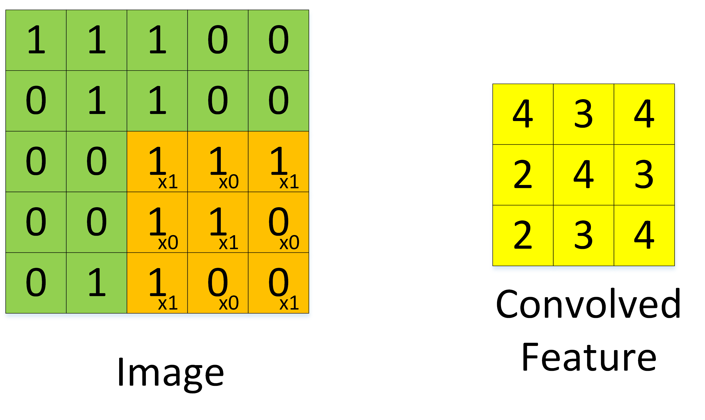

当步幅为 2 时，Feature Map计算如下

注：图像大小、步幅和卷积后的Feature Map大小是有关系的。它们满足下面的关系：

$$
W_2 = (W_1 - F + 2P)/S + 1\\
H_2 = (H_1 - F + 2P)/S + 1
$$

​   其中 $ W_2 $， 是卷积后 Feature Map 的宽度；$ W_1 $ 是卷积前图像的宽度；$ F $ 是 filter 的宽度；$ P $ 是 Zero Padding 数量，Zero Padding 是指在原始图像周围补几圈 $0$，如果 $P$ 的值是 $1$，那么就补 $1$ 圈 $0$；$S$ 是步幅；$ H_2 $ 卷积后 Feature Map 的高度；$ H_1 $ 是卷积前图像的宽度。

​   举例：假设图像宽度 $ W_1 = 5 $，filter 宽度 $ F=3 $，Zero Padding $ P=0 $，步幅 $ S=2 $，$ Z $ 则

$$
W_2 = (W_1 - F + 2P)/S + 1

= (5-3+0)/2 + 1

= 2
$$

​   说明 Feature Map 宽度是2。同样，我们也可以计算出 Feature Map 高度也是 2。

如果卷积前的图像深度为 $ D ​$，那么相应的 filter 的深度也必须为 $ D ​$。深度大于 1 的卷积计算公式：

$$
a_{i,j} = f(\sum_{d=0}^{D-1} \sum_{m=0}^{F-1} \sum_{n=0}^{F-1} w_{d,m,n} x_{d,i+m,j+n} + w_b)
$$

​   其中，$ D $ 是深度；$ F $ 是 filter 的大小；$ w_{d,m,n} $ 表示 filter 的第 $ d $ 层第 $ m $ 行第 $ n $ 列权重；$ a_{d,i,j} $ 表示 feature map 的第 $ d $ 层第 $ i $ 行第 $ j $ 列像素；其它的符号含义前面相同，不再赘述。

​   每个卷积层可以有多个 filter。每个 filter 和原始图像进行卷积后，都可以得到一个 Feature Map。卷积后 Feature Map 的深度(个数)和卷积层的 filter 个数相同。下面的图示显示了包含两个 filter 的卷积层的计算。$7*7*3$ 输入，经过两个 $3*3*3$ filter 的卷积(步幅为 $2$)，得到了 $3*3*2$ 的输出。图中的 Zero padding 是 $1$，也就是在输入元素的周围补了一圈 $0$。

​   以上就是卷积层的计算方法。这里面体现了局部连接和权值共享：每层神经元只和上一层部分神经元相连(卷积计算规则)，且 filter 的权值对于上一层所有神经元都是一样的。对于包含两个 $ 3 * 3 * 3 $ 的 fitler 的卷积层来说，其参数数量仅有 $ (3 * 3 * 3+1) * 2 = 56 $ 个，且参数数量与上一层神经元个数无关。与全连接神经网络相比，其参数数量大大减少了。

### 3.2.4 如何计算 Pooling 层输出值输出值？

​   Pooling 层主要的作用是下采样，通过去掉 Feature Map 中不重要的样本，进一步减少参数数量。Pooling 的方法很多，最常用的是 Max Pooling。Max Pooling 实际上就是在 n\*n 的样本中取最大值，作为采样后的样本值。下图是 2\*2 max pooling：

​   除了 Max Pooing 之外，常用的还有 Average Pooling ——取各样本的平均值。
​   对于深度为 $ D $ 的 Feature Map，各层独立做 Pooling，因此 Pooling 后的深度仍然为 $ D $。

### 3.2.5 实例理解反向传播

​   一个典型的三层神经网络如下所示：

​   其中 Layer $ L_1 $ 是输入层，Layer $ L_2 $ 是隐含层，Layer $ L_3 $ 是输出层。

​   假设输入数据集为 $ D={x_1, x_2, ..., x_n} $，输出数据集为 $ y_1, y_2, ..., y_n $。

​   如果输入和输出是一样，即为自编码模型。如果原始数据经过映射，会得到不同于输入的输出。

假设有如下的网络层：

​   输入层包含神经元 $ i_1, i_2 $，偏置 $ b_1 $；隐含层包含神经元 $ h_1, h_2 $，偏置 $ b_2 $，输出层为  $ o_1, o_2 $，$ w_i $ 为层与层之间连接的权重，激活函数为 $sigmoid$ 函数。对以上参数取初始值，如下图所示：

其中：

- 输入数据 $ i1=0.05, i2 = 0.10 $
- 输出数据 $ o1=0.01, o2=0.99 $;
- 初始权重 $ w1=0.15, w2=0.20, w3=0.25,w4=0.30, w5=0.40, w6=0.45, w7=0.50, w8=0.55 $
- 目标：给出输入数据 $ i1,i2 $ ( $0.05$和$0.10$ )，使输出尽可能与原始输出 $ o1,o2 $，( $0.01$和$0.99$)接近。

**前向传播**

1. 输入层 --> 输出层

计算神经元 $ h1 ​$ 的输入加权和：

$$
net_{h1} = w_1 * i_1 + w_2 * i_2 + b_1 * 1\\

net_{h1} = 0.15 * 0.05 + 0.2 * 0.1 + 0.35 * 1 = 0.3775
$$

神经元 $ h1 $ 的输出 $ o1 $ ：（此处用到激活函数为 sigmoid 函数）：

$$
out_{h1} = \frac{1}{1 + e^{-net_{h1}}} = \frac{1}{1 + e^{-0.3775}} = 0.593269992
$$

同理，可计算出神经元 $ h2 $ 的输出 $ o1 $：

$$
out_{h2} = 0.596884378
$$

2. 隐含层-->输出层：  　　

计算输出层神经元 $ o1 ​$ 和 $ o2 ​$ 的值：

$$
net_{o1} = w_5 * out_{h1} + w_6 * out_{h2} + b_2 * 1
$$

$$
net_{o1} = 0.4 * 0.593269992 + 0.45 * 0.596884378 + 0.6 * 1 = 1.105905967
$$

$$
out_{o1} = \frac{1}{1 + e^{-net_{o1}}} = \frac{1}{1 + e^{1.105905967}} = 0.75136079
$$

这样前向传播的过程就结束了，我们得到输出值为 $ [0.75136079 ,  0.772928465] $，与实际值 $ [0.01 , 0.99] ​$ 相差还很远，现在我们对误差进行反向传播，更新权值，重新计算输出。

**反向传播 **

​   1.计算总误差

总误差：(这里使用Square Error)

$$
E_{total} = \sum \frac{1}{2}(target - output)^2
$$

但是有两个输出，所以分别计算 $ o1 $ 和 $ o2 $ 的误差，总误差为两者之和：

$E_{o1} = \frac{1}{2}(target_{o1} - out_{o1})^2 
= \frac{1}{2}(0.01 - 0.75136507)^2 = 0.274811083$.

$E_{o2} = 0.023560026$.

$E_{total} = E_{o1} + E_{o2} = 0.274811083 + 0.023560026 = 0.298371109$.

​   2.隐含层 --> 输出层的权值更新：

以权重参数 $ w5 ​$ 为例，如果我们想知道 $ w5 ​$ 对整体误差产生了多少影响，可以用整体误差对 $ w5 ​$ 求偏导求出：（链式法则）

$$
\frac{\partial E_{total}}{\partial w5} = \frac{\partial E_{total}}{\partial out_{o1}} * \frac{\partial out_{o1}}{\partial net_{o1}} * \frac{\partial net_{o1}}{\partial w5}
$$

下面的图可以更直观的看清楚误差是怎样反向传播的：

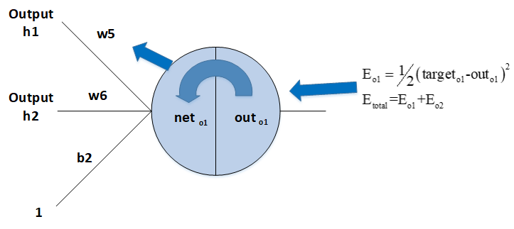

### 3.2.6 神经网络更“深”有什么意义？

前提：在一定范围内。

- 在神经元数量相同的情况下，深层网络结构具有更大容量，分层组合带来的是指数级的表达空间，能够组合成更多不同类型的子结构，这样可以更容易地学习和表示各种特征。
- 隐藏层增加则意味着由激活函数带来的非线性变换的嵌套层数更多，就能构造更复杂的映射关系。

## 3.3 超参数

### 3.3.1 什么是超参数？

​   **超参数** : 在机器学习的上下文中，超参数是在开始学习过程之前设置值的参数，而不是通过训练得到的参数数据。通常情况下，需要对超参数进行优化，给学习机选择一组最优超参数，以提高学习的性能和效果。

​   超参数通常存在于：

    1.  定义关于模型的更高层次的概念，如复杂性或学习能力。
    2.  不能直接从标准模型培训过程中的数据中学习，需要预先定义。
    3.  可以通过设置不同的值，训练不同的模型和选择更好的测试值来决定

​   超参数具体来讲比如算法中的学习率（learning rate）、梯度下降法迭代的数量（iterations）、隐藏层数目（hidden layers）、隐藏层单元数目、激活函数（ activation function）都需要根据实际情况来设置，这些数字实际上控制了最后的参数和的值，所以它们被称作超参数。

### 3.3.2 如何寻找超参数的最优值？

​   在使用机器学习算法时，总有一些难调的超参数。例如权重衰减大小，高斯核宽度等等。这些参数需要人为设置，设置的值对结果产生较大影响。常见设置超参数的方法有：

1. 猜测和检查：根据经验或直觉，选择参数，一直迭代。

2. 网格搜索：让计算机尝试在一定范围内均匀分布的一组值。

3. 随机搜索：让计算机随机挑选一组值。

4. 贝叶斯优化：使用贝叶斯优化超参数，会遇到贝叶斯优化算法本身就需要很多的参数的困难。

5. MITIE方法，好初始猜测的前提下进行局部优化。它使用BOBYQA算法，并有一个精心选择的起始点。由于BOBYQA只寻找最近的局部最优解，所以这个方法是否成功很大程度上取决于是否有一个好的起点。在MITIE的情况下，我们知道一个好的起点，但这不是一个普遍的解决方案，因为通常你不会知道好的起点在哪里。从好的方面来说，这种方法非常适合寻找局部最优解。稍后我会再讨论这一点。

6. 最新提出的LIPO的全局优化方法。这个方法没有参数，而且经验证比随机搜索方法好。

### 3.3.3 超参数搜索一般过程？

超参数搜索一般过程：
1. 将数据集划分成训练集、验证集及测试集。
2. 在训练集上根据模型的性能指标对模型参数进行优化。
3. 在验证集上根据模型的性能指标对模型的超参数进行搜索。
4. 步骤 2 和步骤 3 交替迭代，最终确定模型的参数和超参数，在测试集中验证评价模型的优劣。

其中，搜索过程需要搜索算法，一般有：网格搜索、随机搜过、启发式智能搜索、贝叶斯搜索。

## 3.4 激活函数

### 3.4.1 为什么需要非线性激活函数？

**为什么需要激活函数？**

1. 激活函数对模型学习、理解非常复杂和非线性的函数具有重要作用。
2. 激活函数可以引入非线性因素。如果不使用激活函数，则输出信号仅是一个简单的线性函数。线性函数一个一级多项式，线性方程的复杂度有限，从数据中学习复杂函数映射的能力很小。没有激活函数，神经网络将无法学习和模拟其他复杂类型的数据，例如图像、视频、音频、语音等。
3. 激活函数可以把当前特征空间通过一定的线性映射转换到另一个空间，让数据能够更好的被分类。

**为什么激活函数需要非线性函数？**

1. 假若网络中全部是线性部件，那么线性的组合还是线性，与单独一个线性分类器无异。这样就做不到用非线性来逼近任意函数。
2. 使用非线性激活函数 ，以便使网络更加强大，增加它的能力，使它可以学习复杂的事物，复杂的表单数据，以及表示输入输出之间非线性的复杂的任意函数映射。使用非线性激活函数，能够从输入输出之间生成非线性映射。

### 3.4.2 常见的激活函数及图像

1. sigmoid 激活函数

   函数的定义为：$ f(x) = \frac{1}{1 + e^{-x}} $，其值域为 $ (0,1) $。

   函数图像如下：

2. tanh激活函数

   函数的定义为：$ f(x) = tanh(x) = \frac{e^x - e^{-x}}{e^x + e^{-x}} $，值域为 $ (-1,1) $。

   函数图像如下：

3. Relu激活函数

   函数的定义为：$ f(x) = max(0, x) $  ，值域为 $ [0,+∞) $；

   函数图像如下：

4. Leak Relu 激活函数 

   函数定义为： $ f(x) =  \left\{
   \begin{aligned}
   ax, \quad x<0 \\
   x, \quad x>0
   \end{aligned}
   \right. $，值域为 $ (-∞,+∞) $。 

   图像如下（$ a = 0.5 $）：

5. SoftPlus 激活函数

   函数的定义为：$ f(x) = ln( 1 + e^x) $，值域为 $ (0,+∞) $。

   函数图像如下:

6. softmax 函数

   函数定义为： $ \sigma(z)_j = \frac{e^{z_j}}{\sum_{k=1}^K e^{z_k}} $。

   Softmax 多用于多分类神经网络输出。

### 3.4.3 常见激活函数的导数计算？

对常见激活函数，导数计算如下：

| 原函数          | 函数表达式                                   | 导数                                                         | 备注                                                         |
| --------------- | -------------------------------------------- | ------------------------------------------------------------ | ------------------------------------------------------------ |
| Sigmoid激活函数 | $f(x)=\frac{1}{1+e^{-x}}$                    | $f^{'}(x)=\frac{1}{1+e^{-x}}\left( 1- \frac{1}{1+e^{-x}} \right)=f(x)(1-f(x))$ | 当$x=10$,或$x=-10​$，$f^{'}(x) \approx0​$,当$x=0​$$f^{'}(x) =0.25​$ |
| Tanh激活函数    | $f(x)=tanh(x)=\frac{e^x-e^{-x}}{e^x+e^{-x}}$ | $f^{'}(x)=-(tanh(x))^2$                                      | 当$x=10$,或$x=-10$，$f^{'}(x) \approx0$,当$x=0$$f^{`}(x) =1$ |
| Relu激活函数    | $f(x)=max(0,x)$                              | $c(u)=\begin{cases} 0,x<0 \\ 1,x>0 \\ undefined,x=0\end{cases}$ | 通常$x=0$时，给定其导数为1和0                                |

### 3.4.4 激活函数有哪些性质？

1. 非线性： 当激活函数是线性的，一个两层的神经网络就可以基本上逼近所有的函数。但如果激活函数是恒等激活函数的时候，即 $ f(x)=x $，就不满足这个性质，而且如果 MLP 使用的是恒等激活函数，那么其实整个网络跟单层神经网络是等价的；
2. 可微性： 当优化方法是基于梯度的时候，就体现了该性质；
3. 单调性： 当激活函数是单调的时候，单层网络能够保证是凸函数；
4. $ f(x)≈x $： 当激活函数满足这个性质的时候，如果参数的初始化是随机的较小值，那么神经网络的训练将会很高效；如果不满足这个性质，那么就需要详细地去设置初始值；
5. 输出值的范围： 当激活函数输出值是有限的时候，基于梯度的优化方法会更加稳定，因为特征的表示受有限权值的影响更显著；当激活函数的输出是无限的时候，模型的训练会更加高效，不过在这种情况小，一般需要更小的 Learning Rate。

### 3.4.5 如何选择激活函数？

​   选择一个适合的激活函数并不容易，需要考虑很多因素，通常的做法是，如果不确定哪一个激活函数效果更好，可以把它们都试试，然后在验证集或者测试集上进行评价。然后看哪一种表现的更好，就去使用它。

以下是常见的选择情况：

1. 如果输出是 0、1 值（二分类问题），则输出层选择 sigmoid 函数，然后其它的所有单元都选择 Relu 函数。
2. 如果在隐藏层上不确定使用哪个激活函数，那么通常会使用 Relu 激活函数。有时，也会使用 tanh 激活函数，但 Relu 的一个优点是：当是负值的时候，导数等于 0。
3. sigmoid 激活函数：除了输出层是一个二分类问题基本不会用它。
4. tanh 激活函数：tanh 是非常优秀的，几乎适合所有场合。
5. ReLu 激活函数：最常用的默认函数，如果不确定用哪个激活函数，就使用 ReLu 或者 Leaky ReLu，再去尝试其他的激活函数。
6. 如果遇到了一些死的神经元，我们可以使用 Leaky ReLU 函数。

### 3.4.6 使用 ReLu 激活函数的优点？

1. 在区间变动很大的情况下，ReLu 激活函数的导数或者激活函数的斜率都会远大于 0，在程序实现就是一个 if-else 语句，而 sigmoid 函数需要进行浮点四则运算，在实践中，使用 ReLu 激活函数神经网络通常会比使用 sigmoid 或者 tanh 激活函数学习的更快。
2. sigmoid 和 tanh 函数的导数在正负饱和区的梯度都会接近于 0，这会造成梯度弥散，而 Relu 和Leaky ReLu 函数大于 0 部分都为常数，不会产生梯度弥散现象。
3. 需注意，Relu 进入负半区的时候，梯度为 0，神经元此时不会训练，产生所谓的稀疏性，而 Leaky ReLu 不会产生这个问题。

### 3.4.7 什么时候可以用线性激活函数？

1. 输出层，大多使用线性激活函数。
2. 在隐含层可能会使用一些线性激活函数。
3. 一般用到的线性激活函数很少。

### 3.4.8 怎样理解 Relu（< 0 时）是非线性激活函数？

Relu 激活函数图像如下：

根据图像可看出具有如下特点：

1. 单侧抑制；

2. 相对宽阔的兴奋边界；

3. 稀疏激活性；

   ReLU 函数从图像上看，是一个分段线性函数，把所有的负值都变为 0，而正值不变，这样就成为单侧抑制。

   因为有了这单侧抑制，才使得神经网络中的神经元也具有了稀疏激活性。

   **稀疏激活性**：从信号方面来看，即神经元同时只对输入信号的少部分选择性响应，大量信号被刻意的屏蔽了，这样可以提高学习的精度，更好更快地提取稀疏特征。当 $ x<0 $ 时，ReLU 硬饱和，而当 $ x>0 $ 时，则不存在饱和问题。ReLU 能够在 $ x>0 $ 时保持梯度不衰减，从而缓解梯度消失问题。

### 3.4.9 Softmax 定义及作用

Softmax 是一种形如下式的函数：
$$
P(i) = \frac{exp(\theta_i^T x)}{\sum_{k=1}^{K} exp(\theta_i^T x)}
$$
​   其中，$ \theta_i $ 和 $ x $ 是列向量，$ \theta_i^T x $ 可能被换成函数关于 $ x $ 的函数 $ f_i(x) $

​   通过 softmax 函数，可以使得 $ P(i) $ 的范围在 $ [0,1] $ 之间。在回归和分类问题中，通常 $ \theta $ 是待求参数，通过寻找使得 $ P(i) $ 最大的 $ \theta_i $ 作为最佳参数。

​   但是，使得范围在 $ [0,1] $  之间的方法有很多，为啥要在前面加上以 $ e $ 的幂函数的形式呢？参考 logistic 函数：
$$
P(i) = \frac{1}{1+exp(-\theta_i^T x)}
$$
​   这个函数的作用就是使得 $ P(i) $ 在负无穷到 0 的区间趋向于 0， 在 0 到正无穷的区间趋向 1,。同样 softmax 函数加入了 $ e $ 的幂函数正是为了两极化：正样本的结果将趋近于 1，而负样本的结果趋近于 0。这样为多类别提供了方便（可以把 $ P(i) $ 看做是样本属于类别的概率）。可以说，Softmax 函数是 logistic 函数的一种泛化。

​   softmax 函数可以把它的输入，通常被称为 logits 或者 logit scores，处理成 0 到 1 之间，并且能够把输出归一化到和为 1。这意味着 softmax 函数与分类的概率分布等价。它是一个网络预测多酚类问题的最佳输出激活函数。

### 3.4.10 Softmax 函数如何应用于多分类？

​   softmax 用于多分类过程中，它将多个神经元的输出，映射到 $ (0,1) $ 区间内，可以看成概率来理解，从而来进行多分类！

​   假设我们有一个数组，$ V_i $ 表示 $ V $  中的第 $ i $ 个元素，那么这个元素的 softmax 值就是

$$
S_i = \frac{e^{V_i}}{\sum_j e^{V_j}}
$$

​   从下图看，神经网络中包含了输入层，然后通过两个特征层处理，最后通过 softmax 分析器就能得到不同条件下的概率，这里需要分成三个类别，最终会得到 $ y=0, y=1, y=2 $ 的概率值。

继续看下面的图，三个输入通过 softmax 后得到一个数组 $ [0.05 , 0.10 , 0.85] ​$，这就是 soft 的功能。

更形象的映射过程如下图所示：

​   softmax 直白来说就是将原来输出是 $ 3,1,-3 ​$ 通过 softmax 函数一作用，就映射成为 $ (0,1) ​$ 的值，而这些值的累和为 $ 1 ​$（满足概率的性质），那么我们就可以将它理解成概率，在最后选取输出结点的时候，我们就可以选取概率最大（也就是值对应最大的）结点，作为我们的预测目标！

### 3.4.11 交叉熵代价函数定义及其求导推导

(**贡献者：黄钦建－华南理工大学**)

​   神经元的输出就是 a = σ(z)，其中$z=\sum w_{j}i_{j}+b​$是输⼊的带权和。

$C=-\frac{1}{n}\sum[ylna+(1-y)ln(1-a)]$

​   其中 n 是训练数据的总数，求和是在所有的训练输⼊ x 上进⾏的， y 是对应的⽬标输出。

​   表达式是否解决学习缓慢的问题并不明显。实际上，甚⾄将这个定义看做是代价函数也不是显⽽易⻅的！在解决学习缓慢前，我们来看看交叉熵为何能够解释成⼀个代价函数。

​   将交叉熵看做是代价函数有两点原因。

​   第⼀，它是⾮负的， C > 0。可以看出：式子中的求和中的所有独⽴的项都是负数的，因为对数函数的定义域是 (0，1)，并且求和前⾯有⼀个负号，所以结果是非负。

​   第⼆，如果对于所有的训练输⼊ x，神经元实际的输出接近⽬标值，那么交叉熵将接近 0。

​   假设在这个例⼦中， y = 0 ⽽ a ≈ 0。这是我们想到得到的结果。我们看到公式中第⼀个项就消去了，因为 y = 0，⽽第⼆项实际上就是 − ln(1 − a) ≈ 0。反之， y = 1 ⽽ a ≈ 1。所以在实际输出和⽬标输出之间的差距越⼩，最终的交叉熵的值就越低了。（这里假设输出结果不是0，就是1，实际分类也是这样的）

​   综上所述，交叉熵是⾮负的，在神经元达到很好的正确率的时候会接近 0。这些其实就是我们想要的代价函数的特性。其实这些特性也是⼆次代价函数具备的。所以，交叉熵就是很好的选择了。但是交叉熵代价函数有⼀个⽐⼆次代价函数更好的特性就是它避免了学习速度下降的问题。为了弄清楚这个情况，我们来算算交叉熵函数关于权重的偏导数。我们将$a={\varsigma}(z)$代⼊到 公式中应⽤两次链式法则，得到：

$\begin{eqnarray}\frac{\partial C}{\partial w_{j}}&=&-\frac{1}{n}\sum \frac{\partial }{\partial w_{j}}[ylna+(1-y)ln(1-a)]\\&=&-\frac{1}{n}\sum \frac{\partial }{\partial a}[ylna+(1-y)ln(1-a)]*\frac{\partial a}{\partial w_{j}}\\&=&-\frac{1}{n}\sum (\frac{y}{a}-\frac{1-y}{1-a})*\frac{\partial a}{\partial w_{j}}\\&=&-\frac{1}{n}\sum (\frac{y}{\varsigma(z)}-\frac{1-y}{1-\varsigma(z)})\frac{\partial \varsigma(z)}{\partial w_{j}}\\&=&-\frac{1}{n}\sum (\frac{y}{\varsigma(z)}-\frac{1-y}{1-\varsigma(z)}){\varsigma}'(z)x_{j}\end{eqnarray}$

​   根据$\varsigma(z)=\frac{1}{1+e^{-z}}$ 的定义，和⼀些运算，我们可以得到 ${\varsigma}'(z)=\varsigma(z)(1-\varsigma(z))$。化简后可得：

$\frac{\partial C}{\partial w_{j}}=\frac{1}{n}\sum x_{j}({\varsigma}(z)-y)$

​   这是⼀个优美的公式。它告诉我们权重学习的速度受到$\varsigma(z)-y$，也就是输出中的误差的控制。更⼤的误差，更快的学习速度。这是我们直觉上期待的结果。特别地，这个代价函数还避免了像在⼆次代价函数中类似⽅程中${\varsigma}'(z)$导致的学习缓慢。当我们使⽤交叉熵的时候，${\varsigma}'(z)$被约掉了，所以我们不再需要关⼼它是不是变得很⼩。这种约除就是交叉熵带来的特效。实际上，这也并不是⾮常奇迹的事情。我们在后⾯可以看到，交叉熵其实只是满⾜这种特性的⼀种选择罢了。

​   根据类似的⽅法，我们可以计算出关于偏置的偏导数。我这⾥不再给出详细的过程，你可以轻易验证得到：

$\frac{\partial C}{\partial b}=\frac{1}{n}\sum ({\varsigma}(z)-y)​$

​   再⼀次, 这避免了⼆次代价函数中类似${\varsigma}'(z)$项导致的学习缓慢。

### 3.4.12 为什么Tanh收敛速度比Sigmoid快？

**（贡献者：黄钦建－华南理工大学）**

首先看如下两个函数的求导：

$tanh^{,}(x)=1-tanh(x)^{2}\in (0,1)​$

$s^{,}(x)=s(x)*(1-s(x))\in (0,\frac{1}{4}]$

由上面两个公式可知tanh(x)梯度消失的问题比sigmoid轻，所以Tanh收敛速度比Sigmoid快。

## 3.5 Batch_Size

### 3.5.1 为什么需要 Batch_Size？

Batch的选择，首先决定的是下降的方向。

如果数据集比较小，可采用全数据集的形式，好处是：

1. 由全数据集确定的方向能够更好地代表样本总体，从而更准确地朝向极值所在的方向。
2. 由于不同权重的梯度值差别巨大，因此选取一个全局的学习率很困难。 Full Batch Learning 可以使用 Rprop 只基于梯度符号并且针对性单独更新各权值。

对于更大的数据集，假如采用全数据集的形式，坏处是：
1. 随着数据集的海量增长和内存限制，一次性载入所有的数据进来变得越来越不可行。
2. 以 Rprop 的方式迭代，会由于各个 Batch 之间的采样差异性，各次梯度修正值相互抵消，无法修正。这才有了后来 RMSProp 的妥协方案。 

### 3.5.2 Batch_Size 值的选择

​   假如每次只训练一个样本，即 Batch_Size = 1。线性神经元在均方误差代价函数的错误面是一个抛物面，横截面是椭圆。对于多层神经元、非线性网络，在局部依然近似是抛物面。此时，每次修正方向以各自样本的梯度方向修正，横冲直撞各自为政，难以达到收敛。

​   既然 Batch_Size 为全数据集或者Batch_Size = 1都有各自缺点，可不可以选择一个适中的Batch_Size值呢？

​   此时，可采用批梯度下降法（Mini-batches Learning）。因为如果数据集足够充分，那么用一半（甚至少得多）的数据训练算出来的梯度与用全部数据训练出来的梯度是几乎一样的。

### 3.5.3 在合理范围内，增大Batch_Size有何好处？

1. 内存利用率提高了，大矩阵乘法的并行化效率提高。
2. 跑完一次 epoch（全数据集）所需的迭代次数减少，对于相同数据量的处理速度进一步加快。
3. 在一定范围内，一般来说 Batch_Size 越大，其确定的下降方向越准，引起训练震荡越小。

### 3.5.4 盲目增大 Batch_Size 有何坏处？

1. 内存利用率提高了，但是内存容量可能撑不住了。
2. 跑完一次 epoch（全数据集）所需的迭代次数减少，要想达到相同的精度，其所花费的时间大大增加了，从而对参数的修正也就显得更加缓慢。
3. Batch_Size 增大到一定程度，其确定的下降方向已经基本不再变化。

### 3.5.5 调节 Batch_Size 对训练效果影响到底如何？

1. Batch_Size 太小，模型表现效果极其糟糕(error飙升)。
2. 随着 Batch_Size 增大，处理相同数据量的速度越快。
3. 随着 Batch_Size 增大，达到相同精度所需要的 epoch 数量越来越多。
4. 由于上述两种因素的矛盾， Batch_Size 增大到某个时候，达到时间上的最优。
5. 由于最终收敛精度会陷入不同的局部极值，因此 Batch_Size 增大到某些时候，达到最终收敛精度上的最优。 

## 3.6 归一化

### 3.6.1 归一化含义？

1. 归纳统一样本的统计分布性。归一化在 $ 0-1​$ 之间是统计的概率分布，归一化在$ -1--+1​$ 之间是统计的坐标分布。

2. 无论是为了建模还是为了计算，首先基本度量单位要同一，神经网络是以样本在事件中的统计分别几率来进行训练（概率计算）和预测，且 sigmoid 函数的取值是 0 到 1 之间的，网络最后一个节点的输出也是如此，所以经常要对样本的输出归一化处理。

3. 归一化是统一在 $ 0-1 $ 之间的统计概率分布，当所有样本的输入信号都为正值时，与第一隐含层神经元相连的权值只能同时增加或减小，从而导致学习速度很慢。

4. 另外在数据中常存在奇异样本数据，奇异样本数据存在所引起的网络训练时间增加，并可能引起网络无法收敛。为了避免出现这种情况及后面数据处理的方便，加快网络学习速度，可以对输入信号进行归一化，使得所有样本的输入信号其均值接近于 0 或与其均方差相比很小。

### 3.6.2 为什么要归一化？

1. 为了后面数据处理的方便，归一化的确可以避免一些不必要的数值问题。
2. 为了程序运行时收敛加快。 
3. 同一量纲。样本数据的评价标准不一样，需要对其量纲化，统一评价标准。这算是应用层面的需求。
4. 避免神经元饱和。啥意思？就是当神经元的激活在接近 0 或者 1 时会饱和，在这些区域，梯度几乎为 0，这样，在反向传播过程中，局部梯度就会接近 0，这会有效地“杀死”梯度。
5. 保证输出数据中数值小的不被吞食。 

### 3.6.3 为什么归一化能提高求解最优解速度？

​   上图是代表数据是否均一化的最优解寻解过程（圆圈可以理解为等高线）。左图表示未经归一化操作的寻解过程，右图表示经过归一化后的寻解过程。

​   当使用梯度下降法寻求最优解时，很有可能走“之字型”路线（垂直等高线走），从而导致需要迭代很多次才能收敛；而右图对两个原始特征进行了归一化，其对应的等高线显得很圆，在梯度下降进行求解时能较快的收敛。

​   因此如果机器学习模型使用梯度下降法求最优解时，归一化往往非常有必要，否则很难收敛甚至不能收敛。

### 3.6.4 3D 图解未归一化

例子：

​   假设 $ w1 $ 的范围在 $ [-10, 10] $，而 $ w2 $ 的范围在 $ [-100, 100] $，梯度每次都前进 1 单位，那么在 $ w1 $ 方向上每次相当于前进了 $ 1/20 $，而在 $ w2 $ 上只相当于 $ 1/200 $！某种意义上来说，在 $ w2 $ 上前进的步长更小一些,而 $ w1 $ 在搜索过程中会比 $ w2 $ “走”得更快。

​   这样会导致，在搜索过程中更偏向于 $ w1 $ 的方向。走出了“L”形状，或者成为“之”字形。

### 3.6.5 归一化有哪些类型？

1. 线性归一化

$$
x^{\prime} = \frac{x-min(x)}{max(x) - min(x)}
$$

​   适用范围：比较适用在数值比较集中的情况。

​   缺点：如果 max 和 min 不稳定，很容易使得归一化结果不稳定，使得后续使用效果也不稳定。

2. 标准差标准化

$$
x^{\prime} = \frac{x-\mu}{\sigma}
$$

​   含义：经过处理的数据符合标准正态分布，即均值为 0，标准差为 1 其中 $ \mu $ 为所有样本数据的均值，$ \sigma $ 为所有样本数据的标准差。

3. 非线性归一化

   适用范围：经常用在数据分化比较大的场景，有些数值很大，有些很小。通过一些数学函数，将原始值进行映射。该方法包括 $ log $、指数，正切等。

### 3.6.6 局部响应归一化作用

​   LRN 是一种提高深度学习准确度的技术方法。LRN 一般是在激活、池化函数后的一种方法。

​   在 ALexNet 中，提出了 LRN 层，对局部神经元的活动创建竞争机制，使其中响应比较大对值变得相对更大，并抑制其他反馈较小的神经元，增强了模型的泛化能力。

### 3.6.7 理解局部响应归一化

​   局部响应归一化原理是仿造生物学上活跃的神经元对相邻神经元的抑制现象（侧抑制），其公式如下：

$$
b_{x,y}^i = a_{x,y}^i / (k + \alpha \sum_{j=max(0, i-n/2)}^{min(N-1, i+n/2)}(a_{x,y}^j)^2 )^\beta
$$

其中，
1) $ a ​$：表示卷积层（包括卷积操作和池化操作）后的输出结果，是一个四维数组[batch,height,width,channel]。

- batch：批次数(每一批为一张图片)。
- height：图片高度。
- width：图片宽度。
- channel：通道数。可以理解成一批图片中的某一个图片经过卷积操作后输出的神经元个数，或理解为处理后的图片深度。

2) $ a_{x,y}^i $ 表示在这个输出结构中的一个位置 $ [a,b,c,d] $，可以理解成在某一张图中的某一个通道下的某个高度和某个宽度位置的点，即第 $ a $ 张图的第 $ d $ 个通道下的高度为b宽度为c的点。

3) $ N $：论文公式中的 $ N $ 表示通道数 (channel)。

4) $ a $，$ n/2 $， $ k $ 分别表示函数中的 input,depth_radius,bias。参数 $ k, n, \alpha, \beta $ 都是超参数，一般设置 $ k=2, n=5, \alpha=1*e-4, \beta=0.75 $

5) $ \sum ​$：$ \sum ​$ 叠加的方向是沿着通道方向的，即每个点值的平方和是沿着 $ a ​$ 中的第 3 维 channel 方向的，也就是一个点同方向的前面 $ n/2 ​$ 个通道（最小为第 $ 0 ​$ 个通道）和后 $ n/2 ​$ 个通道（最大为第 $ d-1 ​$ 个通道）的点的平方和(共 $ n+1 ​$ 个点)。而函数的英文注解中也说明了把 input 当成是 $ d ​$ 个 3 维的矩阵，说白了就是把 input 的通道数当作 3 维矩阵的个数，叠加的方向也是在通道方向。 

简单的示意图如下：

### 3.6.8 什么是批归一化（Batch Normalization）

​   以前在神经网络训练中，只是对输入层数据进行归一化处理，却没有在中间层进行归一化处理。要知道，虽然我们对输入数据进行了归一化处理，但是输入数据经过 $ \sigma(WX+b) $ 这样的矩阵乘法以及非线性运算之后，其数据分布很可能被改变，而随着深度网络的多层运算之后，数据分布的变化将越来越大。如果我们能在网络的中间也进行归一化处理，是否对网络的训练起到改进作用呢？答案是肯定的。 

​   这种在神经网络中间层也进行归一化处理，使训练效果更好的方法，就是批归一化Batch Normalization（BN）。

### 3.6.9 批归一化（BN）算法的优点

下面我们来说一下BN算法的优点： 
1. 减少了人为选择参数。在某些情况下可以取消 dropout 和 L2 正则项参数,或者采取更小的 L2 正则项约束参数； 
2. 减少了对学习率的要求。现在我们可以使用初始很大的学习率或者选择了较小的学习率，算法也能够快速训练收敛； 
3. 可以不再使用局部响应归一化。BN 本身就是归一化网络(局部响应归一化在 AlexNet 网络中存在) 
4. 破坏原来的数据分布，一定程度上缓解过拟合（防止每批训练中某一个样本经常被挑选到，文献说这个可以提高 1% 的精度）。 
5. 减少梯度消失，加快收敛速度，提高训练精度。

### 3.6.10 批归一化（BN）算法流程

下面给出 BN 算法在训练时的过程

输入：上一层输出结果 $ X = {x_1, x_2, ..., x_m} $，学习参数 $ \gamma, \beta $

算法流程：

1. 计算上一层输出数据的均值

$$
\mu_{\beta} = \frac{1}{m} \sum_{i=1}^m(x_i)
$$

其中，$ m ​$ 是此次训练样本 batch 的大小。

2. 计算上一层输出数据的标准差

$$
\sigma_{\beta}^2 = \frac{1}{m} \sum_{i=1}^m (x_i - \mu_{\beta})^2
$$

3. 归一化处理，得到

$$
\hat x_i = \frac{x_i + \mu_{\beta}}{\sqrt{\sigma_{\beta}^2} + \epsilon}
$$

其中 $ \epsilon $ 是为了避免分母为 0 而加进去的接近于 0 的很小值

4. 重构，对经过上面归一化处理得到的数据进行重构，得到

$$
y_i = \gamma \hat x_i + \beta
$$

其中，$ \gamma, \beta $ 为可学习参数。

注：上述是 BN 训练时的过程，但是当在投入使用时，往往只是输入一个样本，没有所谓的均值 $ \mu_{\beta} $ 和标准差 $ \sigma_{\beta}^2 $。此时，均值 $ \mu_{\beta} $ 是计算所有 batch $ \mu_{\beta} $ 值的平均值得到，标准差 $ \sigma_{\beta}^2 $ 采用每个batch $ \sigma_{\beta}^2 $  的无偏估计得到。

### 3.6.11 批归一化和群组归一化比较

| 名称                                           | 特点                                                         |
| ---------------------------------------------- | :----------------------------------------------------------- |
| 批量归一化（Batch Normalization，以下简称 BN） | 可让各种网络并行训练。但是，批量维度进行归一化会带来一些问题——批量统计估算不准确导致批量变小时，BN 的误差会迅速增加。在训练大型网络和将特征转移到计算机视觉任务中（包括检测、分割和视频），内存消耗限制了只能使用小批量的 BN。 |
| 群组归一化 Group Normalization (简称 GN)       | GN 将通道分成组，并在每组内计算归一化的均值和方差。GN 的计算与批量大小无关，并且其准确度在各种批量大小下都很稳定。 |
| 比较                                           | 在 ImageNet 上训练的 ResNet-50上，GN 使用批量大小为 2 时的错误率比 BN 的错误率低 10.6％ ;当使用典型的批量时，GN 与 BN 相当，并且优于其他标归一化变体。而且，GN 可以自然地从预训练迁移到微调。在进行 COCO 中的目标检测和分割以及 Kinetics 中的视频分类比赛中，GN 可以胜过其竞争对手，表明 GN 可以在各种任务中有效地取代强大的 BN。 |

### 3.6.12 Weight Normalization和Batch Normalization比较

​   Weight Normalization 和 Batch Normalization 都属于参数重写（Reparameterization）的方法，只是采用的方式不同。

​   Weight Normalization 是对网络权值$  W $ 进行 normalization，因此也称为 Weight Normalization；

​   Batch Normalization 是对网络某一层输入数据进行 normalization。

​   Weight Normalization相比Batch Normalization有以下三点优势：

1. Weight Normalization 通过重写深度学习网络的权重W的方式来加速深度学习网络参数收敛，没有引入 minbatch 的依赖，适用于 RNN（LSTM）网络（Batch Normalization 不能直接用于RNN，进行 normalization 操作，原因在于：1) RNN 处理的 Sequence 是变长的；2) RNN 是基于 time step 计算，如果直接使用 Batch Normalization 处理，需要保存每个 time step 下，mini btach 的均值和方差，效率低且占内存）。

2. Batch Normalization 基于一个 mini batch 的数据计算均值和方差，而不是基于整个 Training set 来做，相当于进行梯度计算式引入噪声。因此，Batch Normalization 不适用于对噪声敏感的强化学习、生成模型（Generative model：GAN，VAE）使用。相反，Weight Normalization 对通过标量 $ g $ 和向量 $ v $ 对权重 $ W $ 进行重写，重写向量 $ v $ 是固定的，因此，基于 Weight Normalization 的 Normalization 可以看做比 Batch Normalization 引入更少的噪声。    

3. 不需要额外的存储空间来保存 mini batch 的均值和方差，同时实现 Weight Normalization 时，对深度学习网络进行正向信号传播和反向梯度计算带来的额外计算开销也很小。因此，要比采用 Batch Normalization 进行 normalization 操作时，速度快。  但是 Weight Normalization 不具备 Batch Normalization 把网络每一层的输出 Y 固定在一个变化范围的作用。因此，采用 Weight Normalization 进行 Normalization 时需要特别注意参数初始值的选择。

### 3.6.13 Batch Normalization在什么时候用比较合适？

**（贡献者：黄钦建－华南理工大学）**

​   在CNN中，BN应作用在非线性映射前。在神经网络训练时遇到收敛速度很慢，或梯度爆炸等无法训练的状况时可以尝试BN来解决。另外，在一般使用情况下也可以加入BN来加快训练速度，提高模型精度。

​   BN比较适用的场景是：每个mini-batch比较大，数据分布比较接近。在进行训练之前，要做好充分的shuffle，否则效果会差很多。另外，由于BN需要在运行过程中统计每个mini-batch的一阶统计量和二阶统计量，因此不适用于动态的网络结构和RNN网络。

## 3.7 预训练与微调(fine tuning)

### 3.7.1 为什么无监督预训练可以帮助深度学习？
深度网络存在问题:

1. 网络越深，需要的训练样本数越多。若用监督则需大量标注样本，不然小规模样本容易造成过拟合。深层网络特征比较多，会出现的多特征问题主要有多样本问题、规则化问题、特征选择问题。

2. 多层神经网络参数优化是个高阶非凸优化问题，经常得到收敛较差的局部解；

3. 梯度扩散问题，BP算法计算出的梯度随着深度向前而显著下降，导致前面网络参数贡献很小，更新速度慢。

**解决方法：**

​   逐层贪婪训练，无监督预训练（unsupervised pre-training）即训练网络的第一个隐藏层，再训练第二个…最后用这些训练好的网络参数值作为整体网络参数的初始值。

经过预训练最终能得到比较好的局部最优解。

### 3.7.2 什么是模型微调fine tuning

​   用别人的参数、修改后的网络和自己的数据进行训练，使得参数适应自己的数据，这样一个过程，通常称之为微调（fine tuning). 

**模型的微调举例说明：**

​   我们知道，CNN 在图像识别这一领域取得了巨大的进步。如果想将 CNN 应用到我们自己的数据集上，这时通常就会面临一个问题：通常我们的 dataset 都不会特别大，一般不会超过 1 万张，甚至更少，每一类图片只有几十或者十几张。这时候，直接应用这些数据训练一个网络的想法就不可行了，因为深度学习成功的一个关键性因素就是大量带标签数据组成的训练集。如果只利用手头上这点数据，即使我们利用非常好的网络结构，也达不到很高的 performance。这时候，fine-tuning 的思想就可以很好解决我们的问题：我们通过对 ImageNet 上训练出来的模型（如CaffeNet,VGGNet,ResNet) 进行微调，然后应用到我们自己的数据集上。

### 3.7.3 微调时候网络参数是否更新？

答案：会更新。

1. finetune 的过程相当于继续训练，跟直接训练的区别是初始化的时候。 
2. 直接训练是按照网络定义指定的方式初始化。
3. finetune是用你已经有的参数文件来初始化。

### 3.7.4 fine-tuning 模型的三种状态

1. 状态一：只预测，不训练。
特点：相对快、简单，针对那些已经训练好，现在要实际对未知数据进行标注的项目，非常高效；

2. 状态二：训练，但只训练最后分类层。
特点：fine-tuning的模型最终的分类以及符合要求，现在只是在他们的基础上进行类别降维。

3. 状态三：完全训练，分类层+之前卷积层都训练
特点：跟状态二的差异很小，当然状态三比较耗时和需要训练GPU资源，不过非常适合fine-tuning到自己想要的模型里面，预测精度相比状态二也提高不少。

## 3.8 权重偏差初始化

### 3.8.1 全都初始化为 0

**偏差初始化陷阱**： 都初始化为 0。

**产生陷阱原因**：因为并不知道在训练神经网络中每一个权重最后的值，但是如果进行了恰当的数据归一化后，我们可以有理由认为有一半的权重是正的，另一半是负的。令所有权重都初始化为 0，如果神经网络计算出来的输出值是一样的，神经网络在进行反向传播算法计算出来的梯度值也一样，并且参数更新值也一样。更一般地说，如果权重初始化为同一个值，网络就是对称的。

**形象化理解**：在神经网络中考虑梯度下降的时候，设想你在爬山，但身处直线形的山谷中，两边是对称的山峰。由于对称性，你所在之处的梯度只能沿着山谷的方向，不会指向山峰；你走了一步之后，情况依然不变。结果就是你只能收敛到山谷中的一个极大值，而走不到山峰上去。

### 3.8.2 全都初始化为同样的值

​   偏差初始化陷阱： 都初始化为一样的值。
​   以一个三层网络为例：
首先看下结构

它的表达式为： 

$$
a_1^{(2)} = f(W_{11}^{(1)} x_1 + W_{12}^{(1)} x_2 + W_{13}^{(1)} x_3 + b_1^{(1)})
$$

$$
a_2^{(2)} = f(W_{21}^{(1)} x_1 + W_{22}^{(1)} x_2 + W_{23}^{(1)} x_3 + b_2^{(1)})
$$

$$
a_3^{(2)} = f(W_{31}^{(1)} x_1 + W_{32}^{(1)} x_2 + W_{33}^{(1)} x_3 + b_3^{(1)})
$$

$$
h_{W,b}(x) = a_1^{(3)} = f(W_{11}^{(2)} a_1^{(2)} + W_{12}^{(2)} a_2^{(2)} + W_{13}^{(2)} a_3^{(2)} + b_1^{(2)})
$$

$$
xa_1^{(2)} = f(W_{11}^{(1)} x_1 + W_{12}^{(1)} x_2 + W_{13}^{(1)} x_3 + b_1^{(1)})a_2^{(2)} = f(W_{21}^{(1)} x_1 + W_{22}^{(1)} x_2 + W_{23}^{(1)} x_3 + 
$$

如果每个权重都一样，那么在多层网络中，从第二层开始，每一层的输入值都是相同的了也就是$ a1=a2=a3=.... $，既然都一样，就相当于一个输入了，为啥呢？？

如果是反向传递算法（如果这里不明白请看上面的连接），其中的偏置项和权重项的迭代的偏导数计算公式如下

$$
\frac{\partial}{\partial W_{ij}^{(l)}} J(W,b;x,y) = a_j^{(l)} \delta_i^{(l+1)}

\frac{\partial}{\partial b_{i}^{(l)}} J(W,b;x,y) = \delta_i^{(l+1)}
$$

$ \delta ​$ 的计算公式

$$
\delta_i^{(l)} = (\sum_{j=1}^{s_{t+1}} W_{ji}^{(l)} \delta_j^{(l+1)} ) f^{\prime}(z_i^{(l)})
$$

如果用的是 sigmoid 函数

$$
f^{\prime}(z_i^{(l)}) = a_i^{(l)}(1-a_i^{(l)})
$$

把后两个公式代入，可以看出所得到的梯度下降法的偏导相同，不停的迭代，不停的相同，不停的迭代，不停的相同......，最后就得到了相同的值（权重和截距）。

### 3.8.3 初始化为小的随机数

​   将权重初始化为很小的数字是一个普遍的打破网络对称性的解决办法。这个想法是，神经元在一开始都是随机的、独一无二的，所以它们会计算出不同的更新，并将自己整合到整个网络的各个部分。一个权重矩阵的实现可能看起来像 $ W=0.01∗np.random.randn(D,H) $，其中 randn 是从均值为 0 的单位标准高斯分布进行取样。通过这个公式(函数)，每个神经元的权重向量初始化为一个从多维高斯分布取样的随机向量，所以神经元在输入空间中指向随机的方向(so the neurons point in random direction in the input space). 应该是指输入空间对于随机方向有影响)。其实也可以从均匀分布中来随机选取小数，但是在实际操作中看起来似乎对最后的表现并没有太大的影响。

​   备注：并不是数字越小就会表现的越好。比如，如果一个神经网络层的权重非常小，那么在反向传播算法就会计算出很小的梯度(因为梯度 gradient 是与权重成正比的)。在网络不断的反向传播过程中将极大地减少“梯度信号”，并可能成为深层网络的一个需要注意的问题。

### 3.8.4 用 $ 1/\sqrt n $ 校准方差

​   上述建议的一个问题是，随机初始化神经元的输出的分布有一个随输入量增加而变化的方差。结果证明，我们可以通过将其权重向量按其输入的平方根(即输入的数量)进行缩放，从而将每个神经元的输出的方差标准化到 1。也就是说推荐的启发式方法 (heuristic) 是将每个神经元的权重向量按下面的方法进行初始化: $ w=np.random.randn(n)/\sqrt n $，其中 n 表示输入的数量。这保证了网络中所有的神经元最初的输出分布大致相同，并在经验上提高了收敛速度。

### 3.8.5 稀疏初始化(Sparse Initialazation)

​   另一种解决未校准方差问题的方法是把所有的权重矩阵都设为零，但是为了打破对称性，每个神经元都是随机连接地(从如上面所介绍的一个小的高斯分布中抽取权重)到它下面的一个固定数量的神经元。一个典型的神经元连接的数目可能是小到 10 个。

### 3.8.6 初始化偏差

​   将偏差初始化为零是可能的，也是很常见的，因为非对称性破坏是由权重的小随机数导致的。因为 ReLU 具有非线性特点，所以有些人喜欢使用将所有的偏差设定为小的常数值如 0.01，因为这样可以确保所有的 ReLU 单元在最开始就激活触发(fire)并因此能够获得和传播一些梯度值。然而，这是否能够提供持续的改善还不太清楚(实际上一些结果表明这样做反而使得性能更加糟糕)，所以更通常的做法是简单地将偏差初始化为 0.

## 3.9 学习率

### 3.9.1 学习率的作用

​   在机器学习中，监督式学习通过定义一个模型，并根据训练集上的数据估计最优参数。梯度下降法是一个广泛被用来最小化模型误差的参数优化算法。梯度下降法通过多次迭代，并在每一步中最小化成本函数（cost 来估计模型的参数。学习率 (learning rate)，在迭代过程中会控制模型的学习进度。

​   在梯度下降法中，都是给定的统一的学习率，整个优化过程中都以确定的步长进行更新， 在迭代优化的前期中，学习率较大，则前进的步长就会较长，这时便能以较快的速度进行梯度下降，而在迭代优化的后期，逐步减小学习率的值，减小步长，这样将有助于算法的收敛，更容易接近最优解。故而如何对学习率的更新成为了研究者的关注点。
​   在模型优化中，常用到的几种学习率衰减方法有：分段常数衰减、多项式衰减、指数衰减、自然指数衰减、余弦衰减、线性余弦衰减、噪声线性余弦衰减

### 3.9.2 学习率衰减常用参数有哪些

| 参数名称          | 参数说明                                           |
| ----------------- | -------------------------------------------------- |
| learning_rate     | 初始学习率                                         |
| global_step       | 用于衰减计算的全局步数，非负，用于逐步计算衰减指数 |
| decay_steps       | 衰减步数，必须是正值，决定衰减周期                 |
| decay_rate        | 衰减率                                             |
| end_learning_rate | 最低的最终学习率                                   |
| cycle             | 学习率下降后是否重新上升                           |
| alpha             | 最小学习率                                         |
| num_periods       | 衰减余弦部分的周期数                               |
| initial_variance  | 噪声的初始方差                                     |
| variance_decay    | 衰减噪声的方差                                     |

### 3.9.3 分段常数衰减

​   分段常数衰减需要事先定义好的训练次数区间，在对应区间置不同的学习率的常数值，一般情况刚开始的学习率要大一些，之后要越来越小，要根据样本量的大小设置区间的间隔大小，样本量越大，区间间隔要小一点。下图即为分段常数衰减的学习率变化图，横坐标代表训练次数，纵坐标代表学习率。

### 3.9.4 指数衰减

​   以指数衰减方式进行学习率的更新，学习率的大小和训练次数指数相关，其更新规则为：
$$
decayed{\_}learning{\_}rate =learning{\_}rate*decay{\_}rate^{\frac{global{\_step}}{decay{\_}steps}}
$$
​   这种衰减方式简单直接，收敛速度快，是最常用的学习率衰减方式，如下图所示，绿色的为学习率随
训练次数的指数衰减方式，红色的即为分段常数衰减，它在一定的训练区间内保持学习率不变。

### 3.9.5 自然指数衰减

​   它与指数衰减方式相似，不同的在于它的衰减底数是$e$，故而其收敛的速度更快，一般用于相对比较
容易训练的网络，便于较快的收敛，其更新规则如下
$$
decayed{\_}learning{\_}rate =learning{\_}rate*e^{\frac{-decay{\_rate}}{global{\_}step}}
$$
​   下图为为分段常数衰减、指数衰减、自然指数衰减三种方式的对比图，红色的即为分段常数衰减图，阶梯型曲线。蓝色线为指数衰减图，绿色即为自然指数衰减图，很明可以看到自然指数衰减方式下的学习率衰减程度要大于一般指数衰减方式，有助于更快的收敛。

### 3.9.6 多项式衰减

​   应用多项式衰减的方式进行更新学习率，这里会给定初始学习率和最低学习率取值，然后将会按照
给定的衰减方式将学习率从初始值衰减到最低值,其更新规则如下式所示。
$$
global{\_}step=min(global{\_}step,decay{\_}steps)
$$

$$
decayed{\_}learning{\_}rate =(learning{\_}rate-end{\_}learning{\_}rate)* \left( 1-\frac{global{\_step}}{decay{\_}steps}\right)^{power} \\
 +end{\_}learning{\_}rate
$$

​   需要注意的是，有两个机制，降到最低学习率后，到训练结束可以一直使用最低学习率进行更新，另一个是再次将学习率调高，使用 decay_steps 的倍数，取第一个大于 global_steps 的结果，如下式所示.它是用来防止神经网络在训练的后期由于学习率过小而导致的网络一直在某个局部最小值附近震荡，这样可以通过在后期增大学习率跳出局部极小值。
$$
decay{\_}steps = decay{\_}steps*ceil \left( \frac{global{\_}step}{decay{\_}steps}\right)
$$
​   如下图所示，红色线代表学习率降低至最低后，一直保持学习率不变进行更新，绿色线代表学习率衰减到最低后，又会再次循环往复的升高降低。

### 3.9.7 余弦衰减

​   余弦衰减就是采用余弦的相关方式进行学习率的衰减，衰减图和余弦函数相似。其更新机制如下式所示：
$$
global{\_}step=min(global{\_}step,decay{\_}steps)
$$

$$
cosine{\_}decay=0.5*\left( 1+cos\left( \pi* \frac{global{\_}step}{decay{\_}steps}\right)\right)
$$

$$
decayed=(1-\alpha)*cosine{\_}decay+\alpha
$$

$$
decayed{\_}learning{\_}rate=learning{\_}rate*decayed
$$

​   如下图所示，红色即为标准的余弦衰减曲线，学习率从初始值下降到最低学习率后保持不变。蓝色的线是线性余弦衰减方式曲线，它是学习率从初始学习率以线性的方式下降到最低学习率值。绿色噪声线性余弦衰减方式。

## 3.12 Dropout 系列问题

### 3.12.1 为什么要正则化？   
1. 深度学习可能存在过拟合问题——高方差，有两个解决方法，一个是正则化，另一个是准备更多的数据，这是非常可靠的方法，但你可能无法时时刻刻准备足够多的训练数据或者获取更多数据的成本很高，但正则化通常有助于避免过拟合或减少你的网络误差。  
2. 如果你怀疑神经网络过度拟合了数据，即存在高方差问题，那么最先想到的方法可能是正则化，另一个解决高方差的方法就是准备更多数据，这也是非常可靠的办法，但你可能无法时时准备足够多的训练数据，或者，获取更多数据的成本很高，但正则化有助于避免过度拟合，或者减少网络误差。

### 3.12.2 为什么正则化有利于预防过拟合？ 

 
 

左图是高偏差，右图是高方差，中间是Just Right，这几张图我们在前面课程中看到过。  

### 3.12.3 理解dropout正则化  
​   Dropout可以随机删除网络中的神经单元，它为什么可以通过正则化发挥如此大的作用呢？  

​   直观上理解：不要依赖于任何一个特征，因为该单元的输入可能随时被清除，因此该单元通过这种方式传播下去，并为单元的四个输入增加一点权重，通过传播所有权重，dropout将产生收缩权重的平方范数的效果，和之前讲的L2正则化类似；实施dropout的结果实它会压缩权重，并完成一些预防过拟合的外层正则化；L2对不同权重的衰减是不同的，它取决于激活函数倍增的大小。  

### 3.12.4 dropout率的选择

1. 经过交叉验证，隐含节点 dropout 率等于 0.5 的时候效果最好，原因是 0.5 的时候 dropout 随机生成的网络结构最多。
2. dropout 也可以被用作一种添加噪声的方法，直接对 input 进行操作。输入层设为更接近 1 的数。使得输入变化不会太大（0.8） 
3. 对参数 $ w $ 的训练进行球形限制 (max-normalization)，对 dropout 的训练非常有用。
4. 球形半径 $ c $ 是一个需要调整的参数，可以使用验证集进行参数调优。
5. dropout 自己虽然也很牛，但是 dropout、max-normalization、large decaying learning rates and high momentum 组合起来效果更好，比如 max-norm regularization 就可以防止大的learning rate 导致的参数 blow up。
6. 使用 pretraining 方法也可以帮助 dropout 训练参数，在使用 dropout 时，要将所有参数都乘以 $ 1/p $。

### 3.12.5 dropout有什么缺点？  

​   dropout一大缺点就是代价函数J不再被明确定义，每次迭代，都会随机移除一些节点，如果再三检查梯度下降的性能，实际上是很难进行复查的。定义明确的代价函数J每次迭代后都会下降，因为我们所优化的代价函数J实际上并没有明确定义，或者说在某种程度上很难计算，所以我们失去了调试工具来绘制这样的图片。我通常会关闭dropout函数，将keep-prob的值设为1，运行代码，确保J函数单调递减。然后打开dropout函数，希望在dropout过程中，代码并未引入bug。我觉得你也可以尝试其它方法，虽然我们并没有关于这些方法性能的数据统计，但你可以把它们与dropout方法一起使用。  

## 3.13 深度学习中常用的数据增强方法？

**（贡献者：黄钦建－华南理工大学）**

- Color Jittering：对颜色的数据增强：图像亮度、饱和度、对比度变化（此处对色彩抖动的理解不知是否得当）；

- PCA  Jittering：首先按照RGB三个颜色通道计算均值和标准差，再在整个训练集上计算协方差矩阵，进行特征分解，得到特征向量和特征值，用来做PCA Jittering；

- Random Scale：尺度变换；

- Random Crop：采用随机图像差值方式，对图像进行裁剪、缩放；包括Scale Jittering方法（VGG及ResNet模型使用）或者尺度和长宽比增强变换；

- Horizontal/Vertical Flip：水平/垂直翻转；

- Shift：平移变换；

- Rotation/Reflection：旋转/仿射变换；

- Noise：高斯噪声、模糊处理；

- Label Shuffle：类别不平衡数据的增广；

## 3.14 如何理解 Internal Covariate Shift？

**（贡献者：黄钦建－华南理工大学）**

​   深度神经网络模型的训练为什么会很困难？其中一个重要的原因是，深度神经网络涉及到很多层的叠加，而每一层的参数更新会导致上层的输入数据分布发生变化，通过层层叠加，高层的输入分布变化会非常剧烈，这就使得高层需要不断去重新适应底层的参数更新。为了训好模型，我们需要非常谨慎地去设定学习率、初始化权重、以及尽可能细致的参数更新策略。

​   Google 将这一现象总结为 Internal Covariate Shift，简称 ICS。 什么是 ICS 呢？

​   大家都知道在统计机器学习中的一个经典假设是“源空间（source domain）和目标空间（target domain）的数据分布（distribution）是一致的”。如果不一致，那么就出现了新的机器学习问题，如 transfer learning / domain adaptation 等。而 covariate shift 就是分布不一致假设之下的一个分支问题，它是指源空间和目标空间的条件概率是一致的，但是其边缘概率不同。

​   大家细想便会发现，的确，对于神经网络的各层输出，由于它们经过了层内操作作用，其分布显然与各层对应的输入信号分布不同，而且差异会随着网络深度增大而增大，可是它们所能“指示”的样本标记（label）仍然是不变的，这便符合了covariate shift的定义。由于是对层间信号的分析，也即是“internal”的来由。

**那么ICS会导致什么问题？**

简而言之，每个神经元的输入数据不再是“独立同分布”。

其一，上层参数需要不断适应新的输入数据分布，降低学习速度。

其二，下层输入的变化可能趋向于变大或者变小，导致上层落入饱和区，使得学习过早停止。

其三，每层的更新都会影响到其它层，因此每层的参数更新策略需要尽可能的谨慎。

## 参考文献

[1] Rosenblatt, F. The perceptron: A probabilistic model for information storage and organization in the brain.[J]. Psychological Review, 1958, 65(6):386-408.

[2] Duvenaud D , Rippel O , Adams R P , et al. Avoiding pathologies in very deep networks[J]. Eprint Arxiv, 2014:202-210.

[3] Rumelhart D E, Hinton G E, Williams R J. Learning representations by back-propagating errors[J]. Cognitive modeling, 1988, 5(3): 1.

[4] Hecht-Nielsen R. Theory of the backpropagation neural network[M]//Neural networks for perception. Academic Press, 1992: 65-93.

[5] Felice M. Which deep learning network is best for you?| CIO[J]. 2017.

[6] Conneau A, Schwenk H, Barrault L, et al. Very deep convolutional networks for natural language processing[J]. arXiv preprint arXiv:1606.01781, 2016, 2.

[7] Ba J, Caruana R. Do deep nets really need to be deep?[C]//Advances in neural information processing systems. 2014: 2654-2662.

[8] Nielsen M A. Neural networks and deep learning[M]. USA: Determination press, 2015.

[9] Goodfellow I, Bengio Y, Courville A. Deep learning[M]. MIT press, 2016.

[10] 周志华. 机器学习[M].清华大学出版社, 2016.

[11] Kim J, Kwon Lee J, Mu Lee K. Accurate image super-resolution using very deep convolutional networks[C]//Proceedings of the IEEE conference on computer vision and pattern recognition. 2016: 1646-1654.

[12] Chen Y, Lin Z, Zhao X, et al. Deep learning-based classification of hyperspectral data[J]. IEEE Journal of Selected topics in applied earth observations and remote sensing, 2014, 7(6): 2094-2107.

[13] Domhan T, Springenberg J T, Hutter F. Speeding up automatic hyperparameter optimization of deep neural networks by extrapolation of learning curves[C]//Twenty-Fourth International Joint Conference on Artificial Intelligence. 2015.

[14] Maclaurin D, Duvenaud D, Adams R. Gradient-based hyperparameter optimization through reversible learning[C]//International Conference on Machine Learning. 2015: 2113-2122.

[15] Srivastava R K, Greff K, Schmidhuber J. Training very deep networks[C]//Advances in neural information processing systems. 2015: 2377-2385.

[16] Bergstra J, Bengio Y. Random search for hyper-parameter optimization[J]. Journal of Machine Learning Research, 2012, 13(Feb): 281-305.

[17] Ngiam J, Khosla A, Kim M, et al. Multimodal deep learning[C]//Proceedings of the 28th international conference on machine learning (ICML-11). 2011: 689-696.

[18] Deng L, Yu D. Deep learning: methods and applications[J]. Foundations and Trends® in Signal Processing, 2014, 7(3–4): 197-387.

[19] Erhan D, Bengio Y, Courville A, et al. Why does unsupervised pre-training help deep learning?[J]. Journal of Machine Learning Research, 2010, 11(Feb): 625-660.

[20] Dong C, Loy C C, He K, et al. Learning a deep convolutional network for image super resolution[C]//European conference on computer vision. Springer, Cham, 2014: 184-199.

[21] 郑泽宇，梁博文，顾思宇.TensorFlow：实战Google深度学习框架（第2版）[M].电子工业出版社,2018.

[22] 焦李成. 深度学习优化与识别[M].清华大学出版社,2017.

[23] 吴岸城. 神经网络与深度学习[M].电子工业出版社,2016.

[24] Wei, W.G.H., Liu, T., Song, A., et al. (2018) An Adaptive Natural Gradient Method with Adaptive Step Size in Multilayer Perceptrons. Chinese Automation Congress, 1593-1597.

[25] Y Feng, Y Li.An Overview of Deep Learning Optimization Methods and Learning Rate Attenuation Methods[J].Hans Journal of Data Mining,2018,8(4),186-200.

# 第四章 经典网络解读
## 4.1 LeNet-5

### 4.1.1 模型介绍

​   LeNet-5是由$LeCun$ 提出的一种用于识别手写数字和机器印刷字符的卷积神经网络（Convolutional Neural Network，CNN）$^{[1]}$，其命名来源于作者$LeCun$的名字，5则是其研究成果的代号，在LeNet-5之前还有LeNet-4和LeNet-1鲜为人知。LeNet-5阐述了图像中像素特征之间的相关性能够由参数共享的卷积操作所提取，同时使用卷积、下采样（池化）和非线性映射这样的组合结构，是当前流行的大多数深度图像识别网络的基础。

### 4.1.2 模型结构

​                                                                 图4.1 LeNet-5网络结构图

​   如图4.1所示，LeNet-5一共包含7层（输入层不作为网络结构），分别由2个卷积层、2个下采样层和3个连接层组成，网络的参数配置如表4.1所示，其中下采样层和全连接层的核尺寸分别代表采样范围和连接矩阵的尺寸（如卷积核尺寸中的$“5\times5\times1/1,6”$表示核大小为$5\times5\times1$、步长为$1$且核个数为6的卷积核）。

​                                                                 表4.1 LeNet-5网络参数配置

|     网络层      |       输入尺寸       |          核尺寸          |       输出尺寸       |          可训练参数量           |
| :-------------: | :------------------: | :----------------------: | :------------------: | :-----------------------------: |
|   卷积层$C_1$   | $32\times32\times1$  |  $5\times5\times1/1,6$   | $28\times28\times6$  |  $(5\times5\times1+1)\times6$   |
|  下采样层$S_2$  | $28\times28\times6$  |       $2\times2/2$       | $14\times14\times6$  |       $(1+1)\times6$ $^*$       |
|   卷积层$C_3$   | $14\times14\times6$  |  $5\times5\times6/1,16$  | $10\times10\times16$ |            $1516^*$             |
|  下采样层$S_4$  | $10\times10\times16$ |       $2\times2/2$       |  $5\times5\times16$  |         $(1+1)\times16$         |
| 卷积层$C_5$$^*$ |  $5\times5\times16$  | $5\times5\times16/1,120$ | $1\times1\times120$  | $(5\times5\times16+1)\times120$ |
|  全连接层$F_6$  | $1\times1\times120$  |      $120\times84$       |  $1\times1\times84$  |        $(120+1)\times84$        |
|     输出层      |  $1\times1\times84$  |       $84\times10$       |  $1\times1\times10$  |        $(84+1)\times10$         |

> ​ $^*$ 在LeNet中，下采样操作和池化操作类似，但是在得到采样结果后会乘以一个系数和加上一个偏置项，所以下采样的参数个数是$(1+1)\times6$而不是零。
>
> ​ $^*$ $C_3$卷积层可训练参数并未直接连接$S_2$中所有的特征图（Feature Map），而是采用如图4.2所示的采样特征方式进行连接（稀疏连接），生成的16个通道特征图中分别按照相邻3个特征图、相邻4个特征图、非相邻4个特征图和全部6个特征图进行映射，得到的参数个数计算公式为$6\times(25\times3+1)+6\times(25\times4+1)+3\times(25\times4+1)+1\times(25\times6+1)=1516$，在原论文中解释了使用这种采样方式原因包含两点：限制了连接数不至于过大（当年的计算能力比较弱）;强制限定不同特征图的组合可以使映射得到的特征图学习到不同的特征模式。

​                                                                图4.2 $S_2$与$C_3$之间的特征图稀疏连接

> ​ $^*$ $C_5$卷积层在图4.1中显示为全连接层，原论文中解释这里实际采用的是卷积操作，只是刚好在$5\times5$卷积后尺寸被压缩为$1\times1$，输出结果看起来和全连接很相似。

### 4.1.3 模型特性
- 卷积网络使用一个3层的序列组合：卷积、下采样（池化）、非线性映射（LeNet-5最重要的特性，奠定了目前深层卷积网络的基础）
- 使用卷积提取空间特征
- 使用映射的空间均值进行下采样
- 使用$tanh$或$sigmoid$进行非线性映射
- 多层神经网络（MLP）作为最终的分类器
- 层间的稀疏连接矩阵以避免巨大的计算开销

## 4.2 AlexNet

### 4.2.1 模型介绍

​   AlexNet是由$Alex$ $Krizhevsky $提出的首个应用于图像分类的深层卷积神经网络，该网络在2012年ILSVRC（ImageNet Large Scale Visual Recognition Competition）图像分类竞赛中以15.3%的top-5测试错误率赢得第一名$^{[2]}$。AlexNet使用GPU代替CPU进行运算，使得在可接受的时间范围内模型结构能够更加复杂，它的出现证明了深层卷积神经网络在复杂模型下的有效性，使CNN在计算机视觉中流行开来，直接或间接地引发了深度学习的热潮。

### 4.2.2 模型结构

​                                                                         图4.3 AlexNet网络结构图

​   如图4.3所示，除去下采样（池化层）和局部响应规范化操作（Local Responsible Normalization, LRN），AlexNet一共包含8层，前5层由卷积层组成，而剩下的3层为全连接层。网络结构分为上下两层，分别对应两个GPU的操作过程，除了中间某些层（$C_3$卷积层和$F_{6-8}$全连接层会有GPU间的交互），其他层两个GPU分别计算结 果。最后一层全连接层的输出作为$softmax$的输入，得到1000个图像分类标签对应的概率值。除去GPU并行结构的设计，AlexNet网络结构与LeNet十分相似，其网络的参数配置如表4.2所示。

​                                   表4.2 AlexNet网络参数配置

|        网络层         |               输入尺寸               |                  核尺寸                  |               输出尺寸               |              可训练参数量               |
| :-------------------: | :----------------------------------: | :--------------------------------------: | :----------------------------------: | :-------------------------------------: |
|   卷积层$C_1$ $^*$    |        $224\times224\times3$         | $11\times11\times3/4,48(\times2_{GPU})$  | $55\times55\times48(\times2_{GPU})$  | $(11\times11\times3+1)\times48\times2$  |
| 下采样层$S_{max}$$^*$ | $55\times55\times48(\times2_{GPU})$  |       $3\times3/2(\times2_{GPU})$        | $27\times27\times48(\times2_{GPU})$  |                    0                    |
|      卷积层$C_2$      | $27\times27\times48(\times2_{GPU})$  | $5\times5\times48/1,128(\times2_{GPU})$  | $27\times27\times128(\times2_{GPU})$ | $(5\times5\times48+1)\times128\times2$  |
|   下采样层$S_{max}$   | $27\times27\times128(\times2_{GPU})$ |       $3\times3/2(\times2_{GPU})$        | $13\times13\times128(\times2_{GPU})$ |                    0                    |
|   卷积层$C_3$ $^*$    |  $13\times13\times128\times2_{GPU}$  | $3\times3\times256/1,192(\times2_{GPU})$ | $13\times13\times192(\times2_{GPU})$ | $(3\times3\times256+1)\times192\times2$ |
|      卷积层$C_4$      | $13\times13\times192(\times2_{GPU})$ | $3\times3\times192/1,192(\times2_{GPU})$ | $13\times13\times192(\times2_{GPU})$ | $(3\times3\times192+1)\times192\times2$ |
|      卷积层$C_5$      | $13\times13\times192(\times2_{GPU})$ | $3\times3\times192/1,128(\times2_{GPU})$ | $13\times13\times128(\times2_{GPU})$ | $(3\times3\times192+1)\times128\times2$ |
|   下采样层$S_{max}$   | $13\times13\times128(\times2_{GPU})$ |       $3\times3/2(\times2_{GPU})$        |  $6\times6\times128(\times2_{GPU})$  |                    0                    |
|  全连接层$F_6$  $^*$  |   $6\times6\times128\times2_{GPU}$   |     $9216\times2048(\times2_{GPU})$      | $1\times1\times2048(\times2_{GPU})$  |       $(9216+1)\times2048\times2$       |
|     全连接层$F_7$     |  $1\times1\times2048\times2_{GPU}$   |     $4096\times2048(\times2_{GPU})$      | $1\times1\times2048(\times2_{GPU})$  |       $(4096+1)\times2048\times2$       |
|     全连接层$F_8$     |  $1\times1\times2048\times2_{GPU}$   |             $4096\times1000$             |         $1\times1\times1000$         |       $(4096+1)\times1000\times2$       |

>卷积层$C_1$输入为$224\times224\times3$的图片数据，分别在两个GPU中经过核为$11\times11\times3$、步长（stride）为4的卷积卷积后，分别得到两条独立的$55\times55\times48$的输出数据。
>
>下采样层$S_{max}$实际上是嵌套在卷积中的最大池化操作，但是为了区分没有采用最大池化的卷积层单独列出来。在$C_{1-2}$卷积层中的池化操作之后（ReLU激活操作之前），还有一个LRN操作，用作对相邻特征点的归一化处理。
>
>卷积层$C_3$ 的输入与其他卷积层不同，$13\times13\times192\times2_{GPU}$表示汇聚了上一层网络在两个GPU上的输出结果作为输入，所以在进行卷积操作时通道上的卷积核维度为384。
>
>全连接层$F_{6-8}$中输入数据尺寸也和$C_3$类似，都是融合了两个GPU流向的输出结果作为输入。

### 4.2.3 模型特性
- 所有卷积层都使用ReLU作为非线性映射函数，使模型收敛速度更快
- 在多个GPU上进行模型的训练，不但可以提高模型的训练速度，还能提升数据的使用规模
- 使用LRN对局部的特征进行归一化，结果作为ReLU激活函数的输入能有效降低错误率
- 重叠最大池化（overlapping max pooling），即池化范围z与步长s存在关系$z>s$（如$S_{max}$中核尺度为$3\times3/2$），避免平均池化（average pooling）的平均效应
- 使用随机丢弃技术（dropout）选择性地忽略训练中的单个神经元，避免模型的过拟合

## 4.3 ZFNet
### 4.3.1 模型介绍

​   ZFNet是由$Matthew$ $D. Zeiler$和$Rob$ $Fergus$在AlexNet基础上提出的大型卷积网络，在2013年ILSVRC图像分类竞赛中以11.19%的错误率获得冠军（实际上原ZFNet所在的队伍并不是真正的冠军，原ZFNet以13.51%错误率排在第8，真正的冠军是$Clarifai$这个队伍，而$Clarifai$这个队伍所对应的一家初创公司的CEO又是$Zeiler$，而且$Clarifai$对ZFNet的改动比较小，所以通常认为是ZFNet获得了冠军）$^{[3-4]}$。ZFNet实际上是微调（fine-tuning）了的AlexNet，并通过反卷积（Deconvolution）的方式可视化各层的输出特征图，进一步解释了卷积操作在大型网络中效果显著的原因。

### 4.3.2 模型结构

​                       图4.4 ZFNet网络结构图（原始结构图与AlexNet风格结构图）

​   如图4.4所示，ZFNet与AlexNet类似，都是由8层网络组成的卷积神经网络，其中包含5层卷积层和3层全连接层。两个网络结构最大的不同在于，ZFNet第一层卷积采用了$7\times7\times3/2$的卷积核替代了AlexNet中第一层卷积核$11\times11\times3/4$的卷积核。图4.5中ZFNet相比于AlexNet在第一层输出的特征图中包含更多中间频率的信息，而AlexNet第一层输出的特征图大多是低频或高频的信息，对中间频率特征的缺失导致后续网络层次如图4.5（c）能够学习到的特征不够细致，而导致这个问题的根本原因在于AlexNet在第一层中采用的卷积核和步长过大。

​   图4.5 （a）ZFNet第一层输出的特征图（b）AlexNet第一层输出的特征图（c）AlexNet第二层输出的特征图（d）ZFNet第二层输出的特征图

​                                   表4.3 ZFNet网络参数配置
|        网络层         |               输入尺寸               |                  核尺寸                  |               输出尺寸               |              可训练参数量               |
| :-------------------: | :----------------------------------: | :--------------------------------------: | :----------------------------------: | :-------------------------------------: |
|   卷积层$C_1$ $^*$  |        $224\times224\times3$         |          $7\times7\times3/2,96$          |        $110\times110\times96$        |      $(7\times7\times3+1)\times96$      |
| 下采样层$S_{max}$ |        $110\times110\times96$        |               $3\times3/2$               |         $55\times55\times96$         |                    0                    |
|      卷积层$C_2$ $^*$      |         $55\times55\times96$         |         $5\times5\times96/2,256$         |        $26\times26\times256$        | $(5\times5\times96+1)\times256$ |
|   下采样层$S_{max}$   | $26\times26\times256$ |       $3\times3/2$       | $13\times13\times256$ |                    0                    |
|   卷积层$C_3$  |  $13\times13\times256$  | $3\times3\times256/1,384$ | $13\times13\times384$ | $(3\times3\times256+1)\times384$ |
|      卷积层$C_4$      | $13\times13\times384$ | $3\times3\times384/1,384$ | $13\times13\times384$ | $(3\times3\times384+1)\times384$ |
|      卷积层$C_5$      | $13\times13\times384$ | $3\times3\times384/1,256$ | $13\times13\times256$ | $(3\times3\times384+1)\times256$ |
|   下采样层$S_{max}$   | $13\times13\times256$ |       $3\times3/2$       |  $6\times6\times256$  |                    0                    |
|  全连接层$F_6$  |   $6\times6\times256$   |     $9216\times4096$     | $1\times1\times4096$ |       $(9216+1)\times4096$       |
|     全连接层$F_7$     |  $1\times1\times4096$  |     $4096\times4096$     | $1\times1\times4096$ |       $(4096+1)\times4096$       |
|     全连接层$F_8$     | $1\times1\times4096$ |             $4096\times1000$             |         $1\times1\times1000$         |       $(4096+1)\times1000$       |
> 卷积层$C_1$与AlexNet中的$C_1$有所不同，采用$7\times7\times3/2$的卷积核代替$11\times11\times3/4$，使第一层卷积输出的结果可以包含更多的中频率特征，对后续网络层中多样化的特征组合提供更多选择，有利于捕捉更细致的特征。
>
> 卷积层$C_2$采用了步长2的卷积核，区别于AlexNet中$C_2$的卷积核步长，所以输出的维度有所差异。

### 4.3.3 模型特性

​   ZFNet与AlexNet在结构上几乎相同，此部分虽属于模型特性，但准确地说应该是ZFNet原论文中可视化技术的贡献。

- 可视化技术揭露了激发模型中每层单独的特征图。
- 可视化技术允许观察在训练阶段特征的演变过程且诊断出模型的潜在问题。
- 可视化技术用到了多层解卷积网络，即由特征激活返回到输入像素空间。
- 可视化技术进行了分类器输出的敏感性分析，即通过阻止部分输入图像来揭示那部分对于分类是重要的。
- 可视化技术提供了一个非参数的不变性来展示来自训练集的哪一块激活哪个特征图，不仅需要裁剪输入图片，而且自上而下的投影来揭露来自每块的结构激活一个特征图。
- 可视化技术依赖于解卷积操作，即卷积操作的逆过程，将特征映射到像素上。

## 4.4 Network in Network

### 4.4.1 模型介绍
​   Network In Network (NIN)是由$Min Lin$等人提出，在CIFAR-10和CIFAR-100分类任务中达到当时的最好水平，因其网络结构是由三个多层感知机堆叠而被成为NIN$^{[5]}$。NIN以一种全新的角度审视了卷积神经网络中的卷积核设计，通过引入子网络结构代替纯卷积中的线性映射部分，这种形式的网络结构激发了更复杂的卷积神经网络的结构设计，其中下一节中介绍的GoogLeNet的Inception结构就是来源于这个思想。

### 4.4.2 模型结构

​                                   图 4.6 NIN网络结构图

​   NIN由三层的多层感知卷积层（MLPConv Layer）构成，每一层多层感知卷积层内部由若干层的局部全连接层和非线性激活函数组成，代替了传统卷积层中采用的线性卷积核。在网络推理（inference）时，这个多层感知器会对输入特征图的局部特征进行划窗计算，并且每个划窗的局部特征图对应的乘积的权重是共享的，这两点是和传统卷积操作完全一致的，最大的不同在于多层感知器对局部特征进行了非线性的映射，而传统卷积的方式是线性的。NIN的网络参数配置表4.4所示（原论文并未给出网络参数，表中参数为编者结合网络结构图和CIFAR-100数据集以$3\times3$卷积为例给出）。

​                   表4.4 NIN网络参数配置（结合原论文NIN结构和CIFAR-100数据给出）

| 网络层 | 输入尺寸 | 核尺寸 | 输出尺寸 | 参数个数 |
|:------:|:-------:|:------:|:--------:|:-------:|
| 局部全连接层$L_{11}$ $^*$ | $32\times32\times3$ | $(3\times3)\times16/1$ | $30\times30\times16$ | $(3\times3\times3+1)\times16$ |
| 全连接层$L_{12}$ $^*$ | $30\times30\times16$ | $16\times16$ | $30\times30\times16$ | $((16+1)\times16)$ |
| 局部全连接层$L_{21}$ | $30\times30\times16$ | $(3\times3)\times64/1$ | $28\times28\times64$ | $(3\times3\times16+1)\times64$ |
| 全连接层$L_{22}$ | $28\times28\times64$ | $64\times64$ | $28\times28\times64$ | $((64+1)\times64)$ |
| 局部全连接层$L_{31}$ | $28\times28\times64$ | $(3\times3)\times100/1$ | $26\times26\times100$ | $(3\times3\times64+1)\times100$ |
| 全连接层$L_{32}$ | $26\times26\times100$ | $100\times100$ | $26\times26\times100$ | $((100+1)\times100)$ |
| 全局平均采样$GAP$ $^*$ | $26\times26\times100$ | $26\times26\times100/1$ | $1\times1\times100$ | $0$ |
> 局部全连接层$L_{11}$实际上是对原始输入图像进行划窗式的全连接操作，因此划窗得到的输出特征尺寸为$30\times30$（$\frac{32-3_k+1}{1_{stride}}=30$）
> 全连接层$L_{12}$是紧跟$L_{11}$后的全连接操作，输入的特征是划窗后经过激活的局部响应特征，因此仅需连接$L_{11}$和$L_{12}$的节点即可，而每个局部全连接层和紧接的全连接层构成代替卷积操作的多层感知卷积层（MLPConv）。
> 全局平均采样层或全局平均池化层$GAP$（Global Average Pooling）将$L_{32}$输出的每一个特征图进行全局的平均池化操作，直接得到最后的类别数，可以有效地减少参数量。

### 4.4.3 模型特点

- 使用多层感知机结构来代替卷积的滤波操作，不但有效减少卷积核数过多而导致的参数量暴涨问题，还能通过引入非线性的映射来提高模型对特征的抽象能力。
- 使用全局平均池化来代替最后一个全连接层，能够有效地减少参数量（没有可训练参数），同时池化用到了整个特征图的信息，对空间信息的转换更加鲁棒，最后得到的输出结果可直接作为对应类别的置信度。

## 4.5 VGGNet

### 4.5.1 模型介绍

​   VGGNet是由牛津大学视觉几何小组（Visual Geometry Group, VGG）提出的一种深层卷积网络结构，他们以7.32%的错误率赢得了2014年ILSVRC分类任务的亚军（冠军由GoogLeNet以6.65%的错误率夺得）和25.32%的错误率夺得定位任务（Localization）的第一名（GoogLeNet错误率为26.44%）$^{[5]}$，网络名称VGGNet取自该小组名缩写。VGGNet是首批把图像分类的错误率降低到10%以内模型，同时该网络所采用的$3\times3$卷积核的思想是后来许多模型的基础，该模型发表在2015年国际学习表征会议（International Conference On Learning Representations, ICLR）后至今被引用的次数已经超过1万4千余次。

### 4.5.2 模型结构

​                               图 4.7 VGG16网络结构图

​   在原论文中的VGGNet包含了6个版本的演进，分别对应VGG11、VGG11-LRN、VGG13、VGG16-1、VGG16-3和VGG19，不同的后缀数值表示不同的网络层数（VGG11-LRN表示在第一层中采用了LRN的VGG11，VGG16-1表示后三组卷积块中最后一层卷积采用卷积核尺寸为$1\times1$，相应的VGG16-3表示卷积核尺寸为$3\times3$），本节介绍的VGG16为VGG16-3。图4.7中的VGG16体现了VGGNet的核心思路，使用$3\times3$的卷积组合代替大尺寸的卷积（2个$3\times3卷积即可与$$5\times5$卷积拥有相同的感受视野），网络参数设置如表4.5所示。

​                               表4.5 VGG16网络参数配置

|         网络层         |       输入尺寸        |         核尺寸          |        输出尺寸        |            参数个数             |
| :--------------------: | :-------------------: | :---------------------: | :--------------------: | :-----------------------------: |
|  卷积层$C_{11}$  | $224\times224\times3$ |  $3\times3\times64/1$   | $224\times224\times64$ | $(3\times3\times3+1)\times64$  |
|  卷积层$C_{12}$  | $224\times224\times64$ | $3\times3\times64/1$   | $224\times224\times64$ | $(3\times3\times64+1)\times64$ |
| 下采样层$S_{max1}$ | $224\times224\times64$ |  $2\times2/2$         | $112\times112\times64$ | $0$ |
|  卷积层$C_{21}$  | $112\times112\times64$  | $3\times3\times128/1$ | $112\times112\times128$ | $(3\times3\times64+1)\times128$  |
|  卷积层$C_{22}$  | $112\times112\times128$ | $3\times3\times128/1$  | $112\times112\times128$ | $(3\times3\times128+1)\times128$ |
| 下采样层$S_{max2}$ | $112\times112\times128$ |  $2\times2/2$         | $56\times56\times128$ | $0$ |
|  卷积层$C_{31}$  | $56\times56\times128$  | $3\times3\times256/1$ | $56\times56\times256$  | $(3\times3\times128+1)\times256$ |
|  卷积层$C_{32}$  | $56\times56\times256$ | $3\times3\times256/1$  | $56\times56\times256$  | $(3\times3\times256+1)\times256$ |
|  卷积层$C_{33}$  | $56\times56\times256$ | $3\times3\times256/1$  | $56\times56\times256$  | $(3\times3\times256+1)\times256$ |
| 下采样层$S_{max3}$ | $56\times56\times256$ |  $2\times2/2$         | $28\times28\times256$ | $0$ |
|  卷积层$C_{41}$  | $28\times28\times256$ | $3\times3\times512/1$  | $28\times28\times512$  | $(3\times3\times256+1)\times512$ |
|  卷积层$C_{42}$  | $28\times28\times512$ | $3\times3\times512/1$  | $28\times28\times512$  | $(3\times3\times512+1)\times512$ |
|  卷积层$C_{43}$  | $28\times28\times512$ | $3\times3\times512/1$  | $28\times28\times512$  | $(3\times3\times512+1)\times512$ |
| 下采样层$S_{max4}$ | $28\times28\times512$ |  $2\times2/2$         | $14\times14\times512$ | $0$ |
|  卷积层$C_{51}$  | $14\times14\times512$ | $3\times3\times512/1$  | $14\times14\times512$  | $(3\times3\times512+1)\times512$ |
|  卷积层$C_{52}$  | $14\times14\times512$ | $3\times3\times512/1$  | $14\times14\times512$  | $(3\times3\times512+1)\times512$ |
|  卷积层$C_{53}$  | $14\times14\times512$ | $3\times3\times512/1$  | $14\times14\times512$  | $(3\times3\times512+1)\times512$ |
| 下采样层$S_{max5}$ | $14\times14\times512$ |  $2\times2/2$         | $7\times7\times512$ | $0$ |
| 全连接层$FC_{1}$ |  $7\times7\times512$  |  $(7\times7\times512)\times4096$ | $1\times4096$ | $(7\times7\times512+1)\times4096$ |
| 全连接层$FC_{2}$ | $1\times4096$ |  $4096\times4096$   | $1\times4096$ | $(4096+1)\times4096$ |
| 全连接层$FC_{3}$ | $1\times4096$ |  $4096\times1000$   | $1\times1000$ | $(4096+1)\times1000$ |

### 4.5.3 模型特性

- 整个网络都使用了同样大小的卷积核尺寸$3\times3$和最大池化尺寸$2\times2$。
- $1\times1$卷积的意义主要在于线性变换，而输入通道数和输出通道数不变，没有发生降维。
- 两个$3\times3$的卷积层串联相当于1个$5\times5$的卷积层，感受野大小为$5\times5$。同样地，3个$3\times3$的卷积层串联的效果则相当于1个$7\times7$的卷积层。这样的连接方式使得网络参数量更小，而且多层的激活函数令网络对特征的学习能力更强。
- VGGNet在训练时有一个小技巧，先训练浅层的的简单网络VGG11，再复用VGG11的权重来初始化VGG13，如此反复训练并初始化VGG19，能够使训练时收敛的速度更快。
- 在训练过程中使用多尺度的变换对原始数据做数据增强，使得模型不易过拟合。

## 4.6 GoogLeNet
### 4.6.1 模型介绍

​   GoogLeNet作为2014年ILSVRC在分类任务上的冠军，以6.65%的错误率力压VGGNet等模型，在分类的准确率上面相比过去两届冠军ZFNet和AlexNet都有很大的提升。从名字**GoogLe**Net可以知道这是来自谷歌工程师所设计的网络结构，而名字中Goog**LeNet**更是致敬了LeNet$^{[0]}$。GoogLeNet中最核心的部分是其内部子网络结构Inception，该结构灵感来源于NIN，至今已经经历了四次版本迭代（Inception$_{v1-4}$）。

​                   图 4.8 Inception性能比较图

### 4.6.2 模型结构

​                   图 4.9 GoogLeNet网络结构图
​   如图4.9中所示，GoogLeNet相比于以前的卷积神经网络结构，除了在深度上进行了延伸，还对网络的宽度进行了扩展，整个网络由许多块状子网络的堆叠而成，这个子网络构成了Inception结构。图4.9为Inception的四个版本：$Inception_{v1}$在同一层中采用不同的卷积核，并对卷积结果进行合并;$Inception_{v2}$组合不同卷积核的堆叠形式，并对卷积结果进行合并;$Inception_{v3}$则在$v_2$基础上进行深度组合的尝试;$Inception_{v4}$结构相比于前面的版本更加复杂，子网络中嵌套着子网络。

$Inception_{v1}$

$Inception_{v2}$

$Inception_{v3}$

$Inception_{v4}$

​                   图 4.10 Inception$_{v1-4}$结构图

​                   表 4.6 GoogLeNet中Inception$_{v1}$网络参数配置

|         网络层         |       输入尺寸        |         核尺寸          |        输出尺寸        |            参数个数             |
| :--------------------: | :-------------------: | :---------------------: | :--------------------: | :-----------------------------: |
|  卷积层$C_{11}$  | $H\times{W}\times{C_1}$  |  $1\times1\times{C_2}/2$   | $\frac{H}{2}\times\frac{W}{2}\times{C_2}$ | $(1\times1\times{C_1}+1)\times{C_2}$  |
|  卷积层$C_{21}$  | $H\times{W}\times{C_2}$ |  $1\times1\times{C_2}/2$   | $\frac{H}{2}\times\frac{W}{2}\times{C_2}$ | $(1\times1\times{C_2}+1)\times{C_2}$  |
|  卷积层$C_{22}$  | $H\times{W}\times{C_2}$ |  $3\times3\times{C_2}/1$   | $H\times{W}\times{C_2}/1$ | $(3\times3\times{C_2}+1)\times{C_2}$  |
|  卷积层$C_{31}$  | $H\times{W}\times{C_1}$ |  $1\times1\times{C_2}/2$   | $\frac{H}{2}\times\frac{W}{2}\times{C_2}$ | $(1\times1\times{C_1}+1)\times{C_2}$  |
|  卷积层$C_{32}$  | $H\times{W}\times{C_2}$ |  $5\times5\times{C_2}/1$   | $H\times{W}\times{C_2}/1$ | $(5\times5\times{C_2}+1)\times{C_2}$  |
|  下采样层$S_{41}$ | $H\times{W}\times{C_1}$ |  $3\times3/2$   | $\frac{H}{2}\times\frac{W}{2}\times{C_2}$ | $0$  |
|  卷积层$C_{42}$  | $\frac{H}{2}\times\frac{W}{2}\times{C_2}$ |  $1\times1\times{C_2}/1$   | $\frac{H}{2}\times\frac{W}{2}\times{C_2}$ | $(3\times3\times{C_2}+1)\times{C_2}$  |
|  合并层$M$ | $\frac{H}{2}\times\frac{W}{2}\times{C_2}(\times4)$ | 拼接 | $\frac{H}{2}\times\frac{W}{2}\times({C_2}\times4)$ | $0$ |

### 4.6.3 模型特性

- 采用不同大小的卷积核意味着不同大小的感受野，最后拼接意味着不同尺度特征的融合； 

- 之所以卷积核大小采用1、3和5，主要是为了方便对齐。设定卷积步长stride=1之后，只要分别设定pad=0、1、2，那么卷积之后便可以得到相同维度的特征，然后这些特征就可以直接拼接在一起了；

- 网络越到后面，特征越抽象，而且每个特征所涉及的感受野也更大了，因此随着层数的增加，3x3和5x5卷积的比例也要增加。但是，使用5x5的卷积核仍然会带来巨大的计算量。 为此，文章借鉴NIN2，采用1x1卷积核来进行降维。

## Restnet 

## Densenet

## 4.7 为什么现在的CNN模型都是在GoogleNet、VGGNet或者AlexNet上调整的？

- 评测对比：为了让自己的结果更有说服力，在发表自己成果的时候会同一个标准的baseline及在baseline上改进而进行比较，常见的比如各种检测分割的问题都会基于VGG或者Resnet101这样的基础网络。
- 时间和精力有限：在科研压力和工作压力中，时间和精力只允许大家在有限的范围探索。
- 模型创新难度大：进行基本模型的改进需要大量的实验和尝试，并且需要大量的实验积累和强大灵感，很有可能投入产出比比较小。
- 资源限制：创造一个新的模型需要大量的时间和计算资源，往往在学校和小型商业团队不可行。
- 在实际的应用场景中，其实是有大量的非标准模型的配置。

## 参考文献

[1] Y. LeCun, L. Bottou, Y. Bengio, and P. Haffner. Gradient-based learning applied to document recognition. *Proceedings of the IEEE*, november 1998.

[2] A. Krizhevsky, I. Sutskever and G. E. Hinton. ImageNet Classification with Deep Convolutional Neural Networks. *Advances in Neural Information Processing Systems 25*. Curran Associates, Inc. 1097–1105.

[3] LSVRC-2013. http://www.image-net.org/challenges/LSVRC/2013/results.php

[4] M. D. Zeiler and R. Fergus. Visualizing and Understanding Convolutional Networks. *European Conference on Computer Vision*. 

[5] M. Lin,  Q. Chen,  and S. Yan.   Network in network. *Computing Research Repository*, abs/1312.4400, 2013.

[6] K. Simonyan and A. Zisserman.  Very Deep Convolutional Networks for Large-Scale Image Recognition. *International Conference on Machine Learning*, 2015.

[7] Bharath Raj. [a-simple-guide-to-the-versions-of-the-inception-network](https://towardsdatascience.com/a-simple-guide-to-the-versions-of-the-inception-network-7fc52b863202), 2018.

[8] Christian Szegedy, Sergey Ioffe, Vincent Vanhoucke, Alex Alemi. [Inception-v4, Inception-ResNet and
the Impact of Residual Connections on Learning](https://arxiv.org/pdf/1602.07261.pdf), 2016.

[9] Sik-Ho Tsang. [review-inception-v4-evolved-from-googlenet-merged-with-resnet-idea-image-classification](https://towardsdatascience.com/review-inception-v4-evolved-from-googlenet-merged-with-resnet-idea-image-classification-5e8c339d18bc), 2018.

[10] Zbigniew Wojna, Christian Szegedy, Vincent Vanhoucke, Sergey Ioffe, Jonathon Shlens. [Rethinking the Inception Architecture for Computer Vision](https://arxiv.org/pdf/1512.00567v3.pdf), 2015.

[11] Christian Szegedy, Wei Liu, Yangqing Jia, Pierre Sermanet, Scott Reed, Dragomir Anguelov, Dumitru Erhan, Vincent Vanhoucke, Andrew Rabinovich. [Going deeper with convolutions](https://arxiv.org/pdf/1409.4842v1.pdf), 2014.

# 第五章 卷积神经网络（CNN）

​   卷积神经网络是一种用来处理局部和整体相关性的计算网络结构，被应用在图像识别、自然语言处理甚至是语音识别领域，因为图像数据具有显著的局部与整体关系，其在图像识别领域的应用获得了巨大的成功。

## 5.1 卷积神经网络的组成层

​   以图像分类任务为例，在表5.1所示卷积神经网络中，一般包含5种类型的网络层次结构：

​                                                                 表5.1 卷积神经网络的组成

| CNN层次结构 |             输出尺寸              | 作用                                                         |
| :---------: | :-------------------------------: | :----------------------------------------------------------- |
|   输入层    |      $W_1\times H_1\times 3$      | 卷积网络的原始输入，可以是原始或预处理后的像素矩阵           |
|   卷积层    |      $W_1\times H_1\times K$      | 参数共享、局部连接，利用平移不变性从全局特征图提取局部特征   |
|   激活层    |      $W_1\times H_1\times K$      | 将卷积层的输出结果进行非线性映射                             |
|   池化层    |      $W_2\times H_2\times K$      | 进一步筛选特征，可以有效减少后续网络层次所需的参数量         |
|  全连接层   | $(W_2 \cdot H_2 \cdot K)\times C$ | 将多维特征展平为2维特征，通常低维度特征对应任务的学习目标（类别或回归值） |

> $W_1\times H_1\times 3$对应原始图像或经过预处理的像素值矩阵，3对应RGB图像的通道;$K$表示卷积层中卷积核（滤波器）的个数;$W_2\times H_2$ 为池化后特征图的尺度，在全局池化中尺度对应$1\times 1$;$(W_2 \cdot H_2 \cdot K)$是将多维特征压缩到1维之后的大小，$C$对应的则是图像类别个数。

### 5.1.1 输入层

​   输入层(Input Layer)通常是输入卷积神经网络的原始数据或经过预处理的数据，可以是图像识别领域中原始三维的多彩图像，也可以是音频识别领域中经过傅利叶变换的二维波形数据，甚至是自然语言处理中一维表示的句子向量。以图像分类任务为例，输入层输入的图像一般包含RGB三个通道，是一个由长宽分别为$H$和$W$组成的3维像素值矩阵$H\times W \times 3$，卷积网络会将输入层的数据传递到一系列卷积、池化等操作进行特征提取和转化，最终由全连接层对特征进行汇总和结果输出。根据计算能力、存储大小和模型结构的不同，卷积神经网络每次可以批量处理的图像个数不尽相同，若指定输入层接收到的图像个数为$N$，则输入层的输出数据为$N\times H\times W\times 3$。

### 5.1.2 卷积层

​   卷积层(Convolution Layer)通常用作对输入层输入数据进行特征提取，通过卷积核矩阵对原始数据中隐含关联性的一种抽象。卷积操作原理上其实是对两张像素矩阵进行点乘求和的数学操作，其中一个矩阵为输入的数据矩阵，另一个矩阵则为卷积核（滤波器或特征矩阵），求得的结果表示为原始图像中提取的特定局部特征。图5.1表示卷积操作过程中的不同填充策略，上半部分采用零填充，下半部分采用有效卷积（舍弃不能完整运算的边缘部分）。
​                                                    
​                                                        图5.1 卷积操作示意图

### 5.1.3 激活层

​   激活层(Activation Layer)负责对卷积层抽取的特征进行激活，由于卷积操作是由输入矩阵与卷积核矩阵进行相差的线性变化关系，需要激活层对其进行非线性的映射。激活层主要由激活函数组成，即在卷积层输出结果的基础上嵌套一个非线性函数，让输出的特征图具有非线性关系。卷积网络中通常采用ReLU来充当激活函数（还包括tanh和sigmoid等）ReLU的函数形式如公式（5-1）所示，能够限制小于0的值为0,同时大于等于0的值保持不变。
$$
f(x)=\begin{cases}
   0 &\text{if } x<0 \\
   x &\text{if } x\ge 0
\end{cases}
\tag{5-1}
$$

### 5.1.4 池化层
​   池化层又称为降采样层(Downsampling Layer)，作用是对感受域内的特征进行筛选，提取区域内最具代表性的特征，能够有效地降低输出特征尺度，进而减少模型所需要的参数量。按操作类型通常分为最大池化(Max Pooling)、平均池化(Average Pooling)和求和池化(Sum Pooling)，它们分别提取感受域内最大、平均与总和的特征值作为输出，最常用的是最大池化。

### 5.1.5 全连接层
​   全连接层(Full Connected Layer)负责对卷积神经网络学习提取到的特征进行汇总，将多维的特征输入映射为二维的特征输出，高维表示样本批次，低位常常对应任务目标。

## 5.2 卷积在图像中有什么直观作用

​   在卷积神经网络中，卷积常用来提取图像的特征，但不同层次的卷积操作提取到的特征类型是不相同的，特征类型粗分如表5.2所示。
​                                                                 表5.2 卷积提取的特征类型

| 卷积层次 | 特征类型 |
| :------: | :------: |
| 浅层卷积 | 边缘特征 |
| 中层卷积 | 局部特征 |
| 深层卷积 | 全局特征 |

图像与不同卷积核的卷积可以用来执行边缘检测、锐化和模糊等操作。表5.3显示了应用不同类型的卷积核（滤波器）后的各种卷积图像。
​                                                                 表5.3 一些常见卷积核的作用

|         卷积作用         |                            卷积核                            |                    卷积后图像                     |
| :----------------------: | :----------------------------------------------------------: | :-----------------------------------------------: |
|         输出原图         | $\begin{bmatrix} 0 & 0 & 0 \\ 0 & 1 & 0 \\ 0 & 0 & 0 \end{bmatrix}$ |                   |
| 边缘检测（突出边缘差异） | $\begin{bmatrix} 1 & 0 & -1 \\ 0 & 0 & 0 \\ -1 & 0 & 1 \end{bmatrix}$ |      |
|  边缘检测（突出中间值）  | $\begin{bmatrix} -1 & -1 & -1 \\ -1 & 8 & -1 \\ -1 & -1 & -1 \end{bmatrix}$ |    |
|         图像锐化         | $\begin{bmatrix} 0 & -1 & 0 \\ -1 & 5 & -1 \\ 0 & -1 & 0 \end{bmatrix}$ |          |
|         方块模糊         | $\begin{bmatrix} 1 & 1 & 1 \\ 1 & 1 & 1 \\ 1 & 1 & 1 \end{bmatrix} \times \frac{1}{9}$ |             |
|         高斯模糊         | $\begin{bmatrix} 1 & 2 & 1 \\ 2 & 4 & 2 \\ 1 & 2 & 1 \end{bmatrix} \times \frac{1}{16}$ |  |

## 5.3 卷积层有哪些基本参数？

​   卷积层中需要用到卷积核（滤波器或特征检测器）与图像特征矩阵进行点乘运算，利用卷积核与对应的特征感受域进行划窗式运算时，需要设定卷积核对应的大小、步长、个数以及填充的方式，如表5.4所示。

​                                                                        表5.4 卷积层的基本参数

|          参数名           | 作用                                                         | 常见设置                                                     |
| :-----------------------: | :----------------------------------------------------------- | :----------------------------------------------------------- |
| 卷积核大小 (Kernel Size)  | 卷积核的大小定义了卷积的感受野                               | 在过去常设为5，如LeNet-5；现在多设为3，通过堆叠$3\times3$的卷积核来达到更大的感受域 |
|    卷积核步长 (Stride)    | 定义了卷积核在卷积过程中的步长                               | 常见设置为1，表示滑窗距离为1，可以覆盖所有相邻位置特征的组合；当设置为更大值时相当于对特征组合降采样 |
|    填充方式 (Padding)     | 在卷积核尺寸不能完美匹配输入的图像矩阵时需要进行一定的填充策略 | 设置为'SAME'表示对不足卷积核大小的边界位置进行某种填充（通常零填充）以保证卷积输出维度与与输入维度一致；当设置为'VALID'时则对不足卷积尺寸的部分进行舍弃，输出维度就无法保证与输入维度一致 |
| 输入通道数 (In Channels)  | 指定卷积操作时卷积核的深度                                   | 默认与输入的特征矩阵通道数（深度）一致；在某些压缩模型中会采用通道分离的卷积方式 |
| 输出通道数 (Out Channels) | 指定卷积核的个数                                             | 若设置为与输入通道数一样的大小，可以保持输入输出维度的一致性；若采用比输入通道数更小的值，则可以减少整体网络的参数量 |

> 卷积操作维度变换公式：
>
> $O_d =\begin{cases} \lceil \frac{(I_d - k_{size})+ 1)}{s}\rceil ,& \text{padding=VALID}\\ \lceil \frac{I_d}{s}\rceil,&\text{padding=SAME} \end{cases}$
>
> 其中，$I_d$为输入维度，$O_d$为输出维度，$k_{size}$为卷积核大小，$s$为步长

## 5.4 卷积核有什么类型？

​   常见的卷积主要是由连续紧密的卷积核对输入的图像特征进行滑窗式点乘求和操作，除此之外还有其他类型的卷积核在不同的任务中会用到，具体分类如表5.5所示。
​                                                                   表5.5 卷积核分类

|            卷积类别            |            示意图             | 作用                                                         |
| :----------------------------: | :---------------------------: | :----------------------------------------------------------- |
|            标准卷积            |   | 最常用的卷积核，连续紧密的矩阵形式可以提取图像区域中的相邻像素之间的关联关系，$3\times3$的卷积核可以获得$3\times3$像素范围的感受视野 |
| 扩张卷积（带孔卷积或空洞卷积） | 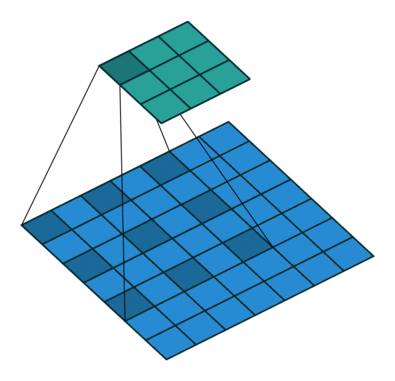  | 引入一个称作扩张率（Dilation Rate）的参数，使同样尺寸的卷积核可以获得更大的感受视野，相应的在相同感受视野的前提下比普通卷积采用更少的参数。同样是$3\times3$的卷积核尺寸，扩张卷积可以提取$5\times5$范围的区域特征，在实时图像分割领域广泛应用 |
|            转置卷积            |  | 先对原始特征矩阵进行填充使其维度扩大到适配卷积目标输出维度，然后进行普通的卷积操作的一个过程，其输入到输出的维度变换关系恰好与普通卷积的变换关系相反，但这个变换并不是真正的逆变换操作，通常称为转置卷积(Transpose Convolution)而不是反卷积(Deconvolution)。转置卷积常见于目标检测领域中对小目标的检测和图像分割领域还原输入图像尺度。 |
|           可分离卷积           |  | 标准的卷积操作是同时对原始图像$H\times W\times C$三个方向的卷积运算，假设有$K$个相同尺寸的卷积核，这样的卷积操作需要用到的参数为$H\times W\times C\times K$个；若将长宽与深度方向的卷积操作分离出变为$H\times W$与$C$的两步卷积操作，则同样的卷积核个数$K$，只需要$(H\times W + C)\times K$个参数，便可得到同样的输出尺度。可分离卷积(Seperable Convolution)通常应用在模型压缩或一些轻量的卷积神经网络中，如MobileNet$^{[1]}$、Xception$^{[2]}$等 |

## 5.5 二维卷积与三维卷积有什么区别？

- **二维卷积**
  二维卷积操作如图5.3所示，为了更直观的说明，分别展示在单通道和多通道输入中，对单个通道输出的卷积操作。在单通道输入的情况下，若输入卷积核尺寸为 $(k_h, k_w, 1)$，卷积核在输入图像的空间维度上进行滑窗操作，每次滑窗和 $(k_h, k_w)$窗口内的值进行卷积操作，得到输出图像中的一个值。在多通道输入的情况下，假定输入图像特征通道数为3，卷积核尺寸则为$(k_h, k_w, 3)$，每次滑窗与3个通道上的$(k_h, k_w)$窗口内的所有值进行卷积操作，得到输出图像中的一个值。

- **三维卷积**
  3D卷积操作如图所示，同样分为单通道和多通道，且假定只使用1个卷积核，即输出图像仅有一个通道。对于单通道输入，与2D卷积不同之处在于，输入图像多了一个深度(depth)维度，卷积核也多了一个$k_d$维度，因此3D卷积核的尺寸为$(k_h, k_w, k_d)$，每次滑窗与$(k_h, k_w, k_d)$窗口内的值进行相关操作，得到输出3D图像中的一个值。对于多通道输入，则与2D卷积的操作一样，每次滑窗与3个channels上的$(k_h, k_w, k_d)$窗口内的所有值进行相关操作，得到输出3D图像中的一个值。

## 5.7 有哪些池化方法？

​   池化操作通常也叫做子采样(Subsampling)或降采样(Downsampling)，在构建卷积神经网络时，往往会用在卷积层之后，通过池化来降低卷积层输出的特征维度，有效减少网络参数的同时还可以防止过拟合现象。池化操作可以降低图像维度的原因，本质上是因为图像具有一种“静态性”的属性，这个意思是说在一个图像区域有用的特征极有可能在另一个区域同样有用。因此，为了描述一个大的图像，很直观的想法就是对不同位置的特征进行聚合统计。例如，可以计算图像在固定区域上特征的平均值 (或最大值)来代表这个区域的特征。
​                                                                              表5.6 池化分类

|                  池化类型                   |                      示意图                       | 作用                                                         |
| :-----------------------------------------: | :-----------------------------------------------: | :----------------------------------------------------------- |
|          一般池化(General Pooling)          |      | 通常包括最大池化(Max Pooling)和平均池化(Mean Pooling)。以最大池化为例，池化范围$(2\times2)$和滑窗步长$(stride=2)$ 相同，仅提取一次相同区域的范化特征。 |
|        重叠池化(Overlapping Pooling)        |  | 与一般池化操作相同，但是池化范围$P_{size}$与滑窗步长$stride$关系为$P_{size}>stride$，同一区域内的像素特征可以参与多次滑窗提取，得到的特征表达能力更强，但计算量更大。 |
| 空间金字塔池化$^*$(Spatial Pyramid Pooling) |  | 在进行多尺度目标的训练时，卷积层允许输入的图像特征尺度是可变的，紧接的池化层若采用一般的池化方法会使得不同的输入特征输出相应变化尺度的特征，而卷积神经网络中最后的全连接层则无法对可变尺度进行运算，因此需要对不同尺度的输出特征采样到相同输出尺度。 |

> SPPNet$^{[3]}$就引入了空间池化的组合，对不同输出尺度采用不同的滑窗大小和步长以确保输出尺度相同$(win_{size}=\lceil \frac{in}{out}\rceil; stride=\lfloor \frac{in}{out}\rfloor; )$，同时用如金字塔式叠加的多种池化尺度组合，以提取更加丰富的图像特征。常用于多尺度训练和目标检测中的区域提议网络(Region Proposal Network)的兴趣区域(Region of Interest)提取

## 5.8 $1\times1$卷积作用？

​   NIN(Network in Network)$^{[4]}$是第一篇探索$1\times1$卷积核的论文，这篇论文通过在卷积层中使用MLP替代传统线性的卷积核，使单层卷积层内具有非线性映射的能力，也因其网络结构中嵌套MLP子网络而得名NIN。NIN对不同通道的特征整合到MLP自网络中，让不同通道的特征能够交互整合，使通道之间的信息得以流通，其中的MLP子网络恰恰可以用$1\times1$的卷积进行代替。

​   GoogLeNet$^{[5]}$则采用$1\times1$卷积核来减少模型的参数量。在原始版本的Inception模块中，由于每一层网络采用了更多的卷积核，大大增加了模型的参数量。此时在每一个较大卷积核的卷积层前引入$1\times1$卷积，可以通过分离通道与宽高卷积来减少模型参数量。以图5.2为例，在不考虑参数偏置项的情况下，若输入和输出的通道数为$C_1=16$，则左半边网络模块所需的参数为$(1\times1+3\times3+5\times5+0)\times C_1\times C_1=8960$；假定右半边网络模块采用的$1\times1$卷积通道数为$C_2=8$$(满足C_1>C_2)$，则右半部分的网络结构所需参数量为$(1\times1\times (3C_1+C_2)+3\times3\times C_2 +5\times5\times C_2)\times C_1=5248$ ，可以在不改变模型表达能力的前提下大大减少所使用的参数量。

​                               图5.2 Inception模块

综上所述，$1\times 1$卷积的作用主要为以下两点：

- 实现信息的跨通道交互和整合。
- 对卷积核通道数进行降维和升维，减小参数量。

## 5.9 卷积层和池化层有什么区别？

​   卷积层核池化层在结构上具有一定的相似性，都是对感受域内的特征进行提取，并且根据步长设置获取到不同维度的输出，但是其内在操作是有本质区别的，如表5.7所示。

|            |                 卷积层                 |              池化层              |
| :--------: | :------------------------------------: | :------------------------------: |
|  **结构**  |   零填充时输出维度不变，而通道数改变   |  通常特征维度会降低，通道数不变  |
| **稳定性** | 输入特征发生细微改变时，输出结果会改变 | 感受域内的细微变化不影响输出结果 |
|  **作用**  |        感受域内提取局部关联特征        |  感受域内提取泛化特征，降低维度  |
| **参数量** |      与卷积核尺寸、卷积核个数相关      |          不引入额外参数          |

## 5.10 卷积核是否一定越大越好？

​   在早期的卷积神经网络中（如LeNet-5、AlexNet），用到了一些较大的卷积核（$11\times11$和$5\times 5$），受限于当时的计算能力和模型结构的设计，无法将网络叠加得很深，因此卷积网络中的卷积层需要设置较大的卷积核以获取更大的感受域。但是这种大卷积核反而会导致计算量大幅增加，不利于训练更深层的模型，相应的计算性能也会降低。后来的卷积神经网络（VGG、GoogLeNet等），发现通过堆叠2个$3\times 3$卷积核可以获得与$5\times 5$卷积核相同的感受视野，同时参数量会更少（$3×3×2+1$ < $ 5×5×1+1$），$3\times 3$卷积核被广泛应用在许多卷积神经网络中。因此可以认为，在大多数情况下通过堆叠较小的卷积核比直接采用单个更大的卷积核会更加有效。

​   但是，这并不是表示更大的卷积核就没有作用，在某些领域应用卷积神经网络时仍然可以采用较大的卷积核。譬如在自然语言处理领域，由于文本内容不像图像数据可以对特征进行很深层的抽象，往往在该领域的特征提取只需要较浅层的神经网络即可。在将卷积神经网络应用在自然语言处理领域时，通常都是较为浅层的卷积层组成，但是文本特征有时又需要有较广的感受域让模型能够组合更多的特征（如词组和字符），此时直接采用较大的卷积核将是更好的选择。

​   综上所述，卷积核的大小并没有绝对的优劣，需要视具体的应用场景而定，但是极大和极小的卷积核都是不合适的，单独的$1\times 1$极小卷积核只能用作分离卷积而不能对输入的原始特征进行有效的组合，极大的卷积核通常会组合过多的无意义特征从而浪费了大量的计算资源。

## 5.11 每层卷积是否只能用一种尺寸的卷积核？

​   经典的神经网络一般都属于层叠式网络，每层仅用一个尺寸的卷积核，如VGG结构中使用了大量的$3×3$卷积层。事实上，同一层特征图可以分别使用多个不同尺寸的卷积核，以获得不同尺度的特征，再把这些特征结合起来，得到的特征往往比使用单一卷积核的要好，如GoogLeNet、Inception系列的网络，均是每层使用了多个卷积核结构。如图5.3所示，输入的特征在同一层分别经过$1×1$、$3×3$和$5×5$三种不同尺寸的卷积核，再将分别得到的特征进行整合，得到的新特征可以看作不同感受域提取的特征组合，相比于单一卷积核会有更强的表达能力。

​                               图5.3 Inception模块结构

## 5.12 怎样才能减少卷积层参数量？

减少卷积层参数量的方法可以简要地归为以下几点：

- 使用堆叠小卷积核代替大卷积核：VGG网络中2个$3\times 3$的卷积核可以代替1个$5\times 5$的卷积核
- 使用分离卷积操作：将原本$K\times K\times C$的卷积操作分离为$K\times K\times 1$和$1\times1\times C$的两部分操作
- 添加$1\times 1$的卷积操作：与分离卷积类似，但是通道数可变，在$K\times K\times C_1$卷积前添加$1\times1\times C_2$的卷积核（满足$C_2 <C_1$）
- 在卷积层前使用池化操作：池化可以降低卷积层的输入特征维度

## 5.13 在进行卷积操作时，必须同时考虑通道和区域吗？

​   标准卷积中，采用区域与通道同时处理的操作，如下图所示：

​   这样做可以简化卷积层内部的结构，每一个输出的特征像素都由所有通道的同一个区域提取而来。

​   但是这种方式缺乏灵活性，并且在深层的网络结构中使得运算变得相对低效，更为灵活的方式是使区域和通道的卷积分离开来，通道分离（深度分离）卷积网络由此诞生。如下图所示，Xception网络可解决上述问题。

​   我们首先对每一个通道进行各自的卷积操作，有多少个通道就有多少个过滤器。得到新的通道特征矩阵之后，再对这批新通道特征进行标准的$1×1$跨通道卷积操作。

## 5.14 采用宽卷积的好处有什么？

​   宽卷积对应的是窄卷积，实际上并不是卷积操作的类型，指的是卷积过程中的填充方法，对应的是'SAME'填充和'VALID'填充。'SAME'填充通常采用零填充的方式对卷积核不满足整除条件的输入特征进行补全，以使卷积层的输出维度保持与输入特征维度一致；'VALID'填充的方式则相反，实际并不进行任何填充，在输入特征边缘位置若不足以进行卷积操作，则对边缘信息进行舍弃，因此在步长为1的情况下该填充方式的卷积层输出特征维度可能会略小于输入特征的维度。此外，由于前一种方式通过补零来进行完整的卷积操作，可以有效地保留原始的输入特征信息。

​   比如下图左部分为窄卷积。注意到越在边缘的位置被卷积的次数越少。宽卷积可以看作在卷积之前在边缘用0补充，常见有两种情况，一个是全补充，如下图右部分，这样输出大于输入的维度。另一种常用的方法是补充一一部分0值，使得输出和输入的维度一致。

## 5.15 理解转置卷积与棋盘效应

### 5.15.1 标准卷积
在理解转置卷积之前，需要先理解标准卷积的运算方式。

首先给出一个输入输出结果

那是怎样计算的呢？

卷积的时候需要对卷积核进行180的旋转，同时卷积核中心与需计算的图像像素对齐，输出结构为中心对齐像素的一个新的像素值，计算例子如下：

这样计算出左上角(即第一行第一列)像素的卷积后像素值。

给出一个更直观的例子，从左到右看，原像素经过卷积由1变成-8。

通过滑动卷积核，就可以得到整张图片的卷积结果。

### 5.15.2 转置卷积

图像的deconvolution过程如下：

输入：2x2， 卷积核：4x4， 滑动步长：3， 输出：7x7 

过程如下： 

1. 输入图片每个像素进行一次full卷积，根据full卷积大小计算可以知道每个像素的卷积后大小为 1+4-1=4， 即4x4大小的特征图，输入有4个像素所以4个4x4的特征图 

2. 将4个特征图进行步长为3的相加； 输出的位置和输入的位置相同。步长为3是指每隔3个像素进行相加，重叠部分进行相加，即输出的第1行第4列是由红色特阵图的第一行第四列与绿色特征图的第一行第一列相加得到，其他如此类推。  

   可以看出翻卷积的大小是由卷积核大小与滑动步长决定， in是输入大小， k是卷积核大小， s是滑动步长， out是输出大小 得到 out = (in - 1) * s + k 上图过程就是， (2 - 1) * 3 + 4 = 7。

### 5.15.3 棋盘效应

## 5.16 卷积神经网络的参数设置
​   卷积神经网络中常见的参数在其他类型的神经网络中也是类似的，但是参数的设置还得结合具体的任务才能设置在合理的范围，具体的参数列表如表XX所示。
​                                                    表XX 卷积神经网络常见参数

| 参数名 | 常见设置 | 参数说明 |
| :----: | :-----: | :---- |
| 学习率(Learning Rate) | $0-1$ | 反向传播网络中更新权值矩阵的步长，在一些常见的网络中会在固定迭代次数或模型不再收敛后对学习率进行指数下降(如$lr=lr\times 0.1$)。当学习率越大计算误差对权值矩阵的影响越大，容易在某个局部最优解附近震荡；越小的学习率对网络权值的更新越精细，但是需要花费更多的时间去迭代 |
| 批次大小(Batch Size) | $1-N$ | 批次大小指定一次性流入模型的数据样本个数，根据任务和计算性能限制判断实际取值，在一些图像任务中往往由于计算性能和存储容量限制只能选取较小的值。在相同迭代次数的前提下，数值越大模型越稳定，泛化能力越强，损失值曲线越平滑，模型也更快地收敛，但是每次迭代需要花费更多的时间 |
| 数据轮次(Epoch) | $1-N$ | 数据轮次指定所有训练数据在模型中训练的次数，根据数据集规模和分布情况会设置为不同的值。当模型较为简单或训练数据规模较小时，通常轮次不宜过高，否则模型容易过拟合；模型较为复杂或训练数据规模足够大时，可适当提高数据的训练轮次。 |
| 权重衰减系数(Weight Decay) | $0-0.001$ | 模型训练过程中反向传播权值更新的权重衰减值 |

## 5.17 提高卷积神经网络的泛化能力
​   卷积神经网络与其他类型的神经网络类似，在采用反向传播进行训练的过程中比较依赖输入的数据分布，当数据分布较为极端的情况下容易导致模型欠拟合或过拟合，表XX记录了提高卷积网络泛化能力的方法。
​                                                                   表XX 提高卷积网络化能力的方法

| 方法 | 说明 |
| :---: | :--- |
| 使用更多数据 | 在有条件的前提下，尽可能多地获取训练数据是最理想的方法，更多的数据可以让模型得到充分的学习，也更容易提高泛化能力 |
| 使用更大批次 | 在相同迭代次数和学习率的条件下，每批次采用更多的数据将有助于模型更好的学习到正确的模式，模型输出结果也会更加稳定 |
| 调整数据分布 | 大多数场景下的数据分布是不均匀的，模型过多地学习某类数据容易导致其输出结果偏向于该类型的数据，此时通过调整输入的数据分布可以一定程度提高泛化能力 |
| 调整目标函数 | 在某些情况下，目标函数的选择会影响模型的泛化能力，如目标函数$f(y,y')=|y-y'|$在某类样本已经识别较为准确而其他样本误差较大的侵害概况下，不同类别在计算损失结果的时候距离权重是相同的，若将目标函数改成$f(y,y')=(y-y')^2$则可以使误差小的样本计算损失的梯度比误差大的样本更小，进而有效地平衡样本作用，提高模型泛化能力 |
| 调整网络结构 | 在浅层卷积神经网络中，参数量较少往往使模型的泛化能力不足而导致欠拟合，此时通过叠加卷积层可以有效地增加网络参数，提高模型表达能力；在深层卷积网络中，若没有充足的训练数据则容易导致模型过拟合，此时通过简化网络结构减少卷积层数可以起到提高模型泛化能力的作用 |
|   数据增强   | 数据增强又叫数据增广，在有限数据的前提下通过平移、旋转、加噪声等一些列变换来增加训练数据，同类数据的表现形式也变得更多样，有助于模型提高泛化能力，需要注意的是数据变化应尽可能不破坏元数数据的主体特征(如在图像分类任务中对图像进行裁剪时不能将分类主体目标裁出边界)。 |
|  权值正则化  | 权值正则化就是通常意义上的正则化，一般是在损失函数中添加一项权重矩阵的正则项作为惩罚项，用来惩罚损失值较小时网络权重过大的情况，此时往往是网络权值过拟合了数据样本(如$Loss=f(WX+b,y')+\frac{\lambda}{\eta}\sum{|W|}$)。 |
| 屏蔽网络节点 | 该方法可以认为是网络结构上的正则化，通过随机性地屏蔽某些神经元的输出让剩余激活的神经元作用，可以使模型的容错性更强。 |
> 对大多数神经网络模型同样通用

## 5.18 卷积神经网络在不同领域的应用
​   卷积神经网络中的卷积操作是其关键组成，而卷积操作只是一种数学运算方式，实际上对不同类型的数值表示数据都是通用的，尽管这些数值可能表示的是图像像素值、文本序列中单个字符或是语音片段中单字的音频。只要使原始数据能够得到有效地数值化表示，卷积神经网络能够在不同的领域中得到应用，要关注的是如何将卷积的特性更好地在不同领域中应用，如表XX所示。
​                                                    表XX 卷积神经网络不同领域的应用
| 应用领域 | 输入数据图示 | 说明 |
| :-----: | :----------: | :-- |
|   图像处理   |  | 卷积神经网络在图像处理领域有非常广泛的应用，这是因为图像数据本身具有的局部完整性非常 |
| 自然语言处理 |  |  |
|   语音处理   |  |  |

### 5.18.1 联系

​   自然语言处理是对一维信号（词序列）做操作。
​   计算机视觉是对二维（图像）或三维（视频流）信号做操作。

### 5.18.2 区别

​   自然语言处理的输入数据通常是离散取值（例如表示一个单词或字母通常表示为词典中的one hot向量），计算机视觉则是连续取值（比如归一化到0，1之间的灰度值）。CNN有两个主要特点，区域不变性(location invariance)和组合性(Compositionality)。

1. 区域不变性：滤波器在每层的输入向量(图像)上滑动，检测的是局部信息，然后通过pooling取最大值或均值。pooling这步综合了局部特征，失去了每个特征的位置信息。这很适合基于图像的任务，比如要判断一幅图里有没有猫这种生物，你可能不会去关心这只猫出现在图像的哪个区域。但是在NLP里，词语在句子或是段落里出现的位置，顺序，都是很重要的信息。
2. 局部组合性：CNN中，每个滤波器都把较低层的局部特征组合生成较高层的更全局化的特征。这在CV里很好理解，像素组合成边缘，边缘生成形状，最后把各种形状组合起来得到复杂的物体表达。在语言里，当然也有类似的组合关系，但是远不如图像来的直接。而且在图像里，相邻像素必须是相关的，相邻的词语却未必相关。

## 5.19 卷积神经网络凸显共性的方法？

### 5.19.1 局部连接

​   我们首先了解一个概念，感受野，即每个神经元仅与输入神经元相连接的一块区域。
在图像卷积操作中，神经元在空间维度上是局部连接，但在深度上是全连接。局部连接的思想，是受启发于生物学里的视觉系统结构，视觉皮层的神经元就是仅用局部接受信息。对于二维图像，局部像素关联性较强。这种局部连接保证了训练后的滤波器能够对局部特征有最强的响应，使神经网络可以提取数据的局部特征；
下图是一个很经典的图示，左边是全连接，右边是局部连接。

对于一个1000 × 1000的输入图像而言，如果下一个隐藏层的神经元数目为10^6个，采用全连接则有1000 × 1000 × 10^6 = 10^12个权值参数，如此巨大的参数量几乎难以训练；而采用局部连接，隐藏层的每个神经元仅与图像中10 × 10的局部图像相连接，那么此时的权值参数数量为10 × 10 × 10^6 = 10^8，将直接减少4个数量级。

### 5.19.2 权值共享

​   权值共享，即计算同一深度的神经元时采用的卷积核参数是共享的。权值共享在一定程度上讲是有意义的，是由于在神经网络中，提取的底层边缘特征与其在图中的位置无关。但是在另一些场景中是无意的，如在人脸识别任务，我们期望在不同的位置学到不同的特征。
需要注意的是，权重只是对于同一深度切片的神经元是共享的。在卷积层中，通常采用多组卷积核提取不同的特征，即对应的是不同深度切片的特征，而不同深度切片的神经元权重是不共享。相反，偏置这一权值对于同一深度切片的所有神经元都是共享的。
权值共享带来的好处是大大降低了网络的训练难度。如下图，假设在局部连接中隐藏层的每一个神经元连接的是一个10 × 10的局部图像，因此有10 × 10个权值参数，将这10 × 10个权值参数共享给剩下的神经元，也就是说隐藏层中10^6个神经元的权值参数相同，那么此时不管隐藏层神经元的数目是多少，需要训练的参数就是这 10 × 10个权值参数（也就是卷积核的大小）。

这里就体现了卷积神经网络的奇妙之处，使用少量的参数，却依然能有非常出色的性能。上述仅仅是提取图像一种特征的过程。如果要多提取出一些特征，可以增加多个卷积核，不同的卷积核能够得到图像不同尺度下的特征，称之为特征图（feature map）。

### 5.19.3 池化操作

池化操作与多层次结构一起，实现了数据的降维，将低层次的局部特征组合成为较高层次的特征，从而对整个图片进行表示。如下图：

## 5.20 全连接、局部连接、全卷积与局部卷积
​   大多数神经网络中高层网络通常会采用全连接层(Global Connected Layer)，通过多对多的连接方式对特征进行全局汇总，可以有效地提取全局信息。但是全连接的方式需要大量的参数，是神经网络中最占资源的部分之一，因此就需要由局部连接(Local Connected Layer)，仅在局部区域范围内产生神经元连接，能够有效地减少参数量。根据卷积操作的作用范围可以分为全卷积(Global Convolution)和局部卷积(Local Convolution)。实际上这里所说的全卷积就是标准卷积，即在整个输入特征维度范围内采用相同的卷积核参数进行运算，全局共享参数的连接方式可以使神经元之间的连接参数大大减少;局部卷积又叫平铺卷积(Tiled Convolution)或非共享卷积(Unshared Convolution)，是局部连接与全卷积的折衷。四者的比较如表XX所示。
​                                                     表XX 卷积网络中连接方式的对比

| 连接方式 | 示意图 | 说明 |
| :------: | :---: | :--- |
|  全连接  |  | 层间神经元完全连接，每个输出神经元可以获取到所有输入神经元的信息，有利于信息汇总，常置于网络末层；连接与连接之间独立参数，大量的连接大大增加模型的参数规模。 |
| 局部连接 |  | 层间神经元只有局部范围内的连接，在这个范围内采用全连接的方式，超过这个范围的神经元则没有连接；连接与连接之间独立参数，相比于全连接减少了感受域外的连接，有效减少参数规模 |
|  全卷积  |  | 层间神经元只有局部范围内的连接，在这个范围内采用全连接的方式，连接所采用的参数在不同感受域之间共享，有利于提取特定模式的特征；相比于局部连接，共用感受域之间的参数可以进一步减少参数量。 |
| 局部卷积 |  | 层间神经元只有局部范围内的连接，感受域内采用全连接的方式，而感受域之间间隔采用局部连接与全卷积的连接方式；相比与全卷积成倍引入额外参数，但有更强的灵活性和表达能力；相比于局部连接，可以有效控制参数量 |

## 5.21 局部卷积的应用

并不是所有的卷积都会进行权重共享，在某些特定任务中，会使用不权重共享的卷积。下面通过人脸这一任务来进行讲解。在读人脸方向的一些paper时，会发现很多都会在最后加入一个Local Connected Conv，也就是不进行权重共享的卷积层。总的来说，这一步的作用就是使用3D模型来将人脸对齐，从而使CNN发挥最大的效果。

截取论文中的一部分图，经过3D对齐以后，形成的图像均是152×152，输入到上述的网络结构中。该结构的参数如下：

Conv：32个11×11×3的卷积核，

Max-pooling: 3×3，stride=2，

Conv: 16个9×9的卷积核，

Local-Conv: 16个9×9的卷积核，

Local-Conv: 16个7×7的卷积核，

Local-Conv: 16个5×5的卷积核，

Fully-connected: 4096维，

Softmax: 4030维。

前三层的目的在于提取低层次的特征，比如简单的边和纹理。其中Max-pooling层使得卷积的输出对微小的偏移情况更加鲁棒。但不能使用更多的Max-pooling层，因为太多的Max-pooling层会使得网络损失图像信息。全连接层将上一层的每个单元和本层的所有单元相连，用来捕捉人脸图像不同位置特征之间的相关性。最后使用softmax层用于人脸分类。
中间三层都是使用参数不共享的卷积核，之所以使用参数不共享，有如下原因：

（1）对齐的人脸图片中，不同的区域会有不同的统计特征，因此并不存在特征的局部稳定性，所以使用相同的卷积核会导致信息的丢失。

（2）不共享的卷积核并不增加inference时特征的计算量，仅会增加训练时的计算量。
使用不共享的卷积核，由于需要训练的参数量大大增加，因此往往需要通过其他方法增加数据量。

## 5.22 NetVLAD池化    （贡献者：熊楚原-中国人民大学）

NetVLAD是论文\[15\]提出的一个局部特征聚合的方法。

在传统的网络里面，例如VGG啊，最后一层卷积层输出的特征都是类似于Batchsize x 3 x 3 x 512的这种东西，然后会经过FC聚合，或者进行一个Global Average Pooling（NIN里的做法），或者怎么样，变成一个向量型的特征，然后进行Softmax or 其他的Loss。

这种方法说简单点也就是输入一个图片或者什么的结构性数据，然后经过特征提取得到一个长度固定的向量，之后可以用度量的方法去进行后续的操作，比如分类啊，检索啊，相似度对比等等。

那么NetVLAD考虑的主要是最后一层卷积层输出的特征这里，我们不想直接进行欠采样或者全局映射得到特征，对于最后一层输出的W x H x D，设计一个新的池化，去聚合一个“局部特征“，这即是NetVLAD的作用。

NetVLAD的一个输入是一个W x H x D的图像特征，例如VGG-Net最后的3 x 3 x 512这样的矩阵，在网络中还需加一个维度为Batchsize。

NetVLAD还需要另输入一个标量K即表示VLAD的聚类中心数量，它主要是来构成一个矩阵C，是通过原数据算出来的每一个$W \times H$特征的聚类中心，C的shape即$C: K \times D$，然后根据三个输入，VLAD是计算下式的V:

$$V(j, k) = \sum_{i=1}^{N}{a_k(x_i)(x_i(j) - c_k(j))}$$

其中j表示维度，从1到D，可以看到V的j是和输入与c对应的，对每个类别k，都对所有的x进行了计算，如果$x_i$属于当前类别k，$a_k=1$，否则$a_k=0$，计算每一个x和它聚类中心的残差，然后把残差加起来，即是每个类别k的结果，最后分别L2正则后拉成一个长向量后再做L2正则，正则非常的重要，因为这样才能统一所有聚类算出来的值，而残差和的目的主要是消减不同聚类上的分布不均，两者共同作用才能得到最后正常的输出。

输入与输出如下图所示：

中间得到的K个D维向量即是对D个x都进行了与聚类中心计算残差和的过程，最终把K个D维向量合起来后进行即得到最终输出的$K \times D$长度的一维向量。

而VLAD本身是不可微的，因为上面的a要么是0要么是1，表示要么当前描述x是当前聚类，要么不是，是个离散的，NetVLAD为了能够在深度卷积网络里使用反向传播进行训练，对a进行了修正。

那么问题就是如何重构一个a，使其能够评估当前的这个x和各个聚类的关联程度？用softmax来得到：

$$a_k = \frac{e^{W_k^T x_i + b_k}}{e^{W_{k'}^T x_i + b_{k'}}}$$

将这个把上面的a替换后，即是NetVLAD的公式，可以进行反向传播更新参数。

所以一共有三个可训练参数，上式a中的$W: K \times D$，上式a中的$b: K \times 1$，聚类中心$c: K \times D$，而原始VLAD只有一个参数c。

最终池化得到的输出是一个恒定的K x D的一维向量（经过了L2正则），如果带Batchsize，输出即为Batchsize x (K x D)的二维矩阵。

NetVLAD作为池化层嵌入CNN网络即如下图所示，

原论文中采用将传统图像检索方法VLAD进行改进后应用在CNN的池化部分作为一种另类的局部特征池化，在场景检索上取得了很好的效果。

后续相继又提出了ActionVLAD、ghostVLAD等改进。

## 参考文献

[1] 卷积神经网络研究综述[J]. 计算机学报, 2017, 40(6):1229-1251.

[2] 常亮, 邓小明, 周明全,等. 图像理解中的卷积神经网络[J]. 自动化学报, 2016, 42(9):1300-1312.

[3] Chua L O. CNN: A Paradigm for Complexity[M]// CNN a paradigm for complexity /.  1998.

[4] He K, Gkioxari G, Dollar P, et al. Mask R-CNN[J]. IEEE Transactions on Pattern Analysis & Machine Intelligence, 2017, PP(99):1-1.

[5] Hoochang S, Roth H R, Gao M, et al. Deep Convolutional Neural Networks for Computer-Aided Detection: CNN Architectures, Dataset Characteristics and Transfer Learning[J]. IEEE Transactions on Medical Imaging, 2016, 35(5):1285-1298.

[6] 许可. 卷积神经网络在图像识别上的应用的研究[D]. 浙江大学, 2012.

[7] 陈先昌. 基于卷积神经网络的深度学习算法与应用研究[D]. 浙江工商大学, 2014.

[8] [CS231n Convolutional Neural Networks for Visual Recognition, Stanford](http://cs231n.github.io/convolutional-networks/)

[9] [Machine Learning is Fun! Part 3: Deep Learning and Convolutional Neural Networks](https://medium.com/@ageitgey/machine-learning-is-fun-part-3-deep-learning-and-convolutional-neural-networks-f40359318721#.2gfx5zcw3)

[10] cs231n 动态卷积图：<http://cs231n.github.io/assets/conv-demo/index.html>

[11] Krizhevsky A, Sutskever I, Hinton G E. Imagenet classification with deep convolutional neural networks[C]//Advances in neural information processing systems. 2012: 1097-1105.

[12] Sun Y, Wang X, Tang X. Deep learning face representation from predicting 10,000 classes[C]//Computer Vision and Pattern Recognition (CVPR), 2014 IEEE Conference on. IEEE, 2014: 1891-1898.

[13] 魏秀参.解析深度学习——卷积神经网络原理与视觉实践[M].电子工业出版社, 2018

[14]  Jianxin W U ,  Gao B B ,  Wei X S , et al. Resource-constrained deep learning: challenges and practices[J]. Scientia Sinica(Informationis), 2018.

[15] Arandjelovic R , Gronat P , Torii A , et al. [IEEE 2016 IEEE Conference on Computer Vision and Pattern Recognition (CVPR) - Las Vegas, NV, USA (2016.6.27-2016.6.30)] 2016 IEEE Conference on Computer Vision and Pattern Recognition (CVPR) - NetVLAD: CNN Architecture for Weakly Supervised Place Recognition[C]// 2016:5297-5307.

# 第六章 循环神经网络(RNN)

## 6.1 为什么需要RNN？

​   时间序列数据是指在不同时间点上收集到的数据，这类数据反映了某一事物、现象等随时间的变化状态或程度。一般的神经网络，在训练数据足够、算法模型优越的情况下，给定特定的x，就能得到期望y。其一般处理单个的输入，前一个输入和后一个输入完全无关，但实际应用中，某些任务需要能够更好的处理序列的信息，即前面的输入和后面的输入是有关系的。比如：

​   当我们在理解一句话意思时，孤立的理解这句话的每个词不足以理解整体意思，我们通常需要处理这些词连接起来的整个序列； 当我们处理视频的时候，我们也不能只单独的去分析每一帧，而要分析这些帧连接起来的整个序列。为了解决一些这样类似的问题，能够更好的处理序列的信息，RNN就由此诞生了。

## 6.2 图解RNN基本结构

### 6.2.1 基本的单层网络结构

​   在进一步了解RNN之前，先给出最基本的单层网络结构，输入是x，经过变换Wx+b和激活函数f得到输出y：

### 6.2.2 图解经典RNN结构

​   在实际应用中，我们还会遇到很多序列形的数据，如：

- 自然语言处理问题。x1可以看做是第一个单词，x2可以看做是第二个单词，依次类推。

- 语音处理。此时，x1、x2、x3……是每帧的声音信号。

- 时间序列问题。例如每天的股票价格等等。

  其单个序列如下图所示：

  

  前面介绍了诸如此类的序列数据用原始的神经网络难以建模，基于此，RNN引入了隐状态$h$（hidden state），$h​$可对序列数据提取特征，接着再转换为输出。

  为了便于理解，先计算$h_1​$：

  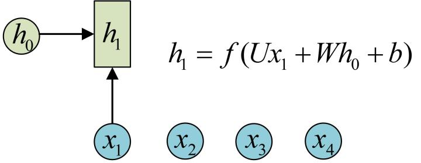

  注：图中的圆圈表示向量，箭头表示对向量做变换。

  RNN中，每个步骤使用的参数$U,W,b$​相同，$h_2$的计算方式和$h_1​$类似，其计算结果如下：

  

  计算$h_3$,$h_4​$也相似，可得：

  

  接下来，计算RNN的输出$y_1$，采用$Softmax$作为激活函数，根据$y_n=f(Wx+b)$，得$y_1​$:

  

  使用和$y_1​$相同的参数$V,c​$，得到$y_1,y_2,y_3,y_4​$的输出结构：

  

  以上即为最经典的RNN结构，其输入为$x_1,x_2,x_3,x_4$，输出为$y_1,y_2,y_3,y_4$，当然实际中最大值为$y_n$，这里为了便于理解和展示，只计算4个输入和输出。从以上结构可看出，RNN结构的输入和输出等长。

### 6.2.3 vector-to-sequence结构

​   有时我们要处理的问题输入是一个单独的值，输出是一个序列。此时，有两种主要建模方式：

​   方式一：可只在其中的某一个序列进行计算，比如序列第一个进行输入计算，其建模方式如下：

​   方式二：把输入信息X作为每个阶段的输入，其建模方式如下：

### 6.2.4 sequence-to-vector结构

​   有时我们要处理的问题输入是一个序列，输出是一个单独的值，此时通常在最后的一个序列上进行输出变换，其建模如下所示：

  

### 6.2.5 Encoder-Decoder结构

​   原始的sequence-to-sequence结构的RNN要求序列等长，然而我们遇到的大部分问题序列都是不等长的，如机器翻译中，源语言和目标语言的句子往往并没有相同的长度。

​   其建模步骤如下：

​   **步骤一**：将输入数据编码成一个上下文向量$c$，这部分称为Encoder，得到$c$有多种方式，最简单的方法就是把Encoder的最后一个隐状态赋值给$c$，还可以对最后的隐状态做一个变换得到$c$，也可以对所有的隐状态做变换。其示意如下所示：

  

​   **步骤二**：用另一个RNN网络（我们将其称为Decoder）对其进行编码，方法一是将步骤一中的$c​$作为初始状态输入到Decoder，示意图如下所示：

  

方法二是将$c$作为Decoder的每一步输入，示意图如下所示：

  

### 6.2.6  以上三种结构各有怎样的应用场景

| 网络结构 |        结构图示         | 应用场景举例                                                 |
| -------- | :---------------------: | ------------------------------------------------------------ |
| 1 vs N   |   | 1、从图像生成文字，输入为图像的特征，输出为一段句子 2、根据图像生成语音或音乐，输入为图像特征，输出为一段语音或音乐 |
| N vs 1   |   | 1、输出一段文字，判断其所属类别 2、输入一个句子，判断其情感倾向 3、输入一段视频，判断其所属类别 |
| N vs M   |  | 1、机器翻译，输入一种语言文本序列，输出另外一种语言的文本序列 2、文本摘要，输入文本序列，输出这段文本序列摘要 3、阅读理解，输入文章，输出问题答案 4、语音识别，输入语音序列信息，输出文字序列 |

### 6.2.7 图解RNN中的Attention机制

​   在上述通用的Encoder-Decoder结构中，Encoder把所有的输入序列都编码成一个统一的语义特征$c​$再解码，因此，$c​$中必须包含原始序列中的所有信息，它的长度就成了限制模型性能的瓶颈。如机器翻译问题，当要翻译的句子较长时，一个$c​$可能存不下那么多信息，就会造成翻译精度的下降。Attention机制通过在每个时间输入不同的$c​$来解决此问题。

​   引入了Attention机制的Decoder中，有不同的$c$，每个$c​$会自动选择与当前输出最匹配的上下文信息，其示意图如下所示：

​   **举例**，比如输入序列是“我爱中国”，要将此输入翻译成英文：

​   假如用$a_{ij}$衡量Encoder中第$j$阶段的$h_j$和解码时第$i$阶段的相关性，$a_{ij}$从模型中学习得到，和Decoder的第$i-1$阶段的隐状态、Encoder 第$j$个阶段的隐状态有关，比如$a_{3j}​$的计算示意如下所示：

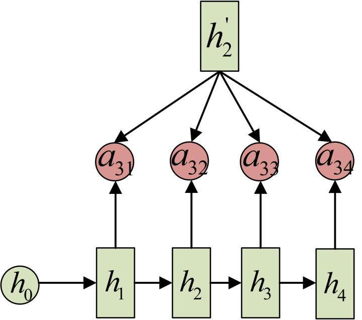

最终Decoder中第$i$阶段的输入的上下文信息 $c_i$来自于所有$h_j$对$a_{ij}$的加权和。

其示意图如下图所示：

​   在Encoder中，$h_1,h_2,h_3,h_4$分别代表“我”，“爱”，“中”，“国”所代表信息。翻译的过程中，$c_1$会选择和“我”最相关的上下午信息，如上图所示，会优先选择$a_{11}$，以此类推，$c_2$会优先选择相关性较大的$a_{22}$，$c_3$会优先选择相关性较大的$a_{33}，a_{34}$，这就是attention机制。

## 6.3 RNNs典型特点？

1. RNNs主要用于处理序列数据。对于传统神经网络模型，从输入层到隐含层再到输出层，层与层之间一般为全连接，每层之间神经元是无连接的。但是传统神经网络无法处理数据间的前后关联问题。例如，为了预测句子的下一个单词，一般需要该词之前的语义信息。这是因为一个句子中前后单词是存在语义联系的。
2. RNNs中当前单元的输出与之前步骤输出也有关，因此称之为循环神经网络。具体的表现形式为当前单元会对之前步骤信息进行储存并应用于当前输出的计算中。隐藏层之间的节点连接起来，隐藏层当前输出由当前时刻输入向量和之前时刻隐藏层状态共同决定。
3. 标准的RNNs结构图，图中每个箭头代表做一次变换，也就是说箭头连接带有权值。
4. 在标准的RNN结构中，隐层的神经元之间也是带有权值的，且权值共享。
5. 理论上，RNNs能够对任何长度序列数据进行处理。但是在实践中，为了降低复杂度往往假设当前的状态只与之前某几个时刻状态相关，**下图便是一个典型的RNNs**：

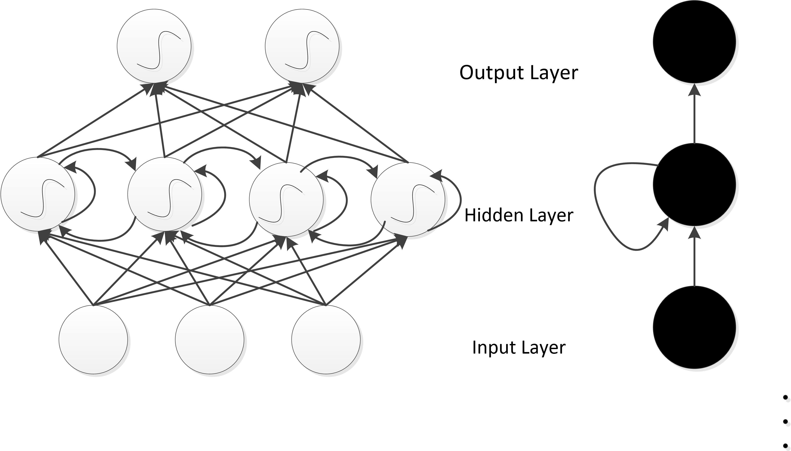

输入单元(Input units)：输入集$\bigr\{x_0,x_1,...,x_t,x_{t+1},...\bigr\}$，

输出单元(Output units)：输出集$\bigr\{y_0,y_1,...,y_t,y_{y+1},...\bigr\}$，

隐藏单元(Hidden units)：输出集$\bigr\{s_0,s_1,...,s_t,s_{t+1},...\bigr\}$。

**图中信息传递特点：**

1. 一条单向流动的信息流是从输入单元到隐藏单元。
2. 一条单向流动的信息流从隐藏单元到输出单元。
3. 在某些情况下，RNNs会打破后者的限制，引导信息从输出单元返回隐藏单元，这些被称为“Back Projections”。
4. 在某些情况下，隐藏层的输入还包括上一时刻隐藏层的状态，即隐藏层内的节点可以自连也可以互连。 
5. 当前单元（cell）输出是由当前时刻输入和上一时刻隐藏层状态共同决定。

## 6.4 CNN和RNN的区别 ？

| 类别   | 特点描述                                                     |
| ------ | ------------------------------------------------------------ |
| 相同点 | 1、传统神经网络的扩展。 2、前向计算产生结果，反向计算模型更新。 3、每层神经网络横向可以多个神经元共存,纵向可以有多层神经网络连接。 |
| 不同点 | 1、CNN空间扩展，神经元与特征卷积；RNN时间扩展，神经元与多个时间输出计算 2、RNN可以用于描述时间上连续状态的输出，有记忆功能，CNN用于静态输出 |

## 6.5 RNNs和FNNs有什么区别？

1. 不同于传统的前馈神经网络(FNNs)，RNNs引入了定向循环，能够处理输入之间前后关联问题。
2. RNNs可以记忆之前步骤的训练信息。
   **定向循环结构如下图所示**：

## 6.6 RNNs训练和传统ANN训练异同点？

**相同点**：

1. RNNs与传统ANN都使用BP（Back Propagation）误差反向传播算法。

**不同点**：

1. RNNs网络参数W,U,V是共享的(具体在本章6.2节中已介绍)，而传统神经网络各层参数间没有直接联系。
2. 对于RNNs，在使用梯度下降算法中，每一步的输出不仅依赖当前步的网络，还依赖于之前若干步的网络状态。

## 6.7 为什么RNN 训练的时候Loss波动很大
​   由于RNN特有的memory会影响后期其他的RNN的特点，梯度时大时小，learning rate没法个性化的调整，导致RNN在train的过程中，Loss会震荡起伏，为了解决RNN的这个问题，在训练的时候，可以设置临界值，当梯度大于某个临界值，直接截断，用这个临界值作为梯度的大小，防止大幅震荡。

## 6.8 标准RNN前向输出流程

​   以$x$表示输入，$h$是隐层单元，$o$是输出，$L$为损失函数，$y$为训练集标签。$t$表示$t$时刻的状态，$V,U,W$是权值，同一类型的连接权值相同。以下图为例进行说明标准RNN的前向传播算法：

​   

对于$t$时刻：
$$
h^{(t)}=\phi(Ux^{(t)}+Wh^{(t-1)}+b)
$$
其中$\phi()$为激活函数，一般会选择tanh函数，$b$为偏置。

$t$时刻的输出为：
$$
o^{(t)}=Vh^{(t)}+c
$$
模型的预测输出为：
$$
\widehat{y}^{(t)}=\sigma(o^{(t)})
$$
其中$\sigma​$为激活函数，通常RNN用于分类，故这里一般用softmax函数。

## 6.9 BPTT算法推导

​   BPTT（back-propagation through time）算法是常用的训练RNN的方法，其本质还是BP算法，只不过RNN处理时间序列数据，所以要基于时间反向传播，故叫随时间反向传播。BPTT的中心思想和BP算法相同，沿着需要优化的参数的负梯度方向不断寻找更优的点直至收敛。需要寻优的参数有三个，分别是U、V、W。与BP算法不同的是，其中W和U两个参数的寻优过程需要追溯之前的历史数据，参数V相对简单只需关注目前，那么我们就来先求解参数V的偏导数。
$$
\frac{\partial L^{(t)}}{\partial V}=\frac{\partial L^{(t)}}{\partial o^{(t)}}\cdot \frac{\partial o^{(t)}}{\partial V}
$$
RNN的损失也是会随着时间累加的，所以不能只求t时刻的偏导。
$$
L=\sum_{t=1}^{n}L^{(t)}
$$

$$
\frac{\partial L}{\partial V}=\sum_{t=1}^{n}\frac{\partial L^{(t)}}{\partial o^{(t)}}\cdot \frac{\partial o^{(t)}}{\partial V}
$$

​   W和U的偏导的求解由于需要涉及到历史数据，其偏导求起来相对复杂。为了简化推导过程，我们假设只有三个时刻，那么在第三个时刻 L对W，L对U的偏导数分别为：
$$
\frac{\partial L^{(3)}}{\partial W}=\frac{\partial L^{(3)}}{\partial o^{(3)}}\frac{\partial o^{(3)}}{\partial h^{(3)}}\frac{\partial h^{(3)}}{\partial W}+\frac{\partial L^{(3)}}{\partial o^{(3)}}\frac{\partial o^{(3)}}{\partial h^{(3)}}\frac{\partial h^{(3)}}{\partial h^{(2)}}\frac{\partial h^{(2)}}{\partial W}+\frac{\partial L^{(3)}}{\partial o^{(3)}}\frac{\partial o^{(3)}}{\partial h^{(3)}}\frac{\partial h^{(3)}}{\partial h^{(2)}}\frac{\partial h^{(2)}}{\partial h^{(1)}}\frac{\partial h^{(1)}}{\partial W}
$$

$$
\frac{\partial L^{(3)}}{\partial U}=\frac{\partial L^{(3)}}{\partial o^{(3)}}\frac{\partial o^{(3)}}{\partial h^{(3)}}\frac{\partial h^{(3)}}{\partial U}+\frac{\partial L^{(3)}}{\partial o^{(3)}}\frac{\partial o^{(3)}}{\partial h^{(3)}}\frac{\partial h^{(3)}}{\partial h^{(2)}}\frac{\partial h^{(2)}}{\partial U}+\frac{\partial L^{(3)}}{\partial o^{(3)}}\frac{\partial o^{(3)}}{\partial h^{(3)}}\frac{\partial h^{(3)}}{\partial h^{(2)}}\frac{\partial h^{(2)}}{\partial h^{(1)}}\frac{\partial h^{(1)}}{\partial U}
$$

可以观察到，在某个时刻的对W或是U的偏导数，需要追溯这个时刻之前所有时刻的信息。根据上面两个式子得出L在t时刻对W和U偏导数的通式： 
$$
\frac{\partial L^{(t)}}{\partial W}=\sum_{k=0}^{t}\frac{\partial L^{(t)}}{\partial o^{(t)}}\frac{\partial o^{(t)}}{\partial h^{(t)}}(\prod_{j=k+1}^{t}\frac{\partial h^{(j)}}{\partial h^{(j-1)}})\frac{\partial h^{(k)}}{\partial W}
$$

$$
\frac{\partial L^{(t)}}{\partial U}=\sum_{k=0}^{t}\frac{\partial L^{(t)}}{\partial o^{(t)}}\frac{\partial o^{(t)}}{\partial h^{(t)}}(\prod_{j=k+1}^{t}\frac{\partial h^{(j)}}{\partial h^{(j-1)}})\frac{\partial h^{(k)}}{\partial U}
$$

整体的偏导公式就是将其按时刻再一一加起来。

## 6.9 RNN中为什么会出现梯度消失？

首先来看tanh函数的函数及导数图如下所示：

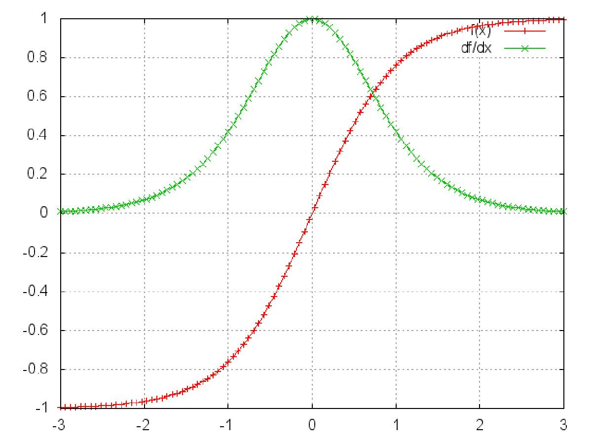

sigmoid函数的函数及导数图如下所示：

从上图观察可知，sigmoid函数的导数范围是(0,0.25]，tach函数的导数范围是(0,1]，他们的导数最大都不大于1。

​   基于6.8中式（9-10）中的推导，RNN的激活函数是嵌套在里面的，如果选择激活函数为$tanh$或$sigmoid$，把激活函数放进去，拿出中间累乘的那部分可得：
$$
\prod_{j=k+1}^{t}{\frac{\partial{h^{j}}}{\partial{h^{j-1}}}} = \prod_{j=k+1}^{t}{tanh^{'}}\cdot W_{s}
$$

$$
\prod_{j=k+1}^{t}{\frac{\partial{h^{j}}}{\partial{h^{j-1}}}} = \prod_{j=k+1}^{t}{sigmoid^{'}}\cdot W_{s}
$$

​   **梯度消失现象**：基于上式，会发现累乘会导致激活函数导数的累乘，如果取tanh或sigmoid函数作为激活函数的话，那么必然是一堆小数在做乘法，结果就是越乘越小。随着时间序列的不断深入，小数的累乘就会导致梯度越来越小直到接近于0，这就是“梯度消失“现象。

​   实际使用中，会优先选择tanh函数，原因是tanh函数相对于sigmoid函数来说梯度较大，收敛速度更快且引起梯度消失更慢。

## 6.10 如何解决RNN中的梯度消失问题？

​   上节描述的梯度消失是在无限的利用历史数据而造成，但是RNN的特点本来就是能利用历史数据获取更多的可利用信息，解决RNN中的梯度消失方法主要有：

​   1、选取更好的激活函数，如Relu激活函数。ReLU函数的左侧导数为0，右侧导数恒为1，这就避免了“梯度消失“的发生。但恒为1的导数容易导致“梯度爆炸“，但设定合适的阈值可以解决这个问题。

​   2、加入BN层，其优点包括可加速收敛、控制过拟合，可以少用或不用Dropout和正则、降低网络对初始化权重不敏感，且能允许使用较大的学习率等。

​   2、改变传播结构，LSTM结构可以有效解决这个问题。下面将介绍LSTM相关内容。

## 6.11 LSTM

### 6.11.1 LSTM的产生原因

​   RNN在处理长期依赖（时间序列上距离较远的节点）时会遇到巨大的困难，因为计算距离较远的节点之间的联系时会涉及雅可比矩阵的多次相乘，会造成梯度消失或者梯度膨胀的现象。为了解决该问题，研究人员提出了许多解决办法，例如ESN（Echo State Network），增加有漏单元（Leaky Units）等等。其中最成功应用最广泛的就是门限RNN（Gated RNN），而LSTM就是门限RNN中最著名的一种。有漏单元通过设计连接间的权重系数，从而允许RNN累积距离较远节点间的长期联系；而门限RNN则泛化了这样的思想，允许在不同时刻改变该系数，且允许网络忘记当前已经累积的信息。

### 6.11.2 图解标准RNN和LSTM的区别

​   所有 RNN 都具有一种重复神经网络模块的链式的形式。在标准的 RNN 中，这个重复的模块只有一个非常简单的结构，例如一个 tanh 层，如下图所示：

​   LSTM 同样是这样的结构，但是重复的模块拥有一个不同的结构。不同于单一神经网络层，这里是有四个，以一种非常特殊的方式进行交互。

注：上图图标具体含义如下所示：

​   上图中，每一条黑线传输着一整个向量，从一个节点的输出到其他节点的输入。粉色的圈代表 pointwise 的操作，诸如向量的和，而黄色的矩阵就是学习到的神经网络层。合在一起的线表示向量的连接，分开的线表示内容被复制，然后分发到不同的位置。

### 6.11.3 LSTM核心思想图解

​   LSTM 的关键就是细胞状态，水平线在图上方贯穿运行。细胞状态类似于传送带。直接在整个链上运行，只有一些少量的线性交互。信息在上面流传保持不变会很容易。示意图如下所示：

LSTM 有通过精心设计的称作为“门”的结构来去除或者增加信息到细胞状态的能力。门是一种让信息选择式通过的方法。他们包含一个 sigmoid 神经网络层和一个 pointwise 乘法操作。示意图如下：

LSTM 拥有三个门，分别是忘记层门，输入层门和输出层门，来保护和控制细胞状态。

**忘记层门**

​   作用对象：细胞状态 。

​   作用：将细胞状态中的信息选择性的遗忘。

​   操作步骤：该门会读取$h_{t-1}$和$x_t$，输出一个在 0 到 1 之间的数值给每个在细胞状态$C_{t-1}​$中的数字。1 表示“完全保留”，0 表示“完全舍弃”。示意图如下：

**输入层门**

​   作用对象：细胞状态 

​   作用：将新的信息选择性的记录到细胞状态中。

​   操作步骤：

​   步骤一，sigmoid 层称 “输入门层” 决定什么值我们将要更新。

​   步骤二，tanh 层创建一个新的候选值向量$\tilde{C}_t$加入到状态中。其示意图如下：

​   步骤三：将$c_{t-1}$更新为$c_{t}$。将旧状态与$f_t$相乘，丢弃掉我们确定需要丢弃的信息。接着加上$i_t * \tilde{C}_t$得到新的候选值，根据我们决定更新每个状态的程度进行变化。其示意图如下：

**输出层门** 
    作用对象：隐层$h_t$ 

​   作用：确定输出什么值。

​   操作步骤：

​   步骤一：通过sigmoid 层来确定细胞状态的哪个部分将输出。

​   步骤二：把细胞状态通过 tanh 进行处理，并将它和 sigmoid 门的输出相乘，最终我们仅仅会输出我们确定输出的那部分。

其示意图如下所示：

### 6.11.4 LSTM流行的变体

**增加peephole 连接**

​   在正常的LSTM结构中，Gers F A 等人提出增加peephole 连接，可以门层接受细胞状态的输入。示意图如下所示：

**对忘记门和输入门进行同时确定**

​   不同于之前是分开确定什么忘记和需要添加什么新的信息，这里是一同做出决定。示意图如下所示：

**Gated Recurrent Unit**

​    由Kyunghyun Cho等人提出的Gated Recurrent Unit (GRU)，其将忘记门和输入门合成了一个单一的更新门，同样还混合了细胞状态和隐藏状态，和其他一些改动。其示意图如下：

最终的模型比标准的 LSTM 模型要简单，也是非常流行的变体。

## 6.12 LSTMs与GRUs的区别

LSTMs与GRUs的区别如图所示：

从上图可以看出，二者结构十分相似，**不同在于**：

1. new memory都是根据之前state及input进行计算，但是GRUs中有一个reset gate控制之前state的进入量，而在LSTMs里没有类似gate；
2. 产生新的state的方式不同，LSTMs有两个不同的gate，分别是forget gate (f gate)和input gate(i gate)，而GRUs只有一种update gate(z gate)；
3. LSTMs对新产生的state可以通过output gate(o gate)进行调节，而GRUs对输出无任何调节。

## 6.13 RNNs在NLP中典型应用？

**（1）语言模型与文本生成(Language Modeling and Generating Text)**

​   给定一组单词序列，需要根据前面单词预测每个单词出现的可能性。语言模型能够评估某个语句正确的可能性，可能性越大，语句越正确。另一种应用便是使用生成模型预测下一个单词的出现概率，从而利用输出概率的采样生成新的文本。

**（2）机器翻译(Machine Translation)**

​   机器翻译是将一种源语言语句变成意思相同的另一种源语言语句，如将英语语句变成同样意思的中文语句。与语言模型关键的区别在于，需要将源语言语句序列输入后，才进行输出，即输出第一个单词时，便需要从完整的输入序列中进行获取。

**（3）语音识别(Speech Recognition)**

​   语音识别是指给定一段声波的声音信号，预测该声波对应的某种指定源语言语句以及计算该语句的概率值。 

**（4）图像描述生成 (Generating Image Descriptions)**

​   同卷积神经网络一样，RNNs已经在对无标图像描述自动生成中得到应用。CNNs与RNNs结合也被应用于图像描述自动生成。

## 6.13 常见的RNNs扩展和改进模型

### 6.13.1 Simple RNNs(SRNs)

1. SRNs是一个三层网络，其在隐藏层增加了上下文单元。下图中的y是隐藏层，u是上下文单元。上下文单元节点与隐藏层中节点的连接是固定的，并且权值也是固定的。上下文节点与隐藏层节点一一对应，并且值是确定的。
2. 在每一步中，使用标准的前向反馈进行传播，然后使用学习算法进行学习。上下文每一个节点保存其连接隐藏层节点上一步输出，即保存上文，并作用于当前步对应的隐藏层节点状态，即隐藏层的输入由输入层的输出与上一步的自身状态所决定。因此SRNs能够解决标准多层感知机(MLP)无法解决的对序列数据进行预测的问题。 
SRNs网络结构如下图所示：

### 6.13.2 Bidirectional RNNs

​   Bidirectional RNNs(双向网络)将两层RNNs叠加在一起，当前时刻输出(第t步的输出)不仅仅与之前序列有关，还与之后序列有关。例如：为了预测一个语句中的缺失词语，就需要该词汇的上下文信息。Bidirectional RNNs是一个相对较简单的RNNs，是由两个RNNs上下叠加在一起组成的。输出由前向RNNs和后向RNNs共同决定。如下图所示：

### 6.13.3 Deep RNNs

​   Deep RNNs与Bidirectional RNNs相似，其也是又多层RNNs叠加，因此每一步的输入有了多层网络。该网络具有更强大的表达与学习能力，但是复杂性也随之提高，同时需要更多的训练数据。Deep RNNs的结构如下图所示：

### 6.13.4 Echo State Networks（ESNs）
**ESNs特点**：

1. 它的核心结构为一个随机生成、且保持不变的储备池(Reservoir)。储备池是大规模随机生成稀疏连接(SD通常保持1%～5%，SD表示储备池中互相连接的神经元占总神经元个数N的比例)的循环结构；
2. 从储备池到输出层的权值矩阵是唯一需要调整的部分；
3. 简单的线性回归便能够完成网络训练；

**ESNs基本思想**：

​   使用大规模随机连接的循环网络取代经典神经网络中的中间层，从而简化网络的训练过程。
网络中的参数包括：
（1）W - 储备池中节点间连接权值矩阵；
（2）Win - 输入层到储备池之间连接权值矩阵，表明储备池中的神经元之间是相互连接；
（3）Wback - 输出层到储备池之间的反馈连接权值矩阵，表明储备池会有输出层来的反馈；
（4）Wout - 输入层、储备池、输出层到输出层的连接权值矩阵，表明输出层不仅与储备池连接，还与输入层和自己连接。
（5）Woutbias - 输出层的偏置项。 

​   ESNs的结构如下图所示：

### 6.13.4 Gated Recurrent Unit Recurrent Neural Networks
GRUs是一般的RNNs的变型版本，其主要是从以下两个方面进行改进。

1. 以语句为例，序列中不同单词处的数据对当前隐藏层状态的影响不同，越前面的影响越小，即每个之前状态对当前的影响进行了距离加权，距离越远，权值越小。

2. 在产生误差error时，其可能是由之前某一个或者几个单词共同造成，所以应当对对应的单词weight进行更新。GRUs的结构如下图所示。GRUs首先根据当前输入单词向量word vector以及前一个隐藏层状态hidden state计算出update gate和reset gate。再根据reset gate、当前word vector以及前一个hidden state计算新的记忆单元内容(new memory content)。当reset gate为1的时候，new memory content忽略之前所有memory content，最终的memory是由之前的hidden state与new memory content一起决定。

### 6.13.5 Bidirectional LSTMs
1. 与bidirectional RNNs 类似，bidirectional LSTMs有两层LSTMs。一层处理过去的训练信息，另一层处理将来的训练信息。
2. 在bidirectional LSTMs中，通过前向LSTMs获得前向隐藏状态，后向LSTMs获得后向隐藏状态，当前隐藏状态是前向隐藏状态与后向隐藏状态的组合。

### 6.13.6 Stacked LSTMs
1. 与deep rnns 类似，stacked LSTMs 通过将多层LSTMs叠加起来得到一个更加复杂的模型。
2. 不同于bidirectional LSTMs，stacked LSTMs只利用之前步骤的训练信息。 

### 6.13.7 Clockwork RNNs(CW-RNNs)
​   CW-RNNs是RNNs的改良版本，其使用时钟频率来驱动。它将隐藏层分为几个块(组，Group/Module)，每一组按照自己规定的时钟频率对输入进行处理。为了降低RNNs的复杂度，CW-RNNs减少了参数数量，并且提高了网络性能，加速网络训练。CW-RNNs通过不同隐藏层模块在不同时钟频率下工作来解决长时依赖问题。将时钟时间进行离散化，不同的隐藏层组将在不同时刻进行工作。因此，所有的隐藏层组在每一步不会全部同时工作，这样便会加快网络的训练。并且，时钟周期小组的神经元不会连接到时钟周期大组的神经元，只允许周期大的神经元连接到周期小的(组与组之间的连接以及信息传递是有向的)。周期大的速度慢，周期小的速度快，因此是速度慢的神经元连速度快的神经元，反之则不成立。

​   CW-RNNs与SRNs网络结构类似，也包括输入层(Input)、隐藏层(Hidden)、输出层(Output)，它们之间存在前向连接，输入层到隐藏层连接，隐藏层到输出层连接。但是与SRN不同的是，隐藏层中的神经元会被划分为若干个组，设为$g​$，每一组中的神经元个数相同，设为$k​$，并为每一个组分配一个时钟周期$T_i\epsilon\{T_1,T_2,...,T_g\}​$，每一组中的所有神经元都是全连接，但是组$j​$到组$i​$的循环连接则需要满足$T_j​$大于$T_i​$。如下图所示，将这些组按照时钟周期递增从左到右进行排序，即$T_1<T_2<...<T_g​$，那么连接便是从右到左。例如：隐藏层共有256个节点，分为四组，周期分别是[1,2,4,8]，那么每个隐藏层组256/4=64个节点，第一组隐藏层与隐藏层的连接矩阵为64$\times​$64的矩阵，第二层的矩阵则为64$\times​$128矩阵，第三组为64$\times​$(3$\times​$64)=64$\times​$192矩阵，第四组为64$\times​$(4$\times​$64)=64$\times​$256矩阵。这就解释了上一段中速度慢的组连接到速度快的组，反之则不成立。

**CW-RNNs的网络结构如下图所示**：

### 6.13.8 CNN-LSTMs
1. 为了同时利用CNN以及LSTMs的优点，CNN-LSTMs被提出。在该模型中，CNN用于提取对象特征，LSTMs用于预测。CNN由于卷积特性，其能够快速而且准确地捕捉对象特征。LSTMs的优点在于能够捕捉数据间的长时依赖性。

## 参考文献

[1] 何之源.https://zhuanlan.zhihu.com/p/28054589.

[2] http://colah.github.io/posts/2015-08-Understanding-LSTMs/

[3] https://blog.csdn.net/zhaojc1995/article/details/80572098

[4] Graves A. Supervised Sequence Labelling with Recurrent Neural Networks[J]. Studies in Computational Intelligence, 2008, 385.

[5] Graves A. Generating Sequences With Recurrent Neural Networks[J]. Computer Science, 2013.

[6]  Greff K ,  Srivastava R K , Koutník, Jan, et al. LSTM: A Search Space Odyssey[J]. IEEE Transactions on Neural Networks & Learning Systems, 2015, 28(10):2222-2232.

[7] Lanchantin J, Singh R, Wang B, et al. DEEP MOTIF DASHBOARD: VISUALIZING AND UNDERSTANDING GENOMIC SEQUENCES USING DEEP NEURAL NETWORKS.[J]. Pacific Symposium on Biocomputing Pacific Symposium on Biocomputing, 2016, 22:254.

[8]  Pascanu R ,  Mikolov T ,  Bengio Y . On the difficulty of training Recurrent Neural Networks[J].  2012.

[9]  Hochreiter S. The Vanishing Gradient Problem During Learning Recurrent Neural Nets and Problem Solutions[J]. International Journal of Uncertainty, Fuzziness and Knowledge-Based Systems, 1998, 06(02):-.

[10] Dyer C, Kuncoro A, Ballesteros M, et al. Recurrent Neural Network Grammars[C]// Conference of the North American Chapter of the Association for Computational Linguistics: Human Language Technologies. 2016.

[11]  Mulder W D ,  Bethard S ,  Moens M F . A survey on the application of recurrent neural networks to statistical language modeling.[M]. Academic Press Ltd.  2015.

[12] Graves A. Generating Sequences With Recurrent Neural Networks[J]. Computer Science, 2013.

[13] Zhang B, Xiong D, Su J. Neural Machine Translation with Deep Attention[J]. IEEE Transactions on Pattern Analysis and Machine Intelligence, 2018, PP(99):1-1.

[14] <https://github.com/xuanyuansen/scalaLSTM>

[15] Deep Learning，Ian Goodfellow Yoshua Bengio and Aaron Courville，Book in preparation for MIT Press，2016；

[16] http://colah.github.io/posts/2015-08-Understanding-LSTMs/

[17] Greff K, Srivastava R K, Koutník J, et al. LSTM: A Search Space Odyssey[J]. IEEE Transactions on Neural Networks & Learning Systems, 2016, 28(10):2222-2232.

[18] Yao K ,  Cohn T ,  Vylomova K , et al. Depth-Gated Recurrent Neural Networks[J].  2015.

[19] Koutník J, Greff K, Gomez F, et al. A Clockwork RNN[J]. Computer Science, 2014:1863-1871.

[20]  Gers F A ,  Schmidhuber J . Recurrent nets that time and count[C]// Neural Networks, 2000. IJCNN 2000, Proceedings of the IEEE-INNS-ENNS International Joint Conference on. IEEE, 2000.

[21] Li S, Wu C, Hai L, et al. FPGA Acceleration of Recurrent Neural Network Based Language Model[C]// IEEE International Symposium on Field-programmable Custom Computing Machines. 2015.

[22]  Mikolov T ,  Kombrink S ,  Burget L , et al. Extensions of recurrent neural network language model[C]// Acoustics, Speech and Signal Processing (ICASSP), 2011 IEEE International Conference on. IEEE, 2011.

[23]  Graves A . Generating Sequences With Recurrent Neural Networks[J]. Computer Science, 2013.

[24]  Sutskever I ,  Vinyals O ,  Le Q V . Sequence to Sequence Learning with Neural Networks[J].  2014.

[25] Liu B, Lane I. Joint Online Spoken Language Understanding and Language Modeling with Recurrent Neural Networks[J].  2016.

[26] Graves A, Mohamed A R, Hinton G. Speech recognition with deep recurrent neural networks[C]// IEEE International Conference on Acoustics. 2013.

[27] https://cs.stanford.edu/people/karpathy/deepimagesent/

[28] Cho K, Van Merriënboer B, Gulcehre C, et al. Learning phrase representations using RNN encoder-decoder for statistical machine translation[J]. arXiv preprint arXiv:1406.1078, 2014.

# 第七章 生成对抗网络

##  7.1 GAN基本概念
### 7.1.1 如何通俗理解GAN？

​   生成对抗网络(GAN, Generative adversarial network)自从2014年被Ian Goodfellow提出以来，掀起来了一股研究热潮。GAN由生成器和判别器组成，生成器负责生成样本，判别器负责判断生成器生成的样本是否为真。生成器要尽可能迷惑判别器，而判别器要尽可能区分生成器生成的样本和真实样本。

​   在GAN的原作[1]中，作者将生成器比喻为印假钞票的犯罪分子，判别器则类比为警察。犯罪分子努力让钞票看起来逼真，警察则不断提升对于假钞的辨识能力。二者互相博弈，随着时间的进行，都会越来越强。那么类比于图像生成任务，生成器不断生成尽可能逼真的假图像。判别器则判断图像是否是真实的图像，还是生成的图像，二者不断博弈优化。最终生成器生成的图像使得判别器完全无法判别真假。

### 7.1.2 GAN的形式化表达
​   上述例子只是简要介绍了一下GAN的思想，下面对于GAN做一个形式化的，更加具体的定义。通常情况下，无论是生成器还是判别器，我们都可以用神经网络来实现。那么，我们可以把通俗化的定义用下面这个模型来表示：

​   上述模型左边是生成器G，其输入是$z$，对于原始的GAN，$z$是由高斯分布随机采样得到的噪声。噪声$z$通过生成器得到了生成的假样本。

​   生成的假样本与真实样本放到一起，被随机抽取送入到判别器D，由判别器去区分输入的样本是生成的假样本还是真实的样本。整个过程简单明了，生成对抗网络中的“生成对抗”主要体现在生成器和判别器之间的对抗。

### 7.1.3 GAN的目标函数是什么？
​   对于上述神经网络模型，如果想要学习其参数，首先需要一个目标函数。GAN的目标函数定义如下：

$$
\mathop {\min }\limits_G \mathop {\max }\limits_D V(D,G) = {\rm E}_{x\sim{p_{data}(x)}}[\log D(x)] + {\rm E}_{z\sim{p_z}(z)}[\log (1 - D(G(z)))]
$$
​   这个目标函数可以分为两个部分来理解：

​   第一部分：判别器的优化通过$\mathop {\max}\limits_D V(D,G)$实现，$V(D,G)$为判别器的目标函数，其第一项${\rm E}_{x\sim{p_{data}(x)}}[\log D(x)]$表示对于从真实数据分布 中采用的样本 ,其被判别器判定为真实样本概率的数学期望。对于真实数据分布 中采样的样本，其预测为正样本的概率当然是越接近1越好。因此希望最大化这一项。第二项${\rm E}_{z\sim{p_z}(z)}[\log (1 - D(G(z)))]$表示：对于从噪声$P_z(z)$分布当中采样得到的样本，经过生成器生成之后得到的生成图片，然后送入判别器，其预测概率的负对数的期望，这个值自然是越大越好，这个值越大， 越接近0，也就代表判别器越好。

​   第二部分：生成器的优化通过$\mathop {\min }\limits_G({\mathop {\max }\limits_D V(D,G)})$来实现。注意，生成器的目标不是$\mathop {\min }\limits_GV(D,G)$，即生成器不是最小化判别器的目标函数，二是最小化判别器目标函数的最大值，判别器目标函数的最大值代表的是真实数据分布与生成数据分布的JS散度(详情可以参阅附录的推导)，JS散度可以度量分布的相似性，两个分布越接近，JS散度越小。

### 7.1.4 GAN的目标函数和交叉熵有什么区别？

​   判别器目标函数写成离散形式即为:
$$
V(D,G)=-\frac{1}{m}\sum_{i=1}^{i=m}logD(x^i)-\frac{1}{m}\sum_{i=1}^{i=m}log(1-D(\tilde{x}^i))
$$

​   可以看出，这个目标函数和交叉熵是一致的，即**判别器的目标是最小化交叉熵损失，生成器的目标是最小化生成数据分布和真实数据分布的JS散度**。

-------------------
[1]: Goodfellow, Ian, et al. "Generative adversarial nets." Advances in neural information processing systems. 2014.

### 7.1.5 GAN的Loss为什么降不下去？

​   对于很多GAN的初学者在实践过程中可能会纳闷，为什么GAN的Loss一直降不下去。GAN到底什么时候才算收敛？其实，作为一个训练良好的GAN，其Loss就是降不下去的。衡量GAN是否训练好了，只能由人肉眼去看生成的图片质量是否好。不过，对于没有一个很好的评价是否收敛指标的问题，也有许多学者做了一些研究，后文提及的WGAN就提出了一种新的Loss设计方式，较好的解决了难以判断收敛性的问题。下面我们分析一下GAN的Loss为什么降不下去？
​   对于判别器而言，GAN的Loss如下：
$$
\mathop {\min }\limits_G \mathop {\max }\limits_D V(D,G) = {\rm E}_{x\sim{p_{data}(x)}}[\log D(x)] + {\rm E}_{z\sim{p_z}(z)}[\log (1 - D(G(z)))]
$$
​   从$\mathop {\min }\limits_G \mathop {\max }\limits_D V(D,G)$可以看出，生成器和判别器的目的相反，也就是说两个生成器网络和判别器网络互为对抗，此消彼长。不可能Loss一直降到一个收敛的状态。

- 对于生成器，其Loss下降快，很有可能是判别器太弱，导致生成器很轻易的就"愚弄"了判别器。
- 对于判别器，其Loss下降快，意味着判别器很强，判别器很强则说明生成器生成的图像不够逼真，才使得判别器轻易判别，导致Loss下降很快。

​   也就是说，无论是判别器，还是生成器。loss的高低不能代表生成器的好坏。一个好的GAN网络，其GAN Loss往往是不断波动的。

​   看到这里可能有点让人绝望，似乎判断模型是否收敛就只能看生成的图像质量了。实际上，后文探讨的WGAN，提出了一种新的loss度量方式，让我们可以通过一定的手段来判断模型是否收敛。

### 7.1.6 生成式模型、判别式模型的区别？

​   对于机器学习模型，我们可以根据模型对数据的建模方式将模型分为两大类，生成式模型和判别式模型。如果我们要训练一个关于猫狗分类的模型，对于判别式模型，只需要学习二者差异即可。比如说猫的体型会比狗小一点。而生成式模型则不一样，需要学习猫张什么样，狗张什么样。有了二者的长相以后，再根据长相去区分。具体而言：

- 生成式模型：由数据学习联合概率分布P(X,Y), 然后由P(Y|X)=P(X,Y)/P(X)求出概率分布P(Y|X)作为预测的模型。该方法表示了给定输入X与产生输出Y的生成关系

- 判别式模型：由数据直接学习决策函数Y=f(X)或条件概率分布P(Y|X)作为预测模型，即判别模型。判别方法关心的是对于给定的输入X，应该预测什么样的输出Y。

​   对于上述两种模型，从文字上理解起来似乎不太直观。我们举个例子来阐述一下，对于性别分类问题，分别用不同的模型来做：

​   1）如果用生成式模型：可以训练一个模型，学习输入人的特征X和性别Y的关系。比如现在有下面一批数据：

| Y（性别） |      | 0    | 1    |
| --------- | ---- | ---- | ---- |
| X（特征） | 0    | 1/4  | 3/4  |
|           | 1    | 3/4  | 1/4  |

​   这个数据可以统计得到，即统计人的特征X=0,1….的时候，其类别为Y=0,1的概率。统计得到上述联合概率分布P(X, Y)后，可以学习一个模型，比如让二维高斯分布去拟合上述数据，这样就学习到了X，Y的联合分布。在预测时，如果我们希望给一个输入特征X，预测其类别，则需要通过贝叶斯公式得到条件概率分布才能进行推断：
$$
P(Y|X)={\frac{P(X,Y)}{P(X)}}={\frac{P(X,Y)}{P(X|Y)P(Y)}}
$$
​   2）如果用判别式模型：可以训练一个模型，输入人的特征X，这些特征包括人的五官，穿衣风格，发型等。输出则是对于性别的判断概率，这个概率服从一个分布，分布的取值只有两个，要么男，要么女，记这个分布为Y。这个过程学习了一个条件概率分布P(Y|X)，即输入特征X的分布已知条件下，Y的概率分布。

​   显然，从上面的分析可以看出。判别式模型似乎要方便很多，因为生成式模型要学习一个X，Y的联合分布往往需要很多数据，而判别式模型需要的数据则相对少，因为判别式模型更关注输入特征的差异性。不过生成式既然使用了更多数据来生成联合分布，自然也能够提供更多的信息，现在有一个样本（X,Y）,其联合概率P（X,Y）经过计算特别小，那么可以认为这个样本是异常样本。这种模型可以用来做outlier detection。

### 7.1.7 什么是mode collapsing?

​   某个模式(mode)出现大量重复样本，例如：

​   上图左侧的蓝色五角星表示真实样本空间，黄色的是生成的。生成样本缺乏多样性，存在大量重复。比如上图右侧中，红框里面人物反复出现。

### 7.1.8 如何解决mode collapsing？

方法一：**针对目标函数的改进方法**

​   为了避免前面提到的由于优化maxmin导致mode跳来跳去的问题，UnrolledGAN采用修改生成器loss来解决。具体而言，UnrolledGAN在更新生成器时更新k次生成器，参考的Loss不是某一次的loss，是判别器后面k次迭代的loss。注意，判别器后面k次迭代不更新自己的参数，只计算loss用于更新生成器。这种方式使得生成器考虑到了后面k次判别器的变化情况，避免在不同mode之间切换导致的模式崩溃问题。此处务必和迭代k次生成器，然后迭代1次判别器区分开[8]。DRAGAN则引入博弈论中的无后悔算法，改造其loss以解决mode collapse问题[9]。前文所述的EBGAN则是加入VAE的重构误差以解决mode collapse。

方法二：**针对网络结构的改进方法**

​   Multi agent diverse GAN(MAD-GAN)采用多个生成器，一个判别器以保障样本生成的多样性。具体结构如下：

​   相比于普通GAN，多了几个生成器，且在loss设计的时候，加入一个正则项。正则项使用余弦距离惩罚三个生成器生成样本的一致性。

​   MRGAN则添加了一个判别器来惩罚生成样本的mode collapse问题。具体结构如下：

​   输入样本$x$通过一个Encoder编码为隐变量$E(x)$，然后隐变量被Generator重构，训练时，Loss有三个。$D_M$和$R$（重构误差）用于指导生成real-like的样本。而$D_D$则对$E(x)$和$z$生成的样本进行判别，显然二者生成样本都是fake samples，所以这个判别器主要用于判断生成的样本是否具有多样性，即是否出现mode collapse。

方法三：**Mini-batch Discrimination**

​   Mini-batch discrimination在判别器的中间层建立一个mini-batch layer用于计算基于L1距离的样本统计量，通过建立该统计量，实现了一个batch内某个样本与其他样本有多接近。这个信息可以被判别器利用到，从而甄别出哪些缺乏多样性的样本。对生成器而言，则要试图生成具有多样性的样本。

## 7.2 GAN的生成能力评价

### 7.2.1 如何客观评价GAN的生成能力？

​   最常见评价GAN的方法就是主观评价。主观评价需要花费大量人力物力，且存在以下问题：

- 评价带有主管色彩，有些bad case没看到很容易造成误判

- 如果一个GAN过拟合了，那么生成的样本会非常真实，人类主观评价得分会非常高，可是这并不是一个好的GAN。

因此，就有许多学者提出了GAN的客观评价方法。

### 7.2.2 Inception Score

​   对于一个在ImageNet训练良好的GAN，其生成的样本丢给Inception网络进行测试的时候，得到的判别概率应该具有如下特性：
- 对于同一个类别的图片，其输出的概率分布应该趋向于一个脉冲分布。可以保证生成样本的准确性。
- 对于所有类别，其输出的概率分布应该趋向于一个均匀分布，这样才不会出现mode dropping等，可以保证生成样本的多样性。

​   因此，可以设计如下指标：
$$
IS(P_g)=e^{E_{x\sim P_g}[KL(p_M(y|x)\Vert{p_M(y)})]}
根据前面分析，如果是一个训练良好的GAN，$p_M(y|x)​$趋近于脉冲分布，$p_M(y)​$趋近于均匀分布。二者KL散度会很大。Inception Score自然就高。实际实验表明，Inception Score和人的主观判别趋向一致。IS的计算没有用到真实数据，具体值取决于模型M的选择
$$
​   根据前面分析，如果是一个训练良好的GAN，$p_M(y|x)$趋近于脉冲分布，$p_M(y)$趋近于均匀分布。二者KL散度会很大。Inception Score自然就高。实际实验表明，Inception Score和人的主观判别趋向一致。IS的计算没有用到真实数据，具体值取决于模型M的选择。

​   **特点：可以一定程度上衡量生成样本的多样性和准确性，但是无法检测过拟合。Mode Score也是如此。不推荐在和ImageNet数据集差别比较大的数据上使用。**

### 7.2.3 Mode Score

​   Mode Score作为Inception Score的改进版本，添加了关于生成样本和真实样本预测的概率分布相似性度量一项。具体公式如下：
$$
MS(P_g)=e^{E_{x\sim P_g}[KL(p_M(y|x)\Vert{p_M(y)})-KL(p_M(y)\Vert p_M(y^*))]}
$$

### 7.2.4 Kernel MMD (Maximum Mean Discrepancy)

计算公式如下：
$$
MMD^2(P_r,P_g)=E_{x_r\sim{P_r},x_g\sim{P_g}}[\lVert\Sigma_{i=1}^{n1}k(x_r)-\Sigma_{i=1}^{n2}k(x_g)\rVert]
$$
​   对于Kernel MMD值的计算，首先需要选择一个核函数$k$，这个核函数把样本映射到再生希尔伯特空间(Reproducing Kernel Hilbert Space, RKHS) ，RKHS相比于欧几里得空间有许多优点，对于函数内积的计算是完备的。将上述公式展开即可得到下面的计算公式：
$$
MMD^2(P_r,P_g)=E_{x_r,x_r{'}\sim{P_r},x_g,x_g{'}\sim{P_g}}[k(x_r,x_r{'})-2k(x_r,x_g)+k(x_g,x_g{'})]
$$
MMD值越小，两个分布越接近。

**特点：可以一定程度上衡量模型生成图像的优劣性，计算代价小。推荐使用。**

### 7.2.5 Wasserstein distance

​   Wasserstein distance在最优传输问题中通常也叫做推土机距离。这个距离的介绍在WGAN中有详细讨论。公式如下：
$$
WD(P_r,P_g)=min_{\omega\in\mathbb{R}^{m\times n}}\Sigma_{i=1}^n\Sigma_{i=1}^m\omega_{ij}d(x_i^r,x_j^g)
$$

$$
s.t. \Sigma_{i=1}^mw_{i,j}=p_r(x_i^r),  \forall i;\Sigma_{j=1}^nw_{i,j}=p_g(x_j^g),  \forall j
$$

​   Wasserstein distance可以衡量两个分布之间的相似性。距离越小，分布越相似。

**特点：如果特征空间选择合适，会有一定的效果。但是计算复杂度为$O(n^3)$太高**

### 7.2.6 Fréchet Inception Distance (FID) 

​   FID距离计算真实样本，生成样本在特征空间之间的距离。首先利用Inception网络来提取特征，然后使用高斯模型对特征空间进行建模。根据高斯模型的均值和协方差来进行距离计算。具体公式如下：
$$
FID(\mathbb P_r,\mathbb P_g)=\lVert\mu_r-\mu_g\rVert+Tr(C_r+C_g-2(C_rC_g)^{1/2})
$\mu,C$分别代表协方差和均值。
$$
$\mu,C$分别代表协方差和均值。

​   **特点：尽管只计算了特征空间的前两阶矩，但是鲁棒，且计算高效。**

### 7.2.7 1-Nearest Neighbor classifier

​   使用留一法，结合1-NN分类器（别的也行）计算真实图片，生成图像的精度。如果二者接近，则精度接近50%，否则接近0%。对于GAN的评价问题，作者分别用正样本的分类精度，生成样本的分类精度去衡量生成样本的真实性，多样性。
- 对于真实样本$x_r$，进行1-NN分类的时候，如果生成的样本越真实。则真实样本空间$\mathbb R$将被生成的样本$x_g$包围。那么$x_r$的精度会很低。
- 对于生成的样本$x_g$，进行1-NN分类的时候，如果生成的样本多样性不足。由于生成的样本聚在几个mode，则$x_g$很容易就和$x_r$区分，导致精度会很高。

**特点：理想的度量指标，且可以检测过拟合。**

### 7.2.8 其他评价方法

​   AIS，KDE方法也可以用于评价GAN，但这些方法不是model agnostic metrics。也就是说，这些评价指标的计算无法只利用：生成的样本，真实样本来计算。

## 7.3 其他常见的生成式模型有哪些？

### 7.3.1 什么是自回归模型：pixelRNN与pixelCNN？

​   自回归模型通过对图像数据的概率分布$p_{data}(x)$进行显式建模，并利用极大似然估计优化模型。具体如下：
$$
p_{data}(x)=\prod_{i=1}^np(x_i|x_1,x_2,...,x_{i-1})
$$
​   上述公式很好理解，给定$x_1,x_2,...,x_{i-1}$条件下，所有$p(x_i)$的概率乘起来就是图像数据的分布。如果使用RNN对上述依然关系建模，就是pixelRNN。如果使用CNN，则是pixelCNN。具体如下[5]：

​   显然，不论是对于pixelCNN还是pixelRNN，由于其像素值是一个个生成的，速度会很慢。语音领域大火的WaveNet就是一个典型的自回归模型。

### 7.3.2 什么是VAE？

​   PixelCNN/RNN定义了一个易于处理的密度函数，我们可以直接优化训练数据的似然；对于变分自编码器我们将定义一个不易处理的密度函数，通过附加的隐变量$z$对密度函数进行建模。 VAE原理图如下[6]：

​   在VAE中，真实样本$X$通过神经网络计算出均值方差（假设隐变量服从正太分布），然后通过采样得到采样变量$Z$并进行重构。VAE和GAN均是学习了隐变量$z$到真实数据分布的映射。但是和GAN不同的是：

- GAN的思路比较粗暴，使用一个判别器去度量分布转换模块（即生成器）生成分布与真实数据分布的距离。
- VAE则没有那么直观，VAE通过约束隐变量$z$服从标准正太分布以及重构数据实现了分布转换映射$X=G(z)$

**生成式模型对比**

- 自回归模型通过对概率分布显式建模来生成数据
- VAE和GAN均是：假设隐变量$z$服从某种分布，并学习一个映射$X=G(z)$，实现隐变量分布$z$与真实数据分布$p_{data}(x)$的转换。
- GAN使用判别器去度量映射$X=G(z)$的优劣，而VAE通过隐变量$z$与标准正太分布的KL散度和重构误差去度量。

## 7.4 GAN的改进与优化

### 7.4.1 如何生成指定类型的图像——条件GAN

​   条件生成对抗网络（CGAN, Conditional Generative Adversarial Networks）作为一个GAN的改进，其一定程度上解决了GAN生成结果的不确定性。如果在Mnist数据集上训练原始GAN，GAN生成的图像是完全不确定的，具体生成的是数字1，还是2，还是几，根本不可控。为了让生成的数字可控，我们可以把数据集做一个切分，把数字0~9的数据集分别拆分开训练9个模型，不过这样太麻烦了，也不现实。因为数据集拆分不仅仅是分类麻烦，更主要在于，每一个类别的样本少，拿去训练GAN很有可能导致欠拟合。因此，CGAN就应运而生了。我们先看一下CGAN的网络结构：
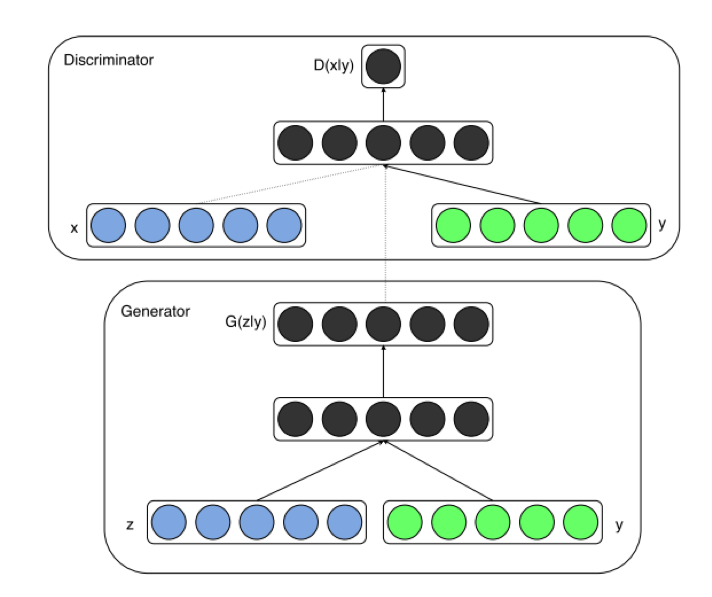
​   从网络结构图可以看到，对于生成器Generator，其输入不仅仅是随机噪声的采样z，还有欲生成图像的标签信息。比如对于mnist数据生成，就是一个one-hot向量，某一维度为1则表示生成某个数字的图片。同样地，判别器的输入也包括样本的标签。这样就使得判别器和生成器可以学习到样本和标签之间的联系。Loss如下：
$$
\mathop {\min }\limits_G \mathop {\max }\limits_D V(D,G) = {\rm E}_{x\sim{p_{data}(x)}}[\log D(x|y)] + {\rm E}_{z\sim{p_z}(z)}[\log (1 - D(G(z|y)))]
$$
​   Loss设计和原始GAN基本一致，只不过生成器，判别器的输入数据是一个条件分布。在具体编程实现时只需要对随机噪声采样z和输入条件y做一个级联即可。

### 7.4.2 CNN与GAN——DCGAN

​   前面我们聊的GAN都是基于简单的神经网络构建的。可是对于视觉问题，如果使用原始的基于DNN的GAN，则会出现许多问题。如果输入GAN的随机噪声为100维的随机噪声，输出图像为256x256大小。也就是说，要将100维的信息映射为65536维。如果单纯用DNN来实现，那么整个模型参数会非常巨大，而且学习难度很大（低维度映射到高维度需要添加许多信息）。因此，DCGAN就出现了。具体而言，DCGAN将传统GAN的生成器，判别器均采用GAN实现，且使用了一下tricks：

- 将pooling层convolutions替代，其中，在discriminator上用strided convolutions替代，在generator上用fractional-strided convolutions替代。
- 在generator和discriminator上都使用batchnorm。 
- 移除全连接层，global pooling增加了模型的稳定性，但伤害了收敛速度。
- 在generator的除了输出层外的所有层使用ReLU，输出层采用tanh。
- 在discriminator的所有层上使用LeakyReLU。

网络结构图如下：

### 7.4.3 如何理解GAN中的输入随机噪声？

​   为了了解输入随机噪声每一个维度代表的含义，作者做了一个非常有趣的工作。即在隐空间上，假设知道哪几个变量控制着某个物体，那么僵这几个变量挡住是不是就可以将生成图片中的某个物体消失？论文中的实验是这样的：首先，生成150张图片，包括有窗户的和没有窗户的，然后使用一个逻辑斯底回归函数来进行分类，对于权重不为0的特征，认为它和窗户有关。将其挡住，得到新的生成图片，结果如下：

此外，将几个输入噪声进行算数运算，可以得到语义上进行算数运算的非常有趣的结果。类似于word2vec。

### 7.4.4 GAN为什么容易训练崩溃？

​   所谓GAN的训练崩溃，指的是训练过程中，生成器和判别器存在一方压倒另一方的情况。
GAN原始判别器的Loss在判别器达到最优的时候，等价于最小化生成分布与真实分布之间的JS散度，由于随机生成分布很难与真实分布有不可忽略的重叠以及JS散度的突变特性，使得生成器面临梯度消失的问题；可是如果不把判别器训练到最优，那么生成器优化的目标就失去了意义。因此需要我们小心的平衡二者，要把判别器训练的不好也不坏才行。否则就会出现训练崩溃，得不到想要的结果

### 7.4.5 WGAN如何解决训练崩溃问题？

​   WGAN作者提出了使用Wasserstein距离，以解决GAN网络训练过程难以判断收敛性的问题。Wasserstein距离定义如下:
$$
L={\rm E}_{x\sim{p_{data}}(x)}[f_w(x)] - {\rm E}_{x\sim{p_g}(x)}[f_w(x)]
$$
通过最小化Wasserstein距离，得到了WGAN的Loss：

- WGAN生成器Loss：$- {\rm E}_{x\sim{p_g}(x)}[f_w(x)]$
- WGAN判别器Loss：$L=-{\rm E}_{x\sim{p_{data}}(x)}[f_w(x)] + {\rm E}_{x\sim{p_g}(x)}[f_w(x)]$

从公式上GAN似乎总是让人摸不着头脑，在代码实现上来说，其实就以下几点：

- 判别器最后一层去掉sigmoid
- 生成器和判别器的loss不取log
- 每次更新判别器的参数之后把它们的绝对值截断到不超过一个固定常数c

### 7.4.6 WGAN-GP：带有梯度正则的WGAN

​   实际实验过程发现，WGAN没有那么好用，主要原因在于WAGN进行梯度截断。梯度截断将导致判别网络趋向于一个二值网络，造成模型容量的下降。
于是作者提出使用梯度惩罚来替代梯度裁剪。公式如下：
$$
L=-{\rm E}_{x\sim{p_{data}}(x)}[f_w(x)] + {\rm E}_{x\sim{p_g}(x)}[f_w(x)]+\lambda{\rm E}_{x\sim{p_x}(x)}[\lVert\nabla_x(D(x))\rVert_p-1]^2
$$
​   由于上式是对每一个梯度进行惩罚，所以不适合使用BN，因为它会引入同个batch中不同样本的相互依赖关系。如果需要的话，可以选择Layer Normalization。实际训练过程中，就可以通过Wasserstein距离来度量模型收敛程度了：

​   上图纵坐标是Wasserstein距离，横坐标是迭代次数。可以看出，随着迭代的进行，Wasserstein距离趋于收敛，生成图像也趋于稳定。

### 7.4.7 LSGAN

​   LSGAN（Least Squares GAN）这篇文章主要针对标准GAN的稳定性和图片生成质量不高做了一个改进。作者将原始GAN的交叉熵损失采用最小二乘损失替代。LSGAN的Loss：
$$
\mathop{\min }\limits_DJ(D)=\mathop{\min}\limits_D[{\frac{1}{2}}{\rm E}_{x\sim{p_{data}}(x)}[D(x)-a]^2 + {\frac{1}{2}}{\rm E}_{z\sim{p_z}(z)}[D(G(z))-b]^2]
$$

$$
\mathop{\min }\limits_GJ(G)=\mathop{\min}\limits_G{\frac{1}{2}}{\rm E}_{z\sim{p_z}(z)}[D(G(z))-c]^2
$$

​   实际实现的时候非常简单，最后一层去掉sigmoid，并且计算Loss的时候用平方误差即可。之所以这么做，作者在原文给出了一张图:

​   上面是作者给出的基于交叉熵损失以及最小二乘损失的Loss函数。横坐标代表Loss函数的输入，纵坐标代表输出的Loss值。可以看出，随着输入的增大，sigmoid交叉熵损失很快趋于0，容易导致梯度饱和问题。如果使用右边的Loss设计，则只在x=0点处饱和。因此使用LSGAN可以很好的解决交叉熵损失的问题。

### 7.4.8 如何尽量避免GAN的训练崩溃问题？

- 归一化图像输入到（-1，1）之间；Generator最后一层使用tanh激活函数
- 生成器的Loss采用：min (log 1-D)。因为原始的生成器Loss存在梯度消失问题；训练生成器的时候，考虑反转标签，real=fake, fake=real
- 不要在均匀分布上采样，应该在高斯分布上采样
- 一个Mini-batch里面必须只有正样本，或者负样本。不要混在一起；如果用不了Batch Norm，可以用Instance Norm
- 避免稀疏梯度，即少用ReLU，MaxPool。可以用LeakyReLU替代ReLU，下采样可以用Average Pooling或者Convolution + stride替代。上采样可以用PixelShuffle, ConvTranspose2d + stride
- 平滑标签或者给标签加噪声；平滑标签，即对于正样本，可以使用0.7-1.2的随机数替代；对于负样本，可以使用0-0.3的随机数替代。  给标签加噪声：即训练判别器的时候，随机翻转部分样本的标签。
- 如果可以，请用DCGAN或者混合模型：KL+GAN，VAE+GAN。
- 使用LSGAN，WGAN-GP
- Generator使用Adam，Discriminator使用SGD
- 尽快发现错误；比如：判别器Loss为0，说明训练失败了；如果生成器Loss稳步下降，说明判别器没发挥作用
- 不要试着通过比较生成器，判别器Loss的大小来解决训练过程中的模型坍塌问题。比如：
  While Loss D > Loss A:
  Train D
  While Loss A > Loss D:
  Train A
- 如果有标签，请尽量利用标签信息来训练
- 给判别器的输入加一些噪声，给G的每一层加一些人工噪声。
- 多训练判别器，尤其是加了噪声的时候
- 对于生成器，在训练，测试的时候使用Dropout

## 7.3 GAN的应用（图像翻译）

### 7.3.1 什么是图像翻译？
​   GAN作为一种强有力的生成模型，其应用十分广泛。最为常见的应用就是图像翻译。所谓图像翻译，指从一副图像到另一副图像的转换。可以类比机器翻译，一种语言转换为另一种语言。常见的图像翻译任务有：
- 图像去噪
- 图像超分辨
- 图像补全
- 风格迁移
- ...

  本节将介绍一个经典的图像翻译网络及其改进。图像翻译可以分为有监督图像翻译和无监督图像翻译：

- 有监督图像翻译：原始域与目标域存在一一对应数据
- 无监督图像翻译：原始域与目标域不存在一一对应数据

### 7.3.2 有监督图像翻译：pix2pix
​   在这篇paper里面，作者提出的框架十分简洁优雅（好用的算法总是简洁优雅的）。相比以往算法的大量专家知识，手工复杂的loss。这篇paper非常粗暴，使用CGAN处理了一系列的转换问题。下面是一些转换示例：

​   上面展示了许多有趣的结果，比如分割图$\longrightarrow$街景图，边缘图$\longrightarrow$真实图。对于第一次看到的时候还是很惊艳的，那么这个是怎么做到的呢？我们可以设想一下，如果是我们，我们自己会如何设计这个网络？

**直观的想法**？

​   最直接的想法就是，设计一个CNN网络，直接建立输入-输出的映射，就像图像去噪问题一样。可是对于上面的问题，这样做会带来一个问题。**生成图像质量不清晰。**

​   拿左上角的分割图$\longrightarrow$街景图为例，语义分割图的每个标签比如“汽车”可能对应不同样式，颜色的汽车。那么模型学习到的会是所有不同汽车的评均，这样会造成模糊。

**如何解决生成图像的模糊问题**？

​   这里作者想了一个办法，即加入GAN的Loss去惩罚模型。GAN相比于传统生成式模型可以较好的生成高分辨率图片。思路也很简单，在上述直观想法的基础上加入一个判别器，判断输入图片是否是真实样本。模型示意图如下：

​   上图模型和CGAN有所不同，但它是一个CGAN，只不过输入只有一个，这个输入就是条件信息。原始的CGAN需要输入随机噪声，以及条件。这里之所有没有输入噪声信息，是因为在实际实验中，如果输入噪声和条件，噪声往往被淹没在条件C当中，所以这里直接省去了。

### 7.3.3  其他图像翻译的tricks
从上面两点可以得到最终的Loss由两部分构成：
- 输出和标签信息的L1 Loss。

- GAN Loss

- 测试也使用Dropout，以使输出多样化
  $$
  G^*=arg\mathop {\min }\limits_G \mathop {\max }\limits_D \Gamma_{cGAN}(G,D)+\lambda\Gamma_{L1}(G)
  $$

​   采用L1 Loss而不是L2 Loss的理由很简单，L1 Loss相比于L2 Loss保边缘（L2 Loss基于高斯先验，L1 Loss基于拉普拉斯先验）。

​   GAN Loss为LSGAN的最小二乘Loss，并使用PatchGAN(进一步保证生成图像的清晰度)。PatchGAN将图像换分成很多个Patch，并对每一个Patch使用判别器进行判别（实际代码实现有更取巧的办法），将所有Patch的Loss求平均作为最终的Loss。

### 7.3.4 如何生成高分辨率图像和高分辨率视频？

​   pix2pix提出了一个通用的图像翻译框架。对于高分辨率的图像生成以及高分辨率的视频生成，则需要利用更好的网络结构以及更多的先验只是。pix2pixHD提出了一种多尺度的生成器以及判别器等方式从而生成高分辨率图像。Vid2Vid则在pix2pixHD的基础上利用光流，时序约束生成了高分辨率视频。

### 7.3.5 有监督的图像翻译的缺点？
​   许多图像翻译算法如前面提及的pix2pix系列，需要一一对应的图像。可是在许多应用场景下，往往没有这种一一对应的强监督信息。比如说以下一些应用场景：

以第一排第一幅图为例，要找到这种一一配对的数据是不现实的。因此，无监督图像翻译算法就被引入了。

### 7.3.6 无监督图像翻译：CycleGAN
**模型结构**

​   总体思路如下，假设有两个域的数据，记为A，B。对于上图第一排第一幅图A域就是普通的马，B域就是斑马。由于A->B的转换缺乏监督信息，于是，作者提出采用如下方法进行转换：
>a. A->fake_B->rec_A
b.  B->fake_A->rec_B

​   对于A域的所有图像，学习一个网络G_B，该网络可以生成B。对于B域的所有图像，也学习一个网络G_A，该网络可以生成G_B。

​   训练过程分成两步，首先对于A域的某张图像，送入G_B生成fake_B，然后对fake_B送入G_A，得到重构后的A图像rec_A。对于B域的某一张图像也是类似。重构后的图像rec_A/rec_B可以和原图A/B做均方误差，实现了有监督的训练。此处值得注意的是A->fake_B(B->fake_A)和fake_A->rec_B(fake_B->rec_A)的网络是一模一样的。下图是形象化的网络结构图：

​   cycleGAN的生成器采用U-Net，判别器采用LS-GAN。

**Loss设计**

​   总的Loss就是X域和Y域的GAN Loss，以及Cycle consistency loss：
$$
L(G,F,D_X,D_Y)=L_{GAN}(G,D_Y,X,Y)+L_{GAN}(F,D_X,Y,X)+\lambda L_{cycle}(G,F)
$$
整个过程End to end训练，效果非常惊艳，利用这一框架可以完成非常多有趣的任务

### 7.3.7 多领域的无监督图像翻译：StarGAN

cycleGAN模型较好的解决了无监督图像转换问题，可是这种单一域的图像转换还存在一些问题：

- 要针对每一个域训练一个模型，效率太低。举例来说，我希望可以将橘子转换为红苹果和青苹果。对于cycleGAN而言，需要针对红苹果，青苹果分别训练一个模型。
- 对于每一个域都需要搜集大量数据，太麻烦。还是以橘子转换为红苹果和青苹果为例。不管是红苹果还是青苹果，都是苹果，只是颜色不一样而已。这两个任务信息是可以共享的，没必要分别训练两个模型。而且针对红苹果，青苹果分别取搜集大量数据太费事。

  starGAN则提出了一个多领域的无监督图像翻译框架，实现了多个领域的图像转换，且对于不同领域的数据可以混合在一起训练，提高了数据利用率

## 7.4 GAN的应用（文本生成）

### 7.4.1 GAN为什么不适合文本任务？

​   GAN在2014年被提出之后，在图像生成领域取得了广泛的研究应用。然后在文本领域却一直没有很惊艳的效果。主要在于文本数据是离散数据，而GAN在应用于离散数据时存在以下几个问题：

- GAN的生成器梯度来源于判别器对于正负样本的判别。然而，对于文本生成问题，RNN输出的是一个概率序列，然后取argmax。这会导致生成器Loss不可导。还可以站在另一个角度理解，由于是argmax，所以参数更新一点点并不会改变argmax的结果，这也使得GAN不适合离散数据。
- GAN只能评估整个序列的loss，但是无法评估半句话，或者是当前生成单词对后续结果好坏的影响。
- 如果不加argmax，那么由于生成器生成的都是浮点数值，而ground truth都是one-hot encoding，那么判别器只要判别生成的结果是不是0/1序列组成的就可以了。这容易导致训练崩溃。

### 7.4.2 seqGAN用于文本生成

​   seqGAN在GAN的框架下，结合强化学习来做文本生成。 模型示意图如下：

在文本生成任务，seqGAN相比较于普通GAN区别在以下几点：

- 生成器不取argmax。
- 每生成一个单词，则根据当前的词语序列进行蒙特卡洛采样生成完成的句子。然后将句子送入判别器计算reward。
- 根据得到的reward进行策略梯度下降优化模型。

## 7.5 GAN在其他领域的应用

### 7.5.1 数据增广

​   GAN的良好生成特性近年来也开始被用于数据增广。以行人重识别为例，有许多GAN用于数据增广的工作[1-4]。行人重识别问题一个难点在于不同摄像头下拍摄的人物环境，角度差别非常大，导致存在较大的Domain gap。因此，可以考虑使用GAN来产生不同摄像头下的数据进行数据增广。以论文[1]为例，本篇paper提出了一个cycleGAN用于数据增广的方法。具体模型结构如下：

​   对于每一对摄像头都训练一个cycleGAN，这样就可以实现将一个摄像头下的数据转换成另一个摄像头下的数据，但是内容（人物）保持不变。

### 7.5.2 图像超分辨与图像补全

​   图像超分辨与补全均可以作为图像翻译问题，该类问题的处理办法也大都是训练一个端到端的网络，输入是原始图片，输出是超分辨率后的图片，或者是补全后的图片。文献[5]利用GAN作为判别器，使得超分辨率模型输出的图片更加清晰，更符合人眼主管感受。日本早稻田大学研究人员[6]提出一种全局+局部一致性的GAN实现图像补全，使得修复后的图像不仅细节清晰，且具有整体一致性。

### 7.5.3 语音领域

​   相比于图像领域遍地开花，GAN在语音领域则应用相对少了很多。这里零碎的找一些GAN在语音领域进行应用的例子作为介绍。文献[7]提出了一种音频去噪的SEGAN，缓解了传统方法支持噪声种类稀少，泛化能力不强的问题。Donahue利用GAN进行语音增强，提升了ASR系统的识别率。

## 参考文献

[1] Zheng Z , Zheng L , Yang Y . Unlabeled Samples Generated by GAN Improve the Person Re-identification Baseline in Vitro[C]// 2017 IEEE International Conference on Computer Vision (ICCV). IEEE Computer Society, 2017.

[2]  Zhong Z ,  Zheng L ,  Zheng Z , et al. Camera Style Adaptation for Person Re-identification[J].  2017.

[3]  Deng W ,  Zheng L ,  Ye Q , et al. Image-Image Domain Adaptation with Preserved Self-Similarity and Domain-Dissimilarity for Person Re-identification[J].  2017.

[4]  Wei L ,  Zhang S ,  Gao W , et al. Person Transfer GAN to Bridge Domain Gap for Person Re-Identification[J].  CVPR, 2017.

[5]  Ledig C ,  Theis L ,  Huszar F , et al. Photo-Realistic Single Image Super-Resolution Using a Generative Adversarial Network[J].  CVPR, 2016.

[6]  Iizuka S ,  Simo-Serra E ,  Ishikawa H . Globally and locally consistent image completion[J]. ACM Transactions on Graphics, 2017, 36(4):1-14.

[7] Pascual S , Bonafonte A , Serrà, Joan. SEGAN: Speech Enhancement Generative Adversarial Network[J]. 2017.

[8]  Donahue C ,  Li B ,  Prabhavalkar R . Exploring Speech Enhancement with Generative Adversarial Networks for Robust Speech Recognition[J].  2017.

# 第八章  目标检测

## 8.1 基本概念

### 8.1.1 什么是目标检测？

​   目标检测（Object Detection）的任务是找出图像中所有感兴趣的目标（物体），确定它们的类别和位置，是计算机视觉领域的核心问题之一。由于各类物体有不同的外观、形状和姿态，加上成像时光照、遮挡等因素的干扰，目标检测一直是计算机视觉领域最具有挑战性的问题。

​   计算机视觉中关于图像识别有四大类任务：

**分类-Classification**：解决“是什么？”的问题，即给定一张图片或一段视频判断里面包含什么类别的目标。

**定位-Location**：解决“在哪里？”的问题，即定位出这个目标的的位置。

**检测-Detection**：解决“是什么？在哪里？”的问题，即定位出这个目标的的位置并且知道目标物是什么。

**分割-Segmentation**：分为实例的分割（Instance-level）和场景分割（Scene-level），解决“每一个像素属于哪个目标物或场景”的问题。

### 8.1.2 目标检测要解决的核心问题？

除了图像分类之外，目标检测要解决的核心问题是：

1.目标可能出现在图像的任何位置。

2.目标有各种不同的大小。

3.目标可能有各种不同的形状。

### 8.1.3 目标检测算法分类？

基于深度学习的目标检测算法主要分为两类：

**1.Two stage目标检测算法**

​   先进行区域生成（region proposal，RP）（一个有可能包含待检物体的预选框），再通过卷积神经网络进行样本分类。

​   任务：特征提取—>生成RP—>分类/定位回归。

​   常见的two stage目标检测算法有：R-CNN、SPP-Net、Fast R-CNN、Faster R-CNN和R-FCN等。

**2.One stage目标检测算法**

​   不用RP，直接在网络中提取特征来预测物体分类和位置。

​   任务：特征提取—>分类/定位回归。

​   常见的one stage目标检测算法有：OverFeat、YOLOv1、YOLOv2、YOLOv3、SSD和RetinaNet等。

### 8.1.4 目标检测有哪些应用？

​   目标检测具有巨大的实用价值和应用前景。应用领域包括人脸检测、行人检测、车辆检测、飞机航拍或卫星图像中道路的检测、车载摄像机图像中的障碍物检测、医学影像在的病灶检测等。还有在安防领域中，可以实现比如安全帽、安全带等动态检测，移动侦测、区域入侵检测、物品看护等功能。

## 8.2 Two Stage目标检测算法 

### 8.2.1 R-CNN

**R-CNN有哪些创新点？**

1. 使用CNN（ConvNet）对 region proposals 计算 feature vectors。从经验驱动特征（SIFT、HOG）到数据驱动特征（CNN feature map），提高特征对样本的表示能力。
2. 采用大样本下（ILSVRC）有监督预训练和小样本（PASCAL）微调（fine-tuning）的方法解决小样本难以训练甚至过拟合等问题。

注：ILSVRC其实就是众所周知的ImageNet的挑战赛，数据量极大；PASCAL数据集（包含目标检测和图像分割等），相对较小。

**R-CNN 介绍**

​   R-CNN作为R-CNN系列的第一代算法，其实没有过多的使用“深度学习”思想，而是将“深度学习”和传统的“计算机视觉”的知识相结合。比如R-CNN pipeline中的第二步和第四步其实就属于传统的“计算机视觉”技术。使用selective search提取region proposals，使用SVM实现分类。

原论文中R-CNN pipeline只有4个步骤，光看上图无法深刻理解R-CNN处理机制，下面结合图示补充相应文字

1. 预训练模型。选择一个预训练 （pre-trained）神经网络（如AlexNet、VGG）。

2. 重新训练全连接层。使用需要检测的目标重新训练（re-train）最后全连接层（connected layer）。

3. 提取 proposals并计算CNN 特征。利用选择性搜索（Selective Search）算法提取所有proposals（大约2000幅images），调整（resize/warp）它们成固定大小，以满足 CNN输入要求（因为全连接层的限制），然后将feature map 保存到本地磁盘。

   

4. 训练SVM。利用feature map 训练SVM来对目标和背景进行分类（每个类一个二进制SVM）

5. 边界框回归（Bounding boxes Regression）。训练将输出一些校正因子的线性回归分类器

**R-CNN 实验结果**

R-CNN在VOC 2007测试集上mAP达到58.5%，打败当时所有的目标检测算法。

### 8.2.2 Fast R-CNN

**Fast R-CNN有哪些创新点？**

1. 只对整幅图像进行一次特征提取，避免R-CNN中的冗余特征提取
2. 用RoI pooling层替换最后一层的max pooling层，同时引入建议框数据，提取相应建议框特征
3. Fast R-CNN网络末尾采用并行的不同的全连接层，可同时输出分类结果和窗口回归结果，实现了end-to-end的多任务训练【建议框提取除外】，也不需要额外的特征存储空间【R-CNN中的特征需要保持到本地，来供SVM和Bounding-box regression进行训练】
4. 采用SVD对Fast R-CNN网络末尾并行的全连接层进行分解，减少计算复杂度，加快检测速度。

**Fast R-CNN 介绍**

​   Fast R-CNN是基于R-CNN和SPPnets进行的改进。SPPnets，其创新点在于计算整幅图像的the shared feature map，然后根据object proposal在shared feature map上映射到对应的feature vector（就是不用重复计算feature map了）。当然，SPPnets也有缺点：和R-CNN一样，训练是多阶段（multiple-stage pipeline）的，速度还是不够"快"，特征还要保存到本地磁盘中。

将候选区域直接应用于特征图，并使用RoI池化将其转化为固定大小的特征图块。以下是Fast R-CNN的流程图

**RoI Pooling层详解**

因为Fast R-CNN使用全连接层，所以应用RoI Pooling将不同大小的ROI转换为固定大小。

RoI Pooling 是Pooling层的一种，而且是针对RoI的Pooling，其特点是输入特征图尺寸不固定，但是输出特征图尺寸固定（如7x7）。

**什么是RoI呢？**

RoI是Region of Interest的简写，一般是指图像上的区域框，但这里指的是由Selective Search提取的候选框。

往往经过RPN后输出的不止一个矩形框，所以这里我们是对多个RoI进行Pooling。

**RoI Pooling的输入**

输入有两部分组成： 

1. 特征图（feature map）：指的是上面所示的特征图，在Fast RCNN中，它位于RoI Pooling之前，在Faster RCNN中，它是与RPN共享那个特征图，通常我们常常称之为“share_conv”； 
2. RoIs，其表示所有RoI的N*5的矩阵。其中N表示RoI的数量，第一列表示图像index，其余四列表示其余的左上角和右下角坐标。

在Fast RCNN中，指的是Selective Search的输出；在Faster RCNN中指的是RPN的输出，一堆矩形候选框，形状为1x5x1x1（4个坐标+索引index），其中值得注意的是：坐标的参考系不是针对feature map这张图的，而是针对原图的（神经网络最开始的输入）。其实关于ROI的坐标理解一直很混乱，到底是根据谁的坐标来。其实很好理解，我们已知原图的大小和由Selective Search算法提取的候选框坐标，那么根据"映射关系"可以得出特征图（featurwe map）的大小和候选框在feature map上的映射坐标。至于如何计算，其实就是比值问题，下面会介绍。所以这里把ROI理解为原图上各个候选框（region proposals），也是可以的。

注：说句题外话，由Selective Search算法提取的一系列可能含有object的bounding box，这些通常称为region proposals或者region of interest（ROI）。

**RoI的具体操作**

1. 根据输入image，将ROI映射到feature map对应位置

   注：映射规则比较简单，就是把各个坐标除以“输入图片与feature map的大小的比值”，得到了feature map上的box坐标

2. 将映射后的区域划分为相同大小的sections（sections数量与输出的维度相同）

3. 对每个sections进行max pooling操作

这样我们就可以从不同大小的方框得到固定大小的相应 的feature maps。值得一提的是，输出的feature maps的大小不取决于ROI和卷积feature maps大小。RoI Pooling 最大的好处就在于极大地提高了处理速度。

**RoI Pooling的输出**

输出是batch个vector，其中batch的值等于RoI的个数，vector的大小为channel * w * h；RoI Pooling的过程就是将一个个大小不同的box矩形框，都映射成大小固定（w * h）的矩形框。

**RoI Pooling示例**

### 8.2.3 Faster R-CNN  

**Faster R-CNN有哪些创新点？**

Fast R-CNN依赖于外部候选区域方法，如选择性搜索。但这些算法在CPU上运行且速度很慢。在测试中，Fast R-CNN需要2.3秒来进行预测，其中2秒用于生成2000个ROI。Faster R-CNN采用与Fast R-CNN相同的设计，只是它用内部深层网络代替了候选区域方法。新的候选区域网络（RPN）在生成ROI时效率更高，并且以每幅图像10毫秒的速度运行。
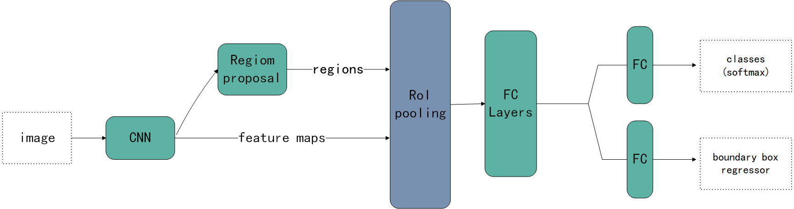 

图8.1.13 Faster R-CNN的流程图
Faster R-CNN的流程图与Fast R-CNN相同，采用外部候选区域方法代替了内部深层网络。
 

图8.1.14
**候选区域网络**

候选区域网络（RPN）将第一个卷积网络的输出特征图作为输入。它在特征图上滑动一个3×3的卷积核，以使用卷积网络（如下所示的ZF网络）构建与类别无关的候选区域。其他深度网络（如VGG或ResNet）可用于更全面的特征提取，但这需要以速度为代价。ZF网络最后会输出256个值，它们将馈送到两个独立的全连接层，以预测边界框和两个objectness分数，这两个objectness分数度量了边界框是否包含目标。我们其实可以使用回归器计算单个objectness分数，但为简洁起见，Faster R-CNN使用只有两个类别的分类器：即带有目标的类别和不带有目标的类别。
 

图8.1.15
对于特征图中的每一个位置，RPN会做k次预测。因此，RPN将输出4×k个坐标和每个位置上2×k个得分。下图展示了8×8的特征图，且有一个3×3的卷积核执行运算，它最后输出8×8×3个ROI（其中k=3）。下图（右）展示了单个位置的3个候选区域。

图8.1.16
假设最好涵盖不同的形状和大小。因此，Faster R-CNN不会创建随机边界框。相反，它会预测一些与左上角名为锚点的参考框相关的偏移量（如x, y）。我们限制这些偏移量的值，因此我们的猜想仍然类似于锚点。
 

图8.1.17
要对每个位置进行k个预测，我们需要以每个位置为中心的k个锚点。每个预测与特定锚点相关联，但不同位置共享相同形状的锚点。
 

图8.1.18
这些锚点是精心挑选的，因此它们是多样的，且覆盖具有不同比例和宽高比的现实目标。这使得我们可以用更好的猜想来指导初始训练，并允许每个预测专门用于特定的形状。该策略使早期训练更加稳定和简便。

图8.1.19
Faster R-CNN使用更多的锚点。它部署9个锚点框：3个不同宽高比的3个不同大小的锚点（Anchor）框。每一个位置使用9个锚点，每个位置会生成2×9个objectness分数和4×9个坐标。

### 8.2.4 R-FCN

**R-FCN有哪些创新点？**

R-FCN 仍属于two-stage 目标检测算法：RPN+R-FCN

1. Fully convolutional
2. 位置敏感得分图（position-sentive score maps）

> our region-based detector is **fully convolutional** with almost all computation shared on the entire image. To achieve this goal, we propose **position-sensitive score maps** to address a dilemma between translation-invariance in image classification and translation-variance in object detection.

R-FCN backbone：ResNet

ResNet-101+R-FCN：83.6% in PASCAL VOC 2007 test datasets

既提高了mAP，又加快了检测速度

    假设我们只有一个特征图用来检测右眼。那么我们可以使用它定位人脸吗？应该可以。因为右眼应该在人脸图像的左上角，所以我们可以利用这一点定位整个人脸。如果我们还有其他用来检测左眼、鼻子或嘴巴的特征图，那么我们可以将检测结果结合起来，更好地定位人脸。现在我们回顾一下所有问题。在Faster R-CNN中，检测器使用了多个全连接层进行预测。如果有2000个ROI，那么成本非常高。R-FCN通过减少每个ROI所需的工作量实现加速。上面基于区域的特征图与ROI是独立的，可以在每个ROI之外单独计算。剩下的工作就比较简单了，因此R-FCN的速度比Faster R-CNN快。

    图8.2.1 人脸检测
    现在我们来看一下5×5的特征图M，内部包含一个蓝色方块。我们将方块平均分成3×3个区域。现在，我们在M中创建了一个新的特征图，来检测方块的左上角（TL）。这个新的特征图如下图（右）所示。只有黄色的网格单元[2,2]处于激活状态。在左侧创建一个新的特征图，用于检测目标的左上角。
 

    图8.2.2 检测示例
    我们将方块分成9个部分，由此创建了9个特征图，每个用来检测对应的目标区域。这些特征图叫做位置敏感得分图（position-sensitive score map），因为每个图检测目标的子区域（计算其得分）。

    图8.2.3生成9个得分图
    下图中红色虚线矩形是建议的ROI。我们将其分割成3×3个区域，并询问每个区域包含目标对应部分的概率是多少。例如，左上角ROI区域包含左眼的概率。我们将结果存储成3×3 vote数组，如下图（右）所示。例如，vote_array[0][0]包含左上角区域是否包含目标对应部分的得分。
 

    图8.2.4
    将ROI应用到特征图上，输出一个3x3数组。将得分图和ROI映射到vote数组的过程叫做位置敏感ROI池化（position-sensitive ROI-pool）。该过程与前面讨论过的ROI池化非常接近。
 

    图8.2.5
    将ROI的一部分叠加到对应的得分图上，计算V[i][j]。在计算出位置敏感ROI池化的所有值后，类别得分是其所有元素得分的平均值。

    图8.2.6 ROI池化
    假如我们有C个类别要检测。我们将其扩展为C+1个类别，这样就为背景（非目标）增加了一个新的类别。每个类别有3×3个得分图，因此一共有(C+1)×3×3个得分图。使用每个类别的得分图可以预测出该类别的类别得分。然后我们对这些得分应用 softmax 函数，计算出每个类别的概率。以下是数据流图，在本案例中，k=3。
 

    图8.2.7
### 8.2.5 FPN

**FPN有哪些创新点？**

1. 多层特征
2. 特征融合

解决目标检测中的多尺度问题，通过简单的网络连接改变，在基本不增加原有模型计算量的情况下，大幅度提升小物体（small object）检测的性能。

在物体检测里面，有限计算量情况下，网络的深度（对应到感受野）与 stride 通常是一对矛盾的东西，常用的网络结构对应的 stride 一般会比较大（如 32），而图像中的小物体甚至会小于 stride 的大小，造成的结果就是小物体的检测性能急剧下降。传统解决这个问题的思路包括：

1. 图像金字塔（image pyramid），即多尺度训练和测试。但该方法计算量大，耗时较久。
2. 特征分层，即每层分别预测对应的scale分辨率的检测结果，如SSD算法。该方法强行让不同层学习同样的语义信息，但实际上不同深度对应于不同层次的语义特征，浅层网络分辨率高，学到更多是细节特征，深层网络分辨率低，学到更多是语义特征。

因而，目前多尺度的物体检测主要面临的挑战为：

1. 如何学习具有强语义信息的多尺度特征表示？
2. 如何设计通用的特征表示来解决物体检测中的多个子问题？如 object proposal, box localization, instance segmentation.
3. 如何高效计算多尺度的特征表示？

FPN网络直接在Faster R-CNN单网络上做修改，每个分辨率的 feature map 引入后一分辨率缩放两倍的 feature map 做 element-wise 相加的操作。通过这样的连接，每一层预测所用的 feature map 都融合了不同分辨率、不同语义强度的特征，融合的不同分辨率的 feature map 分别做对应分辨率大小的物体检测。这样保证了每一层都有合适的分辨率以及强语义（rich semantic）特征。同时，由于此方法只是在原网络基础上加上了额外的跨层连接，在实际应用中几乎不增加额外的时间和计算量。作者接下来实验了将 FPN 应用在 Faster RCNN 上的性能，在 COCO 上达到了 state-of-the-art 的单模型精度。在RPN上，FPN增加了8.0个点的平均召回率（average recall，AR）；在后面目标检测上，对于COCO数据集，FPN增加了2.3个点的平均精确率（average precision，AP），对于VOC数据集，FPN增加了3.8个点的AP。

FPN算法主要由三个模块组成，分别是：

1. Bottom-up pathway（自底向上线路）
2. Lareral connections（横向链接）
3. Top-down path（自顶向下线路）

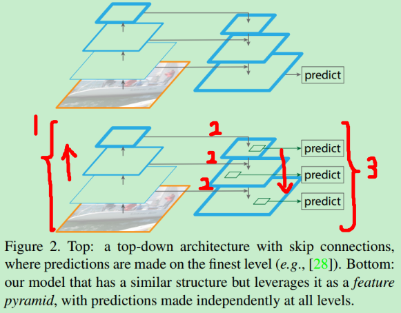

**Bottom-up pathway**

FPN是基于Faster R-CNN进行改进，其backbone是ResNet-101，FPN主要应用在Faster R-CNN中的RPN（用于bouding box proposal generation）和Fast R-CNN（用于object detection）两个模块中。

其中 RPN 和 Fast RCNN 分别关注的是召回率（recall）和精确率（precision），在这里对比的指标分别为 Average Recall(AR) 和 Average Precision(AP)。

注：Bottom-up可以理解为自底向上，Top-down可以理解为自顶向下。这里的下是指low-level，上是指high-level，分别对应于提取的低级（浅层）特征和高级语义（高层）特征。

Bottom-up pathway 是卷积网络的前向传播过程。在前向传播过程中，feature map的大小可以在某些层发生改变。一些尺度（scale）因子为2，所以后一层feature map的大小是前一层feature map大小的二分之一，根据此关系进而构成了feature pyramid（hierarchy）。

然而还有很多层输出的feature map是一样的大小（即不进行缩放的卷积），作者将这些层归为同一 stage。对于feature pyramid，作者为每个stage定义一个pyramid level。

作者将每个stage的最后一层的输出作为feature map，然后不同stage进行同一操作，便构成了feature pyramid。

具体来说，对于ResNets-101，作者使用了每个stage的最后一个残差结构的特征激活输出。将这些残差模块输出表示为{C2, C3, C4, C5}，对应于conv2，conv3，conv4和conv5的输出，并且注意它们相对于输入图像具有{4, 8, 16, 32}像素的步长。考虑到内存占用，没有将conv1包含在金字塔中。

**Top-down pathway and lateral connections**

Top-town pathway是上采样（upsampling）过程。而later connection（横向连接）是将上采样的结果和bottom-up pathway生成的相同大小的feature map进行融合（merge）。

注：上采样尺度因子为2，因为为了和之前下采样卷积的尺度因子=2一样。上采样是放大，下采样是缩小。

具体操作如下图所示，上采样（2x up）feature map与相同大小的bottom-up feature map进行逐像素相加融合（element-wise addition），其中bottom-up feature先要经过1x1卷积层，目的是为了减少通道维度（reduce channel dimensions）。

注：减少通道维度是为了将bottom-up feature map的通道数量与top-down feature map的通道数量保持一致，又因为两者feature map大小一致，所以可以进行对应位置像素的叠加（element-wise addition）。

### 8.2.6 Mask R-CNN

**Mask R-CNN有哪些创新点？**

1. Backbone：ResNeXt-101+FPN
2. RoI Align替换RoI Pooling

Mask R-CNN是一个实例分割（Instance segmentation）算法，主要是在目标检测的基础上再进行分割。Mask R-CNN算法主要是Faster R-CNN+FCN，更具体一点就是ResNeXt+RPN+RoI Align+Fast R-CNN+FCN。

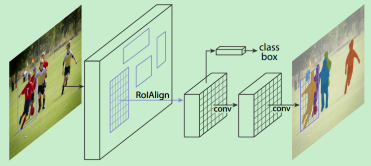

**Mask R-CNN算法步骤**

1. 输入一幅你想处理的图片，然后进行对应的预处理操作，或者预处理后的图片；
2. 将其输入到一个预训练好的神经网络中（ResNeXt等）获得对应的feature map；
3. 对这个feature map中的每一点设定预定个的RoI，从而获得多个候选RoI；
4. 将这些候选的RoI送入RPN网络进行二值分类（前景或背景）和BB回归，过滤掉一部分候选的RoI；
5. 对这些剩下的RoI进行RoI Align操作（即先将原图和feature map的pixel对应起来，然后将feature map和固定的feature对应起来）；
6. 对这些RoI进行分类（N类别分类）、BB回归和MASK生成（在每一个RoI里面进行FCN操作）。

**RoI Pooling和RoI Align有哪些不同？**

ROI Align 是在Mask-RCNN中提出的一种区域特征聚集方式，很好地解决了RoI Pooling操作中两次量化造成的区域不匹配(mis-alignment)的问题。实验显示，在检测测任务中将 RoI Pooling 替换为 RoI Align 可以提升检测模型的准确性。

在常见的两级检测框架（比如Fast-RCNN，Faster-RCNN，RFCN）中，RoI Pooling 的作用是根据预选框的位置坐标在特征图中将相应区域池化为固定尺寸的特征图，以便进行后续的分类和包围框回归操作。由于预选框的位置通常是由模型回归得到的，一般来讲是浮点数，而池化后的特征图要求尺寸固定。故RoI Pooling这一操作存在两次量化的过程。

- 将候选框边界量化为整数点坐标值。
- 将量化后的边界区域平均分割成 $k\times k$ 个单元(bin),对每一个单元的边界进行量化。

事实上，经过上述两次量化，此时的候选框已经和最开始回归出来的位置有一定的偏差，这个偏差会影响检测或者分割的准确度。在论文里，作者把它总结为“不匹配问题（misalignment）”。

下面我们用直观的例子具体分析一下上述区域不匹配问题。如下图所示，这是一个Faster-RCNN检测框架。输入一张$800\times 800$的图片，图片上有一个$665\times 665$的包围框（框着一只狗）。图片经过主干网络提取特征后，特征图缩放步长（stride）为32。因此，图像和包围框的边长都是输入时的1/32。800正好可以被32整除变为25。但665除以32以后得到20.78，带有小数，于是RoI Pooling 直接将它量化成20。接下来需要把框内的特征池化$7\times 7$的大小，因此将上述包围框平均分割成$7\times 7$个矩形区域。显然，每个矩形区域的边长为2.86，又含有小数。于是ROI Pooling 再次把它量化到2。经过这两次量化，候选区域已经出现了较明显的偏差（如图中绿色部分所示）。更重要的是，该层特征图上0.1个像素的偏差，缩放到原图就是3.2个像素。那么0.8的偏差，在原图上就是接近30个像素点的差别，这一差别不容小觑。

为了解决RoI Pooling的上述缺点，作者提出了RoI Align这一改进的方法(如图2)。

RoI Align的思路很简单：取消量化操作，使用双线性内插的方法获得坐标为浮点数的像素点上的图像数值，从而将整个特征聚集过程转化为一个连续的操作。值得注意的是，在具体的算法操作上，RoI Align并不是简单地补充出候选区域边界上的坐标点，然后将这些坐标点进行池化，而是重新设计了一套比较优雅的流程，如下图所示：

1. 遍历每一个候选区域，保持浮点数边界不做量化。

2. 将候选区域分割成$k\times k$个单元，每个单元的边界也不做量化。

3. 在每个单元中计算固定四个坐标位置，用双线性内插的方法计算出这四个位置的值，然后进行最大池化操作。

这里对上述步骤的第三点作一些说明：这个固定位置是指在每一个矩形单元（bin）中按照固定规则确定的位置。比如，如果采样点数是1，那么就是这个单元的中心点。如果采样点数是4，那么就是把这个单元平均分割成四个小方块以后它们分别的中心点。显然这些采样点的坐标通常是浮点数，所以需要使用插值的方法得到它的像素值。在相关实验中，作者发现将采样点设为4会获得最佳性能，甚至直接设为1在性能上也相差无几。事实上，RoI Align 在遍历取样点的数量上没有RoI Pooling那么多，但却可以获得更好的性能，这主要归功于解决了mis alignment的问题。值得一提的是，我在实验时发现，RoI Align在VOC 2007数据集上的提升效果并不如在COCO上明显。经过分析，造成这种区别的原因是COCO上小目标的数量更多，而小目标受mis alignment问题的影响更大（比如，同样是0.5个像素点的偏差，对于较大的目标而言显得微不足道，但是对于小目标，误差的影响就要高很多）。

## 8.3 One Stage目标检测算法

我们将对单次目标检测器（包括SSD系列和YOLO系列等算法）进行综述。我们将分析FPN以理解多尺度特征图如何提高准确率，特别是小目标的检测，其在单次检测器中的检测效果通常很差。然后我们将分析Focal loss和RetinaNet，看看它们是如何解决训练过程中的类别不平衡问题的。

### 8.3.1 SSD  

**SSD有哪些创新点？**

1. 基于Faster R-CNN中的Anchor，提出了相似的先验框（Prior box）
2. 从不同比例的特征图（多尺度特征）中产生不同比例的预测，并明确地按长宽比分离预测。

不同于前面的R-CNN系列，SSD属于one-stage方法。SSD使用 VGG16 网络作为特征提取器（和 Faster R-CNN 中使用的 CNN 一样），将后面的全连接层替换成卷积层，并在之后添加自定义卷积层，并在最后直接采用卷积进行检测。在多个特征图上设置不同缩放比例和不同宽高比的先验框以融合多尺度特征图进行检测，靠前的大尺度特征图可以捕捉到小物体的信息，而靠后的小尺度特征图能捕捉到大物体的信息，从而提高检测的准确性和定位的准确性。如下图是SSD的网络结构图。

**1. 怎样设置default boxes？**
SSD中default box的概念有点类似于Faster R-CNN中的anchor。不同于Faster R-CNN只在最后一个特征层取anchor, SSD在多个特征层上取default box，可以得到不同尺度的default box。在特征图的每个单元上取不同宽高比的default box,一般宽高比在{1,2,3,1/2,1/3}中选取，有时还会额外增加一个宽高比为1但具有特殊尺度的box。如下图所示，在8x8的feature map和4x4的feature map上的每个单元取4个不同的default box。原文对于300x300的输入，分别在conv4_3, conv7,conv8_2,conv9_2,conv10_2,conv11_2的特征图上的每个单元取4,6,6,6,4,4个default box. 由于以上特征图的大小分别是38x38,19x19,10x10,5x5,3x3,1x1，所以一共得到38x38x4+19x19x6+10x10x6+5x5x6+
3x3x4+1x1x4=8732个default box.对一张300x300的图片输入网络将会针对这8732个default box预测8732个边界框。

**2. 怎样对先验框进行匹配？**
SSD在训练的时候只需要输入图像和图像中每个目标对应的ground truth. 先验框与ground truth 的匹配遵循两个原则：

（1）对图片中的每个ground truth, 在先验框中找到与其IOU最大的先验框，则该先验框对应的预测边界框与ground truth 匹配。

（2）对于（1）中每个剩下的没有与任何ground truth匹配到的先验框，找到与其IOU最大的ground truth，若其与该ground truth的IOU值大于某个阈值（一般设为0.5），则该先验框对应的预测边界框与该ground truth匹配。

按照这两个原则进行匹配，匹配到ground truth的先验框对应的预测边界框作为正样本，没有匹配到ground truth的先验框对应的预测边界框作为负样本。尽管一个ground truth可以与多个先验框匹配，但是ground truth的数量相对先验框还是很少，按照上面的原则进行匹配还是会造成负样本远多于正样本的情况。为了使正负样本尽量均衡（一般保证正负样本比例约为1：3），SSD采用hard negative mining, 即对负样本按照其预测背景类的置信度进行降序排列，选取置信度较小的top-k作为训练的负样本。

**3. 怎样得到预测的检测结果？**

最后分别在所选的特征层上使用3x3卷积核预测不同default boxes所属的类别分数及其预测的边界框location。由于对于每个box需要预测该box属于每个类别的置信度（假设有c类，包括背景，例如20class的数据集合，c=21）和该box对应的预测边界框的location(包含4个值，即该box的中心坐标和宽高)，则每个box需要预测c+4个值。所以对于某个所选的特征层，该层的卷积核个数为（c+4）x 该层的default box个数.最后将每个层得到的卷积结果进行拼接。对于得到的每个预测框，取其类别置信度的最大值，若该最大值大于置信度阈值，则最大值所对应的类别即为该预测框的类别，否则过滤掉此框。对于保留的预测框根据它对应的先验框进行解码得到其真实的位置参数（这里还需注意要防止预测框位置超出图片），然后根据所属类别置信度进行降序排列，取top-k个预测框，最后进行NMS，过滤掉重叠度较大的预测框，最后得到检测结果。

SSD优势是速度比较快，整个过程只需要一步，首先在图片不同位置按照不同尺度和宽高比进行密集抽样，然后利用CNN提取特征后直接进行分类与回归，所以速度比较快，但均匀密集采样会造成正负样本不均衡的情况使得训练比较困难，导致模型准确度有所降低。另外，SSD对小目标的检测没有大目标好，因为随着网络的加深，在高层特征图中小目标的信息丢失掉了，适当增大输入图片的尺寸可以提升小目标的检测效果。

### 8.3.2 DSSD

**DSSD有哪些创新点？**

1. Backbone：将ResNet替换SSD中的VGG网络，增强了特征提取能力
2. 添加了Deconvolution层，增加了大量上下文信息

为了解决SSD算法检测小目标困难的问题，DSSD算法将SSD算法基础网络从VGG-16更改为ResNet-101，增强网络特征提取能力，其次参考FPN算法思路利用去Deconvolution结构将图像深层特征从高维空间传递出来，与浅层信息融合，联系不同层级之间的图像语义关系，设计预测模块结构，通过不同层级特征之间融合特征输出预测物体类别信息。

DSSD算法中有两个特殊的结构：Prediction模块；Deconvolution模块。前者利用提升每个子任务的表现来提高准确性，并且防止梯度直接流入ResNet主网络。后者则增加了三个Batch Normalization层和三个3×3卷积层，其中卷积层起到了缓冲的作用，防止梯度对主网络影响太剧烈，保证网络的稳定性。

SSD和DSSD的网络模型如下图所示：

**Prediction Module**

SSD直接从多个卷积层中单独引出预测函数，预测量多达7000多，梯度计算量也很大。MS-CNN方法指出，改进每个任务的子网可以提高准确性。根据这一思想，DSSD在每一个预测层后增加残差模块，并且对于多种方案进行了对比，如下图所示。结果表明，增加残差预测模块后，高分辨率图片的检测精度比原始SSD提升明显。

**Deconvolution模块**

为了整合浅层特征图和deconvolution层的信息，作者引入deconvolution模块，如下图所示。作者受到论文Learning to Refine Object Segments的启发，认为用于精细网络的deconvolution模块的分解结构达到的精度可以和复杂网络一样，并且更有效率。作者对其进行了一定的修改：其一，在每个卷积层后添加批归一化（batch normalization）层；其二，使用基于学习的deconvolution层而不是简单地双线性上采样；其三，作者测试了不同的结合方式，元素求和（element-wise sum）与元素点积（element-wise product）方式，实验证明元素点积计算能得到更好的精度。

### 8.3.3 YOLOv1

**YOLOv1有哪些创新点？**

1. 将整张图作为网络的输入，直接在输出层回归bounding box的位置和所属的类别
2. 速度快，one stage detection的开山之作

**YOLOv1介绍**

YOLO（You Only Look Once: Unified, Real-Time Object Detection）是one-stage detection的开山之作。之前的物体检测方法首先需要产生大量可能包含待检测物体的先验框, 然后用分类器判断每个先验框对应的边界框里是否包含待检测物体，以及物体所属类别的概率或者置信度，同时需要后处理修正边界框，最后基于一些准则过滤掉置信度不高和重叠度较高的边界框，进而得到检测结果。这种基于先产生候选区再检测的方法虽然有相对较高的检测准确率，但运行速度较慢。

YOLO创造性的将物体检测任务直接当作回归问题（regression problem）来处理，将候选区和检测两个阶段合二为一。只需一眼就能知道每张图像中有哪些物体以及物体的位置。下图展示了各物体检测系统的流程图。

事实上，YOLO也并没有真正的去掉候选区，而是直接将输入图片划分成7x7=49个网格，每个网格预测两个边界框，一共预测49x2=98个边界框。可以近似理解为在输入图片上粗略的选取98个候选区，这98个候选区覆盖了图片的整个区域，进而用回归预测这98个候选框对应的边界框。

**1. 网络结构是怎样的？**

YOLO网络借鉴了GoogLeNet分类网络结构，不同的是YOLO使用1x1卷积层和3x3卷积层替代inception module。如下图所示，整个检测网络包括24个卷积层和2个全连接层。其中，卷积层用来提取图像特征，全连接层用来预测图像位置和类别概率值。

**2. YOLO的输入、输出、损失函数分别是什么？**

前面说到YOLO将输入图像分成7x7的网格，最后输出是7x7xk的张量。YOLO网络最后接了两个全连接层，全连接层要求输入是固定大小的，所以YOLO要求输入图像有固定大小，论文中作者设计的输入尺寸是448x448。

YOLO将输入图像分成7x7的网格，每个网格预测2个边界框。若某物体的ground truth的中心落在该网格，则该网格中与这个ground truth IOU最大的边界框负责预测该物体。对每个边界框会预测5个值，分别是边界框的中心x,y（相对于所属网格的边界），边界框的宽高w,h（相对于原始输入图像的宽高的比例），以及这些边界框的confidencescores（边界框与ground truth box的IOU值）。同时每个网格还需要预测c个类条件概率 （是一个c维向量，表示某个物体object在这个网格中，且该object分别属于各个类别的概率，这里的c类物体不包含背景）。论文中的c=20，则每个网格需要预测2x5+20=30个值，这些值被映射到一个30维的向量。
为了让边界框坐标损失、分类损失达到很好的平衡，损失函数设计如下图所示。

如上图所示，损失函数分为坐标预测（蓝色框）、含有物体的边界框的confidence预测（红色框）、不含有物体的边界框的confidence预测（黄色框）、分类预测（紫色框）四个部分。

由于不同大小的边界框对预测偏差的敏感度不同，小的边界框对预测偏差的敏感度更大。为了均衡不同尺寸边界框对预测偏差的敏感度的差异。作者巧妙的对边界框的w,h取均值再求L2 loss. YOLO中更重视坐标预测，赋予坐标损失更大的权重，记为 coord，在pascal voc训练中coodd=5 ，classification error部分的权重取1。

某边界框的置信度定义为：某边界框的confidence = 该边界框存在某类对象的概率pr(object)*该边界框与该对象的ground truth的IOU值 ，若该边界框存在某个对象pr(object)=1 ，否则pr(object)=0 。由于一幅图中大部分网格中是没有物体的，这些网格中的边界框的confidence置为0，相比于有物体的网格，这些不包含物体的网格更多，对梯度更新的贡献更大，会导致网络不稳定。为了平衡上述问题，YOLO损失函数中对没有物体的边界框的confidence error赋予较小的权重，记为 noobj，对有物体的边界框的confidence error赋予较大的权重。在pascal VOC训练中noobj=0.5 ，有物体的边界框的confidence error的权重设为1.

**3. YOLO怎样预测？**

YOLO最后采用非极大值抑制（NMS）算法从输出结果中提取最有可能的对象和其对应的边界框。

输入一张图片到YOLO网络将输出一个7*7*30的张量表示图片中每个网格对应的可能的两个边界框以及每个边界框的置信度和包含的对象属于各个类别的概率。由此可以计算某对象i属于类别 同时在第j个边界框中的得分：

每个网格有20个类条件概率，2个边界框置信度，相当于每个网格有40个得分，7x7个网格有1960个得分，每类对象有1960/20=98个得分，即98个候选框。

**NMS步骤如下：**

1.设置一个Score的阈值，一个IOU的阈值；

2.对于每类对象，遍历属于该类的所有候选框，

①过滤掉Score低于Score阈值的候选框；

②找到剩下的候选框中最大Score对应的候选框，添加到输出列表；

③进一步计算剩下的候选框与②中输出列表中每个候选框的IOU，若该IOU大于设置的IOU阈值，将该候选框过滤掉，否则加入输出列表中；

④最后输出列表中的候选框即为图片中该类对象预测的所有边界框

3.返回步骤2继续处理下一类对象。

YOLO将识别与定位合二为一，结构简便，检测速度快，更快的Fast YOLO可以达到155FPS。相对于R-CNN系列, YOLO的整个流程中都能看到整张图像的信息，因此它在检测物体时能很好的利用上下文信息，从而不容易在背景上预测出错误的物体信息。同时YOLO可以学习到高度泛化的特征，能将一个域上学到的特征迁移到不同但相关的域上，如在自然图像上做训练的YOLO，在艺术图片上可以得到较好的测试结果。

由于YOLO网格设置比较稀疏，且每个网格只预测2个边界框，其总体预测精度不高，略低于Fast RCNN。其对小物体的检测效果较差，尤其是对密集的小物体表现比较差。

###  8.3.4 YOLOv2

**YOLOv2 有哪些创新点？**

YOLOv1虽然检测速度快，但在定位方面不够准确，并且召回率较低。为了提升定位准确度，改善召回率，YOLOv2在YOLOv1的基础上提出了几种改进策略，如下图所示，可以看到，一些改进方法能有效提高模型的mAP。

1. 大尺度预训练分类
2. New Network：Darknet-19
3. 加入anchor

**YOLOv2 介绍**

**（1）Batch Normalization**

YOLOv2中在每个卷积层后加Batch Normalization(BN)层，去掉dropout. BN层可以起到一定的正则化效果，能提升模型收敛速度，防止模型过拟合。YOLOv2通过使用BN层使得mAP提高了2%。
**（2）High Resolution Classifier**

目前的大部分检测模型都会使用主流分类网络（如vgg、resnet）在ImageNet上的预训练模型作为特征提取器,
而这些分类网络大部分都是以小于256x256的图片作为输入进行训练的，低分辨率会影响模型检测能力。YOLOv2将输入图片的分辨率提升至448x448，为了使网络适应新的分辨率，YOLOv2先在ImageNet上以448x448的分辨率对网络进行10个epoch的微调，让网络适应高分辨率的输入。通过使用高分辨率的输入，YOLOv2的mAP提升了约4%。

**（3）Convolutional With Anchor Boxes**

YOLOv1利用全连接层直接对边界框进行预测，导致丢失较多空间信息，定位不准。YOLOv2去掉了YOLOv1中的全连接层，使用Anchor Boxes预测边界框，同时为了得到更高分辨率的特征图，YOLOv2还去掉了一个池化层。由于图片中的物体都倾向于出现在图片的中心位置，若特征图恰好有一个中心位置，利用这个中心位置预测中心点落入该位置的物体，对这些物体的检测会更容易。所以总希望得到的特征图的宽高都为奇数。YOLOv2通过缩减网络，使用416x416的输入，模型下采样的总步长为32，最后得到13x13的特征图，然后对13x13的特征图的每个cell预测5个anchor boxes，对每个anchor box预测边界框的位置信息、置信度和一套分类概率值。使用anchor
boxes之后，YOLOv2可以预测13x13x5=845个边界框，模型的召回率由原来的81%提升到88%，mAP由原来的69.5%降低到69.2%.召回率提升了7%，准确率下降了0.3%。

**（4）Dimension Clusters**

在Faster R-CNN和SSD中，先验框都是手动设定的，带有一定的主观性。YOLOv2采用k-means聚类算法对训练集中的边界框做了聚类分析，选用boxes之间的IOU值作为聚类指标。综合考虑模型复杂度和召回率，最终选择5个聚类中心，得到5个先验框，发现其中中扁长的框较少，而瘦高的框更多，更符合行人特征。通过对比实验，发现用聚类分析得到的先验框比手动选择的先验框有更高的平均IOU值，这使得模型更容易训练学习。

**（5）New Network：Darknet-19**

YOLOv2采用Darknet-19，其网络结构如下图所示，包括19个卷积层和5个max pooling层，主要采用3x3卷积和1x1卷积，这里1x1卷积可以压缩特征图通道数以降低模型计算量和参数，每个卷积层后使用BN层以加快模型收敛同时防止过拟合。最终采用global avg pool 做预测。采用YOLOv2，模型的mAP值没有显著提升，但计算量减少了。

**（6）Direct location prediction**

Faster R-CNN使用anchor boxes预测边界框相对先验框的偏移量，由于没有对偏移量进行约束，每个位置预测的边界框可以落在图片任何位置，会导致模型不稳定，加长训练时间。YOLOv2沿用YOLOv1的方法，根据所在网格单元的位置来预测坐标,则Ground Truth的值介于0到1之间。网络中将得到的网络预测结果再输入sigmoid函数中，让输出结果介于0到1之间。设一个网格相对于图片左上角的偏移量是cx，cy。先验框的宽度和高度分别是pw和ph，则预测的边界框相对于特征图的中心坐标(bx，by)和宽高bw、bh的计算公式如下图所示。

YOLOv2结合Dimention Clusters, 通过对边界框的位置预测进行约束，使模型更容易稳定训练，这种方式使得模型的mAP值提升了约5%。

**（7）Fine-Grained Features**

YOLOv2借鉴SSD使用多尺度的特征图做检测，提出pass through层将高分辨率的特征图与低分辨率的特征图联系在一起，从而实现多尺度检测。YOLOv2提取Darknet-19最后一个max pool层的输入，得到26x26x512的特征图。经过1x1x64的卷积以降低特征图的维度，得到26x26x64的特征图，然后经过pass through层的处理变成13x13x256的特征图（抽取原特征图每个2x2的局部区域组成新的channel，即原特征图大小降低4倍，channel增加4倍），再与13x13x1024大小的特征图连接，变成13x13x1280的特征图，最后在这些特征图上做预测。使用Fine-Grained Features，YOLOv2的性能提升了1%.

**（8）Multi-Scale Training**

YOLOv2中使用的Darknet-19网络结构中只有卷积层和池化层，所以其对输入图片的大小没有限制。YOLOv2采用多尺度输入的方式训练，在训练过程中每隔10个batches,重新随机选择输入图片的尺寸，由于Darknet-19下采样总步长为32，输入图片的尺寸一般选择32的倍数{320,352,…,608}。采用Multi-Scale Training, 可以适应不同大小的图片输入，当采用低分辨率的图片输入时，mAP值略有下降，但速度更快，当采用高分辨率的图片输入时，能得到较高mAP值，但速度有所下降。

YOLOv2借鉴了很多其它目标检测方法的一些技巧，如Faster R-CNN的anchor boxes, SSD中的多尺度检测。除此之外，YOLOv2在网络设计上做了很多tricks,使它能在保证速度的同时提高检测准确率，Multi-Scale Training更使得同一个模型适应不同大小的输入，从而可以在速度和精度上进行自由权衡。

**YOLOv2的训练**

YOLOv2的训练主要包括三个阶段。
第一阶段：先在ImageNet分类数据集上预训练Darknet-19，此时模型输入为$224\times 224$,共训练160个epochs。
第二阶段：将网络的输入调整为$448\times 448$,继续在ImageNet数据集上finetune分类模型，训练10个epochs，此时分类模型的top-1准确度为76.5%，而top-5准确度为93.3%。
第三个阶段：修改Darknet-19分类模型为检测模型，并在检测数据集上继续finetune网络。
网络修改包括（网路结构可视化）：移除最后一个卷积层、global avgpooling层以及softmax层，并且新增了三个$3\times 3 \times 2014$卷积层，同时增加了一个passthrough层，最后使用$1\times 1$卷积层输出预测结果。

###  8.3.5 YOLO9000

github：http://pjreddie.com/yolo9000/

YOLO9000是在YOLOv2的基础上提出的一种联合训练方法，可以检测超过9000个类别的模型。YOLOv2混合目标检测数据集和分类数据集，用目标检测数据集及其类别标记信息和位置标注信息训练模型学习预测目标定位和分类，用分类数据集及其类别标记信息进一步扩充模型所能识别的物体类别同时能增强模型鲁棒性。

**1. YOLO9000是怎么组织数据的？**

YOLO9000根据各个类别之间的从属关系建立一种树结WordTree, 将COCO数据集和ImageNet数据集组织起来。

WordTree的生成方式如下：

①首先遍历ImageNet中的类别名词。

②对每个名词，在WordNet(一种结构化概念及概念之间关系的语言数据库)上找到从它所在位置到根节点（设根节点为实体对象physical object）的最短路径，由于在WordNet中大多数同义词只有一个路径，所以先把将该路径上的词全都加到树中。

③迭代地检查剩下的名词，取它到根节点的最短路径，将该最短路径上的还没出现在层次树中的词加入到树中。
混合后的数据集形成一个有9418类的WordTree.生成的WordTree模型如下图所示。另外考虑到COCO数据集相对于ImageNet数据集数据量太少了，为了平衡两个数据集，作者进一步对COCO数据集过采样，使COCO数据集与ImageNet数据集的数据量比例接近1：4。

对于物体的标签，采用one-hot编码的形式，数据集中的每个物体的类别标签被组织成1个长度为9418的向量，向量中除在WordTree中从该物体对应的名词到根节点的路径上出现的词对应的类别标号处为1，其余位置为0。

**2. YOLO9000是怎么进行联合训练的？**

YOLO9000采用YOLOv2的结构，anchorbox由原来的5调整到3，对每个anchorbox预测其对应的边界框的位置信息x,y,w,h和置信度以及所包含的物体分别属于9418类的概率，所以每个anchorbox需要预测4+1+9418=9423个值。每个网格需要预测3x9423=28269个值。在训练的过程中，当网络遇到来自检测数据集的图片时，用完整的YOLOv2loss进行反向传播计算，当网络遇到来自分类数据集的图片时，只用分类部分的loss进行反向传播。

**3. YOLO9000是怎么预测的？**

WordTree中每个节点的子节点都属于同一个子类，分层次的对每个子类中的节点进行一次softmax处理，以得到同义词集合中的每个词的下义词的概率。当需要预测属于某个类别的概率时，需要预测该类别节点的条件概率。即在WordTree上找到该类别名词到根节点的路径，计算路径上每个节点的概率之积。预测时，YOLOv2得到置信度，同时会给出边界框位置以及一个树状概率图，沿着根节点向下，沿着置信度最高的分支向下，直到达到某个阈值，最后到达的节点类别即为预测物体的类别。

YOLO9000使用WordTree混合目标检测数据集和分类数据集，并在其上进行联合训练，使之能实时检测出超过9000个类别的物体，其强大令人赞叹不已。YOLO9000尤其对动物的识别效果很好，但是对衣服或者设备等类别的识别效果不是很好，可能的原因是与目标检测数据集中的数据偏向有关。

###  8.3.6 YOLOv3

YOLOv3总结了自己在YOLOv2的基础上做的一些尝试性改进，有的尝试取得了成功，而有的尝试并没有提升模型性能。其中有两个值得一提的亮点，一个是使用残差模型，进一步加深了网络结构；另一个是使用FPN架构实现多尺度检测。

**YOLOv3有哪些创新点？**

1. 新网络结构：DarkNet-53
2. 融合FPN
3. 用逻辑回归替代softmax作为分类器

**1. YOLOv3对网络结构做了哪些改进？**

YOLOv3在之前Darknet-19的基础上引入了残差块，并进一步加深了网络，改进后的网络有53个卷积层，取名为Darknet-53，网络结构如下图所示（以256*256的输入为例）。

为了比较Darknet-53与其它网络结构的性能，作者在TitanX上，采用相同的实验设置，将256x256的图片分别输入以Darknet-19，ResNet-101，ResNet-152和Darknet-53为基础网络的分类模型中，实验得到的结果如下图所示。可以看到Darknet-53比ResNet-101的性能更好，而且速度是其1.5倍，Darknet-53与ResNet-152性能相似但速度几乎是其2倍。注意到，Darknet-53相比于其它网络结构实现了每秒最高的浮点计算量，说明其网络结构能更好的利用GPU。

**2.YOLOv3中怎样实现多尺度检测？**

YOLOv3借鉴了FPN的思想，从不同尺度提取特征。相比YOLOv2，YOLOv3提取最后3层特征图，不仅在每个特征图上分别独立做预测，同时通过将小特征图上采样到与大的特征图相同大小，然后与大的特征图拼接做进一步预测。用维度聚类的思想聚类出9种尺度的anchor box，将9种尺度的anchor box均匀的分配给3种尺度的特征图.如下图是在网络结构图的基础上加上多尺度特征提取部分的示意图（以在COCO数据集(80类)上256x256的输入为例）：

从YOLOv1到YOLOv2再到YOLO9000、YOLOv3, YOLO经历三代变革，在保持速度优势的同时，不断改进网络结构，同时汲取其它优秀的目标检测算法的各种trick，先后引入anchor box机制、引入FPN实现多尺度检测等。

### 8.3.7 RetinaNet

**研究背景**

- Two-Stage检测器（如Faster R-CNN、FPN）效果好，但速度相对慢
- One-Stage检测器（如YOLO、SSD）速度快，但效果一般

作者对one-stage检测器准确率不高的问题进行探究，发现主要问题在于正负类别不均衡（简单-难分类别不均衡）。

> We discover that the extreme foreground-background class imbalance encountered during training of dense detectors is the central cause.

作者建议通过重新设计标准的交叉熵损失（cross entropy loss）来解决这种类别不平衡（class inbalance）问题，即提出Focal Loss。

> We propose to address this class imbalance by reshaping the standard cross entropy loss such that it down-weights the loss assigned to well-classified examples. Our novel Focal Loss focuses training on a sparse set of hard examples and prevents the vast number of easy negatives from overwhelming the detector during training.

结合Focal Loss的one-stage检测器称为RetinaNet，该检测器在COCO上mAP可以和特征金字塔网络（feature pyramid network，FPN）或者Mask R-CNN接近，

**问：什么是类别不均衡（class imbalance）？**

答：负样本的数量极大于正样本的数量，比如包含物体的区域（正样本）很少，而不包含物体的区域（负样本）很多。比如检测算法在早期会生成一大波的bbox。而一幅常规的图片中，顶多就那么几个object。这意味着，绝大多数的bbox属于background。

**问：样本的类别不均衡会带来什么问题？**

答：由于大多数都是简单易分的负样本（属于背景的样本），使得训练过程不能充分学习到属于那些有类别样本的信息；其次简单易分的负样本太多，可能掩盖了其他有类别样本的作用（这些简单易分的负样本仍产生一定幅度的loss，见下图蓝色曲线，数量多会对loss起主要贡献作用，因此就主导了梯度的更新方向，掩盖了重要的信息）

> This imbalance causes two problems: (1) training is inefficient as most locations are easy negatives that contribute no useful learning signal; (2) en masse, the easy negatives can overwhelm training and lead to degenerate models.

简单来说，因为bbox数量爆炸。 正是因为bbox中属于background的bbox太多了，所以如果分类器无脑地把所有bbox统一归类为background，accuracy也可以刷得很高。于是乎，分类器的训练就失败了。分类器训练失败，检测精度自然就低了。

**问：为什么在two-stage检测器中，没有出现类别不均衡（class imbalamce）问题呢？**

答：因为通过RPN阶段可以减少候选目标区域，而在分类阶段，可以固定前景与背景比值（foreground-to-background ratio）为1:3，或者使用OHEM（online hard example mining）使得前景和背景的数量达到均衡。

**RetinaNet有哪些创新点？**

**概述：**

- New loss：提出Focal Loss函数解决class imbalance

$$
FL(p_t) = -(1-p_t)^\gamma \log(p_t)FL(pt)=−(1−pt)γlog(pt)
$$

- New detector：RetinaNet = ResNet + FPN + Two sub-networks + Focal Loss

Focal Loss更加聚焦在困难样本（hard examples）上的训练。

将Focal Loss与ResNet-101-FPN backbone结合提出RetinaNet（one-stage检测器），RetinaNet在COCO test-dev上达到39.1mAP，速度为5FPS。

RetinaNet检测器与当时最佳的其它检测器进行比较，无论是速度上还是准确率上都是最佳：

**详解：**

作者提出一种新的损失函数，思路是希望那些hard examples对损失的贡献变大，使网络更倾向于从这些样本上学习。

作者以二分类为例进行说明：

**交叉熵函数CE**

首先是我们常使用的交叉熵损失函数：

上式中，y=+1或者y=-1。p∈[0,1]是y=+1的估计概率。作者定义pt为：

注：对交叉熵函数不了解的，可以参考[理解交叉熵作为损失函数在神经网络中的作用](https://blog.csdn.net/chaipp0607/article/details/73392175)

**均衡交叉熵函数**

要对类别不均衡问题对loss的贡献进行一个控制，即加上一个控制权重即可，最初作者的想法即如下这样，对于属于少数类别的样本，增大α即可

但这样有一个问题，它仅仅解决了正负样本之间的平衡问题，并没有区分易分/难分样本，按作者的话说：

> While α balances the importance of positive/negative examples, it does not differentiate between easy/hard examples. Instead, we propose to reshape the loss function to down-weight easy examples and thus focus training on hard negatives.

问：为什么公式(3)只解决正负样本不均衡问题？

答：增加了一个系数αt，跟pt的定义类似，当label=1的时候，αt=a；当label=-1的时候，αt=1-a，a的范围也是0到1。因此可以通过设定a的值（一般而言假如1这个类的样本数比-1这个类的样本数多很多，那么a会取0到0.5来增加-1这个类的样本的权重）来控制正负样本对总的loss的共享权重。

**Focal Loss**

作者一开始给交叉熵损失函数添加modulating factor：
$$
(1-pt)^γ(1−pt)γ
$$

显然，样本越易分，pt就越大（pt—>1），modulating factor趋近于0，则贡献的loss就越小，同样地，样本越难分，其pt就越小，modulating factor接近于1，则贡献的loss不受影响。

问：为什么pt越大，FL值越小？

答：根据公式（4）可知，FL与log(pt)中的pt成反比，与1-pt成正比，因此FL与pt的关系成反比。这是交叉熵函数的基本性质。当pt很大时（接近于1），FL值很小；而当pt很小时（接近于0），FL值会很大。

注：这里有个超参数—focusing parameter γ。

γ 放大了modulating factor的作用。

举原文中的一个例子，当pt=0.9时，带有modulating factor的focal loss是CE loss的100分之一，即进一步减小了正确分类的损失。

> For instance, with γ = 2, an example classified with pt = 0.9 would have 100× lower loss compared with CE and with pt ≈ 0.968 it would have 1000× lower loss. This in turn increases the importance of correcting misclassified examples (whose loss is scaled down by at most 4× for pt ≤ .5 and γ = 2).

在实际中，作者采用如下公式，即综合了公式(3)和公式(4)的形式，这样机能调整正负样本的权重，又能控制难易分类样本的权重：

这里的两个参数 α和γ 来控制，在实验中a的选择范围也很广，一般而言当γ增加的时候，a需要减小一点，本文作者采用α=0.25，γ=2效果最好。

**RetinaNet Detector**

RetinaNet是由backbone网络和两个特殊任务的子网络（subnet）组成（属于one-stage检测器）。Backbone用来计算feature map；第一个子网络用来object classification，第二个子网络用来bounding box regression。

**Feature Pyramid Network Backbone**

**Anchor**

**Classification Subnet**

**Box Regression Subnet**

RetinaNet结构注意内容：

1. 训练时FPN每一级的所有example都被用于计算Focal Loss，loss值加到一起用来训练；
2. 测试时FPN每一级只选取score最大的1000个example来做nms；
3. 整个结构不同层的head部分(上图中的c和d部分)共享参数，但分类和回归分支间的参数不共享；
4. 分类分支的最后一级卷积的bias初始化成前面提到的-log((1-π)/π);

作者：张磊_0503 链接：<https://www.jianshu.com/p/204d9ad9507f> 來源：简书 简书著作权归作者所有，任何形式的转载都请联系作者获得授权并注明出处。

**实验结果**

Table1是关于RetinaNet和Focal Loss的一些实验结果。（a）是在交叉熵的基础上加上参数a，a=0.5就表示传统的交叉熵，可以看出当a=0.75的时候效果最好，AP值提升了0.9。（b）是对比不同的参数γ和a的实验结果，可以看出随着γ的增加，AP提升比较明显。（d）通过和OHEM的对比可以看出最好的Focal Loss比最好的OHEM提高了3.2AP。这里OHEM1:3表示在通过OHEM得到的minibatch上强制positive和negative样本的比例为1:3，通过对比可以看出这种强制的操作并没有提升AP。（e）加入了运算时间的对比，可以和前面的Figure2结合起来看，速度方面也有优势！注意这里RetinaNet-101-800的AP是37.8，当把训练时间扩大1.5倍同时采用scale jitter，AP可以提高到39.1，这就是全文和table2中的最高的39.1AP的由来。

### 8.3.8 RFBNet

**RFBNet有哪些创新点？**

1. 提出RF block（RFB）模块

RFBNet主要想利用一些技巧使得轻量级模型在速度和精度上达到很好的trade-off的检测器。灵感来自人类视觉的感受野结构Receptive Fields (RFs) ，提出了新奇的RF block（RFB）模块，来验证感受野尺寸和方向性的对提高有鉴别鲁棒特征的关系。RFBNet是以主干网络（backbone）为VGG16的SSD来构建的，主要是在Inception的基础上加入了dilated卷积层（dilated convolution），从而有效增大了感受野（receptive field）。整体上因为是基于SSD网络进行改进，所以检测速度还是比较快，同时精度也有一定的保证。

**RFB介绍**

RFB是一个类似Inception模块的多分支卷积模块，它的内部结构可分为两个组件：多分支卷积层和dilated卷积层。如下图：

**1.多分支卷积层**
​      根据RF的定义，用多种尺寸的卷积核来实现比固定尺寸更好。具体设计：1.瓶颈结构，1x1-s2卷积减少通道特征，然后加上一个nxn卷积。2.替换5x5卷积为两个3x3卷积去减少参数，然后是更深的非线性层。有些例子，使用1xn和nx1代替nxn卷积；shortcut直连设计来自于ResNet和Inception ResNet V2。3.为了输出，卷积经常有stride=2或者是减少通道，所以直连层用一个不带非线性激活的1x1卷积层。

**2.Dilated 卷积层**

设计灵感来自Deeplab，在保持参数量和同样感受野的情况下，用来获取更高分辨率的特征。下图展示两种RFB结构：RFB和RFB-s。每个分支都是一个正常卷积后面加一个dilated卷积，主要是尺寸和dilated因子不同。（a）RFB。整体结构上借鉴了Inception的思想，主要不同点在于引入3个dilated卷积层（比如3x3conv，rate=1），这也是RFBNet增大感受野的主要方式之一；（b）RFB-s。RFB-s和RFB相比主要有两个改进，一方面用3x3卷积层代替5x5卷积层，另一方面用1x3和3x1卷积层代替3x3卷积层，主要目的应该是为了减少计算量，类似Inception后期版本对Inception结构的改进。 

RFBNet300的整体结构如下图所示，基本上和SSD类似。RFBNet和SSD不同的是：1、主干网上用两个RFB结构替换原来新增的两层。2、conv4_3和conv7_fc在接预测层之前分别接RFB-s和RFB结构。 

### 8.3.9 M2Det

**M2Det有哪些创新点？**

1. 提出了多层次特征金字塔网络（MLFPN）来构建更有效的特征金字塔，用于检测不同尺度的对象。

M2Det的整体架构如下所示。M2Det使用backbone和多级特征金字塔网络（MLFPN）从输入图像中提取特征，然后类似于SSD，根据学习的特征生成密集的边界框和类别分数，最后是非最大抑制（NMS）操作以产生最终结果。 MLFPN由三个模块组成：特征融合模块（FFM），简化的U形模块（TUM）和按基于尺度的特征聚合模块（SFAM）。 FFMv1通过融合骨干网络的特征图，将语义信息丰富为基本特征。每个TUM生成一组多尺度特征，然后交替连接的TUM和FFMv2提取多级多尺度特征。此外，SFAM通过按比例缩放的特征连接操作和自适应注意机制将特征聚合到多级特征金字塔中。下面介绍有关M2Det中三个核心模块和网络配置的更多详细信息。

**FFMs**

FFM融合了M2Det中不同层次的特征，这对于构建最终的多级特征金字塔至关重要。它们使用1x1卷积层来压缩输入特征的通道，并使用连接操作来聚合这些特征图。特别是，由于FFMv1以backbone中不同比例的两个特征图作为输入，因此它采用一个上采样操作，在连接操作之前将深度特征重新缩放到相同的尺度。同时，FFMv2采用基本特征和前一个TUM的最大输出特征图 - 这两个具有相同的比例 - 作为输入，并产生下一个TUM的融合特征。 FFMv1和FFMv2的结构细节分别如下图（a）和（b）所示。

**TUMs** 

TUM不同于FPN和RetinaNet，TUM采用简化的U形结构，如上图（c）所示。编码器是一系列3x3，步长为2的卷积层.并且解码器将这些层的输出作为其参考特征集，而原始FPN选择ResNet主干网络中每个阶段的最后一层的输出。此外，在解码器分支的上采样层后添加1x1卷积层和按元素求和的操作，以增强学习能力并保持特征的平滑性。每个TUM的解码器中的所有输出形成当前级别的多尺度特征。整体而言，堆叠TUM的输出形成多层次多尺度特征，而前TUM主要提供浅层特征，中间TUM提供中等特征，后TUM提供深层特征。

**SFAM**

SFAM旨在将由TUM生成的多级多尺度特征聚合成多级特征金字塔，如下图所示。SFAM的第一阶段是沿着信道维度将等效尺度的特征连接在一起。聚合特征金字塔可以表示为$X = [X_1,X_2,...,X_i,...,X_L]$，其中
$$X_i = Concat(X_{1i}, X_{2i}, ...., X_{Li}) \in R^{W_i \times H_i \times C}$$
指的是尺度第i个最大的特征。这里，聚合金字塔中的每个比例都包含来自多级深度的特征。但是，简单的连接操作不太适合。在第二阶段，引入了通道注意模块，以促使特征集中在最有益的通道。在SE区块之后，使用全局平均池化来在挤压步骤中生成通道统计z∈RC。

## 8.4 人脸检测

在目标检测领域可以划分为了人脸检测与通用目标检测，往往人脸这方面会有专门的算法（包括人脸检测、人脸识别、人脸其他属性的识别等等），并且和通用目标检测（识别）会有一定的差别，着主要来源于人脸的特殊性（有时候目标比较小、人脸之间特征不明显、遮挡问题等），下面将从人脸检测和通用目标检测两个方面来讲解目标检测。

### 8.4.1 目前主要有人脸检测方法分类？

目前人脸检测方法主要包含两个区域：传统人脸检测算法和基于深度学习的人脸检测算法。传统人脸检测算法主要可以分为4类：

（1）基于知识的人脸检测方法；

（2）基于模型的人脸检测方法；

（3）基于特征的人脸检测方法；

（4）基于外观的人脸检测方法。

由于本书着重关注深度学习，下面会着重介绍基于深度学习的人脸检测方法。

2006年Hinton首次提出深度学习（Deep Learning）的概念，它是通过组合低层的特征形成更高层的抽象特征。随后研究者将深度学习应用在人脸检测领域，主要集中在基于卷积神经网络（CNN）的人脸检测研究，如基于级联卷积神经网络的人脸检测（cascade cnn）、 基于多任务卷积神经网络的人脸检测（MTCNN）、Facebox等，很大程度上提高了人脸检测的鲁棒性。当然通用目标检测算法像Faster-rcnn、yolo、ssd等也有用在人脸检测领域，也可以实现比较不错的结果，但是和专门人脸检测算法比还是有差别。下面部分主要介绍基于深度学习的的人脸检测算法，基于深度学习的通用目标检测算法将在第二大节介绍。

### 8.4.2 如何检测图片中不同大小的人脸？

传统人脸检测算法中针对不同大小人脸主要有两个策略：

（1）缩放图片的大小（图像金字塔如图8.4.1所示）；

（2）缩放滑动窗的大小（如图8.4.2所示）。

图 8.1 图像金字塔           

​      

 图 8.2 缩放滑动窗口

​   基于深度学习的人脸检测算法中针对不同大小人脸主要也有两个策略，但和传统人脸检测算法有点区别，主要包括:

（1）缩放图片大小。（不过也可以通过缩放滑动窗的方式，基于深度学习的滑动窗人脸检测方式效率会很慢存在多次重复卷积，所以要采用全卷积神经网络（FCN），用FCN将不能用滑动窗的方法。）

（2）通过anchor box的方法（如图8.3所示，不要和图8.2混淆，这里是通过特征图预测原图的anchor box区域，具体在facebox中有描述）。

图 8.3 anchor box

### 8.4.3 如何设定算法检测最小人脸尺寸?

主要是看滑动窗的最小窗口和anchorbox的最小窗口。

（1）滑动窗的方法 

假设通过12×12的滑动窗，不对原图做缩放的话，就可以检测原图中12×12的最小人脸。但是往往通常给定最小人脸a=40、或者a=80，以这么大的输入训练CNN进行人脸检测不太现实，速度会很慢，并且下一次需求最小人脸a=30*30又要去重新训练，通常还会是12×12的输入，为满足最小人脸框a，只需要在检测的时候对原图进行缩放即可：w=w×12/a。

（2）anchorbox的方法

原理类似，这里主要看anchorbox的最小box，通过可以通过缩放输入图片实现最小人脸的设定。

### 8.4.4 如何定位人脸的位置？

（1）滑动窗的方式：

滑动窗的方式是基于分类器识别为人脸的框的位置确定最终的人脸，

图 8.4 滑动窗

（2）FCN的方式：

​    FCN的方式通过特征图映射到原图的方式确定最终识别为人脸的位置，特征图映射到原图人脸框是要看特征图相比较于原图有多少次缩放（缩放主要查看卷积的步长和池化层），假设特征图上(2,3)的点，可粗略计算缩放比例为8倍，原图中的点应该是(16,24)；如果训练的FCN为12*12的输入，对于原图框位置应该是(16,24,12,12),当然这只是估计位置，具体的再构建网络时要加入回归框的预测，主要是相对于原图框的一个平移与缩放。

（3）通过anchor box的方式：

​    通过特征图映射到图的窗口，通过特征图映射到原图到多个框的方式确定最终识别为人脸的位置。

### 8.4.5 如何通过一个人脸的多个框确定最终人脸框位置？

图 8.5 通过NMS得到最终的人脸位置

NMS改进版本有很多，最原始的NMS就是判断两个框的交集，如果交集大于设定的阈值，将删除其中一个框，那么两个框应该怎么选择删除哪一个呢？ 因为模型输出有概率值，一般会优选选择概率小的框删除。

### 8.4.6 基于级联卷积神经网络的人脸检测（Cascade CNN）

1. cascade cnn的框架结构是什么？

   

级联结构中有6个CNN，3个CNN用于人脸非人脸二分类，另外3个CNN用于人脸区域的边框校正。给定一幅图像，12-net密集扫描整幅图片，拒绝90%以上的窗口。剩余的窗口输入到12-calibration-net中调整大小和位置，以接近真实目标。接着输入到NMS中，消除高度重叠窗口。下面网络与上面类似。

2. cascade cnn人脸校验模块原理是什么？ 

该网络用于窗口校正，使用三个偏移变量：Xn:水平平移量，Yn:垂直平移量，Sn:宽高比缩放。候选框口(x,y,w,h)中，(x,y)表示左上点坐标，(w,h)表示宽和高。

我们要将窗口的控制坐标调整为：
$$
（x-{x_nw}/{s_n},y-{y_nh}/{s_n},{w}/{s_n},{h}/{s_n}）
$$
这项工作中，我们有$N=5×3×3=45$种模式。偏移向量三个参数包括以下值：
$$
Sn：(0.83,0.91,1.0,1.10,1.21)    
$$

$$
Xn：(-0.17,0,0.17)
$$

$$
Yn：(-0.17,0,0.17)
$$

同时对偏移向量三个参数进行校正。

3、训练样本应该如何准备？

人脸样本：

非人脸样本：

4. 级联的好处

级联的工作原理和好处：

- 最初阶段的网络可以比较简单，判别阈值可以设得宽松一点，这样就可以在保持较高召回率的同时排除掉大量的非人脸窗口；
- 最后阶段网络为了保证足够的性能，因此一般设计的比较复杂，但由于只需要处理前面剩下的窗口，因此可以保证足够的效率；
- 级联的思想可以帮助我们去组合利用性能较差的分类器，同时又可以获得一定的效率保证。

### 8.4.7 基于多任务卷积神经网络的人脸检测（MTCNN）

1.MTCNN模型有三个子网络。分别是P-Net,R-Net,O-Net.我想问一下，1.模型中的三个input size是指的是同一张图resize到不同尺度下喂给不同模型，还是同一张图，依次经过三个模型，然后是不同的输入尺寸？（这部分能给我讲一下吗）2.每个模型它都有对应三个结果（face classification;bounding box;facial landmark）这三个在网络上是如何对应的呢？

为了检测不同大小的人脸，开始需要构建图像金字塔，先经过pNet模型，输出人脸类别和边界框（边界框的预测为了对特征图映射到原图的框平移和缩放得到更准确的框），将识别为人脸的框映射到原图框位置可以获取patch，之后每一个patch通过resize的方式输入到rNet，识别为人脸的框并且预测更准确的人脸框，最后rNet识别为人脸的的每一个patch通过resize的方式输入到oNet，跟rNet类似，关键点是为了在训练集有限情况下使模型更鲁棒。

还要注意一点构建图像金字塔的的缩放比例要保留，为了将边界框映射到最开始原图上的

还要注意一点：如何从featureMap映射回原图

### 8.4.8 Facebox

**（1）Rapidly Digested Convolutional Layers(RDCL)**

在网络前期，使用RDCL快速的缩小feature map的大小。 主要设计原则如下：

- Conv1, Pool1, Conv2 和 Pool2 的stride分别是4, 2, 2 和 2。这样整个RDCL的stride就是32，可以很快把feature map的尺寸变小。
- 卷积(或pooling)核太大速度就慢，太小覆盖信息又不足。文章权衡之后，将Conv1, Pool1, Conv2 和 Pool2 的核大小分别设为7x7,3x3,5x5,3x3
- 使用CReLU来保证输出维度不变的情况下，减少卷积核数量。

**（2）Multiple Scale Convolutional Layers(MSCL)**

在网络后期，使用MSCL更好地检测不同尺度的人脸。 主要设计原则有：

- 类似于SSD，在网络的不同层进行检测；
- 采用Inception模块。由于Inception包含多个不同的卷积分支，因此可以进一步使得感受野多样化。

**（3）Anchor densification strategy**

为了anchor密度均衡，可以对密度不足的anchor以中心进行偏移加倍，如下图所示：

## 8.5 目标检测的技巧汇总

1. Data Augmentation
2. OHEM
3. NMS：Soft NMS/ Polygon NMS/ Inclined NMS/ ConvNMS/ Yes-Net NMS/ Softer NMS
4. Multi Scale Training/Testing
5. 建立小物体与context的关系
6. 参考relation network
7. 结合GAN
8. 结合attention

## 8.6 目标检测的常用数据集

### 8.6.1 PASCAL VOC

​   VOC数据集是目标检测经常用的一个数据集，自2005年起每年举办一次比赛，最开始只有4类，到2007年扩充为20个类，共有两个常用的版本：2007和2012。学术界常用5k的train/val 2007和16k的train/val 2012作为训练集，test 2007作为测试集，用10k的train/val 2007+test 2007和16k的train/val 2012作为训练集，test2012作为测试集，分别汇报结果。

### 8.6.2 MS COCO

​   COCO数据集是微软团队发布的一个可以用来图像recognition+segmentation+captioning 数据集，该数据集收集了大量包含常见物体的日常场景图片，并提供像素级的实例标注以更精确地评估检测和分割算法的效果，致力于推动场景理解的研究进展。依托这一数据集，每年举办一次比赛，现已涵盖检测、分割、关键点识别、注释等机器视觉的中心任务，是继ImageNet Chanllenge以来最有影响力的学术竞赛之一。

相比ImageNet，COCO更加偏好目标与其场景共同出现的图片，即non-iconic images。这样的图片能够反映视觉上的语义，更符合图像理解的任务要求。而相对的iconic images则更适合浅语义的图像分类等任务。

​   COCO的检测任务共含有80个类，在2014年发布的数据规模分train/val/test分别为80k/40k/40k，学术界较为通用的划分是使用train和35k的val子集作为训练集（trainval35k），使用剩余的val作为测试集（minival），同时向官方的evaluation server提交结果（test-dev）。除此之外，COCO官方也保留一部分test数据作为比赛的评测集。

### 8.6.3 Google Open Image

​   Open Image是谷歌团队发布的数据集。最新发布的Open Images V4包含190万图像、600个种类，1540万个bounding-box标注，是当前最大的带物体位置标注信息的数据集。这些边界框大部分都是由专业注释人员手动绘制的，确保了它们的准确性和一致性。另外，这些图像是非常多样化的，并且通常包含有多个对象的复杂场景（平均每个图像 8 个）。

### 8.6.4 ImageNet

​   ImageNet是一个计算机视觉系统识别项目， 是目前世界上图像识别最大的数据库。ImageNet是美国斯坦福的计算机科学家，模拟人类的识别系统建立的。能够从图片识别物体。Imagenet数据集文档详细，有专门的团队维护，使用非常方便，在计算机视觉领域研究论文中应用非常广，几乎成为了目前深度学习图像领域算法性能检验的“标准”数据集。Imagenet数据集有1400多万幅图片，涵盖2万多个类别；其中有超过百万的图片有明确的类别标注和图像中物体位置的标注。

## TODO

- [ ] 目标检测基础知识：mAP、IoU和NMS等
- [ ] 目标检测评测指标
- [ ] 目标检测常见标注工具
- [ ] 完善目标检测的技巧汇总
- [ ] 目标检测的现在难点和未来发展

## 参考文献

https://github.com/amusi/awesome-object-detection

https://github.com/hoya012/deep_learning_object_detection

https://handong1587.github.io/deep_learning/2015/10/09/object-detection.html

https://www.zhihu.com/question/272322209/answer/482922713

http://blog.leanote.com/post/afanti.deng@gmail.com/b5f4f526490b

https://blog.csdn.net/hw5226349/article/details/78987385

[1] Girshick R, Donahue J, Darrell T, et al. Rich feature hierarchies for accurate object detection and semantic segmentation[C]//Proceedings of the IEEE conference on computer vision and pattern recognition. 2014: 580-587.

[2] Girshick R. Fast r-cnn[C]//Proceedings of the IEEE international conference on computer vision. 2015: 1440-1448.

[3] He K, Zhang X, Ren S, et al. Spatial pyramid pooling in deep convolutional networks for visual recognition[J]. IEEE transactions on pattern analysis and machine intelligence, 2015, 37(9): 1904-1916.

[4] Ren S, He K, Girshick R, et al. Faster r-cnn: Towards real-time object detection with region proposal networks[C]//Advances in neural information processing systems. 2015: 91-99.

[5] Lin T Y, Dollár P, Girshick R, et al. Feature pyramid networks for object detection[C]//Proceedings of the IEEE Conference on Computer Vision and Pattern Recognition. 2017: 2117-2125.

[6] He K, Gkioxari G, Dollár P, et al. Mask r-cnn[C]//Proceedings of the IEEE international conference on computer vision. 2017: 2961-2969.

[7] Liu W, Anguelov D, Erhan D, et al. Ssd: Single shot multibox detector[C]//European conference on computer vision. Springer, Cham, 2016: 21-37.

[8] Fu C Y, Liu W, Ranga A, et al. Dssd: Deconvolutional single shot detector[J]. arXiv preprint arXiv:1701.06659, 2017.

[9] Redmon J, Divvala S, Girshick R, et al. You only look once: Unified, real-time object detection[C]//Proceedings of the IEEE conference on computer vision and pattern recognition. 2016: 779-788.

[10] Redmon J, Farhadi A. YOLO9000: better, faster, stronger[C]//Proceedings of the IEEE conference on computer vision and pattern recognition. 2017: 7263-7271.

[11] Redmon J, Farhadi A. Yolov3: An incremental improvement[J]. arXiv preprint arXiv:1804.02767, 2018.

[12] Lin T Y, Goyal P, Girshick R, et al. Focal loss for dense object detection[C]//Proceedings of the IEEE international conference on computer vision. 2017: 2980-2988.

[13] Liu S, Huang D. Receptive field block net for accurate and fast object detection[C]//Proceedings of the European Conference on Computer Vision (ECCV). 2018: 385-400.

[14] Zhao Q, Sheng T, Wang Y, et al. M2Det: A Single-Shot Object Detector based on Multi-Level Feature Pyramid Network[J]. arXiv preprint arXiv:1811.04533, 2018.

