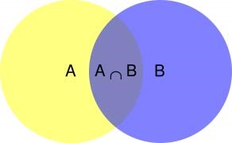

[TOC]

# 第一章 数学基础

> Markdown Revision 1;  --update 2018/10/30 13:00

> Date: 2018/10/25  -- 2018/10/30  -- 2018/11/01

> Editor: 谈继勇 &乔成磊-同济大学  & 哈工大博士生-袁笛

> Contact: scutjy2015@163.com & qchl0318@163.com & dyuanhit@gmail.com

## 1.1 标量、向量、矩阵、张量之间的联系
**标量（scalar)**  
​一个标量表示一个单独的数，它不同于线性代数中研究的其他大部分对象（通常是多个数的数组）。我们用斜体表示标量。标量通常被赋予小写的变量名称。 

**向量（vector）**  
​一个向量表示一组有序排列的数。通过次序中的索引，我们可以确定每个单独的数。通常我们赋予向量粗体的小写变量名称，比如xx。向量中的元素可以通过带脚标的斜体表示。向量$X$的第一个元素是$X_1$，第二个元素是$X_2$，以此类推。我们也会注明存储在向量中的元素的类型（实数、虚数等）。

**矩阵（matrix）**  
​矩阵是具有相同特征和纬度的对象的集合，表现为一张二维数据表。其意义是一个对象表示为矩阵中的一行，一个特征表示为矩阵中的一列，每个特征都有数值型的取值。通常会赋予矩阵粗体的大写变量名称，比如$A$。

**张量（tensor）**  
​在某些情况下，我们会讨论坐标超过两维的数组。一般地，一个数组中的元素分布在若干维坐标的规则网格中，我们将其称之为张量。使用 $A$ 来表示张量“A”。张量$A$中坐标为$(i,j,k)$的元素记作$A_{(i,j,k)}$。 

**四者之间关系**  

> 标量是0阶张量，向量是一阶张量。举例：  
> ​标量就是知道棍子的长度，但是你不会知道棍子指向哪儿。  
> ​向量就是不但知道棍子的长度，还知道棍子指向前面还是后面。  
> ​张量就是不但知道棍子的长度，也知道棍子指向前面还是后面，还能知道这棍子又向上/下和左/右偏转了多少。

## 1.2 张量与矩阵的区别？  
- 从代数角度讲， 矩阵它是向量的推广。向量可以看成一维的“表格”（即分量按照顺序排成一排）， 矩阵是二维的“表格”（分量按照纵横位置排列）， 那么$n$阶张量就是所谓的$n$维的“表格”。 张量的严格定义是利用线性映射来描述。
- 从几何角度讲， 矩阵是一个真正的几何量，也就是说，它是一个不随参照系的坐标变换而变化的东西。向量也具有这种特性。
- 张量可以用3×3矩阵形式来表达。 
- 表示标量的数和表示矢量的三维数组也可分别看作1×1，1×3的矩阵。 

## 1.3 矩阵和向量相乘结果   
​	一个$m$行$n$列的矩阵和$n$行向量相乘，最后得到就是一个$m$行的向量。运算法则就是矩阵中的每一行数据看成一个行向量与该向量作点乘。 

## 1.4 向量和矩阵的范数归纳  
**向量的范数**  
​	定义一个向量为：$\vec{a}=[-5, 6, 8, -10]$。任意一组向量设为$\vec{x}=(x_1,x_2,...,x_N)$。其不同范数求解如下：

- 向量的1范数：向量的各个元素的绝对值之和，上述向量$\vec{a}$的1范数结果就是：29。
  
$$
\Vert\vec{x}\Vert_1=\sum_{i=1}^N\vert{x_i}\vert
$$

- 向量的2范数：向量的每个元素的平方和再开平方根，上述$\vec{a}$的2范数结果就是：15。
  
$$
\Vert\vec{x}\Vert_2=\sqrt{\sum_{i=1}^N{\vert{x_i}\vert}^2}
$$

- 向量的负无穷范数：向量的所有元素的绝对值中最小的：上述向量$\vec{a}$的负无穷范数结果就是：5。  
  
$$
\Vert\vec{x}\Vert_{-\infty}=\min{|{x_i}|}
$$

- 向量的正无穷范数：向量的所有元素的绝对值中最大的：上述向量$\vec{a}$的负无穷范数结果就是：10。 
  
$$
\Vert\vec{x}\Vert_{+\infty}=\max{|{x_i}|}
$$

- 向量的p范数：向量元素绝对值的p次方和的1/p次幂。

$$
L_p=\Vert\vec{x}\Vert_p=\sqrt[p]{\sum_{i=1}^{N}|{x_i}|^p}
$$

**矩阵的范数**  

​定义一个矩阵$A=[-1, 2, -3; 4, -6, 6]$。 任意矩阵定义为：$A_{m\times n}$，其元素为 $a_{ij}$。

矩阵的范数定义为

$$
\Vert{A}\Vert_p :=\sup_{x\neq 0}\frac{\Vert{Ax}\Vert_p}{\Vert{x}\Vert_p}
$$

​当向量取不同范数时, 相应得到了不同的矩阵范数。

- **矩阵的1范数（列范数）**：矩阵的每一列上的元素绝对值先求和，再从中取个最大的,（列和最大），上述矩阵$A$的1范数先得到$[5,8,9]$，再取最大的最终结果就是：9。
  
$$
\Vert A\Vert_1=\max_{1\le j\le}\sum_{i=1}^m|{a_{ij}}|
$$

- **矩阵的2范数**：矩阵$A^TA$的最大特征值开平方根，上述矩阵$A$的2范数得到的最终结果是：10.0623。 
  
$$
\Vert A\Vert_2=\sqrt{\lambda_{max}(A^T A)}
$$

其中， $\lambda_{max}(A^T A)$ 为 $A^T A$ 的特征值绝对值的最大值。
- **矩阵的无穷范数（行范数）**：矩阵的每一行上的元素绝对值先求和，再从中取个最大的，（行和最大），上述矩阵$A$的1范数先得到$[6；16]$，再取最大的最终结果就是：16。 
  
$$
\Vert A\Vert_{\infty}=\max_{1\le i \le n}\sum_{j=1}^n |{a_{ij}}|
$$

- **矩阵的核范数**：矩阵的奇异值（将矩阵svd分解）之和，这个范数可以用来低秩表示（因为最小化核范数，相当于最小化矩阵的秩——低秩），上述矩阵A最终结果就是：10.9287。  

- **矩阵的L0范数**：矩阵的非0元素的个数，通常用它来表示稀疏，L0范数越小0元素越多，也就越稀疏，上述矩阵$A$最终结果就是：6。
- **矩阵的L1范数**：矩阵中的每个元素绝对值之和，它是L0范数的最优凸近似，因此它也可以表示稀疏，上述矩阵$A$最终结果就是：22。  
- **矩阵的F范数**：矩阵的各个元素平方之和再开平方根，它通常也叫做矩阵的L2范数，它的有点在它是一个凸函数，可以求导求解，易于计算，上述矩阵A最终结果就是：10.0995。  
  
$$
\Vert A\Vert_F=\sqrt{(\sum_{i=1}^m\sum_{j=1}^n{| a_{ij}|}^2)}
$$

- **矩阵的L21范数**：矩阵先以每一列为单位，求每一列的F范数（也可认为是向量的2范数），然后再将得到的结果求L1范数（也可认为是向量的1范数），很容易看出它是介于L1和L2之间的一种范数，上述矩阵$A$最终结果就是：17.1559。 
- **矩阵的 p范数** 
  
$$
\Vert A\Vert_p=\sqrt[p]{(\sum_{i=1}^m\sum_{j=1}^n{| a_{ij}|}^p)}
$$

## 1.5 如何判断一个矩阵为正定？  
- 顺序主子式全大于0；  
- 存在可逆矩阵$C$使$C^TC$等于该矩阵；
- 正惯性指数等于$n$；
- 合同于单位矩阵$E$（即：规范形为$E$）
- 标准形中主对角元素全为正；
- 特征值全为正；
- 是某基的度量矩阵。

## 1.6 导数偏导计算
**导数定义**:

​导数代表了在自变量变化趋于无穷小的时候，函数值的变化与自变量的变化的比值。几何意义是这个点的切线。物理意义是该时刻的（瞬时）变化率。
​

*注意*：在一元函数中，只有一个自变量变动，也就是说只存在一个方向的变化率，这也就是为什么一元函数没有偏导数的原因。在物理学中有平均速度和瞬时速度之说。平均速度有

$$
v=\frac{s}{t}
$$

​其中$v$表示平均速度，$s$表示路程，$t$表示时间。这个公式可以改写为

$$
\bar{v}=\frac{\Delta s}{\Delta t}=\frac{s(t_0+\Delta t)-s(t_0)}{\Delta t}
$$

​其中$\Delta s$表示两点之间的距离，而$\Delta t$表示走过这段距离需要花费的时间。当$\Delta t$趋向于0（$\Delta t \to 0$）时，也就是时间变得很短时，平均速度也就变成了在$t_0$时刻的瞬时速度，表示成如下形式：

$$
v(t_0)=\lim_{\Delta t \to 0}{\bar{v}}=\lim_{\Delta t \to 0}{\frac{\Delta s}{\Delta t}}=\lim_{\Delta t \to 0}{\frac{s(t_0+\Delta t)-s(t_0)}{\Delta t}}
$$

​实际上，上式表示的是路程$s$关于时间$t$的函数在$t=t_0$处的导数。一般的，这样定义导数：如果平均变化率的极限存在，即有

$$
\lim_{\Delta x \to 0}{\frac{\Delta y}{\Delta x}}=\lim_{\Delta x \to 0}{\frac{f(x_0+\Delta x)-f(x_0)}{\Delta x}}
$$

​则称此极限为函数 $y=f(x)$ 在点 $x_0$ 处的导数。记作 $f'(x_0)$ 或 $y'\vert_{x=x_0}$ 或 $\frac{dy}{dx}\vert_{x=x_0}$ 或 $\frac{df(x)}{dx}\vert_{x=x_0}$。

​通俗地说，导数就是曲线在某一点切线的斜率。

**偏导数**:

​既然谈到偏导数，那就至少涉及到两个自变量。以两个自变量为例，z=f（x,y），从导数到偏导数，也就是从曲线来到了曲面。曲线上的一点，其切线只有一条。但是曲面上的一点，切线有无数条。而偏导数就是指多元函数沿着坐标轴的变化率。 
​

*注意*：直观地说，偏导数也就是函数在某一点上沿坐标轴正方向的的变化率。

​设函数$z=f(x,y)$在点$(x_0,y_0)$的领域内有定义，当$y=y_0$时，$z$可以看作关于$x$的一元函数$f(x,y_0)$，若该一元函数在$x=x_0$处可导，即有

$$
\lim_{\Delta x \to 0}{\frac{f(x_0+\Delta x,y_0)-f(x_0,y_0)}{\Delta x}}=A
$$

​函数的极限$A$存在。那么称$A$为函数$z=f(x,y)$在点$(x_0,y_0)$处关于自变量$x$的偏导数，记作$f_x(x_0,y_0)$或$\frac{\partial z}{\partial x}\vert_{y=y_0}^{x=x_0}$或$\frac{\partial f}{\partial x}\vert_{y=y_0}^{x=x_0}$或$z_x\vert_{y=y_0}^{x=x_0}$。

​偏导数在求解时可以将另外一个变量看做常数，利用普通的求导方式求解，比如$z=3x^2+xy$关于$x$的偏导数就为$z_x=6x+y$，这个时候$y$相当于$x$的系数。

​某点$(x_0,y_0)$处的偏导数的几何意义为曲面$z=f(x,y)$与面$x=x_0$或面$y=y_0$交线在$y=y_0$或$x=x_0$处切线的斜率。  

## 1.7 导数和偏导数有什么区别？  
​导数和偏导没有本质区别，如果极限存在，都是当自变量的变化量趋于0时，函数值的变化量与自变量变化量比值的极限。  

> - 一元函数，一个$y$对应一个$x$，导数只有一个。  
> - 二元函数，一个$z$对应一个$x$和一个$y$，有两个导数：一个是$z$对$x$的导数，一个是$z$对$y$的导数，称之为偏导。  
> - 求偏导时要注意，对一个变量求导，则视另一个变量为常数，只对改变量求导，从而将偏导的求解转化成了一元函数的求导。

## 1.8 特征值分解与特征向量  
- 特征值分解可以得到特征值与特征向量；

- 特征值表示的是这个特征到底有多重要，而特征向量表示这个特征是什么。  

  如果说一个向量$\vec{v}$是方阵$A$的特征向量，将一定可以表示成下面的形式：
  
$$
A\nu = \lambda \nu
$$

$\lambda$为特征向量$\vec{v}$对应的特征值。特征值分解是将一个矩阵分解为如下形式： 
​    
$$
A=Q\sum Q^{-1}
$$

其中，$Q$是这个矩阵$A$的特征向量组成的矩阵，$\sum$是一个对角矩阵，每一个对角线元素就是一个特征值，里面的特征值是由大到小排列的，这些特征值所对应的特征向量就是描述这个矩阵变化方向（从主要的变化到次要的变化排列）。也就是说矩阵$A$的信息可以由其特征值和特征向量表示。

## 1.9 奇异值与特征值有什么关系?  
​那么奇异值和特征值是怎么对应起来的呢？我们将一个矩阵$A$的转置乘以$A$，并对$AA^T$求特征值，则有下面的形式：

$$
(A^TA)V = \lambda V
$$

这里$V$就是上面的右奇异向量，另外还有：

$$
\sigma_i = \sqrt{\lambda_i}, u_i=\frac{1}{\sigma_i}A\mu_i
$$

这里的$\sigma$就是奇异值，$u$就是上面说的左奇异向量。【证明那个哥们也没给】
​奇异值$\sigma$跟特征值类似，在矩阵$\sum$中也是从大到小排列，而且$\sigma$的减少特别的快，在很多情况下，前10%甚至1%的奇异值的和就占了全部的奇异值之和的99%以上了。也就是说，我们也可以用前$r$（$r$远小于$m、n$）个的奇异值来近似描述矩阵，即部分奇异值分解：

$$
A_{m\times n}\approx U_{m \times r}\sum_{r\times r}V_{r \times n}^T
$$

右边的三个矩阵相乘的结果将会是一个接近于$A$的矩阵，在这儿，$r$越接近于$n$，则相乘的结果越接近于$A$。

## 1.10 机器学习为什么要使用概率？  
​事件的概率是衡量该事件发生的可能性的量度。虽然在一次随机试验中某个事件的发生是带有偶然性的，但那些可在相同条件下大量重复的随机试验却往往呈现出明显的数量规律。  
​机器学习除了处理不确定量，也需处理随机量。不确定性和随机性可能来自多个方面，使用概率论来量化不确定性。  
​概率论在机器学习中扮演着一个核心角色，因为机器学习算法的设计通常依赖于对数据的概率假设。  

>​	例如在机器学习（Andrew Ng）的课中，会有一个朴素贝叶斯假设就是条件独立的一个例子。该学习算法对内容做出假设，用来分辨电子邮件是否为垃圾邮件。假设无论邮件是否为垃圾邮件，单词x出现在邮件中的概率条件独立于单词y。很明显这个假设不是不失一般性的，因为某些单词几乎总是同时出现。然而，最终结果是，这个简单的假设对结果的影响并不大，且无论如何都可以让我们快速判别垃圾邮件。

## 1.11 变量与随机变量有什么区别？  
**随机变量**（random variable）

​表示随机现象（在一定条件下，并不总是出现相同结果的现象称为随机现象）中各种结果的实值函数（一切可能的样本点）。例如某一时间内公共汽车站等车乘客人数，电话交换台在一定时间内收到的呼叫次数等，都是随机变量的实例。  
​随机变量与模糊变量的不确定性的本质差别在于，后者的测定结果仍具有不确定性，即模糊性。

**变量与随机变量的区别：**  
​当变量的取值的概率不是1时,变量就变成了随机变量；当随机变量取值的概率为1时,随机变量就变成了变量。

> 比如：  
> ​	当变量$x$值为100的概率为1的话,那么$x=100$就是确定了的,不会再有变化,除非有进一步运算.
> ​	当变量$x$的值为100的概率不为1,比如为50的概率是0.5,为100的概率是0.5,那么这个变量就是会随不同条件而变化的,是随机变量,取到50或者100的概率都是0.5,即50%。  

## 1.12 常见概率分布
(https://wenku.baidu.com/view/6418b0206d85ec3a87c24028915f804d2b168707)  
  
  
  
  
  
  
  

## 1.13 举例理解条件概率  
​条件概率公式如下：

$$
P(A/B) = P(A\cap B) / P(B)
$$

​说明：在同一个样本空间$\Omega$中的事件或者子集$A$与$B$，如果随机从$\Omega$中选出的一个元素属于$B$，那么下一个随机选择的元素属于$A$ 的概率就定义为在$B$的前提下$A$的条件概率。  

​根据文氏图，可以很清楚地看到在事件B发生的情况下，事件A发生的概率就是$P(A\bigcap B)$除以$P(B)$。  
​举例：一对夫妻有两个小孩，已知其中一个是女孩，则另一个是女孩子的概率是多少？（面试、笔试都碰到过）  
​**穷举法**：已知其中一个是女孩，那么样本空间为男女，女女，女男，则另外一个仍然是女生的概率就是1/3。  
​**条件概率法**：$P(女|女)=P(女女)/P(女)$,夫妻有两个小孩，那么它的样本空间为女女，男女，女男，男男，则$P(女女)$为1/4，$P（女）= 1-P(男男)=3/4$,所以最后$1/3$。  
这里大家可能会误解，男女和女男是同一种情况，但实际上类似姐弟和兄妹是不同情况。 

## 1.14 联合概率与边缘概率联系区别？  
**区别：**  
​联合概率：联合概率指类似于$P(X=a,Y=b)$这样，包含多个条件，且所有条件同时成立的概率。联合概率是指在多元的概率分布中多个随机变量分别满足各自条件的概率。  
​边缘概率：边缘概率是某个事件发生的概率，而与其它事件无关。边缘概率指类似于$P(X=a)$，$P(Y=b)$这样，仅与单个随机变量有关的概率。

**联系：**  
​联合分布可求边缘分布，但若只知道边缘分布，无法求得联合分布。  

## 1.15 条件概率的链式法则  
​由条件概率的定义，可直接得出下面的乘法公式：  
​乘法公式 设$A, B$是两个事件，并且$P(A) > 0$, 则有 

$$
P(AB) = P(B|A)P(A)
$$

​推广 

$$
P(ABC)=P(C|AB)P(B|A)P(A)
$$

​一般地，用归纳法可证：若$P(A_1A_2...A_n)>0$，则有

$$
P(A_1A_2...A_n)=P(A_n|A_1A_2...A_{n-1})P(A_{n-1}|A_1A_2...A_{n-2})...P(A_2|A_1)P(A_1)
=P(A_1)\prod_{i=2}^{n}P(A_i|A_1A_2...A_{i-1})
$$

​任何多维随机变量联合概率分布，都可以分解成只有一个变量的条件概率相乘形式。 

## 1.16 独立性和条件独立性
**独立性**
​两个随机变量$x$和$y$，概率分布表示成两个因子乘积形式，一个因子只包含$x$，另一个因子只包含$y$，两个随机变量相互独立(independent)。  
​条件有时为不独立的事件之间带来独立，有时也会把本来独立的事件，因为此条件的存在，而失去独立性。  
​举例：$P(XY)=P(X)P(Y)$, 事件$X$和事件$Y$独立。此时给定$Z$，

$$
P(X,Y|Z) \not = P(X|Z)P(Y|Z)
$$

​事件独立时，联合概率等于概率的乘积。这是一个非常好的数学性质，然而不幸的是，无条件的独立是十分稀少的，因为大部分情况下，事件之间都是互相影响的。 

**条件独立性**  
​给定$Z$的情况下,$X$和$Y$条件独立，当且仅当

$$
X\bot Y|Z \iff P(X,Y|Z) = P(X|Z)P(Y|Z)
$$

​$X$和$Y$的关系依赖于$Z$，而不是直接产生。  

>**举例**定义如下事件：  
>$X$：明天下雨；  
>$Y$：今天的地面是湿的；  
>$Z$：今天是否下雨；  
>$Z$事件的成立，对$X$和$Y$均有影响，然而，在$Z$事件成立的前提下，今天的地面情况对明天是否下雨没有影响。 

## 1.17 期望、方差、协方差、相关系数总结  
**期望**  
​在概率论和统计学中，数学期望（或均值，亦简称期望）是试验中每次可能结果的概率乘以其结果的总和。它反映随机变量平均取值的大小。
- 线性运算： $E(ax+by+c) = aE(x)+bE(y)+c$  
- ​推广形式： $E(\sum_{k=1}^{n}{a_ix_i+c}) = \sum_{k=1}^{n}{a_iE(x_i)+c}$ 
- 函数期望：设$f(x)$为$x$的函数，则$f(x)$的期望为
    - 离散函数： $E(f(x))=\sum_{k=1}^{n}{f(x_k)P(x_k)}$
    - 连续函数： $E(f(x))=\int_{-\infty}^{+\infty}{f(x)p(x)dx}$

> 注意：
>
> - 函数的期望不等于期望的函数，即$E(f(x))=f(E(x))$  
> - 一般情况下，乘积的期望不等于期望的乘积。  
> - 如果$X$和$Y$相互独立，则$E(xy)=E(x)E(y)​$。  

**方差**  

​概率论中方差用来度量随机变量和其数学期望（即均值）之间的偏离程度。方差是一种特殊的期望。定义为：

$$
Var(x) = E((x-E(x))^2)
$$

> 方差性质：  
>
> 1）$Var(x) = E(x^2) -E(x)^2$  
> 2）常数的方差为0;  
> 3）方差不满足线性性质;  
> 4）如果$X$和$Y$相互独立, $Var(ax+by)=a^2Var(x)+b^2Var(y)$   

**协方差**   
​协方差是衡量两个变量线性相关性强度及变量尺度。  两个随机变量的协方差定义为：

$$
Cov(x,y)=E((x-E(x))(y-E(y)))
$$

​方差是一种特殊的协方差。当$X=Y$时，$Cov(x,y)=Var(x)=Var(y)$。

> 协方差性质：  
>
> 1）独立变量的协方差为0。  
> 2）协方差计算公式：

$$
Cov(\sum_{i=1}^{m}{a_ix_i}, \sum_{j=1}^{m}{b_jy_j}) = \sum_{i=1}^{m} \sum_{j=1}^{m}{a_ib_jCov(x_iy_i)}
$$

>
> 3）特殊情况：

$$
Cov(a+bx, c+dy) = bdCov(x, y)
$$

**相关系数**  
​相关系数是研究变量之间线性相关程度的量。两个随机变量的相关系数定义为：

$$
Corr(x,y) = \frac{Cov(x,y)}{\sqrt{Var(x)Var(y)}}
$$

> 相关系数的性质：  
> 1）有界性。相关系数的取值范围是 ，可以看成无量纲的协方差。  
> 2）值越接近1，说明两个变量正相关性（线性）越强。越接近-1，说明负相关性越强，当为0时，表示两个变量没有相关性。  
