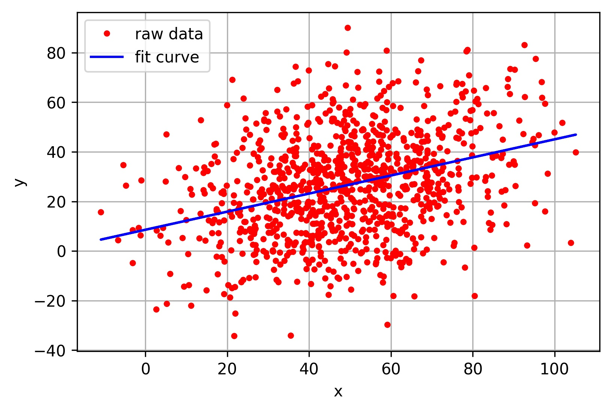
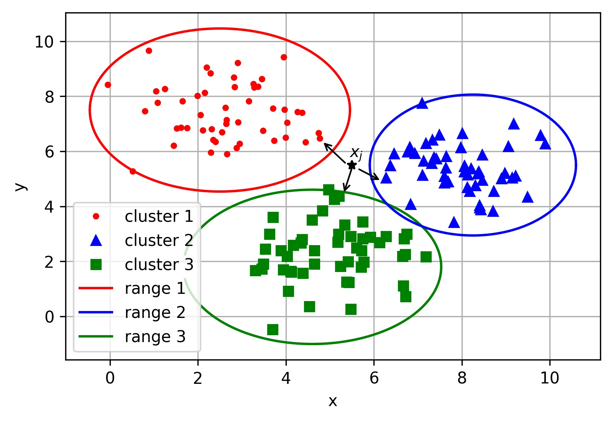
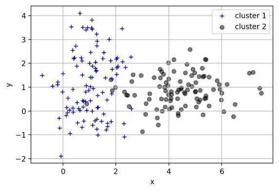
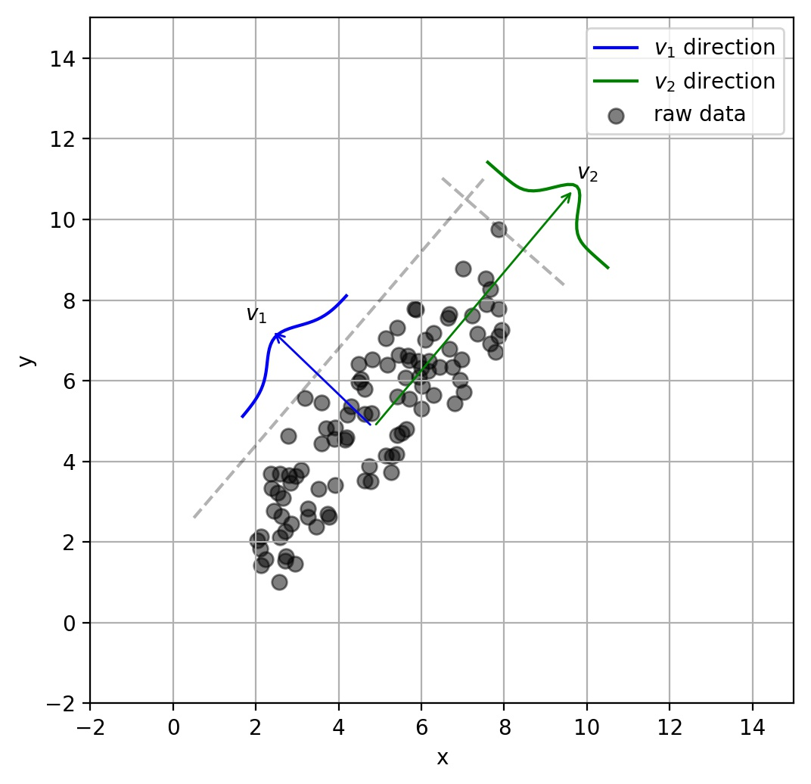
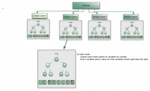
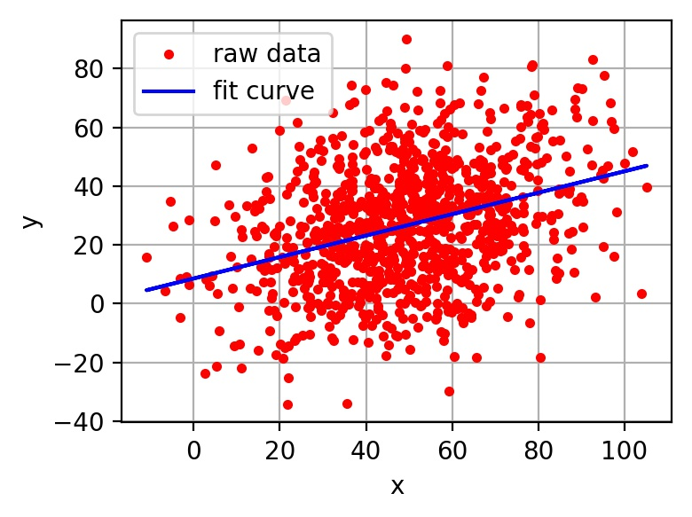
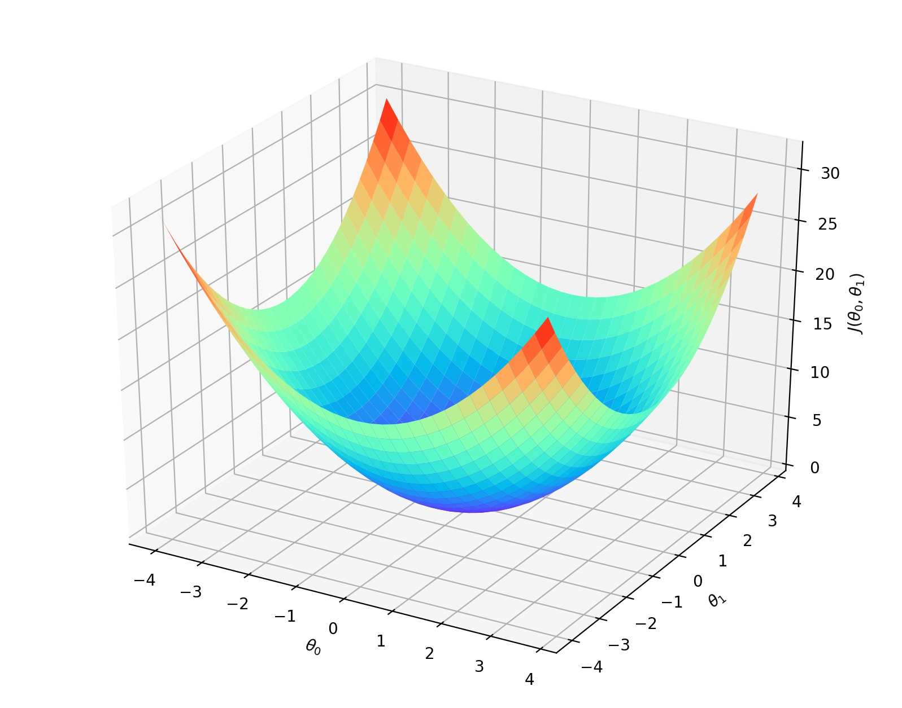
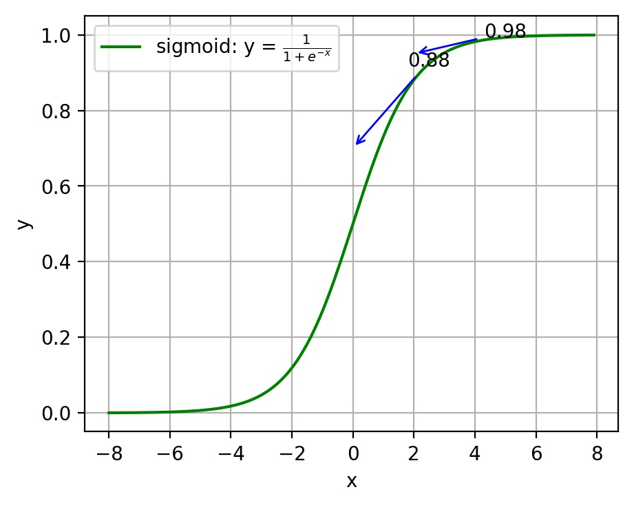
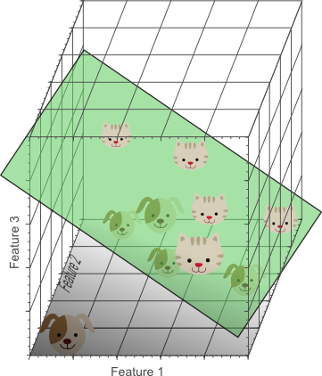
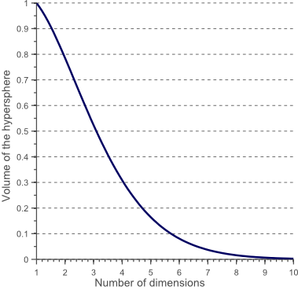

[TOC]

# 第二章 机器学习基础

##  2.1 各种常见算法图示

|回归算法|基于实例的算法|正则化方法|
|:-:|:-:|:-:|
||||

|决策树学习|贝叶斯方法|基于核的算法|
|:-:|:-:|:-:|
||||

|聚类算法|关联规则学习|人工神经网络|
|:-:|:-:|:-:|
||||

|深度学习|降低维度算法|集成算法|
|:-:|:-:|:-:|
||||

## 2.2 监督学习、非监督学习、半监督学习、弱监督学习？
根据数据类型的不同，对一个问题的建模有不同的方式。依据不同的学习方式和输入数据，机器学习主要分为以下四种学习方式。

**监督学习**：
1. 监督学习是使用已知正确答案的示例来训练网络。已知数据和其一一对应的标签，训练一个智能算法，将输入数据映射到标签的过程。
2. 监督式学习的常见应用场景如分类问题和回归问题。
3. 常见算法有逻辑回归（Logistic Regression）和反向传递神经网络（Back Propagation Neural Network）

**非监督式学习**：
1. 在非监督式学习中，数据并不被特别标识，适用于你具有数据集但无标签的情况。学习模型是为了推断出数据的一些内在结构。
2. 常见的应用场景包括关联规则的学习以及聚类等。
3. 常见算法包括Apriori算法以及k-Means算法。

**半监督式学习**：
1. 在此学习方式下，输入数据部分被标记，部分没有被标记，这种学习模型可以用来进行预测。
2. 应用场景包括分类和回归，算法包括一些对常用监督式学习算法的延伸，通过对已标记数据建模，在此基础上，对未标记数据进行预测。
3. 常见算法如图论推理算法（Graph Inference）或者拉普拉斯支持向量机（Laplacian SVM）等。

**弱监督学习**：
1. 弱监督学习可以看做是有多个标记的数据集合，次集合可以是空集，单个元素，或包含多种情况（没有标记，有一个标记，和有多个标记）的多个元素。 
2. 数据集的标签是不可靠的，这里的不可靠可以是标记不正确，多种标记，标记不充分，局部标记等。
3. 已知数据和其一一对应的弱标签，训练一个智能算法，将输入数据映射到一组更强的标签的过程。标签的强弱指的是标签蕴含的信息量的多少，比如相对于分割的标签来说，分类的标签就是弱标签。
4. 举例，告诉一张包含气球的图片，需要得出气球在图片中的位置及气球和背景的分割线，这就是已知弱标签学习强标签的问题。

在企业数据应用的场景下， 人们最常用的可能就是监督式学习和非监督式学习的模型。 在图像识别等领域，由于存在大量的非标识的数据和少量的可标识数据， 目前半监督式学习是一个很热的话题。

## 2.3 监督学习有哪些步骤
**监督式学习**：
监督学习是使用已知正确答案的示例来训练网络。每组训练数据有一个明确的标识或结果，想象一下，我们可以训练一个网络，让其从照片库中（其中包含气球的照片）识别出气球的照片。以下就是我们在这个假设场景中所要采取的步骤。
**步骤1：数据集的创建和分类**
首先，浏览你的照片（数据集），确定所有包含气球的照片，并对其进行标注。然后，将所有照片分为训练集和验证集。目标就是在深度网络中找一函数，这个函数输入是任意一张照片，当照片中包含气球时，输出1，否则输出0。
**步骤2：训练**
选择合适的模型，模型可通过以下激活函数对每张照片进行预测。既然我们已经知道哪些是包含气球的图片，那么我们就可以告诉模型它的预测是对还是错。然后我们会将这些信息反馈（feed back）给网络。
该算法使用的这种反馈，就是一个量化“真实答案与模型预测有多少偏差”的函数的结果。这个函数被称为成本函数（cost function），也称为目标函数（objective function），效用函数（utility function）或适应度函数（fitness function）。然后，该函数的结果用于修改一个称为反向传播（backpropagation）过程中节点之间的连接强度和偏差。
我们会为每个图片都重复一遍此操作，而在每种情况下，算法都在尽量最小化成本函数。
其实，我们有多种数学技术可以用来验证这个模型是正确还是错误的，但我们常用的是一个非常常见的方法，我们称之为梯度下降（gradient descent）。
**步骤3：验证**
当处理完训练集所有照片，接着要去测试该模型。利用验证集来来验证训练有素的模型是否可以准确地挑选出含有气球在内的照片。
在此过程中，通常会通过调整和模型相关的各种事物（超参数）来重复步骤2和3，诸如里面有多少个节点，有多少层，哪些数学函数用于决定节点是否亮起，如何在反向传播阶段积极有效地训练权值等等。
**步骤4：测试及应用**
当有了一个准确的模型，就可以将该模型部署到你的应用程序中。你可以将模型定义为API调用，并且你可以从软件中调用该方法，从而进行推理并给出相应的结果。

## 2.4 多实例学习？
多示例学习(multiple instance learning) ：已知包含多个数据的数据包和数据包的标签，训练智能算法，将数据包映射到标签的过程，在有的问题中也同时给出包内每个数据的标签。
比如说一段视频由很多张图组成，假如10000张，那么我们要判断视频里是否包含某一物体，比如气球。单张标注每一帧是否有气球太耗时，通常人们看一遍说这个视频里是否有气球，就得到了多示例学习的数据。10000帧的数据不是每一个都有气球出现，只要有一帧有气球，那么我们就认为这个数据包是有气球的。只有当所有的视频帧都没有气球，才是没有气球的。从这里面学习哪一段视频（10000张）是否有气球出现就是多实例学习的问题。

## 2.5 分类网络和回归的区别？
2.3小节介绍了包含气球照片的数据集整理。当照片中包含气球时，输出1，否则输出0。此步骤通常称为分类任务（categorization task）。在这种情况下，我们进行的通常是一个结果为yes or no的训练。
但事实上，监督学习也可以用于输出一组值，而不仅仅是0或1。例如，我们可以训练一个网络，用它来输出一张图片上有气球的概率，那么在这种情况下，输出值就是0到1之间的任意值。这些任务我们称之为回归。

## 2.6 什么是神经网络？
神经网络就是按照一定规则将多个神经元连接起来的网络。不同的神经网络，具有不同的连接规则。
例如全连接(full connected, FC)神经网络，它的规则包括：
1. 有三种层：输入层，输出层，隐藏层。
2. 同一层的神经元之间没有连接。
3. full connected的含义：第 N 层的每个神经元和第 N-1 层的所有神经元相连，第 N-1 层神经元的输出就是第 N 层神经元的输入。
4. 每个连接都有一个权值。
**神经网络架构**
下面这张图就是一个神经网络系统，它由很多层组成。输入层负责接收信息，比如一只猫的图片。输出层是计算机对这个输入信息的判断结果，它是不是猫。隐藏层就是对输入信息的传递和加工处理。

## 2.7 理解局部最优与全局最优

笑谈局部最优和全局最优

> 柏拉图有一天问老师苏格拉底什么是爱情？苏格拉底叫他到麦田走一次，摘一颗最大的麦穗回来，不许回头，只可摘一次。柏拉图空着手出来了，他的理由是，看见不错的，却不知道是不是最好的，一次次侥幸，走到尽头时，才发现还不如前面的，于是放弃。苏格拉底告诉他：“这就是爱情。”这故事让我们明白了一个道理，因为生命的一些不确定性，所以全局最优解是很难寻找到的，或者说根本就不存在，我们应该设置一些限定条件，然后在这个范围内寻找最优解，也就是局部最优解——有所斩获总比空手而归强，哪怕这种斩获只是一次有趣的经历。
> 柏拉图有一天又问什么是婚姻？苏格拉底叫他到彬树林走一次,选一棵最好的树做圣诞树，也是不许回头，只许选一次。这次他一身疲惫地拖了一棵看起来直挺、翠绿，却有点稀疏的杉树回来，他的理由是，有了上回的教训，好不容易看见一棵看似不错的，又发现时间、体力已经快不够用了，也不管是不是最好的，就拿回来了。苏格拉底告诉他：“这就是婚姻。

优化问题一般分为局部最优和全局最优。

1. 局部最优，就是在函数值空间的一个有限区域内寻找最小值；而全局最优，是在函数值空间整个区域寻找最小值问题。
2. 函数局部最小点是那种它的函数值小于或等于附近点的点。但是有可能大于较远距离的点。
3. 全局最小点是那种它的函数值小于或等于所有的可行点。

## 2.8 分类算法

### 2.8.1 常用分类算法的优缺点？

|算法|优点|缺点|
|:-|:-|:-|
|Bayes 贝叶斯分类法|1）所需估计的参数少，对于缺失数据不敏感。2）有着坚实的数学基础，以及稳定的分类效率。|1）假设属性之间相互独立，这往往并不成立。（喜欢吃番茄、鸡蛋，却不喜欢吃番茄炒蛋）。2）需要知道先验概率。3）分类决策存在错误率。|
|Decision Tree决策树|1）不需要任何领域知识或参数假设。2）适合高维数据。3）简单易于理解。4）短时间内处理大量数据，得到可行且效果较好的结果。5）能够同时处理数据型和常规性属性。|1）对于各类别样本数量不一致数据，信息增益偏向于那些具有更多数值的特征。2）易于过拟合。3）忽略属性之间的相关性。4）不支持在线学习。|
|SVM支持向量机|1）可以解决小样本下机器学习的问题。2）提高泛化性能。3）可以解决高维、非线性问题。超高维文本分类仍受欢迎。4）避免神经网络结构选择和局部极小的问题。|1）对缺失数据敏感。2）内存消耗大，难以解释。3）运行和调差略烦人。|
|KNN K近邻|1）思想简单，理论成熟，既可以用来做分类也可以用来做回归； 2）可用于非线性分类； 3）训练时间复杂度为O(n)； 4）准确度高，对数据没有假设，对outlier不敏感；|1）计算量太大2）对于样本分类不均衡的问题，会产生误判。3）需要大量的内存。4）输出的可解释性不强。|
|Logistic Regression逻辑回归|1）速度快。2）简单易于理解，直接看到各个特征的权重。3）能容易地更新模型吸收新的数据。4）如果想要一个概率框架，动态调整分类阀值。|特征处理复杂。需要归一化和较多的特征工程。|
|Neural Network 神经网络|1）分类准确率高。2）并行处理能力强。3）分布式存储和学习能力强。4）鲁棒性较强，不易受噪声影响。|1）需要大量参数（网络拓扑、阀值、阈值）。2）结果难以解释。3）训练时间过长。|
|Adaboosting|1）adaboost是一种有很高精度的分类器。2）可以使用各种方法构建子分类器，Adaboost算法提供的是框架。3）当使用简单分类器时，计算出的结果是可以理解的。而且弱分类器构造极其简单。4）简单，不用做特征筛选。5）不用担心overfitting。|对outlier比较敏感|

### 2.8.2 正确率能很好的评估分类算法吗？
不同算法有不同特点，在不同数据集上有不同的表现效果，根据特定的任务选择不同的算法。如何评价分类算法的好坏，要做具体任务具体分析。对于决策树，主要用正确率去评估，但是其他算法，只用正确率能很好的评估吗？
答案是否定的。
正确率确实是一个很直观很好的评价指标，但是有时候正确率高并不能完全代表一个算法就好。比如对某个地区进行地震预测，地震分类属性分为0：不发生地震、1发生地震。我们都知道，不发生的概率是极大的，对于分类器而言，如果分类器不加思考，对每一个测试样例的类别都划分为0，达到99%的正确率，但是，问题来了，如果真的发生地震时，这个分类器毫无察觉，那带来的后果将是巨大的。很显然，99%正确率的分类器并不是我们想要的。出现这种现象的原因主要是数据分布不均衡，类别为1的数据太少，错分了类别1但达到了很高的正确率缺忽视了研究者本身最为关注的情况。

### 2.8.3 分类算法的评估方法？
1. **几个常用的术语**
这里首先介绍几个*常见*的 模型评价术语，现在假设我们的分类目标只有两类，计为正例（positive）和负例（negative）分别是：
 1) True positives(TP):  被正确地划分为正例的个数，即实际为正例且被分类器划分为正例的实例数（样本数）；
 2) False positives(FP): 被错误地划分为正例的个数，即实际为负例但被分类器划分为正例的实例数；
 3) False negatives(FN):被错误地划分为负例的个数，即实际为正例但被分类器划分为负例的实例数；
 4) True negatives(TN): 被正确地划分为负例的个数，即实际为负例且被分类器划分为负例的实例数。　

上图是这四个术语的混淆矩阵。
1）P=TP+FN表示实际为正例的样本个数。
2）True、False描述的是分类器是否判断正确。
3）Positive、Negative是分类器的分类结果，如果正例计为1、负例计为-1，即positive=1、negative=-1。用1表示True，-1表示False，那么实际的类标=TF\*PN，TF为true或false，PN为positive或negative。
4）例如True positives(TP)的实际类标=1\*1=1为正例，False positives(FP)的实际类标=(-1)\*1=-1为负例，False negatives(FN)的实际类标=(-1)\*(-1)=1为正例，True negatives(TN)的实际类标=1\*(-1)=-1为负例。

2. **评价指标**
    1) 正确率（accuracy）
    正确率是我们最常见的评价指标，accuracy = (TP+TN)/(P+N)，正确率是被分对的样本数在所有样本数中的占比，通常来说，正确率越高，分类器越好。
    2) 错误率（error rate)
    错误率则与正确率相反，描述被分类器错分的比例，error rate = (FP+FN)/(P+N)，对某一个实例来说，分对与分错是互斥事件，所以accuracy =1 -  error rate。
    3) 灵敏度（sensitive）
    sensitive = TP/P，表示的是所有正例中被分对的比例，衡量了分类器对正例的识别能力。
    4) 特效度（specificity)
    specificity = TN/N，表示的是所有负例中被分对的比例，衡量了分类器对负例的识别能力。
    5) 精度（precision）
    精度是精确性的度量，表示被分为正例的示例中实际为正例的比例，precision=TP/(TP+FP)。
    6) 召回率（recall）
    召回率是覆盖面的度量，度量有多个正例被分为正例，recall=TP/(TP+FN)=TP/P=sensitive，可以看到召回率与灵敏度是一样的。
    7) 其他评价指标
    计算速度：分类器训练和预测需要的时间；
    鲁棒性：处理缺失值和异常值的能力；
    可扩展性：处理大数据集的能力；
    可解释性：分类器的预测标准的可理解性，像决策树产生的规则就是很容易理解的，而神经网络的一堆参数就不好理解，我们只好把它看成一个黑盒子。
    8) 查准率和查全率反映了分类器分类性能的两个方面。如果综合考虑查准率与查全率，可以得到新的评价指标F1测试值，也称为综合分类率：$F1=\frac{2 \times precision \times recall}{precision + recall}$
     为了综合多个类别的分类情况，评测系统整体性能，经常采用的还有微平均F1（micro-averaging）和宏平均F1（macro-averaging ）两种指标。宏平均F1与微平均F1是以两种不同的平均方式求的全局的F1指标。其中宏平均F1的计算方法先对每个类别单独计算F1值，再取这些F1值的算术平均值作为全局指标。而微平均F1的计算方法是先累加计算各个类别的a、b、c、d的值，再由这些值求出F1值。由两种平均F1的计算方式不难看出，宏平均F1平等对待每一个类别，所以它的值主要受到稀有类别的影响，而微平均F1平等考虑文档集中的每一个文档，所以它的值受到常见类别的影响比较大。
    **ROC曲线和PR曲线**

References
[1] 李航. 统计学习方法[M]. 北京:清华大学出版社,2012.

### 2.8.4 什么样的分类器是最好的？
对某一个任务，某个具体的分类器不可能同时满足或提高所有上面介绍的指标。
如果一个分类器能正确分对所有的实例，那么各项指标都已经达到最优，但这样的分类器往往不存在。比如之前说的地震预测，既然不能百分百预测地震的发生，但实际情况中能容忍一定程度的误报。假设在1000次预测中，共有5次预测发生了地震，真实情况中有一次发生了地震，其他4次则为误报。正确率由原来的999/1000=99.9下降为996/10000=99.6。召回率由0/1=0%上升为1/1=100%。对此解释为，虽然预测失误了4次，但真的地震发生前，分类器能预测对，没有错过，这样的分类器实际意义更为重大，正是我们想要的。在这种情况下，在一定正确率前提下，要求分类器的召回率尽量高。

## 2.9 逻辑回归

### 2.9.1 理解逻辑回归

**回归划分**：
广义线性模型家族里，依据因变量不同，可以有如下划分：
1. 如果是连续的，就是多重线性回归；
2. 如果是二项分布，就是Logistic回归；
3. 如果是Poisson分布，就是Poisson回归；
4. 如果是负二项分布，就是负二项回归。
Logistic回归的因变量可以是二分类的，也可以是多分类的，但是二分类的更为常用，也更加容易解释。所以实际中最常用的就是二分类的Logistic回归。

**Logistic回归的适用性**：
1. 用于概率预测。用于可能性预测时，得到的结果有可比性。比如根据模型进而预测在不同的自变量情况下，发生某病或某种情况的概率有多大；
2. 用于分类。实际上跟预测有些类似，也是根据模型，判断某人属于某病或属于某种情况的概率有多大，也就是看一下这个人有多大的可能性是属于某病。进行分类时，仅需要设定一个阈值即可，可能性高于阈值是一类，低于阈值是另一类。
3. 寻找危险因素。寻找某一疾病的危险因素等。
4. 仅能用于线性问题。只有当目标和特征是线性关系时，才能用逻辑回归。在应用逻辑回归时注意两点：一是当知道模型是非线性时，不适用逻辑回归；二是当使用逻辑回归时，应注意选择和目标为线性关系的特征。
5. 各特征之间不需要满足条件独立假设，但各个特征的贡献独立计算。

### 2.9.2 逻辑回归与朴素贝叶斯有什么区别？
1. 逻辑回归是判别模型， 朴素贝叶斯是生成模型，所以生成和判别的所有区别它们都有。
2. 朴素贝叶斯属于贝叶斯，逻辑回归是最大似然，两种概率哲学间的区别。
3. 朴素贝叶斯需要独立假设。
4. 逻辑回归需要求特征参数间是线性的。

### 2.9.3线性回归与逻辑回归的区别？（贡献者：黄钦建－华南理工大学）

线性回归的样本的输出，都是连续值，$ y\in (-\infty ,+\infty )$，而逻辑回归中$y\in (0,1)$，只能取0和1。

对于拟合函数也有本质上的差别： 

线性回归：$f(x)=\theta ^{T}x=\theta _{1}x _{1}+\theta _{2}x _{2}+...+\theta _{n}x _{n}$

逻辑回归：$f(x)=P(y=1|x;\theta )=g(\theta ^{T}x)$，其中，$g(z)=\frac{1}{1+e^{-z}}$

可以看出，线性回归的拟合函数，是对f(x)的输出变量y的拟合，而逻辑回归的拟合函数是对为1类的样本的概率的拟合。

那么，为什么要以1类样本的概率进行拟合呢，为什么可以这样拟合呢？ 

$\theta ^{T}x=0$就相当于是1类和0类的决策边界： 

当$\theta ^{T}x>0$，则y>0.5；若$\theta ^{T}x\rightarrow +\infty $，则$y \rightarrow  1 $，即y为1类; 

当$\theta ^{T}x<0$，则y<0.5；若$\theta ^{T}x\rightarrow -\infty $，则$y \rightarrow  0 $，即y为0类; 

这个时候就能看出区别来了，在线性回归中$\theta ^{T}x$为预测值的拟合函数；而在逻辑回归中$\theta ^{T}x$为决策边界。

|         | 线性回归         | 逻辑回归  |
|:-------------:|:-------------:|:-----:|
| 目的     | 预测 |分类 |
|  $y^{(i)}$   | 未知     |   （0,1）|
| 函数 | 拟合函数     |   预测函数 |
| 参数计算方式| 最小二乘法      |    极大似然估计 |

下面具体解释一下： 

1. 拟合函数和预测函数什么关系呢？其实就是将拟合函数做了一个逻辑函数的转换，转换后使得$y^{(i)} \in (0,1)$;
2. 最小二乘和最大似然估计可以相互替代吗？回答当然是不行了。我们来看看两者依仗的原理：最大似然估计是计算使得数据出现的可能性最大的参数，依仗的自然是Probability。而最小二乘是计算误差损失。

### 2.9.4 Factorization Machines(FM)模型原理
1.FM旨在解决稀疏数据的特征组合问题,某些特征经过关联之后,就会与label之间的相关性就会提高,例如设备id与ip地址之间的特征交叉就会更好的与label之间有相关性.
2.FM为二阶多项式模型
􏰠􏰡􏱔􏰼􏰝􏱗􏱞􏰨􏱈􏱣􏱤􏱥􏰠􏰡􏰼􏰝􏱕􏱗􏱁􏰇
• 假设有D维特征，𝑥 , ... , 𝑥 ，若采用线性模型，则
$y = w_{0} +\sum_{j = 1}^{D} w_{i}x_{j}$
• 若考虑二阶特征组合，得到模型
$y = w_{0} +\sum_{j = 1}^{D} w_{i}x_{j} + \sum_{i = 1}^{D}\sum_{j = i + 1}^{D}w_{ij}x_{i}x_{j}$􏰃􏰇􏰠􏰡􏰤􏰥􏱿􏰃􏰝􏰶􏰙􏰩 􏱂􏰨􏰐􏲀􏰠􏰡􏰰
– 组合特征的参数一共有D(D-1)/2个，任意两个参数都是独立的
– 􏲇数􏱜据􏱜稀􏲈疏􏲉使􏰨得􏱈二􏱣􏲊次􏲋项􏰽参􏰾数􏰿的􏰇训􏲌练􏲍很􏰪􏱂困􏰠难:
. 每个样本都需要大量非0的$x_{j}$和$x_{i}$样本
. 训练样本不足会导致$w_{ij}$不准确
FM采用类似model-based协同过滤中的矩阵分解方式对二次 􏱽􏱩􏱪􏰗􏰹􏰺􏱓􏱀􏱁􏰹􏰺􏱕􏱾􏰇􏱩􏱣􏰠􏰡􏰤􏰥􏰝􏱿􏰃􏰇􏰠多项式的系数进行有效表示:
$y = w_{0} +\sum_{j = 1}^{D} w_{i}x_{j} + \sum_{i = 1}^{D}\sum_{j = i + 1}^{D}<v_{i}, v_{j}>x_{i}x_{j}$􏰃􏰇􏰠􏰡􏰤􏰥􏱿􏰃􏰝􏰶􏰙􏰩
– 􏲇FM为进一步对隐含向量只􏲎取􏲏K􏲐维􏲑
从而$<v_{i}, v_{j}> = \sum_{k = 1}^{K} v_{i,k}v_{j,k}$ 
– 二项式参数之前的D(D-1)/2变成了KD个 大大降低了计算量.
􏰱􏰛􏰜􏲁􏲂􏰿􏲃􏲄􏰝􏲅􏰇􏰹􏰺􏰽􏰾􏰿􏲆􏰻
## 2.10 代价函数

### 2.10.1 为什么需要代价函数？

1. 为了得到训练逻辑回归模型的参数，需要一个代价函数，通过训练代价函数来得到参数。
2. 用于找到最优解的目的函数。

### 2.10.2 代价函数作用原理 
在回归问题中，通过代价函数来求解最优解，常用的是平方误差代价函数。有如下假设函数：

$$
h(x) = A + Bx
$$

假设函数中有$A$和$B$两个参数，当参数发生变化时，假设函数状态也会随着变化。
如下图所示

想要你和图中的离散点，我们需要尽可能找到最优的$A$和$B$来使这条直线更能代表所有数据。如何找到最优解呢，这就需要使用代价函数来求解，以平方误差代价函数为例，假设函数为$h(x)=\theta_0x$。
平方误差代价函数的主要思想
平方误差代价函数的主要思想就是将实际数据给出的值与拟合出的线的对应值做差，求出拟合出的直线与实际的差距。在实际应用中，为了避免因个别极端数据产生的影响，采用类似方差再取二分之一的方式来减小个别数据的影响。因此，引出代价函数：

$$
J(\theta_0, \theta_1) = \frac{1}{m}\sum_{i=1}^m(h(x^{(i)})-y^{(i)})^2
$$

**最优解即为代价函数的最小值**$\min J(\theta_0, \theta_1)$。如果是1个参数，代价函数一般通过二维曲线便可直观看出。如果是2个参数，代价函数通过三维图像可看出效果，参数越多，越复杂。
当参数为2个时，代价函数是三维图像。

### 2.10.3 为什么代价函数要非负？
目标函数存在一个下界，在优化过程当中，如果优化算法能够使目标函数不断减小，根据单调有界准则，这个优化算法就能证明是收敛有效的。
只要设计的目标函数有下界，基本上都可以，代价函数非负更为方便。

### 2.10.4 常见代价函数？
1. **二次代价函数(quadratic cost)**：

$$
J = \frac{1}{2n}\sum_x\Vert y(x)-a^L(x)\Vert^2
$$

其中，$J$表示代价函数，$x$表示样本，$y$示实际值，$a$表示输出值，$n$表示样本的总数。使用一个样本为例简单说明，此时二次代价函数为：

$$J = \frac{(y-a)^2}{2}$$

假如使用梯度下降法(Gradient descent)来调整权值参数的大小，权值$w$和偏置$b$的梯度推导如下：

$$\frac{\delta J}{\delta w}=(a-y)\delta'(z)x$$，$$\frac{\delta J}{\delta b}=(a-y)\delta'(z)$$

其中，$z$表示神经元的输入，$\theta$表示激活函数。权值$w$和偏置$b$的梯度跟激活函数的梯度成正比，激活函数的梯度越大，权值$w$和偏置$b$的大小调整得越快，训练收敛得就越快。

*注*：神经网络常用的激活函数为sigmoid函数，该函数的曲线如下所示：

假设目标是收敛到1.0。0.82离目标比较远，梯度比较大，权值调整比较大。0.98离目标比较近，梯度比较小，权值调整比较小。调整方案合理。
假如目标是收敛到0。0.82目标比较近，梯度比较大，权值调整比较大。0.98离目标比较远，梯度比较小，权值调整比较小。调整方案不合理。
原因：初始的代价（误差）越大，导致训练越慢。

2. **交叉熵代价函数(cross-entropy)**：
交叉熵代价函数：

$$
J = \frac{1}{n}\sum_x[y\ln a + (1-y)\ln{(1-a)}]
$$

其中，$J$表示代价函数，$x$表示样本，$y$表示实际值，$a$表示输出值，$n$表示样本的总数。
权值$w$和偏置$b$的梯度推导如下：

$$
\frac{\delta J}{\delta w_j}=\frac{1}{n}\sum_{x}(\delta{(a)}-y)\;，
\frac{\delta J}{\delta b}=\frac{1}{n}\sum_{x}(\delta{(z)}-y)
$$

当误差越大时，梯度就越大，权值$w$和偏置$b$调整就越快，训练的速度也就越快。
**二次代价函数适合输出神经元是线性的情况，交叉熵代价函数适合输出神经元是S型函数的情况。**

3. **对数释然代价函数(log-likelihood cost)**：
对数释然函数常用来作为softmax回归的代价函数。深度学习中普遍的做法是将softmax作为最后一层，此时常用的代价函数是对数释然代价函数。
	对数似然代价函数与softmax的组合和交叉熵与sigmoid函数的组合非常相似。对数释然代价函数在二分类时可以化简为交叉熵代价函数的形式。
在tensorflow中：
	与sigmoid搭配使用的交叉熵函数：`tf.nn.sigmoid_cross_entropy_with_logits()`。
	与softmax搭配使用的交叉熵函数：`tf.nn.softmax_cross_entropy_with_logits()`。

### 2.10.5 为什么用交叉熵代替二次代价函数
1. **为什么不用二次方代价函数**
由2.18节可知，权值$w$和偏置$b$的偏导数为$\frac{\delta J}{\delta w}=(a-y)\delta'(z)x$，$\frac{\delta J}{\delta b}=(a-y)\delta'(z)$， 偏导数受激活函数的导数影响，sigmoid函数导数在输出接近0和1时非常小，会导致一些实例在刚开始训练时学习得非常慢。

2. **为什么要用交叉熵**
交叉熵函数权值$w$和偏置$b$的梯度推导为：

$$
\frac{\delta J}{\delta w_j}=\frac{1}{n}\sum_{x}(\delta{(a)}-y)\;，
\frac{\delta J}{\delta b}=\frac{1}{n}\sum_{x}(\delta{(z)}-y)
$$

由以上公式可知，权重学习的速度受到$\delta{(z)}-y$影响，更大的误差，就有更快的学习速度，避免了二次代价函数方程中因$\delta'{(z)}$导致的学习缓慢的情况。

## 2.11 损失函数

### 2.11.1 什么是损失函数？

损失函数（Loss function）又叫做误差函数，用来衡量算法的运行情况，估量模型的预测值 与真实值 的不一致程度，是一个非负实值函数,通常使用 来表示，损失函数越小，模型的鲁棒性就越好。
损失函数是经验风险函数的核心部分，也是结构风险函数重要组成部分。

### 2.11.2 常见的损失函数
机器学习通过对算法中的目标函数进行不断求解优化，得到最终想要的结果。分类和回归问题中，通常使用损失函数或代价函数作为目标函数。
损失函数用来评价预测值和真实值不一样的程度。通常损失函数越好，模型的性能也越好。
损失函数可分为经验风险损失函数和结构风险损失函数。经验风险损失函数指预测结果和实际结果的差别，结构风险损失函数是在经验风险损失函数上加上正则项。
下面介绍常用的损失函数：

1. 0-1损失函数
如果预测值和目标值相等，值为0，如果不相等，值为1.

$$
L(Y, f(x)) =
\begin{cases}
1,& Y\ne f(x)\\
0,& Y = f(x)
\end{cases}
$$

一般的在实际使用中，相等的条件过于严格，可适当放宽条件：

$$
L(Y, f(x)) =
\begin{cases}
1,& |Y-f(x)|\ge T\\
0,& |Y-f(x)|< T
\end{cases}
$$

2. 绝对值损失函数
和0-1损失函数相似，绝对值损失函数表示为：

$$
L(Y, f(x)) = |Y-f(x)|​
$$

3. 平方损失函数

$$
L(Y, f(x)) = \sum_N{(Y-f(x))}^2
$$

这点可从最小二乘法和欧几里得距离角度理解。最小二乘法的原理是，最优拟合曲线应该使所有点到回归直线的距离和最小。

4. log对数损失函数

$$
L(Y, P(Y|X)) = -\log{P(Y|X)}
$$

常见的逻辑回归使用的就是对数损失函数，有很多人认为逻辑回归的损失函数式平方损失，其实不然。逻辑回归它假设样本服从伯努利分布，进而求得满足该分布的似然函数，接着取对数求极值等。逻辑回归推导出的经验风险函数是最小化负的似然函数，从损失函数的角度看，就是log损失函数。

5. 指数损失函数
指数损失函数的标准形式为：

$$
L(Y, f(x)) = \exp{-yf(x)}
$$

例如AdaBoost就是以指数损失函数为损失函数。

6. Hinge损失函数
Hinge损失函数的标准形式如下：

$$
L(Y) = \max{(0, 1-ty)}
$$

其中y是预测值，范围为(-1,1),t为目标值，其为-1或1.

在线性支持向量机中，最优化问题可等价于

$$
\underset{\min}{w,b}\sum_{i=1}^N (1-y_i(wx_i+b))+\lambda\Vert w^2\Vert
$$

上式相似于下式

$$
\frac{1}{m}\sum_{i=1}^{N}l(wx_i+by_i) + \Vert w^2\Vert
$$

其中$l(wx_i+by_i)$是Hinge损失函数，$\Vert w^2\Vert$可看做为正则化项。

### 2.11.3 逻辑回归为什么使用对数损失函数？
假设逻辑回归模型
TODO
假设逻辑回归模型的概率分布是伯努利分布，其概率质量函数为
TODO
其似然函数为
TODO
对数似然函数为
TODO
对数函数在单个数据点上的定义为
TODO
则全局样本损失函数为：
TODO
由此可看出，对数损失函数与极大似然估计的对数似然函数本质上是相同的。所以逻辑回归直接采用对数损失函数。

### 2.11.4 对数损失函数是如何度量损失的？
举例：
高斯分布中，我们需要确定均值 和标注差 。
如何确定这两个参数？最大似然估计是比较常用的方法。最大似然的目标是找到一些参数值，这些参数值对应的分布可以最大化观测到数据的概率。
因为需要计算观测到所有数据的全概率，即所有观测到的数据点的联合概率。现考虑如下简化情况：
1. 假设观测到每个数据点的概率和其他数据点的概率是独立的。
2. 取自然对数。
假设观测到单个数据点TODO的概率为：
TODO
其联合概率为
TODO
对上式取自然对数，可得：
TODO
根据对数定律，上式可以化简为：
TODO
求导：
TODO
上式左半部分为对数损失函数。损失函数越小越好，因此我们令对数损失函数为0，可得：
TODO
同理，可计算TODO。

## 2.12 梯度下降

### 2.12.1 机器学习中为什么需要梯度下降？

1. 梯度下降是迭代法的一种,可以用于求解最小二乘问题。
2. 在求解机器学习算法的模型参数，即无约束优化问题时，主要有梯度下降法（Gradient Descent）和最小二乘法。
3. 在求解损失函数的最小值时，可以通过梯度下降法来一步步的迭代求解，得到最小化的损失函数和模型参数值。
4. 如果我们需要求解损失函数的最大值，可通过梯度上升法来迭代。梯度下降法和梯度上升法可相互转换。
5. 在机器学习中，梯度下降法主要有随机梯度下降法和批量梯度下降法。

### 2.12.2 梯度下降法缺点？
1. 靠近极小值时收敛速度减慢。
2. 直线搜索时可能会产生一些问题。
3. 可能会“之字形”地下降。

梯度概念需注意：
1. 梯度是一个向量，即有方向有大小； 
2. 梯度的方向是最大方向导数的方向； 
3. 梯度的值是最大方向导数的值。

### 2.12.3 梯度下降法直观理解？
梯度下降法经典图示:

形象化举例：
> 由上图，假如最开始，我们在一座大山上的某处位置，因为到处都是陌生的，不知道下山的路，所以只能摸索着根据直觉，走一步算一步，在此过程中，每走到一个位置的时候，都会求解当前位置的梯度，沿着梯度的负方向，也就是当前最陡峭的位置向下走一步，然后继续求解当前位置梯度，向这一步所在位置沿着最陡峭最易下山的位置走一步。不断循环求梯度，就这样一步步的走下去，一直走到我们觉得已经到了山脚。当然这样走下去，有可能我们不能走到山脚，而是到了某一个局部的山峰低处。
由此，从上面的解释可以看出，梯度下降不一定能够找到全局的最优解，有可能是一个局部最优解。当然，如果损失函数是凸函数，梯度下降法得到的解就一定是全局最优解。

核心思想归纳：
1. 初始化参数，随机选取取值范围内的任意数；
2. 迭代操作：
 a) 计算当前梯度；
 b）修改新的变量；
 c）计算朝最陡的下坡方向走一步；
 d）判断是否需要终止，如否，返回a)；
3. 得到全局最优解或者接近全局最优解。

### 2.12.4 梯度下降法算法描述？
1. 确定优化模型的假设函数及损失函数。
举例，对于线性回归，假设函数为：
TODO
其中，TODO分别为模型参数、每个样本的特征值。
对于假设函数，损失函数为：
TODO
2. 相关参数初始化。
主要初始化TODO、算法迭代步长TODO、终止距离TODO。初始化时可以根据经验初始化，即TODO初始化为0，步长TODO初始化为1。当前步长记为TODO。当然，也可随机初始化。
3. 迭代计算。

1) 计算当前位置时损失函数的梯度，对TODO，其梯度表示为：TODO

2) 计算当前位置下降的距离。TODO

3) 判断是否终止。
确定是否所有TODO梯度下降的距离TODO都小于终止距离TODO，如果都小于TODO，则算法终止，当然的值即为最终结果，否则进入下一步。
4) 更新所有的TODO，更新后的表达式为：TODO
5) 更新完毕后转入1)。

**举例**。以线性回归为例。
假设样本是
TODO
损失函数为
TODO 
在计算中，TODO的偏导数计算如下：
TODO
令上式 。4)中TODO的更新表达式为：
 TODO
由此，可看出，当前位置的梯度方向由所有样本决定，上式中TODO的目的是为了便于理解。

### 2.12.5 如何对梯度下降法进行调优？
实际使用梯度下降法时，各项参数指标不能一步就达到理想状态，对梯度下降法调优主要体现在以下几个方面：
1. **算法迭代步长$\alpha$选择。**
在算法参数初始化时，有时根据经验将步长 初始化为1。实际取值取决于数据样本。可以从大到小，多取一些值，分别运行算法看迭代效果，如果损失函数在变小，则取值有效。如果取值无效，说明要增大步长。但步长太大，有时会导致迭代速度过快，错过最优解。步长太小，迭代速度慢，算法运行时间长。
2. **参数的初始值选择。**
初始值不同，获得的最小值也有可能不同，梯度下降有可能得到的是局部最小值。如果损失函数是凸函数，则一定是最优解。由于有局部最优解的风险，需要多次用不同初始值运行算法，关键损失函数的最小值，选择损失函数最小化的初值。
3. **标准化处理。**
由于样本不同，特征取值范围也不同，导致迭代速度慢。为了减少特征取值的影响，可对特征数据标准化，使新期望为0，新方差为1，可节省算法运行时间。

### 2.12.7 随机梯度和批量梯度区别？
随机梯度下降和批量梯度下降是两种主要梯度下降法，其目的是增加某些限制来加速运算求解。
引入随机梯度下降法与mini-batch梯度下降法是为了应对大数据量的计算而实现一种快速的求解。
下面通过介绍两种梯度下降法的求解思路，对其进行比较。
假设函数为
TODO
损失函数为
TODO
其中，TODO为样本个数，TODO为参数个数。

1、 **批量梯度下降的求解思路如下：**

a) 得到每个TODO对应的梯度：
TODO

b) 由于是求最小化风险函数，所以按每个参数TODO的梯度负方向更新TODO：
TODO

c) 从上式可以注意到，它得到的虽然是一个全局最优解，但每迭代一步，都要用到训练集所有的数据，如果样本数据 很大，这种方法迭代速度就很慢。
相比而言，随机梯度下降可避免这种问题。

2、**随机梯度下降的求解思路如下：**
a) 相比批量梯度下降对应所有的训练样本，随机梯度下降法中损失函数对应的是训练集中每个样本的粒度。
损失函数可以写成如下这种形式，
 TODO

b）对每个参数TODO按梯度方向更新 ：
 TODO

c) 随机梯度下降是通过每个样本来迭代更新一次。
随机梯度下降伴随的一个问题是噪音较批量梯度下降要多，使得随机梯度下降并不是每次迭代都向着整体最优化方向。

**小结：**
随机梯度下降法、批量梯度下降法相对来说都比较极端，简单对比如下：
批量梯度下降：
a）采用所有数据来梯度下降。
b) 批量梯度下降法在样本量很大的时候，训练速度慢。

随机梯度下降：
a) 随机梯度下降用一个样本来梯度下降。
b) 训练速度很快。
c) 随机梯度下降法仅仅用一个样本决定梯度方向，导致解有可能不是最优。
d) 收敛速度来说，随机梯度下降法一次迭代一个样本，导致迭代方向变化很大，不能很快的收敛到局部最优解。

下面介绍能结合两种方法优点的小批量梯度下降法。

3、 **小批量（mini-batch）梯度下降的求解思路如下**
对于总数为$m$个样本的数据，根据样本的数据，选取其中的$n(1< n< m)$个子样本来迭代。其参数$\theta$按梯度方向更新$\theta_i$公式如下：
TODO

### 2.12.8 各种梯度下降法性能比较
下表简单对比随机梯度下降(SGD)、批量梯度下降（BGD）、小批量梯度下降（mini-batch GD）、和online GD的区别，主要区别在于如何选取训练数据：

|BGD|SGD|GD|Mini-batch GD|Online GD|
|:-:|:-:|:-:|:-:|:-:|:-:|
|训练集|固定|固定|固定|实时更新|
|单次迭代样本数|整个训练集|单个样本|训练集的子集|根据具体算法定|
|算法复杂度|高|低|一般|低|
|时效性|低|一般|一般|高|
|收敛性|稳定|不稳定|较稳定|不稳定|

BGD、SGD、Mini-batch GD,前面均已讨论过，这里介绍一下Online GD。

Online GD于mini-batch GD/SGD的区别在于，所有训练数据只用一次，然后丢弃。这样做的优点在于可预测最终模型的变化趋势。

Online GD在互联网领域用的较多，比如搜索广告的点击率(CTR)预估模型，网民的点击行为会随着时间改变。用普通的BGD算法（每天更新一次）一方面耗时较长（需要对所有历史数据重新训练）；另一方面，无法及时反馈用户的点击行为迁移。而Online GD算法可以实时的依据网民的点击行为进行迁移。

## 2.13 计算图的导数计算图解？
​	计算图导数计算是反向传播，利用链式法则和隐式函数求导。

​	假设TODO在点TODO处偏导连续，TODO是关于TODO的函数，在TODO点可导，求TODO在TODO点的导数。

根据链式法则有
TODO

​	为了便于理解，下面举例说明。
假设$f(x)$是关于a,b,c的函数。链式求导法则如下：

$$
\frac{dJ}{du}=\frac{dJ}{dv}\frac{dv}{du},\frac{dJ}{db}=\frac{dJ}{du}\frac{du}{db},\frac{dJ}{da}=\frac{dJ}{du}\frac{du}{da}
$$

​链式法则用文字描述:“由两个函数凑起来的复合函数，其导数等于里边函数代入外边函数的值之导数，乘以里边函数的导数。

例：

$$
f(x)=x^2,g(x)=2x+1
$$

则

$$
{f[g(x)]}'=2[g(x)]*g'(x)=2[2x+1]*2=8x+1
$$

## 2.14 线性判别分析（LDA）

### 2.14.1 线性判别分析（LDA）思想总结

线性判别分析（Linear Discriminant Analysis，LDA）是一种经典的降维方法。

和PCA不考虑样本类别输出的无监督降维技术不同，LDA是一种监督学习的降维技术，数据集的每个样本有类别输出。

LDA分类思想简单总结如下：
1. 多维空间中，数据处理分类问题较为复杂，LDA算法将多维空间中的数据投影到一条直线上，将d维数据转化成1维数据进行处理。
2. 对于训练数据，设法将多维数据投影到一条直线上，同类数据的投影点尽可能接近，异类数据点尽可能远离。
3. 对数据进行分类时，将其投影到同样的这条直线上，再根据投影点的位置来确定样本的类别。
如果用一句话概括LDA思想，即“投影后类内方差最小，类间方差最大”。

### 2.14.2 图解LDA核心思想
假设有红、蓝两类数据，这些数据特征均为二维，如下图所示。我们的目标是将这些数据投影到一维，让每一类相近的数据的投影点尽可能接近，不同类别数据尽可能远，即图中红色和蓝色数据中心之间的距离尽可能大。

左图和右图是两种不同的投影方式。

左图思路：让不同类别的平均点距离最远的投影方式。

右图思路：让同类别的数据挨得最近的投影方式。

从上图直观看出，右图红色数据和蓝色数据在各自的区域来说相对集中，根据数据分布直方图也可看出，所以右图的投影效果好于左图，左图中间直方图部分有明显交集。

以上例子是基于数据是二维的，分类后的投影是一条直线。如果原始数据是多维的，则投影后的分类面是一低维的超平面。

### 2.14.3 二类LDA算法原理？
输入：数据集TODO，其中样本TODO是n维向量，TODO，TODO降维后的目标维度TODO。定义

TODO为第TODO类样本个数；

TODO为第TODO类样本的集合；

TODO为第TODO类样本的均值向量；

TODO为第TODO类样本的协方差矩阵。

其中TODO，TODO。

假设投影直线是向量TODO，对任意样本TODO，它在直线TODO上的投影为TODO，两个类别的中心点TODO在直线TODO的投影分别为TODO、TODO。

LDA的目标是让两类别的数据中心间的距离TODO尽量大，与此同时，希望同类样本投影点的协方差TODO、TODO尽量小，最小化TODO。
定义
类内散度矩阵TODO

类间散度矩阵TODO

据上分析，优化目标为TODO

根据广义瑞利商的性质，矩阵TODO的最大特征值为TODO的最大值，矩阵TODO的最大特征值对应的特征向量即为TODO。

### 2.14.4 LDA算法流程总结？
LDA算法降维流程如下：

输入：数据集TODO，其中样本TODO是n维向量，TODO，降维后的目标维度TODO。

输出：降维后的数据集TODO。

步骤：
1. 计算类内散度矩阵 。
2. 计算类间散度矩阵 。
3. 计算矩阵 。
4. 计算矩阵 的最大的d个特征值。
5. 计算d个特征值对应的d个特征向量，记投影矩阵为 。
6. 转化样本集的每个样本，得到新样本 。
7. 输出新样本集 

### 2.14.5 LDA和PCA区别？

|异同点|LDA|PCA|
|:-:|:-|:-|
|相同点|1. 两者均可以对数据进行降维；2. 两者在降维时均使用了矩阵特征分解的思想；3. 两者都假设数据符合高斯分布；|
|不同点|有监督的降维方法|无监督的降维方法|
||降维最多降到k-1维|降维多少没有限制|
||可以用于降维，还可以用于分类|只用于降维|
||选择分类性能最好的投影方向|选择样本点投影具有最大方差的方向|
||更明确，更能反映样本间差异|目的较为模糊|

### 2.14.6 LDA优缺点？

|优缺点|简要说明|
|:-:|:-|
|优点|1. 可以使用类别的先验知识；2. 以标签，类别衡量差异性的有监督降维方式，相对于PCA的模糊性，其目的更明确，更能反映样本间的差异；|
|缺点|1. LDA不适合对非高斯分布样本进行降维；2. LDA降维最多降到k-1维；3. LDA在样本分类信息依赖方差而不是均值时，降维效果不好；4. LDA可能过度拟合数据。|

## 2.15  主成分分析（PCA）

### 2.15.1 主成分分析（PCA）思想总结

1. PCA就是将高维的数据通过线性变换投影到低维空间上去。
2. 投影思想：找出最能够代表原始数据的投影方法。被PCA降掉的那些维度只能是那些噪声或是冗余的数据。
3. 去冗余：去除可以被其他向量代表的线性相关向量，这部分信息量是多余的。
4. 去噪声，去除较小特征值对应的特征向量，特征值的大小反映了变换后在特征向量方向上变换的幅度，幅度越大，说明这个方向上的元素差异也越大，要保留。
5. 对角化矩阵，寻找极大线性无关组，保留较大的特征值，去除较小特征值，组成一个投影矩阵，对原始样本矩阵进行投影，得到降维后的新样本矩阵。
6. 完成PCA的关键是——协方差矩阵。
协方差矩阵，能同时表现不同维度间的相关性以及各个维度上的方差。
协方差矩阵度量的是维度与维度之间的关系，而非样本与样本之间。
7. 之所以对角化，因为对角化之后非对角上的元素都是0，达到去噪声的目的。对角化后的协方差矩阵，对角线上较小的新方差对应的就是那些该去掉的维度。所以我们只取那些含有较大能量(特征值)的维度，其余的就舍掉，即去冗余。

### 2.15.2 图解PCA核心思想
PCA可解决训练数据中存在数据特征过多或特征累赘的问题。核心思想是将m维特征映射到n维（n < m），这n维形成主元，是重构出来最能代表原始数据的正交特征。

假设数据集是m个n维，$(x^{(1)}, x^{(2)}, \cdots, x^{(m)})$。如果n=2,需要降维到$n'=1$，现在想找到某一维度方向代表这两个维度的数据。下图有$u_1, u_2$两个向量方向，但是哪个向量才是我们所想要的，可以更好代表原始数据集的呢？

从图可看出，$u_1$比$u_2$好，为什么呢？有以下两个主要评价指标：
1. 样本点到这个直线的距离足够近。
2. 样本点在这个直线上的投影能尽可能的分开。

如果我们需要降维的目标维数是其他任意维，则：
1. 样本点到这个超平面的距离足够近。
2. 样本点在这个超平面上的投影能尽可能的分开。

### 2.15.3 PCA算法推理
下面以基于最小投影距离为评价指标推理：

假设数据集是m个n维，TODO，且数据进行了中心化。经过投影变换得到新坐标为TODO，其中TODO是标准正交基，即TODO，TODO。经过降维后，新坐标为TODO，其中TODO是降维后的目标维数。样本点TODO在新坐标系下的投影为TODO，其中TODO是TODO在低维坐标系里第j维的坐标。如果用TODO去恢复TODO，则得到的恢复数据为TODO，其中TODO为标准正交基组成的矩阵。

考虑到整个样本集，样本点到这个超平面的距离足够近，目标变为最小化TODO。对此式进行推理，可得：
TODO

在推导过程中，分别用到了TODO，矩阵转置公式TODO，TODO，TODO以及矩阵的迹，最后两步是将代数和转为矩阵形式。
由于TODO的每一个向量TODO是标准正交基，TODO是数据集的协方差矩阵，TODO是一个常量。最小化TODO又可等价于

TODO

利用拉格朗日函数可得到
TODO

对TODO求导，可得TODO，也即TODO。 是TODO个特征向量组成的矩阵， 为TODO的特征值。TODO即为我们想要的矩阵。
对于原始数据，只需要TODO，就可把原始数据集降维到最小投影距离的TODO维数据集。

基于最大投影方差的推导，这里就不再赘述，有兴趣的同仁可自行查阅资料。

### 2.15.4 PCA算法流程总结
输入：TODO维样本集TODO，目标降维的维数TODO。

输出：降维后的新样本集TODO。

主要步骤如下：
1. 对所有的样本进行中心化，TODO。
2. 计算样本的协方差矩阵TODO。
3. 对协方差矩阵TODO进行特征值分解。
4. 取出最大的TODO个特征值对应的特征向量TODO。
5. 标准化特征向量，得到特征向量矩阵TODO。
6. 转化样本集中的每个样本TODO。
7. 得到输出矩阵TODO。
*注*：在降维时，有时不明确目标维数，而是指定降维到的主成分比重阈值TODO。假设TODO个特征值为TODO，则TODO可从TODO得到。

### 2.15.5 PCA算法主要优缺点
|优缺点|简要说明|
|:-:|:-|
|优点|1. 仅仅需要以方差衡量信息量，不受数据集以外的因素影响。　2.各主成分之间正交，可消除原始数据成分间的相互影响的因素。3. 计算方法简单，主要运算是特征值分解，易于实现。|
|缺点|1.主成分各个特征维度的含义具有一定的模糊性，不如原始样本特征的解释性强。2. 方差小的非主成分也可能含有对样本差异的重要信息，因降维丢弃可能对后续数据处理有影响。|

### 2.15.6 降维的必要性及目的
**降维的必要性**：
1. 多重共线性--预测变量之间相互关联。多重共线性会导致解空间的不稳定，从而可能导致结果的不连贯。
2. 高维空间本身具有稀疏性。一维正态分布有68%的值落于正负标准差之间，而在十维空间上只有0.02%。
3. 过多的变量，对查找规律造成冗余麻烦。
4. 仅在变量层面上分析可能会忽略变量之间的潜在联系。例如几个预测变量可能落入仅反映数据某一方面特征的一个组内。

**降维的目的**：
1. 减少预测变量的个数。
2. 确保这些变量是相互独立的。
3. 提供一个框架来解释结果。关特征，特别是重要特征更能在数据中明确的显示出来；如果只有两维或者三维的话，更便于可视化展示。
4. 数据在低维下更容易处理、更容易使用。
5. 去除数据噪声。
6. 降低算法运算开销。

### 2.15.7 KPCA与PCA的区别？
应用PCA算法的前提是假设存在一个线性的超平面，进而投影。那如果数据不是线性的呢？该怎么办？这时候就需要KPCA，数据集从TODO维映射到线性可分的高维TODO，然后再从TODO维降维到一个低维度TODO。

KPCA用到了核函数思想，使用了核函数的主成分分析一般称为核主成分分析(Kernelized PCA, 简称KPCA）。

假设高维空间数据由TODO维空间的数据通过映射TODO产生。

TODO维空间的特征分解为：
TODO其映射为TODO

通过在高维空间进行协方差矩阵的特征值分解，然后用和PCA一样的方法进行降维。由于KPCA需要核函数的运算，因此它的计算量要比PCA大很多。

## 2.16 模型评估
### 2.16.1 模型评估常用方法？
一般情况来说，单一评分标准无法完全评估一个机器学习模型。只用good和bad偏离真实场景去评估某个模型，都是一种欠妥的评估方式。下面介绍常用的分类模型和回归模型评估方法。

**分类模型常用评估方法：**

|指标|描述|Scikit-learn函数|
|:-:|:-:|:-|
|Precision|精准度|from sklearn.metrics import precision_score|
|Recall|召回率|from sklearn.metrics import recall_score|
|F1|F1值|from sklearn.metrics import f1_score|
|Confusion Matrix|混淆矩阵|from sklearn.metrics import confusion_matrix|
|ROC|ROC曲线|from sklearn.metrics import roc|
|AUC|ROC曲线下的面积|from sklearn.metrics import auc|
|precision|查准率||
|recall|查全率||
|P-R曲线|查准率为纵轴，查全率为横轴，作图||

**回归模型常用评估方法：**

|指标|描述|Scikit-learn函数|
|:-:|:-:|:-|
|Mean Square Error (MSE, RMSE)|平均方差|from sklearn.metrics import mean_squared_error|
|Absolute Error (MAE, RAE)|绝对误差|from sklearn.metrics import mean_absolute_error, median_absolute_error|
|R-Squared|R平方值|from sklearn.metrics import r2_score|

### 2.16.2 机器学习中的Bias，Error和Variance有什么区别和联系？

**（贡献者：黄钦建－华南理工大学）**

Bias(偏差)，Error(误差)，和Variance(方差)

**对于Bias：**

- Bias衡量模型拟合训练数据的能力（训练数据不一定是整个 training dataset，而是只用于训练它的那一部分数据，例如：mini-batch）。
- Bias 越小，拟合能力越高（可能产生overfitting）；反之，拟合能力越低（可能产生underfitting）。

**对于Variance：**

- Variance衡量模型的泛化的能力。
- Variance越小，模型的泛化的能力越高；反之，模型的泛化的能力越低。

> 训练误差大，测试误差小 → Bias大
> 
> 训练误差小，测试误差大→ Variance大 → 降VC维
> 
> 训练误差大，测试误差大→ 升VC维

###  2.16.3 经验误差与泛化误差
误差（error）：一般地，我们把学习器的实际预测输出与样本的真是输出之间的差异称为“误差”

经验误差（empirical error）：也叫训练误差（training error）。模型在训练集上的误差。 

泛化误差（generalization error）：模型在新样本集（测试集）上的误差称为“泛化误差”。

###  2.16.4 图解欠拟合、过拟合
根据不同的坐标方式，欠拟合与过拟合图解不同。
1. **横轴为训练样本数量，纵轴为误差**

如上图所示，我们可以直观看出欠拟合和过拟合的区别：

模型欠拟合：在训练集以及测试集上同时具有较高的误差，此时模型的偏差较大；

模型过拟合：在训练集上具有较低的误差，在测试集上具有较高的误差，此时模型的方差较大。

模型正常：在训练集以及测试集上，同时具有相对较低的偏差以及方差。

2. **横轴为模型复杂程度，纵轴为误差**

模型欠拟合：模型在点A处，在训练集以及测试集上同时具有较高的误差，此时模型的偏差较大。

模型过拟合：模型在点C处，在训练集上具有较低的误差，在测试集上具有较高的误差，此时模型的方差较大。 

模型正常：模型复杂程度控制在点B处为最优。

3. **横轴为正则项系数，纵轴为误差**

模型欠拟合：模型在点C处，在训练集以及测试集上同时具有较高的误差，此时模型的偏差较大。

模型过拟合：模型在点A处，在训练集上具有较低的误差，在测试集上具有较高的误差，此时模型的方差较大。 它通常发生在模型过于复杂的情况下，如参数过多等，会使得模型的预测性能变弱，并且增加数据的波动性。虽然模型在训练时的效果可以表现的很完美，基本上记住了数据的全部特点，但这种模型在未知数据的表现能力会大减折扣，因为简单的模型泛化能力通常都是很弱的。

模型正常：模型复杂程度控制在点B处为最优。

### 2.16.5 如何解决过拟合与欠拟合？
**如何解决欠拟合：**
1. 添加其他特征项。组合、泛化、相关性、上下文特征、平台特征等特征是特征添加的重要手段，有时候特征项不够会导致模型欠拟合。
2. 添加多项式特征。例如将线性模型添加二次项或三次项使模型泛化能力更强。例如，FM模型、FFM模型，其实就是线性模型，增加了二阶多项式，保证了模型一定的拟合程度。
3. 可以增加模型的复杂程度。
4. 减小正则化系数。正则化的目的是用来防止过拟合的，但是现在模型出现了欠拟合，则需要减少正则化参数。

**如何解决过拟合：**
1. 重新清洗数据，数据不纯会导致过拟合，此类情况需要重新清洗数据。 
2. 增加训练样本数量。 
3. 降低模型复杂程度。 
4. 增大正则项系数。 
5. 采用dropout方法，dropout方法，通俗的讲就是在训练的时候让神经元以一定的概率不工作。 
6. early stoping。 
7. 减少迭代次数。 
8. 增大学习率。 
9. 添加噪声数据。 
10. 树结构中，可以对树进行剪枝。 

欠拟合和过拟合这些方法，需要根据实际问题，实际模型，进行选择。

### 2.16.6 交叉验证的主要作用？
为了得到更为稳健可靠的模型，对模型的泛化误差进行评估，得到模型泛化误差的近似值。当有多个模型可以选择时，我们通常选择“泛化误差”最小的模型。 

交叉验证的方法有许多种，但是最常用的是：留一交叉验证、k折交叉验证

### 2.16.7 k折交叉验证？
1. 将含有N个样本的数据集，分成K份，每份含有N/K个样本。选择其中1份作为测试集，另外K-1份作为训练集，测试集就有K种情况。 
2. 在每种情况中，用训练集训练模型，用测试集测试模型，计算模型的泛化误差。
3. 交叉验证重复K次，每份验证一次，平均K次的结果或者使用其它结合方式，最终得到一个单一估测，得到模型最终的泛化误差。 
4. 将K种情况下，模型的泛化误差取均值，得到模型最终的泛化误差。
**注**：
1. 一般2<=K<=10。 k折交叉验证的优势在于，同时重复运用随机产生的子样本进行训练和验证，每次的结果验证一次，10折交叉验证是最常用的。
2. 训练集中样本数量要足够多，一般至少大于总样本数的50%。 
3. 训练集和测试集必须从完整的数据集中均匀取样。均匀取样的目的是希望减少训练集、测试集与原数据集之间的偏差。当样本数量足够多时，通过随机取样，便可以实现均匀取样的效果。

### 2.16.8 混淆矩阵
第一种混淆矩阵:

|真实情况T or F|预测为正例1，P|预测为负例0，N|
|:-:|:-|:-|
|本来label标记为1，预测结果真为T、假为F|TP(预测为1，实际为1)|FN(预测为0，实际为1)|
|本来label标记为0，预测结果真为T、假为F|FP(预测为1，实际为0)|TN(预测为0，实际也为0)|

第二种混淆矩阵:

|预测情况P or N|实际label为1,预测对了为T|实际label为0,预测对了为T|
|:-:|:-|:-|
|预测为正例1，P|TP(预测为1，实际为1)|FP(预测为1，实际为0)|
|预测为负例0，N|FN(预测为0，实际为1)|TN(预测为0，实际也为0)|

### 2.16.9 错误率及精度
1. 错误率（Error Rate）：分类错误的样本数占样本总数的比例。
2. 精度（accuracy）：分类正确的样本数占样本总数的比例。

### 2.16.10 查准率与查全率
将算法预测的结果分成四种情况： 
1. 正确肯定（True Positive,TP）：预测为真，实际为真 
2. 正确否定（True Negative,TN）：预测为假，实际为假 
3. 错误肯定（False Positive,FP）：预测为真，实际为假 
4. 错误否定（False Negative,FN）：预测为假，实际为真

则： 

查准率（Precision）=TP/（TP+FP）

**理解**：预测出为阳性的样本中，正确的有多少。区别准确率（正确预测出的样本，包括正确预测为阳性、阴性，占总样本比例）。
例，在所有我们预测有恶性肿瘤的病人中，实际上有恶性肿瘤的病人的百分比，越高越好。 

查全率（Recall）=TP/（TP+FN）

**理解**：正确预测为阳性的数量占总样本中阳性数量的比例。
例，在所有实际上有恶性肿瘤的病人中，成功预测有恶性肿瘤的病人的百分比，越高越好。 

### 2.16.11 ROC与AUC
ROC全称是“受试者工作特征”（Receiver Operating Characteristic）。

ROC曲线的面积就是AUC（Area Under the Curve）。

AUC用于衡量“二分类问题”机器学习算法性能（泛化能力）。

ROC曲线，通过将连续变量设定出多个不同的临界值，从而计算出一系列真正率和假正率，再以假正率为纵坐标、真正率为横坐标绘制成曲线，曲线下面积越大，诊断准确性越高。在ROC曲线上，最靠近坐标图左上方的点为假正率和真正率均较高的临界值。 

对于分类器，或者说分类算法，评价指标主要有precision，recall，F-score。下图是一个ROC曲线的示例。

ROC曲线的横坐标为false positive rate（FPR），纵坐标为true positive rate（TPR）。其中
TODO, TODO,
下面着重介绍ROC曲线图中的四个点和一条线。
第一个点，(0,1)，即FPR=0, TPR=1，这意味着FN（false negative）=0，并且FP（false positive）=0。意味着这是一个完美的分类器，它将所有的样本都正确分类。
第二个点，(1,0)，即FPR=1，TPR=0，意味着这是一个最糟糕的分类器，因为它成功避开了所有的正确答案。
第三个点，(0,0)，即FPR=TPR=0，即FP（false positive）=TP（true positive）=0，可以发现该分类器预测所有的样本都为负样本（negative）。
第四个点，（1,1），即FPR=TPR=1，分类器实际上预测所有的样本都为正样本。
经过以上分析，ROC曲线越接近左上角，该分类器的性能越好。

ROC曲线所覆盖的面积称为AUC（Area Under Curve），可以更直观的判断学习器的性能，AUC越大则性能越好。
### 2.16.12 如何画ROC曲线？
http://blog.csdn.net/zdy0_2004/article/details/44948511
下图是一个示例，图中共有20个测试样本，“Class”一栏表示每个测试样本真正的标签（p表示正样本，n表示负样本），“Score”表示每个测试样本属于正样本的概率。

步骤：
1、假设已经得出一系列样本被划分为正类的概率，按照大小排序。
2、从高到低，依次将“Score”值作为阈值threshold，当测试样本属于正样本的概率大于或等于这个threshold时，我们认为它为正样本，否则为负样本。	举例来说，对于图中的第4个样本，其“Score”值为0.6，那么样本1，2，3，4都被认为是正样本，因为它们的“Score”值都大于等于0.6，而其他样本则都认为是负样本。
3、每次选取一个不同的threshold，得到一组FPR和TPR，即ROC曲线上的一点。以此共得到20组FPR和TPR的值。其中FPR和TPR简单理解如下：
4、根据3）中的每个坐标点点，画图。

### 2.16.13 如何计算TPR，FPR？
1、分析数据
y_true = [0, 0, 1, 1]；
scores = [0.1, 0.4, 0.35, 0.8]；
2、列表
样本	预测属于P的概率(score)	真实类别
y[0]	0.1	N
y[2]	0.35	P
y[1]	0.4	N
y[3]	0.8	P
3、将截断点依次取为score值，计算TPR和FPR。
当截断点为0.1时：
说明只要score>=0.1，它的预测类别就是正例。 因为4个样本的score都大于等于0.1，所以，所有样本的预测类别都为P。
scores = [0.1, 0.4, 0.35, 0.8]；
y_true = [0, 0, 1, 1]；
y_pred = [1, 1, 1, 1]；
正例与反例信息如下：
真实值	预测值
​	正例	反例
正例	TP=2	FN=0
反例	FP=2	TN=0
由此可得：
TPR = TP/(TP+FN) = 1； 
FPR = FP/(TN+FP) = 1；

当截断点为0.35时：
scores = [0.1, 0.4, 0.35, 0.8]
y_true = [0, 0, 1, 1]
y_pred = [0, 1, 1, 1]
正例与反例信息如下：
真实值	预测值
​	正例	反例
正例	TP=2	FN=0
反例	FP=1	TN=1
由此可得：
TPR = TP/(TP+FN) = 1； 
FPR = FP/(TN+FP) = 0.5；

当截断点为0.4时：
scores = [0.1, 0.4, 0.35, 0.8]；
y_true = [0, 0, 1, 1]；
y_pred = [0, 1, 0, 1]；
正例与反例信息如下：
真实值	预测值
​	正例	反例
正例	TP=1	FN=1
反例	FP=1	TN=1
由此可得：
TPR = TP/(TP+FN) = 0.5； 
FPR = FP/(TN+FP) = 0.5；

当截断点为0.8时：
scores = [0.1, 0.4, 0.35, 0.8]；
y_true = [0, 0, 1, 1]；
y_pred = [0, 0, 0, 1]；
正例与反例信息如下：
真实值	预测值
​	正例	反例
正例	TP=1	FN=1
反例	FP=0	TN=2
由此可得：
TPR = TP/(TP+FN) = 0.5； 
FPR = FP/(TN+FP) = 0；
4、根据TPR、FPR值，以FPR为横轴，TPR为纵轴画图。

### 2.16.14 如何计算Auc？
a.将坐标点按照横着FPR排序 
b.计算第i个坐标点和第i+1个坐标点的间距 dx； 
c.获取第i（或者i+1）个坐标点的纵坐标y； 
d.计算面积微元ds = ydx; 
e.对面积微元进行累加，得到AUC。

### 2.16.15 为什么使用Roc和Auc评价分类器？
模型有很多评估方法，为什么还要使用ROC和AUC呢？
因为ROC曲线有个很好的特性：当测试集中的正负样本的分布变换的时候，ROC曲线能够保持不变。在实际的数据集中经常会出现样本类不平衡，即正负样本比例差距较大，而且测试数据中的正负样本也可能随着时间变化。

### 2.16.17 直观理解AUC
http://blog.csdn.net/cherrylvlei/article/details/52958720
AUC是ROC右下方的曲线面积。下图展现了三种AUC的值： 

AUC是衡量二分类模型优劣的一种评价指标，表示正例排在负例前面的概率。其他评价指标有精确度、准确率、召回率，而AUC比这三者更为常用。
因为一般在分类模型中，预测结果都是以概率的形式表现，如果要计算准确率，通常都会手动设置一个阈值来将对应的概率转化成类别，这个阈值也就很大程度上影响了模型准确率的计算。
我们不妨举一个极端的例子：一个二类分类问题一共10个样本，其中9个样本为正例，1个样本为负例，在全部判正的情况下准确率将高达90%，而这并不是我们希望的结果，尤其是在这个负例样本得分还是最高的情况下，模型的性能本应极差，从准确率上看却适得其反。而AUC能很好描述模型整体性能的高低。这种情况下，模型的AUC值将等于0（当然，通过取反可以解决小于50%的情况，不过这是另一回事了）。

### 2.16.18 代价敏感错误率与代价曲线

http://blog.csdn.net/cug_lzt/article/details/78295140

不同的错误会产生不同代价。
以二分法为例，设置代价矩阵如下：

当判断正确的时候，值为0，不正确的时候，分别为$Cost_{01}$和$Cost_{10}$ 。

$Cost_{10}$:表示实际为反例但预测成正例的代价。

$Cost_{01}$:表示实际为正例但是预测为反例的代价。

**代价敏感错误率**：
$\frac{样本中由模型得到的错误值与代价乘积之和}{总样本}$

其数学表达式为：

$D^{+}、D^{-}$分别代表样例集 的正例子集和反例子集。

代价曲线：
在均等代价时，ROC曲线不能直接反应出模型的期望总体代价，而代价曲线可以。
代价曲线横轴为[0,1]的正例函数代价：

$P(+)Cost=\frac{p*Cost_{01}}{p*Cost_{01}+(1-p)*Cost_{10}}$

其中p是样本为正例的概率。

代价曲线纵轴维[0,1]的归一化代价：
$Cost_{norm}=\frac{FNR*p*Cost_{01}+FNR*(1-p)*Cost_{10}}{p*Cost_{01}+(1-p)*Cost_{10}}$

其中FPR为假正例率，FNR=1-TPR为假反利率。

注：ROC每个点，对应代价平面上一条线。

例如，ROC上(TPR,FPR),计算出FNR=1-TPR，在代价平面上绘制一条从(0,FPR)到(1,FNR)的线段，面积则为该条件下期望的总体代价。所有线段下界面积，所有条件下学习器的期望总体代价。

### 2.16.19 模型有哪些比较检验方法
http://wenwen.sogou.com/z/q721171854.htm
正确性分析：模型稳定性分析，稳健性分析，收敛性分析，变化趋势分析，极值分析等。
有效性分析：误差分析，参数敏感性分析，模型对比检验等。
有用性分析：关键数据求解，极值点，拐点，变化趋势分析，用数据验证动态模拟等。
高效性分析：时空复杂度分析与现有进行比较等。

### 2.16.20 偏差与方差
http://blog.csdn.net/zhihua_oba/article/details/78684257

方差公式为：

$S_{N}^{2}=\frac{1}{N}\sum_{i=1}^{N}(x_{i}-\bar{x})^{2}$

泛化误差可分解为偏差、方差与噪声之和，即
generalization error=bias+variance+noise。

噪声：描述了在当前任务上任何学习算法所能达到的期望泛化误差的下界，即刻画了学习问题本身的难度。 
假定期望噪声为零，则泛化误差可分解为偏差、方差之和，即
generalization error=bias+variance。 

偏差（bias）：描述的是预测值（估计值）的期望与真实值之间的差距。偏差越大，越偏离真实数据，如下图第二行所示。

方差（variance）：描述的是预测值的变化范围，离散程度，也就是离其期望值的距离。方差越大，数据的分布越分散，模型的稳定程度越差。如果模型在训练集上拟合效果比较优秀，但是在测试集上拟合效果比较差劣，则方差较大，说明模型的稳定程度较差，出现这种现象可能是由于模型对训练集过拟合造成的。 如下图右列所示。

简单的总结一下：
偏差大，会造成模型欠拟合；
方差大，会造成模型过拟合。

### 2.16.21为什么使用标准差？ 

标准差公式为：$S_{N}=\sqrt{\frac{1}{N}\sum_{i=1}^{N}(x_{i}-\bar{x})^{2}}$

样本标准差公式为：$S_{N}=\sqrt{\frac{1}{N-1}\sum_{i=1}^{N}(x_{i}-\bar{x})^{2}}$

与方差相比，使用标准差来表示数据点的离散程度有3个好处：
1、表示离散程度的数字与样本数据点的数量级一致，更适合对数据样本形成感性认知。

2、表示离散程度的数字单位与样本数据的单位一致，更方便做后续的分析运算。

3、在样本数据大致符合正态分布的情况下，标准差具有方便估算的特性：66.7%的数据点落在平均值前后1个标准差的范围内、95%的数据点落在平均值前后2个标准差的范围内，而99%的数据点将会落在平均值前后3个标准差的范围内。
### 2.16.22点估计思想
点估计：用实际样本的一个指标来估计总体的一个指标的一种估计方法。

点估计举例：比如说，我们想要了解中国人的平均身高，那么在大街上随便找了一个人，通过测量这个人的身高来估计中国人的平均身高水平；或者在淘宝上买东西的时候随便一次买到假货就说淘宝上都是假货等；这些都属于点估计。

点估计主要思想：在样本数据中得到一个指标，通过这个指标来估计总体指标；比如我们用样本均数来估计总体均数，样本均数就是我们要找到的指标。

### 2.16.23 点估计优良性原则？
获取样本均数指标相对来说比较简单，但是并不是总体的所有指标都很容易在样本中得到，比如说总体的标准差用样本的哪个指标来估计呢？

优良性准则有两大类：一类是小样本准则，即在样本大小固定时的优良性准则；另一类是大样本准则，即在样本大小趋于无穷时的优良性准则。最重要的小样本优良性准则是无偏性及与此相关的一致最小方差无偏计。

样本中用来估计总体的指标要符合以下规则：

1.首先必须是无偏统计量。
所谓无偏性，即数学期望等于总体相应的统计量的样本估计量。

2.最小方差准则
针对总体样本的无偏估计量不唯一的情况，需选用其他准则，例如最小方差准则。如果一个统计量具有最小方差，也就是说所有的样本点与此统计量的离差平方和最小，则这个统计量被称为最小平方无偏估计量。
最大概率准则

4、缺一交叉准则
在非参数回归中好像用的是缺一交叉准则

要明白一个原则：计算样本的任何分布、均数、标准差都是没有任何意义的，如果样本的这种计算不能反映总体的某种特性。

### 2.16.24 点估计、区间估计、中心极限定理之间的联系？
https://www.zhihu.com/question/21871331#answer-4090464
点估计：是用样本统计量来估计总体参数，因为样本统计量为数轴上某一点值，估计的结果也以一个点的数值表示，所以称为点估计。

区间估计：通过从总体中抽取的样本，根据一定的正确度与精确度的要求，构造出适当的区间，以作为总体的分布参数(或参数的函数)的真值所在范围的估计。
中心极限定理：设从均值为、方差为;（有限）的任意一个总体中抽取样本量为n的样本，当n充分大时，样本均值的抽样分布近似服从均值为、方差为的正态分布。

三者之间联系：

1、中心极限定理是推断统计的理论基础，推断统计包括参数估计和假设检验，其中参数估计包括点估计和区间估计，所以说，中心极限定理也是点估计和区间估计的理论基础。

2、参数估计有两种方法：点估计和区间估计，区间估计包含了点估计。

相同点：都是基于一个样本作出；

不同点：点估计只提供单一的估计值，而区间估计基于点估计还提供误差界限，给出了置信区间，受置信度的影响。

### 2.16.25 类别不平衡产生原因？
类别不平衡（class-imbalance）是指分类任务中不同类别的训练样例数目差别很大的情况。 

产生原因：

通常分类学习算法都会假设不同类别的训练样例数目基本相同。如果不同类别的训练样例数目差别很大，则会影响学习结果，测试结果变差。例如二分类问题中有998个反例，正例有2个，那学习方法只需返回一个永远将新样本预测为反例的分类器，就能达到99.8%的精度；然而这样的分类器没有价值。
### 2.16.26 常见的类别不平衡问题解决方法
http://blog.csdn.net/u013829973/article/details/77675147

  防止类别不平衡对学习造成的影响，在构建分类模型之前，需要对分类不平衡性问题进行处理。主要解决方法有：

1、扩大数据集

增加包含小类样本数据的数据，更多的数据能得到更多的分布信息。

2、对大类数据欠采样

减少大类数据样本个数，使与小样本个数接近。
缺点：欠采样操作时若随机丢弃大类样本，可能会丢失重要信息。 
代表算法：EasyEnsemble。利用集成学习机制，将大类划分为若干个集合供不同的学习器使用。相当于对每个学习器都进行了欠采样，但在全局来看却不会丢失重要信息。

3、对小类数据过采样

过采样：对小类的数据样本进行采样来增加小类的数据样本个数。 

代表算法：SMOTE和ADASYN。 

SMOTE：通过对训练集中的小类数据进行插值来产生额外的小类样本数据。

新的少数类样本产生的策略：对每个少数类样本a，在a的最近邻中随机选一个样本b，然后在a、b之间的连线上随机选一点作为新合成的少数类样本。 
ADASYN：根据学习难度的不同，对不同的少数类别的样本使用加权分布，对于难以学习的少数类的样本，产生更多的综合数据。 通过减少类不平衡引入的偏差和将分类决策边界自适应地转移到困难的样本两种手段，改善了数据分布。

4、使用新评价指标

如果当前评价指标不适用，则应寻找其他具有说服力的评价指标。比如准确度这个评价指标在类别不均衡的分类任务中并不适用，甚至进行误导。因此在类别不均衡分类任务中，需要使用更有说服力的评价指标来对分类器进行评价。

5、选择新算法

不同的算法适用于不同的任务与数据，应该使用不同的算法进行比较。

6、数据代价加权

例如当分类任务是识别小类，那么可以对分类器的小类样本数据增加权值，降低大类样本的权值，从而使得分类器将重点集中在小类样本身上。

7、转化问题思考角度

例如在分类问题时，把小类的样本作为异常点，将问题转化为异常点检测或变化趋势检测问题。 异常点检测即是对那些罕见事件进行识别。变化趋势检测区别于异常点检测在于其通过检测不寻常的变化趋势来识别。

8、将问题细化分析

对问题进行分析与挖掘，将问题划分成多个更小的问题，看这些小问题是否更容易解决。 

## 2.17 决策树

### 2.17.1 决策树的基本原理
决策树是一种分而治之(Divide and Conquer)的决策过程。一个困难的预测问题, 通过树的分支节点, 被划分成两个或多个较为简单的子集，从结构上划分为不同的子问题。将依规则分割数据集的过程不断递归下去(Recursive Partitioning)。随着树的深度不断增加，分支节点的子集越来越小，所需要提的问题数也逐渐简化。当分支节点的深度或者问题的简单程度满足一定的停止规则(Stopping Rule)时, 该分支节点会停止劈分，此为自上而下的停止阈值(Cutoff Threshold)法；有些决策树也使用自下而上的剪枝(Pruning)法。

### 2.17.2 决策树的三要素？
一棵决策树的生成过程主要分为以下3个部分:  

特征选择：从训练数据中众多的特征中选择一个特征作为当前节点的分裂标准，如何选择特征有着很多不同量化评估标准标准，从而衍生出不同的决策树算法。 

决策树生成：根据选择的特征评估标准，从上至下递归地生成子节点，直到数据集不可分则停止决策树停止生长。树结构来说，递归结构是最容易理解的方式。 

剪枝：决策树容易过拟合，一般来需要剪枝，缩小树结构规模、缓解过拟合。剪枝技术有预剪枝和后剪枝两种。
### 2.17.3 决策树学习基本算法

### 2.17.4 决策树算法优缺点

决策树算法的优点：  

1、理解和解释起来简单，决策树模型易想象。 

2、相比于其他算法需要大量数据集而已，决策树算法要求的数据集不大。

3、决策树算法的时间复杂度较小，为用于训练决策树的数据点的对数。

4、相比于其他算法智能分析一种类型变量，决策树算法可处理数字和数据的类别。

5、能够处理多输出的问题。 

6、对缺失值不敏感。

7、可以处理不相关特征数据。

8、效率高，决策树只需要一次构建，反复使用，每一次预测的最大计算次数不超过决策树的深度。

决策树算法的缺点： 

1、对连续性的字段比较难预测。

2、容易出现过拟合。

3、当类别太多时，错误可能就会增加的比较快。

4、信息缺失时处理起来比较困难，忽略了数据集中属性之间的相关性。

5、在处理特征关联性比较强的数据时表现得不是太好。

6、对于各类别样本数量不一致的数据，在决策树当中,信息增益的结果偏向于那些具有更多数值的特征。

### 2.17.5熵的概念以及理解

熵：度量随机变量的不确定性。

定义：假设随机变量X的可能取值有$x_{1},x_{2},...,x_{n}$，对于每一个可能的取值$x_{i}$，其概率为$P(X=x_{i})=p_{i},i=1,2...,n$。随机变量的熵为：

$H(X)=-\sum_{i=1}^{n}p_{i}log_{2}p_{i}$

对于样本集合 ，假设样本有k个类别，每个类别的概率为$\frac{|C_{k}|}{|D|}$,其中 ${|C_{k}|}{|D|}$为类别为k的样本个数,$|D|$为样本总数。样本集合D的熵为：
$H(D)=-\sum_{k=1}^{k}\frac{|C_{k}|}{|D|}log_{2}\frac{|C_{k}|}{|D|}$

### 2.17.6 信息增益的理解
定义：以某特征划分数据集前后的熵的差值。
熵可以表示样本集合的不确定性，熵越大，样本的不确定性就越大。因此可以使用划分前后集合熵的差值来衡量使用当前特征对于样本集合D划分效果的好坏。
假设划分前样本集合D的熵为H(D)。使用某个特征A划分数据集D，计算划分后的数据子集的熵为H(D|A)。

则信息增益为：

$g(D,A)=H(D)-H(D|A)$

注：在决策树构建的过程中我们总是希望集合往最快到达纯度更高的子集合方向发展，因此我们总是选择使得信息增益最大的特征来划分当前数据集D。

思想：计算所有特征划分数据集D，得到多个特征划分数据集D的信息增益，从这些信息增益中选择最大的，因而当前结点的划分特征便是使信息增益最大的划分所使用的特征。

另外这里提一下信息增益比相关知识：

信息增益比=惩罚参数X信息增益。

信息增益比本质：在信息增益的基础之上乘上一个惩罚参数。特征个数较多时，惩罚参数较小；特征个数较少时，惩罚参数较大。

惩罚参数：数据集D以特征A作为随机变量的熵的倒数。

### 2.17.7 剪枝处理的作用及策略？
剪枝处理是决策树学习算法用来解决过拟合的一种办法。

在决策树算法中，为了尽可能正确分类训练样本， 节点划分过程不断重复， 有时候会造成决策树分支过多，以至于将训练样本集自身特点当作泛化特点， 而导致过拟合。 因此可以采用剪枝处理来去掉一些分支来降低过拟合的风险。 

剪枝的基本策略有预剪枝(prepruning)和后剪枝(postprunint)。

预剪枝：在决策树生成过程中，在每个节点划分前先估计其划分后的泛化性能， 如果不能提升，则停止划分，将当前节点标记为叶结点。 

后剪枝：生成决策树以后，再自下而上对非叶结点进行考察， 若将此节点标记为叶结点可以带来泛化性能提升，则修改之。

## 2.18 支持向量机

### 2.18.1 什么是支持向量机
SVM - Support Vector Machine。支持向量机，其含义是通过支持向量运算的分类器。其中“机”的意思是机器，可以理解为分类器。

什么是支持向量呢？在求解的过程中，会发现只根据部分数据就可以确定分类器，这些数据称为支持向量。

见下图，在一个二维环境中，其中点R，S，G点和其它靠近中间黑线的点可以看作为支持向量，它们可以决定分类器，也就是黑线的具体参数。

### 2.18.2 支持向量机解决的问题？
https://www.cnblogs.com/steven-yang/p/5658362.html
解决的问题：

线性分类

在训练数据中，每个数据都有n个的属性和一个二类类别标志，我们可以认为这些数据在一个n维空间里。我们的目标是找到一个n-1维的超平面（hyperplane），这个超平面可以将数据分成两部分，每部分数据都属于同一个类别。

其实这样的超平面有很多，我们要找到一个最佳的。因此，增加一个约束条件：这个超平面到每边最近数据点的距离是最大的。也成为最大间隔超平面（maximum-margin hyperplane）。这个分类器也成为最大间隔分类器（maximum-margin classifier）。

支持向量机是一个二类分类器。

非线性分类

SVM的一个优势是支持非线性分类。它结合使用拉格朗日乘子法和KKT条件，以及核函数可以产生非线性分类器。

分类器1 - 线性分类器

是一个线性函数，可以用于线性分类。一个优势是不需要样本数据。

classifier 1:
f(x)=xwT+b(1)
(1)f(x)=xwT+b

ww 和 bb 是训练数据后产生的值。

分类器2 - 非线性分类器

支持线性分类和非线性分类。需要部分样本数据（支持向量），也就是$\alpha_i \ne 0$ 的数据。

$$
w=∑ni=1αiyixiw=∑i=1nαiyixi
$$

classifier 2:

f(x)=∑ni=1αiyiK(xi,x)+bherexi : training data iyi : label value of training data iαi : Lagrange multiplier of training data iK(x1,x2)=exp(−∥x1−x2∥22σ2) : kernel function(2)
(2)f(x)=∑i=1nαiyiK(xi,x)+bherexi : training data iyi : label value of training data iαi : Lagrange multiplier of training data iK(x1,x2)=exp(−‖x1−x2‖22σ2) : kernel function

αα, σσ 和 bb 是训练数据后产生的值。
可以通过调节σσ来匹配维度的大小，σσ越大，维度越低。

### 2.18.3 核函数作用？

核函数目的：把原坐标系里线性不可分的数据用Kernel投影到另一个空间，尽量使得数据在新的空间里线性可分。

核函数方法的广泛应用,与其特点是分不开的：

1）核函数的引入避免了“维数灾难”,大大减小了计算量。而输入空间的维数n对核函数矩阵无影响，因此，核函数方法可以有效处理高维输入。

2）无需知道非线性变换函数Φ的形式和参数.

3）核函数的形式和参数的变化会隐式地改变从输入空间到特征空间的映射，进而对特征空间的性质产生影响，最终改变各种核函数方法的性能。

4）核函数方法可以和不同的算法相结合，形成多种不同的基于核函数技术的方法，且这两部分的设计可以单独进行，并可以为不同的应用选择不同的核函数和算法。

### 2.18.4 对偶问题
### 2.18.5 理解支持向量回归
http://blog.csdn.net/liyaohhh/article/details/51077082

### 2.18.6 理解SVM（核函数）
http://blog.csdn.net/Love_wanling/article/details/69390047

### 2.18.7 常见的核函数有哪些？
http://blog.csdn.net/Love_wanling/article/details/69390047

本文将遇到的核函数进行收集整理，分享给大家。
http://blog.csdn.net/wsj998689aa/article/details/47027365

1.Linear Kernel
线性核是最简单的核函数，核函数的数学公式如下：

$k(x,y)=xy$

如果我们将线性核函数应用在KPCA中，我们会发现，推导之后和原始PCA算法一模一样，很多童鞋借此说“kernel is shit！！！”，这是不对的，这只是线性核函数偶尔会出现等价的形式罢了。

2.Polynomial Kernel

多项式核实一种非标准核函数，它非常适合于正交归一化后的数据，其具体形式如下：

$k(x,y)=(ax^{t}y+c)^{d}$

这个核函数是比较好用的，就是参数比较多，但是还算稳定。

3.Gaussian Kernel

这里说一种经典的鲁棒径向基核，即高斯核函数，鲁棒径向基核对于数据中的噪音有着较好的抗干扰能力，其参数决定了函数作用范围，超过了这个范围，数据的作用就“基本消失”。高斯核函数是这一族核函数的优秀代表，也是必须尝试的核函数，其数学形式如下：

$k(x,y)=exp(-\frac{\left \| x-y \right \|^{2}}{2\sigma ^{2}})$

虽然被广泛使用，但是这个核函数的性能对参数十分敏感，以至于有一大把的文献专门对这种核函数展开研究，同样，高斯核函数也有了很多的变种，如指数核，拉普拉斯核等。

4.Exponential Kernel

指数核函数就是高斯核函数的变种，它仅仅是将向量之间的L2距离调整为L1距离，这样改动会对参数的依赖性降低，但是适用范围相对狭窄。其数学形式如下：

$k(x,y)=exp(-\frac{\left \| x-y \right \|}{2\sigma ^{2}})$

5.Laplacian Kernel

拉普拉斯核完全等价于指数核，唯一的区别在于前者对参数的敏感性降低，也是一种径向基核函数。

$k(x,y)=exp(-\frac{\left \| x-y \right \|}{\sigma })$

6.ANOVA Kernel

ANOVA 核也属于径向基核函数一族，其适用于多维回归问题，数学形式如下：

$k(x,y)=exp(-\sigma(x^{k}-y^{k})^{2})^{d}$

7.Sigmoid Kernel

Sigmoid 核来源于神经网络，现在已经大量应用于深度学习，是当今机器学习的宠儿，它是S型的，所以被用作于“激活函数”。关于这个函数的性质可以说好几篇文献，大家可以随便找一篇深度学习的文章看看。

$k(x,y)=tanh(ax^{t}y+c)$

8.Rational Quadratic Kernel
二次有理核完完全全是作为高斯核的替代品出现，如果你觉得高斯核函数很耗时，那么不妨尝试一下这个核函数，顺便说一下，这个核函数作用域虽广，但是对参数十分敏感，慎用！！！！

$k(x,y)=1-\frac{\left \| x-y \right \|^{2}}{\left \| x-y \right \|^{2}+c}$

### 2.18.8 软间隔与正则化
### 2.18.9 SVM主要特点及缺点？

http://www.elecfans.com/emb/fpga/20171118582139_2.html

3.3.2.1 SVM有如下主要几个特点：

(1)非线性映射是SVM方法的理论基础,SVM利用内积核函数代替向高维空间的非线性映射；
(2)对特征空间划分的最优超平面是SVM的目标,最大化分类边际的思想是SVM方法的核心；
(3)支持向量是SVM的训练结果,在SVM分类决策中起决定作用的是支持向量。
(4)SVM 是一种有坚实理论基础的新颖的小样本学习方法。它基本上不涉及概率测度及大数定律等,因此不同于现有的统计方法。从本质上看,它避开了从归纳到演绎的传统过程,实现了高效的从训练样本到预报样本的“转导推理”,大大简化了通常的分类和回归等问题。
(5)SVM 的最终决策函数只由少数的支持向量所确定,计算的复杂性取决于支持向量的数目,而不是样本空间的维数,这在某种意义上避免了“维数灾难”。
(6)少数支持向量决定了最终结果,这不但可以帮助我们抓住关键样本、“剔除”大量冗余样本,而且注定了该方法不但算法简单,而且具有较好的“鲁棒”性。这种“鲁棒”性主要体现在:
①增、删非支持向量样本对模型没有影响;
②支持向量样本集具有一定的鲁棒性;
③有些成功的应用中,SVM 方法对核的选取不敏感

3.3.2.2 SVM的两个不足：
(1) SVM算法对大规模训练样本难以实施
由 于SVM是借助二次规划来求解支持向量，而求解二次规划将涉及m阶矩阵的计算（m为样本的个数），当m数目很大时该矩阵的存储和计算将耗费大量的机器内存 和运算时间。针对以上问题的主要改进有有J.Platt的SMO算法、T.Joachims的SVM、C.J.C.Burges等的PCGC、张学工的 CSVM以及O.L.Mangasarian等的SOR算法。
(2) 用SVM解决多分类问题存在困难
经典的支持向量机算法只给出了二类分类的算法，而在数据挖掘的实际应用中，一般要解决多类的分类问题。可以通过多个二类支持向量机的组合来解决。主要有一对多组合模式、一对一组合模式和SVM决策树；再就是通过构造多个分类器的组合来解决。主要原理是克服SVM固有的缺点，结合其他算法的优势，解决多类问题的分类精度。如：与粗集理论结合，形成一种优势互补的多类问题的组合分类器。

## 2.19 贝叶斯
### 2.19.1 图解极大似然估计

极大似然估计 http://blog.csdn.net/zengxiantao1994/article/details/72787849

极大似然估计的原理，用一张图片来说明，如下图所示：

总结起来，最大似然估计的目的就是：利用已知的样本结果，反推最有可能（最大概率）导致这样结果的参数值。

原理：极大似然估计是建立在极大似然原理的基础上的一个统计方法，是概率论在统计学中的应用。极大似然估计提供了一种给定观察数据来评估模型参数的方法，即：“模型已定，参数未知”。通过若干次试验，观察其结果，利用试验结果得到某个参数值能够使样本出现的概率为最大，则称为极大似然估计。

由于样本集中的样本都是独立同分布，可以只考虑一类样本集D，来估计参数向量θ。记已知的样本集为：

$D=x_{1},x_{2},...,x_{n}$

似然函数（linkehood function）：联合概率密度函数$P(D|\theta )$称为相对于$x_{1},x_{2},...,x_{n}$的θ的似然函数。

$l(\theta )=p(D|\theta ) =p(x_{1},x_{2},...,x_{N}|\theta )=\prod_{i=1}^{N}p(x_{i}|\theta )$

如果$\hat{\theta}$是参数空间中能使似然函数$l(\theta)$最大的θ值，则$\hat{\theta}$应该是“最可能”的参数值，那么$\hat{\theta}$就是θ的极大似然估计量。它是样本集的函数，记作：

$\hat{\theta}=d(x_{1},x_{2},...,x_{N})=d(D)$

$\hat{\theta}(x_{1},x_{2},...,x_{N})$称为极大似然函数估计值。

### 2.19.2 朴素贝叶斯分类器和一般的贝叶斯分类器有什么区别？
### 2.19.3 朴素与半朴素贝叶斯分类器
### 2.19.4 贝叶斯网三种典型结构
### 2.19.5 什么是贝叶斯错误率
### 2.19.6 什么是贝叶斯最优错误率
## 2.20 EM算法解决问题及实现流程

1.EM算法要解决的问题

　我们经常会从样本观察数据中，找出样本的模型参数。 最常用的方法就是极大化模型分布的对数似然函数。

但是在一些情况下，我们得到的观察数据有未观察到的隐含数据，此时我们未知的有隐含数据和模型参数，因而无法直接用极大化对数似然函数得到模型分布的参数。怎么办呢？这就是EM算法可以派上用场的地方了。

EM算法解决这个的思路是使用启发式的迭代方法，既然我们无法直接求出模型分布参数，那么我们可以先猜想隐含数据（EM算法的E步），接着基于观察数据和猜测的隐含数据一起来极大化对数似然，求解我们的模型参数（EM算法的M步)。由于我们之前的隐藏数据是猜测的，所以此时得到的模型参数一般还不是我们想要的结果。不过没关系，我们基于当前得到的模型参数，继续猜测隐含数据（EM算法的E步），然后继续极大化对数似然，求解我们的模型参数（EM算法的M步)。以此类推，不断的迭代下去，直到模型分布参数基本无变化，算法收敛，找到合适的模型参数。

从上面的描述可以看出，EM算法是迭代求解最大值的算法，同时算法在每一次迭代时分为两步，E步和M步。一轮轮迭代更新隐含数据和模型分布参数，直到收敛，即得到我们需要的模型参数。

一个最直观了解EM算法思路的是K-Means算法，见之前写的K-Means聚类算法原理。

在K-Means聚类时，每个聚类簇的质心是隐含数据。我们会假设KK个初始化质心，即EM算法的E步；然后计算得到每个样本最近的质心，并把样本聚类到最近的这个质心，即EM算法的M步。重复这个E步和M步，直到质心不再变化为止，这样就完成了K-Means聚类。

当然，K-Means算法是比较简单的，实际中的问题往往没有这么简单。上面对EM算法的描述还很粗糙，我们需要用数学的语言精准描述。

2.EM算法流程

现在我们总结下EM算法的流程。

输入：观察数据x=(x(1),x(2),...x(m))x=(x(1),x(2),...x(m))，联合分布p(x,z|θ)p(x,z|θ), 条件分布p(z|x,θ)p(z|x,θ), 最大迭代次数JJ。

1) 随机初始化模型参数θθ的初值θ0θ0。

2） for j  from 1 to J开始EM算法迭代：

a) E步：计算联合分布的条件概率期望：
Qi(z(i))=P(z(i)|x(i)，θj))Qi(z(i))=P(z(i)|x(i)，θj))
L(θ,θj)=∑i=1m∑z(i)Qi(z(i))logP(x(i)，z(i)|θ)L(θ,θj)=∑i=1m∑z(i)Qi(z(i))logP(x(i)，z(i)|θ)

b) M步：极大化L(θ,θj)L(θ,θj),得到θj+1θj+1:
θj+1=argmaxθL(θ,θj)θj+1=argmaxθL(θ,θj)

c) 如果θj+1θj+1已收敛，则算法结束。否则继续回到步骤a)进行E步迭代。

输出：模型参数θθ。

## 2.21 降维和聚类

### 2.21.1 为什么会产生维数灾难？

http://blog.csdn.net/chenjianbo88/article/details/52382943

假设地球上猫和狗的数量是无限的。由于有限的时间和计算能力，我们仅仅选取了10张照片作为训练样本。我们的目的是基于这10张照片来训练一个线性分类器，使得这个线性分类器可以对剩余的猫或狗的照片进行正确分类。我们从只用一个特征来辨别猫和狗开始：

从图2可以看到，如果仅仅只有一个特征的话，猫和狗几乎是均匀分布在这条线段上，很难将10张照片线性分类。那么，增加一个特征后的情况会怎么样：

增加一个特征后，我们发现仍然无法找到一条直线将猫和狗分开。所以，考虑需要再增加一个特征：

此时，我们终于找到了一个平面将猫和狗分开。需要注意的是，只有一个特征时，假设特征空间是长度为5的线段，则样本密度是10/5=2。有两个特征时，特征空间大小是5*5=25，样本密度是10/25=0.4。有三个特征时，特征空间大小是5*5*5=125，样本密度是10/125=0.08。如果继续增加特征数量，样本密度会更加稀疏，也就更容易找到一个超平面将训练样本分开。因为随着特征数量趋向于无限大，样本密度非常稀疏，训练样本被分错的可能性趋向于零。当我们将高维空间的分类结果映射到低维空间时，一个严重的问题出现了：

从图5可以看到将三维特征空间映射到二维特征空间后的结果。尽管在高维特征空间时训练样本线性可分，但是映射到低维空间后，结果正好相反。事实上，增加特征数量使得高维空间线性可分，相当于在低维空间内训练一个复杂的非线性分类器。不过，这个非线性分类器太过“聪明”，仅仅学到了一些特例。如果将其用来辨别那些未曾出现在训练样本中的测试样本时，通常结果不太理想。这其实就是我们在机器学习中学过的过拟合问题。

尽管图6所示的只采用2个特征的线性分类器分错了一些训练样本，准确率似乎没有图4的高，但是，采用2个特征的线性分类器的泛化能力比采用3个特征的线性分类器要强。因为，采用2个特征的线性分类器学习到的不只是特例，而是一个整体趋势，对于那些未曾出现过的样本也可以比较好地辨别开来。换句话说，通过减少特征数量，可以避免出现过拟合问题，从而避免“维数灾难”。

图7从另一个角度诠释了“维数灾难”。假设只有一个特征时，特征的值域是0到1，每一只猫和狗的特征值都是唯一的。如果我们希望训练样本覆盖特征值值域的20%，那么就需要猫和狗总数的20%。我们增加一个特征后，为了继续覆盖特征值值域的20%就需要猫和狗总数的45%(0.45^2=0.2)。继续增加一个特征后，需要猫和狗总数的58%(0.58^3=0.2)。随着特征数量的增加，为了覆盖特征值值域的20%，就需要更多的训练样本。如果没有足够的训练样本，就可能会出现过拟合问题。

通过上述例子，我们可以看到特征数量越多，训练样本就会越稀疏，分类器的参数估计就会越不准确，更加容易出现过拟合问题。“维数灾难”的另一个影响是训练样本的稀疏性并不是均匀分布的。处于中心位置的训练样本比四周的训练样本更加稀疏。

假设有一个二维特征空间，如图8所示的矩形，在矩形内部有一个内切的圆形。由于越接近圆心的样本越稀疏，因此，相比于圆形内的样本，那些位于矩形四角的样本更加难以分类。那么，随着特征数量的增加，圆形的面积会不会变化呢？这里我们假设超立方体(hypercube)的边长d=1，那么计算半径为0.5的超球面(hypersphere)的体积(volume)的公式为：
$V(d)=\frac{\pi ^{\frac{d}{2}}}{\Gamma (\frac{d}{2}+1)}0.5^{d}$

从图9可以看出随着特征数量的增加，超球面的体积逐渐减小直至趋向于零，然而超立方体的体积却不变。这个结果有点出乎意料，但部分说明了分类问题中的“维数灾难”：在高维特征空间中，大多数的训练样本位于超立方体的角落。

　图10显示了不同维度下，样本的分布情况。在8维特征空间中，共有2^8=256个角落，而98%的样本分布在这些角落。随着维度的不断增加，公式2将趋向于0，其中dist_max和dist_min分别表示样本到中心的最大与最小距离。

因此，在高维特征空间中对于样本距离的度量失去意义。由于分类器基本都依赖于如Euclidean距离，Manhattan距离等，所以在特征数量过大时，分类器的性能就会出现下降。

所以，我们如何避免“维数灾难”？图1显示了分类器的性能随着特征个数的变化不断增加，过了某一个值后，性能不升反降。这里的某一个值到底是多少呢？目前，还没有方法来确定分类问题中的这个阈值是多少，这依赖于训练样本的数量，决策边界的复杂性以及分类器的类型。理论上，如果训练样本的数量无限大，那么就不会存在“维数灾难”，我们可以采用任意多的特征来训练分类器。事实上，训练样本的数量是有限的，所以不应该采用过多的特征。此外，那些需要精确的非线性决策边界的分类器，比如neural network，knn，decision trees等的泛化能力往往并不是很好，更容易发生过拟合问题。因此，在设计这些分类器时应当慎重考虑特征的数量。相反，那些泛化能力较好的分类器，比如naive Bayesian，linear classifier等，可以适当增加特征的数量。

如果给定了N个特征，我们该如何从中选出M个最优的特征？最简单粗暴的方法是尝试所有特征的组合，从中挑出M个最优的特征。事实上，这是非常花时间的，或者说不可行的。其实，已经有许多特征选择算法(feature selection algorithms)来帮助我们确定特征的数量以及选择特征。此外，还有许多特征抽取方法(feature extraction methods)，比如PCA等。交叉验证(cross-validation)也常常被用于检测与避免过拟合问题。

参考资料：
[1] Vincent Spruyt. The Curse of Dimensionality in classification. Computer vision for dummies. 2014. [Link]

### 2.21.2 怎样避免维数灾难

解决维度灾难问题：

主成分分析法PCA，线性判别法LDA

奇异值分解简化数据、拉普拉斯特征映射

Lassio缩减系数法、小波分析法、

### 2.21.3 聚类和降维有什么区别与联系？

聚类用于找寻数据内在的分布结构,既可以作为一个单独的过程，比如异常检测等等。也可作为分类等其他学习任务的前驱过程。聚类是标准的无监督学习。

1) 在一些推荐系统中需确定新用户的类型，但定义“用户类型”却可能不太容易,此时往往可先对原油的用户数据进行聚类,根据聚类结果将每个簇定义为一个类,然后再基于这些类训练分类模型,用于判别新用户的类型。

2）而降维则是为了缓解维数灾难的一个重要方法，就是通过某种数学变换将原始高维属性空间转变为一个低维“子空间”。其基于的假设就是，虽然人们平时观测到的数据样本虽然是高维的，但是实际上真正与学习任务相关的是个低维度的分布。从而通过最主要的几个特征维度就可以实现对数据的描述，对于后续的分类很有帮助。比如对于Kaggle上的泰坦尼克号生还问题。通过给定一个人的许多特征如年龄、姓名、性别、票价等，来判断其是否能在海难中生还。这就需要首先进行特征筛选，从而能够找出主要的特征，让学习到的模型有更好的泛化性。

聚类和降维都可以作为分类等问题的预处理步骤。

但是他们虽然都能实现对数据的约减。但是二者适用的对象不同，聚类针对的是数据点，而降维则是对于数据的特征。另外它们着很多种实现方法。聚类中常用的有K-means、层次聚类、基于密度的聚类等；降维中常用的则PCA、Isomap、LLE等。

### 2.21.4 四种聚类方法之比较

http://www.cnblogs.com/William_Fire/archive/2013/02/09/2909499.html

 聚类分析是一种重要的人类行为，早在孩提时代，一个人就通过不断改进下意识中的聚类模式来学会如何区分猫狗、动物植物。目前在许多领域都得到了广泛的研究和成功的应用，如用于模式识别、数据分析、图像处理、市场研究、客户分割、Web文档分类等[1]。

聚类就是按照某个特定标准(如距离准则)把一个数据集分割成不同的类或簇，使得同一个簇内的数据对象的相似性尽可能大，同时不在同一个簇中的数据对象的差异性也尽可能地大。即聚类后同一类的数据尽可能聚集到一起，不同数据尽量分离。

聚类技术[2]正在蓬勃发展，对此有贡献的研究领域包括数据挖掘、统计学、机器学习、空间数据库技术、生物学以及市场营销等。各种聚类方法也被不断提出和改进，而不同的方法适合于不同类型的数据，因此对各种聚类方法、聚类效果的比较成为值得研究的课题。

1 聚类算法的分类

目前，有大量的聚类算法[3]。而对于具体应用，聚类算法的选择取决于数据的类型、聚类的目的。如果聚类分析被用作描述或探查的工具，可以对同样的数据尝试多种算法，以发现数据可能揭示的结果。
​	
主要的聚类算法可以划分为如下几类：划分方法、层次方法、基于密度的方法、基于网格的方法以及基于模型的方法[4-6]。

每一类中都存在着得到广泛应用的算法，例如：划分方法中的k-means[7]聚类算法、层次方法中的凝聚型层次聚类算法[8]、基于模型方法中的神经网络[9]聚类算法等。
​	目前,聚类问题的研究不仅仅局限于上述的硬聚类，即每一个数据只能被归为一类，模糊聚类[10]也是聚类分析中研究较为广泛的一个分支。模糊聚类通过隶 属函数来确定每个数据隶属于各个簇的程度，而不是将一个数据对象硬性地归类到某一簇中。目前已有很多关于模糊聚类的算法被提出，如著名的FCM算法等。
​	本文主要对k-means聚类算法、凝聚型层次聚类算法、神经网络聚类算法之SOM,以及模糊聚类的FCM算法通过通用测试数据集进行聚类效果的比较和分析。

2 四种常用聚类算法研究

2.1 k-means聚类算法

	k-means是划分方法中较经典的聚类算法之一。由于该算法的效率高，所以在对大规模数据进行聚类时被广泛应用。目前，许多算法均围绕着该算法进行扩展和改进。
	k-means算法以k为参数，把n个对象分成k个簇，使簇内具有较高的相似度，而簇间的相似度较低。k-means算法的处理过程如下：首先，随机地 选择k个对象，每个对象初始地代表了一个簇的平均值或中心;对剩余的每个对象，根据其与各簇中心的距离，将它赋给最近的簇;然后重新计算每个簇的平均值。 这个过程不断重复，直到准则函数收敛。通常，采用平方误差准则，其定义如下：

　 $E=\sum_{i=1}^{k}\sum_{p\subset C}|p-m_{i}|^{2}$

　这里E是数据库中所有对象的平方误差的总和，p是空间中的点，mi是簇Ci的平均值[9]。该目标函数使生成的簇尽可能紧凑独立，使用的距离度量是欧几里得距离,当然也可以用其他距离度量。k-means聚类算法的算法流程如下：
​    输入：包含n个对象的数据库和簇的数目k；
​    输出：k个簇，使平方误差准则最小。
​    步骤：
　　(1) 任意选择k个对象作为初始的簇中心；
　　(2) repeat；
　　(3) 根据簇中对象的平均值，将每个对象(重新)赋予最类似的簇；
　　(4) 更新簇的平均值，即计算每个簇中对象的平均值；
　　(5) until不再发生变化。

2.2  层次聚类算法
​    根据层次分解的顺序是自底向上的还是自上向下的，层次聚类算法分为凝聚的层次聚类算法和分裂的层次聚类算法。
　凝聚型层次聚类的策略是先将每个对象作为一个簇，然后合并这些原子簇为越来越大的簇，直到所有对象都在一个簇中，或者某个终结条件被满足。绝大多数层次聚类属于凝聚型层次聚类，它们只是在簇间相似度的定义上有所不同。四种广泛采用的簇间距离度量方法如下：

这里给出采用最小距离的凝聚层次聚类算法流程：

　(1) 将每个对象看作一类，计算两两之间的最小距离；
　(2) 将距离最小的两个类合并成一个新类；
　(3) 重新计算新类与所有类之间的距离；
　(4) 重复(2)、(3)，直到所有类最后合并成一类。

### 2.21.5 SOM聚类算法
SOM神经网络[11]是由芬兰神经网络专家Kohonen教授提出的，该算法假设在输入对象中存在一些拓扑结构或顺序，可以实现从输入空间(n维)到输出平面(2维)的降维映射，其映射具有拓扑特征保持性质,与实际的大脑处理有很强的理论联系。

SOM网络包含输入层和输出层。输入层对应一个高维的输入向量，输出层由一系列组织在2维网格上的有序节点构成，输入节点与输出节点通过权重向量连接。 学习过程中，找到与之距离最短的输出层单元，即获胜单元，对其更新。同时，将邻近区域的权值更新，使输出节点保持输入向量的拓扑特征。

算法流程：

(1) 网络初始化，对输出层每个节点权重赋初值；
(2) 将输入样本中随机选取输入向量，找到与输入向量距离最小的权重向量；
(3) 定义获胜单元，在获胜单元的邻近区域调整权重使其向输入向量靠拢；
(4) 提供新样本、进行训练；
(5) 收缩邻域半径、减小学习率、重复，直到小于允许值，输出聚类结果。

### 2.21.6 FCM聚类算法

1965年美国加州大学柏克莱分校的扎德教授第一次提出了‘集合’的概念。经过十多年的发展，模糊集合理论渐渐被应用到各个实际应用方面。为克服非此即彼的分类缺点，出现了以模糊集合论为数学基础的聚类分析。用模糊数学的方法进行聚类分析，就是模糊聚类分析[12]。

FCM算法是一种以隶属度来确定每个数据点属于某个聚类程度的算法。该聚类算法是传统硬聚类算法的一种改进。

算法流程：

　(1) 标准化数据矩阵；
　(2) 建立模糊相似矩阵，初始化隶属矩阵；
　(3) 算法开始迭代，直到目标函数收敛到极小值；
　(4) 根据迭代结果，由最后的隶属矩阵确定数据所属的类，显示最后的聚类结果。

3 四种聚类算法试验

3.1 试验数据

实验中，选取专门用于测试分类、聚类算法的国际通用的UCI数据库中的IRIS[13]数据集，IRIS数据集包含150个样本数据，分别取自三种不同 的莺尾属植物setosa、versicolor和virginica的花朵样本,每个数据含有4个属性，即萼片长度、萼片宽度、花瓣长度，单位为cm。 在数据集上执行不同的聚类算法，可以得到不同精度的聚类结果。

3.2 试验结果说明

文中基于前面所述各算法原理及算法流程，用matlab进行编程运算，得到表1所示聚类结果。

如表1所示，对于四种聚类算法，按三方面进行比较：

(1)聚错样本数：总的聚错的样本数，即各类中聚错的样本数的和；

(2)运行时间：即聚类整个 过程所耗费的时间，单位为s；

(3)平均准确度：设原数据集有k个类,用ci表示第i类，ni为ci中样本的个数，mi为聚类正确的个数,则mi/ni为 第i类中的精度，则平均精度为：

$avg=\frac{1}{k}\sum_{i=1}^{k}\frac{m_{i}}{n_{i}}$

## 2.22 GBDT和随机森林的区别

GBDT和随机森林的相同点：
1、都是由多棵树组成
2、最终的结果都是由多棵树一起决定

GBDT和随机森林的不同点：
1、组成随机森林的树可以是分类树，也可以是回归树；而GBDT只由回归树组成
2、组成随机森林的树可以并行生成；而GBDT只能是串行生成
3、对于最终的输出结果而言，随机森林采用多数投票等；而GBDT则是将所有结果累加起来，或者加权累加起来
4、随机森林对异常值不敏感，GBDT对异常值非常敏感
5、随机森林对训练集一视同仁，GBDT是基于权值的弱分类器的集成
6、随机森林是通过减少模型方差提高性能，GBDT是通过减少模型偏差提高性能

## 2.23 大数据与深度学习之间的关系

大数据**通常被定义为“超出常用软件工具捕获，管理和处理能力”的数据集。 
**机器学习**关心的问题是如何构建计算机程序使用经验自动改进。
**数据挖掘**是从数据中提取模式的特定算法的应用。
在数据挖掘中，重点在于算法的应用，而不是算法本身。

**机器学习和数据挖掘**之间的关系如下：
数据挖掘是一个过程，在此过程中机器学习算法被用作提取数据集中的潜在有价值模式的工具。
大数据与深度学习关系总结如下：

1. 深度学习是一种模拟大脑的行为。可以从所学习对象的机制以及行为等等很多相关联的方面进行学习，模仿类型行为以及思维。
2. 深度学习对于大数据的发展有帮助。深度学习对于大数据技术开发的每一个阶段均有帮助，不管是数据的分析还是挖掘还是建模，只有深度学习，这些工作才会有可能一一得到实现。
3. 深度学习转变了解决问题的思维。很多时候发现问题到解决问题，走一步看一步不是一个主要的解决问题的方式了，在深度学习的基础上，要求我们从开始到最后都要基于哦那个一个目标，为了需要优化的那个最终目的去进行处理数据以及将数据放入到数据应用平台上去。
4. 大数据的深度学习需要一个框架。在大数据方面的深度学习都是从基础的角度出发的，深度学习需要一个框架或者一个系统总而言之，将你的大数据通过深度分析变为现实这就是深度学习和大数据的最直接关系。

