[TOC]


# 第五章 卷积神经网络（CNN）

标签（空格分隔）： 原创性 深度学习 协作
卷积神经网络负责人：

重庆大学研究生-刘畅  787913208@qq.com；

铪星创新科技联合创始人-杨文英；

	Markdown Revision 1;
	Date: 2018/11/08
	Editor: 李骁丹-杜克大学
	Contact: xiaodan.li@duke.edu
## 5.1 卷积神经网络的组成层
在卷积神经网络中，一般包含5种类型的层：
> * 输入层
> * 卷积运算层
> * 激活函数层
> * 池化层
> * 全连接层

**输入层**主要包含对原始图像进行预处理，包括白化、归一化、去均值等等。

**卷积运算层**主要使用滤波器，通过设定步长、深度等参数，对输入进行不同层次的特征提取。滤波器中的参数可以通过反向传播算法进行学习。

**激活函数层**主要是将卷积层的输出做一个非线性映射。常见的激活函数包括sigmoid,tanh,Relu等。

**池化层**主要是用于参数量压缩。可以减轻过拟合情况。常见的有平均池化和最大值池化，不包含需要学习的参数。

**全连接层**主要是指两层网络，所有神经元之间都有权重连接。常见用于网络的最后一层，用于计算类别得分。

## 5.2 卷积如何检测边缘信息？
卷积运算是卷积神经网络最基本的组成部分。在神经网络中，以物体识别为例，特征的检测情况可大致做一下划分。前几层检测到的是一些边缘特征，中间几层检测到的是物体的局部区域，靠后的几层检测到的是完整物体。每个阶段特征的形成都是由多组滤波器来完成的。而其中的边缘检测部分是由滤波器来完成的。在传统的图像处理方法里面，有许多边缘检测算子，如canny算子。使用固定的模板来进行边缘检测。

先介绍一个概念，过滤器：

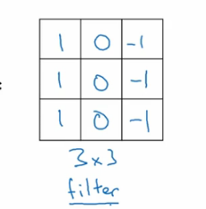

这是一个3*3的过滤器，是一个矩阵，数值如上所示。

假设我们有一个6*6的灰度图像：

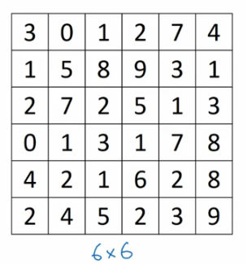

把这个图像与过滤器进行卷积运算，卷积运算在此处用“*”表示。


如图深蓝色区域所示，过滤器在图像左上方3*3的范围内，逐一加权相加，得到-5。

同理，将过滤器右移进行相同操作，再下移，直到过滤器对准图像右下角最后一格。依次运算得到一个4*4的矩阵。

在了解了过滤器以及卷积运算后，让我们看看为何过滤器能检测物体边缘：

举一个最简单的例子：


这张图片如上所示，左半边全是白的，右半边全是灰的，我们仍然使用之前的过滤器，对该图片进行卷积处理：

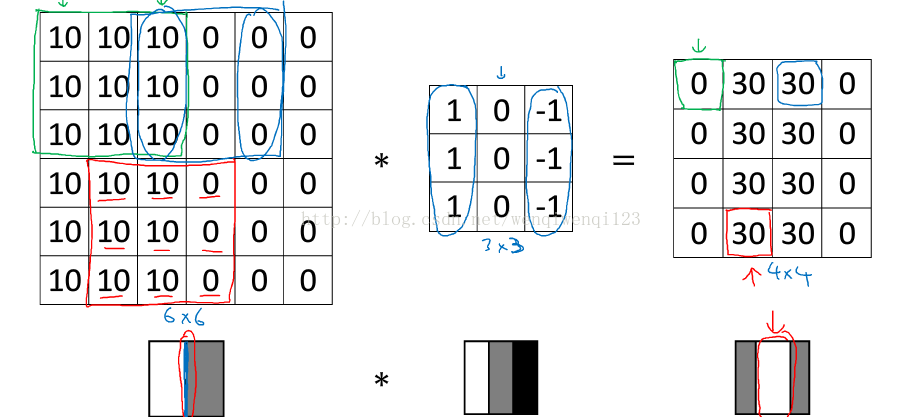

可以看到，最终得到的结果中间是一段白色，两边为灰色，于是垂直边缘被找到了。为什么呢？因为在6*6图像中红框标出来的部分，也就是图像中的分界线所在部分，与过滤器进行卷积，结果是30。而在不是分界线的所有部分进行卷积，结果都为0.

在这个图中，白色的分界线很粗，那是因为6\*6的图像尺寸过小，对于1000\*1000的图像，我们会发现在最终结果中，分界线较细但很明显。

这就是检测物体垂直边缘的例子，水平边缘的话只需将过滤器旋转90度。

## 5.3 卷积层中的几个基本参数？

在卷积层中，有一些我们常用的参数，定义如下

### 5.3.1 卷积核大小
英文名是Kernel Size:卷积核的大小定义了卷积的感受野。二维卷积的核大小选择通常是3，即3×3。
### 5.3.2 卷积核的步长
英文名是Stride: Stride定义了卷积核在卷积过程中的步长。虽然它的默认值通常为1，但我们可以将步长设置为2，可以实现类似于pooling的下采样功能。
### 5.3.3 边缘填充
英文名是Padding: Padding用于填充输入图像的边界。一个(半)填充的卷积将使空间输出维度与输入相等，而如果卷积核大于1，则对于未被填充的图像，卷积后将会使图像一些边界消失。
### 5.3.4 输入和输出通道
英文名是 Input/Output Channels 一个卷积层接受一定数量的输入通道I，并计算一个特定数量的输出通道O，这一层所需的参数可以由I*O*K计算，K等于卷积核中参数的数量。

## 5.4 卷积的网络类型分类？
### 5.4.1 普通卷积
普通卷积即如下图所示，使用一个固定大小的滤波器，对图像进行加权提特征。

### 5.4.2 扩张卷积
扩张卷积，又称为带孔（atrous）卷积或者空洞（dilated）卷积。在使用扩张卷积时，会引入一个称作扩张率（dilation rate）的参数。该参数定义了卷积核内参数间的行（列）间隔数。例如下图所示，一个3×3的卷积核，扩张率为2，它的感受野与5×5卷积核相同，而仅使用9个参数。这样做的好处是，在参数量不变的情况下，可以获得更大的感受野。扩张卷积在实时分割领域应用非常广泛。

### 5.4.3 转置卷积
转置卷积也就是反卷积（deconvolution）。虽然有些人经常直接叫它反卷积，但严格意义上讲是不合适的，因为它不符合一个反卷积的概念。反卷积确实存在，但它们在深度学习领域并不常见。一个实际的反卷积会恢复卷积的过程。想象一下，将一个图像放入一个卷积层中。现在把输出传递到一个黑盒子里，然后你的原始图像会再次出来。这个黑盒子就完成了一个反卷积。这是一个卷积层的数学逆过程。

一个转置的卷积在某种程度上是相似的，因为它产生的空间分辨率是跟反卷积后产生的分辨率相同。不同之处是在卷积核值上执行的实际数学操作。转置卷积层使用的是常规的卷积，但是它能够恢复其空间变换。

在这一点上，让我们来看一个具体的例子：
将5×5的图像送到一个卷积层。步长设置为2，无边界填充，而卷积核是3×3。结果得到了2×2的图像。如果我们想要逆向该过程，则需要数学上的逆运算，以便从输入的每个像素值中生成9个值。然后，我们将步长设置为2来遍历输出图像。这就是一个反卷积过程。
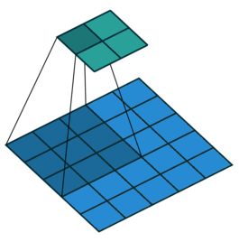
转置卷积的实现过程则不同。为了保证输出将是一个5×5的图像，在使用卷积运算时，我们需要在输入上执行一些特别的填充。而这一过程并不是逆转了卷积运算，它仅仅是重新构造了之前的空间分辨率并进行了卷积运算。这样的做法并不是数学上的逆过程，但是很适用于编码-解码器（Encoder-Decoder）架构。我们就可以把图像的上采样（upscaling）和卷积操作结合起来，而不是做两个分离的过程。
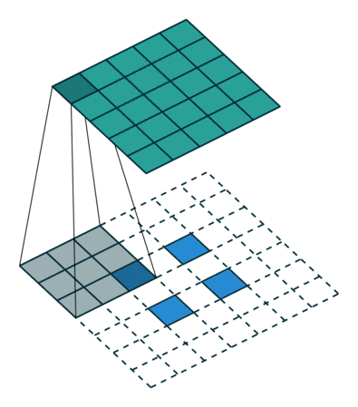

### 5.4.4 可分离卷积
在一个可分离卷积中，我们可以将内核操作拆分成多个步骤。我们用y = conv（x，k）表示卷积，其中y是输出图像，x是输入图像，k是核大小。这一步很简单。接下来，我们假设k可以由下面这个等式计算得出：k = k1.dot（k2）。这将使它成为一个可分离的卷积，因为我们可以通过对k1和k2做2个一维卷积来取得相同的结果，而不是用k做二维卷积。


以图像处理中的Sobel算子为例。你可以通过乘以向量[1，0，-1]和[1,2,1] .T获得相同的核大小。在执行相同的操作时，你只需要6个参数，而不是9个。上面的示例显示了所谓的空间可分离卷积。即将一个二维的卷积分离成两个一维卷积的操作。在神经网络中，为了减少网络参数，加速网络运算速度。我们通常使用的是一种叫深度可分离卷积的神经网络。
## 5.5 图解12种不同类型的2D卷积？

http://www.sohu.com/a/159591827_390227

## 5.6 2D卷积与3D卷积有什么区别？
### 5.6.1 2D卷积
二维卷积操作如图所示，为了更直观的说明，分别展示了单通道和多通道的操作。假定只使用了1个滤波器，即输出图像只有一个channel。其中，针对单通道，输入图像的channel为1，卷积核尺寸为 (k_h, k_w, 1)，卷积核在输入图像的空间维度上进行滑窗操作，每次滑窗和 (k_h, k_w)窗口内的值进行卷积操作，得到输出图像中的一个值。针对多通道，假定输入图像的channel为3，卷积核尺寸则为 (k_h, k_w, 3)，则每次滑窗与3个channels上的 (k_h, k_w)窗口内的所有值进行卷积操作，得到输出图像中的一个值。

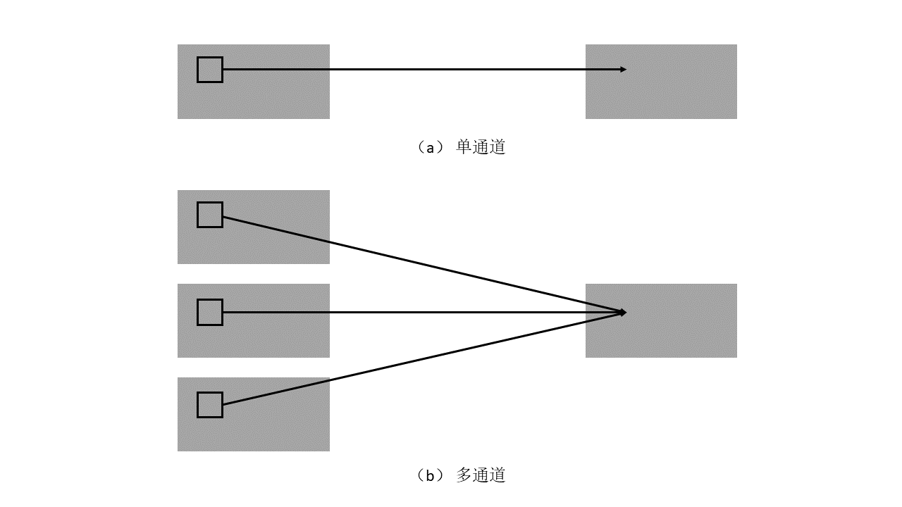
### 5.6.2 3D卷积
3D卷积操作如图所示，同样分为单通道和多通道，且假定只使用1个滤波器，即输出图像仅有一个channel。其中，针对单通道，与2D卷积不同之处在于，输入图像多了一个length维度，卷积核也多了一个k_l维度，因此3D卷积核的尺寸为（k_h, k_w, k_l)，每次滑窗与 (k_h, k_w, k_l)窗口内的值进行相关操作，得到输出3D图像中的一个值.针对多通道，则与2D卷积的操作一样，每次滑窗与3个channels上的 (k_h, k_w, k_l) 窗口内的所有值进行相关操作，得到输出3D图像中的一个值。

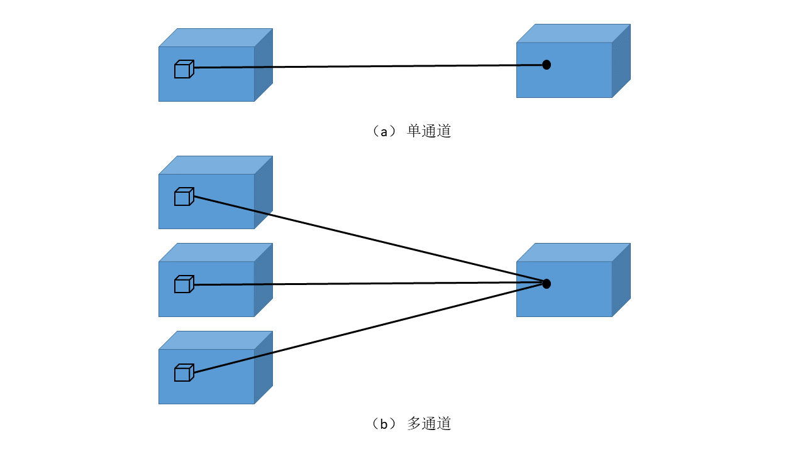

## 5.7 有哪些池化方法？
在构建卷积神经网络时，经常会使用池化操作，而池化层往往在卷积层后面，通过池化操作来降低卷积层输出的特征维度，同时可以防止过拟合现象。池化操作可以降低图像维度的原因，本质上是因为图像具有一种“静态性”的属性，这个意思是说在一个图像区域有用的特征极有可能在另一个区域同样有用。因此，为了描述一个大的图像，很直观的想法就是对不同位置的特征进行聚合统计。例如，可以计算图像在固定区域上特征的平均值 (或最大值)来代表这个区域的特征。[1]

### 5.7.1 一般池化（General Pooling）
池化操作与卷积操作不同，过程如下图。

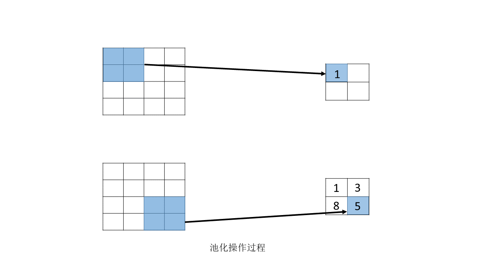
池化操作过程如图所示，对固定区域的特征，使用某一个值来表示。最常见的池化操作有两种，分为平均池化mean pooling和最大池化max pooling

1、平均池化：计算图像区域的平均值作为该区域池化后的值。

2、最大池化：选图像区域的最大值作为该区域池化后的值。

上述的池化过程，相邻的池化窗口间没有重叠部分。
### 5.7.2 重叠池化（General Pooling）
重叠池化即是一种相邻池化窗口之间会有重叠区域的池化技术。论文中[2]中，作者使用了重叠池化，其他的设置都不变的情况下，top-1和top-5 的错误率分别减少了0.4% 和0.3%。
### 5.7.3 空金字塔池化（Spatial Pyramid Pooling）
空间金字塔池化可以将任意尺度的图像卷积特征转化为相同维度，这不仅可以让CNN处理任意尺度的图像，还能避免cropping和warping操作，导致一些信息的丢失。一般的卷积神经网络都需要固定输入图像大小，这是因为全连接层的输入需要固定输入维度，但在卷积操作时并没有对图像大小有限制，所以作者提出了空间金字塔池化方法，先让图像进行卷积操作，然后使用SPP方法转化成维度相同的特征，最后输入到全连接层。


根据论文作者所述，空间金字塔池化的思想来自于Spatial Pyramid Model,它是将一个pooling过程变成了多个尺度的pooling。用不同大小的池化窗口作用于卷积特征，这样就可以得到1X1,2X2,4X4的池化结果，由于conv5中共有256个滤波器，所以得到1个256维的特征，4个256个特征，以及16个256维的特征，然后把这21个256维特征链接起来输入全连接层，通过这种方式把不同大小的图像转化成相同维度的特征。


对于不同的图像，如果想要得到相同大小的pooling结果，就需要根据图像大小动态的计算池化窗口大小和步长。假设conv5输出的大小为a*a，需要得到n*n大小的池化结果，可以让窗口大小sizeX为[a/n]，步长为[a/n]。下图展示了以conv5输出大小是13*13为例，spp算法的各层参数。


总结来说，SPP方法其实就是一种使用多个尺度的池化方法，可以获取图像中的多尺度信息。在卷积神经网络中加入SPP后，可以让CNN处理任意大小的输入，这让模型变得更加的灵活。

## 5.8 1x1卷积作用？
1×1的卷积主要有以下两个方面的作用：

1. 实现信息的跨通道交互和整合。

2. 对卷积核通道数进行降维和升维，减小参数量。

下面详细解释一下：
**第一点 实现信息的跨通道交互和整合**
对1×1卷积层的探讨最初是出现在NIN的结构，论文作者的动机是利用MLP代替传统的线性卷积核，从而提高网络的表达能力。文中从跨通道池化的角度进行解释，认为文中提出的MLP其实等价于在传统卷积核后面接cccp层，从而实现多个feature map的线性组合，实现跨通道的信息整合。而查看代码实现，cccp层即等价于1×1卷积层。
**第二点 对卷积核通道数进行降维和升维，减小参数量**
1x1卷积层能带来降维和升维的效果，在一系列的GoogLeNet中体现的最明显。对于每一个Inception模块（如下图），左图是原始模块，右图是加入1×1卷积进行降维的模块。虽然左图的卷积核都比较小，但是当输入和输出的通道数很大时，卷积核的参数量也会变的很大，而右图加入1×1卷积后可以降低输入的通道数，因此卷积核参数、运算复杂度也就大幅度下降。以GoogLeNet的3a模块为例，输入的feature map是28×28×192，3a模块中1×1卷积通道为64，3×3卷积通道为128,5×5卷积通道为32，如果是左图结构，那么卷积核参数为1×1×192×64+3×3×192×128+5×5×192×32，而右图对3×3和5×5卷积层前分别加入了通道数为96和16的1×1卷积层，这样卷积核参数就变成了1×1×192×64+（1×1×192×96+3×3×96×128）+（1×1×192×16+5×5×16×32），参数大约减少到原来的三分之一。同时在并行pooling层后面加入1×1卷积层后也可以降低输出的feature map数量，左图pooling后feature map是不变的，再加卷积层得到的feature map，会使输出的feature map扩大到416，如果每个模块都这样，网络的输出会越来越大。而右图在pooling后面加了通道数为32的1×1卷积，使得输出的feature map数降到了256。GoogLeNet利用1×1的卷积降维后，得到了更为紧凑的网络结构，虽然总共有22层，但是参数数量却只是8层AlexNet的十二分之一，当然其中也有丢掉全连接层的原因。


而非常经典的ResNet结构，同样也使用了1×1卷积，并且是在3×3卷积层的前后都使用了，不仅进行了降维，还进行了升维，使得卷积层的输入和输出的通道数都减小，参数数量进一步减少，如下图结构所示。


## 5.9 卷积层和池化层有什么区别？

首先可以从结构上可以看出，卷积之后输出层的维度减小，深度变深。但池化层深度不变。同时池化可以把很多数据用最大值或者平均值代替。目的是降低数据量。降低训练的参数。对于输入层，当其中像素在邻域发生微小位移时，池化层的输出是不变的，从而能提升鲁棒性。而卷积则是把数据通过一个卷积核变化成特征，便于后面的分离。

1:卷积

当从一个大尺寸图像中随机选取一小块，比如说 8x8 作为样本，并且从这个小块样本中学习到了一些特征，这时我们可以把从这个 8x8 样本中学习到的特征作为探测器，应用到这个图像的任意地方中去。特别是，我们可以用从 8x8 样本中所学习到的特征跟原本的大尺寸图像作卷积，从而对这个大尺寸图像上的任一位置获得一个不同特征的激活值。

下面给出一个具体的例子：假设你已经从一个 96x96 的图像中学习到了它的一个 8x8 的样本所具有的特征，假设这是由有 100 个隐含单元的自编码完成的。为了得到卷积特征，需要对 96x96 的图像的每个 8x8 的小块图像区域都进行卷积运算。也就是说，抽取 8x8 的小块区域，并且从起始坐标开始依次标记为（1，1），（1，2），...，一直到（89，89），然后对抽取的区域逐个运行训练过的稀疏自编码来得到特征的激活值。在这个例子里，显然可以得到 100 个集合，每个集合含有 89x89 个卷积特征。


2：说下池化，其实池化很容易理解，先看图：

转自：  http://blog.csdn.net/silence1214/article/details/11809947


比如上方左侧矩阵A是20*20的矩阵要进行大小为10*10的池化，那么左侧图中的红色就是10*10的大小，对应到右侧的矩阵，右侧每个元素的值，是左侧红色矩阵每个元素的值得和再处于红色矩阵的元素个数，也就是平均值形式的池化。

3：上面说了下卷积和池化，再说下计算中需要注意到的。在代码中使用的是彩色图，彩色图有3个通道，那么对于每一个通道来说要单独进行卷积和池化，有一个地方尤其是进行卷积的时候要注意到，隐藏层的每一个值是对应到一幅图的3个通道穿起来的，所以分3个通道进行卷积之后要加起来，正好才能对应到一个隐藏层的神经元上，也就是一个feature上去。

## 5.10 卷积核是否一定越大越好？
首先，给出答案。不是。
在AlexNet网络结构中，用到了一些非常大的卷积核，比如11×11、5×5卷积核。之前研究者的想法是，卷积核越大，receptive field（感受野）越大，因此获得的特征越好。虽说如此，但是大的卷积核会导致计算量大幅增加，不利于训练更深层的模型，而相应的计算性能也会降低。于是在VGG、Inception网络中，实验发现利用2个3×3卷积核的组合比1个5×5卷积核的效果更佳，同时参数量（3×3×2+1 VS 5×5×1+1）会更少，因此后来3×3卷积核被广泛应用在各种模型中。

多个小卷积核的叠加使用远比一个大卷积核单独使用效果要好的多，在连通性不变的情况下，大大降低了参数量和计算复杂度。当然，卷积核也不是越小越好，对于特别稀疏的数据，当使用比较小的卷积核的时候可能无法表示其特征，如果采用较大的卷积核则会导致复杂度极大的增加。

总而言之，我们多倾向于选择多个相对小的卷积核来进行卷积。

## 5.11 每层卷积是否只能用一种尺寸的卷积核？
经典的神经网络，都属于层叠式网络，并且每层仅用一个尺寸的卷积核，例如VGG结构中使用了大量的3×3卷积层。事实上，同一层feature map可以分别使用多个不同尺寸的卷积核，以获得不同尺度的特征，再把这些特征结合起来，得到的特征往往比使用单一卷积核的要好，例如GoogLeNet、Inception系列的网络，均是每层使用了多个卷积核结构。如下图所示，输入的feature map在同一层，分别经过1×1、3×3、5×5三种不同尺寸的卷积核，再将分别得到的特征进行组合。


## 5.12 怎样才能减少卷积层参数量？

发明GoogleNet的团队发现，如果仅仅引入多个尺寸的卷积核，会带来大量的额外的参数，受到Network In Network中1×1卷积核的启发，为了解决这个问题，他们往Inception结构中加入了一些1×1的卷积核，如图所示：


加入1×1卷积核的Inception结构


根据上图，我们来做个对比计算，假设输入feature map的维度为256维，要求输出维度也是256维。有以下两种操作：  
* （1）256维的输入直接经过一个3×3×256的卷积层，输出一个256维的feature map，那么参数量为：256×3×3×256 = 589,824  
* （2）256维的输入先经过一个1×1×64的卷积层，再经过一个3×3×64的卷积层，最后经过一个1×1×256的卷积层，输出256维，参数量为：256×1×1×64 + 64×3×3×64 + 64×1×1×256 = 69,632。足足把第一种操作的参数量降低到九分之一！

1×1卷积核也被认为是影响深远的操作，往后大型的网络为了降低参数量都会应用上1×1卷积核。

## 5.13 在进行卷积操作时，必须同时考虑通道和区域吗？

标准的卷积过程可以看上图，一个2×2的卷积核在卷积时，对应图像区域中的所有通道均被同时考虑，那么问题来了，为什么一定要同时考虑图像区域和通道呢？能不能将通道和空间区域分开考虑？

Xception网络由此诞生。我们首先对每一个通道进行各自的卷积操作，有多少个通道就有多少个过滤器。得到新的通道feature maps之后，这时再对这批新的通道feature maps进行标准的1×1跨通道卷积操作。这种操作被称为 “DepthWise convolution”，称为深度可分离卷积。在imagenet 1000类分类任务中取得了非常鲁棒的效果，同时也减少了大量的参数。我们可以通过一个例子来算一算，使用深度可分离卷积，能d假设输入通道数为3，要求输出通道数为256。 
1.  使用标准的卷积操作，使用3×3×256的卷积核，参数量为：3×3×3×256 = 6,912  
2.  使用深度可分离的结构，分两步完成。参数量为：3×3×3 + 3×1×1×256 = 795。
参数量仅为标准卷积的九分之一！ 因此，使用depthwise操作比标准的卷积操作，在降低不少参数量的同时，得到了更好的分类效果。

## 5.14 采用宽卷积的好处有什么？

### 5.14.1 窄卷积和宽卷积

对于窄卷积来说，是从第一个点开始做卷积，每次窗口滑动固定步幅。比如下图左部分为窄卷积。那么注意到越在边缘的位置被卷积的次数越少。于是有了宽卷积的方法，可以看作在卷积之前在边缘用0补充，常见有两种情况，一个是全补充，入下图右部分，这样输出大于输入的维度。另一种常用的方法是补充一部0值，使得输出和输入的维度一致。这里文中给了一个公式 。这里npadding在全补充里是filter-1，在输入输出相等时，就要主要奇偶性了，注意到卷积核常为奇数。


### 5.14.2 为什么采用宽卷积？

 通过将输入边角的值纳入到滑窗中心进行计算，以便损失更少的信息。

## 5.15 在卷积操作后，输出特征图（图像）大小如何计算？
在进行卷积操作时，往往根据需要，我们需设定一些参数。常见的参数有卷积核大小k, 窗口滑动的步长s, 进行填充的像素p, 假设输入特征图大小为Iw*Iw。则由以下公式可计算出输出特征图的大小Ow。

O_w = \frac{(I_w - k + 2p))}{s} + 1

## 5.16 如何得到卷积层输出的深度？

参数共享：在卷积层中使用参数共享是用来控制参数的数量。假设在第一个卷积层就有55x55x96=290,400个神经元，每个有11x11x3=364个参数和1个偏差。将这些合起来就是290400x364=105,705,600个参数。单单第一层就有这么多参数，显然这个数目是非常大的。

作一个合理的假设：如果一个特征在计算某个空间位置(x,y)的时候有用，那么它在计算另一个不同位置(x2,y2)的时候也有用。基于这个假设，可以显著地减少参数数量。换言之，就是将深度维度上一个单独的2维切片看做深度切片（depth slice），比如一个数据体尺寸为[55x55x96]的就有96个深度切片，每个尺寸为[55x55]。在每个深度切片上的神经元都使用同样的权重和偏差。在这样的参数共享下，例子中的第一个卷积层就只有96个不同的权重集了，一个权重集对应一个深度切片，共有96x11x11x3=34,848个不同的权重，或34,944个参数（+96个偏差）。

```w_conv1=weight_variable([5,5,1,32])```

可以看出，上面的32表示的是卷积层输出的深度，因为大家都明白width和height都可以通过公式计算得到，但是很多文献都没有告诉深度是如何得到的，下面是我的认识： 

1. 因为这个深度是没有公式可以计算出来的，因为深度是一个经验值，如上面代码的32 ，其实是一个经验值，是通过调整参数发现32是一个最合适的值，可以得到最好的准确率，但是不同的图像的深度是不一样的。
2. 这个深度表示用了多少个卷积核，下面这个图可以说明一下：

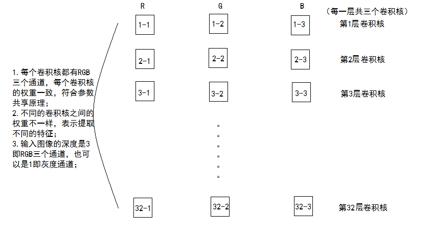

上图就可以很有效的说明 ：卷积层输出的深度==卷积核的个数。

## 5.17 激活函数通常放在卷积神经网络的哪个操作之后？

 通常放在卷积层之后。

## 5.18 如何理解最大池化层有几分缩小？

池化层：对输入的特征图进行压缩，一方面使特征图变小，简化网络计算复杂度；一方面进行特征压缩，提取主要特征。

池化操作一般有两种，一种是Avy Pooling,一种是max Pooling。


同样地采用一个2*2的filter,max pooling是在每一个区域中寻找最大值，这里的stride=2,最终在原特征图中提取主要特征得到右图。  

>注1：（Avy pooling现在不怎么用了，方法是对每一个2*2的区域元素求和，再除以4，得到主要特征），而一般的filter取2*2,最大取3*3,stride取2，压缩为原来的1/4.  
>注2：这里的pooling操作是特征图缩小，有可能影响网络的准确度，因此可以通过增加特征图的深度来弥补。

## 5.19 理解图像卷积与反卷积

### 5.19.1 图像卷积

首先给出一个输入输出结果


那他是怎样计算的呢？

卷积的时候需要对卷积核进行180的旋转，同时卷积核中心与需计算的图像像素对齐，输出结构为中心对齐像素的一个新的像素值，计算例子如下：


这样计算出左上角(即第一行第一列)像素的卷积后像素值。

给出一个更直观的例子，从左到右看，原像素经过卷积由1变成-8。

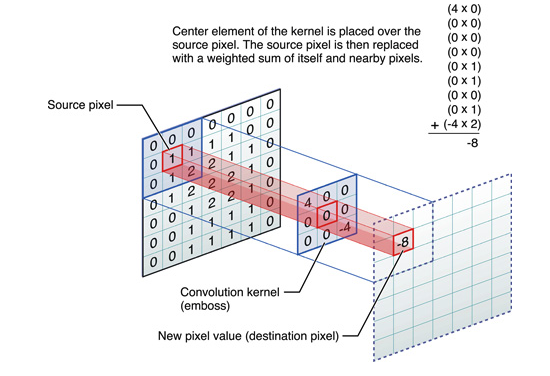

通过滑动卷积核，就可以得到整张图片的卷积结果


### 5.19.2 图像反卷积

这里提到的反卷积跟1维信号处理的反卷积计算是很不一样的，FCN作者称为backwards convolution，有人称Deconvolution layer is a very unfortunate name and should rather be called a transposed convolutional layer. 我们可以知道，在CNN中有con layer与pool layer，con layer进行对图像卷积提取特征，pool layer 对图像缩小一半筛选重要特征，对于经典的图像识别CNN网络，如IMAGENET，最后输出结果是1X1X1000，1000是类别种类，1x1得到的是。FCN作者，或者后来对end to end研究的人员，就是对最终1x1的结果使用反卷积（事实上FCN作者最后的输出不是1X1，是图片大小的32分之一，但不影响反卷积的使用）。

这里图像的反卷积与full卷积原理是一样的，使用了这一种反卷积手段使得图像可以变大，FCN作者使用的方法是这里所说反卷积的一种变体，这样就可以获得相应的像素值，图像可以实现end to end。


这里说另外一种反卷积做法，假设原图是3*3，首先使用上采样让图像变成7*7，可以看到图像多了很多空白的像素点。使用一个3*3的卷积核对图像进行滑动步长为1的valid卷积，得到一个5*5的图像，我们知道的是使用上采样扩大图片，使用反卷积填充图像内容，使得图像内容变得丰富，这也是CNN输出end to end结果的一种方法。韩国作者Hyeonwoo Noh使用VGG16层CNN网络后面加上对称的16层反卷积与上采样网络实现end to end 输出，其不同层上采样与反卷积变化效果如下：

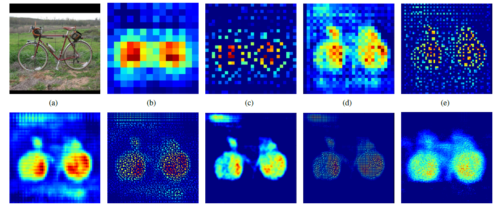

经过上面的解释与推导，对卷积有基本的了解，但是在图像上的deconvolution究竟是怎么一回事，可能还是不能够很好的理解，因此这里再对这个过程解释一下。 目前使用得最多的deconvolution有2种，上文都已经介绍。  

* 方法1：full卷积， 完整的卷积可以使得原来的定义域变大。
* 方法2：记录pooling index，然后扩大空间，再用卷积填充。

图像的deconvolution过程如下：


输入：2x2， 卷积核：4x4， 滑动步长：3， 输出：7x7 

即输入为2x2的图片经过4x4的卷积核进行步长为3的反卷积的过程 

1. 输入图片每个像素进行一次full卷积，根据full卷积大小计算可以知道每个像素的卷积后大小为 1+4-1=4， 即4x4大小的特征图，输入有4个像素所以4个4x4的特征图 
2. 将4个特征图进行步长为3的fusion（即相加）； 例如红色的特征图仍然是在原来输入位置（左上角），绿色还是在原来的位置（右上角），步长为3是指每隔3个像素进行fusion，重叠部分进行相加，即输出的第1行第4列是由红色特阵图的第一行第四列与绿色特征图的第一行第一列相加得到，其他如此类推。  

可以看出翻卷积的大小是由卷积核大小与滑动步长决定， in是输入大小， k是卷积核大小， s是滑动步长， out是输出大小 得到 out = (in - 1) * s + k 上图过程就是， (2 - 1) * 3 + 4 = 7

## 5.20 不同卷积后图像大小计算？

### 5.20.1 类型划分

2维卷积的计算分为了3类：1.full   2.same   3. valid

1、**full**


蓝色为原图像，白色为对应卷积所增加的padding，通常全部为0，绿色是卷积后图片。图6的卷积的滑动是从卷积核右下角与图片左上角重叠开始进行卷积，滑动步长为1，卷积核的中心元素对应卷积后图像的像素点。可以看到卷积后的图像是4X4，比原图2X2大了，我们还记1维卷积大小是n1+n2-1，这里原图是2X2，卷积核3X3，卷积后结果是4X4，与一维完全对应起来了。其实这才是完整的卷积计算，其他比它小的卷积结果都是省去了部分像素的卷积

2、**same**

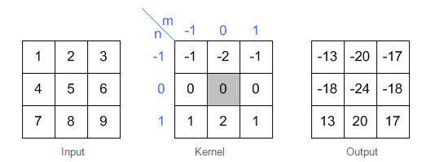

3、**valid**


### 5.20.2 计算公式

这里，我们可以总结出full，same，valid三种卷积后图像大小的计算公式：

1. full: 滑动步长为1，图片大小为N1xN1，卷积核大小为N2xN2，卷积后图像大小：N1+N2-1 x N1+N2-1。
2. same: 滑动步长为1，图片大小为N1xN1，卷积核大小为N2xN2，卷积后图像大小：N1xN1。
3. valid:滑动步长为S，图片大小为N1xN1，卷积核大小为N2xN2，卷积后图像大小：(N1-N2)/S+1 x (N1-N2)/S+1。

## 5.21 步长、填充大小与输入输出关系总结？

在设计深度学习网络的时候，需要计算输入尺寸和输出尺寸，那么就要设计卷积层的的各种参数。这里有一些设计时候的计算公式，方便得到各层的参数。

这里简化下，约定：


### 5.21.1 没有0填充，单位步长


### 5.21.2 零填充，单位步长

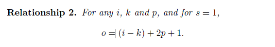

<1>半填充


<2>全填充


参考图如下图所示

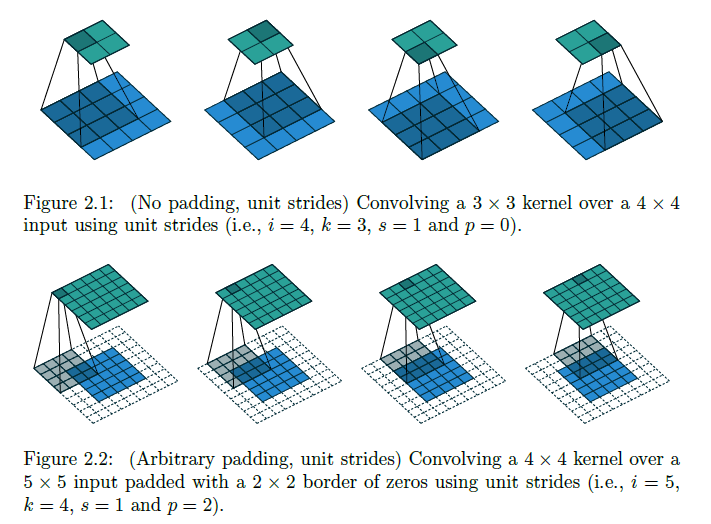


### 5.21.3 不填充，非单位步长

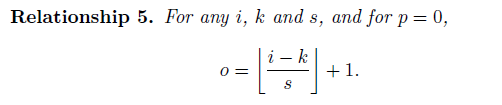

### 5.21.4 零填充，非单位步长


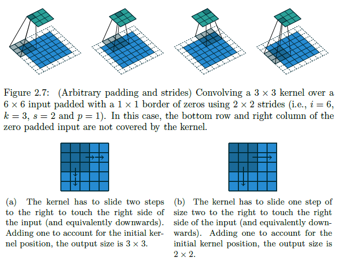


http://blog.csdn.net/u011692048/article/details/77572024
https://arxiv.org/pdf/1603.07285.pdf

## 5.22 理解反卷积和棋盘效应

### 5.22.1 为什么出现棋盘现象？

图像生成网络的上采样部分通常用反卷积网络，不合理的卷积核大小和步长会使反卷积操作产生棋盘效应 (checkerboard artifacts)。

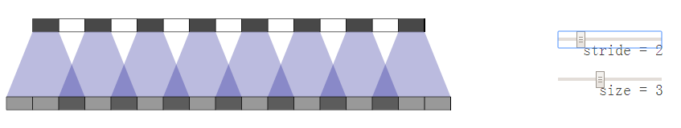


重叠图案也在二维中形成。两个轴上的不均匀重叠相乘，产生不同亮度的棋盘状图案。

事实上，不均匀重叠往往在二维上更极端！因为两个模式相乘，所以它的不均匀性是原来的平方。例如，在一个维度中，一个步长为2，大小为3的反卷积的输出是其输入的两倍，但在二维中，输出是输入的4倍。

现在，生成图像时，神经网络通常使用多层反卷积，从一系列较低分辨率的描述中迭代建立更大的图像。虽然这些堆栈的反卷积可以消除棋盘效应，但它们经常混合，在更多尺度上产生棋盘效应。

直观地看，假设生成的图像中包含1只黑猫。黑猫身体部分的像素颜色应平滑过渡，或极端地说，该部分应全为黑色。实际生成的图像中该部分却有深深浅浅的近黑方块组成，很像棋盘的网格，即棋盘效应。

https://distill.pub/2016/deconv-checkerboard/
http://blog.csdn.net/shadow_guo/article/details/52862161

### 5.22.2 有哪些方法可以避免棋盘效应？

（1）第一种方法是用到的反卷积核的大小可被步长整除，从而避免重叠效应。与最近成功用于图像超分辨率的技术“子像素卷积”（sub-pixel convolution）等价。


（2）另一种方法是从卷积操作中分离出对卷积后更高分辨率的特征图上采样来计算特征。例如，可以先缩放图像（最近邻插值或双线性插值），再卷积。


反卷积与不同缩放卷积方法都是线性操作，并可用矩阵去解释。对于每个输出窗口，反卷积操作的输入唯一，缩放卷积会以阻碍高频棋盘效应的方式来隐式地集中权重（weight-tying）。

#### 缩放卷积

缩放卷积为线性操作：假设原图像为A，经过插值后的图像为A+B；用卷积核C对插值缩放后的图像卷积，得到最终的图像 ，其中*为卷积操作。则可将缩放卷积分解为原图像卷积和插值增量图像卷积，或卷积的原图像和卷积的插值增量图像。

C为卷积操作的卷积核。此时为上采样，理解为反卷积操作中的卷积核。

（1）最近邻缩放卷积


发现，插值增量图像表示的矩阵为原图像表示的矩阵下移1行。可将原图像矩阵看成环形队列（队列最后1行的输出送入队列的第1行）。

（2）双线性缩放卷积


发现，插值增量图像可细分为原图像表示的矩阵下移1行后乘以1/2与原图像表示的矩阵上移1行后乘以1/2。

## 5.23 CNN主要的计算瓶颈

CNN的训练主要是在卷积层和子采样层的交互上，其主要的计算瓶颈是：
* 1）前向传播过程：下采样每个卷积层的maps；
* 2）反向传播过程：上采样高层子采样层的灵敏度map，以匹配底层的卷积层输出maps的大小；
* 3）sigmoid的运用和求导。

举例： 

对于第一和第二个问题，我们考虑的是如何用Matlab内置的图像处理函数去实现上采样和下采样的操作。对于上采样，imresize函数可以搞定，但需要很大的开销。一个比较快速的版本是使用Kronecker乘积函数kron。通过一个全一矩阵ones来和我们需要上采样的矩阵进行Kronecker乘积，就可以实现上采样的效果。对于前向传播过程中的下采样，imresize并没有提供在缩小图像的过程中还计算nxn块内像素的和的功能，所以没法用。一个比较好和快速的方法是用一个全一的卷积核来卷积图像，然后简单的通过标准的索引方法来采样最后卷积结果。例如，如果下采样的域是2x2的，那么我们可以用2x2的元素全是1的卷积核来卷积图像。然后再卷积后的图像中，我们每个2个点采集一次数据，y=x(1:2:end,1:2:end)，这样就可以得到了两倍下采样，同时执行求和的效果。

对于第三个问题，实际上有些人以为Matlab中对sigmoid函数进行inline的定义会更快，其实不然，Matlab与C/C++等等语言不一样，Matlab的inline反而比普通的函数定义更费时间。所以，我们可以直接在代码中使用计算sigmoid函数及其导数的真实代码。

## 5.24 卷积神经网络的经验参数设置
对于卷积神经网络的参数设置，没有很明确的指导原则，以下仅是一些经验集合。

1、learning-rate 学习率：学习率越小，模型收敛花费的时间就越长，但是可以逐步稳健的提高模型精确度。一般初始设置为0.1，然后每次除以0.2或者0.5来改进，得到最终值；

2、batch-size 样本批次容量：影响模型的优化程度和收敛速度，需要参考你的数据集大小来设置，具体问题具体分析，一般使用32或64，在计算资源允许的情况下，可以使用大batch进行训练。有论文提出，大batch可以加速训练速度，并取得更鲁棒的结果；

3、weight-decay 权重衰减：用来在反向传播中更新权重和偏置，一般设置为0.005或0.001；

4、epoch-number 训练次数：包括所有训练样本的一个正向传递和一个反向传递，训练至模型收敛即可；（注：和迭代次数iteration不一样）
总之，不是训练的次数越多，测试精度就会越高。会有各种原因导致过拟合，比如一种可能是预训练的模型太复杂，而使用的数据集样本数量太少，种类太单一。

## 5.25 提高泛化能力的方法总结（代码示例）
本节主要以代码示例来说明可以提高网络泛化能力的方法。
代码实验是基于mnist数据集，mnist是一个从0到9的手写数字集合，共有60000张训练图片，10000张测试图片。每张图片大小是28*28大小。目的就是通过各种手段，来构建一个高精度的分类神经网络。 
### 5.25.1 手段
一般来说，提高泛化能力的方法主要有以下几个：
> * 使用正则化技术
> * 增加神经网络层数
> * 使用恰当的代价函数
> * 使用权重初始化技术
> * 人为增广训练集
> * 使用dropout技术 

### 5.25.2 主要方法
下面我们通过实验结果来判断每种手段的效果。

（1）普通的全连接神经网络 
网络结构使用一个隐藏层，其中包含100个隐藏神经元，输入层是784，输出层是one-hot编码的形式，最后一层是Softmax层。损失函数采用对数似然代价函数，60次迭代，学习速率η=0.1，随机梯度下降的小批量数据（mini-SGD）大小为10，没使用正则化。在测试集上得到的结果是97.8%，代码如下：
```python
>>> import network3 
>>> from network3 import Network 
>>> from network3 import ConvPoolLayer, FullyConnectedLayer, SoftmaxLayer 
>>> training_data, validation_data, test_data = network3.load_data_shared() 
>>> mini_batch_size = 10 
>>> net = Network([FullyConnectedLayer(n_in=784, n_out=100),
         SoftmaxLayer(n_in=100, n_out=10)], mini_batch_size) 
>>> net.SGD(training_data, 60, mini_batch_size, 0.1, validation_data, test_data)
```
（2）使用卷积神经网络 — 仅一个卷积层
输入层是卷积层，卷积核大小是5*5，一共20个特征映射。最大池化层的大小为2*2。后面接一层100个隐藏神经元的全连接层。结构如图所示

在这个结构中，我们把卷积层和池化层看做是训练图像的特征提取，而后的全连接层则是一个更抽象层次的特征提取，整合全局信息。同样设定是60次迭代，批量数据大小是10，学习率是0.1.代码如下，
```python
>>> net = Network([
        ConvPoolLayer(image_shape=(mini_batch_size, 1, 28, 28), 
                      filter_shape=(20, 1, 5, 5), 
                      poolsize=(2, 2)),
        FullyConnectedLayer(n_in=20*12*12, n_out=100),
        SoftmaxLayer(n_in=100, n_out=10)], mini_batch_size)
>>> net.SGD(training_data, 60, mini_batch_size, 0.1, 
            validation_data, test_data)
```
经过三次运行取平均后，准确率是98.78%，提高得较多。错误率降低了1/3。

（3）使用卷积神经网络 — 两个卷积层  
我们接着插入第二个卷积层，把它插入在之前结构的池化层和全连接层之间，同样是使用5*5的局部感受野，2*2的池化层。
```python
>>> net = Network([
        ConvPoolLayer(image_shape=(mini_batch_size, 1, 28, 28), 
                      filter_shape=(20, 1, 5, 5), 
                      poolsize=(2, 2)),
        ConvPoolLayer(image_shape=(mini_batch_size, 20, 12, 12), 
                      filter_shape=(40, 20, 5, 5), 
                      poolsize=(2, 2)),
        FullyConnectedLayer(n_in=40*4*4, n_out=100),
        SoftmaxLayer(n_in=100, n_out=10)], mini_batch_size)
>>> net.SGD(training_data, 60, mini_batch_size, 0.1, validation_data, test_data) 
```
这一次，准确率达到了99.06%。

（4）使用卷积神经网络 — 两个卷积层+线性修正单元(ReLU)+正则化
上面的网络结构，我们使用的是Sigmod激活函数，现在我们换成线性修正激活函数ReLU ，同样设定参数为60次迭代，学习速率η=0.03，使用L2正则化，正则化参数λ=0.1，代码如下：
```python
>>> from network3 import ReLU
>>> net = Network([
        ConvPoolLayer(image_shape=(mini_batch_size, 1, 28, 28), 
                      filter_shape=(20, 1, 5, 5), 
                      poolsize=(2, 2), 
                      activation_fn=ReLU),
        ConvPoolLayer(image_shape=(mini_batch_size, 20, 12, 12), 
                      filter_shape=(40, 20, 5, 5), 
                      poolsize=(2, 2), 
                      activation_fn=ReLU),
        FullyConnectedLayer(n_in=40*4*4, n_out=100, activation_fn=ReLU),
        SoftmaxLayer(n_in=100, n_out=10)], mini_batch_size)
>>> net.SGD(training_data, 60, mini_batch_size, 0.03, 
            validation_data, test_data, lmbda=0.1)
```
这一次，准确率达到了99.23%，超过了使用sigmoid激活函数的99.06%. ReLU的优势是当取最大极限时，梯度不会饱和。

（5）卷积神经网络 —两个卷基层+线性修正单元(ReLU)+正则化+拓展数据集
拓展训练集数据的一个简单方法是将每个训练图像由一个像素来代替，无论是上一个像素，下一个像素，或者左右的像素。其他的方法也有改变亮度，改变分辨率，图片旋转，扭曲，位移等。我们把50000幅图像人为拓展到250000幅图像。使用与第四小节一样的网络，因为我们训练时使用了5倍的数据，所以减少了过拟合的风险。
```python
>>> expanded_training_data, _, _ = network3.load_data_shared(
        "../data/mnist_expanded.pkl.gz")
>>> net = Network([
        ConvPoolLayer(image_shape=(mini_batch_size, 1, 28, 28), 
                      filter_shape=(20, 1, 5, 5), 
                      poolsize=(2, 2), 
                      activation_fn=ReLU),
        ConvPoolLayer(image_shape=(mini_batch_size, 20, 12, 12), 
                      filter_shape=(40, 20, 5, 5), 
                      poolsize=(2, 2), 
                      activation_fn=ReLU),
        FullyConnectedLayer(n_in=40*4*4, n_out=100, activation_fn=ReLU),
        SoftmaxLayer(n_in=100, n_out=10)], mini_batch_size)
>>> net.SGD(expanded_training_data, 60, mini_batch_size, 0.03, 
            validation_data, test_data, lmbda=0.1)
```
这次得到了99.37的训练正确率。

（6）卷积神经网络 — 两个卷基层+线性修正单元(ReLU)+正则化+拓展数据集+继续插入额外的全连接层
继续上面的网络，我们拓展全连接层的规模，使用300个隐藏神经元和1000个神经元的额精度分别是99.46%和99.43%. 
```python
>>> net = Network([
        ConvPoolLayer(image_shape=(mini_batch_size, 1, 28, 28), 
                      filter_shape=(20, 1, 5, 5), 
                      poolsize=(2, 2), 
                      activation_fn=ReLU),
        ConvPoolLayer(image_shape=(mini_batch_size, 20, 12, 12), 
                      filter_shape=(40, 20, 5, 5), 
                      poolsize=(2, 2), 
                      activation_fn=ReLU),
        FullyConnectedLayer(n_in=40*4*4, n_out=100, activation_fn=ReLU),
        FullyConnectedLayer(n_in=100, n_out=100, activation_fn=ReLU),
        SoftmaxLayer(n_in=100, n_out=10)], mini_batch_size)
>>> net.SGD(expanded_training_data, 60, mini_batch_size, 0.03, 
            validation_data, test_data, lmbda=0.1)
```
这次取得了99.43%的精度。拓展后的网络并没有帮助太多。

（7）卷积神经网络 — 两个卷基层+线性修正单元(ReLU)+拓展数据集+继续插入额外的全连接层+dropout技术
dropout的基本思想就是在训练网络时随机的移除单独的激活值，使得模型更稀疏，不太依赖于训练数据的特质。我们尝试应用dropout到最终的全连接层(而不是在卷积层)。由于训练时间，将迭代次数设置为40，全连接层使用1000个隐藏神经元，因为dropout会丢弃一些神经元。Dropout是一种非常有效且能提高泛化能力，降低过拟合的方法！
```python
>>> net = Network([
        ConvPoolLayer(image_shape=(mini_batch_size, 1, 28, 28), 
                      filter_shape=(20, 1, 5, 5), 
                      poolsize=(2, 2), 
                      activation_fn=ReLU),
        ConvPoolLayer(image_shape=(mini_batch_size, 20, 12, 12), 
                      filter_shape=(40, 20, 5, 5), 
                      poolsize=(2, 2), 
                      activation_fn=ReLU),
        FullyConnectedLayer(
            n_in=40*4*4, n_out=1000, activation_fn=ReLU, p_dropout=0.5),
        FullyConnectedLayer(
            n_in=1000, n_out=1000, activation_fn=ReLU, p_dropout=0.5),
        SoftmaxLayer(n_in=1000, n_out=10, p_dropout=0.5)], 
        mini_batch_size)
>>> net.SGD(expanded_training_data, 40, mini_batch_size, 0.03, 
            validation_data, test_data)
```
使用dropout，得到了99.60%的准确率。

（8）卷积神经网络 — 两个卷基层+线性修正单元(ReLU)+正则化+拓展数据集+继续插入额外的全连接层+弃权技术+组合网络
组合网络类似于随机森林或者adaboost的集成方法，创建几个神经网络，让他们投票来决定最好的分类。我们训练了5个不同的神经网络，每个都大到了99.60%的准去率，用这5个网络来进行投票表决一个图像的分类。 
采用这种集成方法，精度又得到了微小的提升，达到了99.67%。

## 5.26 CNN在CV与NLP领域运用的联系与区别？

### 5.26.1 联系

自然语言处理是对一维信号（词序列）做操作。
计算机视觉是对二维（图像）或三维（视频流）信号做操作。

### 5.26.2 区别

自然语言处理的输入数据通常是离散取值（例如表示一个单词或字母通常表示为词典中的one hot向量），计算机视觉则是连续取值（比如归一化到0，1之间的灰度值）。CNN有两个主要特点，区域不变性(location invariance)和组合性(Compositionality)。

1. 区域不变性：滤波器在每层的输入向量(图像)上滑动，检测的是局部信息，然后通过pooling取最大值或均值。pooling这步综合了局部特征，失去了每个特征的位置信息。这很适合基于图像的任务，比如要判断一幅图里有没有猫这种生物，你可能不会去关心这只猫出现在图像的哪个区域。但是在NLP里，词语在句子或是段落里出现的位置，顺序，都是很重要的信息。
2. 局部组合性：CNN中，每个滤波器都把较低层的局部特征组合生成较高层的更全局化的特征。这在CV里很好理解，像素组合成边缘，边缘生成形状，最后把各种形状组合起来得到复杂的物体表达。在语言里，当然也有类似的组合关系，但是远不如图像来的直接。而且在图像里，相邻像素必须是相关的，相邻的词语却未必相关。

## 5.27 卷积神经网络凸显共性的方法？
### 5.27.1 局部连接
我们首先了解一个概念，感受野，即每个神经元仅与输入神经元相连接的一块区域。
在图像卷积操作中，神经元在空间维度上是局部连接，但在深度上是全连接。局部连接的思想，是受启发于生物学里的视觉系统结构，视觉皮层的神经元就是仅用局部接受信息。对于二维图像，局部像素关联性较强。这种局部连接保证了训练后的滤波器能够对局部特征有最强的响应，使神经网络可以提取数据的局部特征；
下图是一个很经典的图示，左边是全连接，右边是局部连接。


对于一个1000 × 1000的输入图像而言，如果下一个隐藏层的神经元数目为10^6个，采用全连接则有1000 × 1000 × 10^6 = 10^12个权值参数，如此巨大的参数量几乎难以训练；而采用局部连接，隐藏层的每个神经元仅与图像中10 × 10的局部图像相连接，那么此时的权值参数数量为10 × 10 × 10^6 = 10^8，将直接减少4个数量级。

### 5.27.2 权值共享
权值共享，即计算同一深度的神经元时采用的卷积核参数是共享的。权值共享在一定程度上讲是有意义的，是由于在神经网络中，提取的底层边缘特征与其在图中的位置无关。但是在另一些场景中是无意的，如在人脸识别任务，我们期望在不同的位置学到不同的特征。
需要注意的是，权重只是对于同一深度切片的神经元是共享的。在卷积层中，通常采用多组卷积核提取不同的特征，即对应的是不同深度切片的特征，而不同深度切片的神经元权重是不共享。相反，偏置这一权值对于同一深度切片的所有神经元都是共享的。
权值共享带来的好处是大大降低了网络的训练难度。如下图，假设在局部连接中隐藏层的每一个神经元连接的是一个10 × 10的局部图像，因此有10 × 10个权值参数，将这10 × 10个权值参数共享给剩下的神经元，也就是说隐藏层中10^6个神经元的权值参数相同，那么此时不管隐藏层神经元的数目是多少，需要训练的参数就是这 10 × 10个权值参数（也就是卷积核的大小）。


这里就体现了卷积神经网络的奇妙之处，使用少量的参数，却依然能有非常出色的性能。上述仅仅是提取图像一种特征的过程。如果要多提取出一些特征，可以增加多个卷积核，不同的卷积核能够得到图像不同尺度下的特征，称之为特征图（feature map）。

### 5.27.3 池化操作

池化操作与多层次结构一起，实现了数据的降维，将低层次的局部特征组合成为较高层次的特征，从而对整个图片进行表示。如下图：

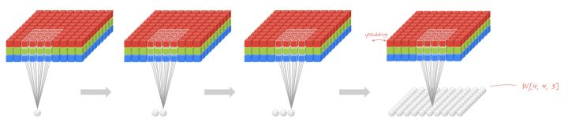

## 5.28 全卷积与Local-Conv的异同点

如果每一个点的处理使用相同的Filter，则为全卷积，如果使用不同的Filter，则为Local-Conv。

## 5.29 举例理解Local-Conv的作用
并不是所有的卷积都会进行权重共享，在某些特定任务中，会使用不权重共享的卷积。下面通过人脸这一任务来进行讲解。在读人脸方向的一些paper时，会发现很多都会在最后加入一个Local Connected Conv，也就是不进行权重共享的卷积层。总的来说，这一步的作用就是使用3D模型来将人脸对齐，从而使CNN发挥最大的效果。
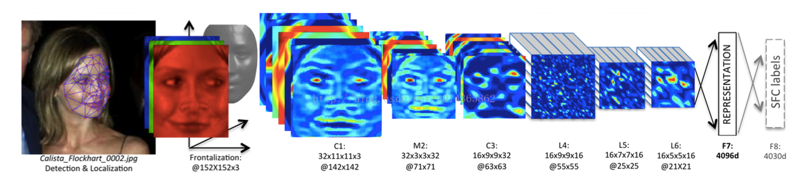

截取论文中的一部分图，经过3D对齐以后，形成的图像均是152×152，输入到上述的网络结构中。该结构的参数如下：

Conv：32个11×11×3的卷积核

max-pooling: 3×3，stride=2，

Conv: 16个9×9的卷积核，

Local-Conv: 16个9×9的卷积核，

Local-Conv: 16个7×7的卷积核，

Local-Conv: 16个5×5的卷积核，

Fully-connected: 4096维

Softmax: 4030维。

前三层的目的在于提取低层次的特征，比如简单的边和纹理。其中Max-pooling层使得卷积的输出对微小的偏移情况更加鲁棒。但不能使用更多的Max-pooling层，因为太多的Max-pooling层会使得网络损失图像信息。全连接层将上一层的每个单元和本层的所有单元相连，用来捕捉人脸图像不同位置特征之间的相关性。最后使用softmax层用于人脸分类。
中间三层都是使用参数不共享的卷积核，之所以使用参数不共享，有如下原因：

（1）对齐的人脸图片中，不同的区域会有不同的统计特征，因此并不存在特征的局部稳定性，所以使用相同的卷积核会导致信息的丢失。

（2）不共享的卷积核并不增加inference时特征的计算量，仅会增加训练时的计算量。
使用不共享的卷积核，由于需要训练的参数量大大增加，因此往往需要通过其他方法增加数据量。


## 5.30 简述卷积神经网络进化史

主要讨论CNN的发展，并且引用刘昕博士的思路，对CNN的发展作一个更加详细的介绍，将按下图的CNN发展史进行描述

![image](./img/ch5/img67）

 1. 列表项
http://mp.weixin.qq.com/s?__biz=MzI1NTE4NTUwOQ==&mid=2650324619&idx=1&sn=ca1aed9e42d8f020d0971e62148e13be&scene=1&srcid=0503De6zpYN01gagUvn0Ht8D#wechat_redirect
CNN的演化路径可以总结为以下几个方向：
> * 进化之路一：网络结构加深
> * 进化之路二：加强卷积功能
> * 进化之路三：从分类到检测
> * 进化之路四：新增功能模块

