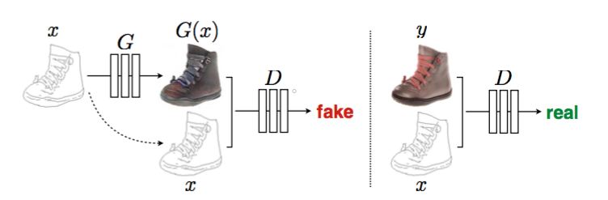

[TOC]

# 第七章 生成对抗网络

##  7.1 GAN基本概念
### 7.1.1 如何通俗理解GAN？

​	生成对抗网络(GAN, Generative adversarial network)自从2014年被Ian Goodfellow提出以来，掀起来了一股研究热潮。GAN由生成器和判别器组成，生成器负责生成样本，判别器负责判断生成器生成的样本是否为真。生成器要尽可能迷惑判别器，而判别器要尽可能区分生成器生成的样本和真实样本。

​	在GAN的原作[1]中，作者将生成器比喻为印假钞票的犯罪分子，判别器则类比为警察。犯罪分子努力让钞票看起来逼真，警察则不断提升对于假钞的辨识能力。二者互相博弈，随着时间的进行，都会越来越强。那么类比于图像生成任务，生成器不断生成尽可能逼真的假图像。判别器则判断图像是否是真实的图像，还是生成的图像，二者不断博弈优化。最终生成器生成的图像使得判别器完全无法判别真假。

### 7.1.2 GAN的形式化表达
​	上述例子只是简要介绍了一下GAN的思想，下面对于GAN做一个形式化的，更加具体的定义。通常情况下，无论是生成器还是判别器，我们都可以用神经网络来实现。那么，我们可以把通俗化的定义用下面这个模型来表示：

​	上述模型左边是生成器G，其输入是$z$，对于原始的GAN，$z$是由高斯分布随机采样得到的噪声。噪声$z$通过生成器得到了生成的假样本。

​	生成的假样本与真实样本放到一起，被随机抽取送入到判别器D，由判别器去区分输入的样本是生成的假样本还是真实的样本。整个过程简单明了，生成对抗网络中的“生成对抗”主要体现在生成器和判别器之间的对抗。

### 7.1.3 GAN的目标函数是什么？
​	对于上述神经网络模型，如果想要学习其参数，首先需要一个目标函数。GAN的目标函数定义如下：

$$
\mathop {\min }\limits_G \mathop {\max }\limits_D V(D,G) = {\rm E}_{x\sim{p_{data}(x)}}[\log D(x)] + {\rm E}_{z\sim{p_z}(z)}[\log (1 - D(G(z)))]
$$
​	这个目标函数可以分为两个部分来理解：

​	第一部分：判别器的优化通过$\mathop {\max}\limits_D V(D,G)$实现，$V(D,G)$为判别器的目标函数，其第一项${\rm E}_{x\sim{p_{data}(x)}}[\log D(x)]$表示对于从真实数据分布 中采用的样本 ,其被判别器判定为真实样本概率的数学期望。对于真实数据分布 中采样的样本，其预测为正样本的概率当然是越接近1越好。因此希望最大化这一项。第二项${\rm E}_{z\sim{p_z}(z)}[\log (1 - D(G(z)))]$表示：对于从噪声$P_z(z)​$分布当中采样得到的样本，经过生成器生成之后得到的生成图片，然后送入判别器，其预测概率的负对数的期望，这个值自然是越大越好，这个值越大， 越接近0，也就代表判别器越好。

​	第二部分：生成器的优化通过$\mathop {\min }\limits_G({\mathop {\max }\limits_D V(D,G)})$来实现。注意，生成器的目标不是$\mathop {\min }\limits_GV(D,G)$，即生成器不是最小化判别器的目标函数，二是最小化判别器目标函数的最大值，判别器目标函数的最大值代表的是真实数据分布与生成数据分布的JS散度(详情可以参阅附录的推导)，JS散度可以度量分布的相似性，两个分布越接近，JS散度越小。

### 7.1.4 GAN的目标函数和交叉熵有什么区别？

​	判别器目标函数写成离散形式即为:
$$
V(D,G)=-\frac{1}{m}\sum_{i=1}^{i=m}logD(x^i)-\frac{1}{m}\sum_{i=1}^{i=m}log(1-D(\tilde{x}^i))
$$

​	可以看出，这个目标函数和交叉熵是一致的，即**判别器的目标是最小化交叉熵损失，生成器的目标是最小化生成数据分布和真实数据分布的JS散度**。

-------------------
[1]: Goodfellow, Ian, et al. "Generative adversarial nets." Advances in neural information processing systems. 2014.

### 7.1.5 GAN的Loss为什么降不下去？

​	对于很多GAN的初学者在实践过程中可能会纳闷，为什么GAN的Loss一直降不下去。GAN到底什么时候才算收敛？其实，作为一个训练良好的GAN，其Loss就是降不下去的。衡量GAN是否训练好了，只能由人肉眼去看生成的图片质量是否好。不过，对于没有一个很好的评价是否收敛指标的问题，也有许多学者做了一些研究，后文提及的WGAN就提出了一种新的Loss设计方式，较好的解决了难以判断收敛性的问题。下面我们分析一下GAN的Loss为什么降不下去？
​	对于判别器而言，GAN的Loss如下：
$$
\mathop {\min }\limits_G \mathop {\max }\limits_D V(D,G) = {\rm E}_{x\sim{p_{data}(x)}}[\log D(x)] + {\rm E}_{z\sim{p_z}(z)}[\log (1 - D(G(z)))]
$$
​	从$\mathop {\min }\limits_G \mathop {\max }\limits_D V(D,G)​$可以看出，生成器和判别器的目的相反，也就是说两个生成器网络和判别器网络互为对抗，此消彼长。不可能Loss一直降到一个收敛的状态。

- 对于生成器，其Loss下降快，很有可能是判别器太弱，导致生成器很轻易的就"愚弄"了判别器。
- 对于判别器，其Loss下降快，意味着判别器很强，判别器很强则说明生成器生成的图像不够逼真，才使得判别器轻易判别，导致Loss下降很快。

​	也就是说，无论是判别器，还是生成器。loss的高低不能代表生成器的好坏。一个好的GAN网络，其GAN Loss往往是不断波动的。

​	看到这里可能有点让人绝望，似乎判断模型是否收敛就只能看生成的图像质量了。实际上，后文探讨的WGAN，提出了一种新的loss度量方式，让我们可以通过一定的手段来判断模型是否收敛。

### 7.1.6 生成式模型、判别式模型的区别？

​	对于机器学习模型，我们可以根据模型对数据的建模方式将模型分为两大类，生成式模型和判别式模型。如果我们要训练一个关于猫狗分类的模型，对于判别式模型，只需要学习二者差异即可。比如说猫的体型会比狗小一点。而生成式模型则不一样，需要学习猫张什么样，狗张什么样。有了二者的长相以后，再根据长相去区分。具体而言：

- 生成式模型：由数据学习联合概率分布P(X,Y), 然后由P(Y|X)=P(X,Y)/P(X)求出概率分布P(Y|X)作为预测的模型。该方法表示了给定输入X与产生输出Y的生成关系

- 判别式模型：由数据直接学习决策函数Y=f(X)或条件概率分布P(Y|X)作为预测模型，即判别模型。判别方法关心的是对于给定的输入X，应该预测什么样的输出Y。

​	对于上述两种模型，从文字上理解起来似乎不太直观。我们举个例子来阐述一下，对于性别分类问题，分别用不同的模型来做：

​	1）如果用生成式模型：可以训练一个模型，学习输入人的特征X和性别Y的关系。比如现在有下面一批数据：

| Y（性别） |      | 0    | 1    |
| --------- | ---- | ---- | ---- |
| X（特征） | 0    | 1/4  | 3/4  |
|           | 1    | 3/4  | 1/4  |

​	这个数据可以统计得到，即统计人的特征X=0,1….的时候，其类别为Y=0,1的概率。统计得到上述联合概率分布P(X, Y)后，可以学习一个模型，比如让二维高斯分布去拟合上述数据，这样就学习到了X，Y的联合分布。在预测时，如果我们希望给一个输入特征X，预测其类别，则需要通过贝叶斯公式得到条件概率分布才能进行推断：
$$
P(Y|X)={\frac{P(X,Y)}{P(X)}}={\frac{P(X,Y)}{P(X|Y)P(Y)}}
$$
​	2）如果用判别式模型：可以训练一个模型，输入人的特征X，这些特征包括人的五官，穿衣风格，发型等。输出则是对于性别的判断概率，这个概率服从一个分布，分布的取值只有两个，要么男，要么女，记这个分布为Y。这个过程学习了一个条件概率分布P(Y|X)，即输入特征X的分布已知条件下，Y的概率分布。

​	显然，从上面的分析可以看出。判别式模型似乎要方便很多，因为生成式模型要学习一个X，Y的联合分布往往需要很多数据，而判别式模型需要的数据则相对少，因为判别式模型更关注输入特征的差异性。不过生成式既然使用了更多数据来生成联合分布，自然也能够提供更多的信息，现在有一个样本（X,Y）,其联合概率P（X,Y）经过计算特别小，那么可以认为这个样本是异常样本。这种模型可以用来做outlier detection。

### 7.1.7 什么是mode collapsing?

​	某个模式(mode)出现大量重复样本，例如：

​	上图左侧的蓝色五角星表示真实样本空间，黄色的是生成的。生成样本缺乏多样性，存在大量重复。比如上图右侧中，红框里面人物反复出现。

### 7.1.8 如何解决mode collapsing？

方法一：**针对目标函数的改进方法**

​	为了避免前面提到的由于优化maxmin导致mode跳来跳去的问题，UnrolledGAN采用修改生成器loss来解决。具体而言，UnrolledGAN在更新生成器时更新k次生成器，参考的Loss不是某一次的loss，是判别器后面k次迭代的loss。注意，判别器后面k次迭代不更新自己的参数，只计算loss用于更新生成器。这种方式使得生成器考虑到了后面k次判别器的变化情况，避免在不同mode之间切换导致的模式崩溃问题。此处务必和迭代k次生成器，然后迭代1次判别器区分开[8]。DRAGAN则引入博弈论中的无后悔算法，改造其loss以解决mode collapse问题[9]。前文所述的EBGAN则是加入VAE的重构误差以解决mode collapse。

方法二：**针对网络结构的改进方法**

​	Multi agent diverse GAN(MAD-GAN)采用多个生成器，一个判别器以保障样本生成的多样性。具体结构如下：

​	相比于普通GAN，多了几个生成器，且在loss设计的时候，加入一个正则项。正则项使用余弦距离惩罚三个生成器生成样本的一致性。

​	MRGAN则添加了一个判别器来惩罚生成样本的mode collapse问题。具体结构如下：

​	输入样本$x​$通过一个Encoder编码为隐变量$E(x)​$，然后隐变量被Generator重构，训练时，Loss有三个。$D_M​$和$R​$（重构误差）用于指导生成real-like的样本。而$D_D​$则对$E(x)​$和$z​$生成的样本进行判别，显然二者生成样本都是fake samples，所以这个判别器主要用于判断生成的样本是否具有多样性，即是否出现mode collapse。

方法三：**Mini-batch Discrimination**

​	Mini-batch discrimination在判别器的中间层建立一个mini-batch layer用于计算基于L1距离的样本统计量，通过建立该统计量，实现了一个batch内某个样本与其他样本有多接近。这个信息可以被判别器利用到，从而甄别出哪些缺乏多样性的样本。对生成器而言，则要试图生成具有多样性的样本。

## 7.2 GAN的生成能力评价

### 7.2.1 如何客观评价GAN的生成能力？

​	最常见评价GAN的方法就是主观评价。主观评价需要花费大量人力物力，且存在以下问题：

- 评价带有主管色彩，有些bad case没看到很容易造成误判

- 如果一个GAN过拟合了，那么生成的样本会非常真实，人类主观评价得分会非常高，可是这并不是一个好的GAN。

因此，就有许多学者提出了GAN的客观评价方法。

### 7.2.2 Inception Score

​	对于一个在ImageNet训练良好的GAN，其生成的样本丢给Inception网络进行测试的时候，得到的判别概率应该具有如下特性：
- 对于同一个类别的图片，其输出的概率分布应该趋向于一个脉冲分布。可以保证生成样本的准确性。
- 对于所有类别，其输出的概率分布应该趋向于一个均匀分布，这样才不会出现mode dropping等，可以保证生成样本的多样性。

​	因此，可以设计如下指标：
$$
IS(P_g)=e^{E_{x\sim P_g}[KL(p_M(y|x)\Vert{p_M(y)})]}
根据前面分析，如果是一个训练良好的GAN，$p_M(y|x)​$趋近于脉冲分布，$p_M(y)​$趋近于均匀分布。二者KL散度会很大。Inception Score自然就高。实际实验表明，Inception Score和人的主观判别趋向一致。IS的计算没有用到真实数据，具体值取决于模型M的选择
$$
​	根据前面分析，如果是一个训练良好的GAN，$p_M(y|x)$趋近于脉冲分布，$p_M(y)$趋近于均匀分布。二者KL散度会很大。Inception Score自然就高。实际实验表明，Inception Score和人的主观判别趋向一致。IS的计算没有用到真实数据，具体值取决于模型M的选择。

​	**特点：可以一定程度上衡量生成样本的多样性和准确性，但是无法检测过拟合。Mode Score也是如此。不推荐在和ImageNet数据集差别比较大的数据上使用。**

### 7.2.3 Mode Score

​	Mode Score作为Inception Score的改进版本，添加了关于生成样本和真实样本预测的概率分布相似性度量一项。具体公式如下：
$$
MS(P_g)=e^{E_{x\sim P_g}[KL(p_M(y|x)\Vert{p_M(y)})-KL(p_M(y)\Vert p_M(y^*))]}
$$

### 7.2.4 Kernel MMD (Maximum Mean Discrepancy)

计算公式如下：
$$
MMD^2(P_r,P_g)=E_{x_r\sim{P_r},x_g\sim{P_g}}[\lVert\Sigma_{i=1}^{n1}k(x_r)-\Sigma_{i=1}^{n2}k(x_g)\rVert]
$$
​	对于Kernel MMD值的计算，首先需要选择一个核函数$k$，这个核函数把样本映射到再生希尔伯特空间(Reproducing Kernel Hilbert Space, RKHS) ，RKHS相比于欧几里得空间有许多优点，对于函数内积的计算是完备的。将上述公式展开即可得到下面的计算公式：
$$
MMD^2(P_r,P_g)=E_{x_r,x_r{'}\sim{P_r},x_g,x_g{'}\sim{P_g}}[k(x_r,x_r{'})-2k(x_r,x_g)+k(x_g,x_g{'})]
$$
MMD值越小，两个分布越接近。

**特点：可以一定程度上衡量模型生成图像的优劣性，计算代价小。推荐使用。**

### 7.2.5 Wasserstein distance

​	Wasserstein distance在最优传输问题中通常也叫做推土机距离。这个距离的介绍在WGAN中有详细讨论。公式如下：
$$
WD(P_r,P_g)=min_{\omega\in\mathbb{R}^{m\times n}}\Sigma_{i=1}^n\Sigma_{i=1}^m\omega_{ij}d(x_i^r,x_j^g)
$$

$$
s.t. \Sigma_{i=1}^mw_{i,j}=p_r(x_i^r),  \forall i;\Sigma_{j=1}^nw_{i,j}=p_g(x_j^g),  \forall j
$$

​	Wasserstein distance可以衡量两个分布之间的相似性。距离越小，分布越相似。

**特点：如果特征空间选择合适，会有一定的效果。但是计算复杂度为$O(n^3)​$太高**

### 7.2.6 Fréchet Inception Distance (FID) 

​	FID距离计算真实样本，生成样本在特征空间之间的距离。首先利用Inception网络来提取特征，然后使用高斯模型对特征空间进行建模。根据高斯模型的均值和协方差来进行距离计算。具体公式如下：
$$
FID(\mathbb P_r,\mathbb P_g)=\lVert\mu_r-\mu_g\rVert+Tr(C_r+C_g-2(C_rC_g)^{1/2})
$\mu,C$分别代表协方差和均值。
$$
$\mu,C​$分别代表协方差和均值。

​	**特点：尽管只计算了特征空间的前两阶矩，但是鲁棒，且计算高效。**

### 7.2.7 1-Nearest Neighbor classifier

​	使用留一法，结合1-NN分类器（别的也行）计算真实图片，生成图像的精度。如果二者接近，则精度接近50%，否则接近0%。对于GAN的评价问题，作者分别用正样本的分类精度，生成样本的分类精度去衡量生成样本的真实性，多样性。
- 对于真实样本$x_r$，进行1-NN分类的时候，如果生成的样本越真实。则真实样本空间$\mathbb R$将被生成的样本$x_g$包围。那么$x_r$的精度会很低。
- 对于生成的样本$x_g​$，进行1-NN分类的时候，如果生成的样本多样性不足。由于生成的样本聚在几个mode，则$x_g​$很容易就和$x_r​$区分，导致精度会很高。

**特点：理想的度量指标，且可以检测过拟合。**

### 7.2.8 其他评价方法

​	AIS，KDE方法也可以用于评价GAN，但这些方法不是model agnostic metrics。也就是说，这些评价指标的计算无法只利用：生成的样本，真实样本来计算。

## 7.3 其他常见的生成式模型有哪些？

### 7.3.1 什么是自回归模型：pixelRNN与pixelCNN？

​	自回归模型通过对图像数据的概率分布$p_{data}(x)$进行显式建模，并利用极大似然估计优化模型。具体如下：
$$
p_{data}(x)=\prod_{i=1}^np(x_i|x_1,x_2,...,x_{i-1})
$$
​	上述公式很好理解，给定$x_1,x_2,...,x_{i-1}$条件下，所有$p(x_i)$的概率乘起来就是图像数据的分布。如果使用RNN对上述依然关系建模，就是pixelRNN。如果使用CNN，则是pixelCNN。具体如下[5]：

​	显然，不论是对于pixelCNN还是pixelRNN，由于其像素值是一个个生成的，速度会很慢。语音领域大火的WaveNet就是一个典型的自回归模型。

### 7.3.2 什么是VAE？

​	PixelCNN/RNN定义了一个易于处理的密度函数，我们可以直接优化训练数据的似然；对于变分自编码器我们将定义一个不易处理的密度函数，通过附加的隐变量$z$对密度函数进行建模。 VAE原理图如下[6]：

​	在VAE中，真实样本$X$通过神经网络计算出均值方差（假设隐变量服从正太分布），然后通过采样得到采样变量$Z$并进行重构。VAE和GAN均是学习了隐变量$z$到真实数据分布的映射。但是和GAN不同的是：

- GAN的思路比较粗暴，使用一个判别器去度量分布转换模块（即生成器）生成分布与真实数据分布的距离。
- VAE则没有那么直观，VAE通过约束隐变量$z$服从标准正太分布以及重构数据实现了分布转换映射$X=G(z)$

**生成式模型对比**

- 自回归模型通过对概率分布显式建模来生成数据
- VAE和GAN均是：假设隐变量$z$服从某种分布，并学习一个映射$X=G(z)$，实现隐变量分布$z$与真实数据分布$p_{data}(x)$的转换。
- GAN使用判别器去度量映射$X=G(z)$的优劣，而VAE通过隐变量$z$与标准正太分布的KL散度和重构误差去度量。

## 7.4 GAN的改进与优化

### 7.4.1 如何生成指定类型的图像——条件GAN

​	条件生成对抗网络（CGAN, Conditional Generative Adversarial Networks）作为一个GAN的改进，其一定程度上解决了GAN生成结果的不确定性。如果在Mnist数据集上训练原始GAN，GAN生成的图像是完全不确定的，具体生成的是数字1，还是2，还是几，根本不可控。为了让生成的数字可控，我们可以把数据集做一个切分，把数字0~9的数据集分别拆分开训练9个模型，不过这样太麻烦了，也不现实。因为数据集拆分不仅仅是分类麻烦，更主要在于，每一个类别的样本少，拿去训练GAN很有可能导致欠拟合。因此，CGAN就应运而生了。我们先看一下CGAN的网络结构：

​	从网络结构图可以看到，对于生成器Generator，其输入不仅仅是随机噪声的采样z，还有欲生成图像的标签信息。比如对于mnist数据生成，就是一个one-hot向量，某一维度为1则表示生成某个数字的图片。同样地，判别器的输入也包括样本的标签。这样就使得判别器和生成器可以学习到样本和标签之间的联系。Loss如下：
$$
\mathop {\min }\limits_G \mathop {\max }\limits_D V(D,G) = {\rm E}_{x\sim{p_{data}(x)}}[\log D(x|y)] + {\rm E}_{z\sim{p_z}(z)}[\log (1 - D(G(z|y)))]
$$
​	Loss设计和原始GAN基本一致，只不过生成器，判别器的输入数据是一个条件分布。在具体编程实现时只需要对随机噪声采样z和输入条件y做一个级联即可。

### 7.4.2 CNN与GAN——DCGAN

​	前面我们聊的GAN都是基于简单的神经网络构建的。可是对于视觉问题，如果使用原始的基于DNN的GAN，则会出现许多问题。如果输入GAN的随机噪声为100维的随机噪声，输出图像为256x256大小。也就是说，要将100维的信息映射为65536维。如果单纯用DNN来实现，那么整个模型参数会非常巨大，而且学习难度很大（低维度映射到高维度需要添加许多信息）。因此，DCGAN就出现了。具体而言，DCGAN将传统GAN的生成器，判别器均采用GAN实现，且使用了一下tricks：

- 将pooling层convolutions替代，其中，在discriminator上用strided convolutions替代，在generator上用fractional-strided convolutions替代。
- 在generator和discriminator上都使用batchnorm。 
- 移除全连接层，global pooling增加了模型的稳定性，但伤害了收敛速度。
- 在generator的除了输出层外的所有层使用ReLU，输出层采用tanh。
- 在discriminator的所有层上使用LeakyReLU。

网络结构图如下：

### 7.4.3 如何理解GAN中的输入随机噪声？

​	为了了解输入随机噪声每一个维度代表的含义，作者做了一个非常有趣的工作。即在隐空间上，假设知道哪几个变量控制着某个物体，那么僵这几个变量挡住是不是就可以将生成图片中的某个物体消失？论文中的实验是这样的：首先，生成150张图片，包括有窗户的和没有窗户的，然后使用一个逻辑斯底回归函数来进行分类，对于权重不为0的特征，认为它和窗户有关。将其挡住，得到新的生成图片，结果如下：

此外，将几个输入噪声进行算数运算，可以得到语义上进行算数运算的非常有趣的结果。类似于word2vec。

### 7.4.4 GAN为什么容易训练崩溃？

​	所谓GAN的训练崩溃，指的是训练过程中，生成器和判别器存在一方压倒另一方的情况。
GAN原始判别器的Loss在判别器达到最优的时候，等价于最小化生成分布与真实分布之间的JS散度，由于随机生成分布很难与真实分布有不可忽略的重叠以及JS散度的突变特性，使得生成器面临梯度消失的问题；可是如果不把判别器训练到最优，那么生成器优化的目标就失去了意义。因此需要我们小心的平衡二者，要把判别器训练的不好也不坏才行。否则就会出现训练崩溃，得不到想要的结果

### 7.4.5 WGAN如何解决训练崩溃问题？

​	WGAN作者提出了使用Wasserstein距离，以解决GAN网络训练过程难以判断收敛性的问题。Wasserstein距离定义如下:
$$
L={\rm E}_{x\sim{p_{data}}(x)}[f_w(x)] - {\rm E}_{x\sim{p_g}(x)}[f_w(x)]
$$
通过最小化Wasserstein距离，得到了WGAN的Loss：

- WGAN生成器Loss：$- {\rm E}_{x\sim{p_g}(x)}[f_w(x)]​$
- WGAN判别器Loss：$L=-{\rm E}_{x\sim{p_{data}}(x)}[f_w(x)] + {\rm E}_{x\sim{p_g}(x)}[f_w(x)]$

从公式上GAN似乎总是让人摸不着头脑，在代码实现上来说，其实就以下几点：

- 判别器最后一层去掉sigmoid
- 生成器和判别器的loss不取log
- 每次更新判别器的参数之后把它们的绝对值截断到不超过一个固定常数c

### 7.4.6 WGAN-GP：带有梯度正则的WGAN

​	实际实验过程发现，WGAN没有那么好用，主要原因在于WAGN进行梯度截断。梯度截断将导致判别网络趋向于一个二值网络，造成模型容量的下降。
于是作者提出使用梯度惩罚来替代梯度裁剪。公式如下：
$$
L=-{\rm E}_{x\sim{p_{data}}(x)}[f_w(x)] + {\rm E}_{x\sim{p_g}(x)}[f_w(x)]+\lambda{\rm E}_{x\sim{p_x}(x)}[\lVert\nabla_x(D(x))\rVert_p-1]^2
由于上式是对每一个梯度进行惩罚，所以不适合使用BN，因为它会引入同个batch中不同样本的相互依赖关系。如果需要的话，可以选择Layer Normalization。实际训练过程中，就可以通过Wasserstein距离来度量模型收敛程度了：

上图纵坐标是Wasserstein距离，横坐标是迭代次数。可以看出，随着迭代的进行，Wasserstein距离趋于收敛，生成图像也趋于稳定。
$$
​	由于上式是对每一个梯度进行惩罚，所以不适合使用BN，因为它会引入同个batch中不同样本的相互依赖关系。如果需要的话，可以选择Layer Normalization。实际训练过程中，就可以通过Wasserstein距离来度量模型收敛程度了：

​	上图纵坐标是Wasserstein距离，横坐标是迭代次数。可以看出，随着迭代的进行，Wasserstein距离趋于收敛，生成图像也趋于稳定。

### 7.4.7 LSGAN

​	LSGAN（Least Squares GAN）这篇文章主要针对标准GAN的稳定性和图片生成质量不高做了一个改进。作者将原始GAN的交叉熵损失采用最小二乘损失替代。LSGAN的Loss：
$$
\mathop{\min }\limits_DJ(D)=\mathop{\min}\limits_D[{\frac{1}{2}}{\rm E}_{x\sim{p_{data}}(x)}[D(x)-a]^2 + {\frac{1}{2}}{\rm E}_{z\sim{p_z}(z)}[D(G(z))-b]^2]
$$

$$
\mathop{\min }\limits_GJ(G)=\mathop{\min}\limits_G{\frac{1}{2}}{\rm E}_{z\sim{p_z}(z)}[D(G(z))-c]^2
$$

​	实际实现的时候非常简单，最后一层去掉sigmoid，并且计算Loss的时候用平方误差即可。之所以这么做，作者在原文给出了一张图:

​	上面是作者给出的基于交叉熵损失以及最小二乘损失的Loss函数。横坐标代表Loss函数的输入，纵坐标代表输出的Loss值。可以看出，随着输入的增大，sigmoid交叉熵损失很快趋于0，容易导致梯度饱和问题。如果使用右边的Loss设计，则只在x=0点处饱和。因此使用LSGAN可以很好的解决交叉熵损失的问题。

### 7.4.8 如何尽量避免GAN的训练崩溃问题？

- 归一化图像输入到（-1，1）之间；Generator最后一层使用tanh激活函数
- 生成器的Loss采用：min (log 1-D)。因为原始的生成器Loss存在梯度消失问题；训练生成器的时候，考虑反转标签，real=fake, fake=real
- 不要在均匀分布上采样，应该在高斯分布上采样
- 一个Mini-batch里面必须只有正样本，或者负样本。不要混在一起；如果用不了Batch Norm，可以用Instance Norm
- 避免稀疏梯度，即少用ReLU，MaxPool。可以用LeakyReLU替代ReLU，下采样可以用Average Pooling或者Convolution + stride替代。上采样可以用PixelShuffle, ConvTranspose2d + stride
- 平滑标签或者给标签加噪声；平滑标签，即对于正样本，可以使用0.7-1.2的随机数替代；对于负样本，可以使用0-0.3的随机数替代。  给标签加噪声：即训练判别器的时候，随机翻转部分样本的标签。
- 如果可以，请用DCGAN或者混合模型：KL+GAN，VAE+GAN。
- 使用LSGAN，WGAN-GP
- Generator使用Adam，Discriminator使用SGD
- 尽快发现错误；比如：判别器Loss为0，说明训练失败了；如果生成器Loss稳步下降，说明判别器没发挥作用
- 不要试着通过比较生成器，判别器Loss的大小来解决训练过程中的模型坍塌问题。比如：
  While Loss D > Loss A:
  Train D
  While Loss A > Loss D:
  Train A
- 如果有标签，请尽量利用标签信息来训练
- 给判别器的输入加一些噪声，给G的每一层加一些人工噪声。
- 多训练判别器，尤其是加了噪声的时候
- 对于生成器，在训练，测试的时候使用Dropout

## 7.3 GAN的应用（图像翻译）

### 7.3.1 什么是图像翻译？
​	GAN作为一种强有力的生成模型，其应用十分广泛。最为常见的应用就是图像翻译。所谓图像翻译，指从一副图像到另一副图像的转换。可以类比机器翻译，一种语言转换为另一种语言。常见的图像翻译任务有：
- 图像去噪
- 图像超分辨
- 图像补全
- 风格迁移
- ...

  本节将介绍一个经典的图像翻译网络及其改进。图像翻译可以分为有监督图像翻译和无监督图像翻译：

- 有监督图像翻译：原始域与目标域存在一一对应数据
- 无监督图像翻译：原始域与目标域不存在一一对应数据

### 7.3.2 有监督图像翻译：pix2pix
​	在这篇paper里面，作者提出的框架十分简洁优雅（好用的算法总是简洁优雅的）。相比以往算法的大量专家知识，手工复杂的loss。这篇paper非常粗暴，使用CGAN处理了一系列的转换问题。下面是一些转换示例：

​	上面展示了许多有趣的结果，比如分割图$\longrightarrow$街景图，边缘图$\longrightarrow$真实图。对于第一次看到的时候还是很惊艳的，那么这个是怎么做到的呢？我们可以设想一下，如果是我们，我们自己会如何设计这个网络？

**直观的想法**？

​	最直接的想法就是，设计一个CNN网络，直接建立输入-输出的映射，就像图像去噪问题一样。可是对于上面的问题，这样做会带来一个问题。**生成图像质量不清晰。**

​	拿左上角的分割图$\longrightarrow$街景图为例，语义分割图的每个标签比如“汽车”可能对应不同样式，颜色的汽车。那么模型学习到的会是所有不同汽车的评均，这样会造成模糊。

**如何解决生成图像的模糊问题**？

​	这里作者想了一个办法，即加入GAN的Loss去惩罚模型。GAN相比于传统生成式模型可以较好的生成高分辨率图片。思路也很简单，在上述直观想法的基础上加入一个判别器，判断输入图片是否是真实样本。模型示意图如下：

​	上图模型和CGAN有所不同，但它是一个CGAN，只不过输入只有一个，这个输入就是条件信息。原始的CGAN需要输入随机噪声，以及条件。这里之所有没有输入噪声信息，是因为在实际实验中，如果输入噪声和条件，噪声往往被淹没在条件C当中，所以这里直接省去了。

### 7.3.3  其他图像翻译的tricks
从上面两点可以得到最终的Loss由两部分构成：
- 输出和标签信息的L1 Loss。

- GAN Loss

- 测试也使用Dropout，以使输出多样化
  $$
  G^*=arg\mathop {\min }\limits_G \mathop {\max }\limits_D \Gamma_{cGAN}(G,D)+\lambda\Gamma_{L1}(G)
  $$

​	采用L1 Loss而不是L2 Loss的理由很简单，L1 Loss相比于L2 Loss保边缘（L2 Loss基于高斯先验，L1 Loss基于拉普拉斯先验）。

​	GAN Loss为LSGAN的最小二乘Loss，并使用PatchGAN(进一步保证生成图像的清晰度)。PatchGAN将图像换分成很多个Patch，并对每一个Patch使用判别器进行判别（实际代码实现有更取巧的办法），将所有Patch的Loss求平均作为最终的Loss。

### 7.3.4 如何生成高分辨率图像和高分辨率视频？

​	pix2pix提出了一个通用的图像翻译框架。对于高分辨率的图像生成以及高分辨率的视频生成，则需要利用更好的网络结构以及更多的先验只是。pix2pixHD提出了一种多尺度的生成器以及判别器等方式从而生成高分辨率图像。Vid2Vid则在pix2pixHD的基础上利用光流，时序约束生成了高分辨率视频。

### 7.3.5 有监督的图像翻译的缺点？
​	许多图像翻译算法如前面提及的pix2pix系列，需要一一对应的图像。可是在许多应用场景下，往往没有这种一一对应的强监督信息。比如说以下一些应用场景：

以第一排第一幅图为例，要找到这种一一配对的数据是不现实的。因此，无监督图像翻译算法就被引入了。

### 7.3.6 无监督图像翻译：CycleGAN
**模型结构**

​	总体思路如下，假设有两个域的数据，记为A，B。对于上图第一排第一幅图A域就是普通的马，B域就是斑马。由于A->B的转换缺乏监督信息，于是，作者提出采用如下方法进行转换：
>a.	A->fake_B->rec_A
b.	B->fake_A->rec_B

​	对于A域的所有图像，学习一个网络G_B，该网络可以生成B。对于B域的所有图像，也学习一个网络G_A，该网络可以生成G_B。

​	训练过程分成两步，首先对于A域的某张图像，送入G_B生成fake_B，然后对fake_B送入G_A，得到重构后的A图像rec_A。对于B域的某一张图像也是类似。重构后的图像rec_A/rec_B可以和原图A/B做均方误差，实现了有监督的训练。此处值得注意的是A->fake_B(B->fake_A)和fake_A->rec_B(fake_B->rec_A)的网络是一模一样的。下图是形象化的网络结构图：

​	cycleGAN的生成器采用U-Net，判别器采用LS-GAN。

**Loss设计**

​	总的Loss就是X域和Y域的GAN Loss，以及Cycle consistency loss：
$$
L(G,F,D_X,D_Y)=L_{GAN}(G,D_Y,X,Y)+L_{GAN}(F,D_X,Y,X)+\lambda L_{cycle}(G,F)
$$
整个过程End to end训练，效果非常惊艳，利用这一框架可以完成非常多有趣的任务

### 7.3.7 多领域的无监督图像翻译：StarGAN

cycleGAN模型较好的解决了无监督图像转换问题，可是这种单一域的图像转换还存在一些问题：

- 要针对每一个域训练一个模型，效率太低。举例来说，我希望可以将橘子转换为红苹果和青苹果。对于cycleGAN而言，需要针对红苹果，青苹果分别训练一个模型。
- 对于每一个域都需要搜集大量数据，太麻烦。还是以橘子转换为红苹果和青苹果为例。不管是红苹果还是青苹果，都是苹果，只是颜色不一样而已。这两个任务信息是可以共享的，没必要分别训练两个模型。而且针对红苹果，青苹果分别取搜集大量数据太费事。

  starGAN则提出了一个多领域的无监督图像翻译框架，实现了多个领域的图像转换，且对于不同领域的数据可以混合在一起训练，提高了数据利用率

## 7.4 GAN的应用（文本生成）

### 7.4.1 GAN为什么不适合文本任务？

​	GAN在2014年被提出之后，在图像生成领域取得了广泛的研究应用。然后在文本领域却一直没有很惊艳的效果。主要在于文本数据是离散数据，而GAN在应用于离散数据时存在以下几个问题：

- GAN的生成器梯度来源于判别器对于正负样本的判别。然而，对于文本生成问题，RNN输出的是一个概率序列，然后取argmax。这会导致生成器Loss不可导。还可以站在另一个角度理解，由于是argmax，所以参数更新一点点并不会改变argmax的结果，这也使得GAN不适合离散数据。
- GAN只能评估整个序列的loss，但是无法评估半句话，或者是当前生成单词对后续结果好坏的影响。
- 如果不加argmax，那么由于生成器生成的都是浮点数值，而ground truth都是one-hot encoding，那么判别器只要判别生成的结果是不是0/1序列组成的就可以了。这容易导致训练崩溃。

### 7.4.2 seqGAN用于文本生成

​	seqGAN在GAN的框架下，结合强化学习来做文本生成。 模型示意图如下：

在文本生成任务，seqGAN相比较于普通GAN区别在以下几点：

- 生成器不取argmax。
- 每生成一个单词，则根据当前的词语序列进行蒙特卡洛采样生成完成的句子。然后将句子送入判别器计算reward。
- 根据得到的reward进行策略梯度下降优化模型。

## 7.5 GAN在其他领域的应用

### 7.5.1 数据增广

​	GAN的良好生成特性近年来也开始被用于数据增广。以行人重识别为例，有许多GAN用于数据增广的工作[1-4]。行人重识别问题一个难点在于不同摄像头下拍摄的人物环境，角度差别非常大，导致存在较大的Domain gap。因此，可以考虑使用GAN来产生不同摄像头下的数据进行数据增广。以论文[1]为例，本篇paper提出了一个cycleGAN用于数据增广的方法。具体模型结构如下：

​	对于每一对摄像头都训练一个cycleGAN，这样就可以实现将一个摄像头下的数据转换成另一个摄像头下的数据，但是内容（人物）保持不变。
在CVPR19中，[9]进一步提升了图像的生成质量，进行了“淘宝换衣”式的高质量图像生成（如下图），提供了更高质量的行人训练数据。

### 7.5.2 图像超分辨与图像补全

​	图像超分辨与补全均可以作为图像翻译问题，该类问题的处理办法也大都是训练一个端到端的网络，输入是原始图片，输出是超分辨率后的图片，或者是补全后的图片。文献[5]利用GAN作为判别器，使得超分辨率模型输出的图片更加清晰，更符合人眼主管感受。日本早稻田大学研究人员[6]提出一种全局+局部一致性的GAN实现图像补全，使得修复后的图像不仅细节清晰，且具有整体一致性。

### 7.5.3 语音领域

​	相比于图像领域遍地开花，GAN在语音领域则应用相对少了很多。这里零碎的找一些GAN在语音领域进行应用的例子作为介绍。文献[7]提出了一种音频去噪的SEGAN，缓解了传统方法支持噪声种类稀少，泛化能力不强的问题。Donahue利用GAN进行语音增强，提升了ASR系统的识别率。

## 参考文献

[1] Zheng Z , Zheng L , Yang Y . Unlabeled Samples Generated by GAN Improve the Person Re-identification Baseline in Vitro[C]// 2017 IEEE International Conference on Computer Vision (ICCV). IEEE Computer Society, 2017.

[2]  Zhong Z ,  Zheng L ,  Zheng Z , et al. Camera Style Adaptation for Person Re-identification[J].  2017.

[3]  Deng W ,  Zheng L ,  Ye Q , et al. Image-Image Domain Adaptation with Preserved Self-Similarity and Domain-Dissimilarity for Person Re-identification[J].  2017.

[4]  Wei L ,  Zhang S ,  Gao W , et al. Person Transfer GAN to Bridge Domain Gap for Person Re-Identification[J].  CVPR, 2017.

[5]  Ledig C ,  Theis L ,  Huszar F , et al. Photo-Realistic Single Image Super-Resolution Using a Generative Adversarial Network[J].  CVPR, 2016.

[6]  Iizuka S ,  Simo-Serra E ,  Ishikawa H . Globally and locally consistent image completion[J]. ACM Transactions on Graphics, 2017, 36(4):1-14.

[7] Pascual S , Bonafonte A , Serrà, Joan. SEGAN: Speech Enhancement Generative Adversarial Network[J]. 2017.

[8]  Donahue C ,  Li B ,  Prabhavalkar R . Exploring Speech Enhancement with Generative Adversarial Networks for Robust Speech Recognition[J].  2017.

[9] Zheng, Z., Yang, X., Yu, Z., Zheng, L., Yang, Y., & Kautz, J. Joint discriminative and generative learning for person re-identification. IEEE Conference on Computer Vision and Pattern Recognition (CVPR)[C]. 2019.

