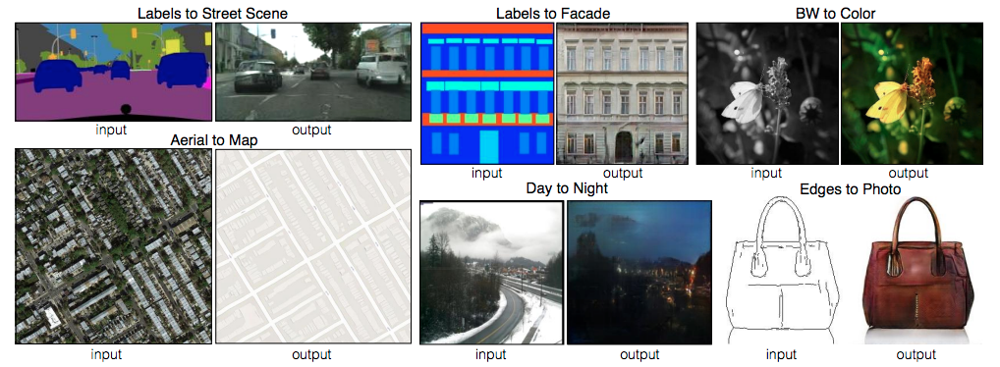

# 
# 7.1 什么是生成对抗网络
## GAN的通俗化介绍

生成对抗网络(GAN, Generative adversarial network)自从2014年被Ian Goodfellow提出以来，掀起来了一股研究热潮。GAN由生成器和判别器组成，生成器负责生成样本，判别器负责判断生成器生成的样本是否为真。生成器要尽可能迷惑判别器，而判别器要尽可能区分生成器生成的样本和真实样本。

在GAN的原作[1]中，作者将生成器比喻为印假钞票的犯罪分子，判别器则类比为警察。犯罪分子努力让钞票看起来逼真，警察则不断提升对于假钞的辨识能力。二者互相博弈，随着时间的进行，都会越来越强。

## GAN的形式化表达
上述例子只是简要介绍了一下GAN的思想，下面对于GAN做一个形式化的，更加具体的定义。通常情况下，无论是生成器还是判别器，我们都可以用神经网络来实现。那么，我们可以把通俗化的定义用下面这个模型来表示：

上述模型左边是生成器G，其输入是$z$，对于原始的GAN，$z$是由高斯分布随机采样得到的噪声。噪声$z$通过生成器得到了生成的假样本。

生成的假样本与真实样本放到一起，被随机抽取送入到判别器D，由判别器去区分输入的样本是生成的假样本还是真实的样本。整个过程简单明了，生成对抗网络中的“生成对抗”主要体现在生成器和判别器之间的对抗。

## GAN的目标函数
对于上述神经网络模型，如果想要学习其参数，首先需要一个目标函数。GAN的目标函数定义如下：

$$\mathop {\min }\limits_G \mathop {\max }\limits_D V(D,G) = {{\rm E}_{x\sim{p_{data}}(x)}}[\log D(x)] + {{\rm E}_{z\sim{p_z}(z)}}[\log (1 - D(G(z)))]$$

这个目标函数可以分为两个部分来理解：

判别器的优化通过$\mathop {\max}\limits_D V(D,G)$实现，$V(D,G)$为判别器的目标函数，其第一项${{\rm E}_{x\sim{p_{data}}(x)}}[\log D(x)]$表示对于从真实数据分布 中采用的样本 ,其被判别器判定为真实样本概率的数学期望。对于真实数据分布 中采样的样本，其预测为正样本的概率当然是越接近1越好。因此希望最大化这一项。第二项${{\rm E}_{z\sim{p_z}(z)}}[\log (1 - D(G(z)))]$表示：对于从噪声P_z(z)分布当中采样得到的样本经过生成器生成之后得到的生成图片，然后送入判别器，其预测概率的负对数的期望，这个值自然是越大越好，这个值越大， 越接近0，也就代表判别器越好。

生成器的优化通过$\mathop {\min }\limits_G({\mathop {\max }\limits_D V(D,G)})$实现。注意，生成器的目标不是$\mathop {\min }\limits_GV(D,G)$，即生成器**不是最小化判别器的目标函数**，生成器最小化的是**判别器目标函数的最大值**，判别器目标函数的最大值代表的是真实数据分布与生成数据分布的JS散度(详情可以参阅附录的推导)，JS散度可以度量分布的相似性，两个分布越接近，JS散度越小。

## GAN的目标函数和交叉熵
判别器目标函数写成离散形式即为$$V(D,G)=-\frac{1}{m}\sum_{i=1}^{i=m}logD(x^i)-\frac{1}{m}\sum_{i=1}^{i=m}log(1-D(\tilde{x}^i))$$
可以看出，这个目标函数和交叉熵是一致的，即**判别器的目标是最小化交叉熵损失，生成器的目标是最小化生成数据分布和真实数据分布的JS散度**

-------------------
[1]: Goodfellow, Ian, et al. "Generative adversarial nets." Advances in neural information processing systems. 2014.

# 7.2 什么是图像翻译
GAN作为一种强有力的生成模型，其应用十分广泛。最为常见的应用就是图像翻译。所谓图像翻译，指从一副图像到另一副图像的转换。可以类比机器翻译，一种语言转换为另一种语言。常见的图像翻译任务有：
- 图像去噪
- 图像超分辨
- 图像补全
- 风格迁移
-  ...

本节将介绍一个经典的图像翻译网络及其改进。
# 7.2.1 pix2pix:图像翻译
在这篇paper里面，作者提出的框架十分简洁优雅（好用的算法总是简洁优雅的）。相比以往算法的大量专家知识，手工复杂的loss。这篇paper非常粗暴，使用CGAN处理了一系列的转换问题。下面是一些转换示例：

上面展示了许多有趣的结果，比如分割图$\longrightarrow$街景图，边缘图$\longrightarrow$真实图。对于第一次看到的时候还是很惊艳的，那么这个是怎么做到的呢？我们可以设想一下，如果是我们，我们自己会如何设计这个网络。

## 如何做图像翻译？
最直接的想法就是，设计一个CNN网络，直接建立输入-输出的映射，就像图像去噪问题一样。可是对于上面的问题，这样做会带来一个问题。**生成图像质量不清晰。**

拿左上角的分割图$\longrightarrow$街景图为例，语义分割图的每个标签比如“汽车”可能对应不同样式，颜色的汽车。那么模型学习到的会是所有不同汽车的评均，这样会造成模糊。

## 如何解决模糊呢？
这里作者想了一个办法，即加入GAN的Loss去惩罚模型。GAN相比于传统生成式模型可以较好的生成高分辨率图片。思路也很简单，在上述直观想法的基础上加入一个判别器，判断输入图片是否是真实样本。模型示意图如下：

上图模型和CGAN有所不同，但它是一个CGAN，只不过输入只有一个，这个输入就是条件信息。原始的CGAN需要输入随机噪声，以及条件。这里之所有没有输入噪声信息，是因为在实际实验中，如果输入噪声和条件，噪声往往被淹没在条件C当中，所以这里直接省去了。

## 图像翻译的tricks
从上面两点可以得到最终的Loss由两部分构成：
- 输出和标签信息的L1 Loss。
- GAN Loss
- 测试也使用Dropout，以使输出多样化

采用L1 Loss而不是L2 Loss的理由很简单，L1 Loss相比于L2 Loss保边缘（L2 Loss基于高斯先验，L1 Loss基于拉普拉斯先验）。

GAN Loss为LSGAN的最小二乘Loss，并使用PatchGAN(进一步保证生成图像的清晰度)。PatchGAN将图像换分成很多个Patch，并对每一个Patch使用判别器进行判别（实际代码实现有更取巧的办法），将所有Patch的Loss求平均作为最终的Loss。

# 7.2.2 pix2pixHD：高分辨率图像生成
这篇paper作为pix2pix改进版本，如其名字一样，主要是可以产生高分辨率的图像。具体来说，作者的贡献主要在以下两个方面：
- 使用多尺度的生成器以及判别器等方式从而生成高分辨率图像。
- 使用了一种非常巧妙的方式，实现了对于同一个输入，产生不同的输出。并且实现了交互式的语义编辑方式
## 如何生成高分辨率图像
为了生成高分辨率图像，作者主要从三个层面做了改进：
- 模型结构
- Loss设计
- 使用Instance-map的图像进行训练。
### 模型结构

生成器由两部分组成，G1和G2，其中G2又被割裂成两个部分。G1和pix2pix的生成器没有差别，就是一个end2end的U-Net结构。G2的左半部分提取特征，并和G1的输出层的前一层特征进行相加融合信息，把融合后的信息送入G2的后半部分输出高分辨率图像。

判别器使用多尺度判别器，在三个不同的尺度上进行判别并对结果取平均。判别的三个尺度为：原图，原图的1/2降采样，原图的1/4降采样。显然，越粗糙的尺度感受野越大，越关注全局一致性。

生成器和判别器均使用多尺度结构实现高分辨率重建，思路和PGGAN类似，但实际做法差别比较大。

### Loss设计
这里的Loss由三部分组成：
- GAN loss：和pix2pix一样，使用PatchGAN。
- Feature matching loss：将生成的样本和Ground truth分别送入判别器提取特征，然后对特征做Element-wise loss
- Content loss：将生成的样本和Ground truth分别送入VGG16提取特征，然后对特征做Element-wise loss

使用Feature matching loss和Content loss计算特征的loss，而不是计算生成样本和Ground truth的MSE，主要在于MSE会造成生成的图像过度平滑，缺乏细节。Feature matching loss和Content loss只保证内容一致，细节则由GAN去学习。
### 使用Instance-map的图像进行训练
pix2pix采用语义分割的结果进行训练，可是语义分割结果没有对同类物体进行区分，导致多个同一类物体排列在一起的时候出现模糊，这在街景图中尤为常见。在这里，作者使用个体分割（Instance-level segmention）的结果来进行训练，因为个体分割的结果提供了同一类物体的边界信息。具体做法如下：
- 根据个体分割的结果求出Boundary map
- 将Boundary map与输入的语义标签concatnate到一起作为输入
Boundary map求法很简单，直接遍历每一个像素，判断其4邻域像素所属语义类别信息，如果有不同，则置为1。下面是一个示例：

### 语义编辑
不同于pix2pix实现生成多样性的方法（使用Dropout），这里采用了一个非常巧妙的办法，即学习一个条件(Condition)作为条件GAN的输入，不同的输入条件就得到了不同的输出，从而实现了多样化的输出，而且还是可编辑的。具体做法如下：

- 首先训练一个编码器
- 利用编码器提取原始图片的特征，然后根据Labels信息进行Average pooling，得到特征（上图的Features）。这个Features的每一类像素的值都代表了这类标签的信息。
- 如果输入图像有足够的多，那么Features的每一类像素的值就代表了这类物体的先验分布。
- 对所有输入的训练图像通过编码器提取特征，然后进行K-means聚类，得到K个聚类中心，以K个聚类中心代表不同的颜色，纹理等信息。
- 实际生成图像时，除了输入语义标签信息，还要从K个聚类中心随机选择一个，即选择一个颜色/纹理风格

这个方法总的来说非常巧妙，通过学习数据的隐变量达到控制图像颜色纹理风格信息。

### 总结
作者主要的贡献在于：
- 提出了生成高分辨率图像的多尺度网络结构，包括生成器，判别器
- 提出了Feature loss和VGG loss提升图像的分辨率
- 通过学习隐变量达到控制图像颜色，纹理风格信息
- 通过Boundary map提升重叠物体的清晰度

可以看出，这篇paper除了第三点，都是针对性的解决高分辨率图像生成的问题的。可是本篇工作只是生成了高分辨率的图像，那对于视频呢？接下来会介绍Vid2Vid，这篇paper站在pix2pixHD的基础上，继续做了许多拓展，特别是针对视频前后帧不一致的问题做了许多优化。

# 7.2.3 vid2vid：高分辨率视频生成
待续。。。。

## 7.1 GAN的「生成」的本质是什么？
GAN的形式是：两个网络，G（Generator）和D（Discriminator）。Generator是一个生成图片的网络，它接收一个随机的噪声z，记做G(z)。Discriminator是一个判别网络，判别一张图片是不是“真实的”。它的输入是x，x代表一张图片，输出D（x）代表x为真实图片的概率，如果为1，就代表100%是真实的图片，而输出为0，就代表不可能是真实的图片。

GAN*生成*能力是*学习分布*，引入的latent variable的noise使习得的概率分布进行偏移。因此在训练GAN的时候，latent variable**不能**引入均匀分布（uniform distribution)，因为均匀分布的数据的引入并不会改变概率分布。

## 7.2 GAN能做数据增广吗？
GAN能够从一个模型引入一个随机数之后「生成」无限的output，用GAN来做数据增广似乎很有吸引力并且是一个极清晰的一个insight。然而，纵观整个GAN的训练过程，Generator习得分布再引入一个Distribution(Gaussian或其他)的噪声以「骗过」Discriminator，并且无论是KL Divergence或是Wasserstein Divergence，本质还是信息衡量的手段（在本章中其余部分介绍），能「骗过」Discriminator的Generator一定是能在引入一个Distribution的噪声的情况下最好的结合已有信息。

训练好的GAN应该能够很好的使用已有的数据的信息（特征或分布），现在问题来了，这些信息本来就包含在数据里面，有必要把信息丢到Generator学习使得的结果加上噪声作为训练模型的输入吗？

## 7.3 VAE与GAN有什么不同？
1. VAE可以直接用在离散型数据。
2. VAE整个训练流程只靠一个假设的loss函数和KL Divergence逼近真实分布。GAN没有假设单个loss函数, 而是让判别器D和生成器G互相博弈，以期得到Nash Equilibrium。

## 7.4 有哪些优秀的GAN？

### 7.4.1 DCGAN

[DCGAN](http://arxiv.org/abs/1511.06434)是GAN较为早期的「生成」效果最好的GAN了，很多人用DCGAN的简单、有效的生成能力做了很多很皮的工作，比如[GAN生成二次元萌妹](https://blog.csdn.net/liuxiao214/article/details/74502975)之类。
关于DCGAN主要集中讨论以下问题：

1. DCGAN的contribution？
2. DCGAN实操上有什么问题？

效果好个人主要认为是引入了卷积并且给了一个非常优雅的结构，DCGAN的Generator和Discriminator几乎是**对称的**，而之后很多研究都遵从了这个对称结构，如此看来学界对这种对称架构有极大的肯定。完全使用了卷积层代替全链接层，没有pooling和upsample。其中upsample是将low resolution到high resolution的方法，而DCGAN用卷积的逆运算来完成low resolution到high resolution的操作，这简单的替换为什么成为提升GAN稳定性的原因？

图中是Upsample的原理图，十分的直观，宛如低分屏换高分屏。然而Upsample和逆卷积最大的不一样是Upsample其实只能放一样的颜色来填充，而逆卷积它是个求值的过程，也就是它要算出一个具体值来，可能是一样的也可能是不一样的——如此，孰优孰劣高下立判。

DCGAN提出了其生成的特征具有向量的计算特性。

[DCGAN Keras实现](https://github.com/jacobgil/keras-dcgan)
### 7.4.2 WGAN/WGAN-GP

WGAN及其延伸是被讨论的最多的部分，原文连发两文，第一篇(Towards principled methods for training generative adversarial networks)非常solid的提了一堆的数学，一作Arjovsky克朗所的数学能力果然一个打十几个。后来给了第二篇Wasserstein GAN，可以说直接给结果了，和第一篇相比，第二篇更加好接受。

然而Wasserstein Divergence真正牛逼的地方在于，几乎对所有的GAN，Wasserstein Divergence可以直接秒掉KL Divergence。那么这个时候就有个问题呼之欲出了：

**KL/JS Divergence为什么不好用？Wasserstein Divergence牛逼在哪里？**

**KL Divergence**是两个概率分布P和Q差别的**非对称性**的度量。KL Divergence是用来度量使用基于Q的编码来编码来自P的样本平均所需的额外的位元数（即分布的平移量）。 而**JS Divergence**是KL Divergence的升级版，解决的是**对称性**的问题。即：JS Divergence是对称的。并且由于KL Divergence不具有很好的对称性，将KL Divergence考虑成距离可能是站不住脚的，并且可以由KL Divergence的公式中看出来，平移量$\to 0$的时候，KL Divergence直接炸了。

KL Divergence:
$$D_{KL}(P||Q)=-\sum_{x\in X}P(x) log\frac{1}{P(x)}+\sum_{x\in X}p(x)log\frac{1}{Q(x)}=\sum_{x\in X}p(x)log\frac{P(x)}{Q(x)}$$

JS Divergence:

$$JS(P_1||P_2)=\frac{1}{2}KL(P_1||\frac{P_1+P_2}{2})$$

**Wasserstein Divergence**：如果两个分配P,Q离得很远，完全没有重叠的时候，KL Divergence毫无意义，而此时JS Divergence值是一个常数。这使得在这个时候，梯度直接消失了。

**WGAN从结果上看，对GAN的改进有哪些？**

1. 判别器最后一层去掉sigmoid
2. 生成器和判别器的loss不取log
3. 对更新后的权重强制截断到一定范围内，比如[-0.01，0.01]，以满足lipschitz连续性条件。
4. 论文中也推荐使用SGD，RMSprop等优化器，不要基于使用动量的优化算法，比如adam。

然而，由于D和G其实是各自有一个loss的，G和D是可以**用不同的优化器**的。个人认为Best Practice是G用SGD或RMSprop，而D用Adam。

很期待未来有专门针对寻找均衡态的优化方法。

**WGAN-GP的改进有哪些？**

**如何理解Wasserstein距离？**
Wasserstein距离与optimal transport有一些关系，并且从数学上想很好的理解需要一定的测度论的知识。

### 7.4.3 condition GAN
条件生成对抗网络（CGAN, Conditional Generative Adversarial Networks）作为一个GAN的改进，其一定程度上解决了GAN生成结果的不确定性。如果在Mnist数据集上训练原始GAN，GAN生成的图像是完全不确定的，具体生成的是数字1，还是2，还是几，根本不可控。为了让生成的数字可控，我们可以把数据集做一个切分，把数字0~9的数据集分别拆分开训练9个模型，不过这样太麻烦了，也不现实。因为数据集拆分不仅仅是分类麻烦，更主要在于，每一个类别的样本少，拿去训练GAN很有可能导致欠拟合。因此，CGAN就应运而生了。我们先看一下CGAN的网络结构：

从网络结构图可以看到，对于生成器Generator，其输入不仅仅是随机噪声的采样z，还有欲生成图像的标签信息。比如对于mnist数据生成，就是一个one-hot向量，某一维度为1则表示生成某个数字的图片。同样地，判别器的输入也包括样本的标签。这样就使得判别器和生成器可以学习到样本和标签之间的联系。Loss如下：
$$\mathop {\min }\limits_G \mathop {\max }\limits_D V(D,G) = {{\rm E}_{x\sim{p_{data}}(x)}}[\log D(x|y)] + {{\rm E}_{z\sim{p_z}(z)}}[\log (1 - D(G(z|y)))]$$
Loss设计和原始GAN基本一致，只不过生成器，判别器的输入数据是一个条件分布。在具体编程实现时只需要对随机噪声采样z和输入条件y做一个级联即可。
### 7.4.4 InfoGAN
通过最大化互信息（c，c’）来生成同类别的样本。

$$L^{infoGAN}_{D,Q}=L^{GAN}_D-\lambda L_1(c,c')$$
$$L^{infoGAN}_{G}=L^{GAN}_G-\lambda L_1(c,c')$$

### 7.4.5 CycleGAN

**CycleGAN与DualGAN之间的区别**

### 7.4.6 StarGAN
目前Image-to-Image Translation做的最好的GAN。

## 7.5 GAN训练有什么难点？
由于GAN的收敛要求**两个网络（D&G）同时达到一个均衡**

## 7.6 GAN与强化学习中的AC网络有何区别？
强化学习中的AC网络也是Dual Network，似乎从某个角度上理解可以为一个GAN。但是GAN本身

## 7.7 GAN的可创新的点
GAN是一种半监督学习模型，对训练集不需要太多有标签的数据。我认为GAN用在Super Resolution、Inpainting、Image-to-Image Translation（俗称鬼畜变脸）也好，无非是以下三点：

1. 更高效的无监督的利用卷积结构或者结合网络结构的特点对特征进行**复用**。（如Image-to-Image Translation提取特征之后用loss量化特征及其share的信息以完成整个特征复用过程）
2. 一个高效的loss function来**量化变化**。
3. 一个短平快的拟合分布的方法。（如WGAN对GAN的贡献等）

当然还有一些非主流的方案，比如说研究latent space甚至如何优雅的加噪声，这类方案虽然很重要，但是囿于本人想象力及实力不足，难以想到解决方案。

## 7.8 如何训练GAN？
判别器D在GAN训练中是比生成器G更强的网络

Instance Norm比Batch Norm的效果要更好。

使用逆卷积来生成图片会比用全连接层效果好，全连接层会有较多的噪点，逆卷积层效果清晰。

## 7.9 GAN如何解决NLP问题

GAN只适用于连续型数据的生成，对于离散型数据效果不佳，因此假如NLP方法直接应用的是character-wise的方案，Gradient based的GAN是无法将梯度Back propagation（BP）给生成网络的，因此从训练结果上看，GAN中G的表现长期被D压着打。
## 7.10 Reference

### DCGAN部分：
* Radford, A., Metz, L., & Chintala, S. (2015). Unsupervised representation learning with deep convolutional generative adversarial networks. arXiv preprint arXiv:1511.06434.
* Long, J., Shelhamer, E., & Darrell, T. (2015). Fully convolutional networks for semantic segmentation. In Proceedings of the IEEE conference on computer vision and pattern recognition (pp. 3431-3440).
* [可视化卷积操作](https://github.com/vdumoulin/conv_arithmetic)
### WGAN部分：
* Arjovsky, M., Chintala, S., & Bottou, L. (2017). Wasserstein gan. arXiv preprint arXiv:1701.07875.
* Nowozin, S., Cseke, B., & Tomioka, R. (2016). f-gan: Training generative neural samplers using variational divergence minimization. In Advances in Neural Information Processing Systems (pp. 271-279).
* Wu, J., Huang, Z., Thoma, J., Acharya, D., & Van Gool, L. (2018, September). Wasserstein Divergence for GANs. In Proceedings of the European Conference on Computer Vision (ECCV) (pp. 653-668).

### Image2Image Translation
* Isola P, Zhu JY, Zhou T, Efros AA. Image-to-image translation with conditional adversarial networks. arXiv preprint. 2017 Jul 21.
* Zhu, J. Y., Park, T., Isola, P., & Efros, A. A. (2017). Unpaired image-to-image translation using cycle-consistent adversarial networks. arXiv preprint.（CycleGAN)
* Choi, Y., Choi, M., Kim, M., Ha, J. W., Kim, S., & Choo, J. (2017). Stargan: Unified generative adversarial networks for multi-domain image-to-image translation. arXiv preprint, 1711.
* Murez, Z., Kolouri, S., Kriegman, D., Ramamoorthi, R., & Kim, K. (2017). Image to image translation for domain adaptation. arXiv preprint arXiv:1712.00479, 13.

### GAN的训练
* Arjovsky, M., & Bottou, L. (2017). Towards principled methods for training generative adversarial networks. arXiv preprint arXiv:1701.04862.

# 生成模型和判别模型
https://blog.csdn.net/u010358304/article/details/79748153    
原文：https://blog.csdn.net/u010089444/article/details/78946039    

# 生成模型和判别模型对比
https://blog.csdn.net/love666666shen/article/details/75522489   

# 直观理解GAN的博弈过程 
https://blog.csdn.net/u010089444/article/details/78946039   

# GAN原理
1.GAN的原理：

GAN的主要灵感来源于博弈论中零和博弈的思想，应用到深度学习神经网络上来说，就是通过生成网络G（Generator）和判别网络D（Discriminator）不断博弈，进而使G学习到数据的分布，如果用到图片生成上，则训练完成后，G可以从一段随机数中生成逼真的图像。G， D的主要功能是：

●  G是一个生成式的网络，它接收一个随机的噪声z（随机数），通过这个噪声生成图像 

●  D是一个判别网络，判别一张图片是不是“真实的”。它的输入参数是x，x代表一张图片，输出D（x）代表x为真实图片的概率，如果为1，就代表100%是真实的图片，而输出为0，就代表不可能是真实的图片

训练过程中，生成网络G的目标就是尽量生成真实的图片去欺骗判别网络D。而D的目标就是尽量辨别出G生成的假图像和真实的图像。这样，G和D构成了一个动态的“博弈过程”，最终的平衡点即纳什均衡点.
--------------------- 
作者：山水之间2018 
来源：CSDN 
原文：https://blog.csdn.net/Gavinmiaoc/article/details/79947877 

# GAN的特点
2. GAN的特点：

●  相比较传统的模型，他存在两个不同的网络，而不是单一的网络，并且训练方式采用的是对抗训练方式

●  GAN中G的梯度更新信息来自判别器D，而不是来自数据样本

# GAN优缺点?

3. GAN 的优点：

（以下部分摘自ian goodfellow 在Quora的问答）

●  GAN是一种生成式模型，相比较其他生成模型（玻尔兹曼机和GSNs）只用到了反向传播,而不需要复杂的马尔科夫链

●  相比其他所有模型, GAN可以产生更加清晰，真实的样本

●  GAN采用的是一种无监督的学习方式训练，可以被广泛用在无监督学习和半监督学习领域

●  相比于变分自编码器, GANs没有引入任何决定性偏置( deterministic bias),变分方法引入决定性偏置,因为他们优化对数似然的下界,而不是似然度本身,这看起来导致了VAEs生成的实例比GANs更模糊

●  相比VAE, GANs没有变分下界,如果鉴别器训练良好,那么生成器可以完美的学习到训练样本的分布.换句话说,GANs是渐进一致的,但是VAE是有偏差的

●  GAN应用到一些场景上，比如图片风格迁移，超分辨率，图像补全，去噪，避免了损失函数设计的困难，不管三七二十一，只要有一个的基准，直接上判别器，剩下的就交给对抗训练了。

4. GAN的缺点：

●  训练GAN需要达到纳什均衡,有时候可以用梯度下降法做到,有时候做不到.我们还没有找到很好的达到纳什均衡的方法,所以训练GAN相比VAE或者PixelRNN是不稳定的,但我认为在实践中它还是比训练玻尔兹曼机稳定的多

●  GAN不适合处理离散形式的数据，比如文本

●  GAN存在训练不稳定、梯度消失、模式崩溃的问题（目前已解决）
--------------------- 
作者：山水之间2018 
来源：CSDN 
原文：https://blog.csdn.net/Gavinmiaoc/article/details/79947877 
版权声明：本文为博主原创文章，转载请附上博文链接！

# 模式崩溃(model collapse)原因
一般出现在GAN训练不稳定的时候，具体表现为生成出来的结果非常差，但是即使加长训练时间后也无法得到很好的改善。

具体原因可以解释如下：GAN采用的是对抗训练的方式，G的梯度更新来自D，所以G生成的好不好，得看D怎么说。具体就是G生成一个样本，交给D去评判，D会输出生成的假样本是真样本的概率（0-1），相当于告诉G生成的样本有多大的真实性，G就会根据这个反馈不断改善自己，提高D输出的概率值。但是如果某一次G生成的样本可能并不是很真实，但是D给出了正确的评价，或者是G生成的结果中一些特征得到了D的认可，这时候G就会认为我输出的正确的，那么接下来我就这样输出肯定D还会给出比较高的评价，实际上G生成的并不怎么样，但是他们两个就这样自我欺骗下去了，导致最终生成结果缺失一些信息，特征不全。
--------------------- 
作者：山水之间2018 
来源：CSDN 
原文：https://blog.csdn.net/Gavinmiaoc/article/details/79947877 
版权声明：本文为博主原创文章，转载请附上博文链接！

# 为什么GAN不适合处理文本数据
1. 文本数据相比较图片数据来说是离散的，因为对于文本来说，通常需要将一个词映射为一个高维的向量，最终预测的输出是一个one-hot向量，假设softmax的输出是（0.2， 0.3， 0.1，0.2，0.15，0.05）那么变为onehot是（0，1，0，0，0，0），如果softmax输出是（0.2， 0.25， 0.2， 0.1，0.15，0.1 ），one-hot仍然是（0， 1， 0， 0， 0， 0），所以对于生成器来说，G输出了不同的结果但是D给出了同样的判别结果，并不能将梯度更新信息很好的传递到G中去，所以D最终输出的判别没有意义。

2. 另外就是GAN的损失函数是JS散度，JS散度不适合衡量不想交分布之间的距离。

（WGAN虽然使用wassertein距离代替了JS散度，但是在生成文本上能力还是有限，GAN在生成文本上的应用有seq-GAN,和强化学习结合的产物）
--------------------- 
作者：山水之间2018 
来源：CSDN 
原文：https://blog.csdn.net/Gavinmiaoc/article/details/79947877 
版权声明：本文为博主原创文章，转载请附上博文链接！

# 训练GAN的一些技巧

1. 输入规范化到（-1，1）之间，最后一层的激活函数使用tanh（BEGAN除外）

2. 使用wassertein GAN的损失函数，

3. 如果有标签数据的话，尽量使用标签，也有人提出使用反转标签效果很好，另外使用标签平滑，单边标签平滑或者双边标签平滑

4. 使用mini-batch norm， 如果不用batch norm 可以使用instance norm 或者weight norm

5. 避免使用RELU和pooling层，减少稀疏梯度的可能性，可以使用leakrelu激活函数

6. 优化器尽量选择ADAM，学习率不要设置太大，初始1e-4可以参考，另外可以随着训练进行不断缩小学习率，

7. 给D的网络层增加高斯噪声，相当于是一种正则
--------------------- 
作者：山水之间2018 
来源：CSDN 
原文：https://blog.csdn.net/Gavinmiaoc/article/details/79947877 
版权声明：本文为博主原创文章，转载请附上博文链接！

# 实例理解GAN实现过程
https://blog.csdn.net/sxf1061926959/article/details/54630462  

# DCGAN、WGAN、WGAN-GP、LSGAN、BEGAN原理总结及对比
https://blog.csdn.net/qq_25737169/article/details/78857788    

## DCGAN
### DCGAN原理理解?
### 优缺点?

# GAN对噪声z的分布有要求吗？常用哪些分布？
一般没有特别要求，常用有高斯分布、均匀分布。噪声的维数至少要达到数据流形的内在维数，才能产生足够的diversity，mnist大概是6维，CelebA大概是20维（参考：https://zhuanlan.zhihu.com/p/26528060）  
https://blog.csdn.net/witnessai1/article/details/78507065/

# 现有GAN存在哪些关键属性缺失？   
http://www.elecfans.com/d/707141.html   
# 图解什么是GAN
https://www.cnblogs.com/Darwin2000/p/6984253.html   

# GAN有哪些训练难点\原因及解决方案
https://www.sohu.com/a/143961544_741733

# 近年GAN有哪些突破口?
https://baijiahao.baidu.com/s?id=1593092872607620265&wfr=spider&for=pc
