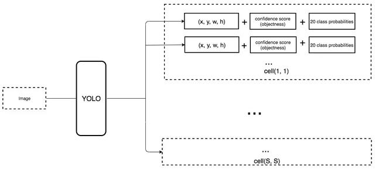

[TOC]

**更新日志：**

2018.11.18 陈方杰：修改第八章目标检测目录，新增目标检测基本概念，修改R-CNN、Fast R-CNN、RetinaNet，新增待完善论文FPN、RefineDet、RFBNet，以及新增所有论文链接。

2018.11.18 新增人脸检测部分，修改ssd-yolo系列

# 第八章  目标检测

**目标检测负责人：**

- 稿定科技计算机视觉工程师-刘鹏
- 哈工大博士袁笛
- 上海大学硕士陈方杰：微信（cfj123456ccfj）邮箱（1609951733@qq.com）

**目录**

8.1 基本概念

8.1.1 什么是目标检测？

8.1.2 目标检测要解决的核心问题

8.1.2 目标检测算法

8.2 Two Stage目标检测算法

8.2.1 R-CNN

8.2.2 Fast R-CNN

8.2.3 Faster R-CNN

8.2.4 R-FCN

8.2.5 FPN

8.2.6 Mask R-CNN

8.2.7 RefineDet

8.2.8 Cascade R-CNN

8.3 One Stage目标检测算法

8.3.1 SSD

8.3.2 DSSD

8.3.3 FSSD

8.3.4 YOLOv1

8.3.5 YOLOv2

8.3.6 YOLO9000

8.3.7 YOLOv3

8.3.8 RetinaNet

8.3.9 RFBNet

8.3.10 M2Det

Reference


## 8.1 基本概念

### 8.1.1 什么是目标检测？

目标检测（Object Detection）的任务是找出图像中所有感兴趣的目标（物体），确定它们的类别和位置，是计算机视觉领域的核心问题之一。由于各类物体有不同的外观，形状，姿态，加上成像时光照，遮挡等因素的干扰，目标检测一直是计算机视觉领域最具有挑战性的问题。

计算机视觉中关于图像识别有四大类任务：

**分类-Classification**：解决“是什么？”的问题，即给定一张图片或一段视频判断里面包含什么类别的目标。

**定位-Location**：解决“在哪里？”的问题，即定位出这个目标的的位置。

**检测-Detection**：解决“是什么？在哪里？”的问题，即定位出这个目标的的位置并且知道目标物是什么。

**分割-Segmentation**：分为实例的分割（Instance-level）和场景分割（Scene-level），解决“每一个像素属于哪个目标物或场景”的问题。


### 8.1.2 目标检测要解决的核心问题？

除了图像分类之外，目标检测要解决的核心问题是：

1.目标可能出现在图像的任何位置。

2.目标有各种不同的大小。

3.目标可能有各种不同的形状。

如果用矩形框来定义目标，则矩形有不同的宽高比。由于目标的宽高比不同，因此采用经典的滑动窗口+图像缩放的方案解决通用目标检测问题的成本太高。

### 8.1.2 目标检测算法分类？

基于深度学习的目标检测算法主要分为两类：

**1.Two stage目标检测算法**

先进行区域生成（region proposal，RP）（一个有可能包含待检物体的预选框），再通过卷积神经网络进行样本分类。

任务：特征提取—>生成RP—>分类/定位回归。

常见的two stage目标检测算法有：R-CNN、SPP-Net、Fast R-CNN、Faster R-CNN和R-FCN等。

**2.One stage目标检测算法**

不用RP，直接在网络中提取特征来预测物体分类和位置。

任务：特征提取—>分类/定位回归。

常见的one stage目标检测算法有：OverFeat、YOLOv1、YOLOv2、YOLOv3、SSD和RetinaNet等。


## 8.2 Two Stage目标检测算法 

### 8.2.1 R-CNN

**标题：《Rich feature hierarchies for accurate object detection and semantic segmentation》**

**时间：2014**

**出版源：CVPR 2014**

**主要链接**：

- arXiv：http://arxiv.org/abs/1311.2524
- github(caffe)：https://github.com/rbgirshick/rcnn

**R-CNN 创新点**

- 使用CNN（ConvNet）对 region proposals 计算 feature vectors。从经验驱动特征（SIFT、HOG）到数据驱动特征（CNN feature map），提高特征对样本的表示能力。
- 采用大样本下（ILSVRC）有监督预训练和小样本（PASCAL）微调（fine-tuning）的方法解决小样本难以训练甚至过拟合等问题。

注：ILSVRC其实就是众所周知的ImageNet的挑战赛，数据量极大；PASCAL数据集（包含目标检测和图像分割等），相对较小。

**R-CNN 介绍**

R-CNN作为R-CNN系列的第一代算法，其实没有过多的使用“深度学习”思想，而是将“深度学习”和传统的“计算机视觉”的知识相结合。比如R-CNN pipeline中的第二步和第四步其实就属于传统的“计算机视觉”技术。使用selective search提取region proposals，使用SVM实现分类。


原论文中R-CNN pipeline只有4个步骤，光看上图无法深刻理解R-CNN处理机制，下面结合图示补充相应文字

1. 预训练模型。选择一个预训练 （pre-trained）神经网络（如AlexNet、VGG）。

2. 重新训练全连接层。使用需要检测的目标重新训练（re-train）最后全连接层（connected layer）。

3. 提取 proposals并计算CNN 特征。利用选择性搜索（Selective Search）算法提取所有proposals（大约2000幅images），调整（resize/warp）它们成固定大小，以满足 CNN输入要求（因为全连接层的限制），然后将feature map 保存到本地磁盘。

   

4. 训练SVM。利用feature map 训练SVM来对目标和背景进行分类（每个类一个二进制SVM）

5. 边界框回归（Bounding boxes Regression）。训练将输出一些校正因子的线性回归分类器


**R-CNN 实验结果**

R-CNN在VOC 2007测试集上mAP达到58.5%，打败当时所有的目标检测算法。


**参考**

[Amusi-R-CNN论文笔记](https://github.com/amusi/paper-note/blob/master/Object-Detection/R-CNN%E8%AE%BA%E6%96%87%E7%AC%94%E8%AE%B0.md)


### 8.2.2 Fast R-CNN

**标题：《Fast R-CNN》**

**时间：2015**

**出版源：ICCV 2015**

**主要链接：**

- arXiv：https://arxiv.org/abs/1504.08083
- github(Official)：https://github.com/rbgirshick/fast-rcnn

**Fast R-CNN 创新点**

1. 只对整幅图像进行一次特征提取，避免R-CNN中的冗余特征提取
2. 用RoI pooling层替换最后一层的max pooling层，同时引入建议框数据，提取相应建议框特征
3. Fast R-CNN网络末尾采用并行的不同的全连接层，可同时输出分类结果和窗口回归结果，实现了end-to-end的多任务训练【建议框提取除外】，也不需要额外的特征存储空间【R-CNN中的特征需要保持到本地，来供SVM和Bounding-box regression进行训练】
4. 采用SVD对Fast R-CNN网络末尾并行的全连接层进行分解，减少计算复杂度，加快检测速度。

**Fast R-CNN 介绍**

Fast R-CNN是基于R-CNN和[SPPnets](https://arxiv.org/abs/1406.4729)进行的改进。SPPnets，其创新点在于计算整幅图像的the shared feature map，然后根据object proposal在shared feature map上映射到对应的feature vector（就是不用重复计算feature map了）。当然，SPPnets也有缺点：和R-CNN一样，训练是多阶段（multiple-stage pipeline）的，速度还是不够"快"，特征还要保存到本地磁盘中。

将候选区域直接应用于特征图，并使用ROI池化将其转化为固定大小的特征图块。以下是Fast R-CNN的流程图


**RoI Pooling层详解**

因为Fast R-CNN使用全连接层，所以应用RoI Pooling将不同大小的ROI转换为固定大小。

RoI Pooling 是Pooling层的一种，而且是针对RoI的Pooling，其特点是输入特征图尺寸不固定，但是输出特征图尺寸固定（如7x7）。

**什么是RoI呢？**

RoI是Region of Interest的简写，一般是指图像上的区域框，但这里指的是由Selective Search提取的候选框。


往往经过rpn后输出的不止一个矩形框，所以这里我们是对多个RoI进行Pooling。

**RoI Pooling的输入**

输入有两部分组成： 

1. 特征图（feature map）：指的是上面所示的特征图，在Fast RCNN中，它位于RoI Pooling之前，在Faster RCNN中，它是与RPN共享那个特征图，通常我们常常称之为“share_conv”； 
2. RoIs，其表示所有RoI的N*5的矩阵。其中N表示RoI的数量，第一列表示图像index，其余四列表示其余的左上角和右下角坐标。

在Fast RCNN中，指的是Selective Search的输出；在Faster RCNN中指的是RPN的输出，一堆矩形候选框，形状为1x5x1x1（4个坐标+索引index），其中值得注意的是：坐标的参考系不是针对feature map这张图的，而是针对原图的（神经网络最开始的输入）。其实关于ROI的坐标理解一直很混乱，到底是根据谁的坐标来。其实很好理解，我们已知原图的大小和由Selective Search算法提取的候选框坐标，那么根据"映射关系"可以得出特征图（featurwe map）的大小和候选框在feature map上的映射坐标。至于如何计算，其实就是比值问题，下面会介绍。所以这里把ROI理解为原图上各个候选框（region proposals），也是可以的。

注：说句题外话，由Selective Search算法提取的一系列可能含有object的boudning box，这些通常称为region proposals或者region of interest（ROI）。

**RoI的具体操作**

1. 根据输入image，将ROI映射到feature map对应位置

   注：映射规则比较简单，就是把各个坐标除以“输入图片与feature map的大小的比值”，得到了feature map上的box坐标

2. 将映射后的区域划分为相同大小的sections（sections数量与输出的维度相同）

3. 对每个sections进行max pooling操作

这样我们就可以从不同大小的方框得到固定大小的相应 的feature maps。值得一提的是，输出的feature maps的大小不取决于ROI和卷积feature maps大小。ROI pooling 最大的好处就在于极大地提高了处理速度。

**RoI Pooling的输出**

输出是batch个vector，其中batch的值等于RoI的个数，vector的大小为channel * w * h；RoI Pooling的过程就是将一个个大小不同的box矩形框，都映射成大小固定（w * h）的矩形框。

**RoI Pooling示例**


**参考**

[Amusi-Fast R-CNN论文笔记](https://github.com/amusi/paper-note/blob/master/Object-Detection/Fast-R-CNN%E8%AE%BA%E6%96%87%E7%AC%94%E8%AE%B0.md)

### 8.2.3 Faster R-CNN  

**标题：《Faster R-CNN: Towards Real-Time Object Detection with Region Proposal Networks》**

**时间：2015**

**出版源：NIPS 2015**

**主要链接：**

- arXiv：http://arxiv.org/abs/1506.01497
- github(official, Matlab)：https://github.com/ShaoqingRen/faster_rcnn
- github(official, Caffe)：https://github.com/rbgirshick/py-faster-rcnn

    Fast R-CNN依赖于外部候选区域方法，如选择性搜索。但这些算法在CPU上运行且速度很慢。在测试中，Fast R-CNN需要2.3秒来进行预测，其中2秒用于生成2000个ROI。Faster R-CNN采用与Fast R-CNN相同的设计，只是它用内部深层网络代替了候选区域方法。新的候选区域网络（RPN）在生成ROI时效率更高，并且以每幅图像10毫秒的速度运行。
     

    图8.1.13 Faster R-CNN的流程图
    Faster R-CNN的流程图与Fast R-CNN相同，采用外部候选区域方法代替了内部深层网络。
     

    图8.1.14
    **候选区域网络**

    候选区域网络（RPN）将第一个卷积网络的输出特征图作为输入。它在特征图上滑动一个3×3的卷积核，以使用卷积网络（如下所示的ZF网络）构建与类别无关的候选区域。其他深度网络（如VGG或ResNet）可用于更全面的特征提取，但这需要以速度为代价。ZF网络最后会输出256个值，它们将馈送到两个独立的全连接层，以预测边界框和两个objectness分数，这两个objectness分数度量了边界框是否包含目标。我们其实可以使用回归器计算单个objectness分数，但为简洁起见，Faster R-CNN使用只有两个类别的分类器：即带有目标的类别和不带有目标的类别。
     

    图8.1.15
    对于特征图中的每一个位置，RPN会做k次预测。因此，RPN将输出4×k个坐标和每个位置上2×k个得分。下图展示了8×8的特征图，且有一个3×3的卷积核执行运算，它最后输出8×8×3个ROI（其中k=3）。下图（右）展示了单个位置的3个候选区域。
    

    图8.1.16
    假设最好涵盖不同的形状和大小。因此，Faster R-CNN不会创建随机边界框。相反，它会预测一些与左上角名为锚点的参考框相关的偏移量（如x, y）。我们限制这些偏移量的值，因此我们的猜想仍然类似于锚点。
     

    图8.1.17
    要对每个位置进行k个预测，我们需要以每个位置为中心的k个锚点。每个预测与特定锚点相关联，但不同位置共享相同形状的锚点。
     

    图8.1.18
    这些锚点是精心挑选的，因此它们是多样的，且覆盖具有不同比例和宽高比的现实目标。这使得我们可以用更好的猜想来指导初始训练，并允许每个预测专门用于特定的形状。该策略使早期训练更加稳定和简便。
    

    图8.1.19
    Faster R-CNN使用更多的锚点。它部署9个锚点框：3个不同宽高比的3个不同大小的锚点框。每一个位置使用9个锚点，每个位置会生成2×9个objectness分数和4×9个坐标。

### 8.2.4 R-FCN

**标题：《R-FCN: Object Detection via Region-based Fully Convolutional Networks》**

**时间：2016**

**出版源：NIPS 2016**

**主要链接：**

- arXiv：https://arxiv.org/abs/1605.06409
- github(Official)：https://github.com/daijifeng001/r-fcn

**R-FCN 创新点**

R-FCN 仍属于two-stage 目标检测算法：RPN+R-FCN

- Fully convolutional
- 位置敏感得分图（position-sentive score maps）

> our region-based detector is **fully convolutional** with almost all computation shared on the entire image. To achieve this goal, we propose **position-sensitive score maps** to address a dilemma between translation-invariance in image classification and translation-variance in object detection.

R-FCN backbone：ResNet

ResNet-101+R-FCN：83.6% in PASCAL VOC 2007 test datasets

既提高了mAP，又加快了检测速度

    假设我们只有一个特征图用来检测右眼。那么我们可以使用它定位人脸吗？应该可以。因为右眼应该在人脸图像的左上角，所以我们可以利用这一点定位整个人脸。如果我们还有其他用来检测左眼、鼻子或嘴巴的特征图，那么我们可以将检测结果结合起来，更好地定位人脸。现在我们回顾一下所有问题。在Faster R-CNN中，检测器使用了多个全连接层进行预测。如果有2000个ROI，那么成本非常高。R-FCN通过减少每个ROI所需的工作量实现加速。上面基于区域的特征图与ROI是独立的，可以在每个ROI之外单独计算。剩下的工作就比较简单了，因此R-FCN的速度比Faster R-CNN快。


    图8.2.1 人脸检测
    现在我们来看一下5×5的特征图M，内部包含一个蓝色方块。我们将方块平均分成3×3个区域。现在，我们在M中创建了一个新的特征图，来检测方块的左上角（TL）。这个新的特征图如下图（右）所示。只有黄色的网格单元[2,2]处于激活状态。在左侧创建一个新的特征图，用于检测目标的左上角。
 

    图8.2.2 检测示例
    我们将方块分成9个部分，由此创建了9个特征图，每个用来检测对应的目标区域。这些特征图叫做位置敏感得分图（position-sensitive score map），因为每个图检测目标的子区域（计算其得分）。


    图8.2.3生成9个得分图
    下图中红色虚线矩形是建议的ROI。我们将其分割成3×3个区域，并询问每个区域包含目标对应部分的概率是多少。例如，左上角ROI区域包含左眼的概率。我们将结果存储成3×3 vote数组，如下图（右）所示。例如，vote_array[0][0]包含左上角区域是否包含目标对应部分的得分。
 

    图8.2.4
    将ROI应用到特征图上，输出一个3x3数组。将得分图和ROI映射到vote数组的过程叫做位置敏感ROI池化（position-sensitive ROI-pool）。该过程与前面讨论过的ROI池化非常接近。
 

    图8.2.5
    将ROI的一部分叠加到对应的得分图上，计算V[i][j]。在计算出位置敏感ROI池化的所有值后，类别得分是其所有元素得分的平均值。


    图8.2.6 ROI池化
    假如我们有C个类别要检测。我们将其扩展为C+1个类别，这样就为背景（非目标）增加了一个新的类别。每个类别有3×3个得分图，因此一共有(C+1)×3×3个得分图。使用每个类别的得分图可以预测出该类别的类别得分。然后我们对这些得分应用 softmax 函数，计算出每个类别的概率。以下是数据流图，在本案例中，k=3。
 

    图8.2.7
### 8.2.5 FPN

**标题：《Feature Pyramid Networks for Object Detection》**

**时间：2016**

**出版源：CVPR 2017**

**主要链接：**

- arXiv：https://arxiv.org/abs/1612.03144

- [ ] TODO

### 8.2.6 Mask R-CNN

**标题：《Mask R-CNN》**

**时间：2017**

**出版源：ICCV 2017**

**主要链接：**

- arXiv：https://arxiv.org/abs/1703.06870


- github(Official)：https://github.com/facebookresearch/Detectron


- [ ] TODO

### 8.2.7 RefineDet

**标题：《Single-Shot Refinement Neural Network for Object Detection》**

**时间：2017**

**出版源：CVPR 2018**

**主要链接：**

- arXiv：https://arxiv.org/abs/1711.06897
- github(Official)：https://github.com/sfzhang15/RefineDet


- [ ] TODO

### 8.2.8 Cascade R-CNN

**标题：《Cascade R-CNN: Delving into High Quality Object Detection》**

**时间：2017**

**出版源：CVPR 2018**

**主要链接：**

- arXiv：https://arxiv.org/abs/1712.00726
- github(Official)：https://github.com/zhaoweicai/cascade-rcnn


- [ ] TODO

## 8.3 One Stage目标检测算法

    我们将对单次目标检测器（包括SSD、YOLO、YOLOv2、YOLOv3）进行综述。我们将分析FPN以理解多尺度特征图如何提高准确率，特别是小目标的检测，其在单次检测器中的检测效果通常很差。然后我们将分析Focal loss和RetinaNet，看看它们是如何解决训练过程中的类别不平衡问题的。
### 8.3.1 SSD  

**标题：《SSD: Single Shot MultiBox Detector》**

**时间：2015**

**出版源：ECCV 2016**

**主要链接：**

- arXiv：https://arxiv.org/abs/1512.02325
- github(Official)：https://github.com/weiliu89/caffe/tree/ssd

```
Faster R-CNN中，在分类器之后有一个专用的候选区域网络。
```


```
图8.3.1 Faster R-CNN工作流
基于区域的检测器是很准确的，但需要付出代价。Faster R-CNN在PASCAL VOC 2007测试集上每秒处理7帧的图像（7FPS）。和R-FCN类似，研究者通过减少每个ROI的工作量来精简流程。
作为替代，我们是否需要一个分离的候选区域步骤？我们可以直接在一个步骤内得到边界框和类别吗？
```

```
让我们再看一下滑动窗口检测器。我们可以通过在特征图上滑动窗口来检测目标。对于不同的目标类型，我们使用不同的窗口类型。以前的滑动窗口方法的致命错误在于使用窗口作为最终的边界框，这就需要非常多的形状来覆盖大部分目标。更有效的方法是将窗口当作初始猜想，这样我们就得到了从当前滑动窗口同时预测类别和边界框的检测器。
```


```
图8.3.2
基于滑动窗口进行预测这个概念和Faster R-CNN中的锚点很相似。然而，单次检测器会同时预测边界框和类别。例如，我们有一个8×8特征图，并在每个位置做出k个预测，即总共有8×8×k个预测结果。
```

 

```
图8.3.3 64个位置
在每个位置，我们有k个锚点（锚点是固定的初始边界框猜想），一个锚点对应一个特定位置。我们使用相同的锚点形状仔细地选择锚点和每个位置。
```

 

```
图8.3.4 使用4个锚点在每个位置做出4个预测
以下是4个锚点（绿色）和4个对应预测（蓝色），每个预测对应一个特定锚点。在Faster R-CNN中，我们使用卷积核来做5个参数的预测：4个参数对应某个锚点的预测边框，1个参数对应objectness置信度得分。因此3×3×D×5卷积核将特征图从8×8×D转换8×8×5。
```


```
图8.3.5 4个预测，每个预测对应一个锚点
```

 

```
图8.3.6 使用3×3卷积核计算预测
在单次检测器中，卷积核还预测C个类别概率以执行分类（每个概率对应一个类别）。因此我们应用一个3×3×D×25卷积核将特征图从8×8×D转换为8×8×25（C=20）。
```

 

```
图8.3.7 每个位置做出k个预测，每个预测有25个参数
单次检测器通常需要在准确率和实时处理速度之间进行权衡。它们在检测太近距离或太小的目标时容易出现问题。
```

    SSD是使用VGG19网络作为特征提取器（和Faster R-CNN中使用的CNN一样）的单次检测器。我们在该网络之后添加自定义卷积层（蓝色），并使用卷积核（绿色）执行预测。


    图8.3.8 同时对类别和位置执行单次预测
    然而，卷积层降低了空间维度和分辨率。因此上述模型仅可以检测较大的目标。为了解决该问题，我们从多个特征图上执行独立的目标检测。
 

    图8.3.9 使用多尺度特征图用于检测
### 8.3.2 DSSD

**标题：《DSSD : Deconvolutional Single Shot Detector》**

**时间：2017**

**出版源：CVPR 2017**

**主要链接：**

- arXiv：https://arxiv.org/abs/1701.06659
- github(Official)：https://github.com/chengyangfu/caffe/tree/dssd


- [ ] TODO

### 8.3.3 FSSD

**标题：《FSSD: Feature Fusion Single Shot Multibox Detector》**

**时间：2017**

**出版源：None**

**主要链接：**

- arXiv：https://arxiv.org/abs/1712.00960


- [ ] TODO

### 8.3.4 YOLOv1

**标题：《You Only Look Once: Unified, Real-Time Object Detection》**

**时间：2015**

**出版源：CVPR 2016**

**主要链接：**

- arXiv：http://arxiv.org/abs/1506.02640
- github(Official)：https://github.com/pjreddie/darknet

    YOLO之前的物体检测系统使用分类器来完成物体检测任务。为了检测一个物体，这些物体检测系统要在一张测试图的不同位置和不同尺寸的bounding box上使用该物体的分类器去评估是否有该物体。如DPM系统，要使用一个滑窗（sliding window）在整张图像上均匀滑动，用分类器评估是否有物体。
    在DPM之后提出的其他方法，如R-CNN方法使用region proposal来生成整张图像中可能包含待检测物体的potential bounding boxes，然后用分类器来评估这些boxes，接着通过post-processing来改善bounding boxes，消除重复的检测目标，并基于整个场景中的其他物体重新对boxes进行打分。整个流程执行下来很慢，而且因为这些环节都是分开训练的，检测性能很难进行优化。
    作者设计了YOLO（You Only Look Once: Unified, Real-Time Object Detection），将物体检测任务当作回归问题（regression problem）来处理，直接通过整张图片的所有像素得到bounding box的坐标、box中包含物体的置信度和class probabilities。通过YOLO，每张图像只需要看一眼就能得出图像中都有哪些物体和这些物体的位置。

    图7.4.1
    如图所示，使用YOLO来检测物体，其流程是非常简单明了的：（1）将图像resize到448×448作为神经网络的输入；（2）运行神经网络，得到一些bounding box坐标、box中包含物体的置信度和class probabilities；（3）进行非极大值抑制，筛选Boxes。下图是各物体检测系统的检测流程对比：

    图7.4.2
    **（1）Unified Detection**

    YOLO将输入图像划分为S×S的栅格，每个栅格负责检测中心落在该栅格中的物体,如下图所示：

    图7.4.3
    每一个栅格预测B个bounding boxes，以及这些bounding boxes的confidence scores。这个confidence scores反映了模型对于这个栅格的预测：该栅格是否含有物体，以及这个box的坐标预测的有多准。如果这个栅格中不存在一个object，则confidence score应该为0；否则的话，confidence score则为predicted bounding box与ground truth box之间的IOU（intersection over union）。YOLO对每个bounding box有5个predictions：x, y, w, h, and confidence。坐标x,y代表了预测的bounding box的中心与栅格边界的相对值。坐标w,h代表了预测的bounding box的width、height相对于整幅图像width,height的比例。confidence就是预测的bounding box和ground truth box的IOU值。

    图7.4.4

    图7.4.5
    每一个栅格还要预测C个conditional class probability（条件类别概率）：Pr(Classi|Object)。即在一个栅格包含一个Object的前提下，它属于某个类的概率。只为每个栅格预测一组（C个）类概率，而不考虑框B的数量。

    图7.4.6
    注意：conditional class probability信息是针对每个网格的。confidence信息是针对每个bounding box的。在测试阶段，将每个栅格的conditional class probabilities与每个bounding box的confidence相乘。这样既可得到每个bounding box的具体类别的confidence score。这乘积既包含了bounding box中预测的class的probability信息，也反映了bounding box是否含有Object和bounding box坐标的准确度。

    图7.4.7
    将YOLO用于PASCAL VOC数据集时：论文使用的S=7，即将一张图像分为7×7=49个栅格每一个栅格预测B=2个boxes（每个box有x, y, w, h, confidence，5个预测值），同时C=20（PASCAL数据集中有20个类别）。因此，最后的prediction是7×7×30{即S×S×(B×5+C)}的Tensor。

    图7.4.8

    图7.4.9

    图7.4.10

**（2）Network Design**

    YOLO检测网络包括24个卷积层和2个全连接层,如图所示：
    
    图7.4.11
    
    图7.4.12
    其中，卷积层用来提取图像特征，全连接层用来预测图像位置和类别概率值。YOLO网络借鉴了GoogLeNet分类网络结构。不同的是，YOLO未使用inception module，而是使用1×1卷积层（此处1x1卷积层的存在是为了跨通道信息整合）3×3卷积层进行简单替代。

**（3）Training**

    首先利用ImageNet 1000-class的分类任务数据集Pretrain卷积层。使用上述网络中的前20个卷积层，加上一个average-pooling layer，最后加一个全连接层，作为Pretrain的网络。训练大约一周的时间，使得在ImageNet 2012的验证数据集Top-5的精度达到88%，这个结果跟GoogleNet的效果相当。将Pretrain的结果的前20层卷积层应用到Detection中，并加入剩下的4个卷积层及2个全连接。同时为了获取更精细化的结果，将输入图像的分辨率由224×224提升到448×448。将所有的预测结果都归一化到0-1,使用Leaky RELU作为激活函数。为了防止过拟合，在第一个全连接层后面接了一个ratio=0.5的Dropout层。为了提高精度，对原始图像做数据提升。
**（4）损失函数**

    损失函数的设计目标就是让坐标（x,y,w,h），confidence，classification这个三个方面达到很好的平衡。简单的全部采用了sum-squared error loss来做这件事会有以下不足：（1）8维的localization error和20维的classification error同等重要显然是不合理的；（2）如果一些栅格中没有object（一幅图中这种栅格很多），那么就会将这些栅格中的bounding box的confidence置为0，相比于较少的有object的栅格，这些不包含物体的栅格对梯度更新的贡献会远大于包含物体的栅格对梯度更新的贡献，这会导致网络不稳定甚至发散。
    
    图7.4.13
    解决方案如下：更重视8维的坐标预测，给这些损失前面赋予更大的loss weight,记为λcoord,在pascal VOC训练中取5（上图蓝色框）。对没有object的bbox的confidence loss，赋予小的loss weight，记为λnoobj，在pascal VOC训练中取0.5（上图橙色框）。有object的bbox的confidence loss(上图红色框)和类别的loss（上图紫色框）的loss weight正常取1。
    对不同大小的bbox预测中，相比于大bbox预测偏一点，小box预测偏相同的尺寸对IOU的影响更大。而sum-square error loss中对同样的偏移loss是一样。为了缓和这个问题，作者用了一个巧妙的办法，就是将box的width和height取平方根代替原本的height和width。在YOLO中，每个栅格预测多个bounding box，但在网络模型的训练中，希望每一个物体最后由一个bounding box predictor来负责预测。因此，当前哪一个predictor预测的bounding box与ground truth box的IOU最大，这个predictor就负责predict object。这会使得每个predictor可以专门的负责特定的物体检测。随着训练的进行，每一个predictor对特定的物体尺寸、长宽比的物体的类别的预测会越来越好。


    图7.4.14神经网络输出后的检测流程
    
    图7.4.15
**（5）非极大值抑制**

 

    图7.4.16
**（6）获取Object Detect结果**

    图7.4.17
**YOLOv1模型优缺点**

（1）YOLO检测物体非常快。

    因为没有复杂的检测流程，只需要将图像输入到神经网络就可以得到检测结果，YOLO可以非常快的完成物体检测任务。标准版本的YOLO在TitanX的GPU上能达到45FPS。更快的Fast YOLO检测速度可以达到155FPS。而且，YOLO的mAP是之前其他实时物体检测系统的两倍以上。
（2）YOLO可以很好的避免背景错误，产生false positives。

    不像其他物体检测系统使用了滑窗或region proposal，分类器只能得到图像的局部信息。YOLO在训练和测试时都能够看到一整张图像的信息，因此YOLO在检测物体时能很好的利用上下文信息，从而不容易在背景上预测出错误的物体信息。和Fast-R-CNN相比，YOLO的背景错误不到Fast-R-CNN的一半。
（3）YOLO可以学到物体的泛化特征。

    当YOLO在自然图像上做训练，在艺术作品上做测试时，YOLO表现的性能比DPM、R-CNN等之前的物体检测系统要好很多。因为YOLO可以学习到高度泛化的特征，从而迁移到其他领域。
    尽管YOLO有这些优点，它也有一些缺点：（1）YOLO的物体检测精度低于其他state-of-the-art的物体检测系统；（2）YOLO容易产生物体的定位错误；（3）YOLO对小物体的检测效果不好（尤其是密集的小物体，因为一个栅格只能预测2个物体）。
    下图是各物体检测系统的检测性能对比：
     
    图7.4.18
###  8.3.5 YOLOv2

**标题：《YOLO9000: Better, Faster, Stronger》**

**时间：2016**

**出版源：None**

**主要链接：**

- arXiv：https://arxiv.org/abs/1612.08242
- github(Official)：https://pjreddie.com/darknet/yolov2/

    YOLOv2相比YOLOv1做了很多方面的改进，这也使得YOLOv2的mAP有显著的提升，并且YOLOv2的速度依然很快，保持着自己作为one-stage方法的优势，YOLOv2和Faster R-CNN,SSD等模型的对比如图7.4.19所示。

    图7.4.19 YOLOv2与其它模型在VOC 2007数据集上的效果对比
    YOLOv1虽然检测速度很快，但是在检测精度上却不如R-CNN系检测方法，YOLOv1在物体定位方面（localization）不够准确，并且召回率（recall）较低。YOLOv2共提出了几种改进策略来提升YOLO模型的定位准确度和召回率，从而提高mAP，YOLOv2在改进中遵循一个原则：保持检测速度，这也是YOLO模型的一大优势。YOLOv2的改进策略如图7.4.20所示，可以看出，大部分的改进方法都可以比较显著提升模型的mAP。
    **YOLOv2改进策略**

    图7.4.20 YOLOv2相比YOLOv1的改进策略
    （1）Batch Normalization

    Batch Normalization可以提升模型收敛速度，而且可以起到一定正则化效果，降低模型的过拟合。在YOLOv2中，每个卷积层后面都添加了Batch Normalization层，并且不再使用droput。使用Batch Normalization后，YOLOv2的mAP提升了2.4%。
    （2）High Resolution Classifier

    目前的目标检测方法中，基本上都会使用ImageNet预训练过的模型（classifier）来提取特征，如果用的是AlexNet网络，那么输入图片会被resize到不足256×256，导致分辨率不够高，给检测带来困难。为此，新的YOLO网络把分辨率直接提升到了448×448，这也意味之原有的网络模型必须进行某种调整以适应新的分辨率输入。
    对于YOLOv2，作者首先对分类网络（自定义的darknet）进行了fine tune，分辨率改成448×448，在ImageNet数据集上训练10轮（10epochs），训练后的网络就可以适应高分辨率的输入了。然后，作者对检测网络部分（也就是后半部分）也进行fine tune。这样通过提升输入的分辨率，mAP获得了4%的提升。

（3）Convolutional With Anchor Boxes

    之前的YOLO利用全连接层的数据完成边框的预测，导致丢失较多的空间信息，定位不准。作者在这一版本中借鉴了Faster R-CNN中的anchor思想，回顾一下，anchor是RNP网络中的一个关键步骤，说的是在卷积特征图上进行滑窗操作，每一个中心可以预测9种不同大小的建议框。
    
    图7.4.21
    为了引入anchor boxes来预测bounding boxes，作者在网络中果断去掉了全连接层。剩下的具体怎么操作呢？
    首先，作者去掉了后面的一个池化层以确保输出的卷积特征图有更高的分辨率。然后，通过缩减网络，让图片输入分辨率为416×416，这一步的目的是为了让后面产生的卷积特征图宽高都为奇数，这样就可以产生一个center cell。作者观察到，大物体通常占据了图像的中间位置，就可以只用中心的一个cell来预测这些物体的位置，否则就要用中间的4个cell来进行预测，这个技巧可稍稍提升效率。最后，YOLOv2使用了卷积层降采样（factor为32），使得输入卷积网络的416×416图片最终得到13×13的卷积特征图（416/32=13）。加入了anchor boxes后，可以预料到的结果是召回率上升，准确率下降。我们来计算一下，假设每个cell预测9个建议框，那么总共会预测13×13×9=1521个boxes，而之前的网络仅仅预测7×7×2=98个boxes。具体数据为：没有anchor boxes，模型recall为81%，mAP为69.5%；加入anchor boxes，模型recall为88%，mAP为69.2%。这样看来，准确率只有小幅度的下降，而召回率则提升了7%，说明可以通过进一步的工作来加强准确率，的确有改进空间。

（4）Dimension Clusters（维度聚类）

    作者在使用anchor的时候遇到了两个问题，第一个是anchor boxes的宽高维度往往是精选的先验框（hand-picked priors），虽说在训练过程中网络也会学习调整boxes的宽高维度，最终得到准确的bounding boxes。但是，如果一开始就选择了更好的、更有代表性的先验boxes维度，那么网络就更容易学到准确的预测位置。和以前的精选boxes维度不同，作者使用了K-means聚类方法类训练bounding boxes，可以自动找到更好的boxes宽高维度。传统的K-means聚类方法使用的是欧氏距离函数，也就意味着较大的boxes会比较小的boxes产生更多的error，聚类结果可能会偏离。为此，作者采用的评判标准是IOU得分（也就是boxes之间的交集除以并集），这样的话，error就和box的尺度无关了，最终的距离函数为：
    
    作者通过改进的K-means对训练集中的boxes进行了聚类，判别标准是平均IOU得分，聚类结果如下图：
    
    图7.4.22数据集VOC和COCO上的边界框聚类分析结果
    可以看到，平衡复杂度和IOU之后，最终得到k值为5，意味着作者选择了5种大小的box维度来进行定位预测，这与手动精选的box维度不同。结果中扁长的框较少，而瘦高的框更多（这符合行人的特征），这种结论如不通过聚类实验恐怕是发现不了的。当然，作者也做了实验来对比两种策略的优劣，如下图，使用聚类方法，仅仅5种boxes的召回率就和Faster R-CNN的9种相当。说明K-means方法的引入使得生成的boxes更具有代表性，为后面的检测任务提供了便利。
    表7.4.1

（5）New Network：Darknet-19

    YOLOv2采用了一个新的基础模型（特征提取器），称为Darknet-19，包括19个卷积层和5个maxpooling层，如图4所示。Darknet-19与VGG16模型设计原则是一致的，主要采用3*3卷积，采用2*2的maxpooling层之后，特征图维度降低2倍，而同时将特征图的channles增加两倍。与NIN(Network in Network)类似，Darknet-19最终采用global avgpooling做预测，并且在3*3卷积之间使用1*1卷积来压缩特征图channles以降低模型计算量和参数。Darknet-19每个卷积层后面同样使用了batch norm层以加快收敛速度，降低模型过拟合。在ImageNet分类数据集上，Darknet-19的top-1准确度为72.9%，top-5准确度为91.2%，但是模型参数相对小一些。使用Darknet-19之后，YOLOv2的mAP值没有显著提升，但是计算量却可以减少约33%。
    表7.4.2

（6）Direct location prediction

    前面讲到，YOLOv2借鉴RPN网络使用anchor boxes来预测边界框相对先验框的offsets。边界框的实际中心位置 ，需要根据预测的坐标偏移值 ，先验框的尺度 以及中心坐标 （特征图每个位置的中心点）来计算：
    
    但是上面的公式是无约束的，预测的边界框很容易向任何方向偏移，如当 时边界框将向右偏移先验框的一个宽度大小，而当 时边界框将向左偏移先验框的一个宽度大小，因此每个位置预测的边界框可以落在图片任何位置，这导致模型的不稳定性，在训练时需要很长时间来预测出正确的offsets。所以，YOLOv2弃用了这种预测方式，而是沿用YOLOv1的方法，就是预测边界框中心点相对于对应cell左上角位置的相对偏移值，为了将边界框中心点约束在当前cell中，使用sigmoid函数处理偏移值，这样预测的偏移值在(0,1)范围内（每个cell的尺度看做1）。总结来看，根据边界框预测的4个offsets： ，可以按如下公式计算出边界框实际位置和大小：
    
    其中为 为cell的左上角坐标，如图5所示，在计算时每个cell的尺度为1，所以当前cell的左上角坐标为(1,1)。由于sigmoid函数的处理，边界框的中心位置会约束在当前cell内部，防止偏移过多。而 和 是先验框的宽度与长度，前面说过它们的值也是相对于特征图大小的，在特征图中每个cell的长和宽均为1。这里记特征图的大小为 （在文中是(13,13))，这样我们可以将边界框相对于整张图片的位置和大小计算出来（4个值均在0和1之间）：
    
    如果再将上面的4个值分别乘以图片的宽度和长度（像素点值）就可以得到边界框的最终位置和大小了。这就是YOLOv2边界框的整个解码过程。约束了边界框的位置预测值使得模型更容易稳定训练，结合聚类分析得到先验框与这种预测方法，YOLOv2的mAP值提升了约5%。
    
    图7.4.23边界框位置与大小的计算示例图
（7）Fine-Grained Features

    YOLOv2的输入图片大小为416*416，经过5次maxpooling之后得到13*13大小的特征图，并以此特征图采用卷积做预测。13*13大小的特征图对检测大物体是足够了，但是对于小物体还需要更精细的特征图（Fine-Grained Features）。因此SSD使用了多尺度的特征图来分别检测不同大小的物体，前面更精细的特征图可以用来预测小物体。YOLOv2提出了一种passthrough层来利用更精细的特征图。YOLOv2所利用的Fine-Grained Features是26*26大小的特征图（最后一个maxpooling层的输入），对于Darknet-19模型来说就是大小为26*26*512的特征图。passthrough层与ResNet网络的shortcut类似，以前面更高分辨率的特征图为输入，然后将其连接到后面的低分辨率特征图上。前面的特征图维度是后面的特征图的2倍，passthrough层抽取前面层的每个2*2的局部区域，然后将其转化为channel维度，对于26*26*512的特征图，经passthrough层处理之后就变成了13*13*2048的新特征图（特征图大小降低4倍，而channles增加4倍，图6为一个实例），这样就可以与后面的13*13*1024特征图连接在一起形成13*13*3072的特征图，然后在此特征图基础上卷积做预测。在YOLO的C源码中，passthrough层称为reorg layer。
另外，作者在后期的实现中借鉴了ResNet网络，不是直接对高分辨特征图处理，而是增加了一个中间卷积层，先采用64个1*1卷积核进行卷积，然后再进行passthrough处理，这样26*26*512的特征图得到13*13*256的特征图。这算是实现上的一个小细节。使用Fine-Grained Features之后YOLOv2的性能有1%的提升。

（8）Multi-Scale Training

    由于YOLOv2模型中只有卷积层和池化层，所以YOLOv2的输入可以不限于416*416大小的图片。为了增强模型的鲁棒性，YOLOv2采用了多尺度输入训练策略，具体来说就是在训练过程中每间隔一定的iterations之后改变模型的输入图片大小。由于YOLOv2的下采样总步长为32，输入图片大小选择一系列为32倍数的值：输入图片最小为320*320，此时对应的特征图大小为10*10（不是奇数了，确实有点尴尬），而输入图片最大为608*608,对应的特征图大小为19*19,在训练过程，每隔10个iterations随机选择一种输入图片大小，然后只需要修改对最后检测层的处理就可以重新训练。
    
    图7.4.24 Multi-Scale Training
    采用Multi-Scale Training策略，YOLOv2可以适应不同大小的图片，并且预测出很好的结果。在测试时，YOLOv2可以采用不同大小的图片作为输入，在VOC 2007数据集上的效果如下图所示。可以看到采用较小分辨率时，YOLOv2的mAP值略低，但是速度更快，而采用高分辨输入时，mAP值更高，但是速度略有下降，对于544*544,mAP高达78.6%。注意，这只是测试时输入图片大小不同，而实际上用的是同一个模型（采用Multi-Scale Training训练）。
     
    图7.4.25 YOLOv2在VOC 2007数据集上的性能对比
    
    总结来看，虽然YOLOv2做了很多改进，但是大部分都是借鉴其它论文的一些技巧，如Faster R-CNN的anchor boxes，YOLOv2采用anchor boxes和卷积做预测，这基本上与SSD模型（单尺度特征图的SSD）非常类似了，而且SSD也是借鉴了Faster R-CNN的RPN网络。从某种意义上来说，YOLOv2和SSD这两个one-stage模型与RPN网络本质上无异，只不过RPN不做类别的预测，只是简单地区分物体与背景。在two-stage方法中，RPN起到的作用是给出region proposals，其实就是作出粗糙的检测，所以另外增加了一个stage，即采用R-CNN网络来进一步提升检测的准确度（包括给出类别预测）。而对于one-stage方法，它们想要一步到位，直接采用“RPN”网络作出精确的预测，要因此要在网络设计上做很多的tricks。YOLOv2的一大创新是采用Multi-Scale Training策略，这样同一个模型其实就可以适应多种大小的图片了。

YOLOv2的训练

    YOLOv2的训练主要包括三个阶段。
    第一阶段：先在ImageNet分类数据集上预训练Darknet-19，此时模型输入为224*224,共训练160个epochs。
    第二阶段：将网络的输入调整为448*448,继续在ImageNet数据集上finetune分类模型，训练10个epochs，此时分类模型的top-1准确度为76.5%，而top-5准确度为93.3%。
    第三个阶段：修改Darknet-19分类模型为检测模型，并在检测数据集上继续finetune网络。
    网络修改包括（网路结构可视化）：移除最后一个卷积层、global avgpooling层以及softmax层，并且新增了三个3*3*2014卷积层，同时增加了一个passthrough层，最后使用1*1卷积层输出预测结果。

###  8.3.6 YOLO9000

github：http://pjreddie.com/yolo9000/

    YOLO9000是在YOLOv2的基础上提出的一种可以检测超过9000个类别的模型，其主要贡献点在于提出了一种分类和检测的联合训练策略。众多周知，检测数据集的标注要比分类数据集打标签繁琐的多，所以ImageNet分类数据集比VOC等检测数据集高出几个数量级。在YOLO中，边界框的预测其实并不依赖于物体的标签，所以YOLO可以实现在分类和检测数据集上的联合训练。对于检测数据集，可以用来学习预测物体的边界框、置信度以及为物体分类，而对于分类数据集可以仅用来学习分类，但是其可以大大扩充模型所能检测的物体种类。	作者选择在COCO和ImageNet数据集上进行联合训练，但是遇到的第一问题是两者的类别并不是完全互斥的，比如"Norfolk terrier"明显属于"dog"，所以作者提出了一种层级分类方法（Hierarchical classification），主要思路是根据各个类别之间的从属关系（根据WordNet）建立一种树结构WordTree，结合COCO和ImageNet建立的WordTree如下图所示：
    
    图7.4.26 基于COCO和ImageNet数据集建立的WordTree
    WordTree中的根节点为"physical object"，每个节点的子节点都属于同一子类，可以对它们进行softmax处理。在给出某个类别的预测概率时，需要找到其所在的位置，遍历这个path，然后计算path上各个节点的概率之积。
     
    图7.4.27 ImageNet与WordTree预测的对比
    在训练时，如果是检测样本，按照YOLOv2的loss计算误差，而对于分类样本，只计算分类误差。在预测时，YOLOv2给出的置信度就是Pr(physicalobject)，同时会给出边界框位置以及一个树状概率图。在这个概率图中找到概率最高的路径，当达到某一个阈值时停止，就用当前节点表示预测的类别。通过联合训练策略，YOLO9000可以快速检测出超过9000个类别的物体，总体mAP值为19,7%。我觉得这是作者在这篇论文作出的最大的贡献，因为YOLOv2的改进策略亮点并不是很突出，但是YOLO9000算是开创之举。

###  8.3.7 YOLOv3

**标题：《YOLOv3: An Incremental Improvement》**

**时间：2018**

**出版源：None**

**主要链接：**

- arXiv：https://arxiv.org/abs/1804.02767
- github(Official)：https://github.com/pjreddie/darknet

    YOLOv3在Pascal TitanX上处理608x608图像速度达到20FPS，在COCO test-dev上mAP@0.5达到57.9%，与RetinaNet（FocalLoss论文所提出的单阶段网络）的结果相近，并且速度快4倍。YOLOv3的模型比之前的模型复杂了不少，可以通过改变模型结构的大小来权衡速度与精度。速度对比如下：

    图7.4.28 性能对比图
    YOLOv3在实现相同准确度下要显著地比其它检测方法快。时间都是在采用M40或TitanX等相同GPU下测量的。
    简而言之，YOLOv3的先验检测（Prior detection）系统将分类器或定位器重新用于执行检测任务。他们将模型应用于图像的多个位置和尺度。而那些评分较高的区域就可以视为检测结果。此外，相对于其它目标检测方法，我们使用了完全不同的方法。我们将一个单神经网络应用于整张图像，该网络将图像划分为不同的区域，因而预测每一块区域的边界框和概率，这些边界框会通过预测的概率加权。我们的模型相比于基于分类器的系统有一些优势。它在测试时会查看整个图像，所以它的预测利用了图像中的全局信息。与需要数千张单一目标图像的R-CNN不同，它通过单一网络评估进行预测。这令YOLOv3非常快，一般它比R-CNN快1000倍、比Fast R-CNN快100倍。

**YOLOv3改进**

（1）多尺度预测（类FPN）

    每种尺度预测3个box, anchor的设计方式仍然使用聚类,得到9个聚类中心,将其按照大小均分给3中尺度。
    尺度1:在基础网络之后添加一些卷积层再输出box信息。
    尺度2:从尺度1中的倒数第二层的卷积层上采样(x2)再与最后一个16x16大小的特征图相加,再次通过多个卷积后输出box信息.相比尺度1变大两倍。
    尺度3:与尺度2类似,使用了32x32大小的特征图。

（2）更好的基础分类网络（类ResNet）和分类器darknet-53,见下图。

    图7.4.29 基础网络Darknet-53
（3）分类器-类别预测：

    YOLOv3不使用Softmax对每个框进行分类，主要考虑因素有两个：（1）Softmax使得每个框分配一个类别（score最大的一个），而对于Open Images这种数据集，目标可能有重叠的类别标签，因此Softmax不适用于多标签分类。（2）Softmax可被独立的多个logistic分类器替代，且准确率不会下降。分类损失采用binary cross-entropy loss。仿ResNet, 与ResNet-101或ResNet-152准确率接近,但速度更快.对比如下（准确率（top-1 误差、top-5 误差）、运算次数（/十亿）、每秒浮点数运算次数（/十亿），以及 FPS 值。）:
    表7.4.3主干架构的性能对比
     
    检测结构如下：
     
    图7.4.30
     
    图7.4.31
    从中看出，YOLOv3表现得不错。RetinaNet需要大约3.8倍的时间来处理一张图像，YOLOv3相比SSD变体要好得多，并在AP_50指标上和当前最佳模型有得一拼。YOLOv3在mAP@0.5及小目标APs上具有不错的结果,但随着IOU的增大,性能下降,说明YOLOv3不能很好地与ground truth切合。
    边框预测：
     
    图7.4.32带有维度先验和定位预测的边界框。我们边界框的宽和高以作为离聚类中心的位移，并使用Sigmoid函数预测边界框相对于滤波器应用位置的中心坐标。仍采用之前的logis其中cx,cy是网格的坐标偏移量,pw,ph是预设的anchor box的边长.最终得到的边框坐标值是b*,而网络学习目标是t*，用sigmod函数、指数转换。

YOLOv3模型优缺点

（1）优点

    a)	快速,pipline简单；
    b)	背景误检率低；
    c)	通用性强。
    YOLO对于艺术类作品中的物体检测同样适用。它对非自然图像物体的检测率远远高于DPM和RCNN系列检测方法。

（2）缺点

    但相比RCNN系列物体检测方法，YOLO具有以下缺点：
    a)	识别物体位置精准性差。
    b)	召回率低。
    在每个网格中预测两个box这种约束方式减少了对同一目标的多次检测(R-CNN使用的region proposal方式重叠较多),相比R-CNN使用Selective Search产生2000个proposal（RCNN测试时每张超过40秒），yolo仅使用7x7x2个。

### 8.3.8 RetinaNet

**标题：《Focal Loss for Dense Object Detection》**

**时间：2017**

**出版源：ICCV 2017（Best Student Paper Award）**

**主要链接：**

- arXiv：https://arxiv.org/abs/1708.02002
- github(Official)：https://github.com/facebookresearch/Detectron

**研究背景**

- Two-Stage检测器（如Faster R-CNN、FPN）效果好，但速度相对慢
- One-Stage检测器（如YOLO、SSD）速度快，但效果一般


作者对one-stage检测器准确率不高的问题进行探究，发现主要问题在于正负类别不均衡（简单-难分类别不均衡）。

> We discover that the extreme foreground-background class imbalance encountered during training of dense detectors is the central cause.

作者建议通过重新设计标准的交叉熵损失（cross entropy loss）来解决这种类别不平衡（class inbalance）问题，即提出Focal Loss。

> We propose to address this class imbalance by reshaping the standard cross entropy loss such that it down-weights the loss assigned to well-classified examples. Our novel Focal Loss focuses training on a sparse set of hard examples and prevents the vast number of easy negatives from overwhelming the detector during training.

结合Focal Loss的one-stage检测器称为RetinaNet，该检测器在COCO上mAP可以和特征金字塔网络（feature pyramid network，FPN）或者Mask R-CNN接近，

**问：什么是类别不均衡（class imbalance）？**

答：负样本的数量极大于正样本的数量，比如包含物体的区域（正样本）很少，而不包含物体的区域（负样本）很多。比如检测算法在早期会生成一大波的bbox。而一幅常规的图片中，顶多就那么几个object。这意味着，绝大多数的bbox属于background。

**问：样本的类别不均衡会带来什么问题？**

答：由于大多数都是简单易分的负样本（属于背景的样本），使得训练过程不能充分学习到属于那些有类别样本的信息；其次简单易分的负样本太多，可能掩盖了其他有类别样本的作用（这些简单易分的负样本仍产生一定幅度的loss，见下图蓝色曲线，数量多会对loss起主要贡献作用，因此就主导了梯度的更新方向，掩盖了重要的信息）

> This imbalance causes two problems: (1) training is inefficient as most locations are easy negatives that contribute no useful learning signal; (2) en masse, the easy negatives can overwhelm training and lead to degenerate models.

简单来说，因为bbox数量爆炸。 正是因为bbox中属于background的bbox太多了，所以如果分类器无脑地把所有bbox统一归类为background，accuracy也可以刷得很高。于是乎，分类器的训练就失败了。分类器训练失败，检测精度自然就低了。

**问：为什么在two-stage检测器中，没有出现类别不均衡（class imbalamce）问题呢？**

答：因为通过RPN阶段可以减少候选目标区域，而在分类阶段，可以固定前景与背景比值（foreground-to-background ratio）为1:3，或者使用OHEM（online hard example mining）使得前景和背景的数量达到均衡。

**RetinaNet 创新点**

**概述：**

- New loss：提出Focal Loss函数解决class imbalance

$$
FL(p_t) = -(1-p_t)^\gamma \log(p_t)FL(pt)=−(1−pt)γlog(pt)
$$

- New detector：RetinaNet = ResNet + FPN + Two sub-networks + Focal Loss

Focal Loss更加聚焦在困难样本（hard examples）上的训练。


将Focal Loss与ResNet-101-FPN backbone结合提出RetinaNet（one-stage检测器），RetinaNet在COCO test-dev上达到39.1mAP，速度为5FPS。

RetinaNet检测器与当时最佳的其它检测器进行比较，无论是速度上还是准确率上都是最佳：


**详解：**

作者提出一种新的损失函数，思路是希望那些hard examples对损失的贡献变大，使网络更倾向于从这些样本上学习。

作者以二分类为例进行说明：

**交叉熵函数CE**

首先是我们常使用的交叉熵损失函数：


上式中，y=+1或者y=-1。p∈[0,1]是y=+1的估计概率。作者定义pt为：


注：对交叉熵函数不了解的，可以参考[理解交叉熵作为损失函数在神经网络中的作用](https://blog.csdn.net/chaipp0607/article/details/73392175)

**均衡交叉熵函数**

要对类别不均衡问题对loss的贡献进行一个控制，即加上一个控制权重即可，最初作者的想法即如下这样，对于属于少数类别的样本，增大α即可


但这样有一个问题，它仅仅解决了正负样本之间的平衡问题，并没有区分易分/难分样本，按作者的话说：

> While α balances the importance of positive/negative examples, it does not differentiate between easy/hard examples. Instead, we propose to reshape the loss function to down-weight easy examples and thus focus training on hard negatives.

问：为什么公式(3)只解决正负样本不均衡问题？

答：增加了一个系数αt，跟pt的定义类似，当label=1的时候，αt=a；当label=-1的时候，αt=1-a，a的范围也是0到1。因此可以通过设定a的值（一般而言假如1这个类的样本数比-1这个类的样本数多很多，那么a会取0到0.5来增加-1这个类的样本的权重）来控制正负样本对总的loss的共享权重。

**Focal Loss**

作者一开始给交叉熵损失函数添加modulating factor：
$$
(1-pt)^γ(1−pt)γ
$$


显然，样本越易分，pt就越大（pt—>1），modulating factor趋近于0，则贡献的loss就越小，同样地，样本越难分，其pt就越小，modulating factor接近于1，则贡献的loss不受影响。

问：为什么pt越大，FL值越小？

答：根据公式（4）可知，FL与log(pt)中的pt成反比，与1-pt成正比，因此FL与pt的关系成反比。这是交叉熵函数的基本性质。当pt很大时（接近于1），FL值很小；而当pt很小时（接近于0），FL值会很大。

注：这里有个超参数—focusing parameter γ。

γ 放大了modulating factor的作用。

举原文中的一个例子，当pt=0.9时，带有modulating factor的focal loss是CE loss的100分之一，即进一步减小了正确分类的损失。

> For instance, with γ = 2, an example classified with pt = 0.9 would have 100× lower loss compared with CE and with pt ≈ 0.968 it would have 1000× lower loss. This in turn increases the importance of correcting misclassified examples (whose loss is scaled down by at most 4× for pt ≤ .5 and γ = 2).

在实际中，作者采用如下公式，即综合了公式(3)和公式(4)的形式，这样机能调整正负样本的权重，又能控制难易分类样本的权重：


这里的两个参数 α和γ 来控制，在实验中a的选择范围也很广，一般而言当γ增加的时候，a需要减小一点，本文作者采用α=0.25，γ=2效果最好。

**RetinaNet Detector**

RetinaNet是由backbone网络和两个特殊任务的子网络（subnet）组成（属于one-stage检测器）。Backbone用来计算feature map；第一个子网络用来object classification，第二个子网络用来bounding box regression。

**Feature Pyramid Network Backbone**


**Anchor**

**Classification Subnet**

**Box Regression Subnet**


RetinaNet结构注意内容：

1. 训练时FPN每一级的所有example都被用于计算Focal Loss，loss值加到一起用来训练；
2. 测试时FPN每一级只选取score最大的1000个example来做nms；
3. 整个结构不同层的head部分(上图中的c和d部分)共享参数，但分类和回归分支间的参数不共享；
4. 分类分支的最后一级卷积的bias初始化成前面提到的-log((1-π)/π);

作者：张磊_0503 链接：<https://www.jianshu.com/p/204d9ad9507f> 來源：简书 简书著作权归作者所有，任何形式的转载都请联系作者获得授权并注明出处。

**实验结果**

Table1是关于RetinaNet和Focal Loss的一些实验结果。（a）是在交叉熵的基础上加上参数a，a=0.5就表示传统的交叉熵，可以看出当a=0.75的时候效果最好，AP值提升了0.9。（b）是对比不同的参数γ和a的实验结果，可以看出随着γ的增加，AP提升比较明显。（d）通过和OHEM的对比可以看出最好的Focal Loss比最好的OHEM提高了3.2AP。这里OHEM1:3表示在通过OHEM得到的minibatch上强制positive和negative样本的比例为1:3，通过对比可以看出这种强制的操作并没有提升AP。（e）加入了运算时间的对比，可以和前面的Figure2结合起来看，速度方面也有优势！注意这里RetinaNet-101-800的AP是37.8，当把训练时间扩大1.5倍同时采用scale jitter，AP可以提高到39.1，这就是全文和table2中的最高的39.1AP的由来。


### 8.3.9 RFBNet

**标题：《Receptive Field Block Net for Accurate and Fast Object Detection》**

**时间：2017**

**出版源：ECCV 2018**

**主要链接：**

arXiv：https://arxiv.org/pdf/1711.07767.pdf

github(Official)：https://github.com/ruinmessi/RFBNet


- [ ] TODO

### 8.3.10 M2Det

**标题：《M2Det: A Single-Shot Object Detector based on Multi-Level Feature Pyramid Network》**

**时间：**2018

**出版源：**AAAI 2019

**主要链接：**

- arXiv：https://arxiv.org/abs/1811.04533
- github(Official)：https://github.com/qijiezhao/M2Det

## 8.4 人脸检测

在目标检测领域可以划分为了人脸检测与通用目标检测，往往人脸这方面会有专门的算法（包括人脸检测、人脸识别、人脸其他属性的识别等等），并且和通用目标检测（识别）会有一定的差别，着主要来源于人脸的特殊性（有时候目标比较小、人脸之间特征不明显、遮挡问题等），下面将从人脸检测和通用目标检测两个方面来讲解目标检测。

### 8.4.1 目前主要有人脸检测方法分类？

目前人脸检测方法主要包含两个区域：传统人脸检测算法和基于深度学习的人脸检测算法。传统人脸检测算法主要可以分为4类：

（1）基于知识的人脸检测方法；

（2）基于模型的人脸检测方法；

（3）基于特征的人脸检测方法；

（4）基于外观的人脸检测方法。

由于本书着重关注深度学习，下面会着重介绍基于深度学习的人脸检测方法。

2006年Hinton首次提出深度学习（Deep Learning）的概念，它是通过组合低层的特征形成更高层的抽象特征。随后研究者将深度学习应用在人脸检测领域，主要集中在基于卷积神经网络（CNN）的人脸检测研究，如基于级联卷积神经网络的人脸检测（cascade cnn）、 基于多任务卷积神经网络的人脸检测（MTCNN）、Facebox等，很大程度上提高了人脸检测的鲁棒性。当然通用目标检测算法像Faster-rcnn、yolo、ssd等也有用在人脸检测领域，也可以实现比较不错的结果，但是和专门人脸检测算法比还是有差别。下面部分主要介绍基于深度学习的的人脸检测算法，基于深度学习的通用目标检测算法将在第二大节介绍。

### 8.4.2 如何检测图片中不同大小的人脸？

传统人脸检测算法中针对不同大小人脸主要有两个策略：

（1）缩放图片的大小（图像金字塔如图8.4.1所示）；

（2）缩放滑动窗的大小（如图8.4.2所示）。


图 8.1 图像金字塔           

​      

 图 8.2 缩放滑动窗口

​	基于深度学习的人脸检测算法中针对不同大小人脸主要也有两个策略，但和传统人脸检测算法有点区别，主要包括:

（1）缩放图片大小。（不过也可以通过缩放滑动窗的方式，基于深度学习的滑动窗人脸检测方式效率会很慢存在多次重复卷积，所以要采用全卷积神经网络（FCN），用FCN将不能用滑动窗的方法。）

（2）通过anchor box的方法（如图8.3所示，不要和图8.2混淆，这里是通过特征图预测原图的anchorbox区域，具体在facebox中有描述）。


图 8.3 anchor box

### 8.4.3 如何设定算法检测最小人脸尺寸?

主要是看滑动窗的最小窗口和anchorbox的最小窗口。

（1）滑动窗的方法 

假设通过12×12的滑动窗，不对原图做缩放的话，就可以检测原图中12×12的最小人脸。但是往往通常给定最小人脸a=40、或者a=80，以这么大的输入训练CNN进行人脸检测不太现实，速度会很慢，并且下一次需求最小人脸a=30*30又要去重新训练，通常还会是12×12的输入，为满足最小人脸框a，只需要在检测的时候对原图进行缩放即可：w=w×12/a。

（2）anchorbox的方法

原理类似，这里主要看anchorbox的最小box，通过可以通过缩放输入图片实现最小人脸的设定。

### 8.4.4 如何定位人脸的位置

（1）滑动窗的方式：

滑动窗的方式是基于分类器识别为人脸的框的位置确定最终的人脸，


图 8.4 滑动窗

（2）FCN的方式：

​    FCN的方式通过特征图映射到原图的方式确定最终识别为人脸的位置，特征图映射到原图人脸框是要看特征图相比较于原图有多少次缩放（缩放主要查看卷积的步长和池化层），假设特征图上(2,3)的点，可粗略计算缩放比例为8倍，原图中的点应该是(16,24)；如果训练的FCN为12*12的输入，对于原图框位置应该是(16,24,12,12),当然这只是估计位置，具体的再构建网络时要加入回归框的预测，主要是相对于原图框的一个平移与缩放。

（3）通过anchor box的方式：

​    通过特征图映射到图的窗口，通过特征图映射到原图到多个框的方式确定最终识别为人脸的位置。

### 8.1.5 如何通过一个人脸的多个框确定最终人脸框位置？


图 8.5 通过NMS得到最终的人脸位置

NMS改进版本有很多，最原始的NMS就是判断两个框的交集，如果交集大于设定的阈值，将删除其中一个框，那么两个框应该怎么选择删除哪一个呢？ 因为模型输出有概率值，一般会优选选择概率小的框删除。

### 8.1.6 基于级联卷积神经网络的人脸检测（Cascade CNN）

1. cascade cnn的框架结构是什么？

   

级联结构中有6个CNN，3个CNN用于人脸非人脸二分类，另外3个CNN用于人脸区域的边框校正。给定一幅图像，12-net密集扫描整幅图片，拒绝90%以上的窗口。剩余的窗口输入到12-calibration-net中调整大小和位置，以接近真实目标。接着输入到NMS中，消除高度重叠窗口。下面网络与上面类似。

2. cascade cnn人脸校验模块原理是什么？ 

该网络用于窗口校正，使用三个偏移变量：Xn:水平平移量，Yn:垂直平移量，Sn:宽高比缩放。候选框口(x,y,w,h)中，(x,y)表示左上点坐标，(w,h)表示宽和高。

我们要将窗口的控制坐标调整为：
$$
（x-{x_nw}/{s_n},y-{y_nh}/{s_n},{w}/{s_n},{h}/{s_n}）
$$
这项工作中，我们有$N=5×3×3=45$种模式。偏移向量三个参数包括以下值：
$$
Sn：(0.83,0.91,1.0,1.10,1.21)    
$$

$$
Xn：(-0.17,0,0.17)
$$

$$
Yn：(-0.17,0,0.17)
$$

同时对偏移向量三个参数进行校正。


3、训练样本应该如何准备？

人脸样本：

非人脸样本：

4. 级联的好处

级联的工作原理和好处：

- 最初阶段的网络可以比较简单，判别阈值可以设得宽松一点，这样就可以在保持较高召回率的同时排除掉大量的非人脸窗口；
- 最后阶段网络为了保证足够的性能，因此一般设计的比较复杂，但由于只需要处理前面剩下的窗口，因此可以保证足够的效率；
- 级联的思想可以帮助我们去组合利用性能较差的分类器，同时又可以获得一定的效率保证。

### 8.4.7 基于多任务卷积神经网络的人脸检测（MTCNN）


1.MTCNN模型有三个子网络。分别是P-Net,R-Net,O-Net.我想问一下，1.模型中的三个input size是指的是同一张图resize到不同尺度下喂给不同模型，还是同一张图，依次经过三个模型，然后是不同的输入尺寸？（这部分能给我讲一下吗）2.每个模型它都有对应三个结果（face classification;bounding box;facial landmark）这三个在网络上是如何对应的呢？

为了检测不同大小的人脸，开始需要构建图像金字塔，先经过pNet模型，输出人脸类别和边界框（边界框的预测为了对特征图映射到原图的框平移和缩放得到更准确的框），将识别为人脸的框映射到原图框位置可以获取patch，之后每一个patch通过resize的方式输入到rNet，识别为人脸的框并且预测更准确的人脸框，最后rNet识别为人脸的的每一个patch通过resize的方式输入到oNet，跟rNet类似，关键点是为了在训练集有限情况下使模型更鲁棒。

还要注意一点构建图像金字塔的的缩放比例要保留，为了将边界框映射到最开始原图上的

还要注意一点：如何从featureMap映射回原图

### 8.4.8 Facebox


**（1）Rapidly Digested Convolutional Layers(RDCL)**

在网络前期，使用RDCL快速的缩小feature map的大小。 主要设计原则如下：

- Conv1, Pool1, Conv2 和 Pool2 的stride分别是4, 2, 2 和 2。这样整个RDCL的stride就是32，可以很快把feature map的尺寸变小。
- 卷积(或pooling)核太大速度就慢，太小覆盖信息又不足。文章权衡之后，将Conv1, Pool1, Conv2 和 Pool2 的核大小分别设为7x7,3x3,5x5,3x3
- 使用CReLU来保证输出维度不变的情况下，减少卷积核数量。

**（2）Multiple Scale Convolutional Layers(MSCL)**

在网络后期，使用MSCL更好地检测不同尺度的人脸。 主要设计原则有：

- 类似于SSD，在网络的不同层进行检测；
- 采用Inception模块。由于Inception包含多个不同的卷积分支，因此可以进一步使得感受野多样化。

**（3）Anchor densification strategy**

为了anchor密度均衡，可以对密度不足的anchor以中心进行偏移加倍，如下图所示：


## Reference

https://github.com/amusi/awesome-object-detection

https://github.com/hoya012/deep_learning_object_detection

https://handong1587.github.io/deep_learning/2015/10/09/object-detection.html