[TOC]

**更新日志：**

2018.11.18（陈方杰）：修改第八章目标检测目录，新增目标检测基本概念，修改R-CNN、Fast R-CNN、RetinaNet，新增待完善论文FPN、RefineDet、RFBNet，以及新增所有论文链接。

2018.11.18（刘鹏）：新增人脸检测部分，修改ssd-yolo系列

2018.11.18（刘鹏）：修改SSD和YOLO系列

# 第八章  目标检测

**目标检测负责人：**

- 稿定科技计算机视觉工程师-刘鹏
- 哈工大博士袁笛
- 上海大学硕士陈方杰：微信（cfj123456ccfj）邮箱（1609951733@qq.com）

**目录**

8.1 基本概念

8.1.1 什么是目标检测？

8.1.2 目标检测要解决的核心问题

8.1.2 目标检测算法

8.2 Two Stage目标检测算法

8.2.1 R-CNN

8.2.2 Fast R-CNN

8.2.3 Faster R-CNN

8.2.4 R-FCN

8.2.5 FPN

8.2.6 Mask R-CNN

8.2.7 RefineDet

8.2.8 Cascade R-CNN

8.3 One Stage目标检测算法

8.3.1 SSD

8.3.2 DSSD

8.3.3 FSSD

8.3.4 YOLOv1

8.3.5 YOLOv2

8.3.6 YOLO9000

8.3.7 YOLOv3

8.3.8 RetinaNet

8.3.9 RFBNet

8.3.10 M2Det

Reference

## 8.1 基本概念

### 8.1.1 什么是目标检测？

目标检测（Object Detection）的任务是找出图像中所有感兴趣的目标（物体），确定它们的类别和位置，是计算机视觉领域的核心问题之一。由于各类物体有不同的外观，形状，姿态，加上成像时光照，遮挡等因素的干扰，目标检测一直是计算机视觉领域最具有挑战性的问题。

计算机视觉中关于图像识别有四大类任务：

**分类-Classification**：解决“是什么？”的问题，即给定一张图片或一段视频判断里面包含什么类别的目标。

**定位-Location**：解决“在哪里？”的问题，即定位出这个目标的的位置。

**检测-Detection**：解决“是什么？在哪里？”的问题，即定位出这个目标的的位置并且知道目标物是什么。

**分割-Segmentation**：分为实例的分割（Instance-level）和场景分割（Scene-level），解决“每一个像素属于哪个目标物或场景”的问题。

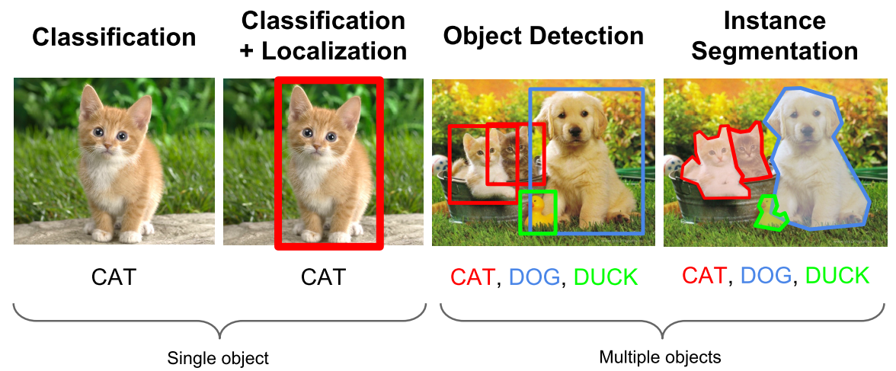

### 8.1.2 目标检测要解决的核心问题？

除了图像分类之外，目标检测要解决的核心问题是：

1.目标可能出现在图像的任何位置。

2.目标有各种不同的大小。

3.目标可能有各种不同的形状。

如果用矩形框来定义目标，则矩形有不同的宽高比。由于目标的宽高比不同，因此采用经典的滑动窗口+图像缩放的方案解决通用目标检测问题的成本太高。

### 8.1.2 目标检测算法分类？

基于深度学习的目标检测算法主要分为两类：

**1.Two stage目标检测算法**

先进行区域生成（region proposal，RP）（一个有可能包含待检物体的预选框），再通过卷积神经网络进行样本分类。

任务：特征提取—>生成RP—>分类/定位回归。

常见的two stage目标检测算法有：R-CNN、SPP-Net、Fast R-CNN、Faster R-CNN和R-FCN等。

**2.One stage目标检测算法**

不用RP，直接在网络中提取特征来预测物体分类和位置。

任务：特征提取—>分类/定位回归。

常见的one stage目标检测算法有：OverFeat、YOLOv1、YOLOv2、YOLOv3、SSD和RetinaNet等。

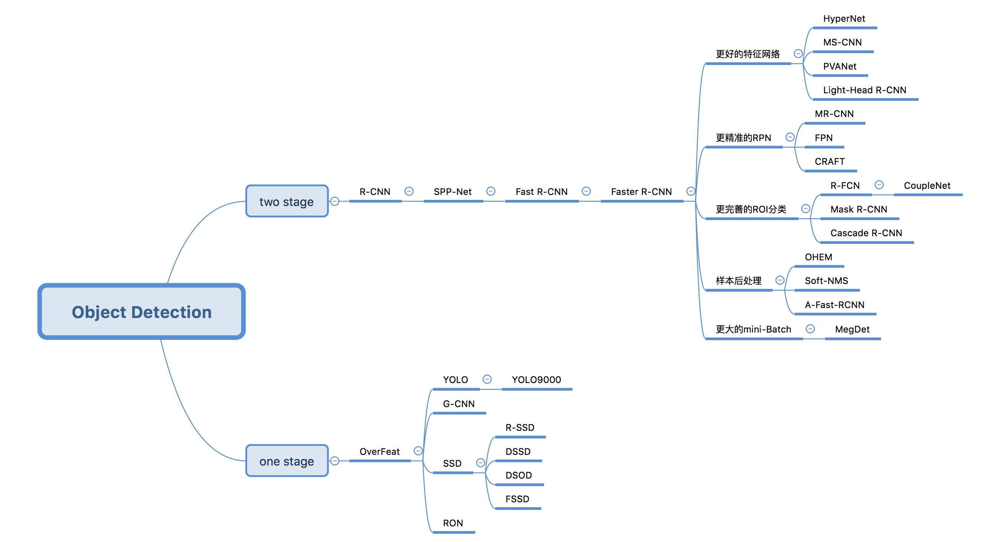

## 8.2 Two Stage目标检测算法 

### 8.2.1 R-CNN

**标题：《Rich feature hierarchies for accurate object detection and semantic segmentation》**

**时间：2014**

**出版源：CVPR 2014**

**主要链接**：

- arXiv：http://arxiv.org/abs/1311.2524
- github(caffe)：https://github.com/rbgirshick/rcnn

**R-CNN 创新点**

- 使用CNN（ConvNet）对 region proposals 计算 feature vectors。从经验驱动特征（SIFT、HOG）到数据驱动特征（CNN feature map），提高特征对样本的表示能力。
- 采用大样本下（ILSVRC）有监督预训练和小样本（PASCAL）微调（fine-tuning）的方法解决小样本难以训练甚至过拟合等问题。

注：ILSVRC其实就是众所周知的ImageNet的挑战赛，数据量极大；PASCAL数据集（包含目标检测和图像分割等），相对较小。

**R-CNN 介绍**

R-CNN作为R-CNN系列的第一代算法，其实没有过多的使用“深度学习”思想，而是将“深度学习”和传统的“计算机视觉”的知识相结合。比如R-CNN pipeline中的第二步和第四步其实就属于传统的“计算机视觉”技术。使用selective search提取region proposals，使用SVM实现分类。

原论文中R-CNN pipeline只有4个步骤，光看上图无法深刻理解R-CNN处理机制，下面结合图示补充相应文字

1. 预训练模型。选择一个预训练 （pre-trained）神经网络（如AlexNet、VGG）。

2. 重新训练全连接层。使用需要检测的目标重新训练（re-train）最后全连接层（connected layer）。

3. 提取 proposals并计算CNN 特征。利用选择性搜索（Selective Search）算法提取所有proposals（大约2000幅images），调整（resize/warp）它们成固定大小，以满足 CNN输入要求（因为全连接层的限制），然后将feature map 保存到本地磁盘。

   

4. 训练SVM。利用feature map 训练SVM来对目标和背景进行分类（每个类一个二进制SVM）

5. 边界框回归（Bounding boxes Regression）。训练将输出一些校正因子的线性回归分类器

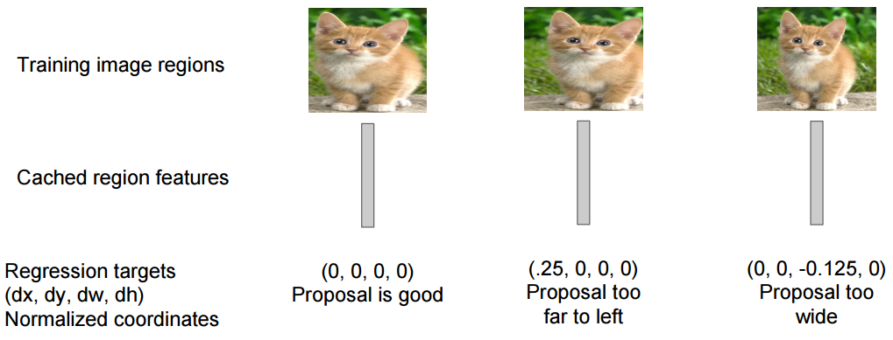

**R-CNN 实验结果**

R-CNN在VOC 2007测试集上mAP达到58.5%，打败当时所有的目标检测算法。

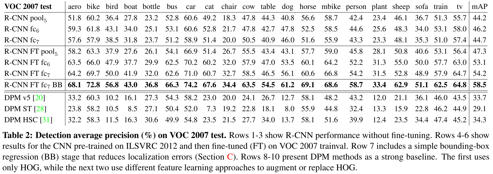

**参考**

[Amusi-R-CNN论文笔记](https://github.com/amusi/paper-note/blob/master/Object-Detection/R-CNN%E8%AE%BA%E6%96%87%E7%AC%94%E8%AE%B0.md)

### 8.2.2 Fast R-CNN

**标题：《Fast R-CNN》**

**时间：2015**

**出版源：ICCV 2015**

**主要链接：**

- arXiv：https://arxiv.org/abs/1504.08083
- github(Official)：https://github.com/rbgirshick/fast-rcnn

**Fast R-CNN 创新点**

1. 只对整幅图像进行一次特征提取，避免R-CNN中的冗余特征提取
2. 用RoI pooling层替换最后一层的max pooling层，同时引入建议框数据，提取相应建议框特征
3. Fast R-CNN网络末尾采用并行的不同的全连接层，可同时输出分类结果和窗口回归结果，实现了end-to-end的多任务训练【建议框提取除外】，也不需要额外的特征存储空间【R-CNN中的特征需要保持到本地，来供SVM和Bounding-box regression进行训练】
4. 采用SVD对Fast R-CNN网络末尾并行的全连接层进行分解，减少计算复杂度，加快检测速度。

**Fast R-CNN 介绍**

Fast R-CNN是基于R-CNN和[SPPnets](https://arxiv.org/abs/1406.4729)进行的改进。SPPnets，其创新点在于计算整幅图像的the shared feature map，然后根据object proposal在shared feature map上映射到对应的feature vector（就是不用重复计算feature map了）。当然，SPPnets也有缺点：和R-CNN一样，训练是多阶段（multiple-stage pipeline）的，速度还是不够"快"，特征还要保存到本地磁盘中。

将候选区域直接应用于特征图，并使用ROI池化将其转化为固定大小的特征图块。以下是Fast R-CNN的流程图

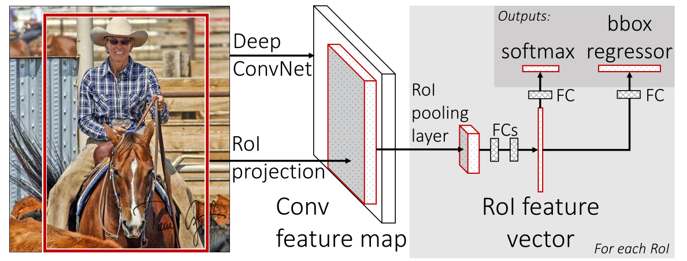

**RoI Pooling层详解**

因为Fast R-CNN使用全连接层，所以应用RoI Pooling将不同大小的ROI转换为固定大小。

RoI Pooling 是Pooling层的一种，而且是针对RoI的Pooling，其特点是输入特征图尺寸不固定，但是输出特征图尺寸固定（如7x7）。

**什么是RoI呢？**

RoI是Region of Interest的简写，一般是指图像上的区域框，但这里指的是由Selective Search提取的候选框。

往往经过rpn后输出的不止一个矩形框，所以这里我们是对多个RoI进行Pooling。

**RoI Pooling的输入**

输入有两部分组成： 

1. 特征图（feature map）：指的是上面所示的特征图，在Fast RCNN中，它位于RoI Pooling之前，在Faster RCNN中，它是与RPN共享那个特征图，通常我们常常称之为“share_conv”； 
2. RoIs，其表示所有RoI的N*5的矩阵。其中N表示RoI的数量，第一列表示图像index，其余四列表示其余的左上角和右下角坐标。

在Fast RCNN中，指的是Selective Search的输出；在Faster RCNN中指的是RPN的输出，一堆矩形候选框，形状为1x5x1x1（4个坐标+索引index），其中值得注意的是：坐标的参考系不是针对feature map这张图的，而是针对原图的（神经网络最开始的输入）。其实关于ROI的坐标理解一直很混乱，到底是根据谁的坐标来。其实很好理解，我们已知原图的大小和由Selective Search算法提取的候选框坐标，那么根据"映射关系"可以得出特征图（featurwe map）的大小和候选框在feature map上的映射坐标。至于如何计算，其实就是比值问题，下面会介绍。所以这里把ROI理解为原图上各个候选框（region proposals），也是可以的。

注：说句题外话，由Selective Search算法提取的一系列可能含有object的boudning box，这些通常称为region proposals或者region of interest（ROI）。

**RoI的具体操作**

1. 根据输入image，将ROI映射到feature map对应位置

   注：映射规则比较简单，就是把各个坐标除以“输入图片与feature map的大小的比值”，得到了feature map上的box坐标

2. 将映射后的区域划分为相同大小的sections（sections数量与输出的维度相同）

3. 对每个sections进行max pooling操作

这样我们就可以从不同大小的方框得到固定大小的相应 的feature maps。值得一提的是，输出的feature maps的大小不取决于ROI和卷积feature maps大小。ROI pooling 最大的好处就在于极大地提高了处理速度。

**RoI Pooling的输出**

输出是batch个vector，其中batch的值等于RoI的个数，vector的大小为channel * w * h；RoI Pooling的过程就是将一个个大小不同的box矩形框，都映射成大小固定（w * h）的矩形框。

**RoI Pooling示例**

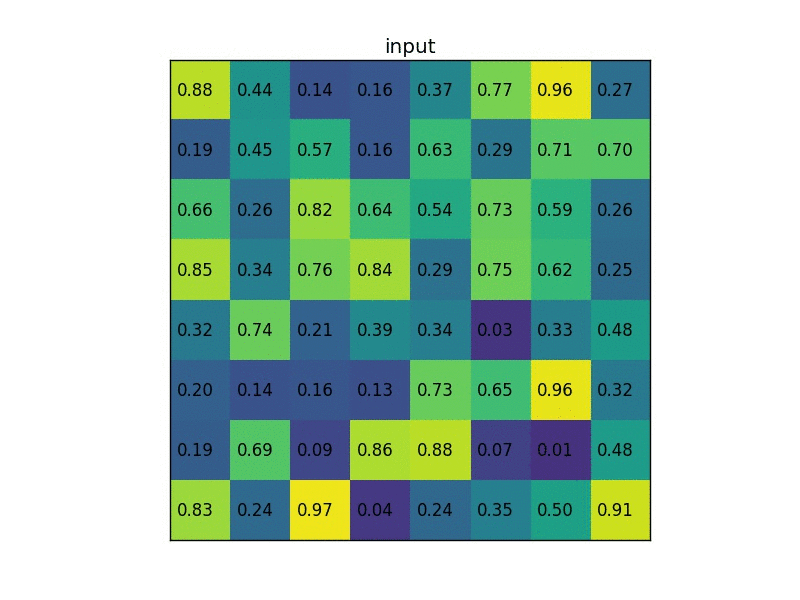

**参考**

[Amusi-Fast R-CNN论文笔记](https://github.com/amusi/paper-note/blob/master/Object-Detection/Fast-R-CNN%E8%AE%BA%E6%96%87%E7%AC%94%E8%AE%B0.md)

### 8.2.3 Faster R-CNN  

**标题：《Faster R-CNN: Towards Real-Time Object Detection with Region Proposal Networks》**

**时间：2015**

**出版源：NIPS 2015**

**主要链接：**

- arXiv：http://arxiv.org/abs/1506.01497
- github(official, Matlab)：https://github.com/ShaoqingRen/faster_rcnn
- github(official, Caffe)：https://github.com/rbgirshick/py-faster-rcnn

    Fast R-CNN依赖于外部候选区域方法，如选择性搜索。但这些算法在CPU上运行且速度很慢。在测试中，Fast R-CNN需要2.3秒来进行预测，其中2秒用于生成2000个ROI。Faster R-CNN采用与Fast R-CNN相同的设计，只是它用内部深层网络代替了候选区域方法。新的候选区域网络（RPN）在生成ROI时效率更高，并且以每幅图像10毫秒的速度运行。
     

    图8.1.13 Faster R-CNN的流程图
    Faster R-CNN的流程图与Fast R-CNN相同，采用外部候选区域方法代替了内部深层网络。
     

    图8.1.14
    **候选区域网络**

    候选区域网络（RPN）将第一个卷积网络的输出特征图作为输入。它在特征图上滑动一个3×3的卷积核，以使用卷积网络（如下所示的ZF网络）构建与类别无关的候选区域。其他深度网络（如VGG或ResNet）可用于更全面的特征提取，但这需要以速度为代价。ZF网络最后会输出256个值，它们将馈送到两个独立的全连接层，以预测边界框和两个objectness分数，这两个objectness分数度量了边界框是否包含目标。我们其实可以使用回归器计算单个objectness分数，但为简洁起见，Faster R-CNN使用只有两个类别的分类器：即带有目标的类别和不带有目标的类别。
     

    图8.1.15
    对于特征图中的每一个位置，RPN会做k次预测。因此，RPN将输出4×k个坐标和每个位置上2×k个得分。下图展示了8×8的特征图，且有一个3×3的卷积核执行运算，它最后输出8×8×3个ROI（其中k=3）。下图（右）展示了单个位置的3个候选区域。
    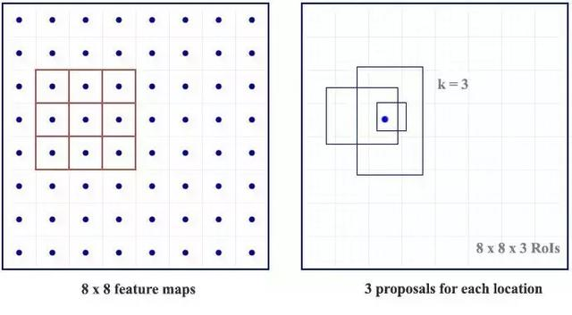

    图8.1.16
    假设最好涵盖不同的形状和大小。因此，Faster R-CNN不会创建随机边界框。相反，它会预测一些与左上角名为锚点的参考框相关的偏移量（如x, y）。我们限制这些偏移量的值，因此我们的猜想仍然类似于锚点。
     

    图8.1.17
    要对每个位置进行k个预测，我们需要以每个位置为中心的k个锚点。每个预测与特定锚点相关联，但不同位置共享相同形状的锚点。
     

    图8.1.18
    这些锚点是精心挑选的，因此它们是多样的，且覆盖具有不同比例和宽高比的现实目标。这使得我们可以用更好的猜想来指导初始训练，并允许每个预测专门用于特定的形状。该策略使早期训练更加稳定和简便。
    

    图8.1.19
    Faster R-CNN使用更多的锚点。它部署9个锚点框：3个不同宽高比的3个不同大小的锚点框。每一个位置使用9个锚点，每个位置会生成2×9个objectness分数和4×9个坐标。

### 8.2.4 R-FCN

**标题：《R-FCN: Object Detection via Region-based Fully Convolutional Networks》**

**时间：2016**

**出版源：NIPS 2016**

**主要链接：**

- arXiv：https://arxiv.org/abs/1605.06409
- github(Official)：https://github.com/daijifeng001/r-fcn

**R-FCN 创新点**

R-FCN 仍属于two-stage 目标检测算法：RPN+R-FCN

- Fully convolutional
- 位置敏感得分图（position-sentive score maps）

> our region-based detector is **fully convolutional** with almost all computation shared on the entire image. To achieve this goal, we propose **position-sensitive score maps** to address a dilemma between translation-invariance in image classification and translation-variance in object detection.

R-FCN backbone：ResNet

ResNet-101+R-FCN：83.6% in PASCAL VOC 2007 test datasets

既提高了mAP，又加快了检测速度

    假设我们只有一个特征图用来检测右眼。那么我们可以使用它定位人脸吗？应该可以。因为右眼应该在人脸图像的左上角，所以我们可以利用这一点定位整个人脸。如果我们还有其他用来检测左眼、鼻子或嘴巴的特征图，那么我们可以将检测结果结合起来，更好地定位人脸。现在我们回顾一下所有问题。在Faster R-CNN中，检测器使用了多个全连接层进行预测。如果有2000个ROI，那么成本非常高。R-FCN通过减少每个ROI所需的工作量实现加速。上面基于区域的特征图与ROI是独立的，可以在每个ROI之外单独计算。剩下的工作就比较简单了，因此R-FCN的速度比Faster R-CNN快。
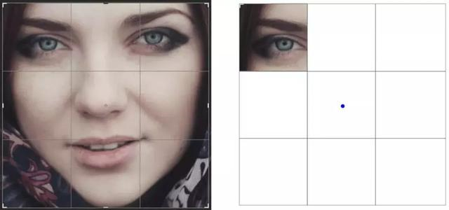

    图8.2.1 人脸检测
    现在我们来看一下5×5的特征图M，内部包含一个蓝色方块。我们将方块平均分成3×3个区域。现在，我们在M中创建了一个新的特征图，来检测方块的左上角（TL）。这个新的特征图如下图（右）所示。只有黄色的网格单元[2,2]处于激活状态。在左侧创建一个新的特征图，用于检测目标的左上角。
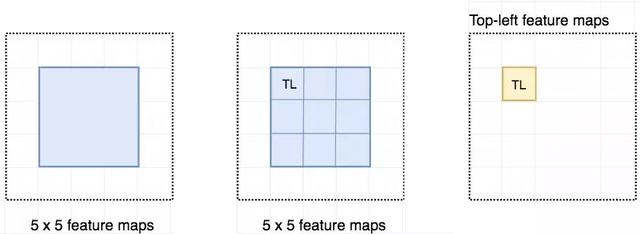 

    图8.2.2 检测示例
    我们将方块分成9个部分，由此创建了9个特征图，每个用来检测对应的目标区域。这些特征图叫做位置敏感得分图（position-sensitive score map），因为每个图检测目标的子区域（计算其得分）。

    图8.2.3生成9个得分图
    下图中红色虚线矩形是建议的ROI。我们将其分割成3×3个区域，并询问每个区域包含目标对应部分的概率是多少。例如，左上角ROI区域包含左眼的概率。我们将结果存储成3×3 vote数组，如下图（右）所示。例如，vote_array[0][0]包含左上角区域是否包含目标对应部分的得分。
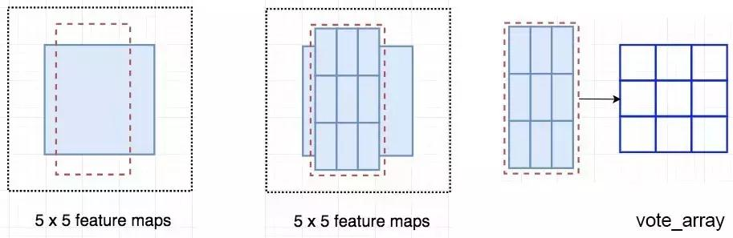 

    图8.2.4
    将ROI应用到特征图上，输出一个3x3数组。将得分图和ROI映射到vote数组的过程叫做位置敏感ROI池化（position-sensitive ROI-pool）。该过程与前面讨论过的ROI池化非常接近。
 

    图8.2.5
    将ROI的一部分叠加到对应的得分图上，计算V[i][j]。在计算出位置敏感ROI池化的所有值后，类别得分是其所有元素得分的平均值。

    图8.2.6 ROI池化
    假如我们有C个类别要检测。我们将其扩展为C+1个类别，这样就为背景（非目标）增加了一个新的类别。每个类别有3×3个得分图，因此一共有(C+1)×3×3个得分图。使用每个类别的得分图可以预测出该类别的类别得分。然后我们对这些得分应用 softmax 函数，计算出每个类别的概率。以下是数据流图，在本案例中，k=3。
 

    图8.2.7
### 8.2.5 FPN

**标题：《Feature Pyramid Networks for Object Detection》**

**时间：2016**

**出版源：CVPR 2017**

**主要链接：**

- arXiv：https://arxiv.org/abs/1612.03144

- [ ] TODO

### 8.2.6 Mask R-CNN

**标题：《Mask R-CNN》**

**时间：2017**

**出版源：ICCV 2017**

**主要链接：**

- arXiv：https://arxiv.org/abs/1703.06870

- github(Official)：https://github.com/facebookresearch/Detectron

- [ ] TODO

### 8.2.7 RefineDet

**标题：《Single-Shot Refinement Neural Network for Object Detection》**

**时间：2017**

**出版源：CVPR 2018**

**主要链接：**

- arXiv：https://arxiv.org/abs/1711.06897
- github(Official)：https://github.com/sfzhang15/RefineDet

- [ ] TODO

### 8.2.8 Cascade R-CNN

**标题：《Cascade R-CNN: Delving into High Quality Object Detection》**

**时间：2017**

**出版源：CVPR 2018**

**主要链接：**

- arXiv：https://arxiv.org/abs/1712.00726
- github(Official)：https://github.com/zhaoweicai/cascade-rcnn

- [ ] TODO

## 8.3 One Stage目标检测算法

    我们将对单次目标检测器（包括SSD、YOLO、YOLOv2、YOLOv3）进行综述。我们将分析FPN以理解多尺度特征图如何提高准确率，特别是小目标的检测，其在单次检测器中的检测效果通常很差。然后我们将分析Focal loss和RetinaNet，看看它们是如何解决训练过程中的类别不平衡问题的。
### 8.3.1 SSD  

**标题：《SSD: Single Shot MultiBox Detector》**

**时间：2015**

**出版源：ECCV 2016**

**主要链接：**

- arXiv：https://arxiv.org/abs/1512.02325
- github(Official)：https://github.com/weiliu89/caffe/tree/ssd

不同于前面的RCNN系列，SSD属于one-stage方法。SSD使用 VGG16 网络作为特征提取器（和 Faster R-CNN 中使用的 CNN 一样）,将后面的全连接层替换成卷积层，并在之后添加自定义卷积层，并在最后直接采用卷积进行检测。在多个特征图上设置不同缩放比例和不同宽高比的default boxes（先验框）以融合多尺度特征图进行检测，靠前的大尺度特征图可以捕捉到小物体的信息，而靠后的小尺度特征图能捕捉到大物体的信息，从而提高检测的准确性和定位的准确性。如下图是SSD的网络结构图。

**1. 怎样设置default boxes？**
SSD中default box的概念有点类似于Faster R-CNN中的anchor。不同于Faster R-CNN只在最后一个特征层取anchor, SSD在多个特征层上取default box，可以得到不同尺度的default box。在特征图的每个单元上取不同宽高比的default box,一般宽高比在{1,2,3,1/2,1/3}中选取，有时还会额外增加一个宽高比为1但具有特殊尺度的box。如下图所示，在8x8的feature map和4x4的feature map上的每个单元取4个不同的default box。原文对于300x300的输入，分别在conv4_3, conv7,conv8_2,conv9_2,conv10_2,conv11_2的特征图上的每个单元取4,6,6,6,4,4个default box. 由于以上特征图的大小分别是38x38,19x19,10x10,5x5,3x3,1x1，所以一共得到38x38x4+19x19x6+10x10x6+5x5x6+
3x3x4+1x1x4=8732个default box.对一张300x300的图片输入网络将会针对这8732个default box预测8732个边界框。

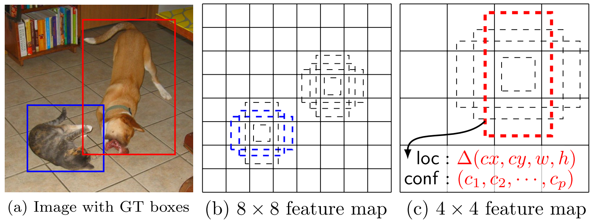

**2. 怎样对先验框进行匹配？**
SSD在训练的时候只需要输入图像和图像中每个目标对应的ground truth. 先验框与ground truth 的匹配遵循两个原则：

（1）对图片中的每个ground truth, 在先验框中找到与其IOU最大的先验框，则该先验框对应的预测边界框与ground truth 匹配。

（2）对于（1）中每个剩下的没有与任何ground truth匹配到的先验框，找到与其IOU最大的ground truth，若其与该ground truth的IOU值大于某个阈值（一般设为0.5），则该先验框对应的预测边界框与该ground truth匹配。

按照这两个原则进行匹配，匹配到ground truth的先验框对应的预测边界框作为正样本，没有匹配到ground truth的先验框对应的预测边界框作为负样本。尽管一个ground truth可以与多个先验框匹配，但是ground truth的数量相对先验框还是很少，按照上面的原则进行匹配还是会造成负样本远多于正样本的情况。为了使正负样本尽量均衡（一般保证正负样本比例约为1：3），SSD采用hard negative mining, 即对负样本按照其预测背景类的置信度进行降序排列，选取置信度较小的top-k作为训练的负样本。

**3. 怎样得到预测的检测结果？**

最后分别在所选的特征层上使用3x3卷积核预测不同default boxes所属的类别分数及其预测的边界框location。由于对于每个box需要预测该box属于每个类别的置信度（假设有c类，包括背景）和该box对应的预测边界框的location(包含4个值，即该box的中心坐标和宽高)，则每个box需要预测c+4个值。所以对于某个所选的特征层，该层的卷积核个数为（c+4）x该层的default box个数.最后将每个层得到的卷积结果进行拼接。对于得到的每个预测框，取其类别置信度的最大值，若该最大值大于置信度阈值，则最大值所对应的类别即为该预测框的类别，否则过滤掉此框。对于保留的预测框根据它对应的先验框进行解码得到其真实的位置参数（这里还需注意要防止预测框位置超出图片），然后根据所属类别置信度进行降序排列，取top-k个预测框，最后进行NMS，过滤掉重叠度较大的预测框，最后得到检测结果。

 

SSD优势是速度比较快，整个过程只需要一步，首先在图片不同位置按照不同尺度和宽高比进行密集抽样，然后利用CNN提取特征后直接进行分类与回归，所以速度比较快，但均匀密集采样会造成正负样本不均衡的情况使得训练比较困难，导致模型准确度有所降低。另外，SSD对小目标的检测没有大目标好，因为随着网络的加深，在高层特征图中小目标的信息丢失掉了，适当增大输入图片的尺寸可以提升小目标的检测效果。

### 8.3.2 DSSD

**标题：《DSSD : Deconvolutional Single Shot Detector》**

**时间：2017**

**出版源：CVPR 2017**

**主要链接：**

- arXiv：https://arxiv.org/abs/1701.06659
- github(Official)：https://github.com/chengyangfu/caffe/tree/dssd

- [ ] TODO

### 8.3.3 FSSD

**标题：《FSSD: Feature Fusion Single Shot Multibox Detector》**

**时间：2017**

**出版源：None**

**主要链接：**

- arXiv：https://arxiv.org/abs/1712.00960

- [ ] TODO

### 8.3.4 YOLOv1

**标题：《You Only Look Once: Unified, Real-Time Object Detection》**

**时间：2015**

**出版源：CVPR 2016**

**主要链接：**

- arXiv：http://arxiv.org/abs/1506.02640
- github(Official)：https://github.com/pjreddie/darknet

**YOLOv1介绍**

YOLO（You Only Look Once: Unified, Real-Time Object Detection）是one-stage detection的开山之作。之前的物体检测方法首先需要产生大量可能包含待检测物体的先验框, 然后用分类器判断每个先验框对应的边界框里是否包含待检测物体，以及物体所属类别的概率或者置信度，同时需要后处理修正边界框，最后基于一些准则过滤掉置信度不高和重叠度较高的边界框，进而得到检测结果。这种基于先产生候选区再检测的方法虽然有相对较高的检测准确率，但运行速度较慢。

YOLO创造性的将物体检测任务直接当作回归问题（regression problem）来处理，将候选区和检测两个阶段合二为一。只需一眼就能知道每张图像中有哪些物体以及物体的位置。下图展示了各物体检测系统的流程图。

事实上，YOLO也并没有真正的去掉候选区，而是直接将输入图片划分成7x7=49个网格，每个网格预测两个边界框，一共预测49x2=98个边界框。可以近似理解为在输入图片上粗略的选取98个候选区，这98个候选区覆盖了图片的整个区域，进而用回归预测这98个候选框对应的边界框。

**下面以问答的形式展示YOLO中的一些实现细节：**

**1. 网络结构是怎样的？**

YOLO网络借鉴了GoogleNet分类网络结构，不同的是YOLO使用1x1卷积层和3x3卷积层替代inception module。如下图所示，整个检测网络包括24个卷积层和2个全连接层。其中，卷积层用来提取图像特征，全连接层用来预测图像位置和类别概率值。

**2. YOLO的输入、输出、损失函数分别是什么？**

前面说到YOLO将输入图像分成7x7的网格，最后输出是7x7xk的张量。YOLO网络最后接了两个全连接层，全连接层要求输入是固定大小的，所以YOLO要求输入图像有固定大小，论文中作者设计的输入尺寸是448x448。

YOLO将输入图像分成7x7的网格，每个网格预测2个边界框。若某物体的ground truth的中心落在该网格，则该网格中与这个ground truth IOU最大的边界框负责预测该物体。对每个边界框会预测5个值，分别是边界框的中心x,y（相对于所属网格的边界），边界框的宽高w,h（相对于原始输入图像的宽高的比例），以及这些边界框的confidencescores（边界框与ground truth box的IOU值）。同时每个网格还需要预测c个类条件概率 （是一个c维向量，表示某个物体object在这个网格中，且该object分别属于各个类别的概率，这里的c类物体不包含背景）。论文中的c=20，则每个网格需要预测2x5+20=30个值，这些值被映射到一个30维的向量。
为了让边界框坐标损失、分类损失达到很好的平衡，损失函数设计如下图所示。

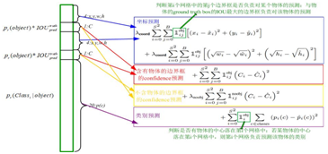

如上图所示，损失函数分为坐标预测（蓝色框）、含有物体的边界框的confidence预测（红色框）、不含有物体的边界框的confidence预测（黄色框）、分类预测（紫色框）四个部分。

由于不同大小的边界框对预测偏差的敏感度不同，小的边界框对预测偏差的敏感度更大。为了均衡不同尺寸边界框对预测偏差的敏感度的差异。作者巧妙的对边界框的w,h取均值再求L2 loss. YOLO中更重视坐标预测，赋予坐标损失更大的权重，记为 coord，在pascal voc训练中coodd=5 ，classification error部分的权重取1。

某边界框的置信度定义为：某边界框的confidence = 该边界框存在某类对象的概率pr(object)*该边界框与该对象的ground truth的IOU值 ，若该边界框存在某个对象pr(object)=1 ，否则pr(object)=0 。由于一幅图中大部分网格中是没有物体的，这些网格中的边界框的confidence置为0，相比于有物体的网格，这些不包含物体的网格更多，对梯度更新的贡献更大，会导致网络不稳定。为了平衡上述问题，YOLO损失函数中对没有物体的边界框的confidence error赋予较小的权重，记为 noobj，对有物体的边界框的confidence error赋予较大的权重。在pascal VOC训练中noobj=0.5 ，有物体的边界框的confidence error的权重设为1.

**3. YOLO怎样预测？**

YOLO最后采用非极大值抑制（NMS）算法从输出结果中提取最有可能的对象和其对应的边界框。

输入一张图片到YOLO网络将输出一个7*7*30的张量表示图片中每个网格对应的可能的两个边界框以及每个边界框的置信度和包含的对象属于各个类别的概率。由此可以计算某对象i属于类别 同时在第j个边界框中的得分：

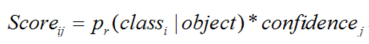

每个网格有20个类条件概率，2个边界框置信度，相当于每个网格有40个得分，7x7个网格有1960个得分，每类对象有1960/20=98个得分，即98个候选框。

**NMS步骤如下：**

1.设置一个Score的阈值，一个IOU的阈值；

2.对于每类对象，遍历属于该类的所有候选框，

①过滤掉Score低于Score阈值的候选框；

②找到剩下的候选框中最大Score对应的候选框，添加到输出列表；

③进一步计算剩下的候选框与②中输出列表中每个候选框的IOU，若该IOU大于设置的IOU阈值，将该候选框过滤掉，否则加入输出列表中；

④最后输出列表中的候选框即为图片中该类对象预测的所有边界框

3.返回步骤2继续处理下一类对象。

YOLO将识别与定位合二为一，结构简便，检测速度快，更快的Fast YOLO可以达到155FPS。相对于RNN系列, YOLO的整个流程中都能看到整张图像的信息，因此它在检测物体时能很好的利用上下文信息，从而不容易在背景上预测出错误的物体信息。同时YOLO可以学习到高度泛化的特征，能将一个域上学到的特征迁移到不同但相关的域上，如在自然图像上做训练的YOLO，在艺术图片上可以得到较好的测试结果。

由于YOLO网格设置比较稀疏，且每个网格只预测2个边界框，其总体预测精度不高，略低于Fast RCNN。其对小物体的检测效果较差，尤其是对密集的小物体表现比较差。

###  8.3.5 YOLOv2

**标题：《YOLO9000: Better, Faster, Stronger》**

**时间：2016**

**出版源：None**

**主要链接：**

- arXiv：https://arxiv.org/abs/1612.08242
- github(Official)：https://pjreddie.com/darknet/yolov2/

YOLOv1虽然检测速度快，但在定位方面不够准确，并且召回率较低。为了提升定位准确度，改善召回率，YOLOv2在YOLOv1的基础上提出了几种改进策略，如下图所示，可以看到，一些改进方法能有效提高模型的mAP.

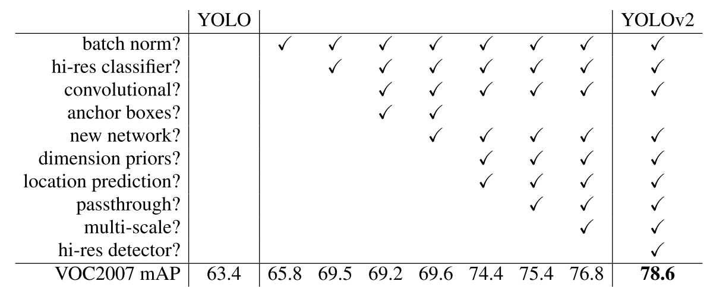

**YOLOv2 介绍**

**（1）Batch Normalization**

YOLOv2中在每个卷积层后加Batch Normalization(BN)层，去掉dropout. BN层可以起到一定的正则化效果，能提升模型收敛速度，防止模型过拟合。YOLOv2通过使用BN层使得mAP提高了2%。
**（2）High Resolution Classifier**

目前的大部分检测模型都会使用主流分类网络（如vgg、resnet）在ImageNet上的预训练模型作为特征提取器,
而这些分类网络大部分都是以小于256x256的图片作为输入进行训练的，低分辨率会影响模型检测能力。YOLOv2将输入图片的分辨率提升至448x448，为了使网络适应新的分辨率，YOLOv2先在ImageNet上以448x448的分辨率对网络进行10个epoch的微调，让网络适应高分辨率的输入。通过使用高分辨率的输入，YOLOv2的mAP提升了约4%。

**（3）Convolutional With Anchor Boxes**

YOLOv1利用全连接层直接对边界框进行预测，导致丢失较多空间信息，定位不准。YOLOv2去掉了YOLOv1中的全连接层，使用Anchor Boxes预测边界框，同时为了得到更高分辨率的特征图，YOLOv2还去掉了一个池化层。由于图片中的物体都倾向于出现在图片的中心位置，若特征图恰好有一个中心位置，利用这个中心位置预测中心点落入该位置的物体，对这些物体的检测会更容易。所以总希望得到的特征图的宽高都为奇数。YOLOv2通过缩减网络，使用416x416的输入，模型下采样的总步长为32，最后得到13x13的特征图，然后对13x13的特征图的每个cell预测5个anchor boxes，对每个anchor box预测边界框的位置信息、置信度和一套分类概率值。使用anchor
boxes之后，YOLOv2可以预测13x13x5=845个边界框，模型的召回率由原来的81%提升到88%，mAP由原来的69.5%降低到69.2%.召回率提升了7%，准确率下降了0.3%。

**（4）Dimension Clusters**

在Faster R-CNN和SSD中，先验框都是手动设定的，带有一定的主观性。YOLOv2采用k-means聚类算法对训练集中的边界框做了聚类分析，选用boxes之间的IOU值作为聚类指标。综合考虑模型复杂度和召回率，最终选择5个聚类中心，得到5个先验框，发现其中中扁长的框较少，而瘦高的框更多，更符合行人特征。通过对比实验，发现用聚类分析得到的先验框比手动选择的先验框有更高的平均IOU值，这使得模型更容易训练学习。

**（5）New Network：Darknet-19**

YOLOv2采用Darknet-19，其网络结构如下图所示，包括19个卷积层和5个max pooling层，主要采用3x3卷积和1x1卷积，这里1x1卷积可以压缩特征图通道数以降低模型计算量和参数，每个卷积层后使用BN层以加快模型收敛同时防止过拟合。最终采用global avg pool 做预测。采用YOLOv2，模型的mAP值没有显著提升，但计算量减少了。

**（6）Direct location prediction**

Faster R-CNN使用anchor boxes预测边界框相对先验框的偏移量，由于没有对偏移量进行约束，每个位置预测的边界框可以落在图片任何位置，会导致模型不稳定，加长训练时间。YOLOv2沿用YOLOv1的方法，根据所在网格单元的位置来预测坐标,则Ground Truth的值介于0到1之间。网络中将得到的网络预测结果再输入sigmoid函数中，让输出结果介于0到1之间。设一个网格相对于图片左上角的偏移量是cx，cy。先验框的宽度和高度分别是pw和ph，则预测的边界框相对于特征图的中心坐标(bx，by)和宽高bw、bh的计算公式如下图所示。

YOLOv2结合Dimention Clusters, 通过对边界框的位置预测进行约束，使模型更容易稳定训练，这种方式使得模型的mAP值提升了约5%。

**（7）Fine-Grained Features**

YOLOv2借鉴SSD使用多尺度的特征图做检测，提出pass through层将高分辨率的特征图与低分辨率的特征图联系在一起，从而实现多尺度检测。YOLOv2提取Darknet-19最后一个max pool层的输入，得到26x26x512的特征图。经过1x1x64的卷积以降低特征图的维度，得到26x26x64的特征图，然后经过pass through层的处理变成13x13x256的特征图（抽取原特征图每个2x2的局部区域组成新的channel，即原特征图大小降低4倍，channel增加4倍），再与13x13x1024大小的特征图连接，变成13x13x1280的特征图，最后在这些特征图上做预测。使用Fine-Grained Features，YOLOv2的性能提升了1%.

**（8）Multi-Scale Training**

YOLOv2中使用的Darknet-19网络结构中只有卷积层和池化层，所以其对输入图片的大小没有限制。YOLOv2采用多尺度输入的方式训练，在训练过程中每隔10个batches,重新随机选择输入图片的尺寸，由于Darknet-19下采样总步长为32，输入图片的尺寸一般选择32的倍数{320,352,…,608}。采用Multi-Scale Training, 可以适应不同大小的图片输入，当采用低分辨率的图片输入时，mAP值略有下降，但速度更快，当采用高分辨率的图片输入时，能得到较高mAP值，但速度有所下降。

YOLOv2借鉴了很多其它目标检测方法的一些技巧，如Faster R-CNN的anchor boxes, SSD中的多尺度检测。除此之外，YOLOv2在网络设计上做了很多tricks,使它能在保证速度的同时提高检测准确率，Multi-Scale Training更使得同一个模型适应不同大小的输入，从而可以在速度和精度上进行自由权衡。

**YOLOv2的训练**

YOLOv2的训练主要包括三个阶段。
第一阶段：先在ImageNet分类数据集上预训练Darknet-19，此时模型输入为224*224,共训练160个epochs。
第二阶段：将网络的输入调整为448*448,继续在ImageNet数据集上finetune分类模型，训练10个epochs，此时分类模型的top-1准确度为76.5%，而top-5准确度为93.3%。
第三个阶段：修改Darknet-19分类模型为检测模型，并在检测数据集上继续finetune网络。
网络修改包括（网路结构可视化）：移除最后一个卷积层、global avgpooling层以及softmax层，并且新增了三个3*3*2014卷积层，同时增加了一个passthrough层，最后使用1*1卷积层输出预测结果。

###  8.3.6 YOLO9000

github：http://pjreddie.com/yolo9000/

YOLO9000是在YOLOv2的基础上提出的一种联合训练方法，可以检测超过9000个类别的模型。YOLOv2混合目标检测数据集和分类数据集，用目标检测数据集及其类别标记信息和位置标注信息训练模型学习预测目标定位和分类，用分类数据集及其类别标记信息进一步扩充模型所能识别的物体类别同时能增强模型鲁棒性。

**1. YOLO9000是怎么组织数据的？**

YOLO9000根据各个类别之间的从属关系建立一种树结WordTree, 将COCO数据集和ImageNet数据集组织起来。

WordTree的生成方式如下：

①首先遍历ImageNet中的类别名词。

②对每个名词，在WordNet(一种结构化概念及概念之间关系的语言数据库)上找到从它所在位置到根节点（设根节点为实体对象physical object）的最短路径，由于在WordNet中大多数同义词只有一个路径，所以先把将该路径上的词全都加到树中。

③迭代地检查剩下的名词，取它到根节点的最短路径，将该最短路径上的还没出现在层次树中的词加入到树中。
混合后的数据集形成一个有9418类的WordTree.生成的WordTree模型如下图所示。另外考虑到COCO数据集相对于ImageNet数据集数据量太少了，为了平衡两个数据集，作者进一步对COCO数据集过采样，使COCO数据集与ImageNet数据集的数据量比例接近1：4。

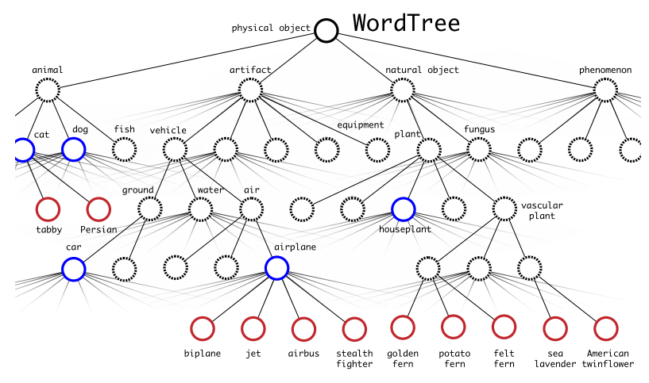

对于物体的标签，采用one-hot编码的形式，数据集中的每个物体的类别标签被组织成1个长度为9418的向量，向量中除在WordTree中从该物体对应的名词到根节点的路径上出现的词对应的类别标号处为1，其余位置为0。

**2. YOLO9000是怎么进行联合训练的？**

YOLO9000采用YOLOv2的结构，anchorbox由原来的5调整到3，对每个anchorbox预测其对应的边界框的位置信息x,y,w,h和置信度以及所包含的物体分别属于9418类的概率，所以每个anchorbox需要预测4+1+9418=9423个值。每个网格需要预测3x9423=28269个值。在训练的过程中，当网络遇到来自检测数据集的图片时，用完整的YOLOv2loss进行反向传播计算，当网络遇到来自分类数据集的图片时，只用分类部分的loss进行反向传播。

**3. YOLO9000是怎么预测的？**

WordTree中每个节点的子节点都属于同一个子类，分层次的对每个子类中的节点进行一次softmax处理，以得到同义词集合中的每个词的下义词的概率。当需要预测属于某个类别的概率时，需要预测该类别节点的条件概率。即在WordTree上找到该类别名词到根节点的路径，计算路径上每个节点的概率之积。预测时，YOLOv2得到置信度，同时会给出边界框位置以及一个树状概率图，沿着根节点向下，沿着置信度最高的分支向下，直到达到某个阈值，最后到达的节点类别即为预测物体的类别。

YOLO9000使用WordTree混合目标检测数据集和分类数据集，并在其上进行联合训练，使之能实时检测出超过9000个类别的物体，其强大令人赞叹不已。YOLO9000尤其对动物的识别效果很好，但是对衣服或者设备等类别的识别效果不是很好，可能的原因是与目标检测数据集中的数据偏向有关。

###  8.3.7 YOLOv3

**标题：《YOLOv3: An Incremental Improvement》**

**时间：2018**

**出版源：None**

**主要链接：**

- arXiv：https://arxiv.org/abs/1804.02767
- github(Official)：https://github.com/pjreddie/darknet

YOLOv3总结了自己在YOLOv2的基础上做的一些尝试性改进，有的尝试取得了成功，而有的尝试并没有提升模型性能。其中有两个值得一提的亮点，一个是使用残差模型，进一步加深了网络结构；另一个是使用FPN架构实现多尺度检测。

**1. YOLOv3对网络结构做了哪些改进？**

YOLOv3在之前Darknet-19的基础上引入了残差块，并进一步加深了网络，改进后的网络有53个卷积层，取名为Darknet-53，网络结构如下图所示（以256*256的输入为例）。

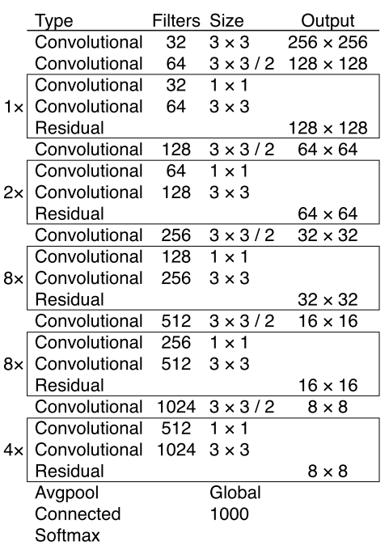

为了比较Darknet-53与其它网络结构的性能，作者在TitanX上，采用相同的实验设置，将256x256的图片分别输入以Darknet-19，ResNet-101，ResNet-152和Darknet-53为基础网络的分类模型中，实验得到的结果如下图所示。可以看到Darknet-53比ResNet-101的性能更好，而且速度是其1.5倍，Darknet-53与ResNet-152性能相似但速度几乎是其2倍。注意到，Darknet-53相比于其它网络结构实现了每秒最高的浮点计算量，说明其网络结构能更好的利用GPU。

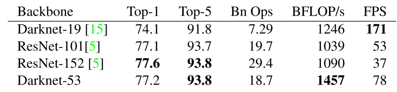

**2.YOLOv3中怎样实现多尺度检测？**

YOLOv3借鉴了FPN的思想，从不同尺度提取特征。相比YOLOv2，YOLOv3提取最后3层特征图，不仅在每个特征图上分别独立做预测，同时通过将小特征图上采样到与大的特征图相同大小，然后与大的特征图拼接做进一步预测。用维度聚类的思想聚类出9种尺度的anchor box，将9种尺度的anchor box均匀的分配给3种尺度的特征图.如下图是在网络结构图的基础上加上多尺度特征提取部分的示意图（以在COCO数据集(80类)上256x256的输入为例）：

从YOLOv1到YOLOv2再到YOLO9000、YOLOv3, YOLO经历三代变革，在保持速度优势的同时，不断改进网络结构，同时汲取其它优秀的目标检测算法的各种trick，先后引入anchor box机制、引入FPN实现多尺度检测等。

### 8.3.8 RetinaNet

**标题：《Focal Loss for Dense Object Detection》**

**时间：2017**

**出版源：ICCV 2017（Best Student Paper Award）**

**主要链接：**

- arXiv：https://arxiv.org/abs/1708.02002
- github(Official)：https://github.com/facebookresearch/Detectron

**研究背景**

- Two-Stage检测器（如Faster R-CNN、FPN）效果好，但速度相对慢
- One-Stage检测器（如YOLO、SSD）速度快，但效果一般

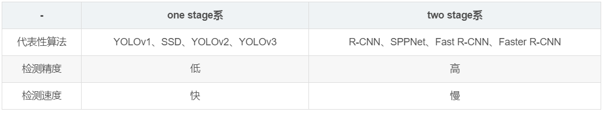

作者对one-stage检测器准确率不高的问题进行探究，发现主要问题在于正负类别不均衡（简单-难分类别不均衡）。

> We discover that the extreme foreground-background class imbalance encountered during training of dense detectors is the central cause.

作者建议通过重新设计标准的交叉熵损失（cross entropy loss）来解决这种类别不平衡（class inbalance）问题，即提出Focal Loss。

> We propose to address this class imbalance by reshaping the standard cross entropy loss such that it down-weights the loss assigned to well-classified examples. Our novel Focal Loss focuses training on a sparse set of hard examples and prevents the vast number of easy negatives from overwhelming the detector during training.

结合Focal Loss的one-stage检测器称为RetinaNet，该检测器在COCO上mAP可以和特征金字塔网络（feature pyramid network，FPN）或者Mask R-CNN接近，

**问：什么是类别不均衡（class imbalance）？**

答：负样本的数量极大于正样本的数量，比如包含物体的区域（正样本）很少，而不包含物体的区域（负样本）很多。比如检测算法在早期会生成一大波的bbox。而一幅常规的图片中，顶多就那么几个object。这意味着，绝大多数的bbox属于background。

**问：样本的类别不均衡会带来什么问题？**

答：由于大多数都是简单易分的负样本（属于背景的样本），使得训练过程不能充分学习到属于那些有类别样本的信息；其次简单易分的负样本太多，可能掩盖了其他有类别样本的作用（这些简单易分的负样本仍产生一定幅度的loss，见下图蓝色曲线，数量多会对loss起主要贡献作用，因此就主导了梯度的更新方向，掩盖了重要的信息）

> This imbalance causes two problems: (1) training is inefficient as most locations are easy negatives that contribute no useful learning signal; (2) en masse, the easy negatives can overwhelm training and lead to degenerate models.

简单来说，因为bbox数量爆炸。 正是因为bbox中属于background的bbox太多了，所以如果分类器无脑地把所有bbox统一归类为background，accuracy也可以刷得很高。于是乎，分类器的训练就失败了。分类器训练失败，检测精度自然就低了。

**问：为什么在two-stage检测器中，没有出现类别不均衡（class imbalamce）问题呢？**

答：因为通过RPN阶段可以减少候选目标区域，而在分类阶段，可以固定前景与背景比值（foreground-to-background ratio）为1:3，或者使用OHEM（online hard example mining）使得前景和背景的数量达到均衡。

**RetinaNet 创新点**

**概述：**

- New loss：提出Focal Loss函数解决class imbalance

$$
FL(p_t) = -(1-p_t)^\gamma \log(p_t)FL(pt)=−(1−pt)γlog(pt)
$$

- New detector：RetinaNet = ResNet + FPN + Two sub-networks + Focal Loss

Focal Loss更加聚焦在困难样本（hard examples）上的训练。

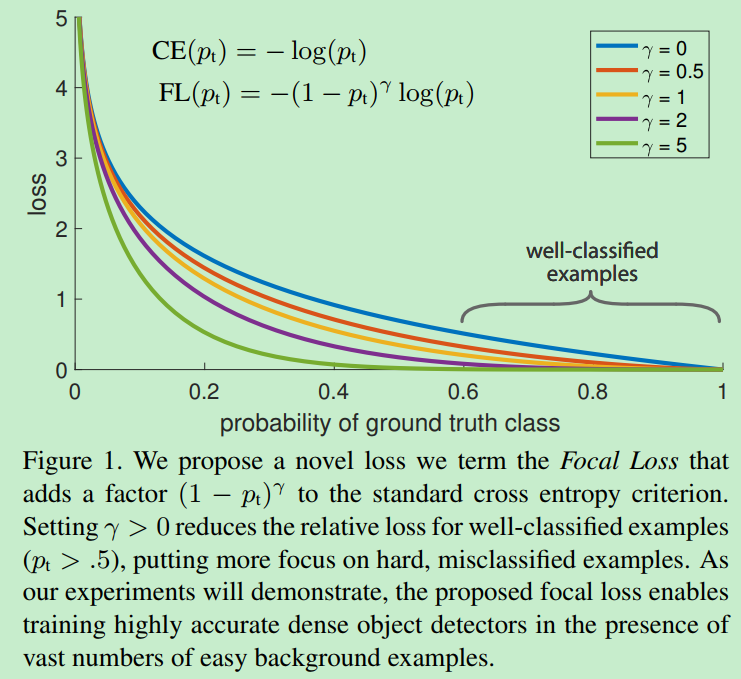

将Focal Loss与ResNet-101-FPN backbone结合提出RetinaNet（one-stage检测器），RetinaNet在COCO test-dev上达到39.1mAP，速度为5FPS。

RetinaNet检测器与当时最佳的其它检测器进行比较，无论是速度上还是准确率上都是最佳：

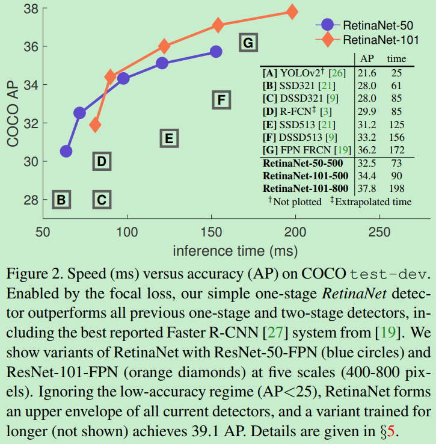

**详解：**

作者提出一种新的损失函数，思路是希望那些hard examples对损失的贡献变大，使网络更倾向于从这些样本上学习。

作者以二分类为例进行说明：

**交叉熵函数CE**

首先是我们常使用的交叉熵损失函数：

上式中，y=+1或者y=-1。p∈[0,1]是y=+1的估计概率。作者定义pt为：

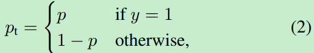

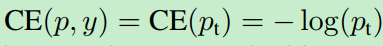

注：对交叉熵函数不了解的，可以参考[理解交叉熵作为损失函数在神经网络中的作用](https://blog.csdn.net/chaipp0607/article/details/73392175)

**均衡交叉熵函数**

要对类别不均衡问题对loss的贡献进行一个控制，即加上一个控制权重即可，最初作者的想法即如下这样，对于属于少数类别的样本，增大α即可

但这样有一个问题，它仅仅解决了正负样本之间的平衡问题，并没有区分易分/难分样本，按作者的话说：

> While α balances the importance of positive/negative examples, it does not differentiate between easy/hard examples. Instead, we propose to reshape the loss function to down-weight easy examples and thus focus training on hard negatives.

问：为什么公式(3)只解决正负样本不均衡问题？

答：增加了一个系数αt，跟pt的定义类似，当label=1的时候，αt=a；当label=-1的时候，αt=1-a，a的范围也是0到1。因此可以通过设定a的值（一般而言假如1这个类的样本数比-1这个类的样本数多很多，那么a会取0到0.5来增加-1这个类的样本的权重）来控制正负样本对总的loss的共享权重。

**Focal Loss**

作者一开始给交叉熵损失函数添加modulating factor：
$$
(1-pt)^γ(1−pt)γ
$$

显然，样本越易分，pt就越大（pt—>1），modulating factor趋近于0，则贡献的loss就越小，同样地，样本越难分，其pt就越小，modulating factor接近于1，则贡献的loss不受影响。

问：为什么pt越大，FL值越小？

答：根据公式（4）可知，FL与log(pt)中的pt成反比，与1-pt成正比，因此FL与pt的关系成反比。这是交叉熵函数的基本性质。当pt很大时（接近于1），FL值很小；而当pt很小时（接近于0），FL值会很大。

注：这里有个超参数—focusing parameter γ。

γ 放大了modulating factor的作用。

举原文中的一个例子，当pt=0.9时，带有modulating factor的focal loss是CE loss的100分之一，即进一步减小了正确分类的损失。

> For instance, with γ = 2, an example classified with pt = 0.9 would have 100× lower loss compared with CE and with pt ≈ 0.968 it would have 1000× lower loss. This in turn increases the importance of correcting misclassified examples (whose loss is scaled down by at most 4× for pt ≤ .5 and γ = 2).

在实际中，作者采用如下公式，即综合了公式(3)和公式(4)的形式，这样机能调整正负样本的权重，又能控制难易分类样本的权重：

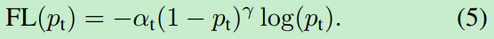

这里的两个参数 α和γ 来控制，在实验中a的选择范围也很广，一般而言当γ增加的时候，a需要减小一点，本文作者采用α=0.25，γ=2效果最好。

**RetinaNet Detector**

RetinaNet是由backbone网络和两个特殊任务的子网络（subnet）组成（属于one-stage检测器）。Backbone用来计算feature map；第一个子网络用来object classification，第二个子网络用来bounding box regression。

**Feature Pyramid Network Backbone**

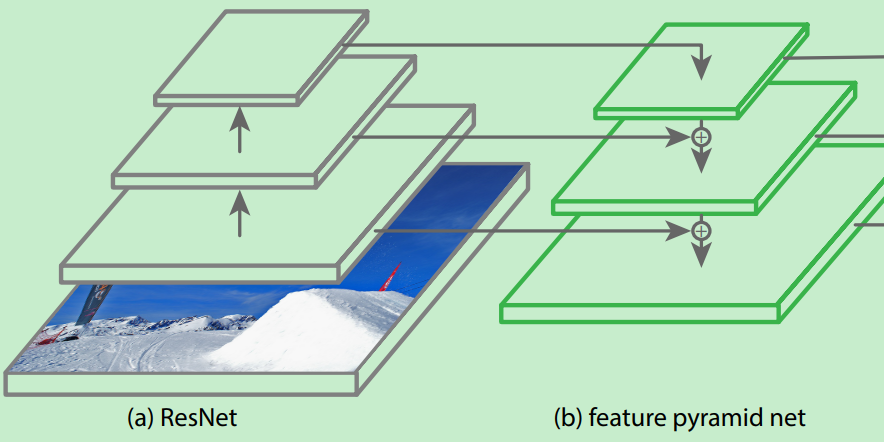

**Anchor**

**Classification Subnet**

**Box Regression Subnet**

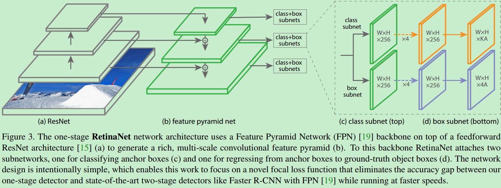

RetinaNet结构注意内容：

1. 训练时FPN每一级的所有example都被用于计算Focal Loss，loss值加到一起用来训练；
2. 测试时FPN每一级只选取score最大的1000个example来做nms；
3. 整个结构不同层的head部分(上图中的c和d部分)共享参数，但分类和回归分支间的参数不共享；
4. 分类分支的最后一级卷积的bias初始化成前面提到的-log((1-π)/π);

作者：张磊_0503 链接：<https://www.jianshu.com/p/204d9ad9507f> 來源：简书 简书著作权归作者所有，任何形式的转载都请联系作者获得授权并注明出处。

**实验结果**

Table1是关于RetinaNet和Focal Loss的一些实验结果。（a）是在交叉熵的基础上加上参数a，a=0.5就表示传统的交叉熵，可以看出当a=0.75的时候效果最好，AP值提升了0.9。（b）是对比不同的参数γ和a的实验结果，可以看出随着γ的增加，AP提升比较明显。（d）通过和OHEM的对比可以看出最好的Focal Loss比最好的OHEM提高了3.2AP。这里OHEM1:3表示在通过OHEM得到的minibatch上强制positive和negative样本的比例为1:3，通过对比可以看出这种强制的操作并没有提升AP。（e）加入了运算时间的对比，可以和前面的Figure2结合起来看，速度方面也有优势！注意这里RetinaNet-101-800的AP是37.8，当把训练时间扩大1.5倍同时采用scale jitter，AP可以提高到39.1，这就是全文和table2中的最高的39.1AP的由来。

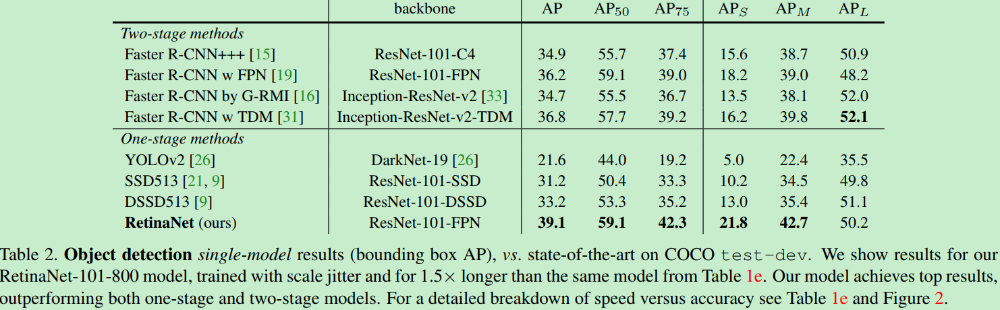

### 8.3.9 RFBNet

**标题：《Receptive Field Block Net for Accurate and Fast Object Detection》**

**时间：2017**

**出版源：ECCV 2018**

**主要链接：**

arXiv：https://arxiv.org/pdf/1711.07767.pdf

github(Official)：https://github.com/ruinmessi/RFBNet

- [ ] TODO

### 8.3.10 M2Det

**标题：《M2Det: A Single-Shot Object Detector based on Multi-Level Feature Pyramid Network》**

**时间：**2018

**出版源：**AAAI 2019

**主要链接：**

- arXiv：https://arxiv.org/abs/1811.04533
- github(Official)：https://github.com/qijiezhao/M2Det

## 8.4 人脸检测

在目标检测领域可以划分为了人脸检测与通用目标检测，往往人脸这方面会有专门的算法（包括人脸检测、人脸识别、人脸其他属性的识别等等），并且和通用目标检测（识别）会有一定的差别，着主要来源于人脸的特殊性（有时候目标比较小、人脸之间特征不明显、遮挡问题等），下面将从人脸检测和通用目标检测两个方面来讲解目标检测。

### 8.4.1 目前主要有人脸检测方法分类？

目前人脸检测方法主要包含两个区域：传统人脸检测算法和基于深度学习的人脸检测算法。传统人脸检测算法主要可以分为4类：

（1）基于知识的人脸检测方法；

（2）基于模型的人脸检测方法；

（3）基于特征的人脸检测方法；

（4）基于外观的人脸检测方法。

由于本书着重关注深度学习，下面会着重介绍基于深度学习的人脸检测方法。

2006年Hinton首次提出深度学习（Deep Learning）的概念，它是通过组合低层的特征形成更高层的抽象特征。随后研究者将深度学习应用在人脸检测领域，主要集中在基于卷积神经网络（CNN）的人脸检测研究，如基于级联卷积神经网络的人脸检测（cascade cnn）、 基于多任务卷积神经网络的人脸检测（MTCNN）、Facebox等，很大程度上提高了人脸检测的鲁棒性。当然通用目标检测算法像Faster-rcnn、yolo、ssd等也有用在人脸检测领域，也可以实现比较不错的结果，但是和专门人脸检测算法比还是有差别。下面部分主要介绍基于深度学习的的人脸检测算法，基于深度学习的通用目标检测算法将在第二大节介绍。

### 8.4.2 如何检测图片中不同大小的人脸？

传统人脸检测算法中针对不同大小人脸主要有两个策略：

（1）缩放图片的大小（图像金字塔如图8.4.1所示）；

（2）缩放滑动窗的大小（如图8.4.2所示）。

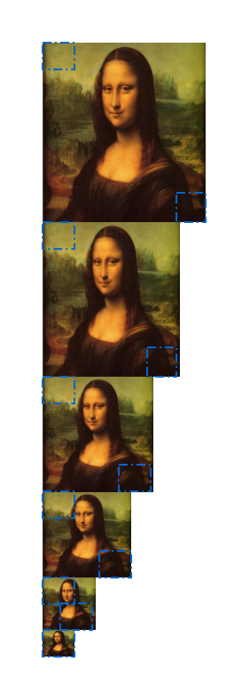

图 8.1 图像金字塔           

​      

 图 8.2 缩放滑动窗口

​	基于深度学习的人脸检测算法中针对不同大小人脸主要也有两个策略，但和传统人脸检测算法有点区别，主要包括:

（1）缩放图片大小。（不过也可以通过缩放滑动窗的方式，基于深度学习的滑动窗人脸检测方式效率会很慢存在多次重复卷积，所以要采用全卷积神经网络（FCN），用FCN将不能用滑动窗的方法。）

（2）通过anchor box的方法（如图8.3所示，不要和图8.2混淆，这里是通过特征图预测原图的anchorbox区域，具体在facebox中有描述）。

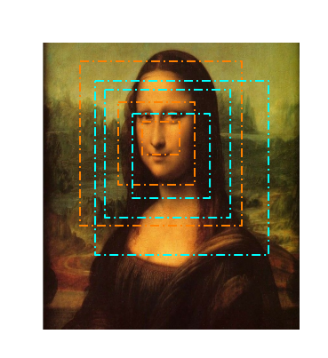

图 8.3 anchor box

### 8.4.3 如何设定算法检测最小人脸尺寸?

主要是看滑动窗的最小窗口和anchorbox的最小窗口。

（1）滑动窗的方法 

假设通过12×12的滑动窗，不对原图做缩放的话，就可以检测原图中12×12的最小人脸。但是往往通常给定最小人脸a=40、或者a=80，以这么大的输入训练CNN进行人脸检测不太现实，速度会很慢，并且下一次需求最小人脸a=30*30又要去重新训练，通常还会是12×12的输入，为满足最小人脸框a，只需要在检测的时候对原图进行缩放即可：w=w×12/a。

（2）anchorbox的方法

原理类似，这里主要看anchorbox的最小box，通过可以通过缩放输入图片实现最小人脸的设定。

### 8.4.4 如何定位人脸的位置

（1）滑动窗的方式：

滑动窗的方式是基于分类器识别为人脸的框的位置确定最终的人脸，

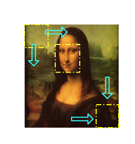

图 8.4 滑动窗

（2）FCN的方式：

​    FCN的方式通过特征图映射到原图的方式确定最终识别为人脸的位置，特征图映射到原图人脸框是要看特征图相比较于原图有多少次缩放（缩放主要查看卷积的步长和池化层），假设特征图上(2,3)的点，可粗略计算缩放比例为8倍，原图中的点应该是(16,24)；如果训练的FCN为12*12的输入，对于原图框位置应该是(16,24,12,12),当然这只是估计位置，具体的再构建网络时要加入回归框的预测，主要是相对于原图框的一个平移与缩放。

（3）通过anchor box的方式：

​    通过特征图映射到图的窗口，通过特征图映射到原图到多个框的方式确定最终识别为人脸的位置。

### 8.1.5 如何通过一个人脸的多个框确定最终人脸框位置？

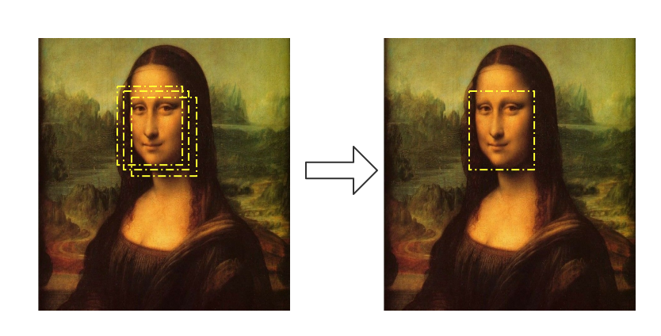

图 8.5 通过NMS得到最终的人脸位置

NMS改进版本有很多，最原始的NMS就是判断两个框的交集，如果交集大于设定的阈值，将删除其中一个框，那么两个框应该怎么选择删除哪一个呢？ 因为模型输出有概率值，一般会优选选择概率小的框删除。

### 8.1.6 基于级联卷积神经网络的人脸检测（Cascade CNN）

1. cascade cnn的框架结构是什么？

   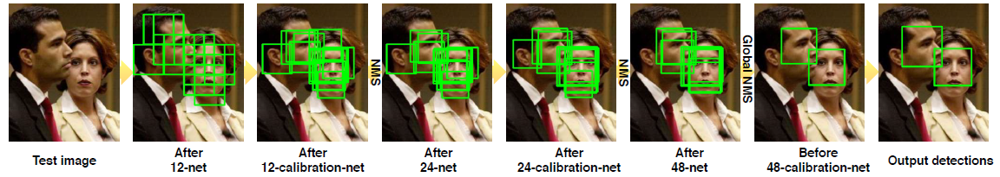

级联结构中有6个CNN，3个CNN用于人脸非人脸二分类，另外3个CNN用于人脸区域的边框校正。给定一幅图像，12-net密集扫描整幅图片，拒绝90%以上的窗口。剩余的窗口输入到12-calibration-net中调整大小和位置，以接近真实目标。接着输入到NMS中，消除高度重叠窗口。下面网络与上面类似。

2. cascade cnn人脸校验模块原理是什么？ 

该网络用于窗口校正，使用三个偏移变量：Xn:水平平移量，Yn:垂直平移量，Sn:宽高比缩放。候选框口(x,y,w,h)中，(x,y)表示左上点坐标，(w,h)表示宽和高。

我们要将窗口的控制坐标调整为：
$$
（x-{x_nw}/{s_n},y-{y_nh}/{s_n},{w}/{s_n},{h}/{s_n}）
$$
这项工作中，我们有$N=5×3×3=45$种模式。偏移向量三个参数包括以下值：
$$
Sn：(0.83,0.91,1.0,1.10,1.21)    
$$

$$
Xn：(-0.17,0,0.17)
$$

$$
Yn：(-0.17,0,0.17)
$$

同时对偏移向量三个参数进行校正。

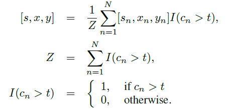

3、训练样本应该如何准备？

人脸样本：

非人脸样本：

4. 级联的好处

级联的工作原理和好处：

- 最初阶段的网络可以比较简单，判别阈值可以设得宽松一点，这样就可以在保持较高召回率的同时排除掉大量的非人脸窗口；
- 最后阶段网络为了保证足够的性能，因此一般设计的比较复杂，但由于只需要处理前面剩下的窗口，因此可以保证足够的效率；
- 级联的思想可以帮助我们去组合利用性能较差的分类器，同时又可以获得一定的效率保证。

### 8.4.7 基于多任务卷积神经网络的人脸检测（MTCNN）

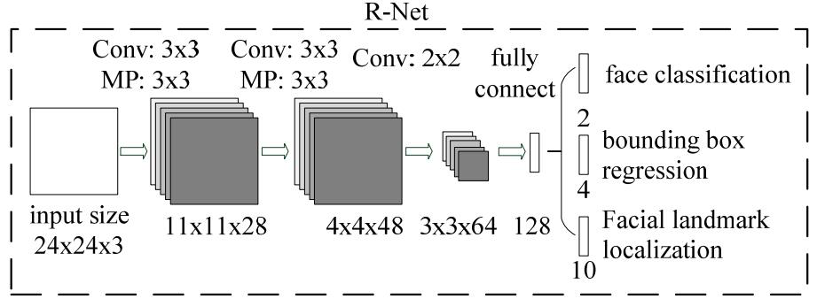

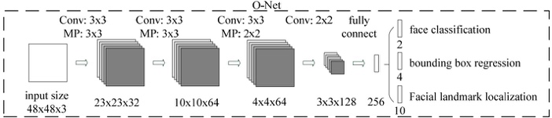

1.MTCNN模型有三个子网络。分别是P-Net,R-Net,O-Net.我想问一下，1.模型中的三个input size是指的是同一张图resize到不同尺度下喂给不同模型，还是同一张图，依次经过三个模型，然后是不同的输入尺寸？（这部分能给我讲一下吗）2.每个模型它都有对应三个结果（face classification;bounding box;facial landmark）这三个在网络上是如何对应的呢？

为了检测不同大小的人脸，开始需要构建图像金字塔，先经过pNet模型，输出人脸类别和边界框（边界框的预测为了对特征图映射到原图的框平移和缩放得到更准确的框），将识别为人脸的框映射到原图框位置可以获取patch，之后每一个patch通过resize的方式输入到rNet，识别为人脸的框并且预测更准确的人脸框，最后rNet识别为人脸的的每一个patch通过resize的方式输入到oNet，跟rNet类似，关键点是为了在训练集有限情况下使模型更鲁棒。

还要注意一点构建图像金字塔的的缩放比例要保留，为了将边界框映射到最开始原图上的

还要注意一点：如何从featureMap映射回原图

### 8.4.8 Facebox

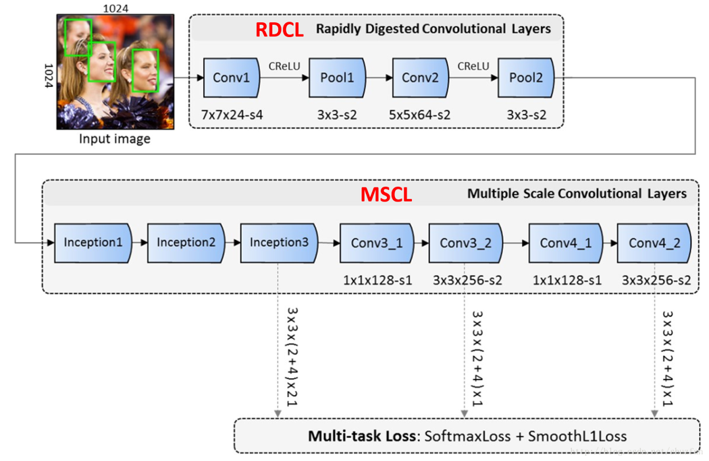

**（1）Rapidly Digested Convolutional Layers(RDCL)**

在网络前期，使用RDCL快速的缩小feature map的大小。 主要设计原则如下：

- Conv1, Pool1, Conv2 和 Pool2 的stride分别是4, 2, 2 和 2。这样整个RDCL的stride就是32，可以很快把feature map的尺寸变小。
- 卷积(或pooling)核太大速度就慢，太小覆盖信息又不足。文章权衡之后，将Conv1, Pool1, Conv2 和 Pool2 的核大小分别设为7x7,3x3,5x5,3x3
- 使用CReLU来保证输出维度不变的情况下，减少卷积核数量。

**（2）Multiple Scale Convolutional Layers(MSCL)**

在网络后期，使用MSCL更好地检测不同尺度的人脸。 主要设计原则有：

- 类似于SSD，在网络的不同层进行检测；
- 采用Inception模块。由于Inception包含多个不同的卷积分支，因此可以进一步使得感受野多样化。

**（3）Anchor densification strategy**

为了anchor密度均衡，可以对密度不足的anchor以中心进行偏移加倍，如下图所示：

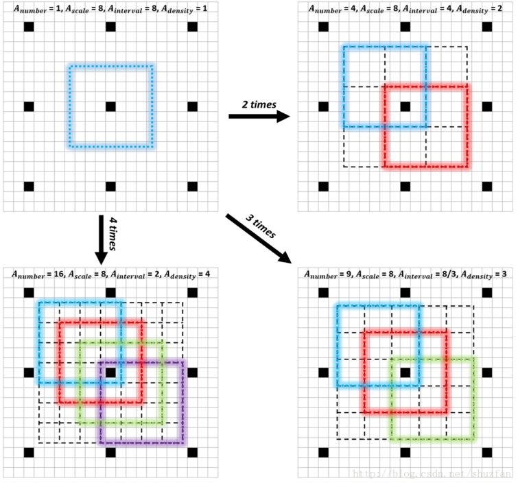

## Reference

https://github.com/amusi/awesome-object-detection

https://github.com/hoya012/deep_learning_object_detection

https://handong1587.github.io/deep_learning/2015/10/09/object-detection.html
