[TOC]

# 第八章  目标检测

## 8.1 基本概念

### 8.1.1 什么是目标检测？

​	目标检测（Object Detection）的任务是找出图像中所有感兴趣的目标（物体），确定它们的类别和位置，是计算机视觉领域的核心问题之一。由于各类物体有不同的外观、形状和姿态，加上成像时光照、遮挡等因素的干扰，目标检测一直是计算机视觉领域最具有挑战性的问题。

​	计算机视觉中关于图像识别有四大类任务：

**分类-Classification**：解决“是什么？”的问题，即给定一张图片或一段视频判断里面包含什么类别的目标。

**定位-Location**：解决“在哪里？”的问题，即定位出这个目标的的位置。

**检测-Detection**：解决“是什么？在哪里？”的问题，即定位出这个目标的的位置并且知道目标物是什么。

**分割-Segmentation**：分为实例的分割（Instance-level）和场景分割（Scene-level），解决“每一个像素属于哪个目标物或场景”的问题。

### 8.1.2 目标检测要解决的核心问题？

除了图像分类之外，目标检测要解决的核心问题是：

1.目标可能出现在图像的任何位置。

2.目标有各种不同的大小。

3.目标可能有各种不同的形状。

### 8.1.3 目标检测算法分类？

基于深度学习的目标检测算法主要分为两类：

**1.Two stage目标检测算法**

​	先进行区域生成（region proposal，RP）（一个有可能包含待检物体的预选框），再通过卷积神经网络进行样本分类。

​	任务：特征提取—>生成RP—>分类/定位回归。

​	常见的two stage目标检测算法有：R-CNN、SPP-Net、Fast R-CNN、Faster R-CNN和R-FCN等。

**2.One stage目标检测算法**

​	不用RP，直接在网络中提取特征来预测物体分类和位置。

​	任务：特征提取—>分类/定位回归。

​	常见的one stage目标检测算法有：OverFeat、YOLOv1、YOLOv2、YOLOv3、SSD和RetinaNet等。

### 8.1.4 目标检测有哪些应用？

​	目标检测具有巨大的实用价值和应用前景。应用领域包括人脸检测、行人检测、车辆检测、飞机航拍或卫星图像中道路的检测、车载摄像机图像中的障碍物检测、医学影像在的病灶检测等。还有在安防领域中，可以实现比如安全帽、安全带等动态检测，移动侦测、区域入侵检测、物品看护等功能。

## 8.2 Two Stage目标检测算法 

### 8.2.1 R-CNN

**R-CNN有哪些创新点？**

1. 使用CNN（ConvNet）对 region proposals 计算 feature vectors。从经验驱动特征（SIFT、HOG）到数据驱动特征（CNN feature map），提高特征对样本的表示能力。
2. 采用大样本下（ILSVRC）有监督预训练和小样本（PASCAL）微调（fine-tuning）的方法解决小样本难以训练甚至过拟合等问题。

注：ILSVRC其实就是众所周知的ImageNet的挑战赛，数据量极大；PASCAL数据集（包含目标检测和图像分割等），相对较小。

**R-CNN 介绍**

​	R-CNN作为R-CNN系列的第一代算法，其实没有过多的使用“深度学习”思想，而是将“深度学习”和传统的“计算机视觉”的知识相结合。比如R-CNN pipeline中的第二步和第四步其实就属于传统的“计算机视觉”技术。使用selective search提取region proposals，使用SVM实现分类。

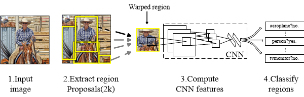

原论文中R-CNN pipeline只有4个步骤，光看上图无法深刻理解R-CNN处理机制，下面结合图示补充相应文字

1. 预训练模型。选择一个预训练 （pre-trained）神经网络（如AlexNet、VGG）。

2. 重新训练全连接层。使用需要检测的目标重新训练（re-train）最后全连接层（connected layer）。

3. 提取 proposals并计算CNN 特征。利用选择性搜索（Selective Search）算法提取所有proposals（大约2000幅images），调整（resize/warp）它们成固定大小，以满足 CNN输入要求（因为全连接层的限制），然后将feature map 保存到本地磁盘。

   

4. 训练SVM。利用feature map 训练SVM来对目标和背景进行分类（每个类一个二进制SVM）

5. 边界框回归（Bounding boxes Regression）。训练将输出一些校正因子的线性回归分类器

**R-CNN 实验结果**

R-CNN在VOC 2007测试集上mAP达到58.5%，打败当时所有的目标检测算法。

### 8.2.2 Fast R-CNN

**Fast R-CNN有哪些创新点？**

1. 只对整幅图像进行一次特征提取，避免R-CNN中的冗余特征提取
2. 用RoI pooling层替换最后一层的max pooling层，同时引入建议框数据，提取相应建议框特征
3. Fast R-CNN网络末尾采用并行的不同的全连接层，可同时输出分类结果和窗口回归结果，实现了end-to-end的多任务训练【建议框提取除外】，也不需要额外的特征存储空间【R-CNN中的特征需要保持到本地，来供SVM和Bounding-box regression进行训练】
4. 采用SVD对Fast R-CNN网络末尾并行的全连接层进行分解，减少计算复杂度，加快检测速度。

**Fast R-CNN 介绍**

​	Fast R-CNN是基于R-CNN和SPPnets进行的改进。SPPnets，其创新点在于计算整幅图像的the shared feature map，然后根据object proposal在shared feature map上映射到对应的feature vector（就是不用重复计算feature map了）。当然，SPPnets也有缺点：和R-CNN一样，训练是多阶段（multiple-stage pipeline）的，速度还是不够"快"，特征还要保存到本地磁盘中。

将候选区域直接应用于特征图，并使用RoI池化将其转化为固定大小的特征图块。以下是Fast R-CNN的流程图

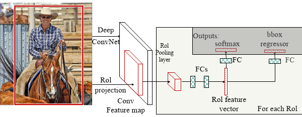

**RoI Pooling层详解**

因为Fast R-CNN使用全连接层，所以应用RoI Pooling将不同大小的ROI转换为固定大小。

RoI Pooling 是Pooling层的一种，而且是针对RoI的Pooling，其特点是输入特征图尺寸不固定，但是输出特征图尺寸固定（如7x7）。

**什么是RoI呢？**

RoI是Region of Interest的简写，一般是指图像上的区域框，但这里指的是由Selective Search提取的候选框。

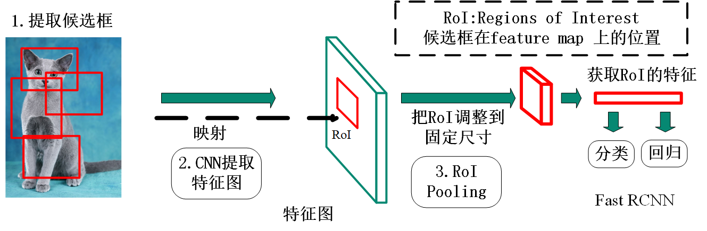

往往经过RPN后输出的不止一个矩形框，所以这里我们是对多个RoI进行Pooling。

**RoI Pooling的输入**

输入有两部分组成： 

1. 特征图（feature map）：指的是上面所示的特征图，在Fast RCNN中，它位于RoI Pooling之前，在Faster RCNN中，它是与RPN共享那个特征图，通常我们常常称之为“share_conv”； 
2. RoIs，其表示所有RoI的N*5的矩阵。其中N表示RoI的数量，第一列表示图像index，其余四列表示其余的左上角和右下角坐标。

在Fast RCNN中，指的是Selective Search的输出；在Faster RCNN中指的是RPN的输出，一堆矩形候选框，形状为1x5x1x1（4个坐标+索引index），其中值得注意的是：坐标的参考系不是针对feature map这张图的，而是针对原图的（神经网络最开始的输入）。其实关于ROI的坐标理解一直很混乱，到底是根据谁的坐标来。其实很好理解，我们已知原图的大小和由Selective Search算法提取的候选框坐标，那么根据"映射关系"可以得出特征图（featurwe map）的大小和候选框在feature map上的映射坐标。至于如何计算，其实就是比值问题，下面会介绍。所以这里把ROI理解为原图上各个候选框（region proposals），也是可以的。

注：说句题外话，由Selective Search算法提取的一系列可能含有object的bounding box，这些通常称为region proposals或者region of interest（ROI）。

**RoI的具体操作**

1. 根据输入image，将ROI映射到feature map对应位置

   注：映射规则比较简单，就是把各个坐标除以“输入图片与feature map的大小的比值”，得到了feature map上的box坐标

2. 将映射后的区域划分为相同大小的sections（sections数量与输出的维度相同）

3. 对每个sections进行max pooling操作

这样我们就可以从不同大小的方框得到固定大小的相应 的feature maps。值得一提的是，输出的feature maps的大小不取决于ROI和卷积feature maps大小。RoI Pooling 最大的好处就在于极大地提高了处理速度。

**RoI Pooling的输出**

输出是batch个vector，其中batch的值等于RoI的个数，vector的大小为channel * w * h；RoI Pooling的过程就是将一个个大小不同的box矩形框，都映射成大小固定（w * h）的矩形框。

**RoI Pooling示例**

### 8.2.3 Faster R-CNN  

**Faster R-CNN有哪些创新点？**

Fast R-CNN依赖于外部候选区域方法，如选择性搜索。但这些算法在CPU上运行且速度很慢。在测试中，Fast R-CNN需要2.3秒来进行预测，其中2秒用于生成2000个ROI。Faster R-CNN采用与Fast R-CNN相同的设计，只是它用内部深层网络代替了候选区域方法。新的候选区域网络（RPN）在生成ROI时效率更高，并且以每幅图像10毫秒的速度运行。
 

图8.1.13 Faster R-CNN的流程图
Faster R-CNN的流程图与Fast R-CNN相同，采用外部候选区域方法代替了内部深层网络。
 

图8.1.14
**候选区域网络**

候选区域网络（RPN）将第一个卷积网络的输出特征图作为输入。它在特征图上滑动一个3×3的卷积核，以使用卷积网络（如下所示的ZF网络）构建与类别无关的候选区域。其他深度网络（如VGG或ResNet）可用于更全面的特征提取，但这需要以速度为代价。ZF网络最后会输出256个值，它们将馈送到两个独立的全连接层，以预测边界框和两个objectness分数，这两个objectness分数度量了边界框是否包含目标。我们其实可以使用回归器计算单个objectness分数，但为简洁起见，Faster R-CNN使用只有两个类别的分类器：即带有目标的类别和不带有目标的类别。
 

图8.1.15
对于特征图中的每一个位置，RPN会做k次预测。因此，RPN将输出4×k个坐标和每个位置上2×k个得分。下图展示了8×8的特征图，且有一个3×3的卷积核执行运算，它最后输出8×8×3个ROI（其中k=3）。下图（右）展示了单个位置的3个候选区域。
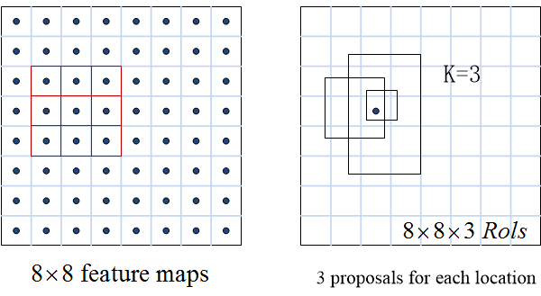

图8.1.16
假设最好涵盖不同的形状和大小。因此，Faster R-CNN不会创建随机边界框。相反，它会预测一些与左上角名为锚点的参考框相关的偏移量（如x, y）。我们限制这些偏移量的值，因此我们的猜想仍然类似于锚点。
 

图8.1.17
要对每个位置进行k个预测，我们需要以每个位置为中心的k个锚点。每个预测与特定锚点相关联，但不同位置共享相同形状的锚点。
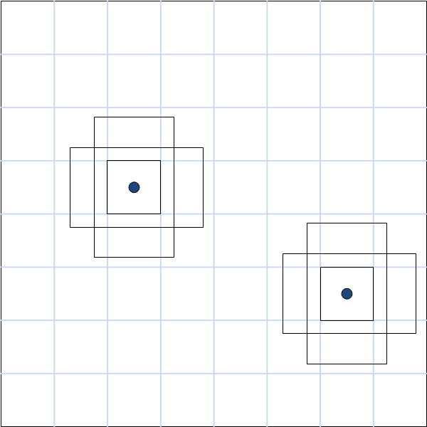 

图8.1.18
这些锚点是精心挑选的，因此它们是多样的，且覆盖具有不同比例和宽高比的现实目标。这使得我们可以用更好的猜想来指导初始训练，并允许每个预测专门用于特定的形状。该策略使早期训练更加稳定和简便。

图8.1.19
Faster R-CNN使用更多的锚点。它部署9个锚点框：3个不同宽高比的3个不同大小的锚点（Anchor）框。每一个位置使用9个锚点，每个位置会生成2×9个objectness分数和4×9个坐标。

### 8.2.4 R-FCN

**R-FCN有哪些创新点？**

R-FCN 仍属于two-stage 目标检测算法：RPN+R-FCN

1. Fully convolutional
2. 位置敏感得分图（position-sentive score maps）

> our region-based detector is **fully convolutional** with almost all computation shared on the entire image. To achieve this goal, we propose **position-sensitive score maps** to address a dilemma between translation-invariance in image classification and translation-variance in object detection.

R-FCN backbone：ResNet

ResNet-101+R-FCN：83.6% in PASCAL VOC 2007 test datasets

既提高了mAP，又加快了检测速度

    假设我们只有一个特征图用来检测右眼。那么我们可以使用它定位人脸吗？应该可以。因为右眼应该在人脸图像的左上角，所以我们可以利用这一点定位整个人脸。如果我们还有其他用来检测左眼、鼻子或嘴巴的特征图，那么我们可以将检测结果结合起来，更好地定位人脸。现在我们回顾一下所有问题。在Faster R-CNN中，检测器使用了多个全连接层进行预测。如果有2000个ROI，那么成本非常高。R-FCN通过减少每个ROI所需的工作量实现加速。上面基于区域的特征图与ROI是独立的，可以在每个ROI之外单独计算。剩下的工作就比较简单了，因此R-FCN的速度比Faster R-CNN快。
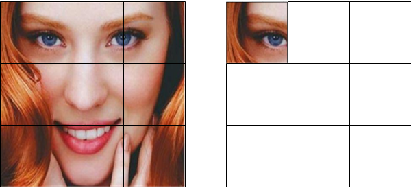

    图8.2.1 人脸检测
    现在我们来看一下5×5的特征图M，内部包含一个蓝色方块。我们将方块平均分成3×3个区域。现在，我们在M中创建了一个新的特征图，来检测方块的左上角（TL）。这个新的特征图如下图（右）所示。只有黄色的网格单元[2,2]处于激活状态。在左侧创建一个新的特征图，用于检测目标的左上角。
 

    图8.2.2 检测示例
    我们将方块分成9个部分，由此创建了9个特征图，每个用来检测对应的目标区域。这些特征图叫做位置敏感得分图（position-sensitive score map），因为每个图检测目标的子区域（计算其得分）。

    图8.2.3生成9个得分图
    下图中红色虚线矩形是建议的ROI。我们将其分割成3×3个区域，并询问每个区域包含目标对应部分的概率是多少。例如，左上角ROI区域包含左眼的概率。我们将结果存储成3×3 vote数组，如下图（右）所示。例如，vote_array[0][0]包含左上角区域是否包含目标对应部分的得分。
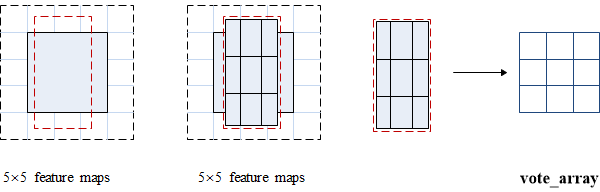 

    图8.2.4
    将ROI应用到特征图上，输出一个3x3数组。将得分图和ROI映射到vote数组的过程叫做位置敏感ROI池化（position-sensitive ROI-pool）。该过程与前面讨论过的ROI池化非常接近。
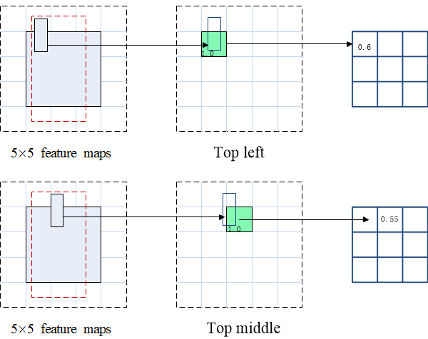 

    图8.2.5
    将ROI的一部分叠加到对应的得分图上，计算V[i][j]。在计算出位置敏感ROI池化的所有值后，类别得分是其所有元素得分的平均值。

    图8.2.6 ROI池化
    假如我们有C个类别要检测。我们将其扩展为C+1个类别，这样就为背景（非目标）增加了一个新的类别。每个类别有3×3个得分图，因此一共有(C+1)×3×3个得分图。使用每个类别的得分图可以预测出该类别的类别得分。然后我们对这些得分应用 softmax 函数，计算出每个类别的概率。以下是数据流图，在本案例中，k=3。
 

    图8.2.7
### 8.2.5 FPN

**FPN有哪些创新点？**

1. 多层特征
2. 特征融合

解决目标检测中的多尺度问题，通过简单的网络连接改变，在基本不增加原有模型计算量的情况下，大幅度提升小物体（small object）检测的性能。

在物体检测里面，有限计算量情况下，网络的深度（对应到感受野）与 stride 通常是一对矛盾的东西，常用的网络结构对应的 stride 一般会比较大（如 32），而图像中的小物体甚至会小于 stride 的大小，造成的结果就是小物体的检测性能急剧下降。传统解决这个问题的思路包括：

1. 图像金字塔（image pyramid），即多尺度训练和测试。但该方法计算量大，耗时较久。
2. 特征分层，即每层分别预测对应的scale分辨率的检测结果，如SSD算法。该方法强行让不同层学习同样的语义信息，但实际上不同深度对应于不同层次的语义特征，浅层网络分辨率高，学到更多是细节特征，深层网络分辨率低，学到更多是语义特征。

因而，目前多尺度的物体检测主要面临的挑战为：

1. 如何学习具有强语义信息的多尺度特征表示？
2. 如何设计通用的特征表示来解决物体检测中的多个子问题？如 object proposal, box localization, instance segmentation.
3. 如何高效计算多尺度的特征表示？

FPN网络直接在Faster R-CNN单网络上做修改，每个分辨率的 feature map 引入后一分辨率缩放两倍的 feature map 做 element-wise 相加的操作。通过这样的连接，每一层预测所用的 feature map 都融合了不同分辨率、不同语义强度的特征，融合的不同分辨率的 feature map 分别做对应分辨率大小的物体检测。这样保证了每一层都有合适的分辨率以及强语义（rich semantic）特征。同时，由于此方法只是在原网络基础上加上了额外的跨层连接，在实际应用中几乎不增加额外的时间和计算量。作者接下来实验了将 FPN 应用在 Faster RCNN 上的性能，在 COCO 上达到了 state-of-the-art 的单模型精度。在RPN上，FPN增加了8.0个点的平均召回率（average recall，AR）；在后面目标检测上，对于COCO数据集，FPN增加了2.3个点的平均精确率（average precision，AP），对于VOC数据集，FPN增加了3.8个点的AP。

FPN算法主要由三个模块组成，分别是：

1. Bottom-up pathway（自底向上线路）
2. Lareral connections（横向链接）
3. Top-down path（自顶向下线路）

**Bottom-up pathway**

FPN是基于Faster R-CNN进行改进，其backbone是ResNet-101，FPN主要应用在Faster R-CNN中的RPN（用于bouding box proposal generation）和Fast R-CNN（用于object detection）两个模块中。

其中 RPN 和 Fast RCNN 分别关注的是召回率（recall）和精确率（precision），在这里对比的指标分别为 Average Recall(AR) 和 Average Precision(AP)。

注：Bottom-up可以理解为自底向上，Top-down可以理解为自顶向下。这里的下是指low-level，上是指high-level，分别对应于提取的低级（浅层）特征和高级语义（高层）特征。

Bottom-up pathway 是卷积网络的前向传播过程。在前向传播过程中，feature map的大小可以在某些层发生改变。一些尺度（scale）因子为2，所以后一层feature map的大小是前一层feature map大小的二分之一，根据此关系进而构成了feature pyramid（hierarchy）。

然而还有很多层输出的feature map是一样的大小（即不进行缩放的卷积），作者将这些层归为同一 stage。对于feature pyramid，作者为每个stage定义一个pyramid level。

作者将每个stage的最后一层的输出作为feature map，然后不同stage进行同一操作，便构成了feature pyramid。

具体来说，对于ResNets-101，作者使用了每个stage的最后一个残差结构的特征激活输出。将这些残差模块输出表示为{C2, C3, C4, C5}，对应于conv2，conv3，conv4和conv5的输出，并且注意它们相对于输入图像具有{4, 8, 16, 32}像素的步长。考虑到内存占用，没有将conv1包含在金字塔中。

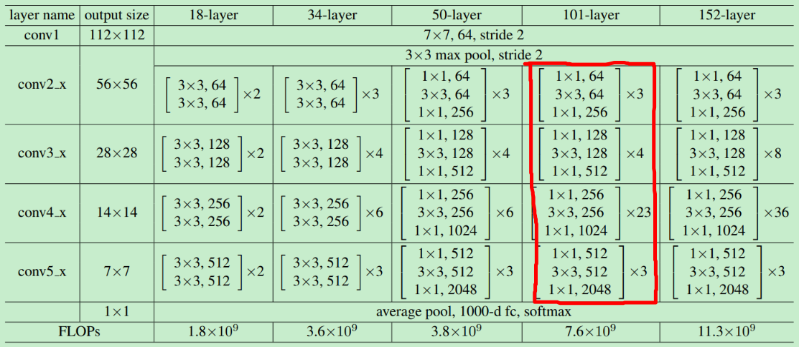

**Top-down pathway and lateral connections**

Top-town pathway是上采样（upsampling）过程。而later connection（横向连接）是将上采样的结果和bottom-up pathway生成的相同大小的feature map进行融合（merge）。

注：上采样尺度因子为2，因为为了和之前下采样卷积的尺度因子=2一样。上采样是放大，下采样是缩小。

具体操作如下图所示，上采样（2x up）feature map与相同大小的bottom-up feature map进行逐像素相加融合（element-wise addition），其中bottom-up feature先要经过1x1卷积层，目的是为了减少通道维度（reduce channel dimensions）。

注：减少通道维度是为了将bottom-up feature map的通道数量与top-down feature map的通道数量保持一致，又因为两者feature map大小一致，所以可以进行对应位置像素的叠加（element-wise addition）。

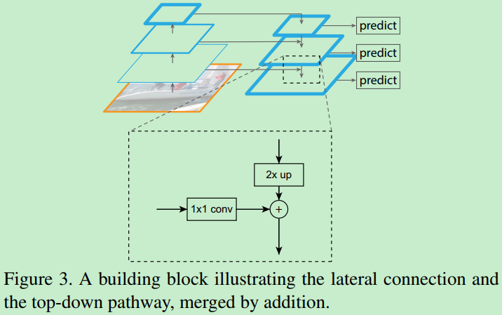

### 8.2.6 Mask R-CNN

**Mask R-CNN有哪些创新点？**

1. Backbone：ResNeXt-101+FPN
2. RoI Align替换RoI Pooling

Mask R-CNN是一个实例分割（Instance segmentation）算法，主要是在目标检测的基础上再进行分割。Mask R-CNN算法主要是Faster R-CNN+FCN，更具体一点就是ResNeXt+RPN+RoI Align+Fast R-CNN+FCN。

**Mask R-CNN算法步骤**

1. 输入一幅你想处理的图片，然后进行对应的预处理操作，或者预处理后的图片；
2. 将其输入到一个预训练好的神经网络中（ResNeXt等）获得对应的feature map；
3. 对这个feature map中的每一点设定预定个的RoI，从而获得多个候选RoI；
4. 将这些候选的RoI送入RPN网络进行二值分类（前景或背景）和BB回归，过滤掉一部分候选的RoI；
5. 对这些剩下的RoI进行RoI Align操作（即先将原图和feature map的pixel对应起来，然后将feature map和固定的feature对应起来）；
6. 对这些RoI进行分类（N类别分类）、BB回归和MASK生成（在每一个RoI里面进行FCN操作）。

**RoI Pooling和RoI Align有哪些不同？**

ROI Align 是在Mask-RCNN中提出的一种区域特征聚集方式，很好地解决了RoI Pooling操作中两次量化造成的区域不匹配(mis-alignment)的问题。实验显示，在检测测任务中将 RoI Pooling 替换为 RoI Align 可以提升检测模型的准确性。

在常见的两级检测框架（比如Fast-RCNN，Faster-RCNN，RFCN）中，RoI Pooling 的作用是根据预选框的位置坐标在特征图中将相应区域池化为固定尺寸的特征图，以便进行后续的分类和包围框回归操作。由于预选框的位置通常是由模型回归得到的，一般来讲是浮点数，而池化后的特征图要求尺寸固定。故RoI Pooling这一操作存在两次量化的过程。

- 将候选框边界量化为整数点坐标值。
- 将量化后的边界区域平均分割成 $k\times k$ 个单元(bin),对每一个单元的边界进行量化。

事实上，经过上述两次量化，此时的候选框已经和最开始回归出来的位置有一定的偏差，这个偏差会影响检测或者分割的准确度。在论文里，作者把它总结为“不匹配问题（misalignment）”。

下面我们用直观的例子具体分析一下上述区域不匹配问题。如下图所示，这是一个Faster-RCNN检测框架。输入一张$800\times 800$的图片，图片上有一个$665\times 665$的包围框（框着一只狗）。图片经过主干网络提取特征后，特征图缩放步长（stride）为32。因此，图像和包围框的边长都是输入时的1/32。800正好可以被32整除变为25。但665除以32以后得到20.78，带有小数，于是RoI Pooling 直接将它量化成20。接下来需要把框内的特征池化$7\times 7$的大小，因此将上述包围框平均分割成$7\times 7$个矩形区域。显然，每个矩形区域的边长为2.86，又含有小数。于是ROI Pooling 再次把它量化到2。经过这两次量化，候选区域已经出现了较明显的偏差（如图中绿色部分所示）。更重要的是，该层特征图上0.1个像素的偏差，缩放到原图就是3.2个像素。那么0.8的偏差，在原图上就是接近30个像素点的差别，这一差别不容小觑。

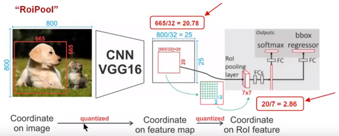

为了解决RoI Pooling的上述缺点，作者提出了RoI Align这一改进的方法(如图2)。

RoI Align的思路很简单：取消量化操作，使用双线性内插的方法获得坐标为浮点数的像素点上的图像数值，从而将整个特征聚集过程转化为一个连续的操作。值得注意的是，在具体的算法操作上，RoI Align并不是简单地补充出候选区域边界上的坐标点，然后将这些坐标点进行池化，而是重新设计了一套比较优雅的流程，如下图所示：

1. 遍历每一个候选区域，保持浮点数边界不做量化。

2. 将候选区域分割成$k\times k$个单元，每个单元的边界也不做量化。

3. 在每个单元中计算固定四个坐标位置，用双线性内插的方法计算出这四个位置的值，然后进行最大池化操作。

这里对上述步骤的第三点作一些说明：这个固定位置是指在每一个矩形单元（bin）中按照固定规则确定的位置。比如，如果采样点数是1，那么就是这个单元的中心点。如果采样点数是4，那么就是把这个单元平均分割成四个小方块以后它们分别的中心点。显然这些采样点的坐标通常是浮点数，所以需要使用插值的方法得到它的像素值。在相关实验中，作者发现将采样点设为4会获得最佳性能，甚至直接设为1在性能上也相差无几。事实上，RoI Align 在遍历取样点的数量上没有RoI Pooling那么多，但却可以获得更好的性能，这主要归功于解决了mis alignment的问题。值得一提的是，我在实验时发现，RoI Align在VOC 2007数据集上的提升效果并不如在COCO上明显。经过分析，造成这种区别的原因是COCO上小目标的数量更多，而小目标受mis alignment问题的影响更大（比如，同样是0.5个像素点的偏差，对于较大的目标而言显得微不足道，但是对于小目标，误差的影响就要高很多）。

###  8.2.7  DetNet（贡献者：北京理工大学--明奇）

DetNet是发表在ECCV2018的论文，比较新，出发点是现有的检测任务backbone都是从分类任务衍生而来的，因此作者想针对检测专用的backbone做一些讨论和研究而设计了DetNet，思路比较新奇。

1. **Introduction**  
&emsp;&emsp;很多backbone的提出都是用于挑战ImageNet分类任务后被应用到检测上来，而鲜有单独<u>针对检测任务设计的backbone</u>。          

&emsp;&emsp;**检测和分类有明显的区别**：（1）不仅需要分类，还需要精确的定位 （2）最近的检测器都是基于类似FPN结构，在分类网络基础上加额外多尺度特征进行检测，应对不同尺度变化的目标。这两点又是相互补充，共同协助网络完成分类到检测任务的转变。例如分类任务是检测的一环所以必不可少，但是传统分类采用的最高级特征定位细节不够，因此很多最近网络设法用类似FPN的结构去处理尺度变化的问题，就将分类较好地过渡到检测任务上了。

2. **DetNet**  

  2.1 **Motivation**  
  &emsp;&emsp;主要着眼点是**分辨率**，从大目标和小目标分别阐述保持分辨率的重要性。所以DetNet也是从分辨率的保持着手，解决多尺度物体的识别问题。

* Weak visibility of large objects  
&emsp;&emsp;网络在较深层如P6（FPN）P7（RetinaNet）大目标的边界不明确使精确定位困难。

* Invisibility of small objects  
&emsp;&emsp;小目标就很惨了，降采样容易丢。这个就不赘述了，所以只要避开降采样就能防止目标丢失，但是这种方法又会导致抽象能力不够 

​    2.2  **DetNet Design**  
&emsp;&emsp;保持分辨率有两个麻烦的问题：（1）内存消耗大，计算大 （2）降采样减少导致高层的抽象特征不足以很好地进行分类任务。下面设计时会同时考虑时间和高层抽象信息两点。  
&emsp;&emsp;先放出DetNet的多尺度各stage的尺寸如下图， 可以看到，相比前两种方式，DetNet在P4之后就不再进一步降采样了，进行分辨率的保持。

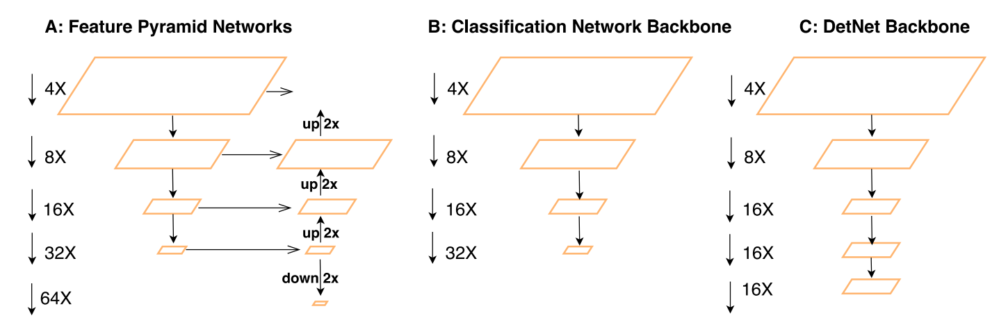

&emsp;&emsp;实现细节如下图：

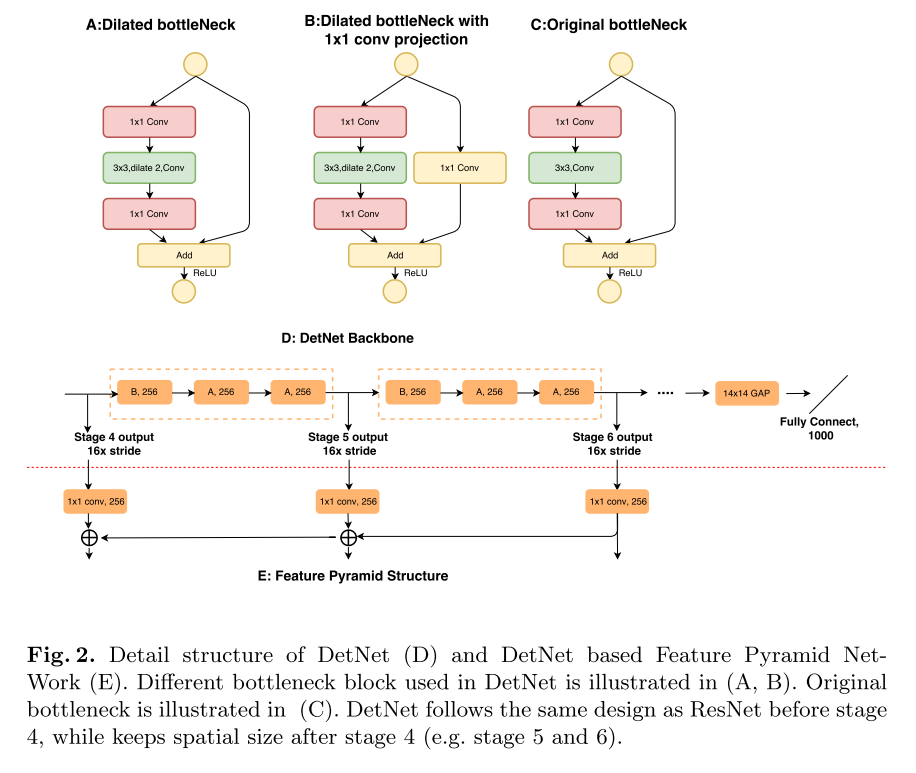

* 采用的backbone是ResNet-50，改进设计了DetNet-59。
* 对bottlenecks进行了改进，传统的其实不止C，也包含两种，即将AB的膨胀卷积换成普通卷积。AB是新的基础模块。
* 为了减少分辨率保持带来的时间和内存成本消耗，通道数固定为256（思考：降采样和膨胀卷积都会有信息丢失，这里可以想想）。
* DetNet也可以加FPN结构，方法类似。

3. **Experiments**  
    &emsp;&emsp;检测和训练的细节配置就不看了。

  3.1 **Main Results**

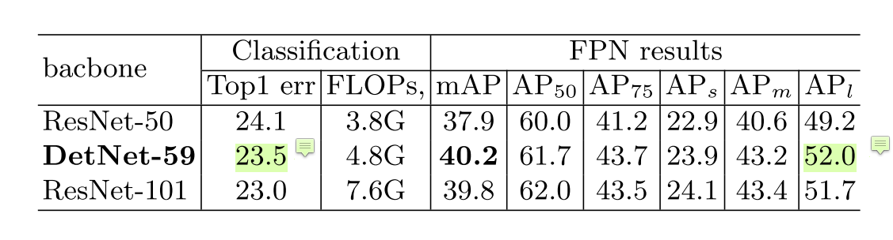

* 在FPN基础上明显有大物体涨点，同时由于高分辨率，小物体也有不错的提升。
* 膨胀卷积提供的大感受野使得分类也不逊色
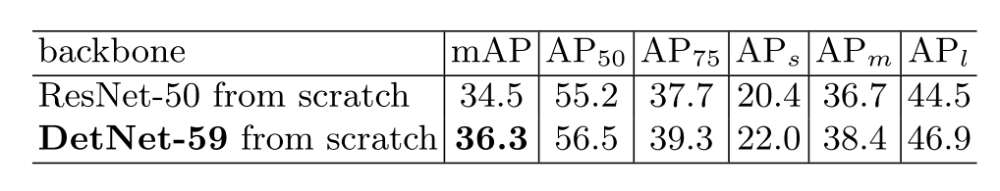

​	3.2  **Results analysis**
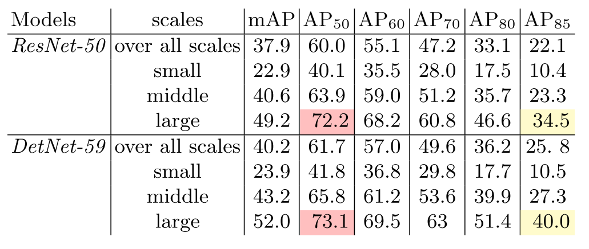

* 从AP50看出，高好1.7；从AP80看出，高了3.7。由此可以看出确实提高了检测性能。（
* 从定位性能来看，大物体的提升比小物体更多。作者认为是高分辨率解决了大物体边界模糊的问题。其实有一种解释：小目标没有大目标明显，因为膨胀卷积核降采样都会丢失小目标，只是膨胀卷积可能离散采样不至于像降采样直接给到后面没了，但是没有根本性的解决，所以小目标不大。

* AR指标也有类似结论
* AR50体现了小目标的查全率更好，这也印证上面分析的：相对降采样，膨胀卷积丢失会好点。此下大目标效果虽然提升不大但是也很高了，作者表示DetNet擅长找到更精确的定位目标，在AR85的高指标就能看出。
* AR85看大目标丢失少，说明能够像 VGG一样对大目标效果优良。关于小目标的效果平平，作者认为没有必要太高，因为FPN结构对小目标已经利用地很充分了，这里即使不高也没事。

3.3 **Discussion**
* 关于stage  
&emsp;&emsp;为了研究backbone对检测的影响，首先研究stage的作用。前4个还好说，和ResNet一样，但是P5 P6就不同，没有尺度的变化，和传统意义的stage不一样了，需要重新定义。这里DetNet也是类似ResNet的方法，虽然没有尺度变化，但是AB模块的位置还是保持了，B开启一个stage（~~听上去有点牵强~~）。如下图，认为新加的仍属于P5。
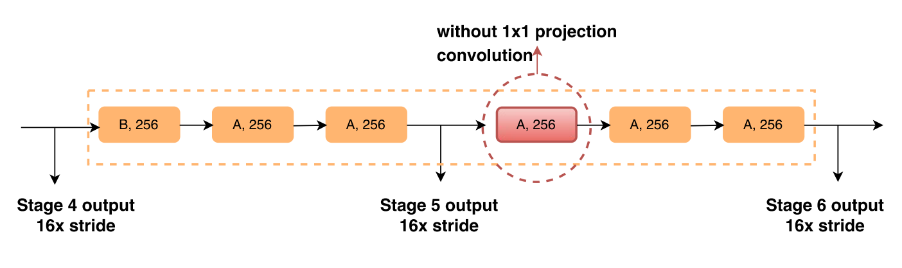

&emsp;&emsp;验证方法是做了实验，将P6开始的block换成上图所示的A模块对比效果如下图。 发现还是加了B效果更好。（但是这个stage和传统意义很不一样，所以很多性质不能相提并论，只是B模块的改变也不好判定什么）
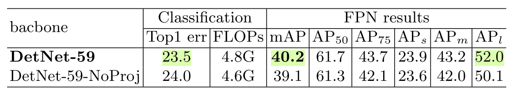

### 8.2.8  CBNet
本部分介绍一篇在COCO数据集达到最高单模型性能——mAP 53.3的网络，论文于2019.9.3发布在ArXiv，全名是*CBNet: A Novel Composite Backbone Network Architecture for Object Detection*

1. **Introduction**

&emsp;&emsp;名义上是单模型，实际是多模型的特征融合，只是和真正的多模型策略略有不同。作者的起点是，设计新的模型往往需要在ImageNet上进行预训练，比较麻烦。因而提出的Composite Backbone Network (CBNet)，采用经典网络的多重组合的方式构建网络，一方面可以提取到更有效的特征，另一方面也能够直接用现成的预训练参数（如ResNet，ResNeXt等）比较简单高效。

2. **Proposed method**

2.1  **Architecture of CBNet**  

&emsp;&emsp;如上图，模型中采用K个（K>1）相同的结构进行紧密联结。其中两个相同backbone的叫Dual-Backbone (DB)，三个叫Triple- Backbone (TB)；L代表backbone的stage数目，这里统一设置为L=5。其中，和前任工作不同的地方在于，这里将不同的stage信息进行复用回传，以便获取更好的特征（为什么work不好说）。        

2.2  **Other possible composite styles**          

&emsp;&emsp;相关工作的其他类似结构，大同小异。要么是前面backbone的stage往后传播，要么是往前一个传播，每个都有一篇论文，应该都会给出不同的解释；第四个结构不太一样，是类似densnet的结构，但是密集连接+多backbone assemble的内存消耗不出意外会非常大。但是脱离这些体系来看，多backbone的结构类似多模型的assemble，和单模型有点不公平。

3. **Experiment**

* **result**  

COCO数据集上的结果。看来提升还是有的。但是也能看出，大趋势上，三阶级联效果不如两阶的提升大，也是这部分的特征提升空间有限的缘故，到底哪部分在work不好说。下图的研究就更说明这一点了，斜率逐渐减小。

* **Comparisons of different composite styles**  

他的级联网络相比，作者的阐述点只落脚于特征的利用情况，但是这个东西本身就很玄乎，不好说到底怎么算利用得好。硬要说这种做法的解释性，大概就是将backbone方向的后面高级语义特征传播回前面进行加强，相当于横向的FPN传播。

* **Number of backbones in CBNet**  

速度慢是必然的，FPN+ResNeXt为8fps，加上两个backboen后为5.5FPS；如果减去backbone的前两个stage，可以节省部分参数达到6.9FPS，而精度下降不大（整体速度太低，这个实验意义不大）

* **Sharing weights for CBNet**    

* 
从中可以看出其实权重是否share区别不大， 不到一个点的降幅，参数量减少。

* **Effectiveness of basic feature enhancement by CBNet**   

从中可以看出激活响应效果更好，确实是能够提取到更为有效的特征，对物体的响应更加敏感。

## 8.3 One Stage目标检测算法

我们将对单次目标检测器（包括SSD系列和YOLO系列等算法）进行综述。我们将分析FPN以理解多尺度特征图如何提高准确率，特别是小目标的检测，其在单次检测器中的检测效果通常很差。然后我们将分析Focal loss和RetinaNet，看看它们是如何解决训练过程中的类别不平衡问题的。

### 8.3.1 SSD  

**SSD有哪些创新点？**

1. 基于Faster R-CNN中的Anchor，提出了相似的先验框（Prior box）
2. 从不同比例的特征图（多尺度特征）中产生不同比例的预测，并明确地按长宽比分离预测。

不同于前面的R-CNN系列，SSD属于one-stage方法。SSD使用 VGG16 网络作为特征提取器（和 Faster R-CNN 中使用的 CNN 一样），将后面的全连接层替换成卷积层，并在之后添加自定义卷积层，并在最后直接采用卷积进行检测。在多个特征图上设置不同缩放比例和不同宽高比的先验框以融合多尺度特征图进行检测，靠前的大尺度特征图可以捕捉到小物体的信息，而靠后的小尺度特征图能捕捉到大物体的信息，从而提高检测的准确性和定位的准确性。如下图是SSD的网络结构图。

**1. 怎样设置default boxes？**
SSD中default box的概念有点类似于Faster R-CNN中的anchor。不同于Faster R-CNN只在最后一个特征层取anchor, SSD在多个特征层上取default box，可以得到不同尺度的default box。在特征图的每个单元上取不同宽高比的default box,一般宽高比在{1,2,3,1/2,1/3}中选取，有时还会额外增加一个宽高比为1但具有特殊尺度的box。如下图所示，在8x8的feature map和4x4的feature map上的每个单元取4个不同的default box。原文对于300x300的输入，分别在conv4_3, conv7,conv8_2,conv9_2,conv10_2,conv11_2的特征图上的每个单元取4,6,6,6,4,4个default box. 由于以上特征图的大小分别是38x38,19x19,10x10,5x5,3x3,1x1，所以一共得到38x38x4+19x19x6+10x10x6+5x5x6+
3x3x4+1x1x4=8732个default box.对一张300x300的图片输入网络将会针对这8732个default box预测8732个边界框。

**2. 怎样对先验框进行匹配？**
SSD在训练的时候只需要输入图像和图像中每个目标对应的ground truth. 先验框与ground truth 的匹配遵循两个原则：

（1）对图片中的每个ground truth, 在先验框中找到与其IOU最大的先验框，则该先验框对应的预测边界框与ground truth 匹配。

（2）对于（1）中每个剩下的没有与任何ground truth匹配到的先验框，找到与其IOU最大的ground truth，若其与该ground truth的IOU值大于某个阈值（一般设为0.5），则该先验框对应的预测边界框与该ground truth匹配。

按照这两个原则进行匹配，匹配到ground truth的先验框对应的预测边界框作为正样本，没有匹配到ground truth的先验框对应的预测边界框作为负样本。尽管一个ground truth可以与多个先验框匹配，但是ground truth的数量相对先验框还是很少，按照上面的原则进行匹配还是会造成负样本远多于正样本的情况。为了使正负样本尽量均衡（一般保证正负样本比例约为1：3），SSD采用hard negative mining, 即对负样本按照其预测背景类的置信度进行降序排列，选取置信度较小的top-k作为训练的负样本。

**3. 怎样得到预测的检测结果？**

最后分别在所选的特征层上使用3x3卷积核预测不同default boxes所属的类别分数及其预测的边界框location。由于对于每个box需要预测该box属于每个类别的置信度（假设有c类，包括背景，例如20class的数据集合，c=21）和该box对应的预测边界框的location(包含4个值，即该box的中心坐标和宽高)，则每个box需要预测c+4个值。所以对于某个所选的特征层，该层的卷积核个数为（c+4）x 该层的default box个数.最后将每个层得到的卷积结果进行拼接。对于得到的每个预测框，取其类别置信度的最大值，若该最大值大于置信度阈值，则最大值所对应的类别即为该预测框的类别，否则过滤掉此框。对于保留的预测框根据它对应的先验框进行解码得到其真实的位置参数（这里还需注意要防止预测框位置超出图片），然后根据所属类别置信度进行降序排列，取top-k个预测框，最后进行NMS，过滤掉重叠度较大的预测框，最后得到检测结果。

SSD优势是速度比较快，整个过程只需要一步，首先在图片不同位置按照不同尺度和宽高比进行密集抽样，然后利用CNN提取特征后直接进行分类与回归，所以速度比较快，但均匀密集采样会造成正负样本不均衡的情况使得训练比较困难，导致模型准确度有所降低。另外，SSD对小目标的检测没有大目标好，因为随着网络的加深，在高层特征图中小目标的信息丢失掉了，适当增大输入图片的尺寸可以提升小目标的检测效果。

### 8.3.2 DSSD

**DSSD有哪些创新点？**

1. Backbone：将ResNet替换SSD中的VGG网络，增强了特征提取能力
2. 添加了Deconvolution层，增加了大量上下文信息

为了解决SSD算法检测小目标困难的问题，DSSD算法将SSD算法基础网络从VGG-16更改为ResNet-101，增强网络特征提取能力，其次参考FPN算法思路利用去Deconvolution结构将图像深层特征从高维空间传递出来，与浅层信息融合，联系不同层级之间的图像语义关系，设计预测模块结构，通过不同层级特征之间融合特征输出预测物体类别信息。

DSSD算法中有两个特殊的结构：Prediction模块；Deconvolution模块。前者利用提升每个子任务的表现来提高准确性，并且防止梯度直接流入ResNet主网络。后者则增加了三个Batch Normalization层和三个3×3卷积层，其中卷积层起到了缓冲的作用，防止梯度对主网络影响太剧烈，保证网络的稳定性。

SSD和DSSD的网络模型如下图所示：

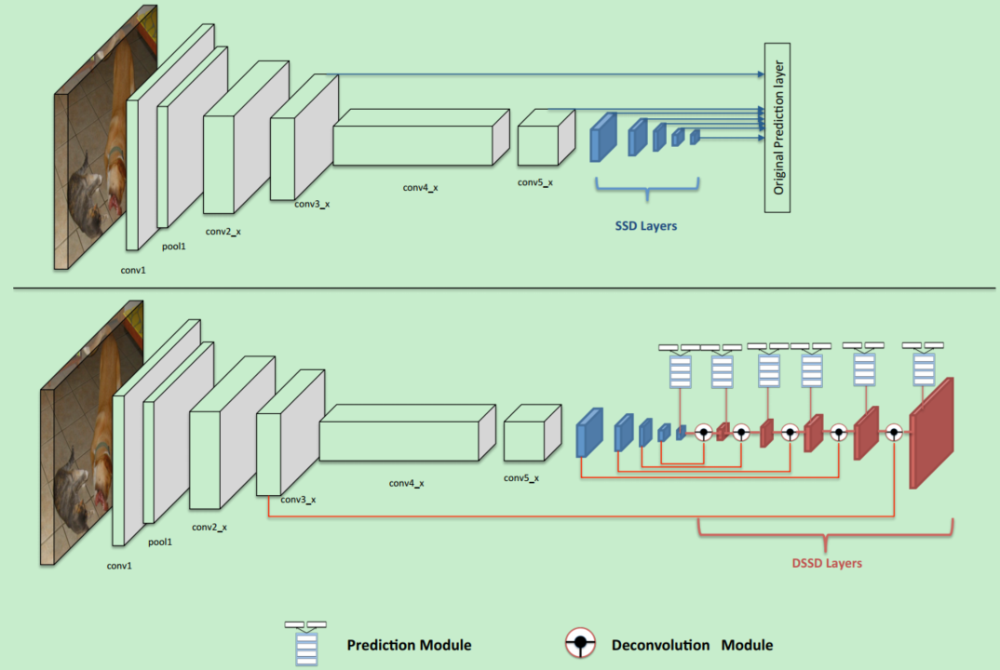

**Prediction Module**

SSD直接从多个卷积层中单独引出预测函数，预测量多达7000多，梯度计算量也很大。MS-CNN方法指出，改进每个任务的子网可以提高准确性。根据这一思想，DSSD在每一个预测层后增加残差模块，并且对于多种方案进行了对比，如下图所示。结果表明，增加残差预测模块后，高分辨率图片的检测精度比原始SSD提升明显。

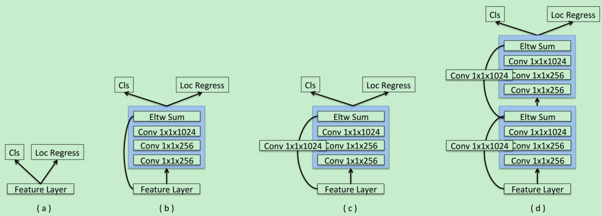

**Deconvolution模块**

为了整合浅层特征图和deconvolution层的信息，作者引入deconvolution模块，如下图所示。作者受到论文Learning to Refine Object Segments的启发，认为用于精细网络的deconvolution模块的分解结构达到的精度可以和复杂网络一样，并且更有效率。作者对其进行了一定的修改：其一，在每个卷积层后添加批归一化（batch normalization）层；其二，使用基于学习的deconvolution层而不是简单地双线性上采样；其三，作者测试了不同的结合方式，元素求和（element-wise sum）与元素点积（element-wise product）方式，实验证明元素点积计算能得到更好的精度。

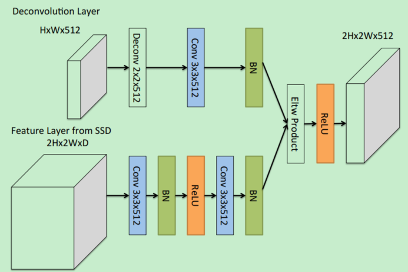

### 8.3.3 YOLOv1

**YOLOv1有哪些创新点？**

1. 将整张图作为网络的输入，直接在输出层回归bounding box的位置和所属的类别
2. 速度快，one stage detection的开山之作

**YOLOv1介绍**

YOLO（You Only Look Once: Unified, Real-Time Object Detection）是one-stage detection的开山之作。之前的物体检测方法首先需要产生大量可能包含待检测物体的先验框, 然后用分类器判断每个先验框对应的边界框里是否包含待检测物体，以及物体所属类别的概率或者置信度，同时需要后处理修正边界框，最后基于一些准则过滤掉置信度不高和重叠度较高的边界框，进而得到检测结果。这种基于先产生候选区再检测的方法虽然有相对较高的检测准确率，但运行速度较慢。

YOLO创造性的将物体检测任务直接当作回归问题（regression problem）来处理，将候选区和检测两个阶段合二为一。只需一眼就能知道每张图像中有哪些物体以及物体的位置。下图展示了各物体检测系统的流程图。

事实上，YOLO也并没有真正的去掉候选区，而是直接将输入图片划分成7x7=49个网格，每个网格预测两个边界框，一共预测49x2=98个边界框。可以近似理解为在输入图片上粗略的选取98个候选区，这98个候选区覆盖了图片的整个区域，进而用回归预测这98个候选框对应的边界框。

**1. 网络结构是怎样的？**

YOLO网络借鉴了GoogLeNet分类网络结构，不同的是YOLO使用1x1卷积层和3x3卷积层替代inception module。如下图所示，整个检测网络包括24个卷积层和2个全连接层。其中，卷积层用来提取图像特征，全连接层用来预测图像位置和类别概率值。

**2. YOLO的输入、输出、损失函数分别是什么？**

前面说到YOLO将输入图像分成7x7的网格，最后输出是7x7xk的张量。YOLO网络最后接了两个全连接层，全连接层要求输入是固定大小的，所以YOLO要求输入图像有固定大小，论文中作者设计的输入尺寸是448x448。

YOLO将输入图像分成7x7的网格，每个网格预测2个边界框。若某物体的ground truth的中心落在该网格，则该网格中与这个ground truth IOU最大的边界框负责预测该物体。对每个边界框会预测5个值，分别是边界框的中心x,y（相对于所属网格的边界），边界框的宽高w,h（相对于原始输入图像的宽高的比例），以及这些边界框的confidencescores（边界框与ground truth box的IOU值）。同时每个网格还需要预测c个类条件概率 （是一个c维向量，表示某个物体object在这个网格中，且该object分别属于各个类别的概率，这里的c类物体不包含背景）。论文中的c=20，则每个网格需要预测2x5+20=30个值，这些值被映射到一个30维的向量。
为了让边界框坐标损失、分类损失达到很好的平衡，损失函数设计如下图所示。

如上图所示，损失函数分为坐标预测（蓝色框）、含有物体的边界框的confidence预测（红色框）、不含有物体的边界框的confidence预测（黄色框）、分类预测（紫色框）四个部分。

由于不同大小的边界框对预测偏差的敏感度不同，小的边界框对预测偏差的敏感度更大。为了均衡不同尺寸边界框对预测偏差的敏感度的差异。作者巧妙的对边界框的w,h取均值再求L2 loss. YOLO中更重视坐标预测，赋予坐标损失更大的权重，记为 coord，在pascal voc训练中coodd=5 ，classification error部分的权重取1。

某边界框的置信度定义为：某边界框的confidence = 该边界框存在某类对象的概率pr(object)*该边界框与该对象的ground truth的IOU值 ，若该边界框存在某个对象pr(object)=1 ，否则pr(object)=0 。由于一幅图中大部分网格中是没有物体的，这些网格中的边界框的confidence置为0，相比于有物体的网格，这些不包含物体的网格更多，对梯度更新的贡献更大，会导致网络不稳定。为了平衡上述问题，YOLO损失函数中对没有物体的边界框的confidence error赋予较小的权重，记为 noobj，对有物体的边界框的confidence error赋予较大的权重。在pascal VOC训练中noobj=0.5 ，有物体的边界框的confidence error的权重设为1.

**3. YOLO怎样预测？**

YOLO最后采用非极大值抑制（NMS）算法从输出结果中提取最有可能的对象和其对应的边界框。

输入一张图片到YOLO网络将输出一个7*7*30的张量表示图片中每个网格对应的可能的两个边界框以及每个边界框的置信度和包含的对象属于各个类别的概率。由此可以计算某对象i属于类别 同时在第j个边界框中的得分：

每个网格有20个类条件概率，2个边界框置信度，相当于每个网格有40个得分，7x7个网格有1960个得分，每类对象有1960/20=98个得分，即98个候选框。

**NMS步骤如下：**

1.设置一个Score的阈值，一个IOU的阈值；

2.对于每类对象，遍历属于该类的所有候选框，

①过滤掉Score低于Score阈值的候选框；

②找到剩下的候选框中最大Score对应的候选框，添加到输出列表；

③进一步计算剩下的候选框与②中输出列表中每个候选框的IOU，若该IOU大于设置的IOU阈值，将该候选框过滤掉，否则加入输出列表中；

④最后输出列表中的候选框即为图片中该类对象预测的所有边界框

3.返回步骤2继续处理下一类对象。

YOLO将识别与定位合二为一，结构简便，检测速度快，更快的Fast YOLO可以达到155FPS。相对于R-CNN系列, YOLO的整个流程中都能看到整张图像的信息，因此它在检测物体时能很好的利用上下文信息，从而不容易在背景上预测出错误的物体信息。同时YOLO可以学习到高度泛化的特征，能将一个域上学到的特征迁移到不同但相关的域上，如在自然图像上做训练的YOLO，在艺术图片上可以得到较好的测试结果。

由于YOLO网格设置比较稀疏，且每个网格只预测2个边界框，其总体预测精度不高，略低于Fast RCNN。其对小物体的检测效果较差，尤其是对密集的小物体表现比较差。

###  8.3.4 YOLOv2

**YOLOv2 有哪些创新点？**

YOLOv1虽然检测速度快，但在定位方面不够准确，并且召回率较低。为了提升定位准确度，改善召回率，YOLOv2在YOLOv1的基础上提出了几种改进策略，如下图所示，可以看到，一些改进方法能有效提高模型的mAP。

1. 大尺度预训练分类
2. New Network：Darknet-19
3. 加入anchor

**YOLOv2 介绍**

**（1）Batch Normalization**

YOLOv2中在每个卷积层后加Batch Normalization(BN)层，去掉dropout. BN层可以起到一定的正则化效果，能提升模型收敛速度，防止模型过拟合。YOLOv2通过使用BN层使得mAP提高了2%。
**（2）High Resolution Classifier**

目前的大部分检测模型都会使用主流分类网络（如vgg、resnet）在ImageNet上的预训练模型作为特征提取器,
而这些分类网络大部分都是以小于256x256的图片作为输入进行训练的，低分辨率会影响模型检测能力。YOLOv2将输入图片的分辨率提升至448x448，为了使网络适应新的分辨率，YOLOv2先在ImageNet上以448x448的分辨率对网络进行10个epoch的微调，让网络适应高分辨率的输入。通过使用高分辨率的输入，YOLOv2的mAP提升了约4%。

**（3）Convolutional With Anchor Boxes**

YOLOv1利用全连接层直接对边界框进行预测，导致丢失较多空间信息，定位不准。YOLOv2去掉了YOLOv1中的全连接层，使用Anchor Boxes预测边界框，同时为了得到更高分辨率的特征图，YOLOv2还去掉了一个池化层。由于图片中的物体都倾向于出现在图片的中心位置，若特征图恰好有一个中心位置，利用这个中心位置预测中心点落入该位置的物体，对这些物体的检测会更容易。所以总希望得到的特征图的宽高都为奇数。YOLOv2通过缩减网络，使用416x416的输入，模型下采样的总步长为32，最后得到13x13的特征图，然后对13x13的特征图的每个cell预测5个anchor boxes，对每个anchor box预测边界框的位置信息、置信度和一套分类概率值。使用anchor
boxes之后，YOLOv2可以预测13x13x5=845个边界框，模型的召回率由原来的81%提升到88%，mAP由原来的69.5%降低到69.2%.召回率提升了7%，准确率下降了0.3%。

**（4）Dimension Clusters**

在Faster R-CNN和SSD中，先验框都是手动设定的，带有一定的主观性。YOLOv2采用k-means聚类算法对训练集中的边界框做了聚类分析，选用boxes之间的IOU值作为聚类指标。综合考虑模型复杂度和召回率，最终选择5个聚类中心，得到5个先验框，发现其中中扁长的框较少，而瘦高的框更多，更符合行人特征。通过对比实验，发现用聚类分析得到的先验框比手动选择的先验框有更高的平均IOU值，这使得模型更容易训练学习。

**（5）New Network：Darknet-19**

YOLOv2采用Darknet-19，其网络结构如下图所示，包括19个卷积层和5个max pooling层，主要采用3x3卷积和1x1卷积，这里1x1卷积可以压缩特征图通道数以降低模型计算量和参数，每个卷积层后使用BN层以加快模型收敛同时防止过拟合。最终采用global avg pool 做预测。采用YOLOv2，模型的mAP值没有显著提升，但计算量减少了。

**（6）Direct location prediction**

Faster R-CNN使用anchor boxes预测边界框相对先验框的偏移量，由于没有对偏移量进行约束，每个位置预测的边界框可以落在图片任何位置，会导致模型不稳定，加长训练时间。YOLOv2沿用YOLOv1的方法，根据所在网格单元的位置来预测坐标,则Ground Truth的值介于0到1之间。网络中将得到的网络预测结果再输入sigmoid函数中，让输出结果介于0到1之间。设一个网格相对于图片左上角的偏移量是cx，cy。先验框的宽度和高度分别是pw和ph，则预测的边界框相对于特征图的中心坐标(bx，by)和宽高bw、bh的计算公式如下图所示。

YOLOv2结合Dimention Clusters, 通过对边界框的位置预测进行约束，使模型更容易稳定训练，这种方式使得模型的mAP值提升了约5%。

**（7）Fine-Grained Features**

YOLOv2借鉴SSD使用多尺度的特征图做检测，提出pass through层将高分辨率的特征图与低分辨率的特征图联系在一起，从而实现多尺度检测。YOLOv2提取Darknet-19最后一个max pool层的输入，得到26x26x512的特征图。经过1x1x64的卷积以降低特征图的维度，得到26x26x64的特征图，然后经过pass through层的处理变成13x13x256的特征图（抽取原特征图每个2x2的局部区域组成新的channel，即原特征图大小降低4倍，channel增加4倍），再与13x13x1024大小的特征图连接，变成13x13x1280的特征图，最后在这些特征图上做预测。使用Fine-Grained Features，YOLOv2的性能提升了1%.

**（8）Multi-Scale Training**

YOLOv2中使用的Darknet-19网络结构中只有卷积层和池化层，所以其对输入图片的大小没有限制。YOLOv2采用多尺度输入的方式训练，在训练过程中每隔10个batches,重新随机选择输入图片的尺寸，由于Darknet-19下采样总步长为32，输入图片的尺寸一般选择32的倍数{320,352,…,608}。采用Multi-Scale Training, 可以适应不同大小的图片输入，当采用低分辨率的图片输入时，mAP值略有下降，但速度更快，当采用高分辨率的图片输入时，能得到较高mAP值，但速度有所下降。

YOLOv2借鉴了很多其它目标检测方法的一些技巧，如Faster R-CNN的anchor boxes, SSD中的多尺度检测。除此之外，YOLOv2在网络设计上做了很多tricks,使它能在保证速度的同时提高检测准确率，Multi-Scale Training更使得同一个模型适应不同大小的输入，从而可以在速度和精度上进行自由权衡。

**YOLOv2的训练**

YOLOv2的训练主要包括三个阶段。
第一阶段：先在ImageNet分类数据集上预训练Darknet-19，此时模型输入为$224\times 224$,共训练160个epochs。
第二阶段：将网络的输入调整为$448\times 448$,继续在ImageNet数据集上finetune分类模型，训练10个epochs，此时分类模型的top-1准确度为76.5%，而top-5准确度为93.3%。
第三个阶段：修改Darknet-19分类模型为检测模型，并在检测数据集上继续finetune网络。
网络修改包括（网路结构可视化）：移除最后一个卷积层、global avgpooling层以及softmax层，并且新增了三个$3\times 3 \times 2014$卷积层，同时增加了一个passthrough层，最后使用$1\times 1$卷积层输出预测结果。

###  8.3.5 YOLO9000

github：http://pjreddie.com/yolo9000/

YOLO9000是在YOLOv2的基础上提出的一种联合训练方法，可以检测超过9000个类别的模型。YOLOv2混合目标检测数据集和分类数据集，用目标检测数据集及其类别标记信息和位置标注信息训练模型学习预测目标定位和分类，用分类数据集及其类别标记信息进一步扩充模型所能识别的物体类别同时能增强模型鲁棒性。

**1. YOLO9000是怎么组织数据的？**

YOLO9000根据各个类别之间的从属关系建立一种树结WordTree, 将COCO数据集和ImageNet数据集组织起来。

WordTree的生成方式如下：

①首先遍历ImageNet中的类别名词。

②对每个名词，在WordNet(一种结构化概念及概念之间关系的语言数据库)上找到从它所在位置到根节点（设根节点为实体对象physical object）的最短路径，由于在WordNet中大多数同义词只有一个路径，所以先把将该路径上的词全都加到树中。

③迭代地检查剩下的名词，取它到根节点的最短路径，将该最短路径上的还没出现在层次树中的词加入到树中。
混合后的数据集形成一个有9418类的WordTree.生成的WordTree模型如下图所示。另外考虑到COCO数据集相对于ImageNet数据集数据量太少了，为了平衡两个数据集，作者进一步对COCO数据集过采样，使COCO数据集与ImageNet数据集的数据量比例接近1：4。

对于物体的标签，采用one-hot编码的形式，数据集中的每个物体的类别标签被组织成1个长度为9418的向量，向量中除在WordTree中从该物体对应的名词到根节点的路径上出现的词对应的类别标号处为1，其余位置为0。

**2. YOLO9000是怎么进行联合训练的？**

YOLO9000采用YOLOv2的结构，anchorbox由原来的5调整到3，对每个anchorbox预测其对应的边界框的位置信息x,y,w,h和置信度以及所包含的物体分别属于9418类的概率，所以每个anchorbox需要预测4+1+9418=9423个值。每个网格需要预测3x9423=28269个值。在训练的过程中，当网络遇到来自检测数据集的图片时，用完整的YOLOv2loss进行反向传播计算，当网络遇到来自分类数据集的图片时，只用分类部分的loss进行反向传播。

**3. YOLO9000是怎么预测的？**

WordTree中每个节点的子节点都属于同一个子类，分层次的对每个子类中的节点进行一次softmax处理，以得到同义词集合中的每个词的下义词的概率。当需要预测属于某个类别的概率时，需要预测该类别节点的条件概率。即在WordTree上找到该类别名词到根节点的路径，计算路径上每个节点的概率之积。预测时，YOLOv2得到置信度，同时会给出边界框位置以及一个树状概率图，沿着根节点向下，沿着置信度最高的分支向下，直到达到某个阈值，最后到达的节点类别即为预测物体的类别。

YOLO9000使用WordTree混合目标检测数据集和分类数据集，并在其上进行联合训练，使之能实时检测出超过9000个类别的物体，其强大令人赞叹不已。YOLO9000尤其对动物的识别效果很好，但是对衣服或者设备等类别的识别效果不是很好，可能的原因是与目标检测数据集中的数据偏向有关。

###  8.3.6 YOLOv3

YOLOv3总结了自己在YOLOv2的基础上做的一些尝试性改进，有的尝试取得了成功，而有的尝试并没有提升模型性能。其中有两个值得一提的亮点，一个是使用残差模型，进一步加深了网络结构；另一个是使用FPN架构实现多尺度检测。

**YOLOv3有哪些创新点？**

1. 新网络结构：DarkNet-53
2. 融合FPN
3. 用逻辑回归替代softmax作为分类器

**1. YOLOv3对网络结构做了哪些改进？**

YOLOv3在之前Darknet-19的基础上引入了残差块，并进一步加深了网络，改进后的网络有53个卷积层，取名为Darknet-53，网络结构如下图所示（以256*256的输入为例）。

为了比较Darknet-53与其它网络结构的性能，作者在TitanX上，采用相同的实验设置，将256x256的图片分别输入以Darknet-19，ResNet-101，ResNet-152和Darknet-53为基础网络的分类模型中，实验得到的结果如下图所示。可以看到Darknet-53比ResNet-101的性能更好，而且速度是其1.5倍，Darknet-53与ResNet-152性能相似但速度几乎是其2倍。注意到，Darknet-53相比于其它网络结构实现了每秒最高的浮点计算量，说明其网络结构能更好的利用GPU。

**2.YOLOv3中怎样实现多尺度检测？**

YOLOv3借鉴了FPN的思想，从不同尺度提取特征。相比YOLOv2，YOLOv3提取最后3层特征图，不仅在每个特征图上分别独立做预测，同时通过将小特征图上采样到与大的特征图相同大小，然后与大的特征图拼接做进一步预测。用维度聚类的思想聚类出9种尺度的anchor box，将9种尺度的anchor box均匀的分配给3种尺度的特征图.如下图是在网络结构图的基础上加上多尺度特征提取部分的示意图（以在COCO数据集(80类)上256x256的输入为例）：

从YOLOv1到YOLOv2再到YOLO9000、YOLOv3, YOLO经历三代变革，在保持速度优势的同时，不断改进网络结构，同时汲取其它优秀的目标检测算法的各种trick，先后引入anchor box机制、引入FPN实现多尺度检测等。

### 8.3.7 RetinaNet

**研究背景**

- Two-Stage检测器（如Faster R-CNN、FPN）效果好，但速度相对慢
- One-Stage检测器（如YOLO、SSD）速度快，但效果一般

作者对one-stage检测器准确率不高的问题进行探究，发现主要问题在于正负类别不均衡（简单-难分类别不均衡）。

> We discover that the extreme foreground-background class imbalance encountered during training of dense detectors is the central cause.

作者建议通过重新设计标准的交叉熵损失（cross entropy loss）来解决这种类别不平衡（class inbalance）问题，即提出Focal Loss。

> We propose to address this class imbalance by reshaping the standard cross entropy loss such that it down-weights the loss assigned to well-classified examples. Our novel Focal Loss focuses training on a sparse set of hard examples and prevents the vast number of easy negatives from overwhelming the detector during training.

结合Focal Loss的one-stage检测器称为RetinaNet，该检测器在COCO上mAP可以和特征金字塔网络（feature pyramid network，FPN）或者Mask R-CNN接近，

**问：什么是类别不均衡（class imbalance）？**

答：负样本的数量极大于正样本的数量，比如包含物体的区域（正样本）很少，而不包含物体的区域（负样本）很多。比如检测算法在早期会生成一大波的bbox。而一幅常规的图片中，顶多就那么几个object。这意味着，绝大多数的bbox属于background。

**问：样本的类别不均衡会带来什么问题？**

答：由于大多数都是简单易分的负样本（属于背景的样本），使得训练过程不能充分学习到属于那些有类别样本的信息；其次简单易分的负样本太多，可能掩盖了其他有类别样本的作用（这些简单易分的负样本仍产生一定幅度的loss，见下图蓝色曲线，数量多会对loss起主要贡献作用，因此就主导了梯度的更新方向，掩盖了重要的信息）

> This imbalance causes two problems: (1) training is inefficient as most locations are easy negatives that contribute no useful learning signal; (2) en masse, the easy negatives can overwhelm training and lead to degenerate models.

简单来说，因为bbox数量爆炸。 正是因为bbox中属于background的bbox太多了，所以如果分类器无脑地把所有bbox统一归类为background，accuracy也可以刷得很高。于是乎，分类器的训练就失败了。分类器训练失败，检测精度自然就低了。

**问：为什么在two-stage检测器中，没有出现类别不均衡（class imbalamce）问题呢？**

答：因为通过RPN阶段可以减少候选目标区域，而在分类阶段，可以固定前景与背景比值（foreground-to-background ratio）为1:3，或者使用OHEM（online hard example mining）使得前景和背景的数量达到均衡。

**RetinaNet有哪些创新点？**

**概述：**

- New loss：提出Focal Loss函数解决class imbalance

$$
FL(p_t) = -(1-p_t)^\gamma \log(p_t)FL(pt)=−(1−pt)γlog(pt)
$$

- New detector：RetinaNet = ResNet + FPN + Two sub-networks + Focal Loss

Focal Loss更加聚焦在困难样本（hard examples）上的训练。

将Focal Loss与ResNet-101-FPN backbone结合提出RetinaNet（one-stage检测器），RetinaNet在COCO test-dev上达到39.1mAP，速度为5FPS。

RetinaNet检测器与当时最佳的其它检测器进行比较，无论是速度上还是准确率上都是最佳：

**详解：**

作者提出一种新的损失函数，思路是希望那些hard examples对损失的贡献变大，使网络更倾向于从这些样本上学习。

作者以二分类为例进行说明：

**交叉熵函数CE**

首先是我们常使用的交叉熵损失函数：

上式中，y=+1或者y=-1。p∈[0,1]是y=+1的估计概率。作者定义pt为：

注：对交叉熵函数不了解的，可以参考[理解交叉熵作为损失函数在神经网络中的作用](https://blog.csdn.net/chaipp0607/article/details/73392175)

**均衡交叉熵函数**

要对类别不均衡问题对loss的贡献进行一个控制，即加上一个控制权重即可，最初作者的想法即如下这样，对于属于少数类别的样本，增大α即可

但这样有一个问题，它仅仅解决了正负样本之间的平衡问题，并没有区分易分/难分样本，按作者的话说：

> While α balances the importance of positive/negative examples, it does not differentiate between easy/hard examples. Instead, we propose to reshape the loss function to down-weight easy examples and thus focus training on hard negatives.

问：为什么公式(3)只解决正负样本不均衡问题？

答：增加了一个系数αt，跟pt的定义类似，当label=1的时候，αt=a；当label=-1的时候，αt=1-a，a的范围也是0到1。因此可以通过设定a的值（一般而言假如1这个类的样本数比-1这个类的样本数多很多，那么a会取0到0.5来增加-1这个类的样本的权重）来控制正负样本对总的loss的共享权重。

**Focal Loss**

作者一开始给交叉熵损失函数添加modulating factor：
$$
(1-pt)^γ(1−pt)γ
$$

显然，样本越易分，pt就越大（pt—>1），modulating factor趋近于0，则贡献的loss就越小，同样地，样本越难分，其pt就越小，modulating factor接近于1，则贡献的loss不受影响。

问：为什么pt越大，FL值越小？

答：根据公式（4）可知，FL与log(pt)中的pt成反比，与1-pt成正比，因此FL与pt的关系成反比。这是交叉熵函数的基本性质。当pt很大时（接近于1），FL值很小；而当pt很小时（接近于0），FL值会很大。

注：这里有个超参数—focusing parameter γ。

γ 放大了modulating factor的作用。

举原文中的一个例子，当pt=0.9时，带有modulating factor的focal loss是CE loss的100分之一，即进一步减小了正确分类的损失。

> For instance, with γ = 2, an example classified with pt = 0.9 would have 100× lower loss compared with CE and with pt ≈ 0.968 it would have 1000× lower loss. This in turn increases the importance of correcting misclassified examples (whose loss is scaled down by at most 4× for pt ≤ .5 and γ = 2).

在实际中，作者采用如下公式，即综合了公式(3)和公式(4)的形式，这样机能调整正负样本的权重，又能控制难易分类样本的权重：

这里的两个参数 α和γ 来控制，在实验中a的选择范围也很广，一般而言当γ增加的时候，a需要减小一点，本文作者采用α=0.25，γ=2效果最好。

**RetinaNet Detector**

RetinaNet是由backbone网络和两个特殊任务的子网络（subnet）组成（属于one-stage检测器）。Backbone用来计算feature map；第一个子网络用来object classification，第二个子网络用来bounding box regression。

**Feature Pyramid Network Backbone**

**Anchor**

**Classification Subnet**

**Box Regression Subnet**

RetinaNet结构注意内容：

1. 训练时FPN每一级的所有example都被用于计算Focal Loss，loss值加到一起用来训练；
2. 测试时FPN每一级只选取score最大的1000个example来做nms；
3. 整个结构不同层的head部分(上图中的c和d部分)共享参数，但分类和回归分支间的参数不共享；
4. 分类分支的最后一级卷积的bias初始化成前面提到的-log((1-π)/π);

作者：张磊_0503 链接：<https://www.jianshu.com/p/204d9ad9507f> 來源：简书 简书著作权归作者所有，任何形式的转载都请联系作者获得授权并注明出处。

**实验结果**

Table1是关于RetinaNet和Focal Loss的一些实验结果。（a）是在交叉熵的基础上加上参数a，a=0.5就表示传统的交叉熵，可以看出当a=0.75的时候效果最好，AP值提升了0.9。（b）是对比不同的参数γ和a的实验结果，可以看出随着γ的增加，AP提升比较明显。（d）通过和OHEM的对比可以看出最好的Focal Loss比最好的OHEM提高了3.2AP。这里OHEM1:3表示在通过OHEM得到的minibatch上强制positive和negative样本的比例为1:3，通过对比可以看出这种强制的操作并没有提升AP。（e）加入了运算时间的对比，可以和前面的Figure2结合起来看，速度方面也有优势！注意这里RetinaNet-101-800的AP是37.8，当把训练时间扩大1.5倍同时采用scale jitter，AP可以提高到39.1，这就是全文和table2中的最高的39.1AP的由来。

### 8.3.8 RFBNet

**RFBNet有哪些创新点？**

1. 提出RF block（RFB）模块

RFBNet主要想利用一些技巧使得轻量级模型在速度和精度上达到很好的trade-off的检测器。灵感来自人类视觉的感受野结构Receptive Fields (RFs) ，提出了新奇的RF block（RFB）模块，来验证感受野尺寸和方向性的对提高有鉴别鲁棒特征的关系。RFBNet是以主干网络（backbone）为VGG16的SSD来构建的，主要是在Inception的基础上加入了dilated卷积层（dilated convolution），从而有效增大了感受野（receptive field）。整体上因为是基于SSD网络进行改进，所以检测速度还是比较快，同时精度也有一定的保证。

**RFB介绍**

RFB是一个类似Inception模块的多分支卷积模块，它的内部结构可分为两个组件：多分支卷积层和dilated卷积层。如下图：

**1.多分支卷积层**
​      根据RF的定义，用多种尺寸的卷积核来实现比固定尺寸更好。具体设计：1.瓶颈结构，1x1-s2卷积减少通道特征，然后加上一个nxn卷积。2.替换5x5卷积为两个3x3卷积去减少参数，然后是更深的非线性层。有些例子，使用1xn和nx1代替nxn卷积；shortcut直连设计来自于ResNet和Inception ResNet V2。3.为了输出，卷积经常有stride=2或者是减少通道，所以直连层用一个不带非线性激活的1x1卷积层。

**2.Dilated 卷积层**

设计灵感来自Deeplab，在保持参数量和同样感受野的情况下，用来获取更高分辨率的特征。下图展示两种RFB结构：RFB和RFB-s。每个分支都是一个正常卷积后面加一个dilated卷积，主要是尺寸和dilated因子不同。（a）RFB。整体结构上借鉴了Inception的思想，主要不同点在于引入3个dilated卷积层（比如3x3conv，rate=1），这也是RFBNet增大感受野的主要方式之一；（b）RFB-s。RFB-s和RFB相比主要有两个改进，一方面用3x3卷积层代替5x5卷积层，另一方面用1x3和3x1卷积层代替3x3卷积层，主要目的应该是为了减少计算量，类似Inception后期版本对Inception结构的改进。 

RFBNet300的整体结构如下图所示，基本上和SSD类似。RFBNet和SSD不同的是：1、主干网上用两个RFB结构替换原来新增的两层。2、conv4_3和conv7_fc在接预测层之前分别接RFB-s和RFB结构。 

### 8.3.9 M2Det

**M2Det有哪些创新点？**

1. 提出了多层次特征金字塔网络（MLFPN）来构建更有效的特征金字塔，用于检测不同尺度的对象。

M2Det的整体架构如下所示。M2Det使用backbone和多级特征金字塔网络（MLFPN）从输入图像中提取特征，然后类似于SSD，根据学习的特征生成密集的边界框和类别分数，最后是非最大抑制（NMS）操作以产生最终结果。 MLFPN由三个模块组成：特征融合模块（FFM），简化的U形模块（TUM）和按基于尺度的特征聚合模块（SFAM）。 FFMv1通过融合骨干网络的特征图，将语义信息丰富为基本特征。每个TUM生成一组多尺度特征，然后交替连接的TUM和FFMv2提取多级多尺度特征。此外，SFAM通过按比例缩放的特征连接操作和自适应注意机制将特征聚合到多级特征金字塔中。下面介绍有关M2Det中三个核心模块和网络配置的更多详细信息。

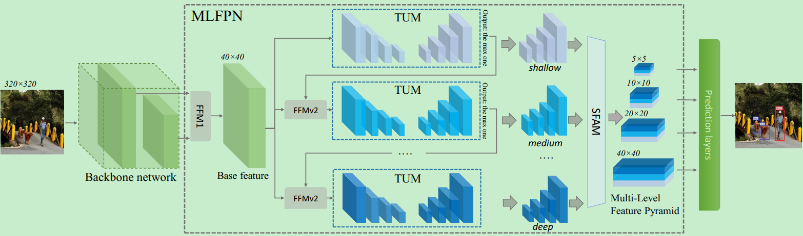

**FFMs**

FFM融合了M2Det中不同层次的特征，这对于构建最终的多级特征金字塔至关重要。它们使用1x1卷积层来压缩输入特征的通道，并使用连接操作来聚合这些特征图。特别是，由于FFMv1以backbone中不同比例的两个特征图作为输入，因此它采用一个上采样操作，在连接操作之前将深度特征重新缩放到相同的尺度。同时，FFMv2采用基本特征和前一个TUM的最大输出特征图 - 这两个具有相同的比例 - 作为输入，并产生下一个TUM的融合特征。 FFMv1和FFMv2的结构细节分别如下图（a）和（b）所示。

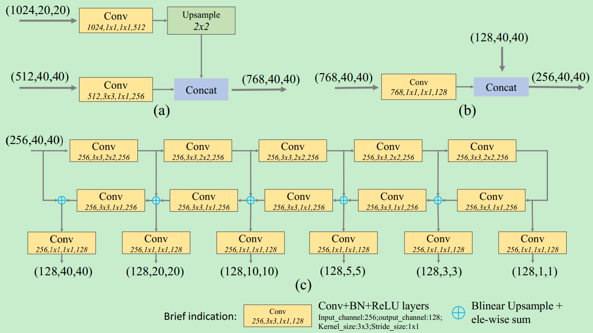

**TUMs** 

TUM不同于FPN和RetinaNet，TUM采用简化的U形结构，如上图（c）所示。编码器是一系列3x3，步长为2的卷积层.并且解码器将这些层的输出作为其参考特征集，而原始FPN选择ResNet主干网络中每个阶段的最后一层的输出。此外，在解码器分支的上采样层后添加1x1卷积层和按元素求和的操作，以增强学习能力并保持特征的平滑性。每个TUM的解码器中的所有输出形成当前级别的多尺度特征。整体而言，堆叠TUM的输出形成多层次多尺度特征，而前TUM主要提供浅层特征，中间TUM提供中等特征，后TUM提供深层特征。

**SFAM**

SFAM旨在将由TUM生成的多级多尺度特征聚合成多级特征金字塔，如下图所示。SFAM的第一阶段是沿着信道维度将等效尺度的特征连接在一起。聚合特征金字塔可以表示为$X = [X_1,X_2,...,X_i,...,X_L]$，其中
$$X_i = Concat(X_{1i}, X_{2i}, ...., X_{Li}) \in R^{W_i \times H_i \times C}$$
指的是尺度第i个最大的特征。这里，聚合金字塔中的每个比例都包含来自多级深度的特征。但是，简单的连接操作不太适合。在第二阶段，引入了通道注意模块，以促使特征集中在最有益的通道。在SE区块之后，使用全局平均池化来在挤压步骤中生成通道统计z∈RC。

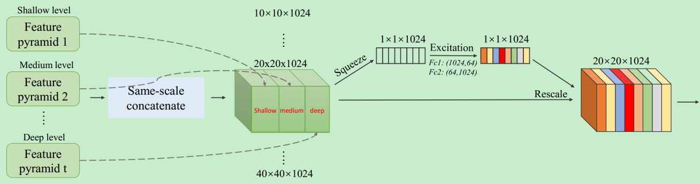

## 8.4 人脸检测

在目标检测领域可以划分为了人脸检测与通用目标检测，往往人脸这方面会有专门的算法（包括人脸检测、人脸识别、人脸其他属性的识别等等），并且和通用目标检测（识别）会有一定的差别，着主要来源于人脸的特殊性（有时候目标比较小、人脸之间特征不明显、遮挡问题等），下面将从人脸检测和通用目标检测两个方面来讲解目标检测。

### 8.4.1 目前主要有人脸检测方法分类？

目前人脸检测方法主要包含两个区域：传统人脸检测算法和基于深度学习的人脸检测算法。传统人脸检测算法主要可以分为4类：

（1）基于知识的人脸检测方法；

（2）基于模型的人脸检测方法；

（3）基于特征的人脸检测方法；

（4）基于外观的人脸检测方法。

由于本书着重关注深度学习，下面会着重介绍基于深度学习的人脸检测方法。

2006年Hinton首次提出深度学习（Deep Learning）的概念，它是通过组合低层的特征形成更高层的抽象特征。随后研究者将深度学习应用在人脸检测领域，主要集中在基于卷积神经网络（CNN）的人脸检测研究，如基于级联卷积神经网络的人脸检测（cascade cnn）、 基于多任务卷积神经网络的人脸检测（MTCNN）、Facebox等，很大程度上提高了人脸检测的鲁棒性。当然通用目标检测算法像Faster-rcnn、yolo、ssd等也有用在人脸检测领域，也可以实现比较不错的结果，但是和专门人脸检测算法比还是有差别。下面部分主要介绍基于深度学习的的人脸检测算法，基于深度学习的通用目标检测算法将在第二大节介绍。

### 8.4.2 如何检测图片中不同大小的人脸？

传统人脸检测算法中针对不同大小人脸主要有两个策略：

（1）缩放图片的大小（图像金字塔如图8.4.1所示）；

（2）缩放滑动窗的大小（如图8.4.2所示）。

图 8.1 图像金字塔           

​      

 图 8.2 缩放滑动窗口

​	基于深度学习的人脸检测算法中针对不同大小人脸主要也有两个策略，但和传统人脸检测算法有点区别，主要包括:

（1）缩放图片大小。（不过也可以通过缩放滑动窗的方式，基于深度学习的滑动窗人脸检测方式效率会很慢存在多次重复卷积，所以要采用全卷积神经网络（FCN），用FCN将不能用滑动窗的方法。）

（2）通过anchor box的方法（如图8.3所示，不要和图8.2混淆，这里是通过特征图预测原图的anchor box区域，具体在facebox中有描述）。

图 8.3 anchor box

### 8.4.3 如何设定算法检测最小人脸尺寸?

主要是看滑动窗的最小窗口和anchorbox的最小窗口。

（1）滑动窗的方法 

假设通过12×12的滑动窗，不对原图做缩放的话，就可以检测原图中12×12的最小人脸。但是往往通常给定最小人脸a=40、或者a=80，以这么大的输入训练CNN进行人脸检测不太现实，速度会很慢，并且下一次需求最小人脸a=30*30又要去重新训练，通常还会是12×12的输入，为满足最小人脸框a，只需要在检测的时候对原图进行缩放即可：w=w×12/a。

（2）anchorbox的方法

原理类似，这里主要看anchorbox的最小box，通过可以通过缩放输入图片实现最小人脸的设定。

### 8.4.4 如何定位人脸的位置？

（1）滑动窗的方式：

滑动窗的方式是基于分类器识别为人脸的框的位置确定最终的人脸，

图 8.4 滑动窗

（2）FCN的方式：

​    FCN的方式通过特征图映射到原图的方式确定最终识别为人脸的位置，特征图映射到原图人脸框是要看特征图相比较于原图有多少次缩放（缩放主要查看卷积的步长和池化层），假设特征图上(2,3)的点，可粗略计算缩放比例为8倍，原图中的点应该是(16,24)；如果训练的FCN为12*12的输入，对于原图框位置应该是(16,24,12,12),当然这只是估计位置，具体的再构建网络时要加入回归框的预测，主要是相对于原图框的一个平移与缩放。

（3）通过anchor box的方式：

​    通过特征图映射到图的窗口，通过特征图映射到原图到多个框的方式确定最终识别为人脸的位置。

### 8.4.5 如何通过一个人脸的多个框确定最终人脸框位置？

图 8.5 通过NMS得到最终的人脸位置

NMS改进版本有很多，最原始的NMS就是判断两个框的交集，如果交集大于设定的阈值，将删除其中一个框，那么两个框应该怎么选择删除哪一个呢？ 因为模型输出有概率值，一般会优选选择概率小的框删除。

### 8.4.6 基于级联卷积神经网络的人脸检测（Cascade CNN）

1. cascade cnn的框架结构是什么？

   

级联结构中有6个CNN，3个CNN用于人脸非人脸二分类，另外3个CNN用于人脸区域的边框校正。给定一幅图像，12-net密集扫描整幅图片，拒绝90%以上的窗口。剩余的窗口输入到12-calibration-net中调整大小和位置，以接近真实目标。接着输入到NMS中，消除高度重叠窗口。下面网络与上面类似。

2. cascade cnn人脸校验模块原理是什么？ 

该网络用于窗口校正，使用三个偏移变量：Xn:水平平移量，Yn:垂直平移量，Sn:宽高比缩放。候选框口(x,y,w,h)中，(x,y)表示左上点坐标，(w,h)表示宽和高。

我们要将窗口的控制坐标调整为：
$$
（x-{x_nw}/{s_n},y-{y_nh}/{s_n},{w}/{s_n},{h}/{s_n}）
$$
这项工作中，我们有$N=5×3×3=45$种模式。偏移向量三个参数包括以下值：
$$
Sn：(0.83,0.91,1.0,1.10,1.21)    
$$

$$
Xn：(-0.17,0,0.17)
$$

$$
Yn：(-0.17,0,0.17)
$$

同时对偏移向量三个参数进行校正。

3、训练样本应该如何准备？

人脸样本：

非人脸样本：

4. 级联的好处

级联的工作原理和好处：

- 最初阶段的网络可以比较简单，判别阈值可以设得宽松一点，这样就可以在保持较高召回率的同时排除掉大量的非人脸窗口；
- 最后阶段网络为了保证足够的性能，因此一般设计的比较复杂，但由于只需要处理前面剩下的窗口，因此可以保证足够的效率；
- 级联的思想可以帮助我们去组合利用性能较差的分类器，同时又可以获得一定的效率保证。

### 8.4.7 基于多任务卷积神经网络的人脸检测（MTCNN）

1.MTCNN模型有三个子网络。分别是P-Net,R-Net,O-Net.我想问一下，1.模型中的三个input size是指的是同一张图resize到不同尺度下喂给不同模型，还是同一张图，依次经过三个模型，然后是不同的输入尺寸？（这部分能给我讲一下吗）2.每个模型它都有对应三个结果（face classification;bounding box;facial landmark）这三个在网络上是如何对应的呢？

为了检测不同大小的人脸，开始需要构建图像金字塔，先经过pNet模型，输出人脸类别和边界框（边界框的预测为了对特征图映射到原图的框平移和缩放得到更准确的框），将识别为人脸的框映射到原图框位置可以获取patch，之后每一个patch通过resize的方式输入到rNet，识别为人脸的框并且预测更准确的人脸框，最后rNet识别为人脸的的每一个patch通过resize的方式输入到oNet，跟rNet类似，关键点是为了在训练集有限情况下使模型更鲁棒。

还要注意一点构建图像金字塔的的缩放比例要保留，为了将边界框映射到最开始原图上的

还要注意一点：如何从featureMap映射回原图

### 8.4.8 Facebox

**（1）Rapidly Digested Convolutional Layers(RDCL)**

在网络前期，使用RDCL快速的缩小feature map的大小。 主要设计原则如下：

- Conv1, Pool1, Conv2 和 Pool2 的stride分别是4, 2, 2 和 2。这样整个RDCL的stride就是32，可以很快把feature map的尺寸变小。
- 卷积(或pooling)核太大速度就慢，太小覆盖信息又不足。文章权衡之后，将Conv1, Pool1, Conv2 和 Pool2 的核大小分别设为7x7,3x3,5x5,3x3
- 使用CReLU来保证输出维度不变的情况下，减少卷积核数量。

**（2）Multiple Scale Convolutional Layers(MSCL)**

在网络后期，使用MSCL更好地检测不同尺度的人脸。 主要设计原则有：

- 类似于SSD，在网络的不同层进行检测；
- 采用Inception模块。由于Inception包含多个不同的卷积分支，因此可以进一步使得感受野多样化。

**（3）Anchor densification strategy**

为了anchor密度均衡，可以对密度不足的anchor以中心进行偏移加倍，如下图所示：

## 8.5 目标检测的技巧汇总

### 8.5.1 Data Augmentation（贡献者：北京理工大学--明奇）
介绍一篇发表在Big Data上的数据增强相关的文献综述。
1. **Introduction**  
* 数据增强与过拟合  
验证是否过拟合的方法：画出loss曲线，如果训练集loss持续减小但是验证集loss增大，就说明是过拟合了。

* 数据增强目的  
通过数据增强实现数据更复杂的表征，从而减小验证集和训练集以及最终测试集的差距，让网络更好地学习迁移数据集上的数据分布。这也说明网络不是真正地理解数据，而是记忆数据分布。

* 数据增强的方法  
（1）数据变换增强          
包括几何变换、色彩空间变换，随机擦除，对抗训练，神经风格迁移等    
（2）重采样增强        
主要侧重于新的实例合成。如图像混合（mixup），特征空间的增强，GAN生成图片。一张图看明白：

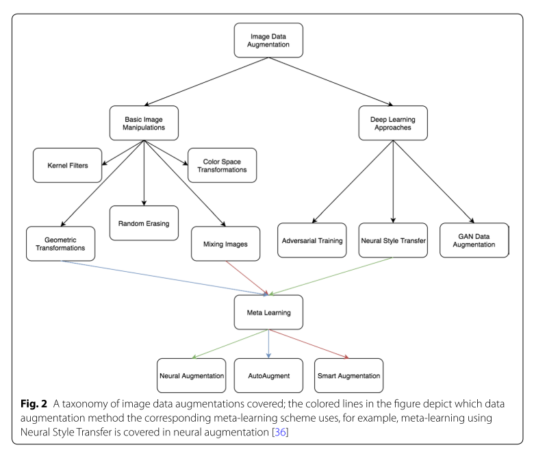

2. **Image Data Augmentation techniques**

2.1 **Data Augmentations based on basic image manipulations**  

* Geometric transformations          
&emsp;&emsp;如果数据集潜在的表征能够被观察和分离，那么简单的几何变换就能取得很好的效果。对于复杂的数据集如医学影像，数据小而且训练集和测试集的偏差大，几何变换等增强的合理运用就很关键。

  * Flipping  
作者提到了要衡量普遍性的观点。但是这种变换对于数字数据集不具有安全性。

  * Color space  
主要提及的识别RGB通道上的变换，将三通道图进行分离，以及直方图变换增强等。（颜色空间更多增强方式可以参考A Preliminary Study on Data Augmentation of Deep Learning for Image Classification）

  * Cropping  
通常在输入图片的尺寸不一时会进行按中心的裁剪操作。裁剪某种程度上和平移操作有相似性。根据裁剪幅度变化，该操作具有一定的不安全性。

  * Rotation  
大幅度的旋转对数字集会有不安全性的考虑。

  * Translation  
平移也需要合理设计。如车站人脸检测，只需要中心检测时，就可以加合适的平移增强。平移后空出部分填0或者255，或用高斯分布噪声。

  * Noise injection  
在像素上叠加高斯分布的随机噪声。

* Color space transformations    
&emsp;&emsp;由于实际图像中一定存在光线偏差，所以光线的增强十分有必要（但是IJCV的光流文章指出，3D建模的灯光增强实在是很难学习到，所以对于光线增强的效果不如几何也可能因为**光线的复杂度更高，数据样本远远不够**）。色彩变换十分多样，如像素限制、像素矩阵变换、像素值颠倒等；灰度图和彩图相比，计算时间成本大大较少，但是据实验效果会下降一些，很明显因为特征的维度被降维了；还有尝试将RGB映射到其他的色彩空间进行学习，YUV,CMY.HSV等。        
&emsp;&emsp;除了计算大内存消耗和时间长等缺点，色彩变换也面临不安全性，比如识别人脸的关键信息是黄白黑，但是大量增强出红绿蓝，会丢信息。颜色变换的增强方法是从色彩空间角度拟合偏置，效果有限的可能性是多样的：1. 真实几何多样性比颜色更简单  2. 色彩的变化多样性更多，导致增强不够反而学不好，颜色空间的欠拟合 3. **变换不安全**

* Experiment
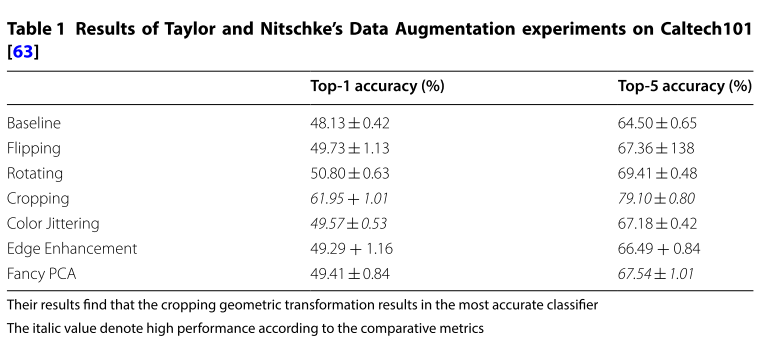

**随机裁剪**效果最好。        

2.2  **Geometric versus photometric transformations** 
* Kernel filter   
滤波器核在图像处理用的比较广，这里提到用这种方法来增强。还提到了一种正则化增强方法PatchShuffle，在一个patch内随机交换像素值，使得对噪声的抵抗更强以及避免过拟合。        
文章指出关于应用滤波器增强的工作尚且不多，因为这种方法其实和CNN的机制是一样的，这么做也许还不如直接在原始CNN上加层加深网络。

* Mixing images  
~~就是那篇被ICLR拒稿的采样方法~~直接均值相加混合。  

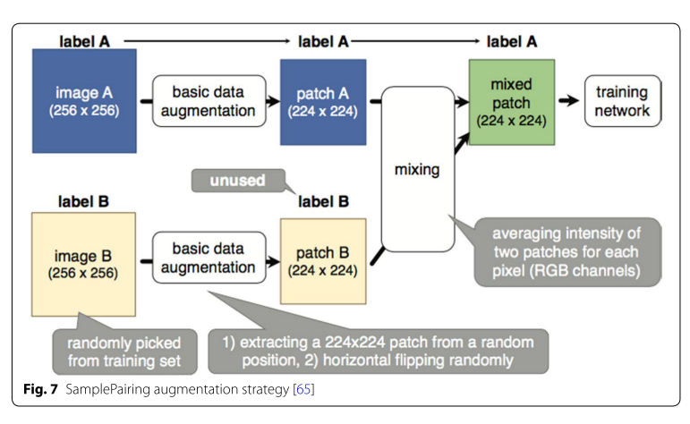

&emsp;&emsp;还有非线性的mixup裁剪如下：  

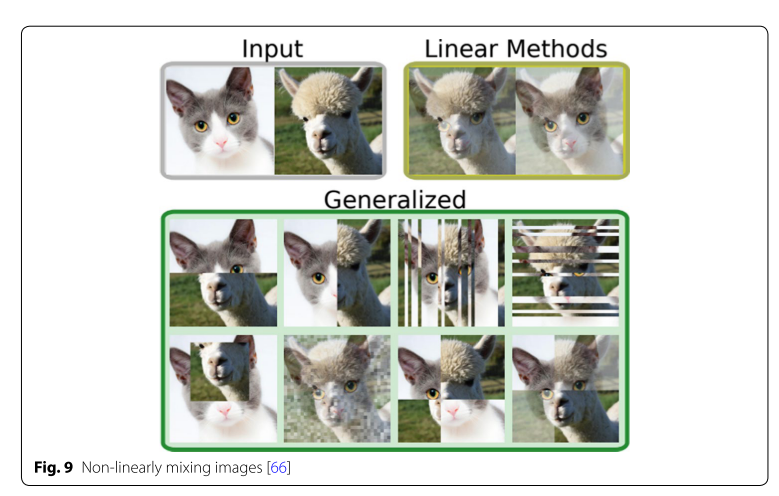

&emsp;&emsp;以及随机裁剪的图像混合：  

&emsp;&emsp;这些混合方式是十分反人类直觉的，因此可解释性不强。只能说是可能增强了对底层低级特征如线条边缘等的鲁棒性。其实有点没有抓住关键点。

* Random erasing  
随机擦除就是类似cutout的思想，通过mask的遮挡使得网络能够提高遮挡情况的鲁棒性。需要手工设计的部分包括mask的大小以及生成方式。是一种比较有效的方法。这种方式也需要考量增强的安全性，比如MNIST数据集8cutout后可能出问题。

* A note on combining augmentations  
组合的增强方式往往是连续变化的，导致数据集的容量会迅速扩大，这对于小数据集领域来说容易发生过拟合 ，所以需要设计合理的搜索算法设计恰当的训练数据集。        

2.3  **Data Augmentations based on Deep Learning**
*  Feature space augmentation  
之前刚看的基于SMOTE类别不平衡的过采样法来进行特征空间的插值操作进行数据增强，就实验效果而言不算特别出众。

* Adversarial training  
对抗样本训练可以提高鲁棒性，但是实际应用中其实提高不一定明显，因为自然对抗样本的数目没有那么多。而NIPS的对抗攻击大赛很多从神经网络的学习策略下手，进行梯度攻击，更加偏向于人为的攻击了，对于普适的检测性能提高意义反而不大，更强调安全需求高的场合。

* GAN‑based Data Augmentation
  
* Neural Style Transfer

不觉得这个效果会普遍很好，应该来说是针对特定域会有效（如白天黑夜），实际效果应该有限。

* Meta learning Data Augmentations 
  * Neural augmentation
  * Smart Augmentation  
  两个东西差不多，就是上次看到SmartAugment方法。随机采样类内图片进行通道叠加然后输出融合图像，学通过梯度下降使得输出图像的类内差距减小（没考虑类间关系，可能也不便处理）。

* AutoAugment  
谷歌最早做的自学习增强方法，走的NAS的思路RL+RNN搜索增强空间，还有后来最近发的检测增强也是大同小异，基本就是换汤不换药，问题在于**搜索空间太大**，复现搜索过于依赖硬件条件（~~普通实验室玩不起~~）

3. **Design considerations for image Data Augmentation**

3.1  **Test-time augmentation**             
&emsp;&emsp;许多都论文指出在检测阶段进行同等的数据增强能够获得较好的效果。归结可以认为是训练检测阶段的一致性。当然，这种手段时间成本太高，只在如医学影像等追求精度的关键领域可以使用。        

3.2  **Curriculum learning**            
&emsp;&emsp;Bengio团队早年在ICML提出的观点，确实合理，一开始就进行大量的增强容易导致网络不收敛。
从一个数据集学习到的数据增强也可以迁移到其他数据集。

3.3  **Resolution impact**
高清（1920×1080×3）或4K（3840×2160×3）等高分辨率图像需要更多的处理和内存来训练深度CNN。然而下一代模型更倾向于使用这样更高分辨率的图像。因为模型中常用的下采样会造成图像中信息的丢失，使图像识别更困难。
研究人员发现，高分辨率图像和低分辨率图像一起训练的模型集合，比单独的任何一个模型都要好。
某个实验（这里就不注明引用了）在256×256图像和512×512图像上训练的模型分别获得7.96%和7.42%的top-5 error。汇总后，他们的top-5 error变低，为6.97%。
随着超分辨率网络的发展，将图像放大到更高的分辨率后训练模型，能够得到更好更健壮的图像分类器。

3.4  **Final dataset size**            
&emsp;&emsp;数据增强的形式可以分为在线和离线增强。前者是在加载数据时增强，可能造成额外的内存消耗（现在都是数据容量不变的随机增强）。               
&emsp;&emsp;此外作者提到了一个比较有意思的点：当前数据集尤其是进行增广后是十分庞大的，明显能够在一定程度上缩小数据集但是保持性能下降不多的子集效率会高得多。

3.5 **Alleviating class imbalance with Data Augmentation**            
&emsp;&emsp;这也是值得借鉴的一点。通过增强在一定程度上解决类别不平衡问题。但增强需要仔细设计，否则会面对已经学习较好的类别或者场景造成过拟合等问题。

### 8.5.2  OHEM

### 8.5.3  NMS：Soft NMS/ Polygon NMS/ Inclined NMS/ ConvNMS/ Yes-Net NMS/ Softer NMS

### 8.5.4  Multi Scale Training/Testing

### 8.5.5  建立小物体与context的关系

### 8.5.6  参考relation network

### 8.5.7  结合GAN

### 8.5.8  结合attention

### 8.5.9  训练tricks（贡献者：北京理工大学--明奇）
介绍一篇2019.2.4亚马逊挂在ArXiv的目标检测训练tricks的文章（之前亚马逊发了篇分类的tricks在CVPR上）

1. **Introduction**

&emsp;&emsp;上次亚马逊发了个分类的训练trick在CVPR上，这次是检测的，还没发表。就没什么多说的了，下面直接介绍。先看效果如下，其实摘要声称的5%是单阶段的yolov3的提升，说明：单阶段没有RoIPooling阶段很多性质确实不如两阶段，因此采用trick很有必要；相反，两阶段本身结构优于单阶段所以外加的trick提供的如不变性等网络自身能够学习和适应就不起作用了。 

2. **Bag of Freebies** 

&emsp;&emsp;提出了一种基于mixup的视觉联系图像混合方法，以及一些数据处理和训练策略。        

2.1  **Visually Coherent Image Mixup for Object Detection**            
&emsp;&emsp;先介绍图像分类中的mixup方法，作用是提供了训练的正则化，应用到图像上如下图，将图像作简单的像素值输入mixup的凸函数中得到合成图；然后将one-hot编码类似处理得到新的label。       

&emsp;&emsp;技术细节：         
* 相比于分类的resize，为了保证检测图像不畸变影响效果，作者选择直接叠加，取最大的宽高，空白进行灰度填充，不进行缩放。        
* 选择ab较大（如1.5,1.5）的Beta分布作为系数来混合图像，作者说是相干性视觉图像的更强；loss是两张图像物体的loss之和，loss计算权重分别是beta分布的系数 

2.2  **Classification Head Label Smoothing** 
&emsp;&emsp;标签平滑在检测的分类任务常有用到，最早是Inceptionv2中提出。        
&emsp;&emsp;如果标签中有的是错的，或者不准，会导致网络过分信任标签而一起错下去。为了提高网络泛化能力，避免这种错误，在one-hot的label进行计算loss时，真实类别位置乘以一个系数（1-e），e很小如0.05，以0.95的概率送进去；非标注的类别原来为0，现在改为e=0.05送进去计算loss。网络的优化方向不变，但是相比0-1label会更加平滑。      
（标签平滑这个讲的不错：https://juejin.im/post/5a29fd4051882534af25dc92）

&emsp;&emsp;这里进一步改进了一下label smooth的公式而已，在原来基础上除了个类别数。        

2.3  **Data Preprocessing**
&emsp;&emsp;就是数据增强，没什么其他的。至于分类也是几何变换和色彩变换。这么分区别其实是是否变换label。但是将真实世界就这么简单地分解过于粗糙了。好不容易谷歌的增强考虑到了如何学习一下检测任务的增强，但是也只是加了bbox_only的增强，就效果而言，一般；而且就实际来说，合理性和有效性有待商榷。     
&emsp;&emsp;作者认为，两阶段网络的RPN生成就是对输入的任意裁剪，所以这个增强就够了；这老哥膨胀了，two-stage就不用裁剪的增强，虽然两阶段能提供一些不变性，但是用了一般来说都是更好的。 

2.4  **Training Schedule Revamping**
训练策略上：余弦学习率调整+warmup      

2.5  **Synchronized Batch Normalization** 
跨多卡同步正则化，土豪专区，穷人退避     

2.6  **Random shapes training for single-stage object detection networks**        
多尺度训练，每经过一定的iteration更换一种尺度。举例是yolov3的尺度范围。

## 8.6 目标检测的常用数据集

### 8.6.1 PASCAL VOC

​	VOC数据集是目标检测经常用的一个数据集，自2005年起每年举办一次比赛，最开始只有4类，到2007年扩充为20个类，共有两个常用的版本：2007和2012。学术界常用5k的train/val 2007和16k的train/val 2012作为训练集，test 2007作为测试集，用10k的train/val 2007+test 2007和16k的train/val 2012作为训练集，test2012作为测试集，分别汇报结果。

### 8.6.2 MS COCO

​	COCO数据集是微软团队发布的一个可以用来图像recognition+segmentation+captioning 数据集，该数据集收集了大量包含常见物体的日常场景图片，并提供像素级的实例标注以更精确地评估检测和分割算法的效果，致力于推动场景理解的研究进展。依托这一数据集，每年举办一次比赛，现已涵盖检测、分割、关键点识别、注释等机器视觉的中心任务，是继ImageNet Chanllenge以来最有影响力的学术竞赛之一。

相比ImageNet，COCO更加偏好目标与其场景共同出现的图片，即non-iconic images。这样的图片能够反映视觉上的语义，更符合图像理解的任务要求。而相对的iconic images则更适合浅语义的图像分类等任务。

​	COCO的检测任务共含有80个类，在2014年发布的数据规模分train/val/test分别为80k/40k/40k，学术界较为通用的划分是使用train和35k的val子集作为训练集（trainval35k），使用剩余的val作为测试集（minival），同时向官方的evaluation server提交结果（test-dev）。除此之外，COCO官方也保留一部分test数据作为比赛的评测集。

### 8.6.3 Google Open Image

​	Open Image是谷歌团队发布的数据集。最新发布的Open Images V4包含190万图像、600个种类，1540万个bounding-box标注，是当前最大的带物体位置标注信息的数据集。这些边界框大部分都是由专业注释人员手动绘制的，确保了它们的准确性和一致性。另外，这些图像是非常多样化的，并且通常包含有多个对象的复杂场景（平均每个图像 8 个）。

### 8.6.4 ImageNet

​	ImageNet是一个计算机视觉系统识别项目， 是目前世界上图像识别最大的数据库。ImageNet是美国斯坦福的计算机科学家，模拟人类的识别系统建立的。能够从图片识别物体。Imagenet数据集文档详细，有专门的团队维护，使用非常方便，在计算机视觉领域研究论文中应用非常广，几乎成为了目前深度学习图像领域算法性能检验的“标准”数据集。Imagenet数据集有1400多万幅图片，涵盖2万多个类别；其中有超过百万的图片有明确的类别标注和图像中物体位置的标注。

### 8.6.5 DOTA
​	DOTA是遥感航空图像检测的常用数据集，包含2806张航空图像，尺寸大约为4kx4k，包含15个类别共计188282个实例，其中14个主类，small vehicle 和 large vehicle都是vehicle的子类。其标注方式为四点确定的任意形状和方向的四边形。航空图像区别于传统数据集，有其自己的特点，如：尺度变化性更大；密集的小物体检测；检测目标的不确定性。数据划分为1/6验证集，1/3测试集，1/2训练集。目前发布了训练集和验证集，图像尺寸从800x800到4000x4000不等。

## 8.7 目标检测常用标注工具

### 8.7.1 LabelImg

​	LabelImg 是一款开源的图像标注工具，标签可用于分类和目标检测，它是用 Python 编写的，并使用Qt作为其图形界面，简单好用。注释以 PASCAL VOC 格式保存为 XML 文件，这是 ImageNet 使用的格式。 此外，它还支持 COCO 数据集格式。

### 8.7.2 labelme
​	labelme 是一款开源的图像/视频标注工具，标签可用于目标检测、分割和分类。灵感是来自于 MIT 开源的一款标注工具 LabelMe。labelme 具有的特点是：

- 支持图像的标注的组件有：矩形框，多边形，圆，线，点（rectangle, polygons, circle, lines, points）
- 支持视频标注
- GUI 自定义
- 支持导出 VOC 格式用于 semantic/instance segmentation
- 支出导出 COCO 格式用于 instance segmentation

### 8.7.3 Labelbox
​	Labelbox 是一家为机器学习应用程序创建、管理和维护数据集的服务提供商，其中包含一款部分免费的数据标签工具，包含图像分类和分割，文本，音频和视频注释的接口，其中图像视频标注具有的功能如下：

- 可用于标注的组件有：矩形框，多边形，线，点，画笔，超像素等（bounding box, polygons, lines, points，brush, subpixels）
- 标签可用于分类，分割，目标检测等
- 以 JSON / CSV / WKT / COCO / Pascal VOC 等格式导出数据
- 支持 Tiled Imagery (Maps)
- 支持视频标注 （快要更新）

### 8.7.4 RectLabel

​	RectLabel 是一款在线免费图像标注工具，标签可用于目标检测、分割和分类。具有的功能或特点：

- 可用的组件：矩形框，多边形，三次贝塞尔曲线，直线和点，画笔，超像素
- 可只标记整张图像而不绘制
- 可使用画笔和超像素
- 导出为YOLO，KITTI，COCO JSON和CSV格式
- 以PASCAL VOC XML格式读写
- 使用Core ML模型自动标记图像
- 将视频转换为图像帧

### 8.7.5 CVAT

​	CVAT 是一款开源的基于网络的交互式视频/图像标注工具，是对加州视频标注工具（Video Annotation Tool） 项目的重新设计和实现。OpenCV团队正在使用该工具来标注不同属性的数百万个对象，许多 UI 和 UX 的决策都基于专业数据标注团队的反馈。具有的功能

- 关键帧之间的边界框插值
- 自动标注（使用TensorFlow OD API 和 Intel OpenVINO IR格式的深度学习模型）

### 8.7.6 VIA
​	VGG Image Annotator（VIA）是一款简单独立的手动注释软件，适用于图像，音频和视频。 VIA 在 Web 浏览器中运行，不需要任何安装或设置。 页面可在大多数现代Web浏览器中作为离线应用程序运行。

- 支持标注的区域组件有：矩形，圆形，椭圆形，多边形，点和折线

### 8.7.6 其他标注工具

​	liblabel，一个用 MATLAB 写的轻量级 语义/示例(semantic/instance) 标注工具。
ImageTagger：一个开源的图像标注平台。
Anno-Mage：一个利用深度学习模型半自动图像标注工具，预训练模型是基于MS COCO数据集，用 RetinaNet 训练的。

 
​	当然还有一些数据标注公司，可能包含更多标注功能，例如对三维目标检测的标注（3D Bounding box Labelling），激光雷达点云的标注（LIDAR 3D Point Cloud Labeling）等。

## 8.8 目标检测工具和框架（贡献者：北京理工大学--明奇）
各种不同的算法虽然部分官方会有公布代码，或者github上有人复现，但是囿于安装环境不一，实现的框架（pytorch、C++、Caffee、tensorflow、MXNet等）不同，每次更换算法都需要重新安装环境，并且代码之间的迁移性差，十分不方便。所以为了方便将不同的算法统一在一个代码库中，不同的大厂都提出了自己的解决方案。如facebook的Detectron、商汤科技的mmdetection、SimpleDet等。其中Detectron最早，所以用户量最大，其次是国内近段时间崛起的mmdetection，下面介绍该目标检测工具箱。

1. **Introduction**  
MMdetection的特点：
* 模块化设计：将不同网络的部分进行切割，模块之间具有很高的复用性和独立性（十分便利，可以任意组合）
* 高效的内存使用
* SOTA

2. **Support Frameworks**  
* 单阶段检测器  
SSD、RetinaNet、FCOS、FSAF

* 两阶段检测器  
Faster R-CNN、R-FCN、Mask R-CNN、Mask Scoring R-CNN、Grid R-CNN

* 多阶段检测器  
Cascade R-CNN、Hybrid Task Cascade

* 通用模块和方法  
soft-NMS、DCN、OHEN、Train from Scratch 、M2Det 、GN 、HRNet 、Libra R-CNN

3. **Architecture**

模型表征：划分为以下几个模块：          
Backbone（ResNet等）、Neck（FPN）、DenseHead（AnchorHead）、RoIExtractor、RoIHead（BBoxHead/MaskHead）       
结构图如下：

4. **Notice**
* 1x代表12epoch的COCO训练，2x类似推导
* 由于batch-size一般比较小（1/2这样的量级），所以大多数地方默认冻结BN层。可以使用GN代替。

5. **参考链接**
mmdetection代码高度模块化，十分好用和便利，更详细的文档直接参见官方文档：
https://github.com/open-mmlab/mmdetection

注释版的mmdetection代码（更新至v1.0.0）：https://github.com/ming71/mmdetection-annotated

使用方法简介：
安装记录（可能过时，以官方文档为准）：https://ming71.github.io/mmdetection-memo.html
使用方法（截止更新日期，如果过时以官方为准）：https://ming71.github.io/mmdetection-instruction.html

## TODO

- [ ] 目标检测基础知识：mAP、IoU和NMS等
- [ ] 目标检测评测指标
- [ ] 目标检测常见标注工具
- [ ] 完善目标检测的技巧汇总
- [ ] 目标检测的现在难点和未来发展

## 参考文献

https://github.com/amusi/awesome-object-detection

https://github.com/hoya012/deep_learning_object_detection

https://handong1587.github.io/deep_learning/2015/10/09/object-detection.html

https://www.zhihu.com/question/272322209/answer/482922713

http://blog.leanote.com/post/afanti.deng@gmail.com/b5f4f526490b

https://blog.csdn.net/hw5226349/article/details/78987385

[1] Girshick R, Donahue J, Darrell T, et al. Rich feature hierarchies for accurate object detection and semantic segmentation[C]//Proceedings of the IEEE conference on computer vision and pattern recognition. 2014: 580-587.

[2] Girshick R. Fast r-cnn[C]//Proceedings of the IEEE international conference on computer vision. 2015: 1440-1448.

[3] He K, Zhang X, Ren S, et al. Spatial pyramid pooling in deep convolutional networks for visual recognition[J]. IEEE transactions on pattern analysis and machine intelligence, 2015, 37(9): 1904-1916.

[4] Ren S, He K, Girshick R, et al. Faster r-cnn: Towards real-time object detection with region proposal networks[C]//Advances in neural information processing systems. 2015: 91-99.

[5] Lin T Y, Dollár P, Girshick R, et al. Feature pyramid networks for object detection[C]//Proceedings of the IEEE Conference on Computer Vision and Pattern Recognition. 2017: 2117-2125.

[6] He K, Gkioxari G, Dollár P, et al. Mask r-cnn[C]//Proceedings of the IEEE international conference on computer vision. 2017: 2961-2969.

[7] Liu W, Anguelov D, Erhan D, et al. Ssd: Single shot multibox detector[C]//European conference on computer vision. Springer, Cham, 2016: 21-37.

[8] Fu C Y, Liu W, Ranga A, et al. Dssd: Deconvolutional single shot detector[J]. arXiv preprint arXiv:1701.06659, 2017.

[9] Redmon J, Divvala S, Girshick R, et al. You only look once: Unified, real-time object detection[C]//Proceedings of the IEEE conference on computer vision and pattern recognition. 2016: 779-788.

[10] Redmon J, Farhadi A. YOLO9000: better, faster, stronger[C]//Proceedings of the IEEE conference on computer vision and pattern recognition. 2017: 7263-7271.

[11] Redmon J, Farhadi A. Yolov3: An incremental improvement[J]. arXiv preprint arXiv:1804.02767, 2018.

[12] Lin T Y, Goyal P, Girshick R, et al. Focal loss for dense object detection[C]//Proceedings of the IEEE international conference on computer vision. 2017: 2980-2988.

[13] Liu S, Huang D. Receptive field block net for accurate and fast object detection[C]//Proceedings of the European Conference on Computer Vision (ECCV). 2018: 385-400.

[14] Zhao Q, Sheng T, Wang Y, et al. M2Det: A Single-Shot Object Detector based on Multi-Level Feature Pyramid Network[J]. arXiv preprint arXiv:1811.04533, 2018.