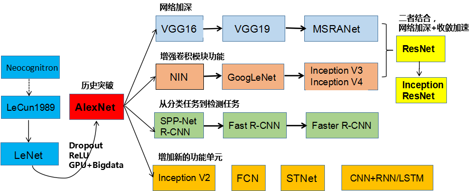
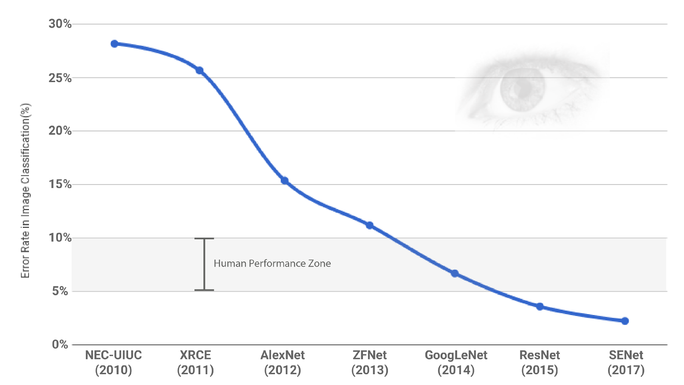

[TOC]


# 第十二章 网络搭建及训练
目录   
常用框架介绍     
常用框架对比(表格展示)  16个最棒的深度学习框架 https://baijiahao.baidu.com/s?id=1599943447101946075&wfr=spider&for=pc   
基于tensorfolw网络搭建实例   
CNN训练注意事项    
训练技巧   
深度学习模型训练痛点及解决方法 https://blog.csdn.net/weixin_40581617/article/details/80537559   
深度学习模型训练流程 https://blog.csdn.net/Quincuntial/article/details/79242364   
深度学习模型训练技巧 https://blog.csdn.net/w7256037/article/details/52071345   
https://blog.csdn.net/u012033832/article/details/79017951   
https://blog.csdn.net/u012968002/article/details/72122965   

深度学习几大难点 https://blog.csdn.net/m0_37867246/article/details/79766371   

## CNN训练注意事项 
http://www.cnblogs.com/softzrp/p/6724884.html
1.用Mini-batch SGD对神经网络做训练的过程如下：

不断循环 ：

①  采样一个 batch 数据( ( 比如 32 张 ）

②前向计算得到损失 loss

③  反向传播计算梯度( 一个 batch）

④  用这部分梯度迭代更新权重参数

2.去均值

去均值一般有两种方式：第一种是在每个像素点都算出3个颜色通道上的平均值，然后对应减去，如AlexNet。 第二种是在整个样本上就只得到一组数，不分像素点了，如VGGNet。
3.权重初始化
4.Dropout


# 第十二章 TensorFlow、pytorch和caffe介绍

# 12.1 TensorFlow

## 12.1.1 TensorFlow是什么？

&emsp;&emsp;TensorFlow支持各种异构平台，支持多CPU/GPU、服务器、移动设备，具有良好的跨平台的特性；TensorFlow架构灵活，能够支持各种网络模型，具有良好的通用性；此外，TensorFlow架构具有良好的可扩展性，对OP的扩展支持，Kernel特化方面表现出众。

&emsp;&emsp;TensorFlow最初由Google大脑的研究员和工程师开发出来，用于机器学习和神经网络方面的研究，于2015.10宣布开源，在众多深度学习框架中脱颖而出，在Github上获得了最多的Star量。

## 12.1.2 TensorFlow的设计理念是什么？

TensorFlow的设计理念主要体现在两个方面：

（1）将图定义和图运算完全分开。
&emsp;&emsp;TensorFlow 被认为是一个“符号主义”的库。我们知道，编程模式通常分为命令式编程（imperative style programming）和符号式编程（symbolic style programming）。命令式编程就是编写我们理解的通常意义上的程序，很容易理解和调试，按照原有逻辑执行。符号式编程涉及很多的嵌入和优化，不容易理解和调试，但运行速度相对有所提升。现有的深度学习框架中，Torch 是典型的命令式的，Caffe、MXNet 采用了两种编程模式混合的方法，而 TensorFlow 完全采用符号式编程。

&emsp;&emsp;符号式计算一般是先定义各种变量，然后建立一个数据流图，在数据流图中规定各个变量间的计算关系，最后需要对据流图进行编译，但此时的数据流图还是一个空壳儿，里面没有任何实际数据，只有把需要运算的输入放进去后，才能在整个模型中形成数据流，从而形成输出值。

　　例如：

```
t = 8 + 9
print(t)
```

&emsp;&emsp;在传统的程序操作中，定义了 t 的运算，在运行时就执行了，并输出 17。而在 TensorFlow中，数据流图中的节点，实际上对应的是 TensorFlow API 中的一个操作，并没有真正去运行：

```
import tensorflow as tf
t = tf.add(8,9)
print(t)

#输出  Tensor{"Add_1:0",shape={},dtype=int32}
```

&emsp;&emsp;（2）TensorFlow 中涉及的运算都要放在图中，而图的运行只发生在会话（session）中。开启会话后，就可以用数据去填充节点，进行运算；关闭会话后，就不能进行计算了。因此，会话提供了操作运行和 Tensor 求值的环境。

　　例如：

```
import tensorflow as tf
#创建图
a = tf.constant([4.0,5.0])
b = tf.constant([6.0,7.0])
c = a * b
#创建会话
sess  = tf.Session()
#计算c
print(sess.run(c))   #进行矩阵乘法，输出[24.,35.]
sess.close()
```

## 12.1.3 TensorFlow特点有哪些？

### 1.高度的灵活性

&emsp;&emsp;TensorFlow 并不仅仅是一个深度学习库，只要可以把你的计算过程表示称一个数据流图的过程，我们就可以使用 TensorFlow 来进行计算。TensorFlow 允许我们用计算图的方式建立计算网络，同时又可以很方便的对网络进行操作。用户可以基于 TensorFlow 的基础上用 python 编写自己的上层结构和库，如果TensorFlow没有提供我们需要的API的，我们也可以自己编写底层的 C++ 代码，通过自定义操作将新编写的功能添加到 TensorFlow 中。

### 2.真正的可移植性

&emsp;&emsp;TensorFlow 可以在 CPU 和 GPU 上运行，可以在台式机、服务器、移动设备上运行。你想在你的笔记本上跑一下深度学习的训练，或者又不想修改代码，想把你的模型在多个CPU上运行， 亦或想将训练好的模型放到移动设备上跑一下，这些TensorFlow都可以帮你做到。

### 3.多语言支持

&emsp;&emsp;TensorFlow采用非常易用的python来构建和执行我们的计算图，同时也支持 C++ 的语言。我们可以直接写python和C++的程序来执行TensorFlow，也可以采用交互式的ipython来方便的尝试我们的想法。当然，这只是一个开始，后续会支持更多流行的语言，比如Lua，JavaScript 或者R语言。

### 4.丰富的算法库

&emsp;&emsp;TensorFlow提供了所有开源的深度学习框架里，最全的算法库，并且在不断的添加新的算法库。这些算法库基本上已经满足了大部分的需求，对于普通的应用，基本上不用自己再去自定义实现基本的算法库了。

### 5.完善的文档

&emsp;&emsp;TensorFlow的官方网站，提供了非常详细的文档介绍，内容包括各种API的使用介绍和各种基础应用的使用例子，也包括一部分深度学习的基础理论。

&emsp;&emsp;自从宣布开源以来，大量人员对TensorFlow做出贡献，其中包括Google员工，外部研究人员和独立程序员，全球各地的工程师对TensorFlow的完善，已经让TensorFlow社区变成了Github上最活跃的深度学习框架。

## 12.1.4 TensorFlow的系统架构是怎样的？

### &emsp;&emsp;整个系统从底层到上层可分为七层：


&emsp;&emsp;设备层：硬件计算资源，支持CPU、GPU

&emsp;&emsp;网络层：支持两种通信协议

&emsp;&emsp;数值计算层：提供最基础的计算，有线性计算、卷积计算

&emsp;&emsp;高维计算层：数据的计算都是以数组的形式参与计算

&emsp;&emsp;计算图层：用来设计神经网络的结构

&emsp;&emsp;工作流层：提供轻量级的框架调用

&emsp;&emsp;构造层：最后构造的深度学习网络可以通过TensorBoard服务端可视化

## 12.1.5 TensorFlow编程模型是怎样的？

TensorFlow的编程模型：让向量数据在计算图里流动。那么在编程时至少有这几个过程：1.构建图，2.启动图，3.给图输入数据并获取结果。

### 1.构建图

TensorFlow的图的类型是tf.Graph，它包含着计算节点和tensor的集合。

&emsp;&emsp;这里引用了两个新概念：tensor和计算节点。
&emsp;&emsp;我们先介绍tensor，一开始我们就介绍了，我们需要把数据输入给启动的图才能获取计算结果。那么问题来了，在构建图时用什么表示中间计算结果？这个时候tensor的概念就需要引入了。
&emsp;&emsp;类型是tf.Tensor，代表某个计算节点的输出，一定要看清楚是“代表”。它主要有两个作用：

1.构建不同计算节点之间的数据流

2.在启动图时，可以设置某些tensor的值，然后获取指定tensor的值。这样就完成了计算的输入输出功能。

如下代码所示：

```
inImage = tf.placeholder(tf.float32,[32,32,3],"inputImage")
processedImage = tf.image.per_image_standardization(inImage,"processedImage")
```

&emsp;&emsp;这里inImage和processedImage都是tensor类型。它们代表着计算节点输出的数据，数据的值具体是多少在启动图的时候才知道。上面两个方法调用都传递了一个字符串，它是计算节点的名字，最好给节点命名，这样我们可以在图上调用get_tensor_by_name(name)获取对应的tensor对象，十分方便。（tensor名字为“<计算节点名字>:<tensor索引>”）

&emsp;&emsp;创建tensor时，需要指定类型和shape。对不同tensor进行计算时要求类型相同，可以使用 tf.cast 进行类型转换。同时也要求 shape (向量维度)满足运算的条件，我们可以使用 tf.reshape 改变shape。

&emsp;&emsp;现在了解计算节点的概念，其功能是对tensor进行计算、创建tensor或进行其他操作，类型是tf.Operation。获取节点对象的方法为get_operation_by_name(name)。

构建图，如下代码：

```
g=tf.Graph()

with g.as_default():
    input_data=tf.placeholder(tf.float32,[None,2],"input_data")
    input_label=tf.placeholder(tf.float32,[None,2],"input_label")

    W1=tf.Variable(tf.truncated_normal([2,2]),name="W1")
    B1=tf.Variable(tf.zeros([2]),name="B1")

    output=tf.add(tf.matmul(input_data,W1),B1,name="output")
    cross_entropy=tf.nn.softmax_cross_entropy_with_logits(logits=output,labels=input_label)

    train_step=tf.train.AdamOptimizer().minimize(cross_entropy,name="train_step")

    initer=tf.global_variables_initializer()

```

&emsp;&emsp;上面的代码中我们创建了一个图，并在上面添加了很多节点。我们可以通过调用get_default_graph()获取默认的图。

&emsp;&emsp;Input_data，input_label，W1，B1，output，cross_entropy都是tensor类型，train_step，initer，是节点类型。

有几类tensor或节点比较重要，下面介绍一下：

#### 1.placeholder

&emsp;&emsp;Tensorflow，顾名思义， tensor代表张量数据，flow代表流，其最初的设计理念就是构建一张静态的数据流图。图是有各个计算节点连接而成，计算节点之间流动的便是中间的张量数据。要想让张量数据在我们构建的静态计算图中流动起来，就必须有最初的输入数据流。而placeholder，翻译过来叫做占位符，顾名思义，是给我们的输入数据提供一个接口，也就是说我们的一切输入数据，例如训练样本数据，超参数数据等都可以通过占位符接口输送到数据流图之中。使用实例如下代码：

```
import tensorflow as tf
x = tf.placeholder(dtype=tf.float32,shape=[],name='x')
y = tf.placeholder(dtpe=tf.float32,shape=[],nmae='y')
z = x*y
with tf.Session() as sess:
	prod = sess.run(z,feed_dict={x:1.,y:5.2})
	print(prod)
[out]:5.2
```

#### 2. variable

&emsp;&emsp;无论是传统的机器学习算法，例如线性支持向量机（Support Vector Machine, SVM)，其数学模型为y = <w,x> + b，还是更先进的深度学习算法，例如卷积神经网络（Convolutional Neural Network， CNN）单个神经元输出的模型y = w*x + b。可以看到，w和b就是我们要求的模型，模型的求解是通过优化算法（对于SVM，使用
SMO[1]算法，对于CNN，一般基于梯度下降法）来一步一步更新w和b的值直到满足停止条件。因此，大多数机器学习的模型中的w和b实际上是以变量的形式出现在代码中的，这就要求我们在代码中定义模型变量。

```
import tensorflow as tf
a = tf.Variable(2.)
b = tf.Variable(3.)
with tf.Session() as sess:
	sess.run(tf.global_variables_initializer()) #变量初始化
    print(sess.run(a*b))
[out]:6.
```

[1] Platt, John. "Sequential minimal optimization: A fast algorithm for training support vector machines." (1998).

#### 3. initializer

&emsp;&emsp;由于tensorflow构建的是静态的计算流图，在开启会话之前，所有的操作都不会被执行。因此为了执行在计算图中所构建的赋值初始化计算节点，需要在开启会话之后，在会话环境下运行初始化。如果计算图中定义了变量，而会话环境下为执行初始化命令，则程序报错，代码如下：

```
import tensorflow as tf
a = tf.Variable(2.)
b = tf.Variable(3.)
with tf.Session() as sess:
	#sess.run(tf.global_variables_initializer()) #注释掉初始化命令
    print(sess.run(a*b))
[Error]: Attempting to use uninitialized value Variable
```

### 2.启动图

&emsp;&emsp;先了解session的概念，然后才能更好的理解图的启动。
&emsp;&emsp;图的每个运行实例都必须在一个session里，session为图的运行提供环境。Session的类型是tf.Session，在实例化session对象时我们需要给它传递一个图对象，如果不显示给出将使用默认的图。Session有一个graph属性，我们可以通过它获取session对应的图。

代码如下：

```
numOfBatch=5
datas=np.zeros([numOfBatch,2],np.float32)
labels=np.zeros([numOfBatch,2],np.float32)

sess=tf.Session(graph=g)
graph=sess.graph
sess.run([graph.get_operation_by_name("initer")])

dataHolder=graph.get_tensor_by_name("input_data:0")
labelHolder=graph.get_tensor_by_name("input_label:0")
train=graph.get_operation_by_name("train_step")
out=graph.get_tensor_by_name("output:0")

for i inrange(200):
   result=sess.run([out,train],feed_dict={dataHolder:datas,labelHolder:labels})
   if i%100==0:
       saver.save(sess,"./moules")

sess.close()
```

代码都比较简单，就不介绍了。不过要注意2点：1.别忘记运行初始化节点，2.别忘记close掉session对象以释放资源。

#### 3.给图输入数据并获取结果

代码：

```
for i inrange(200):
    result=sess.run([out,train],feed_dict={dataHolder:datas,labelHolder:labels})
```

&emsp;&emsp;这里主要用到了session对象的run方法，它用来运行某个节点或tensor并获取对应的值。我们一般会一次传递一小部分数据进行mini-batch梯度下降来优化模型。

&emsp;&emsp;我们需要把我们需要运行的节点或tensor放入一个列表，然后作为第一个参数(不考虑self)传递给run方法，run方法会返回一个计算结果的列表，与我们传递的参数一一对应。

&emsp;&emsp;如果我们运行的节点依赖某个placeholder，那我们必须给这个placeholder指定值，怎么指定代码里面很清楚，给关键字参数feed_dict传递一个字典即可，字典里的元素的key是placeholder对象，value是我们指定的值。值的数据的类型必须和placeholder一致，包括shape。值本身的类型是numpy数组。

这里再解释一个细节，在定义placeholder时代码如下：

```
input_data=tf.placeholder(tf.float32,[None,2],"input_data")
input_label=tf.placeholder(tf.float32,[None,2],"input_label")
```

&emsp;&emsp;shape为[None,2]，说明数据第一个维度是不确定的，然后TensorFlow会根据我们传递的数据动态推断第一个维度，这样我们就可以在运行时改变batch的大小。比如一个数据是2维，一次传递10个数据对应的tensor的shape就是[10,2]。可不可以把多个维度指定为None？理论上不可以！

## 12.1.6 如何基于tensorflow搭建VGG16

​	介绍完关于tensorflow的基础知识，是时候来一波网络搭建实战了。虽然网上有很多相关教程，但我想从最标准的tensorflow代码和语法出发（而不是调用更高级的API，失去了原来的味道），向大家展示如何搭建其标准的VGG16网络架构。话不多说，上代码：

```python
import numpy as np
import tensorflow as tf

def get_weight_variable(shape):
    return tf.get_variable('weight', shape=shape, initializer=tf.truncated_normal_initializer(stddev=0.1))

def get_bias_variable(shape):
    return tf.get_variable('bias', shape=shape, initializer=tf.constant_initializer(0))

def conv2d(x, w, padding = 'SAME', s=1):
    x = tf.nn.conv2d(x, w, strides=[1, s, s, 1], padding = padding)
    return x

def maxPoolLayer(x):
    return tf.nn.max_pool(x, ksize = [1, 2, 2, 1],
                          strides = [1, 2, 2, 1], padding = 'SAME')

def conv2d_layer(x,in_chs, out_chs, ksize, layer_name):
    with tf.variable_scope(layer_name):
        w = get_weight_variable([ksize, ksize, in_chs, out_chs])
        b = get_bias_variable([out_chs])
        y = tf.nn.relu(tf.bias_add(conv2d(x,w,padding = 'SAME', s=1), b))
    return y

def fc_layer(x,in_kernels, out_kernels, layer_name):
    with tf.variable_scope(layer_name):
        w = get_weight_variable([in_kernels,out_kernels])
        b = get_bias_variable([out_kernels])
        y = tf.nn.relu(tf.bias_add(tf.matmul(x,w),b))
    return y
        
def VGG16(x):
    conv1_1 = conv2d_layer(x,tf.get_shape(x).as_list()[-1], 64, 3, 'conv1_1')
    conv1_2 = conv2d_layer(conv1_1,64, 64, 3, 'conv1_2')
    pool_1 = maxPoolLayer(conv1_2)
    
    conv2_1 = conv2d_layer(pool1,64, 128, 3, 'conv2_1')
    conv2_2 = conv2d_layer(conv2_1,128, 128, 3, 'conv2_2')
    pool2 = maxPoolLayer(conv2_2)
    
	conv3_1 = conv2d_layer(pool2,128, 256, 3, 'conv3_1')
    conv3_2 = conv2d_layer(conv3_1,256, 256, 3, 'conv3_2')
	conv3_3 = conv2d_layer(conv3_2,256, 256, 3, 'conv3_3')
    pool3 = maxPoolLayer(conv3_3)
    
	conv4_1 = conv2d_layer(pool3,256, 512, 3, 'conv4_1')
    conv4_2 = conv2d_layer(conv4_1,512, 512, 3, 'conv4_2')
	conv4_3 = conv2d_layer(conv4_2,512, 512, 3, 'conv4_3')
    pool4 = maxPoolLayer(conv4_3)
    
	conv5_1 = conv2d_layer(pool4,512, 512, 3, 'conv5_1')
    conv5_2 = conv2d_layer(conv5_1,512, 512, 3, 'conv5_2')
	conv5_3 = conv2d_layer(conv5_1,512, 512, 3, 'conv5_3')
    pool5 = maxPoolLayer(conv5_3)
    
	pool5_flatten_dims = int(np.prod(pool5.get_shape().as_list()[1:]))
    pool5_flatten = tf.reshape(pool5,[-1,pool5_flatten_dims])
    
    fc_6 = fc_layer(pool5_flatten, pool5_flatten_dims, 4096, 'fc6')
	fc_7 = fc_layer(fc_6, 4096, 4096, 'fc7')
	fc_8 = fc_layer(fc_7, 4096, 10, 'fc8')
    
    return fc_8
    
```


# 12.2 Pytorch

## 12.2.1 Pytorch是什么？

&emsp;&emsp;Pytorch是torch的python版本，是由Facebook开源的神经网络框架，专门针对 GPU 加速的深度神经网络（DNN）编程。Torch 是一个经典的对多维矩阵数据进行操作的张量（tensor ）库，在机器学习和其他数学密集型应用有广泛应用。与Tensorflow的静态计算图不同，pytorch的计算图是动态的，可以根据计算需要实时改变计算图。但由于Torch语言采用 Lua，导致在国内一直很小众，并逐渐被支持 Python 的 Tensorflow 抢走用户。作为经典机器学习库 Torch 的端口，PyTorch 为 Python 语言使用者提供了舒适的写代码选择。

## 12.2.2 为什么选择 Pytorch？

### 1.简洁：

&emsp;&emsp;PyTorch的设计追求最少的封装，尽量避免重复造轮子。不像 TensorFlow 中充斥着session、graph、operation、name_scope、variable、tensor、layer等全新的概念，PyTorch 的设计遵循tensor→variable(autograd)→nn.Module 三个由低到高的抽象层次，分别代表高维数组（张量）、自动求导（变量）和神经网络（层/模块），而且这三个抽象之间联系紧密，可以同时进行修改和操作。
简洁的设计带来的另外一个好处就是代码易于理解。PyTorch的源码只有TensorFlow的十分之一左右，更少的抽象、更直观的设计使得PyTorch的源码十分易于阅读。

### 2.速度：

&emsp;&emsp;PyTorch 的灵活性不以速度为代价，在许多评测中，PyTorch 的速度表现胜过 TensorFlow和Keras 等框架。框架的运行速度和程序员的编码水平有极大关系，但同样的算法，使用PyTorch实现的那个更有可能快过用其他框架实现的。

### 3.易用：

&emsp;&emsp;PyTorch 是所有的框架中面向对象设计的最优雅的一个。PyTorch的面向对象的接口设计来源于Torch，而Torch的接口设计以灵活易用而著称，Keras作者最初就是受Torch的启发才开发了Keras。PyTorch继承了Torch的衣钵，尤其是API的设计和模块的接口都与Torch高度一致。PyTorch的设计最符合人们的思维，它让用户尽可能地专注于实现自己的想法，即所思即所得，不需要考虑太多关于框架本身的束缚。

### 4.活跃的社区：

&emsp;&emsp;PyTorch 提供了完整的文档，循序渐进的指南，作者亲自维护的论坛 供用户交流和求教问题。Facebook 人工智能研究院对 PyTorch 提供了强力支持，作为当今排名前三的深度学习研究机构，FAIR的支持足以确保PyTorch获得持续的开发更新，不至于像许多由个人开发的框架那样昙花一现。

## 12.2.3 PyTorch 的架构是怎样的？  

&emsp;&emsp;PyTorch(Caffe2) 通过混合前端，分布式训练以及工具和库生态系统实现快速，灵活的实验和高效生产。PyTorch 和 TensorFlow 具有不同计算图实现形式，TensorFlow 采用静态图机制(预定义后再使用)，PyTorch采用动态图机制(运行时动态定义)。PyTorch 具有以下高级特征：

&emsp;&emsp;混合前端:新的混合前端在急切模式下提供易用性和灵活性，同时无缝转换到图形模式，以便在C ++运行时环境中实现速度，优化和功能。
&emsp;&emsp;分布式训练:通过利用本地支持集合操作的异步执行和可从Python和C ++访问的对等通信，优化了性能。
&emsp;&emsp;Python优先: PyTorch为了深入集成到Python中而构建的，因此它可以与流行的库和Cython和Numba等软件包一起使用。
&emsp;&emsp;丰富的工具和库:活跃的研究人员和开发人员社区建立了丰富的工具和库生态系统，用于扩展PyTorch并支持从计算机视觉到强化学习等领域的开发。
&emsp;&emsp;本机ONNX支持:以标准ONNX（开放式神经网络交换）格式导出模型，以便直接访问与ONNX兼容的平台，运行时，可视化工具等。
&emsp;&emsp;C++前端：C++前端是PyTorch的纯C++接口，它遵循已建立的Python前端的设计和体系结构。它旨在实现高性能，低延迟和裸机C++应用程序的研究。
使用GPU和CPU优化的深度学习张量库。

## 12.2.4 Pytorch 与 tensorflow 之间的差异在哪里？

&emsp;&emsp;上面也将了PyTorch 最大优势是建立的神经网络是动态的, 对比静态的 Tensorflow, 它能更有效地处理一些问题, 比如说 RNN 变化时间长度的输出。各有各的优势和劣势。两者都是大公司发布的, Tensorflow（Google）宣称在分布式训练上下了很大的功夫, 那就默认 Tensorflow 在分布式训练上要超出 Pytorch（Facebook），还有tensorboard可视化工具, 但是 Tensorflow 的静态计算图使得在 RNN 上有一点点被动 (虽然它用其他途径解决了), 不过用 PyTorch 的时候, 会对这种动态的 RNN 有更好的理解。而且 Tensorflow 的高度工业化, 它的底层代码很难看懂， Pytorch 好那么一点点, 如果深入 PytorchAPI, 至少能比看 Tensorflow 多看懂一点点 Pytorch 的底层在干啥。

## 12.2.5 Pytorch有哪些常用工具包？

&emsp;&emsp;torch ：类似 NumPy 的张量库，强 GPU 支持 ；
&emsp;&emsp;torch.autograd ：基于 tape 的自动区别库，支持 torch 之中的所有可区分张量运行；
&emsp;&emsp;torch.nn ：为最大化灵活性未涉及、与 autograd 深度整合的神经网络库；
&emsp;&emsp;torch.optim：与 torch.nn 一起使用的优化包，包含 SGD、RMSProp、LBFGS、Adam 等标准优化方式；
&emsp;&emsp;torch.multiprocessing： python 多进程并发，进程之间 torch Tensors 的内存共享；
&emsp;&emsp;torch.utils：数据载入器。具有训练器和其他便利功能；
&emsp;&emsp;torch.legacy(.nn/.optim) ：处于向后兼容性考虑，从 Torch 移植来的 legacy 代码；

# 12.3 Caffe

## 12.3.1 什么是 Caffe？

&emsp;&emsp;Caffe的全称应该是Convolutional Architecture for Fast Feature Embedding，它是一个清晰、高效的深度学习框架，它是开源的，核心语言是C++，它支持命令行、Python和Matlab接口，它既可以在CPU上运行也可以在GPU上运行。它的license是BSD 2-Clause。

## 12.3.2 Caffe的特点是什么？

(1)、模块化：Caffe从一开始就设计得尽可能模块化，允许对新数据格式、网络层和损失函数进行扩展。

(2)、表示和实现分离：Caffe的模型(model)定义是用Protocol Buffer语言写进配置文件的。以任意有向无环图的形式，Caffe支持网络架构。Caffe会根据网络的需要来正确占用内存。通过一个函数调用，实现CPU和GPU之间的切换。

(3)、测试覆盖：在Caffe中，每一个单一的模块都对应一个测试。

(4)、python和Matlab接口：同时提供Python和Matlab接口。

(5)、预训练参考模型：针对视觉项目，Caffe提供了一些参考模型，这些模型仅应用在学术和非商业领域，它们的license不是BSD。

## 12.3.3 Caffe的设计思想是怎样的？

&emsp;&emsp;基本上，Caffe 沿用了神经网络的一个简单假设----所有的计算都是以layer的形式表示的，layer做的事情就是take一些数据，然后输出一些计算以后的结果，比如说卷积，就是输入一个图像，然后和这一层的参数（filter）做卷积，然后输出卷积的结果。每一个layer需要做两个计算：forward是从输入计算输出，然后backward是从上面给的gradient来计算相对于输入的gradient，只要这两个函数实现了以后，我们就可以把很多层连接成一个网络，这个网络做的事情就是输入我们的数据（图像或者语音或者whatever），然后来计算我们需要的输出（比如说识别的label），在training的时候，我们可以根据已有的label来计算loss和gradient，然后用gradient来update网络的参数，这个就是Caffe的一个基本流程。

&emsp;&emsp;基本上，最简单地用Caffe上手的方法就是先把数据写成Caffe的格式，然后设计一个网络，然后用Caffe提供的solver来做优化看效果如何，如果你的数据是图像的话，可以从现有的网络，比如说alexnet或者googlenet开始，然后做fine tuning，如果你的数据稍有不同，比如说是直接的float vector，你可能需要做一些custom的configuration，Caffe的logistic regression example兴许会很有帮助。

&emsp;&emsp;Fine tune方法：fine tuning的想法就是说，在imagenet那么大的数据集上train好一个很牛的网络了，那别的task上肯定也不错，所以我们可以把pretrain的网络拿过来，然后只重新train最后几层，重新train的意思是说，比如我以前需要classify imagenet的一千类，现在我只想识别是狗还是猫，或者是不是车牌，于是我就可以把最后一层softmax从一个4096*1000的分类器变成一个4096*2的分类器，这个strategy在应用中非常好使，所以我们经常会先在imagenet上pretrain一个网络，因为我们知道imagenet上training的大概过程会怎么样。

## 12.3.4 Caffe架构是怎样的？

&emsp;&emsp;Caffe的架构与其它的深度学习框架稍微不同，它没有根据算法实现过程的方式来进行编码，而是以系统级的抽象作为整体架构，逐层的封装实现细节，使得上层的架构变得很清晰。Caffe的整体架构如下：

### 1. SyncedMem

&emsp;&emsp;这个类的主要功能是封装CPU和GPU的数据交互操作。一般来说，数据的流动形式都是：硬盘->CPU内存->GPU内存->CPU内存->（硬盘），所以在写代码的过程中经常会写CPU/GPU之间数据传输的代码，同时还要维护CPU和GPU两个处理端的内存指针。这些事情处理起来不会很难，但是会很繁琐。因此SyncedMem的出现就是把CPU/GPU的数据传输操作封装起来，只需要调用简单的接口就可以获得两个处理端同步后的数据。

### 2. Blob

&emsp;&emsp;Blob是用于存储数据的对象，在Caffe中各种数据(图像输入、模型参数)都是以Blob的形式在网络中传输的，Blob提供统一的存储操作接口，可用来保存训练数据、模型参数等，同时Blob还能在CPU和GPU之间进行同步以支持CPU/GPU的混合运算。
&emsp;&emsp;这个类做了两个封装：一个是操作数据的封装，使用Blob可以操纵高维的数据，快速访问其中的数据，变换数据的维度等；另一个是对原始数据和更新量的封装，每一个Blob中都有data和diff两个数据指针，data用于存储原始数据，diff 用于存储反向传播（Backpropagation）的梯度更新值。Blob使用了SyncedMem，这样便于访问不同的处理端。Blob基本实现了整个Caffe数据结构部分的封装，在Net类中可以看到所有的前后向数据和参数都用Blob来表示就足够了。数据的抽象到这个就可以了，接下来作层级的抽象。神经网络的前后向计算可以做到层与层之间完全独立，只要每个层按照一定的接口规则实现，就可以确保整个网络的正确性。

### 3. Layer

&emsp;&emsp;Layer是网络Net的基本单元，也是Caffe中能在外部进行调整的最小网络结构单元，每个Layer都有输入Blob和输出Blob。Layer（层）是Caffe中最庞大最繁杂的模块，它是神经网络的基本计算单元。由于Caffe强调模块化设计，因此只允许每个layer完成一类特定的计算，例如convolution操作、pooling、非线性变换、内积运算，以及数据加载、归一化和损失计算等。Caffe中layer的种类有很多，具体的种类及功能请看官方文档。在创建一个Caffe模型的时候，也是以Layer为基础进行的。Layer是一个父类，它的下面还有各种实现特定功能的子类，例如data_layer，conv_layer，loss_layer等。Layer是通过LayFactory来创建的。

### 4. Net

&emsp;&emsp;Net是一个完整的深度网络，包含输入层、隐藏层、输出层，在Caffe中一般是一个卷积神经网络(Convolution Neural Networ，CNN)。通过定义不同类型的Layer，并用Blob将不同的Layer连接起来，就能产生一个Net。Net将数据Blob和层Layer组合起来做进一步的封装，对外提供了初始化和前后传播的接口，使得整体看上去和一个层的功能类似，但内部的组合可以是多种多样的。值得一提的是，每一层的输入输出数据统一保存在Net中，同时每个层内的参数指针也保存在Net中，不同的层可以通过WeightShare共享相同的参数，因此可以通过配置来实现多个神经网络层之间共享参数的功能。一个Net由多个Layer组成。一个典型的网络从data layer（从磁盘中载入数据）出发到loss layer结束。

### 5. Solver

&emsp;&emsp;有了Net就可以进行神经网络的前后向传播计算了，但是还缺少神经网络的训练和预测功能，Solver类进一步封装了训练和预测相关的一些功能。它还提供了两个接口：一个是更新参数的接口，继承Solver可以实现不同的参数更新方法，如Momentum，Nesterov，Adagrad等，因此可以使用不同的优化算法。另一个接口是训练过程中每一轮特定状态下的可注入的一些回调函数，在代码中这个回调点的直接使用者就是多GPU训练算法。Solver定义了针对Net网络模型的求解方法，记录网络的训练过程，保存网络模型参数，中断并恢复网络的训练过程。自定义Solver能够实现不同的神经网络求解方式。阅读Solver的代码可以了解网络的求解优化过程。Solver是一个父类，它下面还有实现不同优化方法的子类，例如sgd_solver，adagrad_sovler等，Solver是通过SolverFactory来创建的。

### 6. Proto

&emsp;&emsp;caffe.proto位于…/src/caffe/proto目录下，在这个文件夹下还有一个.pb.cc和一个.pb.h文件，这两个文件都是由caffe.proto编译而来的。 在caffe.proto中定义了很多结构化数据，包括：
BlobProto、Datum、FillerParameter、NetParameter、SolverParameter、SolverState、LayerParameter、ConcatParameter、ConvolutionParameter、DataParameter、DropoutParameter、HDF5DataParameter、HDF5OutputParameter、ImageDataParameter、InfogainLossParameter、InnerProductParameter、LRNParameter、MemoryDataParameter、PoolingParameter、PowerParameter、WindowDataParameter、V0LayerParameter。

### 7. IO

&emsp;&emsp;除了上面的东西之外，还需要输入数据和参数。DataReader和DataTransformer帮助准备输入数据，Filler对参数进行初始化，一些Snapshot方法可以对模型进行持久化。


## 12.3.5 Caffe的有哪些接口？

&emsp;&emsp;Caffe深度学习框架支持多种编程接口，包括命令行、Python和Matlab,下面将介绍如何使用这些接口。

### 1. Caffe Python接口

&emsp;&emsp;Caffe提供 Python 接口，即Pycaffe，具体实现在caffe、python文件夹内。在Python代码中import caffe，可以load models（导入模型）、forward and backward （前向、反向迭代）、handle IO（数据输入输出）、visualize networks（绘制net）和instrument model solving（自定义优化方法)。所有的模型数据、计算参数都是暴露在外、可供读写的。
&emsp;&emsp;(1)caffe.Net 是主要接口，负责导入数据、校验数据、计算模型。
&emsp;&emsp;(2)caffe.Classsifier 用于图像分类。
&emsp;&emsp;(3)caffe.Detector 用于图像检测。
&emsp;&emsp;(4)caffe.SGDSolver 是露在外的 solver 的接口。
&emsp;&emsp;(5)caffe.io 处理输入输出，数据预处理。
&emsp;&emsp;(6)caffe.draw 可视化 net 的结构。
&emsp;&emsp;(7)caffe blobs 以 numpy ndarrys 的形式表示，方便而且高效。

### 2. Caffe MATLAB接口

&emsp;&emsp;MATLAB接口（Matcaffe）在 caffe/matlab 目录的 caffe 软件包。在 matcaffe 的基础上，可将Caffe整合到MATLAB代码中。
&emsp;&emsp;MATLAB接口包括：
&emsp;&emsp;(1)MATLAB 中创建多个网络结构。
&emsp;&emsp;(2)网络的前向传播（Forward）与反向传播（Backward）计算。
&emsp;&emsp;(3)网络中的任意一层以及参数的存取。
&emsp;&emsp;(4)网络参数保存至文件或从文件夹加载。
&emsp;&emsp;(5)blob 和 network 形状调整。
&emsp;&emsp;(6)网络参数编辑和调整。
&emsp;&emsp;(7)创建多个 solvers 进行训练。
&emsp;&emsp;(8)从solver 快照（Snapshots）恢复并继续训练。
&emsp;&emsp;(9)访问训练网络（Train nets）和测试网络(Test nets)。
&emsp;&emsp;(10)迭代后网络交由 MATLAB 控制。
&emsp;&emsp;(11)MATLAB代码融合梯度算法。

### 3. Caffe 命令行接口

&emsp;&emsp;命令行接口 Cmdcaffe 是 Caffe 中用来训练模型、计算得分以及方法判断的工具。Cmdcaffe 存放在 caffe/build/tools 目录下。

#### 1. caffe train

&emsp;&emsp;caffe train 命令用于模型学习，具体包括：
&emsp;&emsp;(1)caffe train 带 solver.prototxt 参数完成配置。
&emsp;&emsp;(2)caffe train 带 snapshot mode_iter_1000.solverstate 参数加载 solver snapshot。
&emsp;&emsp;(3)caffe train 带 weights 参数 model.caffemodel 完成 Fine-tuning 模型初始化。

#### 2. caffe test

&emsp;&emsp;caffe test 命令用于测试运行模型的得分，并且用百分比表示网络输出的最终结果，比如 accuracyhuoloss 作为其结果。测试过程中，显示每个 batch 的得分，最后输出全部 batch 的平均得分值。

#### 3. caffe time

&emsp;&emsp;caffe time 命令用来检测系统性能和测量模型相对执行时间，此命令通过逐层计时与同步，执行模型检测。

参考文献：
1.深度学习：Caffe之经典模型讲解与实战/ 乐毅，王斌

### 10.4 网络搭建有什么原则？

### 10.4.1新手原则。

刚入门的新手不建议直接上来就开始搭建网络模型。比较建议的学习顺序如下：
- 1.了解神经网络工作原理，熟悉基本概念及术语。
- 2.阅读经典网络模型论文+实现源码(深度学习框架视自己情况而定)。
- 3.找数据集动手跑一个网络，可以尝试更改已有的网络模型结构。
- 4.根据自己的项目需要设计网络。

### 10.4.2深度优先原则。

通常增加网络深度可以提高准确率，但同时会牺牲一些速度和内存。但深度不是盲目堆起来的，一定要在浅层网络有一定效果的基础上，增加深度。深度增加是为了增加模型的准确率，如果浅层都学不到东西，深了也没效果。

### 10.4.3卷积核size一般为奇数。

卷积核为奇数有以下好处：
- 1 保证锚点刚好在中间，方便以 central pixel为标准进行滑动卷积，避免了位置信息发生偏移 。
- 2 保证在填充（Padding）时，在图像之间添加额外的零层，图像的两边仍然对称。

### 10.4.4卷积核不是越大越好。

AlexNet中用到了一些非常大的卷积核，比如11×11、5×5卷积核，之前人们的观念是，卷积核越大，感受野越大，看到的图片信息越多，因此获得的特征越好。但是大的卷积核会导致计算量的暴增，不利于模型深度的增加，计算性能也会降低。于是在VGG、Inception网络中，利用2个3×3卷积核的组合比1个5×5卷积核的效果更佳，同时参数量（3×3×2+1=19<26=5×5×1+1）被降低，因此后来3×3卷积核被广泛应用在各种模型中。


## 10.5 有哪些经典的网络模型值得我们去学习的？

提起经典的网络模型就不得不提起计算机视觉领域的经典比赛：ILSVRC .其全称是 ImageNet Large Scale Visual Recognition Challenge.正是因为ILSVRC 2012挑战赛上的AlexNet横空出世，使得全球范围内掀起了一波深度学习热潮。这一年也被称作“深度学习元年”。而在历年ILSVRC比赛中每次刷新比赛记录的那些神经网络也成为了人们心中的经典，成为学术界与工业届竞相学习与复现的对象，并在此基础上展开新的研究。


| 序号 | 年份   | 网络名称 | 获得荣誉 |
| ----- | --------- | ----------- | ------- |
| 1  | 2012 | AlexNet  |     ILSVRC图像分类冠军     |
| 2  | 2014 | VGGNet  |     ILSVRC图像分类亚军     |
| 3  | 2014 | GoogLeNet|     ILSVRC图像分类冠军     |
| 4  | 2015 | ResNet   |     ILSVRC图像分类冠军     |
| 5  | 2017 | SeNet    |     ILSVRC图像分类冠军     |
> - 1 AlexNet
论文:[ImageNet Classification with Deep Convolutional Neural Networks](https://papers.nips.cc/paper/4824-imagenet-classification-with-deep-convolutional-neural-networks.pdf)
代码实现:[tensorflow](https://github.com/tensorflow/tensorflow/blob/361a82d73a50a800510674b3aaa20e4845e56434/tensorflow/contrib/slim/python/slim/nets/alexnet.py)
主要特点：
>> - 1.第一次使用非线性激活函数ReLU。
>> - 2.增加防加过拟合方法：Droupout层,提升了模型鲁棒性。
>> - 3.首次使用数据增强。  
>> - 4.首次使用GPU加速运算。

>- 2 VGGNet
论文:[Very Deep Convolutional Networks for Large-Scale Image Recognition](https://arxiv.org/abs/1409.1556)
代码实现:[tensorflow](https://github.com/tensorflow/tensorflow/blob/361a82d73a50a800510674b3aaa20e4845e56434/tensorflow/contrib/slim/python/slim/nets/vgg.py)
主要特点：
>> - 1.网络结构更深。
>> - 2.普遍使用小卷积核。

>- 3 GoogLeNet
论文:[Going Deeper with Convolutions](https://arxiv.org/abs/1409.4842)
代码实现:[tensorflow](https://github.com/tensorflow/tensorflow/blob/361a82d73a50a800510674b3aaa20e4845e56434/tensorflow/contrib/slim/python/slim/nets/inception_v1.py)
主要特点：
>> - 1.增强卷积模块功能。
>>主要的创新在于他的Inception，这是一种网中网（Network In Network）的结构，即原来的结点也是一个网络。Inception一直在不断发展，目前已经V2、V3、V4。其中1*1卷积主要用来降维，用了Inception之后整个网络结构的宽度和深度都可扩大，能够带来2-3倍的性能提升。
>> - 2.连续小卷积代替大卷积，保证感受野不变的同时，减少了参数数目。
>- 4 ResNet
论文:[Deep Residual Learning for Image Recognition](https://arxiv.org/abs/1512.03385)
代码实现:[tensorflow](https://github.com/tensorflow/tensorflow/blob/361a82d73a50a800510674b3aaa20e4845e56434/tensorflow/contrib/slim/python/slim/nets/inception_v1.py)
主要特点:
>> 解决了“退化”问题，即当模型的层次加深时，错误率却提高了。
>- 5 SeNet
论文:[Squeeze-and-Excitation Networks](https://arxiv.org/abs/1709.01507)
代码实现:[tensorflow](https://github.com/ry/tensorflow-resnet)
主要特点:
>> 提出了feature recalibration，通过引入 attention 重新加权，可以得到抑制无效特征，提升有效特征的权重，并很容易地和现有网络结合，提升现有网络性能，而计算量不会增加太多。

**CV领域网络结构演进历程：**


**ILSVRC挑战赛历年冠军:**



此后，ILSVRC挑战赛的名次一直是衡量一个研究机构或企业技术水平的重要标尺。
ILSVRC 2017 已是最后一届举办.2018年起，将由WebVision竞赛（Challenge on Visual Understanding by Learning from Web Data）来接棒。因此，即使ILSVRC挑战赛停办了，但其对深度学习的深远影响和巨大贡献，将永载史册。

## 10.6 网络训练有哪些技巧吗？

### 10.6.1.合适的数据集。

 - 1 没有明显脏数据(可以极大避免Loss输出为NaN)。
 - 2 样本数据分布均匀。

### 10.6.2.合适的预处理方法。

关于数据预处理，在Batch Normalization未出现之前预处理的主要做法是减去均值，然后除去方差。在Batch Normalization出现之后，减均值除方差的做法已经没有必要了。对应的预处理方法主要是数据筛查、数据增强等。

### 10.6.3.网络的初始化。

网络初始化最粗暴的做法是参数赋值为全0，这是绝对不可取的。因为如果所有的参数都是0，那么所有神经元的输出都将是相同的，那在back propagation的时候同一层内所有神经元的行为也是相同的，这可能会直接导致模型失效，无法收敛。吴恩达视频中介绍的方法是将网络权重初始化均值为0、方差为1符合的正态分布的随机数据。

### 10.6.4.小规模数据试练。

在正式开始训练之前，可以先用小规模数据进行试练。原因如下：
  - 1 可以验证自己的训练流程对否。
  - 2 可以观察收敛速度，帮助调整学习速率。
  - 3 查看GPU显存占用情况，最大化batch_size(前提是进行了batch normalization，只要显卡不爆，尽量挑大的)。

### 10.6.5.设置合理Learning Rate。

- 1 太大。Loss爆炸、输出NaN等。
- 2 太小。收敛速度过慢，训练时长大大延长。
- 3 可变的学习速率。比如当输出准确率到达某个阈值后，可以让Learning Rate减半继续训练。

### 10.6.6.损失函数

损失函数主要分为两大类:分类损失和回归损失
>1.回归损失：
>
>> - 1 均方误差(MSE 二次损失 L2损失)
>它是我们的目标变量与预测值变量差值平方。
>> - 2 平均绝对误差(MAE L1损失)
>它是我们的目标变量与预测值变量差值绝对值。
>关于MSE与MAE的比较。MSE更容易解决问题，但是MAE对于异常值更加鲁棒。更多关于MAE和MSE的性能，可以参考[L1vs.L2 Loss Function](https://rishy.github.io/ml/2015/07/28/l1-vs-l2-loss/)


>2.分类损失：
>> - 1 交叉熵损失函数。
是目前神经网络中最常用的分类目标损失函数。
>> - 2 合页损失函数
>>合页损失函数广泛在支持向量机中使用，有时也会在损失函数中使用。缺点:合页损失函数是对错误越大的样本施以更严重的惩罚，但是这样会导致损失函数对噪声敏感。


