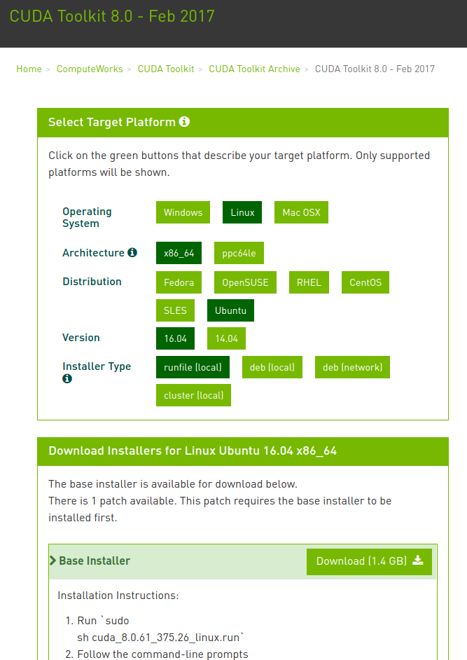
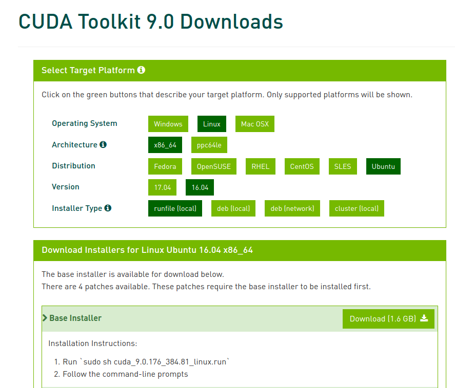

# 第十五章 异构计算， GPU和框架选型指南
深度学习训练和推理的过程中，会涉及到大量的向量(vector)，矩阵(matrix)和张量(tensor)操作，通常需要大量的浮点计算，包括高精度（在训练的时候）和低精度（在推理和部署的时候）。GPU， 作为一种通用可编程的加速器，最初设计是用来进行图形处理和渲染功能，但是从2007年开始，英伟达(NVIDIA)公司提出了第一个可编程通用计算平台（GPGPU），同时提出了CUDA框架，从此开启了GPU用于通用计算的新纪元。此后，不计其数的科研人员和开发者，对各种不同类型的算法用CUDA进行（部分）改写，从而达到几倍到数百倍的加速效果。尤其是在机器学习，特别是深度学习的浪潮来临后，GPU加速已经是各类工具实现的基本底层构架之一。本章里，会简单介绍GPU的基本架构，性能指标，框架选择等等和深度学习相关的内容。

## 15.1 什么是异构计算？

## 15.2 什么是GPGPU？

## 15.3 GPU架构简介

（架构内容）
### 15.3.1 为什么要使用GPU？
（和CPU的区别 + 图示）
### 15.3.2 CUDA 核心是什么？

### 15.3.3 新图灵架构里的tensor core对深度学习有什么作用？

### 15.3.4 GPU内存架构和应用性能的联系？

## 15.4 CUDA 框架

### 15.4.1 做CUDA编程难不难？

### 15.4.2 cuDNN

## 15.5 GPU硬件环境配置推荐

### 15.5.1 GPU主要性能指标
GPU的性能主要由以下三个参数构成：  

1. 计算能力。通常我们关心的是32位浮点计算能力。16位浮点训练也开始流行，如果只做预测的话也可以用8位整数。
2. 内存大小。当模型越大，或者训练时的批量越大时，所需要的GPU内存就越多。
3. 内存带宽。只有当内存带宽足够时才能充分发挥计算能力。

对于大部分用户来说，只要考虑计算能力就可以了。GPU内存尽量不小于4GB。但如果GPU要同时显示图形界面，那么推荐的内存大小至少为6GB。内存带宽通常相对固定，选择空间较小。

下图描绘了GTX 900和1000系列里各个型号的32位浮点计算能力和价格的对比。其中价格为Wikipedia的建议价格。

我们可以从图中读出两点信息：

1. 在同一个系列里面，价格和性能大体上成正比。但后发布的型号性价比更高，例如980 TI和1080 TI。
2. GTX 1000系列比900系列在性价比上高出2倍左右。

如果大家继续比较GTX较早的系列，也可以发现类似的规律。据此，我们推荐大家在能力范围内尽可能买较新的GPU。

### 15.5.2 购买建议
##### 首先给出一些总体的建议  
最好的GPU整体（小幅度）：Titan Xp
综合性价比高，但略贵：GTX 1080 Ti，GTX 1070，GTX 1080
性价比还不错且便宜：GTX 1060（6GB）

当使用数据集> 250GB：GTX Titan X（Maxwell） ，NVIDIA Titan X Pascal或NVIDIA Titan Xp

没有足够的钱：GTX 1060（6GB）

几乎没有钱，入门级：GTX 1050 Ti（4GB）

做Kaggle比赛：GTX 1060（6GB）适用于任何“正常”比赛，或GTX 1080 Ti用于“深度学习竞赛”

计算机视觉研究员：NVIDIA Titan Xp；不要买现在新出的Titan X（Pascal或Maxwell）

一名研究员人员：GTX 1080 Ti。在某些情况下，如自然语言处理，一个GTX 1070或GTX 1080已经足够了-检查你现在模型的内存需求

搭建一个GPU集群：这个有点复杂，另做探讨。

刚开始进行深度学习研究：从GTX 1060（6GB）开始。根据你下一步兴趣（入门，Kaggle比赛，研究，应用深度学习）等等，在进行选择。目前，GTX 1060更合适。

想尝试下深度学习，但没有过多要求：GTX 1050 ti（4或2GB）

目前独立GPU主要有AMD和Nvidia两家厂商。其中Nvidia在深度学习布局较早，对深度学习框架支持更好。因此，目前大家主要会选择Nvidia的GPU。

Nvidia有面向个人用户（例如GTX系列）和企业用户（例如Tesla系列）的两类GPU。这两类GPU的计算能力相当。然而，面向企业用户的GPU通常使用被动散热并增加了内存校验，从而更适合数据中心，并通常要比面向个人用户的GPU贵上10倍。

如果你是拥有100台机器以上的大公司用户，通常可以考虑针对企业用户的Nvidia Tesla系列。如果你是拥有10到100台机器的实验室和中小公司用户，预算充足的情况下可以考虑Nvidia DGX系列，否则可以考虑购买如Supermicro之类的性价比比较高的服务器，然后再购买安装GTX系列的GPU。

Nvidia一般每一两年发布一次新版本的GPU，例如2017年发布的是GTX 1000系列。每个系列中会有数个不同的型号，分别对应不同的性能。

## 15.6 软件环境搭建
深度学习其实就是指基于一套完整的软件系统来构建算法，训练模型。如何搭建一套完整的软件系统，比如操作系统的选择？安装环境中遇到的问题等等，本节做一个简单的总结。

### 15.6.1 操作系统选择？
针对硬件厂商来说，比如NVIDIA，对各个操作系统的支持都是比较好的 ，比如windows系列,linux系列，但是由于linux系统对专业技术人员比较友好，所以目前几乎所有的深度学习系统构建都是基于linux的，比较常用的系统如ubuuntu系列，centos系列等等。
在构建系统的时候，如何选择合适的操作系是一个刚刚入门深度学习的工作者面临的问题，在这里给出几点建议：  
（1）刚刚入门，熟悉windows系统，但是对linux和深度学习都不太熟，这个时候可以基于windows系列系统来做入门学习  
（2）简单了解linux的使用，不太懂深度学习相关知识，可以直接基于linux系统来搭建框架，跑一些开源的项目，慢慢深入研究学习  
（3）熟悉linux，不熟悉深度学习理论，毫无疑问，强烈推荐使用linux系统，安装软件简单，工作效率高
总之一句话，如果不熟悉linux，就先慢慢熟悉，最终还是要回归到linux系统来构建深度学习系统  

### 15.6.2 常用基础软件安装？
目前有众多深度学习框架可供大家使用，但是所有框架基本都有一个共同的特点，目前几乎都是基于nvidia的gpu来训练模型，要想更好的使用nvidia的gpu，cuda和cudnn就是必备的软件安装。
1，安装cuda
上文中有关于cuda的介绍，这里只是简单介绍基于linux系统安装cuda的具体步骤，可以根据自己的需要安装cuda8.0或者cuda9.0，这两种版本的安装步骤基本一致，这里以最常用的ubuntu 16.04 lts版本为例：
（1）官网下载，地址  
cuda8.0  https://developer.nvidia.com/cuda-80-ga2-download-archive  
cuda9.0  https://developer.nvidia.com/cuda-90-download-archive  
进入网址之后选择对应的系统版本即可，如下图所示：  
  

  

（2）命令行中进入到cuda所在的位置，授予运行权限：  
cuda8.0:   sudo chmod +x cuda_8.0.61_375.26_linux.run  
cuda9.0:    sudo chmod +x cuda_9.0.176_384.81_linux.run  

（3）执行命令安装cuda：  
cuda8.0:    sudo sh cuda_8.0.61_375.26_linux.run  
cuda9.0:    sudo sh cuda_9.0.176_384.81_linux.run  
之后命令之后下面就是安装步骤，cuda8.0和cuda9.0几乎一致：  
  1） 首先出现cuda软件的版权说明，可以直接按q键跳过阅读  
  

  2） Do you accept the previously read EULA?  
      accept/decline/quit:   **accept**

  3） Install NVIDIA Accelerated Graphics Driver for Linux-x86_64 384.81?  
      (y)es/(n)o/(q)uit:  **no**  
            
  4） Install the CUDA 9.0 Toolkit?  
      (y)es/(n)o/(q)uit:  **yes**  
      
  5） Enter Toolkit Location  
     [ default is /usr/local/cuda-9.0 ]:  直接按enter键即可

  6） Do you want to install a symbolic link at /usr/local/cuda?  
      (y)es/(n)o/(q)uit:  **yes**  

  7） Install the CUDA 9.0 Samples?  
     (y)es/(n)o/(q)uit:  **yes**  
     
以上步骤基本就是cuda的安装步骤。  

2，安装cudnn  
cudnn是nvidia的专门针对深度学习的加速库。。。  

### 15.6.3 本机安装还是使用docker？

### 15.6.4 GPU驱动问题

## 15.7 框架选择

### 15.7.1 主流框架比较

（一个大表格比较）

### 15.7.2 框架详细信息

* Tensorflow

* PyTorch
pytorch是Facebook于2017年才推出的深度学习框架，相对于其它框架，算是比较晚的了，但是这个同时也是优势，在设计的时候就会避免很多之前框架的问题，所以一经推出，就收到大家极大的欢迎
优点：接口简洁且规范，和python无缝结合，代码设计优秀且易懂，社区非常活跃，官方修复bug及时  
缺点:  目前模型在工业界部署相对其它框架稍有劣势，不过后续的pytorch1.0版本应该会有很大改善，和caffe2合并后，caffe2的优秀的模型部署能力可以弥补这个不足  
相关资源链接：  
（1）官网教程：https://pytorch.org/tutorials/  
（2）基于pytorch的开源项目汇总：https://github.com/bharathgs/Awesome-pytorch-list  
（3）

* Keras

* Sonnet

* Caffe

* Caffe2

* MxNet
MxNet是dmlc社区推出的深度学习框架，MXNet由学术界发起，包括数个顶尖大学的多个学科的研究人员的贡献，在2017年被亚马逊指定为官方框架。
mxnet的最知名的优点就是其对多GPU的支持和扩展性强，其优秀的性能使之在工业界占有一席之地，在amazon支持之后，其文档和开发进度明显好很多。除了高可扩展性，MXNet 还提供混合编程模型（命令式和声明式），同时兼容多种编程语言（包括 Python、C ++、R、Scala、Julia、Matlab 和 JavaScript）的代码，目前主要在推python高层接口gluon

优点：  
（1）多GPU支持好，扩展性强，支持多种编程语言接口，主要是由华人团队开发，中文社区活跃，中文文档资源和课程丰富
（2）针对两大热门领域推出gluoncv和gluonNLP模块，复现经典论文，达到State-of-the-art，接口设计简单，文档齐全，拿来就可以用
缺点:  
（1）现在mxnet官方社区主要在推gluon接口，接口稍有混乱，坑较多，入手门槛稍高
（2）偏小众，经典网络和项目的开源实现相对于tensorflow和pytorch还是比较少，很多还是需要自己手动实现  
相关资源链接：  
1，官方教程：http://mxnet.incubator.apache.org 提供有快速入门教程和详细文档说明  
2，中文教程：http://zh.gluon.ai/ 官方的中文教程，此课程有对应的中文版视频，主要由李沐大神讲课  
3，中文论坛：https://discuss.gluon.ai/ 官方发中文论坛，mxnet的主要作者都在这里，论坛比较活跃，可及时得到作者的回答  
4，基于mxnet的开源项目实现：https://github.com/chinakook/Awesome-MXNet  这里主要列举了mxnet在各个领域的项目的开源实现  

* CNTK

* PaddlePaddle

* 其他国内自主开发开源框架

### 15.7.3 哪些框架对于部署环境友好？

* Tensorflow Serving

* ONNX 标准

* TensorRT

* ONNPACK

* Clipper

### 15.7.4 移动平台的框架如何选择？

* Tensorflow Lite

* Caffe2

## 15.8 其他

### 15.8.1 多GPU环境的配置

* Tensorflow 

* PyTorch  

### 15.8.2 是不是可以分布式训练？

### 15.8.3 可以在SPARK环境里训练或者部署模型吗？

### 15.8.4 怎么进一步优化性能？

* TVM

* nGraph

### 15.8.5 TPU和GPU的区别？

### 15.8.6 未来量子计算对于深度学习等AI技术的影像？

-------

## 15.1 GPU购买指南

深度学习训练通常需要大量的计算资源。GPU目前是深度学习最常使用的计算加速硬件。相对于CPU来说，GPU更便宜且计算更加密集。一方面，相同计算能力的GPU的价格一般是CPU价格的十分之一。另一方面，一台服务器通常可以搭载8块或者16块GPU。因此，GPU数量可以看作是衡量一台服务器的深度学习计算能力的一个标准。

### 15.1.1 如何选择GPU  

### 15.1.2 GPU的主要性能指标

在选择GPU时，首先要考虑的第一个GPU性能问题是什么呢：是否为cuda核心？时钟速度多大？内存大小多少？
这些都不是，对于深度学习性能而言，最重要的特征是内存带宽（memory bandwidth）。
简而言之：GPU针对内存带宽进行了优化，但同时牺牲了内存访问时间（延迟）。CPU的设计恰恰相反：如果涉及少量内存（例如几个数字相乘（3 * 6 * 9）），CPU可以快速计算，但是对于大量内存（如矩阵乘法（A * B * C）则很慢。由于内存带宽的限制，当涉及大量内存的问题时，GPU快速计算的优势往往会受到限制。当然，GPU和CPU之间还有更复杂的区别，关于为何GPU如此适用于处理深度学习问题，另做探讨。

所以如果你想购买一个快速的GPU，首先要关注的是GPU的带宽（bandwidth）。

### 15.1.3 整机配置

通常，我们主要用GPU做深度学习训练。因此，不需要购买高端的CPU。至于整机配置，尽量参考网上推荐的中高档的配置就好。不过，考虑到GPU的功耗、散热和体积，我们在整机配置上也需要考虑以下三个额外因素。

1. 机箱体积。GPU尺寸较大，通常考虑较大且自带风扇的机箱。
2. 电源。购买GPU时需要查一下GPU的功耗，例如50W到300W不等。购买电源要确保功率足够，且不会过载机房的供电。
3. 主板的PCIe卡槽。推荐使用PCIe 3.0 16x来保证充足的GPU到主内存的带宽。如果搭载多块GPU，要仔细阅读主板说明，以确保多块GPU一起使用时仍然是16x带宽。注意，有些主板搭载4块GPU时会降到8x甚至4x带宽。

### 15.1.4 小结

* 在预算范围之内，尽可能买较新的GPU。
* 整机配置需要考虑到GPU的功耗、散热和体积。

## 15.2 框架选型

目前常用的框架有tensorflow,keras,pytorch,mxnet等等，各个框架的优缺点在此简单介绍：

### 15.2.1 常用框架简介

1，tensorflow：  
tensorflow由于有google的强大背书，加上其优秀的分布式设计，丰富的教程资源和论坛，工业部署方便，基本很多人都是从tensorflow入门的
优点：google的强大背书，分布式训练，教程资源丰富，常见问题基本都可以在互联网中找到解决办法，工业部署方便  
缺点: 接口混乱，官方文档不够简洁，清晰，

2，keras:
keras是一种高层编程接口，其可以选择不同的后端，比如tensorflow，therao等等
优点：  接口简洁，上手快，文档好，资源多
缺点:   封装的太好了导致不理解其技术细节

3,pytorch:  

4,caffe2:  
caffe2是在caffe之后的第二代版本，同属于Facebook。。。
优点：支持模型的全平台部署，。。。。
缺点:使用人数相对较少，资源较少，和pytorch合并后应该会更受欢迎

5,mxnet
mxnet是dmlc社区推出的深度学习框架，在2017年被亚马逊指定为官方框架
优点：支持多种语言，代码设计优秀，省显存，华人团队开发，中文社区活跃，官方复现经典论文推出gluoncv和gluonNLP模块，非常方便，拿来就可以用。
缺点:  现在mxnet官方社区主要在推gluon接口，接口稍有混乱，坑较多，入手门槛稍高

6，caffe：  
目前很多做深度学习比较早的大厂基本都是在用caffe，因为在2013-2015年基本就是caffe的天下，并且caffe的代码设计很优秀，基本所有代码都被翻了很多遍了，被各种分析，大厂基本都是魔改caffe，基于caffe来进行二次开发，所在目前在很多大厂还是在使用caffe  
优点：资源丰富，代码容易理解，部署方便  
缺点：入门门槛高，文档较少  

###  15.2.1 框架选型总结
1，新手入门，首推pytorch，上手快，资源丰富,官方文档写的非常好(https://pytorch.org/tutorials/) 
2，目前工业部署，tensorflow是首选,资源丰富，并且在分布式训练这一块基本一家独大  
3，mxnet的gluon接口有比较丰富的中文资源（教程：zh.gluon.ai，论坛：discuss.gluon.ai）,gluoncv模块（https://gluon-cv.mxnet.io）,gluonNLP模块（https://gluon-nlp.mxnet.io）  

##  15.3 模型部署
我们一般都是通过python或者其他语言来编码训练模型，然后基于后端来进行部署
一般的框架都有自身的部署框架，比如tensorflow，pytorch，caffe2，mxnet等等
有一些框架是专门做推理部署使用的，比如  
（1）tensorRT  

 (2)TVM  
 
 (3)ONNX  
 

