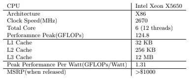
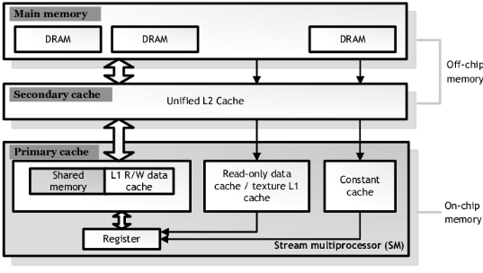
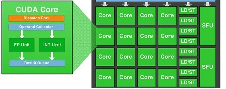
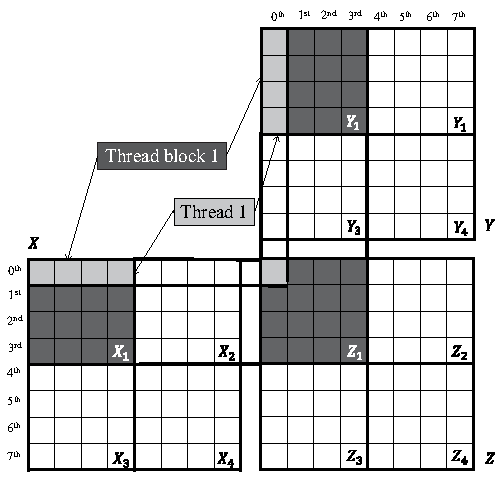

[TOC]

# 第十五章 异构计算， GPU和框架选型指南

深度学习训练和推理的过程中，会涉及到大量的向量(vector)，矩阵(matrix)和张量(tensor)操作，通常需要大量的浮点计算，包括高精度（在训练的时候）和低精度（在推理和部署的时候）。GPU， 作为一种通用可编程的加速器，最初设计是用来进行图形处理和渲染功能，但是从2007年开始，英伟达(NVIDIA)公司提出了第一个可编程通用计算平台（GPGPU），同时提出了CUDA框架，从此开启了GPU用于通用计算的新纪元。此后，不计其数的科研人员和开发者，对各种不同类型的算法用CUDA进行（部分）改写，从而达到几倍到数百倍的加速效果。尤其是在机器学习，特别是深度学习的浪潮来临后，GPU加速已经是各类工具实现的基本底层构架之一。本章里，会简单介绍GPU的基本架构，性能指标，框架选择等等和深度学习相关的内容。

## 15.1 什么是异构计算？

异构计算是基于一个更加朴素的概念，”异构现象“，也就是不同计算平台之间，由于硬件结构（包括计算核心和内存），指令集和底层软件实现等方面的不同而有着不同的特性。异构计算就是使用结合了两个或者多个不同的计算平台，并进行协同运算。比如，比较常见的，在深度学习和机器学习中已经比较成熟的架构：CPU和GPU的异构计算;此外还有比较新的Google推出的协处理器（TPU），根据目的而定制的ASIC，可编程的FPGA等也都是现在在异构计算中使用比较多的协处理器。而，本章中会着重介绍和深度学习共同繁荣的图形加算器，也就是常说的GPU。

## 15.2 什么是GPGPU？
GPU,就如名字所包含的内容，原本开发的目的是为了进行计算机图形渲染，而减少对于CPU的负载。由于图像的原始特性，也就是像素间的独立性，所以GPU在设计的时候就遵从了“单指令流多数据流（SIMD）”架构，使得同一个指令（比如图像的某种变换），可以同时在多一个像素点上进行计算，从而得到比较大的吞吐量，才能使得计算机可以实时渲染比较复杂的2D/3D场景。在最初的应用场景里，GPU并不是作为一种通用计算平台出现的，直到2007年左右，一家伟大的公司—NVIDIA将GPU带到通用计算的世界里，使得其可以在相对比较友好的编程环境（CUDA/OpenCL）里加速通用程序成了可能。从此之后，GPU通用计算(General Purpose Computing on GPU)，也就是GPGPU就成了学界和工业界都频繁使用的技术，在深度学习爆发的年代里，GPGPU成了推动这股浪潮非常重要的力量。

## 15.3 GPU架构简介

GPU，图形显示芯片作为不同于CPU的设计逻辑和应用场景，有着非常不同的架构，理解 GPU 和 CPU 之间区别的一种简单方式是比较它们如何处理任务。CPU 由专为顺序串行处理而优化的几个核心组成，而 GPU 则拥有一个由数以千计的更小、更高效的核心（专为同时处理多重任务而设计）组成的大规模并行计算架构。本部分将简单介绍GPU究竟是如何架构，其中的计算核心有哪些特性。

### 15.3.1 如何通俗理解GPU的架构？

首先，下图简单地展示了几个GPU不同于CPU的特性：
* 计算核心： 图中的CPU,i7-5960X，Intel的第五代Broadwell架构，其中包括了8个CPU核心(支持16线程)，也就是理论上可以有16个不同的运算同时进行。除了8个核心计算单元，大部分的芯片面积是被3级缓存，内存和控制电路占据了。同样的，来自NVIDIA的GTX980GPU，在差不多的芯片面积上，大部分是计算单元，16个SM，也就是流处理单元，每个流处理单元中包含着128个CUDA计算核心，所以总共来说，有2048个GPU运算单元，相应地这颗GPU理论上可以在一个时钟周期内可以进行2048次单精度运算。

* 计算核心频率：时钟频率，代表每一秒中内能进行同步脉冲次数，也是从一个侧面反映一个计算元件的工作速度。下图中对比了个别早期产品，比如Intel的X5650和几款NVIDIA的GPU。可以看出核心频率而言，CPU要远高于GPU。对于CPU而言，在不考虑能源消耗和制程工艺限制的情况下，追求更高的主频。但在GPU的设计中，采用了多核心设计，即使是提高一些频率，其实对于总体性能影像不会特别大。当然，其中还有能耗方面的考虑，避免发热过高，也进行了权衡。还有一个可能的原因是，在一个流处理器中的每个核心（CUDA核心）的运行共享非常有限的缓存和寄存器，由于共享内存也是有性能极限的，所以即使每个GPU核心频率提高，如果被缓存等拖累也是无法展现出高性能的。

* 内存架构：GPU的多层内存架构包括全局内存（也就是通常意义上大部分比较关注的内存，在若干到16GB之间，截至到当前最新），2级缓存，和芯片上的存储（包括寄存器，和1级缓存共用的共享内存，只读/纹理缓存和常量缓存）。通常来说，最高速的共享内存/缓存和寄存器都是非常有限的，比如在Tesla的K20中，只有48K的缓存可以作为共享内存或者1级缓存使用，所以在很多用GPU加速算法实现的过程中，有效地利用这些高速缓存是使得性能提升的非常重要的方面。

### 15.3.2 CUDA 核心是什么？
上面提到在一个GPU芯片里，会很几千个CUDA核心，被分布在多个流处理单元（SM）中，比如上面提到早期的GTX980中的16个SM中各包含了128个CUDA核心。如下图所示，作为GPU架构中的最小单元，其实它的设计和CPU有着非常类似的结构，其中包括了一个浮点运算单元和整型运算单元，和控制单元。同一个流处理器中，所有的CUDA核心将同步执行同一个指令，但是作用于不同的数据点上。

一般来说，更加多的CUDA核心意味着有更多的并行执行单元，所以也就可以片面地认为是有更加高的性能。但是，其实这个也是取决于很多方面，最重要的是算法在并行实现的时候有没有高效地调度和内存的使用优化。在现在我们使用的大部分GPU加速的深度学习框架里，包括Tensorflow，PyTorch等都是依赖于底层的GPU的矩阵加速代码的实现。为此Nvidia公司也是制定和实现了统一的接口，比如cuDNN，方便上层框架更好的利用GPU的性能。

### 15.3.3 为什么要使用GPU？

对于并行计算来说，可以非常粗略地分为：
* 并行指令： 也就是多个指令可以同时分配到不同的计算核心上同时进行，而他们的操作是不同的，并且他们之间相互独立，不需要额外的同步和信息共享。
* 并行数据流： 如果数据本身存在的天然的独立性，比如图像中的每一个像素，那么在对这个图像做处理的过程中，同一个指令可以同时作用于每一个像素。在这种情况下，这个对于完整图像的操作可以并行化。理论上，如果内存不是问题，并且计算单元的数量大于整个图像中总像素点的话，这个操作可以在一个时钟周期内完成。

GPU整体的架构而言，某种意义上是同时支持以上两种并行模式。在同一个流处理器中，采用了“单一指令并行数据流的模式”，而在多个流处理器中，同一时间可以派发不同的指令。从这一点出发，GPU芯片算是一个非常灵活的架构。一个芯片中，流处理器的个数和其中包含的CUDA核心的数量也是一种面向应用设计时候找到的一个平衡点。

基于深度学习中大部分的操作的天然并行性（大量的矩阵操作），GPU在当下还是一种非常适合的计算平台。一个非常典型的例子就是常见的矩阵相乘（如下图），要计算Z = X×Y，通过并行计算，X和Y中的行向量和列向量的逐元素相乘就可以同时进行，只要得到结果后再进行累加，而且累加的过程中也是可以进行并行化，使得效率有非常大的提高。Nvidia也是制定和开发了一套底层类库，CUBlas方便开发者。我们熟悉的几大框架(e.g. Tensorflow, PyTorch等)也是遵循和使用了这些并行类库，所以才使得训练和部署性能有了非常多的提高。

### 15.3.4 深度学习中的GPU应用
深度学习在最近几年内出现的井喷现象背后也是GPU的存在和发展作为坚实的推动力量。

哪些场景使用GPU
在涉及大型矩阵运算的时候使用GPU可以显著加速处理速度，由于GPU架构的独特设计，针对矩阵运算可以实现高速并行计算，极大提高计算速度。
一般在高性能计算，机器学习，深度学习，图像渲染等等场景中会比较多的使用矩阵运算，使用GPU可以显著加快处理速度。
在一般的深度学习训练中，通常来说使用GPU比使用CPU都有10倍以上的速度提升，所以几乎所有深度学习的研究者几乎都是在使用GPU进行训练。

ImageNet的例子

### 15.3.5 新图灵架构里的tensor core对深度学习有什么作用？
我们知道在深度学习中,矩阵-矩阵乘法运算（BLAS GEMM）是神经网络训练和推理的核心，并且矩阵乘法运算占据了所有计算量的大部分，而Tensor core就是为了解决这个问题而推出的，它的出现极大的提高了计算效率，大大加速了深度学习的计算速度，对深度学习的发展具有极大意义。

Tensor Core是Volta架构最重磅特性，是专门针对Deep Learning应用而设计的专用ASIC单元，实际上是一种矩阵乘累加的计算单元。（矩阵乘累加计算在Deep Learning网络层算法中，比如卷积层、全连接层等是最重要、最耗时的一部分。）Tensor Core可以在一个时钟周期内实现两个4×4矩阵乘法以及与另一个4×4矩阵加法。整个计算的个数，就是在一个时钟周期内可以实现64次乘和64次加。

所以Tensor Core就是为了矩阵乘法的加速而设计的，使用具有Tensor Core的GPU来进行深度学习的训练会极大的提高训练速度。

## 15.4 CUDA 框架

### 15.4.1 做CUDA编程难不难？

### 15.4.2 cuDNN

## 15.5 GPU硬件环境配置推荐

### 15.5.1 GPU主要性能指标
GPU的性能主要由以下三个参数构成：

1. 计算能力。通常我们关心的是32位浮点计算能力。16位浮点训练也开始流行，如果只做预测的话也可以用8位整数。
2. 显存大小。当模型越大，或者训练时的批量越大时，所需要的GPU显存就越多。
3. 显存带宽。只有当显存带宽足够时才能充分发挥计算能力。

对于大部分用户来说，只要考虑计算能力就可以了。GPU显存尽量不小于4GB。但如果GPU要同时显示图形界面，那么推荐的显存大小至少为6GB。显存带宽通常相对固定，选择空间较小。

下图描绘了GTX 900和1000系列里各个型号的32位浮点计算能力和价格的对比。其中价格为Wikipedia的建议价格。

我们可以从图中读出两点信息：

1. 在同一个系列里面，价格和性能大体上成正比。但后发布的型号性价比更高，例如980 Ti和1080 Ti。
2. GTX 1000系列比900系列在性价比上高出2倍左右。

如果大家继续比较GTX较早的系列，也可以发现类似的规律。据此，我们推荐大家在能力范围内尽可能买较新的GPU。

### 15.5.2 购买建议
##### 首先给出一些总体的建议
最好的GPU整体（小幅度）：Titan Xp
综合性价比高，但略贵：GTX 1080 Ti，GTX 1070，GTX 1080
性价比还不错且便宜：GTX 1060（6GB）

当使用数据集> 250GB：GTX Titan X（Maxwell） ，NVIDIA Titan X Pascal或NVIDIA Titan Xp

没有足够的钱：GTX 1060（6GB）

几乎没有钱，入门级：GTX 1050 Ti（4GB）

做Kaggle比赛：GTX 1060（6GB）适用于任何“正常”比赛，或GTX 1080 Ti用于“深度学习竞赛”

计算机视觉研究员：NVIDIA Titan Xp；不要买现在新出的Titan X（Pascal或Maxwell）

一名研究员人员：GTX 1080 Ti。在某些情况下，如自然语言处理，一个GTX 1070或GTX 1080已经足够了-检查你现在模型的内存需求

搭建一个GPU集群：这个有点复杂，另做探讨。

刚开始进行深度学习研究：从GTX 1060（6GB）开始。根据你下一步兴趣（入门，Kaggle比赛，研究，应用深度学习）等等，在进行选择。目前，GTX 1060更合适。

想尝试下深度学习，但没有过多要求：GTX 1050 Ti（4或2GB）

目前独立GPU主要有AMD和NVIDIA两家厂商。其中NVIDIA在深度学习布局较早，对深度学习框架支持更好。因此，目前大家主要会选择NVIDIA的GPU。

NVIDIA有面向个人用户（例如GTX系列）和企业用户（例如Tesla系列）的两类GPU。这两类GPU的计算能力相当。然而，面向企业用户的GPU通常使用被动散热并增加了内存校验，从而更适合数据中心，并通常要比面向个人用户的GPU贵上10倍。

如果你是拥有100台机器以上的大公司用户，通常可以考虑针对企业用户的NVIDIA Tesla系列。如果你是拥有10到100台机器的实验室和中小公司用户，预算充足的情况下可以考虑NVIDIA DGX系列，否则可以考虑购买如Supermicro之类的性价比比较高的服务器，然后再购买安装GTX系列的GPU。

NVIDIA一般每一两年发布一次新版本的GPU，例如2016年发布的是GTX 1000系列。每个系列中会有数个不同的型号，分别对应不同的性能。

## 15.6 软件环境搭建
深度学习其实就是指基于一套完整的软件系统来构建算法，训练模型。如何搭建一套完整的软件系统，比如操作系统的选择？安装环境中遇到的问题等等，本节做一个简单的总结。

### 15.6.1 操作系统选择？
针对硬件厂商来说，比如NVIDIA，对各个操作系统的支持都是比较好的 ，比如Windows系列,Linux系列，但是由于Linux系统对专业技术人员比较友好，所以目前几乎所有的深度学习系统构建都是基于Linux的，比较常用的系统如Ubuntu系列，CentOS系列等等。
在构建系统的时候，如何选择合适的操作系是一个刚刚入门深度学习的工作者面临的问题，在这里给出几点建议：
（1）刚刚入门，熟悉Windows系统，但是对Linux和深度学习都不太熟，这个时候可以基于windows系列系统来做入门学习
（2）简单了解Linux的使用，不太懂深度学习相关知识，可以直接基于Linux系统来搭建框架，跑一些开源的项目，慢慢深入研究学习
（3）熟悉Linux，不熟悉深度学习理论，毫无疑问，强烈推荐使用Linux系统，安装软件简单，工作效率高
总之一句话，如果不熟悉Linux，就先慢慢熟悉，最终还是要回归到Linux系统来构建深度学习系统

### 15.6.2 常用基础软件安装？
目前有众多深度学习框架可供大家使用，但是所有框架基本都有一个共同的特点，目前几乎都是基于Nvidia的GPU来训练模型，要想更好的使用NVIDIA的GPU，cuda和cudnn就是必备的软件安装。  
1. **安装cuda**  
上文中有关于cuda的介绍，这里只是简单介绍基于Linux系统安装cuda的具体步骤，可以根据自己的需要安装cuda8.0或者cuda9.0，这两种版本的安装步骤基本一致，这里以最常用的ubuntu 16.04 lts版本为例：  
   1. 官网下载，地址  
    cuda8.0https://developer.nvidia.com/cuda-80-ga2-download-archive  
    cuda9.0https://developer.nvidia.com/cuda-90-download-archive  
    进入网址之后选择对应的系统版本即可，如下图所示：  
    

      

   2. 命令行中进入到cuda所在的位置，授予运行权限：    
    cuda8.0: sudo chmod +x cuda_8.0.61_375.26_linux.run  
    cuda9.0:sudo chmod +x cuda_9.0.176_384.81_linux.run

   3. 执行命令安装cuda：  
    cuda8.0:sudo sh cuda_8.0.61_375.26_linux.run  
    cuda9.0:sudo sh cuda_9.0.176_384.81_linux.run  
    之后命令之后下面就是安装步骤，cuda8.0和cuda9.0几乎一致：  
    * 首先出现cuda软件的版权说明，可以直接按q键跳过阅读  

    * Do you accept the previously read EULA?
     ​accept/decline/quit: **accept**

    * Install NVIDIA Accelerated Graphics Driver for Linux-x86_64 384.81?
     ​(y)es/(n)o/(q)uit:**no**

    * Install the CUDA 9.0 Toolkit?
     ​(y)es/(n)o/(q)uit:**yes**
  
    * Enter Toolkit Location
     ​ [ default is /usr/local/cuda-9.0 ]:直接按enter键即可

    *  Do you want to install a symbolic link at /usr/local/cuda?
     ​(y)es/(n)o/(q)uit:**yes**

    * Install the CUDA 9.0 Samples?
     ​ (y)es/(n)o/(q)uit:**yes**

    以上步骤基本就是cuda的安装步骤。

2. **安装cudnn**  
   cudnn是Nvidia的专门针对深度学习的加速库。。。

### 15.6.3 本机安装还是使用docker？

### 15.6.4 GPU驱动问题

## 15.7 框架选择

### 15.7.1 主流框架比较

（一个大表格比较）

### 15.7.2 框架详细信息

* Tensorflow  
Tensorflow是Google于2015年开源的基于数据流编程的深度学习框架，得益于Google强大的技术实力和品牌背书，目前Tensorflow发展迅猛，其用户量远远超过其它框架用户。  
优点：  
   1. 由谷歌开发、维护，因此可以保障支持、开发的持续性
   2. 巨大、活跃的社区
   3. 网络训练的低级、高级接口
   4. 「TensorBoard」是一款强大的可视化套件，旨在跟踪网络拓扑和性能，使调试更加简单
   5. TensorFlow 不仅支持深度学习，还有支持强化学习和其他算法的工具
缺点：  
   1. 计算图是纯 Python 的，因此速度较慢
   2. 图构造是静态的，意味着图必须先被「编译」再运行

* PyTorch
pytorch是Facebook于2017年才推出的深度学习框架，相对于其它框架，算是比较晚的了，但是这个同时也是优势，在设计的时候就会避免很多之前框架的问题，所以一经推出，就收到大家极大的欢迎
优点：  
   1. 接口简洁且规范，文档齐全，和python无缝结合，
   2. 社区非常活跃，开源实现较多
   3. 提供动态计算图（意味着图是在运行时生成的），允许你处理可变长度的输入和输出，例如，在使用 RNN 时非常有用
   4. 易于编写自己的图层类型，易于在 GPU 上运行
   5. 「TensorBoard」缺少一些关键功能时，「Losswise」可以作为 Pytorch 的替代品

缺点:  
   1. 模型部署相对其它框架稍有劣势，不过后续的pytorch1.0版本应该会有很大改善，和caffe2合并后，caffe2的优秀的模型部署能力可以弥补这个不足
   2. 
   3. 

相关资源链接：  
   1. 官网教程：https://pytorch.org/tutorials/
   2. 基于pytorch的开源项目汇总：https://github.com/bharathgs/Awesome-pytorch-list
   3.

* Keras
Keras 是一个更高级、对用户最友好的 API，具有可配置的后端，由 Google Brain 团队成员 Francis Chollet 编写和维护
优点：  
   1. 提供高级 API 来构建深度学习模型，使其易于阅读和使用 
   2. 编写规范的文档
   3. 大型、活跃的社区
   4. 位于其他深度学习库（如 Theano 和 TensorFlow，可配置）之上
   5. 使用面向对象的设计，因此所有内容都被视为对象（如网络层、参数、优化器等）。所有模型参数都可以作为对象属性进行访问
缺点：  
   1. 由于用途非常普遍，所以在性能方面比较欠缺
   2. 与 TensorFlow 后端配合使用时会出现性能问题（因为并未针对其进行优化），但与 Theano 后端配合使用时效果良好
   3. 不像 TensorFlow 或 PyTorch 那样灵活

* Sonnet

* Caffe  
caffe是第一个主流产品级深度学习库，于 2014 年由 UC Berkeley 发布开源
优点：  
   1. 简单网络结构无需编写代码，可快速实现
   2. 漂亮的 Matlab 和 Python 接口
   3. 完全由c++编程实现，部署方便

缺点：  
   1. 不灵活。在 Caffe 中，每个节点被当做一个层，因此如果你想要一种新的层类型，你需要定义完整的前向、后向和梯度更新过程。这些层是网络的构建模块，你需要在无穷无尽的列表中进行选择。（相反，在 TensorFlow 中，每个节点被当做一个张量运算例如矩阵相加、相乘或卷积。你可以轻易地定义一个层作为这些运算的组合。因此 TensorFlow 的构建模块更小巧，允许更灵活的模块化。）
   2. 需要大量的非必要冗长代码。如果你希望同时支持 CPU 和 GPU，你需要为每一个实现额外的函数。你还需要使用普通的文本编辑器来定义你的模型。真令人头疼！几乎每个人都希望程序化地定义模型，因为这有利于不同组件之间的模块化。有趣的是，Caffe 的主要架构师现在在 TensorFlow 团队工作
   3. 专一性。仅定位在计算机视觉（但做得很不错）  
   4. 不是以 Python 编写！如果你希望引入新的变动，你需要在 C++和 CUDA 上编程（对于更小的变动，你可以使用它的 Python 和 Matlab 接口）
   5. 糟糕的文档
   6. 安装比较困难！有大量的依赖包

* Caffe2

* MxNet
MxNet是dmlc社区推出的深度学习框架，MXNet由学术界发起，包括数个顶尖大学的多个学科的研究人员的贡献，在2017年被亚马逊指定为官方框架。
mxnet的最知名的优点就是其对多GPU的支持和扩展性强，其优秀的性能使之在工业界占有一席之地，在amazon支持之后，其文档和开发进度明显好很多。除了高可扩展性，MXNet 还提供混合编程模型（命令式和声明式），同时兼容多种编程语言（包括 Python、C ++、R、Scala、Julia、Matlab 和 JavaScript）的代码，目前主要在推python高层接口gluon

优点：  
   1. 多GPU支持好，扩展性强，支持多种编程语言接口，主要是由华人团队开发，中文社区活跃，中文文档资源和课程丰富
   2. 针对两大热门领域推出gluoncv和gluonNLP模块，复现经典论文，达到State-of-the-art，接口设计简单，文档齐全，拿来就可以用
缺点:  
   1. 现在mxnet官方社区主要在推gluon接口，接口稍有混乱，坑较多，入手门槛稍高
   2. 偏小众，经典网络和项目的开源实现相对于tensorflow和pytorch还是比较少，很多还是需要自己手动实现
相关资源链接：  
   1. 官方教程：http://mxnet.incubator.apache.org 提供有快速入门教程和详细文档说明
   2. 中文教程：http://zh.gluon.ai/ 官方的中文教程，此课程有对应的中文版视频，主要由李沐大神讲课
   3. 中文论坛：https://discuss.gluon.ai/ 官方发中文论坛，mxnet的主要作者都在这里，论坛比较活跃，可及时得到作者的回答
   4. 基于mxnet的开源项目实现：https://github.com/chinakook/Awesome-MXNet这里主要列举了mxnet在各个领域的项目的开源实现

* CNTK

* PaddlePaddle

* 其他国内自主开发开源框架

### 15.7.3 哪些框架对于部署环境友好？

* Tensorflow Serving

* ONNX 标准

* TensorRT

* ONNPACK

* Clipper

### 15.7.4 移动平台的框架如何选择？

* Tensorflow Lite

* Caffe2

## 15.8 其他

### 15.8.1 多GPU环境的配置

* Tensorflow

* PyTorch

### 15.8.2 是不是可以分布式训练？

### 15.8.3 可以在SPARK环境里训练或者部署模型吗？

### 15.8.4 怎么进一步优化性能？

* TVM

* nGraph

### 15.8.5 TPU和GPU的区别？

### 15.8.6 未来量子计算对于深度学习等AI技术的影响？

-------

## 15.1 GPU购买指南

深度学习训练通常需要大量的计算资源。GPU目前是深度学习最常使用的计算加速硬件。相对于CPU来说，GPU更便宜且计算更加密集。一方面，相同计算能力的GPU的价格一般是CPU价格的十分之一。另一方面，一台服务器通常可以搭载8块或者16块GPU。因此，GPU数量可以看作是衡量一台服务器的深度学习计算能力的一个标准。

### 15.1.1 如何选择GPU

### 15.1.2 GPU的主要性能指标

在选择GPU时，首先要考虑的第一个GPU性能问题是什么呢：是否为cuda核心？时钟速度多大？内存大小多少？
这些都不是，对于深度学习性能而言，最重要的特征是内存带宽（memory bandwidth）。
简而言之：GPU针对内存带宽进行了优化，但同时牺牲了内存访问时间（延迟）。CPU的设计恰恰相反：如果涉及少量内存（例如几个数字相乘（3 * 6 * 9）），CPU可以快速计算，但是对于大量内存（如矩阵乘法（A * B * C）则很慢。由于内存带宽的限制，当涉及大量内存的问题时，GPU快速计算的优势往往会受到限制。当然，GPU和CPU之间还有更复杂的区别，关于为何GPU如此适用于处理深度学习问题，另做探讨。

所以如果你想购买一个快速的GPU，首先要关注的是GPU的带宽（bandwidth）。

### 15.1.3 整机配置

通常，我们主要用GPU做深度学习训练。因此，不需要购买高端的CPU。至于整机配置，尽量参考网上推荐的中高档的配置就好。不过，考虑到GPU的功耗、散热和体积，我们在整机配置上也需要考虑以下三个额外因素。

1. 机箱体积。GPU尺寸较大，通常考虑较大且自带风扇的机箱。
2. 电源。购买GPU时需要查一下GPU的功耗，例如50W到300W不等。购买电源要确保功率足够，且不会过载机房的供电。
3. 主板的PCIe卡槽。推荐使用PCIe 3.0 16x来保证充足的GPU到主内存的带宽。如果搭载多块GPU，要仔细阅读主板说明，以确保多块GPU一起使用时仍然是16x带宽。注意，有些主板搭载4块GPU时会降到8x甚至4x带宽。

### 15.1.4 小结

* 在预算范围之内，尽可能买较新的GPU。
* 整机配置需要考虑到GPU的功耗、散热和体积。

## 15.2 框架选型

目前常用的框架有tensorflow,keras,pytorch,mxnet等等，各个框架的优缺点在此简单介绍：

### 15.2.1 常用框架简介

1，tensorflow：
tensorflow由于有google的强大背书，加上其优秀的分布式设计，丰富的教程资源和论坛，工业部署方便，基本很多人都是从tensorflow入门的
优点：google的强大背书，分布式训练，教程资源丰富，常见问题基本都可以在互联网中找到解决办法，工业部署方便
缺点: 接口混乱，官方文档不够简洁，清晰，

2，keras:
keras是一种高层编程接口，其可以选择不同的后端，比如tensorflow，therao等等
优点：接口简洁，上手快，文档好，资源多
缺点: 封装的太好了导致不理解其技术细节

3,pytorch:

4,caffe2:
caffe2是在caffe之后的第二代版本，同属于Facebook。。。
优点：支持模型的全平台部署，。。。。
缺点:使用人数相对较少，资源较少，和pytorch合并后应该会更受欢迎

5,mxnet
mxnet是dmlc社区推出的深度学习框架，在2017年被亚马逊指定为官方框架
优点：支持多种语言，代码设计优秀，省显存，华人团队开发，中文社区活跃，官方复现经典论文推出gluoncv和gluonNLP模块，非常方便，拿来就可以用。
缺点:现在mxnet官方社区主要在推gluon接口，接口稍有混乱，坑较多，入手门槛稍高

6，caffe：
目前很多做深度学习比较早的大厂基本都是在用caffe，因为在2013-2015年基本就是caffe的天下，并且caffe的代码设计很优秀，基本所有代码都被翻了很多遍了，被各种分析，大厂基本都是魔改caffe，基于caffe来进行二次开发，所在目前在很多大厂还是在使用caffe
优点：资源丰富，代码容易理解，部署方便
缺点：入门门槛高，文档较少

###15.2.1 框架选型总结
1，新手入门，首推pytorch，上手快，资源丰富,官方文档写的非常好(https://pytorch.org/tutorials/)
2，目前工业部署，tensorflow是首选,资源丰富，并且在分布式训练这一块基本一家独大
3，mxnet的gluon接口有比较丰富的中文资源（教程：zh.gluon.ai，论坛：discuss.gluon.ai）,gluoncv模块（https://gluon-cv.mxnet.io）,gluonNLP模块（https://gluon-nlp.mxnet.io）

##15.3 模型部署
我们一般都是通过python或者其他语言来编码训练模型，然后基于后端来进行部署
一般的框架都有自身的部署框架，比如tensorflow，pytorch，caffe2，mxnet等等
有一些框架是专门做推理部署使用的，比如
（1）tensorRT

 (2)TVM

 (3)ONNX
