[TOC]


# 第十八章  后端架构选型及应用场景

    Markdown Revision 1;
    Date: 2018/11/11
    Editor: 梁志成
    Contact: superzhicheng@foxmail.com

## 18.1 为什么需要分布式计算？

&emsp;&emsp;在这个数据爆炸的时代，产生的数据量不断地在攀升，从GB,TB,PB,ZB.挖掘其中数据的价值也是企业在不断地追求的终极目标。但是要想对海量的数据进行挖掘，首先要考虑的就是海量数据的存储问题，比如Tb量级的数据。

&emsp;&emsp;谈到数据的存储，则不得不说的是磁盘的数据读写速度问题。早在上个世纪90年代初期，普通硬盘的可以存储的容量大概是1G左右，硬盘的读取速度大概为4.4MB/s.读取一张硬盘大概需要5分钟时间，但是如今硬盘的容量都在1TB左右了,相比扩展了近千倍。但是硬盘的读取速度大概是100MB/s。读完一个硬盘所需要的时间大概是2.5个小时。所以如果是基于TB级别的数据进行分析的话，光硬盘读取完数据都要好几天了，更谈不上计算分析了。那么该如何处理大数据的存储，计算分析呢？

&emsp;&emsp;一个很简单的减少数据读写时间的方法就是同时从多个硬盘上读写数据，比如，如果我们有100个硬盘，每个硬盘存储1%的数据 ，并行读取，那么不到两分钟就可以完成之前需要2.5小时的数据读写任务了。这就是大数据中的分布式存储的模型。当然实现分布式存储还需要解决很多问题，比如硬件故障的问题，使用多台主机进行分布式存储时，若主机故障，会出现数据丢失的问题，所以有了副本机制：系统中保存数据的副本。一旦有系统发生故障，就可以使用另外的副本进行替换（著名的RAID冗余磁盘阵列就是按这个原理实现的）。其次比如一个很大的文件如何进行拆分存储，读取拆分以后的文件如何进行校验都是要考虑的问题。比如我们使用Hadoop中的HDFS也面临这个问题，只是框架给我们实现了这些问题的解决办法，开发中开发者不用考虑这些问题，底层框架已经实现了封装。

&emsp;&emsp;同样假如有一个10TB的文件，我们要统计其中某个关键字的出现次数，传统的做法是遍历整个文件，然后统计出关键字的出现次数，这样效率会特别特别低。基于分布式存储以后，数据被分布式存储在不同的服务器上，那么我们就可以使用分布式计算框架（比如MapReduce,Spark等）来进行并行计算（或者说是分布式计算），即：每个服务器上分别统计自己存储的数据中关键字出现的次数，最后进行一次汇总，那么假如数据分布在100台服务器上，即同时100台服务器同时进行关键字统计工作，效率一下子可以提高几十倍。

## 18.2 目前有哪些深度学习分布式计算框架？

### 18.2.1 PaddlePaddle

&emsp;&emsp;PaddlePaddle【1】是百度开源的一个深度学习平台。PaddlePaddle为深度学习研究人员提供了丰富的API，可以轻松地完成神经网络配置，模型训练等任务。 
官方文档中简易介绍了如何使用框架在

- 线性回归
- 识别数字
- 图像分类
- 词向量
- 个性化推荐
- 情感分析
- 语义角色标注
- 机器翻译

等方面的应用

&emsp;&emsp;Github地址：https://github.com/PaddlePaddle/Paddle

### 18.2.2 Deeplearning4j

&emsp;&emsp;DeepLearning4J（DL4J）【2】是一套基于Java语言的神经网络工具包，可以构建、定型和部署神经网络。DL4J与Hadoop和Spark集成，支持分布式CPU和GPU。

&emsp;&emsp;Deeplearning4j包括了分布式、多线程的深度学习框架，以及普通的单线程深度学习框架。定型过程以集群进行，也就是说，Deeplearning4j可以快速处理大量数据。Deeplearning4j在开放堆栈中作为模块组件的功能，使之成为为微服务架构打造的深度学习框架。

&emsp;&emsp;Deeplearning4j从各类浅层网络出发，设计深层神经网络。这一灵活性使用户可以根据所需，在分布式、生产级、能够在分布式CPU或GPU的基础上与Spark和Hadoop协同工作的框架内，整合受限玻尔兹曼机、其他自动编码器、卷积网络或递归网络。

&emsp;&emsp;Deeplearning4j在已建立的各个库及其在系统整体中的所处位置


&emsp;&emsp;Github地址：https://github.com/deeplearning4j/deeplearning4j

### 18.2.3 Mahout

&emsp;&emsp;Mahout【3】是基于Hadoop的机器学习和数据挖掘的一个分布式框架。Mahout用MapReduce实现了部分数据挖掘算法，解决了并行挖掘的问题。

&emsp;&emsp;Mahout包含许多实现，包括聚类、分类、推荐过滤、频繁子项挖掘等。

&emsp;&emsp;Mahout算法库：


&emsp;&emsp;Mahout应用场景：


&emsp;&emsp;Github地址：https://github.com/apache/mahout

### 18.2.4 Spark MLllib 

MLlib(Machine Learnig lib) 【4】是Spark对常用的机器学习算法的实现库，同时包括相关的测试和数据生成器。

MLlib是MLBase一部分，其中MLBase分为四部分：MLlib、MLI、ML Optimizer和MLRuntime。

- ML Optimizer会选择它认为最适合的已经在内部实现好了的机器学习算法和相关参数，来处理用户输入的数据，并返回模型或别的帮助分析的结果；
- MLI 是一个进行特征抽取和高级ML编程抽象的算法实现的API或平台；
- MLlib是Spark实现一些常见的机器学习算法和实用程序，包括分类、回归、聚类、协同过滤、降维以及底层优化，该算法可以进行可扩充； 
- MLRuntime 基于Spark计算框架，将Spark的分布式计算应用到机器学习领域。

MLlib主要包含三个部分：

- 底层基础：包括Spark的运行库、矩阵库和向量库
- 算法库：包含广义线性模型、推荐系统、聚类、决策树和评估的算法
- 实用程序：包括测试数据的生成、外部数据的读入等功能

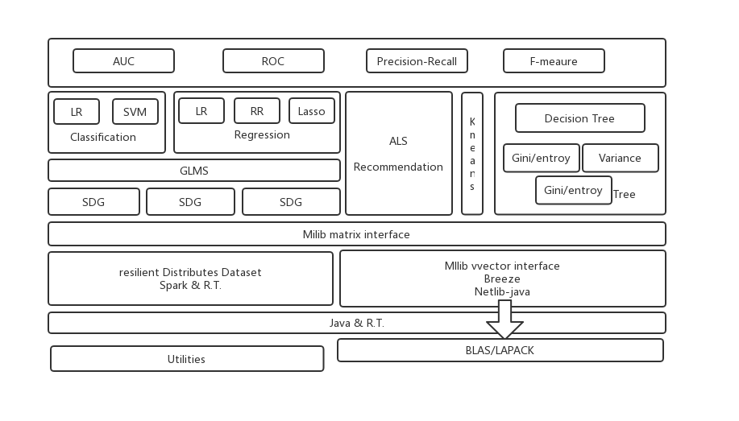
<center>架构图</center>


&emsp;&emsp;MLlib目前支持4种常见的机器学习问题: 分类、回归、聚类和协同过滤，MLlib在Spark整个生态系统中的位置如图下图所示。
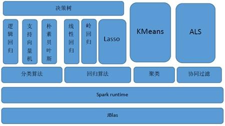
<center>生态系统位置</center>

### 18.2.5 Ray

&emsp;&emsp;Ray【5】是加州大学伯克利分校实时智能安全执行实验室(RISELab)的研究人员针对机器学习领域开发的一种新的分布式计算框架，该框架旨在让基于Python的机器学习和深度学习工作负载能够实时执行，并具有类似消息传递接口(MPI)的性能和细粒度。

&emsp;&emsp;增强学习的场景，按照原理定义，因为没有预先可用的静态标签信息，所以通常需要引入实际的目标系统（为了加快训练，往往是目标系统的模拟环境）来获取反馈信息，用做损失/收益判断，进而完成整个训练过程的闭环反馈。典型的步骤是通过观察特定目标系统的状态，收集反馈信息，判断收益，用这些信息来调整参数，训练模型，并根据新的训练结果产出可用于调整目标系统的行为Action，输出到目标系统，进而影响目标系统状态变化，完成闭环，如此反复迭代，最终目标是追求某种收益的最大化（比如对AlphoGo来说，收益是赢得一盘围棋的比赛）。

&emsp;&emsp;在这个过程中，一方面，模拟目标系统，收集状态和反馈信息，判断收益，训练参数，生成Action等等行为可能涉及大量的任务和计算（为了选择最佳Action，可能要并发模拟众多可能的行为）。而这些行为本身可能也是千差万别的异构的任务，任务执行的时间也可能长短不一，执行过程有些可能要求同步，也有些可能更适合异步。

&emsp;&emsp;另一方面，整个任务流程的DAG图也可能是动态变化的，系统往往可能需要根据前一个环节的结果，调整下一个环节的行为参数或者流程。这种调整，可能是目标系统的需要（比如在自动驾驶过程中遇到行人了，那么我们可能需要模拟计算刹车的距离来判断该采取的行动是刹车还是拐弯，而平时可能不需要这个环节），也可能是增强学习特定训练算法的需要（比如根据多个并行训练的模型的当前收益，调整模型超参数，替换模型等等）。

&emsp;&emsp;此外，由于所涉及到的目标系统可能是具体的，现实物理世界中的系统，所以对时效性也可能是有强要求的。举个例子，比如你想要实现的系统是用来控制机器人行走，或者是用来打视频游戏的。那么整个闭环反馈流程就需要在特定的时间限制内完成（比如毫秒级别）。

&emsp;&emsp;总结来说，就是增强学习的场景，对分布式计算框架的任务调度延迟，吞吐量和动态修改DAG图的能力都可能有很高的要求。按照官方的设计目标，Ray需要支持异构计算任务，动态计算链路，毫秒级别延迟和每秒调度百万级别任务的能力。

&emsp;&emsp;Ray的目标问题，主要是在类似增强学习这样的场景中所遇到的工程问题。那么增强学习的场景和普通的机器学习，深度学习的场景又有什么不同呢？简单来说，就是对整个处理链路流程的时效性和灵活性有更高的要求。

Ray框架优点:

- 海量任务调度能力
- 毫秒级别的延迟
- 异构任务的支持
- 任务拓扑图动态修改的能力

&emsp;&emsp;Ray没有采用中心任务调度的方案，而是采用了类似层级（hierarchy）调度的方案，除了一个全局的中心调度服务节点（实际上这个中心调度节点也是可以水平拓展的），任务的调度也可以在具体的执行任务的工作节点上，由本地调度服务来管理和执行。
与传统的层级调度方案，至上而下分配调度任务的方式不同的是，Ray采用了至下而上的调度策略。也就是说，任务调度的发起，并不是先提交给全局的中心调度器统筹规划以后再分发给次级调度器的。而是由任务执行节点直接提交给本地的调度器，本地的调度器如果能满足该任务的调度需求就直接完成调度请求，在无法满足的情况下，才会提交给全局调度器，由全局调度器协调转发给有能力满足需求的另外一个节点上的本地调度器去调度执行。

&emsp;&emsp;架构设计一方面减少了跨节点的RPC开销，另一方面也能规避中心节点的瓶颈问题。当然缺点也不是没有，由于缺乏全局的任务视图，无法进行全局规划，因此任务的拓扑逻辑结构也就未必是最优的了。


<center>架构图</center>


<center>任务调度图</center>

&emsp;&emsp;Ray架构现状：

- API层以上 的部分还比较薄弱，Core模块核心逻辑估需要时间打磨。
- 国内目前除了蚂蚁金服和RISELab有针对性的合作以外，关注程度还很低，没有实际的应用实例看到，整体来说还处于比较早期的框架构建阶段。

&emsp;&emsp;Github地址：https://github.com/ray-project/ray

### 18.2.6 Spark stream

&emsp;&emsp;随着大数据的发展，人们对大数据的处理要求也越来越高，原有的批处理框架MapReduce适合离线计算，却无法满足实时性要求较高的业务，如实时推荐、用户行为分析等。 Spark Streaming是建立在Spark上的实时计算框架，通过它提供的丰富的API、基于内存的高速执行引擎，用户可以结合流式、批处理和交互试查询应用。

&emsp;&emsp;Spark是一个类似于MapReduce的分布式计算框架，其核心是弹性分布式数据集，提供了比MapReduce更丰富的模型，可以在快速在内存中对数据集进行多次迭代，以支持复杂的数据挖掘算法和图形计算算法。Spark Streaming【6】是一种构建在Spark上的实时计算框架，它扩展了Spark处理大规模流式数据的能力。

&emsp;&emsp;Spark Streaming的优势在于：

- 能运行在100+的结点上，并达到秒级延迟。
- 使用基于内存的Spark作为执行引擎，具有高效和容错的特性。
- 能集成Spark的批处理和交互查询。
- 为实现复杂的算法提供和批处理类似的简单接口。

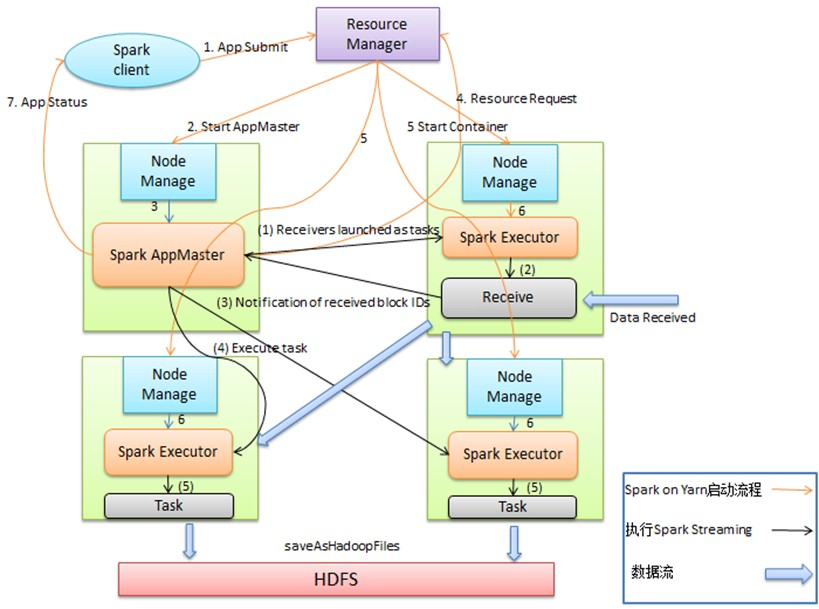

&emsp;&emsp;Spark Streaming把实时输入数据流以时间片Δt （如1秒）为单位切分成块。Spark Streaming会把每块数据作为一个RDD，并使用RDD操作处理每一小块数据。每个块都会生成一个Spark Job处理，最终结果也返回多块。


&emsp;&emsp;正如Spark Streaming最初的目标一样，它通过丰富的API和基于内存的高速计算引擎让用户可以结合流式处理，批处理和交互查询等应用。因此Spark Streaming适合一些需要历史数据和实时数据结合分析的应用场合。当然，对于实时性要求不是特别高的应用也能完全胜任。另外通过RDD的数据重用机制可以得到更高效的容错处理。

### 18.2.7 Horovod

&emsp;&emsp;Horovod【7】 是 Uber 开源的又一个深度学习工具，它的发展吸取了 Facebook「一小时训练 ImageNet 论文」与百度 Ring Allreduce 的优点，可为用户实现分布式训练提供帮助。

&emsp;&emsp;Horovod 支持通过用于高性能并行计算的低层次接口 – 消息传递接口 (MPI) 进行分布式模型训练。有了 MPI，就可以利用分布式 Kubernetes 集群来训练 TensorFlow 和 PyTorch 模型。

&emsp;&emsp;分布式 TensorFlow 的参数服务器模型（parameter server paradigm）通常需要对大量样板代码进行认真的实现。但是 Horovod 仅需要几行。下面是一个分布式 TensorFlow 项目使用 Horovod 的示例：


    import  tensorflow as tf
    import horovod.tensorflow as hvd
    # Initialize Horovod
    hvd.init()
    # Pin GPU to be used to process local rank (one GPU per process)
    config = tf.ConfigProto()
    config.gpu_options.visible_device_list = str(hvd.local_rank())
    # Build model…
    loss = …
    opt = tf.train.AdagradOptimizer(0.01)
    # Add Horovod Distributed Optimizer
    opt = hvd.DistributedOptimizer(opt)
    # Add hook to broadcast variables from rank 0 to all other processes during
    # initialization.
    hooks = [hvd.BroadcastGlobalVariablesHook(0)]
    # Make training operation
    train_op = opt.minimize(loss)
    # The MonitoredTrainingSession takes care of session initialization,
    # restoring from a checkpoint, saving to a checkpoint, and closing when done
    # or an error occurs.
    with tf.train.MonitoredTrainingSession(checkpoint_dir=“/tmp/train_logs”,
      config=config,
      hooks=hooks) as mon_sess:
     while not mon_sess.should_stop():
       # Perform synchronous training.
       mon_sess.run(train_op)


&emsp;&emsp;在该示例中，粗体文字指进行单个 GPU 分布式项目时必须做的改变：

- hvd.init() 初始化 Horovod。
- config.gpu_options.visible_device_list = str(hvd.local_rank()) 向每个 TensorFlow 流程分配一个 GPU。
- opt=hvd.DistributedOptimizer(opt) 使用 Horovod 优化器包裹每一个常规 TensorFlow 优化器，Horovod 优化器使用 ring-allreduce 平均梯度。
- hvd.BroadcastGlobalVariablesHook(0) 将变量从第一个流程向其他流程传播，以实现一致性初始化。如果该项目无法使用 MonitoredTrainingSession，则用户可以运行 hvd.broadcast_global_variables(0)。

&emsp;&emsp;之后，可以使用 mpirun 命令使该项目的多个拷贝在多个服务器中运行：

```
$ mpirun -np 16 -x LD_LIBRARY_PATH -H 
server1:4,server2:4,server3:4,server4:4 python train.py
```

&emsp;&emsp;mpirun 命令向四个节点分布 train.py，然后在每个节点的四个 GPU 上运行 train.py。

&emsp;&emsp;Github地址：https://github.com/uber/horovod

### 18.2.8 BigDL

&emsp;&emsp;BigDL【9】是一种基于Apache Spark的分布式深度学习框架。它可以无缝的直接运行在现有的Apache Spark和Hadoop集群之上。BigDL的设计吸取了Torch框架许多方面的知识，为深度学习提供了全面的支持；包括数值计算和高级神经网络；借助现有的Spark集群来运行深度学习计算，并简化存储在Hadoop中的大数据集的数据加载。

&emsp;&emsp;BigDL优点：

- 丰富的深度学习支持。模拟Torch之后，BigDL为深入学习提供全面支持，包括数字计算（通过Tensor）和高级神经网络 ; 此外，用户可以使用BigDL将预先训练好的Caffe或Torch模型加载到Spark程序中。
- 极高的性能。为了实现高性能，BigDL在每个Spark任务中使用英特尔MKL和多线程编程。因此，在单节点Xeon（即与主流GPU 相当）上，它比开箱即用开源Caffe，Torch或TensorFlow快了数量级。
- 有效地横向扩展。BigDL可以通过利用Apache Spark（快速分布式数据处理框架），以及高效实施同步SGD和全面减少Spark的通信，从而有效地扩展到“大数据规模”上的数据分析

&emsp;&emsp;BigDL缺点：

- 对机器要求高 jdk7上运行性能差 在CentOS 6和7上，要将最大用户进程增加到更大的值（例如514585）; 否则，可能会看到错误，如“无法创建新的本机线程”。 
- 训练和验证的数据会加载到内存，挤占内存

&emsp;&emsp;BigDL满足的应用场景：

- 直接在Hadoop/Spark框架下使用深度学习进行大数据分析（即将数据存储在HDFS、HBase、Hive等数据库上）；
- 在Spark程序中/工作流中加入深度学习功能；
- 利用现有的 Hadoop/Spark 集群来运行深度学习程序，然后将代码与其他的应用场景进行动态共享，例如ETL（Extract、Transform、Load，即通常所说的数据抽取）、数据仓库（data warehouse）、功能引擎、经典机器学习、图表分析等。

### 18.2.9 Petastorm

&emsp;&emsp;Petastorm是一个由 Uber ATG 开发的开源数据访问库。这个库可以直接基于数 TB Parquet 格式的数据集进行单机或分布式训练和深度学习模型评估。Petastorm 支持基于 Python 的机器学习框架，如 Tensorflow、Pytorch 和 PySpark，也可以直接用在 Python 代码中。


&emsp;&emsp;即使是在现代硬件上训练深度模型也很耗时，而且在很多情况下，很有必要在多台机器上分配训练负载。典型的深度学习集群需要执行以下几个步骤：

- 一台或多台机器读取集中式或本地数据集。
- 每台机器计算损失函数的值，并根据模型参数计算梯度。在这一步通常会使用 GPU。
- 通过组合估计的梯度（通常由多台机器以分布式的方式计算得出）来更新模型系数。

&emsp;&emsp;通常，一个数据集是通过连接多个数据源的记录而生成的。这个由 Apache Spark 的 Python 接口 PySpark 生成的数据集稍后将被用在机器学习训练中。Petastorm 提供了一个简单的功能，使用 Petastorm 特定的元数据对标准的 Parquet 进行了扩展，从而让它可以与 Petastorm 兼容。
有了 Petastorm，消费数据就像在 HDFS 或文件系统中创建和迭代读取对象一样简单。Petastorm 使用 PyArrow 来读取 Parquet 文件。

&emsp;&emsp;将多个数据源组合到单个表格结构中，从而生成数据集。可以多次使用相同的数据集进行模型训练和评估。


&emsp;&emsp;为分布式训练进行分片
在分布式训练环境中，每个进程通常负责训练数据的一个子集。一个进程的数据子集与其他进程的数据子集正交。Petastorm 支持将数据集的读时分片转换为正交的样本集。

				Petastorm 将数据集的非重叠子集提供给参与分布式训练的不同机器

&emsp;&emsp;本地缓存
Petastorm 支持在本地存储中缓存数据。当网络连接速度较慢或带宽很昂贵时，这会派上用场。


Github地址：https://github.com/uber/petastorm

### 18.2.10 TensorFlowOnSpark

&emsp;&emsp;TensorFlowOnSpark【10】为 Apache Hadoop 和 Apache Spark 集群带来可扩展的深度学习。 通过结合深入学习框架 TensorFlow 和大数据框架 Apache Spark 、Apache Hadoop 的显着特征，TensorFlowOnSpark 能够在 GPU 和 CPU 服务器集群上实现分布式深度学习。

&emsp;&emsp;满足的应用场景：
为了利用TensorFlow在现有的Spark和Hadoop集群上进行深度学习。而不需要为深度学习设置单独的集群。


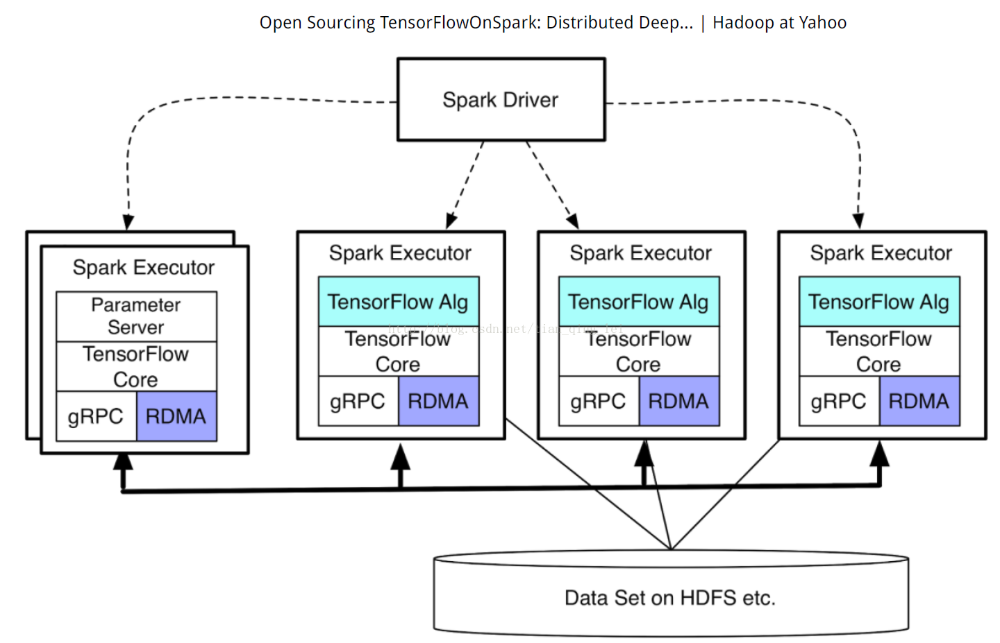

&emsp;&emsp;优点：

- 轻松迁移所有现有的TensorFlow程序，<10行代码更改; 
- 支持所有TensorFlow功能：同步/异步训练，模型/数据并行，推理和TensorBoard; 
- 服务器到服务器的直接通信在可用时实现更快的学习; 
- 允许数据集在HDFS和由Spark推动的其他来源或由TensorFlow拖动; 
- 轻松集成您现有的数据处理流水线和机器学习算法（例如，MLlib，CaffeOnSpark）; 
- 轻松部署在云或内部部署：CPU和GPU，以太网和Infiniband。
- TensorFlowOnSpark是基于google的TensorFlow的实现，而TensorFlow有着一套完善的教程，内容丰富。 

&emsp;&emsp;劣势：

- 开源时间不长，未得到充分的验证。

&emsp;&emsp;Github 地址:https://github.com/yahoo/TensorFlowOnSpark

## 18.3 如何进行实时计算？

### 18.3.1 什么是实时流计算？

&emsp;&emsp;所谓实时流计算，就是近几年由于数据得到广泛应用之后，在数据持久性建模不满足现状的情况下，急需数据流的瞬时建模或者计算处理。这种实时计算的应用实例有金融服务、网络监控、电信数据管理、 Web 应用、生产制造、传感检测，等等。在这种数据流模型中，单独的数据单元可能是相关的元组（Tuple），如网络测量、呼叫记录、网页访问等产生的数据。但是，这些数据以大量、快速、时变（可能是不可预知）的数据流持续到达，由此产生了一些基础性的新的研究问题——实时计算。实时计算的一个重要方向就是实时流计算。

### 18.3.2 实时流计算过程


&emsp;&emsp;我们以热卖产品的统计为例，看下传统的计算手段：

- 将用户行为、log等信息清洗后保存在数据库中.
- 将订单信息保存在数据库中.
- 利用触发器或者协程等方式建立本地索引，或者远程的独立索引.
- join订单信息、订单明细、用户信息、商品信息等等表，聚合统计20分钟内热卖产品，并返回top-10.
- web或app展示.

&emsp;&emsp;这是一个假想的场景，但假设你具有处理类似场景的经验，应该会体会到这样一些问题和难处：

- 水平扩展问题（scale-out）
显然，如果是一个具有一定规模的电子商务网站，数据量都是很大的。而交易信息因为涉及事务，所以很难直接舍弃关系型数据库的事务能力，迁移到具有更好的scale-out能力的NoSQL数据库中。

&emsp;&emsp;那么，一般都会做sharding。历史数据还好说，我们可以按日期来归档，并可以通过批处理式的离线计算，将结果缓存起来。
但是，这里的要求是20分钟内，这很难。

- 性能问题
这个问题，和scale-out是一致的，假设我们做了sharding，因为表分散在各个节点中，所以我们需要多次入库，并在业务层做聚合计算。

&emsp;&emsp;问题是，20分钟的时间要求，我们需要入库多少次呢？10分钟呢？5分钟呢？实时呢？

&emsp;&emsp;而且，业务层也同样面临着单点计算能力的局限，需要水平扩展，那么还需要考虑一致性的问题。
所以，到这里一切都显得很复杂。

- 业务扩展问题

&emsp;&emsp;假设我们不仅仅要处理热卖商品的统计，还要统计广告点击、或者迅速根据用户的访问行为判断用户特征以调整其所见的信息，更加符合用户的潜在需求等，那么业务层将会更加复杂。
也许你有更好的办法，但实际上，我们需要的是一种新的认知：
这个世界发生的事，是实时的。
所以我们需要一种实时计算的模型，而不是批处理模型。
我们需要的这种模型，必须能够处理很大的数据，所以要有很好的scale-out能力，最好是，我们都不需要考虑太多一致性、复制的问题。

&emsp;&emsp;那么，这种计算模型就是实时计算模型，也可以认为是流式计算模型。
现在假设我们有了这样的模型，我们就可以愉快地设计新的业务场景：

- 转发最多的微博是什么？
- 最热卖的商品有哪些？
- 大家都在搜索的热点是什么？
- 我们哪个广告，在哪个位置，被点击最多？

或者说，我们可以问：
&emsp;&emsp;这个世界，在发生什么？

&emsp;&emsp;最热的微博话题是什么？
我们以一个简单的滑动窗口计数的问题，来揭开所谓实时计算的神秘面纱。
假设，我们的业务要求是：
统计20分钟内最热的10个微博话题。

&emsp;&emsp;解决这个问题，我们需要考虑：

- 数据源

&emsp;&emsp;这里，假设我们的数据，来自微博长连接推送的话题。

- 问题建模

&emsp;&emsp;我们认为的话题是#号扩起来的话题，最热的话题是此话题出现的次数比其它话题都要多。
比如：@foreach_break : 你好,#世界#,我爱你，#微博#。
“世界”和“微博”就是话题。

- 计算引擎采用storm

- 定义时间

&emsp;&emsp;时间的定义是一件很难的事情，取决于所需的精度是多少。
根据实际，我们一般采用tick来表示时刻这一概念。
在storm的基础设施中，executor启动阶段，采用了定时器来触发“过了一段时间”这个事件。
如下所示：
```
(defn setup-ticks! [worker executor-data]
  (let [storm-conf (:storm-conf executor-data)
        tick-time-secs (storm-conf TOPOLOGY-TICK-TUPLE-FREQ-SECS)
        receive-queue (:receive-queue executor-data)
        context (:worker-context executor-data)]
    (when tick-time-secs
      (if (or (system-id? (:component-id executor-data))
              (and (= false (storm-conf TOPOLOGY-ENABLE-MESSAGE-TIMEOUTS))
                   (= :spout (:type executor-data))))
        (log-message "Timeouts disabled for executor " (:component-id executor-data) ":" (:executor-id executor-data))
        (schedule-recurring
          (:user-timer worker)
          tick-time-secs
          tick-time-secs
          (fn []
            (disruptor/publish
              receive-queue
              [[nil (TupleImpl. context [tick-time-secs] Constants/SYSTEM_TASK_ID Constants/SYSTEM_TICK_STREAM_ID)]]
              )))))))
```
之前的博文中，已经详细分析了这些基础设施的关系，不理解的童鞋可以翻看前面的文章。
每隔一段时间，就会触发这样一个事件，当流的下游的bolt收到一个这样的事件时，就可以选择是增量计数还是将结果聚合并发送到流中。
bolt如何判断收到的tuple表示的是“tick”呢？
负责管理bolt的executor线程，从其订阅的消息队列消费消息时，会调用到bolt的execute方法，那么，可以在execute中这样判断：
```
public static boolean isTick(Tuple tuple) {
    return tuple != null
           && Constants.SYSTEM_COMPONENT_ID  .equals(tuple.getSourceComponent())
           && Constants.SYSTEM_TICK_STREAM_ID.equals(tuple.getSourceStreamId());
}
```
结合上面的setup-tick!的clojure代码，我们可以知道SYSTEM_TICK_STREAM_ID在定时事件的回调中就以构造函数的参数传递给了tuple，那么SYSTEM_COMPONENT_ID是如何来的呢？
可以看到，下面的代码中，SYSTEM_TASK_ID同样传给了tuple：
;; 请注意SYSTEM_TASK_ID和SYSTEM_TICK_STREAM_ID
(TupleImpl. context [tick-time-secs] Constants/SYSTEM_TASK_ID Constants/SYSTEM_TICK_STREAM_ID)
然后利用下面的代码，就可以得到SYSTEM_COMPONENT_ID：
```
    public String getComponentId(int taskId) {
        if(taskId==Constants.SYSTEM_TASK_ID) {
            return Constants.SYSTEM_COMPONENT_ID;
        } else {
            return _taskToComponent.get(taskId);
        }
    }
```
滑动窗口
有了上面的基础设施，我们还需要一些手段来完成“工程化”，将设想变为现实。
这里，我们看看Michael G. Noll的滑动窗口设计。

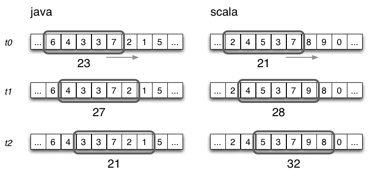

Topology

```
    String spoutId = "wordGenerator";
    String counterId = "counter";
    String intermediateRankerId = "intermediateRanker";
    String totalRankerId = "finalRanker";
    // 这里，假设TestWordSpout就是我们发送话题tuple的源
    builder.setSpout(spoutId, new TestWordSpout(), 5);
    // RollingCountBolt的时间窗口为9秒钟，每3秒发送一次统计结果到下游
    builder.setBolt(counterId, new RollingCountBolt(9, 3), 4).fieldsGrouping(spoutId, new Fields("word"));
    // IntermediateRankingsBolt，将完成部分聚合，统计出top-n的话题
    builder.setBolt(intermediateRankerId, new IntermediateRankingsBolt(TOP_N), 4).fieldsGrouping(counterId, new Fields(
        "obj"));
        // TotalRankingsBolt， 将完成完整聚合，统计出top-n的话题
    builder.setBolt(totalRankerId, new TotalRankingsBolt(TOP_N)).globalGrouping(intermediateRankerId);
```

上面的topology设计如下：


将聚合计算与时间结合起来
前文，我们叙述了tick事件，回调中会触发bolt的execute方法，那可以这么做：

```
RollingCountBolt:
  @Override
  public void execute(Tuple tuple) {
    if (TupleUtils.isTick(tuple)) {
      LOG.debug("Received tick tuple, triggering emit of current window counts");
      // tick来了，将时间窗口内的统计结果发送，并让窗口滚动
      emitCurrentWindowCounts();
    }
    else {
      // 常规tuple，对话题计数即可
      countObjAndAck(tuple);
    }
  }

  // obj即为话题，增加一个计数 count++
  // 注意，这里的速度基本取决于流的速度，可能每秒百万，也可能每秒几十.
  // 内存不足？ bolt可以scale-out.
  private void countObjAndAck(Tuple tuple) {
    Object obj = tuple.getValue(0);
    counter.incrementCount(obj);
    collector.ack(tuple);
  }
  
  // 将统计结果发送到下游
  private void emitCurrentWindowCounts() {
    Map<Object, Long> counts = counter.getCountsThenAdvanceWindow();
    int actualWindowLengthInSeconds = lastModifiedTracker.secondsSinceOldestModification();
    lastModifiedTracker.markAsModified();
    if (actualWindowLengthInSeconds != windowLengthInSeconds) {
      LOG.warn(String.format(WINDOW_LENGTH_WARNING_TEMPLATE, actualWindowLengthInSeconds, windowLengthInSeconds));
    }
    emit(counts, actualWindowLengthInSeconds);
  }
```

上面的代码可能有点抽象，看下这个图就明白了，tick一到，窗口就滚动：

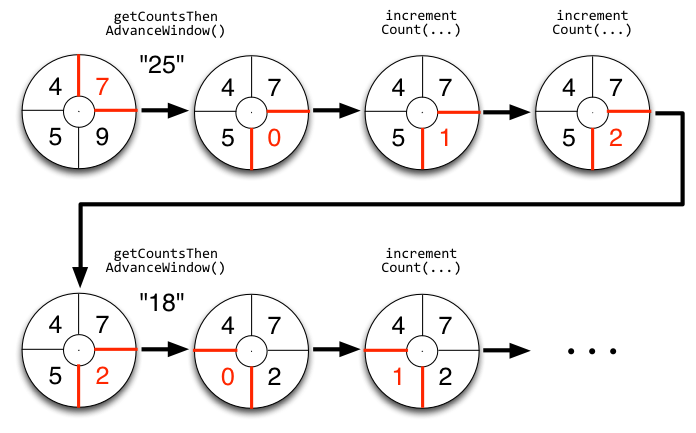

```
IntermediateRankingsBolt & TotalRankingsBolt：
  public final void execute(Tuple tuple, BasicOutputCollector collector) {
    if (TupleUtils.isTick(tuple)) {
      getLogger().debug("Received tick tuple, triggering emit of current rankings");
      // 将聚合并排序的结果发送到下游
      emitRankings(collector);
    }
    else {
      // 聚合并排序
      updateRankingsWithTuple(tuple);
    }
  }
```
&emsp;&emsp;其中，IntermediateRankingsBolt和TotalRankingsBolt的聚合排序方法略有不同：

IntermediateRankingsBolt的聚合排序方法：

```
  @Override
  void updateRankingsWithTuple(Tuple tuple) {
    // 这一步，将话题、话题出现的次数提取出来
    Rankable rankable = RankableObjectWithFields.from(tuple);
    // 这一步，将话题出现的次数进行聚合，然后重排序所有话题
    super.getRankings().updateWith(rankable);
  }
```

TotalRankingsBolt的聚合排序方法：

```
  @Override
  void updateRankingsWithTuple(Tuple tuple) {
  // 提出来自IntermediateRankingsBolt的中间结果
    Rankings rankingsToBeMerged = (Rankings) tuple.getValue(0);
  // 聚合并排序
    super.getRankings().updateWith(rankingsToBeMerged);
  // 去0，节约内存
    super.getRankings().pruneZeroCounts();
  }
```

而重排序方法比较简单粗暴，因为只求前N个，N不会很大：

```
  private void rerank() {
    Collections.sort(rankedItems);
    Collections.reverse(rankedItems);
  }
```

&emsp;&emsp;结语

&emsp;&emsp;下图可能就是我们想要的结果，我们完成了t0 - t1时刻之间的热点话题统计. 

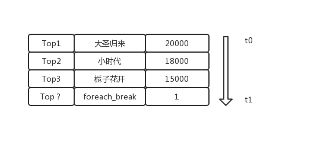

## 18.4 如何进行离线计算？

相对于实时计算，有充裕的时间进行运算挖掘

**应用场景**

- 用户流失预警系统
- 基于用户购买的挽回系统
- 用户特征和规则提取系统
- 数据分析系统
- 用户画像系统

**流程**

- 数据采集
- 数据预处理
- 数据建模
- ETL
- 数据导出
- 工作流调度

### 18.4.1 数据采集

> Flume 收集服务器日志到hdfs
>
> ```
> type=taildir taildir可以监控一个目录, 也可以用一个正则表达式匹配文件名进行实时收集
> taildir=spooldir + exec + 支持断点续传
> agent1.sources = source1
> agent1.sinks = sink1
> agent1.channels = channel1
> 
> agent1.sources.source1.type = TAILDIR 
> agent1.sources.source1.positionFile = /var/log/flume/taildir_position.json
> agent1.sources.source1.filegroups = f1 f2
> 
> # 监控文件内容的改变
> 
> agent1.sources.source1.filegroups.f1 = /usr/local/nginx/logs/example.log
> 
> # 监控生成的文件
> 
> agent1.sources.source1.filegroups.f1 = /usr/local/nginx/logs/.*log.*
> 
> agent1.sources.source1.interceptors = i1
> agent1.sources.source1.interceptors.i1.type = host
> agent1.sources.source1.interceptors.i1.hostHeader = hostname
> 
> # 配置sink组件为hdfs
> 
> agent1.sinks.sink1.type = hdfs
> agent1.sinks.sink1.hdfs.path=
> hdfs://node-1:9000/weblog/flume-collection/%y-%m-%d/%H-%M_%hostname
> 
> # 指定文件名前缀
> 
> agent1.sinks.sink1.hdfs.filePrefix = access_log
> 
> # 指定每批下沉数据的记录条数
> 
> agent1.sinks.sink1.hdfs.batchSize= 100
> agent1.sinks.sink1.hdfs.fileType = DataStream
> agent1.sinks.sink1.hdfs.writeFormat =Text
> 
> # 指定下沉文件按1G大小滚动
> 
> agent1.sinks.sink1.hdfs.rollSize = 1024*1024*1024
> 
> # 指定下沉文件按1000000条数滚动
> 
> agent1.sinks.sink1.hdfs.rollCount = 1000000
> 
> # 指定下沉文件按30分钟滚动
> 
> agent1.sinks.sink1.hdfs.rollInterval = 30
> 
> # agent1.sinks.sink1.hdfs.round = true
> 
> # agent1.sinks.sink1.hdfs.roundValue = 10
> 
> # agent1.sinks.sink1.hdfs.roundUnit = minute
> 
> agent1.sinks.sink1.hdfs.useLocalTimeStamp = true
> 
> # 使用memory类型channel
> 
> agent1.channels.channel1.type = memory
> agent1.channels.channel1.capacity = 500000
> agent1.channels.channel1.transactionCapacity = 600
> 
> # Bind the source and sink to the channel
> 
> agent1.sources.source1.channels = channel1
> agent1.sinks.sink1.channel = channel1
> ```

### 18.4.2 数据预处理

> 数据预处理编程技巧
>
> - 对于本次分析无利用的数据 通常采用逻辑删除 建立标记位 通过01或者true false表示数据是否有效
> - 对于最后一个字段不固定的情况 可以采用动态拼接的方式
> - 静态资源过滤
>   - js css img (静态数据) 只关心真正请求页面的（index.html）
>   - data（动态数据）
> - 在mr中，如果涉及小且频繁使用的数据，如何优化？
>   - 每次都从数据库查询 效率极低
>   - 可以通过数据结构保存在内存中 方便查询 一般在setup方法中进行初始化操作
> - 关于mr程序输出文件名
>   - part-r-00000 表示是reducetask的输出
>   - part-m-00000 表示是maptask的输出

### 18.4.3 数据建模

> - 维度建模
>
>   专门适用于OLAP的设计模式存在着两种类型的表：事实表 维度表
>
>   - 事实表：主题的客观度量 能够以记录主题为准 信息多不精准
>   - 维度表：看问题分析问题的角度 信息精但是不全 可跟事实表关系
>
> - 维度建模三种常见模型
>
>   - 星型模型 一个事实表带多个维度表 维度之间没关系 数仓发展建立初期（一个主题）
>   - 雪花模型 一个事实表带多个维度表 维度之间可以继续关系维度 不利于维护 少用
>   - 星座模型 多个事实表带多个维度 有些维度可以共用 数仓发展后期（多个主题）
>
>   不管什么模型，在数仓中，一切有利于数据分析即可为，不用考虑数据冗余性和其他设计规范。
>
> - 模块设计–维度建模
>
>   在本项目中，因为分析主题只有一个（网站流量日志），所有采用星型模型
>   事实表---->对应清洗完之后的数据
>   维度表----->来自于提前通过工具生成 维度表范围要横跨事实表分析维度
>   点击流模型属于业务模型数据 既不是事实表 也不是维度表 是为了后续计算某些业务指标方便而由业务指定
>
> - 宽表：为了分析，把原来表中某些字段属性提取出来，构成新的字段 也称之为明细表
>
>   窄表：没有扩宽的表 原始表
>   宽表数据来自于窄表 insert（宽）+select (窄)
>   总结：hive中，有几种方式可以创建出带有数据的表？
>
>   - create+load data 创建表加载数据（内部表）
>
>   - create +external +location 创建外部表指定数据路径
>
>   - create+insert+select 表的数据来自于后面查询语句返回的结果
>
>   - create+select 创建的表结构和数据来自于后面的查询语句
>
>     ```
>     # -- hive内置解析url的函数
>     
>     parse_url_tuple（url,host path,query,queryvalue）
>     
>     # -- 通常用于把后面的表挂接在左边的表之上 返回成为一个新表
>     
>     a LATERAL VIEW b 
>     LATERAL VIEW
>     
>     create table t_ods_tmp_referurl as SELECT a.*,b.* FROM ods_weblog_origin a LATERAL VIEW parse_url_tuple(regexp_replace(http_referer, "\"", ""), 'HOST', 'PATH','QUERY', 'QUERY:id') b as host, path, query, query_id; 
>     ```
>
> - group by 语法限制
>
>   ```
>   select count(*) as pvs from ods_weblog_detail t where datestr='20130918' group by t.hour
>   
>   select t.hour,count(*) as pvs from ods_weblog_detail t where datestr='20130918' group by t.hour
>   
>   # -- 在有group by的语句中，出现在select后面的字段要么是分组的字段要么是被聚合函数包围的字段。
>   解决：
>   select t.day,t.hour,count(*) as pvs from ods_weblog_detail t where datestr='20130918' group by t.day,t.hour;
>   ```

### 18.4.4 ETL

> **宽表生成**
>
> - 生成ods+url解析表
>
> ```
> create table t_ods_tmp_referurl as
> SELECT a.*,b.*
> FROM ods_weblog_origin a 
> LATERAL VIEW parse_url_tuple(regexp_replace(http_referer, "\"", ""), 'HOST', 'PATH','QUERY', 'QUERY:id') b as host, path, query, query_id;
> ```
>
> - 生成ods+url+date解析表
>
> ```
> create table t_ods_tmp_detail as 
> select b.*,substring(time_local,0,10) as daystr,
> substring(time_local,12) as tmstr,
> substring(time_local,6,2) as month,
> substring(time_local,9,2) as day,
> substring(time_local,11,3) as hour
> From t_ods_tmp_referurl b;
> ```
>
> - 综合
>
> ```
> create table ods_weblog_detail(
> valid           string, --有效标识
> remote_addr     string, --来源IP
> remote_user     string, --用户标识
> time_local      string, --访问完整时间
> daystr          string, --访问日期
> timestr         string, --访问时间
> month           string, --访问月
> day             string, --访问日
> hour            string, --访问时
> request         string, --请求的url
> status          string, --响应码
> body_bytes_sent string, --传输字节数
> http_referer    string, --来源url
> ref_host        string, --来源的host
> ref_path        string, --来源的路径
> ref_query       string, --来源参数query
> ref_query_id    string, --来源参数query的值
> http_user_agent string --客户终端标识
> )
> partitioned by(datestr string);
> 
> insert into table  ods_weblog_detail partition(datestr='20130918') 
> select c.valid,c.remote_addr,c.remote_user,c.time_local,
> substring(c.time_local,0,10) as daystr,
> substring(c.time_local,12) as tmstr,
> substring(c.time_local,6,2) as month,
> substring(c.time_local,9,2) as day,
> substring(c.time_local,12,2) as hour,
> c.request,c.status,c.body_bytes_sent,c.http_referer,c.ref_host,c.ref_path,c.ref_query,c.ref_query_id,c.http_user_agent
> from 
> (select a.*,b.*
> from ods_weblog_origin a
> LATERAL view 
> parse_url_tuple(regexp_replace(a.http_referer,"\"",""),'HOST','PATH','QUERY','QUERY_ID')b as ref_host, ref_path, ref_query, ref_query_id) c;
> ```
>
> **DML分析**
>
> - 计算该处理批次（一天）中的各小时 pvs
>
> ```
> select 
> t.month,t.day,t.hour,count(*)
> from ods_weblog_detail t
> where t.datestr='20130918'
> group by t.month,t.day,t.hour;
> ```
>
> - 计算每天的pvs
>
> ```
> select t.month,t.day,count(*) from ods_weblog_detail t where t.datestr='20130918' group by t.month,t.day;
> 
> select a.month,a.day,sum(a.pvs)
> from 
> (
>     select 
>     t.month as month,t.day as day,t.hour as hour,count(*)  as pvs
>     from ods_weblog_detail t
>     where t.datestr='20130918'
>     group by t.month,t.day,t.hour
> ) a 
> group by a.month,a.day;
> ```
>
> 统计每小时各来访url产生的pvs
>
> ```
> select 
> t.day,t.hour,t.http_referer,t.ref_host,count(*)
> from ods_weblog_detail t
> where datestr='20130918'
> group by t.day,t.hour,t.http_referer,t.ref_host
> having t.ref_host is not null;
> ```
>
> - 统计每小时各来访host的产生的pv数并排序
>
> ```
> select 
> t.month,t.day,t.hour,t.ref_host,count(*) as pvs
> from ods_weblog_detail t
> where datestr='20130918'
> group by t.month,t.day,t.hour,t.ref_host
> having t.ref_host is not null
> order by t.hour asc ,pvs desc;
> ```
>
> ```
> 按照时间维度，统计一天内各小时产生最多pvs的来源（host）topN(分组Top)
> select 
> a.month,a.day,a.hour,a.host,a.pvs,a.rmp
> from
> (
>     select 
>     t.month as month,t.day as day,t.hour as hour,t.ref_host as host,count(*) as pvs,
>     row_number()over(partition by concat(t.month,t.day,t.hour) order by pvs desc) rmp
>     from ods_weblog_detail t
>     where datestr='20130918'
>     group by t.month,t.day,t.hour,t.ref_host
>     having t.ref_host is not null
>     order by hour asc ,pvs desc
> )a 
> where a.rmp < 4;
> ```
>
> 统计今日所有来访者平均请求的页面数。
>
> ```
> select count(*)/count(distinct remote_addr) from ods_weblog_detail where datestr='20130918';
> 
> select
> sum(a.pvs)/count(a.ip)
> from
> (
>     select
>     t.remote_addr as ip,count(*) as pvs
>     from ods_weblog_detail t
>     where t.datestr='20130918'
>     group by t.remote_addr
> ) a;
> ```
>
> - 统计每日最热门的页面 top10
>
> ```
> select 
> t.request,count(*) as counts
> from ods_weblog_detail t
> where datestr='20130918'
> group by t.request
> order by counts desc
> limit 10;
> ```
>
> - 每日新访客
>
> ```
> select 
> today.ip
> from 
> (
>     select distinct t.remote_addr as ip 
>     from ods_weblog_detail t
> ) today 
> left join history
> on today.ip=history.ip
> where  history.ip is null;
> ```
>
> - 查询今日所有回头访客及其访问次数（session）
>
> ```
> select
> remote_addr,count(session) as cs
> from ods_click_stream_visit
> where datestr='20130918'
> group by remote_addr
> having cs >1;
> ```
>
> - 人均访问频次
>
> ```
> select 
> count(session)/count(distinct remote_addr)
> from ods_click_stream_visit
> where datestr='20130918';
> ```
>
> - 级联查询自join
>
> ```
> select 
> rn.step as rnstep,rn.numbs as rnnumbs,rr.step as rrstep,rr.numbs as rrnumbs  
> from  dw_oute_numbs rn
> inner join 
> dw_oute_numbs rr;
> 
> # -- 绝对转化
> 
> select 
> a.rrstep,a.rrnumbs/a.rnnumbs
> from 
> (
>     select 
>     rn.step as rnstep,rn.numbs as rnnumbs,rr.step as rrstep,rr.numbs as rrnumbs  
>     from  dw_oute_numbs rn
>     inner join dw_oute_numbs rr
> )a
> where a.rnstep='step1';
> 
> # -- 相对转化
> 
> select 
> tmp.rrstep as step,tmp.rrnumbs/tmp.rnnumbs as leakage_rate
> from
> (
>     select rn.step as rnstep,rn.numbs as rnnumbs,rr.step as rrstep,rr.numbs as rrnumbs from 	dw_oute_numbs rn
>     inner join 
>     dw_oute_numbs rr
> ) tmp
> where cast(substr(tmp.rnstep,5,1) as int)=cast(substr(tmp.rrstep,5,1) as int)-1;
> ```

### 18.4.5 数据导出

> Sqoop可以对HDFS文件进行导入导出到关系型数据库
> Sqoop 工作机制是将导入或导出命令翻译成 mapreduce 程序来实现。
> 在翻译出的 mapreduce 中主要是对 inputformat 和 outputformat 进行定制
> sqoop实际生产环境中 关于mysql地址 尽量不要使用: localhost 可用ip或者域名代替
>
> **导入**
>
> - mysql----->hdfs 导入的文件分隔符为逗号
> - mysql----->hive
>   - 需要先复制表结构到hive 再向表中导入数据
>   - 导入的文件分隔符为 ‘\001’
>   - sqoop中增量导入的判断是通过上次导入到某个列的某个值来标识 的，这个值由用户自己维护，一般企业中选择不重复且自增长的主键最多，自增长的时间也可以。
>
> ```
> # 导入mysql表到hdfs
> 
> bin/sqoop import \
> --connect jdbc:mysql://node-1:3306/userdb \
> --username root \
> --password 123 \
> --target-dir /sqoopresult \
> --table emp --m 1
> 
> # 支持条件导入数据
> 
> bin/sqoop import \
> --connect jdbc:mysql://node-1:3306/userdb \
> --username root \
> --password 123 \
> --where "id > 1202" \
> --target-dir /sqoopresult/t1 \
> --table emp --m 1
> 
> # 将关系型数据的表结构复制到hive中
> 
> bin/sqoop create-hive-table \
> --connect jdbc:mysql://node-1:3306/userdb \
> --table emp_add \
> --username root \
> --password 123 \
> --hive-table default.emp_add_sp
> 
> # 从关系数据库导入文件到hive中
> 
> bin/sqoop import \
> --connect jdbc:mysql://node-1:3306/userdb \
> --username root \
> --password 123 \
> --table emp_add \
> --hive-table default.emp_add_sp \
> --hive-import \
> --m 1
> 
> # 增量导入
> 
> bin/sqoop import \
> --connect jdbc:mysql://node-1:3306/userdb \
> --username root \
> --password 123 \
> --table emp_add  \
> --target-dir '/user/hive/warehouse/emp_add_sp' \
> --incremental append \
> --check-column id \
> --last-value 1205 \
> --fields-terminated-by '\001' \
> --m 1
> ```
>
>
> **导出**
>
> - hdfs导出到mysql
>
>   - 要先在mysql中手动创建对应的表结构
>
>     ```
>     # hdfs文件导出到mysql
>     
>     bin/sqoop export \
>     --connect jdbc:mysql://node-1:3306/userdb \
>     --username root \
>     --password 123 \
>     --table employee \
>     --export-dir /hivedata/employee.txt \
>     --fields-terminated-by '\001'
>     ```

### 18.4.6 工作流调度

> azkaban工作流程
>
> - 配置job文件（注意文件的第一行头信息）
> - 把job配置连同其他资源一起打成.zip压缩包
> - 页面上创建工程project
> - 上传.zip压缩包
> - execute/schedule

## 18.5 如何设计一个人机交互系统？

### 18.5.1 什么是人机交互系统？

&emsp;&emsp;人机交互系统(Human-computer interaction，简称HCI)是研究人与计算机之间通过相互理解的交流与通信，在最大程度上为人们完成信息管理，服务和处理等功能，使计算机真正成为人们工作学习的和谐助手的一门技术科学。

&emsp;&emsp;通俗来讲，就是指人与计算机之间使用某种对话语言，以一定的交互方式，为完成确定任务的人与计算机之间的信息交换过程。

&emsp;&emsp;目前工业界落地的产品包括阿里巴巴集团的云小蜜、天猫精灵；百度的UNIT、小度；小米的小爱同学；京东的叮咚智能音箱等。

【产品图】

人机交互发展阶段大致可分为四个阶段

- 第一代人机交互技术：基于键盘和字符显示器的交互阶段
- 第二代人机交互技术：基于鼠标和图形显示器的交互阶段
- 第三代人机交互技术：基于多媒体技术的交互阶段
- 第四代人机交互技术：人机自然交互与通信

本章节重点介绍第四代人机交互技术，传统人机交互模型主要组成部分包括：

1.多模态输入/输出：多模态输入/输出是第四代人机交互与通信的主要标志之一。多模态输入包括键盘、鼠标、文字、语音、手势、表情、注视等多种输入方式；而多模态输出包括文字、图形、语音、手势、表情等多种交互信息

2.智能接口代理：智能接口代理是实现人与计算机交互的媒介

3.视觉获取：视觉系统主要用于实时获取外部视觉信息

4.视觉合成：使人机交互能够在一个仿真或虚拟的环境中进行，仿佛现实世界中人与人之间的交互

5.对话系统：目前主要由两种研究趋势，一种以语音为主，另一种从某一特定任务域入手，引入对话管理概念，建立类似于人人对话的人机对话

6.Internet信息服务：扮演信息交流媒介的角色

7.知识处理：自动地提取有组织的，可为人们利用的知识

本章节介绍的人机交互系统在传统人机交互功能基础上提供：

- 对话管理：业界领先的自然语言交互系统，支持多意图自由跳转以及状态跟踪等技术
- 意图识别：基于fasttext与textcnn、bert等nlp处理技术提供多意图识别框架以及策略
- 实验系统：多重叠实验框架，支持流量多种划分方式以及灰度白名单功能
- 分布式训练：基于k8s+tensorflow+kebuflow的分布式gpu训练集群
- 日志分析：基于spark+flume等流式大数据处理成熟方案，提供在线日志分析系统
- 语料平台：基于标注数据以及线上数据汇总的语料存储平台

等功能。

<center>【架构设计图】</center>


### 18.5.2 如何设计人机交互系统的问答引擎算法架构？

人机交互系统中的核心是问答引擎，引擎架构设计的好坏直接影响整个系统的用户体验，地位就像人的大脑。

本章节介绍的问答引擎架构由预处理模块、检索模块、知识图谱、排序模块、用户画像组成。


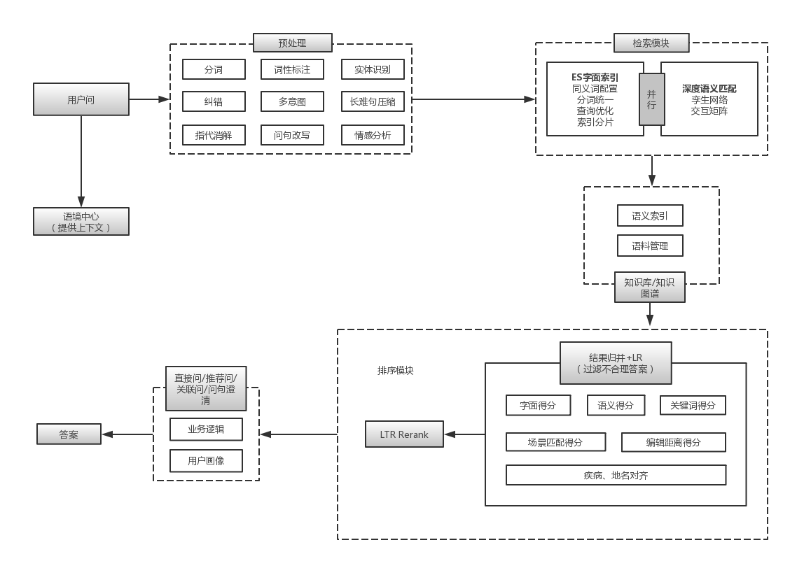


检索模块如果能完全命中语料库答案则直接返回，不在经过排序。

ES检索和深度语义匹配是比较粗比较弱的召回模型，不用考虑用户问内部的相对顺序，也不用考虑用户问与匹配问之间的位置编码，ngram信息。精排解决这些问题，且有更强的拟合性，但精排涉及到效率问题，所以在此之前有实体对齐过滤一些明显不对的答案。

回答不了的问题可以坐意图澄清或者转移到另一个问题。

借鉴推荐系统的思想：

1.粗排阶段根据用户长期兴趣画像召回相关度较高的答案，同时减轻精排阶段的压力 

2.精排阶段则根据粗排召回的答案列表，通过离线训练好的排序模型预测CTR,最终下发前Top N 个答案作为推荐结果。

### 18.5.3 如何处理长难句？


**长难句压缩**

    输入：“嗯你好，我之前06年的时候买了一个保险，嗯一年只交了518元，然后后面我就再也没有买了，是06年的事情，然后现在我打电话给那个服务热线吧，我想退保就是”
    
    输出：“我之前06年的时候买了保险，我想退保”
    
    输入：“一年半之前做过小腿骨折手术，现在已修复，只是固定钢板还没取，准备8月取，医生说也可以不取，不影响正常生活和工作，能否投保相互保？”
    
    输出：“做过腿骨折手术，不影响正常生活和工作，能否投保相互保？”


**传统处理方案**

- 语法树分析+关键词典

步骤：

1.通过标点或空格分割长句成若干个断句，然后对短句分类，去掉口水语句

2.基于概率和句法分析的句子压缩方案，只保留主谓宾等核心句子成分。配合特定的关键词典，确保关键词被保留。


**深度学习处理方案**

- 文本摘要和句子压缩主流方法：一种是抽取式（extractive），另一种是生成式（abstractive）

从传统的TextRank抽取式，到深度学习中采用RNN、CNN单元处理，再引入Attention、Self-Attention、机器生成摘要的方式，这些跟人类思维越来越像，都建立在对整段句子的理解之上，生成摘要的效果，常常让我们惊艳。

注意：TextRank算法对较短的文本效果不好。

### 18.5.4 如何纠错？

- **字典纠错：字典+规则，特定数据驱动型纠错**

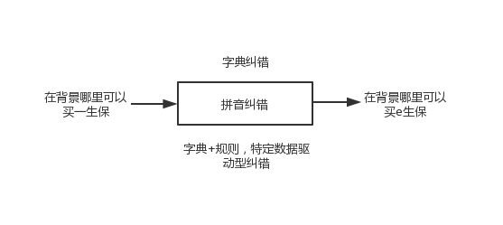

- **通用纠错模型：神经网络模型，其他纠错保底**


### 18.5.5 什么是指代消解？如何指代消解？

&emsp;&emsp;指代消解，广义上说，就是在篇章中确定代词指向哪个名词短语的问题。按照指向，可以分为回指和预指。回指就是代词的先行语在代词前面，预指就是代词的先行语在代词后面。按照指代的类型可以分为三类：人称代词、指示代词、有定描述、省略、部分－整体指代、普通名词短语。

1. 主谓关系SBV（subject-verb）
1. 状中结构ADV（adverbial）
1. 核心HED（head）
1. 动宾关系VOB（verb-object）
1. 标点 WP
1. nhd:疾病，v:动词，vn:名动词 ，nbx:自定义专有名词，rzv:谓词性指示代词

例子：

    输入1: 感冒/nhd 可以/v 投保/vn 相互保/nbx 吗/y？
    输入2: 那/rzv 癌症/nhd 呢/y？
    输出：癌症可以投保相互保吗？
    
    输入1:相互保很好
    输入2:这个产品比e生保好在哪？
    输出：相互保比e生保好在哪？
    
    输入1:相互保、e生保都是医疗险吗
    输入2:前者能报销啥 
    输出：相互保能报销啥
    
    输入1:相互保、e生保都是医疗险吗
    输入2:第一种能报销啥 
    输出：相互保能报销啥
    输入3:第二种呢 
    输出：e生保能报销啥

分析：

    感冒 --(SBV)--> 投保
    可以 --(ADV)--> 投保
    投保 --(HED)--> ##核心##
    相互保 --(VOB)--> 投保
    吗 --(RAD)--> 投保
    ？ --(WP)--> 投保

实现思路：

    分词->词性标注->依存句法分析->主谓宾提取->实体替换/指代消解

待消解项，先行语可通过句法分析找出。

### 18.5.6 如何做语义匹配？

- 孪生网络（Siamese network）

孪生神经网络是一类包含两个或更多个相同子网络的神经网络架构。 这里相同是指它们具有相同的配置即具有相同的参数和权重。 参数更新在两个子网上共同进行。 

孪生神经网络在涉及发现相似性或两个可比较的事物之间的关系的任务中流行。 一些例子是复述评分，其中输入是两个句子，输出是它们是多么相似的得分; 或签名验证，确定两个签名是否来自同一个人。 通常，在这样的任务中，使用两个相同的子网络来处理两个输入，并且另一个模块将取得它们的输出并产生最终输出。 下面的图片来自Bromley et al (1993)【11】。 他们为签名验证任务提出了一个孪生体系结构。 

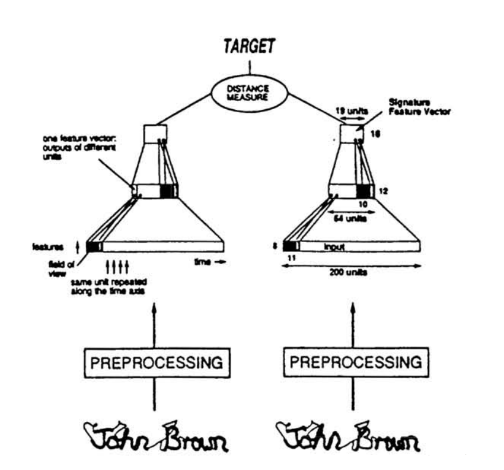

孪生结构之所以在这些任务中表现的比较好，有如下几个原因 ：

```
1.子网共享权重意味着训练需要更少的参数，也就意味着需要更少的数据并且不容易过拟合。

2.每个子网本质上产生其输入的表示。 （图片中的"签名特征向量"）。如果输入是相同类型的，例如匹配两个句子或匹配两个图片，使用类似的模型来处理类似的输入是有意义的。 这样，就有了具有相同语义的表示向量，使得它们更容易比较。
```

问题回答，一些最近的研究使用孪生体系结构来评分问题和答案候选人之间的相关性[2]。 所以一个输入是一个问句，另一个输入是一个答案，输出和问题的答案是相关的。 问题和答案看起来不完全相同，但如果目标是提取相似性或它们之间的联系，孪生体系结构也可以很好地工作。 

- 交互矩阵（MatchPyramid）【12】

对于文本匹配，基本思路如下述公式：
$$
match(T1,T2)=F(θ(T1),θ(T2))
$$
其中T为文本，函数θ代表将文本转换为对应的表示，函数F则代表两个文本表示之间的交互关系。
由侧重点不同可分为表示方法与交互方法，即注重θ或者F，而MatchPyramid应属于后一种。

基本方法：构建文本与文本的相似度矩阵，采用CNN对矩阵进行特征抽取，最后用softmax获得分类概率，评价方法为交叉熵。

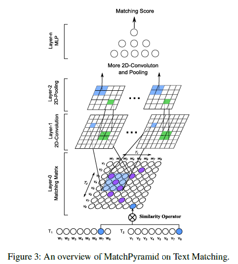

流程：

- [x] 相似度矩阵

由于CNN针对的是网格型数据，而文本显然属于序列数据，那么就有必要对数据进行转换，以下三种构建相似度矩阵的方法，其中距离矩阵使用点积的效果相对较好。

- 0-1类型，每个序列对应的词相同为1，不同为0

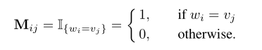


- cosine距离，使用预训练的Glove将词转为向量，之后计算序列对应的词的cosine距离

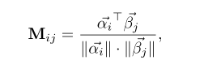

- 点积，同上，但是将cosine距离改为点积

  

- [x] 两层CNN


后续利用两层的CNN对相似度矩阵进行特征抽取，这里要注意的是由于上一层的相似度矩阵shape不一致，在第一层CNN后面进行maxpool的时候，要使用动态pool，有没有其他的小trick就不可得知了。

- [x] 两层MLP


最后用两层的全连接对CNN的结果进行转换，使用softmax函数得到最终分类概率。 

> 作者使用论文中的模型，在kaggle的quora数据集中得到一个相当不错的分数，最终小组成绩达到了第四名。
> 附实现地址：https://github.com/faneshion/MatchZoo

### 18.5.7 如何在海量的向量中查找相似的TopN向量？

- **Annoy搜索算法**

&emsp;&emsp;Annoy的目标是建立一个数据结构，使得查询一个点的最近邻点的时间复杂度是次线性。Annoy通过建立一个二叉树来使得每个点查找时间复杂度是O(log n)。 看下面这个图，随机选择两个点，以这两个节点为初始中心节点，执行聚类数为2的kmeans过程，最终产生收敛后两个聚类中心点。这两个聚类中心点之间连一条线段（灰色短线），建立一条垂直于这条灰线，并且通过灰线中心点的线（黑色粗线）。这条黑色粗线把数据空间分成两部分。在多维空间的话，这条黑色粗线可以看成等距垂直超平面。

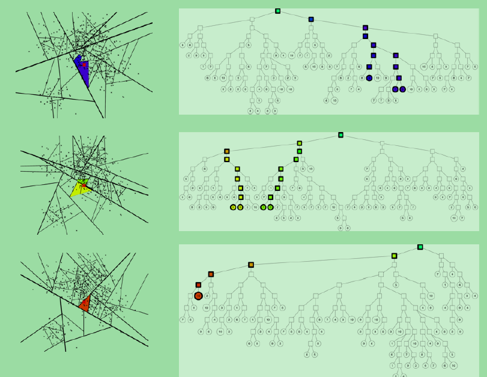

&emsp;&emsp;通过多次递归迭代划分的话，最终原始数据会形成类似下面这样一个二叉树结构。二叉树底层是叶子节点记录原始数据节点，其他中间节点记录的是分割超平面的信息。Annoy建立这样的二叉树结构是希望满足这样的一个假设: 相似的数据节点应该在二叉树上位置更接近，一个分割超平面不应该把相似的数据节点分割二叉树的不同分支上。

    总结：Annoy建立一个数据结构，使得查询一个向量的最近邻向量的时间复杂度是次线性
    
    步骤：随机选两个点聚类->超平面内分割->构造二叉树->构造多棵树->检索答案合并排序
    
    注意：第一次查询速度比较慢，是个近似算法，准确率逼近100%

### 18.5.8 什么是话术澄清？

&emsp;&emsp;问题有歧义或者匹配答案有置信度但不够高的时候触发话术澄清。简单来说，就是明确意图，意图不明确的时候可以反问用户以确认。


&emsp;&emsp;意图图谱的节点代表一个个意图节点。这些“意图”之间的关系包括需求澄清（disambiguation）、需求细化（depth extension）、需求横向延展（breadth extension ）等。在图所示例子中，当“阿拉斯加”的意思是“阿拉斯加州”时，与之关联的意图是城市、旅游等信息。当“阿拉斯加”的含义是“阿拉斯加犬”时，它延伸的意图是宠物狗、宠物狗护理，以及如何喂食等。

### 18.5.9 如何对结果进行排序打分？

-  **DRMM+PACRR**【13】

		**DRMM+PACRR**是针对文档相关性排序的新模型，这几种模型基于此前的DRMM模型。具体来说，DRMM 模型使用的是上下文无关的term encoding编码方式，改进模型则借鉴了PACRR的思想，融合了n-grams 和不同方式编码的上下文信息。

		Context-sensitive Term Encodings构造qd相似度矩阵，卷积提取ngram信息。
		
		两层max-pooling获取最强相似信息并拼接。
		
		使用相同的MLP网络独立地计算每一个q-term encoding（矩阵的每一行）的分数，再通过一个线性层得到query与doc的相关性得分 。

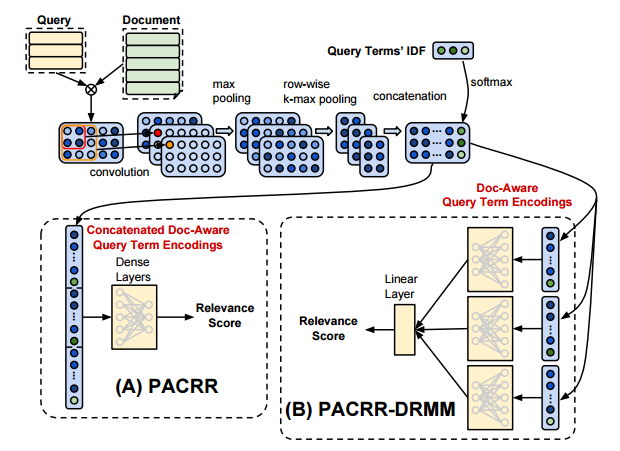

​	github地址：https://github.com/nlpaueb/deep-relevance-ranking

-  **N-grams**

		**N-grams**是机器学习中NLP处理中的一个较为重要的语言模型，常用来做句子相似度比较，模糊查询，以及句子合理性，句子矫正等。

		如果你是一个玩LOL的人，那么当我说“正方形打野”、“你是真的皮”，“你皮任你皮”这些词或词组时，你应该能想到的下一个词可能是“大司马”，而不是“五五开”。如果你不是LOL玩家，没关系，当我说“上火”、“金罐”这两个词，你能想到的下一个词应该更可能“加多宝”，而不是“可口可乐”。
	**N-grams**正是基于这样的想法，它的第一个特点是某个词的出现依赖于其他若干个词，第二个特点是我们获得的信息越多，预测越准确。我想说，我们每个人的大脑中都有一个N-gram模型，而且是在不断完善和训练的。我们的见识与经历，都在丰富着我们的阅历，增强着我们的联想能力。
	**N-grams**模型是一种语言模型（Language Model，LM），语言模型是一个基于概率的判别模型，它的输入是一句话（单词的顺序序列），输出是这句话的概率，即这些单词的联合概率（joint probability）。

		**N-grams中的概率计算**
		
		假设我们有一个有n个词组成的句子$S=(w1,w2,...,wn)$ , 如何衡量它的概率呢？让我们假设，每个单词$wi$都要依赖于从第一个单词$w1$到它之前一个单词$wi−1$的影响：
$$
p(S)=p(w1w2...wn)=p(w1)p(w2|w1)...p(wn|wn1...w2w1)
$$
这个衡量方法有两个缺陷：

- **参数空间过大**，概率$p(wn|wn-1...w2w1)$的参数有$O(n)$个。
- **数据稀疏严重**，词同时出现的情况可能没有，组合阶数高时尤其明显。 

为了解决第一个问题，我们引入**马尔科夫假设（Markov Assumption）**：**一个词的出现仅与它之前的若干个词有关**。 
$$
p(w1⋯wn)=∏p(wi∣wi−1⋯w1)≈∏p(wi∣wi−1⋯wi−N+1)
$$
如果一个词的出现仅依赖于它前面出现的一个词，那么我们就称之为 **Bi-gram**： 
$$
p(S)=p(w 
1
	
 w 
2
	
 ⋯w 
n
	
 )=p(w 
1
	
 )p(w 
2
	
 ∣w 
1
	
 )⋯p(w 
n
	
 ∣w 
n−1
	
 )
$$
如果一个词的出现仅依赖于它前面出现的两个词，那么我们就称之为 **Tri-gram**： 
$$
p(S)=p(w 
1
	
 w 
2
	
 ⋯w 
n
	
 )=p(w 
1
	
 )p(w 
2
	
 ∣w 
1
	
 )⋯p(w 
n
	
 ∣w 
n−1
	
 w 
n−2
	
 )
$$
N-gram的$N$可以取很高，然而现实中一般 bi-gram 和 tri-gram 就够用了。

那么，如何计算其中的每一项条件概率 $p(wn∣wn−1⋯w2w1) $答案是**极大似然估计（Maximum Likelihood Estimation，MLE）**，即数频数： 
$$
p(w 
n
	
 ∣w 
n−1
	
 )= 
C(w 
n−1
	
 )
C(w 
n−1
	
 w 
n
	
 )
$$

$$
p(w 
n
	
 ∣w 
n−1
	
 w 
n−2
	
 )= 
C(w 
n−2
	
 w 
n−1
	
 )
C(w 
n−2
	
 w 
n−1
	
 w 
n
	
 )
	
 
$$

$$
p(w 
n
	
 ∣w 
n−1
	
 ⋯w 
2
	
 w 
1
	
 )= 
C(w 
1
	
 w 
2
	
 ⋯w 
n−1
	
 )
C(w 
1
	
 w 
2
	
 ⋯w 
n
	
 )
	
 
$$

**具体地**，以Bi-gram为例，我们有这样一个由三句话组成的语料库： 

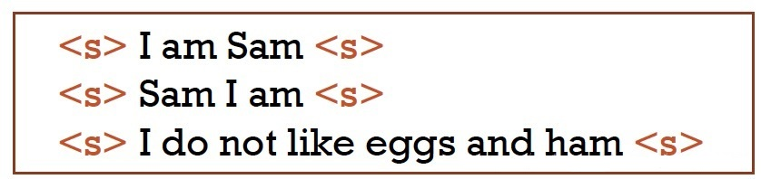

容易统计，“I”出现了3次，“I am”出现了2次，因此能计算概率： 
$$
p(am∣I)= 
3
2
$$
同理，还能计算出如下概率： 

$p(I∣<s>)=0.67p(do∣I)=0.33p(Sam∣am)=0.5p(not∣do)=1p(<s>∣Sam)=0.5p(like∣not)=1 $


### 18.5.10 如何评估人机交互系统的效果？

​	人机交互系统可通过有效问题数量、推荐Top1答案的准确率、推荐Top3答案的准确率、有效问题响应的准确率、知识覆盖率等指标衡量其效果。

|     类型     |        指标        | 收集方式收集方式 |
| :----------: | :----------------: | :--------------: |
| 问答评估指标 |     有效问题数     |   日志抽样统计   |
| 问答评估指标 |     Top1准确率     |   日志抽样统计   |
| 问答评估指标 |     Top3准确率     |   日志抽样统计   |
| 问答评估指标 | 有效问题响应准确率 |   日志抽样统计   |
| 问答评估指标 |     知识覆盖率     |   日志抽样统计   |

|   类型   |    指标指标    |                           计算公式                           | 指标用途 |  收集方式  |
| :------: | :------------: | :----------------------------------------------------------: | :------: | :--------: |
| 总体指标 |   请求量占比   |         FAQ、任务型、寒暄FAQ机器人的请求量/总请求量          |   运维   | 日志可得出 |
| 总体指标 |    总用户量    |              FAQ、任务型、寒暄引擎的独立访客数               |   运维   | 日志可得出 |
| 总体指标 |     解决率     | （点击解决button量+不点击）/FAQ咨询重量=1-点击未解决button量/FAQ总咨询量 |   分析   | 日志可得出 |
| 总体指标 |    未解决率    |             点击解决button/FAQ总咨询量=1-解决率              |   分析   | 日志可得出 |
| 总体指标 |    转人工率    |                   FAQ转人工量/FAQ总咨询量                    |   分析   | 日志可得出 |
| 总体指标 |   任务达成率   |                业务办理成功量/业务办理请求量                 |   分析   | 日志可得出 |
| 总体指标 |  平均会话时长  |               FAQ、任务、向量对话时长/总用户数               |   分析   | 日志可得出 |
| 总体指标 |  平均对话轮数  |                     总对话论数/总用户数                      |   分析   | 日志可得出 |
| 总体指标 |  断点问题分析  |                          转空客问题                          |   分析   | 日志可得出 |
| 总体指标 | 无应答问题分析 |                   机器人返回兜底话术的问题                   |   分析   | 日志可得出 |
| 总体指标 |  热点问题分析  |                       问题咨询总量TopN                       |   分析   | 日志可得出 |

## 18.6 如何设计个性化推荐系统？

### 18.6.1 什么是个性化推荐系统？

​	个性化推荐系统就是根据用户的历史，社交关系，兴趣点，上下文环境等信息去判断用户当前需要或潜在感兴趣的内容的一类应用。 

​	大数据时代，我们的生活的方方面面都出现了信息过载的问题：电子商务、电影或者视频网站、个性化音乐网络电台、社交网络、个性化阅读、基于位置的服务、个性化邮件、个性化广告.......逛淘宝、订外卖、听网络电台、看剧等等等。推荐系统在你不知不觉中将你感兴趣的内容推送给你，甚至有的时候，推荐系统比你本人更了解你自己。 

​	推荐系统的业务主要包括四个部分：

- 物料组装：生产广告，实现文案、图片等内容的个性化

- 物料召回：在大量内容中召回一个子集作为推荐的内容
- 物料排序：将召回的子集的内容按照某种标准进行精细排序
- 运营策略：加入一些运营策略进行一部分的重新排序，再下发内容

		​	推荐系统必须要实现收集与分析数据的功能。数据收集体现为：埋点、上报、存储。而数据分析则体现为：构造画像（用户与内容）、行为归因。 

	​	推荐系统的算法体现在两部分：**召回、排序**。召回的算法多种多样：itemCF、userCF、关联规则、embedding、序列匹配、同类型收集等等。排序的算法可以从多个角度来描述，这里我们从一个宏观的角度来描述，即排序算法可以分成五个部分：**构造样本、设计模型、确定目标函数、选择优化方法、评估**。 

### 18.6.2 如何设计个性化推荐系统的推荐引擎架构？

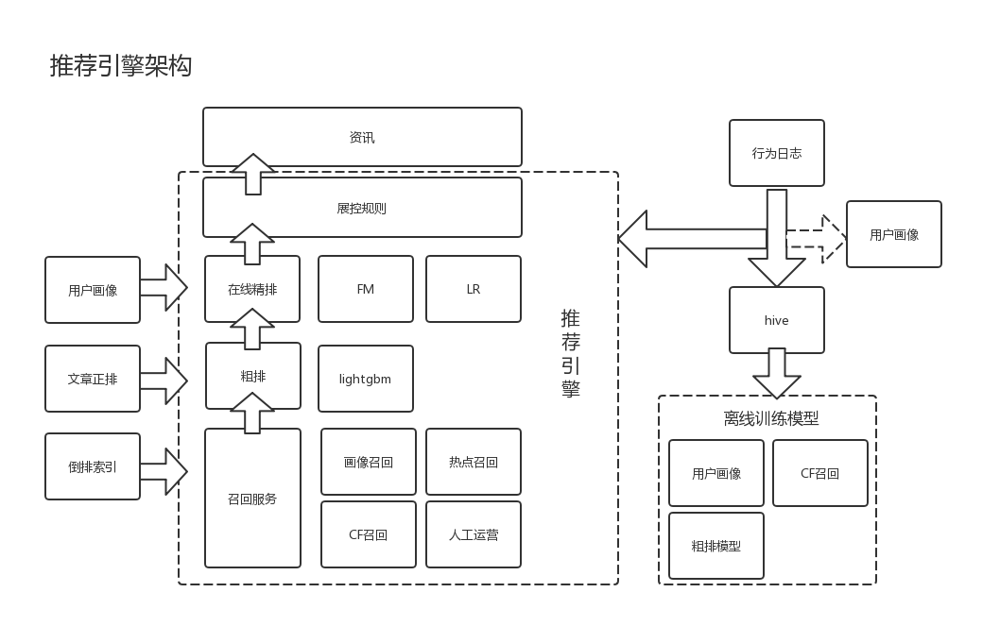

### 18.6.3 召回模块

- 热点召回和人工运营：兜底策略
- 用户画像（CB）召回：标签排序、倒排截取
- CF召回算法：user-based算法和item-based算法

- 如何做大规模在线用户CF召回？
  - 离线计算每个用户的相似用户top k，存入cache
  - 在线存储每个用户的点击记录
  - 在线检索相似用户点击记录

### 18.6.4 排序模块

- 模型选择：LR、FM、GBDT、DNN ...

| 复杂特征+简单模型                          | 简单特征+复杂模型    |
| ------------------------------------------ | -------------------- |
| 线性模型：LR                               | 非线性模型：GBDT,DNN |
| 训练快，解析性好                           | 表达能力强，起点高   |
| 在线预测简单                               | 训练慢，解析性差     |
| 人工构造大规模特征才能提升效果，后期难维护 | 容易过拟合，难优化   |

- 排序算法演进

  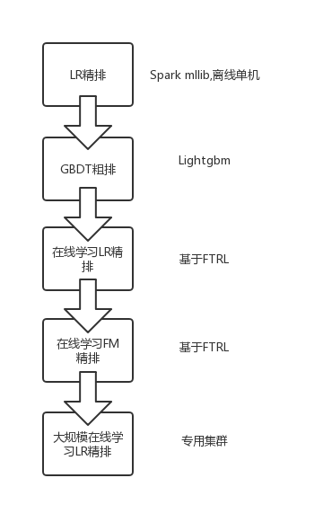

### 18.6.5 离线训练

- 离线训练流程

  

- 如何线上实时反馈特征？

  - 在线计算，与曝光日志一起上报，离线直接使用

- 如何解决曝光不足问题？

  - 使用CTR的贝叶斯平滑（CTR = 曝光次数 / 点击次数）【15】

    > - 所有新闻自身CTR(r)服从Beta分布:
    >
    >   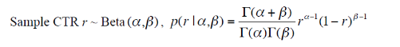
    >
    > - 某一新闻，给定展示次数时和自身CTR,点击次数服从伯努利分布，曝光次数为I,点击次数为C:
    >
    >   
    >
    > - 对最大似然函数求解参数α，β，则i新闻CTR后验估计：
    >
    >   
    >
    > - 对曝光不足的做平滑，曝光充分的影响不大

### 18.6.6 用户画像

- 用户标签
- 统计方法
  - 用户feeds内行为，标签 计数（点击率），缺点：无法加入更多特征，不方便后续优化

- 基于机器学习的方法
  - 对用户长期兴趣建模
  - LR模型
  - 用户标签作为特征

### 18.6.7 GBDT粗排

- 为什么需要粗排？
  - 快速筛选高质量的候选集
  - 方便利用在线实时反馈特征
- 如何做粗排的特征设计？
  - 特征要相对稠密
- 如何选择合适的算法模型？
  - lightgbm
  - xgboost
  - lightgbm比xgboot速度更快；在线预测时，线程更安全

### 18.6.8 在线FM精排

- 为什么需要在线学习？

  - feeds内容更新快
  - 用户兴趣会随时间变化
  - 排序模型需要快速反应用户的兴趣变化

- **FM模型**

  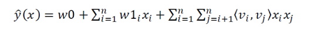
  $$
  
  $$

  $$
  𝜎(𝑦)=1/(1+exp⁡(−𝑦))
  $$

- **采用FTRL(Follow The Regularized Leader)更新模型**

  - 算法概述 

    ​	FTRL是一种适用于处理超大规模数据的,含大量稀疏特征的在线学习的常见优化算法，方便实用，而且效果很好，常用于更新在线的CTR预估模型。

    　　FTRL算法兼顾了FOBOS和RDA两种算法的优势，既能同FOBOS保证比较高的精度，又能在损失一定精度的情况下产生更好的稀疏性。

    　　FTRL在处理带非光滑正则项（如L1正则）的凸优化问题上表现非常出色，不仅可以通过L1正则控制模型的稀疏度，而且收敛速度快。

  - 算法要点与推导 

    

  - 算法特性及优缺点 

    ​	在线学习，实时性高；可以处理大规模稀疏数据；有大规模模型参数训练能力；根据不同的特征特征学习率 。

    ​	FTRL-Proximal工程实现上的tricks：

    　　1.saving memory

    ```
    　	方案1）Poisson Inclusion：对某一维度特征所来的训练样本，以p的概率接受并更新模型。
    　	方案2）Bloom Filter Inclusion：用bloom filter从概率上做某一特征出现k次才更新。
    ```

    　　2.浮点数重新编码

    ```
    	1）特征权重不需要用32bit或64bit的浮点数存储，存储浪费空间。
    	2）16bit encoding，但是要注意处理rounding技术对regret带来的影响(注：python可以尝试用numpy.float16格式)
    ```

    　　3.训练若干相似model

    ```
    	1）对同一份训练数据序列，同时训练多个相似的model。
    	2）这些model有各自独享的一些feature，也有一些共享的feature。
    	3）出发点：有的特征维度可以是各个模型独享的，而有的各个模型共享的特征，可以用同样的数据训练。
    ```

    　　4.Single Value Structure

    ```
    	1）多个model公用一个feature存储（例如放到cbase或redis中），各个model都更新这个共有的feature结构。
    	2）对于某一个model，对于他所训练的特征向量的某一维，直接计算一个迭代结果并与旧值做一个平均。
    ```

    　　5.使用正负样本的数目来计算梯度的和（所有的model具有同样的N和P）

     　　   

    　　6.subsampling Training Data

    ```
    	1）在实际中，CTR远小于50%，所以正样本更加有价值。通过对训练数据集进行subsampling，可以大大减小训练数据集的大小。
    	2）正样本全部采（至少有一个广告被点击的query数据），负样本使用一个比例r采样（完全没有广告被点击的query数据）。但是直接在这种采样上进行训练，会导致比较大的biased prediction。
    	3）解决办法：训练的时候，对样本再乘一个权重。权重直接乘到loss上面，从而梯度也会乘以这个权重。
    ```

  - 适合场景

    点击率模型 

  - 案例

    [https://www.kaggle.com/jiweiliu/ftrl-starter-code/output]()

    https://github.com/Angel-ML/angel/blob/master/docs/algo/ftrl_lr_spark.md

- 如何选择精排特征？

  - 新增特征需保证已有特征索引不变
  - 定期离线训练淘汰无用特征，防止特征无线膨胀
  - 使用GBDT粗排预测的CTR分段结果作为特征

### 18.6.9 算法介绍

- 协同过滤算法

  ​	协同过滤(Collaborative filtering, CF)算法是目前个性化推荐系统比较流行的算法之一。

  ​	协同算法分为两个基本算法：**基于用户的协同过滤（UserCF）和基于项目的协同过滤（ItemCF）。** 

  

- 基于属性的推荐算法

  - 基于用户标签的推荐

    ​	统计用户最常用的标签，对于每个标签，统计被打过这个标签次数最多的物品，然后将具有这些标签的最热门的物品推荐给这个用户。这个方法非常适合新用户或者数据很少的冷启动，目前许多的app都会在新用户最初进入时让用户添加喜好标签方便为用户推送内容。 

  - 基于商品内容的推荐算法

    ​	利用商品的内容属性计算商品之间的相似度，是物推物的算法。这种算法不依赖用户行为，只要获取到item的内容信息就可以计算语义级别上的相似性，不存在iterm冷启动问题。缺点就是不是所有iterm都可以非常容易的抽取成有意义的特征，而且中文一词多义和一义多词的复杂性也是需要攻克的一个难题。

- 基于矩阵分解的推荐算法

  ​	原理：根据已有的评分矩阵（非常稀疏），分解为低维的用户特征矩阵（评分者对各个因子的喜好程度）以及商品特征矩阵（商品包含各个因子的程度），最后再反过来分析数据（用户特征矩阵与商品特征矩阵相乘得到新的评分矩阵）得出预测结果；这是一个非常优雅的推荐算法，因为当涉及到矩阵分解时，我们通常不会太多地去思考哪些项目将停留在所得到矩阵的列和行中。但是使用这个推荐引擎，我们清楚地看到，u是第i个用户的兴趣向量，v是第j个电影的参数向量。

  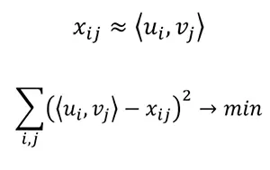

  ​	所以我们可以用u和v的点积来估算x(第i个用户对第j个电影的评分)。我们用已知的分数构建这些向量，并使用它们来预测未知的得分。

  ​	例如，在矩阵分解之后，Ted的向量是(1.4; .8)，电影A的向量是(1.4; .9)，现在，我们可以通过计算(1.4; .8)和(1.4; .9)的点积，来还原电影A-Ted的得分。结果，我们得到2.68分。

   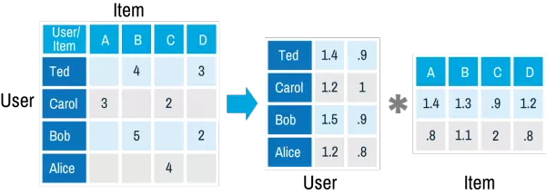

- 基于热门内容的推荐算法

  ​	为用户推荐流行度高的物品，或者说新热物品。例如最近北方天气突然降温，一大堆用户开始在淘宝搜索购买大衣或者羽绒服，淘宝就会为北方用户推荐大衣。55度杯新出时，所有人都会搜索购买，然后用户的瀑布流中就会出现55度杯。流行度算法很好的解决冷启动问题，但推荐的物品有限，不能很好的命中用户的兴趣点；其推荐列表通常会作为候补列表推荐给用户；在微博、新闻等产品推荐时是常用的方法。基本流程就是：确定物品的流行周期，计算物品在流行周期内的流行度，流行度高的物品作为被推荐的物品。

### 18.6.10 如何评价个性化推荐系统的效果？

- **准确率与召回率（Precision & Recall）**

&emsp;&emsp;准确率和召回率是广泛用于信息检索和统计学分类领域的两个度量值，用来评价结果的质量。其中精度是检索出相关文档数与检索出的文档总数的比率，衡量的是检索系统的查准率；召回率是指检索出的相关文档数和文档库中所有的相关文档数的比率，衡量的是检索系统的查全率。


&emsp;&emsp;一般来说，Precision就是检索出来的条目（比如：文档、网页等）有多少是准确的，Recall就是所有准确的条目有多少被检索出来了。

&emsp;&emsp;正确率、召回率和 F 值是在鱼龙混杂的环境中，选出目标的重要评价指标。不妨看看这些指标的定义先：

	正确率 = 提取出的正确信息条数 /  提取出的信息条数 
	
	召回率 = 提取出的正确信息条数 /  样本中的信息条数    

&emsp;&emsp;两者取值在0和1之间，数值越接近1，查准率或查全率就越高。   

	F值  = 正确率 * 召回率 * 2 / (正确率 + 召回率) （F 值即为正确率和召回率的调和平均值）

&emsp;&emsp;不妨举这样一个例子：某池塘有1400条鲤鱼，300只虾，300只鳖。现在以捕鲤鱼为目的。撒一大网，逮着了700条鲤鱼，200只虾，100只鳖。那么，这些指标分别如下：

	正确率 = 700 / (700 + 200 + 100) = 70%
	
	召回率 = 700 / 1400 = 50%
	
	F值 = 70% * 50% * 2 / (70% + 50%) = 58.3%

&emsp;&emsp;不妨看看如果把池子里的所有的鲤鱼、虾和鳖都一网打尽，这些指标又有何变化：

	正确率 = 1400 / (1400 + 300 + 300) = 70%
	
	召回率 = 1400 / 1400 = 100%
	
	F值 = 70% * 100% * 2 / (70% + 100%) = 82.35%        

&emsp;&emsp;由此可见，正确率是评估捕获的成果中目标成果所占得比例；召回率，顾名思义，就是从关注领域中，召回目标类别的比例；而F值，则是综合这二者指标的评估指标，用于综合反映整体的指标。

&emsp;&emsp;当然希望检索结果Precision越高越好，同时Recall也越高越好，但事实上这两者在某些情况下有矛盾的。比如极端情况下，我们只搜索出了一个结果，且是准确的，那么Precision就是100%，但是Recall就很低；而如果我们把所有结果都返回，那么比如Recall是100%，但是Precision就会很低。因此在不同的场合中需要自己判断希望Precision比较高或是Recall比较高。如果是做实验研究，可以绘制Precision-Recall曲线来帮助分析。

​	**注意：准确率和召回率是互相影响的，理想情况下肯定是做到两者都高，但是一般情况下准确率高、召回率就低，召回率低、准确率高，当然如果两者都低，那是什么地方出问题了**。一般情况，用不同的阀值，统计出一组不同阀值下的精确率和召回率，如下图： 

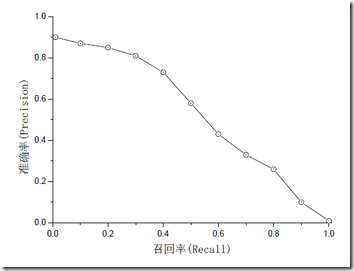

**如果是做搜索，那就是保证召回的情况下提升准确率；如果做疾病监测、反垃圾，则是保准确率的条件下，提升召回。**

所以，在两者都要求高的情况下，可以用F1值来衡量。

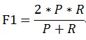

公式基本上就是这样，但是如何算图中的A、B、C、D呢？**这需要人工标注，人工标注数据需要较多时间且枯燥，如果仅仅是做实验可以用用现成的语料。当然，还有一个办法，找个一个比较成熟的算法作为基准，用该算法的结果作为样本来进行比照**，这个方法也有点问题，如果有现成的很好的算法，就不用再研究了。 

- **综合评价指标（F-Measure）**

&emsp;&emsp;P和R指标有时候会出现的矛盾的情况，这样就需要综合考虑他们，最常见的方法就是F-Measure（又称为F-Score）。

&emsp;&emsp;F-Measure是Precision和Recall加权调和平均：


&emsp;&emsp;当参数α=1时，就是最常见的F1，也即


&emsp;&emsp;可知F1综合了P和R的结果，当F1较高时则能说明试验方法比较有效。

- **E值**

&emsp;&emsp;E值表示查准率P和查全率R的加权平均值，当其中一个为0时，E值为1，其计算公式：

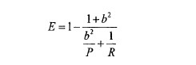

&emsp;&emsp;b越大，表示查准率的权重越大。

- **平均正确率（Average Precision）**

  &emsp;&emsp;平均正确率表示不同查全率的点上的正确率的平均。

- **AP和mAP(mean Average Precision)** 

  ​	mAP是为解决P（准确率），R（召回率），F-measure的单点值局限性的。为了得到 一个能够反映全局性能的指标，可以看考察下图，其中两条曲线(方块点与圆点)分布对应了两个检索系统的准确率-召回率曲线 。

  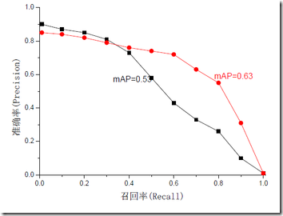

  ​	可以看出，虽然两个系统的性能曲线有所交叠但是以圆点标示的系统的性能在绝大多数情况下要远好于用方块标示的系统。

  ​	从中我们可以 发现一点，如果一个系统的性能较好，其曲线应当尽可能的向上突出。

  ​	更加具体的，曲线与坐标轴之间的面积应当越大。

  ​	最理想的系统， 其包含的面积应当是1，而所有系统的包含的面积都应当大于0。这就是用以评价信息检索系统的最常用性能指标，平均准确率mAP其规范的定义如下:

  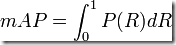

- **ROC和AUC** 

  ​	ROC和AUC是评价分类器的指标，上面第一个图的ABCD仍然使用，只是需要稍微变换。 

  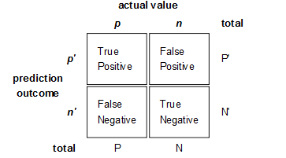

  ROC关注两个指标

  ```
   True  Positive Rate( TPR ) = TP / [ TP + FN] ，TPR代表能将正例分对的概率
   False Positive Rate( FPR ) = FP / [ FP + TN] ，FPR代表将负例错分为正例的概率
  ```

  ​	在ROC 空间中，每个点的横坐标是FPR，纵坐标是TPR，这也就描绘了分类器在TP（真正的正例）和FP（错误的正例）间的trade-off。ROC的主要分析工具是一个画在ROC空间的曲线——ROC curve。我们知道，对于二值分类问题，实例的值往往是连续值，我们通过设定一个阈值，将实例分类到正类或者负类（比如大于阈值划分为正类）。因此我们可以变化阈值，根据不同的阈值进行分类，根据分类结果计算得到ROC空间中相应的点，连接这些点就形成ROC curve。ROC curve经过（0,0）（1,1），实际上(0, 0)和(1, 1)连线形成的ROC curve实际上代表的是一个随机分类器。一般情况下，这个曲线都应该处于(0, 0)和(1, 1)连线的上方。如图所示。 

  

  ​	用ROC curve来表示分类器的performance很直观好用。可是，人们总是希望能有一个数值来标志分类器的好坏。

  ​	于是**Area Under roc Curve(AUC)**就出现了。顾名思义，AUC的值就是处于ROC curve下方的那部分面积的大小。通常，AUC的值介于0.5到1.0之间，较大的AUC代表了较好的Performance。

  ​	AUC计算工具：<http://mark.goadrich.com/programs/AUC/>

  ​	**P/R和ROC是两个不同的评价指标和计算方式，一般情况下，检索用前者，分类、识别等用后者。**

  

### 18.6.11 个性化推荐系统案例分析

​	在过去的十年中，神经网络已经取得了巨大的飞跃。如今，神经网络已经得以广泛应用，并逐渐取代传统的机器学习方法。 接下来，我要介绍一下YouTube如何使用深度学习方法来做个性化推荐。 

​	由于体量庞大、动态库和各种观察不到的外部因素，为YouTube用户提供推荐内容是一项非常具有挑战性的任务。 

​	*YouTube的推荐系统算法由两个神经网络组成：一个用于候选生成，一个用于排序。如果你没时间仔细研究论文，可以看看我们下面给出的简短总结。* 【14】

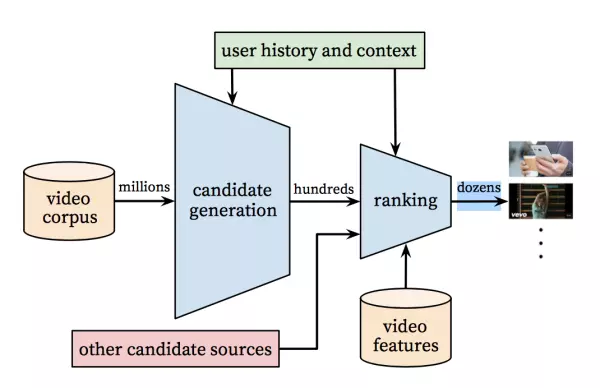

​	以用户的浏览历史为输入，候选生成网络可以显著减小可推荐的视频数量，从庞大的库中选出一组最相关的视频。这样生成的候选视频与用户的相关性最高，然后我们会对用户评分进行预测。

​	这个网络的目标，只是通过协同过滤提供更广泛的个性化。

​	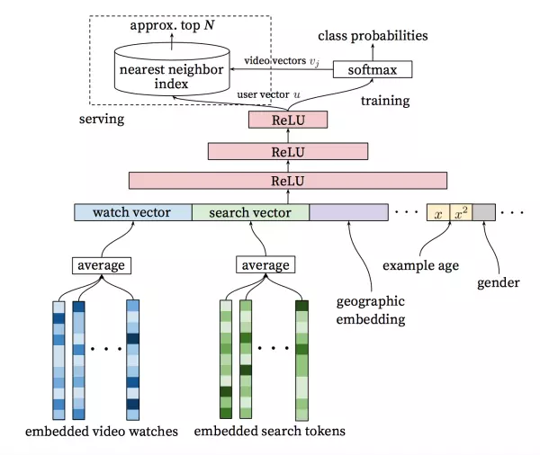

​	进行到这一步，我们得到一组规模更小但相关性更高的内容。我们的目标是仔细分析这些候选内容，以便做出最佳的选择。

​	这个任务由排序网络完成。

​	所谓排序就是根据视频描述数据和用户行为信息，使用设计好的目标函数为每个视频打分，得分最高的视频会呈献给用户。

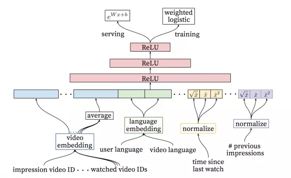

​	通过这两步，我们可以从非常庞大的视频库中选择视频，并面向用户进行有针对性的推荐。这个方法还能让我们把其他来源的内容也容纳进来。 

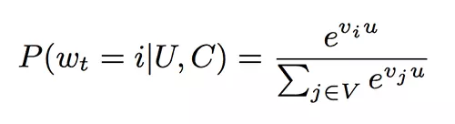

​	推荐任务是一个极端的多类分类问题。这个预测问题的实质，是基于用户(U)和语境(C)，在给定的时间t精确地从库(V)中上百万的视频类(i)中，对特定的视频观看(Wt)情况进行分类。 

## 18.7 参考文献

【1】http://www.paddlepaddle.org/documentation/book/zh/0.11.0/05.recommender_system/index.cn.html

【2】https://deeplearning4j.org/cn/compare-dl4j-torch7-pylearn.html

【3】http://mahout.apache.org/

【4】http://spark.apache.org/docs/1.1.0/mllib-guide.html

【5】https://ray.readthedocs.io/en/latest/tutorial.html

【6】http://spark.apache.org/streaming/

【7】https://github.com/uber/horovod

【8】https://software.intel.com/en-us/articles/bigdl-distributed-deep-learning-on-apache-spark

【9】https://eng.uber.com/petastorm/

【10】https://yahoo.github.io/TensorFlowOnSpark/

【11】https://papers.nips.cc/paper/769-signature-verification-using-a-siamese-time-delay-neural-network.pdf

【12】https://arxiv.org/pdf/1602.06359.pdf

【13】http://www2.aueb.gr/users/ion/docs/emnlp2018.pdf

【14】http://link.zhihu.com/?target=https://static.googleusercontent.com/media/research.google.com/ru//pubs/archive/45530.pdf

【15】http://www.cs.cmu.edu/afs/cs/Web/People/xuerui/papers/ctr.pdf

 ....

 未完待续！

 
