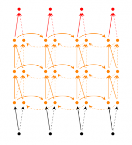

# 第六章 循环神经网络(RNN)

    Markdown Revision 2;
    Date: 2018/11/07
    Editor: 李骁丹-杜克大学
    Contact: xiaodan.li@duke.edu
    
    Markdown Revision 1;
    Date: 2018/10/26
    Editor: 杨国峰-中国农业科学院
    Contact: tectalll@gmail.com

http://blog.csdn.net/heyongluoyao8/article/details/48636251

## 6.1 RNNs和FNNs有什么区别？

1. 不同于传统的前馈神经网络(FNNs)，RNNs引入了定向循环，能够处理输入之间前后关联问题。
2. RNNs可以记忆之前步骤的训练信息。
**定向循环结构如下图所示**：

## 6.2 RNNs典型特点？

1. RNNs主要用于处理序列数据。对于传统神经网络模型，从输入层到隐含层再到输出层，层与层之间一般为全连接，每层之间神经元是无连接的。但是传统神经网络无法处理数据间的前后关联问题。例如，为了预测句子的下一个单词，一般需要该词之前的语义信息。这是因为一个句子中前后单词是存在语义联系的。
2. RNNs中当前单元的输出与之前步骤输出也有关，因此称之为循环神经网络。具体的表现形式为当前单元（cell）会对之前步骤信息进行储存并应用于当前输出的计算中。隐藏层之间的节点连接起来，隐藏层当前输出由当前时刻输入向量和之前时刻隐藏层状态共同决定。
3. 理论上，RNNs能够对任何长度序列数据进行处理。但是在实践中，为了降低复杂度往往假设当前的状态只与之前某几个时刻状态相关，**下图便是一个典型的RNNs**：

输入单元(Input units)：输入集$\bigr\{x_0,x_1,...,x_t,x_{t+1},...\bigr\}$，

输出单元(Output units)：输出集$\bigr\{y_0,y_1,...,y_t,y_{y+1},...\bigr\}$，

隐藏单元(Hidden units)：输出集$\bigr\{s_0,s_1,...,s_t,s_{t+1},...\bigr\}$。

**图中信息传递特点：**

1. 一条单向流动的信息流是从输入单元到隐藏单元。
2. 一条单向流动的信息流从隐藏单元到输出单元。
3. 在某些情况下，RNNs会打破后者的限制，引导信息从输出单元返回隐藏单元，这些被称为“Back Projections”。
4. 在某些情况下，隐藏层的输入还包括上一时刻隐藏层的状态，即隐藏层内的节点可以自连也可以互连。 
5. 当前单元（cell）输出是由当前时刻输入和上一时刻隐藏层状态共同决定。

## 6.3 RNNs能干什么？

RNNs在自然语言处理领域取得了巨大成功，如词向量表达、语句合法性检查、词性标注等。在RNNs及其变型中，目前使用最广泛最成功的模型是LSTMs(Long Short-Term Memory，长短时记忆模型)模型，该模型相比于RNNs，能够更好地对长短时依赖进行描述。

## 6.4 RNNs在NLP中典型应用？
**（1）语言模型与文本生成(Language Modeling and Generating Text)**

给定一组单词序列，需要根据前面单词预测每个单词出现的可能性。语言模型能够评估某个语句正确的可能性，可能性越大，语句越正确。另一种应用便是使用生成模型预测下一个单词的出现概率，从而利用输出概率的采样生成新的文本。

**（2）机器翻译(Machine Translation)**

机器翻译是将一种源语言语句变成意思相同的另一种源语言语句，如将英语语句变成同样意思的中文语句。与语言模型关键的区别在于，需要将源语言语句序列输入后，才进行输出，即输出第一个单词时，便需要从完整的输入序列中进行获取。

**（3）语音识别(Speech Recognition)**

语音识别是指给定一段声波的声音信号，预测该声波对应的某种指定源语言语句以及计算该语句的概率值。 

**（4）图像描述生成 (Generating Image Descriptions)**

同卷积神经网络(convolutional Neural Networks, CNNs)一样，RNNs已经在对无标图像描述自动生成中得到应用。CNNs与RNNs结合也被应用于图像描述自动生成。

## 6.5 RNNs训练和传统ANN训练异同点？

**相同点**：
1. RNNs与传统ANN都使用BP（Back Propagation）误差反向传播算法。

**不同点**：

1. RNNs网络参数W,U,V是共享的，而传统神经网络各层参数间没有直接联系。
2. 对于RNNs，在使用梯度下降算法中，每一步的输出不仅依赖当前步的网络，还依赖于之前若干步的网络状态。

## 6.6 常见的RNNs扩展和改进模型

### 6.6.1 Simple RNNs(SRNs)

1. SRNs是RNNs的一种特例，它是一个三层网络，其在隐藏层增加了上下文单元。下图中的**y**是隐藏层，**u**是上下文单元。上下文单元节点与隐藏层中节点的连接是固定的，并且权值也是固定的。上下文节点与隐藏层节点一一对应，并且值是确定的。
2. 在每一步中，使用标准的前向反馈进行传播，然后使用学习算法进行学习。上下文每一个节点保存其连接隐藏层节点上一步输出，即保存上文，并作用于当前步对应的隐藏层节点状态，即隐藏层的输入由输入层的输出与上一步的自身状态所决定。因此SRNs能够解决标准多层感知机(MLP)无法解决的对序列数据进行预测的问题。 
**SRNs网络结构如下图所示**：

### 6.6.2 Bidirectional RNNs

Bidirectional RNNs(双向网络)将两层RNNs叠加在一起，当前时刻输出(第t步的输出)不仅仅与之前序列有关，还与之后序列有关。例如：为了预测一个语句中的缺失词语，就需要该词汇的上下文信息。Bidirectional RNNs是一个相对较简单的RNNs，是由两个RNNs上下叠加在一起组成的。输出由前向RNNs和后向RNNs共同决定。**如下图所示**：

### 6.6.3 Deep RNNs

Deep RNNs与Bidirectional RNNs相似，其也是又多层RNNs叠加，因此每一步的输入有了多层网络。该网络具有更强大的表达与学习能力，但是复杂性也随之提高，同时需要更多的训练数据。**Deep RNNs的结构如下图所示**：

### 6.6.4 Echo State Networks（ESNs）
ESNs(回声状态网络)虽然也是一种RNNs，但它与传统的RNNs相差较大。

**ESNs具有三个特点**：

1. 它的核心结构为一个随机生成、且保持不变的储备池(Reservoir)。储备池是大规模随机生成稀疏连接(SD通常保持1%～5%，SD表示储备池中互相连接的神经元占总神经元个数N的比例)的循环结构；

2. 从储备池到输出层的权值矩阵是唯一需要调整的部分；

3. 简单的线性回归便能够完成网络训练；

从结构上讲，ESNs是一种特殊类型的循环神经网络，其基本思想是：使用大规模随机连接的循环网络取代经典神经网络中的中间层，从而简化网络的训练过程。因此ESNs的关键是储备池。
网络中的参数包括：
（1）W - 储备池中节点间连接权值矩阵；
（2）Win - 输入层到储备池之间连接权值矩阵，表明储备池中的神经元之间是相互连接；
（3）Wback - 输出层到储备池之间的反馈连接权值矩阵，表明储备池会有输出层来的反馈；
（4）Wout - 输入层、储备池、输出层到输出层的连接权值矩阵，表明输出层不仅与储备池连接，还与输入层和自己连接。
Woutbias - 输出层的偏置项。 
对于ESNs，关键是储备池的四个参数，如储备池内部连接权谱半径SR(SR=λmax=max{|W的特征指|}，只有SR <1时，ESNs才能具有回声状态属性)、储备池规模N(即储备池中神经元的个数)、储备池输入单元尺度IS(IS为储备池的输入信号连接到储备池内部神经元之前需要相乘的一个尺度因子)、储备池稀疏程度SD(即为储备池中互相连接的神经元个数占储备池神经元总个数的比例)。对于IS，待处理任务的非线性越强，输入单元尺度越大。该原则本质就是通过输入单元尺度IS，将输入变换到神经元激活函数相应的范围(神经元激活函数的不同输入范围，其非线性程度不同)。
**ESNs的结构如下图所示**：

### 6.6.5 Gated Recurrent Unit Recurrent Neural Networks
GRUs是一般的RNNs的变型版本，其主要是从以下**两个方面**进行改进。

1. 序列中不同单词处（以语句为例）的数据对当前隐藏层状态的影响不同，越前面的影响越小，即每个之前状态对当前的影响进行了距离加权，距离越远，权值越小。

2. 在产生误差error时，其可能是由之前某一个或者几个单词共同造成，所以应当对对应的单词weight进行更新。GRUs的结构如下图所示。GRUs首先根据当前输入单词向量word vector以及前一个隐藏层状态hidden state计算出update gate和reset gate。再根据reset gate、当前word vector以及前一个hidden state计算新的记忆单元内容(new memory content)。当reset gate为1的时候，new memory content忽略之前所有memory content，最终的memory是由之前的hidden state与new memory content一起决定。

### 6.6.6 LSTM Netwoorks
1. LSTMs是当前一种非常流行的深度学习模型。为了解决RNNs存在的长时记忆问题，LSTMs利用了之前更多步的训练信息。
2. LSTMs与一般的RNNs结构本质上并没有太大区别，只是使用了不同函数控制隐藏层的状态。
3. 在LSTMs中，基本结构被称为cell，可以把cell看作是黑盒用以保存当前输入之前Xt的隐藏层状态ht−1。
4. LSTMs有三种类型的门：遗忘门（forget gate）, 输入门（input gate）以及输出门（output gate）。遗忘门（forget gate）是用来决定 哪个cells的状态将被丢弃掉。输入门（input gate）决定哪些cells会被更新. 输出门（output gate）控制了结果输出. 因此当前输出依赖于cells状态以及门的过滤条件。实践证明，LSTMs可以有效地解决长序列依赖问题。**LSTMs的网络结构如下图所示**。

LSTMs与GRUs的区别如图所示：

从上图可以看出，二者结构十分相似，**不同在于**：

1. new memory都是根据之前state及input进行计算，但是GRUs中有一个reset gate控制之前state的进入量，而在LSTMs里没有类似gate；

2. 产生新的state的方式不同，LSTMs有两个不同的gate，分别是forget gate (f gate)和input gate(i gate)，而GRUs只有一种update gate(z gate)；

3. LSTMs对新产生的state可以通过output gate(o gate)进行调节，而GRUs对输出无任何调节。

### 6.6.7 Bidirectional LSTMs
1. 与bidirectional RNNs 类似，bidirectional LSTMs有两层LSTMs。一层处理过去的训练信息，另一层处理将来的训练信息。
2. 在bidirectional LSTMs中，通过前向LSTMs获得前向隐藏状态，后向LSTMs获得后向隐藏状态，当前隐藏状态是前向隐藏状态与后向隐藏状态的组合。

### 6.6.8 Stacked LSTMs
1. 与deep rnns 类似，stacked LSTMs 通过将多层LSTMs叠加起来得到一个更加复杂的模型。
2. 不同于bidirectional LSTMs，stacked LSTMs只利用之前步骤的训练信息。 

### 6.6.9 Clockwork RNNs(CW-RNNs)
CW-RNNs是较新的一种RNNs模型，该模型首次发表于2014年Beijing ICML。
CW-RNNs是RNNs的改良版本，其使用时钟频率来驱动。它将隐藏层分为几个块(组，Group/Module)，每一组按照自己规定的时钟频率对输入进行处理。为了降低RNNs的复杂度，CW-RNNs减少了参数数量，并且提高了网络性能，加速网络训练。CW-RNNs通过不同隐藏层模块在不同时钟频率下工作来解决长时依赖问题。将时钟时间进行离散化，不同的隐藏层组将在不同时刻进行工作。因此，所有的隐藏层组在每一步不会全部同时工作，这样便会加快网络的训练。并且，时钟周期小组的神经元不会连接到时钟周期大组的神经元，只允许周期大的神经元连接到周期小的(组与组之间的连接以及信息传递是有向的)。周期大的速度慢，周期小的速度快，因此是速度慢的神经元连速度快的神经元，反之则不成立。

CW-RNNs与SRNs网络结构类似，也包括输入层(Input)、隐藏层(Hidden)、输出层(Output)，它们之间存在前向连接，输入层到隐藏层连接，隐藏层到输出层连接。但是与SRN不同的是，隐藏层中的神经元会被划分为若干个组，设为$g$，每一组中的神经元个数相同，设为$k$，并为每一个组分配一个时钟周期$T_i\epsilon\{T_1,T_2,...,T_g\}$，每一组中的所有神经元都是全连接，但是组$j$到组$i$的循环连接则需要满足$T_j$大于$T_i$。如下图所示，将这些组按照时钟周期递增从左到右进行排序，即$T_1<T_2<...<T_g$，那么连接便是从右到左。例如：隐藏层共有256个节点，分为四组，周期分别是[1,2,4,8]，那么每个隐藏层组256/4=64个节点，第一组隐藏层与隐藏层的连接矩阵为64$\times$64的矩阵，第二层的矩阵则为64$\times$128矩阵，第三组为64$\times$(3$\times$64)=64$\times$192矩阵，第四组为64$\times$(4$\times$64)=64$\times$256矩阵。这就解释了上一段中速度慢的组连接到速度快的组，反之则不成立。

**CW-RNNs的网络结构如下图所示**：

### 6.6.10 CNN-LSTMs
1. 为了同时利用CNN以及LSTMs的优点，CNN-LSTMs被提出。在该模型中，CNN用于提取对象特征，LSTMs用于预测。CNN由于卷积特性，其能够快速而且准确地捕捉对象特征。LSTMs的优点在于能够捕捉数据间的长时依赖性。
